# 代数：第0章

先机翻的，我会边学边校正其中的翻译错误。

代数：第0章是一本独立的入门教材，主要面向研究生初阶或高年级本科生。与标准代数教材相比，本书的主要特色是早期引入范畴论，将其作为贯穿主要主题的统一主题。第二个特色是强调同调代数：在介绍模之后立即介绍 复形 的基本概念，并在同调代数的最后一章中提供了广泛的内容，可以作为后续学习的实践基础，以巩固对正文的理解，并提供探索许多其他主题的机会，包括数论和代数几何的应用。这将允许教师根据他们的教学需求调整教材，以适应代数教学。许多练习都包含重要的提示，并且通过广泛的索引和数百个交叉引用，可以方便地导航主题。

# 目录

第二版前言

引言 xvii

第一章. 前置知识：集合论和范畴论 1  
§1. 朴素集合论 1  
1.1. 集合 1  
1.2. 集合的包含 3  
1.3. 集合间的运算 4  
1.4. 互不相交的并集、积 5  
1.5. 等价关系、划分、商 6  
习题 8  
§2. 集合间的函数 8  
2.1. 定义 8  
2.2. 例子：多重集、索引集 10  
2.3. 函数的复合 10  
2.4. 单射、满射、双射 11  
2.5. 单射、满射、双射：第二种观点 12  
2.6. 单态射和满态射 14  
2.7. 基本例子 15  
2.8. 典范分解 15  
2.9. 说明 16  
习题 17  
§3. 范畴 18  
3.1. 定义 18

3.2. 示例 20

练习26

§4. 同态 27   
4.1. 同构 27   
4.2. 单态射和满态射 29   
习题 30   
§5. 泛性质 31   
5.1. 始对象和终对象 31   
5.2. 泛性质 33   
5.3. 商 33   
5.4. 积 35   
5.5. 余积 36   
习题 38   
第二章. 群，初遇 41   
§1. 群的定义 41   
1.1. 群和群胚 41   
1.2. 定义 42   
1.3. 基本性质 43   
1.4. 交换律 45   
1.5. 交换群 45   
1.6. 阶 46   
习题 48   
§2. 群的例子 49   
2.1. 对称群 49   
2.2. 二面体群 52   
2.3. 循环群和模算术 54   
习题 56   
§3. 群范畴 Grp 58   
3.1. 群同态 58   
3.2. Grp: 定义 59   
3.3. 暂停反思 60   
3.4. 积等 61   
3.5. 交换群 62   
习题 63   
§4. 群同态 64   
4.1. 例子 64   
4.2. 同态与阶 66   
4.3. 同构 66   
4.4. 交换群的同态 68   
习题 69   
§5. 自由群 70   
5.1. 动机 70   
5.2. 泛性质 71   
5.3. 具体构造 72   
5.4. 自由交换群 75   
习题 78   
6. 子群 79   
6.1. 定义 79   
6.2. 例子：核和像 80   
6.3. 例子：由子集生成的子群 81   
6.4. 例子：循环群的子群 82   
6.5. 单态射 84   
习题 85   
§7. 商群 88   
7.1. 正规子群 88   
7.2. 商群 89   
7.3. 左陪集 90   
7.4. 正规子群的商 92   
7.5. 例子 94   
7.6. 核 $\Longleftrightarrow$ 正规 95   
习题 95   
§8. 典范分解和拉格朗日定理 96   
8.1. 典范分解 97   
8.2. 表示 99   
8.3. 商的子群 100   
8.4. $H K / H$ vs. $K / ( H \cap K )$ 101   
8.5. 指数和拉格朗日定理 102   
8.6. 满态射和余核 104   
习题 105   
§9. 群作用 108   
9.1. 作用 108   
9.2. 集合上的作用 109   
9.3. 传递的作用和范畴 $G$ -Set 110   
习题 113   
§10. 范畴中的群对象 115   
10.1. 范畴观点 115   
习题 117   
第三章. 环和模 119   
§1. 环的定义 119   
1.1. 定义 119   
1.2. 首例和环的特殊类 121   
1.3. 多项式环 124   
1.4. 幺半群环 126   
习题 127   
§2. 环范畴 Ring 129   
2.1. 环同态 129   
2.2. 多项式环的泛性质 130   
2.3. 单态射和满态射 132   
2.4. 积 133   
2.5. $\operatorname { E n d } _ { \mathsf { A b } } ( G )$ 134   
习题 136   
§3. 理想和商环 138   
3.1. 理想 138   
3.2. 商 139   
3.3. 典范分解和推论 141   
习题 143   
§4. 理想与商：注释和例子。素理想和极大理想 144   
4.1. 基本运算 144   
4.2. 多项式环的商 146   
4.3. 素理想和极大理想 150   
习题 153   
§5. 环上的模 156   
5.1. （左-）$R$ -模的定义 156   
5.2. 范畴 $R$ -Mod 158   
5.3. 子模和商 160   
5.4. 典范分解和同构定理 162   
习题 163   
§6. $R$ -Mod 中的积、余积等 164   
6.1. 积和余积 164   
6.2. 核与余核 166   
6.3. 自由模和自由代数 167   
6.4. 由子集生成的子模；诺特模 169   
6.5. 有限生成与有限型 171   
习题 172   
§7. 复形和同调 174   
7.1. 复形和正合序列 174   
7.2. 可分正合序列 177   
7.3. 同调和蛇形引理 178   
习题 183   
第四章. 群，再遇 187   
§1. 共轭作用 187   
1.1. 群在集合上的作用，回顾 187   
1.2. 中心、中心化子、共轭类 189   
1.3. 类方程 190   
1.4. 子集和子群的共轭 191   
习题 193   
§2. 西罗定理 194
2.1. 柯西定理 194 
2.2. 西罗I 196 
2.3. 西罗II 197
2.4. Sylow III 199   
2.5. 应用 200   
习题 202   
§3. 分解序列和可解性 205   
3.1. Jordan-Hölder 定理 205   
3.2. 分解因子；Schreier 定理 207   
3.3. 交换子群，导出序列和可解性 210   
习题 213   
§4. 对称群 214   
4.1. 循环表示法 214   
4.2. $S_n$ 中的类型和共轭类 216   
4.3. 对换，奇偶性和交错群 219   
4.4. $A_n$ 中的共轭；$A_n$ 的单纯性和 $S_n$ 的可解性 220   
习题 224   
§5. 群的积 226   
5.1. 直积 226   
5.2. 群的正合序列；扩张问题 228   
5.3. 内部/半直积 230   
习题 233   
§6. 有限阿贝尔群 234   
6.1. 有限阿贝尔群的分类 234   
6.2. 不变量和初等因子 237   
6.3. 应用：域乘法群的有限子群 239   
习题 240   
第五章. 整环中的不可约性和分解 243   
§1. 链条件和分解的存在性 244   
1.1. 重新回顾诺特环 244   
1.2. 素元和不可约元 246   
1.3. 分解为不可约元；具有分解的整环 248   
习题 249   
§2. UFDs，PIDs，欧几里得整环 251   
2.1. 不可约因子和最大公约数 251   
2.2. UFDs 的特征 253   
2.3. PID $\longrightarrow$ UFD 254   
2.4. 欧几里得整环 $\Longrightarrow$ PID 255   
习题 258   
§3. 间奏：Zorn 引理 261   
3.1. 集合论，回顾 261   
3.2. 应用：极大理想的存在性 264   
习题 265   
§4. 多项式环中的唯一分解 267   
4.1. 普通性和内容；高斯引理 268   
4.2. 整环的分式域 270   
4.3. $R \space \mathrm{U F D} \implies R [ x ]\space \mathrm{U F D}$   273   
习题 276   
§5. 多项式的不可约性 280   
5.1. 根和可约性 281   
5.2. 添加根；代数闭域 283   
5.3. $\mathbb{C}[x]$，$\mathbb{R}[x]$，$\mathbb{Q}[x]$ 中的不可约性 285   
5.4. Eisenstein 判别法 288   
习题 289   
6. 进一步的注释和例子 291   
6.1. 中国剩余定理 291   
6.2. 高斯整数 293   
6.3. Fermat 关于平方和的定理 297   
习题 300   
第六章. 线性代数 305   
§1. 自由模回顾 305   
1.1. $R$-Mod 305   
1.2. 线性无关性和基 306   
1.3. 向量空间 308   
1.4. 从 $F^R(B)$ 恢复 $B$ 309   
习题 312   
§2. 自由模的同态，I 314   
2.1. 矩阵 314   
2.2. 基变换 318   
2.3. 初等运算和高斯消元法 320   
2.4. 欧几里得整环上的高斯消元法 323   
习题 324   
§3. 自由模的同态，II 327   
3.1. 解线性方程组 327   
3.2. 行列式 328   
3.3. 秩和零度 333   
3.4. 欧拉特征和 Grothendieck 群 334   
习题 338   
§4. 表示和分解 340   
4.1. 幂零元 340   
4.2. 有限表示模和自由分解 341   
4.3. 阅读表示 344   
习题 347   
§5. PIDs 上的有限生成模分类 349   
5.1. 自由模的子模 350   
5.2. PIDs 和分解 353   
5.3. 分类定理 354   
习题 357   
6. 自由模的线性变换 359   
6.1. 自同态和相似性 359   
6.2. 自同态的特征和最小多项式 361   
6.3. 特征值，特征向量，特征空间 365   
习题 368   
§7. 标准型 371   
7.1. 自由模的线性变换；多项式环的作用 371   
7.2. $k \lfloor t \rfloor$-模和有理标准型 373   
7.3. Jordan 标准型 377   
7.4. 对角化 380   
习题 381   
第七章. 域 385   
§1. 域扩张，I 385   
1.1. 基本定义 385   
1.2. 简单扩张 387   
1.3. 有限和代数扩张 391   
习题 397   
§2. 代数闭包，Nullstellensatz 和一点代数几何 400   
2.1. 代数闭包 400   
2.2. Nullstellensatz 404   
2.3. 一点仿射代数几何 406   
习题 414   
§3. 几何上的不可能性 417   
3.1. 直尺和圆规的构造 417   
3.2. 可构造数和二次扩张 422   
3.3. 著名的不可能性 425   
习题 427   
§4. 域扩张，II 428   
4.1. 分裂域和正规扩张 429   
4.2. 可分多项式 433   
4.3. 可分扩张和在代数闭包中的嵌入 436   
习题 438   
§5. 域扩张，III 440   
5.1. 有限域 441   
5.2. 单位根多项式和域 445   
5.3. 可分性和简单扩张 449   
习题 452   
§6. 一点伽罗瓦理论 454   
6.1. 伽罗瓦对应和伽罗瓦扩张 454   
6.2. 伽罗瓦理论的基本定理，I 459   
6.3. 伽罗瓦理论的基本定理，II 461   
6.4. 进一步的注释和例子 464   
习题 466

§7. Galois 理论的应用短途 468   
7.1. 代数基本定理 468   
7.2. 正 $n$ 边形的可构造性 469   
7.3. 对称函数基本定理 471   
7.4. 通过根式求解多项式方程 474   
7.5. 多项式的 Galois 群 478   
7.6. $\mathbb { Q }$ 上的阿贝尔群作为 Galois 群 479   
习题 480   
第 VIII 章. 线性代数，复习 483   
§1. 预备知识，复习 483   
1.1. 函子 483   
1.2. 函子的例子 485   
1.3. 何时两个范畴是“等价”的？ 487   
1.4. 限制和余极限 489   
1.5. 比较函子 492   
习题 496   
§2. 张量积和 Tor 函子 500   
2.1. 双线性映射和张量积的定义 501   
2.2. 与 Hom 的对偶和显式计算 504   
2.3. 张量正合性质；平坦性 507   
2.4. Tor 函子。 509   
习题 511   
§3. 基底变换 515   
3.1. 平衡映射 515   
3.2. 双模；对偶再次出现 517   
3.3. 标量的限制和扩展 518   
习题 520   
4. 多线性代数 522   
4.1. 多线性、对称、交错映射 522   
4.2. 对称和外积 525   
4.3. 短暂的偏离：格代数 527   
4.4. 张量代数 529   
习题 532   
§5. Hom 和对偶 535   
5.1. 对偶再次出现 536   
5.2. 对偶模 537   
5.3. 自由模的对偶 538   
5.4. 对偶与 正合性 539   
5.5. 对偶与矩阵；对偶性 541   
5.6. 向量空间上的对偶 542   
习题 543   
§6. 投影和注入模以及 Ext 函子 545   
6.1. 投影和注入 546   
6.2. 投影模 547   
6.3. 注入模 548   
6.4. Ext 函子 551   
6.5. $\operatorname { E x t } _ { \mathbb { Z } } ^ { * } ( G , \mathbb { Z } )$ 554   
习题 555   
第 IX 章. 同调代数 559   
§1. （非）必要的范畴预备知识 560   
1.1. 合理范畴的不希望的特征 560   
1.2. 加性范畴 561   
1.3. 交换范畴 564   
1.4. 积、余积和直和 567   
1.5. 像；映射的典范分解 570   
习题 574   
§2. 在交换范畴中工作 576   
2.1. 交换范畴中的 正合性 576   
2.2. 蛇形引理，再次出现 578   
2.3. 在一个小交换范畴中与“元素”一起工作 581   
2.4. 缺少什么？ 587   
习题 589   
§3. 复形和同调，再次出现 591   
3.1. 基本定义的提醒；总体策略 591   
3.2. 复形范畴 594   
3.3. 长正合上同调序列 597   
3.4. 三角形 600   
习题 602   
§4. 锥和同伦 605   
4.1. 映射锥 605   
4.2. 准同构和导出范畴 607   
4.3. 同伦 611   
习题 614   
§5. 同伦范畴。投影和注入复形 616   
5.1. 导出范畴中同伦映射被识别 616   
5.2. 复形同伦范畴的定义 618   
5.3. 投影和注入对象的复形 619   
5.4. K(A) 中的同伦等价与准同构 620   
5.5. 定理 5.9 的证明 624   
习题 626   
§6. 投影和注入解析和导出范畴 628   
6.1. 恢复 A 629   
6.2. 从对象到复形 631   
6.3. 穷人的导出范畴 635   
习题 638   
§7. 导出函子 641   
7.1. 观点转变 641   
7.2. 导出函子的泛性质 643   
7.3. 求上同调 645   
7.4. 导出函子的长正合序列 647   
7.5. 关联 $\mathcal { F }$ ，$\mathsf { L } _ { i } \mathcal { F }$ ，$\mathsf { R } ^ { i } \mathcal { F }$ 653   
7.6. 例子：一个小群上同调 655   
习题 658   
8. 双复形 661   
8.1. 通过非环对象解析 662   
8.2. 复形的复形 665   
8.3. 全复形的 正合性 670   
8.4. 全复形和解析 672   
8.5. 再次非环解析和平衡 Tor 和 Ext 675   
习题 677   
§9. 进一步的主题 680   
9.1. 导出范畴 681   
9.2. 三角范畴 683   
9.3. 谱序列 686   
习题 695   
索引 699

# 简介

本文为适合高年级本科生或初年级研究生课程的代数入门。虽然这个级别的教科书非常丰富，但在我的教学经验中，我始终觉得需要一个自成一体的教材，它从“零”开始（在读者没有大量接触该主题之前不假设任何前提），从一开始就传递一种相当现代的、分类思维的观点，并旨在达到良好的深度。许多代数教科书在满足这些要求的一些方面表现出色，但在所有方面并不出色。本书是我提供的一种工作替代方案。

普遍认为，一开始就应该避免使用分类，直到学生在学习了几个学期关于代数等学科本质的实例驱动说明之后，才应该引入分类的抽象语言。根据这种观点，分类与初阶课程的主要内容只有间接关系，因此可以偶尔提及，以供读者一般性学习，随着时间的推移，读者会逐渐了解它们（通过渗透学习？）。正如一位审稿人评价本书草稿所说：“在这个层次上关于分类的讨论，是上帝创造附录的原因。”

从目录的粗略浏览中可以看出，我持有不同的看法。在这篇文章中，在第18页介绍了范畴，在简要回顾了朴素集合论的基本语言之后，其主要目的是为泛性质提供一个背景。这些性质在引入基本定义时不断被提及。在第一至三章中，“泛”这个词至少出现了100次。

我相信对范畴语言的认识，尤其是对一些泛性质的理解，对于从基础开始学习代数等主题特别有帮助。我设想中的读者已经达到了一定的数学成熟度——例如，他们不需要特殊帮助就能理解归纳论证——但他们可能只是非常粗略地接触过代数。我的经验是，佛罗里达州立大学以及类似机构的许多高年级本科生或初年级研究生符合这个描述。对于这些学生来说，将代数中的许多入门概念视为少数强大思想（封装在合适的泛性质中）的实例，有助于为这些概念建立一个令人安心的统一背景。为了实现这种催化功能，所需的范畴语言非常有限；例如，在这个适应阶段，函子实际上并不是必需的。

因此，在我看来，这种方法的优点恰恰在于它有助于真正的初学者，如果谨慎使用的话。这是我在课堂上的经验，也是这本书的主要特点。开篇引入的极少量的分类语言为书的第一部分提供了指导，以一般术语介绍了群、环和模。随后是（相当传统）的标准主题处理，如 Sylow 定理、唯一分解、初等线性代数和域论。书的最后三分之一部分深入到稍微更深层次的内容，处理张量积和 Hom（包括对 Tor 和 Ext 的初步介绍），并包括一个专门用于同调代数的最后一章。在我看来，熟悉分类语言似乎是欣赏这些后续材料必不可少的，这一点希望没有争议。在书的早期部分发展了对这种语言的感觉后，学生发现过渡到这些更高级的主题特别顺畅。

本书的第一个版本基本上是我在美国佛罗里达州立大学（FSU）为期（三个学期）的代数课程系列讲座的详细记录。同调代数章节是在 Ed Dunne 的建议下添加的，许多习题也是他提供的。文本的主要部分仍然非常接近最初的“记录”版本：在修订出版时，我抵制了扩展内容的诱惑。我相信一本有效的入门教材（毕竟这是第 0 章……）应该是现实的：课堂上必须能够涵盖书中所涵盖的内容。否则，这本书就进入了“参考书”的范畴；我从未打算写一本代数参考书，而且试图改进像 Lang 的《代数》这样优秀的现有参考书对我来说是徒劳的。

习题集将给教师或任何有动力的读者提供一个机会，让他们能够超越主文本中所涵盖的内容。为了指导练习的选择，我用$\triangleright$标记了那些直接引用自文本的问题，用$\neg$标记了那些引用自其他问题的题目。一个极简主义的教师可以简单地只分配所有且仅有的$\triangleright$问题；这些练习仅仅通过实践来巩固理解，并且可能是学生在处理助教职责和两三门类似强度的课程的同时，实际能够完成的所有内容。文本的主体以及这些练习共同构成了一个自包含的关于基本材料的教学内容。其他的练习，尤其是那些用$\neg$标记的题目所追溯的线索，将提供涵盖其他主题的机会，这些主题有些人可能会认为同样重要：模群、四元数、幂零群、阿廷环、雅可比根、局部化、拉格朗日关于四平方的定理、投影空间和

格拉斯曼流形、 Nakayama 引理、关联素数、正算子的谱定理等，是习题中出现的一些主题。通常一个主题会贯穿几个习题，放置在书中的适当章节。例如，“韦德伯恩小定理”在 III.1.16 的注释（即第三章的 1.16 注释）中提到；特殊情况在 III.2.11 和 IV.2.17 的习题中给出，读者最终在 VII.5.14 的习题中获得证明，前提是在 VII.5.12 和 VII.5.13 的习题中给出了预备知识。$\neg$ 标签和索引的查阅应该有助于导航这些主题。为了进一步帮助这个过程，我在每个习题上附加了一个列表（方括号内）列出了书中引用该习题的位置。例如，一个评估是否分配 V.2.25 习题的教师将立即意识到这个习题在 VII.5.18 的习题中被引用，证明了素数在算术级数中的 Dirichlet 定理的一个特殊情况，并且这个结果将反过来在 § VII.7.6 的习题中被引用，讨论了阿贝尔群作为 $\mathbb { Q }$ 上的伽罗瓦群的实现。

我已将这一要求置于极高优先级，即这应是一篇自成一体的文本，基本上涵盖了所有要点，并且读者在阅读过程中无需参考其他文本。因此，我刻意避免引用其他参考文献：我尽量避免使用极具诱惑力的逃避方式“参见……以证明之”。这就是本书如此厚重的最主要原因，即使其中涵盖了许多主题。其中，交换代数和表示论可能是最明显的遗漏。前者仅限于标准的基本定义，这使我能够在文中穿插一些代数几何的内容（例如，参见$S$ VII.2），并在习题中涉及一些稍高级的主题，但我并未涵盖例如素分解等内容。后者则完全缺失。我希望在未来某个不确定的时间点，为本书补充一个“第一章”，在那里我将弥补这些和其他的不足之处。

从其性质来看，这本书非常适合自学：独自学习的读者会发现这里有一个自给自足的起点，它应该能很好地作为未来更深入探索的前奏。这样的读者可能会从以下“九重方式”图表中受益，该图表展示了章节之间的逻辑相互依存关系：


这可能更好地反映了我最初的意图，而不是最终成果。为了更客观地衡量，下面这个另一个图表捕捉了从一章节到比它更早的章节的引用网络，线条的粗细（大致）代表引用的数量：


考虑到自学读者，我特别努力地提供了一份详尽的索引。对于这样一本著作中引入的每一个新术语，用官方的“定义”来大肆宣扬是不现实的；索引应该帮助孤独的旅行者找到不熟悉术语的来源。

内部引用以一种希望是透明的方式处理。例如，III.1.16注解引用了第三章中的1.16注解；如果引用来自第三章内部，则相同的条目被称为1.16注解。一个练习后面括号中的列表指示了书中其他引用该练习的练习或章节。例如，第一章中的3.1练习后面跟着[5.1, § VIII.1.1, § IX.1.2, IX.1.10]：这提醒读者该问题在第一章的5.1练习、第八章的1.1节、第九章的1.2节和第九章的1.10练习中都有引用（并且没有在其他地方）。

致谢。对于熟悉这些资料的人来说，我受兰的书籍、大卫·杜米特和理查德·福特的《抽象代数》，或阿廷的《代数》的债务将显而易见。同调代数章节很大程度上归功于大卫·艾森布德的《代数》中关于该主题的附录，归功于盖尔方德-曼因的《同调代数方法》，归功于韦伯尔的《同调代数导论》。但在大多数情况下，我根本不可能追溯一个解释性想法、一个证明、一个练习或一个特定的教学重点的原始来源：这些很可能来自其中任何一个以及其他有影响力的参考，并且通常来自遵循万维网的多重线索所引发的联想。这是我在一种平和的精神中决定基本上完全避免参考文献的另一个原因。无论如何，我相信我这里展示的所有材料都是标准的，我只保留最终成果中每个错误绝对的拥有权。

我对我的学生非常感激，是他们不断的反馈使我以这种方式写这本书，并且他们基本上促成了我在课堂上的成功。一些学生为我提供了大量的错别字和明显的错误列表，我特别想感谢 Kevin Meek、Jay Stryker 和 Yong Jae Cha，他们的评论特别有帮助。我有机会在 2008 年秋季 FSU 休假期间，在加州理工学院开设的课程中试用同调代数材料，我想感谢加州理工学院和课程听众的款待和友好的氛围。在 2009 年冬季，当文本进行最后的微调时，我也想感谢 MSRI 的款待。

有几个人在本书的初稿中发现了大小错误，我将特别提到乔治·埃尔内克瓦伊格、廖夏和米罗斯拉夫·约托夫，他们做出了特别宝贵的贡献。我还赞扬了阿琳·奥希恩和 AMS 的员工在出色的校对和制作工作中的贡献。

特别感谢 Ettore Aldrovandi 的专业建议，感谢 Matilde Marcolli 的鼓励和不可或缺的帮助，以及感谢 Ed Dunne 提出的对本书最终版本形成有很大影响的建议。

感谢在本书不同准备阶段，来自波恩马克斯·普朗克研究所、美国国家安全局以及加州理工学院的支持。

# 预备知识：集合论和范畴论

集合论本身是一个数学领域，其恰当的处理（比如通过著名的“策梅洛-弗兰克尔”公理）远远超出了本书的范围和作者的能力。我们将只处理所谓的“朴素”集合论，它不过是一个符号和术语系统，使我们能够精确地表达数学定义、陈述及其证明。

掌握这种语言对于学习代数等主题至关重要，事实上，我们假定读者之前已经接触过它。在这一章中，我们首先回顾一些朴素集合论的语言，主要是为了建立我们在本书其余部分将使用的符号。然后我们将简要了解范畴论的语言，它在代数和许多其他领域都起着强大的统一作用。我们的主要目标是传达“泛性质”的概念，它将贯穿本书始终。

## 1. 朴素 集合论

### 1.1. 集合
集合的概念形式化了“对象集合”的直观想法。一个集合由它包含的元素决定：两个集合 $A$ ， $B$ 相等（记作 $A = B$ ）当且仅当它们包含完全相同的元素。“什么是元素？”在朴素集合论中是一个被禁止的问题：必须有一个终点。我们可以方便地假装有一个“元素宇宙”供我们使用，并从中抽取元素来构建我们需要元素和集合，隐含地假设我们将探索的所有运算都可以在这个宇宙内进行。（这是关键点！）无论如何，我们通过给出一个精确的规则来确定集合中的元素。这个定义通常用花括号表示，并可能由一个简单、完整的元素列表组成：

$$
A : = \{ 1 , 2 , 3 \}
$$

is1 是由整数 1、2 和 3 组成的集合。按照惯例，元素列出的顺序2，或者列表中的重复，对定义来说是无关紧要的。因此，同一个集合可以用多种方式写出来：

$$
\{ 1 , 2 , 3 \} = \{ 1 , 3 , 2 \} = \{ 1 , 2 , 1 , 3 , 3 , 2 , 3 , 1 , 1 , 2 , 1 , 3 \} .
$$

这种表示集合的方式可能相当繁琐，无论如何也只适用于有限集。对于无限集，一种流行的解决方法是写出一个列表，其中一些元素被理解为是模式的一部分——例如，偶数集可以写为

$$
E = \{ \cdots , - 2 , 0 , 2 , 4 , 6 , \cdots \} .
$$

但是这样的定义本身就具有内在的模糊性，因此留下了误解的空间。此外，有些集合即使在原则上也无法列出，它们“太大了”：例如（正如希望在高等微积分中学到的），实数实在太多，无法像列出整数那样“列出”它们。

通常采用定义，将集合的元素记为某个更大的（且已知的）集合 $S$ 中的元素 $s$ ，满足某些性质 $P$ 。然后可以写出

$$
A = \{ s \in S | s { \mathrm { ~ 满足 ~ } } P \}
$$

（$\in$ 表示元素属于……）并且这通常精确且无歧义3。

我们将偶尔会遇到集合概念的一个变体，称为“多重集”。多重集是元素允许“带重复出现”的集合：也就是说，对于这个概念，$\{ 2 , 2 \}$ 将会与 $\{ 2 \}$ 区分开来。定义多重集的正确方法是通过函数，我们很快就会遇到（参见示例 2.2）。

一些著名的集合是

• $\varnothing$ : 空集，不包含任何元素；   
• N: 自然数集（即非负整数）；   
• $\mathbb { Z }$ : 整数集；   
• $\mathbb { Q }$ : 有理数集；   
• $\mathbb { R }$ : 实数集；   
• $\mathbb { C }$ : 复数集.

此外，术语“单元素集合”（singleton）用于指代任何恰好包含一个元素的集合。因此 $\{ 1 \}$ ，$\{ 2 \}$ ，$\{ 3 \}$ 是不同的集合，但它们都是单元素集合。

这里有一些有用的符号（称为量词）：

• $\exists$ 表示存在……（存在量词）；

• $\forall$ 表示对所有...（全称量词）。

此外，$\exists !$ 用于表示存在唯一。 . .

例如，偶数集可以写成

$$
E = \{ a \in \mathbb { Z } | ( \exists n \in \mathbb { Z } ) a = 2 n \} :
$$

用文字来说，“所有整数 $a$，使得存在一个整数 $n$，使得 $a = 2 n$”。在这种情况下，我们可以用 $\exists !$ 替换 $\exists$ 而不改变集合——但这与 $\mathbb { Z }$ 的性质有关，而不是与数学语法有关。此外，通常采用简写

$$
E = \{ 2 n | n \in \mathbb { Z } \} ,
$$

在存在量词被理解的情况下。

能够毫不费力地解析这些符号串，并且能够流畅地写出它们，非常重要。本书的读者被认为已经掌握了这项技能。

请注意，所写事物的顺序可能会有很大差异。例如，断言

$$
( \forall a \in \mathbb { Z } ) ( \exists b \in \mathbb { Z } ) b = 2 a
$$

是真的：它说将任意整数加倍的结果是一个整数；但是

$$
( \exists b \in \mathbb { Z } ) ( \forall a \in \mathbb { Z } ) b = 2 a
$$

是错误的：它声称存在一个固定的整数 $b$，它“同时”是每个整数的两倍——这是不可能的。

请注意，简单地写

$$
b = 2 a
$$

仅凭本身无法提供足够的信息，除非上下文完全清楚地说明了与 $a$ 和 $b$ 相关联的量词：事实上，正如我们刚刚看到的，不同的量词可能会使这个陈述变成真实的或虚假的。

### 1.2. 集合的包含关系

如前所述，两个集合相等当且仅当它们包含相同的元素。我们说集合 $S$ 是集合 $T$ 的子集，如果 $S$ 的每个元素都是 $T$ 的元素，用符号表示，

$$
S \subseteq T .
$$

按照惯例，$S \subset T$ 表示相同的意思：也就是说（与 $<$ < 与 $\leq$ 不同），它不包括 $S$ 和 $T$ 可能相等的情况。为了避免任何混淆，我将在本书中始终使用 $\subseteq$。采用 $S \subsetneq T$ 表示 $S$ 被 $T$ “严格地”包含：也就是说，$S \subseteq T$ 且 $S \neq T$。

我们可以从逻辑的角度来理解“集合的包含”：$S \subseteq T$ 表示

$$
s \in S \implies s \in T
$$

（量词$\forall s$被理解）；也就是说，“如果$s$是$S$的一个元素，那么$s$是$T'$的一个元素”；也就是说，$S$的所有元素都是$T$的元素；也就是说，$S \subseteq T$，正如所承诺的那样。

注意，对于所有集合 $S$，$\varnothing \subseteq S$ 且 $S \subseteq S$。

如果 $S \subseteq T$ 且 $T \subseteq S$ ，则 $S = T$ 。

符号 $| S |$ 表示集合 $S$ 的元素个数，如果这个个数是有限的；否则，写作 $| S | = \infty$ 。如果 $S$ 和 $T$ 是有限的，那么

$$
S \subseteq T \implies | S | \leq | T | .
$$

集合 $S$ 的子集构成一个集合，称为幂集，或 $S$ 的部分集合。例如，空集 $\varnothing$ 的幂集包含一个元素：$\{ \varnothing \}$。集合 $S$ 的幂集记作 ${ \mathcal { P } } ( S )$；一个流行的替代表示是 $2 ^ { S }$，确实，如果 $S$ 是有限的，那么 $| \mathcal { P } ( S ) | = 2 ^ { | S | }$（参见练习 2.11）。

1.3. 集合间的运算。一旦我们有一些集合可以操作，我们可以通过应用某些标准运算来获得更多集合。这里有一些例子：

: 并集；   
• ∩: 交集；   
• : 差集；   
• : 不交并集；   
• $\times$ : (笛卡尔)积；   
以及重要的“等价关系下的商”概念。

这些操作中的大部分读者应该都很熟悉：例如，

$$
\{ 1 , 2 , 4 \} \cup \{ 3 , 4 , 5 \} = \{ 1 , 2 , 3 , 4 , 5 \}
$$

当...时

$$
\{ 1 , 2 , 4 \} \setminus \{ 3 , 4 , 5 \} = \{ 1 , 2 \} .
$$

在臭名昭著的“新数学”记忆的维恩图方面：


（实心黑线轮廓表示包含在操作中的集合）。

这些操作中的几个可以从逻辑上以透明的方式写出来：例如，

$$
s \in S \cap T \iff ( s \in S { \mathrm { ~ a n d ~ } } s \in T ) .
$$

两个集合 $S$ 和 $T$ 是不相交的，如果 $S \cap T = \emptyset$ ，即，如果没有任何元素同时存在于两者之中。

子集 $T$ 在集合 $S$ 中的补集是差集 $S \setminus T$，它包含 $S$ 中所有不在 $T$ 中的元素。因此，例如，在 $\mathbb { Z }$ 中偶数集的补集是奇数集。

操作 ，$\times$ ，以及通过等价关系进行的商，稍微有些神秘，仔细思考它们非常有启发性。我们将首先以一种特别朴素的方式来看待它们，稍后当我们掌握了更多的语言并且能够从更复杂的视角来看待它们时，我们将回到它们上面。

### 1.4. 并集，积

这些运算的一个问题是它们的输出可能不是定义为一个集合，而是定义为一个集合在同构下，即在一一对应下。为了理解这一点，我们必须谈论函数，我们将在下一刻这样做。

粗略地说，两个集合 $S$ 和 $T$ 的并集 $S \amalg T$ 是通过首先产生集合 $S$ 和 $T$ 的“副本” $S ^ { \prime }$ 和 $T ^ { \prime }$ ，并具有 $S ^ { \prime } \cap T ^ { \prime } = \emptyset$ 的性质，然后取 $S ^ { \prime }$ 和 $T ^ { \prime }$ 的（普通）并集而得到的。细心的读者会感到不安，因为这种“配方”并没有定义一个集合：无论“复制”一个集合意味着什么，当然有很多方法可以这样做。这种歧义将在下面澄清。

然而，请注意，即使在这些非常不稳的基础上，我们也可以对 $S \amalg T$ 说一些话：例如，如果 $S$ 由 3 个元素组成，而 $T$ 由 4 个元素组成，读者应该期望（正确地）$S \amalg T$ 由 7 个元素组成。

积受到同样类型的歧义影响，但幸运的是，有一个方便的约定，允许我们写下“一个”集合来表示两个集合 $S$ 和 $T$ 的积：给定 $S$ 和 $T$ ，我们让 $S \times T$ 是一个集合，其元素是 $S$ 和 $T$ 的元素构成的有序对 $^ 4$ $( s , t )$ 。

$S \times T : = \{ ( s , t ) { \mathrm { ~ s u c h ~ t h a t ~ } } s \in S , t \in T \} .$

因此，如果 $S = \{ 1 , 2 , 3 \}$ 且 $T = \{ 3 , 4 \}$ ，那么

$$
T = \{ ( 1 , 3 ) , ( 1 , 4 ) , ( 2 , 3 ) , ( 2 , 4 ) , ( 3 , 3 ) , ( 3 , 4 ) \}
$$

对于更复杂的例子，$\mathbb { R } \times \mathbb { R }$ 是实数对的集合，正如我们在微积分中学到的，这是一种表示平面的好方法。集合 $\mathbb { Z } \times \mathbb { Z }$ 可以通过考虑这个平面中具有整数坐标的点来表示。顺便说一句，通常用 $\mathbb { R } ^ { 2 }$ ，$\mathbb { Z } ^ { 2 }$ 来表示这些集合；同样地，集合 $A \times A$ 的积通常记为 $A ^ { 2 }$ 。

如果 $S$ 和 $T$ 是有限集，显然 $| S \times T | = | S | \left| T \right|$ 。

同样请注意，我们可以使用积来获得所需的集合的明确“副本”，例如，我们可以让 $S ^ { \prime } = \{ 0 \} \times S$ ，$T ^ { \prime } = \{ 1 \} \times T$ ，保证 $S ^ { \prime }$ 和 $T ^ { \prime }$ 是不相交的（为什么？）；并且有一种明显的方式来“识别” $S$ 和 $S ^ { \prime }$ ，$T$ 和 $T ^ { \prime }$ 。再次，使这一点精确需要更多的词汇。

运算符 $\cup$ ，$\left( ~ \right)$ ，$$，$\times$ 可以扩展到对整个“集合族”的运算：例如，如果 $S _ { 1 } , \ldots , S _ { n }$ 是集合，我们写

$$
\bigcap _ { i = 1 } ^ { n } S _ { i } = S _ { 1 } \cap S _ { 2 } \cap \cdots \cap S _ { n }
$$

对于由同时属于所有集合 $S _ { 1 } , \ldots , S _ { n }$ 的元素组成的集合；并且类似地对于其他运算。但请注意，虽然从定义上可以清楚地看出，例如，

$$
S _ { 1 } \cup S _ { 2 } \cup S _ { 3 } = ( S _ { 1 } \cup S _ { 2 } ) \cup S _ { 3 } = S _ { 1 } \cup ( S _ { 2 } \cup S _ { 3 } ) ,
$$

在何种意义上这些集合并不那么清楚

$$
S _ { 1 } \times S _ { 2 } \times S _ { 3 } , \quad ( S _ { 1 } \times S _ { 2 } ) \times S _ { 3 } , \quad S _ { 1 } \times ( S _ { 2 } \times S _ { 3 } )
$$

应该是“被识别”（我们可以将最左边的集合定义为 $S _ { 1 }$ ，$S _ { 2 }$ ，$S _ { 3 }$ 的“有序三元组”的集合，类似于两个集合的定义）。事实上，我们再次只能在我们掌握了函数的语言之后才能理解这样的陈述。然而，所有这样的陈述最终都被证明是真的，正如读者可能期望的那样；由于这种幸运的情况，我们可以稍微粗心大意地忽略这些微妙之处。

更一般地，如果$\mathcal { S }$是一个集合的集合，我们可以考虑集合

$$
\bigcup _ { S \in \mathcal { S } } S , \quad \bigcap _ { S \in \mathcal { S } } S , \quad \coprod _ { S \in \mathcal { S } } S , \quad \prod _ { S \in \mathcal { S } } S ,
$$

对于$\mathcal { S }$中所有集合的并集、交集、不相交并集和笛卡尔积。在这些定义中存在一些重要的微妙之处：例如，如果所有$S \in \mathcal S$都是非空的，那么是否可以推出$\bigcup_{S \in \mathcal { S }} S$是非空的？读者可能认为如此，但（如果$\mathcal { S }$是无限的）这是一个相当棘手的问题，相当于选择公理。

总的来说，这些细微之处并不影响本课程的内容；我们将在适当的时候部分地解决这些问题，当它们与当前问题更加相关时（参见§V.3）。

### 1.5. 等价关系、划分、商

直观上，一个集合 $S$ 的元素之间的关系 是一些特殊的关联。例如，集合 $\mathbb { Z }$ 上的关系 $<$ 是比较两个整数大小的一种方式：由于 $2 < 5$ ，因此 2 在这种意义上“与”5 相关，而 5 在同样的意义上不与 2 相关。

在实际应用中，关系“意味着什么”完全由集合中哪些元素与哪些元素相关所决定。如果我们有一个包含所有整数对 $( a , b )$ 的完整列表，使得 $a < b$，那么我们就会真正了解关于 $<$ 在 $\mathbb { Z }$ 上的一切。例如，$( 2 , 5 )$ 是这样一对，而 $( 5 , 2 )$ 不是。

这导致关系概念的一个完全直接的定义：集合 $S$ 上的关系 $R$ 简单地是积 $S \times S$ 的一个子集。如果 $( a , b ) \in R$ ，我们说 $a$ 和 $b$ 被 $R$ “关联”，并写成

$$
a R b .
$$

通常我们使用更复杂的符号来表示关系，例如 $< , \leq , = , \sim , \ldots$

一个行为良好的关系的原型是 '$=$' ，这对应于“对角线”

$$
\{a , b \} \in S \times S \left| a = b \right\} = \{ ( a , a ) \left| a \in S \right. \} \subseteq S
$$

这个非常特殊的关系有三种属性尤其重要：如果$\sim$暂时表示等价关系$=$，那么$\sim$满足

• 自反性： ( $\forall a \in S$ ) $a \sim a$ ；   
• 对称性： ( $\forall a \in S$ ( $\forall b \in S$ ) $a \sim b \implies b \sim a$ ；   
• 传递性： ( $\forall a \in S$ ) ( $\forall b \in S$ ) ( $\forall c \in S$ )， $(a \sim b$ 且 $b \sim c ) \implies a ∼ c$

也就是说，每一个 $a$ 都等于它本身；如果 $a$ 等于 $b$，那么 $b$ 也等于 $a$；等等。

定义1.1. 集合$S$上的等价关系是任何满足以下三个性质的关系$\sim$。

关于 $S \times S$ 的子集 $R$ ，‘自反性’意味着对角线包含在 $R$ 中；‘对称性’意味着如果关于对角线翻转，$R$ 保持不变（即，如果每个 $( a , b )$ 与 $( b , a )$ 互换）；不幸的是，‘传递性’没有类似这样好的图形解释。

等价关系$S$的元组结果实际上等价于一种看起来略有不同的信息类型，即$S$的划分。$S$的划分是$S$的一族不相交的非空子集，其并集为$S$：例如，

$$
\mathcal { P } = \{ \{ 1 , 4 , 7 \} , \{ 2 , 5 , 8 \} , \{ 3 , 6 \} , \{ 9 \} \}
$$

是集合的一个划分

$$
\{ 1 , 2 , 3 , 4 , 5 , 6 , 7 , 8 , 9 \} .
$$

以下是从一个定义在 $S$ 上的关系 $\sim$ 中获取 $S$ 的一个划分的方法：对于 $S$ 中的每一个元素 $a$，$a$ 的等价类（相对于 $\sim$）是由 $S$ 的一个子集定义的

$$
[ a ] _ { \sim } : = \{ b \in S | b \sim a \} ;
$$

那么等价类构成 $S$ 的一个划分 $\mathcal { S } _ { \sim }$（练习1.2）。

相反地（练习1.3）每个划分$\mathcal { S }$都是按照这种方式对应于一个等价关系。因此，“$S$上的等价关系”和“$S$的划分”这两个概念实际上是等价的。

现在我们可以将 $\mathcal { S } _ { \sim }$ 视为一个集合（其元素是关于 $\sim$ 的等价类）。这是 §1.3 中提到的商运算。

定义1.2. 相对于等价关系$\sim$的集合$S$的商集是

$$
S / { \sim } : = \mathcal { P } _ { \sim }
$$

关于$S$的元素相对于$\sim$的等价类的集合

示例 1.3. 取 $S = \mathbb { Z }$ ，并让 $\sim$ 是定义的关系

那么 $\mathbb { Z } / \sim$ 包含两个等价类：

$$
\mathbb { Z } / { \sim } = \{ [ 0 ] _ { \sim } , [ 1 ] _ { \sim } \} .
$$

确实，每个整数 $b$ 要么是偶数（因此 $b - 0$ 是偶数，所以 $b \sim 0$ ，并且 $b \in \lfloor 0 \rfloor _ { \sim }$），要么是奇数（因此 $b - 1$ 是偶数，所以 $b \sim 1$ ，并且 $b \in \left\lfloor 1 \right\rfloor \sim$）。这当然是最初的模算术的起点，我们将在后面详细讨论（§ II.2.3）。

一种思考这个操作的方式是，等价关系“在商中变成相等”：也就是说，商集 $S / { \sim }$ 中的两个元素相等当且仅当它们在 $S$ 中对应的元素由 $\sim$ 关联。换句话说，取商是一种将任何等价关系转化为等价关系的方法。这一观察将在稍后（§5.3）用“范畴术语”进一步形式化。

### 习题

标有$\triangleright$的练习在正文中引用；标有$\neg$的练习在其他练习中引用。这些引用的练习和章节列在当前练习后面的括号中；如有必要，请参阅引言以获得进一步的说明。

1.1. 找个关于罗素悖论的讨论，并理解它。

1.2. $\triangleright$ 证明如果 $\sim$ 是集合 $S$ 上的等价关系，那么在    §1.5   中定义的相应家族 $\mathscr{P} _ { \sim }$ 确实是 $S$ 的一个划分：即它的元素是非空的、不相交的，并且它们的并集是 $S$ 。[§1.5]

1.3. $\triangleright$ 给定集合 $S$ 上的一个划分 $\mathscr{P}$，展示如何定义 $S$ 上的一个等价关系 $\sim$ 使得$\mathscr{P}$ 是相应的划分。[§1.5]

1.4. 在集合 $\{ 1 , 2 , 3 \}$ 上可以定义多少种不同的等价关系？

1.5. 给出一个既是自反又是对称但不是传递的关系的例子。如果你尝试使用这个关系来定义一个集合上的划分会发生什么？（提示：思考第二个问题将有助于你回答第一个问题。）

1.6. $\triangleright$ 在实数集 $\mathbb { R }$ 上定义一个关系 $\sim$，使得 $a \sim b \iff b - a \in$ $\mathbb { Z }$。证明这是一个等价关系，并找出 $\mathbb { R } / \sim$ 的一个“有说服力”的描述。对平面 $\mathbb { R } \times \mathbb { R }$ 上的关系 $\approx$ 做同样的处理，该关系定义为 $( a _ { 1 } , a _ { 2 } ) \approx ( b _ { 1 } , b _ { 2 } ) \iff b _ { 1 } - a _ { 1 } \in \mathbb { Z }$ 和 $b _ { 2 } - a _ { 2 } \in \mathbb { Z }$。[§II.8.1, II.8.10]

## 2. 集合间的函数

### 2.1. 定义

本书中介绍的大部分结构，我们将遵循一个共同的主题，即试图理解结构的类型以及给定结构的不同实例之间可能如何相互作用。

集合通过函数相互交互。人们倾向于从“动态”的角度思考从集合 $A$ 到集合 $B$ 的函数 $f$，将其视为一种“从 $A$ 到 $B$ 的方式”。类似于关系中的情况，我们可以用不需要调用任何给定 $f$ 的深层“意义”的方式来形式化这个概念：关于函数 $f$ 的所有已知信息都可以由以下信息所捕获：对于 $A$ 中的任何给定元素 $a$，$B$ 中的哪个元素 $b$ 是它的像。这些信息无非是 $A \times B$ 的一个子集：

$$
\Gamma _ { f } : = \{ ( a , b ) \in A \times B | b = f ( a ) \} \subseteq A \times B .
$$

这个集合 $\Gamma _ { f }$ 是 $f$ 的图像；正式地说，一个函数实际上“是”它的图像6。

并非所有子集 $\Gamma \subseteq A \times B$ 都对应（是）函数：我们需要对函数的图提出一个要求，这可以表示如下：

$$
( \forall a \in A ) ( \exists ! b \in B ) \quad ( a , b ) \in \Gamma _ { f } ,
$$

或（“在函数表示法中”）

$$
( \forall a \in A ) ( \exists ! b \in B ) \quad f ( a ) = b .
$$

也就是说，一个函数必须将集合 $A$ 中的每个元素 $a$ 映射到集合 $B$ 中的恰好一个元素，这个映射依赖于 $a$。例如 $\pm \sqrt { x }$（在例如黎曼曲面研究中非常重要）这样的“多值函数”在这种意义上不是函数。

要宣布 $f$ 是从集合 $A$ 到集合 $B$ 的函数，可以写成 $f : A \to B$ 或者画出如下图形（“图示”）：

$$
A \xrightarrow { \quad f \quad }  B .
$$

函数 $f : A \to B$ 对元素 $a \in A$ 的作用有时用带‘装饰’的箭头表示，例如

$$
a \mapsto f ( a ) .
$$

从集合 $A$ 到集合 $B$ 的所有函数的集合本身也是一个集合，记作 $B ^ { A }$。如果我们认真对待函数与其图像实际上是同一事物的观念，那么我们可以将 $B ^ { A }$ 视为 $A \times B$ 的幂集的一个（特殊）子集。

每个集合 $A$ 都配备了一个非常特殊的函数，其图像是 $A \times A$ 中的对角线：$A$ 上的恒等函数

$$
\operatorname { i d } _ { A } : A \to A
$$

由（ $\forall a \in A$ ）$\operatorname { id } _ { A } ( a ) = a$ 定义。更一般地，集合 $A$ 的任何子集 $S$ 的包含确定了函数 $S \rightarrow A$ ，只需将 $S$ 的每个元素 $s$ 发送到 $A$ 中的“自身”。

如果 $S$ 是 $A$ 的一个子集，我们用 $f ( S )$ 表示由 $S$ 定义的 $B$ 的一个子集。

$$
f ( S ) : = \{ b \in B | ( \exists a \in S ) b = f ( a ) \} .
$$

也就是说，$f ( S )$ 是 $B$ 的一个子集，它包含所有通过函数 $f$ 将 $S$ 的元素映射成的元素。这个最大的子集，即 $f ( A )$ ，被称为 $f$ 的像，记作 $\operatorname { i m } f$ 。

此外，$f | _ { S }$ 表示 $f$ 在子集 $S$ 上的“限制”：这是由函数 $S \to B$ 定义的

$$
( \forall s \in S ) : \quad f | _ { S } ( s ) = f ( s ) .
$$

也就是说，$f | _ { S }$ 是在 §2.3 中解释的意义下的复合 $f \circ i$ ，其中 $i : S \to A$ 是包含映射。请注意 $f ( S ) = \operatorname { i m } ( f | _ { S } )$ 。

### 2.2. 示例：多重集，索引集

§1.1中简要提到的“多重集”是函数方法易于形式化的一个简单概念示例。多重集可以通过给出一个从（常规）集$A$ 到正整数集$\mathbb { N } ^ { * }$ 的函数来定义；如果$m : A \to \mathbb { N } ^ { * }$是这样一个函数，则相应的多重集包含元素$a \in A$，每个元素取$m ( a )$次。因此，多重集$\{ a , a , a , b , b , b , b , b , c \}$实际上是函数$m : \{ a , b , c \} \to \mathbb { N } ^ { * }$，其中$m ( a ) = 3$，$m ( b ) = 5$，$m ( c ) = 1$。与普通集合一样，元素列出的顺序不是多重集所携带的信息的一部分。诸如包含、并集等简单的集合论概念可以直截了当地扩展到多重集。关于多重集的另一种观点，参见习题3.9。

另一个例子是使用“索引”。如果我们写让 $a _ { 1 } , \ldots , a _ { n }$ 是整数……，我们实际上意味着考虑一个函数 $a : \{ 1 , . . . , n \} \to \mathbb { Z } . . .$ ，并且理解 $u _ { i }$ 是 $a ( i )$ 的简写（对于 $i = 1 , \ldots , n$ ）。人们很容易将一个索引集 $\{ a _ { i } \} _ { i \in I }$ 简单地看作一个其元素碰巧被标记为 $a _ { i }$ 的集合，对于 $i$ 在某个“索引集” $I$ 上取值；但是这样的索引集更正确地是一个函数 $I \to A$ ，其中 $A$ 是我们从其中抽取元素 $u _ { i }$ 的某个集合。例如，这允许我们将 $a _ { 0 }$ 和 $a _ { 1 }$ 视为 $\{ a _ { i } \} _ { i \in \mathbb { N } }$ 的不同元素，即使偶然 $u _ { 0 } = u _ { 1 }$ 作为目标集 $A$ 的元素。

容易忽略这些细微之处，而且一些符号的滥用是常见的，通常无害。这些区别在（例如）讨论向量组的线性无关性时发挥作用；参见 § VI.1.2。

### 2.3. 函数的复合

函数可以复合：如果 $f : A \rightarrow B$ 和 $g : B \rightarrow C$ 是函数，那么 $g \circ f$ 这样定义的操作也是函数。

$$
\begin{flalign*}
(*) && ( \forall a \in A ) \quad ( g \circ f ) ( a ) &:= g ( f ( a ) ) : &&
\end{flalign*}
$$

也就是说，我们使用 $f$ 从 $A$ 到 $B$，然后应用 $g$ 到达 $C$。图形上我们可以画出例如这样的图


像这样表示由（例如）通过函数连接的集合的图形表示称为图。我们将绘制许多图，并且在这些上下文中，我们将处理比目前所处理的更广泛的情况。

我们说上面绘制的图“交换”，或“是可交换的”，这意味着如果我们从 $A$ 开始，按照图中规定的两种可能方式之一前往 $C$，所遇到函数的应用结果相同。这正是陈述 $(*)$ 的内容。

组合是结合的：也就是说，如果 $f : A \to B$ ， $g : B \to C$ ，和 $h : C \to D$ 是函数，那么 $h \circ ( g \circ f ) = ( h \circ g ) \circ f$ 。图形上，这个图

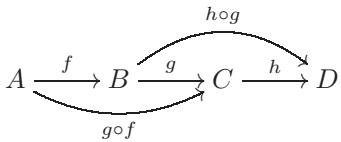

交换。这个重要的观察结果应该完全从复合的定义中显而易见。

恒等函数在复合运算中非常特殊：如果 $f : A \to B$ 是任意函数，那么 $\operatorname { i d } _ { B } \circ f = f$ 且 $f \circ \operatorname { i d } _ { A } = f$ 。图形上，图


交换


### 2.4. 单射、满射、双射

特殊类型的函数值得强调：

• 函数 $f : A \to B$ 是单射的（injective）（或称为 一个单射（an injection） 或 一一的（one-to-one））如果

$$
\left( \forall a ^ { \prime } \in A \right) \left( \forall a ^ { \prime \prime } \in A \right) \quad a ^ { \prime } \neq a ^ { \prime \prime } \implies f ( a ^ { \prime } ) \neq f ( a ^ { \prime \prime } ) :
$$

也就是说，如果$f$将不同的元素映射到不同的元素。

• 函数 $f : A \to B$ 是满射的（surjective）（或称 一个满射（ a surjection） 或 映上（onto) ）如果

$$
\left( \forall b \in B \right) ( \exists a \in A ) \quad b = f ( a ) :
$$

也就是说，如果$f$  “覆盖了整个$B$”  ；更精确地说，如果$\operatorname { i m } f = B$。

单射通常用 $\hookrightarrow$ 表示；满射通常用 $\twoheadrightarrow$ 表示。

如果$f$既是单射又是满射，我们称它是双射的（bijective）（或 一个双射 （ a bijection）或一一对应（one-to-one correspondence），或集合的同构。）在这种情况下，我们通常写成$f : A \xrightarrow { \sim } B$ ，或

$$
A \cong B ,
$$

并且我们说 $A$ 和 $B$ 是“同构”的集合。

当然，恒等函数 $\operatorname{id}_{A} : A \to A$ 是一个双射。

如果 $A \cong B$ ，即如果存在一个双射 $f : A \rightarrow B$ ，那么集合 $A$ 和 $B$ 可以通过 $f$ 进行“识别”，在某种意义上，我们可以将 $A$ 的元素 $a$ 精确地与 $B$ 中相应的元素 $f(a)$ 进行匹配。例如，如果 $A$ 是一个有限集且 $A \cong B$ ，那么 $B$ 必然也是一个有限集，并且 $|A| = |B|$ 。

这个术语使我们能够更好地理解 §1.3 中关于“不相交并”的考虑：给定的集合 $A$ ， $B$ 的“副本” $A ^ { \prime }$ ， $B ^ { \prime }$ 应该分别只是与 $A$ ， $B$ 同构的集合。在 $\mathrm { \ S 1 . 4 }$ 结尾处提出的产生这种不相交“副本”的方案是有效的，因为（例如）函数

$$
f : A \to \{ 0 \} \times A
$$

由下式定义

$$
( \forall a \in A ) \quad f ( a ) = ( 0 , a )
$$

这显然是双射。

### 2.5. 单射、满射、双射：第二种视角

有一种替代且富有启发性的方法来思考这些概念。

如果 $f : A \to B$ 是一个双射，那么我们可以“翻转其图像”并定义一个函数

$$
g : B \to A :
$$

也就是说，当 $b = f ( a )$ 时，我们可以让 $a = g ( b )$ 。（$f$ 既是单射又是满射，这保证了 $\Gamma _ { f }$ 的翻转是根据 2.1 中给出的定义是一个函数的图像。（检查这一点！））

这个函数 $g$ 有一个非常有趣的性质：从图形上看，


交换；也就是说，$g \circ f = \operatorname { i d } _ { A }$ 并且 $f \circ g = \operatorname { i d } _ { B }$ 。第一个恒等式告诉我们 $g$ 是 $f$ 的一个“左逆元” (不要管 图中 $g$ 画在了 $f$ 的右边 这个事实，因为 我们说 $g$ 是 $f$ 的左逆 是因为它在下式中写在了 $f$ 的左边： $f : g ◦ f = \operatorname { i d } _ { A }$ .)；第二个恒等式告诉我们 $g$ 是 $f$ 的一个“右逆元”。我们简单地说它是 $f$ 的逆元，记作 $f ^ { - 1 }$。因此，“双射有逆元”。

反过来说呢？如果一个函数有反函数，它就是双射吗？这是真的，但实际上我们可以更精确。

**命题 2.1.** 假设 $A \neq \emptyset$，并且令 $f : A \rightarrow B$ 是一个函数。那么

(1) $f$ 有左逆元当且仅当它是单射。  
(2) $f$ 有右逆元当且仅当它是满射。

证明。让我们证明(1)。

（$\Longrightarrow$）如果$f : A \rightarrow B$有一个左逆元，那么存在一个$g : B \rightarrow A$使得$g \circ f = \operatorname{id}_A$。现在假设$a^{\prime} \neq a^{\prime\prime}$是$A$中任意不同的元素；那么

$$
g ( f ( a ^ { \prime } ) ) = \mathrm { i d } _ { A } ( a ^ { \prime } ) = a ^ { \prime } \neq a ^ { \prime \prime } = \mathrm { i d } _ { A } ( a ^ { \prime \prime } ) = g ( f ( a ^ { \prime \prime } ) ) ;
$$

也就是说，$g$ 将 $f ( a ^ { \prime } )$ 和 $f ( a ^ { \prime \prime } )$ 发送到不同的元素。这迫使 $f ( a ^ { \prime } )$ 和 $f ( a ^ { \prime \prime } )$ 不同，表明 $f$ 是单射的。

（$\Leftarrow$）现在假设$f : A \rightarrow B$是单射的。为了构造一个函数$g : B \rightarrow A$，我们必须为每个元素$b \in B$分配一个唯一的值$g(b) \in A$。为此，选择一个固定的元素$s \in A$（我们可以这样做，因为$A \neq \emptyset$）；然后设置

$$
g ( b ) : = { \left\{ \begin{array} { l l } { a } & { { \mathrm { i f ~ } } b = f ( a ) { \mathrm { ~ f o r ~ s o m e ~ } } a \in A , } \\ { s } & { { \mathrm { i f ~ } } b \notin { \mathrm { i m ~ } } f . } \end{array} \right. }
$$

用文字来说，如果$b$是集合$A$中元素$a$的像，就把它送回$a$；否则，就把它送到你的固定元素$s$。

所给作业定义了一个函数，正是因为$f$是单射：确实，这保证了每一个$b$作为某些$a \in A$通过$f$的像都是唯一的$a$的像（由于$f$是单射，两个不同的$A$中的元素不能同时被送到$b$）。因此，每一个$b \in B$都被唯一地送到$A$中的一个明确元素，正如函数所要求的。

最后，函数 $g : B \to A$ 是 $f$ 的左逆函数。实际上，如果 $a \in A$ ，那么 $b = f ( a )$ 是第一类型的，因此它被 $g$ 重新发送回 $a$；也就是说，$g \circ f ( a ) = a = \operatorname { i d } _ { A } ( a )$ 对所有 $a \in A$ 都成立，正如所需要的那样。

(2) 的证明留作练习（练习 2.2）。

**推论 2.2.** 一个函数 $f : A \to B$ 是双射当且仅当它有一个（双侧）逆函数。

这并不完全是无辜的：如果 $f$ 既有 $a$ 的左逆元又有 $a$ 的右逆元，为什么它应该有一个既是左逆元又是右逆元的逆元呢？现在试着自己证明一下。我们很快会回到这个问题上（在 §4）。

如果一个函数是单射但不是满射，那么它将不会有右逆元，并且如果源集至少有两个元素，它将必然有多个左逆元（这应该从命题2.1的证明中给出的论点中很明显）。类似地，一个满射函数通常会有多个右逆元；它们通常被称为 **截面** (sections, 单数就是  section )。

命题2.1暗示着这里正在发生一些深刻的事情。§2.4中给出的单射和满射映射的定义关键地依赖于直接处理我们集合的元素；命题2.1表明，实际上这些性质是通过函数在集合中的“组织”方式来检测的。即使我们不知道“元素”是什么意思，我们仍然可以通过仅参考函数的性质来理解单射性和满射性的概念（从而理解集合的同构性）。

这是一个更“成熟”的观点，并且在讨论范畴时我们将支持这种观点。在某种程度上，它应该治愈读者在谈论“元素”时的不适感，就像我们在非正式介绍集合时那样，而没有定义这些神秘实体应该是什么。

双射$f$的逆的标准符号是$f ^ { - 1 }$。这个符号也用于不是双射的函数，但在稍微不同的上下文中：如果$f : A \to B$是任何函数，且$T \subseteq B$是$B$的子集，那么$f ^ { - 1 } ( T )$表示$A$的子集，包含“所有映射到$T$的元素”；也就是说，

$$
f ^ { - 1 } ( T ) = \{ a \in A | f ( a ) \in T \} .
$$

如果 $T = \{ q \}$ 由 $B$ 的单个元素组成，$f ^ { - 1 } ( T )$（简称 $f ^ { - 1 } ( q )$）被称为 $f$ 在 $q$ 上的**纤维**。因此，函数 $f : A \to B$ 是双射，如果它在 $B$ 的所有元素上都有非空纤维（即 $f$ 是满射），并且这些纤维实际上是单元素集（即 $f$ 是单射）。在这种情况下，这种记法 $f ^ { - 1 }$ 与上面提到的“逆”的记法非常匹配。

### 2.6. 单态射和满态射

还有一种表达单射和满射的方式，起初看起来比我们目前所见的更复杂，但实际上甚至更基本。

一个函数 $f : A \to B$ 是**单态射**（或单的）（monomorphism (or monic)），如果满足以下条件：

对于所有集合 $Z$ 和所有函数 $\alpha ^ { \prime } , \alpha ^ { \prime \prime } : Z \to A$

$$
f \circ \alpha ^ { \prime } = f \circ \alpha ^ { \prime \prime } \implies \alpha ^ { \prime } = \alpha ^ { \prime \prime } .
$$

**命题 2.3.** 一个函数是单射当且仅当它是单态射。

证明。（$\Longrightarrow$）根据命题2.1，如果函数$f : A \rightarrow B$是单射的，那么它有一个左逆函数$g : B \rightarrow A$。现在假设$\alpha ^ { \prime } , \alpha ^ { \prime \prime }$是另一个集合$Z$到$A$的任意函数，并且

$$
f \circ \alpha ^ { \prime } = f \circ \alpha ^ { \prime \prime } ;
$$

在左侧通过 $g$ 构成，并使用复合的结合性：

$$
( g \circ f ) \circ \alpha ^ { \prime } = g \circ ( f \circ \alpha ^ { \prime } ) = g \circ ( f \circ \alpha ^ { \prime \prime } ) = ( g \circ f ) \circ \alpha ^ { \prime \prime } ;
$$

由于 $g$ 是 $f$ 的左逆元，这意味着

$$
\operatorname { i d } _ { A } \circ \alpha ^ { \prime } = \operatorname { i d } _ { A } \circ \alpha ^ { \prime \prime } .
$$

因此

$$
\alpha ^ { \prime } = \alpha ^ { \prime \prime } ,
$$

如需得出 $f$ 是单射的结论。

( $\Longleftarrow$ ) 现在假设 $f$ 是一个单态射。这涉及到任意的集合 $Z$ 和任意的函数 $Z \to A$；我们将使用这些信息的一个微小部分，选择 $Z$ 为任意单元素集合 $\{ p \}$。然后 设置函数 $\alpha ^ { \prime } , \alpha ^ { \prime \prime } : Z \to A$  的内容 相当于 选择 将 $Z$ 的单个元素 $p$ 发送到哪个 $A$ 中的元素，发送到的元素分别为 $a ^ { \prime } = \alpha ^ { \prime } ( p )$ ， $a ^ { \prime \prime } = \alpha ^ { \prime \prime } ( p )$ 。对于这个特定的 $Z$ 选择，定义单态射的性质 $f \circ \alpha ^ { \prime } = f \circ \alpha ^ { \prime \prime } \implies \alpha ^ { \prime } = \alpha ^ { \prime \prime }$ ，变成了

$$
f \circ \alpha ^ { \prime } ( p ) = f \circ \alpha ^ { \prime \prime } ( p ) \implies \alpha ^ { \prime } = \alpha ^ { \prime \prime } ,
$$

也就是说，

$$
f ( a ^ { \prime } ) = f ( a ^ { \prime \prime } ) \implies \alpha ^ { \prime } = \alpha ^ { \prime \prime } .
$$

现在从 $Z = \{ p \}$ 到 $A$ 的两个函数相等当且仅当它们将 $p$ 映射到相同的元素，所以这表明

$$
f ( a ^ { \prime } ) = f ( a ^ { \prime \prime } ) \implies a ^ { \prime } = a ^ { \prime \prime } .
$$

这必须对所有 $\alpha ^ { \prime }$ ，$\alpha ^ { \prime \prime }$ 成立，也就是说，对所有在 $A$ 中选择的不同的 $a ^ { \prime }$ ，$a ^ { \prime \prime }$ 都成立。换句话说，$f$ 必须是单射的，正如要证明的那样。$\square$

读者现在应该期待有一个类似于单态射定义的风格定义，并且最终会发现它与“满射”等价。情况确实如此：这种概念被称为**满态射**。找到它，并证明它与“满射”的普通定义的等价性，留给读者（此练习特重要, 我推荐读者仔细写出所有细支末节 .）（练习2.5）。

### 2.7. 基本示例

集合的基本运算为我们提供了几个重要的单射和满射函数的例子。

**示例 2.4.** 设 $A$ ， $B$ 为非空集合。那么存在**自然投影** $\pi _ { A }$ ， $\pi _ { B }$ ：


定义为

$$
\pi _ { A } ( ( a , b ) ) : = a , \quad \pi _ { B } ( ( a , b ) ) : = b
$$

对于所有 $( a , b ) \in A \times B$ 。这两个映射都是（显然）满射。

示例 2.5. 类似地，从 $A$ 和 $B$ 到不相交并集存在自然嵌入：


通过将 $a \in A$（分别地，$b \in B$）发送到 $A \amalg B$ 中的同构副本 $A ^ { \prime }$（分别地，$B ^ { \prime }$）中的相应元素来获得。

2.6. 如果 $\sim$ 是集合 $A$ 上的等价关系，则存在一个（显然是满射的）标准投影

$$
A \longrightarrow A / \sim
$$

通过将每个 $a \in A$ 发送到其等价类 $[ a ] _ { \sim }$ 来获得。

### 2.8. 典范分解

我们关注单射和满射映射的原因是，它们提供了任何函数都可以构建的基本“砖块”。

要看到这一点，我们观察到每个函数 $f : A \rightarrow B$ 都确定了一个等价关系 $\sim$ 在 $A$ 上，如下所示：对于所有 $a ^ { \prime } , a ^ { \prime \prime } \in A$ ，

$$
a ^ { \prime } \sim a ^ { \prime \prime } \iff f ( a ^ { \prime } ) = f ( a ^ { \prime \prime } ) .
$$

(读者应检查这确实是一个等价关系。)

**定理 2.7.** 设 $f : A \rightarrow B$ 为任意函数，并如上定义 $\sim$。则 $f$ 分解如下：

$$
A { \overbrace { \twoheadrightarrow \left( A / { \sim } \right) { \xrightarrow[\quad \tilde f \quad] { \sim } } \operatorname { i m } f { \hookrightarrow B } } \  } ^ { f }  
$$

哪里第一个函数是典范投影 $A \to A / \sim$（如示例2.6所示），第三个函数是包含 $\operatorname { i m } f \subseteq B$ ，中间的双射 $\tilde { f }$ 由定义

$$
{ \tilde { f } } ( [ a ] _ { \sim } ) : = f ( a )
$$

对于所有 $a \in A$。

定义$\tilde { f }$的公式立即表明该图是可交换的；因此，为了证明这个定理，我们只需要验证

• 该公式确实定义了一个函数；   
• 该函数实际上是一个双射。

第一项 是一个极其重要的验证类的实例。给定的 $\tilde { f }$ 公式有一个巨大的固有歧义：在 $A / { \sim }$ 中的同一个元素可能是 $A$ 中许多元素的等价类；应用 $f$ 的公式需要选择其中一个元素并将其应用于 $f$。我们必须证明这个操作的结果与这个选择无关：也就是说，所有可能的代表元素的选择都导致相同的结果。

我们通过说我们必须验证$\tilde { f }$是良定义的来编码这种情况。我们将经常需要检查我们考虑的操作在非常类似于这里所典型化的上下文中是良定义的。

证明。详细说明上述第一项，我们必须验证，对于所有 $a ^ { \prime }$ ，$a ^ { \prime \prime }$ 在 $A$ 中，

$$
[ a ^ { \prime } ] _ { \sim } = [ a ^ { \prime \prime } ] _ { \sim } \implies f ( a ^ { \prime } ) = f ( a ^ { \prime \prime } ) .
$$

现在 $[ a ^ { \prime } ] _ { \sim } = \lfloor a ^ { \prime \prime } \rfloor _ { \sim }$ 意味着 $a ^ { \prime } \sim a ^ { \prime \prime }$ ，并且 $\sim$ 的定义被精确设计，以便这意味着 $f ( a ^ { \prime } ) = f ( a ^ { \prime \prime } )$ ，正如这里所要求的。所以 $\tilde { f }$ 确实是良定义的。

为了验证第二项，即${ \tilde { f } } : A / { \sim } \to \operatorname { i m } f$是一个双射，我们明确地检查$\tilde { f }$是单射和满射。

单射：如果 ${ \tilde { f } } ( [ a ^ { \prime } ] _ { \sim } ) = { \tilde { f } } ( [ a ^ { \prime \prime } ] _ { \sim } )$ ，那么根据 $\tilde { f }$ 的定义，$f ( a ^ { \prime } ) = f ( a ^ { \prime \prime } )$；因此根据 $\sim$ 的定义，$a ^ { \prime } \sim a ^ { \prime \prime }$，然后 $[ a ^ { \prime } ] _ { \sim } = \lfloor a ^ { \prime \prime } \rfloor _ { \sim }$。因此

$$
\tilde { f } ( [ a ^ { \prime } ] _ { \sim } ) = \tilde { f } ( [ a ^ { \prime \prime } ] _ { \sim } ) \implies [ a ^ { \prime } ] _ { \sim } = [ a ^ { \prime \prime } ] _ { \sim }
$$

证明单射性。

满射：给定任意 $b \in \operatorname { i m } f$ ，存在一个元素 $a \in A$ 使得 $f ( a ) = b$ 则

$$
{ \tilde { f } } ( [ a ] _ { \sim } ) = f ( a ) = b
$$

根据$\tilde { f }$的定义。由于$b$在$\operatorname { i m } f$中是任意的，这表明$\tilde { f }$是满射的，正如所需要的那样。$\square$

定理2.7表明每个函数都是一个满射，接着是一个同构，接着是一个单射的组合。虽然它的证明很简单，但这是一个有重要意义的结果，因为它是一个原型，在本书中将会多次出现。它会不时地重新出现，以“第一个同构定理”等名称出现。

### 2.9. 说明

最后，我们可以开始澄清1.4中关于不相交并、积和商的一个评论。我们的定义中$A \amalg B$是两个不相交集合$A ^ { \prime }$，$B ^ { \prime }$的（传统）并集，它们分别同构于$A$，$B$。很容易提供一种有效产生这种同构副本的方法（正如我们在§1.4中所做的那样）；但它实际上有点太容易了——许多其他选择都是可能的，而且没有一个比另一个更好。事实上，不一次性做出固定选择，而只是接受所有这些都产生$A \amalg B$的可接受候选者的事实，更为合理。从这个平等主义的立场来看，运算$A \amalg B$的结果并不是按照上述意义“良定义”的集合。然而，很容易看出（练习2.9）$A \amalg B$在同构的意义上是良定义的：也就是说，对于副本$A ^ { \prime }$，$B ^ { \prime }$的任何两个选择都会导致$A \amalg B$的同构候选者。同样的考虑也适用于积和商。

通过取不相交并集(disjoint unions) 、积或商得到集合的主要特征 并不仅仅是“它们包含哪些元素”，而是“它们与其他所有集合的关系”。当我们在范畴的背景下重新审视这些操作和其他 （读者应该也意识到 有一些重要的 变体 在我们至今已看到 的操作上—尤其重要的是 积和不相交并 的纤维化版本(fibered flavors)）时，这一点将（甚至）更加清晰。

### 习题

2.1.  $\triangleright$ 集合 $S$ 与自身之间存在多少种不同的双射？[§II.2.1]   
2.2.  $\triangleright$ 证明命题 2.1 中的命题 (2)。你可以假设对于集合的一族不相交的非空子集，存在一种在每个族成员中选择一个元素的方法13。[§2.5, V.3.3]   
2.3. 证明双射的逆映射是双射，并且两个双射的复合映射是双射。   
2.4.  $\triangleright$ 证明“同构”是一种等价关系（在任何集合的集合上）。[§4.1]   
2.5.  $\triangleright$ 以 §2.6 中看到的单射概念的风格，提出一个同态的概念，并证明一个类似于命题 2.3 的关于同态和满射的结果。[§2.6, §4.2]   
2.6. 使用例 2.4 中的记法，解释任何函数 $f : A \to B$ 如何确定 $\pi _ { A }$ 的一个截面(section, 即 右逆 )。   
2.7. 设 $f : A \to B$ 是任何函数。证明 $f$ 的图像 $\Gamma _ { f }$ 与 $A$ 同构。   
2.8. 尽可能详细地描述函数 $\mathbb { R } \to \mathbb { C }$ 的典范分解（参见 §2.8）中的所有项，该函数由 $r \mapsto e ^ { 2 \pi i r }$ 定义。（这个练习与之前分配的一个练习相匹配。是哪一个？）   
2.9. $\triangleright$ 证明如果 $A ^ { \prime } \cong A ^ { \prime \prime }$ 和 $B ^ { \prime } \cong B ^ { \prime \prime }$ ，并且进一步 $A ^ { \prime } \cap B ^ { \prime } = \emptyset$ 和 $A ^ { \prime \prime } \cap B ^ { \prime \prime } = \varnothing$ ，那么 $A ^ { \prime } \cup B ^ { \prime } \cong A ^ { \prime \prime } \cup B ^ { \prime \prime }$ 。得出结论，操作 $A \amalg B$（如 §1.4 中所述）在同构意义下是良定义的（参见 §2.9）。[§2.9, 5.7]   
2.10. $\triangleright$ 证明如果 $A$ 和 $B$ 是有限集，那么 $| B ^ { A } | = | B | ^ { | A | }$ 。[§2.1, 2.11, §II.4.1]

2.11.  $\triangleright$ 考虑到练习2.10，使用 $2 ^ { A }$ 表示从任意集合 $A$ 到具有2个元素的集合（例如 $\{ 0 , 1 \}$ ）的函数集是合理的。证明 $2 ^ { A }$ 与 $A$ 的幂集之间存在一一对应（参见§1.2）。[§1.2, III.2.3]

## 3. 范畴


范畴语言的亲切称呼是抽象的废话，这是由诺曼·斯蒂恩罗德命名的。这个术语基本上是准确的，不一定具有贬义：范畴指的是无意义，因为它们关注的是所代表事物的“结构”，而不是“意义”。重点不在于如何遇到你正在查看的特定集合，而在于该集合如何与其他所有集合相关联。更糟（或更好）的是，重点不在于研究集合以及集合之间的函数，而在于研究“事物 和 从事物到事物 的事物”，而不必明确这些事物是什么：它们可以是集合、群、环、向量空间、模，或其他如此奇特以至于读者完全无权知道它们（暂时）的对象。

‘范畴’在最初和多方面上直观地看起来像集合。范畴可能会让你想到集合，因为它们是‘对象的集合’，并且进一步会有‘从范畴到范畴的函数’（称为函子 (然而，我们后面章节才会考虑函子，我们第一个与函子正式相遇 是在 第八章)  ）。同时，每个范畴可能会让你想到所有集合的集合，因为在其包含的事物中会有‘函数’的类似物。

### 3.1. 定义
一个范畴的定义乍一看可能很复杂，但其核心可以迅速总结：一个范畴由一组“对象”和这些对象之间的“态射”组成，并满足一系列自然条件。

读者会注意到我避免使用“一个 对象的集合(set)”，而是选择了更通用的“一组(collection)” 。这是一个令人烦恼但不可避免的问题：例如，我们想要一个“集合的范畴”，其中“对象”是集合，“态射”是集合之间的函数，而问题是根本不存在所有集合的集合（罗素悖论）。从某种意义上说，所有集合的集合 “太大”而不能是一个集合。然而，有办法处理这种“集合”，它们的技术名称是类(class)。有一个所有集合的“类”（将来也会有处理 群、环等的类）。

另一种方法是为一个足够大的集合（称为宇宙(universe)）定义，并同意所有范畴的所有对象都将从这个巨大的实体中选择。

在任何情况下，读者需要知道的是，有一种方法可以使其工作。我们将使用术语“类”在定义中，但这不会影响本书中的任何证明或任何其他定义。此外，在下面考虑的一些示例中，所讨论的类是一个集合（在这种情况下，我们称该范畴是小的），因此读者在思考这些示例时将感到非常自在。

**定义 3.1**。一个范畴 C 由下面两个东西组成。

- 一类范畴中的**对象** Obj(C) ；以及  
- 对于 $\mathsf { C }$ 中的任意两个对象 $A , B$ ，一个**态射**集合 ${ \mathrm { H o m } } _ { \mathsf { C } } ( A , B )$ ，具有以下性质。

作为参考原型，将对象视为“集合”，将态射视为“函数”。这一个例子应该使态射的定义性质看起来自然且容易记忆：

- 对于 $\mathsf { C }$ 的每个对象 $A$ ，都存在（至少）一个同态 $1 _ { A } \in \operatorname { H o m } _ { \mathsf { C } } ( A , A )$ ，即 $A$ 上的“恒等”同态。 
-  可以复合同态：两个同态 $f ~ \in ~ \operatorname { H o m } _ { \mathsf { C } } ( A , B )$ 和 $g \in$ ${ \mathrm { H O M } } _ { \mathsf { C } } ( B , C )$ 确定一个同态 $g f \in \operatorname { H O M } _ { \mathsf { C } } ( A , C )$ 。也就是说，对于 $\mathsf { C }$ 的任意三个对象 $A$ ， $B$ ， $C$ ，都存在一个函数（从集合到集合）。

$$
\operatorname { H o m } _ { \mathsf { C } } ( A , B ) \times \operatorname { H o m } _ { \mathsf { C } } ( B , C ) \to  \operatorname { H o m } _ { \mathsf { C } } ( A , C ) .
$$

并且 对儿 $( f , g )$ 的像记为 $g f$。

• “复合律”是结合的：如果 $f \in \operatorname { H o m } _ { \mathsf { C } } ( A , B )$ ， $g \in \operatorname { H o m } _ { \mathsf { C } } ( B , C )$ ，和 $h \in \operatorname { H o m } _ { \mathsf { C } } ( C , D )$ ，那么

$$
( h g ) f = h ( g f ) .
$$

• 恒等态射在复合运算下起到单位元的作用：也就是说，对于所有 $f \in \operatorname { H o m } _ { \mathsf { C } } ( A , B )$ 我们都有

$$
f 1 _ { A } = f , \quad 1 _ { B } f = f .
$$

这确实是一大串，但再次来说，要记住所有这些，只需想想集合的函数。还有一个进一步的要求是，这些集合

$$
\mathrm { H o m } _ { \mathsf { C } } ( A , B ) , \quad \mathrm { H o m } _ { \mathsf { C } } ( C , D )
$$

除非 $A = C$ ，$B = D$ ，否则它们不相交；这是你通常不会考虑的事情，但再次适用于普通的集合函数(我将常使用术语 集合函数 来强调 我们正在 集合的上下文下 处理函数)。也就是说，如果两个函数是同一个，那么它们必然有相同的源和相同的目标：源和目标是集合函数数据的一部分。

一个范畴 $\mathsf{C}$ 中对象 $A$ 到自身的态射称为自同态；${\mathrm{Hom}}_{\mathsf{C}}(A, A)$ 记作 $\operatorname{End}_{\mathsf{C}}(A)$。范畴的一个公理告诉我们这是一个“带基点”的集合（‘pointed’ set），因为 $1_A \in \operatorname{End}_{\mathsf{C}}(A)$。读者应该注意，复合运算定义了 $\operatorname{End}_{\mathsf{C}}(A)$ 上的一个“运算”：如果 $f, g$ 是 $\operatorname{End}_{\mathsf{C}}(A)$ 的元素，那么它们的复合 $g f$ 也是。

在长期写作中，书写${ \bf \cdot } f \in \mathrm { H o m } _ { \mathsf { C } } ( A , B )$会感到厌烦。如果理解了范畴，可以安全地省略下标$\mathsf { C }$，甚至像我们处理集合函数那样使用箭头：$f : A \to B$。这也允许我们在任何范畴中绘制态射的图；一个图被称为“交换的”（或是一个“交换图”），如果所有遍历它的方式 都导致 沿路复合态射的结果相同，正如2.3中对集合函数的图所解释的那样。

事实上，我现在可以自由地将 _图_(diagram) 作为范畴的对象来使用。在这种情况下，图的官方定义是 一组范畴C的对象，以及这些对象之间的规定的态射；如果它按照上述规定的方式可以交换，则图可以交换。当然，图的可视表示的具体细节是无关紧要的。

### 3.2. 例子
读者应该注意到，范畴概念的定义有90%是用来解释其态射的性质；可以说，态射是范畴的重要组成成分。然而，从心理上讲，人们很难不按照对象来思考范畴：例如，人们谈论“集合范畴”。要点在于，通常可以考虑的“态射”的种类（至少在心理上）是由对象决定的：如果人们谈论的是集合，那么“态射”除了集合函数还能是什么意思呢？在其他情况下（参见下面的例3.5或练习3.9），态射应该是什么不太清楚，寻找“正确的”概念可能是一个有趣的项目。

**示例 3.2.** 到目前为止，人们希望已经非常清楚，集合（作为对象），连同集合函数（作为态射），构成一个范畴；如果不是这样，读者必须在这里停止，不再继续前进，直到这个断言消除了任何剩余的神秘感 （我会时不时会给读者这样的提示：在关键时刻，盘点自己所知比盲目向前希望最好更有用。此时遇到的困难表明需要仔细重读之前的材料。如果谜团依然存在，那就是 办公室时间（office hours（译注：大学中的  老师在固定时间留在办公室里为学生答疑 的制度））存在的意义。但通常情况下，你应该能够凭借我提供的信息自己找到出路，并且很可能会这样学到更多。在寻求专业帮助之前，你应该尽力尝试。）。

对于这个重要的范畴，目前还没有一个被普遍接受、官方的符号表示方法。通常的做法是用‘Set’或‘Sets’这个词，并加上一些花哨的装饰来强调。例如，在文献中可能会遇到 $\mathrm{SET}$、$\underline{\underline{\mathrm{Sets}}}$、$\mathfrak{Set}$、(Sets)以及许多基于这些主题的有趣变体。我们将使用‘无衬线’字体来表示范畴；因此，$\mathsf { S e t }$ 将表示集合的范畴。因此

• Obj($\mathsf { S e t }$) = 所有集合的类；   
• 对于 $A$ ， $B$ 在 Obj($\mathsf { S e t }$) 中（即对于 $A$ ， $B$ 集合）$\mathrm { H o m } _ { \mathsf { S e t } } ( A , B ) = B ^ { A }$ .

请注意，1.3–1.5中提到的操作并非范畴定义的一部分：这些操作突出了Set的一些有趣特征，这些特征可能被其他范畴共享，也可能不被共享。我们很快将回到其中一些操作，并更精确地理解它们对Set的意义。

**示例 3.3**。这里是一个完全不同的例子。

假设 $S$ 是一个集合，$\sim$ 是定义在 $S$ 上的一个满足自反性和传递性的关系。那么我们可以将这些数据编码到一个范畴中：

- 对象：$S$ 的元素；   
- 态射：如果 $a$ ， $b$ 是对象（即，如果 $a , b \in S$ ），则令 $\mathrm { H o m } ( a , b )$ 是一个集合，如果 $a \sim b$ ，则包含元素 $( a , b ) \in S \times S$ ，否则令 ${ \mathrm { H o m } } ( a , b ) = \emptyset$ 。

请注意（与集合不同），这里 态射非常少：任何一对对象最多只有一个态射，并且“无关”对象之间没有任何态射。

我们必须定义“态射的复合”并验证§3.1中指定的条件是否得到满足。首先，我们是否有“恒等元”？如果 $a$ 是一个对象（即，如果 $a \in S$），我们需要找到一个元素

$$
1 _ { a } \in \operatorname { H o m } ( a , a ) .
$$

这正是我们假设$\sim$具有自反性的原因：这告诉我们对于所有$a$，$a \sim a$；也就是说，$\mathrm { H o m } ( a , a )$只包含单个元素$( a , a )$。因此我们别无选择：我们必须让

$$
1 _ { a } = ( a , a ) \in { \mathrm { H o m } } ( a , a ) .
$$

关于组成，设 $a , b , c$ 为对象（即 $S$ 的元素），并

$$
f \in { \mathrm { H o m } } ( a , b ) , \quad g \in { \mathrm { H o m } } ( b , c ) ;
$$

我们必须定义一个相应的态射 $g f \in \operatorname { H o m } ( a , c )$ 。现在，

$$
f \in \mathrm { H o m } ( a , b )
$$

告诉我们 $\mathrm { H o m } ( a , b )$ 是非空的，并且根据这个范畴中态射的定义，这意味着 $a \sim b$ ，并且 $f$ 实际上是 $S \times S$ 的元素 $( a , b )$ 。类似地，$g \in \mathrm { H o m } ( b , c )$ 告诉我们 $b \sim c$ 并且 $g = ( b , c )$ 。现在

$$
a \sim b { \mathrm { ~ a n d ~ } } b \sim c \implies a \sim c
$$

既然我们假设 $\sim$ 是传递的。这告诉我们 $\mathrm { H o m } ( a , c )$ 由单个元素 $( a , c )$ 组成。因此我们再次没有选择：我们必须让

$$
g f : = ( a , c ) \in { \mathrm { H o m } } ( a , c ) .
$$

这是否是结合律？如果 $f \in \operatorname { H o m } ( a , b )$ ，$g \in { \mathrm { H o m } } ( b , c )$ ，和 $h \in \operatorname { H o m } ( c , d )$ ，那么必然

$$
f = ( a , b ) , \quad g = ( b , c ) , \quad h = ( c , d )
$$

并且

$$
g f = ( a , c ) , \quad h g = ( b , d )
$$

因此

$$
h ( g f ) = ( a , d ) = ( h g ) f ,
$$

证明结合律。

读者将不会发现困难，可以验证 $1 _ { a }$ 关于这个合成是一个恒等式，如所需（练习 3.3）。

这种结构的最简单例子是由集合 $S$ 和等价关系“=”得到的范畴；也就是说，唯一的态射是恒等态射。这些范畴被称为离散范畴。

作为另一个例子，考虑赋予 $\mathbb { Z }$ 关系 $\leq$ 的范畴。例如，


是一个（随机选择的）交换图在这个范畴中。如果我们反转垂直箭头 $3 \to 3$ 或者添加一个从 3 到 4 的箭头，它仍然会是一个（交换的）图在这个范畴中，而我们不允许画一个从 4 到 3 的箭头，因为 $4 \not \leq 3$。

这些范畴非常特殊——例如，它们中绘制的每个图都是必然可交换的，而这在例如集合论中远非如此。此外请注意，这些范畴都是小范畴。

**示例 3.4.** 这里是另一个小范畴的（实际上, 这又是一个 在示例  3.3 中考虑到的 范畴的实例. 你知道为什么吗?）例子。

设 $S$ 仍然是一个集合。定义一个范畴 $\hat {\mathsf { S } }$，通过以下方式：  
• $\mathrm { O b j } ( { \hat { \mathsf { S } } } ) = { \mathcal { P } } ( S )$，即 $S$ 的幂集（参见 §1.2 和习题 2.11）；  
• 对于 $\hat { \mathsf { S } }$ 的对象 $A$，$B$（即 $A \subseteq S$ 且 $B \subseteq S$），若 $A \subseteq B$，则 $\mathrm { H o m } _ { \hat { \mathsf { S } } } ( A , B )$ 为 由对儿 $( A , B )$ 组成的集合；否则，$\operatorname { H o m } _ { \hat { \mathsf { S } } } ( A , B ) = \varnothing$。

身份 $1 _ { A }$ 由 对儿 $( A , A )$ 组成（这是一个，事实上是唯一一个，从 $A$ 到 $A$ 的同态，因为 $A \subseteq A$）。复合是通过串联包含关系得到的：如果在$\hat{\mathsf{S}}$中有同态

$$
A \to B , \quad B \to C
$$

，则$A \subseteq B$且$B \subseteq C$；因此$A \subseteq C$，并且存在一个从$A$到$C$的态射。检查3.1中指定的公理应该是常规的（确保这是正确的！）

这种风格（但采用更复杂的结构，例如拓扑空间的开子集族）在代数几何等成熟领域至关重要。

**示例 3.5.** 下一个示例非常抽象，但思考它会使你对我们迄今为止所看到的一切感到相当舒适；而且它是一个非常常见的结构，其变体将在整个课程中大量出现。

设 $\mathsf { C }$ 是一个范畴，$A$ 是 $\mathsf { C }$ 的一个对象。我们将定义一个范畴 $\mathsf { C } _ { A }$，其对象是 $\mathsf { C }$ 中某些态射，其态射是 $\mathsf { C }$ 中某些图（惊喜！）！

• $\operatorname { O b j } ( \mathsf { C } _ { A } ) = \mathrm { a l l }$ 从 $\mathsf { C }$ 的任何对象到 $A$ 的同态；因此，$\mathsf { C } _ { A }$ 的一个对象是一个同态 $f \in \operatorname { Hom_{\mathsf{C}} } ( Z , A )$，其中 $Z$ 是 $\mathsf { C }$ 的一个对象。形象地说，$\mathsf { C } _ { A }$ 的一个对象是 $\mathsf { C }$ 中的一个箭头 $Z { \overset { f } { \to } } A$；这些通常被“自上而下”地绘制，如下所示

$$
\begin{array}{c}
 Z \\
\llap{{\scriptstyle f}}\Big\downarrow \\
 A
\end{array}
$$

$\mathsf { C } _ { A }$ 中的同态将是什么？实际上只有一种合理的方法可以将同态分配给具有上述对象的范畴。勇敢的读者想要在这里停止阅读，并且只有在独立想出定义之后才继续。在我们本书中遇到的构造背后将会有许多类似的例子，从理想的角度来说，当时候到来时，它们应该完全自然地出现。现在投入一点精力来理解这个原型情况，在未来将会有丰厚的回报。下面就要剧透啦   , 所以现在就把这个讲义放一边 写下  $\mathsf { C } _ { A }$  中的态射的定义.

欢迎回来。

• 设 $f _ { 1 }$ ， $f _ { 2 }$ 是 $\mathsf { C } _ { A }$ 的对象，即 $\mathsf { C }$ 中的两个箭头。


$$
\begin{array}{c}
 Z_1 & & Z_2\\
\llap{{\scriptstyle f_1}}\Big\downarrow & & \llap{{\scriptstyle f_2}}\Big\downarrow \\
 A && A
\end{array}
$$


定义态射 $f _ { 1} \to f _ { 2}$ 为 在“环境”(ambient)范畴 C 中 的交换图


。

也就是说，同态 $f _ { 1 } \to f _ { 2 }$ 恰好对应于 $\mathsf { C }$ 中的那些同态 $\sigma : Z _ { 1 } \to Z _ { 2 }$ 使得 $f _ { 1 } = f _ { 2 } \sigma$ 。

一旦你理解了什么是态射，验证它们满足在§3.1中阐述的公理就是直接的。恒等映射是从$\mathsf { C }$中的恒等映射继承而来的：对于$\mathsf { C } _ { A }$中的$f : Z \to A$，恒等映射$1 _ { f }$对应于下面交换图：


这个交换图 交换 是因为  $\mathsf { C }$是一个范畴 这一事实 。复合 也是$\mathsf { C }$中复合运算的一个副产器。$\mathsf { C } _ { A }$ 中的两个态射$f _ { 1 } \to f _ { 2} \to f _ { 3}$对应于将两个交换图并排放置：


然后它遵循（再次因为 $\mathsf { C }$ 是一个范畴！）通过移除中心箭头得到的图，即，


也具有交换性。检查所有这些(!)，并验证在$\mathsf { C } _ { A }$中的复合运算是结合的（再次，这直接来自于复合运算在$\mathsf { C }$中是结合的这一事实）。

以这种方式构造的范畴在文献中称为切片范畴；它们是逗号范畴的特例。

**示例 3.6.** 为了具体起见，让我们将示例 3.5 中给出的构造 应用于示例 3.3 中构造的范畴，比如说对于 $S = \mathbb { Z }$ 和 $\sim$ 是关系 $\leq$ 。称这个范畴为 $\mathsf { C }$，并选择 $\mathsf { C }$ 的一个对象 $A$ —也就是说，一个整数，例如，$A = 3$ 。那么 $\mathsf { C } _ { A }$ 的对象是 $\mathsf { C }$ 中以 3 为目标的态射，也就是说，对儿 $( n , 3 ) \in \mathbb { Z } \times \mathbb { Z }$ 且 $n \leq 3$  。存在一个态射

$$
( m , 3 ) \to  ( n , 3 )
$$

当且仅当 $m \ \leq \ n$ 。在这种情况下，$\mathsf { C } _ { A }$ 可以无害地与整数 $\leq 3$ 的“子范畴”等同，加上 与 $\mathsf { C }$ 中“相同”的态射。

**示例 3.7.** 可以通过考虑从固定对象 $A$ 到范畴 C 中所有对象的态射，再次使用适当的交换图定义态射，来获得一个与示例 3.5 中探索的完全类似的例子。这导致了余切片范畴。读者应提供这个构造的细节（练习 3.7）。

**示例 3.8.** 作为示例 3.7 中类的一个“具体”实例，令 $\mathrm { C } = \mathsf { S e t }$ 和 $A = \mathrm { a }$ 一个固定的单元素集合 $\{ * \}$。将得到的类称为 ${ \mathsf { S e t } } ^ { * }$。

在 ${ \mathsf { S e t } } ^ { * }$ 中的一个对象是一个在 Set 中的形态 $f : \{ * \} \to S$，其中 $S$ 是任意一个集合。因此，${ \mathsf { S e t } } ^ { * }$ 中一个对象的信息包括选择一个非空集合 $S$ 和一个元素 $s \in S$ —也就是说，元素 $f ( * )$：这个元素由 $f$ 确定，同时也由 $f$ 确定。

因此，我们可以将 ${ \mathsf { S e t } } ^ { * }$ 的对象记为对 $( S , s )$ ，其中 $S$ 是任何集合，$s \in S$ 是 $S$ 的任何元素。

两个此类对象之间的一个同态，$( S , s ) \to ( T , t )$ ，则对应于一个集合函数 $\sigma : S  \to T$ ，使得 $\sigma ( s ) = t$ 。

${ \mathsf { S e t } } ^ { * }$ 的对象称为“带基点的集合”(pointed sets)。我们将在本书中研究的许多结构都是带基点的集合。例如（正如我们将看到的）一个“群”是一个集合 $G$，除了其他要求外，还有一个指定的元素 $e _ { G }$（它的“单位元”）；“群同态”将是那些除了其他性质外，将单位元映射到单位元的函数；因此，它们是上述意义上的带基点的集合的态射。$\lrcorner$

**示例 3.9.** 有益于思考一些类似于示例 3.5 和 3.7 的“抽象”示例。这些将是重新审视 §1.3 中提到的某些操作的关键要素。对于掌握了示例 3.5 和 3.7 的读者来说，它们的定义可能会令人失望地显得简单。

这次我们从给定的范畴 $\mathsf { C }$ 和两个对象 $A$ ， $B$ 开始。我们可以通过本质上与定义 $\mathsf { C } _ { A }$ 时所用的相同程序来定义一个新的范畴 $\mathsf { C } _ { A , B }$ :

• $\mathrm { O b j } ( \mathsf C _ { A , B } )$ 就是  在 $\mathsf { C }$ 中 的图：

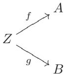

；以及
• 下面的态射


是交换图：


我将把这个粗略的描述留给读者去形式化。这个例子实际上不过是 $\mathsf { C } _ { A }$ 和 $\mathsf { C } _ { B }$ 的混合，其中两个结构相互作用，因为有一个严格的要求，即同一个 $\sigma$ 必须使图的两侧都相容：

$$
f _ { 1 } = f _ { 2 } \sigma \quad \underline { { { \mathrm { 且 } } } } \quad g _ { 1 } = g _ { 2 } \sigma
$$

上两式要“同时地”发生。

翻转大部分箭头给出了类似于例3.7的类比变化，产生了一个我们可以标记为$\mathsf { C } ^ { A , B }$的范畴；细节留给读者。

**示例 3.10.** 作为这些示例的最后一个变化，我们通过考虑 $\mathsf { C } _ { A , B }$（和 $\mathsf { C } ^ { A , B }$）的 _纤维化_ 版本来结束。将其视为一个测试，以检查你是否真正理解了 $\mathsf { C } _ { A , B }$ — 专家会告诉你，这对刚开始学习范畴的学生来说看起来相当复杂，所以如果一开始不太流畅，不要气馁（但如果流畅，就给自己鼓鼓掌！）。从一个给定的范畴 $\mathsf { C }$ 开始，这次选择两个固定的态射 $\alpha : A \to C$ ， $\beta : B \to C$ 在 $\mathsf { C }$ 中，具有相同的目标 $C$ 。然后我们可以如下考虑一个范畴 $\mathsf { C } _ { \alpha , \beta }$：

• 设 $\mathsf { Obj } ( \mathsf { C } _ { \alpha , \beta } )$ 为 在C中的交换图


，且

• 态射对应于交换图


对示例 3.9 的深入理解将使这个示例看起来同样温和；此时读者应该没有困难将其形式化（也就是说，解释复合是如何工作的，单位元是什么等等）。

此外留给读者的还有从两个具有共同源头的同态 $\alpha : C \to A$ ， $\beta : C \to B$ 开始构建“镜像”示例 $\mathsf { C } ^ { \alpha , \beta }$ 的构造。

### 习题

3.1. $\triangleright$ 设 $\mathsf { C }$ 是一个范畴。考虑一个结构 $\mathsf C ^ { o p }$。

• $\mathrm { O b j } ( { \mathsf { C } } ^ { o p } ) : = \mathrm { O b j } ( { \mathsf { C } } )$；   
• 对于 $\mathsf C ^ { o p }$ 的对象 $A$，$B$（因此也是 $\mathsf { C }$ 的对象），${ \mathrm { H o m } } _ { \mathsf { C } ^ { o p } } ( A , B ) : = { \mathrm { H o m } } _ { \mathsf { C } } ( B , A )$。

展示如何将其转化为一个范畴（即，定义 $\mathsf C ^ { o p }$ 中态射的复合并验证 §3.1 中列出的性质）。

直观地讲，'相反'范畴 ${ \mathsf { C } } ^ { o p }$ 是通过在 $\mathsf { C }$ 中 '反转所有箭头' 得到的。[5.1, §VIII.1.1, §IX.1.2, IX.1.10]

3.2. 如果 $A$ 是一个有限集，$\operatorname { E n d } _ { \mathsf { S e t } } ( A )$ 的大小是多少？

3.3. $\triangleright$ 精确地阐述在示例 3.3 中，$1 _ { a }$ 相对于复合运算为何是单位元，并证明这一断言。[§3.2]

3.4. 能否使用关系 $<$ 在集合 $\mathbb { Z }$ 上定义一个类似于示例 3.3 的范畴？

3.5. $\triangleright$ 解释例3.4在何种意义上是例3.3所考虑的范畴的实例。[§3.2]

3.6. $\triangleright$ (假设对线性代数有一定了解。) 定义一个范畴 V，取 $\mathrm { O b j } ( \mathsf { V } ) = \mathbb { N }$，并让 ${ \mathrm { H o m } } _ { \mathsf { V } } ( n , m ) =$ 所有 $m \times n$ 实数矩阵的集合，对于所有 $n , m \in \mathbb { N }$ 。(我将把这个任务留给读者去理解一个具有 0 行或列的矩阵。) 使用矩阵的积来定义复合。这个范畴“感觉”熟悉吗？[§VI.2.1, §VIII.1.3]

3.7. $\triangleright$ 在示例 3.7 中仔细定义对象和态射，并画出与复合对应的图。 [§3.2]

#### 习题 I. 3.8

3.8. $\triangleright$ 一个范畴 $\mathsf{C}$ 的子范畴 $C^{\prime}$ 由 $\mathsf{C}$ 的一组对象组成，其态射集合 $\mathrm{Hom}_{\mathsf{C}^{\prime}}(A, B) \subseteq \mathrm{Hom}_{\mathsf{C}}(A, B)$ 对于所有在 $\mathrm{Obj}(C^{\prime})$ 中的对象 $A$、$B$ 都成立，使得 $\mathsf{C}$ 中的恒等和复合使得 $C^{\prime}$ 成为一个范畴。如果对于所有在 $\mathrm{Obj}(\mathsf{C}^{\prime})$ 中的 $A$、$B$ 都有 $\mathrm{Hom}_{\mathsf{C}^{\prime}}(A, B) = \mathrm{Hom}_{\mathsf{C}}(A, B)$，则子范畴 $C^{\prime}$ 是**满**的。构造一个无穷集的范畴，并解释它如何被视为 $\mathsf{Set}$ 的一个满子范畴。[4.4,   §VI.1.1,  §VIII.1.3]

3.9. $\triangleright$ §2.2 中引入的多集概念的另一种替代方法是通过考虑带有等价关系的集合；将等价元素视为“同类”元素的多个实例。定义这种增强集合之间的态射概念，得到一个包含（Set 的“副本”）作为子范畴的范畴 MSet。（可能会有多种合理的方法来这样做！这是一个有意设定的开放式练习。）哪些 MSet 中的对象决定了 §2.2 中定义的普通多集，以及如何决定？从这一点出发，详细说明多集的态射是什么。（存在几种自然的多集态射概念。尝试在 MSet 中定义态射，以便您为普通多集获得的概念能够捕捉您对这些对象的直观理解。）[§2.2, §3.2, 4.5]

3.10. 由于一个范畴 $\mathsf { C }$ 的对象不是（必然被解释为）集合，因此不清楚如何 通过延伸子集的概念 来一般地理解“子对象”的概念, 。在某些情况下谈论子对象是有意义的，并且 $\mathsf { C }$ 中任何给定对象 $A$ 的子对象与一个固定的特殊对象 $\Omega$ 的态射 $A \to \Omega$ 是一一对应的，这个特殊对象 $\Omega$ 称为**子对象分类器**（subobject classifier）。证明 Set 有一个子对象分类器。

3.11. $\triangleright$ 绘制相关的图，并为在示例 3.9 中提到的 $\mathsf { C } ^ { A , B }$ 类定义复合和恒等元。对在示例 3.10 中提到的 $\mathsf { C } ^ { \alpha , \beta }$ 类执行相同的操作。[§5.5, 5.12]

## 4. 同态

正如在集合中我们突出某些类型的函数（单射、满射、双射），对于任意范畴中的态射尝试做同样的事情也是有用的。读者应该注意，在一般设置中，通过态射对“元素”的作用来定义其性质并不是一个选项，因为任意范畴的对象一般没有“元素”。

这就是为什么我们在§2.4-2.6中从不同角度分析了单射性等等。结果表明，这些概念的其他观点可以很好地转移到范畴设置中。

### 4.1. 同构
设 $\mathsf{C}$ 是一个范畴。

**定义4.1.** 一个同态 $f \in \operatorname{Hom}_{\mathsf{C}}(A, B)$ 是一个**同构**，如果它在复合运算下有一个（双侧）逆元：即，如果 $\exists g \in \operatorname { H o m   }_{\mathsf{C}} ( B , A )$ 使得

$$
g f = 1 _ { A } , \quad f g = 1 _ { B } .
$$

回想在2.5中，集合的双射$f$的逆被定义为“逐元素地”；特别是，它的定义没有歧义性，我们引入了$f^{-1}$这个函数的表示法。相比之下，定义4.1中产生的“逆”$g$似乎没有将其唯一性明确地构建到其定义中。幸运的是，它的定义属性确实保证了它的唯一性，但这需要验证：

**命题 4.2.** 同构的逆是唯一的。

证明。我们需要验证如果 $g _ { 1 }$ 和 $g _ { 2 } : B \to A$ 都作为给定的同构 $f : A \to B$ 的逆元，那么 $g _ { 1 } = g _ { 2 }$ 。这种验证的标准技巧是左边用其中一个同态去复合 $f$，右边用另一个同态去复合 $f$；然后应用结合律。整个论证可以压缩成一行,正如所需：

$$
g _ { 1 } = g _ { 1 } 1 _ { B } = g _ { 1 } ( f g _ { 2 } ) = ( g _ { 1 } f ) g _ { 2 } = 1 _ { A } g _ { 2 } = g _ { 2 }
$$


请注意，该论证确实证明了如果 $f$ 是一个具有左逆元 $g _ { 1 }$ 和右逆元 ${ g _ { 2 } }$ 的同态，那么必然 $f$ 是一个同构，$g _ { 1 } = g _ { 2 }$ ，并且这个同态是 $f$ 的（唯一的）逆元。回顾推论 2.2。

由于$f$的反函数由$f$唯一确定，因此用$f^{-1}$表示它没有歧义。

**命题 4.3.** 如上所述：

• 每个 $1_A$ 都是同构，且是其自身的逆元。 
• 如果 $f$ 是同构，那么 $f^{-1}$ 也是同构，并且进一步 $(f^{-1})^{-1} = f$ 。
• 如果 $f \in \operatorname{Hom}_{\mathsf{C}}(A, B)$，$g \in \mathrm{Hom}_{\mathsf{C}}(B, C)$ 是同构，那么复合 $gf$ 是同构，且 $(gf)^{-1} = f^{-1}g^{-1}$ 。

证明。这些都“证明了自己”。例如，立即可以验证 $f ^ { - 1 } g ^ { - 1 }$ 是 $g f$ 的左逆元：确实 $2 0$ ，

$$
( f ^ { - 1 } g ^ { - 1 } ) ( g f ) = f ^ { - 1 } ( ( g ^ { - 1 } g ) f ) = f ^ { - 1 } ( 1 _ { B } f ) = f ^ { - 1 } f = 1 _ { A } .
$$

验证 $f ^ { - 1 } g ^ { - 1 }$ 也是 $g f$ 的右逆元是类似的。

注意，取逆元会颠倒复合的顺序：$( g f ) ^ { - 1 } =$ $f ^ { - 1 } g ^ { - 1 }$ 。

两个对象 $A$，$B$ 在一个范畴中是同构的，如果存在一个同构映射 $f : A \rightarrow B$。命题 4.3 的一个直接推论是“同构”是一个等价关系21。如果两个对象 $A$，$B$ 是同构的，记作 $A \cong B$。

**示例 4.4.** 当然，在集合范畴中的同构恰好是双射；这在 §2.5 的开头就被观察到了。

**示例 4.5.** 如命题 4.3 所述，恒等映射是同构映射。它们可能是某个范畴中的唯一同构映射：例如，在从 $\mathbb { Z }$ 上的关系 $\leq$ 得到的范畴 $\mathsf { C }$ 中就是这样，如示例 3.3 所示。实际上，对于 $\mathsf { C }$ 的对象 $a , b$（即 $a , b \in \mathbb { Z }$），只有当 $a \leq b$ 且 $b \leq a$ 时，即当 $a = b$ 时，才存在一个从 $a$ 到 $b$ 的同态 $f$ 和一个从 $b$ 到 $a$ 的同态 $g$。因此，$\mathsf { C }$ 中的同构映射必然是从对象 $a$ 到自身的作用；但在 $\mathsf { C }$ 中只有一个这样的同态，即 $1 _ { a }$ 。

**示例 4.6.** 另一方面，在某些范畴中，每个态射都是同构；这样的范畴被称为**广群（群胚）**(groupoid)。读者“已经知道”许多广群的例子；参见习题 4.2。

一个范畴 $\mathsf{C}$ 中对象 $A$ 的**自同构**是从 $A$ 到自身的同构。$A$ 的自同构集合记作 $\operatorname{Aut}_{\mathsf{C}}(A)$；它是 $\operatorname{End}_{\mathsf{C}}(A)$ 的一个子集。根据命题 4.3，复合运算赋予 $\operatorname{Aut}_{\mathsf{C}}(A)$ 一种非凡的结构：

• 两个元素 $f , g \in \operatorname { Aut}_{\mathsf{C}} ( A )$ 的复合是一个元素 $g f \in \operatorname { Aut}_{\mathsf{C}} ( A )$；   
• 复合是满足结合律的；   
• $\operatorname { A u t } _ { \mathsf { C } } ( A )$ 包含元素 $1 _ { A }$ ，它是复合的单位元（即，$f 1 _ { A } = 1 _ { A } f = f$）；   
• $\operatorname { Aut}_{\mathsf{C}} ( A )$ 中的每个元素 $f$ 都有一个逆元 $f ^ { - 1 } \in \operatorname { A u t } _ { \mathsf { C } } ( A )$ 。

换句话说，对于所有范畴 $\mathsf { C }$ 的所有对象 $A$，$\operatorname { A u t } _ { \mathsf { C } } ( A )$ 是一个 _群_。

我们将很快将全部注意力投入到群中！

### 4.2. 单态射和满态射

（也可译为 单同态和满同态）

如上所述，我们无法像对待 §2.4 中的集合函数那样，为任意范畴的态射定义一个“单射”的概念：这种定义需要“元素”的概念，而通常范畴的对象并没有这样的概念。但是，我们可以在任意范畴中像 §2.6 中那样定义单态射，没有任何阻碍：

**定义 4.7.** 设 $\mathsf { C }$ 是一个范畴。如果满足以下条件，则态射 $f \in \operatorname { Hom_{\mathsf{C}} } ( A , B )$ 是一个**单态射**：

对于 $\mathsf{C}$ 的所有对象 $Z$ 和所有 $\alpha^{\prime}, \alpha^{\prime\prime} \in \operatorname{Hom}_{\mathsf{C}}(Z, A)$，若 $f \circ \alpha^{\prime} = f \circ \alpha^{\prime\prime}$，则 $\alpha^{\prime} = \alpha^{\prime\prime}$。

类似地，满态射被定义为如下：

**定义4.8.** 设$\mathsf { C }$为一个范畴。如果满足以下条件，则 态射 $f \in \operatorname { H o m } _ { \mathsf { C } } ( A , B )$是一个**满态射**：

对于 $\mathsf{C}$ 的所有对象 $Z$ 和所有 $\operatorname{Hom}_{\mathsf{C}}(B, Z)$ 中的 态射 $\beta^{\prime}, \beta^{\prime\prime}$ ，

$$
\beta ^ { \prime } \circ f = \beta ^ { \prime \prime } \circ f \implies \beta ^ { \prime } = \beta ^ { \prime \prime } .
$$

**示例 4.9.** 如命题 2.3 所证明，在集合范畴中，单态射恰好是单射函数。读者应该已经检查过，同样地，在集合范畴中，满态射恰好是满射函数（参见习题 2.5）。因此，尽管 §2.6 中给出的定义最初可能看起来反直觉，但它们作为普通单/满射函数概念的自然的“范畴对应物”是有效的。

**示例 4.10.** 在示例 3.3 的范畴中，每个态射既是单态射又是满态射。确实，回想一下在这些范畴中任意两个对象之间至多有一个态射；因此定义单态射和满态射的条件是空的。

思考示例 4.10 揭示了在这些定义中的一些出乎意料的转折，这些转折违背了我们作为集合论者的直觉。例如，在集合范畴中，一个函数是同构当且仅当它是单射和满射，因此当且仅当它既是单态射又是满态射。但在由 $\leq$ 在 $\mathbb{Z}$ 上定义的范畴中，每个态射既是单态射又是满态射，而同构只有恒等态射（示例 4.5）。因此这种性质是集合范畴的一个特殊特征，我们不应该期望它在每个范畴中都自动成立；它不会在环范畴 Ring 中成立（参见 III.2.3）。它将在每个阿贝尔范畴中成立（而集合范畴不是阿贝尔范畴的例子！），但这将是非常遥远的未来的故事（引理 IX.1.9）。

类似地，在$\mathsf{Set}$中，一个函数是一个满态射，也就是满射，当且仅当它有一个右逆元（命题2.1）；这在一般情况下可能不成立，即使在诸如群范畴Grp这样重要的 范畴中也是如此（参见习题II.8.24）。

### 习题

4.1. $\triangleright$ 组合对于两个同态是定义的。如果给出两个以上的同态，例如，

$$
A { \xrightarrow { \ f \ } } B { \xrightarrow { \ g \ } } C { \xrightarrow { \ h } } D { \xrightarrow { \ i \ } } E ,
$$

那么人们可以以多种方式将它们组合起来，例如：

$$
( i h ) ( g f ) , \quad ( i ( h g ) ) f , \quad i ( ( h g ) f ) , \quad \mathrm { e t c . }
$$

以便每一步只组合两个 morphisms。证明任何这种嵌套组合的结果与括号的位置无关。（提示：使用对 $n$ 的归纳法来证明任何这种选择对于 $f _ { n } f _ { n - 1 } \cdots f _ { 1 }$ 都等于

$$
{ \bigl ( } { \bigl ( } \cdots \cdot ( ( f _ { n } f _ { n - 1 } ) f _ { n - 2 } ) \cdots ) f _ { 1 } { \bigr ) } .
$$

仔细计算案例 $n = 5$ 是有帮助的。）[§4.1, §II.1.3]

4.2. $\triangleright$ 在示例 3.3 中，我们已经看到了如何从一个带有关系的集合构造一个范畴，前提是这个关系是自反的和传递的。对于哪些类型的关系，相应的范畴是一个群胚（参见示例 4.6）？ [§4.1]

4.3. 设 $A$，$B$ 是范畴 $\mathsf{C}$ 的对象，且 $f \in \operatorname{Hom}_{\mathsf{C}}(A, B)$ 是一个态射。

• 证明如果$f$有一个右逆，那么$f$是一个满射。 • 证明其逆命题不成立，通过给出一个具体的例子，即一个没有右逆的范畴和满射。

4.4. 证明两个单射态的复合是一个单射态。由此可推出，可以通过取与$\mathsf{C}$相同的对象，并定义$\mathrm{Hom}_{\mathsf{C}_{\mathrm{mono}}}(A,B)$为${\mathrm{Hom}}_{\mathsf{C}}(A,B)$中单射态的子集，来定义一个子范畴$\mathrm{C}_{\mathrm{mono}}$。所有对象$A$，$B$。(参见练习3.8；当然，一般来说$\mathsf{C}_{\mathrm{mono}}$在$\mathsf{C}$中不是满的。) 对射影态做同样的处理。你能通过限制为不是单射态的态来定义一个子范畴$\mathsf{C}_{\mathrm{non-mono}}$吗？

4.5. 给出你在练习 3.9 中构造的 MSet 范畴中单态射和满态射的具体描述。（你的答案将取决于你在该练习中定义的态射概念！）

## 5. 泛性质

§3中的“抽象”示例可能给读者留下了一种印象，即可以随意产生大量同一基本思想的细微变化，而实际上并没有真正开辟新的领域。这本身可能很有趣，但我们为什么要真正探索这片领域呢？

范畴提供了一个丰富的统一语言，让我们能够从鸟瞰的角度审视代数（以及其他领域）中的许多结构。在本课程中，这一点将最为明显，体现在满足适当泛化性质的结构持续出现。例如，我们很快就会看到，积和并集（如 §1.3 及后续所述）具有与在示例 3.9 中考虑的范畴 $\mathsf { C } _ { A , B }$ 和 $\mathsf { C } ^ { A , B }$ 相关的某些泛化性质。

本课程中介绍的大多数概念都将有明确的描述（例如 §1.4 中给出的集合积的定义）以及一个相应的以泛性质描述的说明（例如我们将在 §5.4 中看到的那一个）。‘明确的’描述可能在具体的计算或论证中非常有用，但作为一条规则，是泛性质阐明了构造的真实本质。在某些情况下（例如对于不相交并集），明确的描述可能会最终依赖于一个看似任意的选择，而泛性质则没有任何任意性。事实上，从其相应的泛性质的角度来看待构造，可以阐明为什么我们只能期望它‘到同构’为止被定义。

此外，当从它们的泛性质的角度来看待这些结构时，更深层次的关系就会显现出来。例如，我们将看到集合的积和集合的并集实际上是“镜像”结构（在反转箭头将一个的泛性质转换为另一个的意义上）。这对作者来说，从§1.4中的明确描述中并不那么明显。

### 5.1. 始和终对象

定义 5.1. 设 $\mathsf { C }$ 是一个范畴。我们说 $\mathsf { C }$ 的一个对象 $I$ 在 $\mathsf { C }$ 中是初始的，如果对于 $\mathsf { C }$ 的每一个对象 $A$，都存在唯一一个从 $I$ 到 $A$ 的态射 $I \to A$ 在 $\mathsf { C }$ 中：

$$
\forall A \in \operatorname { O b j } ( \mathsf { C } ) : \quad \operatorname { H o m } _ { \mathsf { C } } ( I , A ) \mathrm { ~ i s ~ a ~ s i n g l e t o n } .
$$

我们说 $\mathsf{C}$ 中的一个对象 $F^{\prime}$ 在 $\mathsf{C}$ 中是最终的，如果对于 $\mathsf{C}$ 中的每一个对象 $A$，都恰好存在一个 $\mathsf{C}$ 中的同态 $A \rightarrow F$：

$$
\forall A \in \operatorname { O b j } ( \mathsf { C } ) : \quad \operatorname { Hom_{\mathsf{C}} } ( A , F ) \mathrm { ~ i s ~ a ~ s i n g l e t o n } .
$$

一个人可以使用终端来表示这两种可能性，但在一般情况下，我建议读者明确说明他们正在考虑 $\mathsf { C }$ 的哪一“端”。

一个范畴不必有初始或终对象，如下面的例子所示。

示例 5.2. 通过赋予 $\mathbb { Z }$ 关系 $\leq$（参见示例 3.3）所得到的范畴没有始对象或终对象。实际上，这个范畴中的始对象将是一个整数 $i$，使得对于所有整数 $a$ 都有 $i \leq a$；这样的整数不存在。类似地，一个终对象将是一个大于所有整数的整数 $f$，而这样的事物也不存在。

相比之下，例3.6中考虑的范畴确实有一个终对象，即对$( 3 , 3 )$；它仍然没有始对象。

此外，始对象和终对象，当它们存在时，可能是唯一的，也可能不是唯一的：

示例 5.3. 在集合中，空集 $\varnothing$ 是初始的（“空图”定义了从 $\varnothing$ 到任何给定对象的唯一函数！），并且显然它是唯一满足这一要求的集合（练习 5.2）。

集合也有终对象：对于每一个集合 $A$，存在一个唯一的从 $A$ 到单元素集合 $\{ p \}$ 的函数（即“常值”函数）。每一个单元素集合在集合中都是最终的；因此，在这个范畴中，终对象不是唯一的。

然而，我断言如果初始/终对象存在，那么它们在唯一的同构上是唯一的。我将频繁使用这一事实，因此这里是其正式断言及其（直接的）证明：

命题 5.4. 设 $\mathsf { C }$ 是一个范畴。

• 如果 $I _ { 1 }$ ， $I _ { 2}$ 都是范畴 C 中的始对象，那么 $I _ { 1 } \cong I _ { 2}$ 。  
• 如果 $F _ { 1 } ^ { \prime }$ ， $F _ { 2 } ^ { \prime }$ 都是范畴 $\mathsf { C }$ 中的终对象，那么 $F _ { 1 } \cong F _ { 2 }$ 。

此外，这些同构是唯一确定的。

证明。回想一下（根据范畴的定义！）对于$\mathsf{C}$的每个对象$A$，在${\mathrm{Hom}}_{\mathsf{C}}(A,A)$中至少有一个元素，即单位元$1_A$。如果$I$是初始的，那么存在唯一的 morphism $I \to I$，因此它必须是单位元$1_I$。

现在假设 $I _ { 1 }$ 和 $I _ { 2 }$ 在 $\mathsf { C }$ 中都是初始的。由于 $I _ { 1 }$ 是初始的，在 $\mathsf { C }$ 中存在唯一的同态 $f : I _ { 1 } \to I _ { 2 }$；我们必须证明 $f$ 是一个同构。由于 $I _ { 2 }$ 是初始的，在 $\mathsf { C }$ 中存在唯一的同态 $g : I _ { 2 } \to I _ { 1 }$。考虑 $g f : I _ { 1 } \to I _ { 1 }$；如所观察到，必然

$$
g f = 1 _ { I _ { 1 } }
$$

由于 $I _ { 1 }$ 是初始的。同样地

$$
f g = 1 _ { I _ { 2 } }
$$

由于 $I _ { 2 }$ 是初始的。这证明了 $f : I _ { 1 } \to I _ { 2 }$ 是一个同构，正如所需要的那样。

对终对象的证明完全是类似的（练习 5.3）。

命题 5.4 “解释”了为什么，虽然不是唯一的，但集合中的终对象都是同构的：没有单元素集合比其他单元素集合更“特殊”；这是典型情况。可能存在心理原因，使得一个始对象或终对象看起来比其他对象更有吸引力（例如，单元素集合 $\{ \emptyset \} = 2 ^ { \emptyset }$ 对某些人来说可能看起来是所有单元素集合中最“自然”的选择），但这在这些对象在其范畴中的位置上不起作用。

### 5.2. 泛性质
引入泛性质的最自然语境需要对函子语言有很好的熟悉度，我们将在稍后的阶段（参见VIII.1.1）才介绍这种语言。对于在本书（大部分）中我们将遇到的各种例子，以下“工作定义”应该就足够了。

我们说一个构造满足一个泛性质（或“是某个泛问题的解”）当它被视为一个范畴的终端对象。这个范畴取决于上下文，通常用“文字”来解释（而且通常甚至不提及“范畴”这个词）。

在特别简单的情况下，这可能表现为一个断言，例如 $\varnothing$ 关于映射到集合的性质是普遍的；这等同于断言 $\varnothing$ 在集合范畴中是初始的。

通常情况下，情况更为复杂。由于初始/最终等价于某些同态的存在性和唯一性，一个泛性质的解释可能遵循以下模式：“对象 $X$ 关于以下性质是泛的：对于任何 $Y$ 使得……，存在一个唯一的同态 $Y  X$ 使得……。”

不那么天真的读者会认识到，这个解释隐藏了一个辅助范畴的定义，以及$X$在这个新范畴中是终端（在这种情况下可能是最终的）这一陈述。学习如何将这种冗长的解释翻译成它们真正含义是很有用的。此外，读者应该记住，对于普遍问题（通常是一些关键的态射）的解决方案的关键信息，不常见的情况是将其扫到地毯下面：这些信息假定在任何给定的设置中都是隐含的。这一点将从后面的例子中变得明显。

### 5.3. 商
设 $\sim$ 是定义在集合 $A$ 上的等价关系。让我们解析这个断言：

“A / { ~ } 的商是关于将 A 映射到一个集合的性质的泛性质，使得等价元素具有相同的像。”

这怎么可能意味着什么，是真的吗？

断言是在谈论函数

$$
A \longrightarrow Z
$$

对于任意满足该性质的集合$Z$

$$
a ^ { \prime } \sim a ^ { \prime \prime } \implies \varphi ( a ^ { \prime } ) = \varphi ( a ^ { \prime \prime } ) .
$$

这些同态是某个范畴的对象（与例3.7中定义的范畴非常相似）；为了方便，我们用$( \varphi , Z )$来表示这样的对象。定义同态$( \varphi _ { 1 } , Z _ { 1 } )  ( \varphi _ { 2 } , Z _ { 2 } )$的唯一合理方式是作为交换图


这是在示例 3.7 中考虑的相同定义。

这个范畴有始对象吗？

命题 5.5. 将例 2.6 中定义的“典范投影”记作 $\boldsymbol { \mathscr { u } }$，则对 $( \pi , A / \sim )$ 是该范畴的始对象。

这正是我们作家所复制的神秘断言的含义。一旦理解了这一点，就很容易证明这个断言确实正确。

证明。考虑上述的任意$( \varphi , Z )$。我们需要证明存在唯一的同态$( \pi , A / \sim )  ( \varphi , Z )$，即一个唯一的交换图


也就是说，一个唯一的函数$\overline{\varphi}$使得这个图可交换。

设 $[ a ] _ { \sim }$ 是 $A / { \sim }$ 的任意元素。如果图确实要交换，那么必然

$$
\overline { { { \varphi } } } ( [ a ] _ { \sim } ) = \varphi ( a ) ;
$$

这告诉我们，如果$\overline { { \varphi } }$存在，那么它是唯一的——也就是说，如果这个规定确实定义了一个函数$A / { \sim }  Z$。

因此，我们只需检查 $\overline{\varphi}$ 是否定义良好，即如果 $[a_1]_{\sim} = [a_2]_{\sim}$，那么 $\varphi(a_1) = \varphi(a_2)$；确实如此

$$
[ a _ { 1 } ] _ { \sim } = [ a _ { 2 } ] _ { \sim } \implies a _ { 1 } \sim a _ { 2 } \implies \varphi ( a _ { 1 } ) = \varphi ( a _ { 2 } ) .
$$

这正是我们范畴中态满足的条件。

请注意上述断言中的几个粗糙之处：它并没有明确告诉我们应该考虑哪个范畴；它也没有告诉我们应该特别关注这个范畴中的始对象。最糟糕的是，普遍问题的解决方案并不是 $A / { \sim }$ ，而是同态 $\pi : A  A / \sim$ 。

读者应该练习将像上面给出的这样松散的断言翻译成精确的陈述；遇到与这个例子同样水平的“语言滥用”的例子一点也不常见。

我们之所以敢于写出这样的断言，是因为上下文确实允许有经验的读者有效地解析它们，而且它们比它们的展开版本要简洁得多。毕竟，对于一个同态 $A  A / \sim$，除了标准的投影之外，通常没有可想象的选择；因此，不提及它是可以原谅的。此外，在上面考虑的范畴中的终对象极其无趣（它是什么？参见练习5.5），所以我们肯定是指始对象。

我们通过从其泛性质的角度看待商来学习什么？例如，假设 $\sim$ 是从函数 $f : A \rightarrow B$ 开始定义的等价关系，如 §2.8 中所述。读者会很容易地意识到 $\operatorname{im} f$ 也满足上述关于 $A / \sim$ 的泛性质；因此（根据命题 5.4）$\operatorname{im} f$ 和 $A / \sim$ 必须是同构的。这正是定理 2.7 的内容；因此，泛性质为 §2.8 中研究的“典范分解”提供了一些启示。

### 5.4. 积
盯着一个熟悉的构造并试图看到其背后可能存在的泛性质，这也是一个非常好的练习。现在，我将鼓励亲爱的读者去思考 §1.4 中给出的两个集合的积的概念，并看看它所满足的泛性质是否显而易见。Spoiler 随后，所以现在是停止阅读这些笔记并尝试自己解决问题的好时机。

这是普遍属性。设 $A$ ，$B$ 是集合，考虑积 $A \times B$ 及其两个自然投影：

$$
\boldsymbol { A } \times \boldsymbol { B } et { } { ' } et { } { ' } et { } { ' } \ s \left| \begin{array} { c } { \pi _ { A } } \\ { \pi _ { B } } \end{array} \right. \ s \left| \begin{array} { c } { \boldsymbol { A } } \\ { \pi _ { B } } \end{array} \right|
$$

(参见示例2.4)。然后对于每个集合 $Z$ 和态射


存在一个唯一的同态 $\sigma : Z \rightarrow A \times B$ 使得这个图


交换。

在这种情况下，$\sigma$ 通常记为 $f _ { A } \times f _ { B }$ 。

证明。定义 $\forall z \in Z$

$$
\sigma ( z ) = ( f _ { A } ( z ) , f _ { B } ( z ) ) .
$$

这个函数 $^ { 2 2 }$ 显然使图可交换：$\forall z \in Z$

$$
\pi _ { A } \sigma ( z ) = \pi _ { A } ( f _ { A } ( z ) , f _ { B } ( z ) ) = f _ { A } ( z ) ,
$$

显示 $\pi _ { A } \sigma = f _ { A }$ 并且类似地 $\pi _ { B } \sigma = f _ { B }$

此外，定义是由图的交换性强制的；因此 $\sigma$ 是唯一的，正如所声称的。

换句话说，集合的积（或者更精确地说，集合的积连同它们到因子上的自然投影的信息）是在示例 3.9 中考虑的 $\mathsf { C } _ { A , B }$ 类中的终对象，其中 $\mathrm { C } = \mathsf { S e t }$ 。

以这种方式查看积的优势是什么？主要优势在于，泛性质可以在任何范畴中陈述，而§1.4中给出的积定义仅在Set（以及在可能具有“元素”概念的其他范畴中）才有意义。我们说一个范畴$\mathsf { C }$有（有限）积，或是一个“具有（有限）积”的范畴，如果对于$\mathsf { C }$中的所有对象$A$，$B$，在例3.9中考虑的范畴$\mathsf { C } _ { A , B }$具有终对象。这样的终对象由一个$\mathsf { C }$的对象的数据组成，通常记为$A \times B$，以及两个 morphisms $A \times B  A$，$A \times B \to B$。

请注意，从这个角度来看，“积”不一定需要“看起来像积”。考虑我们反复提到的从 $\leq$ 在 $\mathbb { Z }$ 上得到的范畴，如示例 3.3 所示。这个范畴有积吗？这个范畴的对象仅仅是整数 $a , b \in \mathbb { Z }$ ；暂时将 $a \times b$ 称为 $a$ 和 $b$ 的“范畴”积。上面写出的泛性质在这种情况下变成，对于所有 $z \in \mathbb { Z }$ 使得 $z \leq a$ 且 $z \leq b$ ，我们有 $z \leq a \times b$ 。

这个问题确实有一个解决方案 $\forall a , b$：它通常不被称为 $a \times b$，而是被称为 $\operatorname* { m i n } ( a , b )$。可以立即看出 $\operatorname* { m i n } ( a , b )$ 满足该性质。因此这个范畴有积，事实上我们看到这个范畴中的积相当于熟悉的两整数取最小值的操作。

因此，“两个集合的笛卡尔积”和“两个整数的最小值”之间存在一个出乎意料的联系：它们都是不同范畴下的积的例子；它们都满足“相同”的泛化属性，在不同的背景下。

### 5.5. 陪集
前缀 $c o$ - 通常表示“反转所有箭头”。正如在考虑 $\mathsf { C } _ { A , B }$ 范畴中的 $\mathsf { C }$ 中的共同源形变时，产物是终对象，其目标是 $A$ 和 $B$ ，陪集将是始对象在 $^ { 2 3 }$ $\mathsf { C } ^ { A , B }$ 的范畴中的形变，其共同目标是 $A$ 和 $B$ 。亲爱的读者，在我们继续之前，请移开视线并拼写这个普遍属性。

这里就是。设 $A$，$B$ 是范畴 $C$ 的对象。$A$ 和 $B$ 的一个并 $A \amalg B$ 将是 $\mathsf{C}$ 的一个对象，配备有两个 morphism $i _ { A } : A \to A \amalg B$，$i _ { B } : B \to A \amalg B$，并满足以下泛性质：对于所有对象 $Z$

并且同态


存在一个唯一的同态 $\sigma : A \to B \to Z$ 使得这个图

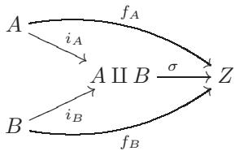

交换。

与积的泛性质之间的对称性希望是完全明显的。我们说一个范畴 $\mathsf { C }$ 有并积，如果这个普遍问题对于所有对象对 $A$ 和 $B$ 都有解。

读者熟悉任何直积吗？是的！

命题 5.6. 在集合中，并集是一个直积。

证明。回顾（§1.4）中，并集 $A \amalg B$ 被定义为两个不相交的同构副本 $A ^ { \prime }$ ，$B ^ { \prime }$ 的并集，分别对应于 $A$ ，$B$；例如，我们可以让 $A ^ { \prime } = \{ 0 \} \times A$ ，$B ^ { \prime } = \{ 1 \} \times B$ 。函数 $i _ { A }$ ，$i _ { B }$ 被定义为

$$
i _ { A } ( a ) = ( 0 , a ) , \quad i _ { B } ( b ) = ( 1 , b ) ,
$$

我们在将这些元素视为 $( \{ 0 \} \times A ) \cup ( \{ 1 \} \times B )$ 的元素时。

现在令 $f _ { A } : A \to Z$ ，$f _ { B } : B \to Z$ 是到公共目标的任意同态。定义

$$
\sigma : A \amalg B = ( \{ 0 \} \times A ) \cup ( \{ 1 \} \times B )  Z
$$

$$
\sigma ( c ) = \left\{ { \begin{array} { l l } { f _ { A } ( a ) } & { { \mathrm { i f ~ } } c = ( 0 , a ) \in \{ 0 \} \times A , } \\ { f _ { B } ( b ) } & { { \mathrm { i f ~ } } c = ( 1 , b ) \in \{ 1 \} \times B . } \end{array} } \right.
$$

这个定义使得相关图可交换，并且实际上是由这个可交换性强加给我们的，证明 $\sigma$ 存在且唯一。$\square$

这一观察告诉我们，集合范畴具有合取，并且进一步揭示了不相交并的奥秘。例如，我们在选择“a”不相交并时存在任意性，尽管不同的选择导致了同构的概念。现在我们明白了原因：范畴的终端对象一般不是唯一的，尽管它们在同构意义下是唯一的（命题5.4）；两个集合之间并没有“最美”的不相交并，就像集合范畴中并没有“最美”的单元素集合（参见§5.1）。

此外，从泛性质的角度来看，积与不相交并之间出现了一种意外的“对称性”。

读者被邀请思考我们在其他遇到的范畴中的直积概念。例如（而且可能在此阶段并不令人惊讶）从$\leq$在$\mathbb { Z }$上得到的范畴确实有直积：两个对象（即整数）$a$ ， $b$的直积简单地是$a$和$b$的最大值。

### 习题

5.1. 证明一个范畴 $\mathsf{C}$ 中的终对象在相反范畴 $\mathsf{C}^{op}$ 中是始对象（参见练习 3.1）。

5.2. $\triangleright$ 证明 $\varnothing$ 是 Set 中唯一的始对象。[§5.1]

5.3. $\triangleright$ 证明终对象在同构下是唯一的。[§5.1]

5.4. 在“带基点集”范畴中，始对象和终对象是什么（示例3.8）？它们是唯一的吗？

5.5. $\triangleright$ §5.3中考虑的分类的终对象是什么？ [§5.3]

5.6. $\triangleright$ 考虑赋予正整数集 $\mathbb { Z } ^ { + }$ 以整除关系的范畴（如示例 3.3）。因此，当且仅当 $d$ 能整除 $m$ 时，这个范畴中恰好存在一个同态 $d \to m$；否则，$d$ 和 $m$ 之间不存在同态。证明这个范畴有积和余积。它们的“传统”名称是什么？[§VII.5.1]

5.7. 重新做练习 2.9，这次使用命题 5.4。

5.8. 证明在每一范畴 $\mathsf{C}$ 中，如果积 $A \times B$ 和 $B \times A$ 存在，那么它们是同构的。（提示：观察到它们都满足 $A$ 和 $B$ 的积的泛性质；然后使用命题 5.4。）

5.9. 设 $\mathsf { C }$ 是一个具有积的范畴。找出三个对象 $A, B, C$ 的积 $A \times B \times C$ 应该满足的合理候选的泛性质，并证明 $( A \times B ) \times C$ 和 $A \times ( B \times C )$ 都满足这个泛性质。由此推导出 $( A \times B ) \times C$ 和 $A \times ( B \times C )$ 必然是同构的。

5.10. 继续进一步推动边界，为范畴（即索引集）的对象家族定义积和直积。

这些在集合中存在吗？通常用 $A \times \cdots \times A$ 表示 $A ^ { n }$。${ n }$ 次

5.11. 设 $A$ ， resp. $B$ 是一个集合，分别装备了等价关系 $\sim { \cal A }$ ， resp. $\sim _ { B }$ 。通过设置，在 $A \times B$ 上定义一个关系 $\sim$ 。

$$
( a _ { 1 } , b _ { 1 } ) \sim ( a _ { 2 } , b _ { 2 } ) \iff a _ { 1 } \sim _ { A } a _ { 2 } { \mathrm { ~ a n d ~ } } b _ { 1 } \sim _ { B } b _ { 2 } .
$$

（这立即被看作是一个等价关系。）

• 利用商的泛性质（§5.3）来证明存在函数 $( A \times B ) / { \sim } \to A / { \sim } _ { A }$ ，$( A \times B ) / { \sim } \to B / { \sim } _ { B }$ .

• 证明 $( A \times B ) / { \sim } $，利用这两个函数，满足 $A / { \sim } _ { A }$ 和 $B / { \sim } _ { B }$ 的积的泛性质。• 推断（无需进一步工作）$( A \times B ) / { \sim } \cong ( A / { \sim } _ { A } ) \times ( B / { \sim } _ { B } ) $。

5.12. $\neg$ 定义纤维积和纤维和的概念，作为在示例3.10中考虑的范畴 $\mathsf { C } _ { \alpha , \beta }$ ， $\mathsf { C } ^ { \alpha , \beta }$ 的终端对象，通过仔细陈述相应的泛性质。

碰巧，Set 既有纤维积也有并积。用朴素集合论来“具体地”定义这些对象。[II.3.9, III.6.10, III.6.11]

# 群，初遇

在本章中，我们介绍群，我们观察到它们构成一个范畴（称为Grp），并研究这个范畴的“一般”特征：这个范畴中的单态射和满态射是什么？群的“等价关系”和“商”的适当概念是什么？Grp中是否成立“分解定理”？以及其他类似的问题。

在第三章我们将对环和模获得类似的熟悉程度。对Grp的更面向对象的分析（例如，对著名的Sylow定理，“复合序列”或有限阿贝尔群的分类的处理）被推迟到第四章。

## 1. 群的定义

### 1.1. 群和群胚

笑话 1.1. 定义：一个群是一个只有一个对象的群胚（广群）。

这实际上是一个完全可行的定义，因为群胚已经被定义了（在示例 I.4.6 中）；但大多数数学家会认为以这种方式引入群是荒谬的，或者他们至少会礼貌地表达对此教学效果的怀疑。为了弥补我的过失，我将立即解析这个定义，以展示它真正说的是什么。如果 $^ *$ 是这样一个群胚 $\mathsf { G }$ 的唯一对象，

$$
\mathrm { H o m } _ { \mathsf { G } } ( * , * ) = \mathrm { A u t } _ { \mathsf { G } } ( * )
$$

(因为 $\sf G$ 是一个群胚！)，并且这个集合包含了关于 $\sf G$ 的所有信息。称这个集合为 $G$。然后（根据范畴的定义）$G$ 上有一个结合运算，具有单位元 $^ { 1 \ast }$，并且（根据群胚的定义，该定义指出 $\sf G$ 中的每个态射都是同构）$G$ 中的每个元素 $g$ 都有逆元 $g ^ { - 1 } \in G$。

这就是一个群1：一个集合 $G$ 与一个满足几个关键公理的组合法则，即结合律、单位元的存在以及逆元的存在。

1.2. 定义。现在给出正式定义。设 $G$ 是一个非空集合，赋予一个二元运算，即一个“乘法”映射。

$$
\bullet : G \times G \to G .
$$

我们的符号表示将

$$
\bullet ( g , h ) = : g \bullet h
$$

或者简单地写成 $g h$，如果操作的名字可以被理解。细心的读者可能会期望我们应该写成 $h \bullet g$，按照我们为范畴所做的方式，但这是由常见惯例规定的2。

定义1.2. 集合 $G$ ，配以二元运算 $\bullet$ （简称 $( G , \bullet )$ ，或仅 $G$ ，如果运算可以理解）是一个群，如果

(i) 运算符 $\cdot$ 是结合的，即，

$$
( \forall g , h , k \in G ) : \quad ( g \bullet h ) \bullet k = g \bullet ( h \bullet k ) ;
$$

(ii) 对于 $\bullet$ 存在一个单位元 $e _ { G }$，即，

$$
( \exists e _ { G } \in G ) ( \forall g \in G ) : \quad g \bullet e _ { G } = g = e _ { G } \bullet g ;
$$

(iii) $G$ 中的每个元素关于 $\bullet$ 都有一个逆元，即，

$$
( \forall g \in G ) ( \exists h \in G ) : \quad g \bullet h = e _ { G } = h \bullet g .
$$

示例 1.3. 由于我们明确要求 $G$ 非空，构造一个群最经济的方法是让 $G = \{ e \}$ 是一个单元素集合。在这种情况下，只有一个函数 $G \times G \to G$，因此 $G$ 上只有一个可能的二元运算，定义为

$$
e \bullet e : = e .
$$

这三个公理在这个例子中显然成立，因此 $\{ e \}$ 被赋予了一个唯一的群结构。

这通常被称为平凡群；严谨的人应该将任何这样的群称为$a$平凡群，因为每个单元素集合都会产生一个。

1.4. 读者应仔细检查（参见练习1.2），$( \mathbb { Z } , + )$ ，$( \mathbb { Q } , + )$ ，$( \mathbb { R } , + )$ ，$( \mathbb { C } , + )$ ，以及使用·的几种变体（例如，$\mathbb { Z }$ 的子集 $\{ + 1 , - 1 \}$ ，带有普通乘法）都给出群的例子。虽然它们本身非常有趣，但这些例子在直观层面上并不能真正捕捉到“群是什么”的本质，因为它们太特殊了。例如，所有这些例子都是交换的（参见§1.5）。

示例 1.5. 我的读者可能熟悉一个非常重要的非交换例子，即具有（比如说）实数元素的 invertible, $n \times n$ 矩阵的群，$n \geq 2$。在早期章节中，我将通常避免这类例子，因为当我们进入线性代数（从第六章开始）时，我们将有充足的机会思考矩阵。但在那时之前，我们可能会偶尔借一个或两个矩阵。读者现在应该检查 $2 \times 2$ 矩阵

$$
\binom { a } { c } \frac { b } { d } \Biggr )
$$

使用真实条目，并且 $a d - b c \neq 0$，在普通矩阵乘法下形成一个群：

$$
\left( { \begin{array} { c c } { a _ { 1 } } & { b _ { 1 } } \\ { c _ { 1 } } & { d _ { 1 } } \end{array} } \right) \cdot \left( { \begin{array} { c c } { a _ { 2 } } & { b _ { 2 } } \\ { c _ { 2 } } & { d _ { 2 } } \end{array} } \right) = \left( { \begin{array} { c c } { a _ { 1 } a _ { 2 } + b _ { 1 } c _ { 2 } } & { a _ { 1 } b _ { 2 } + b _ { 1 } d _ { 2 } } \\ { c _ { 1 } a _ { 2 } + d _ { 1 } c _ { 2 } } & { c _ { 1 } b _ { 2 } + d _ { 1 } d _ { 2 } } \end{array} } \right) .
$$

($a d - b c \neq 0$ 确保矩阵可逆。它的逆矩阵是什么？) 由于，例如，

$$
{ \binom { 1 } { 0 } } \ 1 ( { \begin{array} { l l } { 1 } & { 0 } \\ { 1 } & { 1 } \end{array} } ) = { \binom { 2 } { 1 } } \ 1 ) \neq { \binom { 1 } { 1 } } \ 1 \atop 2 ( 1 ) = { \binom { 1 } { 1 } } \ 1 ( { \begin{array} { l l } { 1 } & { 1 } \\ { 0 } & { 1 } \end{array} } ) ,
$$

这个群确实不是交换群。

可逆的实数矩阵的 $n \times n$ 矩阵的集合记为 $\mathrm { G L } _ { n } ( \mathbb { R } )$ 。

我们在 $\ S 2$ 中将遇到更多具有代表性的例子。

### 1.3. 基本性质

从“群对象”的角度来看，单位元 $e _ { G }$ 会被记为 $^ { 1 \ast }$。在群明确的情况下，通常省略 $G$（在符号表示中），并使用不同于 $e$ 的不同符号来表示这个元素：$^ { 1 }$ 和 $0$ 是根据上下文而选择的常用替代。无论如何，对于任何给定的群 $G$，这个元素都是唯一的。也就是说，群 $G$ 中的其他任何元素都不能作为单位元：

命题 1.6. 如果 $h \in G$ 是 $G$ 的单位元，那么 $h = e _ { G }$

顺便说一句，这使群成为指向集，在示例 I.3.8 的意义上：每个群都有一个明确定义的特指元素。

证明。首先利用 $e _ { G }$ 是一个恒等元，然后利用 $h$ 是一个恒等元，可以得到 $^ { 3 }$

$$
h = e _ { G } h = e _ { G } .
$$

有趣的是，这个论证仅使用了 $e _ { G }$ 是一个“左”单位元且 $h$ 是一个“右”单位元。$\square$

命题 1.7. 逆元也是唯一的：如果 $h _ { 1 } , h _ { 2}$ 都是 $G$ 中 $g$ 的逆元，那么 $h _ { 1 } = h _ { 2 }$ .

证明。这实际上源于命题I.4.2（通过将$G$视为具有单个对象的群对象的同构集合）。读者应该使用同样的技巧构造一个独立的证明，但应谨慎隐藏任何对形态的引用。$\square$

命题 1.7 授权我们给 $g$ 的逆赋予一个名称：这通常记为 $g ^ { - 1 }$。

还需要一个记号事项。群的定义只考虑了两个元素的“积”；在乘以一个元素序列时，原则上可以选择执行积的顺序。例如，

$$
( g _ { 1 } \bullet g _ { 2 } ) \bullet g _ { 3 }
$$

表示：将运算符 $\bullet$ 应用于 $g _ { 1 }$ 和 $g _ { 2 }$ ，然后将运算符 $\bullet$ 再次应用于该运算的结果和 ${ g 3 }$ ；同时

$$
g _ { 1 } \bullet ( g _ { 2 } \bullet g _ { 3 } )
$$

表示：将 $\bullet$ 应用于 ${ g _ { 2 } }$ 和 ${ g 3 }$ ，然后再次将其应用于 ${ g 1 }$ 和这个操作的 结果。

结合律告诉我们，三个元素上的运算结果与我们的执行方式无关。基于这一点，我们有理由写出

$$
g _ { 1 } \bullet g _ { 2 } \bullet g _ { 3 } ;
$$

这个表达式不是模糊的，通过结合律。那么四个或更多元素呢？读者应该在练习I.4.1中检查了，将任意数量的元素组合的所有方法都会得到相同的结果。所以我们也授权写类似的东西

$$
g _ { 1 } \bullet g _ { 2 } \bullet g _ { 3 } \bullet \cdot \cdot \bullet g _ { 1 7 } ;
$$

这也是明确的。然而，读者应该记住，当然，列出元素的顺序很重要：一般来说，

$$
g _ { 1 } \bullet g _ { 2 } \bullet g _ { 3 } \bullet \cdot \cdot \bullet g _ { 1 7 } \neq g _ { 2 } \bullet g _ { 1 } \bullet g _ { 3 } \bullet \cdot \cdot \bullet g _ { 1 7 } .
$$

当然，如果所有 $g _ { i }$ 相同，则无需这种关心；然后可以使用传统的“幂”符号5：$g ^ { 0 } = e _ { G}$ ，并且对于正整数 $n$

$$
g ^ { n } = \underbrace { g \bullet \cdots \bullet g } _ { n { \mathrm { ~ t i m e s } } } , \quad g ^ { - n } = \underbrace { g ^ { - 1 } \bullet \cdots \bullet g ^ { - 1 } } _ { n { \mathrm { ~ t i m e s } } } .
$$

容易验证，当 $\forall g \in G$ 且 $\forall m , n \in \mathbb { Z }$

$$
g ^ { m + n } = g ^ { m } g ^ { n } .
$$

### 1.4. 消去律

“消去”适用于群。也就是说，

命题 1.8. 设 $G$ 是一个群。那么 $\forall a , g , h \in G$

$$
g a = h a \implies g = h , \quad a g = a h \implies g = h
$$

证明。这两个命题都是通过乘以 $a^{-1}$（在适当的边）并应用结合律来证明的。例如，

$$
{ \begin{array} { r l } & { g a = h a \implies ( g a ) a ^ { - 1 } = ( h a ) a ^ { - 1 } \implies g ( a a ^ { - 1 } ) = h ( a a ^ { - 1 } ) \implies g e _ { G } = h e _ { G } } \\ & { \qquad \implies g = h . } \end{array} }
$$

对于另一个蕴涵的证明遵循相同的模式。

不满足消去律，因此不能构成群的运算例子很多。例如，普通的乘法运算并不能使实数集 $\mathbb{R}$ 构成一个群：事实上，0“不能被消去”，因为 $1 \cdot 0 = 2 \cdot 0$ 即使 $1 \neq 2$。当然，这里的问题在于 0 在乘法下没有逆元。碰巧，这是这个例子中唯一的问题：普通的乘法确实能使

$$
\mathbb { R } ^ { * } : = \mathbb { R } \setminus \{ 0 \}
$$

成一个群，读者应立即验证这一点。

### 1.5. 交换群

群的定义中未出现的公理之一是交换律：如果运算 $\bullet$ 满足“交换律”，则称之

(iv) $( \forall g , h \in G ) : \quad g \bullet h = h \bullet g .$

我们说两个元素 $g$ ， $h$ ‘交换’ 如果 $g h = h g$ 。因此，在一个交换群中，任何两个元素都交换。

“交换群”是重要的对象：它们在多种情境中自然出现，尤其是作为“环 $\mathbb{Z}$ 上的模”（我们将在第三章及以后详细讨论）。当它们以这种方式出现时，通常被称为**阿贝尔群**。

在处理阿贝尔群时使用的符号与群的标准符号略有不同。这是为了强调“ $\mathbb { Z }$ -模结构”，当阿贝尔群与其他运算共存时，这很有帮助——这种情况我们将经常遇到。

因此，阿贝尔群 $A$ 中的运算是通常用 $+$ 表示，并称为“加法”；单位元则称为 $0 _ { A }$；元素 $a \in A$ 的逆元记为 $- a$（或许应该称为“相反数”?). “幂”表示法当然被替换为“倍数”：$0 a = 0$，并且对于正整数 $n$

$$
n a = \underbrace { a + \cdots + a } _ { n { \mathrm { ~ t i m e s } } } , \quad ( - n ) a = \underbrace { ( - a ) + \cdots + ( - a ) } _ { n { \mathrm { ~ t i m e s } } } .
$$

读者应该记住，在这个阶段“ $n a$ ”是一种记法，而不是将 $A$ 中的两个元素 $n$ ， $a$ 应用于二元运算的结果。事实上， $n \in \mathbb { Z }$ 在任何合理意义上可能不是 $A$ 的元素。此外，即使 $n \neq m$ ，也很有可能 $r u = m a$ ，尽管“抵消”在群中起作用。

“交换”这个限定词和$0 _ { A }$、$- a$等符号，主要用于表示在某些标准情况下出现的交换群：例如，环、模、向量空间的定义是通过适当地丰富一个交换群来定义的，然后为了符号上的方便，将其提升为“交换”。

在其它情况下，交换群会自然出现，而无需触发“阿贝尔”的符号。例如，在   1.4  的结尾提到的群 $(\mathbb{R}^*,\cdot)$ 是交换群，但其运算用 $\cdot$ 表示（如果非要表示出来的话），其单位元写作 1。历史，而不是逻辑，往往是决定符号的主要因素。

### 1.6. 阶

定义1.9. 群$G$中的一个元素$g$具有有限阶，如果存在某个正整数$n$使得$g ^ { \prime \iota } = e$。在这种情况下，$g$的阶$| g |$是最小的正整数$n$，使得$g ^ { \prime \prime } = e$。如果$g$不具有有限阶，则写作$| g | = \infty$。

根据定义，如果对于某个正整数 $n$，有 $g ^ { \prime \iota } = e$，那么 $| g | \leq n$。可以更精确地表述：

引理 1.10. 如果 $g ^ { \prime \prime } = e$ 对于某个正整数 $n$ ，那么 $| g |$ 是 $n$ 的一个除数。

证明。如所观察，根据序的定义，$n \geq | g |$，即 $n - | g | \geq 0$。因此，必然存在一个正整数 $m$ 使得

$$
r = n - | g | \cdot m \geq 0 \quad { \mathrm { a n d } } \quad n - | g | \cdot ( m + 1 ) < 0 ,
$$

也就是说，$r < | g |$ 。注意

$$
g ^ { r } = g ^ { n - | g | \cdot m } = g ^ { n } \cdot ( g ^ { | g | } ) ^ { - m } = e \cdot e ^ { - m } = e .
$$

根据定义，$| g |$ 是最小的正整数，使得 $g ^ { | g | } = e$。由于 $r$ 小于 $| g |$ 且 $g ^ { \prime } = e$，$r$ 不能为正；因此 $r = 0$ 必然成立。这说明

$$
0 = n - | \boldsymbol { g } | \cdot m ,
$$

也就是说，$n = | \boldsymbol { g } | \cdot \boldsymbol { m }$ ，证明$n$确实是$| g |$的整数倍，正如所声称的那样。

这个引理有一个直接且有用的推论，我们鼓励读者牢牢记住：

推论1.11。设$_{g}$是有限阶的元素，且$N \in \mathbb{Z}$。那么

定义 1.12. 如果 $G$ 作为集合是有限的，它的阶 $| G |$ 是它的元素个数；  
如果 $G$ 是无限的，我们写 $| G | = \infty$。

取消意味着对于所有 $g \in G$ ，$| g | \leq | G |$ 。实际上，如果 $| G | = \infty$ ，这是空话；如果 $G$ 是有限的，考虑 $| G | + 1$ 次幂

$$
g ^ { 0 } = e , g , g ^ { 2 } , g ^ { 3 } , \ldots , g ^ { | G | }
$$

对于 ${ g }$ 。这些不能全部不同；因此

$$
( \exists i , j ) \quad 0 \leq i < j \leq | G | \quad { \mathrm { s u c h ~ t h a t ~ } } g ^ { i } = g ^ { j } .
$$

通过消去（即，在右侧乘以 $g^{-i}$）

$$
g ^ { j - i } = e ,
$$

显示 $| g | \leq ( j - i ) \leq | G |$ 。

我们将很快能够就群阶与其元素阶之间的关系作出一个更精确的陈述：如果 $g \in G$ 且 $| G |$ 是有限的，则 ${ g }$ 的阶整除 $G$ 的阶。这将直接是拉格朗日定理的结果；参见例8.15。

关于订单的另一个普遍评论是，它们相对于群的操作并不总是可预测的：完全可能发生 $g$ ， $h$ 在群 $G$ 中具有有限阶，但 $| gh | = \infty$ ，或 $| gh | =$ 你最喜欢的正整数：如果你不相信，那就做练习 1.12 和练习 2.6。

另一方面，如果 $g$ 和 $h$ 交换，情况则更加受限。在 $g = h$ 的极端情况下，很容易得到一个非常精确的陈述：

命题 1.13. 设 $g \in G$ 是一个有限阶元素。那么 $g ^ { m }$ 对所有 $m \geq 0$ 都有有限阶，并且实际上8

$$
| g ^ { m } | = { \frac { \mathrm { l c m } ( m , | g | ) } { m } } = { \frac { | g | } { \operatorname* { g c d } ( m , | g | ) } } .
$$

证明。两个数 $\frac { \operatorname { l c m } ( m , | g | ) } { m }$ 和 $\frac { | g | } { \operatorname* { g c d } ( m , | g | ) }$ 的相等性可由 gcd 和 lcm 的基本性质得出：$\operatorname { l c m } ( a , b ) = a b / \operatorname* { g c d } ( a , b )$ 对所有 $a$ 和 $b$ 都成立。因此我们只需证明 |gm| = lcm(m,|g|) 。

$g ^ { m }$ 的阶是使得

$$
g ^ { m d } = e ,
$$

那就是（根据推论1.11）对于$md$是$|g|$的倍数的情况。换句话说，$m | g ^ { m } |$是$m$的倍数中最小的也是$|g|$的倍数：

$$
m | g ^ { m } | = \operatorname { l c m } ( m , | g | ) .
$$

所陈述的公式直接由此得出。

通常情况下，对于可交换元素，

命题 1.14. 如果 $g h = h g$ ，那么 $| g h |$ 整除 $\operatorname { l c m } ( | g | , | h | )$ .

证明。设 $| g | = m$ ，$| h | = n$ 。如果 $N$ 是 $m$ 和 $n$ 的任意公倍数，那么根据推论 1.11，$g ^ { N } = h ^ { N } = e$。由于 ${ g }$ 和 $h$ 交换，

$$
( g h ) ^ { N } = \underbrace { ( g h ) ( g h ) \cdot \dots \cdot ( g h ) } _ { N { \mathrm { ~ t i m e s } } } = \underbrace { g g \cdot \dots \cdot g } _ { N { \mathrm { ~ t i m e s } } } \cdot \underbrace { h h \cdot \dots \cdot h } _ { N { \mathrm { ~ t i m e s } } } = g ^ { N } h ^ { N } = e .
$$

由于这对 $m$ 和 $n$ 的每个公倍数 $N$ 都成立，特别是

$$
( g h ) ^ { \operatorname { l c m } ( m , n ) } = e .
$$

然后该陈述可由引理 1.10 推出。

一般而言，即使 $g$ 和 $h$ 可交换（习题 1.13），也无法更多地说明 $| g h |$。但请参见习题 1.14，那里有一个重要的特殊情况。

### 习题

1.1. $\triangleright$ 写一个严谨的证明，每一个群是某个群对象的同构群。特别是，每一个群是某个范畴中某个对象的自同构群。[§2.1]

1.2. $\triangleright$ 考虑在1.1中列出的“数集”，并决定哪些是通过常规运算（如$^+$和·）分组形成的。即使答案是负的（例如，$( \mathbb { R } , \cdot )$不是群），看看这些集合定义的变体是否会导致群（例如，$( \mathbb { R } ^ { * } , \cdot )$是一个群；参见§1.4）。[§1.2]

1.3. 证明对于群 $G$ 中的任意元素 $g$ 和 $h$，都有 $( gh ) ^ { - 1 } = h ^ { - 1 } g ^ { - 1 }$。

1.4. 假设群$G$中所有元素$g$都满足$g ^ { 2 } = e$；证明$G$是交换群。

1.5. 群的“乘法表”是一个数组，它汇编了所有乘法 $g \bullet h$ 的结果：

<html><body><table><tr><td>.</td><td>e</td><td>·</td><td>h</td><td></td></tr><tr><td>e</td><td>e</td><td></td><td>h</td><td></td></tr><tr><td></td><td></td><td></td><td></td><td></td></tr><tr><td>g</td><td>g</td><td></td><td>g .</td><td></td></tr><tr><td>·</td><td></td><td>·</td><td></td><td></td></tr></table></body></html>

（这里 $e$ 是单位元。当然，乘法表取决于顶部行和最左侧列中元素的排列顺序。）证明群的乘法表的每一行和每一列都恰好包含群的所有元素一次（就像数独图一样！）

1.6. $\neg$ 证明如果 $G$ 恰好有 1、2 或 3 个元素，则 $G$ 只有一个可能的乘法表。分析恰好有 4 个元素的群的可能乘法表，并证明在重新排列 $G$ 的元素的情况下，存在两个不同的表。使用这些表来证明所有元素个数不超过 4 的群都是交换群。

(你可以使用相同的技术来分析具有5个元素的群，但你很快就会对群有足够的了解，从而能够避免这种蛮力方法。) [2.19]

1.7. 证明推论1.11。

1.8. $\neg$ 设 $G$ 是一个有限阿贝尔群，且 $G$ 中恰好有一个元素 $f$ 的阶为 2。证明 $\textstyle \prod _ { g \in G } g = f$ 。[4.16]

1.9. 设 $G$ 是一个有限群，阶为 $n$，设 $m$ 是 $G$ 中阶恰好为 2 的元素 $g$ 的个数。证明 $n - m$ 是奇数。推论：如果 $n$ 是偶数，那么 $G$ 必然包含阶为 2 的元素。

1.10. 假设 $g$ 的阶是奇数。你能对 $g ^ { 2 }$ 的阶说什么？

1.11. 证明对于群 $G$ 中的任意 $g$ ，$h$ ，都有 $| gh | = | hg |$ 。提示：证明对于群 $G$ 中的任意 $a$ ，$g$ ，都有 $| a g a ^ { - 1 } | =$ $| g |$ 。

1.12. $\triangleright$ 在可逆的 $2 \times 2$ 矩阵的群中，考虑

$$
g = { \binom { 0 } { 1 } } \quad { \binom { - 1 } { 0 } } , \quad h = { \binom { 0 } { - 1 } } \quad - 1 \biggr ) .
$$

验证 $| g | = 4$ ，$| h | = 3$ ，和 $| g h | = \infty$ 。[§1.6]

1.13. $\triangleright$ 给出一个例子，说明即使 $g$ 和 $h$ 可交换，$| gh |$ 也不一定等于 $\operatorname{lcm}(|g|, |h|)$。[§1.6, 1.14]

1.14. $\triangleright$ 作为对练习1.13的反驳，证明如果$g$和$h$交换且$g c d ( | g | , | h | ) = 1$，那么$\left| g h \right| = \left| g \right| \left| h \right|$。(提示：令$N = | g h |$；那么$g ^ { N } = ( h ^ { - 1 } ) ^ { N }$。你能对这个元素说什么？)[§1.6, 1.15, §IV.2.5]

1.15. $\neg$ 设 $G$ 是一个交换群，且 $g \in G$ 是一个具有极大有限阶的元素，即如果 $h \in G$ 具有有限阶，则 $| h | \leq | g |$。证明实际上如果 $h$ 在 $G$ 中具有有限阶，那么 $| h |$ 整除 $| g |$。（提示：通过反证法。如果 $| h |$ 是有限的但不整除 $| g |$，那么存在一个素数 $p$ 使得 $| g | = p ^ { m } r$，$| h | = p ^ { n } s$，其中 $r$ 和 $s$ 与 $p$ 互素，且 $m < n$。使用练习 1.14 来计算 $g ^ { p ^ { \prime \prime \prime } } h ^ { s }$ 的阶。）[§2.1, 4.11, IV.6.15]

## 2. 群的例子

###  2.1. 对称群
在 §I.4.1 中我们已经注意到，每个范畴 C 的每个对象 $A$ 都确定一个群，称为 $\operatorname { A u t } _ { \mathsf { C } } ( A )$ ，即 $A$ 的自同态群。在某种人为的意义上很明显，每个群都是这样产生的（参见习题 1.1）；这个事实以更“有意义”的方式成立，当我们在 §9 讨论群作用时将变得明显：特别是参见定理 9.5 和习题 9.17。

在任何情况下，这一观察都为读者提供了一系列非常重要的例子：

定义 2.1. 设 $A$ 是一个集合。对称群，或 $A$ 的置换群，记作 $S _ { A }$ ，是 $\operatorname { A u t } _ { \mathsf { S e t } } ( A )$ 这个群。集合 $\{ \mathbf { 1 } , \dots , \mathbf { n } \}$ 的置换群记作 $S _ { n }$ 。

术语很容易得到辩护：集合 $A$ 的自同构是集合同构，即双射，从 $A$ 到自身；应用这样的双射恰好等于排列（‘打乱’）$A$ 的元素。这种操作可以看作是 $A$ 的一个变换，它不改变它（作为一个集合），因此是一种‘对称性’。

$S _ { A }$ 组非常庞大：正如读者在练习 I.2.1 中检查的那样，$| S _ { n } | ~ = ~ n !$。例如，$| S _ { 7 0 } | ~ > ~ 1 0 ^ { 1 0 0 }$ ，这比可观测宇宙中基本粒子的估计数量大得多。

可能令人困惑的一点：在$S _ { A }$中的运算应该以何种方式书写，各种惯例存在冲突。从“自同构”的角度来看，$S _ { A }$中的元素是函数，应该以此方式组合；因此，如果$f , g \in S _ { A } = \operatorname { A u t } _ { { \mathsf { S e t } } } ( A )$，那么$f$和$g$的“积”应该写成$g \circ f$，并且应该如下作用：

$$
( \forall p \in A ) : \quad g \circ f ( p ) = g ( f ( p ) ) .
$$

但群论中流行的记法会将这个元素写成 $f g$，显然颠倒了操作执行的顺序。

如果我们采用在它们所作用的元素之后而不是之前编写函数的约定，一切都会恢复一致：$( p ) f$ 而不是 $f ( \boldsymbol p )$ 。但是人们不能改变百年来的习惯，所以我们别无选择，只能同时使用这两种约定，并在任何时候都仔细说明我们正在使用哪一种。

思考 $S_n$ 对于小的 $n$ 值是一个价值无法估量的练习。当然 $S_1$ 是一个平凡的群；$S_2$ 包含两种可能的排列：

$$
{ \left\{ \begin{array} { l l } { 1 \mapsto 1 } \\ { 2 \mapsto 2 } \end{array} \right. } \qquad { \mathrm { a n d } } \qquad { \left\{ \begin{array} { l l } { 1 \mapsto 2 } \\ { 2 \mapsto 1 } \end{array} \right. }
$$

我们称之为 $e$（恒等）和 $f$（翻转），具有运算

$$
e e = f f = e , \quad e f = f e = f .
$$

在实践中，我们无法为每个置换群中的每个不同元素赋予一个新的名称，因此我们必须开发一种更灵活的符号表示法。实际上，对于这一点有几种可能的选择；暂时，我们将通过列出将 $o$ 应用于列表 $1 , \ldots , n$ 下面的效果来表示一个元素 $\sigma \in S _ { n }$，作为一个矩阵9。因此，$S _ { 2 }$ 中的元素 $e$ ， $f$ 可以记为

$$
e = { \binom { 1 } { 1 } } \quad 2 \atop 2 \int \quad , \quad f = { \binom { 1 } { 2 } } \quad 2 \atop 1 \int .
$$

在相同的符号风格中，$S _ { 3 }$ 由组成

$$
\left\{ \left( { \begin{array} { c c c } { 1 } & { 2 } & { 3 } \\ { 1 } & { 2 } & { 3 } \end{array} } \right) , \left( { \begin{array} { c c c } { 1 } & { 2 } & { 3 } \\ { 2 } & { 1 } & { 3 } \end{array} } \right) , \left( { \begin{array} { c c c } { 1 } & { 2 } & { 3 } \\ { 3 } & { 2 } & { 1 } \end{array} } \right) , \left( { \begin{array} { c c c } { 1 } & { 2 } & { 3 } \\ { 1 } & { 3 } & { 2 } \end{array} } \right) , \left( { \begin{array} { c c c } { 1 } & { 2 } & { 3 } \\ { 3 } & { 1 } & { 2 } \end{array} } \right) , \left( { \begin{array} { c c c } { 1 } & { 2 } & { 3 } \\ { 2 } & { 3 } & { 1 } \end{array} } \right) \right\} .
$$

对于乘法，我将采用上面提到的合理（但不太标准）的约定，并让排列“在右侧”作用：例如，

$$
\mathbf { 1 } \left( { \begin{array} { c c c } { 1 } & { 2 } & { 3 } \\ { 2 } & { 1 } & { 3 } \end{array} } \right) \left( { \begin{array} { c c c } { 1 } & { 2 } & { 3 } \\ { 3 } & { 1 } & { 2 } \end{array} } \right) = \mathbf { 2 } \left( { \begin{array} { c c c } { 1 } & { 2 } & { 3 } \\ { 3 } & { 1 } & { 2 } \end{array} } \right) = \mathbf { 1 }
$$

并且类似地

$$
\begin{array} { r } { \mathbf { 2 } \left( \begin{array} { l l l } { 1 } & { 2 } & { 3 } \\ { 2 } & { 1 } & { 3 } \end{array} \right) \left( \begin{array} { l l l } { 1 } & { 2 } & { 3 } \\ { 3 } & { 1 } & { 2 } \end{array} \right) = \mathbf { 3 } , \quad \mathbf { 3 } \left( \begin{array} { l l l } { 1 } & { 2 } & { 3 } \\ { 2 } & { 1 } & { 3 } \end{array} \right) \left( \begin{array} { l l l } { 1 } & { 2 } & { 3 } \\ { 3 } & { 1 } & { 2 } \end{array} \right) = \mathbf { 2 } . } \end{array}
$$

也就是说，

$$
{ \left( \begin{array} { l l l } { 1 } & { 2 } & { 3 } \\ { 2 } & { 1 } & { 3 } \end{array} \right) } { \left( \begin{array} { l l l } { 1 } & { 2 } & { 3 } \\ { 3 } & { 1 } & { 2 } \end{array} \right) } = { \left( \begin{array} { l l l } { 1 } & { 2 } & { 3 } \\ { 1 } & { 3 } & { 2 } \end{array} \right) }
$$

由于等号两边的排列对1、2、3起相同的作用。读者现在应该检查。

$$
\left( { \begin{array} { c c c } { 1 } & { 2 } & { 3 } \\ { 3 } & { 1 } & { 2 } \end{array} } \right) \left( { \begin{array} { c c c } { 1 } & { 2 } & { 3 } \\ { 2 } & { 1 } & { 3 } \end{array} } \right) = \left( { \begin{array} { c c c } { 1 } & { 2 } & { 3 } \\ { 3 } & { 2 } & { 1 } \end{array} } \right) .
$$

也就是说，让

$$
x = { \binom { 1 } { 2 } } \quad 2 \quad 3 ) , \quad y = { \binom { 1 } { 3 } } \quad 2 \quad 3 ) ,
$$

然后

$$
y x \neq x y ,
$$

表明在 $S _ { 3 }$ 中的运算不满足交换律公理。因此，$S _ { 3 }$ 是一个非交换群；读者将立即意识到实际上 $S _ { n }$ 对所有 $n \geq 3$ 都是非交换的。

当交换关系不成立时，$S_3$ 中确实存在其他有趣的关系。例如，

$$
x ^ { 2 } = e , \quad y ^ { 3 } = e ,
$$

表明 $S _ { 3 }$ 包含阶为 1（单位元 $e$）、2（元素 $x$）和 3（元素 $_ y$）的元素；参见练习 2.2。（顺便说，这表明练习 1.15 的结果确实需要交换性假设。）此外，

$$
\begin{array}{c} y x = { \binom { 1 } { 3 } } \quad 2 \quad 3 \\ { 2 \quad 1 } \end{array}
$$

正如读者可以检查的那样。使用这些关系，我们看到任何 $x$ 和 $y$ 的任意组合的积 $x ^ { i _ { 1 } } y ^ { i _ { 2 } } x ^ { i _ { 3 } } y ^ { i _ { 4 } } \cdot \cdot \cdot$ 都可以简化为一个积 $x ^ { \ i } y ^ { \ j }$ ，其中 $0 \leq i \leq 1$ ， $0 \le j \le 2$ ，即简化为六个元素中的一个

$$
e , \quad y , \quad y ^ { 2 } , \quad x , \quad x y , \quad x y ^ { 2 } :
$$

例如

$$
y ^ { 7 } x ^ { 1 3 } y ^ { 5 } = ( y ^ { 3 } ) ^ { 2 } y ( x ^ { 2 } ) ^ { 6 } x y ^ { 3 } y ^ { 2 } = ( y x ) y ^ { 2 } = ( x y ^ { 2 } ) y ^ { 2 } = x y ^ { 3 } y = x y .
$$

另一方面，这六个元素都是不同的——这一点可以通过消去和排序考虑来检验10。例如，如果我们有 $x y ^ { 2 } = y$ ，那么通过消去我们会得到 $x = y ^ { - 1 }$ ，但这不可能，因为关系告诉我们 $x$ 的阶是 2，而 $y ^ { - 1 }$ 的阶是 3。

结论是，上面展示的六个积必须是 $S _ { 3 }$ 的六个元素：

$$
S _ { 3 } = \{ e , x , y , x y , y ^ { 2 } , x y ^ { 2 } \} .
$$

在过程中，我们已经验证了 $S _ { 3 }$ 也可以描述为由两个元素 $x$ 和 $y$ 生成的群，其“关系”为 $x ^ { 2 } = e$ ， $y ^ { 3 } = e$ ， $y x = x y ^ { 2 }$ 。

更一般地，群 $G$ 的一个子集 $A$ “生成” $G$，如果 $G$ 的每个元素都可以记为 $A$ 中元素的积和 $A$ 中元素的逆元的积。我们将在 6.3 节中更正式地讨论这个概念，并在 8.2 节中讨论以生成元和关系来描述群。

### 2.2. 二面体群
一种“对称性”是指保持结构的变换。当然，这只是当我们懒得严格定义相关范畴时，对自同态的一种松散说法。作为范畴对象的自同态，对称性自然会形成群。

一个可以生动地想象这个概念的情境是“几何图形”，例如平面上的多边形或空间中的多面体。相关的范畴可以定义如下：设对象是普通平面 $\mathbb { R } ^ { 2 }$ 的子集，并且两个子集 $A$ ， $B$ 之间的态射由平面的“刚性运动”（例如平移、旋转或关于一条线的反射）组成，这些运动将 $A$ 映射到 $B$ 的一个子集。对这些概念的严格处理在此刻会过于分散注意力，因此我将诉诸读者的直觉，就像我偶尔做的那样。

从这个角度来看，平面子集的“对称性”是将其映射到自身的刚性运动；它们显然形成一个群。

二面群可以定义为正多边形的对称群。将多边形放置使其中心位于原点（从而排除平移作为可能的对称性），我们看到正 $n$ 边形的二面群由 $n$ 个绕原点旋转 $2 \pi / n$ 弧度的旋转和 $n$ 个关于通过原点和顶点或边中点的直线的不同反射组成。因此，正 $n$ 边形的二面群由 $2 n$ 个元素组成；我将用符号 $D _ { 2 n }$ 表示这个群。

再次思考这些群，至少对于小的 $n$ 值来说，是一个极好的练习。有一种简单的方法可以将二面群与 §2.1 中的对称群联系起来，捕捉到正多边形 $P$ 的对称性是由 $P$ 的顶点的命运决定的这一事实。例如，将等边三角形的顶点按顺时针方向标记为 1、2、3；然后一个逆时针旋转 $2 \pi / 3$ 的角度将顶点 1 变换到顶点 3，$\mathbf { 3 }$ 变换到 2，$^ { 2 }$ 变换到 $\mathbf { 1 }$ ，而三角形的任何其他对称性都不会这样做。

从视觉上看，这看起来像是


换句话说，我们可以将等边三角形按 $2 \pi / 3$ 的逆时针旋转与一个排列相关联

$$
{ \binom { 1 } { 3 } } \quad { \textrm { 2 } } \quad { \textrm { 3 } } \quad
$$

这种标签定义了一个函数

$$
D _ { 6 }  S _ { 3 } ;
$$

此外，这个函数是单射的（因为对称性由它诱导的顶点排列所决定）。用更优雅的语言来说，我们将在适当的时候掌握它，我们说 $D _ { 6 }$ 在集合 $\{ \mathbf { 1 } , \mathbf { 2 } , \mathbf { 3 } \}$ 上作用（忠实地）。

很明显，这可以以几种方式完成（例如，我们可以用不同的方式标记顶点）。然而，任何这样的分配都将具有这样的性质：$D _ { 2 n }$ 中的对称性的组合对应于 $S _ { n }$ 中的排列的组合；读者应该仔细地为涉及 $D _ { 6 }  S _ { 3 }$ 和 $D _ { 8 }  S _ { 4 }$ 的几个例子来演算这一点。

用简洁的方式描述这种情况是，这些函数是（群）同态（参见§4）。由于$D _ { 6 }$和$S _ { 3}$都有6个元素，并且上面给出的函数$D _ { 6 }  S _ { 3}$是单射的，它也必须是满射的。因此，$D _ { 6 }$和$S _ { 3}$之间存在双射同态；我们称这些群是同构的（参见§4.3）。我们将在接下来的几节中非常仔细地研究这些概念。

作为另一种（更抽象的）得出相同结论的方法，用 $y$ 表示上述的顺时针旋转，用 $x$ 表示关于我们等边三角形中心与顶点3的直线的反射：


两次反射得到恒等变换，三次旋转也是如此；因此

$$
x ^ { 2 } = e , \quad y ^ { 3 } = e .
$$

此外，$y x$（逆时针旋转$2 \pi / 3$，然后关于斜线翻转）与$x y ^ { 2 }$（先翻转，然后顺时针旋转$2 \pi / 3$）具有相同的对称性。也就是说，

$$
y x = x y ^ { 2 } .
$$

换句话说，群 $D _ { 6 }$ 也可以由两个元素 $x , y$ 生成，满足关系 $x ^ { 2 } = e$ ， $y ^ { 3 } = e$ ， $y x = x y ^ { 2 }$ —与我们为 $S _ { 3 }$ 找到的完全一样。由于 $D _ { 6 }$ 和 $S _ { 3 }$ 在生成元和关系方面有相同的描述（即相同的表示；参见 8.2），‘当然’它们是同构的。

### 2.3. 循环群和模运算
设 $n$ 为一个正整数。考虑在 $\mathbb { Z }$ 上定义的等价关系12

$$
( \forall a , b \in \mathbb { Z } ) : \quad a \equiv b \mod n \iff n \mid ( b - a ) .
$$

这被称为模${ n }$同余。我们已经在$n = 2$时在示例I.1.3中遇到过这种关系。对于所有$n$，很容易验证它是一个等价关系；等价类的集合通常记为$\mathbb { Z } _ { n }$，$\mathbb { Z } / ( n )$，$\mathbb { Z } / n \mathbb { Z }$，或$\mathbb { F } _ { n }$。我们将选择$\mathbb { Z } / n \mathbb { Z }$，它不会被其他概念13所预占。我将用$\lfloor a \rfloor _ { n }$表示整数$a$模$n$的等价类，或者在不会引起歧义的情况下简单地记为$[ a ]$。

读者应仔细检查 $\mathbb { Z } / n \mathbb { Z }$ 恰好由 $n$ 个元素组成，即

$$
[ 0 ] _ { n } , \quad [ 1 ] _ { n } , \quad \cdot \cdot \cdot , \quad [ n - 1 ] _ { n } .
$$

我们可以利用 $\mathbb{Z}$ 上的群结构来诱导 $\mathbb{Z} / n \mathbb{Z}$ 上的（阿贝尔）群结构。为此，我们定义 $\mathbb{Z} / n \mathbb{Z}$ 上的运算 $^+$，通过设置 $\forall a , b \in \mathbb{Z}$

$$
[ a ] + [ b ] : = [ a + b ] .
$$

当然我们必须检查这个处方是良好定义的；幸运的是，这非常容易：以下的小引理完成了这项工作，因为它表明操作的结果不依赖于为类选择的代表。

引理 2.2. 如果 $a \equiv a ^ { \prime } { \bmod { n } }$ 且 $b \equiv b ^ { \prime } { \bmod { n } }$ ，那么

$$
( a + b ) \equiv ( a ^ { \prime } + b ^ { \prime } ) \mod n .
$$

证明。根据假设 $n \mid ( a ^ { \prime } - a )$ 和 $n \mid ( b ^ { \prime } - b )$；因此 $\exists k , \ell \in \mathbb { Z }$ 使得

$$
\begin{array} { r } { ( a ^ { \prime } - a ) = k n , \quad ( b ^ { \prime } - b ) = \ell n . } \end{array}
$$

然后

$$
( a ^ { \prime } + b ^ { \prime } ) - ( a + b ) = ( a ^ { \prime } - a ) + ( b ^ { \prime } - b ) = k n + \ell n = ( k + \ell ) n .
$$

证明 ${ n }$ 整除 $( a ^ { \prime } + b ^ { \prime } ) - ( a + b )$ ，如所需。

因此，我们在$\mathbb{Z}/n\mathbb{Z}$上有一个二元运算$^+$。可以立即验证所得结构是一个群。结合律继承自$\mathbb{Z}$：

$( [ a ] + [ b ] ) + [ c ] = [ a + b ] + [ c ] = [ ( a + b ) + c ] = [ a + ( b + c ) ] = [ a ] + [ b + c ] = [ a ] + ( [ b ] + [ c ] )$ ；   
以及单位元 [0] 和“逆元” $- \lfloor a \rfloor = \lfloor - a \rfloor$ 。

它也立即检查了所得的群 $\mathbb { Z } / n \mathbb { Z }$ 是交换的，正如阿贝尔式符号所暗示的那样：

$$
[ a ] + [ b ] = [ a + b ] = [ b + a ] = [ b ] + [ a ] .
$$

我相信这些材料对读者来说并不新鲜，无论如何都应该仔细检查所有这些断言。

由此得到的阿贝尔群，连同 $\mathbb { Z }$ ，被称为循环群；群 $( \mathbb { Z } / n \mathbb { Z } , + )$ 的一个常用替代符号是 $C _ { n }$ 。当人们想要使用“乘法”而不是“加法”符号时，尤其采用这种表示方法；因此我们可以说 $C _ { n }$ 是由一个元素 ${ x }$ 生成的，其关系为 $x ^ { \pi } = e$ 。

循环群非常重要，我们将在后面的章节中再次回到它们。目前，我们记录一个事实，即元素

$$
[ 1 ] _ { n } \in \mathbb { Z } / n \mathbb { Z }
$$

生成群，在某种意义上，其他每个元素都可以作为这个元素的倍数得到。例如，如果 $m \geq 0$ 是一个整数，那么

$$
[ m ] _ { n } = [ \underbrace { 1 + \dots + 1 } _ { m { \mathrm { ~ t i m e s } } } ] _ { n } = \underbrace { [ 1 ] _ { n } + \dots + [ 1 ] _ { n } } _ { m { \mathrm { ~ t i m e s } } } = m \cdot [ 1 ] _ { n } .
$$

等价地，我们可以通过观察$[1]_n$在$\mathbb{Z}/n\mathbb{Z}$中的阶是$n$来表述这一事实：这意味着$n$个倍数$0\cdot\lfloor 1 \rfloor_n$，$1\cdot\lfloor 1 \rfloor_n$，$\ldots$，$(n-1)\cdot\lfloor 1 \rfloor_n$都必须互不相同，并且因此它们必须填满$\mathbb{Z}/n\mathbb{Z}$。

命题 2.3. $\lfloor m \rfloor _ { n }$ 在 $\mathbb { Z } / n \mathbb { Z }$ 中的阶为 $^ { 1 }$ 如果 $n \mid m$ ，以及更一般地

$$
| [ m ] _ { n } | = { \frac { n } { \operatorname* { g c d } ( m , n ) } } .
$$

证明。如果 $n \mid m$ ，那么 $\lfloor m \rfloor _ { n } = \lfloor 0 \rfloor _ { n }$ 。如果 $n$ 不整除 ${ m }$ ，再次观察 $[ m ] _ { n } = m [ 1 ] _ { n }$ 并应用命题 1.13。$\square$

注2.4. 因此，$\mathbb { Z } / n \mathbb { Z }$中每个元素的阶都整除$n =$ $|\mathbb { Z } / n \mathbb { Z } |$，即群的阶。我们稍后将会看到（示例8.15），这是任何有限群中元素阶的一个普遍特征。L

推论 2.5. 类 $[ m ] _ { n }$ 生成 $\mathbb { Z } / n \mathbb { Z }$ 当且仅当 $\operatorname* { g c d } ( m , n ) = 1$

这个简单结果非常重要。例如，如果 $n = p$ 是一个素数，它表明群 $\mathbb { Z } / p \mathbb { Z }$ 中的每个非零类都生成它。在任何情况下，它允许我们构造更多有趣的群例子。读者应该检查（或回忆；参见练习2.14）在 $\mathbb { Z } / n \mathbb { Z }$ 上也存在一个定义良好的乘法，由

$$
[ a ] _ { n } \cdot [ b ] _ { n } : = [ a b ] _ { n } .
$$

这个运算在 $\mathbb{Z}/n\mathbb{Z}$ 上不定义群结构：实际上，类 $[0]_n$ 没有乘法逆元。另一方面，对于任何正整数 $n$，记 $(\mathbb{Z}/n\mathbb{Z})^*$ 为 $\mathbb{Z}/n\mathbb{Z}$ 的子集，它包含所有满足 $\operatorname*{gcd}(m,n)=1$ 的类 $|m|_n$：

$$
( \mathbb { Z } / n \mathbb { Z } ) ^ { * } : = \{ [ m ] _ { n } \in \mathbb { Z } / n \mathbb { Z } | \operatorname* { g c d } ( m , n ) = 1 \} .
$$

这个子集显然是明确定义的：如果 $m \equiv m ^ { \prime } { \bmod { n } }$ ，那么 $\operatorname* { g c d } ( m , n ) = 1 \iff$ $\operatorname* { g c d } ( m ^ { \prime } , n ) = 1$（习题 2.17），因此 $( \mathbb { Z } / n \mathbb { Z } ) ^ { * }$ 中类的定义属性与代表无关。

命题 2.6. 乘法使$( \mathbb { Z } / n \mathbb { Z } ) ^ { * }$成为一个群。

证明。最大公约数的简单性质表明，如果 $\operatorname* { g c d } ( m _ { 1 } , n ) = \operatorname* { g c d } ( m _ { 2 } , n ) = 1$ ，那么 $\operatorname* { g c d } ( m _ { 1 } m _ { 2} , n ) = 1$ 。（例如，如果一个素数整除 ${ n }$ 和 $m _ { 1 } m _ { 2}$ ，那么它必然整除 $m _ { 1 }$ 或 $m _ { 2}$ ，并且这两个最大公约数中至少有一个不为 1。）因此，$( \mathbb { Z } / n \mathbb { Z } ) ^ { * }$ 中两个元素的和仍然属于 $( \mathbb { Z } / n \mathbb { Z } ) ^ { * }$ ，并且 · 确实定义了一个二元运算。

$$
( \mathbb { Z } / n \mathbb { Z } ) ^ { * } \times ( \mathbb { Z } / n \mathbb { Z } ) ^ { * } \to ( \mathbb { Z } / n \mathbb { Z } ) ^ { * } .
$$

很明显，这个运算是结合的（因为乘法在 $\mathbb{Z}$ 中是结合的）；$[1]_n$ 是 $(\mathbb{Z}/n\mathbb{Z})^*$ 的一个元素，并且对于乘法是单位元；所以我们只需要检查 $(\mathbb{Z}/n\mathbb{Z})^*$ 的元素在 $(\mathbb{Z}/n\mathbb{Z})^*$ 中是否有乘法逆元。

这由推论 2.5 推出。如果 $\operatorname* { g c d } ( m , n ) = 1$，那么 $| m | _ { n }$ 生成加法群 $\mathbb { Z } / n \mathbb { Z}$，因此某个 $[ m ] _ { n }$ 的倍数必须等于 $\lfloor 1 \rfloor _ { n }$：

$$
( \exists a \in \mathbb { Z } ) : \quad a \cdot [ m ] _ { n } = [ 1 ] _ { n } ;
$$

这表明

$$
[ a ] _ { n } [ m ] _ { n } = [ 1 ] _ { n } .
$$

因此 $\lfloor m \rfloor _ { n }$ 在 $\mathbb { Z } / n \mathbb { Z }$ 中确实有一个乘法逆元，即 $[ a ] _ { n }$。读者将验证 $\operatorname* { g c d } ( a , n ) = 1$，从而完成证明。

例如，$\lfloor 8 \rfloor _ { 1 5 }$ 在 $( \mathbb { Z } / 1 5 \mathbb { Z } ) ^ { * }$ 中有乘法逆元。跟踪证明中给出的论点，

$$
2 \cdot 8 + ( - 1 ) \cdot 1 5 = 1 ,
$$

因此 [2] ${ 1 5 } \cdot [ 8 ] _ { 1 5 } = [ 1 ] _ { 1 5 }$ ：[8] $^ { 1 5 }$ 的乘法逆元是 [2] $^ { 1 5 }$

对于 $n = p$ 是一个正素数，群 $( ( \mathbb { Z } / p \mathbb { Z } ) ^ { * } , \cdot )$ 的阶为 $( p - 1 )$ 我们将在后面的章节中更多地讨论这些群（参见示例 4.6）。

### 习题

2.1. $\neg$ 可以将一个 $n \times n$ 矩阵 $M _ { \sigma }$ 与一个排列  $\sigma \in S _ { n }$ 关联起来, 通过让 $( i , ( i ) \sigma )$ 处的条目为 $1$ 并让所有其他条目为 $0$。例如，与置换相对应的矩阵

$$
\sigma = { \binom { 1 } { 3 } } \quad { \overset { \mathrm { 2 } } { 1 } } \quad { \overset { \mathrm { 3 } } { 2 } } { \bigg ) } \in S _ { 3 }
$$

将会

$$
M _ { \sigma } = { \it \left( \begin{array} { l l l } { 0 } & { 0 } & { 1 } \\ { 1 } & { 0 } & { 0 } \\ { 0 } & { 1 } & { 0 } \end{array} \right) } .
$$

证明，使用这种记法，

$$
M _ { \sigma \tau } = M _ { \sigma } M _ { \tau }
$$

对于所有 $\sigma , \tau \in S _ { n }$ ，其中右侧的积是矩阵的普通积。[IV.4.13]

2.2. $\triangleright$ 证明如果 $d \leq n$ ，那么 $S _ { n }$ 包含阶为 $d$ 的元素。[§2.1]

2.3. 对于每一个正整数 $n$，在 $S _ { \mathbb { N } }$ 中找到一个阶为 $n$ 的元素。

2.4. 通过标记正方形的顶点来定义一个同态 $D _ { 8 }  S _ { 4 }$，就像我们在§2.2中对三角形所做的那样。列出这个同态像中的8个排列。

2.5. $\triangleright$ 描述所有二面体群 $D _ { 2 n }$ 的生成元和关系。(提示：设 $x$ 为关于通过正 $n$ -边形的中心和一个顶点的直线的反射，设 $y$ 为逆时针旋转 $2 \pi / n$ 。群 $D _ { 2 n }$ 将由 $x$ 和 $y$ 生成，并满足三个关系14。为证明这些关系确实确定 $ { \boldsymbol { D } } _ { 2 n }$ ，使用它们来证明任何积 $x ^ { i _ { 1 } } y ^ { i _ { 2 } } x ^ { i _ { 3 } } y ^ { i _ { 4 } } \cdot \cdot \cdot$ 等于 $x ^ { i } y ^ { j }$，其中 $0 \leq i \leq 1$，$0 \leq j < n$。) [8.4, §IV.2.5]

2.6. $\triangleright$ 对于每一个正整数 $n$ 构造一个包含元素 ${ g }$ ， $h$ 的群，使得 $| g | = 2$ ， $| h | = 2$ ，并且 $| g h | = n$ 。(提示：对于 $n > 1$ ， $ { \boldsymbol { D } } _ { 2 n }$ 就可以。) [§1.6]

2.7. $\neg$ 找出 $D _ { 2 n }$ 中与所有其他元素交换的所有元素。（$n$ 的奇偶性起作用。）[IV.1.2]

2.8. 求五个“正多面体”的对称群的阶。

2.9. 仔细验证‘模 $n ^ { \prime }$ 同余是一个等价关系。

2.10. 证明  $n > 0$ 时 $\mathbb{Z}/n\mathbb{Z}$ 恰好由 $n$ 个元素组成。

2.11. $\triangleright$ 证明每个奇数的平方模 8 同余于 1。[§VII.5.1]

2.12. 证明不存在非零整数 $a , b , c$ 使得 $a ^ { 2 } + b ^ { 2 } = 3 c ^ { 2 }$ 。（提示：通过研究在 $\mathbb { Z } / 4 \mathbb { Z }$ 中的方程 $[ a ] _ { 4 } ^ { 2 } + [ b ] _ { 4 } ^ { 2 } = 3 [ c ] _ { 4 } ^ { 2 }$ ，证明 $a$ ，$b$ ，$c$ 都必须是偶数。令 $a = 2 k$ ， $b = 2 \ell$ ， $c = 2 m$ ，则会有 $k ^ { 2 } + \ell ^ { 2 } = 3 m ^ { 2 }$ 。有什么问题？）

2.13. $\triangleright$ 证明如果 $\operatorname* { gcd } ( m , n ) = 1$ ，那么存在整数 $a$ 和 $b$ 使得

$$
a m + b n = 1 .
$$

（使用推论2.5。）反过来，证明如果对于某些整数$a$和$b$，有$a m + b n = 1$，那么$\operatorname* { g c d } ( m , n ) = 1$。[2.15, §V.2.1, V.2.4]

2.14. $\triangleright$ 陈述并证明引理 2.2 的一个类比，证明 $\mathbb { Z } / n \mathbb { Z }$ 上的乘法是一个良定义运算。[§2.3, §III.1.2]

2.15. $\neg$ 设 $n > 0$ 为奇数。

• 证明如果 $\operatorname* { g c d } ( m , n ) = 1$ ，那么 $\operatorname* { g c d } ( 2 m + n , 2 n ) = 1$ 。（使用习题 2.13。）
• 证明如果 $\operatorname* { g c d } ( r , 2 n ) = 1$ ，那么 $\begin{array} { r } { \operatorname* { g c d } ( \frac { r - n } { 2 } , n ) = 1 } \end{array}$ 。（同上。）
• 推出函数 $[ m ] _ { n }  [ 2 m + n ] _ { 2 n }$ 是 $( \mathbb { Z } / n \mathbb { Z } ) ^ { * }$ 和 $( \mathbb { Z } / 2 n \mathbb { Z } ) ^ { * }$ 之间的双射。

$(\mathbb{Z}/n\mathbb{Z})^*$ 中的元素个数 $\phi(n)$ 是欧拉函数。读者刚刚证明了如果 $\boldsymbol{n}$ 是奇数，那么 $\phi(2n) = \phi(n)$。后面将给出更一般的公式（参见练习 V.6.8）。[VII.5.11]

2.16. 求 $1 2 3 8 2 3 7 ^ { 1 8 2 3 8 4 5 6 }$ 在 $\mathbb{Z}/10\mathbb{Z}$ 下的个位数。(进行计算。)

2.17. $\triangleright$ 证明如果 $m \equiv m ^ { \prime } { \bmod { n } }$ ，那么 $\operatorname* { \Pi } ( m , n ) = 1$ 当且仅当 $\operatorname* { g c d } ( m ^ { \prime } , n ) =$

1. [§2.3]


2.18. 对于 $d \leq n$，定义一个保持运算的双射函数 $\mathbb { Z } / d \mathbb { Z } \to S _ { n }$，即 $\mathbb { Z } / d \mathbb { Z }$ 中等价类的和对应于相应排列的积。

2.19. $\triangleright$ $( \mathbb { Z } / 5 \mathbb { Z } ) ^ { * }$ 和 $( \mathbb { Z } / 1 2 \mathbb { Z } ) ^ { * }$ 都由 4 个元素组成。写出它们的乘法表，并证明没有任何元素的重新排列会使它们匹配。(参见练习 1.6。) [§4.3]

## 3. 范畴 Grp

群将是Grp类中的对象。在本节中，我们定义该类中的同态并处理这些同态的简单性质。

### 3.1. 群同态
众所周知，群包含两种不同的信息：一个集合 $G$ 和一个运算15

$$
m _ { G } : G \times G \to G
$$

满足某些性质。对于两个群$(G, m_G)$和$(H, m_H)$，一个群同态

$$
\varphi : ( G , m _ { G } )  ( H , m _ { H } )
$$

首先，这是一个函数（通常使用相同的名称，例如这里的 $\varphi$）在底层集合之间；但这个函数必须“了解” $G$ 上的操作 $m _ { G }$ ，$H$ 上的操作 $m _ { H }$ 。这种要求中最自然的要求是什么？

注意，集合函数 $\varphi : G \rightarrow H$ 确定一个函数

$$
( \varphi \times \varphi ) : G \times G \to H \times H :
$$

我们可以利用积的泛性质来得到这个函数（参见练习3.1），但由于我们处理的是集合，这里不需要花哨的语言——直接定义函数即可

$$
( \forall ( a , b ) \in G \times G ) : \quad ( \varphi \times \varphi ) ( a , b ) = ( \varphi ( a ) , \varphi ( b ) ) .
$$

有一个图表结合了所有这些地图：

$$
\begin{array} { r l r } & { } & { G \times G \xrightarrow { \varphi \times \varphi } H \times H } \\ & { } & { m _ { G } \Bigg \downarrow \qquad \underbrace { m _ { H } } } \\ & { } & { G \xrightarrow { \quad \varphi \quad \quad \varphi \quad \quad \varphi } H } \end{array}
$$

有什么要求比要求这个图可换更自然呢？

定义 3.1. 集合函数 $\varphi : G \rightarrow H$ 如果上述图是可交换的，则定义了一个群同态。

这似乎是一种复杂的方式来说明一个简单的问题：由于 $\varphi$ 和 $m _ { G }$ ，$m _ { H }$ 是集合的函数，交换性意味着以下内容。对于所有 $a , b \in G$ ，通过图表的两种方式给出

$$
\begin{array} { l c c } { ( a , b ) \cdots } & { \cdots } & { \cdots } \\ { \coprod _ { \begin{array} { c } { 1 } \\ { \big \{ } } \\ { 2 } \\ { 3 } \end{array} \} } & { \qquad } & { \overbrace { \begin{array} { c } { \vdots } \\ { \vdots } \\ { \vdots } \\ { \vdots } \\ { \vdots } \end{array} } } & { \qquad \begin{array} { c } { ( a , b ) \longmapsto ( \varphi ( a ) , \varphi ( b ) ) } \\ { \vdots } \\ { \big \{ } \\ { a \cdot b \longmapsto \cdots } \end{array} } \end{array}
$$

我在这里写，对于两个操作：在 $G$ 左边，在 $H$ 右边。图示的交换性意味着我们必须在两种情况下得到相同的结果；因此，定义 3.1 可以重新表述为

映射 $\varphi : G \to H$ 是一个群同态，如果 $\because \forall a , b \in G$

$$
\varphi ( a \cdot b ) = \varphi ( a ) \cdot \varphi ( b ) .
$$

换句话说，$\varphi$ 是一个同态，如果它“保持结构”。这可能对读者来说更熟悉。像往常一样，引入图（如定义3.1）的原因是，这将使将部分讨论转移到其他范畴变得容易。

如果上下文清晰，可以直接写“同态”，省略限定词“群”。

### 3.2. 群：定义
对于 $G$ ，$H$ 群 $^{16}$ 我们定义

$$
{ \mathrm { H o m } } _ { \mathsf { G r p } } ( G , H )
$$

成为群同态的集合 $G  H$ 。

如果 $G$ ， $H$ ， $K$ 是群，并且 $\varphi : G \to H$ ， $\psi : H \to K$ 是两个群同态，很容易验证复合 $\psi \circ \varphi : G \to K$ 是一个群同态：从图的角度来看，这相当于观察到‘外矩形’


如果两个“内部矩形”可换，则必须可换。对于任意的 $a , b \in G$ ，这意味着，

$$
\begin{array} { c } { ( \psi \circ \varphi ) ( a \cdot b ) = \psi ( \varphi ( a \cdot b ) ) \stackrel { ( 1 ) } { = } \psi ( \varphi ( a ) \cdot \varphi ( b ) ) \stackrel { ( 2 ) } { = } \psi ( \varphi ( a ) ) \cdot \psi ( \varphi ( b ) ) } \\ { = ( \psi \circ \varphi ) ( a ) \cdot ( \psi \circ \varphi ) ( b ) } \end{array}
$$

(1) 成立是因为 $\varphi$ 是一个同态，(2) 成立是因为 $\psi$ 是一个同态。

此外，很明显复合运算是结合的（因为它对于集合函数是结合的），并且恒等函数 $\operatorname { i d } _ { G } : G \to G$ 是一个群同态。因此，Grp 确实是一个范畴。

### 3.3. 暂停反思
细心的读者可能会提出异议：群公理规定了单位元 $e _ { G }$ 的存在以及一个“逆元”，即一个特定的函数

$$
\iota _ { G } : G \to G , \quad \iota _ { G } ( g ) : = g ^ { - 1 } .
$$

难道群（Grp）中的同态定义不应该跟踪这种类型的数据吗？我们给出的定义只跟踪乘法映射 ${ \boldsymbol { m } } _ { G }$ 。

我们能这样做的理由是，保留 $m$ 会自动保留 $e$ 和 $\iota$。

命题 3.2. 设 $\varphi : G \rightarrow H$ 是一个群同态。那么

• $\varphi ( e _ { G } ) = e _ { H}$ ;   
• $\forall g \in G$ , $\varphi ( g ^ { - 1 } ) = \varphi ( g ) ^ { - 1 }$ .

在图表方面，第二个断言相当于说


必须交换。

证明。第一点源于同态的定义和消去律：由于 $e _ { H } = e _ { H } \cdot e _ { H }$ ，

$$
e _ { H } \cdot \varphi ( e _ { G } ) = \varphi ( e _ { G } ) = \varphi ( e _ { G } \cdot e _ { G } ) = \varphi ( e _ { G } ) \cdot \varphi ( e _ { G } ) ,
$$

这意味着通过“抵消 $\varphi ( e _ { G } ) \gamma$”得到 $e _ { H } = \varphi ( e _ { G } )$。

第二个断言的证明是类似的：$\forall g \in G$ ，

$$
\varphi ( g ^ { - 1 } ) \cdot \varphi ( g ) = \varphi ( g ^ { - 1 } \cdot g ) = \varphi ( e _ { G } ) = e _ { H } = \varphi ( g ) ^ { - 1 } \cdot \varphi ( g ) ,
$$

暗示 $\varphi ( g ^ { - 1 } ) = \varphi ( g ) ^ { - 1 }$ 通过消去。

### 3.4. 积等
范畴Grp和Set最初看起来很相似：给定一个群，我们可以“忘记”乘法的信息，我们就剩下了一个集合；给定一个群同态，我们可以忘记它保持乘法的事实，我们就剩下一个集合函数。表达这一事实的一种简洁方式是存在一个“函子”$\mathsf { G r p }  \mathsf { S e t }$（实际上称为一个“忘记”函子）；我们将在第八章开始时更详细地处理函子。

然而，这两个范畴之间存在重要差异。例如，回想一下集合有一个唯一的始对象（即 $\varnothing$），而这与终对象（即单元素集合）不同。此外，回想一下平凡群是一个只有一个元素的群（示例 1.3）。

命题 3.3. 恒等群在 Grp 中既是始对象也是终对象。

这使得平凡群成为Grp类中的“零对象”。

证明。显然平凡群是最终的：从集合到单元素集只有一个函数，即常函数；这是空缺地是一个群同态。

要证明平凡群是初始群，令 $T = \{ e \}$ 为一个平凡群；对于任意群 $G$ ，定义 $\varphi : T \rightarrow G$ 为 $T ( e ) = e _ { G }$ 。这显然是一个群同态，并且它是唯一可能的同态，因为每个群同态都必须将单位元映射到单位元（命题 3.2）。$\square$

这里有一个相似性：Grp 有积；事实上，两个群 $G$，$H$ 的积在底集的积 $G \times H$ 上是有定义的。

要看到这一点，我们需要在 $G \times H$ 上定义一个乘法；这里的关键词是按分量：通过分别在每个分量上执行操作来定义 $G \times H$ 中的操作。具体来说，定义 $\forall g _ { 1 } , g _ { 2 } \in G$ ，$\forall h _ { 1 } , h _ { 2 } \in H$

$$
( g _ { 1 } , h _ { 1 } ) \cdot ( g _ { 2 } , h _ { 2 } ) : = ( g _ { 1 } g _ { 2 } , h _ { 1 } h _ { 2 } ) .
$$

这个运算在 $G \times H$ 上定义了一个群结构：该运算是结合的，单位元是 $( e _ { G } , e _ { H } )$ ，$( g , h )$ 的逆元是 $( g ^ { - 1 } , h ^ { - 1 } )$ 。所有必要的验证留给读者。群 $G \times H$ 称为群 $G$ 和 $H$ 的直积。

也请注意自然投影


（定义为§I.2.4中的集合函数）是群同态：同样，这直接从定义中得出。

命题 3.4. 当运算按分量定义时，$G \times H$ 是群中的积。

证明。回忆（I.5.4）这意味着$G \times H$满足以下泛性质：对于任何群$A$和任何选择的群同态$\varphi _ { G } : A \rightarrow G$，$\varphi _ { H } : A \rightarrow H$，存在唯一的群同态$\varphi _ { G } \times \varphi _ { H }$使得图


交换。

现在，存在一个独特的集合函数 $\varphi _ { G } \times \varphi _ { H }$ 使图表成立，因为集合 $G \times H$ 是 $G$ 和 $H$ 在集合中的积。所以我们只需要检查 $\varphi _ { G } \times \varphi _ { H }$ 是一个群同态，这是直接的（虽然有些繁琐）：$\forall a , b \in A$ ，

$$
\begin{array} { r l } & { \varphi _ { G } \times \varphi _ { H } ( a b ) = ( \varphi _ { G } ( a b ) , \varphi _ { H } ( a b ) ) = ( \varphi _ { G } ( a ) \varphi _ { G } ( b ) , \varphi _ { H } ( a ) \varphi _ { H } ( b ) ) } \\ & { \qquad = ( \varphi _ { G } ( a ) , \varphi _ { H } ( a ) ) ( \varphi _ { G } ( b ) , \varphi _ { H } ( b ) ) = ( \varphi _ { G } \times \varphi _ { H } ( a ) ) ( \varphi _ { G } \times \varphi _ { H } ( b ) ) . } \end{array}
$$

关于直积呢？它们在Grp中确实存在，但它们的构造需要比我们现在更熟练地处理表示，而且群的一般直积在本书的其余部分将不会使用；因此读者将不得不自行处理它们。作为一个重要的例子，参见练习3.8；更多将在练习5.6和5.7中出现，因为自由群本身就是直积的特例。最终，读者将在练习8.7中明确地构造任何两个群的直积。目前，只需认识到在Set中作为直积工作的并集（命题I.5.6），在Grp中不是一种选择：并集上没有合理的群结构。Grp中$G$和$H$的直积记为$G * H$，并称为$G$和$H$的自由积。

### 3.5. 交换群
范畴Ab的对象是交换群，其态射是群同态，从某种意义上说，它比Grp范畴对我们更重要。在很多方面，正如我们将看到的，Ab比Grp范畴是一个“更好”的范畴$^{17}$。再次，平凡群既是始对象也是终对象（即“零”对象）；积存在且与Grp中的积相同。但这里有一个区别：与Grp不同，Ab中的直积与积相同。也就是说，如果$G$和$H$是交换群，那么积$G \times H$（带有两个自然同态$G \to G \times H$，$H \to G \times H$）满足Ab中直积的泛性质（参见习题3.3）。当作为直积工作时，两个交换群的积$G \times H$通常称为它们的直和，记作$G \oplus H$。

这里有一个相当微妙之处，这可能突显了语言的力量：即使$G$和$H$是交换的，积$G \times H$也不一定（必然）满足Grp中并积的泛性质，即使它在Ab中满足。一个明确的例子，参见习题3.6。

### 习题

3.1. $\triangleright$ 设 $\varphi : G \to H$ 是一个具有产物的范畴 $\mathsf{C}$ 中的态射。解释为什么存在一个唯一的态射 $(\varphi \times \varphi) : G \times G \to H \times H$，它在明显的意义上与自然投影兼容。

（这个映射在 §3.1 中对 $\mathrm { C } = \mathsf { S e t }$ 明确定义。）[§3.1, 3.2]

3.2. 设 $\varphi : G \to H$，$\psi : H \to K$ 是某个具有积的范畴中的态射，并考虑如练习 3.1 中所述的 $G \times G$，$H \times H$，$K \times K$ 之间的态射。证明：

$$
( \psi \varphi ) \times ( \psi \varphi ) = ( \psi \times \psi ) ( \varphi \times \varphi ) .
$$

（这是§3.2中显示的图示交换性的部分。）

3.3. $\triangleright$ 证明如果 $G$ ， $H$ 是阿贝尔群，那么 $G \times H$ 满足在Ab中的直和的泛性质（参见§I.5.5）。[§3.5, 3.6, §III.6.1]

3.4. 设 $G$ ，$H$ 是群，并且假设 $G \cong H \times G$。你能得出 $H$ 是平凡的结论吗？（提示：不能。你能构造一个反例吗？）

3.5. 证明 $\mathbb{Q}$ 不是两个非平凡群的直积。

3.6. $\triangleright$ 考虑循环群 $C _ { 2 }$ ， $C _ { 3 }$ (参见§2.3)：$C _ { 2 } \times C _ { 3 }$ 。根据练习3.3，这个群是 $C _ { 2 }$ 和 $C _ { 3 }$ 在Ab中的直积。证明它不是 $C _ { 2 }$ 和 $C _ { 3 }$ 在 $\mathsf { G r p }$ 中的直积，如下：

• 寻找单射同态 $C _ { 2 }  S _ { 3 }$ ， $C _ { 3 }  S _ { 3 }$ ；   
• 通过反证法，假设 $C _ { 2 } \times C _ { 3 }$ 是 $C _ { 2 }$ ， $C _ { 3 }$ 的直和，并推导出会存在一个具有特定性质的群同态 $C _ { 2 } \times C _ { 3 } \to S _ { 3 }$；   
证明不存在这样的同态。

3.7. 证明存在一个满态射 $\mathbb{Z} * \mathbb{Z} \to C_2 * C_3$。（$^*$ 表示在群中的直和；参见§3.4。）

可以将 $\mathbb { Z } \ast \mathbb { Z }$ 视为一个具有两个生成元 $x$，$y$ 的群，且不受任何 $x$，$y$ 关系的约束。（我们将在 §5 中研究这种群的普遍形式；参见练习 5.6。）

3.8. $\triangleright$ 定义一个群 $G$，它有两个生成元 $x , y$，仅满足关系 $x ^ { 2 } = e _ { G }$ ， $y ^ { 3 } = e _ { G }$ 。证明 $G$ 是 $C _ { 2 }$ 和 $C _ { 3 }$ 在 Grp 中的直和。（读者将在练习 9.14 中得到对 $C _ { 2 } * C _ { 3 }$ 的更具体的描述；它被称为模群。）[§3.4, 9.14]

3.9. 证明在Ab中纤维积和直积存在。（参见练习I.5.12。对于直积，你可能需要等到你知道商之后才能解决。）

## 4. 群同态

### 4.1. 例子
对于任意两个群 $G$ ，$H$ ，集合 ${ \mathrm { H o m } } _ { \mathsf { G r p } } ( G , H )$ 一定是非空的：至少我们可以定义一个同态 $G  H$ ，将 $G$ 的每个元素映射到 $H$ 的单位元 $e _ { H }$ 。因此，${ \mathrm { H o m } } _ { \mathsf { G r p } } ( G , H )$ 是一个“带基点集合”（参见示例 I.3.8）。

有一种纯粹范畴的观点来思考这个问题：由于 Grp 有零对象 $\{ * \}$（回想一下平凡群在 Grp 中既是初始的也是最终的；参见命题 3.3），因此存在唯一的同态

$$
G \to \{ * \} , \{ * \} \to H
$$

在Grp中，它们的组成是上述${ \mathrm { H o m } } _ { \mathsf { G r p } } ( G , H )$中的区分元素；我们将这个元素称为平凡同态。

可以通过考虑 §2 中遇到的群来构造更多“有意义的”例子：例如，§2.2 中定义的函数 $D _ { 6 }  S _ { 3 }$ 是一个同态。这些例子很可能都是群作用概念的一些实例。一般来说，群 $G$ 在范畴 $\mathsf { C }$ 的对象 $A$ 上的“作用”是一个同态

$$
G  \operatorname { Aut}_{\mathsf{C}} ( A ) ;
$$

也就是说，一个群 $G$ “作用于”一个对象，如果 $G$ 的元素决定了该对象到自身的同构，并且这种决定方式与复合运算相容。如果 $\mathrm { C } = \mathsf { S e t }$ ，这意味着 $G$ 的元素决定了集合 $A$ 的特定排列。例如，等边三角形的对称性（即 $D _ { 6 }$ 的元素）决定了该三角形顶点的排列（即具有三个元素的集合的排列），并且这种决定方式与复合运算相容；这就是我们得到同态 $D _ { 6 }  \rightarrow S _ { 3 }$ 的原因。我们说 $D _ { 6 }$ “作用于三角形的顶点集”。

读者可以（也应该）构造更多这类例子。在后面的章节中，我们将对群和其他代数实体的作用有更多要说的。

这里有一个不同风味的例子：指数函数是从$( \mathbb { R } , + )$到正实数群$( \mathbb { R } ^ { > 0 } , \cdot )$的一个同态，以普通乘法作为运算。确实，$e ^ { a + b } = e ^ { a } e ^ { b }$。一个类似的（而且非常重要）的例子可以通过以下方式得到：设$G$是任意群，$g \in G$是$G$的任意元素；定义一个“指数映射”$\epsilon _ { g } : \mathbb { Z } \to G$。

$$
( \forall a \in \mathbb { Z } ) : \quad \epsilon _ { g } ( a ) : = g ^ { a } .
$$

那么 $\epsilon _ { g }$ 是（显然的）一个群同态。元素 $g$ 生成 $G$ 当且仅当 $\epsilon _ { g }$ 是满射。

这个同态的一个具体例子（在阿贝尔环境中，因此使用倍数而不是幂）是“商”函数 $\pi _ { n } : \mathbb { Z } \to \mathbb { Z } / n \mathbb { Z }$ ，

$$
a \mapsto a \cdot [ 1 ] _ { n } = [ a ] _ { n } :
$$

根据上述符号，这是 $\epsilon _ { [ 1 ] _ { n } }$ 。这个函数是满射；因此 $[ 1 ] _ { n }$ 生成 $\mathbb { Z } / n \mathbb { Z }$ 。事实上，正如 §2.3（推论 2.5）中观察到的那样，$[ m ] _ { n }$ 生成 $\mathbb { Z } / n \mathbb { Z }$ 当且仅当 $\operatorname* { g c d } ( m , n ) = 1$ 。

如果 $m \mid n$ ，存在一个同态

$$
\pi _ { m } ^ { n } : \mathbb { Z } / n \mathbb { Z } \to \mathbb { Z } / m \mathbb { Z }
$$

制作图表


交换：也就是说，

$$
\pi _ { m } ^ { n } ( [ a ] _ { n } ) = [ a ] _ { m } ;
$$

读者应仔细检查此函数是否定义良好（练习4.1）。

如果 $m _ { 1 }$ 和 $m _ { 2 }$ 都是 $n$ 的因子，我们有从 $\mathbb { Z } / n \mathbb { Z }$ 到 $\mathbb { Z } / m _ { 1 } \mathbb { Z }$ 和 $\mathbb { Z } / m _ { 2 } \mathbb { Z }$ 的同态 $\pi _ { m _ { 1 } } ^ { n }$ ， $\pi _ { m _ { 2 } } ^ { \pi }$，因此到它们的直积。例如，由于 $6 = 2 \cdot 3$，存在一个同态

$$
\mathbb { Z } / 6 \mathbb { Z } \to \mathbb { Z } / 2 \mathbb { Z } \times \mathbb { Z } / 3 \mathbb { Z }
$$

（或者，在“乘法记号”中，$C _ { 6 }  C _ { 2 } \times C _ { 3 }$）。明确地，

$$
\begin{array} { r l } & { [ 0 ] _ { 6 } \mapsto ( [ 0 ] _ { 2 } , [ 0 ] _ { 3 } ) , \quad [ 1 ] _ { 6 } \mapsto ( [ 1 ] _ { 2 } , [ 1 ] _ { 3 } ) , \quad [ 2 ] _ { 6 } \mapsto ( [ 0 ] _ { 2 } , [ 2 ] _ { 3 } ) , } \\ & { [ 3 ] _ { 6 } \mapsto ( [ 1 ] _ { 2 } , [ 0 ] _ { 3 } ) , \quad [ 4 ] _ { 6 } \mapsto ( [ 0 ] _ { 2 } , [ 1 ] _ { 3 } ) , \quad [ 5 ] _ { 6 } \mapsto ( [ 1 ] _ { 2 } , [ 2 ] _ { 3 } ) . } \end{array}
$$

请注意这个同态是一个双射；正如我们很快就会看到的那样（§4.3），这使得它成为一个同构；特别是，$C _ { 6 }$ 在群（Grp）中也$C _ { 2 }$和$C _ { 3 }$的积。

可以在 $n \mid m$ 的情况下构造一个同态 $\mathbb { Z } / n \mathbb { Z } \to \mathbb { Z } / m \mathbb { Z }$：例如，由函数 $\mathbb { Z } / 2 \mathbb { Z } \to \mathbb { Z } / 4 \mathbb { Z }$ 定义

$$
[ 0 ] _ { 2 }  [ 0 ] _ { 4 } , \quad [ 1 ] _ { 2 }  [ 2 ] _ { 4 }
$$

显然是一个群同态。与 $\pi _ { m } ^ { n }$ 不同，这个同态并不很好地与同态 $\pi _ { n }$ 兼容 $^ { 1 8 }$ 。

另一方面，是否存在一个非平凡的群同态（例如）$C _ { 4 } \to C _ { 7 }$？请注意，从$C _ { 4 }$到$C _ { 7 }$有$7 ^ { 4 } = 2$，401个集合函数（参见练习I.2.10）；问题是这些函数中是否有一个（除了将所有元素映射到单位元的平凡同态之外）保持运算。我们已经知道同态必须将单位元映射到单位元（命题3.2），这已经排除了除343个函数之外的所有函数（为什么？）；然而，将它们全部明确写出来以查看是否有任何一个是同态是不现实的。

读者应该在下一小节我们揭露真相之前好好思考一下。

### 4.2. 同态与阶. 
群同态是保持群结构的集合函数；因此，它们必须保持理论的许多特征。命题3.2是这个原则的一个实例：群同态必须保持单位元和逆元。显然，如果$\varphi : G \rightarrow H$是一个群同态，且$g$是$G$中一个有限阶元素，那么$\varphi(g)$必须是$H$中一个有限阶元素：事实上，如果对于某个$n > 0$，有$g^{n} = e_G$，那么

$$
\varphi ( g ) ^ { n } = \varphi ( g ^ { n } ) = \varphi ( e _ { G } ) = e _ { H } .
$$

事实上，这一观察建立了一个更精确的陈述：

命题 4.1. 设 $\varphi : G \rightarrow H$ 是一个群同态，且 $g \in G$ 是一个有限阶元素。那么 $|\varphi(g)|$ 整除 $|g|$。

证明。如所观察，$\varphi ( g ) ^ { | g | } = e _ { H }$；应用引理1.10即可得证。

示例 4.2. 不存在非平凡的同态映射 $\mathbb { Z } / n \mathbb { Z } \to \mathbb { Z }$ ：事实上，$\mathbb { Z } / n \mathbb { Z }$ 的每个元素的像都必须是有限阶的，并且在 $( \mathbb { Z } , + )$ 中只有 $0$ 是有限阶的。

不存在非平凡的同态 $\varphi : C _ { 4 }  C _ { 7 }$ 。实际上，$C _ { 4 }$ 中元素的阶整除 4（参见命题 2.3），而 $C _ { 7 }$ 中元素的阶整除 7。因此，每个 $\varphi ( g )$ 的阶必须同时整除 4 和 7；这迫使 $| \varphi ( g ) | = 1$ 对于所有 ${ g }$ ，即，$\varphi ( g ) = e$ 对于所有 $g \in C _ { 4 }$ 。

当然，本身的顺序是不保留的：例如，$1 \in \mathbb { Z }$ 有无限阶，而 $\lfloor 1 \rfloor _ { n } = \pi _ { n } ( 1 ) \in \mathbb { Z } / n \mathbb { Z }$ 有阶 $n$（符号如 §4.1 所示）。通过同构保持顺序，正如我们很快将看到的。

### 4.3. 同构
一个群的同构 $\varphi : G \to H$ 当然是 Grp 中的同构，即一个具有逆元的群同态

$$
\varphi ^ { - 1 } : H \to G
$$

这也是一个群同态。从集合论中，如果群的同态是一个同构，那么它必须是底集之间的一个双射。幸运的是，反过来也成立：

命题 4.3. 设 $\varphi : G \to H$ 是一个群同态。那么 $\varphi$ 是一个群同构当且仅当它是一个双射。

证明。如上所述，一个蕴含关系是直接的。对于另一个蕴含关系，假设 $\varphi : G \to H$ 是一个双射群同态。作为双射，$\varphi$ 在 Set 中有一个逆元：

$$
\varphi ^ { - 1 } : H  G ;
$$

我们只需要验证这是一个群同态。设 $h _ { 1 }$ ， $h _ { 2 }$ 是 $H$ 的元素，设 $g _ { 1 } = \varphi ^ { - 1 } ( h _ { 1 } )$ ， $g _ { 2 } = \varphi ^ { - 1 } ( h _ { 2 } )$ 是 $G$ 中对应的元素。那么 $\varphi ^ { - 1 } ( h _ { 1 } \cdot h _ { 2 } ) = \varphi ^ { - 1 } ( \varphi ( g _ { 1 } ) \cdot \varphi ( g _ { 2 } ) ) = \varphi ^ { - 1 } ( \varphi ( g _ { 1 } \cdot g _ { 2 } ) ) = g _ { 1 } \cdot g _ { 2 } = \varphi ^ { - 1 } ( h _ { 1 } ) \cdot \varphi ^ { - 1 } ( h _ { 2 } )$ ，符合要求。

示例 4.4. 在 $\ S 2 . 2$ 中定义的函数 $D _ { 6 }  S _ { 3 }$ 是一个群同构，因为它是一个双射群同态。§4.1 中提到的指数函数 $( \mathbb { R } , + ) $ $( \mathbb { R } ^ { > 0 } , \cdot )$ 也是如此。如果由元素 $g \in G$（如 4.1 所述）确定的指数函数 $\epsilon _ { g } : \mathbb { Z } \to G$ 是一个同构，我们就说 $G$ 是一个“无限循环”群。

函数 $\pi _ { 2 } ^ { 6 } \times \pi _ { 3 } ^ { 6 } : C _ { 6 } \to C _ { 2 } \times C _ { 3 }$ 在 §4.1 中研究（“加法地”）是一个同构。L

定义4.5. 两个群$G$，$H$同构，如果它们在Grp的意义下同构，即根据§I.4.1，同构，也就是说（根据命题4.3），存在一个双射群同态$G \rightarrow H$。L

我们在§I.4.1中已经彻底观察到“同构”自动是一个等价关系。如果$G$和$H$是同构的，我们写作$G \cong H$。

群$G$的自同构是$G$到$G$的同构；这些同构形成一个群$\operatorname { A u t } _ { \mathsf { G r p } } ( G )$（参见§I.4.1），通常记作$\operatorname { A u t } ( G )$。

示例 4.6. 我们在 §2.3 中介绍了循环群的模板。同构的概念使我们能够给出一个正式的定义：

定义4.7. 群$G$是循环群，如果它与$\mathbb{Z}$或$C_n=\mathbb{Z}/n\mathbb{Z}$同构，对于某个$^{19}$ $n$。L

因此，$C _ { 2 } \times C _ { 3 }$ 是循环群，阶为 6，因为 $C _ { 2 } \times C _ { 3 } \cong C _ { 6 }$。更一般地（练习 4.9），如果 $\operatorname* { g c d } ( m , n ) = 1$，则 $C _ { m } \times C _ { n }$ 是循环群。

读者将很容易地检查（练习4.3）一个阶为$n$的群是循环群当且仅当它包含一个阶为$n$的元素。

存在一个有点令人惊讶的循环群来源：如果 $p$ 是素数，群 $( ( \mathbb { Z } / p \mathbb { Z } ) ^ { * } , \cdot )$ 是循环群。当积累更多工具时，我们将证明一个更一般的命题（定理 IV.6.10），但喜欢冒险的读者可以尝试完成练习 4.11 来享受证明。这是一个相对深刻的事实；注意例如，$( \mathbb { Z } / 1 2 \mathbb { Z } ) ^ { * }$ 不是循环群（参见练习 2.19 和练习 4.10）。$( \mathbb { Z } / p \mathbb { Z } ) ^ { * }$ 对于素数 $p$ 是循环群意味着必须存在整数 $a$ 使得每个不是 $p$ 的倍数的数都同余于 $a$ 的某个幂；这个事实的通常证明不是构造性的，也就是说，它们没有明确地产生具有这种性质的整数。循环群 $( \mathbb { Z } / p \mathbb { Z } ) ^ { * }$ 的元素阶与所谓的“分圆多项式”之间存在一个非常漂亮的联系；但这将等到一点域理论（参见练习 VII.5.15）时再说。

如我们所见，群 $D _ { 6 }$ 和 $S _ { 3 }$ 是同构的。$C _ { 6 }$ 和 $S _ { 3 }$ 是同构的吗？在集合 $C _ { 6 }$ 和 $S _ { 3 }$ 之间存在 $4 6 , 6 5 6$ 个函数，其中 720 个是双射，120 个是保持恒等的双射。读者不妨列出所有 120 个，并尝试手动验证其中是否有同态。但也许有更好的策略来回答这类问题。... L

一个范畴的同构对象在该范畴中本质上是不可区分的。因此，同构群共享每一种群论结构。特别是，

命题 4.8. 设 $\varphi : G \rightarrow H$ 是一个同构.

• $( \forall g \in G ) : | \varphi ( g ) | = | g |$；   
• $G$ 是交换群当且仅当 $H$ 是交换群。

证明。第一个断言来自命题4.1：$\varphi ( g )$ 的阶整除 $g$ 的阶，另一方面 $g = \varphi ^ { - 1 } ( \varphi ( g ) )$ 的阶必须整除 $\varphi ( g )$ 的阶；因此这两个阶必须相等。

第二个断言的证明留给读者。

此原则的其他实例将不予明确提及。

示例 4.9. $C _ { 6 } \not \equiv S _ { 3 }$ ，因为一个是可交换的，另一个不是。这里还有另一个原因：在 $C _ { 6 }$ 中有一个阶为1的元素，一个阶为2的元素，2个阶为3的元素，和2个阶为6的元素；在 $S _ { 3 }$ 中情况不同：1个阶为1的元素，3个阶为2的元素，2个阶为3的元素。因此，120个保持恒等映射的 $C _ { 6 }  S _ { 3 }$ 双射都不是群同态。

注意：两个有限交换群同构当且仅当它们具有相同数量的任意阶元素，但我们目前还没有能力证明这一点；读者将在适当的时候验证这一事实（习题IV.6.13）。交换性假设是必要的：确实存在具有相同数量任意阶元素的非同构有限群对（相同的习题）。

### 4.4. 交换群的同态
我已经提到过，Ab 在某些方面比 Grp “行为更好”，我现在准备强调这一观察的另一个实例。正如我们所见，对于任意两个群 $G$，$H$，${ \mathrm { H o m } } _ { \mathsf { G r p } } ( G , H )$ 是一个带点的集合。在 Ab 中，我们可以说更多：${ \mathrm { H o m } } _ { \mathsf { A b } } \left( G , H \right)$ 对于任意两个交换群 $G$，$H$ 是一个群（事实上，是一个交换群）。

在 ${ \mathrm { H o m } } _ { \mathsf { A b } } ( G , H )$ 中的运算是从 $H$ 中的运算“继承”而来的：如果 $\varphi , \psi$ : $G  H$ 是两个群同态，令 $\varphi + \psi$ 是由定义的函数

$$
( \forall a \in G ) : \quad ( \varphi + \psi ) ( a ) : = \varphi ( a ) + \psi ( a ) .
$$

$\varphi + \psi$ 是一个群同态吗？是的，因为 $\forall a , b \in G$

$$
\begin{array} { c } { { ( \varphi + \psi ) ( a + b ) = \varphi ( a + b ) + \psi ( a + b ) = ( \varphi ( a ) + \varphi ( b ) ) + ( \psi ( a ) + \psi ( b ) ) } } \\ { { { } } } \\ { { \vdots \ ( \varphi ( a ) + \psi ( a ) ) + ( \varphi ( b ) + \psi ( b ) ) = ( \varphi + \psi ) ( a ) + ( \varphi + \psi ) ( b ) = ( \varphi + b ) . } } \end{array}
$$

请注意，由！标记的等式关键地使用了$H$是交换的事实。

通过这个操作，${ \mathrm { H o m } } _ { \mathsf { A b } } ( G , H )$ 显然是一个群：$^ +$ 的结合律继承自 $H$ 中的运算；平凡的同态是单位元，并且 $\varphi : G  H$ 的逆元 $^ { 2 0 }$ 被定义（毫不奇怪地）为

$$
( \forall a \in G ) : \quad ( - \varphi ) ( a ) = - \varphi ( a ) .
$$

事实上，请注意，只要$H$是交换的，这些结论就可以得出：${ \mathrm { H o m } } _ { \mathsf { G r p } } ( G , H )$在$H$是交换的时候是一个群（即使$G$不是）。事实上，如果$H$是一个交换群，那么对于所有集合$A$，$H ^ { A } = \operatorname { H o m } _ { \mathsf { S e t } } ( A , H )$是一个交换群；我们将在§5.4中回到这个群。

练习  
4.1. $\triangleright$ 验证在 §4.1 中定义的函数 $\pi _ { m } ^ { n }$ 是良定义的，并且使得图可交换。验证它是一个群同态。为什么假设 $m \mid n$ 是必要的？[§4.1]  
4.2. 证明同态 $\pi _ { 2 } ^ { 4 } \times \pi _ { 2 } ^ { 4 } : C _ { 4 } \to C _ { 2 } \times C _ { 2 }$ 不是同构。事实上，$C _ { 4 }$ 和 $C _ { 2 } \times C _ { 2 }$ 之间是否存在同构？  
4.3. $\triangleright$ 证明一个阶为 $n$ 的群同构于 $\mathbb { Z } / n \mathbb { Z }$ 当且仅当它包含一个阶为 $n$ 的元素。[§4.3]  
4.4. 证明群 $( \mathbb { Z } , + )$ ，$( \mathbb { Q } , + )$ ，$( \mathbb { R } , + )$ 中的任意两个都不是同构的。你能判断 $( \mathbb { R } , + )$ 和 $( \mathbb { C } , + )$ 是否同构吗？（参见练习 VI.1.1。）  
4.5. 证明群 $( \mathbb { R } \setminus \{ 0 \} , \cdot )$ 和 $( \mathbb { C } \setminus \{ 0 \} , \cdot )$ 不是同构的。4.6. 我们已经看到 $( \mathbb { R } , + )$ 和 $( \mathbb { R } ^ { > 0 } , \cdot )$ 是同构的（例4.4）。群 $( \mathbb { Q } , + )$ 和 $( \mathbb { Q } ^ { > 0 } , \cdot )$ 是同构的吗？  
4.7. 设 $G$ 是一个群。证明函数 $G  G$ 定义为 $g \mapsto g ^ { - 1 }$ 是一个同态当且仅当 $G$ 是阿贝尔群。证明函数 $g \mapsto g ^ { 2 }$ 是一个同态当且仅当 $G$ 是阿贝尔群。  
4.8. ¬ 设 $G$ 是一个群，$g \in G$ 。证明函数 $\gamma _ { g } : G  G$ 定义为 $( \forall a \in G ) : \gamma _ { g } ( a ) = g a g ^ { - 1 }$ 是 $G$ 的一个自同构（自同构 $\gamma _ { g }$ 被称为 $G$ 的“内”自同构）。证明函数 $G \to \operatorname { A u t } ( G )$ 定义为 $g \mapsto \gamma _ { g }$ 是一个同态。证明这个同态是平凡的当且仅当 $G$ 是阿贝尔群。[6.7, 7.11, IV.1.5]  
4.9. $\triangleright$ 证明如果 $m$ ，$\boldsymbol { n }$ 是正整数且 $\operatorname* { g c d } ( m , n ) = 1$ ，则 $C _ { m n } \cong C _ { m } \times C _ { n }$ 。[§4.3, 4.10, §IV.6.1, V.6.8]  
4.10. $\triangleright$ 设 $p \neq q$ 是奇素数；证明 $( \mathbb { Z } / p q \mathbb { Z } ) ^ { * }$ 不是循环群。（提示：使用练习4.9计算 $( \mathbb { Z } / p q \mathbb { Z } ) ^ { * }$ 的阶 $N$ ，并证明没有元素的阶可以是 $N$ 。）[§4.3]  
4.11. $\triangleright$ 我们将在适当的时候证明一个简单的事实：如果 $p$ 是一个素数，那么方程 $x ^ { d } = 1$ 在 $\mathbb { Z } / p \mathbb { Z }$ 中至多 $d$ 个解。假设这个事实，证明乘法群 $G = ( \mathbb { Z } / p \mathbb { Z } ) ^ { * }$ 是循环群。（提示：设 $g \in G$ 是一个阶最大的元素；使用练习1.15证明对于所有 $h \in G$ ，$h ^ { | g | } = 1$ 。因此……）[§4.3, 4.15, 4.16, §IV.6.3]  
4.12. ¬ $\cdot$ 计算群 $( \mathbb { Z } / 3 1 \mathbb { Z } ) ^ { * }$ 中 [9] $^ { 3 1 }$ 的阶。  
$\bullet$ 方程 $x ^ { 3 } - 9 = 0$ 在 $\mathbb { Z } / 3 1 \mathbb { Z }$ 中有解吗？（提示：代入

所有 $\mathbb{Z}/31\mathbb{Z}$ 的 31 个元素过于繁琐，而且不会让你学到太多。相反，使用第一部分的结果：如果 $c$ 是方程的解，你能对 $|c|$ 说些什么？) [VII.5.15]

4.13. $\neg$ 证明 $\operatorname { A u t } _ { \mathsf { G r p } } ( \mathbb { Z } / 2 \mathbb { Z } \times \mathbb { Z } / 2 \mathbb { Z } ) \cong S _ { 3 }$ . [IV.5.14]

4.14. $\triangleright$  证明循环群 $C _ { n }$ 的自同构群的阶等于不超过 $n$ 且与 $\boldsymbol { n }$ 互质的正整数的个数。(这被称为欧拉函数 $\phi$；参见练习 6.14。)[§IV.1.4, IV.1.22, §IV.2.5]

4.15. ¬ 计算自同态群$( \mathbb { Z } , + )$。证明如果$p$是素数，那么$\operatorname { A u t } _ { \mathsf { G r p } } ( C _ { p } ) \cong C _ { p - 1 }$。(使用习题4.11。) [IV.5.12]

4.16. $\neg$ 证明威尔逊定理：一个整数 $p > 1$ 是素数当且仅当

$$
( p - 1 ) ! \equiv - 1 \mod p .
$$

（对于一个方向，使用练习1.8和4.11。对于另一个方向，假设 $d$ 是 $p$ 的一个真因子，并注意到 $d$ 整除 $( p - 1 ) !$；因此……。[IV.4.11]）

4.17. 对于几个小的（但不是太小）素数 $p$，找到一个 $( \mathbb { Z } / p \mathbb { Z } ) ^ { * }$ 的生成元

4.18. 证明命题4.8的第二部分。

## 5. 自由群

### 5.1. 动机
随着对同态的熟悉，我们现在可以思考一个更复杂的群例子。这个新构造背后的动机可以总结如下：给定一个集合 $A$，其元素没有特殊的“群论”性质，我们希望以最有效的方式构造一个群 $F(A)$ 包含 $A$。

例如，如果 $A = \emptyset$ ，那么一个平凡群就可以了。如果 $A = \{ a \}$ 是一个单元素集合，那么平凡群就不行了：因为虽然平凡群 $\{ a \}$ 本身也是一个单元素集合，但其中的那个元素 $a$ 必须是单位元，而这当然是一个非常特殊的群论性质。相反，我建议我们构造一个无限循环群 $\langle a \rangle$ ，其元素是“形式幂” $a ^ { \pi }$ ，$n \in \mathbb { Z }$ ，并将 $a$ 与幂 $a ^ { 1 }$ 等同起来：

$$
\langle a \rangle : = \{ \cdots , a ^ { - 2 } , a ^ { - 1 } , a ^ { 0 } = e , a ^ { 1 } = a , a ^ { 2 } , a ^ { 3 } , \cdots \} ;
$$

我们将所有这些幂视为不同的，并以明显的方式定义乘法——使得指数映射

$$
\epsilon _ { a } : \mathbb { Z } \to \langle a \rangle , \quad \epsilon _ { a } ( n ) : = a ^ { n }
$$

是一个同构。 “所有幂都是不同的”是形式化地实现“$a$ 没有任何特殊性”这一事实的方式：在群 $F(\{a\}) = \langle a \rangle$ 中，$a$ 除了不可避免的 $a^0 = e$ 之外，不满足任何条件。

总结：如果$A$是一个单元素集合，那么我们可以将$F(A)$取为无限循环群。

任务是对上述启发式动机进行形式化，并为每个集合 $A$ 构造一个群 $F(A)$。像往常一样，我现在将要求读者放下这本书，并尝试自己思考这可能意味着什么以及如何完成。

### 5.2. 泛性质
希望读者现在对这个问题有了个人的观点，这里给出标准答案：启发式的动机通过一个合适的泛性质形式化。给定一个集合 $A$，我们的群 $F(A)$ 将必须“包含” $A$；因此，考虑对象为对 $(j, G)$ 的范畴 ${\mathcal{F}}^A$ 是自然的，其中 $G$ 是一个群。

$$
j : A  G
$$

是一个从 $A$ 到 $G$ 的集函数 $^ { 2 1 }$ 和同态

$$
( j _ { 1 } , G _ { 1 } )  ( j _ { 2 } , G _ { 2 } )
$$

集合函数的交换图

$$
\begin{array} { l } { G _ { 1 } \xrightarrow { \varphi \mathrm { ~ } } G _ { 2 } } \\  j _ { 1 } \Biggl | \Biggl | \Biggl | \begin{array} { l } { \begin{array} { r } { \dot { } } \\ { \dot { } } \\ { \dot { } } \end{array} } \\ { \begin{array} { r } { A } \end{array} } \end{array} \end{array}
$$

在 $\varphi$ 需要是群同态的情况下。

读者将想起我们在示例 I.3.7 中考虑的范畴：这里的唯一区别在于我们将一个范畴（即 Grp）的对象和态射与另一个（相关）范畴的对象和态射（即 Set）混合。我们考虑所有可能的函数 $A  G$ 是一种实现方式，即我们对 $A$ 没有先验的群论信息：我们不想对 $A$ 的元素一旦映射到群 $G$ 后可能发生的事情施加任何限制；因此我们一次性考虑所有可能性。

在集合$A$上的自由群$F(A)$将是${ \mathcal { F } } ^ { A }$中的始对象（群分量）。这种选择实现了$A$应该以“最有效的方式”映射到$F(A)$的事实：将$A$映射到群的其他任何方式都可以通过组合与群同态来从这个映射中重建。在泛性质的语言中，我们可以这样表述：如果存在一个集合函数$j : A \to F ( A )$，使得对于所有群$G$和集合函数$f : A  G$，存在唯一的群同态$\varphi : F ( A )  G$，使得图式成立，那么$F ( A )$是在集合$A$上的自由群。根据一般的无意义（命题I.5.4），这种泛性质定义了$F ( A )$（如果这个群存在的话），直到同构。但是$F ( A )$存在吗？


在给出 $F ( A )$ 的“具体”构造之前，让我们检查一下如果 $A = \{ a \}$ 是一个单元素集合，那么 $F ( A ) \cong \mathbb { Z }$ ，正如 §5.1 中所提出的。函数 $j : A \to \mathbb { Z }$ 将 $a$ 映射到 $1 \in \mathbb { Z }$ 。对于任何群 $G$ ，给出一个集合函数 $f : A  G$ 等于选择一个元素 $g = f ( a ) \in G$ 。现在存在一个唯一的同态 $\varphi : \mathbb { Z } \to G$ 使得图


交换：因为这将迫使 $\varphi ( 1 ) = \varphi \circ j ( a ) = f ( a ) = g$ ，然后同态条件将迫使 $\varphi ( n ) = g ^ { n }$ 。也就是说，$\varphi$ 必然是 §4.1 中考虑的指数映射 $\epsilon _ { g }$ 。因此，无限循环群确实满足单元素上的自由群的普遍属性。

### 5.3. 具体构造
众所周知，一个范畴的终端对象不一定存在。因此，我必须说服读者，对于每一个集合 $A$，自由群 $F ( A )$ 都存在。

给定任意集合 $A$，我们将 $A$ 视为一个“字母表”，并构造其字母为 $A$ 的元素或“逆元”的“单词”。为了形式化这一点，考虑一个与 $A$ 同构且不交的集合 $A ^ { \prime }$；称 $a ^ { - 1 }$ 为 $A$ 中元素 $a \in A$ 在 $A ^ { \prime }$ 中对应的元素。集合 $A$ 上的一个单词是一个有序列表

$$
( a _ { 1 } , a _ { 2 } , \cdots , a _ { n } ) ,
$$

我们用并置表示

$$
w = a _ { 1 } a _ { 2 } \cdot \cdot \cdot a _ { n } ,
$$

其中每个“字母” $u _ { i }$ 要么是元素 $a \in A$，要么是元素 $a ^ { - 1 } \in A ^ { \prime }$ 。我将 $A$ 上的词集记为 $W ( A )$；字母的数量 $n$ 是 $w$ 的“长度”；我在 $W ( A )$ 中包含“空词” $w = ( )$，它由 $n o$ 个字母组成。

例如，如果 $A = \{ a \}$ 是一个单元素集合，那么 $W ( A )$ 的一个元素可能看起来像

$$
a ^ { - 1 } a ^ { - 1 } a a a a ^ { - 1 } a a ^ { - 1 } .
$$

W（{x, y}）的一个元素可能看起来像

$$
x x x ^ { - 1 } y y ^ { - 1 } x x y ^ { - 1 } x ^ { - 1 } y y ^ { - 1 } x y ^ { - 1 } x .
$$

现在我所选择的符号暗示 $W ( A )$ 中的元素可能是冗余的：例如，

$$
x y y ^ { - 1 } x \quad { \mathrm { a n d } } \quad x x
$$

它们是不同的单词，但它们最终应该是与单词有关的一个组中的同一个元素。因此，我们想要有一个“简化”的过程，这个过程通过执行所有取消操作来清理一个单词。请注意，我们必须“手动”完成这一点，因为我们还没有接近定义一个操作或从形式上考虑 $a ^ { - 1 }$ 是 $a$ 的“逆”的概念。

描述还原过程总是别扭——这是一个完全明显的步骤，但将其精确而优雅地写下来是一个挑战。我将接受以下内容。

• 定义一个“基本”归约 $r : W ( A ) \to W ( A )$：给定 $w \in W ( A )$，从左到右搜索一对 $a a ^ { - 1 }$ 或 $a ^ { - 1 } a$ 的首次出现，并令 $r ( w )$ 是通过移除这样一对所得到的词。在上面的两个例子中，

$$
\begin{array} { c } { r ( a ^ { - 1 } \underline { { a } } ^ { - 1 } \underline { { a } } a a a ^ { - 1 } a a ^ { - 1 } ) = a ^ { - 1 } a a a ^ { - 1 } a a ^ { - 1 } , } \\ { r ( \underline { { x } } \underline { { x } } x ^ { - 1 } y y ^ { - 1 } x x y ^ { - 1 } x ^ { - 1 } y y ^ { - 1 } x y ^ { - 1 } x ) = x y y ^ { - 1 } x x y ^ { - 1 } x ^ { - 1 } y y ^ { - 1 } x y ^ { - 1 } x . } \end{array}
$$

• 注意到 $r ( w ) = w$ 恰好当“不可能进行约简”；在这种情况下，我们称 $w$ 是一个“约简词”。

引理 5.1. 如果 $w \in W ( A )$ 的长度为 $n$，那么 $2 2$ $r ^ { \lfloor { \frac { n } { 2 } } \rfloor } ( w )$ 是一个缩短词。

证明。确实，要么 $r ( w ) = w$，要么 $r ( w )$ 的长度小于 $w$ 的长度；但是不能将 $w$ 的长度减少超过 $n / 2$ 次，因为每次非恒等应用 $r$ 都会使长度减少两个。$\square$

• 现在定义“约化” $R : W ( A ) \to W ( A )$ 通过设置 $R ( w ) = r ^ { \lfloor { \frac { n } { 2 } } \rfloor } ( w )$ ，其中 $n$ 是 $w$ 的长度。根据引理，$R ( w )$ 总是一个约化词。例如，$R ( a ^ { - 1 } a ^ { - 1 } a a a a ^ { - 1 } a a ^ { - 1 } )$ 是空词，因为

$$
r ^ { 4 } ( a ^ { - 1 } a ^ { - 1 } a a a ^ { - 1 } a a ^ { - 1 } ) = r ^ { 3 } ( a ^ { - 1 } a a a ^ { - 1 } a a ^ { - 1 } ) = r ^ { 2 } ( a a ^ { - 1 } a a ^ { - 1 } ) = r ( a a ^ { - 1 } ) = ( ) \colon
$$

并且 $R ( x x x ^ { - 1 } y y ^ { - 1 } x x y ^ { - 1 } x ^ { - 1 } y y ^ { - 1 } x y ^ { - 1 } x ) = x x x y ^ { - 1 } y ^ { - 1 } x$ ，读者可以自行验证。

设 $F ( A )$ 是 $A$ 上的约化词的集合，即我们刚刚定义的约化映射 $R$ 的像。

我们准备好（终于）具体定义自由群。在 $F(A)$ 上定义一个二元运算，通过并列 $\boldsymbol{\mathscr{E}}$ 还原：对于约简词 $w$，$w^{\prime}$，定义 $w \cdot w^{\prime}$ 为并列 $w$ 和 $w^{\prime}$ 的还原。

$$
w \cdot w ^ { \prime } : = R ( w w ^ { \prime } ) .
$$

从本质上讲很明显，$F ( A )$ 在这个运算下是一个群：

运算具有结合性。
• 空字 $e = ( )$ 是 $F ( A )$ 中的单位元，因为 $e w = w e = w$（无需归约）。
• 如果 $w$ 是一个归约字，$w$ 的逆元是通过反转 $w$ 中字母的顺序，并将每个 $a \in A$ 替换为 $a ^ { - 1 } \in A ^ { \prime }$，将每个 $a ^ { - 1 }$ 替换为 $a$ 来获得的。

这些陈述中最麻烦的是形式证明结合律；它很容易从（例如）练习5.4中得出。

存在一个函数 $j : A \to F ( A )$ ，它将元素 $a \in A$ 映射到由单个“字母” $a$ 组成的单词。

命题 5.2. 对 $( j , F ( A ) )$ 满足 $A$ 上的自由群的泛性质。

证明。一旦掌握了所有符号，这也本质上是明显的。任何从集合 $A$ 到群 $G$ 的函数 $f$ 都唯一地扩展为到自由群 $F(A)$ 的映射 $\varphi$，该映射由同态条件以及要求图交换所确定，这固定了它在单字母词 $a \in A$（以及 $a ^ { - 1 } \in A ^ { \prime }$）上的值。

为了更正式地验证 $\varphi$ 作为同态的存在，可以按以下步骤进行。如果 $f : A \rightarrow G$ 是任意函数，我们可以将 $f$ 扩展为一个集合函数

$$
{ \tilde { \varphi } } : W ( A ) \to G
$$

通过坚持在一元词$a$或$a^{-1}$（对于$a \in A$）上

$$
\tilde { \varphi } ( a ) = f ( a ) , \quad \tilde { \varphi } ( a ^ { - 1 } ) = f ( a ) ^ { - 1 } ,
$$

并且 $\ddot { \varphi }$ 与并列相容：

$$
\tilde { \varphi } ( w w ^ { \prime } ) = \tilde { \varphi } ( w ) \tilde { \varphi } ( w ^ { \prime } )
$$

对于任意两个词$w$，$w ^ { \prime }$。现在关键点在于，对于$\ddot { \varphi }$，归约是不可见的

$$
\tilde { \varphi } ( R ( w ) ) = \tilde { \varphi } ( w ) ,
$$

由于这对于初等约化显然是正确的；因此，由于 $\varphi : F ( A ) $ $G$ 在约化词上与 $\ddot { \varphi }$ 一致，对于 $w , w ^ { \prime } \in F ( A )$ 我们有

$$
\varphi ( w \cdot w ^ { \prime } ) = \tilde { \varphi } ( w \cdot w ^ { \prime } ) = \tilde { \varphi } ( R ( w w ^ { \prime } ) ) = \tilde { \varphi } ( w w ^ { \prime } ) = \tilde { \varphi } ( w ) \tilde { \varphi } ( w ^ { \prime } ) = \varphi ( w ) \varphi ( w ^ { \prime } ) :
$$

也就是说，$\varphi$ 是一个同态，如所需。

示例 5.3. 很容易“想象” $F ( \{ a \} ) \cong \mathbb { Z }$；但对于两个生成元的自由群 $F ( \{ x , y \} )$ ，这已经有些挑战性了。我所能做的最好的事情是：观察这个无限图23


通过从一个点（图片的中心）开始，然后向四个方向分支长度为$^ { 1 }$，然后类似地分支长度为$1 / 2$，接着为$1 / 4$，然后为$1 / 8$，然后...（我在这里停止了，以避免使图片过于杂乱）。然后$F ( \{ x , y \} )$的每个元素都以相当自然的方式对应于这个图中的 exactly 一个点。实际上，我们可以将空字放在中心；并且我们可以约定一个字中的每个$x$让我们向右走一步，每个$x ^ { - 1 }$让我们向左走，每个$y$让我们向上走，每个$y ^ { - 1 }$让我们向下走。例如，字$y x ^ { - 1 } y x$带我们到这里：

  
The reader will surely encounter this group elsewhere: it is the fundamental group of the ‘figure 8’.

### 5.4. 换位群
我们可以在Ab中提出与Grp相同的问题：即，寻找包含集合A的最有效换位群$F ^ { a b } ( A )$，前提是我们对A的元素没有任何额外信息。当然，这次我们知道一些关于A的元素的信息：它们必须在$F ^ { a b } ( A )$中相互交换。如果$A = \{ a \}$是一个单元素集合，那么这不起作用，因此$F ^ { a b } ( \{ a \} ) = F ( \{ a \} ) \cong \mathbb { Z }$；但对于更大的集合，要求是不同的，所以我们通常应该期望一个不同的答案。

启发式需求的公理化表述正是赋予我们自由群的同一性质，但（当然）在Ab中陈述：$F ^ { a b } ( A )$ 是集合$A$上的自由阿贝尔群，如果存在一个集合函数$j : A  F ^ { a b } ( A )$，使得对于所有阿贝尔群$G$和集合函数$f : A  G$，存在唯一的群同态$\varphi : F ^ { a b } ( A )  G$，使得以下图表可交换：


再次，命题 I.5.4 保证，如果 $F ^ { a b } ( A )$ 存在，那么它是唯一的，直到同构；但我们必须证明它存在！这在某种程度上比 Grp 更简单，因为 $F ^ { a b } ( A )$ 更容易理解，至少对于有限集 $A$ 。

为了固定想法，我将首先描述一个有限集的答案，比如 $A = \{ 1 , \cdots , n \}$ 我将用 $\mathbb { Z } ^ { \oplus n }$ 表示直和

$$
\underbrace { \mathbb { Z } \oplus \cdots \oplus \mathbb { Z } } _ { n - \mathrm { t i m e s } } ;
$$

回忆（§3.5）这个群“等同于”$^{24}$ $\mathbb{Z}^{n}$（但我们将其视为一个直积）。有一个函数 $j : A \to \mathbb{Z}^{\oplus n}$，它被定义为

$$
j ( i ) : = ( 0 , \cdot \cdot \cdot , 0 , \underset { i \mathrm { - } \mathrm { t h ~ p l a c e } } { 1 } , 0 , \cdot \cdot \cdot , 0 ) \in \mathbb { Z } ^ { \oplus n } .
$$

命题 5.4. 对于 $A = \{ 1 , \cdots , n \}$ ，$\mathbb { Z } ^ { \oplus n }$ 是以 $A$ 为基的自由阿贝尔群。

证明。注意 $\textstyle \sum _ { i = 1 } ^ { n } m _ { i } j ( i )$ 的每一个元素：确实，$\mathbb { Z } ^ { \oplus n }$ 可以唯一地写成

$$
\begin{array} { l } { { ( m _ { 1 } , \cdots , m _ { n } ) = ( m _ { 1 } , 0 , \cdots , 0 ) + ( 0 , m _ { 2 } , 0 , \cdots , 0 ) + \cdots + ( 0 , \cdots , 0 , m _ { n } ) \nonumber } } \\ { { \qquad = m _ { 1 } ( 1 , 0 , \cdots , 0 ) + m _ { 2 } ( 0 , 1 , 0 , \cdots , 0 ) + \cdots + m _ { n } ( 0 , \cdots , 0 , 1 ) \nonumber } } \\ { { \qquad = m _ { 1 } j ( 1 ) + \cdots + m _ { n } j ( n ) , } } \end{array}
$$

当且仅当所有 $m _ { i }$ 都为 $0$ 时，$( m _ { 1 } , \cdot \cdot \cdot , m _ { n } ) = ( 0 , \cdot \cdot \cdot , 0 )$。

现在令 $f : A \to G$ 是从 $A = \{ 1, \cdots, n \}$ 到一个阿贝尔群 $G$ 的任意函数。我定义 $\varphi : \mathbb{Z}^{\oplus n} \to G$ 为

$$
\varphi \left( \sum _ { i = 1 } ^ { n } m _ { i } j ( i ) \right) : = \sum _ { i = 1 } ^ { n } m _ { i } f ( i ) :
$$

确实，我们别无选择——这个定义是由图示所需的交换性所强制的


并且根据同态条件。因此 $\varphi$ 肯定是唯一确定的，我们只需要检查它是一个同态。这就是 $G$ 的交换性起作用的地方：

$$
\varphi \left( \sum _ { i = 1 } ^ { n } m _ { i } ^ { \prime } j ( i ) \right) + \varphi \left( \sum _ { i = 1 } ^ { n } m _ { i } ^ { \prime \prime } ~ j ( i ) \right) = \sum _ { i = 1 } ^ { n } m _ { i } ^ { \prime } ~ f ( i ) + \sum _ { i = 1 } ^ { n } m _ { i } ^ { \prime \prime } ~ f ( i ) \overset { ! } { = } \sum _ { i = 1 } ^ { n } ( m _ { i } ^ { \prime } + m _ { i } ^ { \prime \prime } ) f ( i )
$$

因为 $G$ 是交换的，

$$
= \varphi \left( \sum _ { i = 1 } ^ { n } ( m _ { i } ^ { \prime } + m _ { i } ^ { \prime \prime } ) j ( i ) \right) = \varphi \left( \sum _ { i = 1 } ^ { n } m _ { i } ^ { \prime } j ( i ) + \sum _ { i = 1 } ^ { n } m _ { i } ^ { \prime \prime } j ( i ) \right)
$$

按需。

备注 5.5. 可以通过思考自由阿贝尔群的泛性质与合取的泛性质之间的关系，给出一个不那么动手、更偏向高深的理论论证；参见练习 5.7。

现在考虑一般情况：设 $A$ 为任意集合。如我们所见，当 $H$ 为阿贝尔群时（§4.4），$H ^ { A } = \operatorname { H o m } _ { \mathsf { S e t } } ( A , H )$ 具有自然的阿贝尔群结构；$H ^ { A }$ 的元素是任意的集合函数 $\alpha : A  H$。我们可以如下定义 $H ^ { \oplus A }$ 是 $H ^ { A }$ 的一个子集：

$H ^ { \oplus A } : = \{ \alpha : A \to H | \alpha ( a ) \neq e _ { H }$ for only finitely many elements $a \in A  \}$ .

在 $H ^ { A }$ 中的运算诱导出 $H ^ { \oplus A }$ 中的运算，这使得 $H ^ { \oplus A }$ 成为群25。

读者应注意，当$A$是有限集时，$H ^ { \oplus A }$是$H ^ { A }$的整体；并且当$A = \{ 1 , \cdots , n \}$时，$\mathbb { Z } ^ { \oplus A } \cong \mathbb { Z } ^ { \oplus n }$：实际上，$( m _ { 1 } , \cdots , m _ { n } ) \in \mathbb { Z } ^ { \oplus n }$可以与函数$\{ 1 , \cdots , n \}  \mathbb { Z }$识别，该函数将$i$映射到$m _ { i }$。

对于 $H = \mathbb{Z}$，存在一个自然函数 $j : A \to \mathbb{Z}^{\oplus A}$，通过将 $a \in A$ 映射到函数 $j_a : A \to \mathbb{Z}$ 来获得，该函数定义为

$$
( \forall x \in A ) : \quad j _ { a } ( x ) : = { \left\{ \begin{array} { l l } { 1 } & { { \mathrm { i f ~ } } x = a , } \\ { 0 } & { { \mathrm { i f ~ } } x \neq a . } \end{array} \right. }
$$

请注意，对于 $A = \{ 1 , \cdots , n \}$ 并识别 $\mathbb { Z } ^ { \oplus A } \cong \mathbb { Z } ^ { \oplus n }$ ，这个函数 $j$ 与之前表示的相同函数 $j$ 是同一个。

命题 5.6. 对于任意集合 $A$ ，$F ^ { a b } ( A ) \cong \mathbb { Z } ^ { \oplus A }$ 。

证明。关键点仍然在于$\mathbb{Z}^{\oplus A}$中的每个元素都可以唯一地写成有限和的形式。

$$
\sum _ { a \in A } m _ { a }  j _{ a } , \quad m _ { a } \neq 0 { \mathrm { ~ f o r ~ o n l y ~ f i n i t e l y ~ m a n y ~ } } a ;
$$

一旦理解了这一点，论证与命题5.4完全相同。

### 习题

5.1. 在§5.2中定义的范畴${ \mathcal { F } } ^ { A }$是否有终对象？如果是，它们是什么？

5.2. 由于平凡群$T$在Grp中是初始的，人们可能会认为对于每一个$A$，$( e , T )$应该在${ \mathcal { F } } ^ { A }$中是初始的：$e$会被定义为将$A$的每一个元素映射到$T$中的（唯一的）元素；并且对于任何其他群$G$，存在一个唯一的同态$T  G$。解释为什么$( e , T )$不是${ \mathcal { F } } ^ { A }$中的始对象（除非$A = \emptyset$）。

5.3. $\triangleright$  利用自由群的泛性质证明映射 $j : A \to F ( A )$ 对所有集合 $A$ 都是单射的。（提示：只需证明对于 $A$ 的任意两个元素 $a$ ，$b$ ，存在一个群 $G$ 和一个集合函数 $f : A \to G$ 使得 $f ( a ) \neq f ( b )$ 。为什么？你是如何构造 $f$ 和 $G$ 的？[§III.6.3]

5.4. $\triangleright$ 在自由群的“具体”构造中，人们可以尝试通过按任意顺序执行消去来缩短字；文本中使用的“初等约化”过程（即从左到右）只是可能性之一。证明对一个字进行迭代消去的结果与消去的顺序无关。由此推导出 $F ( A )$ 中积的结合性。[§5.3]

5.5. 明确验证 $H ^ { \oplus A }$ 是一个群。

5.6. $\triangleright$ 证明群 $F ( \{ x , y \} )$（在示例 5.3 中可视化）是 $\mathbb { Z }$ 在自身上的直积 $\mathbb { Z } * \mathbb { Z }$ 在群范畴 Grp 中的直和。（提示：在适当注意的情况下，一个的泛性质会变成另一个的泛性质。）[§3.4, 3.7, 5.7]

5.7. $\triangleright$ 将练习 5.6 的结果推广到自由群 $F ( \{ x _ { 1 } , \ldots , x _ { n } \} )$ 和自由阿贝尔群 $F ^ { a b } ( \{ x _ { 1 } , \ldots , x _ { n } \} )$ 。 [§3.4, §5.4]

5.8. 更一般地，证明 $F ( A \mathrm { I I } B ) = F ( A ) * F ( B )$ 并且 $F ^ { a b } ( A \amalg B ) =$ $F ^ { a b } ( A ) \oplus F ^ { a b } ( B )$ 对所有集合 $A$ ，$B$ 都成立。（也就是说，构造 $F$ ，$F ^ { a b }$ ‘保持并集’。）

5.9. 设 $G = \mathbb{Z}^{\oplus \mathbb{N}}$。证明 $G \times G \cong G$。

5.10. $\neg$ 设 ${ \cal F } = { \cal F } ^ { a b } ( A )$ 。

• 在 $F ^ { \prime }$ 上定义等价关系 $\sim$，使得 $f ^ { \prime } \sim f$ 当且仅当 $f - f ^ { \prime } = 2 g$ 对某个 $g \in F ^ { \prime }$ 成立。证明 $F / { \sim }$ 是有限集当且仅当 $A$ 是有限集，并且在这种情况下 $| F / { \sim } | = 2 ^ { | A | }$。  
• 假设 $F ^ { a b } ( B ) \cong F ^ { a b } ( A )$。如果 $A$ 是有限集，证明 $B$ 也是有限集，并且作为集合 $A \cong B$。（这个结果对自由群同样成立，并且无需任何有限性假设。参见习题 7.13 和 VI.1.20。）# [7.4, 7.13]

## 6. 子群

### 6.1. 定义
设$( G , \cdot )$是一个群，设$( H , \bullet )$是另一个群，其底集合$H$是$G$的子集。

定义 6.1. $( H , \bullet )$ 是 $G$ 的子群，如果包含函数 $i : H \hookrightarrow G$ 是一个群同态。

例如，仅由单一元素 $e _ { G }$ 组成的平凡群是 $G$ 的一个子群。

如果 $( H , \bullet )$ 是 $( G , \cdot )$ 的一个子群，那么 $\forall h _ { 1 } , h _ { 2 } \in H$ :

$$
i ( h _ { 1 } \bullet h _ { 2 } ) = i ( h _ { 1 } ) \cdot i ( h _ { 2 } ) .
$$

我们说$H$上的运算$\cdot$是由$G$上的运算·“诱导”而来的；在实践中，人们省略对$i$和运算的明确提及，而$( ^ { * } )$保证了由此不会产生歧义。

子群条件可以简化。群 $G$ 的一个子集 $H$ 确定一个子群，如果 $G$ 中的运算 · 通过 $( ^ { * } )$ 诱导出 $H$ 中的一个二元运算（我们说 $H$ 在 $G$ 中的运算是封闭的），并满足群公理。由于同态保持单位和逆元（命题 3.2），$H$ 的单位 $e _ { H }$ 将必须与 $G$ 的单位 $e _ { G }$ 相同，并且 $H$ 中元素 $h \in H$ 的逆元必须与该元素在 $G$ 中的逆元相同。所有这些的最经济说法是

命题 6.2. 群 $G$ 的一个非空子集 $H$ 是一个子群，当且仅当

$$
( \forall a , b \in H ) : \quad a b ^ { - 1 } \in H .
$$

证明。显然，如果 $H$ 是一个子群，那么所陈述的条件成立：事实上，如果 $b \in H$，那么 $b$ 的逆元也必须在 $H$ 中，并且 $H$ 对 $G$ 的运算是封闭的。

相反地，假设所述条件成立；我们必须检查$H$对于$G$的操作是封闭的，$H$上的诱导操作是结合的，并且它具有一个单位元和逆元（即，它包含$e _ { G }$并且在$G$中对于取逆元是封闭的）。由于$H$非空，我们可以找到一个元素$h \in H$。选择$a = b = h$，我们看到

$$
e _ { G } = h h ^ { - 1 } = a b ^ { - 1 } \in H ;
$$

因此 $H$ 包含单位元。给定任意 $h \in H$ ，选择 $u = e _ { G }$ 和 $b = h$ 表明

$$
h ^ { - 1 } = e _ { G } h ^ { - 1 } = a b ^ { - 1 } \in H ;
$$

因此 $H$ 包含其任何元素的逆元。给定任意 $h _ { 1 } , h _ { 2 } \in H$ ，选择 $a = h _ { 1 }$ ， $b = h _ { 2 } ^ { - 1 }$ ；所给条件说明

$$
h _ { 1 } h _ { 2 } = h _ { 1 } ( ( h _ { 2 } ) ^ { - 1 } ) ^ { - 1 } = a b ^ { - 1 } \in H ,
$$

证明 $H$ 在该运算下是封闭的。

最后，由于运算在 $G$ 中是结合的，这立即意味着在 $H$ 中诱导的运算是结合的，从而完成了证明 $H$ 在诱导运算下是一个群。

这个标准使得检查子群相关的简单事实变得特别简单。例如，

引理 6.3. 如果 $\{ H _ { \alpha } \} _ { \alpha \in A }$ 是群 $G$ 的任意子群族，那么

$$
H = \bigcap _ { \alpha \in A } H _ { \alpha }
$$

是$G$的一个子群。

证明。这直接来自命题6.2：$H$是非空的，因为对于所有$\alpha$，$e \in H _ { \alpha }$，所以$e \in H$；和

$$
a , b \in H \implies ( \forall \alpha \in A ) : a , b \in H _ { \alpha } \implies ( \forall \alpha \in A ) : a b ^ { - 1 } \in H _ { \alpha } \implies a b ^ { - 1 } \in H ,
$$

证明 $H$ 是 $G$ 的子群。

同样地，

引理 6.4. 设 $\varphi : G \to G ^ { \prime }$ 是一个群同态，且 $H ^ { \prime }$ 是 $G ^ { \prime }$ 的一个子群。那么 $\varphi ^ { - 1 } ( H ^ { \prime } )$ 是 $G$ 的一个子群。

证明。回想（§I.2.5末尾）$\varphi ^ { - 1 } ( H ^ { \prime } )$ 包含所有 $g \in G$ 使得 $\varphi ( g ) \in$ $H ^ { \prime }$。由于 $\varphi ( e _ { G } ) = e _ { G ^ { \prime } } \in H ^ { \prime }$，这个集合是非空的。如果 $a , b \in \varphi ^ { - 1 } ( H ^ { \prime } )$，那么 $\varphi ( a )$ 和 $\varphi ( b )$ 在 $H ^ { \prime }$ 中，并且因此

$$
\varphi ( a b ^ { - 1 } ) = \varphi ( a ) \varphi ( b ) ^ { - 1 } \in H ^ { \prime } :
$$

因此，$a b ^ { - 1 } \in \varphi ^ { - 1 } ( H ^ { \prime } )$。这意味着，根据命题6.2，$\varphi ^ { - 1 } ( H ^ { \prime } )$是$G$的一个子群。$\square$

### 6.2. 例子：核和像
每一个群同态 $\varphi : G \to G ^ { \prime }$ 确定两个有趣的子群：

• $\varphi$ 的核，$\ker \varphi \subseteq G$；以及 • $\varphi$ 的像，$\operatorname { i m } \varphi \subseteq G ^ { \prime }$ .

定义 6.5. $\varphi : G \to G ^ { \prime }$ 的核是 $G$ 的一个子集，该子集包含映射到 $G ^ { \prime }$ 中恒等元的元素：

$$
\ker \varphi : = \{ g \in G | \varphi ( g ) = e _ { G ^ { \prime } } \} = \varphi ^ { - 1 } ( e _ { G ^ { \prime } } ) .
$$

由于 $\{ e _ { G ^ { \prime } } \}$ 是 $G ^ { \prime }$ 的一个子群，引理 6.4 表明 $\ker \varphi$ 确实是 $G$ 的一个子群。为了更明确地论证，请注意 $\ker \varphi$ 是非空的，因为 $e _ { G } \in \ker \varphi$；并且如果 $a , b$ 在 $\ker \varphi$ 中，那么

$$
\varphi ( a b ^ { - 1 } ) = \varphi ( a ) \varphi ( b ) ^ { - 1 } = e _ { G ^ { \prime } } e _ { G ^ { \prime } } ^ { - 1 } = e _ { G ^ { \prime } } ,
$$

证明 $a b ^ { - 1 } \in \ker \varphi$ 。这表明 $\ker \varphi$ 是 $G$ 的一个子群，根据命题 6.2。

验证 $\operatorname { i m } \varphi$ 是一个子群留给读者。事实上，读者应该检查 $G$ 的任意子群在 $G ^ { \prime }$ 中的像是 $G ^ { \prime }$ 的一个子群。

我们将很快（§7.1）看到核是“特殊”的子群。像代数中大多数重要构造一样，它们满足一个泛性质，可以表述如下。

命题 6.6. 设 $\varphi : G \to G ^ { \prime }$ 是一个同态。那么包含映射 $\textit { i } :$ $\ker \varphi \hookrightarrow G$ 在范畴 $^ { 2 6 }$ 中是最终的，该范畴中的对象是满足 $\varphi \mathrm { ~ o ~ } \alpha$ 是平凡映射的同态 $\alpha : K  G$。

换句话说，每个使得 $\varphi \circ \alpha$ 是平凡同态（在图中记为 ‘ $0$ ’）的群同态 $\alpha : K \rightarrow G$ 都唯一地分解通过 $\ker \varphi$ :


证明。如果 $\alpha : K \rightarrow G$ 满足 $\varphi \mathrm{~o~}\alpha$ 是平凡映射，那么 $\forall k \in K$

$$
\varphi \circ \alpha ( k ) = \varphi ( \alpha ( k ) ) = e _ { G ^ { \prime } } ,
$$

也就是说，$\alpha ( k ) \in \ker \varphi$。然后我们可以（并且必须）让 $\overline { { \alpha } } : K  \ker \varphi$ 直接是 $\alpha$ 本身，只是目标受限。$\sqsubset$

命题 6.6 指出如何在非常一般的设置中定义一个类似于“核”的概念。这一观点将在本书的后面，特别是在第 IX 章中得到大力支持。

备注 6.7. 证明表明，实际上群同态的核满足一个稍微更强的泛性质：任何集合函数 $\alpha : K \to G$，使得 $\varphi \mathrm{~o~}\alpha$ 的像是 $G^{\prime}$ 中的恒等元，都必须（作为一个集合函数）通过 $\ker \varphi$ 。

### 6.3. 示例：由子集生成的子群
如果 $A \subseteq G$ 是任意子集，我们有一个唯一的群同态

$$
\varphi _ { A } : F ( A ) \to G
$$

通过自由群的泛性质扩展这种包含。这个同态的像是$G$的一个子群，即$G$中由$A$生成的子群，通常记为$\langle A \rangle$。

当然，如果 $G$ 是阿贝尔群，那么 $\varphi _ { A }$ 通过 $F ^ { a b } ( A )$ 分解，因此在这种情况下我们可以用 $F ^ { a b } ( A )$ 替换 $F ( A )$。

自由群的‘具体’描述（§5.3）导致以下对$\langle A \rangle$的描述：它包含$G$中所有形式为的积

$$
a _ { 1 } a _ { 2 } a _ { 3 } \cdots a _ { n }
$$

其中每个 $u _ { i }$ 要么是 $A$ 的一个元素，要么是 $A$ 的一个元素的逆元，要么是单位元。这显然是在给定 $A$ 的元素的情况下制造 $G$ 的一个子群的最“经济”的方法。

尚未（或尚未完全）对自由群产生兴趣的读者可能更喜欢以下替代描述：$\langle A \rangle$ 是包含 $A$ 的 $G$ 的所有子群的交集。

$$
\langle A \rangle = \qquad \bigcap \qquad H .
$$

$G$的子群$H$，$H\_A$

确实，根据引理 6.3，右侧的交集是 $G$ 的一个子群，它包含 $A$，并且显然是满足此条件的子群中最小的一个。

如果 $A = \left\{ g \right\}$ 只包含一个元素，那么 $F ( A ) = \mathbb { Z }$ 并且 $\varphi _ { A } : \mathbb { Z } \to G$ 仅仅是“指数映射” $\epsilon _ { g }$（参见§4.1）；$\langle A \rangle = \langle g \rangle$ 那么是这个映射的像：

$$
\langle g \rangle = \mathrm { i } \mathrm { m } ( \epsilon _ { g } ) = \{ \ldots , g ^ { - 2 } , g ^ { - 1 } , e , g , g ^ { 2 } , \ldots \} .
$$

子群 $\langle g \rangle$ 是由 $g$ 生成的“循环子群”：实际上，$\langle g \rangle$ 在定义 4.7 的意义上是循环的；读者可以很容易地验证这个事实（练习 6.4）；它也将作为商构造的直接推论得到（参见 §7.5）。

定义 6.8. 一个群 $G$ 是有限生成的，如果存在一个有限子集 $A \subseteq G$ 使得 $G = \langle A \rangle$。

例如，循环群是有限生成的（事实上，它们是由单元素生成的）。根据定义，一个群是有限生成的当且仅当存在一个满态射

$$
F ( \{ 1 , \dots , n \} ) \to G
$$

对于某个 $n$ 。本书证明的最令人难忘的结果之一将给出有限生成阿贝尔群的分类：我们将能够证明每个这样的群都是循环群的直和（定理 IV.6.6、习题 VI.2.19 以及定理 VI.5.6 中给出的推广）。对于一般群的情况要复杂得多。有限（简单）群的分类是二十世纪数学的主要成就之一，它分布在至少 10,000 页的研究文章中。为了欣赏复杂性的差异，请注意，在同构意义下有 42 个阶为 1024 的阿贝尔群（正如读者将在适当的时候能够证明的那样：习题 IV.6.6）；据说，如果我们也将非交换群计算在内，那么有 49,487,365,402 个 $^{28}$。

### 6.4. 示例：循环群的子群
我们准备好确定所有循环群的子群，即所有 $\mathbb{Z}$ 和 $\mathbb{Z}/n\mathbb{Z}$ 的子群，对于所有 $n > 0$（因为每个循环群都与其中之一同构；参见定义4.7）。结果很容易记住：循环群的子群本身也是循环群。

从 $\mathbb { Z }$ 开始很方便。对于 $d \in \mathbb { Z }$，我们让

$$
d \mathbb { Z } : = \langle d \rangle = \{ m \in \mathbb { Z } | \exists q \in \mathbb { Z } , m = d q \} ;
$$

也就是说，$d \mathbb { Z }$ 表示 $d$ 的整数倍构成的集合。当然，这不过是 $\mathbb { Z }$ 由 $d ^ { \prime }$ 生成的“循环子群”。

命题 6.9. 设 $G \subseteq \mathbb { Z }$ 是一个子群。那么 $G = d \mathbb { Z }$ 对于某个 $d \geq 0$。

证明实际上将表明，如果 $G \subseteq \mathbb { Z }$ 是非平凡的，那么 $d$ 是 $G$ 中最小的正元素，读者被邀请记住这个有用的事实。

备注 6.10. 根据命题 6.9，$\mathbb { Z }$ 的每个非平凡子群实际上都与 $\mathbb { Z }$ 同构。有点奇怪地说，它表明自由群的一个生成元的每个子群都是自由的。事实上，每个（有限生成）自由群的子群都是自由的；我们不会证明这个事实，尽管勤奋的读者会在练习 9.16 中尝到这个论证的味道。无论如何，要注意两个生成元的自由群已经包含同构于具有任意多个生成元的自由群的子群。实际上，对于 $F = F ( \{ x , y \} )$，交换子群（参见练习 7.12）$\lfloor F , F \rfloor$ 同构于一个具有无限多个生成元的自由群（不幸的是，我们也不会证明这个漂亮的陈述）。

命题 6.9 的证明。如果 $G = \{ 0 \}$ ，那么 $G = 0 \mathbb { Z }$ 。如果不是，注意到 $G$ 必须包含正整数：确实，如果 $a \in G$ 且 $a < 0$ ，那么 $- a \in G$ 且 $- a > 0$ 。然后我们可以让 $d$ 是 $G$ 中最小的正整数 (我暗中诉诸“良序原理”。每个正整数集合应该有一个最小元素 是关于$\mathbb { Z }$的事实之一，例如带余除法的可用性，我假设读者已经熟悉这些事实。) ，并且我断言 $G = d \mathbb { Z }$ 。

包含 $d \mathbb { Z } \subseteq G$ 是清楚的。为了验证包含 $G \subseteq d \mathbb { Z }$ ，令 $m \in G$ ，并应用‘带余除法’来写

$$
m = d q + r ,
$$

当 $0 \leq r < d$。由于 $m \in G$ 且 $d \mathbb{Z} \subseteq G$，并且 $G$ 是一个子群，我们看到

$$
r = m - d q \in G .
$$

但是 $d$ 是 $G$ 中最小的正整数，而 $r \in G$ 小于 $d$；因此 $r$ 不能是正数。这表明 $r = 0$ ，即 $m = q d \in d \mathbb { Z }$ ；$G \subseteq d \mathbb { Z }$ 由此成立，我们完成了证明。

“商”同态 $\pi _ { n } : \mathbb { Z } \to \mathbb { Z } / n \mathbb { Z }$（参见§4.1）使我们能够为有限循环群建立类似的结果：

命题 6.11. 设 $n > 0$ 是一个整数，且 $G \subseteq \mathbb { Z } / n \mathbb { Z }$ 是一个子群。那么 $G$ 是 $\mathbb { Z } / n \mathbb { Z }$ 的由 $[ d ] _ { n }$ 生成的循环子群，其中 $d$ 是 $n$ 的一个除数。

证明。设 $\pi _ { n } : \mathbb { Z } \to \mathbb { Z } / n \mathbb { Z }$ 是商映射，并考虑 $G ^ { \prime } : = \pi _ { n } ^ { - 1 } ( G )$ 。根据引理 6.4，$G ^ { \prime }$ 是 $\mathbb { Z }$ 的一个子群；根据命题 6.9，$G ^ { \prime }$ 是 $\mathbb { Z }$ 的一个循环子群，由一个非负整数 $d$ 生成。由此可得

$$
G = \pi _ { n } ( G ^ { \prime } ) = \pi _ { n } ( \langle d \rangle ) = \langle [ d ] _ { n } \rangle { \mathrm { ; } }
$$

因此 $G$ 确实是 $\mathbb { Z } / n \mathbb { Z }$ 的一个循环子群，由同余类 $\lfloor d \rfloor _ { n }$ 生成。此外，由于 $n \in G ^ { \prime }$（因为 $\pi _ { n } ( n ) = | n | _ { n } = | 0 | _ { n } \in G$），并且 $G ^ { \prime } = d \mathbb { Z }$，我们看到 $d$ 整除 $n$，正如所声称的。

由命题6.11可知，$\mathbb { Z } / n \mathbb { Z }$的子群集合与$n$的正因子集合之间存在一一对应关系。例如，$\mathbb { Z } / 1 2 \mathbb { Z }$有

恰好有 6 个子群，因为 12 有 6 个正约数：1、2、3、4、6 和 12。以下是相应的子群列表：

$$
\begin{array} { r l } & { \langle [ 1 ] _ { 1 2 } \rangle = \{ [ 0 ] _ { 1 2 } , [ 1 ] _ { 1 2 } , [ 2 ] _ { 1 2 } , [ 3 ] _ { 1 2 } , [ 4 ] _ { 1 2 } , [ 5 ] _ { 1 2 } , [ 6 ] _ { 1 2 } , [ 7 ] _ { 1 2 } , [ 8 ] _ { 1 2 } , [ 9 ] _ { 1 2 } , [ 1 0 ] _ { 1 2 } , [ 1 1 ] _ { 1 2 } \} , } \\ & { \langle [ 2 ] _ { 1 2 } \rangle = \{ [ 0 ] _ { 1 2 } , [ 2 ] _ { 1 2 } , [ 4 ] _ { 1 2 } , [ 6 ] _ { 1 2 } , [ 8 ] _ { 1 2 } , [ 1 0 ] _ { 1 2 } \} , } \\ & { \langle [ 3 ] _ { 1 2 } \rangle = \{ [ 0 ] _ { 1 2 } , [ 3 ] _ { 1 2 } , [ 6 ] _ { 1 2 } , [ 9 ] _ { 1 2 } \} , } \\ & { \langle [ 4 ] _ { 1 2 } \rangle = \{ [ 0 ] _ { 1 2 } , [ 4 ] _ { 1 2 } , [ 8 ] _ { 1 2 } \} , } \\ & { \langle [ 6 ] _ { 1 2 } \rangle = \{ [ 0 ] _ { 1 2 } , [ 6 ] _ { 1 2 } \} , } \\ & { \langle [ 1 2 ] _ { 1 2 } \rangle = \{ [ 0 ] _ { 1 2 } \} . } \end{array}
$$

同样注意，如果 $d _ { 1 }$ ， $d _ { 2 }$ 都是 $n$ 的约数，并且 $d _ { 1 } \mid d _ { 2 }$ ，那么 $\langle \lfloor d _ { 1 } \rfloor _ { n } \rangle \supseteq \langle \lfloor d _ { 2 } \rfloor _ { n } \rangle$ 。也就是说，$\mathbb { Z } / n \mathbb { Z }$ 的子群与 $n$ 的约数之间的对应关系保留了这些集合所携带的自然格结构。我们可以如下画出 $\mathbb { Z } / 6 \mathbb { Z }$ 的格：


在一张图中，线条连接多个元素，在另一张图中连接子集。读者将绘制$S_3$的子群格，并注意到它与$\mathbb{Z}/6\mathbb{Z}$的格完全不同。

思考循环群的子群具有相当（且有用）的“数论”结果；参见练习 6.14。

### 6.5. 单射
我在本节以一些范畴论考虑结束。

如果 $H$ 是 $G$ 的一个子群，那么包含映射 $H \hookrightarrow G$ 是 Grp 中一个单态射的例子，在 §I.4.2 的“范畴”意义上。事实上，很容易刻画所有单态射 $\varphi \in \operatorname { H o m } _ { \mathsf { G r p } } ( G , G ^ { \prime } )$（其中 $G$ ，$G ^ { \prime }$ 是任意群）：

命题 6.12. 下列等价：

(a) $\varphi$ 是单态射；   
(b) $\ker \varphi = \{ e _ { G } \}$ ；   
(c) $\varphi : G \to G ^ { \prime }$ 是单射（作为集合函数）。

证明。$( \mathrm { a } ) \Longrightarrow ( \mathrm { b } )$ ：假设 (a) 成立，考虑两个平行组合

$$
\ker \varphi { \xrightarrow { \ i } } G { \xrightarrow { \ } } G ^ { \ } , G ^ { \prime } ,
$$

其中 $i$ 是包含映射，$e$ 是平凡映射。$\varphi \circ i$ 和 $\varphi \circ e$ 都是平凡映射；由于 $\varphi$ 是单射，这意味着 $i = e$。但 $i = e$ 意味着 $\ker \varphi$ 是平凡的，即 (b) 成立。

$( \mathrm { b } ) \Longrightarrow ( \mathrm { c } )$ ：假设 $\ker \varphi = \{ e _ { G } \}$ 。那么

$$
\begin{array} { r } { \varphi ( g _ { 1 } ) = \varphi ( g _ { 2 } ) \implies \varphi ( g _ { 1 } ) \varphi ( g _ { 2 } ) ^ { - 1 } = e _ { G ^ { \prime } } \implies \varphi ( g _ { 1 } g _ { 2 } ^ { - 1 } ) = e _ { G ^ { \prime } } } \\ { \implies g _ { 1 } g _ { 2 } ^ { - 1 } \in \ker \varphi \implies g _ { 1 } g _ { 2 } ^ { - 1 } = e _ { G } \implies g _ { 1 } = g _ { 2 } . } \end{array}
$$

这表明 $\varphi$ 是单射的，正如所需要的那样。

$( { \mathrm { c } } ) \Longrightarrow$ (a): 如果 $\varphi$ 是单射的，那么它满足集合论中单态射的定义性质：即对于任何集合 $Z$ 和任何两个集合函数 $\alpha ^ { \prime } , \alpha ^ { \prime \prime } : Z  G$ ，

$$
\varphi \circ \alpha ^ { \prime } = \varphi \circ \alpha ^ { \prime \prime } \iff \alpha ^ { \prime } = \alpha ^ { \prime \prime } .
$$

这必须成立，特别是如果$Z$具有群结构，并且$\alpha ^ { \prime }$，$\alpha ^ { \prime \prime }$是群同态，因此$\varphi$是Grp中的单态射。$\square$

等价性 (a) $\Longleftrightarrow$ (c) 可能会让读者认为从单射的角度来看，Grp 和 Set 非常相似。这并不完全正确：虽然确实有左逆的同态必然是单射，就像在 Set 中那样（参见练习 6.15），但在 Grp 中反之并不成立（参见练习 6.16）。

### 习题

6.1. $\neg$ (如果你了解矩阵。) 在 $\mathbb{R}$ 中具有可逆 $n \times n$ 矩阵的群记为 ${\mathrm{GL}}_n(\mathbb{R})$（示例 1.5）。类似地，$\mathrm{GL}_n(\mathbb{C})$ 表示具有复数元素的 $n \times n$ 可逆矩阵的群。考虑以下矩阵集合：

• $\operatorname { S L } _ { n } ( \mathbb { R } ) = \{ M \in \operatorname { G L } _ { n } ( \mathbb { R } ) | \operatorname* { d e t } ( M ) = 1 \} \colon$ ;   
• $\operatorname { S L } _ { n } ( \mathbb { C } ) = \{ M \in \operatorname { G L } _ { n } ( \mathbb { C } ) | \operatorname* { d e t } ( M ) = 1 \} \colon$ ;   
• $\begin{array} { r } { \mathrm { O } _ { n } ( \mathbb { R } ) = \{ M \in \mathrm { G L } _ { n } ( \mathbb { R } ) \vert M M ^ { t } = M ^ { t } M = I _ { n } \} \mathrm { ; ~ } } \end{array}$ • $\operatorname { S O } _ { n } ( \mathbb { R } ) = \{ M \in \operatorname { O } _ { n } ( \mathbb { R } ) | \det ( M ) = 1 \}$ ;   
• $\mathrm { U } ( n ) = \{ M \in \mathrm { G L } _ { n } ( \mathbb { C } ) | M M ^ { \dagger } = M ^ { \dagger } M = I _ { n } \}$ ;   
• $\mathrm { S U } ( n ) = \{ M \in \operatorname { U } ( n ) \mid \operatorname* { d e t } ( M ) = 1 \}$ .

这里 $\boldsymbol { { I } } _ { n }$ 表示 $n \times n$ 单位矩阵，$M ^ { t }$ 是 $M$ 的转置，$M ^ { \dagger }$ 是 $M$ 的共轭转置，$\operatorname* { d e t } ( M )$ 表示 $M$ 的行列式 $^ { 3 0 }$。找出这些集合之间所有可能的包含关系，并证明在每种情况下，较小的集合是较大集合的子群。

这些矩阵组具有引人注目的几何解释：例如，SO$_3$(R) 是 $\mathbb{R}^3$ 中的“旋转”群。[8.8, 9.1, III.1.4, VI.6.16]

6.2. $\neg$ 证明 $2 \times 2$ 矩阵的集合

$$
\left( \begin{array} { l l } { a } & { b } \\ { 0 } & { d } \end{array} \right)
$$

以 $a$ ， $b$ ， $d$ 在 $\mathbb { C }$ 中，且 $\boldsymbol a d \neq 0$ 是 $\mathrm { G L _ { 2 } ( \mathbb { C } ) }$ 的一个子群。更一般地，证明具有 $a _ { i j } = 0$ 对于 $i > j$ 和 $a _ { 1 1 } \cdots a _ { n n } \neq 0$ 的 $n \times n$ 复矩阵 $( a _ { i j } ) _ { 1 \leq i , j \leq n }$ 是 ${ \mathrm { G L } } _ { n } ( \mathbb { C } )$ 的一个子群。（这些矩阵被称为“上三角矩阵”，原因很明显。）[IV.1.20]

6.3. $\neg$ 证明 ${ \mathrm { S U } } ( 2 )$ 中的每个矩阵都可以写成以下形式

$$
\left( { \begin{array} { r l } { a + b i } & { c + d i } \\ { - c + d i } & { a - b i } \end{array} } \right)
$$

其中 $a , b , c , d \in \mathbb { R }$ 且 $a ^ { 2 } + b ^ { 2 } + c ^ { 2 } + d ^ { 2 } = 1$ 。(因此，${ \mathrm { S U } } ( 2 )$ 可以被视为嵌入在 $\mathbb { R } ^ { 4 }$ 中的一个三维球面；特别是，它是单连通的。) [8.9, III.2.5]

6.4. $\triangleright$ 设 $G$ 是一个群，且 $g \in G$。验证指数映射 $\epsilon _ { g } : \mathbb { Z } \to G$ 的像是循环群（在定义 4.7 的意义上）。[§6.3, §7.5]

6.5. 设 $G$ 是一个交换群，并且 $n > 0$ 是一个整数。证明 $\{ g ^ { n } \mid g \in G \}$ 是 $G$ 的一个子群。证明如果 $G$ 不是交换群，那么这不一定成立。

6.6. 证明一个群$G$的子群族的并集不一定是$G$的子群。事实上：

• 设 $H$，$H ^ { \prime }$ 是群 $G$ 的子群。证明 $H \cup H ^ { \prime }$ 是 $G$ 的子群当且仅当 $H \subseteq H ^ { \prime }$ 或 $H ^ { \prime } \subseteq H$。  
• 另一方面，设 $H _ { 0 } \subseteq H _ { 1 } \subseteq H _ { 2 } \subseteq \cdots$ 是群 $G$ 的子群。证明 $\cup _ { i \geq 0 } H _ { i }$ 是 $G$ 的子群。

6.7. $\neg$ 证明内自同构（参见练习4.8）是 $\operatorname { A u t } ( G )$ 的一个子群；这个子群记作 ${ \mathrm { I n n } } ( G )$ 。证明 $\operatorname { I n n } ( G )$ 是循环群当且仅当 $\operatorname { I n n } ( G )$ 是平凡的当且仅当 $G$ 是阿贝尔群。（提示：假设 $\operatorname { I n n } ( G )$ 是循环群；使用练习4.8中的记号，这意味着存在一个元素 $a \in G$ 使得 $\forall g \in G \ \exists n \in \mathbb { Z } \ \gamma _ { g } = \gamma _ { a } ^ { n }$ 。特别是，$g a g ^ { - 1 } = a ^ { n } a a ^ { - n } = a$ 。因此 $a$ 与 $G$ 中的每一个 $g$ 都交换。因此 $\cdot \cdot \cdot \cdot$ ）推论如果 $\operatorname { A u t } ( G )$ 是循环群，那么 $G$ 是阿贝尔群。[7.10, IV.1.5]

6.8. 证明阿贝尔群$G$是有限生成的当且仅当存在一个满态射

$$
\underbrace { \mathbb { Z } \oplus \cdot \cdot \cdot \oplus \mathbb { Z } } _ { n { \mathrm { ~ t i m e s } } } \twoheadrightarrow G
$$

对于某个 $n$ 。

6.9. 证明每个 $\mathbb{Q}$ 的有限生成子群是循环群。证明 $\mathbb{Q}$ 不是有限生成的。

6.10. $\neg$ 含有整数元素且行列式为$1$的$2 \times 2$矩阵的集合记作$\operatorname { S L _ { 2 } } ( \mathbb { Z } )$ :

$$
\mathrm { S L } _ { 2 } ( \mathbb { Z } ) = \{ { \binom { a } { c } } \ { \mathrm { ~ } } { \mathrm { ~ } } b \} { \mathrm { ~ s u c h ~ t h a t ~ } } a , b , c , d \in \mathbb { Z } , a d - b c = 1 \} .
$$

证明 $\operatorname{SL}_2(\mathbb{Z})$ 由矩阵生成

$$
s = { \binom { 0 } { 1 } } \quad { \begin{array} { r } { - 1 } \\ { 0 } \end{array} } \quad { \mathrm { a n d } } \quad t = { \binom { 1 } { 0 } } \quad { \frac { 1 } { 1 } } ) .
$$

(Hint: 这有点棘手。设 $H$ 是由 $s$ 和 $t$ 生成的子群。给定 $\operatorname { S L _ { 2 } } ( \mathbb { Z } )$ 中的一个矩阵 $m = { \binom { a \quad b } { c \quad d } }$ ，只需证明通过将 $m$ 乘以 $H$ 中适当选择的元素可以得到单位矩阵。证明 $\left( { \begin{array} { l l } { 1 } & { - q } \\ { 0 } & { 1 } \end{array} } \right)$ 和 $\left( \begin{array} { l l } { 1 } & { 0 } \\ { - q } & { 1 } \end{array} \right)$ 在 $H$ 中，并注意)

$$
( { a \atop c } { b \atop d } ) ( { 1 \atop 0 }  { - q } ) = ( { a \atop c } { b - q } ) \quad { \mathrm { a n d } } \quad ( { a \atop c } { b \atop d } ) ( { 1 \atop - q }  { 0 } ) = ( { a - q } { b \atop c - q } ) \quad { b \atop d } ) .
$$

注意，如果 $c$ 和 $d$ 都不为零，可以使用这两个操作中的任意一个来减小其中一个的绝对值。论证适当的操作应用可以简化为 $c = 0$ 或 $d = 0$ 的情况。在这种情况下直接证明 $m \in H$。[7.5]

6.11. 由于在Ab中直和是余积，文中提到的阿贝尔群分类定理 说明每个有限生成的 _阿贝尔群_ 是Ab中循环群的余积。读者可能会猜想每个有限生成的 _群_ 都是Grp中的 _循环群_ 的 余积。通过证明$S _ { 3 }$不是循环群的余积，来证明这不是普遍成立的。

6.12. 设 $m$ ， $n$ 为正整数，考虑它们生成的 $\mathbb { Z }$ 的子群 $\langle m , n \rangle$。根据命题 6.9，

$$
\langle m , n \rangle = d \mathbb { Z }
$$

对于某个正整数 $d$。$d$ 与 $m$ ，$n$ 有什么关系？

6.13. $\neg$ 画出并比较 $C _ { 2 } \times C _ { 2 }$ 和 $C _ { 4 }$ 的子群格。画出 $S _ { 3 }$ 的子群格，并与 $C _ { 6 }$ 的进行比较。[7.1]

6.14. $\triangleright$ 如果 $m$ 是一个正整数，用 $\phi ( m )$ 表示不超过 $m$ 的与 $m$ 互质的正整数的个数（即 $r$ 和 $m$ 的最大公约数为 $1$ 的情况）；这被称为欧拉 $\phi$ -（或“欧拉函数”）。例如，$\phi ( 12 ) = 4$。换句话说，$\phi ( m )$ 是群 $( \mathbb { Z } / m \mathbb { Z } ) ^ { * }$ 的阶数；参见命题 2.6。

整合以下观察结果：

• $\phi ( m ) = \mathrm { t h e }$ 数量 $C _ { m }$ 的生成元，   
• $C _ { n }$ 的每个元素都生成 $C _ { n }$ 的一个子群，   
• 6.11命题之后的讨论（特别是，$C _ { n }$ 的每个子群都同构于 $C _ { m }$ ，对于某个 $m \mid n$），

要获得公式的证明

$$
\sum _ { m > 0 , m \mid n } \phi ( m ) = n .
$$

（例如，$\phi ( 1 ) + \phi ( 2 ) + \phi ( 3 ) + \phi ( 4 ) + \phi ( 6 ) + \phi ( 1 2 ) = 1 + 1 + 2 + 2 + 2 + 4 = 1 2$ 。）[4.14, §6.4, 8.15, V.6.8, § VII.5.2]

6.15. $\triangleright$ 证明如果群同态$\varphi : G \to G ^ { \prime }$有一个左逆元，即一个群同态$\psi : G ^ { \prime } \to G$，使得$\psi \circ \varphi = \operatorname { i d } _ { G }$，那么$\varphi$是一个单态射。[§6.5, 6.16]

6.16. $\triangleright$ 习题6.15的反例：由$\varphi : \mathbb { Z } / 3 \mathbb { Z } \to S _ { 3 }$给出的同态

$$
\varphi ( [ 0 ] ) = { \binom { 1 } { 1 } } \ 2 \ 3 \atop 2 \ 3 \int \varphi ( [ 1 ] ) = { \binom { 1 } { 3 } } \ 2 \ 3 \atop 1 \ 2 \int \varphi ( [ 2 ] ) = { \binom { 1 } { 2 } } \ 3 \ 1 \int \varphi ( [ 2 ] ) = { \binom { 2 } { 2 } } \ 3 \ 3 \atop 2 \ 3 \ 1 \Big ) 
$$

是一个单态射；证明它在群中没有任何左逆元。（了解正规子群将使这个问题特别容易。）[§6.5]

## 7. 商群

### 7.1. 正规子群
在处理“商群”之前，我应该阐明核作为特殊子群的意义，正如§6.2中所声称的那样。

定义 7.1. 群 $G$ 的一个子群 $N$ 是正规子群，如果 $\forall g \in G$ ，$\forall n \in N$ ，

$$
g n g ^ { - 1 } \in N .
$$

请注意，交换群的每个子群都是正规子群（因为此时 $\forall g \in$ $G$ ，$g n g ^ { - 1 } = n \in N$）。然而，一般来说并非所有子群都是正规子群：在 $S _ { 3 }$ 中就可以找到反例（参见习题 7.1）。存在非交换群，其中每个子群都是正规子群（一个例子是“四元数群” $Q _ { 8 }$；参见习题 III.1.12 (iv)），但它们非常罕见。

引理 7.2. 如果 $\varphi : G \to G ^ { \prime }$ 是任意一个群同态，那么 $\ker \varphi$ 是 $G$ 的一个正规子群。

证明。我们已经知道 $\ker \varphi$ 是 $G$ 的一个子群；为了验证它是正规子群，注意到 $\forall g \in G$，$\forall n \in \ker \varphi$

$$
\varphi ( g n g ^ { - 1 } ) = \varphi ( g ) \varphi ( n ) \varphi ( g ^ { - 1 } ) = \varphi ( g ) e _ { G ^ { \prime } } \varphi ( g ) ^ { - 1 } = e _ { G ^ { \prime } } ,
$$

证明 $g n g ^ { - 1 } \in \ker \varphi$

因此，可以说 $k e r n e l \implies n o r m a l$ 。实际上还有更多内容，我们稍后会看到；目前我不想破坏读者的惊喜。（读者能猜到吗？）

存在一种方便的简写方式来表达诸如正态性之类的条件：如果 $g \in G$ 且 $A \subseteq G$ 是任意子集，我们分别用 $g A$ ， $A g$ 表示 $G$ 的如下子集：

$$
g A : = \{ h \in G | ( \exists a \in A ) : h = g a \} ,
$$

$$
A g : = \{ h \in G | ( \exists a \in A ) : h = a g \} .
$$

那么正态性条件可以记为

$$
( \forall g \in G ) : \quad g N g ^ { - 1 } \subseteq N ,
$$

或以其他多种方式：

$$
g N g ^ { - 1 } = N \mathrm { o r } g N \subseteq N g \mathrm { o r } g N = N g
$$

对于所有 $g \in G$。读者应该检查这些确实是等价的条件（练习7.3），并记住 $g N = N g$ 并不意味着 $g$ 与 $N$ 的每个元素都交换；它意味着如果 $n \in N$，那么存在元素 $n ^ { \prime } , n ^ { \prime \prime } \in N$，通常与 $n$ 不同，使得 $g n = n \prime g$（因此 $g N \subseteq N g$）和 $n g = g n ^ { \prime \prime }$（因此 $N g \subseteq g N$）。

### 7.2. 商群
回想一下我们有通过等价关系对一个集合进行商的概念（§I.1.5），并且这个概念满足一个泛性质（在§I.5.3中笨拙地陈述）。在Grp中研究这个概念是自然的。

我们考虑在群$G$（即群$G$的底集）上的一个等价关系$\sim$；我们寻求一个群$G / \sim$和一个群同态$\pi : G \to G / \sim$，它们满足适当的泛性质，即对于群同态$\varphi : G \to G ^ { \prime }$是初始的，使得$a \sim b \implies \varphi ( a ) = \varphi ( b )$。

尝试通过在集合 $G / \sim$ 上定义一个运算 $\cdot$ 来构造群 $G / \sim$ 是很自然的。情况受到严格约束，要求商映射 $\pi : G \to G / { \sim }$（如 §I.2.6 中所述）是一个群同态：如果 $[ a ] = \pi ( a )$ ，$\lfloor b \rfloor = \pi ( b )$ 是 $G / \sim$ 的元素（即关于 $\sim$ 的等价类），那么同态条件迫使

$$
[ a ] \bullet [ b ] = \pi ( a ) \bullet \pi ( b ) = \pi ( a b ) = [ a b ] .
$$

但是这个操作是否定义良好？这相当于对等价关系施加条件，我们接下来要挖掘。

为了使操作在“第一个因子”中定义良好，必须确保如果 $[ a ] = [ a ^ { \prime } ]$ ，那么无论 $b$ 是什么，都有 $[ a b ] = [ a ^ { \prime } b ]$；也就是说，

$$
( \forall g \in G ) : \quad a \sim a ^ { \prime } \implies a g \sim a ^ { \prime } g .
$$

同样地，为了在第二个因子中使操作良好定义，我们需要

$$
( \forall g \in G ) : \quad a \sim a ^ { \prime } \implies g a \sim g a ^ { \prime } .
$$

幸运的是，这就是全部内容：

命题 7.3。使用上述符号，操作

$$
[ a ] \bullet [ b ] : = [ a b ]
$$

在 $G / \sim$ 上定义一个群结构，当且仅当 $\forall a , a ^ { \prime } , g \in G$

$$
a \sim a ^ { \prime } \implies g a \sim g a ^ { \prime } \ a n d \ a g \sim a ^ { \prime } g .
$$

在这种情况下，商函数 $\pi : G \to G / \sim$ 是一个同态，并且对于满足 $a \sim a ^ { \prime } \implies \varphi ( a ) = \varphi ( a ^ { \prime } )$ 的同态 $\varphi : G \to G ^ { \prime }$ 是普遍的。

证明。我们已经指出该条件是必要的。为了证明它是充分的，在已陈述的结论下，假设 $\forall a , a ^ { \prime } , g \in G$。

$$
a \sim a ^ { \prime } \implies g a \sim g a ^ { \prime } { \mathrm { ~ a n d ~ } } a g \sim a ^ { \prime } g .
$$

然后操作

$$
[ a ] \bullet [ b ] : = [ a b ]
$$

定义良好，我们必须验证它在 $G / \sim$ 上定义了一个群结构。$\bullet$ 的结合律继承自 $G$ 的结合律：$\forall a , b , c \in G$

$$
( [ a ] \bullet [ b ] ) \bullet [ c ] = [ a b ] \bullet [ c ] = [ ( a b ) c ] = [ a ( b c ) ] = [ a ] \bullet [ b c ] = [ a ] \bullet ( [ b ] \bullet [ c ] ) .
$$

类 $\lfloor e _ { G } \rfloor$ 对于这个运算是一个单位元：$\forall g \in G$

$$
\dot { e } _ { G } \rbrack = [ g e _ { G } ] = [ g ] , \quad [ e _ { G } ] \bullet [ g ] = [ e _ { G } g ] = [ g ]
$$

类 $[ g ^ { - 1 } ]$ 是 $[ g ]$ 的逆：

$$
[ g ^ { - 1 } ] \bullet [ g ] = [ g ^ { - 1 } g ] = [ e _ { G } ] , \quad [ g ] \bullet [ g ^ { - 1 } ] = [ g g ^ { - 1 } ] = [ e _ { G } ] .
$$

这表明 $G / \sim$ 确实是一个群，并且我们已经观察到 $\pi : G \to G / \sim$ 是一个同态：这就是我们引出 $\bullet$ 定义的原因。

为了证明 $G / \sim$ 满足泛性质，假设

$$
\varphi : G \to G ^ { \prime }
$$

是一个群同态，使得 $a \sim a ^ { \prime } \implies \varphi ( a ) = \varphi ( a ^ { \prime } )$。由于（参见 §I.5.3）集合 $G / \sim$ 满足 Set 中相应的泛性质，我们知道存在一个唯一的集合函数

$$
\tilde { \varphi } : G / { \sim } \to G ^ { \prime } ,
$$

通过 $\tilde { \varphi } ( \vert a \vert ) : = \varphi ( a )$ 定义 $^ { 3 1 }$。因此，我们只需要检查这个函数 $\tilde { \varphi }$ 确实是一个群同态，这是显而易见的：

$$
\tilde { \varphi } ( [ a ] \bullet [ b ] ) = \tilde { \varphi } ( [ a b ] ) = \varphi ( a b ) = \varphi ( a ) \varphi ( b ) = \tilde { \varphi } ( [ a ] ) \tilde { \varphi } ( [ b ] )
$$

对于所有 $\lfloor a \rfloor , \lfloor b \rfloor \in G / \sim$ ，按需。

我将说，当命题7.3中的条件成立时，$\sim$ 与$G$的群结构相容。由于商集$G / \sim$上的运算$\bullet$是由$G$上的运算唯一确定的，我采用了通常的语言滥用并省略了它。如果$\sim$是相容的，我将称$G / \sim$为$G$关于$\sim$的商群。

### 7.3.陪集
在命题7.3中得到的条件，

$$
\begin{array}{@{}l@{\qquad}l}
(\dagger) & (\forall g \in G): a \sim b \implies ga \sim gb, \\
(\dagger\dagger) & (\forall g \in G): a \sim b \implies ag \sim bg.
\end{array}
$$

导致对群$G$上所有兼容关系的一个完整描述。事实上，这两个条件各自都导致满足它的关系的描述，我们将分别分析它们；读者应该记住，只有当两者都满足时，我们才在$G / \sim$上有一个群结构。

让我们从（†）开始。这是描述：

命题 7.4. 设 $\sim$ 是群 $G$ 上的一个等价关系，满足 (†)。则

• $e _ { G }$ 的等价类是 $G$ 的一个子群 $H$；并且 $a \sim b \iff a ^ { - 1 } b \in H \iff a H = b H$ 。

证明。设 $H \subseteq G$ 是单位元的等价类；$H \neq \emptyset$，因为 $e _ { G } \in H$。对于 $a , b \in H$，我们有 $e _ { G } \sim b$，因此 $b ^ { - 1 } \sim e _ { G}$（应用 $( \dagger ,$），在左侧乘以 $b ^ { - 1}$）；因此 $a b ^ { - 1 } \sim a$（再次应用 $( \dag )$，在左侧乘以 $a$）；因此

$$
a b ^ { - 1 } \sim a \sim e _ { G }
$$

根据 $\sim$ 的传递性，并且由于 $a \in H$。这表明对于所有 $a , b \in H$，都有 $a b ^ { - 1 } \in H$，从而证明了 $H$ 是一个子群（根据命题 6.2）。

接下来，假设 $a , b \in G$ 且 $a \sim b$。在左侧乘以 $a ^ { - 1 }$，$( \dagger )$ 意味着 $e _ { G } \sim a ^ { - 1 } b$，即 $a ^ { - 1 } b \in H$。由于 $H$ 对运算封闭，这意味着 $a ^ { - 1 } b H \subseteq H$，因此 $b H \subseteq a H$；由于 $\sim$ 是对称的，同样的推理给出 $a H \subseteq b H$；因此 $a H = b H$。这样，我们已经证明了

$$
a \sim b \implies a ^ { - 1 } b \in H \implies a H = b H .
$$

最后，假设 $a H = b H$。那么 $a = a e _ { G } \in b H$，因此 $a ^ { - 1 } b \in H$。根据 $H$ 的定义，这意味着 $e _ { G } \sim a ^ { - 1 } b$。在左侧乘以 $a$ 表明（再次通过 $( \dagger )$）$a \sim b$，完成证明。$\square$

命题 7.4 表明，满足 (†) 的等价关系中的等价类实际上都是以下形式

$a H$

对于固定的子群 $H$，当 $a$ 在 $G$ 中变化时。由子群 $H$ 确定的这些重要子集值得一个名字。

定义 7.5. 群 $G$ 中子群 $H$ 的左陪集是集合 $aH$，其中 $a \in G$。$H$ 的右陪集是集合 $Ha$，其中 $a \in G$。L

现在，命题7.4的逆命题成立：

命题 7.6. 如果 $H$ 是群 $G$ 的任意子群，由 $\sim _ { L }$ 定义的关系

$$
( \forall a , b \in G ) : \quad a \sim _ { L } b \iff a ^ { - 1 } b \in H
$$

是一个满足（†）的等价关系。

证明。这很简单，大部分留给读者（练习7.8）。要证明关系满足$( \dagger )$，注意

$a \sim _ { L } b \implies a ^ { - 1 } b \in H \implies a ^ { - 1 } ( g ^ { - 1 } g ) b \in H \implies ( g a ) ^ { - 1 } ( g b ) \in H \implies g a \sim _ { L } g b$ 对于所有 $g \in G$ 。

综合起来，命题7.4和7.6表明

命题 7.7. $G$ 的子群与满足 (†) 的等价关系之间存在一一对应关系；对于与子群 $H$ 对应的等价关系 $\sim _ { L }$ ，$G / { \sim } _ { L }$ 可以描述为 $H$ 的左陪集 $a H$ 的集合。

读者应该不难得出镜像陈述（和证明），给出一个同样详尽的描述，满足(††)的所有等价关系。最终结果将是

命题 7.8. $G$ 的子群与满足 $( \dagger \dagger )$ 的等价关系之间存在一一对应；对于与子群 $H$ 对应的等价关系 $\sim _ { R }$ ，$G / { \sim } _ { R }$ 可以描述为 $H$ 的右陪集 $Ha$ 的集合。

这种方式中与 $H$ 对应的关系由定义

$$
a \sim _ { R } b \iff a b ^ { - 1 } \in H \iff H a = H b .
$$

最初可能令人惊讶的是，对于同一个子群 $H$，对应的关系 $\sim _ { L }$ 和 $\sim _ { R }$ 可能完全不同。也就是说，子群的左陪集和右陪集不一定相同。当然 $e H = H e = H$，更一般地

$$
( \forall h \in H ) : \quad h H = H h = H .
$$

进一步

$$
( \forall a \in G ) : \quad a \in a H \cap H a ;
$$

因此，如果对于任何 $b$ 都有 $a H = H b$，那么实际上必然有 $a H = H a$。当然，如果 $G$ 是交换的，这个命题自动成立，但在一般情况下，这并不成立。

示例 7.9. 设 $G = S _ { 3 }$ ，设 $H$ 是由恒等元和 $1  2$ 交换组成的子群：

然后

当...时

$$
\begin{array} { r l } & { H = \left\{ \left( \begin{array} { c c c } { 1 } & { 2 } & { 3 } \\ { 1 } & { 2 } & { 3 } \end{array} \right) , \left( \begin{array} { c c c } { 1 } & { 2 } & { 3 } \\ { 2 } & { 1 } & { 3 } \end{array} \right) \right\} . } \\ & { \left( \begin{array} { c c c } { 1 } & { 2 } & { 3 } \\ { 3 } & { 1 } & { 2 } \end{array} \right) H = \left\{ \left( \begin{array} { c c c } { 1 } & { 2 } & { 3 } \\ { 3 } & { 1 } & { 2 } \end{array} \right) , \left( \begin{array} { c c c } { 1 } & { 2 } & { 3 } \\ { 3 } & { 2 } & { 1 } \end{array} \right) \right\} , } \\ & { H \left( \begin{array} { c c c } { 1 } & { 2 } & { 3 } \\ { 3 } & { 1 } & { 2 } \end{array} \right) = \left\{ \left( \begin{array} { c c c } { 1 } & { 2 } & { 3 } \\ { 3 } & { 1 } & { 2 } \end{array} \right) , \left( \begin{array} { c c c } { 1 } & { 2 } & { 3 } \\ { 1 } & { 3 } & { 2 } \end{array} \right) \right\} . } \end{array}
$$

这种情况简单地反映了两个条件 $( \dagger )$ 和 $( \dagger \dagger )$ 是不同的：没有理由期望如果其中一个成立，另一个也应该成立（当然，除非 $G$ 是交换的）。再一次，请记住，为了使商 $G / \sim$ 成为群，两者都必须成立，与 $G$ 中的运算一致；参见命题 7.3。

### 7.4. 用正规子群商
为了再次强调重点，G的任意子群$H$会导致G的两个划分，我们已表示。

$$
{ \cal G } / { \sim } _ { L } = \{ a H | a \in { \cal G } \} , ~ { \cal G } / { \sim } _ { R } = \{ H a | a \in { \cal G } \} .
$$

关系 $\sim _ { L }$ 满足 §7.3 开头列出的性质 $( \dagger )$；$\sim _ { R }$ 满足 (††)。从先验角度看，这些关系，以及相应的划分，是不同的。

$\sim _ { L }$ 和 $\sim _ { R }$ 相同的条件（例如，如果 $G$ 是交换的，这是必然的）转化为对 $H$ 的条件：对于这样的“特殊”子群，$( \dagger )$ 和 $( \dagger \dagger )$ 又重新聚集在一起。好消息是，这个条件很容易识别，并且读者不陌生。

**命题 7.10.** 子群 $H$ 对应的关系 $\sim _ { L }$ ，$\sim _ { R }$ 相同当且仅当 $H$ 是正规子群。

证明。两个关系相同当且仅当相应的划分一致。因此 ${ \sim } _ { L } = { \sim } _ { R } \Longleftrightarrow$ $H$ 的左陪集和右陪集相同 $\iff ( \forall g \in G ) : g H = H g$ 。

但这是定义正规子群概念的一个等价条件（参见§7.1），证明了该命题。

看起来无害的命题7.10具有基本重要性。如果$H$是正规子群，那么与$H$相对应的一个等价关系$\sim = \sim _ { L } = \sim _ { R }$满足$( \dagger )$和$( \dagger \dagger )$（根据命题7.6及其镜像命题），因此（根据命题7.3）商

$$
G / { \sim } = \{ a H | a \in G \} = \{ H a | a \in G \}
$$

具有自然的群结构。

**定义 7.11.** 设 $H$ 是群 $G$ 的正规子群。$G$ 模 $H$ 的**商群**，记作 $G / H$ (写大点儿时我常使用完整的“分式”记号 $G\over H$)，是由上述定义的关系 $\sim$ 得到的群 $G / \sim$。在（左）陪集的术语下，$G / H$ 中的积定义为

$$
( a H ) ( b H ) : = ( a b ) H .
$$

商群 $G / H$ 的单位元 $e _ { G / H }$ 是单位元的陪集，$e _ { G } H = H$ 。

根据命题 7.3，商函数

$$
\pi : G \to G / H
$$

将 $g \in G$ 映射到 $g H = H g$ 是一个群同态，并且对于满足 $a H = b H \implies \varphi ( a ) = \varphi ( b )$ 的群同态 $\varphi : G \to G ^ { \prime }$ 具有普遍性。这个泛性质非常实用，因此我将赋予它定理的地位：

**定理 7.12.** 设 $H$ 是群 $G$ 的正规子群。那么对于每一个群同态 $\varphi : G \to G ^ { \prime }$ 使得 $H \subseteq \ker \varphi$，存在唯一的群同态 $\tilde { \varphi } : G / H \to G ^ { \prime }$ 使得图


交换。

证明。我们只需要将所声明的泛性质与我们在命题7.3中证明的那个泛性质进行匹配，而且 确实如此, $H \subseteq \ker \varphi$, 即

$$
 ( \forall h \in H ) : \varphi ( h ) = e _ { G ^ { \prime } }
$$

等价于

$$
( \forall a , b \in G ) : a b ^ { - 1 } \in H \implies \varphi ( a b ^ { - 1 } ) = e _ { G ^ { \prime } }
$$

也就是说，

$$
( \forall a , b \in G ) : a b ^ { - 1 } \in H \implies \varphi ( a ) = \varphi ( b )
$$

并且最后，记住与 $H$ 对应的关系 $\sim$ 是如何定义的

$$
( \forall a , b \in G ) : a \sim b \implies \varphi ( a ) = \varphi ( b ) ,
$$

命题 7.3 中给出全称性质的条件

### 7.5. 例子
读者已经非常熟悉一类重要的例子：循环群 $\mathbb { Z } / n \mathbb { Z }$。事实上，在§2.3中，我们将 $\mathbb { Z } / n \mathbb { Z }$ 定义为 $\mathbb { Z }$ 中关于同余等价关系下的等价类。

$$
( \forall a , b \in \mathbb { Z } ) : \quad a \equiv b \mod n \iff n \mid ( b - a ) .
$$

现在我们认识到 $n \mid ( b - a )$ 等价于

$$
b - a \in n \mathbb { Z } ,
$$

哪个是 $\sim _ { L }$ 对应于 $\mathbb { Z }$ 的子群 $n \mathbb { Z }$ 的关系（在“阿贝尔”符号中）。这个子群当然是正规的，因为 $\mathbb { Z }$ 是阿贝尔的。“模 $n ^ { \prime }$ 同余类不过是子群 $n \mathbb { Z }$ 在 $\mathbb { Z }$ 中的陪集；使用阿贝尔符号表示陪集，我们可以写

$$
[ a ] _ { n } = a + ( n \mathbb { Z } ) .
$$

当然，§2.3 中定义在 $\mathbb{Z}/n\mathbb{Z}$ 上的运算与上面定义的商群中的运算完全一致。这证明了 §2.3 中引入的 $\mathbb{Z}/n\mathbb{Z}$ 的记号。

读者已经可以在这种简单背景下欣赏到定理 7.12 的用处。设 $g \in G$ 是一个阶为 $n$ 的元素，考虑指数映射

$$
\epsilon _ { g } : \mathbb { Z } \to G , \quad N \mapsto g ^ { N } .
$$

根据推论1.11，

定理 7.12 立刻意味着 $\epsilon _ { g }$ 通过商传递：


也就是说，存在一个诱导映射

$$
\mathbb { Z } / n \mathbb { Z } \to \langle g \rangle .
$$

事实上，“典范分解” §I.2.8 暗示这是一个同构（验证 $\langle g \rangle$ 在定义 4.7 的意义上是循环的，正如读者应该在练习 6.4 中“手动”检查的那样）。我们将在下一节中一般化这一观察。

同样注意，在这种情况下，$| g | = n = | \langle g \rangle |$。

### 7.6. 核 $\Longleftrightarrow$ 正规子群
如果 $H$ 是一个正规子群，我们现在已经详细地构造了一个群 $G / H$ 和一个满态射

$$
\pi : G \to G / H .
$$

$\pi$ 的核是什么？$G / H$ 的单位元是陪集 $e _ { G } H$ ，即 $H$ 本身。因此

$$
\ker \pi = \left\{ g \in G \mid g H = H \right\} = H .
$$

这一观察完成了 §7.1 中开始的思路闭环：在那里我们注意到每个核（群同态的）是一个正规子群；而现在我们验证了每个正规子群实际上都是一个核（某个群同态的）。我将这一点概括为口号

$$
\mathrm { k e r n e l \iff n o r m a l : }
$$

在群论33中，“核”和“正规子群”是等价的概念。

例如，阿贝尔群中的每个子群都是某个同态的核：这又是另一个表明在Ab中生活比在Grp中简单的迹象。

### 习题

7.1. $\triangleright$ 列出$S _ { 3 }$的所有子群（参见练习6.13），并确定哪些子群是正规子群，哪些不是正规子群。[§7.1]

7.2. 同态像一定是目标群的正子群吗？

7.3. $\triangleright$ 验证 §7.1 中给出的正态性的等价条件确实等价。[§7.1]

7.4. 证明在自由阿贝尔群 $F =$ $F ^ { ab } ( A )$ 上定义的关系与群结构相容。确定商群 $F / { \sim }$ 作为更熟悉的群。

7.5. $\neg$ 在 $\operatorname { S L _ { 2 } } ( \mathbb { Z } )$ 上定义一个等价关系 $\sim$，使得 $A \sim A ^ { \prime } \iff A ^ { \prime } =$ $\pm A$。证明 $\sim$ 与群结构相容。商群 $\mathrm { { S L _ { 2 } ( Z ) / \sim } }$ 记为 $\mathrm { P S L _ { 2 } ( Z ) }$，称为模群；由于其在代数几何和数论中的作用，它将是“数学中最重要群”竞赛的严重竞争者。证明 $\mathrm { P S L _ { 2 } ( Z ) }$ 由（矩阵的）陪集生成。

$$
\left( { \begin{array} { r r } { 0 } & { - 1 } \\ { 1 } & { 0 } \end{array} } \right) \quad { \mathrm { a n d } } \quad \left( { \begin{array} { r r } { 1 } & { - 1 } \\ { 1 } & { 0 } \end{array} } \right) .
$$

（如果你使用练习6.10的结果，你将不需要太努力。）请注意，第一个在$\mathrm{PSL_2(Z)}$中有阶数为2，第二个有阶数为3，它们的积有无限阶。[9.14]

7.6. 设 $G$ 是一个群，$n$ 是一个正整数。考虑关系

$$
a \sim b \iff ( \exists g \in G ) a b ^ { - 1 } = g ^ { n } .
$$

• 证明在一般情况下 $\sim$ 不是一个等价关系。

证明当$G$是交换群时，$\sim$是等价关系，并确定相应的子群。

7.7. 设 $G$ 是一个群，$n$ 是一个正整数，且 $H \subseteq G$ 是由 $G$ 中所有阶为 $n$ 的元素生成的子群。证明 $H$ 是正规子群。

7.8. $\triangleright$ 证明命题7.6。[§7.3]

7.9. 阐述并证明命题7.4和7.6的“镜像”命题，从而导出满足(††)的关系的描述。

7.10. ¬ 设$G$是一个群，$H \subseteq G$是一个子群。使用练习6.7中的符号，证明$H$在$G$中是正规子群当且仅当$\forall \gamma \in \operatorname { I n n } ( G )$，$\gamma ( H ) \subseteq H$。

如果 $H$ 在 $G$ 中是正规子群，那么存在一个有趣的同态 $\operatorname { I n n } ( G ) \to \operatorname { A u t } ( H )$。[8.25]

7.11. $\triangleright$ 设 $G$ 是一个群，令 $\left[ G , G \right]$ 是由 $G$ 中所有形如 $a b a ^ { - 1 } b ^ { - 1}$ 的元素生成的子群。（这是 $G$ 的交换子群；我们将在 §IV.3.3 中回到它。）证明 $| G , G |$ 在 $G$ 中是正规子群。（提示：与练习 4.8 中的记号一样，$g \cdot a b a ^ { - 1 } b ^ { - 1 } \cdot g ^ { - 1 } = \gamma _ { g } ( a b a ^ { - 1 } b ^ { - 1 } )$。）证明 $G / | G , G |$ 是交换群。[7.12, §IV.3.3]

7.12. $\triangleright$ 设 $F = F ( A )$ 是一个自由群，并且 $f : A \to G$ 是从集合 $A$ 到交换群 $G$ 的一个集函数。证明 $f$ 诱导出唯一的同态 $F / [ F , F ] \to G$ ，其中 $\lfloor F , F \rfloor$ 是在练习 7.11 中定义的 $F ^ { \prime }$ 的交换子群。 （使用定理 7.12。）得出 ${ \cal F } / [ F , F ] \cong F ^ { a b } ( A )$ 。 （使用命题 I.5.4。） [ 6.4, 7.13, VI.1.20]

7.13. $\neg$ 设 $A$ ， $B$ 是集合，$F ( A )$ ， $F ( B )$ 是相应的自由群。假设 $F ( A ) \cong F ( B )$ 。如果 $A$ 是有限的，证明 $B$ 也是有限的，且 $A \cong B$ 。（使用习题 7.12 来升级习题 5.10。）[5.10, VI.1.20]

7.14. 设 $G$ 是一个群。证明 $\operatorname { I n n } ( G )$ 是 $\operatorname { A u t } ( G )$ 的正规子群。

## 8. 典范分解和拉格朗日定理

在本节中，我将收集关于商群结构的若干观察结果。鉴于迄今为止已完成的工作，所有这些结果都是显而易见的。其中一些结果在文献中经常被赋予华丽的名字，例如第一同构定理；我不太喜欢这种术语：定理7.12中证明的泛性质是我唯一需要携带的东西，它对我非常有效。“同构定理”都是这一泛性质的直接应用。

### 8.1. 典范分解
第一个观察来自 §I.2.8 中得到的集合函数的 _典范分解_：每个集合函数都可以看作是先一个满射，再一个双射，再一个单射的组合。我们现在已经知道足够来陈述 Grp 中相应的（非常有用）结果：

定理 8.1. 任何群同态 $\varphi : G \to G ^ { \prime }$ 都可以分解如下：


其中中间的同构 $\tilde{\varphi}$ 是由 $\varphi$ 诱导的（如定理 7.12 所述）。

重要的是读者要同意我们已经证明了这里值得证明的一切。我们知道左侧的投影和右侧的包含是同态，$\ddot{\varphi}$ 来自定理 7.12。分解与 §I.2.8 中在集合函数层面得到的分解相同；特别是中间的函数是一个双射。由于双射同态是同构（命题 4.3），所以它是一个同构。

定理 8.1 应该诱导以下巴甫洛夫反应：对于任何群同态 $\varphi : G \to G ^ { \prime }$，读者应该瞬间将 $G / \ker \varphi$ 视为（与 $G ^ { \prime }$ 的子群一一对应）一个子群。通常所说的“第一同构定理”是满态射的特殊情况：

推论 8.2. 假设 $\varphi : G \to G ^ { \prime }$ 是一个满射群同态。那么

$$
G ^ { \prime } \cong { \frac { G } { \ker \varphi } } .
$$

证明。由定理 8.1，$\operatorname {i m} \varphi = G ^ { \prime }$  。$\square$

这个结果非常实用——在证明两个群同构时非常有用，无论是在理论背景下（正如我们将在本节其余部分看到的那样），还是在具体实例中。

示例 8.3. 如果 $H _ { 1 } \subseteq G _ { 1 }$ 且 $H _ { 2 } \subseteq G _ { 2 }$ ，那么积 $H _ { 1 } \times H _ { 2 }$ 可以看作是 $G _ { 1 } \times G _ { 2 }$ 的一个子集。显然，如果 $G _ { 1 }$ 、$G _ { 2 }$ 是群，且 $H _ { 1 }$ 、$H _ { 2 }$ 是子群，那么 $H _ { 1 } \times H _ { 2 }$ 是 $G _ { 1 } \times G _ { 2 }$ 的一个子群。以下命题是推论 8.2 的一个原型应用：

命题 8.4. 如果 $H _ { 1 } \subseteq G _ { 1 }$ 和 $H _ { 2 } \subseteq G _ { 2 }$ 是正规子群，那么 $H _ { 1 } \times H _ { 2 }$ 是群 $G _ { 1 } \times G _ { 2 }$ 的一个正规子群并且

$$
{ \frac { G _ { 1 } \times G _ { 2 } } { H _ { 1 } \times H _ { 2 } } } \cong { \frac { G _ { 1 } } { H _ { 1 } } } \times { \frac { G _ { 2 } } { H _ { 2 } } } .
$$

确实，撰写展望

$$
\pi _ { 1 } : G _ { 1 } \times G _ { 2 } \to G _ { 1 } , \quad \pi _ { 2 } : G _ { 1 } \times G _ { 2 } \to G _ { 2 }
$$

与商对象的同态给出满态射

$$
\pi _ { 1 } : G _ { 1 } \times G _ { 2 } \to { \frac { G _ { 1 } } { H _ { 1 } } } , \quad \pi _ { 2 } : G _ { 1 } \times G _ { 2 } \to { \frac { G _ { 2 } } { H _ { 2 } } }
$$

因此是一个同态

$$
\pi : G _ { 1 } \times G _ { 2 } \to \frac { G _ { 1 } } { H _ { 1 } } \times \frac { G _ { 2 } } { H _ { 2 } }
$$

由积的泛性质。具体地，

$$
\pi ( g _ { 1 } , g _ { 2 } ) = ( g _ { 1 } H _ { 1 } , g _ { 2 } H _ { 2 } ) :
$$

特别是，$\boldsymbol { \mathscr { u } }$ 是满射的。

$$
\begin{array} { r l } & { \ker \pi = \{ ( g _ { 1 } , g _ { 2 } ) \in G _ { 1 } \times G _ { 2 } | ( g _ { 1 } H _ { 1 } , g _ { 2 } H _ { 2 } ) = ( H _ { 1 } , H _ { 2 } ) \} } \\ & { \qquad = \{ ( g _ { 1 } , g _ { 2 } ) \in G _ { 1 } \times G _ { 2 } | g _ { 1 } \in H _ { 1 } , g _ { 2 } \in H _ { 2 } \} } \\ & { \qquad = H _ { 1 } \times H _ { 2 } . } \end{array}
$$

然后，该命题立即从推论 8.2 推出。

结果（当然）扩展到积中的更多因素。任何此类检查都应成为第二本能，通常留给读者。L

示例 8.5. 作为断言 8.4 的一个特例，取 $H _ { 1 } = \{ e _ { G _ { 1 } } \} \subseteq G _ { 1 }$ 和 $H _ { 2 } = G _ { 2 } \subseteq G _ { 2 }$ :

$$
\frac { G _ { 1 } \times G _ { 2 } } { G _ { 2 } } \cong \frac { G _ { 1 } } { \{ e _ { G _ { 1 } } \} } \times \frac { G _ { 2 } } { G _ { 2 } } \cong G _ { 1 } ,
$$

在左侧我们将 $G _ { 2 }$ 与子群 $\{ e _ { G _ { 1 } } \} \times G _ { 2 }$ 进行识别。例如 $^ { 3 4}$ (参见 §4.1)

$$
\frac { C _ { 6 } } { C _ { 3 } } \cong \frac { C _ { 2 } \times C _ { 3 } } { C _ { 3 } } \cong C _ { 2 } .
$$

示例 8.6. 循环群 $C _ { 3 }$ 可以看作是二面体群 $D _ { 6 }$ 的一个子群：三角形的旋转在 $D _ { 6 }$ 内给出 $C _ { 3 }$ 的一个副本。然后 $C _ { 3 }$ 在 $D _ { 6 }$ 中是正规子群，和

$$
{ \frac { D _ { 6 } } { C _ { 3 } } } \cong C _ { 2 } .
$$

这当然可以“手动”检查。但请注意，存在一个明显的满态射 $D _ { 6 } \ \to \ C _ { 2 }$，其核是 $C _ { 3 }$：如果元素 $\sigma$ 不翻转三角形（即，当且仅当 $\sigma \in C _ { 3 }$ 时），将其映射到 $C _ { 2 }$ 中的单位元，如果它翻转了，则映射到另一个元素。推论 8.2 直接意味着所述的事实。

示例 8.7. 可以通过将其点与绕一点的平面旋转相对应，并相应地相加，给一个圆（记作 $S ^ { 1 }$ ）一个群结构。函数

$$
\rho : \mathbb { R } ^ { 1 } \to S ^ { 1 }
$$

将一个数 $T$ 映射到旋转 $2 \pi r$ 弧度的结果是满射群同态；当旋转是 $2 \pi$ 的整数倍时，这正是恒等映射。因此

$$
\ker \rho = \mathbb { Z } \subseteq \mathbb { R } .
$$

根据推论8.2，因此

$$
{ \frac { \mathbb { R } } { \mathbb { Z } } } \cong S ^ { 1 } .
$$

(Cf. 练习 I.1.6.) 几何上，这相当于将 $\mathbb { R }$ 无限次地“缠绕”在圆上，将 $\mathbb { R }$ 实现为 $S ^ { 1 }$ 的“普遍覆盖”；在这里，$\mathbb { Z }$ 扮演 $S ^ { 1 }$ 的“基本群”的角色。

### 8.2. 表示
每个群都是自由群的商，每个交换群都是自由交换群的商。实际上，每个群$G$都可以被一个自由群所满射，而且在很多方面（至少，$F ( G )$就可以了！）交换群也可以被自由交换群所满射。然后推论8.2产生了$G$与自由群的商的同构。

一个群$G$的表示是一个显式的同构

$$
G \cong { \frac { F ( A ) } { R } }
$$

其中 $A$ 是一个集合，$R$ 是“关系”的一个子群。换句话说，一个表示是一个显式的满射

$$
\rho : F ( A ) \twoheadrightarrow G
$$

其中$R$是核。如果$A$很小，并且$R$可以非常明确地描述；通常这是通过列出“足够”的关系来完成的，即一个由$R=\ker \rho$中的单词$r _ { \alpha }$组成的集合$\mathcal { R }$，它在这样的意义上生成$R$：$R$是$F ( A )$中包含$\mathcal { R }$的最小正规子群$^ { 3 5 }$。

因此，群$G$的表示通常编码为对$( A | { \mathcal { R } } )$，其中$A$是一个集合，${ \mathcal { R } } \subseteq F ( A )$是一个字的集合，使得$G \cong F ( A ) / R$，其中$R$如上所述。

一个群是有限生成的，如果它包含一个表示 $( A | \mathcal { R } )$，其中 $A$ 和 $\mathcal { R }$ 都是有限的。有限生成的群不一定是“小”的：例如，由有限多个生成元生成的自由群是（显然）有限生成的。

我们已经遇到了几个表示的例子。例如，自由群 $F ( A )$ 是由 $( A | \emptyset )$ 给出的。更有趣的是，§2.1中给出的 $S _ { 3 }$ 的描述将 $S _ { 3 }$ 记为自由群 $F ( \{ x , y \} )$（参见示例 5.3）除以包含 $x ^ { 2 }$、$y ^ { 3 }$ 和 $y x \ = \ x y ^ { 2 }$ 的最小正规子群：$( x , y | x ^ { 2 } , y ^ { 3 } , x y x y )$ 的缩写形式。从这个角度来看，显然具有相同表示的群（例如：$S _ { 3 }$ 和 $D _ { 6 }$）是同构的。

情况并不像最初看起来那么田园牧歌：即使已知群 $G$ 的表示，也很难确定两个生成元的显式组合在 $G$ 中是否相同。这被称为字问题，并且已被证明在一般情况下是不可判定的36。

在任何情况下，既然我们已经了解了群的表示，那么在Grp中找到直积应该很简单：参见习题8.7。

存在一个类似于“所有群都是自由群的商群”这一事实的“镜像”陈述：每个群都可以实现为对称群的一个子群。这一基本观察被称为凯莱定理；它在群作用讨论中有着自然的位置（参见定理 9.5）。

### 8.3. 商群的子群
商群$G / H$的子群格（参见§6.4）可以用群$G$的子群格非常明确地描述：只需保留$G$的子群格中对应于包含$H$的子群的部分。

示例 8.8. 这是该操作对 $C _ { 1 2 } \cong \mathbb { Z } / 1 2 \mathbb { Z }$ 的子群格（由生成元标记；参见 §6.4）的影响，在除以 $H = \langle | 6 | \rangle \cong C _ { 2 }$ 后：


结果与 $C _ { 6 } \cong C _ { 1 2 } / C _ { 2 }$ 的子群格一致。

这是为什么它有效。首先注意，如果 $H \subseteq K$ 是群 $G$ 的子群，并且 $H$ 在 $G$ 中是正规子群，那么 $H$ 在 $K$ 中也是正规子群。

命题 8.9. 设 $H$ 是群 $G$ 的正规子群。那么对于 $G$ 的包含 $H$ 的每一个子群 $K$，$K / H$ 可以与 $G / H$ 的一个子群进行识别。函数

$$
u : \{ s u b g r o u p s \ K \ o f G \ c o n t a i n i n g H \}  \{ s u b g r o u p s \ o f G / H \}
$$

由 $u ( K ) = K / H$ 定义的是一个保持包含的双射。

证明。群 $K / H$ 由 $a H \in G / H$ 组成，其中 $a \in K$，在这个意义上它是 $G / H$ 的一个子集（显然也是一个子群）。显然，如果 $H \subseteq K \subseteq L$，那么 $u ( K ) = K / H \subseteq L / H = u ( L )$；也就是说，$u$ 保持包含关系。

因此我们只需验证 $u$ 是一个双射，为此只需构造一个逆函数

$v : \{ { \mathrm { 子群 ~ 的 ~ } } G / H \} \to \{ { \mathrm { 子群 ~ } } K { \mathrm { ~ 包含 ~ } } G { \mathrm { ~ 的 ~ } } H \}$

设 $K ^ { \prime }$ 是 $G / H$ 的一个子群；定义 $v ( K ^ { \prime } )$ 为 $G$ 的一个子集：

$$
K : = \pi ^ { - 1 } ( K ^ { \prime } ) = \{ a \in G | a H \in K ^ { \prime } \} ,
$$

其中 $\pi : G \to G / H$ 是标准投影。那么 $K$ 是 $G$ 的一个子群（根据引理 6.4）并且包含 $H$（因为 $H = \pi ^ { - 1 } ( e )$ 并且 $e \in K ^ { \prime }$）。读者将验证 $u$ 和 $v$ 互为逆元。$\square$

实际上，这种对应关系甚至更加友好，因为它保持了正规性。以下陈述通常被称为第三同构定理：

命题 8.10. 设 $H$ 是群 $G$ 的正规子群，且 $N$ 是包含 $H$ 的 $G$ 的子群。那么 $N / H$ 在 $G / H$ 中正规当且仅当 $N$ 在 $G$ 中正规，在这种情况下

$$
\frac { G / H } { N / H } \cong \frac { G } { N } .
$$

证明。如果 $N$ 是正规子群，那么考虑投影

$$
G  { \frac { G } { N } } :
$$

子群 $H$ 包含在 $N$ 中，$N$ 是这个同态的核，因此（根据商的泛性质，定理 7.12）我们得到一个诱导的同态

$$
\frac { G } { H }  \frac { G } { N } .
$$

$G / H$ 的子群 $N / H$ 是这个同态的核；因此它是正规子群。

相反地，如果 $N / H$ 在 $G / H$ 中是正规子群，考虑它们的复合

$$
G  \frac { G } { H }  \frac { G / H } { N / H } .
$$

这个同态的核是 $N$；因此 $N$ 是正规子群。此外，这个同态是满态射；因此根据引理 8.2，所陈述的同构 $( G / H ) / ( N / H ) \cong G / N$ 立刻成立。$\square$

### 8.4. $H K / H$ vs. $K / ( H \cap K )$ .
第8.3节处理群$G$的两个“嵌套”子群$H \subseteq K$。如果$H$，$K$不是嵌套的会怎样？

在 §7.1 中引入的符号扩展到 $G$ 的子集：如果 $A \subseteq G$ ，$B \subseteq G$，那么 $AB$ 表示子集

$$
A B : = \{ a b | a \in A , b \in B \} .
$$

如果$H K$在$H$和$K$都是子群时被保证是$G$的子群，那就好了，但在一般情况下，如果$G$不是交换群，这显然是不成立的。然而，如果其中一个子群是正规子群，情况则不同。以下通常被称为第二同构定理。

命题 8.11. 设 $H$ ，$K$ 是群 $G$ 的子群，且假设 $H$ 在 $G$ 中是正规子群。那么

· $H K$ 是 $G$ 的一个子群，且 $H$ 在 $HK$ 中是正规子群； • $H \cap K$ 在 $K$ 中是正规子群，和

$$
\frac { H K } { H } \cong \frac { K } { H \cap K } .
$$

证明。当$H$是正规子群时，为验证$HK$是$G$的子群，注意到$HK$是所有陪集$Hk$的并集，其中$k \in K$；即，

$$
H K = \pi ^ { - 1 } ( \pi ( K ) ) ,
$$

其中 $\pi : G \to G / H$ 是标准投影。由于 $\pi ( K )$ 是 $G / H$ 的一个子群，根据引理 6.4，$HK$ 是一个子群。显然，$H$ 在 $HK$ 中是正规子群。

对于第二部分，考虑同态

$$
\varphi : K \to H K / H
$$

将 $k \in K$ 发送到陪集 $H k$（即包含 $K \hookrightarrow H K$ 后跟商空间的典范投影）。这是满射：确实，$H K / H$ 的每个元素都可以记为一个陪集

$$
H h k , \quad h \in H , k \in K ;
$$

但是 $H h k = H k$，所以 $H h k = \varphi ( k )$ 在 $\varphi$ 的像中。根据无处不在的推论 8.2，

$$
{ \frac { H K } { H } } \cong { \frac { K } { \ker \varphi } } .
$$

$\ker \varphi$ 是什么？

$\ker \varphi = \{ k \in K | \varphi ( k ) = e \} = \{ k \in K | H k = H  \} = \{ k \in K | k \in H  \} = H \cap K ,$ 如所断言。

### 8.5. 指数和拉格朗日定理
符号 $G / H$ 用于表示 $H$ 的左陪集的集合 $^{37}$，即使 $H$ 在 $G$ 中不是正规子群。因此 $G / H$ 通常是一个集合，当 $H$ 在 $G$ 中实际上是正规子群时，它是一个群。

定义 8.12. 群 $G$ 中子群 $H$ 的指数，记作 $[ G : H ]$ ，当 $G / H$ 是有限群时，等于 $G / H$ 的元素个数 $| G / H |$ ，否则为 $\infty$。

因此，$[ G : H ]$（如果有限）表示 $H$ 在 $G$ 中的左陪集的数量，无论 $H$ 是否在 $G$ 中是正规子群。

引理 8.13. 设 $H$ 是群 $G$ 的一个子群。那么 $\forall g \in G$，函数

$$
\begin{array} { r } { H \to g H , \quad h \mapsto g h , } \\ { H \to H g , \quad h \mapsto h g } \end{array}
$$

双射。

证明。根据陪集的定义，这两个函数都是满射。消去律意味着它们是单射。$\square$

推论 8.14（拉格朗日定理）。如果 $G$ 是一个有限群，$H \subseteq G$ 是一个子群，那么 $| G | = | G : H | \cdot | H |$。特别地，$| H |$ 是 $| G |$ 的一个除数。

证明。事实上，$G$ 是 $| G / H |$ 个不同的陪集 $g H$ 的不交并，并且由引理 8.13 可知 $| g H | = | H |$。$\square$

拉格朗日定理比最初看起来更有用。

示例 8.15. 有限群 $G$ 中任意元素 $g$ 的阶 $| g |$ 是 $| G |$ 的一个除数：实际上，$| g |$ 等于由 $g$ 生成的子群 $\langle g \rangle$ 的阶。

注意：因此，对于所有有限群 $G$ 和所有 $g \in G$ ，都有 $g ^ { \vert G \vert } = e _ { G }$。

示例 8.16. 如果 $| G |$ 是一个素数整数 $p$，那么必然 $G \cong \mathbb { Z } / p \mathbb { Z }$ 。

确实，设 $g \in G$ 是除了单位元之外的任意元素；那么 $\langle g \rangle$ 是 $G$ 的一个子群，其阶大于 1。根据拉格朗日定理，$|\langle g \rangle | = p = | G |$；也就是说，$G \cong \langle g \rangle$ 是一个阶为 $p$ 的循环群，正如所声称的。

示例 8.17（费马小定理）。设 $p$ 为素数，设 $a$ 为任意整数。则 $a ^ { p } \equiv a \mod p$ 。

确实，如果 $a$ 是 $p$ 的倍数，这是立即的；如果 $a$ 不是 $p$ 的倍数，那么类 $[ a ] _ { p }$ 模 $p$ 非零，所以它是群 $( \mathbb { Z } / p \mathbb { Z } ) ^ { * }$ 的一个元素，该群的阶为 $p - 1$。因此

$$
[ a ] _ { p } ^ { p - 1 } = [ 1 ] _ { p }
$$

(示例 8.15)；因此 $[ a ] _ { p } ^ { p } = [ a ] _ { p }$ 如所声称。

警告：但是不要对拉格朗日定理期望过高。例如，它并没有说如果 $d$ 是 $| G |$ 的一个除数，那么 $G$ 中存在一个阶为 $d$ 的子群（最小的反例是 $A _ { 4 }$ ，一个阶为 12 的群，它不包含阶为 6 的子群；读者将在练习 IV.4.17 中验证这一点）；它甚至没有说如果 $p$ 是 $| G |$ 的一个素数除数，那么 $G$ 中存在一个阶为 $p$ 的元素。后者恰好是真的，但原因更为“深刻”。交换情形很简单（参见练习 8.17）。一般情形称为凯莱定理，我们将在后面处理它（参见定理 IV.2.1）。

索引是一个良好的不变量。它显然是乘法的，在意义上，如果 $H \subseteq K$ 是 $G$ 的子群，那么

$$
[ G : H ] = [ G : K ] \cdot [ K : H ] ,
$$

如果这些数字是有限的。此外，如果 $H$ 和 $K$ 是 $G$ 的子群，并且 $H$ 是正规子群（因此 $HK$ 也是一个子群；参见命题 8.11），那么

$$
| H K | = { \frac { | H | \cdot | K | } { | H \cap K | } }
$$

（再次，如果命令是有限的，那么这就有可能讲得通）：这直接来自命题8.11中的同构和索引考虑。事实上，即使不假设其中一个子群在$G$中是正规 的，公式也成立。你知道为什么吗？（练习8.21。）

此外，如果 $H$ 和 $G$ 是有限的，那么引理 8.13 立即意味着 $H$ 在 $G$ 中的指数，定义为 $H$ 在 $G$ 中的左陪集的数量，也等于右陪集的数量。事实上，很容易证明在集合 $G / H$ 的左陪集和右陪集之间存在一一对应（参见习题 9.10），无论有限性假设如何。$H$ 在 $G$ 中的右陪集的集合通常（合理地）记为 $H \backslash G$。

### 8.6. 上同态与余核
读者可能会期望对于群上同态，命题6.12应该有一个镜像命题。这几乎是真的：一个同态 $\varphi : G \to H$ 是一个上同态（在范畴Grp中），当且仅当它是满射。然而，虽然一个蕴含关系很容易，我所知道的在Grp中上同态 $\Longrightarrow$ 满射的证明有点繁琐。

在Ab中情况更少（像往常一样）：在Ab中有一个很好的同态核概念；这是使Ab成为“阿贝尔范畴”的部分原因。

通常情况下，读者现在可能想停下来试着猜测正确的定义。记住核的泛性质（命题6.6），读者能否想出定义“陪核”的泛性质？读者能否证明这些在Ab中存在并检测满态射？不要往前看！

这是故事是如何发展的。当然，单位性质是通过反转核的性质中的箭头获得的：给定一个阿贝尔群的同态 $\varphi : G \to G ^ { \prime }$，我们想要一个阿贝尔群 coker $\varphi$ 配备一个同态

$$
\pi : G ^ { \prime } \to \mathrm { c o k e r } \varphi
$$

这是关于所有满足 $\alpha \circ \varphi = 0$ 的 morphisms $\alpha$ 的初始元。也就是说，每个满足 $\alpha \cup \varphi$ 是平凡映射的同态 $\alpha : G ^ { \prime } \to L$ 必须（唯一地）通过 ${ \mathrm { c o k e r } } \varphi$：


在Ab中存在cokernels，因为$\varphi$的像是$G^{\prime}$的一个子群，因此由于$G^{\prime}$是阿贝尔群，它也是$G^{\prime}$的一个正规子群；条件$\alpha \circ \varphi$是平凡的意味着$\operatorname{im}\varphi \subseteq \ker \alpha$，并且因此

$$
{ \frac { G ^ { \prime } } { \mathrm { i m } \varphi } } \cong \mathrm { c o k e r } \varphi
$$

满足泛性质，根据定理7.12。

Grp中的“问题”在于$\operatorname { i m } \varphi$在$G ^ { \prime }$中不保证是正规的；因此情况更加复杂。

同样注意，在阿贝尔情况下，$G ^ { \prime } / \operatorname { i m } \varphi$ 自动满足一个更强的泛性质：如所述，但相对于任何在 $\operatorname { i m } \varphi$ 的陪集上恒定的集函数 $G ^ { \prime }  L$ 。

我们现在可以陈述命题 6.12 的一个真实镜像，在 Ab 中：

命题 8.18. 设 $\varphi : G \to G ^ { \prime }$ 是一个阿贝尔群的同态。以下等价：

1. $[to_be_replace[1]]$
2. $[to_be_replace[2]]$
3. $[to_be_replace[3]]$


(a) $\varphi$ 是一个满射；   
(b) ${ \mathrm { c o k e r } } \varphi$ 是平凡的；   
(c) $\varphi : G \to G ^ { \prime }$ 是满射（作为集合函数）。

证明. $( \mathrm { a } ) \Longrightarrow ( \mathrm { b } )$ : 假设 (a) 成立，考虑两个平行组合

$$
G { \xrightarrow { \varphi } } G ^ { \prime } { \xrightarrow { \pi } } \mathrm { c o k e r } \varphi ,
$$

其中 $\pi$ 是标准投影，$e$ 是平凡映射。$\pi \cup \varphi$ 和 $e \mathrm { o } \varphi$ 都是平凡映射；由于 $\varphi$ 是满射，这意味着 $\pi = e$。但 $u = e$ 意味着 ${ \mathrm { c o k e r } } \varphi$ 是平凡的，即 (b) 成立。

(b) $\longrightarrow$ (c): 如果 $\mathrm { c o k e r } \varphi \ = \ G ^ { \prime } / \operatorname { i m } \varphi$ 是平凡的，那么 $\operatorname { i m } \varphi = G ^ { \prime }$；因此 $\varphi$ 是满射。

${ \bf ( c ) } \implies$ (a): 如果 $\varphi$ 是满射的，那么它在 Set 中满足同态的泛性质：对于任何集合 $Z$ 和任何两个集合函数 $\alpha ^ { \prime }$ 和 $\alpha ^ { \prime \prime } : G ^ { \prime } \to Z$ ，

$$
\alpha ^ { \prime } \circ \varphi = \alpha ^ { \prime \prime } \circ \varphi \iff \alpha ^ { \prime } = \alpha ^ { \prime \prime } .
$$

这必须成立，特别是如果$Z$被赋予一个群结构，并且$\alpha ^ { \prime }$，$\alpha ^ { \prime \prime }$是群同态，因此$\varphi$是Grp中的满态射。$\square$

一个余核可以在Grp中定义：$\varphi : G \to G ^ { \prime }$ 的余核的泛性质由 $G ^ { \prime } / N$ 满足，其中 $N$ 是 $G ^ { \prime }$ 中包含 $\operatorname { i m } \varphi$ 的最小正规子群（习题8.22）。但是命题8.18不成立，因为蕴涵 $( \mathrm { b } ) \Longrightarrow$ (c) 不成立：在Grp中，不再只有满态射才有平凡的余核（参见习题8.23）。

### 习题

8.1. 如果一个群 $H$ 可以作为两个群 $G _ { 1 }$ 和 $G _ { 2 }$ 的子群来实现，并且如果

$$
\frac { G _ { 1 } } { H } \cong \frac { G _ { 2 } } { H } ,
$$

是否意味着 $G _ { 1 } \cong G _ { 2 }$？给出证明或反例。

8.2. $\neg$ 将示例 8.6 扩展如下。假设 $G$ 是一个群，$H \subseteq G$ 是一个指数为 2 的子群，即存在恰好两个（比如，左）陪集。证明 $H$ 在 $G$ 中是正规子群。[9.11, IV.1.16]

8.3. 证明每个有限群都是有限呈现的。

8.4. 证明 $( a , b | a ^ { 2 } , b ^ { 2 } , ( a b ) ^ { n } )$ 是二面体群 ${ \boldsymbol { D } } _ { 2 n }$ 的一个表示。(提示：关于在练习 2.5 中定义的生成元，设 $ { \boldsymbol { a } } \ = \  { \boldsymbol { \mathscr { x } } }$ 和 $b = x y$；证明你可以从你在练习 2.5 中得到的那些关系得到这里给出的关系，反之亦然。)

8.5. 设 $a$ ， $b$ 是群 $G$ 中两个不同的阶为2的元素，并且假设 $ab$ 的阶为有限 $n \geq 3$ 。证明 $G$ 中由 $a$ 和 $b$ 生成的子群同构于二面体群 ${ \boldsymbol { D } } _ { 2 n }$ 。(使用前面的练习。)

8.6. $\neg$ 设$G$是一个群，$A$是$G$的一组生成元；假设$A$是有限的。相应的凯莱图$^{39}$是一个有向图，其顶点集与$G$一一对应，如果$g_2 = g_1 a$对于某个$a \in A$，则两个顶点$g_1$，$g_2$之间有一条边；这条边可以标记为$a$，并且从$g_1$指向$g_2$。例如，在例5.3中为两个生成元$x$，$y$的自由群$F(\{x, y\})$所绘制的图就是相应的凯莱图（约定水平边标记为$x$并指向右，垂直边标记为$y$并指向上）。

证明：如果一个群的凯莱图是树，那么这个群是自由的。反之，证明自由群允许其凯莱图是树。[§5.3, 9.15]

$8.7. \ \triangleright \mathrm{让} \ ( A | \mathcal{R} )$ ，分别地，$( A' | \mathcal{R}' )$ ，是群 $G$ ，分别地，$G'$ 的表示（参见§8.2）；我们可以假设 $A$ ，$A'$ 是不相交的。证明由 $G * G'$ 表示的群

$$
( A \cup A ^ { \prime } | \mathcal { R } \cup \mathcal { R } ^ { \prime } )
$$

满足 $G$ 和 $G ^ { \prime }$ 在 Grp 中的直积的泛性质。(使用自由群的泛性质和商群的泛性质来构造自然同态 $G  G * G ^ { \prime }$ ，$G ^ { \prime }  G * G ^ { \prime }$ 。) [§3.4, §8.2, 9.14]

8.8. $\neg$ (如果你了解矩阵（参见练习6.1）。）证明 $\mathrm { S L } _ { n } ( \mathbb { R } )$ 是 $\mathrm { G L } _ { n } ( \mathbb { R } )$ 的正规子群，并‘计算’ $\mathrm { G L } _ { n } ( \mathbb { R } ) / \mathrm { S L } _ { n } ( \mathbb { R } )$ 作为熟知的一个群。[VI.3.3]

8.9. $\neg$ (同上。) 证明 $\mathrm { SO _ { 3 } ( \mathbb { R } ) } \cong \mathrm { SU ( 2 ) } / \{ \pm I _ { 2 } \}$ ，其中 $I _ { 2 }$ 是单位矩阵。(提示：事实上，SO ${ \mathrm { _ 3 } } ( \mathbb { R } )$ 中的每一个矩阵都可以写成如下形式

$$
\left( \begin{array} { c c c } { { a ^ { 2 } + b ^ { 2 } - c ^ { 2 } - d ^ { 2 } } } & { { 2 ( b c - a d ) } } & { { 2 ( a c + b d ) } } \\ { { 2 ( a d + b c ) } } & { { a ^ { 2 } - b ^ { 2 } + c ^ { 2 } - d ^ { 2 } } } & { { 2 ( c d - a b ) } } \\ { { 2 ( b d - a c ) } } & { { 2 ( a b + c d ) } } & { { a ^ { 2 } - b ^ { 2 } - c ^ { 2 } + d ^ { 2 } } } \end{array} \right)
$$

其中 $a , b , c , d \in \mathbb { R }$ 且 $a ^ { 2 } + b ^ { 2 } + c ^ { 2 } + d ^ { 2 } = 1$ 。证明这个事实并不难，但在这一阶段你可能会发现它计算上很费劲。你可以假设这一点，并使用练习 6.3 来构造一个从 $SU(2)$ 到 $SO{ \mathrm { ~ } } _ { 3 } ( \mathbb { R } )$ 的满态射；计算这个同态的核。)

如果你了解一点拓扑学，你现在可以得出结论，$\mathrm { S O _ { 3 } ( \mathbb { R } ) }$ 的基本群 $^ { 4 0 }$ 是 $C _ { 2 }$ 。[9.1, VI.1.3]

8.10. 将 $\mathbb { Z } \times \mathbb { Z }$ 视为 $\mathbb { R } \times \mathbb { R }$ 的一个子群：


描述商

在类似于例8.7中使用的术语方面。（你能“画一个图”来表示这个群吗？参见练习I.1.6。）

8.11. (记号同命题8.10。) 证明（不借助泛性质）$N$ 在 $G$ 中正规当且仅当 $N / H$ 在 $G / H$ 中正规

8.12. (记号同命题8.11。) 证明（手工证明，即使用命题6.2）如果$H$是正规子群，则$HK$是$G$的子群。

8.13. $\neg$ 设 $G$ 是一个有限群，并且假设 $| G |$ 是奇数。证明 $G$ 的每个元素都是一个平方。 [8.14]

8.14. 推广练习8.13的结果：如果$G$是一个阶为${ n }$的群，$k$是一个与$n$互素的整数，那么函数$G  G$，$g \mapsto g ^ { k }$是满射。

8.15. 设 $a$ ， $n$ 为正整数，且 $a > 1$ 。证明 $n$ 整除 $\phi ( a ^ { n } - 1 )$，其中 $\phi$ 是欧拉函数；参见练习 6.14。（提示：例 8.15。）

8.16. 将费马小定理推广到任意（即可能非素数）整数的同余。注意，对于所有$a$和$n$，$a ^ { n } \equiv a { \bmod { n } }$并不成立：例如，$2 ^ { 4 }$同余4。什么才是正确的？（这个推广被称为欧拉定理。）

8.17. $\triangleright$ 假设 $G$ 是一个有限阿贝尔群，并且设 $p$ 是 $| G |$ 的一个素数因子。证明 $G$ 中存在一个阶为 $p$ 的元素。(提示：设 $g \ne e$ 是 $G$ 中的任意一个元素，考虑子群 $\langle g \rangle$；利用这个子群是循环群这一事实来证明 $G$ 中存在一个 $h \in \langle g \rangle$ 且阶为素数 $q$。如果 $q = p$，则证明完成；否则，使用商群 $G / \langle h \rangle$ 并进行归纳。) [§8.5, 8.18, 8.20, §IV.2.1]

8.18. 设 $G$ 是一个阶为 $2n$ 的阿贝尔群，其中 $n$ 是奇数。证明 $G$ 恰好有一个元素阶为 2。（例如，由习题 8.17 可知它至少有一个，使用拉格朗日定理来证明它不可能有一个以上。）如果 $G$ 不一定是交换群，这个结论还成立吗？

8.19. 设 $G$ 是一个有限群，$d$ 是 $|G|$ 的一个真因子。是否必然存在 $G$ 中一个阶为 $d$ 的元素？给出证明或反例。

8.20. $\triangleright$ 假设 $G$ 是一个有限阿贝尔群，并且让 $d$ 是 $| G |$ 的一个除数。证明存在一个子群 $H \subseteq G$ 的阶为 $d$。(提示：归纳法；使用练习 8.17。) [§IV.2.2]

8.21. $\triangleright$ 设 $H$ ， $K$ 是群 $G$ 的子群。在陪集集 $h K$ 与 $h \in H$ 和 $H \cap K$ 在 $H$ 中的左陪集集之间构造一个双射。如果 $H$ 和 $K$ 是有限的，证明

$$
| H K | = { \frac { | H | \cdot | K | } { | H \cap K | } } .
$$

[§8.5, §IV.4.4]

8.22. $\triangleright$ 设 $\varphi : G \to G ^ { \prime }$ 是一个群同态，设 $N$ 是包含 $\operatorname { i m } \varphi$ 的最小正规子群。证明 $G ^ { \prime } / N$ 满足 ${ \mathrm { c o k e r } } \varphi$ 在 Grp. [§8.6] 的泛性质。

8.23. $\triangleright$ 考虑子群

$$
H = \left\{ \left( \begin{array} { c c c } { { 1 } } & { { 2 } } & { { 3 } } \\ { { 1 } } & { { 2 } } & { { 3 } } \end{array} \right) , \left( \begin{array} { c c c } { { 1 } } & { { 2 } } & { { 3 } } \\ { { 2 } } & { { 1 } } & { { 3 } } \end{array} \right) \right\}
$$

在 $S _ { 3 }$ 中。证明包含 $H \hookrightarrow S _ { 3 }$ 的余核是平凡的，尽管 $H \hookrightarrow S _ { 3 }$ 不是满射。[§8.6]

8.24. $\triangleright$ 证明在Grp中的满态射不一定有右逆元。[§I.4.2]

8.25. 设 $H$ 是 $G$ 的一个交换正规子群。构造一个从 $G / H$ 到 $\operatorname { A u t } ( H )$ 的有趣的同态。(参见习题 7.10。)

## 9. 群作用

### 9.1. 作用
如 §4.1 中所述，群 $G$ 对范畴 $\mathsf{C}$ 的对象 $A$ 的一个作用简单地就是一个同态

$$
\sigma : G \to \operatorname { A u t } _ { \mathsf { C } } ( A ) .
$$

这种解释方式是，G 中的每个元素 $g$ 都确定了一个“将 $A$ 变换为其自身”的变换，即 $A$ 在 $\mathsf { C }$ 中的同构，并且这与 G 的运算和 $\mathsf { C }$ 中的复合相兼容。

在相当大的意义上，我们真的只关心群，因为它们作用于事物：知道 $G$ 作用于 $A$ 告诉我们一些关于 $A$ 的信息；群作用是研究几何和代数实体的一个关键工具。

事实上，群作用是研究群本身的一个关键工具：理解群的一种最佳方式是让它作用于一个对象 $A$ ，希望相应的同态 $o$ 是一个同构，或者至少是一个同态。例如，我们在2.2中对 $D _ { 6 }$ 很幸运：我们让 $D _ { 6 }$ 作用于一个有三个元素（等边三角形的顶点）的集合，并观察到得到的 $o$ 是一个同构。因此 $D _ { 6 } \cong S _ { 3 }$ 。如果我们让 $D _ { 8 }$ 作用于一个正方形的顶点：那么 $o$ 至少会将 $D _ { 8 }$ 实现为 $S _ { 4}$ 的一个明确子群，这将简化其分析。

定义 9.1. 群 $G$ 对范畴 $\mathsf{C}$ 的对象 $A$ 的作用是忠实的（或有效的），如果相应的 $\sigma: G \to \operatorname{Aut}_c(A)$ 是单射。

情况 $\mathrm { C } = \mathrm { S e t }$ 已经非常丰富，我们在这章中关注它。

### 9.2. 集合上的作用

我们将详细阐述 当$A$是一个集合时，作用 的定义，使得$\operatorname { Aut}_{\mathsf{C}} ( A )$是对称群$S _ { A }$，在这里，我将恢复$S_A$元素的常规函数表示法，因此$S_A$中元素$f$对$A$中元素$a$的作用将由$f(a)$表示，对于$f,g \in S_A$，复合函数$g \circ f$的作用由$(g \circ f) (a) = g(f(a))$给出，（这相当于用2.1中的群$S_A$的（同构的）‘相反的群’来替换，参看习题9.3。）

**定义 9.2.** 群 $G$ 在集合 $A$ 上的作用是一个集合函数

$$
\rho : G \times A \to A
$$

使得 $\rho ( e _ { G } , a ) = a$ 对所有 $a \in A$ 成立。

$$
( \forall g , h \in G ) , ( \forall a \in A ) : \quad \rho ( g h , a ) = \rho ( g , \rho ( h , a ) ) .
$$

确实，给定一个满足这些条件的函数 $\rho$，我们可以定义 $\sigma : G $ $\mathrm { H o m } _ { \mathsf { S e t } } ( A , A )$ 为 $\sigma ( g ) ( a ) = \rho ( g , a )$ 。（这定义了 $\sigma ( g )$ 为一个集合函数 $A  A$ ，如所需。）这个函数保持运算，因为

$$
\begin{array} { r l } & { \sigma ( g h ) ( a ) = \rho ( g h , a ) = \rho ( g , \rho ( h , a ) ) = \sigma ( g ) ( \rho ( h , a ) ) = \sigma ( g ) ( \sigma ( h ) ( a ) ) } \\ & { \qquad = \sigma ( g ) \circ \sigma ( h ) ( a ) . } \end{array}
$$

特别是，这验证了 $\sigma ( g ^ { - 1 } )$ 作为 $\sigma ( g )$ 的逆元：因为 $\forall a \in A$

$$
\sigma ( g ^ { - 1 } ) \circ \sigma ( g ) ( a ) = \sigma ( g ^ { - 1 } g ) ( a ) = \sigma ( e _ { G } ) ( a ) = \rho ( e _ { G } , a ) = a .
$$

因此，$o$ 的图像由可逆的集合函数组成；$\sigma$ 正在作为函数起作用

$$
\sigma : G  S _ { A } ,
$$

并且我们已经验证了这是一个同态，如所需要的那样。

相反地，给定一个同态$\sigma : G \rightarrow S _ { A }$，定义$\rho : G \times A \rightarrow A$为$\rho ( g , a ) = \sigma ( g ) ( a )$；同样的论证（反向阅读）表明$\rho$满足所需的性质。

带着 $\rho$ 一起携带是不愉快的。在实践中，人们只是写 $g a$ 来表示 $\rho ( g , a )$；那么定义 9.2 中的要求就变成了 $e _ { G } a = a$ 对所有 $a \in A$。

$$
( \forall g , h \in G ) , ( \forall a \in A ) : \quad ( g h ) a = g ( h a ) .
$$

‘好像’ $\rho$ 定义了一个结合运算。

如果 $G$ 作用在 $A$ 上，那么对于所有 $a \in A$，都有 $e _ { G } u = u$；群 $G$ 在集合 $A$ 上的作用是忠实的，当且仅当单位元 $e _ { G }$ 是 $G$ 中唯一使得 $g a = a$ 对于所有 $a \in A$ 成立的元素，即“固定” $A$ 的每个元素。一个作用是自由的，如果单位元 $e _ { G }$ 是唯一固定 $A$ 的任何元素的元素。

示例 9.3. 每个群 $G$ 都以自然的方式作用在其底集 $G$ 上。函数 $\rho : G \times G \to G$ 仅仅是群中的运算：

$$
( \forall g , a \in G ) : \quad \rho ( g , a ) = g a .
$$

在这种情况下，定义属性实际上是结合性。这被称为$G$对自身进行左乘$^{4 1}$的作用。还有（至少）另一种非常自然的方式来用$G$作用于自身，通过共轭：定义$\rho : G \times G \to G$为

$$
\rho ( g , h ) = g h g ^ { - 1 } .
$$

这确实是一个作用：$\forall g , h , k \in G$ ，

$$
\rho ( g , \rho ( h , k ) ) = g \rho ( h , k ) g ^ { - 1 } = g ( h k h ^ { - 1 } ) g ^ { - 1 } = ( g h ) k ( g h ) ^ { - 1 } = \rho ( g h , k ) .
$$

示例 9.4. 更一般地，$G$ 通过左乘作用在任意子群 $H$ 的左陪集集合 $G / H$ 上（参见 §8.5）：通过 $g \in G$ 对 $a H \in G / H$ 作用，将其发送到 $( g a ) H$ 。

这些作用的例子在研究群时非常有用，正如我们在第四章中将要看到的。例如，一个直接的结果是§8.2的对立面：

定理 9.5（凯莱定理）。每个群都在某个集合上忠实作用。也就是说，每个群都可以被实现为一个置换群的子群。

证明。确实，只需观察到群$G$对其自身的左乘作用显然是忠实的。$\square$

定义9.2中定义的概念，为了精确起见，称为左作用。一个右作用会为每个满足 $g \in G$ 和 $a \in A$ 的对 $( g , a )$ 关联一个元素 $a g \in A$；我们假设的关联性现在会说

$$
a ( g h ) = ( a g ) h
$$

对于所有 $a \in A$ 和 $g , h \in G$。这与定义 9.2 中给出的要求不同；群 $G$ 中的右乘给出了 $G$（对其自身）的一个典型右作用示例。

每个正确操作都可以通过适当的注意变成一个错误操作（参见练习9.3）。因此，仅仅考虑错误操作并不具有限制性；从现在开始，除非另有说明，“操作”将被理解为错误操作。

### 9.3. 传递性作用和 $G$-集范畴

定义 9.6. 群 $G$ 在集合 $A$（非空）上的作用是传递的，如果 $\forall a , b \in A \ { \overset { \vartriangle } { = } } g \in G$ 使得 $b = g a$ 。

例如，一个群对其自身的左乘法运算是传递的。传递运算构成了每个运算的基本要素；这可以通过以下重要概念来理解。

定义 9.7. 群 $G$ 对 $a \in A$ 的作用下的轨道是集合

$$
O _ { G } ( a ) : = \{ g a | g \in G \} .
$$

定义 9.8. 设 $G$ 对集合 $A$ 进行作用，且 $a \in A$。$a$ 的稳定子群由 $G$ 中使 $a$ 不变的元素组成：

$$
{ \mathrm { S t a b } } _ { G } ( a ) : = \{ g \in G | g a = a \} .
$$

群 $G$ 在集合 $A$ 上的作用的作用轨道构成 $A$ 的一个划分；并且我们得到 $G$ 在每个轨道上的一个诱导的、传递的作用。因此，如果我们理解传递作用，在某种意义上，我们就能“理解”所有作用。这将在片刻之后，通过研究与稳定子相关的作用来完成。

对于任何群 $G$ ，带有（左）$G$ -作用的结构自然地形成一个 $G$ -集范畴：对象是形如 $( \rho , A )$ 的对，其中 $\rho : G \times A \rightarrow A$ 是一个作用（如定义 9.2 中所述），并且两个对象之间的态射是兼容于这些作用的集合函数。也就是说，一个态射

$$
( \rho , A )  ( \rho ^ { \prime } , A ^ { \prime } )
$$

在$G$-集上等于一个集函数$\varphi : A \rightarrow A' $，使得图


交换。在通常的简写符号中省略了 $\rho$ ，这意味着对于所有 $g \in G$ ，对于所有 $a \in A$ ，

$$
g \varphi ( a ) = \varphi ( g a ) ;
$$

也就是说，这个作用与 $\varphi$ 是交换的。这样的函数被称为（$G$ -）等变函数。

因此，我们有一个关于$G$-集的同构概念（定义如§I.4.1所述）；读者应该预期（并应该验证）这些不过是等变双射。

在 $G$ -集中，我们选出子群 $H$ 的左陪集 $G / H$；如例 9.4 所述，$G$ 通过左乘作用在 $G / H$ 上。

命题 9.9. $G$ 在非空集 $A$ 上的每一个传递左作用都与 $G$ 在 $G/H$ 上的左乘法同构，其中 $H$ 是 $A$ 中任意元素 $a$ 的稳定子群。

证明。设 $G$ 在集合 $A$ 上传递作用，设 $a \in A$ 为任意元素，并设 $H = \operatorname { S t a b } _ { G } ( a )$。我断言存在一个等变双射。

$$
\varphi : G / H \to A
$$

定义为

$$
\varphi ( g H ) : = g a
$$

对于所有 $g \in G$。

确实，首先 $\varphi$ 是良定义的：如果 $g _ { 1 } H = g _ { 2 } H$ ，那么 $g _ { 1 } ^ { - 1 } g _ { 2 } \in H$ ，因此 $( g _ { 1 } ^ { - 1 } g _ { 2 } ) a = a$ ，进而得到 $g _ { 1 } a = g _ { 2 } a$ ，如所需。为了验证 $\varphi$ 是双射的，定义一个函数 $\psi : A  G / H$ ，将 $A$ 中的元素 $g a$ 映射到 $g H$ ；$\psi$ 是良定义的，因为如果 $g _ { 1 } a = g _ { 2 } a$ ，那么 $g _ { 1 } ^ { - 1 } ( g _ { 2 } a ) = a$ ，所以 $g _ { 1 } ^ { - 1 } g _ { 2 } \in H$ 且 $g _ { 1 } H = g _ { 2 } H$ 。显然 $\varphi$ 和 $\psi$ 互为逆函数；因此 $\varphi$ 是一个双射。

等变性是直接的：$\varphi ( g ^ { \prime } ( g H ) ) = g ^ { \prime } g a = g ^ { \prime } \varphi ( g H )$ .

推论 9.10. 如果 $O$ 是有限群 $G$ 在集合 $A$ 上的作用的一个轨道，那么 $O$ 是一个有限集并且

$$
| { \cal O } | \quad d i v i d e s \quad | { \cal G } | .
$$

证明。根据命题9.9，对于任意元素$a \in O$，$O$与$G / \operatorname { S t a b } _ { G } ( a )$之间存在一个双射；因此

$$
| O | \cdot | \operatorname { S t a b } _ { G } ( a ) | = | G |
$$

由推论8.14。

推论 9.10 将拉格朗日定理升级到任意作用下的轨道；它非常实用，因为它为群作用提供了一个非常强的约束。

示例 9.11. $S _ { 3 }$ 在一个有 5 个元素的集合上没有传递作用。

确实，5不能整除6。

最终，我们在第四章关于有限群结构中将要证明的几乎所有内容都将源于对定理9.10在群共轭作用或左乘作用中的应用所引出的“计数论证”。

在命题 9.9 的陈述中似乎存在一个任意性元素：如果我们改变所取稳定子的元素 $a$ 呢？稳定子可能会改变，但它以一种受控的方式改变：

命题 9.12. 假设群 $G$ 作用在一个集合 $A$ 上，设 $a \in A$，$g \in G$，$b = ga$。那么

$$
\mathrm { S t a b } _ { G } ( b ) = g \mathrm { S t a b } _ { G } ( a ) g ^ { - 1 } .
$$

证明。确实，假设 $h \in { \mathrm { S t a b } } _ { G } ( a )$；那么

$$
( g h g ^ { - 1 } ) ( b ) = g h ( g ^ { - 1 } g ) a = g h a = g a = b :
$$

因此 $g h g ^ { - 1 } \in \mathrm { S t a b } _ { G } ( b )$ 。这证明了 $\supseteq$ 包含关系；$\subseteq$ 可以通过同样的论证得出，注意到 $a = g ^ { - 1 } b$ 。

例如，如果 $\operatorname { S t a b } _ { G } ( a )$ 恰好是正规子群，那么它确实与 $a$ 无关（在任何给定的轨道中）。在任何情况下，$G / H$ 与 $G / ( g H g ^ { - 1 } )$ 之间存在一个同构，这可以从这些考虑中得出（并且正如读者将在习题 9.13 中独立验证的那样）。

### 习题

9.1. (再一次，如果你已经熟悉一些线性代数. . . ) 练习6.1中列出的矩阵群都具有对向量空间的明显作用：如果 $M$ 是一个 $n \times n$ 矩阵（例如）具有实数元素，右乘一个列 $n$ -向量 $\mathbf { v }$ 得到一个列 ${ n }$ -向量 $M \mathbf { v }$ ，这定义了 $\mathbb { R } ^ { n }$ 视为列 $n$ -向量空间的一个左作用。

• 证明通过这个作用，矩阵 $M \in \operatorname { O } _ { n } ( \mathbb { R } )$ 在 $\mathbb { R } ^ { n }$ 中保持长度和角度。 • 找到 ${ \mathrm { S U } } ( 2 )$ 在 $\mathbb { R } ^ { 3 }$ 上一个有趣的作用。（提示：练习 8.9。）

9.2. 下面矩阵

$$
\left( { \begin{array} { c c } { 1 } & { 0 } \\ { 0 } & { - 1 } \end{array} } \right) , \quad \left( { \begin{array} { c c } { 0 } & { 1 } \\ { - 1 } & { 0 } \end{array} } \right)
$$

在平面上的影响，分别是 关于 $x$ 轴翻转平面，和 原点顺时针旋转 $90^{\circ}$。基于这一点，构造 $D_8$ 在 $\mathbb{R}^2$ 上的一个作用。

9.3. 如果 $G \ = \ ( G , \cdot )$ 是一个群，我们可以定义一个“相反”的群 $G ^ { \circ } \ = \ ( G , \bullet )$，它建立在相同的集合 $G$ 上，通过规定

$$
( \forall g , h \in G ) : \quad g \bullet h : = h \cdot g .
$$

• 验证 $G ^ { \circ }$ 确实是一个群。

• 证明：映射 $G ^ { \circ } \to G$ ，$g \mapsto g$ 是同构当且仅当 $G$ 是交换群。  
证明：$G ^ { \circ } \cong G$（即使 $G$ 不是交换群！）。  
• 证明：给 $G$ 在集合 $A$ 上的右作用等同于给出同态 $G ^ { \circ } \to S _ { A }$ ( 使用 本节中 我们对  $S_A$ 的 采用的方式, 见  9.2 的开头)，即 $G ^ { \circ }$ 在 $A$ 上的左作用。  
• 证明：对于交换群，左作用和右作用的定义是“直接”一致的。（即，如果 $( g , a ) \mapsto a g$ 定义了交换群 $G$ 在集合 $A$ 上的右作用，那么设置 $g a = a g$ 定义了左作用）。  
• 对于任意群 $G$ ，解释如何将 $G$ 的右作用转换为左作用。（注意，简单的“翻转” $y u = u y$ 在 $G$ 不是交换群时通常不起作用。）

9.4. 如文中所述，右乘法定义了一个群对其自身的右作用。找出群对其自身的另一个自然右作用。

9.5. 证明群对自身的左乘作用是自由的。

9.6. 设$O$是群$G$在集合上的一个作用的一个轨道。证明$G$在$O$上的诱导作用是传递的。

9.7. 证明稳定子确实是子群。

9.8. 对于群$G$，验证$G$-Set确实是一个范畴，并验证$G$-Set中的同构恰好是等变双射。

9.9. 证明 $G$-Set 具有积和直积，并且 $G$-Set 的每个对象都是类型为 $G / H = \{ \mathrm { l e f t - c o s e t s ~ o f ~ } H \}$ 的对象的直积，其中 $H$ 是 $G$ 的一个子群，并且 $G$ 通过左乘作用在 $G / H$ 上。

9.10. 设 $H$ 是群 $G$ 的任意一个子群。证明在左陪集的集合 $G / H$ 和右陪集的集合 $H \backslash G$ 之间存在一个双射。（提示：$G$ 在右陪集的集合上作用；使用习题 9.3 和命题 9.9。）

9.11. $\neg$ 设 $G$ 是一个有限群，$H$ 是 $G$ 的一个指数为 $p$ 的子群，其中 $p$ 是 $|G|$ 的最小素因子。证明 $H$ 在 $G$ 中是正规子群，如下：

• 通过左乘解释 $G$ 在 $G / H$ 上的作用，将其视为一个同态 $\sigma : G \rightarrow S _ { p }$ 。
• 然后 $G / \ker \sigma$ 是（同构于）$S _ { p }$ 的一个子群。这说明了 $\ker \sigma$ 在 $G$ 中的指数是什么？
证明 $\ker \sigma \subseteq H$ 。
• 通过指数考虑得出 $H = \ker \sigma$ 。

因此 $H$ 是一个核，证明它是正规的。（这个练习推广了练习 8.2 的结果。）[9.12]

9.12. $\neg$ 将习题 9.11 的结果推广，如下。设 $G$ 是一个群，且 $H \subseteq G$ 是一个指数为 $n$ 的子群。证明 $H$ 包含一个在 $G$ 中正规的中群 $K$，并且 $\lfloor G : K \rfloor$ 整除 $| G |$ 和 $n !$ 的最大公约数。（特别是，$\left[ G : K \right] \leq n !$。）[IV.2.23]

9.13. $\triangleright$ 手工证明对于群$G$的所有子群$H$和$\forall g \in G$，$G / H$和$G / ( g H g ^ { - 1 } )$（配备$G$的左乘作用）在$G$-Set中同构。[§9.3]

9.14. ¬ 证明模群 $\mathrm { P S L _ { 2 } ( Z ) }$ 同构于积 $C _ { 2 } *$ $C _ { 3 }$ .（回想一下，模群 $\mathrm { P S L _ { 2 } ( Z ) }$ 由 $x \ = \ \left( \begin{array} { l l } { { 0 \ - 1 } \\ { { 1 \ } } \end{array} \right)$ 和 $\boldsymbol { y } = \left( \begin{array} { l l } { 1 } & { - 1 }\\ { 1 } & { 0 } \end{array} \right)$ 生成，满足在 $\mathrm { P S L _ { 2 } ( Z ) }$ 中 $x ^ { 2 } = y ^ { 3 } = e$ 的关系（习题 7.5）。任务是证明 $x$ 和 $y$ 满足其他任何关系：这将表明 $\mathrm { P S L _ { 2 } ( Z ) }$ 由 $( x , y | x ^ { 2 } , y ^ { 3 } )$ 给出，我们已经同意这是 $C _ { 2 } * C _ { 3 }$ 的表示（习题 3.8 或 8.7）。将其简化为验证没有积

$$
( y ^ { \pm 1 } x ) ( y ^ { \pm 1 } x ) \cdot \cdot \cdot ( y ^ { \pm 1 } x ) \quad \mathrm { o r } \quad ( y ^ { \pm 1 } x ) ( y ^ { \pm 1 } x ) \cdot \cdot \cdot ( y ^ { \pm 1 } x ) y ^ { \pm 1 }
$$

一个或多个因子可以等于单位元。后者的验证传统上是通过巧妙地利用一个操作来完成的42。让模群在无理实数集上作用。

$$
{ \binom { a } { c } } \ b \ ( r ) = { \frac { a r + b } { c r + d } } .
$$

验证这确实定义了 $\mathrm { P S L _ { 2 } ( Z ) }$ 的一个作用，并注意

$$
y ( r ) = 1 - { \frac { 1 } { r } } , \quad y ^ { - 1 } ( r ) = { \frac { 1 } { 1 - r } } , \quad y x ( r ) = 1 + r , \quad y ^ { - 1 } x ( r ) = { \frac { r } { 1 + r } } .
$$

现在通过逐个案例分析来完成验证。例如，一个积 $( y ^ { \pm 1 } x ) ( y ^ { \pm 1 } x ) \cdot \cdot \cdot ( y ^ { \pm 1 } x ) y$ 不能等于 $\mathrm { P S L _ { 2 } ( Z ) }$ 中的单位元，因为如果它相等，它会在 $\mathbb { R } \setminus \mathbb { Q }$ 上起单位元的作用，而如果 $r < 0$ ，那么 $y ( r ) > 0$ ，并且 $y x$ 和 $y ^ { - 1 } x$ 都将正无理数映射到正无理数。) [3.8]

9.15. $\neg$ 证明每个（有限生成的）群 $G$ 在任何相应的凯莱图中自由作用。（参见练习 8.6。在定向图上的作用定义为在保持关联性的顶点集上的作用：如果顶点 $v _ { 1 }$ ， $v _ { 2 }$ 之间有一条边，那么对于每个 $g \in G$ ， $g v _ { 1 }$ ， $g v _ { 2 }$ 之间也必须有一条边。）特别是，得出每个自由群在树中自由作用。[9.16]

9.16. $\triangleright$ 练习9.15中最后那个命题的逆命题也是正确的：只有自由群可以自由地作用在一个树状结构上。假设这一点，证明自由群（基于一个有限集）的每一个子群都是自由的。[§6.4]

9.17. $\triangleright$ 将$G$视为一个$G$-集，通过左乘作用。证明$\operatorname { A u t } _ { G - { \mathsf { S e t } } } ( G ) \cong G$。[§2.1]

9.18. 展示如何构造一个包含群 $G$ 对集合 $A$ 的作用信息的群对象（提示：$A$ 将是群对象集。 morphisms 会是什么？）

## 10. 将对象分组到范畴中

### 10.1. 分类观点
群的定义（定义1.2）坚实的基础在于集合范畴：一个群是一个配备了二元运算的集合$G$。……然而，我们注意到（例如在§3中），其背后真正的东西是一对函数：

$$
m : G \times G \to G , \quad \iota : G \to G
$$

满足某些属性（这些属性可以翻译成结合律、逆元的存在等）。我们所看到的大部分内容都可以用这些函数来表示，系统地用合适的交换图来替换对“元素”的考虑，并将泛性质作为定义关键概念（如群对子群的商）的一种手段。例如，同态可以纯粹用图的交换性来定义：参见定义3.1。

这种观点可以很容易地转移到集合以外的其他范畴，相应的概念在现代数学中非常重要。

定义 10.1. 设 $\mathsf { C }$ 是一个具有（有限）积和终对象 1 的范畴。

在 $\mathsf { C }$ 中的一个群对象由 $\mathsf { C }$ 中的一个对象 $G$ 和一些态射组成

$$
m : G \times G \to G , \quad e : 1 \to G , \quad \iota : G \to G
$$

在 $\mathsf { C }$ 中，使得图


交换

评论。形态 $\Delta = \operatorname { id } _ { G } \times \operatorname { id } _ { G }$ 是由积的泛性质和恒等映射 $G  G$ 所诱导的“对角”形态 $G $ $G \times G$ 。同样地，这些图中的其他未命名形态都是由适当的泛性质唯一确定的。例如，存在一个唯一的形态 $\epsilon : G  1$，因为 1 是终态。与投影的复合

$$
G \xrightarrow { \epsilon \times \mathrm { i d } _ { G } } 1 \times G \xrightarrow { } G
$$

是同一身份；也是

$$
1 \times G \xrightarrow { } G \xrightarrow { \epsilon \times \mathrm { i d } _ { G } } 1 \times G
$$

(为什么？)；因此投影 $1 \times G \to G$ 确实是一个同构，正如所指示的。

读者应该会立刻意识到（练习10.2），我们在§1中给出的群的定义与Set中的群对象的定义完全等价：给定图的自反性编码结合律，以及双侧单位元和逆元的存在。

读者会遇到的最有趣的范畴（不一定在这本书中），例如拓扑空间、可微流形、代数簇、概形等，将拥有“自己的”群对象概念。例如，拓扑群是拓扑空间范畴的群对象；李群是可微流形范畴的群对象等。

### 习题

10.1. 定义群对象定义中图中出现的所有未命名映射，并在需要时证明它们确实是同构映射。（对于投影 $1 \times G \to G$ ，需要证明的是复合映射

$$
1 \times G \to G \to 1 \times G
$$

正如文中所述，这是同一性。)

10.2. $\triangleright$ 证明 §1.2 中定义的群是“集合范畴中的群对象”。 [§10.1]

10.3. 设$( G , \cdot )$是一个群，并且假设$\circ : G \times G \to G$是一个群同态（关于·），使得$( G , \circ )$也是一个群。证明$\circ$和·相同。(提示：首先证明关于两个运算的单位元必须相同。)

10.4. 证明每个阿贝尔群在Ab范畴中恰好有一个群对象结构。

10.5. 根据前面的练习，Ab 中的群对象不过是交换群。Grp 中的群对象是什么？

# 环与模

## 1. 环的定义

在本章中，我们将对环和模做我们在第二章中对群所做的事情：用一般术语描述它们，并特别关注区分子对象和商。关于这些结构的更详细信息将推迟到后面的章节：在第五章中，我们将更仔细地研究几个有趣的环类，而在第六章及以后的章节中，模（关于交换环的模）将在我们的线性代数快速概述中占据中心地位。在本章中，我还会简要涉足同调代数，这个主题将在第九章中给我们带来极大的乐趣。

### 1.1. 定义
环（和模）是通过“装饰”阿贝尔群来定义的，并附加了额外的数据。为了引入这种结构，请注意我们遇到的基于数字的群的所有例子，例如 $\mathbb { Z }$ 或 $\mathbb { R }$ ，都具有乘法运算以及“加法”，使它们成为（阿贝尔）群。“环公理”将紧密反映这些例子中这两个运算的性质和兼容性。

然而，这些例子非常特殊。引入环的更复杂的动机来自于进一步分析阿贝尔群同态的结构。回想（§II.4.4）如果 $G$ ，$H$ 是阿贝尔群，那么 ${ \mathrm { H o m } } _ { \mathsf { A b } } ( G , H )$ 也是一个阿贝尔群。特别是，如果 $G$ 是一个阿贝尔群，那么 $\operatorname { E n d } _ { \mathsf { A b } } ( G ) = \operatorname { H o m } _ { \mathsf { A b } } ( G , G )$ 的集合也是阿贝尔群。更有甚者：一个范畴的对象到自身的态射可以相互复合（由范畴的定义！）。因此，在 $\operatorname { E n d } _ { \mathsf { A b } } ( G )$ 中共存两种运算：加法（继承自 $G$ ，使得 $\operatorname { E n d } _ { \mathsf { A b } } ( G )$ 是一个阿贝尔群），和复合。这两种运算在某种意义上是兼容的，这种兼容性由环公理所体现：

定义1.1. 一个环$( R , + , \cdot )$是一个阿贝尔群$( R , + )$，它带有另一个二元运算$\cdot$，这个运算本身满足结合律和具有左右单位元的要求，即，

$$
\begin{array} { r l } & { ( \forall r , s , t \in R ) : \quad ( r \cdot s ) \cdot t = r \cdot ( s \cdot t ) , } \\ & { ( \exists 1 _ { R } \in R ) \ ( \forall r \in R ) : \quad r \cdot 1 _ { R } = r = 1 _ { R } \cdot r } \end{array}
$$

（这使得 $( R , \cdot )$ 成为一个幺半群），并通过以下分配性质进一步与 $^ +$ 相互作用：

$$
( \forall r , s , t \in R ) : \quad ( r + s ) \cdot t = r \cdot t + s \cdot t { \mathrm { ~ a n d ~ } } t \cdot ( r + s ) = t \cdot r + t \cdot s
$$

符号 · 在公式中经常被省略，我们通常通过底层集合的名称来指代环。

警告：我所称的“环”，其他人可能会称之为“具有单位元的环”或“具有 $1 ^ { \prime }$ 的环”：在定义环的公理列表中，不包括“乘法单位元存在性公理”并不罕见。R $\underline { { \boldsymbol { \imath } } }$ ngs不具有 $\underline { { i } }$ dentity的情况有时被称为rngs，但我不确定是否应该鼓励这种做法1。当读者接触文献时，应仔细检查约定。没有乘法单位元结构的例子不胜枚举：例如，具有通常加法和乘法的偶整数集 $2 \mathbb { Z }$，除了1的存在性之外，满足上述所有环公理（因此是一个rng）。但在这些笔记中，所有环都将具有1。

当然，乘法单位是必然唯一的：命题II.1.6中的论证完全适用。

环的 underlying abelian group 的单位元用 $0 _ { R }$（在上下文中也简写为 0）表示，并称为“加法”单位元。这是一个关于乘法的一个特殊元素：

引理 1.2. 在环 $R$ 中，

$$
0 \cdot r = 0 = r \cdot 0
$$

对于所有 $r \in R$

证明。确实，$0 = 0 + 0$；因此，应用分配律，

$$
r \cdot 0 = r \cdot ( 0 + 0 ) = r \cdot 0 + r \cdot 0 ,
$$

从 $r \cdot 0 = 0$ 可以通过消去得到（在群 $( R , + )$ 中）。等式 $0 \cdot r = 0$ 同样可以证明。

同样容易验证乘法在“减法”中的行为符合预期。事实上，如果$^{-1}$表示$1$的加法逆元，那么任何$r \in R$的加法逆元$-r$是乘法$( - 1 ) \cdot r$的结果：确实，使用分配律，

$$
r + ( - 1 ) \cdot r = 1 \cdot r + ( - 1 ) \cdot r = ( 1 - 1 ) \cdot r = 0 \cdot r = 0
$$

（根据引理1.2），通过（加法）消去律可得$( - 1 ) r = - r$。

### 1.2. 第一个例子和环的特殊类

**示例1.3.** 我们可以在平凡群$\{ * \}$上定义一个环结构，通过让$* \cdot * = *$（以及$* + * = *$）；这通常被称为零环。请注意在这个环中$0 = 1$（参见习题1.1）。

**示例 1.4.** 更有趣的例子是基于数字的群，如 $\mathbb { Z }$ 或 $\mathbb { R }$ ，以及它们通常的运算。这些对于我们读者来说非常熟悉，他们会立刻意识到它们满足定义 1.1 中给出的要求；但是它们非常特殊。为什么？

首先，请注意在这些例子中，乘法是交换的；这并不在我们上面给出的环的正式定义中对环提出的要求之中。

**定义 1.5.** 环 $R$ 是交换的，如果 • $( \forall r , s \in R ) : \quad r \cdot s = s \cdot r .$

交换环（带幺元）构成一类极其重要的环；交换代数是研究它们的代数的一个子域。在后面的章节中，我们将重点关注交换环；在本章中，我们将为任意环（带幺元）的更一般的情况发展一些基本理论。

**示例 1.6.** 一个非交换环的例子，读者（可能）熟悉的是具有实数元素的 $2 \times 2$ 矩阵环：矩阵可以“逐元素相加”，并且可以像在示例 II.1.5 中回忆的那样相乘；这两种运算满足定义 1.1 中的要求。

任意大小的方阵，且元素在任意环中，构成一个环（习题1.4）。L

**示例 1.7.** 读者已经熟悉一大类（交换）环：在 II.2.3 中定义乘法的 $\mathbb { Z } / n \mathbb { Z }$ ，（即：$[ a ] _ { n } \cdot [ b ] _ { n } : = [ a b ] _ { n }$ ；这是良定义的（参见习题 II.2.14））满足上述列出的环公理。L

环 $\mathbb{Z}/n\mathbb{Z}$ 提醒我要强调一个重要的点。另一个原因是一些环，如 $\mathbb{Z}$、$\mathbb{Q}$、$\mathbb{R}$ 等是特殊的，是因为在这些环中，非零元素的乘法消去律成立。当然，加法消去律是自动成立的，因为环是（阿贝尔）群的特殊情况；而乘法消去律显然在一般情况下不成立，因为不能“消去 $0$”（根据引理 1.2）。但即使是这个事实，

$$
( \forall a \in R , a \neq 0 ) : \quad a \cdot b = a \cdot c \implies b = c ,
$$

例如在$\mathbb { Z }$中成立，但这并不遵循环公理。

确实，这个消去性质并非对所有环都成立；它很可能在环 $\mathbb { Z } / n \mathbb { Z }$ 中失效。例如，

$$
[ 2 ] _ { 6 } \cdot [ 4 ] _ { 6 } = [ 8 ] _ { 6 } = [ 2 ] _ { 6 } = [ 2 ] _ { 6 } \cdot [ 1 ] _ { 6 }
$$

即使 $[ 4 ] _ { 6 } \neq [ 1 ] _ { 6 }$ 。

这里的问题在于，在 $\mathbb { Z } / 6 \mathbb { Z }$ 中存在 $a \neq 0$ 的元素，使得对于某些 $b \neq 0$ 有 $a \cdot b = 0$（取 $a = \lfloor 2 \rfloor _ { 6 }$ ，$b = \lfloor 3 \rfloor _ { 6 }$）。

**定义1.8.** 在环$R$中的一个元素$a$是左零因子，如果存在$R$中的元素$b \neq 0$使得$a b = 0$。

读者将很容易弄清楚什么是右零因子。元素 0 在所有非零环 $R$ 中都是零因子；零环是唯一没有零因子的环(!)。

**命题 1.9.** 在环 $R$ 中，$a \in R$ 不是 $a$ 左（或右）零因子当且仅当 $a$ 的左（或右）乘法是 $R \to R$ 的单射函数。

换句话说，$a$ 不是左（resp. 右）零因子当且仅当在 $R$ 中通过元素 $a$ 的乘法左（resp. 右）消去成立。

证明。让我们验证“左”命题（“右”命题当然完全是类似的）。假设 $a$ 不是左零因子，且 $a b = a c$ 对于 $b , c \in R$ 。那么，根据分配律，

$$
a ( b - c ) = a b - a c = 0 ,
$$

这意味着 $b - c = 0$，因为 $a$ 不是一个左零因子；也就是说，$b = c$。这证明了在这种情况下，左乘是单射的。

相反地，如果 $a$ 是一个左零因子，那么 $\exists b \neq 0$ 使得 $a b = 0 = a \cdot 0$；这表明在这种情况下左乘不是单射的，从而完成证明。$\square$

像 $\mathbb { Z }$ ，$\mathbb { Q }$ 等这样的环是无零因子交换环。这种环非常特殊，但非常重要，它们值得有自己的术语：

**定义1.10.** 整环是一个非零交换环$R$（带有1），使得

$$
\forall a , b \in R ) : \quad a b = 0 \implies a = 0 { \mathrm { ~ o r ~ } } b = 0 .
$$

第五章将完全致力于整环。

一个不是零因子的元素称为非零因子。因此，整环是指所有非零元素都是非零因子的非零交换环。根据命题1.9，在整环中，非零元素的乘法消去律成立。环$\mathbb{Z}$，$\mathbb{Q}$，$\mathbb{R}$，$\mathbb{C}$都是整环。如我们所见，一些$\mathbb{Z}/n\mathbb{Z}$不是整环。

这里有一个读者可以通过暂停片刻并思考一些问题来为自己做很大好事的地方：回答问题，哪些 $\mathbb { Z } / n \mathbb { Z }$ 是整环？这完全在读者的理解范围内。在解决这个问题之前不要继续阅读——这个问题将在接下来的几段中回答，从而破坏了所有的乐趣。

$\mathbb { Z }$ 是一个非常特殊的环，甚至还有更微妙的原因：我们将在适当的时候看到，它是一个“UFD”（唯一分解整环）；事实上，它是一个“PID”（主理想整环）；事实上，它更加特殊，因为它是一个“欧几里得整环”。所有这些将在第五章中讨论，特别是 §V.2。

然而，$\mathbb { Q }$，$\mathbb { R }$，$\mathbb { C }$ 比所有这些都更加特殊，因为它们是域。

定义1.11. 环$R$中的一个元素$u$是左单位，如果$\exists v \in R$使得$u v = 1$；它是右单位，如果$\exists v \in R$使得$v u = 1$。单位是双边单位。

**命题 1.12.** 在环 $R$ 中：

• u是左单位（resp. 右单位），当且仅当左（resp. 右）乘以u是满射函数$R \to R$；   
• 如果u是左单位（resp. 右单位），那么右（resp. 左）乘以$u$是单射；即，u不是右（resp. 左）零因子；   
• 双侧单位的逆是唯一的；   
• 双侧单位在乘法下形成群。

证明。这些断言都是显而易见的。例如，用 $\rho _ { u } : R \to$ $R$ 表示右乘以 $u$，使得 $\rho _ { u } ( r ) = r u$。如果 $u$ 是右单位元，设 $v \in R$ 使得 $v u = 1$；那么 $\forall r \in R$

$$
\rho _ { u } \circ \rho _ { v } ( r ) = \rho _ { u } ( r v ) = ( r v ) u = r ( v u ) = r 1 _ { R } = r .
$$

也就是说，$\rho _ { v }$ 是 $\rho _ { u }$ 的一个右逆元，因此 $\rho _ { u }$ 是满射（命题 I.2.1）。

相反地，如果 $\rho _ { u }$ 是满射的，那么存在一个 $v$ 使得 $1 _ { R } = \rho _ { ( u ) } ( v ) = v u$，因此 $u$ 是一个右单位。

这个检查第一个陈述，对于右单位。

对于第二个陈述，用 $\lambda _ { u } : R \to R$ 表示左乘 $u$：$\lambda _ { u } ( r ) = u r$。假设 $u$ 是右单位元，设 $v$ 满足 $v u = 1 _ { R }$；则 $\forall r \in R$

$$
\mathfrak { i } _ { v } \circ \lambda _ { u } ( r ) = \lambda _ { v } ( u r ) = v ( u r ) = ( v u ) r = 1 _ { R ^ { \eta } }
$$

也就是说，$\lambda _ { v }$ 是 $\lambda _ { u }$ 的左逆元，因此 $\lambda _ { u }$ 是单射的（再次引用命题 I.2.1）。

其余的证明留给读者（练习1.9）。

由于双边单位 $u$ 的逆是唯一的，我们可以给它命名；当然我们用 $u^{-1}$ 表示它。读者应该记住，左单位或右单位的逆一般不是唯一的，所以“逆表示法”不适用于它们。

**定义1.13.** 除环是一个在其中有每个非零元素都是双侧单位的环。

我们将主要关注交换情况，它有自己的名称：

**定义 1.14.** 一个域是一个非零交换环 $R$（带有 1），其中每个非零元素都是一个单位。

整章第七章将致力于研究场。

根据命题1.12（第二部分），每个域都是整环，但反之不成立：实际上，$\mathbb { Z }$ 是整环，但它不是域。记住：

然而，在某种情况下，这两个概念是一致的：

命题 1.15. 假设 $R$ 是一个有限交换环；那么 $R$ 是一个整环当且仅当它是一个域。

证明。如上所述，对于所有环都成立一个蕴含关系；因此我们只需验证如果$R$是一个有限整环，那么它是一个域。这相当于验证如果$a$是一个有限（交换）环$R$中的非零因子，那么它是$R$中的一个单位。

现在，如果 $a$ 是非零因子，那么 $R$ 中的 $a$ 乘法是单射（命题 1.9）；因此它是满射，因为环是有限的，根据鸽巢原理；因此 $a$ 是一个单位，根据命题 1.12。$\square$

备注 1.16. 令人惊讶的是，命题 1.15 中交换性的假设实际上是多余的：一个被称为韦德伯恩小定理的定理（Wedderburn’s little theorem）表明，有限除环必然是交换的。读者将在遥远的未来证明这一事实（练习 VII.5.14）。

示例 1.17. 环 $\mathbb { Z } / n \mathbb { Z }$ 中的单位组精确地是 §II.2.3 中引入的群 $( \mathbb { Z } / n \mathbb { Z } ) ^ { * }$：确实，一个类 $| m | _ { n }$ 是单位当且仅当（右）乘以 $| m | _ { n }$ 是满射（由命题 1.12），当且仅当映射 $a \mapsto a \vert m \rfloor _ { n }$ 是满射，当且仅当 $[ m ] _ { n }$ 生成 $\mathbb { Z } / n \mathbb { Z }$ ，当且仅当 $\operatorname* { g c d } ( m , n ) \ = \ 1$（推论 II.2.5），当且仅当 $\lfloor m \rfloor _ { n } \in ( \mathbb { Z } / n \mathbb { Z } ) ^ { * }$ 。

特别是，对于所有非零元素都是单位（即 $\mathbb { Z } / n \mathbb { Z }$ 是一个域）的那些 $n$，它们恰好是满足对于所有不是 $n$ 的倍数的 $m$，都有 $\operatorname* { g c d } ( m , n ) = 1$ 的 $n \in \mathbb { Z }$；这当且仅当 $n$ 是素数时成立。将这一点与命题 1.15 结合起来，我们得到一个漂亮的分类（对于整数 $p \neq 0$）

$$
\mathbb { Z } / p \mathbb { Z } \space \mathrm { 整环 } \iff \mathbb { Z } / p \mathbb { Z } \space \mathrm { 域 \iff ~ } p \mathrm { ~ 素数 , }
$$

读者应当牢牢记住这一点。

示例 1.18. 当 $p$ 为素数时，环 $\mathbb { Z } / p \mathbb { Z }$ 并不是唯一的有限域。事实上，对于每一个素数 $p$ 和每一个正整数 $r$，在积群上存在一个（在某种意义上是唯一的）乘法。


将其作为一个域。对这些域的讨论将不得不等到我们积累了更多材料时（参见 § VII.5.1），但读者可以尝试“手工”构建一些小例子（参见练习1.11）。

### 1.3. 多项式环
我们将深入研究多项式环，特别是在域上的多项式环；它们是读者在一定程度上已经熟悉的另一类例子。我将利用这种熟悉性，避免一个真正形式化（而且真正乏味）的定义。

定义1.19. 设$R$是一个环。一个以$x$为未定元，系数在$R$中的多项式$f(x)$是一个有限线性组合，其系数在$R$中，由$x$的非负“幂”组成：

$$
f ( x ) = \sum _ { i \geq 0 } a _ { i } x ^ { i } = a _ { 0 } + a _ { 1 } x + a _ { 2 } x ^ { 2 } + \cdots ,
$$

所有 $a _ { i }$ 都是 $R$（系数）的元素，并且我们要求 $a _ { i } = 0$ 对于 $i \gg 0$ 两个多项式被认为是相等的，如果所有系数都相等：

$$
\sum _ { i \geq 0 } a _ { i } x ^ { i } = \sum _ { i \geq 0 } b _ { i } x ^ { i } \iff ( \forall i \geq 0 ) : \quad a _ { i } = b _ { i } .
$$

在 $x$ 上的实数多项式集合记为 $R[x]$。由于所有但有限个 $a_i$ 假设为 $0$，通常采用符号

$$
f ( x ) = a _ { 0 } + a _ { 1 } x + \cdot \cdot \cdot + a _ { n } x ^ { n }
$$

对于 $\textstyle \sum _ { i \geq 0 } a _ { i } x ^ { i }$ ，如果 $a _ { i } = 0$ 对于 $i > n$

此时读者应该将所有这些视为一种记法：多项式实际上代表一个无限直和中的元素$( R , + )$。这种“多项式”记法更具启发性，因为它暗示了我们将要施加在$R \vert x \vert$上的操作：如果

$$
f ( x ) = \sum _ { i \geq 0 } a _ { i } x ^ { i } \quad { \mathrm { a n d } } \quad g ( x ) = \sum _ { i \geq 0 } b _ { i } x ^ { i } ,
$$

然后我们定义

$$
f ( x ) + g ( x ) : = \sum _ { i \geq 0 } ( a _ { i } + b _ { i } ) x ^ { i }
$$

并且

$$
f ( x ) \cdot g ( x ) : = \sum _ { k \geq 0 } \sum _ { i + j = k } a _ { i } b _ { j } x ^ { i + j } .
$$

为了阐明这个定义，看看它对于小的 $k$ 是如何工作的：$f ( x ) \cdot g ( x )$ 等于 $a _ { 0 } b _ { 0 } + ( a _ { 0 } b _ { 1 } + a _ { 1 } b _ { 0 } ) x + ( a _ { 0 } b _ { 2 } + a _ { 1 } b _ { 1 } + a _ { 2 } b _ { 0 } ) x ^ { 2 } + ( a _ { 0 } b _ { 3 } + a _ { 1 } b _ { 2 } + a _ { 2 } b _ { 1 } + a _ { 3 } b _ { 0 } ) x ^ { 3 } + \cdots$，也就是说，一切照旧。

本质上很简单（练习1.13）来验证$R[x]$，在这些运算下是一个环；$R$的单位元$^1$是$R[x]$的单位元，当看作多项式时（即$1_{R[x]} = 1_R + 0x + 0x^2 + \cdots$）。

非零多项式 $\textstyle f ( x ) = \sum _ { i \geq 0 } a _ { i } x ^ { \iota }$ 的次数 $\deg f ( x )$ ，记为最大的整数 $d$ ，使得 ${ \boldsymbol { a } } _ { d } \neq 0$ 。这个概念非常实用，但在 $R$ 是整环时才表现得很好（练习 1.14）：例如，注意在 $R = \mathbb { Z } / 6 \mathbb { Z }$ 上

$$
\deg ( [ 1 ] + [ 2 ] x ) = 1 , \quad \deg ( [ 1 ] + [ 3 ] x ) = 1 , \quad \mathrm { b u t }
$$

$$
\deg ( ( [ 1 ] + [ 2 ] x ) \cdot ( [ 1 ] + [ 3 ] x ) ) = \deg ( [ 1 ] + [ 5 ] x ) = 1 \neq 1 + 1 .
$$

次数为 $0$ 的多项式（包括 $0$ ）被称为常数；它们在 $R \vert x \vert$ 中形成一个“副本”，因为常数多项式上的运算 $^ +$ ， · 仅仅是 $R$ 中的原始运算，直到这种识别。有时为了方便，会赋予多项式 $0$ 次数为 $- \infty$ 。

在更多未定元中的多项式环可以通过迭代这个构造来获得：

$$
R [ x , y , z ] : = R [ x ] [ y ] [ z ] ;
$$

这个环的元素可以写成三个未定元的“普通”多项式，并像往常一样进行操作。很容易验证这个构造实际上不依赖于未定元列出的顺序，在即将正式定义的意义上，不同的顺序会导致同构的环。不同的未定元相互交换；类似于多项式环但具有非交换未定元的构造也非常重要，但我们不会在本书中发展它们（我们将在示例 VIII.4.17 中简要看一下其中一个概念）。

我们将偶尔考虑一个具有无限多个未定元的环：例如，我们将 $R [ x _ { 1 } , x _ { 2 } , \ldots ]$ 记为可数多个未定元的情况。然而，请记住，多项式是未定元的有限积的有限线性组合；特别是，$R [ x _ { 1 } , x _ { 2 } , \dots ]$ 的每个给定元素只涉及有限多个未定元。这个环的诚实定义涉及直接极限，这将在 § VIII.1.4 中等待我们。

幂级数可以定义，并且非常有用；在 $x$ 中以 $R$ 为系数的级数环 $\textstyle \sum _ { i = 0 } ^ { \infty } a _ { i } x ^ { i } = a _ { 0 } + a _ { 1 } x + a _ { 2 } x ^ { 2 } + \dots .$ 以及明显的运算，记作 $R \lfloor \lfloor x \rfloor \rfloor$ 。遗憾的是，我们在这本书中只会偶尔遇到这些环。

环 $R \vert x \vert$ 如果 $R$ 是交换环，那么显然是交换环；如果 $R$ 是整环，那么它也是整环（习题 1.15）；但是即使 $R$ 是域，它也没有成为域的可能，因为 $x$ 在 $R \vert x \vert$ 中没有逆元。关于 $R$ 的哪些性质会被“继承”到 $R [ x ]$ 中是一个微妙且重要的问题，我们将在后面的章节中对此给予极大的关注。

### 1.4. 幺半群环
多项式环是一个相当一般的构造的一个实例，偶尔非常有用。半群是一个带有结合运算的集合；单位群是一个带有单位元的半群。因此群是一个每个元素都有逆元的单位群；正整数在普通加法下形成一个半群，而自然数集$\mathbb { N }$（即非负整数2）在加法下是一个单位群。

给定一个幺半群 $( M , \cdot )$ 和一个环 $R$，我们可以按照如下方式得到一个新的环 $R \vert M \vert$。$R \vert M \vert$ 的元素是形式线性组合

$$
\sum _ { m \in M } a _ { m } \cdot m
$$

在“系数” $u _ { m }$ 是 $R$ 的元素，并且 $a _ { m } \neq 0$ 对于至多有限个加数（因此，如在 §1.3 中，作为一个阿贝尔群 $R \vert M \vert$ 仅仅是 $R ^ { \oplus M }$ 的直和）。$R \vert M \vert$ 中的运算由定义

$$
( \sum _ { m \in M } a _ { m } \cdot m ) + ( \sum _ { m \in M } b _ { m } \cdot m ) = \sum _ { m \in M } ( a _ { m } + b _ { m } ) \cdot m ,
$$

$$
( \sum _ { m \in M } a _ { m } \cdot m ) \cdot ( \sum _ { m \in M } b _ { m } \cdot m ) = \sum _ { m \in M } \sum _ { m _ { 1 } m _ { 2 } = m } ( a _ { m _ { 1 } } b _ { m _ { 2 } } ) \cdot m .
$$

在 $R [ M ]$ 中的单位是 $1 _ { R } \cdot 1 _ { M }$ ，将其视为一个形式和，其中所有其他加项的系数都是 $0$。

读者希望看到与 §1.3 中多项式环 $R \vert x \vert$ 的结构的相似性；事实上（练习 1.17），多项式环 $R \vert x \vert$ 可以解释为 $R \lfloor \mathbb { N } \rfloor$ 。

群环是这个构造的结果，当 $M$ 实际上是一个群时。群环 $R \lfloor \mathbb { Z } \rfloor$ 是一个“Laurent 多项式”环 $R [ x , x ^ { - 1 } ]$，允许负指数和正指数。

### 习题

1.1. $\triangleright$ 证明如果在一个环 $R$ 中 $0 = 1$，那么 $R$ 是一个零环。[§1.2]

1.2. $\neg$ 设 $S$ 是一个集合，并在 $S$ 的幂集 $\mathcal { P } ( S )$ 上定义运算，通过设置 $\forall A , B \in { \mathcal { P } } ( S )$

$$
B : = ( A \cup B ) \setminus ( A \cap B ) , \quad A \cdot B = A \cap B
$$


(其中实线轮廓表示包含在操作中的集合)。证明 $( { \mathcal { P } } ( S ) , + , \cdot )$ 是一个交换环。[2.3, 3.15]

1.3. $\neg$ 设 $R$ 是一个环，$S$ 是任意一个集合。解释如何赋予集合 $R ^ { S }$（即从 $S$ 到 $R$ 的函数的集合）两个运算 $^ +$ 和 · ，使得 $R ^ { S }$ 成为一个环，并且当 $S$ 是单元素集时，$R ^ { S }$ 是 $R$ 的一个副本。[2.3]

1.4. $\triangleright$ 含有环 $R$ 中元素的 $n \times n$ 矩阵的集合记作 $\mathcal { M } _ { n } ( R )$ 。证明：逐元素加法和矩阵乘法使得 $\mathcal { M } _ { n } ( R )$ 成为环，对于任意环 $R$ 。记号 ${ \mathfrak { g l } } _ { n } ( R )$ 也常用，特别是当 $R = \mathbb R$ 或 $\mathbb { C}$ 时（尽管这表示将它们视为李代数），类似于相应单位群类似记号的使用；参见习题 II.6.1。事实上，这种平行关系继续体现在以下矩阵集合的定义中：

$$
\begin{array} { r l } & { \mathfrak { s l } _ { n } ( \mathbb { R } ) = \{ M \in \mathfrak { g l } _ { n } ( \mathbb { R } ) \vert \mathrm { t r } ( M ) = 0 \} ; } \\ & { \mathfrak { s l } _ { n } ( \mathbb { C } ) = \{ M \in \mathfrak { g l } _ { n } ( \mathbb { C } ) \vert \mathrm { t r } ( M ) = 0 \} ; } \\ & { \mathfrak { s o } _ { n } ( \mathbb { R } ) = \{ M \in \mathfrak { s l } _ { n } ( \mathbb { R } ) \vert M + M ^ { t } = 0 \} ; } \\ & { \mathfrak { s u } ( n ) = \{ M \in \mathfrak { s l } _ { n } ( \mathbb { C } ) \vert M + M ^ { \dagger } = 0 \} . } \end{array}
$$

这里 $\mathrm { t r } ( M )$ 是 $M$ 的迹，即其对角线元素的和。其他符号与练习 II.6.1 中使用的符号相同。我们能通过赋予它们普通的矩阵加法和乘法来构造这些集合的环吗？（这些集合都是李代数；参见练习 VI.1.4。）[§1.2, 2.4, 5.9, VI.1.2, VI.1.4]

1.5. 设 $R$ 是一个环。如果 $a$ ， $b$ 是 $R$ 中的零因子，$a { \mathrel { + } } b$ 是否必然是零因子？

1.6. $\neg$ 环 $R$ 的一个元素 $a$ 是幂零的，如果 $a ^ { \pi } = 0$ 对某个 ${ n }$ 成立。

证明如果 $a$ 和 $b$ 在 $R$ 中是幂零的，并且 $a b = b a$，那么 $a + b$ 也是幂零的。之前的命题中假设 $a b = b a$ 对结论成立是必要的吗？# [3.12]

1.7. 证明 $\lfloor m \rfloor$ 在 $\mathbb{Z}/n\mathbb{Z}$ 中是幂零元当且仅当 $m$ 能被 $n$ 的所有素因子整除。

1.8. 证明 $x = \pm 1$ 是整环中方程 $x ^ { 2 } = 1$ 的唯一解。找出一个方程 $x ^ { 2 } = 1$ 有超过 2 个解的环。

1.9. $\triangleright$ 证明命题1.12。[§1.2]

1.10. 设 $R$ 是一个环。证明如果 $a \in R$ 是一个右单位元并且有两个或更多的左逆元，那么 $a$ 不是左零因子且是右零因子。

1.11. $\triangleright$ 构造一个有4个元素的域：如文中所述，底层的阿贝尔群必须是 $\mathbb { Z } / 2 \mathbb { Z } \times \mathbb { Z } / 2 \mathbb { Z }$ ；$( 0 , 0 )$ 将是零元素，而 $( 1 , 1 )$ 将是乘法单位元。问题是 $( 0 , 1 ) \cdot ( 0 , 1 )$ ，$( 0 , 1 ) \cdot ( 1 , 0 )$ ，$( 1 , 0 ) \cdot ( 1 , 0 )$ 必须是什么，才能得到一个域。[§1.2, § V.5.1]

1.12. $\triangleright$ 正如复数可以看作是 $a + b i$ 的组合，其中 $a , b \in \mathbb{R}$ 且 $i$ 满足关系 $i ^ { 2 } = - 1$（并且与 $\mathbb{R}$ 交换），我们可以通过考虑线性组合 $a + b i + c j + d k$ 来构造一个环3 $\mathbb{H}$，其中 $a , b , c , d \in \mathbb{R}$ 且 $_ i$ ， $j$ ， $k$ 与 $\mathbb{R}$ 交换并满足以下关系：

$$
i ^ { 2 } = j ^ { 2 } = k ^ { 2 } = - 1 , \quad i j = - j i = k , \quad j k = - k j = i , \quad k i = - i k = j .
$$

加法在$\mathbb { H }$中按分量定义，而乘法定义为强加分配律并应用关系。例如，

$$
\left( 1 + i + j \right) \cdot \left( 2 + k \right) = 1 \cdot 2 + i \cdot 2 + j \cdot 2 + 1 \cdot k + i \cdot k + j \cdot k = 2 + 2 i + 2 j + k - j + i = 2 + 3 i + j + k
$$

(i) 验证这个代数确实定义了一个环。  
(ii) 计算 $( a + b i + c j + d k ) ( a - b i - c j - d k )$ ，其中 $a , b , c , d \in \mathbb { R }$ 。  
(iii) 证明 $\mathbb { H }$ 是一个除环。

$\mathbb { H }$ 的元素称为四元数。注意 $Q _ { 8 } : = \{ \pm 1 , \pm i , \pm j , \pm k \}$ 是 $\mathbb { H }$ 的单位群的一个子群；它是一个非交换群，阶为 8，称为四元数群。

(iv) 列出$Q _ { 8 }$的所有子群，并证明它们都是正规子群。  
(v) 证明$Q _ { 8 }$，$D _ { 8 }$不是同构的。  
(vi) 证明$Q _ { 8 }$具有表示$( x , y \vert x ^ { 2 } y ^ { - 2 } , y ^ { 4 } , x y x ^ { - 1 } y )$。

[§II.7.1, 2.4, IV.1.12, IV.5.16, IV.5.17, V.6.19]

1.13. $\triangleright$ 验证在 $R \vert x \vert$ 中定义的乘法是结合的。[§1.3]

1.14. $\triangleright$ 设 $R$ 是一个环，且 $f(x), g(x) \in R[x]$ 是非零多项式。证明

$$
\deg ( f ( x ) + g ( x ) ) \leq \operatorname* { m a x } ( \deg ( f ( x ) ) , \deg ( g ( x ) ) ) .
$$

假设 $R$ 是一个整环，证明

$$
\deg ( f ( x ) \cdot g ( x ) ) = \deg ( f ( x ) ) + \deg ( g ( x ) ) .
$$
 [§1.3]

1.15. $\triangleright$ 证明 $R \vert x \vert$ 是一个整环当且仅当 $R$ 是一个整环。[§1.3]

1.16. 设 $R$ 是一个环，考虑幂级数环 $R \lfloor \lfloor x \rfloor \rfloor$（参见§1.3）。

(i) 证明幂级数 $a _ { 0 } + a _ { 1 } x + a _ { 2 } x ^ { 2 } + \cdot \cdot \cdot$ 在 $R \lfloor \lfloor x \rfloor \rfloor$ 中是一个单位当且仅当 $a _ { 0 }$ 在 $R$ 中是一个单位。$1 - x$ 在 $R \lfloor \lfloor x \rfloor \rfloor$ 中的逆是什么？ (ii) 证明 $R \lfloor \lfloor x \rfloor \rfloor$ 是一个整环当且仅当 $R$ 是。

1.17. $\triangleright$ 解释$R \vert x \vert$在什么意义上与单幺环$R \lfloor \mathbb { N } \rfloor$相一致。[§1.4]

## 2.   Ring 范畴

### 2.1. 环同态
环同态以自然的方式定义：如果 $R$ ，$S$ 是环，一个函数 $\varphi : R  S$ 是环同态，如果它保持两个运算和单位元。也就是说，$\varphi$ 必须是底层数组群的同态，

$$
( \forall a , b \in R ) : \quad \varphi ( a + b ) = \varphi ( a ) + \varphi ( b ) ,
$$

它必须保持乘法的操作

$$
( \forall a , b \in R ) : \quad \varphi ( a b ) = \varphi ( a ) \varphi ( b ) ,
$$

最后

$$
\varphi ( 1 _ { R } ) = 1 _ { S } .
$$

显然，环构成一个范畴，环同态作为其态射。我将这个范畴记为Ring。

零环在环中显然是最终的。但是要注意它不是初始的：由于环同态必须将 $1$ 映射到 $^ { 1 }$ 的要求，零环同态映射到的唯一环是零环（习题 2.1）。

该范畴 Ring 确实有始对象：整数环 $\mathbb { Z }$（具有通常的运算 $^ +$ ，·）在 Ring 中是初始的。实际上，对于每个环 $R$，我们可以定义一个群同态 $\varphi : \mathbb { Z } \to R$ 使得

$$
( \forall n \in \mathbb { Z } ) : \quad \varphi ( n ) = n 1 _ { R } ,
$$

也就是说，作为与 $1 _ { R } \in R$ 对应的“指数映射” $\epsilon _ { 1 _ { R } }$；参见 § II.4.1。但是 $\varphi$ 实际上是一个环同态，因为 $\varphi ( 1 ) = 1 _ { R }$ ，和

$$
\varphi ( m n ) = ( m n ) 1 _ { R } = m ( n 1 _ { R } ) \stackrel { ! } { = } ( m 1 _ { R } ) \cdot ( n 1 _ { R } ) = \varphi ( m ) \cdot \varphi ( n ) ,
$$

在分配公理4的作用下，等式$\circeq$成立。这个环同态是唯一的，因为它由$\varphi ( 1 ) = 1 _ { R }$的要求和$\varphi$保持加法的事实所决定。因此，对于每一个环$R$，存在唯一一个环同态$\mathbb { Z } \to R$，这表明$\mathbb { Z }$在环中是初始的。

这应该已经说服读者 $\mathbb{Z}$ 是一个非常特殊的环。事实上，$\mathbb{Z}$ 没有任何任意性：对群 $\mathbb{Z}$ 的了解决定了 $\mathbb{Z}$ 的环结构，这一点将在下文中加以强调。这是我之所以在定义 1.1 的列表中包含“单位元”公理的主要原因：在群 $(\mathbb{Z}, +)$ 上存在许多非同构的“无单位元”结构（参见习题 2.15），但只有一种具有单位元的结构（习题 2.16）。

环同态保持单位元：也就是说，如果 $u$ 是 $R$ 中的一个（左-，分别，右-）单位元，并且 $\varphi : R \rightarrow S$ 是一个环同态，那么 $\varphi(u)$ 是一个（左-，分别，右-）单位元。实际上，如果 $v$ 是 $u$ 的一个（右-，比如）逆元，那么

$$
\varphi ( u ) \varphi ( v ) = \varphi ( u v ) = \varphi ( 1 _ { R } ) = 1 _ { S } ,
$$

以便 $\varphi ( v )$ 是 $\varphi ( u )$ 的（右）逆元。

另一方面，环同态下非零因子的像可能是一个零因子：例如，典范投影 $\pi : \mathbb { Z } \to \mathbb { Z } / 6 \mathbb { Z }$ 是一个环同态，2 在 $\mathbb { Z }$ 中是一个非零因子，然而 $\pi ( 2 ) = [ 2 ] _ { 6 }$ 是一个零因子。

### 2.2. 多项式环的泛性质
多项式环满足一个与自由群在II.5.2中探索的泛性质相似的泛性质。最简单（也可能是最有用）的情况是对于多项式环 $\mathbb { Z } [ x _ { 1 } , \cdots , x _ { n } ]$ ，关于交换环；我将留给读者陈述和证明更复杂的概念的乐趣。

设 $A = \{ a _ { 1 } , \ldots , a _ { n } \}$ 是一个阶为 $n$ 的集合。考虑范畴 $\mathcal { R } _ { A }$，其对象是形如 $( j , R )$ 的对，其中 $R$ 是一个交换 $\mathrm { r i n g ^ { 5 } }$ ，

$$
j : A  R
$$

是一个集函数（参见§II.5.2！）；同态

$$
( j _ { 1 } , R _ { 1 } )  ( j _ { 2 } , R _ { 2 } )
$$

交换图


在$\varphi$是一个环同态的情况下。

例如，$( i , \mathbb { Z } | x _ { 1 } , \cdots , x _ { n } ] )$ 是 $\mathcal { R } _ { A }$ 的一个对象，其中 $i : A \to \mathbb { Z } | x _ { 1 } , \cdot \cdot \cdot , x _ { n } |$ 将 $a _ { k }$ 映射到 $x _ { k }$ 。

命题 2.1. $( i , \mathbb { Z } \vert x _ { 1 } , \cdots , x _ { n } ] )$ 在 $\mathcal { R } _ { A }$ 中是初始的。

证明。设$(j, R)$是$\mathcal{R}_A$的一个任意对象；我们需要证明存在唯一的同态$(i, \mathbb{Z}\lfloor x_1, \cdot\cdot\cdot, x_n \rfloor) \to (j, R)$，即存在唯一的环同态$\varphi : \mathbb{Z}|x_1, \cdot\cdot\cdot, x_n| \to R$使得

$$
\mathbb { Z } [ x _ { 1 } , \cdots , x _ { n } ] { \xrightarrow { \varphi } } R
$$

交换。

通常在这些验证中，关键点在于对 $\varphi$ 提出的要求迫使它的定义。假设的图的可交换性意味着 $\varphi ( x _ { k } ) = j ( a _ { k } )$ 对于 $k = 1 , \cdots , n$ 。然后，由于 $\varphi$ 必须是一个环同态，必然

$$
\begin{array} { c } { { \varphi ( \sum m _ { i _ { 1 } \cdots i _ { n } } x _ { 1 } ^ { i _ { 1 } } \cdots x _ { n } ^ { i _ { n } } ) = \displaystyle \sum \varphi ( m _ { i _ { 1 } \cdots i _ { n } } ) \varphi ( x _ { 1 } ) ^ { i _ { 1 } } \cdots \varphi ( x _ { n } ) ^ { i _ { n } } } } \\ { { = \displaystyle \sum \iota ( m _ { i _ { 1 } \cdots i _ { n } } ) j ( a _ { 1 } ) ^ { i _ { 1 } } \cdots j ( a _ { n } ) ^ { i _ { n } } , } } \end{array}
$$

其中 $\iota : \mathbb { Z } \to \mathbb { R }$ 是唯一的环同态（因为 $\mathbb { Z }$ 在环中是初始的）。

因此，如果$\varphi$存在，那么它是唯一的。另一方面，我们刚刚得到的公式显然6保留了运算，并将$1$映射到$1$，所以它确实定义了一个环同态，从而完成了证明。$\square$

示例 2.2. 当 $n = 1$ 时，命题 2.1 说，如果 $s$ 是环 $S$ 的任意元素，那么存在一个唯一的环同态 $\mathbb { Z } [ x ]  S$ 将 $x$ 映射到 $s$ 并“扩展”唯一的环同态 $\iota : \mathbb { Z } \to S$。在这种情况下，$S$ 的交换性无关紧要（为什么？）。

示例 2.3. 更一般地，设 $\alpha : R \rightarrow S$ 是一个固定的环同态，并且设 $s \in S$ 是一个与 $\alpha(r)$ 对所有 $r \in R$ 都可换的元素。那么存在一个唯一的环同态 ${\overline{\alpha}} : R[x] \rightarrow S$ 扩张 $\alpha$ 并将 $x$ 映射到 $s$（习题 2.6）。

特别是，我们得到一个关于交换环上多项式的“评估映射”，如下所示。给定一个多项式 $f(x) = \sum_{i \geq 0} a_i x^{\iota} \in R[x]$，每一个 $r \in R$ 都确定一个元素

$$
f ( r ) = \sum _ { i \geq 0 } a _ { i } r ^ { i } :
$$

这可能被视为 $\overline { { \alpha } } ( f ( x ) )$ ，其中 $\overline { \alpha }$ 是按照上述方法获得的，其中 $\alpha = \operatorname { i d } _ { R } : R \to R$ 且 $s = r$ 。

因此，每个多项式 $f ( x )$ 都确定一个多项式函数 $f : R  R$ ，定义为 $r \mapsto f ( r )$ 。将“多项式”和“多项式函数”这两个概念区分开来是一个好主意（参见练习 2.7）。

### 2.3. 单态射和满态射
环同态 $\varphi$ : $R \to S$ 的核是

$$
\ker \varphi : = \{ r \in R | \varphi ( r ) = 0 \} :
$$

也就是说，当$\varphi$被视为一个群同态时，它就是$\varphi$的核。因此，$\ker \varphi$是$( R , + )$的一个子群；它满足一个更严格的要求7，我们将在3中详细探讨。

读者可能希望命题II.6.12在环中有一个类比，而这确实是真的：

命题 2.4. 对于环同态 $\varphi : R \rightarrow S$ ，以下等价：

1. $\varphi$ 是满态射。
2. $\varphi$ 是单态射。
3. $\varphi$ 是同构。


(a) $\varphi$ 是单射；   
(b) $\ker \varphi = \{ 0 \}$ ；   
(c) $\varphi$ 是单射（作为集合函数）。

证明。我们证明 $( \mathrm { a } ) \Longrightarrow ( \mathrm { b } )$ ，其余留给读者。假设 $\varphi : R \to S$ 是一个单态射，且 $r \in \ker \varphi$ 。应用例 2.2 的扩张性质，我们得到唯一的环同态 $\operatorname { e v } _ { r } : \mathbb { Z } [ x ] \to R$，使得 $\mathrm { e v } _ { r } ( x ) = r$ 和 $\operatorname { e v } _ { 0 } : \mathbb { Z } [ x ] \to R$，使得 $\operatorname { e v }_0 ( x ) = 0$ 。考虑平行环同态：

$$
\mathbb { Z } [ x ] \xrightarrow { \mathrm { e v } _ { r } } R \xrightarrow { \varphi } S :
$$

由于 $\varphi ( r ) = 0 = \varphi ( 0 )$，两个复合 $\varphi \circ \mathrm { e v } _ { r }$ ，$\varphi \mathrm { ~ o ~ e v _ { 0 } ~ }$ 相等（因为它们在 $\mathbb { Z }$ 上相等，并且在 $x$ 上相等）；因此 $\mathrm { e v } _ { r } = \mathrm { e v } _ { 0 }$，因为 $\varphi$ 是单射。因此

$$
r = \operatorname { e v } _ { r } ( x ) = \operatorname { e v } _ { 0 } ( x ) = 0 .
$$

这证明了 $r \in \ker \varphi \implies r = 0$ ，即，(b)。

根据命题2.4，如果$S  R$是一个单射，那么$S$可以与$R$的一个子集等同；以下定义形式化了这种情况。

定义 2.5. 环 $R$ 的一个子环 $S$ 是一个环，其基础集合是 $R$ 的一个子集，并且包含映射 $S \hookrightarrow R$ 是一个环同态。

等价地，$R$ 的一个子环是一个包含 $1 _ { R }$ 并关于从 $R$ 引入的操作 $^ +$ ， · 满足环公理的子集 $S \subseteq R$ 。可以立即验证，如果 $S \subseteq R$ 是 $( R , + )$ 的一个子群，它关于 $\cdot$ 是封闭的，并且它包含 $1 _ { R }$ ，那么 $S \subseteq R$ 是一个子环。作为一个反例，零环不是非零环 $R$ 的一个子环（因为它不包含 $1 _ { R }$ ）。

命题2.4可能会让读者认为，从一般的范畴论角度来看，环（Ring）和群（Grp）相当相似。但在单态射方面出现了一个新现象。环上的一个满射映射当然是Ring中的单态射，因为它已经是Set中的单态射——我们之前已经遇到过这个论证（例如，命题II.8.18中的“$(c)\Longrightarrow(a)$”）；但在Set、Grp和Ab中不同，在Ring中，单态射不一定是满射$^8$。事实上，考虑环的包含同态

$$
\iota : \mathbb { Z } \hookrightarrow \mathbb { Q } :
$$

$\iota$ 不是满射的，因此它不是集合或Ab中的满态射（读者能否‘描述’ coker $\iota$？练习2.12）；但它是一个环的满态射。事实上，如果 $\alpha _ { 1 }$ ， $\alpha _ { 2 }$ 是平行的环同态

$$
\mathbb { Z } { \stackrel { \iota } { \longrightarrow } } \mathbb { Q } { \stackrel { \alpha _ { 1 } } { \longrightarrow } } R
$$

并且 $\alpha _ { 1 }$ ， $\alpha _ { 2 }$ 在 $\mathbb { Z }$ 上同意 $9$ ，比如说 $\alpha = \alpha _ { 1 } | _ { \mathbb { Z } } = \alpha _ { 2 } | _ { \mathbb { Z } }$ ，那么它们必须在 $\mathbb { Q }$ 上同意：因为对于 $p , q \in \mathbb { Z }$ ， $q \neq 0$ ，

$$
\alpha _ { i } \left( \frac { p } { q } \right) = \alpha _ { i } ( p ) \alpha _ { i } ( q ^ { - 1 } ) = \alpha ( p ) \alpha ( q ) ^ { - 1 } \qquad ( i = 1 , 2 )
$$

对于 $^{10}$ 也是相同的。因此，$\iota$ 满足上同态的范畴要求（参见 §I.2.6）。

警告：因此，在环中，一个同态可能既是单态射又是满态射，但不是同构！

### 2.4. 积
积存在于环中：如果 $R _ { 1 }$ ， $R _ { 2 }$ 是环，那么 $R _ { 1 } \times R _ { 2 }$ 可以通过赋予群 $R _ { 1 } \times R _ { 2 }$ 的直积以分量乘法来定义（参见 §II.3.4）。因此，$R _ { 1 } \times R _ { 2 }$ 上的两种运算都是分量定义的：$\forall ( a _ { 1 } , a _ { 2 } ) , ( b _ { 1 } , b _ { 2 } ) \in R _ { 1 } \times R _ { 2 }$ ，

$$
( a _ { 1 } , a _ { 2 } ) + ( b _ { 1 } , b _ { 2 } ) : = ( a _ { 1 } + b _ { 1 } , a _ { 2 } + b _ { 2 } ) ,
$$

$$
( a _ { 1 } , a _ { 2 } ) \cdot ( b _ { 1 } , b _ { 2 } ) : = ( a _ { 1 } \cdot b _ { 1 } , a _ { 2 } \cdot b _ { 2 } ) .
$$

在 $R _ { 1 } \times R _ { 2 }$ 中的单位元是 $\left( 1 _ { R _ { 1 } } , 1 _ { R _ { 2 } } \right)$。读者将验证（练习 2.13）$R _ { 1 } \times R _ { 2 }$ 确实是环中的范畴积。

读者应该记住，一般来说，在基本群的直积上定义的环结构并不唯一。例如，如§1.2中所述，可以定义一个其基本群为$\mathbb{Z}/p\mathbb{Z} \times \mathbb{Z}/p\mathbb{Z}$的域，而乘法环$\mathbb{Z}/p\mathbb{Z} \times \mathbb{Z}/p\mathbb{Z}$与域相去甚远（为什么？）。

关于直积的情况更加不幸——在任何普遍性下处理这个问题（即使是对于交换环的情况）都需要张量积，而当我们开发张量积（§S VIII.2）的时候，我们几乎会忘记这个问题。但是 §2.2 中回顾的泛化属性足以处理简单的例子，读者现在应该练习一个模板案例，为了乐趣（练习 2.14）。

顺便一想——考虑到阿贝尔群的情况（§II.3.5），读者可能会考虑一种“环的直接和”，它在有限情况下与积一致，并且可能在一般情况下给出一些有趣的东西。这比看起来要差：它不满足环的直和的泛化性质（为什么？），而且，它的“无限版本”不是环，因为它缺少单位元。

### 2.5. ${ \mathrm { E n d } } _ { \mathsf { A b } } ( G )$
这是一个很好的地方，可以稍微扩展一下环的一个主要例子，这个例子并不像 §1.2 中回顾的例子那样特别。

对于每一个阿贝尔群 $G$，$G$ 的自同态环 $\operatorname { E n d } _ { \mathsf { A b } } ( G ) : = \operatorname { H o m } _ { \mathsf { A b } } ( G , G )$ 在加法和复合运算下是一个环（如定义 1.1 之前的段落所述）。实际上，结合律源于范畴公理，分配律可以立即验证。

检查阿贝尔群 $( \mathbb { Z } , + )$ 的内同态环是富有启发性的：

命题 2.6. $\operatorname {End}_{\mathsf {Ab}}(\mathbb {Z}) \cong \mathbb {Z}$ 作为环。

证明。考虑函数

$$
\varphi : { \mathrm { E n d } } _ { \mathsf { A b } } ( \mathbb { Z } ) \to \mathbb { Z }
$$

定义

$$
\varphi ( \alpha ) = \alpha ( 1 )
$$

对于所有群同态 $\alpha : \mathbb { Z } \to \mathbb { Z }$。那么 $\varphi$ 是一个群同态：在 $\operatorname { E n d } _ { \mathsf { A b } } ( \mathbb { Z } )$ 中的加法定义为使得 $\forall n \in \mathbb { Z }$

$$
( \alpha + \beta ) ( n ) = \alpha ( n ) + \beta ( n )
$$

（参见§II.4.4）；特别是

$$
\varphi ( \alpha + \beta ) = ( \alpha + \beta ) ( 1 ) = \alpha ( 1 ) + \beta ( 1 ) = \varphi ( \alpha ) + \varphi ( \beta ) .
$$

此外，$\varphi$ 是一个环同态。实际上，对于 $\alpha$ ， $\beta$ 在 $\operatorname { E n d } _ { \mathsf { A b } } ( \mathbb { Z } )$ 中，记 $\alpha ( 1 )$ 为 $a$；然后

$$
\alpha ( n ) = n \alpha ( 1 ) = n a = a n
$$

对于所有 $n \in \mathbb { Z }$ ；特别是，

$$
\alpha ( \beta ( 1 ) ) = a \beta ( 1 ) = \alpha ( 1 ) \beta ( 1 ) .
$$

因此，

$$
\varphi ( \alpha \circ \beta ) = ( \alpha \circ \beta ) ( 1 ) = \alpha ( \beta ( 1 ) ) = \alpha ( 1 ) \beta ( 1 ) = \varphi ( \alpha ) \varphi ( \beta )
$$

按需。此外，$\varphi ( \mathrm { i d } _ { \mathbb { Z } } ) = \mathrm { i d } _ { \mathbb { Z } } ( 1 ) = 1$ 。

最后，$\varphi$ 有一个逆元：对于 $a \in \mathbb { Z }$ ，令 $\psi ( a )$ 是由 $\alpha : \mathbb { Z } \to \mathbb { Z }$ 定义的群同态

$$
( \forall n \in \mathbb { Z } ) : \quad \alpha ( n ) = a n ;
$$

读者可以轻易地验证 $\psi$ 是一个环同态并且是 $\varphi$ 的逆元

因此 $\varphi$ 是一个环同构，验证了该命题。

命题 2.6 在某种意义上给出了环结构在 $\mathbb{Z}$ 上是真正“自然”的感觉：这种结构自然地源于范畴考虑，它没有什么“任意”的。

更一般地，环 $\operatorname { E n d } _ { \mathsf { A b } } ( G )$ 以及其他作为其他结构（例如，向量空间）的自同态环而出现的环，可以说是环的最重要的一类例子。整个模理论基于这样的观察：对于每一个阿贝尔群 $G$，$\operatorname { E n d } _ { \mathsf { A b } } ( G )$ 是一个环。

在 1 . 2 中回顾的一些概念在这些内射环中表达得非常具体；例如，$\operatorname { E n d } _ { \mathsf { A b } } ( G )$ 中的单位群不过是 $\operatorname { A u t } _ { \mathsf { A b } } ( G )$ 。

每个环 $R$ 都与它所基于的阿贝尔群 $( R , + )$ 的自同态环相互作用。对于 $r ~ \in ~ R$ ，分别用 $\lambda _ { r }$ 和 $\mu _ { r }$ 定义由 $r$ 决定的左乘和右乘。也就是说，$\forall a \in R$

$$
\lambda _ { r } ( a ) = r a , \quad \mu _ { r } ( a ) = a r .
$$

以下观察不过是简单的符号变换，但它很有用；它是凯莱定理（定理II.9.5）的一个“环类比”：

命题 2.7. 设 $R$ 是一个环。那么函数 $r \mapsto \lambda _ { r }$ 是一个单射环同态

$$
\lambda : R \to \operatorname { E n d } _ { \mathsf { A b } } ( R ) .
$$

证明。对于任意的 $r \in R$ 和所有的 $a , b \in R$ ，分配律给出

$$
\lambda _ { r } ( a + b ) = r ( a + b ) = r a + r b = \lambda _ { r } ( a ) + \lambda _ { r } ( b ) :
$$

这表明 $\lambda _ { r }$ 确实是群 $( R , + )$ 的一个自同态，即 $\lambda _ { r } \in$ $\operatorname { E n d } _ { \mathsf { A b } } ( R )$ 。

函数 $\lambda : R \to \operatorname { E n d } _ { \mathsf { A b } } ( R )$ 由映射 $r \mapsto \lambda _ { r }$ 定义，显然是单射的，因为如果 $r \neq s$ ，那么

$$
\lambda _ { r } ( 1 ) = r \neq s = \lambda _ { s } ( 1 ) ,
$$

以便 $\lambda _ { r } \neq \lambda _ { s }$ 。

我们必须验证 $\lambda$ 确实是一个环同态。回想一下，$\operatorname { E n d } _ { \mathsf { A b } } ( R )$ 中的加法是继承自 $R$ 的（参见 §II.4.4）：对于所有 $r , s \in R$ ，$\lambda _ { r } + \lambda _ { s }$ 是由

$$
( \forall a \in R ) : \quad ( \lambda _ { r } + \lambda _ { s } ) ( a ) = \lambda _ { r } ( a ) + \lambda _ { s } ( a ) .
$$

因此，$\lambda$ 保持加法这一事实是分配律的直接推论：对于所有 $r , s , a \in R$ ，

$$
\lambda _ { r + s } ( a ) = ( r + s ) a = r a + s a = \lambda _ { r } ( a ) + \lambda _ { s } ( a ) .
$$

至于乘法，现在是结合律发挥作用的时候了：

$$
\lambda _ { r s } ( a ) = ( r s ) a = r ( s a ) = r \lambda _ { s } ( a ) = \lambda _ { r } ( \lambda _ { s } ( a ) ) = ( \lambda _ { r } \circ \lambda _ { s } ) ( a ) .
$$

当然 $\lambda _ { 1 }$ 是单位元，完成验证。

函数 $\mu : R \to \operatorname { E n d } _ { \mathsf { A b } } ( R )$ 定义为 $r \mapsto \mu _ { r }$ 是“几乎”一个环同态：读者将检查（练习 2.18）

$$
\mu _ { r + s } = \mu _ { r } + \mu _ { s } ,
$$

$$
\mu _ { r s } = \mu _ { s } \circ \mu _ { r } ,
$$

并且 $\mu _ { 1 } = \mathrm { id } _ { R }$ 。也就是说，如果我们“反转” $R$ 中的乘法 $^ { 1 1 }$ ，那么 $\mu$ 实际上会是一个环同态。当然，如果 $R$ 是交换的（因为那时 $\lambda = \mu$ ），这个问题就会消失。

### 习题

2.1. $\triangleright$ 证明：如果从零环到环 $R$ 存在一个同态，那么 $R$ 是一个零环 [§2.1]

2.2. 设 $R$ 和 $S$ 是环，并且 $\varphi : R \rightarrow S$ 是一个保持运算 $^+$ 和 · 的函数。

• 证明如果 $\varphi$ 是满射的，那么必然 $\varphi ( 1 _ { R } ) = 1 _ { S }$ 。   
• 证明如果 $\varphi \neq 0$ 且 $S$ 是一个整环，那么 $\varphi ( 1 _ { R } ) = 1 _ { S }$ 。

(因此，在两种情况下$\varphi$实际上是一个环同态)。

2.3. 设 $S$ 是一个集合，考虑幂集环 $\mathcal { P } ( S )$（习题 1.2）以及你在习题 1.3 中构造的环 $( \mathbb { Z } / 2 \mathbb { Z } ) ^ { S }$。证明这两个环是同构的。（参见习题 I.2.11。）

2.4. 定义函数 $\mathbb { H } \to { \mathfrak { g l } } _ { 4 } ( \mathbb { R } )$ 和 $\mathbb { H } \to { \mathfrak { g l } } _ { 2 } ( \mathbb { C } )$ （参见练习 1.4 和 1.12）

$$
a + b i + c j + d k \mapsto \left( \begin{array} { c c c c } { { a } } & { { b } } & { { c } } & { { d } } \\ { { - b } } & { { a } } & { { - d } } & { { c } } \\ { { - c } } & { { d } } & { { a } } & { { - b } } \\ { { - d } } & { { - c } } & { { b } } & { { a } } \end{array} \right) ,
$$

$$
a + b i + c j + d k \mapsto { \binom { a + b i } { - c + d i } } a - b i \quad
$$

对于所有 $a , b , c , d \in \mathbb { R }$。证明这两个函数都是单射环同态。
因此，四元数可以被视为实数或复数矩阵。

2.5. $\neg$ 四元数 $w = a + b i + c j + d k$ ，其中 $a , b , c , d \in \mathbb { R }$ 的范数是实数 $N ( w ) = a ^ { 2 } + b ^ { 2 } + c ^ { 2 } + d ^ { 2 }$ 。

证明从非零四元数的乘法群 $\mathbb{H}^*$ 到正实数的乘法群 $\mathbb{R}^+$ 的函数，通过分配给每个非零四元数其范数，是一个同态。证明这个同态的核与 ${\mathrm{SU}}(2)$ 同构（参见练习 II.6.3）。[4.10, IV.5.17, V.6.19]

2.6. $\triangleright$ 验证多项式环的“扩展属性”，如示例2.3所述。[§2.2]

2.7. $\triangleright$ 设 $R = \mathbb{Z} / 2\mathbb{Z}$ ，且 $f(x) = x^2 - x$ ；注意 $f(x) \neq 0$ 。由 $f(x)$ 确定的多项式函数 $R \to R$ 是什么？[§2.2, §V.4.2, § V.5.1]

2.8. 证明每个域的子环都是整环。

2.9. $\neg$ 环 $R$ 的中心由满足对所有 $r \in R$ 有 $\boldsymbol { a } \boldsymbol { r } = \boldsymbol { r } \boldsymbol { a }$ 的元素 $a$ 组成。证明中心是 $R$ 的一个子环。

证明除环的中心是一个域。[2.11, IV.2.17, VII.5.14, VII.5.16]

2.10. ¬ 元素 $a$ 的环 $R$ 的中心化子由满足 $\boldsymbol { a } \boldsymbol { r } = \boldsymbol { r } \boldsymbol { a }$ 的元素 $r \in R$ 组成。证明 $a$ 的中心化子是 $R$ 的一个子环，对于任意 $a \in R$ 。

证明 $R$ 的中心是所有中心化子的交集。

证明在除环中每个中心化子是一个除环。[2.11, IV.2.17, VII.5.16]

2.11. $\neg$ 设 $R$ 是一个包含 $p ^ { 2 }$ 个元素的除环，其中 $p$ 是一个素数。证明 $R$ 是交换的，如下：

• 若 $R$ 不可交换，则其中心 $C$（习题 2.9）是 $R$ 的一个真子环。证明 $C$ 那么包含 $p$ 个元素。   
设 $r \in R$，$r \not \in C$。证明 $r$ 的中心化子（习题 2.10）同时包含 $r$ 和 $C$。   
由此得出 $r$ 的中心化子是整个 $R$。   
• 导出矛盾，并得出结论 $R$ 必须是可交换的（因此是一个域）。

这是一个韦德伯恩定理的特例：每个有限除环都是一个域。[IV.2.17, VII.5.16]

2.12. $\triangleright$ 考虑包含映射 $\iota : \mathbb { Z } \hookrightarrow \mathbb { Q }$ . 描述 $\iota$ 在 Ab 中的余核及其在 Ring（按照 §II.8.6 中给出的适当泛性质定义）中的余核。[§2.3, §5]

2.13. $\triangleright$ 验证两个环的‘逐元’积 $R _ { 1 } \times R _ { 2 }$ 满足在范畴中的积的泛性质，该性质在 §I.5.4 中给出。 [§2.4]

2.14. $\triangleright$ 验证 $\mathbb { Z } [ x _ { 1 } , x _ { 2 } ]$（连同显然的态射）满足在交换环范畴中两个 $\mathbb { Z } [ x ]$ 的直和的泛性质。解释为什么它在环范畴中不满足它。[§2.4]

2.15. $\triangleright$ 对于 $m \ > \ 1$ ，交换群 $( \mathbb { Z } , + )$ 和 $( m \mathbb { Z } , + )$ 显然同构：函数 $\varphi : \mathbb { Z } \to m \mathbb { Z }$ ， $n \mapsto m n$ 是一个群同构。利用这个同构将“无单位元的环” $( m \mathbb { Z } , + , \cdot )$ 的结构转移回 $\mathbb { Z }$ ：给出在 $\mathbb { Z }$ 上定义的“乘法” $\cdot$ 的显式公式（即，使得 $\varphi ( a \bullet b ) = \varphi ( a ) \cdot \varphi ( b ) )$ 。解释为什么由不同的正整数 $m$ 诱导的结构作为“无 $1 ^ { \prime }$ 的环”是非同构的。

（这表明，为群$( \mathbb { Z } , + )$赋予没有单位元的环结构有许多不同的方法。将这一观察与练习2.16进行比较。[§2.1]）

2.16. $\triangleright$ 证明在交换群$( \mathbb { Z } , + )$上（在同构意义下）只有一个具有单位元的环结构。(提示：设$R$是一个其底群为$\mathbb { Z }$的环。根据命题2.7，存在一个单射环同态$\lambda : R \to$ $\operatorname { E n d } _ { \mathsf { A b } } ( R )$，后者根据命题2.6与$\mathbb { Z }$同构。证明$\lambda$是满射。) [§2.1, 2.15]

2.17. $\neg$ 设 $R$ 是一个环，且 $E = \operatorname { E n d } _ { \mathsf { A b } } ( R )$ 是其底层数组群 $( R , + )$ 的自同态环。证明 $E$ 的中心与 $R$ 的中心的一个子环同构。（证明如果 $\alpha \in E$ 与 $R$ 中所有元素的右乘都交换，则 $\alpha$ 是 $R$ 中一个元素的左乘；然后使用命题 2.7。）

2.18. $\triangleright$  验证关于右乘 $\mu$ 的陈述，遵循命题 2.7。 [§2.5]

2.19. 证明对于 $n \in \mathbb{Z}$ 是一个正整数，$\operatorname{End}_{\mathsf{Ab}}(\mathbb{Z}/n\mathbb{Z})$ 与 $\mathbb{Z}/n\mathbb{Z}$ 作为环同构。

## 3. 理想与商环

###  3.1. 理想
在Set和Grp中，我们都能够“分类”满射态射：在两种情况下，一个满射态射在自然同构的意义下是一个（适当的）等价关系上的商。在Grp中，我们看到这种等价关系实际上来自某些子结构：正规子群。

环的情况是类似的。我们将为环建立一种典范分解，模仿定理 I.2.7 和 II.8.1；相应的“第一同构定理”（推论 II.8.2）将把每个满射环同态与一个适当的子结构商对应起来。正规子群的角色将由理想来扮演。

定义 3.1. 设 $R$ 是一个环。$(R, +)$ 的一个子群 $I$ 是 $R$ 的一个左理想，如果对于所有 $r \in R$，都有 $rI \subseteq I$；即，

$$
( \forall r \in R ) ( \forall a \in I ) : \quad r a \in I ;
$$

如果对于所有 $r \in R$，都有 $I r \subseteq I$，那么 $I$ 是一个右理想；也就是说，

$$
( \forall r \in R ) ( \forall a \in I ) : \quad a r \in I .
$$

一个双边理想是一个既是左理想又是右理想的子群 $I$。

当然，在交换环中，左右理想之间没有区别。即使在一般设置中，我们将几乎只关注双边理想；因此我将省略限定词，环的理想将隐含为双边的。

注3.2. 如§2.3所述，$R$的一个子环是$S \subseteq R$的一个子集，它包含$1 _ { R }$，并且关于从$R$诱导出的运算$^ +$ ， · 满足环公理。

理想接近于子环：它们是子群，并且它们在乘法下是封闭的。但环$R$中包含$1 _ { R }$的唯一理想是$R$本身：这是定义3.1中所述的“吸收性质”的直接推论。因此，理想通常不是子环；它们是“rngs”。

理想在环理论的发展中比子环重要得多。当然，环同态的像是必然是目标环的子环；但从II.8.1及以后可以学到的是，核真正地捕捉了同态的结构，而核是理想：

**示例 3.3**. 设 $\varphi : R \rightarrow S$ 是任意一个环同态。那么 $\ker \varphi$ 是 $R$ 的一个理想。

确实，我们已经知道$\ker \varphi$是一个子群；我们需要验证吸收性质。这些是引理1.2（任何元素与0 相乘都得0）的直接推论：对于所有$r \in R$，所有$a \in \ker \varphi$，我们有

$$
\begin{array} { l } { { \varphi ( r a ) = \varphi ( r ) \varphi ( a ) = \varphi ( r ) \cdot 0 = 0 , } } \\ { { } } \\ { { \varphi ( a r ) = \varphi ( a ) \varphi ( r ) = 0 \cdot \varphi ( r ) = 0 . } } \end{array}
$$

更一般地，容易验证理想的原像是理想（习题3.2），并且$\{ 0 _ { S } \}$显然是$S$的一个理想。

类似于群论中正规子群的情况，我们将很快看到“环同态的核”和“理想”实际上是等价的概念。

### 3.2. 商群
设 $I$ 是环 $R$ 的阿贝尔群 $( R , + )$ 的一个子群。阿贝尔群的子群自动是正规子群，因此我们有一个商群 $R / I$，其元素是 $I$ 的陪集：

$$
r + I
$$

（当然，用加法记号书写）。此外，我们有一个满射群同态

$$
\pi : R \to { \frac { R } { I } } , \quad r \mapsto r + I .
$$

正如我们对群已经进行了非常详细的探讨，这个构造对于群同态满足一个合适的泛性质（定理 II.7.12）。当然，我们现在将要问在什么情况下这个构造可以在环中执行，满足对于环同态的类似泛性质。

也就是说，我们应该对 $I$ 提出什么要求，以便在 $R / I$ 上有一个环结构，使得 $- \pi$ 成为一个环同态？在继续阅读之前，自己想想这个问题！

通常情况下，要求正是告诉我们答案的原因。由于 $\boldsymbol { \mathscr { u } }$ 将必须是一个环同态，$R / I$ 中的乘法必须如下：对于所有 $R / I$ 中的 $( a + I )$ ，$( b + I )$ ，

$$
( a + I ) \cdot ( b + I ) = \pi ( a ) \cdot \pi ( b ) { \stackrel { ! ? } { = } } \pi ( a b ) = a b + I ,
$$

在$\pi$要成为环同态的情况下，等式$\Yisingdotseq$是强制的。

这表明在 $R / I$ 上只有一个合理的环结构，由给出

$$
( \forall a , b \in R ) : \quad ( a + I ) ( b + I ) : = a b + I .
$$

读者应该立刻意识到，如果这个运算是良定义的，那么它确实将 $R / I$ 变成一个环：结合律将继承自 $R$ 中的结合律，而单位元将简单地是 $1$ 的陪集 $1 + I$。

所以，如果所提出的操作是良好定义的，那么一切都好。但它会是良好定义的吗？

示例 3.4. 如果 $I$ 是 $R$ 的任意子群，则不必如此。例如，取 $\mathbb { Z }$ 作为 $\mathbb { Q }$ 的子群；那么

$$
0 + \mathbb { Z } = 1 + \mathbb { Z }
$$

$= \mathbb { Z }$ )作为群$\mathbb { Q } / \mathbb { Z }$的元素，而${ \frac { 1 } { 2 } } + \mathbb { Z }$是另一个陪集，然而

$$
0 \cdot { \frac { 1 } { 2 } } + \mathbb { Z } = \mathbb { Z } \neq { \frac { 1 } { 2 } } + \mathbb { Z } = 1 \cdot { \frac { 1 } { 2 } } + \mathbb { Z } .
$$

假设运算 $i s$ 是良定义的，因此 $R / I$ 是一个环，并且 $\pi : R \to R / I$ 是一个环同态。这说明了什么关于 $I$？

答案：$I$ 是 $R \to R / I$ 的核，因此 $I$ 必须是一个理想，如例 3.3 所示！

相反地，让我们假设 $I$ 是 $R$ 的一个理想，并验证 $R / I$ 中所提出的运算规则是良定义的。为此，假设

$$
a ^ { \prime } + I = a ^ { \prime \prime } + I \quad { \mathrm { a n d } } \quad b ^ { \prime } + I = b ^ { \prime \prime } + I ;
$$

回想这意味着 $a ^ { \prime \prime } - a ^ { \prime } \in I$ ， $b ^ { \prime \prime } - b ^ { \prime } \in I$ ；然后

$$
a ^ { \prime \prime } b ^ { \prime \prime } - a ^ { \prime } b ^ { \prime } = a ^ { \prime \prime } b ^ { \prime \prime } - a ^ { \prime \prime } b ^ { \prime } + a ^ { \prime \prime } b ^ { \prime } - a ^ { \prime } b ^ { \prime } = a ^ { \prime \prime } ( b ^ { \prime \prime } - b ^ { \prime } ) + ( a ^ { \prime \prime } - a ^ { \prime } ) b ^ { \prime } \in I ,
$$

使用定义3.1的左吸收和右吸收性质。这精确地表明

$$
a ^ { \prime } b ^ { \prime } + I = a ^ { \prime \prime } b ^ { \prime \prime } + I ,
$$

证明该运算是良定义的。

总结来说，我们已经验证了$R / I$是一个环，使得典范投影$\pi : R \to R / I$是一个环同态，当且仅当$I$是$R$的一个理想。

定义 3.5. 这个环 $R / I$ 称为 $R$ 模 $I$ 的商环。

示例 3.6. 我们知道 $( \mathbb { Z } , + )$ 的所有子群都是形如 $n \mathbb { Z }$ 的形式，其中 $n$ 是一个非负整数（命题 II.6.9）。可以立即验证 $\mathbb { Z }$ 的所有子群实际上是环 $( \mathbb { Z } , + , \cdot )$ 的理想。商 $\mathbb { Z } / n \mathbb { Z }$ 当然就是 §1.2 中（以及更早）所提到的环。

$\mathbb { Z }$ 在环中是初始的事实现在促使一个自然的定义。对于环 $R$ ，设 $f : \mathbb { Z } \to R$ 是唯一的环同态，定义为 $a \mapsto a \cdot 1 _ { R }$ 。那么 $\ker f = n \mathbb { Z }$ ，其中 $n$ 是由 $R$ 确定的一个定义良好的非负整数。

定义 3.7. $R$ 的特征是这个非负整数 $n$

因此，$R$ 的特征是 $n > 0$，如果 $1 _ { R }$ 作为 $( R , + )$ 的元素的阶是一个正整数 $n$，而特征是 $0$，如果 $1 _ { R }$ 的阶是 $\infty$。

我现在已经履行了识别理想和环同态核的承诺：每个核都是理想（参见示例3.3）；另一方面，每个理想 $I$ 都是环同态 $R \to R / I$ 的核。我们有口号：

$$
\mathrm { k e r n e l } \iff \mathrm { i d e a l }
$$

在环论中。

在这个上下文中，关键的泛性质与群的情况一样成立；参见定理II.7.12。我在这里重述该陈述以供参考，但读者应该意识到此时需要证明的内容非常少：所需的（群）同态存在且唯一，这是由定理II.7.12保证的，而验证它是环同态是显而易见的。

定理 3.8. 设 $I$ 是环 $R$ 的一个双边理想。那么对于每一个环同态 $\varphi : R \to S$ 使得 $I \subseteq \ker \varphi$，存在一个唯一的环同态 ${ \tilde { \varphi } } : R / I \to S$ 使得图


交换。

作为对懒惰读者的提醒，$\tilde { \varphi }$ 是由定义的

$$
\tilde { \varphi } ( r + I ) : = \varphi ( r ) ;
$$

该定理的部分内容是，这个函数是良定义的（如果 $I \subseteq$ $\ker \varphi$），并且它是一个环同态。

### 3.3. 典范分解及其推论
正如读者现在应该预期的，定理3.8是每个环同态的标准分解中的关键要素。这与我们在§I.2.8中研究的集合函数分解以及我们在§II.8.1中得到的群同态分解完全类似。以下是该陈述：

定理 3.9. 任何环同态 $\varphi : R \rightarrow S$ 都可以分解如下：


其中中间的同构 $\tilde{\varphi}$ 是由 $\varphi$ 诱导的（如定理 3.8 所述）。

读者会意识到，这个陈述在此刻无需证明：分解在群层面上成立（根据定理II.8.1），并且如本节早些时候所观察到的那样，所有映射都是环同态。

环的“第一同构定理”是一个直接的推论：

推论 3.10. 假设 $\varphi : R \to S$ 是一个满射环同态。那么

$$
S \cong \frac { R } { \ker \varphi } .
$$

如同群的情况一样，读者应该培养一种健康的本能反应，即把每个环的满态射视为一个商（由一个理想定义），直到一个自然的识别。

同样本能的是认识到商环 $R / I$ 的理想与包含 $I$ 的 $R$ 的理想是一一对应的。再一次，这里并没有太多新东西：我们已经知道（参见 §II.8.3），这个函数

$$
u : { \mathrm { ~ \{ s u b g r o u p s ~ } } J { \mathrm { ~ o f ~ } } R { \mathrm { ~ c o n t a i n i n g ~ } } I \} \to { \mathrm { \{ s u b g r o u p s ~ o f ~ } } R / I \}
$$

由 $u ( J ) = J / I$ 定义的是一个保持包含的双射；检查 $J / I$ 是 $R / I$ 的理想当且仅当 $J$ 是 $R$ 的理想需要一点时间。这个观察的主要内容包括在相应的“第三同构定理”中：

命题 3.11. 设 $I$ 是环 $R$ 的一个理想，设 $J$ 是 $R$ 的一个理想且包含 $I$。那么 $J / I$ 是 $R / I$ 的一个理想，并且

$$
\frac { R / I } { J / I } \cong \frac { R } { J } .
$$

证明。由于 $I \subseteq J = \ker ( R \to R / J )$，我们得到一个诱导的环同态。

$$
\varphi : R / I  R / J
$$

由定理3.8，明确地，$\varphi ( r + I ) = r + J$；$\varphi$显然是满射。由于

$\ker \varphi = \left\{ r + I \left| \varphi ( r + I ) = J \right. \right\} = \left\{ r + I \left| r + J = J \right. \right\} = \left\{ r + I \left| r \in J \right. \right\} = J / I ,$ , 我们看到 $J / I$ 是一个理想（因为它是一个核），并且所陈述的同构关系来自推论 3.10。 $\square$

什么是“第二个同构定理”？这将是一个理想之间的关系

$$
{ \frac { I + J } { I } } , \quad { \frac { J } { I \cap J } }
$$

环$R/I$，$R/(I \cap J)$，假设$I$和$J$是$R$的理想（并且可以立即验证$I + J$和$I \cap J$确实是理想$^{13}$）。

读者可能需要回到 §II.8.4 查看这个故事的团体版本。我的感觉是，戒指不是玩这个游戏的最佳地方，因为

$( I + J ) / I$ ，$J / ( I \cap J )$ 根据我的约定不是环。模将是一个更自然的这个结果的上下文。

在任何情况下，读者都将从自己探索这个问题中受益最大；参见练习3.17。

### 习题

3.1. 证明环同态 $\varphi : R \to S$ 的像是 $S$ 的一个子环。如果它的像是 $S$ 的一个理想，你能对 $\varphi$ 说些什么？如果它的核是 $R$ 的一个子环，你能对 $\varphi$ 说些什么？

3.2. $\triangleright$ 设 $\varphi : R \to S$ 是一个环同态，且 $J$ 是 $S$ 的一个理想。证明 $I = \varphi^{-1}(J)$ 是 $R$ 的一个理想。[§3.1]

3.3. $\neg$ 设 $\varphi : R \rightarrow S$ 是一个环同态，且 $J$ 是 $R$ 的一个理想。

证明 $\varphi ( J )$ 不一定是 $S$ 的理想。• 假设 $\varphi$ 是满射；然后证明 $\varphi ( J )$ 是 $S$ 的理想。• 假设 $\varphi$ 是满射，令 $I = \ker \varphi$；因此我们可以将 $S$ 与 $R / I$ 等同起来。令 ${ \overline { { J } } } = \varphi ( J )$ ，根据前一点，它是 $R / I$ 的一个理想。证明

$$
{ \frac { R / I } { \overline { { J } } } } \cong { \frac { R } { I + J } } .
$$

(当然，这只是对命题3.11的重新阐述。) [4.11]

3.4. 设 $R$ 是一个环，使得 $(R, +)$ 的每个子群实际上是 $R$ 的一个理想。证明 $R \cong \mathbb{Z} / n\mathbb{Z}$，其中 $n$ 是 $R$ 的特征。

3.5.  设 $J$ 是环 $\mathcal { M } _ { n } ( R )$（$R$ 上的 $n \times n$ 矩阵环）的一个双边理想。证明：矩阵 $A \in { \mathcal { M } } _ { n } ( R )$ 属于 $J$ 当且仅当将 $A$ 的任意一个元素放置在任何位置，其余位置为 $0$ 所得到的矩阵属于 $J$。（提示：仔细考虑运算 ${ \left( \begin{array} { l l l } { 0 } & { 0 } & { 0 }\\ { 0 } & { 0 } & { 0 }\\ { 1 } & { 0 } & { 0 } \end{array} \right) } { \left( \begin{array} { l l } { a } & { b } & { c }\\ { d } & { e } & { f }\\ { g } h \right)} { i } \end{array} { \left( \begin{array} { l l l } { 0 } & { 0 } & { 0 }\\ { 1 } & { 0 } & { 0 }\\ { 0 } & { 0 } & { 0 } \end{array} \right) } = { \left( \begin{array} { l l l } { 0 } & { 0 } & { 0 }\\ { 0 } & { 0 } & { 0 }\\ { b } & { 0 } & { 0 } \end{array} \right) }$。）[3.6]

3.6. $\neg$ 设 $J$ 是环 $\mathcal { M } _ { n } ( R )$（$R$ 上的 $n \times n$ 矩阵环）的一个双边理想，并且设 $I \subseteq R$ 是 $J$ 中矩阵的 $( 1 , 1 )$ 元素的集合。证明 $I$ 是 $R$ 的一个双边理想，且 $J$ 恰好由所有元素都属于 $I$ 的矩阵组成。(提示：练习 3.5。) [3.9]

3.7. 设 $R$ 是一个环，且 $a \in R$。证明 $Ra$ 是 $R$ 的一个左理想，$aR$ 是 $R$ 的一个右理想。证明 $a$ 是一个左单位（resp. 右单位），当且仅当 $R = aR$（resp. $R = Ra$）。

证明：

首先，证明 $Ra$ 是 $R$ 的一个左理想。由于 $Ra = \{ra \mid r \in R\}$，我们需要证明：

1. $Ra$ 对加法封闭：设 $ra, sa \in Ra$，其中 $r, s \in R$。则 $(ra) + (sa) = (r + s)a \in Ra$，因为 $r + s \in R$。
2. $Ra$ 对左乘 $R$ 封闭：设 $ra \in Ra$，$t \in R$。则 $t(ra) = (tr)a \in Ra$，因为 $tr \in R$。


因此，$Ra$ 是 $R$ 的一个左理想。

类似地，证明 $aR$ 是 $R$ 的一个右理想。由于 $aR = \{ar \mid r \in R\}$，我们需要证明：

1. $aR$ 对加法封闭：设 $ar, as \in aR$，其中 $r, s \in R$。则 $(ar) + (as) = a(r + s) \in aR$，因为 $r + s \in R$。
2. $aR$ 对右乘 $R$ 封闭：设 $ar \in aR$，$t \in R$。则 $(ar)t = a(rt) \in aR$，因为 $rt \in R$。


因此，$aR$ 是 $R$ 的一个右理想。

接下来，证明 $a$ 是一个左单位（resp. 右单位），当且仅当 $R = aR$（resp. $R = Ra$）。

1. 若 $a$ 是一个左单位，则存在 $b \in R$ 使得 $ab = 1$。对任意 $r \in R$，有 $ra = r(ab) = r \cdot 1 = r$，因此 $r \in aR$，即 $R \subseteq aR$。反之，$aR \subseteq R$ 显然成立，因此 $R = aR$。
2. 若 $a$ 是一个右单位，则存在 $b \in R$ 使得 $ab = 1$。对任意 $r \in R$，有 $ar = (ab)r = 1 \cdot r = r$，因此 $r \in Ra$，即 $R \subseteq Ra$。反之，$Ra \subseteq R$ 显然成立，因此 $R = Ra$。


综上所述，$a$ 是一个左单位（resp. 右单位），当且仅当 $R = aR$（resp. $R = Ra$）。

3.8. $\triangleright$ 证明环 $R$ 是除环当且仅当它的唯一左理想和右理想是 $\{ 0 \}$ 和 $R$。

特别是，交换环 $R$ 是一个域当且仅当 $R$ 的唯一理想是 $\{ 0 \}$ 和 $R$ 。[3.9, §4.3]

3.9. $\neg$ 3.8 题的反例：环 $R$  _不是_ 除环当且仅当它的唯二双边理想是 $\{ 0 \}$ 和 $R$。具有这种性质的环被称为 _单环_；根据 3.8 题，域是唯一 单的 _交换_ 环，且除环是单的。

证明 ${ \mathcal { M } } _ { n } ( \mathbb { R } )$ 是单的。(使用练习3.6。) [4.20]

3.10. $\triangleright$ 设 $\varphi : k \to R$ 是一个环同态，其中 $k$ 是一个域，$R$ 是一个非零环。证明 $\varphi$ 是单射。[§V.4.2, §V.5.2]

3.11. 设 $R$ 是一个包含 $\mathbb{C}$ 作为子环的环。证明不存在 $R \to \mathbb{R}$ 的环同态。

3.12. $\triangleright$ 设 $R$ 是一个交换环。证明 $R$ 中幂零元组成的集合是一个 $R$ 的理想。(参见习题 1.6。这个理想称为 $R$ 的幂零根。)

找一个非交换环，其中幂零元集合不是理想。[3.13, 4.18, V.3.13, §VII.2.3]

3.13. ¬ 设 $R$ 是一个交换环，$N$ 是它的幂零根（参见练习 3.12）。证明 $R / N$ 不包含任何非零的幂零元。（这样的环被称为减环。）[4.6, VII.2.8]

3.14. ¬ 证明一个整环的特征要么是0，要么是一个素数。你知道任何特征为1的环吗？[V.4.17]

3.15. $\neg$ 一个环 $R$ 是 $^ { 1 4 }$ 布尔环，如果对于所有 $a \ \in \ R$，有 $a ^ { 2 } \ = \ a$。证明对于每一个集合 $S$，${ \mathcal { P } } ( S )$ 是布尔环（参见练习 1.2）。证明每一个非零布尔环是交换环且特征为 2。证明如果一个整环 $R$ 是布尔环，那么 $R \cong \mathbb { Z } / 2 \mathbb { Z }$ 。[4.23, V.6.3]

3.16. $\neg$ 设 $S$ 是一个集合，$T \subseteq S$ 是一个子集。证明 $S$ 的包含在 $T$ 中的子集构成幂集环 $\mathcal { P } ( S )$ 的一个理想。证明如果 $S$ 是有限的，那么 $\mathcal { P } ( S )$ 的每个理想都是这种形式。对于无限集 $S$，找出一个 $\mathcal { P } ( S )$ 的理想，它不是这种形式。[V.1.5]

3.17. $\triangleright$ 设 $I$，$J$ 是环 $R$ 的理想。陈述并证明一个精确的结果，将 $R / I$ 的理想 $( I + J ) / I$ 与 $R / ( I \cap J )$ 的理想 $J / ( I \cap J )$ 联系起来。[§3.3]

## 4. 理想和商环：注释和例子。素理想和极大理想

### 4.1. 基本操作

通常定义理想时，用生成元的集合来定义是很方便的。

设 $a \in R$ 是环 $R$ 的任意元素。那么 $R$ 的子集 $I = Ra$ 是 $R$ 的一个左理想。事实上，对于所有 $r \in R$，我们有

$$
r I = r R a \subseteq R a
$$

正如所需。类似地，$a R$ 是右理想。

在交换情况下，这两个子集相同，记作（ $a$ ）。这是由 $a$ 生成的素理想。例如，零理想 $\{ 0 \} = ( 0 )$ 和整个环 $R = ( 1 )$ 都是主理想。

通常（练习4.1），如果$\{ I _ { \alpha } \} _ { \alpha \in A }$是一个环$R$的理想族，那么和$\textstyle \sum _ { \alpha } I _ { \alpha }$是一个$R$的理想。如果$a _ { \alpha }$是交换环$R$中任意一个元素的集合，那么

$$
( a _ { \alpha } ) _ { \alpha \in A } : = \sum _ { \alpha \in A } ( a _ { \alpha } )
$$

是否由元素 $u_ { \alpha }$ 生成。特别是，

$$
( a _ { 1 } , \ldots , a _ { n } ) = ( a _ { 1 } ) + \cdot \cdot \cdot + ( a _ { n } )
$$

是包含 $a _ { 1 } , \ldots , a _ { n }$ 的 $R$ 的最小理想；这个理想由 $R$ 的那些可以写成

$$
r _ { 1 } a _ { 1 } + \cdots + r _ { n } a _ { n }
$$

对于 $r _ { 1 } , \ldots , r _ { n } \in R$。一个交换环 $R$ 的理想 $I$ 是有限生成的，如果 $I = ( a _ { 1 } , \ldots , a _ { n } )$ 对于某些 $a _ { 1 } , \dots , a _ { n } \in R$。

示例 4.1. 养成在生成元方面熟悉理想和商的理想方法是好主意；适当地使用同构定理可以得到方便的表述。例如，设 $R$ 是一个交换环，设 $a , b \in R$；用 $\bar { b }$ 表示 $b$ 在 $R / ( a )$ 中的类。那么

$$
( R / ( a ) ) / ( { \overline { { b } } } ) \cong R / ( a , b ) .
$$

确实，这是命题3.11的一个特例，因为

$$
( \overline { { b } } ) = \frac { ( a , b ) } { ( a ) }
$$

作为 $R / ( a )$ 的理想

请注意，主理想是（非常特殊）有限生成的理想。这些概念非常重要，因此我们对 其中 每个理想的都满足这些条件的 环 给予 一个特殊的名称。

定义4.2. 交换环 $R$ 是 **诺特环**，如果 $R$ 的每个理想都是有限生成的。

定义4.3. 一个整环$R$是一个$PID$（“主理想整环”），如果$R$的每个理想都是主理想。

因此，PID 是（非常特殊的）诺特环。在适当的时候，我们将详细讨论这些环类（参见第五章）；诺特环在数论和代数几何中非常重要。

读者已经熟悉一个重要的PID：

命题 4.4. $\mathbb { Z }$ 是一个 PID。

证明。设 $I \subseteq \mathbb { Z }$ 是一个理想。由于 $I$ 是一个子群，$I = n \mathbb { Z }$ 对某个 $n \in \mathbb { Z }$ ，根据命题 II.6.9。由于 $n \mathbb { Z } = ( n )$ ，这表明 $I$ 是主理想。$\square$

$\mathbb { Z }$ 是一个主理想整环的事实精确地解释了最大公约数在 $\mathbb { Z }$ 中的行为方式：如果 $m$ ， $n$ 是整数，那么理想 $( m , n )$ 必须是主理想，因此

$$
( m , n ) = ( d )
$$

对于某个（正）整数 $d$。这个整数显然是 $m$ 和 $n$ 的最大公约数：因为 $m \in ( d )$ 和 $n \in ( d )$ ，那么 $d \mid m$ 和 $d \mid n$ ，等等。

如果 $k$ 是一个域，多项式环 $k \lfloor x \rfloor$ 也是一个主理想整环；证明这一点很容易，使用我们很快就会遇到的“带余除法”（§4.2）；读者应该现在自己完成这个练习（习题4.4）。这个事实将在我们复习“欧几里得整环”的一般概念时被吸收到一般理论中，在 § V.2.4。

相比之下，环 $\mathbb { Z } [ x ]$ 不是一个主理想整环：事实上，读者应该能够验证理想 $( 2 , x )$ 不能由一个元素生成。正如我们稍后将会看到的，最大公约数在像 $\mathbb { Z } [ x ]$ 这样的环中是有意义的，但这个问题稍微复杂一些，因为该环不是一个主理想整环15。

涉及理想有几种更基本的操作；目前，以下两种就足够了。

• 再次假设 $\{ I _ { \alpha } \} _ { \alpha \in A }$ 是环 $R$ 的一族理想。那么交 $\textstyle { \bigcap _ { \alpha \in A } I _ { \alpha } }$ 显然是 $R$ 的一个理想；它是包含在所有理想 $I _ { \alpha }$ 中的最大的理想。   
如果 $I$ ， $J$ 是 $R$ 的理想，那么 $I J$ 表示由所有积 ${ i j }$ 生成的理想，其中 $i \in \ I$ ， $j \in J$ 。更一般地，如果 $I _ { 1 } , \ldots , I _ { n }$ 是 $R$ 中的理想，那么“积” $I _ { 1 } \cdots I _ { n }$ 表示由所有积 $i _ { 1 } \cdots i _ { n }$ 生成的理想，其中 $i _ { k } \in I _ { k }$ 。

读者应注意符号的冲突：在群（尤其是 II.8.4）的上下文中，${ I J }$会有 _其他含义_。小心！

很明显 $I J \subseteq I \cap J$：对于每个满足 $i \in \mathcal I$ 和 $j \in J$ 的元素 ${ i j }$，它在 $I$ 中（因为 $I$ 是右理想）并且在 $J$ 中（因为 $J$ 是左理想）；因此 $I \cap J$ 包含所有积 ${ i j }$，并且因此它必须包含它们生成的理想 $I J$。有时积与交集一致：

$$
( 4 ) \cap ( 3 ) = ( 1 2 ) = ( 4 ) \cdot ( 3 ) \quad { \mathrm { i n ~ } } \mathbb { Z } ;
$$

有时它也不行：

$$
( 4 ) \cap ( 6 ) = ( 1 2 ) \neq ( 2 4 ) = ( 4 ) \cdot ( 6 ) .
$$

关于 $I J = I \cap J$ 是否成立的问题通常很微妙；在习题 4.5 中给出了这个等式成立的一个原型情况。

### 4.2. 多项式环的商环
我已经注意到商环 $\mathbb { Z } / n \mathbb { Z }$ 是我们熟悉的模 $n$ 同余类环。多项式环对主理想的商是一个很好的“具体”的，但也许不太熟悉的例子来源。

设 $R$ 是一个（非零）环，并且让

$$
f ( x ) = x ^ { d } + a _ { d - 1 } x ^ { d - 1 } + \cdot \cdot \cdot + a _ { 1 } x + a _ { 0 } \in R [ x ]
$$

是一个多项式；为了方便，我假设 $f ( x )$ 是首一的，即它的首项系数（$f ( x )$ 中出现的 $x$ 的最高次幂的系数）是 $1$。从理想的角度来看，如果系数环 $R$ 是一个域（练习 4.7），这不是一个严重的要求，但否则可能很重要：例如，$( 2 x ) \subseteq \mathbb { Z } | x |$ 不能由一个首一多项式生成。还请注意，首一多项式必然是一个非零因子（练习 4.8），并且如果 $f ( x )$ 是首一的，那么对于所有多项式 $q ( x )$ ，都有 $\deg ( f ( x ) q ( x ) ) = \deg f ( x ) + \deg q ( x )$。

假设 $f ( x )$ 是首一的方便之处在于我们可以用它除以 $f ( x )$ ，并得到余数。也就是说，如果 $g ( x ) \in R | x |$ 是另一个多项式，那么存在多项式 $q ( x )$ ， $r ( x ) \in R [ x ]$ 使得

$$
g ( x ) = f ( x ) q ( x ) + r ( x )
$$

并且 $^ { 1 6 }$ $\deg r ( x ) < \deg f ( x )$ 。这仅仅是多项式的“长除法”过程，读者一定很熟悉，并且在除以单项式多项式时可以在任何环上执行17。

情况似乎与 $\mathbb { Z }$ 中的情况相似，在那里我们也有带余除法。商和余数由 $g ( x )$ 和 $f ( x )$ 唯一 $^ { 1 8 }$ 确定：

引理 4.5. 设 $f(x)$ 是一个首一多项式，并假设

$$
f ( x ) q _ { 1 } ( x ) + r _ { 1 } ( x ) = f ( x ) q _ { 2 } ( x ) + r _ { 2 } ( x )
$$

对于 $r _ { 1 } ( x )$ 和 $r _ { 2 } ( x )$ 都是次数小于 $\deg f ( x )$ 的多项式。然后 $q _ { 1 } ( x ) = q _ { 2 } ( x )$ 且 $r _ { 1 } ( x ) = r _ { 2 } ( x )$ 。

证明。事实上，我们有

$$
f ( x ) ( q _ { 1 } ( x ) - q _ { 2 } ( x ) ) = r _ { 2 } ( x ) - r _ { 1 } ( x ) ;
$$

如果 $r _ { 2 } ( x ) \neq r _ { 1 } ( x )$ ，那么 $r _ { 2 } ( x ) - r _ { 1 } ( x )$ 的次数 $< \deg f ( x )$ ，且 $f ( x ) ( q _ { 1 } ( x ) - q _ { 2 } ( x ) )\ne 0$ 的次数 $\geq \deg f ( x )$ ，导致矛盾。因此 $r _ { 1 } ( x ) = r _ { 2 } ( x )$ ，并且由于单变量多项式是非零因子，$q _ { 1 } ( x ) =$ $q _ { 2 } ( x )$ 立刻成立。$\square$

前面的考虑可以用一种相当有效的方式来总结，用理想和陪集的语言。现在我们将自己限制在交换的情况下，主要是为了符号上的方便，也因为这个将保证理想是双边理想，所以商被定义为环（参见§3.2）。

假设$R$是一个交换环。我们已经证明，如果$f(x)$是单的，那么对于每一个$g(x) \in R[x]$，存在一个唯一的次数小于$\deg f(x)$的多项式$r(x)$，使得

$$
g ( x ) + ( f ( x ) ) = r ( x ) + ( f ( x ) )
$$

作为 $R \vert x \vert$ 中主理想 $( f ( x ) )$ 的陪集。

将这一观察加以提炼，可以得到一个有用的群论陈述。注意，次数$< d$的多项式可以看作是直接和的元素

$$
R ^ { \oplus d } = \underbrace { R \oplus \cdots \oplus R } _ { d { \mathrm { ~ t i m e s } } } :
$$

确实，定义在 $\psi : R ^ { \oplus d } \to R [ x ]$ 上的函数

$$
\psi ( ( r _ { 0 } , r _ { 1 } , \cdot \cdot \cdot , r _ { d - 1 } ) ) = r _ { 0 } + r _ { 1 } x + \cdot \cdot \cdot + r _ { d - 1 } x ^ { d - 1 }
$$

显然是一个阿贝尔群的入射同态，因此是一个同构到其像，而这个像恰好由次数$< d$的多项式组成。我将随意地将$R ^ { \oplus d }$与这个多项式集等同起来，为了接下来讨论的目的。

下一个结果可能被视为在直和 $R ^ { \oplus d }$ 上构造许多不同且有趣的环结构的一种方式：

命题 4.6. 设 $R$ 是一个交换环，且 $f(x) \in R \{x\}$ 是一个首一多项式，次数为 $d$。那么这个函数

$$
\varphi : R [ x ]  R ^ { \oplus d }
$$

由将 $g ( x ) \in R [ x ]$ 映射到 $g ( x )$ 除以 $f ( x )$ 的余数所定义的映射，诱导了一个阿贝尔群同构。

$$
{ \frac { R [ x ] } { ( f ( x ) ) } } \cong R ^ { \oplus d } .
$$

证明。根据引理4.5，给定的函数$\varphi$是良定义的，并且它是满射的，因为它有一个右逆（即上面定义的函数$\psi : R ^ { \oplus d } \to R [ x ]$）。

我断言 $\varphi$ 是阿贝尔群的同态。实际上，如果

$$
g _ { 1 } ( x ) = f ( x ) q _ { 1 } ( x ) + r _ { 1 } ( x ) \quad { \mathrm { a n d } } \quad g _ { 2 } ( x ) = f ( x ) q _ { 2 } ( x ) + r _ { 2 } ( x )
$$

当 $\deg r _ { 1 } ( x ) < d$ ，$\deg r _ { 2 } ( x ) < d$ ，则

$$
g _ { 1 } ( x ) + g _ { 2 } ( x ) = f ( x ) ( q _ { 1 } ( x ) + q _ { 2 } ( x ) ) + ( r _ { 1 } ( x ) + r _ { 2 } ( x ) )
$$

并且 $\deg ( r _ { 1 } ( x ) + r _ { 2 } ( x ) ) < d$ ：这再次由引理 4.5 可知

$$
\varphi ( g _ { 1 } ( x ) + g _ { 2 } ( x ) ) = r _ { 1 } ( x ) + r _ { 2 } ( x ) = \varphi ( g _ { 1 } ( x ) ) + \varphi ( g _ { 2 } ( x ) ) .
$$

根据阿贝尔群的第一个同构定理，因此，$\varphi$ 引导一个同构

$$
{ \frac { R [ x ] } { \ker \varphi } } \cong R ^ { \oplus d } .
$$

另一方面，$\varphi ( g ( x ) ) = 0$ 当且仅当 $g ( x ) = f ( x ) q ( x )$ 对某个 $q ( x ) \in R \vert x \vert$ ，即，当且仅当 $g ( x )$ 在由 $f ( x )$ 生成的主理想中。这表明 $\ker \varphi = \left( f ( x ) \right)$ ，从而完成证明。$\square$

示例 4.7. 假设 $f ( x )$ 是一阶首一的：$f ( x ) = x - a$ 对于某个 $a \in R$ 。那么 $g ( x )$ 除以 $f ( x )$ 的余数简单地是‘评估’ $g ( a )$（参见示例 2.3）：确实，

$$
g ( x ) = ( x - a ) q ( x ) + r
$$

对于某些 $r \in R$（余数的次数必须 $< 1$；因此它是一个常数）；在 $a$ 处求值给出

$$
g ( a ) = ( a - a ) q ( a ) + r = 0 \cdot q ( a ) + r = r
$$

如所声称。特别是，$g(a) = 0$ 当且仅当 $g(x) \in (x - a)$。

在这种情况下，命题4.6的内容是评估映射

$$
R [ x ] \to R , \quad g ( x ) \mapsto g ( a )
$$

诱导一个同构

$$
{ \frac { R [ x ] } { ( x - a ) } } \cong R
$$

关于阿贝尔群；读者将验证（手动或调用推论3.10），这实际上是一个环同构。

示例 4.8. 分析高次示例很有趣。对于每个首一 $f ( x ) \in R \vert x \vert$ 的 $d$ 次多项式，命题 4.6 给出了一个潜在的不同的环（即 $R [ x ] / ( f ( x ) )$）与 $R ^ { \oplus d }$ 作为群同构；然后可以使用这个同构来定义一个新的环结构到群 $R ^ { \oplus d }$ 上。

对于 $d = 1$，所有这些结构都是同构的（如例4.7所示）；但在2次方时已经出现了有趣的结构。作为一个具体的例子，应用这个方法，其中 $f ( x ) = x ^ { 2 } + 1$ ：命题4.6给出了一个群同构

$$
R \oplus R \cong { \frac { R [ x ] } { ( x ^ { 2 } + 1 ) } } ;
$$

这个同构在 $R \oplus R$ 上诱导了什么乘法？取 $R \oplus R$ 的两个元素 $( a _ { 0 } , a _ { 1 } )$，$( b _ { 0 } , b _ { 1 } )$。使用命题 4.6 中的记号，我们有

$$
( a _ { 0 } , a _ { 1 } ) = \varphi ( a _ { 0 } + a _ { 1 } x ) , \quad ( b _ { 0 } , b _ { 1 } ) = \varphi ( b _ { 0 } + b _ { 1 } x ) .
$$

现在一点高中代数就给出了

$$
\begin{array} { c } { { ( a _ { 0 } + a _ { 1 } x ) ( b _ { 0 } + b _ { 1 } x ) = a _ { 0 } b _ { 0 } + ( a _ { 0 } b _ { 1 } + a _ { 1 } b _ { 0 } ) x + a _ { 1 } b _ { 1 } x ^ { 2 } } } \\ { { { } } } \\ { { { } = ( x ^ { 2 } + 1 ) a _ { 1 } b _ { 1 } + ( ( a _ { 0 } b _ { 0 } - a _ { 1 } b _ { 1 } ) + ( a _ { 0 } b _ { 1 } + a _ { 1 } b _ { 0 } ) x ) } } \end{array}
$$

哪个显示

因此，这个程序在 $R \oplus R$ 上诱导的乘法由定义

$$
( a _ { 0 } , a _ { 1 } ) \cdot ( b _ { 0 } , b _ { 1 } ) = ( a _ { 0 } b _ { 0 } - a _ { 1 } b _ { 1 } , a _ { 0 } b _ { 1 } + a _ { 1 } b _ { 0 } ) .
$$

这个食谱可能看起来有些随意，但请注意，当取 $R = \mathbb R$ ，即实数环，并将 $\mathbb{R} \oplus \mathbb{R}$ 中的对 $( x , y )$ 与复数等同起来时

$x + i y$ ，我们在 $\mathbb{R} \oplus \mathbb{R}$ 上得到的乘法与 $\mathbb{C}$ 中的普通乘法完全一致。因此，

$$
{ \frac { \mathbb { R } [ x ] } { ( x ^ { 2 } + 1 ) } } \cong \mathbb { C }
$$

作为环。换句话说，此程序从 $\mathbb { R } | x |$ 开始，“从零开始”构造环 $\mathbb { C }$。

要点在于多项式方程 $x ^ { 2 } + 1 = 0$ 在 $\mathbb { R }$ 中没有解；商环 $\mathbb { R } [ x ] / ( x ^ { 2 } + 1 )$ 产生一个包含 $\mathbb { \displaystyle \mathbb { R } ^ { } }$ 的副本的环，并且在这个环中多项式确实有根（即，商环中 $x$ 的 $\pm$ 类）。这个结果与 $\mathbb { C }$ 同构的事实可能并不令人惊讶，考虑到 $\mathbb { C }$ 精确地是一个包含 $\mathbb { R }$ 的副本的环，并且在这个环中 $x ^ { 2 } + 1$ 确实有根（即，$\pm i$）。

这样的构造是解决方程式的“代数学家的方法”。我们将在 § V.5.2 中回到它们，从某种意义上说，整章第七章都将致力于这个主题。

### 4.3. 极大理想和素理想

理想的其他“性质”最好用商来表示。我仍然假设我们的环是交换环——既因为不可原谅的懒惰，也因为这是我们使用这些概念的唯一背景。

定义4.9. 设$I \neq ( 1 )$是交换环$R$的一个理想.

- 称 $I$ 是一个**素理想**，如果 $R / I$ 是一个整环。   
- 称 $I$ 是一个**极大理想**，如果 $R / I$ 是一个域。

示例 4.10. 对于所有 $a \in R$ ，理想 $( x - a )$ 在 $R \vert x \vert$ 中是素理想当且仅当 $R$ 是一个整环；它是极大理想当且仅当 $R$ 是一个域。确实，$R \vert x \vert / ( x - a ) \cong R$ ，正如我们在示例 4.7 中所见。

理想 $( 2 , x )$ 在 $\mathbb { Z } [ x ]$ 中是极大的，因为

$$
\frac { \mathbb { Z } [ x ] } { ( 2 , x ) } \overset { ! } { \cong } \frac { \mathbb { Z } [ x ] / ( x ) } { ( 2 ) } \cong \frac { \mathbb { Z } } { ( 2 ) } = \mathbb { Z } / 2 \mathbb { Z }
$$

是一个域（对于同构$\stackrel { \ ! } { \cong }$，参见示例4.1）。

当然，这些概念可以完全用不涉及商的术语来翻译，而是否将素理想和极大理想定义为定义4.9中的那样，或者用以下等价条件来定义，很大程度上是一个美学上的偏好问题：

命题 4.11. 设 $I \neq ( 1 )$ 是交换环 $R$ 的一个理想。那么 • $I$ 是素理想当且仅当对于所有 $a , b \in R$

$$
a b \in I \implies ( a \in I \ o r \ b \in I ) ;
$$

• $I$ 是极大的当且仅当对于 $R$ 的所有理想 $J$

$$
I \subseteq J \implies ( I = J \ o r \ J = R ) .
$$

证明。环 $R / I$ 是一个整环当且仅当 $\forall \space \overline { a } , \overline { b } \in R / I$

$$
\overline { { { a } } } \cdot \overline { { { b } } } = 0 \implies ( \overline { a } = 0 \space \mathrm { o r } \space \overline { { { b } } } = 0 ) .
$$

这个条件立即转化为$R$中的给定条件，其中${ \overline { { a } } } = a + I$，${ \overline { { b } } } = b + I$，因为$R / I$中的$0$是$I$。

关于极大性，给定条件源于$R / I$的理想与包含$I$的$R$的理想之间的对应关系（§3.3）以及交换环是域当且仅当其仅有的理想是（0）和（1）的观察（练习3.8）。$\square$

从商形式的公式来看，下式完全清楚：

$$
\mathrm { m a x i m a l } \implies \mathrm { p r i m e } ;
$$

确实，域是整环。这个事实当然可以根据其他描述轻松验证，但论证稍微有些繁琐（练习4.14）。素理想不一定是极大理想，但请注意以下几点：

命题 4.12. 设 $I$ 是交换环 $R$ 的一个理想。如果 $R / I$ 是有限的，那么 $I$ 是素理想当且仅当它是极大理想。

证明。这直接来自命题1.15。

例如，设 $(n)$ 是 $\mathbb { Z }$ 的一个理想，且 $n > 0$；那么 $(n)$ 是素理想 $\iff \ ( n )$ 是极大理想 $\Longleftrightarrow \ n$ 作为整数是素数。

确实，对于非零 $n$，环 $\mathbb { Z } / n \mathbb { Z }$ 是有限的，因此命题 4.12 适用；参见示例 1.17。

通常，交换环 $R$ 的素理想集合被称为 （信不信由你，此术语来自泛函分析） $R$ 的谱，记作 $\mathrm { S p e c } R$。我们可以“画出” $\operatorname { S p e c } \mathbb { Z }$ 如下：


实际上，将$\mathbb { Z }$的非零素理想是极大理想归因于商的有限性（就像我刚刚做的那样）有点误导；更好的“解释”是$\mathbb { Z }$是一个主理想整环（PID），这种现象在所有主理想整环中都很常见：

命题 4.13. 设 $R$ 是一个主理想整环，$I$ 是 $R$ 中的一个非零理想。那么 $I$ 是素理想当且仅当它是极大理想。

证明。极大理想在任何环中都为素理想，因此我们只需验证非零素理想在主理想环（PID）中是极大理想；我们将使用命题4.11中得到的素理想和极大理想的刻画。设 $\boldsymbol{I} = \boldsymbol{\left( a \right)}$ 是环 $R$ 中的一个素理想，且 $a \neq 0$，假设 $I \subseteq J$ 对于 $R$ 的一个理想 $J$ 。由于 $R$ 是一个PID，$J = ( b )$。

对于某些 $b \in \mathbb{R}$。由于 $I = ( a ) \subseteq ( b ) = J$，我们有 $a = b c$ 对于某些 $c \in \mathbb{R}$。但是，由于 $I = ( a )$ 是素理想的，所以 $b \in \left( a \right)$ 或 $c \in ( a )$。

若 $b \in \mathsf { \Gamma } ( a )$ ，则 $( b ) \subseteq ( a )$ ；且 $I = J$ 成立。若 $c \in ( a )$ ，则 $c = d a$ ，其中 $d \in R$ 。但那么

$$
a = b c = b d a , 
$$

从 $b d = 1$，因为非零 $a$ 在 $R$ 中成立（因为 $R$ 是一个整环）。这意味着 $b$ 是一个单位，因此 $J = ( b ) = R$。

也就是说，我们已经证明了如果 $I \subseteq J$ ，那么要么 $I = J$ 要么 $J = R$ ：因此 $I$ 是极大的，根据命题 4.11。$\square$

示例 4.14. 设 $k$ 是一个域。那么 $k \lfloor x \rfloor$ 中的非零素理想都是极大理想，因为 $k [ x ]$ 是一个主理想整环（希望读者现在已经检查过了；参见习题 4.4）。因此，$\operatorname { S p e c } k [ x ]$ 的图像看起来会与上面显示的 $\operatorname { S p e c } \mathbb { Z }$ 的图像非常相似：在某一层次上存在极大理想，所有这些理想都包含素理想（非极大）(0)。

这张图片对于 $k = \mathbb{C}$ 这样的域特别有吸引力，这些域是代数闭的，也就是说，对于每个非常数 $f(x) \in k[x]$，都存在 $r \in k$ 使得 $f(r) = 0$。现在详细讨论这个概念会离题太远；但是读者应该知道 $\mathbb{C}$ 是代数闭的。我们将回到这一点20。假设这个事实，很容易验证（练习4.21）$\mathbb{C}[x]$ 中的极大理想都是且仅是理想

$$
( x - z )
$$

其中 $z$ 遍历所有复数。也就是说，稍微发挥一下想象力，我们可以为 ${ \mathrm { S p e c } } \mathbb { C } | x |$ 构想出以下图像：


存在一条‘复数线 （我知道，这看起来像个平面. 但这是个线, 作为一个复数.） 组成’的最大理想：对于每个 $z \in \mathbb { C }$，我们有最大 $( x - z )$；素数（0）包含在所有最大理想中；并且没有其他素数理想。

Spec $\mathbb { C } [ x ]$ 的图可以作为以下事实的证明：在代数几何中，$\mathbb { C } [ x ]$ 是对应于“仿射直线” $\mathbb { C }$ 的环；它是代数曲线的环。事实证明，在 $\mathbb { C } [ x ]$ 中，(0) 上存在恰好“一个层”的最大理想，这恰恰反映了相应的几何对象具有维度 1。

通常，交换环 $R$ 的（Krull）维数是 $R$ 中最长素理想链的长度。因此，命题 4.13 告诉我们，除了域之外的其他主理想整环（如 $\mathbb { Z }$）具有“维数 1”。在代数几何的术语中，它们都对应于曲线。

示例 4.15. 对于高维环的例子，可以考虑

$$
k [ x _ { 1 } , \dots , x _ { n } ] ,
$$

其中 $k$ 是一个域。注意，存在长度为 $n$ 的素理想链。

$$
( 0 ) \subsetneq ( x _ { 1 } ) \subsetneq ( x _ { 1 } , x _ { 2 } ) \subsetneq \cdots \subsetneq ( x _ { 1 } , \ldots , x _ { n } )
$$

在这个环中。(为什么这些理想是素理想？参见练习4.13。) 这意味着 $k \lfloor x _ { 1 } , \ldots , x _ { n } \rfloor$ 的维数 $\geq n$。可以证明 $\boldsymbol { n }$ 实际上是 $k [ x _ { 1 } , \dots , x _ { n } ]$ 中素理想链的最长长度；也就是说，$k \lfloor x _ { 1 } , \ldots , x _ { n } \rfloor$ 的Krull维数精确地是 $n$。在代数几何中，环 $\mathbb { C } [ x _ { 1 } , \dots , x _ { n } ]$ 对应于 $n$ 维复空间 $\mathbb { C } ^ { n }$。

精确处理这些概念并不那么容易。即使是看似简单的陈述，即$\mathbb { C } [ x _ { 1 } , \dots , x _ { n } ]$的最大理想全部且仅是理想$( x _ { 1 } - z _ { 1 } , \ldots , x _ { n } - z _ { n } )$，对于$( z _ { 1 } , \ldots , z _ { n } ) \in \mathbb { C } ^ { n }$，也需要一个相当深刻的结果，即希尔伯特零点定理。L

我们将回到所有这些内容，并在 $\mathrm { \ddot { 3 } V I I . 2 }$ 中品尝到非常微小的代数几何，在我们发展（更多）更多机械之后。

### 习题

4.1. $\triangleright$ 设 $R$ 是一个环，并且 $\{ I _ { \alpha } \} _ { \alpha \in A }$ 是 $R$ 的一族理想。我们定义 $\sum _ { \alpha \in A } I _ { \alpha } := \left\{ \sum _ { \alpha \in A } r _ { \alpha } { \mathrm { ~ s u c h ~ t h a t ~ } } r _ { \alpha } \in I _ { \alpha } { \mathrm { ~ a n d ~ } } r _ { \alpha } = 0 { \mathrm { ~ f o r ~ a l l ~ b u t ~ f i n i t e l y ~ m a n y ~ } } \alpha \right\} .$

证明 $\textstyle \sum _ { \alpha } I _ { \alpha }$ 是 $R$ 的一个理想，并且它是包含所有理想 $I _ { \alpha }$ 的最小理想。[§4.1]

4.2. $\triangleright$ 证明 诺特环的同态像是 诺特环。也就是说，证明如果 $\varphi : R \to S$ 是一个满射环同态，并且 $R$ 是 诺特环，那么 $S$ 是 诺特环。[§6.4]

4.3. 证明 $\mathbb{Z}[x]$ 中的理想 $(2,x)$ 不是主理想。

4.4. $\triangleright$ 证明如果 $k$ 是一个域，那么 $k \lfloor x \rfloor$ 是一个主理想整环。(提示：设 $I \subseteq k { \left\lfloor x \right\rfloor }$ 是任意一个理想。如果 $I = ( 0 )$ ，那么 $I$ 是主理想。如果 $I \ne ( 0 )$ ，设 $f ( x )$ 是 $I$ 中次数最小的首一多项式。使用带余除法来构造一个证明，说明 $I = ( f ( x ) )$ ，论证方式与命题 II.6.9 的证明类似。) [§4.1, §4.3, §V.2.4, §V.4.1, § VI.7.2, § VII.1.2]

4.5. $\triangleright$ 设 $I$，$J$ 是交换环 $R$ 中的理想，且 $I + J = (1)$。证明 $IJ = I \cap J$。[§4.1, § V.6.1]

4.6. 设 $I$ , $J$ 是交换环 $R$ 中的理想。假设 $R / ( I J )$ 是还原的（即它没有非零的幂零元；参见习题 3.13）。证明 $I J =$ $I \cap J$ 。

4.7. $\triangleright$ 设 $R = k$ 是一个域。证明 $k[x]$ 中的每个非零（主）理想都是由一个唯一的单模多项式生成的。[§4.2, § VI.7.2]

4.8. $\triangleright$ 设 $R$ 是一个环，$f(x) \in R[x]$ 是一个首一多项式。证明 $f(x)$ 不是（左或右）零因子。[§4.2, 4.9]

4.9. 将练习4.8的结果推广如下。设$R$是一个交换环，且$f(x)$是$R[x]$中的零因子。证明$\exists b \in R$，$b \neq 0$，使得$f(x)b = 0$。(提示：设$f(x) = a_d x^d + \cdot \cdot \cdot + a_0$，并设$g(x) = b_e x^e + \cdot \cdot \cdot + b_0$是一个非零多项式，其具有最小的次数$e$，使得$f(x)g(x) = 0$。推导出$a_d g(x) = 0$，然后证明$a_{d-i} g(x) = 0$对所有$i$成立。这说明了$b_e$是什么？)

4.10. $\neg$ 设 $d$ 是一个不是某个整数的平方的整数，并考虑由 $\mathbb { C }$ 定义的子集22

$$
\mathbb { Q } ( { \sqrt { d } } ) : = \{ a + b { \sqrt { d } } | a , b \in \mathbb { Q } \} .
$$

• 证明 $\mathbb{Q}(\sqrt{d})$ 是 $\mathbb{C}$ 的一个子环。

• 定义一个函数 $N : \mathbb { Q } ( { \sqrt { d } } ) \to \mathbb { Q }$ 为 $N ( a + b { \sqrt { d } } ) : = a ^ { 2 } - b ^ { 2 } d$ 。证明 $N ( z w ) = N ( z ) N ( w )$ 并且当 $z \in \mathbb { Q } ( { \sqrt { d } } )$ ，$z \neq 0$ 时，$N ( z ) \neq 0$ 。

函数 $N$ 是一种“范数”；它在研究 $\mathbb { Q } ( { \sqrt { d } } )$ 及其子环时非常有用。（另见习题 2.5。）

• 证明 $\mathbb{Q}(\sqrt{d})$ 是一个域，并且实际上是包含 $\mathbb{Q}$ 和 $\sqrt{d}$ 的 $\mathbb{C}$ 的最小子域。（使用 $N$ .）
• 证明 $\mathbb{Q}(\sqrt{d}) \cong \mathbb{Q}[t] / (t^2 - d)$。（参见示例 4.8。）

[V.1.17, V.2.18, V.6.13, VII.1.12]

4.11. 设 $R$ 是一个交换环，$a \in R$ ，且 $f _ { 1 } ( x ) , \ldots , f _ { r } ( x ) \in R | x |$

• 证明理想的相等

$$
( f _ { 1 } ( x ) , \ldots , f _ { r } ( x ) , x - a ) = ( f _ { 1 } ( a ) , \ldots , f _ { r } ( a ) , x - a ) .
$$

证明有用的替换技巧

$$
{ \frac { R [ x ] } { ( f _ { 1 } ( x ) , \dots , f _ { r } ( x ) , x - a ) } } \cong { \frac { R } { ( f _ { 1 } ( a ) , \dots , f _ { r } ( a ) ) } } .
$$

(Hint: 练习3.3。)

4.12. $\triangleright$ 设 $R$ 是一个交换环，$a _ { 1 } , \cdots , a _ { n }$ 是 $R$ 的元素。证明

$$
{ \frac { R [ x _ { 1 } , \ldots , x _ { n } ] } { ( x _ { 1 } - a _ { 1 } , \ldots , x _ { n } - a _ { n } ) } } \cong R .
$$

[§VII.2.2]

4.13. $\triangleright$ 设 $R$ 是一个整环。对于所有 $k = 1 , \ldots , n$，证明 $( x _ { 1 } , \ldots , x _ { k } )$ 在 $R [ x _ { 1 } , \ldots , x _ { n } ]$ 中是素理想。[§4.3]

4.14. $\triangleright$ 手工证明极大理想是素理想，不使用商环。[§4.3]

4.15. 设 $\varphi : R \to S$ 是一个交换环的同态，且 $I \subseteq S$ 是一个理想。证明如果 $I$ 是 $S$ 中的一个素理想，那么 $\varphi^{-1}(I)$ 是 $R$ 中的一个素理想。证明如果 $I$ 是极大理想，$\varphi^{-1}(I)$ 不一定是极大理想。

4.16. 设 $R$ 是一个交换环，$P$ 是 $R$ 的一个素理想。假设 $0$ 是 $R$ 中包含在 $P$ 内的唯一零因子。证明 $R$ 是一个整环。

4.17. $\neg$ (如果你了解一点拓扑学. . . ) 设 $K$ 是一个紧致拓扑空间，$R$ 是 $K$ 上连续实值函数的环，加法和乘法定义为逐点运算。

(i) 对于 $p \in K$，令 $M _ { p } = \{ f \in R | f ( p ) = 0 \}$。证明 $M _ { p }$ 是 $R$ 中的一个极大理想。  
(ii) 证明如果 $f _ { 1 } , \dots , f _ { r } \in R$ 没有公共零点，那么 $( f _ { 1 } , \ldots , f _ { r } ) = ( 1 )$。（提示：考虑 $f _ { 1 } ^ { 2 } + \cdots + f _ { r } ^ { 2}$。）  
(iii) 证明 $R$ 中的每一个极大理想 $M$ 都可以记为某个 $p \in K$ 的 $M _ { p }$。（提示：你需要使用 $K$ 的紧致性和 (ii)。）

如果$K$是豪斯多夫空间，根据布尔巴基的说法，紧空间都是豪斯多夫的。而 Urysohn引理说明对于 在$K$ 中 任意两个不同的点$p\ne q$ ，存在一个函数f属于R，使得$f(p)=0，f(q)=1$。如果满足此情况：

证明 $p \mapsto M _ { p }$ 定义了从 $K$ 到 $R$ 的极大理想集合的双射。（一个交换环 $R$ 的极大理想集合称为 $R$ 的极大谱；它包含在 §4.3 中定义的（素）谱 ${ \mathrm { S p e c } } R$ 中。将交换环与“几何”实体（如拓扑空间）联系起来是代数几何的研究内容。）

紧致性假设是必要的：参见练习V.3.10。[V.3.10]

4.18. 设 $R$ 是一个交换环，$N$ 是它的幂零根（习题 3.12）。证明 $N$ 包含在 $R$ 的每个素理想中。（后面读者将验证幂零根实际上是 $R$ 的所有素理想的交：习题 V.3.13。）

4.19. 设 $R$ 是一个交换环，$P$ 是 $R$ 中的一个素理想，$I_j$ 是 $R$ 的理想。

(i) 假设 $I _ { 1 } \cdot \cdot \cdot I _ { r } \subseteq P$ ；证明 $I _ { j } \subseteq P$ 对某个 $j$ 成立。 (ii) 根据 (i)，如果 $P \supseteq \cap _ { j = 1 } ^ { r } I _ { j }$ ，那么 $P$ 包含其中一个理想 $I _ { j}$ 。证明或反驳：如果 $P \supseteq \cap _ { j = 1 } ^ { \infty } I _ { j }$ ，那么 $P$ 包含其中一个理想 $I _ { j}$ 。

4.20. 设 $M$ 是环 $R$（不一定交换）的一个双边理想。证明 $M$ 是极大的当且仅当 $R / M$ 是一个简单环（参见习题 3.9）。

4.21. $\triangleright$ 设 $k$ 是一个代数闭域，且 $I \subseteq k \{ x \}$ 是一个理想。证明 $I$ 是极大理想当且仅当 $\boldsymbol { I } = ( \boldsymbol { x } - \boldsymbol { c } )$ 对某个 $c \in k$ 成立。[§4.3, §V.5.2, §VII.2.1, § VII.2.2]

4.22. 证明 $( x ^ { 2 } + 1 )$ 在 $\mathbb { R } [ x ]$ 中是最大的。

4.23. 环 $R$ 的Krull维数为0，如果 $R$ 中的每个素理想都是极大理想。证明域和布尔环（习题3.15）的Krull维数为0。

4.24. 证明环 $\mathbb{Z}[x]$ 的Krull维数 $\geq 2$。（实际上它正好是2；因此从代数几何的角度来看，它对应一个曲面。）

## 5. 环上的模

我已经强调了群的基本理论与环的基本理论之间的相似之处；也存在重要的差异。在Grp中，人们通过对一个 _群_（由一个（正规）子 _群_）取商，得到一个 _群_ ：整个过程始终不离开Grp。在Ab中，情况在某种意义上甚至更好，正规性条件是自动的；人们只需对交换群取交换（子）群的商，得到一个交换群。

环中的情况远非那么整洁。故事中的三个角色中有一个是理想的：根据定义1.1中列出的公理，在绝大多数病态情况下，它不是环。换句话说，环同态的核（通常）不是环。此外，陪核并不像人们所期望的那样表现（参见习题2.12）。即使放宽环的定义，放弃单位元并使理想成为子环，也没有一个合理大的例子类，其中“理想”条件会自动被子结构满足。简而言之，环不是一个特别令人愉快的范畴。

模将解决所有这些问题。如果 $R$ 是一个环，$I \subseteq R$ 是一个双边理想，那么三个结构 $R$ ，$I$ ，和 $R / I$ 都是 $R$ 上的模。 $R$ -模的范畴是良好行为范畴的一个典型例子：在这个范畴中，核和陪核存在，并且它们确实做了它们应该做的事情。范畴 Ab 是这种构造的一个特例，因为它实际上是 $\mathbb { Z }$ 上的模的范畴（示例 5.4）。环 $R$ 上的模范畴将共享 Ab 的许多优秀性质；我们将为每个环 $R$ 得到一个全新的、良好行为的范畴。这些都是重要概念“阿贝尔范畴”的重要例子 $^ { 2 3 }$。

### 5.1. (左-) $R$ -模的定义
简而言之，$R$ -模是带有 $R$ 作用的阿贝尔群。为了具体说明这个概念，回想一下“作用”通常表示某种内射结构上的同态：例如，我们在§II.9.1中将群作用定义为从固定群到某类对象自同态群的群同态。

我们可以类比地定义环对阿贝尔群的作用。确实，回想一下，如果 $M$ 是一个阿贝尔群，那么 $\mathtt { E n d } _ { \mathsf { A b } } ( M ) : = \mathtt { H o m } _ { \mathsf { A b } } ( M , M )$ 在自然的方式下是一个环（参见§2.5）。那么，环 $R$ 对 $M$ 的一个左作用就是一个环同态

$$
\sigma : R \to { \mathrm { E n d } } _ { \mathsf { A b } } ( M ) { \mathrm { : } }
$$

我们将说 $o$ 使 $M$ 成为左 $R$ -模。

与群作用的情况类似，详细说明这个定义是很方便的。

命题 5.1. 上述同态 $o$ 的数据与函数的数据完全相同

$$
\rho : R \times M \to M
$$

满足以下要求：$( \forall r , s \in R ) \ ( \forall m , n \in M )$

• $\rho ( r , m + n ) = \rho ( r , m ) + \rho ( r , n )$；   
• $\rho ( r + s , m ) = \rho ( r , m ) + \rho ( s , m )$；   
• $\rho ( r s , m ) = \rho ( r , \rho ( s , m ) )$；   
• $\rho ( 1 , m ) = m$。

这项主张的证明严格遵循了§II.9.2开头讨论的模式，因此留给读者（练习5.2）。当然，$\rho$和$\sigma$之间的关系由

$$
\rho ( r , m ) = \sigma ( r ) ( m ) .
$$

一如既往，携带 $\rho$ 很不方便，因此通常省略提及它：$\rho ( r , m )$ 通常仅记为 $r / n$；这使得上述要求更易于阅读。总结并采用这种简写，

定义 5.2. 在交换群 $M$ 上的一个左-$R$-模结构由一个映射 $R \times M \to M$ ，$( r , m ) \mapsto r m$ 组成，满足

• $r ( m + n ) = r m + r n$ ;   
• $( r + s ) m = r m + s m$ ;   
• $( r s ) m = r ( s m )$ ;   
• $1 m = m$ .

右-$R$-模类定义类似。读者可以回顾§II.9，特别是练习II.9.3，以提醒右操作与左操作的区别；这里的问题类似。因此，例如，一个右-$R$-模结构可以与一个左-$R ^ { \circ }$-模结构相对应，其中$R ^ { \circ }$是通过反转乘法顺序得到的“相反”环（练习5.1）。但是请注意，$R$和$R ^ { \circ }$在一般情况下没有很好的理由是同构的（虽然每个群都同构于它的相反群）。

当 $R$ 是交换环时，这些问题就变得无关紧要：此时同态 $R \to R ^ { \circ }$ 是同构，左模/右模是相同的概念。读者不会错过太多，如果采用笼统的假设，即本节中提到的所有环都是交换环。偶尔需要明确这个假设（例如在处理代数时，参见示例 5.6），但我们将要回顾的大部分材料，对于任意环上的左模，与对于交换环上的模一样，可以直接应用。为了方便起见，我将用“module”代替“left-module”；如果需要，读者负责做适当的修改，以将各种概念适应于右模。

### 5.2. $R$ -模范畴
读者应该花些时间熟悉模的概念，通过证明一些简单的性质，例如

$$
\begin{array} { l l } { { ( \forall m \in M ) : } } & { { 0 \cdot m = 0 , } } \\ { { ( \forall m \in M ) : } } & { { ( - 1 ) \cdot m = - m , } } \end{array}
$$

其中 $M$ 是某个环上的模（练习 5.3）。以下这个听起来更花哨（但同样简单）的性质在发展对模的感觉时也很有用：

命题 5.3. 每个阿贝尔群恰好以一种方式是一个 $\mathbb { Z }$ -模。

证明。设 $G$ 是一个阿贝尔群。$G$ 上的 $\mathbb { Z }$ -模结构是一个环同态。

$$
\mathbb { Z } \to { \mathrm { E n d } } _ { \mathsf { A b } } ( G ) .
$$

由于 $\mathbb { Z }$ 在环中是初始的（§2.1），存在且仅存在一个这样的同态，从而证明了该命题。

因此，“阿贝尔群”和 $\mathbb { Z }$ -模是同一个概念。具体来说，$n \in \mathbb { Z }$ 在阿贝尔群的一个元素 $a$ 上的作用简单地给出普通的“倍数” $\boldsymbol { n } a$；这个操作显然与 $\mathbb { Z }$ 中的操作兼容。

$R$-模的同态是一个与模结构兼容的（阿贝尔）群同态。也就是说，如果$M$，$N$是$R$-模，并且$\varphi : M \to N$是一个函数，那么$\varphi$是$R$-模的同态当且仅当

$$
\begin{array} { r l } & { \bullet \ ( \forall m _ { 1 } \in M ) ( \forall m _ { 2 } \in M ) : \quad \varphi ( m _ { 1 } + m _ { 2 } ) = \varphi ( m _ { 1 } ) + \varphi ( m _ { 2 } ) ; } \\ & { \bullet \ ( \forall r \in R ) ( \forall m \in M ) : \quad \varphi ( r m ) = r \varphi ( m ) . } \end{array}
$$

希望很明显，两个 $R$-module 同态的复合是一个 $R$-module 同态，并且恒等是一个 $R$-module 同态：

$R$ -模形成了一个范畴，我将记为 $^{24}$ ‘ $R$ -Mod’。

示例 5.4. $\mathbb { Z }$ -模的范畴 $\mathbb { Z }$ -Mod 与范畴 Ab 是“相同”的：确实，每个阿贝尔群恰好以一种方式是 $\mathbb { Z }$ -模（命题 5.3），并且 $\mathbb { Z }$ -模同态仅仅是阿贝尔群的同态。

#### 示例 III. 5.5

示例 5.5. 如果 $R = k$ 是一个域，$R$ -模被称为 $k$ -向量空间。我将向量空间范畴 $k$ 谓为“ $k$ -Vect”；这仅仅是 $k$ -Mod 的另一个名称。$k$ -Vect 中的态射通常被称为 $^ { 2 5 }$ 线性映射。“线性代数”是 $k$ -Vect（在可能的情况下扩展到 $R$ -Mod）的研究；第六章和第八章将专门讨论这个主题。

示例 5.6. 任何环同态 $\alpha : R \rightarrow S$ 都可以用来定义一个有趣的 $R$-模：定义 $\rho : R \times S \rightarrow S$ 为

$$
\rho ( r , s ) : = \alpha ( r ) s
$$

对于所有 $r \in R$ 和 $s \in S$。右边的运算是 $S$ 中的简单乘法，定义 5.2 的公理是环公理和 $\alpha$ 是同态这一事实的直接推论。例如，取 $S = R$ 和 $\alpha = \operatorname{id}_R$，使得 $R$ 成为它自身的（左-）模。

通常写 $r s$ 而不是 $\alpha ( r ) s$ 是常见的。

$S$ 中的环运算和由 $\alpha$ 诱导的 $R$ -模结构如果要求 $R$ 是交换环且 $\alpha$ 将 $R$ 映射到 $S$ 的中心：也就是说，如果要求对于每个 $r \in R$，$s \in S$，有 $\alpha ( r )$ 和 $s$ 交换。实际上，在这种情况下，上面定义的左模结构和类似地定义的右模结构将一致；此外，在这些要求下，$S$ 中的环运算

$$
( s _ { 1 } , s _ { 2 } ) \mapsto s _ { 1 } s _ { 2 }
$$

与 $R$ -模结构兼容，这意味着26

$$
( r _ { 1 } s _ { 1 } ) ( r _ { 2 } s _ { 2 } ) = \alpha ( r _ { 1 } ) s _ { 1 } \alpha ( r _ { 2 } ) s _ { 2 } = \alpha ( r _ { 1 } ) \alpha ( r _ { 2 } ) s _ { 1 } s _ { 2 } = ( r _ { 1 } r _ { 2 } ) ( s _ { 1 } s _ { 2 } )
$$

$\forall r _ { 1 } , r _ { 2 } \in R$ ，$\forall s _ { 1 } , s _ { 2 } \in S$ ：也就是说，我们可以随意通过 $S$ 中的积来“移动” $R$ 的作用。

由于它们的重要性，这些例子值得有自己的官方名称：

定义 5.7. 设 $R$ 是一个交换环。一个 $R$ -代数是一个环同态 $\alpha : R \rightarrow S$，使得 $\alpha(R)$ 包含在 $S$ 的中心中。L

通常的语言滥用导致我们用同态的目标 $S$ 来称呼一个 $R$ -代数。因此，一个 $R$ -代数“是”一个具有相容环结构的 $R$ -模 $S$，或者，如果你更喜欢，是一个具有相容 $R$ -模结构的环 $S$。一个 $R$ -代数 $S$ 是除环，如果 $S$ 是一个除环。

存在一个明显的“ $R$ -代数同态”概念（保持环和模结构），因此我们得到一个 $R$ -Alg 类。如果 $S$ 本身是交换的，情况会大大简化，在这种情况下，中心的条件是不必要的。“交换 $R$ -代数”形成一个类，细心的读者会认出它是交换环类中的 coslice 类（示例 I.3.7）。

此外，请注意 $\mathbb { Z }$ -Alg 只是环的另一个名称（为什么？）。

多项式环 $R [ x _ { 1 } , \ldots , x _ { n } ]$ 以及它们的所有商环都是交换的 $R$ -代数。这是一个特别重要的例子范畴；对于 $R = k$ 是一个代数闭域，这些是“经典”仿射代数几何中使用的环（参见 §VII.2.3）。L

平凡群 0 对任何环 $R$ 都有唯一的模结构，并且在 $R$ -Mod 中是一个零对象，即它既是初始的也是最终的。正如我们遇到的其它主要范畴一样，$R$ -模的双射同态在 $R$ -Mod 中自动是同构（习题 5.12）。在这些方面以及许多其它方面，对于任何交换环 $R$ 的范畴 $R$ -Mod 和 Ab 是相似的。

如果 $R$ 是交换的，相似性会进一步发展：正如在 Ab 类中一样，每个集合 ${ \mathrm { H o m } } _ { R - { \mathsf { M o d } } } ( M , N )$ 本身也可以被视为该类的一个对象（参见 §II.4.4）27。实际上，设 $M$ 和 $N$ 是 $R$ -模。由于 $R$ -模的同态是阿贝尔群的同态的一种特殊情况，

$$
\mathrm { H o m } _ { R \mathsf { - M o d } } ( M , N ) \subseteq \mathrm { H o m } _ { \mathsf { A b } } ( M , N )
$$

作为集合（在自然同构的意义下）。将 $\mathrm { H o m } _ { \mathsf { A b } } ( M , N )$ 变为一个阿贝尔群的操作，如在 §II.4.4 中所述，显然保持 ${ \mathrm { H o m } } _ { R - { \mathsf { M o d } } } ( M , N )$；因此，后者是一个阿贝尔群。对于 $r \in R$ 和 $\varphi \in { \mathrm { H o m } } _ { R \cdot { \mathsf { M o d } } } ( M , N )$ ，规定

$$
( \forall m \in M ) : \quad ( r \varphi ) ( m ) : = r \varphi ( m )
$$

定义了一个函数 $^{28}$ $r \varphi : M \to N$。如果 $R$ 是交换的，这个函数是一个 $R$-模同态，因为（$\forall a \in R$），（$\forall m \in M$）

$$
( r \varphi ) ( a m ) = r \varphi ( a m ) = ( r a ) \varphi ( m ) \stackrel { ! } { = } ( a r ) \varphi ( m ) = a ( r \varphi ( m ) ) .
$$

因此，$R$ 在阿贝尔群 ${ \mathrm { H o m } } _ { R - { \mathsf { M o d } } } ( M , N )$ 上有一个自然的作用，并且容易验证这使 ${ \mathrm { H o m } } _ { R - { \mathsf { M o d } } } ( M , N )$ 成为了一个 $R$ -模。

当心：如果$R$不是交换的，那么一般来说，${ \mathrm { H o m } } _ { R - { \mathsf { M o d } } } ( M , N )$只是一个阿贝尔群。如果$M$，$N$是双模，则可以提供更多的结构；参见$\mathrm { \ddot { 9 } V I I I . 3 . 2 }$。

### 5.3. 子模和商模
由于 $R$ -模是阿贝尔群的“丰富”版本，我们可以通过指出阿贝尔群中的类似构造在 $R$ -模结构中得到保留，从而非常快速地完成通常的构造。

$N$ 是 $R$-模 $M$ 的一个子模，它是由 $R$ 的作用保持的子群。也就是说，对于所有 $r \in R$ 和 $n \in N$，元素 $r n$（由 $M$ 的 $R$-模结构定义）实际上在 $N$ 中。换句话说，也许更清晰地，$N$ 本身是一个 $R$-模，并且包含 $N \subseteq M$ 是一个 $R$-模同态。

示例 5.8. 我们可以将 $R$ 本身视为一个 $( \mathrm { l e f t } . \mathrm { ) } R$ -模（参见示例 5.6）；$R$ 的子模精确地是 $R$ 的（左-）理想。

示例 5.9. 同态 $\varphi : M \to M ^ { \prime }$ 的核和像是子模（分别对 $M$ 和 $M ^ { \prime }$）。

示例 5.10. 如果 $r$ 在 $R$ 的中心，并且 $M$ 是一个 $R$ -模，那么 $r M =$ $\{ r m | m \in M \}$ 是 $M$ 的一个子模。如果 $I$ 是 $R$ 的任何一个（左-）理想，那么 $I M =$ $\begin{array} { r } { \{ \sum _ { i } r _ { i } m _ { i } \mid r _ { i } \in I , m _ { i } \in M \} } \end{array}$ 是 $M$ 的一个子模。

如果 $N$ 是 $M$ 的一个子模，那么它特别是一个（正规）子群，属于阿贝尔群 $( M , + )$；因此我们可以定义商 $M / N$ 为一个阿贝尔群。

当然，将其视为一个模是理想的，而且通常只有一种合理的方法来做到这一点：我们将想要典范投影

$$
\pi : M \to M / N
$$

要成为一个 $R$ -模同态，这迫使

$$
r ( m + N ) = r \pi ( m ) = \pi ( r m ) = r m + N
$$

对于所有 $m \in M$。也就是说，我们被引导去定义 $R$ 在 $M / N$ 上的作用。

$$
r ( m + N ) : = r m + N .
$$

命题 5.11. 对于所有子模 $N$ ，这个规定确实定义了 $M/N$ 上的 $R$-模结构。

这个断言的证明是直接的，留给读者。$R$ -模 $M / N$ 当然被称为 $M$ 除以 $N$ 的商。

示例 5.12. 如果 $R$ 是一个环，$I$ 是 $R$ 的一个双边理想，那么 $I$，$R$ 和商环 $R / I$ 都是 $R$-模：$I$ 是 $R$ 的一个子模，并且如果 $R$ 是交换环（参见示例 5.6），那么环 $R$ 和 $R / I$ 实际上是 $R$-代数。

示例 5.13. 如果 $R$ 不是交换的，并且 $I$ 仅仅是一个（比如说）左理想，那么商 $R / I$ 不能作为环来定义，但它可以作为左模来定义（它是模 $R$ 除以子模 $I$ 的商）。$R$ 在 $R / I$ 上的作用由左乘给出：$r ( a + I ) = r a + I $。

读者现在应该期待商的性质，它在这里：

定理 5.14. 设 $N$ 是 $R$-模 $M$ 的一个子模。那么对于任意 $R$-模同态 $\varphi : { \cal M }  { \cal P }$ 使得 $N \subseteq \ker \varphi$，存在唯一的 $R$-模同态 $\tilde { \varphi } : M / N \to P$ 使得图


交换。

如在先前此类陈述中，这是集合论版本（§I.5.3）的直接推论，以及易于符号匹配和兼容性检查的结果。为了更快地证明，只需应用定理II.7.12并验证$\ddot { \varphi }$是一个$R$ -模同态。

由于每个子模 $N$ 都是典范投影 $M $ $M / N$ 的核，我们的口号在 $R$ -Mod 的上下文中变成了

$k e r n e l \iff s u b m o d u l e :$

与群或环不同，作为核不会对相关子结构施加任何限制。换句话说，“$R$ -Mod 中的每个单态射都是核”；这是阿贝尔范畴的一个显著特征。

### 5.4. 典范分解和同构定理
讨论现在沿着与（阿贝尔）群相同的思路进行；关键事实的陈述和少量评论就足够了，因为证明不过是重新整理我们之前遇到过的类似陈述的证明。当然，读者应该将以下陈述视为作业，并提供所有必需的细节。

在 $R$ -模的上下文中，典范分解具有以下形式：

定理 5.15. 任何 $R$ -模同态 $\varphi : M \to M ^ { \prime }$ 都可以分解如下：


其中中间的同构$\tilde{\varphi}$是由$\varphi$诱导的同态（如定理5.14所述）。

“第一同构定理”是以下推论：

推论 5.16. 假设 $\varphi : M \to M ^ { \prime }$ 是一个满射 $R$-模同态。那么

$$
M ^ { \prime } \cong \frac { M } { \ker \varphi } .
$$

如果 $M$ 是 $R$ -模，$N$ 是 $M$ 的一个子模，那么存在一个双射（参见 §II.8.3）

$u : \{ \mathrm { 子模} P \mathrm { ~ 属于 ~ } M \mathrm { \ 包含 ~ } N \}  \{ \mathrm {子模 ~ 的 ~ } M / N \}$

保留包含，并且“第三同构定理”成立：

命题 5.17. 设 $N$ 是 $R$-模 $M$ 的一个子模，设 $P$ 是包含 $N$ 的 $M$ 的一个子模。那么 $P / N$ 是 $M / N$ 的一个子模，并且

$$
{ \frac { M / N } { P / N } } \cong { \frac { M } { P } } .
$$

我们还有一个“第二同构定理”的版本（参见命题 II.8.11），由于正规性在模理论中不是问题，因此有所简化：

命题 5.18. 设 $N$ ，$P$ 是 $R$-模 $M$ 的子模。那么

• $N + P$ 是 $M$ 的一个子模； • $N \cap P$ 是 $P$ 的一个子模，和

$$
{ \frac { N + P } { N } } \cong { \frac { P } { N \cap P } } .
$$

更一般地，希望很明显，任意一族$R$-模$M$的子模$\{ N _ { \alpha } \} _ { \alpha }$的和$\textstyle \sum _ { \alpha } N _ { \alpha }$与交$\lceil \rceil _ { \alpha } N _ { \alpha }$都是$M$的子模（这些子模被定义为交换群$M$的子群；例如参见引理II.6.3）。

### 习题

5.1. $\triangleright$ 设 $R$ 是一个环。相反环 $R ^ { \circ }$ 是通过反转乘法从 $R$ 中得到的：即，$R ^ { \circ }$ 中的积 $a \bullet b$ 定义为 $b a \in R$ 。证明恒等映射 $R \to R ^ { \circ }$ 是同构当且仅当 $R$ 是交换环。证明 ${ \mathcal { M } } _ { n } ( \mathbb { R } )$ 与其相反环同构（不通过恒等映射！）。解释如果 $R \cong R ^ { \circ }$ ，如何将右 $R$ -模转换为左 $R$ -模，反之亦然。[ 5.1, VIII.5.19]

5.2. $\triangleright$ 证明命题 5.1. [§5.1]

5.3. $\triangleright$ 设 $M$ 是环 $R$ 上的一个模。证明对于所有 $m \in M$，有 $0 \cdot m = 0$ 和 $(-1) \cdot m = -m$。[§5.2]

5.4. ¬ 设 $R$ 是一个环。一个非零的 $R$ -模 $M$ 是简单的（或不可约的），如果它的子模只有 $\{ 0 \}$ 和 $M$ 。设 $M$ ，$N$ 是简单模，并且 $\varphi : { \cal M }  N$ 是 $R$ -模的同态。证明要么 $\varphi = 0$，要么 $\varphi$ 是一个同构。（这个相当平凡的事实被称为舒尔(Schur)引理。）[5.10, 6.16, VI.1.16]

5.5. 设 $R$ 是一个交换环，将其视为自身上的 $R$-模，设 $M$ 是一个 $R$-模。证明 ${ \mathrm { H o m } } _ { R - { \mathsf { M o d } } } ( R , M ) \cong M$ 作为 $R$-模。

5.6. 设 $G$ 是一个阿贝尔群。证明如果 $G$ 具有作为 $\mathbb{Q}$-向量空间的结构，那么它只有一种这样的结构。（提示：首先证明 $G$ 的每个 非单位元 元素 必然具有无限阶。另一种提示：唯一的环同态 $\mathbb{Z} \to \mathbb{Q}$ 是满态射。）

5.7. 设 $K$ 是一个域，$k \subseteq K$ 是 $K$ 的一个子域。证明 $K$ 以自然方式成为 $k$ 上的向量空间（实际上是一个 $k$ -代数）。在这种情况下，我们称 $K$ 是 $k$ 的扩域。

5.8. 类 $R$ -Alg 的始对象是什么？

5.9. $\neg$ 设 $R$ 是一个交换环，$M$ 是一个 $R$-模。证明在 $R$-模 ${ \mathrm { E n d } } _ { R - { \mathsf { M o d } } } ( M )$ 上的复合运算使其成为一个 $R$-代数，并且是自然的。

证明 $\mathcal { M } _ { n } ( R )$（参见练习1.4）在自然意义下是一个 $R$ -代数。[VI.1.12, VI.2.3]

5.10. 设 $R$ 是一个交换环，$M$ 是一个简单的 $R$ -模（参见练习 5.4）。证明 ${ \mathrm { E n d } } _ { R - { \mathsf { M o d } } } ( M )$ 是一个除环 $R$ -代数。

5.11. $\triangleright$ 设 $R$ 是一个交换环，$M$ 是一个 $R$ -模。证明在$M$上的 $R [ x ]$ -模 结构 的集合（扩展给定的 $R-$ 模结构） 与 ${ \mathrm { E n d } } _ { R - { \mathsf { M o d } } } ( M )$ 之间存在一个双射。[§VI.7.1]

5.12. $\triangleright$ 设 $R$ 是一个环。设 $M$ ，$N$ 是 $R$ -模，并且设 $\varphi : { \cal M }  N$ 是一个 $R$ -模的同态。假设 $\varphi$ 是一个双射，因此它作为集合函数有一个逆 $\varphi ^ { - 1 }$。证明 $\varphi ^ { - 1 }$ 是一个 $R$ -模的同态。由此得出一个双射的 $R$ -模同态是一个 $R$ -模同构。[§5.2, § VI.2.1, §IX.1.3]

5.13. 设 $R$ 是一个整环，$I$ 是 $R$ 的一个非零主理想。  
证明 $I$ 作为 $R$-模与 $R$ 同构。

5.14. $\triangleright$ 证明命题 5.18。 [§5.4]

5.15. 设 $R$ 是一个交换环，$I$，$J$ 是 $R$ 的理想。证明 $I \cdot ( R / J ) \cong ( I + J ) / J$ 作为 $R$ -模。

5.16. $\neg \mathrm { L e t } \ : R$ 是一个交换环，$M$ 是 $R$ -模，并且让 $a \in R$ 是一个幂零元素，确定一个 $a M$ 的子模 $M$ . 证明 $M = 0 \Longleftrightarrow a M = M$ . (这是 Nakayama 引理的一个特例，习题 VI.3.8.) [VI.3.8]

5.17. $\triangleright$ 设 $R$ 是一个交换环，$I$ 是 $R$ 的一个理想。注意到 $I ^ { j } \cdot I ^ { k } \subseteq I ^ { j + k }$ ，在直和中定义一个环结构

$$
\mathrm { R e e s } _ { R } ( I ) : = \bigoplus _ { j \geq 0 } I ^ { j } = R \oplus I \oplus I ^ { 2 } \oplus I ^ { 3 } \oplus \cdots .
$$

将 $R$ 恒等映射到这个直和的第一个项的群同态使得 ${ \mathrm { R e e s } } _ { R } ( I )$ 成为 $R$ -代数，称为 $I$ 的 Rees 代数。证明如果 $a \in R$ 是非零因子，那么 $( a )$ 的 Rees 代数与多项式环 $R \vert x \vert$（作为 $R$ -代数）同构。[5.18]

5.18. 如练习5.17中的记法，设 $a \in R$ 是一个非零因子，设 $I$ 是 $R$ 的任意一个理想，设 $J$ 是理想 $aI$。证明 $\operatorname{Rrees}_R(J) \cong \operatorname{Rrees}_R(I)$。

## 6. $R$-模中的积、直积等

我已经多次说明，诸如 $R$ -Mod 这样的范畴是“行为良好”的。在本节中，我们将探讨在当前阶段如何将这一点形式化。关键在于，这些范畴享有我们在沿途对范畴 Ab 所注意到的相同良好性质。

我还会在这里包括一些关于有限生成模和代数的一般考虑。

如同上一节一样，我将“module”写作“left-module”；读者应该对右模的情况做出适当的调整。假设这里出现的所有环都是交换环（从而消除了左模和右模之间的区别）将不会损失太多。

### 6.1. 积与余积

如在Ab中，积与余积存在，且有限积与余积相同，在$R$ -Mod中。实际上，回忆一下两个交换群的直和的构造（§II.3.5）：如果$M$和$N$是交换群，那么$M \oplus N$表示它们的积，具有分量运算。如果$M$和$N$是$R$ -模，我们可以通过规定$\forall r \in R$给$M \oplus N$赋予$R$ -模结构。

$$
r ( m , n ) : = ( r m , r n ) .
$$

这定义了$M$，$N$的直接和作为一个$R$-模。请注意，$M \oplus N$与几个$R$-模的同态一起出现：

$$
\pi _ { M } : M \oplus N \to M , \pi _ { N } : M \oplus N \to N
$$

将 $( m , n )$ 分别发送到 $m$ ， $n$ ，以及

$$
i _ { M } : M  M \oplus N , \quad i _ { N } : N  M \oplus N
$$

将$_{m}$发送到$(m, 0)$并将$\boldsymbol { n }$发送到$( 0 , n )$。

命题 6.1. 直和 $M \oplus N$ 满足 $M$ 和 $N$ 的积和并积的泛性质。

证明。积：设 $P$ 是一个 $R$-模，并且 $\varphi _ { M } : P \to M$ ，$\varphi _ { N } : P \to N$ 是两个 $R$-模同态。一个 $R$-模同态的定义

$$
\varphi _ { M } \times \varphi _ { N } : P \to M \oplus N
$$

被迫需要图示的交换性


也就是说，

$$
( \forall p \in P ) : \quad ( \varphi _ { M } \times \varphi _ { N } ) ( p ) : = ( \varphi _ { M } ( p ) , \varphi _ { N } ( p ) )
$$

这是一个 $R$-模同态，它是唯一一个使得图可交换的；因此 $M \oplus N$ 作为 $M$ 和 $N$ 的积起作用。

直积：通过镜子看前面的论证！设 $P$ 是一个 $R$-模，并且 $\psi _ { M } : M \to P$ ，$\psi _ { N } : N \to P$ 是两个 $R$-模同态。$R$-模同态的定义

$$
\psi _ { M } \oplus \psi _ { N } : M \oplus N \to P
$$

被迫需要图示的交换性


那是$^{29}$，$( \forall m \in M ) ( \forall n \in N )$

$$
\begin{array} { l } { { = ( \psi _ { M } \oplus \psi _ { N } ) \circ i _ { M } ( m ) + ( \psi _ { M } \oplus \psi _ { N } ) \circ i _ { N } ( n ) } } \\ { { = \psi _ { M } ( m ) + \psi _ { N } ( n ) . } } \end{array}
$$

这是一个${ \mathit { 2 s } }$到$R$-模的同态：由于$P$中加法的交换性，它是一个阿贝尔群的同态，并且它显然保持$R$的作用。

由于这是使图 交换 的唯一 $R$ -模同态，这验证了 $M \oplus N$ 作为 $M$ 和 $N$ 的 coproduct 是有效的。$\square$

当将 $M \oplus N$ 视为 $M$ 和 $N$ 的积时，写 $M \times N$ 可能看起来是个好主意；但在适当的时候（§ VIII.2），我们将再次遇到 $M \times N$，在“双线性映射”的背景下，并且在这种情况下，$M \times N$ 不被视为一个 $R$ -模。

读者还应该解决这些构造的纤维化版本；参见练习6.10和6.11。

有限积和直积在 $R$ -Mod 中的一致性并不推广到无限情况（习题 6.7）。

### 6.2. 核和余核

$R$-Mod 有零对象（0-模），它的同态集是阿贝尔群（§5.2），并且有（有限）积和余积，这使得 $R$-Mod 成为一个加性范畴。$R$-Mod 拥有良好行为的核和余核，我们接下来将回顾这一点，这使得它升级为阿贝尔范畴的地位。（我们将回到这些一般定义在 §IX.1 中。）

通常情况下，单射和满射并不会自动满足良好的性质，即使给定范畴的对象是通过为集合添加结构来实现的。例如，我们已经看到“满射”和“满射”之间的精确关系可能相当微妙：在Grp中，满射是满射的，但由于复杂的原因（§II.8.6）；并且在Ring中存在不是满射的满射（§2.3）。

在 $R$ -Mod 中的情况尽可能简单。回想我们已经为核和陪核确定了泛性质（参见 §II.8.6）；在 $R$ -Mod 这个范畴中，这些泛性质如下：如果

$$
\varphi : M \to N
$$

是一个$R$-模的同态，那么$\ker \varphi$对于将$R$-模同态$\alpha : P \rightarrow M$分解的性质是最终的，使得$\varphi \circ \alpha = 0$：


当 ${ \mathrm { c o k e r } } \varphi$ 对于具有将 $R$ -模同态 $\beta : N  P$ 的性质因式分解的初始性，其中 $\beta \circ \varphi = 0$：

命题 6.2. 在 $R$ -Mod 中，下列成立：

• 核和余核存在；

• $\varphi$ 是单态射 $\iff \ker \varphi$ 是平凡的 $\iff \varphi$ 作为集合函数是单射；   
• $\varphi$ 是满态射 $\Longleftrightarrow$ coker $\varphi$ 是平凡的 $\Leftrightarrow . . \varphi$ 作为集合函数是满射.

此外，每个单射将它的源与某个态射的核相对应，每个满射将它的目标与某个态射的陪核相对应。

这个命题当然简单地推广到$R$-Mod事实，我们已经从对Ab的研究中知道，对仔细的读者来说，快速回顾就足够了。核存在：确实，“标准”定义的核满足上面说明的泛性质（与命题II.6.6中的相同论证）。陪核存在：确实，让

$$
\operatorname { c o k e r } \varphi = { \frac { N } { \operatorname { i m } \varphi } } ;
$$

如果 $\beta : N \rightarrow P$ 满足 $\beta \circ \varphi = 0$，那么 $\operatorname{im} \varphi \subseteq \ker \beta$；因此，根据商的泛性质，定理 5.14，$\beta$ 必须唯一地通过 $N / \mathrm{im} \varphi$ 分解。也就是说，$N / \mathrm{im} \varphi$ 确实满足陪核的泛性质。

命题6.2中第二点和第三点中所有蕴涵式的证明遵循熟悉的模式，例如来自命题II.6.12和命题II.8.18。命题6.2的最后一句简单地重申了子模$\Longleftrightarrow$核及其镜像陈述（同样正确）。更多细节留给读者。

顺便问一下，Set 中表征单态射和满态射的条件（命题 I.2.1）后来怎么样了？在 Set 中，一个具有非空源域的函数是单态射当且仅当它有一个左逆元，并且它是满态射当且仅当它有一个右逆元。我们已经学过，在更一般的范畴中不要期望这种情况发生。模也不例外：由“乘以 2”定义的函数 $\mathbb { Z } \to \mathbb { Z }$ 是一个没有左逆元的单态射，而投影 $\mathbb { Z } \to \mathbb { Z } / 2 \mathbb { Z }$ 是一个没有右逆元的满态射。我们将在 $\mathrm { 8 7 . 2 }$ 回到这一点。

### 6.3. 自由模和自由代数

自由 $R$ -模的泛性质类似于我们遇到的其他自由对象的定义性质：目标是为给定的集合 $A$ 定义一个 $R$ -模，使其“尽可能高效”。同样，这种情况与交换群的情况非常相似，因此读者可能需要参考 II.5.4。

形式化启发式要求的上位性质如下：给定一个集合 $A$，我们寻求一个 $R$-模 $F ^ { R } ( A )$，称为集合 $A$ 上的自由 $R$-模，以及一个集合函数 $j : A \to F ^ { R } ( A )$，使得对于所有的 $R$-模 $M$ 和集合函数 $f : A  M$，存在一个唯一的 $R$-模同态

$\varphi : F ^ { R } ( A )  M$ 使得图

$$
\prod _ { i \atop j } ^ { F ^ { R } ( A ) } { \overset { \varphi  M } { \longrightarrow } } M
$$

交换。抽象的无意义保证了如果存在，这样的 $R$ -模是唯一的，直到同构（命题 I.5.4），并且函数 $j : A $ $F ^ { R } ( A )$ 必然是单射的（参见练习 II.5.3）。问题是，它存在吗？

答案可能不会显得很激动人心，因为它直接推广了阿贝尔群（即 $\mathbb{Z}$-模）的情况。给定任意集合 $A$，将 $R$-模 $N$ 的（可能是无限的）直和 $N^{\oplus A}$ 定义如下：

$N ^ { \oplus A } : = \{ \alpha : A \to N | \alpha ( a ) \neq 0$ for only finitely many elements $a \in A  \}$

当然这与在 II.5.4 中给出的阿贝尔群的定义一致；$N ^ { \oplus A }$ 有一个明显的 $R$ -模结构，通过定义，对于所有 $r \in R$ 和 $a \in A$ ，

$$
( r \alpha ) ( a ) : = r ( \alpha ( a ) ) .
$$

对于 $N = R$，我们可以定义一个函数 $j : A \to R ^ { \oplus A }$，将 $a \in A$ 映射到函数 $j _ { a } : A \to R$：

$$
( \forall x \in A ) : \quad j _ { a } ( x ) : = { \left\{ \begin{array} { l l } { 1 } & { { \mathrm { i f ~ } } x = a , } \\ { 0 } & { { \mathrm { i f ~ } } x \neq a . } \end{array} \right. }
$$

#### 命题 III.6.3

命题 6.3. $F ^ { R } ( A ) \cong R ^ { \oplus A }$ .

这个断言的证明与命题II.5.6的证明完全一致，留给读者（练习6.1）。关键在于$R ^ { \oplus A }$中的每一个元素都可以唯一地写成有限和的形式

$$
\sum _ { a \in A } r _ { a } a
$$

($\textstyle \sum _ { a \in A } r _ { a } j ( a ) $)；顺便一提，这就是“$A$上的自由$R$模”的元素通常写法——根据引理6.3，这是合法的。

特别是，对于 $A = \{ 1 , \ldots , n \}$ 一个有限集，命题 6.3 声称 $R$ -模 $R ^ { \oplus n }$ ，其中 $j : A \to R ^ { \oplus n }$ 定义为

$$
j ( i ) : = ( 0 , \cdot \cdot \cdot , 0 , \underset { i \mathrm { \tiny ~ t h ~ p l a c e } } { 1 } , 0 , \cdot \cdot \cdot , 0 ) \in R ^ { \oplus n } ,
$$

满足 $F ^ { R } ( \{ 1 , \ldots , n \} )$ 的泛性质。

这完全类似于 $\mathbb { Z }$ -模的情况。如果我们从 $R$ -模切换到交换 $R$ -代数，情况就变得稍微有趣一些；范畴不同，所以我们预期会有不同的答案。有限情况基本上是我们在这份笔记中唯一需要的，所以我们假设 $A = \{ { \bf 1 } , \dots , { \bf n } \}$ 是一个有限集。在这种情况下，我们用 $R [ A ]$ 表示多项式环 $R [ x _ { 1 } , \ldots , x _ { n } ]$；我们有一个集合函数 $j : A \to R | A |$ ，定义为 $j ( \mathbf { i } ) = x _ { i }$ 。

命题 6.4. $R[A]$ 是集合 $A$ 上的自由交换 $R$ -代数

证明。该命题可翻译为如下：对于每一个交换$R$-代数$S$和每一个集合函数$f : A \rightarrow S$，存在唯一的$R$-代数同态$\varphi : R \vert A \vert \rightarrow S$，使得该图


交换。由于 $S$ 是一个 $R$ -代数，我们有一个固定的环同态 $\alpha :$ $R  S$（参见示例 5.6）。然后我们可以通过应用 $n$ 次示例 2.3 的“扩展属性”来构造 $\varphi : R \vert A \vert = R \vert x _ { 1 } , \ldots , x _ { n } \vert  S$：将 $\alpha$ 扩展到 $R [ x _ { 1 } ]$ 以将 $x _ { 1 }$ 映射到 $f ( \mathbf { 1 } )$，然后扩展到 $R [ x _ { 1 } , x _ { 2 } ] = R [ x _ { 1 } ] [ x _ { 2 } ]$ 以将 $x _ { 2 }$ 映射到 $f ( 2 )$，等等。注意每个扩展都是由其要求唯一确定的。

这给出了 $\varphi$ 作为环同态，并表明它是唯一的。读者将验证 $\varphi$ 也是（自动地）$R$ -模同态，因此是 $R$ -代数同态，从而完成证明。$\square$

事后，读者可能想重新回顾 §2.2 并认识到那里给出的“多项式环 $\mathbb { Z } | x _ { 1 } , \ldots , x _ { n } |$ 的泛性质实际上是他们作为交换环范畴（又名交换 $\mathbb { Z }$ -代数）中自由对象的角色版本”。

在更大的范畴 $R$ -Alg 中识别自由对象并不困难：它们由“非交换多项式环” $R \langle A \rangle$ 组成，这些环的变量来自集合 $A$，但在 $A$ 中对于 $a \neq b$ 的 $a b$ 和 $b a$ 之间没有任何关系。更精确地说，$R \langle A \rangle$ 与 $A$ 上的自由幺半群上的幺半群环同构（参见 §1.4），该幺半群由 $A$ 中所有有限长度的字符串组成，其运算定义为连接30。我们将在遥远的未来再次遇到这个环（示例 VIII.4.17）。

6.4. 由子集生成的子模；诺特模。设 $M$ 是一个 $R$-模，且 $A \subseteq M$ 是 $M$ 的一个子集。根据自由模的泛性质，存在一个唯一的 $R$-模同态

$$
\varphi _ { A } : R ^ { \oplus A } \to M .
$$

这个同态的像是$M$的一个子模，即$M$中由$A$生成的子模，通常记为$\langle A \rangle$（如果$A = \{ a _ { 1 } , \ldots , a _ { n } \}$是有限集，则记为$\langle a _ { 1 } , \ldots , a _ { n } \rangle$）。因此，$\langle A \rangle = \{ \sum _ { a \in A } r _ { a } a | r _ { a } \neq 0$ 对于$A$中只有有限多个元素$a \}$。

希望很明显，$\langle A \rangle$ 是包含 $A$ 的 $M$ 的最小子模。

模 $M$ 是有限生成的，如果 $M = \langle A \rangle$ 对于一个有限集 $A$，也就是说，当且仅当存在 $R$-模的满态射

$$
R ^ { \oplus n } \twoheadrightarrow M
$$

对于某些 $\boldsymbol{n}$。第六章的一个亮点将是 PIDs 上有限生成的模的分类（定理 VI.5.6）。我已经简要提到了

$\mathbb { Z }$ 的案例（回想 $\mathbb { Z }$ 是一个 PID，而 $\mathbb { Z }$ -模就是阿贝尔群！）在 § II.6.3 中。

有限生成的 $R$ -模非常重要，但它们并不像人们最初希望的那样行为良好。例如，一个模 $M$ 可能是有限生成的，但 $M$ 的某个子模可能不是有限生成的！

示例 6.5. 设 $R = \mathbb{Z} \left\lfloor x_1, x_2, \ldots \right\rfloor$，这是一个关于无限多个未定元的 polynomial ring。那么 $R$ 作为 $R$ -module 是有限生成的：确实，1 生成它。然而，这个理想

$$
( x _ { 1 } , x _ { 2 } , \ldots )
$$

由所有不定元生成的$R$不是作为$R$-模有限生成的（习题6.14）。

定义 6.6. 一个 $R$ -模 $M$ 是 诺特 的，如果 $M$ 的每个子模作为 $R$ -模都是有限生成的。

因此，环 $R$ 在定义 4.2 的意义上是诺特环当且仅当它是“作为自身模”的诺特环。例 6.5 中的环不是诺特环。

我们将在后面更仔细地研究诺特定理条件（§V.1.1）；但我们已经可以看到为什么这是一个好、‘稳固’概念的一个原因。

命题 6.7. 设 $M$ 是 $R$ -模，设 $N$ 是 $M$ 的一个子模。那么 $M$ 是诺特模当且仅当 $N$ 和 $M / N$ 都是诺特模。

证明。如果 $M$ 是诺特环，那么 $M / N$ 也是诺特环（与习题4.2的证明相同），$N$ 也是诺特环（因为 $N$ 的每个子模都是 $M$ 的子模，所以它是有限生成的，因为 $M$ 是诺特环）。这证明了该陈述的“反之亦然”部分。

对于逆命题，假设 $N$ 和 $M / N$ 是诺特环，设 $P$ 是 $M$ 的一个子模；我们需要证明 $P$ 是有限生成的。由于 $P \cap N$ 是 $N$ 的一个子模，且 $N$ 是诺特环，因此 $P \cap N$ 是有限生成的。根据“第二同构定理”，命题 5.18，

$$
{ \frac { P } { P \cap N } } \cong { \frac { P + N } { N } } ,
$$

因此，$P / ( P \cap N )$ 与 $M / N$ 的一个子模同构。由于 $M / N$ 是诺特模，这表明 $P / ( P \cap N )$ 是有限生成的。

因此，根据练习6.18，$P$本身是有限生成的。

推论 6.8. 设 $R$ 是一个诺特环，$M$ 是一个有限生成的 $R$-模。那么 $M$ 是诺特的（作为一个 $R$-模）。

证明。确实，根据假设存在一个满态射 $R ^ { \oplus n } \twoheadrightarrow M$ 是 $R$ - 模；因此（根据第一同构定理，推论 5.16）$M$ 与 $R ^ { \oplus n }$ 的商同构。根据命题 6.7，证明 $R ^ { \oplus n }$ 是诺特环就足够了。

这可能通过归纳法来完成。根据假设，该命题对 $n = 1$ 成立。对于 $n > 1$，假设我们知道 $R ^ { \oplus ( n - 1 ) }$ 是诺特环；由于 $R ^ { \oplus ( n - 1 ) }$ 可以看作是 $R ^ { \oplus n }$ 的一个子模，以这种方式...

$$
{ \frac { R ^ { \oplus n } } { R ^ { \oplus ( n - 1 ) } } } \cong R
$$

(练习6.4)，并且$R$是诺特环，因此$R ^ { \oplus n }$是诺特环，再次应用命题6.7。$\square$

6.5. 有限生成与有限型。如果 $S$ 是一个 $R$ -代数，它可能在两种非常不同的方式下是“有限生成的”：作为一个 $R$ -模和一个 $R$ -代数。重要的是要很好地区分这两个概念，尽管不幸的是，用来表达它们的语言非常相似。

以下定义在三个方面存在细微差别。

“ $S$ 作为 $R$ 模是有限生成的，如果存在一个从有限集上的自由 $R$ 模到 $S$ 的满态射 $R$ 模同态。”

“ $S$ 作为 $R$ 上的代数是有限生成的，如果存在一个从有限集上的自由 $R$ -代数到 $S$ 的满态射 $R$ -代数映射。”

数学上的差异比表面上看起来更为显著。正如我们在6.3中看到的，一个有限集$A = \{ 1 , \ldots , n \}$上的自由$R$-模同构于$R ^ { \oplus n }$；一个有限集$A$上的自由交换$R$-代数同构于$R [ x _ { 1 } , \ldots , x _ { n } ]$。因此，一个交换的$^ { 3 1 }$环$S$如果存在一个$R$-模上的满态射，那么它作为$R$-模是有限生成的。

$$
R ^ { \oplus n } \twoheadrightarrow S
$$

对于某个 $n$；如果存在 $R$ -代数上的满态射，那么它是作为 $R$ -代数有限生成的

$$
R [ x _ { 1 } , \ldots , x _ { n } ]  S
$$

对于某些${ n }$。换句话说，$S$作为$R$模是有限生成的，当且仅当$S \cong R ^ { \oplus n } / M$对于某些$\boldsymbol { n }$和一个$R ^ { \oplus n }$的子模$M$；它是有限型的$R$ -代数，当且仅当$S \cong R \vert x _ { 1 } , \ldots , x _ { n } \vert / I$对于某些$n$和一个$R [ x _ { 1 } , \ldots , x _ { n } ]$的理想$I$。

我们说 $S$ 在第一种情况下是有限的 $^{32}$，在第二种情况下是有限型的。很明显，“有限” $\Longrightarrow$ “有限型”；反过来应该同样明显，这个逆命题不成立。

示例 6.9. 多项式环 $R \vert x \vert$ 是一个有限型的 $R$ -代数，但它不是一个 $R$ -模的有限生成。L

这个区别虽然在一般情况下是宏观的，但在特殊且重要的情况下可能会消失。例如，可以证明如果 $k$ 和 $K$ 是域且 $k \subseteq K$，那么 $K$ 在 $k$ 上的有限生成当且仅当它作为 $k$-模实际上是有限的（也就是说，它是一个有限维的 $k$-向量空间）。这是希尔伯特零点定理的一个版本，我们在示例 4.15 中已经提到过这个深刻的结论，并且我们将在 § VII.2.2 中（在重要的一类示例中）证明它。

大卫·希尔伯特的名字与另一个关于有限型 $R$ -代数的重要结果相关联：如果 $R$ 是诺特环（作为环，即作为 $R$ -模）

若 $S$ 是一个有限型的 $R$ -代数，那么 $S$ 也是一个诺特代数（作为环，也就是说，作为 $S$ -模）。这是所谓的希尔伯特基定理的一个直接推论。

希尔伯特基定理的证明是完全初等的：它可以在这里作为一个练习给出，并附带一些关键的提示；我们将在§V.1.1中看到它。

### 习题

6.1. $\triangleright$ 证明命题6.3。[§6.3]

6.2. 证明或反驳：如果 $R$ 是环，$M$ 是非零 $R$ -模，那么 $M$ 不是同构于 $M \oplus M$。

6.3. 设 $R$ 是一个环，$M$ 是一个 $R$ -模，$p : M \to M$ 是一个 $R$ -模同态，且 $p ^ { 2 } \ = \ p$ （这样的映射称为一个投影）。证明 $M \cong \ker p \oplus \operatorname { i m } p$。

6.4. $\triangleright$ 设 $R$ 是一个环，且 $n > 1$。将 $R ^ { \oplus ( n - 1 ) }$ 视为 $R ^ { \oplus n }$ 的一个子模，通过由 $R ^ { \oplus ( n - 1 ) } \hookrightarrow R ^ { \oplus n }$ 定义的注入同态

$$
( r _ { 1 } , \ldots , r _ { n - 1 } ) \mapsto ( r _ { 1 } , \ldots , r _ { n - 1 } , 0 ) .
$$

给出一条单行证明。

$$
{ \frac { R ^ { \oplus n } } { R ^ { \oplus ( n - 1 ) } } } \cong R .
$$

[§6.4]

6.5. $\triangleright$ (符号同§6.3。) 对于任意环$R$和任意两个集合$A _ { 1 }$ ，$A _ { 2}$ ，证明$( R ^ { \oplus A _ { 1 } } ) ^ { \oplus A _ { 2 } } \cong R ^ { \oplus ( A _ { 1 } \times A _ { 2 } ) }$。[§VIII.2.2]

6.6. $\neg$ 设 $R$ 是一个交换环，且 $F = R ^ { \oplus n }$ 是一个有限生成的自由 $R$ -模。证明 ${ \mathrm { H o m } } _ { R - { \mathsf { M o d } } } ( F , R ) \cong F$。另一方面，找一个环 $R$ 和一个非零的 $R$ -模 $M$ 的例子，使得 ${ \mathrm { H o m } } _ { R - { \mathrm { M o d } } } ( M , R ) = 0$。[6.8]

6.7. $\triangleright$ 设 $A$ 为任意集合。

• 对于环$R$上的模族$\{ M _ { a } \} _ { a \in A }$，定义积$\prod _ { a \in A } M _ { a }$和直和$\bigoplus _ { a \in A } M _ { a }$。如果对于所有$a \in A$，有$M _ { a } \cong R$，则分别记为$RA$，$R\bigoplus A$。  
• 证明$\mathbb { Z } ^ { \mathbb { N } } \not \cong \mathbb { Z } ^ { \bigoplus \mathbb { N } }$。（提示：基数。） [§6.1, 6.8]

6.8. 设$R$是一个交换环。如果$A$是任意一个集合，证明${ \mathrm { H o m } } _ { R \cdot { \mathsf { M o d } } } ( R ^ { \oplus A } , R )$满足家庭$\{ R _ { a } \} _ { a \in A }$的积的泛性质，其中$R _ { a } \cong R$对所有$a$成立；因此，${ \mathrm { H o m } } _ { R ^ { - } { \mathsf { M o d } } } ( R ^ { \oplus A } , R ) \cong R ^ { A }$。得出${ \mathrm { H o m } } _ { R \cdot { \mathsf { M o d } } } ( R ^ { \oplus A } , R )$在一般情况下不与$R ^ { \oplus A }$同构（参见习题6.6和6.7。）。

6.9. $\neg$ 设$R$是一个环，$F ^ { \prime }$是一个非零的自由$R$-模，并且$\varphi : { \cal M }  N$是一个$R$-模的同态。证明$\varphi$是满射当且仅当对于所有的$R$-模同态$\alpha : F  N$，存在一个$R$-模同态$\beta : F  M$使得$\alpha = \varphi \circ \beta$。(自由模是投射的，正如我们将在第八章中看到的那样。) [7.8, VI.5.5]

6.10. $\triangleright$ (参见练习I.5.12。) 设$M$，$N$和$Z$是$R$-模，并且$\mu : M \to Z$，$\nu : N \to Z$是$R$-模的同态。

证明 $R$ -模有“纤维积”：存在一个 $R$ -模 $M \times _ { Z } N$，以及 $R$ -模同态 $\pi _ { M } : M \times _ { Z } N \to M$ ，$\pi _ { N } : M \times _ { Z } N \to N$ ，使得 $\mu \circ \pi _ { M } = \nu \circ \pi _ { N }$ ，并且这个纤维积对于这个要求是普遍的。也就是说，对于每一个 $R$ -模 $P$ 和 $R$ -模同态 $\varphi _ { M } : { \cal P }  M$ ，$\varphi _ { N } : {  { \cal P } } \to N$ ，使得 $\mu \circ \varphi _ { M } = \nu \circ \varphi _ { N }$ ，存在唯一的 $R$ -模同态 $P \to M \times _ { Z } N$ 使得这个图


交换。模 $M \times _ { Z } N$ 可以称为沿着 $\nu$ 的 $M$ 的拉回（或沿着 $\mu$ 的 $N$ 的拉回，因为构造是对称的）。‘纤维图’


它们是可交换的，但比可交换的“更好”；它们通常被一个正方形装饰，就像这里展示的那样。[§6.1, 6.11, §IX.1.4]

6.11. $\triangleright$ 沿着 $R$ -模 $A$ ，定义两个 $R$ -模 $M$ ， $N$ 的纤维积，类似于练习 6.10（并参见练习 I.5.12）


证明在 $R$ -Mod 中存在纤维积。纤维积 $M \oplus _ { A } N$ 被称为 $M$ 沿 $\nu$ 的推出（或 $N$ 沿 $\mu$ 的推出）。[§6.1]

6.12. 证明命题6.2。

6.13. 证明每个有限生成模的同态像是有限生成的。

6.14. $\triangleright$  证明环 $R = \mathbb{Z} \lfloor x _ { 1 } , x _ { 2 } , . . . \rfloor$ 的理想 $( x _ { 1 } , x _ { 2 } , \ldots )$ 不是有限生成的（作为理想，即作为 $R$ -模）。[§6.4]

6.15. $\triangleright$ 设 $R$ 是一个交换环。证明交换 $R$ -代数 $S$ 作为 $R$ 上的代数是有限生成的当且仅当它作为 $R$ 上的交换代数是有限生成的。(参见§6.5。) [§6.5]

6.16. $\triangleright$ 设 $R$ 是一个环。一个 $( \mathrm { l e f t - } ) R$ -模 $M$ 是循环的，如果 $M \ = \ \langle m \rangle$ 对某个 $m \in M$ 成立。证明单纯模（参见练习 5.4）是循环的。证明 $R$ -模 $M$ 是循环的当且仅当 $M \cong R / I$ 对某个（左-）理想 $I$ 成立。证明一个循环模的每个商模是循环的。[6.17, § VI.4.1]

6.17. $\neg$ 设 $M$ 是一个循环 $R$-模，使得 $M \cong R / I$ 对于一个（左-）理想 $I$（练习 6.16），并且设 $N$ 是另一个 $R$-模。

• 证明 ${ \mathrm { H o m } } _ { R \neg { \mathrm { M o d } } } ( M , N ) \cong \{ n \in N | ( \forall a \in I ) , a n = 0 \} .$ • 对于 $a , b \in \mathbb { Z }$ ，证明 $\operatorname { H o m } _ { \mathsf { A b } } ( \mathbb { Z } / a \mathbb { Z } , \mathbb { Z } / b \mathbb { Z } ) \cong \mathbb { Z } / \operatorname* { g c d } ( a , b ) \mathbb { Z }$
 [7.7]

6.18. $\triangleright$ 设 $M$ 是 $R$ -模，设 $N$ 是 $M$ 的一个子模。证明如果 $N$ 和 $M / N$ 都是有限生成的，那么 $M$ 是有限生成的。[§6.4]

## 7. 复形和同调

在许多情况下，模不是“一个接一个地”出现，而是以整个系列的形式出现：例如，一个实维数为 $d$ 的流形有从 0 到 $d$ 的每个维数的一个“同调”群。有必要发展一种能够一次性处理整个模序列的语言。这就是同调代数的语言，在本节中我们将品尝一点这种语言，在第九章中我们将学习更深入的课程。

### 7.1. 复形与正合序列

$R$-模的链复形（或，为简化起见，复形）是一个$R$-模的序列和$R$-模同态。

$$
\cdot \cdot \cdot { \xrightarrow { d _ { i + 2 } } } M _ { i + 1 } { \xrightarrow { d _ { i + 1 } } } M _ { i } { \xrightarrow { d _ { i } } } M _ { i - 1 } { \xrightarrow { d _ { i - 1 } } } \cdot \cdot \cdot
$$

使得 $( \forall i ) : d _ { i } \circ d _ { i + 1 } = 0$ 。

记号 $( M _ { \bullet } , d _ { \bullet } )$ 可用于表示一个复形，或者为了简洁起见，简单地用 $M _ { \bullet }$ 表示（但不要忘记同态 $d _ { i }$ 是复形所携带信息的一部分）。

一个复形可能在两个方向上都是无限的；“0”的“尾巴”通常被省略。可能使用几种可能的替代约定：例如，索引可以是递增而不是递减的，从而给出一个上链复形（其同调称为上同调；这将是我们在第九章中的选择）。这样的选择显然在数学上是无意义的，至少对于后面要讨论的简单考虑而言。

同态映射 $d _ { i }$ 被称为边界，或微分，由于几何学中的重要例子。请注意定义条件

$$
d _ { i } \circ d _ { i + 1 } = 0
$$

相当于要求

$$
\operatorname { i m } d _ { i + 1 } \subseteq \ker d _ { i } .
$$

我在脑海中保留着这样一个形象：


当我想到一个复形时，椭圆是模 $M _ { i }$；粗黑点是 $0$ 元素；灰色的椭圆在每个步骤中被挤压到零，是核；因此我能够想象出这样一个事实：'前一个同态'的像落在'下一个同态'的核内。

图片不准确，因为它暗示了 $d _ { i + 1 }$ 的图像与 $d _ { i }$ 的核（即颜色较浅的灰度区域）之间的“差异”对于所有 $i$ 都应该是相同的；当然，在一般情况下并非如此。事实上，关于复形的一个主要点就是“测量”这个差异，这被称为复形的同调（参见 §7.3）。我们说一个复形在 $M _ { i } { ' }$ 处是正合的，如果它在那里没有同调；也就是说，

$$
\operatorname { i m } d _ { i + 1 } = \ker d _ { i } .
$$

视觉上，


这个复形似乎与中间的椭圆形完全吻合。

例如，如果 $M _ { i } = \mathrm { a }$ 是平凡的模（通常简单地记为 $0$），那么复合必然在 $M _ { i }$ 处是正合的，因为此时 $\mathrm { i m } d _ { i + 1 } = \ker d _ { i } = 0$ 。

一个复形如果在所有其模上都精确，那么它是正合的，并且通常被称为一个正合序列。

示例 7.1. 一个复形的

$$
\cdots { \longrightarrow } 0 \longrightarrow L \longrightarrow \ M \longrightarrow \cdots
$$

当且仅当 $\alpha$ 是单射时，它在 $L$ 上是正合的。

确实，$L$ 处的正合性等价于 $\ker \alpha = \mathrm{image}$ 的平凡同态 $0 \rightarrow L$，即

$$
\ker \alpha = 0 .
$$

这相当于 $\alpha$ 的单射性（命题 6.2）。

示例 7.2. 一个复形的

$$
\cdots { \xrightarrow { } } M { \xrightarrow { \beta } } N { \xrightarrow { } } 0 { \xrightarrow { } } \cdots
$$

当且仅当 $\beta$ 是一个满射时，它在 $N$ 上是正合的。

确实，当且仅当 $\mathrm { i m } \beta = \mathrm { k e r n e l }$ 的平凡同态 $N  0$ 时，该复形在 $N$ 上是正合的，即 $\mathrm { i m } \beta = N$ 。L

定义 7.3. 一个短 正合序列是一个 正合复形，其形式为

$$
0 \longrightarrow L \longrightarrow \cal M \longrightarrow N \longrightarrow 0 \ .
$$

从前两个例子可以看出，$L$ 和 $N$ 的正合性等价于 $\alpha$ 是单射且 $\beta$ 是满射。短正合序列所携带的额外数据是 $M$ 处的正合性，即，

$$
\operatorname { i m } \alpha = \ker \beta ;
$$

根据第一个同构定理（推论5.16），我们就有

$$
N \cong \frac { M } { \ker \beta } = \frac { M } { \operatorname { i m } \alpha } .
$$

总而言之，我们有很好的材料来进一步研究一些巴甫洛夫条件反射：当看到上述的短 正合序列 时，读者应该本能地将 $L$ 与 $M$ 的一个子模（通过注入映射 $\alpha$）联系起来，并将 $N$ 与商 $M / L$（通过由满射映射 $\beta$ 引导的同构，在第一个同构定理的指导下）联系起来。

自然中充满了短 正合序列。例如，一个单一的 homomorphism $\varphi : M \to M ^ { \prime }$ 立即产生一个 short 正合序列

$$
\Pi \longrightarrow \ker \varphi \longrightarrow M \longrightarrow \operatorname { i m } \varphi \longrightarrow 0 \ .
$$

事实上，关注短 正合序列的一个重要原因是，这种观察使我们能够将每一个 正合复形分解成大量的短 正合序列：思考这个令人印象深刻的图

$$
{ \scriptstyle M _ { i + 2 } \underbrace { \frac { d _ { i + 2 } } { d _ { i + 3 } } } _ { \mathrm { i m } d _ { i + 2 } = { \mathrm { l e r } } d _ { i + 1 } } ^ { 0 } } M _ { i + 1 } \overbrace { \frac { d _ { i + 1 } } { d _ { i + 1 } } \sum _ { \substack { \scriptstyle i + 1 } } ^ { 0 } M _ { i } } ^ { 0 } \underbrace { d _ { i } } _ { \mathrm { i m } d _ { i } = { \mathrm { l e r } } d _ { i - 1 } } M _ { i - 1 } \underbrace { \sum _ { \substack { i = 1 } } ^ { 0 } M _ { i - 1 } } _ { \mathrm { i m } d _ { i } = { \mathrm { l e r } } d _ { i - 1 } } ^ { 0 }  M _ { i - 1 } = { \mathrm { c o l e r } } M _ { i - 1 } ,
$$

对角线序列是短 正合序列，并且它们通过水平复形的 正合性很好地交叠在一起。

这一观察简化了许多论点；例如，参见练习7.5。

### 7.2. 分裂正合序列

短正合序列的一种特例可以通过考虑直和的第二个投影得到：$M _ { 1 } \oplus M _ { 2 } \to M _ { 2 }$；然后存在一个正合序列

$$
0 \longrightarrow M _ { 1 } \longrightarrow M _ { 1 } \oplus M _ { 2 } \longrightarrow M _ { 2 } \longrightarrow 0 \ ,
$$

通过将 $M _ { 1 }$ 与投影的核等同而得到。这些短 正合序列被称为“分裂”；更一般地，一个短 正合序列

$$
0 \longrightarrow M _ { 1 } \longrightarrow N \longrightarrow M _ { 2 } \longrightarrow 0
$$

如果它是同构于这些序列之一，在存在交换图的意义下，则为’splits’

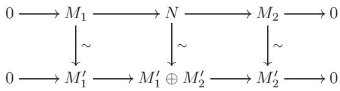

在垂直映射都是同构33。

示例 7.4. $\mathbb{Z}$-模的正合列

$$
0 \xrightarrow [ ] { } \mathbb { Z } \xrightarrow { \cdot 2 } \mathbb { Z } \xrightarrow [ ] { } \mathbb { Z } \xrightarrow [ ] { \mathbb { Z } } 0
$$

没有被分割。

分割序列让我们有机会回到我们在§6.2末尾留下的问题：对于同态，我们应该如何理解“具有左（或右）逆元”的条件？我们意识到这个条件比单射（或满射）的要求更强；我们能给出这种态射的更明确的描述吗？

命题 7.5. 设 $\varphi : M \to N$ 是一个 $R$-模同态。那么 • $\varphi$ 有一个左逆元当且仅当序列

$$
0 \longrightarrow M \longrightarrow N \longrightarrow \mathrm { c o k e r } \varphi \longrightarrow 0 
$$

分割线。

• $\varphi$ 有右逆元当且仅当序列

$$
0 \longrightarrow \ker \varphi \longrightarrow M \xrightarrow { \varphi } N \longrightarrow 0
$$

分割线。

证明。我将证明第一部分，其余部分留给读者作为练习（练习7.6）。

如果序列分裂，那么 $\varphi$ 可以与 $M$ 嵌入到直接和 $M \oplus M ^ { \prime }$ 中的映射等同起来，并且投影 $M \oplus M ^ { \prime } \to M$ 给出 $\varphi$ 的一个左逆元。反之，假设 $\varphi$ 有一个左逆元 $\psi$ ：

$$
\begin{array} { r } { 0 \longrightarrow M \underbrace { \begin{array} { c } { \varphi } \\ { \mathrm { ~ } } \end{array} } _ { \mathrm { i d } } \underbrace { \begin{array} { c } { \varphi } \\ { \mathrm { ~ } } \end{array} } _ { \begin{array} { c } { \mathrm { i } } \\ { \mathrm { ~ } } \end{array} } } \end{array}
$$

那么我断言 $N$ 与 $M \oplus \ker \psi$ 同构，并且 $\varphi$ 对应于 $M$ 与第一个因子的识别：$M \cong M \oplus \ker \psi \cong N$。同构 $M \oplus \ker \psi \cong N$ 由给出。

$$
( m , k ) \mapsto \varphi ( m ) + k ;
$$

其逆 $N  M \oplus \ker \psi$ 是

$$
n \mapsto ( \psi ( n ) , n - \varphi \psi ( n ) ) .
$$

元素 $n - \varphi \psi ( n )$ 应该在 $\ker \psi$ 中，因为它应该是这样。

$$
\psi ( n - \varphi \psi ( n ) ) = \psi ( n ) - \psi \varphi \psi ( n ) = \psi ( n ) - \psi ( n ) = 0 .
$$

所有必要的验证都是即时的，留给读者。

由于命题 7.5，具有左逆元的 $R$ -模同态被称为分裂单态射，具有右逆元的同态被称为分裂满态射。

我们将回到 §IV.5.2 中讨论在 Grp 的更复杂背景下正合序列的划分，然后稍后再次回到模以及更一般地到阿贝尔范畴（第八章和第九章）。

### 7.3. 同调与蛇形引理

定义 7.6. 复形的 $i$ -th 同调

$$
M _ { \bullet } : \ \cdot \cdot \xrightarrow { d _ { i + 2 } } M _ { i + 1 } \xrightarrow { d _ { i + 1 } } M _ { i } \xrightarrow { d _ { i } } M _ { i - 1 } \xrightarrow { d _ { i - 1 } } M _ { i - 1 } \xrightarrow { d _ { i - 1 } } \cdot \ . .
$$

$R$ -模的范畴是 $R$ -模

$$
H _ { i } ( M _ { \bullet } ) : = { \frac { \ker d _ { i } } { \operatorname { i m } d _ { i + 1 } } } .
$$

也就是说，$H _ { i } ( M _ { \bullet } )$ 是一个模，它在我的复形的启发式图中捕捉了“浅灰色圆环”。当然

也就是说，同调模是衡量一个复形“偏离正合性”的度量。

示例 7.7. 实际上，同调应该被视为核和陪核概念的一个（巨大）推广。确实，考虑 $M _ { \bullet }$ 是复形这一（非常）特殊的情况。

$$
0 \longrightarrow M _ { 1 } \longrightarrow M _ { 0 } \longrightarrow 0 \ .
$$

然后

$$
H _ { 1 } ( M _ { \bullet } ) \cong \ker \varphi , \quad H _ { 0 } ( M _ { \bullet } ) \cong \operatorname { c o k e r } \varphi .
$$

我将通过说明一个涉及两个短 正合序列 的交换图如何生成同调中的“长 正合序列”来结束这次非常简短的、进入更抽象领域的探索。这实际上是更一般构造的一个特例——根据这个构造，一个合适的涉及三个复形的交换图会产生一个真正长的“长 正合homology sequence”。当我们在第九章更广泛地讨论同调代数时，我们将回到这个一般构造。读者也可能在代数拓扑的课程中了解到它，在这个课程中，这个事实被用于研究流形的不变量，并取得了令人印象深刻的应用。

在我们要分析的简单形式中，这通常被称为蛇形引理。考虑两个由同态连接的短 正合序列，形成一个 交换图 $^ { 3 4 }$ :

$$
\begin{array} { l l } { { 0 \longrightarrow L _ { 1 } \xrightarrow { \alpha _ { 1 } } \ M _ { 1 } \xrightarrow { \beta _ { 1 } } N _ { 1 } \longrightarrow 0 } } \\ { { \qquad \downarrow \atop { 0 \xrightarrow { \mu _ { \ L } } L _ { 0 } \xrightarrow { \alpha _ { 0 } } M _ { 0 } \xrightarrow { \mu } \ M _ { 0 } } \ M _ { 0 } \xrightarrow { \mu _ { \ L } } 0 } } \\ { { \qquad L _ { 0 } \xrightarrow { \alpha _ { 0 } } M _ { 0 } \xrightarrow { \beta _ { 0 } } N _ { 0 } \xrightarrow { \nu _ { 0 } } 0 } } \end{array}
$$

引理 7.8（蛇形引理）。使用上述记号，存在一个正合序列

$$
0 \longrightarrow \ker \lambda \longrightarrow \ker \mu \longrightarrow \ker \nu \stackrel { \delta } { \longrightarrow } \mathrm { c o k e r } \lambda \longrightarrow \mathrm { c o k e r } \mu \longrightarrow \mathrm { c o k e r } \nu \longrightarrow 0 \ .
$$

备注 7.9. 这个序列中的大多数同态都是完全直接地从相应的同态 $\lambda$ ，$\mu$ ，$\nu$ 引起的。那个“令人惊讶”的同态是标记为 $\delta$ 的同态；$^ { 1 }$ 将在下文讨论其定义。

备注 7.10. 鉴于示例 7.7，我们可以在本陈述中将序列写成

$$
\begin{array} { r l } { 0 \longrightarrow H _ { 1 } ( L _ { \bullet } ) \longrightarrow H _ { 1 } ( M _ { \bullet } ) \longrightarrow H _ { 1 } ( N _ { \bullet } ) } \\ { \longrightarrow H _ { 0 } ( L _ { \bullet } ) \longrightarrow H _ { 0 } ( M _ { \bullet } ) \longrightarrow H _ { 0 } ( N _ { \bullet } ) \longrightarrow 0 } \end{array}
$$

其中 $L _ { \bullet }$ 是复形 $0 \longrightarrow L _ { 1 } \longrightarrow \ L _ { 0 } \longrightarrow 0$ ，等等。蛇形引理可以推广到任意的复形 $L _ { \bullet }$ ， $M _ { \bullet }$ ， $N _ { \bullet }$ ，产生一个“长正合同调序列”，而这是其尾端。如上所述，我们将在后面讨论这个相当直接的推广（§IX.3.3）。

备注 7.11. 一个流行的蛇形引理版本并不假设 $\alpha _ { 1 }$ 是单射和 $\beta _ { 0 }$ 是满射：也就是说，我们可以考虑一个交换图

正合序列


那么词元将表明“只有”一个正合序列

$$
\mathrm { k e r } \lambda \longrightarrow \mathrm { k e r } \mu \longrightarrow \mathrm { k e r } \nu \longrightarrow \mathrm { c o k e r } \lambda \longrightarrow \mathrm { c o k e r } \lambda \longrightarrow \mathrm { c o k e r } \mu \longrightarrow \mathrm { c o k e r } \nu \ .
$$

证明蛇形引理是一件不应该公开做的事情，而且众所周知，写下验证的细节供他人阅读是毫无用处的：这些细节本质上都是显而易见的，但它们很快就会陷入符号的泥潭。这样的证明统称为图追游戏，最好是通过指向黑板上的图的不同部分，同时说明自己操作的元素及其命运来执行35。

然而，我应该解释一下“连接”同态$\delta$的来源，因为这是蛇形引理及其证明的核心。以下是包含核和陪核的整个图表；因此，列是正合的（以及两个原始序列水平放置）：


顺便说一句，我相信读者现在明白为什么这个引理被称为蛇形引理了。

蛇形同态 $\delta$ 的定义。设 $a \in \ker \nu$。我断言 $a$ 可以沿着标记的实箭头通过这个图一直映射到 $\mathrm{coker} \lambda$。

这里：


确实，

$\ker \nu \subseteq N _ { 1}$；因此将$a$视为$N _ { 1}$的一个元素$b$。   
• $\beta _ { 1}$是满射的，所以$\exists c \in M _ { 1}$，映射到$b$。   
• 令$d = \mu ( c )$是$c$在$M _ { 0}$中的像。   
$d$在标记为$^ *$的位置的像是什么？根据图示的交换性，它必须是$\nu ( b )$。然而，$b$是$a \in \ker \nu$在$N _ { 1}$中的像，所以$\nu ( b ) = 0$。因此，$d \in \ker \beta _ { 0 }$。由于行是正合的，$\ker \beta _ { 0 } = \mathrm { i m } \alpha _ { 0}$；因此，$\exists e \in L _ { 0}$，映射到$d$。   
最后，令$f \in \mathrm { c o k e r } \lambda$是$e$的像。

我想设置 $\delta ( a ) : = f$ 。

这是合法的吗？在追捕的两个步骤中，我们已经获取了前像：

• $\exists c \in M _ { 1 }$ such that $\beta _ { 1 } ( c ) = b$ ， • $\exists e \in L _ { 0 }$ such that $\alpha _ { 0 } ( e ) = d$ 。

第二步不涉及选择：因为$\alpha _ { 0 }$根据假设是单射的，所以映射到$d$的元素$e$由$d$唯一确定。但在第一步涉及选择：为了验证$\delta$是良定义的，我们必须证明选择其他$c$不会影响对$\delta ( a )$的提议值$f$。

这是由另一次追逐证明的。以下是图表的相关部分：

$$
\begin{array}{c} \begin{array} { c }  { 0 \cdots { \cdots } { \cdots } { \cdots } { \cdots } { \cdots } { \cdots } { \underline { { { \alpha _ { 1 } } } } } } \\ { { \vdots } } \\ { { \lambda \vdots } } \\ { { 0 \cdots { \cdots } { \cdots } { \underline { { { \lambda } } } } } \\ { { \downarrow } } \\ { { f \cdots { \cdots } { \cdots } { \cdots } { \underline { { { \alpha _ { 0 } } } } } } \end{array} \downarrow \begin{array} { c } { { \beta _ { 1 } } } \\ { { \Bigg \{ } } \\ { { \mu \Bigg \} } \\ { { d \cdots \cdots } { \cdots } { \cdots } } \end{array} \Bigg \{ } } } \\ { { \downarrow } } \\  { f \cdots { \cdots } { \cdots } { \cdots } { \cdots } { \Bigg \} } } \end{array}
$$

假设我们选择一个不同的 $c ^ { \prime }$ 映射到相同的 $b$ :

$$
0 \cdots { \xrightarrow { \alpha _ { 1 } } } \alpha ^ { _ { 1 } } { \xrightarrow { \alpha _ { 1 } } } \alpha ^ { \prime } { \xrightarrow { \beta _ { 1 } } } b \cdots \cdots \cdots \cdots 0 .
$$

那么 $\beta _ { 1 } ( c ^ { \prime } - c ) = 0$ ；根据正合性，$\exists g \in L _ { 1}$ 使得 $( c ^ { \prime } - c ) = \alpha _ { 1 } ( g )$ ：

$$
0 \xrightarrow  \xrightarrow { } \quad \quad \quad \quad \quad \quad \quad \quad \quad \quad \quad \quad \quad \quad \quad \quad \quad \quad \quad \quad \quad \quad \quad \quad \quad \quad \quad \quad \quad \quad \quad \quad \quad \quad \quad \quad \quad \quad \quad \quad \quad \quad \quad \quad \quad \quad \quad \quad \quad \quad \quad \quad \quad \quad \quad \quad \quad \quad \quad \quad \quad \quad \quad \quad \quad \quad \quad \quad \quad \quad \quad \quad \quad \quad \quad \quad \quad \quad \quad \quad \quad \quad \quad \quad \quad \quad \quad \quad \quad \quad \quad \quad \quad \quad \quad \quad \quad \quad \quad \quad \quad \quad \quad \quad \quad \quad \quad \quad \quad \quad \quad \quad \quad \quad \quad \quad \quad \quad \quad \quad \quad \quad \quad \quad \quad \quad \quad \quad \quad \quad \quad \quad \quad \quad \quad \quad \quad \quad \quad \quad \quad \quad \quad \quad \quad \quad \quad \quad \quad \quad \quad \quad \quad \quad \quad \quad \quad \quad \quad \quad \quad \quad \quad \quad \quad \quad \quad \quad \quad \quad \quad \quad \quad \quad \quad \quad \quad \quad \quad \quad \quad \quad \quad \quad \quad \quad \quad \quad \quad \quad \quad \quad \quad \quad \quad \quad \quad \quad \quad \quad \quad \quad \quad \quad \quad \quad \quad \quad \quad \quad \quad \quad \quad \quad \quad \quad \quad \quad \quad \quad \quad \quad \quad \quad \quad \quad \quad \quad \quad \quad \quad \quad \quad \quad \quad \quad \quad \quad \quad \quad \quad \quad \quad \quad \quad \quad \quad \quad \quad \quad \quad \quad \quad \quad \quad \quad \quad \quad \quad \quad \quad \quad \quad \quad \quad \quad \quad \quad \quad \quad \quad \quad \quad \quad \quad \quad \quad \quad \quad \quad \quad \quad \quad \quad \quad \quad \quad \quad \quad \quad \quad \quad \quad \quad \quad \quad \quad \quad \quad \quad \quad \quad \quad \quad \quad \quad \quad \quad \quad \quad \quad \quad \quad \quad \quad \quad \quad \quad \quad \quad \quad \quad \quad \quad \quad \quad \quad \quad \quad \quad \quad \quad \quad \quad \quad \quad \quad \quad \quad \quad \quad \quad \quad \quad \quad \quad \quad \quad \quad \quad \quad \quad \quad \quad \quad \quad \quad \quad \quad \quad \quad \quad \quad \quad \quad \quad \quad \quad \quad \quad \quad \quad \quad \quad \quad \quad \quad \quad \quad \quad \quad \quad \quad \quad \quad \quad \quad \quad \quad \quad \quad \quad \quad \quad \quad \quad \quad \quad \quad \quad \quad \quad \quad \quad \quad \quad \quad \ c \ c \ c \ c \ c \ c \ c \ c \ c \ c \ c \ c \ c \ c \ c \ c \ c \ c \ c \ c \ c \ c \ c \ c \ c \ c \ c \ c \ c \ c \ c \ c \ c o u l \ c o u l \ c o m i n \ c o m i n \ c o m i n \ c o m i n \ c o m i n \ c o m i n \ c o m i n \ c o m i n \ c o m i n \ c o m i n \ c o m i n \ c o m i n \ c o m i n \ c o m i n \ c o m i n \ c o m i n \ c o m i n \ c o m i n \ c o m a l \ c o n \ c o n \ c o n \ c o n \ c o n \ c o n \ c o n \ c o n t h l \ c o n t h t h t h t h t h t
$$

现在的问题是，由于列形成复形，$g$ 在 $\mathrm { c o k e r } \lambda$ 中消亡：

$$
\begin{array} { l } { { 0 \cdots } } \\    \begin{array} { l }   \begin{array} { l }   \begin{array} { c }   \begin{array} { c }   \begin{array} { c } { { \begin{array} { c } { \end{array} } } } \\   \begin{array} { c }   \begin{array} { c } { \begin{array} { c } { \end{array} } } \\   \begin{array} { c }  \begin{array} { c } { \begin{array} { c } { \end{array} } } \\   \begin{array} { c }  \begin{array} { c } { \begin{array} { c } { \end{array} } } \\   \begin{array} { c } { \begin{array} { c } { \end{array} } } \\ { { \begin{array} { c } { \begin{array} { c c c c c c c c c c c c } \end{array} } \end{array} } } \\   \begin{array} { \begin{array} { c } { \begin{array} { c } { \begin{array} { c } { \end{array} } } \\ { { \begin{array} { c } { \begin{array} { c c c c c c c c c c c c } \end{array} } \end{array} } } \\ { { \begin{array} { \begin{array} { c c c c c c c c c c c } \end{array} } \end{array} } \end{array} } } \\ { \begin{array} { \begin{array} { c } { \begin{array} { c } { \begin{array} { c c c c c c c c c c c } \end{array} } \end{array} } \\ { \begin{array} { \begin{array} { c c c c c c c c c c c } \end{array} } \end{array} } \end{array} } \end{array} } } \\ { \begin{array} { \begin{array} { c } { \begin{array} { c } { \begin{array} { c } { \begin{array} { c c c c c c c c c c c } \end{array} \end{array} } } \\ { \begin{array} { \begin{array} { c c c c c c c c c c } \end{array} } \end{array} } \\ { \begin{array} { \begin{array} { c c c c c c c c c c } \end{array} } \end{array} } \end{array} } \end{array} } } \\  \begin{array} { \begin{array} { c } { \begin{array} { c } { \begin{array} { c c c c c c c c c } \end{array} \end{array} } \end{array} } \\ { \begin{array} { \begin{array} { c c c c c c c c c } \end{array} \end{array} } \end{array} } \end{array} } \begin{array} {array} \\ { \begin{array} { c } { \begin{array} { c } { \begin{array} { c } { \begin{array} { c c c c c c c c } \end{array} \end{array} } \\ { [ \begin{array} { c c c c c c c c } \end{array} \end{array} } \\ { \begin{array} { c c c c c c c c } \end{array} \end{array} } \end{array} } \end{array} ] } } \\  \begin{array} { c }  \begin{array} { c }  \begin{array} { r } { \begin{array} { c } { \begin{array} } { r l } { \begin{array} { c c c c c c c } \end{array} } \end{array} } \\  [ \begin{array} { c c c c c c } { \begin{array} } &  [ \begin{array} { c } { \begin{array} } { c } & { [ \begin{array} { c } { \begin{array} } { c } & { [ \begin{array} { c } { c c c c c c } \end{array} } \end{array} \end{array} ] } \\  \begin{array} { c c c c c c c } \end{array} \end{array} \end{array} \end{array} \end{array} \end{array} \end{array} \end{array} \end{array} \end{array} \end{array} \end{array} \end{array} \end{array} \end{array} \end{array} \end{array} \end{array} \end{array} \end{array} \end{array} \end{array} \end{array}
$$

并且根据图示的交换性和 $\alpha _ { 0 }$ 的单射性，改变 $c$ 到 $c ^ { \prime }$ 会使 $e$ 变为 $e + \lambda ( g )$ 而使 $f$ 变为 $f + 0 = f$。也就是说，$f$ 确实与选择无关。

因此 $\delta$ 是良好定义的！

这是一个蛇形引理证明的极小部分，但可能足以说明为什么阅读一个写出来的图追可能极其无信息量。

其余的证明（留给读者$( ! )$，但我没有将其列为正式练习，以免有人真的提交解决方案以供评分）涉及许多类似的论证。在核和余核上诱导的映射的定义远不如上面描述的连接同态$\delta$的定义具有挑战性。序列中最多点的正合性

$$
0 \longrightarrow \ker \lambda \longrightarrow \ker \mu \longrightarrow \ker \nu \stackrel { \delta } { \longrightarrow } \mathrm { c o k e r } \lambda \longrightarrow \mathrm { c o k e r } \mu \longrightarrow \mathrm { c o k e r } \nu \longrightarrow 0
$$

它也相对直接；大部分工作将投入到在 $\ker \nu$ 和 $\mathrm { c o k e r } \lambda$ 证明正合性上。

亲爱的读者：不要害怕尝试这个，因为它是非常出色、不可或缺的练习。错失这个机会，你将永远对这种操作感到不确定。

蛇形引理简化了几个事实，单独证明这些事实并不难，但一旦引理被确立，就变得非常直接。例如，

推论 7.12. 在蛇形引理中给出的相同情况下（符号见 §7.3），假设 $\mu$ 是满射且 $\nu$ 是单射。那么 $\lambda$ 是满射且 $\nu$ 是同构。

证明。确实，$\mu$满射 $\implies \operatorname { c o k e r } \mu = 0$；$\nu$单射 $\implies \ker \nu = 0$（命题6.2）。将此信息代入蛇形引理的序列中，得到一个正合序列

$0 \longrightarrow \ker \lambda \longrightarrow \ker \mu \longrightarrow 0 \longrightarrow \mathrm { c o k e r } \lambda \longrightarrow 0 \longrightarrow \mathrm { c o k e r } \nu \longrightarrow 0 \longrightarrow \mathrm { c o k e r } \nu \longrightarrow 0 \longrightarrow \mathrm { c o k e r } \nu \longrightarrow 0 \longrightarrow \mathrm { c o l e c } \nu \longrightarrow 0$

正合性意味着 coker $\lambda = \operatorname { c o k e r } \nu = 0$（练习 7.1）；因此 $\lambda$ 和 $\nu$ 是满射的，具有所述的推论。$\square$

可以有更多类似的陈述被同样轻易地证明；读者应该尽情实验。

### 习题

7.1. $\triangleright$ 假设复数

$$
\cdots { \longrightarrow } 0 \longrightarrow M \longrightarrow 0 \longrightarrow \cdots
$$

完全正确。证明 $M \cong 0$。[§7.3]

7.2. 假设复数

$$
\cdot \cdot \cdot \longrightarrow 0 \longrightarrow M \longrightarrow M ^ { \prime } \longrightarrow 0 \longrightarrow \cdot \cdot \cdot
$$

完全正确。证明 $M \cong M ^ { \prime }$ 。

7.3. 假设复数

$$
\cdots { \xrightarrow { } } 0 { \xrightarrow { } } L { \xrightarrow { } } M { \xrightarrow { \varphi } } M ^ { \prime } { \xrightarrow { } } N { \xrightarrow { } } 0 { \xrightarrow { } } \cdots
$$

精确。证明在自然同构的意义下，$L = \ker \varphi$ 和 $N = \mathrm { c o k e r } \varphi$

7.4. 构造 $\mathbb{Z}$-模的短 正合序列

$$
0 \longrightarrow \mathbb { Z } ^ { \oplus \mathbb { N } } \longrightarrow \mathbb { Z } ^ { \oplus \mathbb { N } } \longrightarrow \mathbb { Z } \longrightarrow 0
$$

并且

$$
0 \longrightarrow \mathbb { Z } ^ { \oplus \mathbb { N } } \longrightarrow \mathbb { Z } ^ { \oplus \mathbb { N } } \longrightarrow \mathbb { Z } ^ { \oplus \mathbb { N } } \longrightarrow \mathbb { Z } ^ { \oplus \mathbb { N } } \longrightarrow 0 .
$$

（提示：大卫·希尔伯特的 Grand Hotel。）

7.5. $\triangleright$ 假设复数

$$
\cdots { \longrightarrow } L { \longrightarrow } M { \longrightarrow } N { \longrightarrow } \cdots
$$

精确，并且 $L$ 和 $N$ 是诺特环。证明 $M$ 是诺特环。[§7.1]

7.6. $\triangleright$ 证明命题7.5的“分裂满射”部分。[§7.2]

7.7. $\triangleright$ 让

$$
0 \longrightarrow M \longrightarrow N \longrightarrow P \longrightarrow 0
$$

是一个$R$-模的短 正合序列，并且让$L$是一个$R$-模。

(i) 证明存在一个正合序列36 $0 \xrightarrow { } \mathrm { H o m } _ { R \cdot \mathrm { M o d } } ( P , L ) { \xrightarrow { } } \mathrm { H o m } _ { R \cdot \mathrm { M o d } } ( N , L ) { \xrightarrow { } } \mathrm { H o m } _ { R \cdot \mathrm { M o d } } ( M , L ) .$ (ii) 重做练习6.17。(使用正合序列 $0 \to I \to R \to R / I \to 0$。)

(iii) 构造一个例子，说明 (i) 中的右端同态不必满射。  
(iv) 证明如果原始序列分裂，那么 (i) 中的右端同态是满射。

[7.9, VIII.3.14, §VIII.5.1]

7.8. $\triangleright$ 证明每个正合序列

$$
0 \longrightarrow M \longrightarrow N \longrightarrow F \longrightarrow 0
$$

关于$R$模，$F$是自由的，分裂。(提示：练习6.9。) [§VIII.5.4]

7.9. 让

$$
0 \longrightarrow M \longrightarrow N \longrightarrow F \longrightarrow 0
$$

是一个$R$-模的短 正合序列，其中$F$是自由的，并且让$L$是一个$R$-模。证明存在一个 正合序列

$$
0 \longrightarrow \mathrm { H o m } _ { R \cdot \mathrm { M o d } } ( F , L ) \longrightarrow \mathrm { H o m } _ { R \cdot \mathrm { M o d } } ( N , L ) \longrightarrow \mathrm { H o m } _ { R \cdot \mathrm { M o d } } ( M , L ) \longrightarrow 0 \ .
$$

（参见练习7.7。）

7.10. $\triangleright$ 在蛇形引理的情况下，假设 $\lambda$ 和 $\nu$ 是同构。使用蛇形引理证明 $\mu$ 是同构。这被称为“短五引理”，因为它直接来自五引理（参见习题 7.14），以及来自蛇形引理。[VIII.6.21, IX.2.4]

7.11. $\triangleright$ 让

$$
0 \longrightarrow M _ { 1 } \longrightarrow N \longrightarrow M _ { 2 } \longrightarrow 0
$$

是$R$-模的正合序列。(这可以称为$M _ { 2 }$被$M _ { 1 }$的‘扩张’。)假设存在任何$R$-模同态$N  M _ { 1 } \oplus M _ { 2 }$使得图


交换，其中底部序列是直和的标准序列。证明（ $^ *$ ）分裂。[§7.2]

7.12. ¬ 通过证明“四引理”来练习你的图追技能：如果$R$-模的交换图具有精确行，$\alpha$是一个满态射，并且$\beta$，$\delta$是单态射，那么$\gamma$是一个单态射。[7.13, IX.2.3]


7.13. 证明练习 7.12 的“四引理”的另一个 $^ { 3 7 }$ 版本：如果是一个具有精确行的 $R$-模的交换图，$\beta$ 和 $\delta$ 是满态射，并且 $\epsilon$ 是单态射，那么 $\gamma$ 是满态射。


7.14.  证明“五引理”：如果


如果$R$-模的交换图具有精确行，$\beta$和$\delta$是同构，$\alpha$是满射，并且$\epsilon$是单射，那么$\gamma$是同构。（你可以通过粘贴前面的练习结果来避免所需的图追查。）[7.10]

7.15. ¬ 考虑以下$R$-模的交换图：


假设这三行是正合的，并且最右边的两列是正合的。证明最左边的列是正合的。第二版本：假设这三行是正合的，并且最左边的两列是正合的；证明最右边的列是正合的。这是“九引理”。（你可以通过应用蛇形引理来避免图论推导；为此，你需要将图旋转$90^{\circ}$。）[7.16]

7.16. 在与练习7.15相同的情形下，假设三行是正合的，并且最左边的列和最右边的列也是正合的。

• 证明 $\alpha$ 是单态射且 $\beta$ 是满态射。 • 中心列是否必然是精确列？

(Hint: No. 将 $\mathbb { Z } \oplus \mathbb { Z }$ 放在中间，并用六个 $\mathbb { Z }$ 和两个 0 巧妙地包围它。)

• 假设中央列是一个复形（即，$\beta \circ \alpha = 0$）；证明它必然是正合的。

7.17. $\neg$ 将前面的两个练习推广如下。考虑一个 $R$ -模的（可能是无限的）交换图：


在中心列是一个复形且每一行都是正合的情况下。证明左右列也是复形的。证明如果任意两列是正合的，那么第三列也是正合的。（第一部分很简单。第二部分现在需要一些图追，一旦你学习了§IX.3.3中的长精确((共)同调序列)，几秒钟后就会变得简单。）[IX.3.12]

# 群，再遇

在本章中，我们回到Grp并研究一些比第二章中考虑的主题更“不一般”的课题。我们在这里做的大部分内容将专门适用于有限群；这本身就是重要的例子，因为它有引人注目的应用（例如，在伽罗瓦理论中；参见§VII.7），并且从解释的角度来看是一个很好的主题，因为它给了我们在一个足够复杂以承载实质，但在（这个微小的初等课题选择中）足够简单以便容易理解的环境中看到几个一般概念运作的机会。

## 1. 共轭作用

### 1.1. 群在集合上的作用，回顾
群在作用于某个对象时真正大放异彩。本节将非常有效地阐述这一点，因为我们将通过极其简单的方式应用我们在II.9中建立的关于群作用的基本事实，对有限群得到令人惊讶的精确结果。

回想我们证明了（命题 II.9.9），群 $G$ 在集合 $S$ 上的每一个传递（左-）作用，在自然的同构概念下，是“在左陪集集合 $G / H ^ { \prime }$ 上的左乘法”。这里，$H$ 可以取作集合 $S$ 中任意元素 $a$ 的稳定子 Stab ${ \bf \Pi } _ { G } ( a )$（即（定义 II.9.8）固定 $a$ 的 $G$ 的子群）。这个事实适用于 $G$ 在集合上的每一个左作用的轨道；特别是，有限轨道 $O$ 中的元素个数等于 $O$ 中任意元素 $a$ 的稳定子的指数；特别是（推论 II.9.10）如果 $G$ 是有限的，轨道中的元素个数 $| O |$ 必须整除 $G$ 的阶 $| G |$。

这些考虑可以打包成一个有用的“计数”公式，我们可以称之为该作用的类方程；这个名字通常保留给$G$自身通过共轭作用的情况，我们将在下面更仔细地探讨。

为了陈述公式，假设 $G$ 作用在一个集合 $S$ 上；对于 $a \in S$，令 $G _ { a }$ 表示稳定子 $\operatorname { S t a b } _ { G } ( a )$。此外，令 $Z$ 是作用的不动点集合：

$$
Z = \{ a \in S | ( \forall g \in G ) : g a = a \} .
$$

请注意 $a \in Z \iff G _ { a } = G$；我们可以说 $a \in Z$ 当且仅当 $a$ 的轨道是“平凡的”，在这个意义上，它只包含 $a$ 自己。

命题 1.1. 设 $S$ 是一个有限集，设 $G$ 是作用在 $S$ 上的一个群。如上所述，

$$
| S | = | Z | + \sum _ { a \in A } [ G : G _ { a } ] ,
$$

其中 $A \subseteq S$ 恰好包含每个非平凡轨道的一个元素。

证明。轨道构成了$S$的一个划分，而$Z$收集了平凡的轨道；因此

$$
| S | = | Z | + \sum _ { a \in A } | O _ { a } | ,
$$

其中 $O _ { a }$ 表示 $a$ 的轨道。根据命题 II.9.9，轨道 $O _ { a }$ 的阶 $| O _ { a } |$ 等于 $a$ 的稳定子的指数，从而得到该陈述。$\square$

命题1.1的主要优势在于，如果$G$是有限的，每个加数$\vert G : G _ { a } \rfloor$都整除$G$的阶（并且是$> ~ 1$）。当一些关于$| G |$的信息已知时，这可能是一个强烈的约束。例如，让我们看看当$G$是一个$p$ -群时，这说明了什么：

定义1.2. 一个$p$-群是一个其阶为素数$p$的幂的有限群。

推论1.3. 设$G$是一个$p$-群，作用在一个有限集$S$上，设$Z$是作用的不变点集。那么

$$
| Z | \equiv | S | \mod p .
$$

证明。事实上，命题1.1中的每个加数 $\left[ G : G _ { a } \right]$ 都是一个大于1的数，并且是$p$的幂；因此它是0模$p$。$\square$

例如，在某些情况下，这可以用来建立1 $Z \neq \emptyset$ ：参见练习1.1。命题1.1的这些直接推论将在下面，在Sylow定理的证明中帮助我们。

### 1.2. 中心，中心化子，共轭类

回想（示例 II.9.3）中，每个群 $G$ 至少以两种有趣的方式作用于自身：通过（左）乘法和通过共轭。后者定义为以下 $\rho : G \times G \to G$：

$$
\rho ( g , a ) = g a g ^ { - 1 } .
$$

如我们所知（§II.9.2），此数据等效于某个群同态的数据：

$$
\sigma : G  S _ { G }
$$

从 $G$ 到 $G$ 的置换群

此操作突出显示了一些有趣的物体：

定义 1.4. $G$ 的中心，记作 $Z(G)$，是 $G$ 的子群 $\ker \sigma$。

具体来说，G的中心$^ 2$是

$$
Z ( G ) = \{ g \in G | ( \forall a \in G ) : g a = a g \} .
$$

确实，$\sigma ( g )$ 在 $S _ { G }$ 中是单位元当且仅当 $\sigma ( g )$ 在 $G$ 上作为单位元作用；也就是说，当且仅当 $g a g ^ { - 1 } = a$ 对所有 $a \in G$ 成立；也就是说，当且仅当 $g$ 与 $G$ 的所有元素都交换。换句话说，中心是 $G$ 在共轭作用下的不动点集。

请注意，群$G$的中心$C(G)$在$G$中自动是正规子群：这几乎是手工检查的“几乎立即”，但无需这样做，因为它在定义中就是核，而核是正规的。

一个群 $G$ 是交换群当且仅当 $Z ( G ) = G$ ，也就是说，当且仅当 $G$ 上的共轭作用是平凡的。

通常，当你发现一个群的中心不是平凡的时，你会感到高兴：这通常允许你通过模除中心来对群的元素个数进行归纳证明（这大致是我们将如何证明第一个 Sylow 定理的方法）。或者注意以下有用的定理，这在试图证明一个群是交换群时很有用：

引理 1.5. 设 $G$ 是一个有限群，并且假设 $G / Z ( G )$ 是循环群。那么 $G$ 是交换群（因此 $G / Z ( G )$ 实际上是平凡的）。

证明。（参见练习1.5。）由于$G / Z(G)$是循环群，存在$g \in G$使得$gZ(G)$的类生成$G / Z(G)$。然后$\forall a \in G$

$$
a Z ( G ) = ( g Z ( G ) ) ^ { r }
$$

对于某些 $r \in \mathbb{Z}$；也就是说，存在中心 $Z(G)$ 的一个元素 $z$ 使得 $a = g^{r}z$。

如果现在 $a$ ， $b$ 在 $G$ 中，使用这个事实来写

$$
a = g ^ { r } z , \quad b = g ^ { s } w
$$

对于某些 $s \in \mathbb{Z}$ 和 $w \in Z(G)$；但是

$$
a b = ( g ^ { r } z ) ( g ^ { s } w ) = g ^ { r + s } z w = ( g ^ { s } w ) ( g ^ { r } z ) = b a ,
$$

我在这里使用了 $z$ 和 $w$ 与 $G$ 的每个元素都交换的事实。由于 $a$ 和 $b$ 是任意的，这证明了 $G$ 是交换的。$\square$

接下来，$a \in G$ 在共轭下的稳定子有一个特殊的名称：

定义1.6. 元素$a \in G$的中央化子（或正规化子）$Z _ { G } ( a )$是在共轭下的稳定子。

因此，

$$
Z _ { G } ( a ) = \{ g \in G | g a g ^ { - 1 } = a \} = \{ g \in G | g a = a g  \}
$$

由$G$中与$a$交换的所有元素组成。特别是，对于所有$a \in G$，$Z(G) \subseteq Z_G(a)$；事实上，$\begin{array} { r } { Z ( G ) = \bigcap _ { a \in G } Z _ { G } ( a ) } \end{array}$。显然$a \in Z ( G ) \iff Z _ { G } ( a ) = G$。

如果关于包含元素 $a$ 的群 $G$ 没有歧义，则可以省略索引 $G$。

定义 1.7. 元素 $a \in G$ 的共轭类是在共轭作用下的轨道 $\lfloor a \rfloor$。如果 $a$ 和 $b$ 属于同一个共轭类，则它们是共轭的。

符号 $[ a ]$ 不是标准的；$C ( \boldsymbol a )$ 更常用，但我不喜欢它。使用 $\lfloor a \rfloor$ 提醒我们这些不过是 $G$ 的元素在某个有趣的等价关系下的等价类。

请注意，$\lfloor a \rfloor = \{ a \}$ 当且仅当对于所有 $g \in G$，有 $g a g ^ { - 1 } = a$；也就是说，当且仅当对于所有 $g \in G$，有 $g a = a g$；也就是说，当且仅当 $a \in Z ( G )$ 。

### 1.3. 类方程

有限群 $G$ 的“官方”群公式是命题1.1中共轭作用的一个特例。

命题 1.8（类方程）。设 $G$ 是一个有限群。那么

$$
| G | = | Z ( G ) | + \sum _ { a \in A } [ G : Z ( a ) ] ,
$$

其中 $A \subseteq G$ 是一个包含 $G$ 中每个非平凡共轭类的代表元素的集合。

证明。不动点集是 $Z(G)$，$a$ 的稳定子是中心化子 $Z(a)$；  
应用命题 1.1。$\square$

类方程非常实用。应用时，请记住右边的每个加数（即 $| Z ( G ) |$ 和每个 $\left[ G : Z ( a ) \right] ,$ ）都是 $| G |$ 的约数；仅凭这一事实就足以对 $G$ 得出惊人的结论。

可能最著名的此类应用是到 $p$ -群，通过推论 1.3：

推论1.9. 设$G$是一个非平凡的$p$-群。那么$G$有一个非平凡的中心。

证明。由于 $| Z ( G ) | \equiv | G | \pmod { p }$ 并且 $| G | > 1$ 是 $p$ 的幂，必然 $| Z ( G ) |$ 是 $p$ 的倍数。由于 $Z ( G ) \neq \emptyset$（因为 $e _ { G } \in Z ( G )$），这意味着 $| Z ( G ) | \geq p$。$\square$

例如，根据推论1.9和引理1.5（参见习题1.6），如果$p$是素数，那么每个阶为$p^2$的群都是交换群。

通常情况下，班级公式对小组中可以发生的事情施加了强烈的约束。

示例 1.10. 考虑一个阶为 6 的群 $G$；它的类方程有哪些可能性？

如果 $G$ 是交换的，那么类方程将告诉我们很少：

$$
6 = 6 .
$$

如果$G$不交换，则它的中心必须是平凡的（这是Lagrange定理和引理1.5的推论）；因此，类方程是$6 = 1 + \cdots$，其中$\cdot \cdot \cdot$收集非平凡共轭类的规模。但每一个这些加数必须大于1，小于6，并且必须整除6；也就是说，没有选择：

$$
6 = 1 + 2 + 3
$$

这是唯一可能性。读者应该检查这确实是 $S _ { 3 }$ 的类方程；事实上，$S _ { 3 }$ 是唯一的非交换群，其阶为6，在同构意义下（习题1.13）。

另一个有用的观察是正规子群必须是共轭类的并集：因为如果 $H$ 是一个正规子群，$a \in H$ ，并且 $b = g a g ^ { - 1 }$ 与 $a$ 共轭，那么

$$
b \in g H g ^ { - 1 } = H .
$$

要遵循 $| G | = 6$ 的例子，注意一个群的每个子群都必须包含单位元，并且其大小必须整除群的阶；因此，非交换群的一个阶为6的正规子群不可能有阶为2，因为2不能记为共轭类的阶的和（包括单位元的类）。

### 1.4. 子集和子群的共轭
我们也可以通过共轭作用于$G$的幂集：如果$A \subseteq G$是一个子集，且$g \in G$，则$A$的共轭是子集$gAg^{-1}$。通过消去律，共轭映射$a \mapsto gag^{-1}$是$A$和$gAg^{-1}$之间的双射。

这导致了与 §1.2 中引入的术语类似的情况。

定义1.11. A的正规化子$N _ { G } ( A )$是其共轭下的稳定子。A的中心化子是包含于$N _ { G } ( A )$的子群$Z _ { G } ( A )$，它固定A的每个元素。

因此，$g \in N _ { G } ( A )$ 当且仅当 $g A g ^ { - 1 } = A$ ，并且 $g \in Z _ { G } ( A )$ 当且仅当 $\forall a \in A$ ，$g a g ^ { - 1 } = a$ 。

对于 $A = \{ a \}$ 是单元素集合，我们有 $N _ { G } ( \{ a \} ) = Z _ { G } ( \{ a \} ) = Z _ { G } ( a )$ 。一般地，$Z _ { G } ( A ) \subsetneq N _ { G } ( A )$ 。

如果 $H$ 是 $G$ 的一个子群，$H$ 的每一个共轭子群 $g H g ^ { - 1 }$ 也是 $G$ 的一个子群；共轭子群有相同的阶。

备注1.12. 定义立即意味着 $H \subseteq N _ { G } ( H )$ 并且 $H$ 在 $G$ 中是正规当且仅当 $N _ { G } ( H ) = G$。更一般地，$H$ 在 $G$ 中的正规化子 $N _ { G } ( H )$ 是（显然地）$G$ 中最大的子群，在其中 $H$ 是正规的。

可以对子集或子群的共轭作用应用命题1.1；然而，子集太多，对子群的数量几乎无法控制。涉及给定子集或子群的共轭数目的其他数值考虑可能非常有用。

引理 1.13. 设 $H \subseteq G$ 是一个子群。那么（如果有限），与 $H$ 共轭的子群的数量等于 $G$ 中 $H$ 的正规化子的指数 $[ G : N _ { G } ( H ) ]$。

证明。这又是命题II.9.9的直接推论。

推论 1.14. 如果 $\lfloor G : H \rfloor$ 是有限的，那么与 $H$ 共轭的子群的数量是有限的，并且整除 $[ G : H ]$ 。

证明。

$$
[ G : H ] = [ G : N _ { G } ( H ) ] \cdot [ N _ { G } ( H ) : H ]
$$

（参见 §II.8.5）。

一个著名的 Sylow 定理将在 $H$ 是有限群 $G$ 中一个极大 $p$-群的情况下，大大加强这一陈述。关于任意 $p$-子群的正规化子的规模的陈述，参见引理 2.9。

另一个有用的数值工具是这样一个观察结果：如果$H$和$K$是群$G$的子群，并且$H \subseteq N _ { G } ( K )$——即对于所有$g \in H$，有$g K g ^ { - 1 } = K$——那么由$g \in H$进行的共轭运算给出了$K$的一个自同构。事实上，我已经观察到共轭运算是一个双射，并且很容易看出它是一个同态：$\forall k _ { 1 } , k _ { 2 } \in K$

$$
( g k _ { 1 } g ^ { - 1 } ) ( g k _ { 2 } g ^ { - 1 } ) = g k _ { 1 } ( g ^ { - 1 } g ) k _ { 2 } g ^ { - 1 } = g ( k _ { 1 } k _ { 2 } ) g ^ { - 1 } .
$$

因此，共轭给出一个集函数

$$
\gamma : H \to \operatorname { A u t } _ { \mathsf { G r p } } ( K ) .
$$

读者将检查这是一个群同态，并将确定 $\ker \gamma$（练习1.21）。

这特别有用，如果 $H$ 是有限的，并且关于 $\operatorname { A u t } _ { \mathsf { G r p } } ( K )$ 的一些信息可用（例如，参见练习 4.14）。一个经典的应用在练习 1.22 中给出。

### 习题

1.1. $\triangleright$ 设 $p$ 是一个素数，设 $G$ 是一个 $p$-群，设 $S$ 是一个集合，使得 $| S | \not \equiv 0 { \bmod { p } }$ 。如果 $G$ 对 $S$ 作用，证明这个作用必须有不动点。[§1.1, §2.3]

1.2. 求出 $D _ { 2 n }$ 的中心。(答案取决于 $n$ 的奇偶性。你实际上已经做过这个练习了：练习 II.2.7。这次，使用一个表示方法。)

1.3. 证明当 $n \geq 3$ 时，$S _ { n }$ 的中心是平凡的。（假设 $\sigma \in S _ { n }$ 将 $a$ 映射到 $b \neq a$，且 $c \neq a , b$。设 $\tau$ 是仅通过交换 $b$ 和 $c$ 的置换。然后比较 $\sigma \tau$ 和 $\tau \sigma$ 对 $a$ 的作用。）

1.4. $\triangleright$ 设 $G$ 是一个群，且 $N$ 是 $Z(G)$ 的一个子群。证明 $N$ 在 $G$ 中是正规子群。[§2.2]

1.5. $\triangleright$ 设 $G$ 是一个群。证明 $G / Z ( G )$ 与 $G$ 的内自同构群 $\operatorname { I n n } ( G )$ 同构。(参见习题 II.4.8。) 然后利用习题 II.6.7 的结果再次证明引理 1.5。 [§1.2]

1.6. $\triangleright$ 设 $p$ ， $q$ 是素数，设 $G$ 是一个阶为 $p q$ 的群。证明 $G$ 要么是交换群，要么 $G$ 的中心是平凡的。根据（推论 1.9）得出，对于任意素数 $p$ ，每个阶为 $p ^ { 2 }$ 的群都是交换群。[§1.3]

1.7. 证明或反驳：如果 $p$ 是素数，那么每个阶为 $p ^ { 3 }$ 的群都是交换群。

1.8. $\triangleright$ 设 $p$ 是一个素数，设 $G$ 是一个 $p$-群：$| G | = p ^ { r }$。证明 $G$ 对每个非负整数 $k \leq r$ 都包含一个阶为 $p ^ { k }$ 的正规子群。[§2.2]

1.9. $\neg$ 设 $p$ 是一个素数，$G$ 是一个 $p$-群，$H$ 是 $G$ 的一个非平凡正规子群。证明 $H \cap Z ( G ) \neq \{ e \}$。（提示：使用类方程。）[3.11]

1.10. 证明如果$G$是一个奇数阶群，且$g \in G$与$g^{-1}$共轭，那么$y = e_G$。

1.11. 设 $G$ 是一个有限群，并且假设存在 $r$ 个 $G$ 中不同共轭类的代表 $y _ { 1 } , \ldots , y _ { r }$ ，使得 $\forall i , j$ ， $g _ { i } g _ { j } = g _ { j } g _ { i }$ 。证明 $G$ 是交换群。(提示：你能对共轭类的大小说什么？)

1.12. 验证 $D _ { 8 }$ 和 $Q _ { 8 }$ 的类方程（参见练习 III.1.12）是 $8 = 2 + 2 + 2 + 2$。（同时注意 $D _ { 8 } \not \cong Q _ { 8 }$。）

1.13. $\triangleright$  设 $G$ 是一个阶为 6 的非交换群。如例 1.10 所示，$G$ 必须有平凡的中心，并且恰好有两个共轭类，其阶分别为 2 和 3。

• 证明如果群的每个元素的阶都$\leq 2$，那么群是交换的。得出$G$有一个阶为3的元素$y$。   
• 证明$\langle y \rangle$在$G$中是正规子群。   
• 证明$\lfloor y \rfloor$是阶为2的共轭类，且$[ y ] = \{ y , y ^ { 2 } \}$。   
• 证明存在$x \in G$使得$y x = x y ^ { 2 }$。证明$x$的阶为2。   
• 证明${ x }$和$y$生成$G$。   
• 证明$G \cong S _ { 3 }$。
 [§1.3, §2.5]

1.14. 设 $G$ 是一个群，假设 $\lfloor G : Z ( G ) \rfloor = n$ 是有限的。设 $A \subseteq G$ 是任意子集。证明 $A$ 的共轭类的数量至多为 $n$。

1.15. 假设群 $G$ 的类方程为 $\mathrm { 6 0 } = 1 + 1 5 + 2 0 + 1 2 + 1 2$ 。  
证明 $G$ 的唯一正规子群是 $\{ e \}$ 和 $G$ 。

1.16. $\triangleright$ 设 $G$ 是一个有限群，且 $H \subseteq G$ 是一个指数为2的子群。对于 $a \in H$ ，记 $\lfloor a \rfloor _ { H }$ ， resp. ，$[ a ] _ { G }$ 分别为 $a$ 在 $H$ ， resp. ，$G$ 中的共轭类。证明：当中心化子 $Z _ { G } ( a )$ 不包含于 $H$ 或包含于 $H$ 时，要么 $[ a ] _ { H } = [ a ] _ { G }$ ，要么 $\lfloor a \rfloor _ { H }$ 的大小是 $[ a ] _ { G }$ 的一半。(提示：注意 $H$ 在 $G$ 中是正规子群，由习题 II.8.2 可知；应用命题 II.8.11。) [§4.4]

1.17. $\neg$ 设 $H$ 是有限群 $G$ 的一个真子群。证明 $G$ 不是 $H$ 的共轭的并集。(提示：你知道 $H$ 的共轭的数量；记住任何两个子群至少在单位元处相交。) [1.18, 1.20]

1.18. 设 $S$ 是一个被有限群 $G$ 以传递的作用所装备的集合，并且假设 $| S | \ge 2$。证明存在 $g \in G$ 在 $S$ 中没有不动点，即对于所有 $s \in S$，都有 $g s \neq s$。（提示：根据命题 II.9.9，你可以假设 $S = G / H$，其中 $H$ 是 $G$ 的真子群。使用练习 1.17。）

1.19. 设 $H$ 是有限群 $G$ 的一个真子群。证明存在 $g \in G$，其共轭类与 $H$ 不相交。

1.20. 设 $G = \mathrm{GL}_2(\mathbb{C})$，设 $H$ 是由上三角矩阵构成的下述子群（习题 II.6.2）。证明 $G$ 是 $H$ 的共轭的并集。因此，习题 1.17 中的有限性假设是必要的。（提示：等价地，证明每个 $2 \times 2$ 矩阵都与 $H$ 中的一个矩阵共轭。你将用到 $\mathbb{C}$ 是代数闭域这一事实；参见示例 III.4.14。）

1.21. $\triangleright$ 设 $H$ ， $K$ 是群 $G$ 的子群，且 $H \subseteq N _ { G } ( K )$ 。验证由共轭定义的函数 $\gamma : H \to \operatorname { A u t } _ { \mathsf { G r p } } ( K )$ 是一个群同态，且 $\ker \gamma = H \cap Z _ { G } ( K )$ ，其中 $Z _ { G } ( K )$ 是 $K$ 的中心化子。[§1.4, 1.22]

1.22. $\triangleright$ 设 $G$ 是一个有限群，$H$ 是 $G$ 的一个阶为 $p$ 的循环子群。假设 $p$ 是 $G$ 的阶的最小素除数，并且 $H$ 在 $G$ 中是正规子群。证明 $H$ 包含在 $G$ 的中心中。

（提示：根据练习1.21，存在一个同态$\gamma : G \to \operatorname { A u t } _ { \mathsf { G r p } } ( H )$；根据练习II.4.14，$\operatorname { A u t } _ { \mathsf { G r p } } ( H )$的阶为$p - 1$。关于$\gamma$你能说什么？）[§1.4]

## 2. 西罗定理

### 2.1. 柯西定理
“西罗定理”包括三个关于有限群 $G$ 的 $p$-子群（参见定义1.2）的陈述。我将给出的第一个陈述的形式将告诉我们，$G$ 包含所有由拉格朗日定理允许的大小为 $p$-子群：如果 $p$ 是一个素数，且 $p ^ { k }$ 整除 $| G |$ ，那么 $G$ 包含一个阶为 $p ^ { k }$ 的子群。这个陈述的证明是一个简单的归纳法，前提是已知 $k = 1$ 的陈述：也就是说，前提是已经建立

定理 2.1（柯西定理）。设 $G$ 是一个有限群，$p$ 是 $|G|$ 的一个素数因子。那么 $G$ 包含一个阶为 $p$ 的元素。

事实上，对于第一个 Sylow 定理的证明，只需要用到这个陈述的阿贝尔版本；然后 Cauchy 定理的完整陈述就直接从第一个 Sylow 定理本身推导出来。由于（勤奋的）读者已经在练习 II.8.17 中证明了阿贝尔群上的 Cauchy 定理，我们可以直接进入 Sylow 定理。

然而，有一个关于Cauchy定理完整陈述的快速证明$^{\cdot 4}$，它不依赖于Sylow，并且是展示一般“任意作用的类方程”（命题1.1）强大功能的良好例证。我将给出这个证明，同时鼓励读者现在回去做（重做）练习II.8.17。

定理 2.1 的证明。考虑集合 $S$，它是由 $G$ 的元素组成的有序 $p$ -元组。

$$
( a _ { 1 } , \ldots , a _ { p } )
$$

使得 $a _ { 1 } \cdot \cdot \cdot a _ { p } = e$ 。我断言 $| S | = | G | ^ { p - 1 }$ ：确实，一旦 $a _ { 1 } , \dotsc , a _ { p - 1 }$ 被选择（任意地），那么 $a _ { p }$ 就被确定了，因为它就是 $a _ { 1 } \cdots a _ { p - 1 }$ 的逆元。

因此，$p$ 整除 $S$ 的阶，因为它整除 $G$ 的阶。

也请注意，如果 $a _ { 1 } \cdots a _ { p } = e$ ，那么

$$
a _ { 2 } \cdot \cdot \cdot a _ { p } a _ { 1 } = e
$$

(即使 $G$ 不交换)：因为如果 $a _ { 1 }$ 是 $a _ { 2 } \cdots a _ { p }$ 的左逆元，那么它也是它的右逆元。

因此，我们可以用群 $\mathbb { Z } / p \mathbb { Z }$ 对 $S$ 进行作用：给定 $\mathbb { Z } / p \mathbb { Z }$ 中的 $\lfloor m \rfloor$，其中 $0 \leq m < p$，通过 $[ m ]$ 进行作用

$$
( a _ { 1 } , \ldots , a _ { p } )
$$

通过发送它到

$$
( a _ { m + 1 } , \cdots , a _ { p } , a _ { 1 } , \cdots , a _ { m } ) :
$$

正如我们刚刚观察到的，这仍然是 $S$ 的一个元素。

现在推论1.3意味着

$$
| Z | \equiv | S | \equiv 0 \mod p ,
$$

其中 $Z$ 是这个作用的不动点集。不动点是 $p$ 形式的 -元组。

$$
( a , \ldots , a ) ;
$$

并且请注意 $Z \neq \emptyset$ ，因为 $\{ e , \dots , e \} \in Z$ 。由于 $p \geq 2$ 且 $p$ 整除 $| Z |$ ，我们得出 $| Z | > 1$ ；因此 $Z$ 中存在某个形式为 $( ^ { * } )$ 的元素，且 $a \neq e$ 。

这表明存在一个 $a \in G$ ，$\textit { a } \neq \textit { e }$ ，使得 $a ^ { p } = e$ ，从而证明了该命题。$\square$

我们应该指出，这里给出的证明比定理2.1的原始陈述证明了一个更精确的结果：G中每个阶为p的元素都生成一个阶为p的循环子群，并且我们能够对这种子群的数量说些什么。

命题 2.2. 设 $G$ 是一个有限群，设 $p$ 是 $|G|$ 的一个素数因子，设 $N$ 是 $G$ 中阶为 $p$ 的循环子群的数量。那么 $N \equiv 1 \pmod{p}$。

证明这个事实留给读者（作为真正理解定理2.1证明的激励）。

命题2.2，加上一个简单的观察，即如果只有一个阶为$p$的循环子群$H$，那么这个子群必须是正规子群（习题2.2），就足以用于有趣的应用。

定义 2.3. 一个群 $G$ 是简单的，如果它是非平凡的，并且它的正规子群只有 $\{ e \}$ 和它自身 $G$。

单纯群在群论中占据特殊地位：任何一个有限群都可以“分解”成基本成分，这些成分是单纯群；我们将在§3.1中看到如何做到这一点。因此，判断一个群是否单纯是很重要的5。

示例 2.4. 设 $p$ 是一个正素数。如果 $| G | = m p$ ，且 $1 < m < p$ ，则 $G$ 不是单群。

确实，考虑$G$的具有$p$个元素的子群。根据引理2.2，这样的子群的数量$\equiv 1 \bmod {p}$。因此，如果有多个这样的子群，那么就必须至少有$p + 1$个。任何两个不同的素数阶子群只能交于单位元（为什么？）；因此这就至少会解释

$$
1 + ( p + 1 ) ( p - 1 ) = p ^ { 2 }
$$

$G$ 中的元素。由于 $| G | = m p < p ^ { 2 }$ ，这是不可能的。因此 $G$ 中只有一个阶为 $p$ 的循环子群，根据上述内容，这个子群必须是正规子群，从而证明 $G$ 不是单群。

### 2.2. Sylow I. 
设 $p$ 是一个素数。有限群 $G$ 的一个 $p$-Sylow 子群是一个阶为 $p^{\prime}$ 的子群，其中 $| G | = p ^ { r } m$ 且 $\operatorname* { g c d } ( p , m ) = 1$。也就是说，$P \subseteq G$ 是一个 $p$-Sylow 子群，如果它是一个 $p$-群且 $p$ 不整除 $\lfloor G : P \rfloor$。

如果 $p$ 不整除 $G$ 的阶，那么 $G$ 包含一个 $p$ -Sylow 子群：即 $\{ e \}$。这并不太有趣；有趣的是，即使 $p$ 整除 $G$ 的阶，$G$ 也包含一个 $p$ -Sylow 子群：

定理 2.5（第一 Sylow 定理）。每个有限群都包含一个 $p$ -Sylow 子群，对于所有素数 $p$ 。

第一个 Sylow 定理可以从看似更强的陈述中推导出来：

命题 2.6. 如果 $p ^ { k }$ 整除 $G$ 的阶，那么 $G$ 有一个阶为 $p ^ { k }$ 的子群

根据练习1.8，实际上可以很容易地看出这些陈述是等价的；无论如何，证明定理2.5的标准论证也证明了命题2.6，我看不出有什么理由要隐藏这个事实。以下是论证：

命题2.6的证明。如果$k = 0$，则无需证明，因此我们可以假设$k \geq 1$，特别是$| G |$是$p$的倍数。

对 $| G |$ 进行归纳法证明：如果 $| G | = p$，则无需证明；如果 $| G | > p$ 且 $G$ 包含一个真子群 $H$ 使得 $[ G : H ]$ 与 $p$ 互素，则 $p ^ { k }$ 整除 $H$ 的阶数，并且根据归纳假设，$H$ 包含一个阶数为 $p ^ { k }$ 的子群，因此 $G$ 也包含这样的子群。

因此，我们可以假设$G$的所有真子群的指数都能被$p$整除。根据类方程（命题1.8），$p$能整除中心$Z(G)$的阶。根据Cauchy定理6，$\exists a \in Z(G)$使得$a$的阶为$p$。循环子群$N = \langle a \rangle$包含在$Z(G)$中，因此它在$G$中是正规子群（习题1.4）。因此我们可以考虑商群$G / N$。

由于 $| G / N | = | G | / p$ 且根据假设 $p ^ { k }$ 整除 $| G |$，我们得到 $p ^ { k - 1 }$ 整除 $G / N$ 的阶。根据归纳假设，我们可以断定 $G / N$ 包含一个阶为 $p ^ { k - 1 }$ 的子群。根据商群的子群结构（$\mathcal { S }$ II.8.3，尤其是命题 II.8.9），这个子群必须是形如 $P / N$ 的形式，其中 $P$ 是 $G$ 的一个子群。

但然后 $| P | = | P / N | \cdot | N | = p ^ { k - 1 } \cdot p = p ^ { k } , { \mathrm { a s ~ n e e d e d } } .$

有更巧妙的方法来证明定理2.5。我们将在§2.3中看到一个相当（且富有洞察力）的替代方法；但上述证明易于记忆，并且是类似论证的良好模板。

备注 2.7. 勤奋的读者在练习 II.8.20 中推导出了一个比命题 2.6 更强的陈述，适用于阿贝尔群。论证是相似的；阿贝尔群的情况的优势在于，由Cauchy定理产生的任何循环子群自动是正规子群，而在一般情况下，确保正规性需要一些曲折和转折（结果，产生了一个较弱的陈述）。L

### 2.3. Sylow II. 
定理 2.5 告诉我们，G 中的一个某些极大 $p$ -群达到了拉格朗日定理允许的最大大小，即，素数 $p$ 整除 $| G |$ 的最大幂。

可以更精确地说：第二 Sylow 定理告诉我们，在 $G$ 中的每个极大 $p$-群实际上是一个 $p$-Sylow 子群。它的大小与拉格朗日定理所允许的最大值相同。

情况实际上甚至更好：所有 $p$ -Sylow 子群都是彼此的共轭子群7。此外，甚至比这更好，$G$ 内部的每个 $p$ -群都必须包含在任何固定的 $p$ -Sylow 子群的共轭子群中。

这个非常精确的结果的证明非常简单！

定理 2.8（第二斯卢瓦定理）。设 $G$ 是一个有限群，$P$ 是一个 $p$-斯卢瓦子群，$H \subseteq G$ 是一个 $p$-群。那么 $H$ 包含在 $P$ 的一个共轭中：存在 $g \in G$ 使得 $H \subseteq g P g ^ { - 1 }$ 。

证明。对$P$的左陪集集作用$H$，通过左乘。由于有$\left[ G : P \right]$个陪集，且$p$不能整除$\left[ G : P \right]$，我们知道这个作用必须有不动点（练习1.1）：设$gP$是其中之一。这意味着$\forall h \in H$：

$$
h g P = g P ;
$$

也就是说，对于$H$中的所有$h$，都有$g ^ { - 1 } h g P = P$；也就是说，$g ^ { - 1 } H g \subseteq P$；也就是说，$H \subseteq g P g ^ { - 1 }$，按需。$\square$

我们可以获得对情况更完整的了解。假设我们已经构建了一个链条。

$$
H _ { 0 } = \{ e \} \subseteq H _ { 1 } \subseteq \cdot \cdot \cdot \subseteq H _ { k }
$$

关于群 $G$ 的 $p$-子群，其中 $| H _ { i } | = p ^ { i }$。根据定理 2.8，我们知道 $H _ { k }$ 包含在某个 $p$-Sylow 子群中，其阶为 $p ^ { r } =$  $p$ 整除 $G$ 的阶的最大幂。但我断言，实际上可以一步一步地继续向上，直到达到 Sylow 子群：

$$
H _ { 0 } = \{ e \} \subseteq H _ { 1 } \subseteq \cdots \subseteq H _ { k } \subseteq H _ { k + 1 } \subseteq \cdots \subseteq H _ { r } ;
$$

并且，进一步地，可以假设 $H _ { k }$ 在 $H _ { k + 1 }$ 中是正规子群。以下引理将大大简化这一事实的证明，并也将帮助我们证明第三个 Sylow 定理。

引理 2.9. 设 $H$ 是一个 $p$-群，且包含在一个有限群 $G$ 中。那么

$$
[ N _ { G } ( H ) : H ] \equiv [ G : H ] \mod p .
$$

证明。如果 $H$ 是平凡的，那么 $N _ { G } ( H ) = G$，这两个数相等。

假设$H$是非平凡的，并用$H$对$G$中$H$的左陪集集进行左乘作用。这个作用的固定点是陪集$gH$，使得$\forall h \in H$

$$
h g H = g H ,
$$

也就是说，对于所有 $h \in H$，有 $g ^ { - 1 } h g \in H$；换句话说，$H \subseteq g H g ^ { - 1 }$，因此（根据阶的考虑）$g H g ^ { - 1 } = H$。这正是说 $g \in N _ { G } ( H )$。因此，该作用的不变点的集合就是 $N _ { G } ( H )$ 中 $H$ 的陪集的集合。

然后该陈述立即来自推论1.3。

因此，如果 $H _ { k }$ 本身不是 $p$ -Sylow 子群，即 $p$ 仍然整除 $\left[ G : H _ { k } \right]$ ，那么 $p$ 也必须整除 $\lfloor N _ { G } ( H _ { k } ) : H _ { k } \rfloor$ 。Cauchy 定理的另一个应用告诉我们如何得到链中的下一个子群 $H _ { k + 1 }$ 。更精确地说，我们有以下结果。

命题 2.10. 设 $H$ 是有限群 $G$ 的一个 $p$-子群，并且假设 $H$ 不是 $p$-Sylow 子群。那么存在 $G$ 的一个 $p$-子群 $H^{\prime}$ 包含 $H$，使得 $\lfloor H^{\prime} : H \rfloor = p$ 并且 $H$ 在 $H^{\prime}$ 中是正规子群。

证明。由于$H$不是$G$的$p$-Sylow子群，$p$整除$\lfloor N _ { G } ( H ) : H \rfloor$，根据引理2.9。由于$H$在$N _ { G } ( H )$中是正规子群，我们可以考虑商群$N _ { G } ( H ) / H$，并且$p$整除这个群的阶。根据定理2.1，$N _ { G } ( H ) / H$有一个$p$阶元素；这个元素生成$N _ { G } ( H ) / H$的一个$p$阶子群，这个子群必须是（参见§II.8.3）形式$H ^ { \prime } / H$，其中$H ^ { \prime }$是$N _ { G } ( H )$的一个子群。

可以直接验证 $H ^ { \prime }$ 满足所述要求。

关于“$p$ -子群链”的陈述直接从这个结果中得出。

请注意，柯西定理和命题2.10为命题2.6（以及第一个 Sylow 定理）提供了一个新的证明。

### 2.4. Sylow III. 
第三（也是最后一个）Sylow 定理为给定有限群 $G$ 的 $p$-Sylow 子群的数量提供了一个很好的方法。这在建立 $G$ 的正规子群的存在性时尤其有用：由于群中所有的 $p$-Sylow 子群都是彼此的共轭（根据第二个 Sylow 定理），如果只有一个 $p$-Sylow 子群，那么这个子群必须是正规的8。

定理 2.11（第三 Sylow 定理）。设 $p$ 是一个素数，设 $G$ 是一个有限群，其阶为 $| G | = p ^ { r } m$。假设 $p$ 不整除 $m$。那么 $G$ 的 $p$-Sylow 子群的数量整除 $m$，并且与 1 模 $p$ 同余。

证明。设 $N _ { p }$ 表示 $G$ 的 $p$-Sylow 子群的数量。

根据定理2.8，G的$p$-Sylow子群是任何给定的$p$-Sylow子群$P$的共轭子群。根据引理1.13，$N_p$是$P$的正规化子$N_G(P)$的指数；因此（推论1.14）它整除$P$的指数$m$。事实上，

$$
m = [ G : P ] = [ G : N _ { G } ( P ) ] \cdot [ N _ { G } ( P ) : P ] = N _ { p } \cdot [ N _ { G } ( P ) : P ] .
$$

现在，根据引理2.9我们有

$$
m = [ G : P ] \equiv [ N _ { G } ( P ) : P ] \mod p ;
$$

乘以 $N _ { p }$ ，我们得到

$$
m N _ { p } \equiv m \mod p .
$$

由于 $m \not \equiv 0 { \bmod { p } }$ 且 $p$ 是素数，这意味着

$$
N _ { p } \equiv 1 \mod p ,
$$

按需。

当然还有其他方法可以证明定理 2.11：例如参见习题 2.11。

### 2.5. 应用
我们遇到的群作用所导致的后果，尤其是Sylow定理，可以应用于建立关于单个群以及整个群类的极其精确的事实；这通常基于一些简单但巧妙的数秘术（Numerology）。

以下示例非常简单，但希望能传达出我们在前两节中构建的工具能做什么。更多示例可以在本节末尾的练习中找到。

#### 2.5.1. 更多非单群

命题 2.12. 设 $G$ 是一个阶为 $m p ^ { \prime }$ 的群，其中 $p$ 是一个素数整数，且 $1 < m < p$。那么 $G$ 不是单群。

（参见示例2.4。）

证明。根据 第三 Sylow 定理，$p$-Sylow 子群的数量 $N _ { p }$ 整除 ${ m }$ 且形式为 $1 + k p$。由于 $m < p$，这迫使 $k = 0$，$N _ { p } = 1$。因此 $G$ 有一个阶为 $p ^ { \prime }$ 的正规子群；因此它不是单群。$\square$

同样的论证对于每个阶为 $m p ^ r$ 的群都给出同样的结论，其中 $\operatorname{gcd}( m , p ) = 1$  并且 $m$ 的唯一除数 $d$ 满足 $d \equiv 1$ mod $p$ 是 $d = 1$ 。

示例 2.13. 不存在阶为 2002 的单群。

确实 $^ { 9 }$ ，

$$
2 0 0 2 = 2 \cdot 7 \cdot 1 1 \cdot 1 3 ;
$$

$2 \cdot 7 \cdot 13$ 的因数是

$$
1 , 2 , 7 , 1 3 , 1 4 , 2 6 , 9 1 , 1 8 2 :
$$

在这些中，只有$1$同余于$1 \space \mathrm { m o d } \space 11$。因此，在每一个阶为2002的群中，存在一个阶为11的正规子群。

读者不应期望第三 Sylow 定理总能如此轻易地结出果实，然而。

示例 2.14. 不存在阶为 12 的单群。

请注意 $3 \equiv 1 \pmod{2}$ 和 $4 \equiv 1 \pmod{3}$：因此，上述论证并不能保证存在一个正规 2-Sylow 子群或一个正规 3-Sylow 子群。

然而，假设存在多个3-Sylow子群。那么根据第三个Sylow定理，必须有4个。由于任何两个这样的子群都必须在单位元处相交，这就解释了恰好有8个3阶元素。排除这些后，只剩下单位元和3个2阶或4阶元素；这刚好足够容纳一个2-Sylow子群。这个子群必须是正规子群。

因此，要么存在一个3-Sylow正规子群，要么存在一个2-Sylow正规子群——无论如何，该群都不是单群。

即使这种更精细的计算也常常失败，人们不得不深入挖掘。

示例 2.15. 不存在阶为 24 的单群。

确实，设 $G$ 是一个阶为 24 的群，考虑它的 2-Sylow 子群；根据第三Sylow定理，这样的子群要么有 1 个，要么有 3 个。如果有 1 个，那么 2-Sylow 子群是正规子群，且 $G$ 不是单群。否则，$G$ 通过共轭作用（非平凡地）作用于这三个 2-Sylow 子群构成的集合；这个作用给出了一个非平凡的 $G \to S_3$ 同态，其核是 $G$ 的一个真非平凡正规子群——因此 $G$ 仍然不是单群。

读者应该通过选择一个随机数 $n$ 并尝试尽可能多地描述关于阶为 ${ n }$ 的群的一般信息来进行练习。注意：这类问题通常是资格考试的常见内容。

#### 2.5.2. 阶为pq的群，$p < q$为素数。

命题 2.16. 假设 $p < q$ 是素数整数且 $q \not \equiv 1 \pmod{p}$。令 $G$ 是一个阶为 $pq$ 的群。那么 $G$ 是循环群。

证明。根据第三个 Sylow 定理，$G$ 有一个唯一的（因此是正规）阶为 $p$ 的子群 $H$。实际上，$p$-Sylow 子群的数量 $N _ { p }$ 必须整除 $q$，而 $q$ 是素数，所以 $N _ { p } = 1$ 或 $q$。必然 $N _ { p } \equiv 1 { \bmod { p } }$，并且根据假设 $q \not \equiv 1 { \bmod { p } }$；因此 $N _ { p } = 1$。

由于 $H$ 是正规子群，共轭作用给出了 $G$ 对 $H$ 的作用，因此（根据练习 1.21）存在一个同态 $\gamma : G \to \operatorname { A u t } ( H )$。现在 $H$ 是一个阶为 $p$ 的循环群，所以 $|\operatorname { A u t } ( H ) | = p - 1$（练习 II.4.14）；$\gamma ( G )$ 的阶必须同时整除 $p q$ 和 $p - 1$，由此可得 $\gamma$ 是一个平凡映射。

因此，在$H$上的共轭是平凡的：也就是说，$H \subseteq Z ( G )$。引理1.5意味着$G$是阿贝尔群。

最后，一个阶为 $pq$ 的阿贝尔群，其中 $p < q$ 是素数，必然是循环群：实际上它必须包含阶分别为 $p$，$q$ 的元素 $g$，$h$（例如根据Cauchy定理），然后根据练习II.1.14，$|gh| = pq$。$\boxed{\begin{array}{rl}\end{array}}$

例如，这个陈述“分类”了所有阶为15、33、35、51、...的群：这样的群必然是循环群。

证明中给出的论证相当“高深”，因为它涉及$H$的自同构群；这正是我给出它的原因。对于低级的替代方案，请参见练习2.18或注释5.4。

在命题2.16中，条件 $q \not \equiv 1 { \bmod { p } }$ 显然是必要的：实际上，$| S _ { 3 } | = 2 { \cdot } 3$ 是两个不同素数的积，然而 $S _ { 3 }$ 不是循环群。证明中给出的论证表明，如果 $| G | = p q$ ，其中 $p < q$ 是素数，并且 $G$ 有一个阶为 $p$ 的正规子群，那么 $G$ 是循环群。如果 $q \equiv 1 { \bmod { p } }$ ，可以证明在同构意义下实际上存在唯一的非交换群，其阶为 $p q$：读者将在学习了半直积之后完成这个练习（练习5.12）。但我们实际上已经处于能够获得关于这个群相当复杂的信息的位置，即使不知道其一般构造（练习2.19）。

为了好玩，让我们来处理 $p = 2$ 的情况。

命题 2.17. 设 $q$ 为奇素数，且 $G$ 为一个阶为 $2q$ 的非交换群。则 $G \cong D _ { 2 q }$ ，即 $G$ 同构于二面体群。

证明。根据Cauchy定理，$\exists y \in G$使得$y$的阶为$q$。根据第三个Sylow定理，$\langle y \rangle$是$G$中唯一的阶为$q$的子群（因此是正规子群）。由于$G$不是交换群，特别是它不是循环群，因此它没有阶为$2q$的元素；因此，$\langle y \rangle$的补集中的每个元素都阶为2；设$x$是这样一个元素。

$y$关于$x$的共轭$x y x ^ { - 1 }$是一个阶为$q$的元素，所以$x y x ^ { - 1 } \in \langle y \rangle$。因此，$x y x ^ { - 1 } = y ^ { r }$，其中$r$在$0$和$q - 1$之间。

现在请注意

$$
( y ^ { r } ) ^ { r } = ( x y x ^ { - 1 } ) ^ { r } = x y ^ { r } x ^ { - 1 } = x ^ { 2 } y ( x ^ { - 1 } ) ^ { 2 } = y
$$

由于 $| x | = 2$。因此，${ \boldsymbol { y } } ^ { r ^ { 2 } - 1 } = e$，这意味着

$$
q \ | \ ( r ^ { 2 } - 1 ) = ( r - 1 ) ( r + 1 )
$$

根据推论 II.1.11，由于 $q$ 是素数，这表明 $q \mid ( r - 1 )$ 或 $q \mid ( r + 1 )$；由于 $0 \leq r \leq q - 1$，因此 $r = 1$ 或 $r = q - 1$。

如果 $r = 1$，那么 $x y x ^ { - 1 } = y$；即，$x y = y x$。但此时 $x y$ 的阶为 $2 q$（根据练习 II.1.14），且 $G$ 是循环群，矛盾。

因此 $r = q - 1$ ，我们已经建立了关系

$$
\left\{ \begin{array} { l l } { x ^ { 2 } = e , } \\ { y ^ { q } = e , } \\ { y x = x y ^ { q - 1 } . } \end{array} \right.
$$

这些是 $D _ { 2 q }$ 的生成元 $x , y$ 满足的关系，正如读者在练习 II.2.5 中希望验证的那样；该陈述随之而来。$\square$

命题2.17给出了阶为$2q$的群的分类，其中$q$是一个奇素数：这样的群必须是阿贝尔群（因此是循环群，根据通常的考虑）或者是与一个二面体群同构。对于$q = 3$，我们得到了练习1.13的结果：每个非交换的阶为6的群都与$D _ { 6 } \cong S _ { 3 }$同构。

### 习题

2.1. $\triangleright$ 证明命题 2.2. [§2.1]

2.2. $\triangleright$ 设 $G$ 是一个群。$G$ 的一个子群 $H$ 是特征的，如果对于 $G$ 的每一个自同构 $\varphi$，都有 $\varphi ( H ) \subseteq H$。

• 证明特征子群是正规子群。   
设 $H \subseteq K \subseteq G$ ，其中 $H$ 在 $K$ 中是特征子群，$K$ 在 $G$ 中是正规子群。证明 $H$ 在 $G$ 中是正规子群。   
• 设 $G$ ，$K$ 是群，且假设 $G$ 中只有一个与 $K$ 同构的子群 $H$ 。证明 $H$ 在 $G$ 中是正规子群。 • 设 $K$ 是有限群 $G$ 的正规子群，且假设 $| K |$ 和 $| G / K |$ 互素。证明 $K$ 在 $G$ 中是特征子群。   
[§2.1, §2.4, 2.13, §3.3]   
2.3. 证明一个非零阿贝尔群 $G$ 是单群当且仅当 $G \cong \mathbb { Z } / p \mathbb { Z }$ 对于某个正素数 $p$ 。   
2.4. $\triangleright$ 证明一个非平凡有限群 $G$ 是单群 当且仅当 它的同态像（即满足存在满态射 $G \to G ^ { \prime }$ 的群 $G ^ { \prime }$ ）中只有 平凡群 和 $G$ 本身（在同构意义下）。[§3.2]   

2.5. 设 $G$ 是一个单群，且假设 $\varphi : G \to G ^ { \prime }$ 是一个非平凡的同态。证明 $\varphi$ 是单射。（注：一个蕴含关系 对任意群都成立，群$\mathbb{Z}[\frac{1}{2}]/\mathbb{Z}$ 是一个非单群，它与其非平凡的同态像同构，正如读者可能会喜欢验证的一样。）

2.6. 证明不存在阶为 4，8，9，16，25，27，32 或 49 的单群。事实上，证明不存在阶大于等于 $p ^ { 2 }$ 的 $p$ -群是单群。   
2.7. 证明不存在阶为 6，10，14，15，20，21，22，26，28，33，34，35，38，39，42，44，46，51，52，55，57 或 58 的单群。（提示：见例 2.4。） 2.8. 设 $G$ 是一个有限群，$p$ 是一个素数，设 $N$ 是 $G$ 的所有 $p$ -Sylow 子群的交。证明 $N$ 是 $G$ 的一个正规 $p$ -子群，且 $G$ 的每个正规 $p$ -子群都包含在 $N$ 中。（换句话说，$G / N$ 关于 $G$ 的同态像是阶为 $| G | / p ^ { \alpha }$ 的性质是最终的，对于某个 $\alpha$ 。）   
2.9. $\neg$ 设 $P$ 是有限群 $G$ 的一个 $p$ -Sylow 子群，设 $H \subseteq G$ 是一个 $p$ -子群。假设 $H \subseteq N _ { G } ( P )$ 。证明 $H \subseteq P$ 。（提示：$P$ 在 $N _ { G } ( P )$ 中是正规子群，所以 $P H$ 是 $N _ { G } ( P )$ 的子群，根据命题 II.8.11，且 $| P H / P | = | H / ( P \cap H ) |$ 。证明这蕴含 $P H$ 是一个 $p$ -子群，且由于 $P$ 是 $G$ 的一个极大 $p$ -子群，所以 $P H = P$ 。从而推出 $H \subseteq P$ 。） [2.10]   
2.10. $\neg$ 设 $P$ 是有限群 $G$ 的一个 $p$ -Sylow 子群，$P$ 通过共轭作用在 $G$ 的所有 $p$ -Sylow 子群组成的集合上。证明 $P$ 是这个作用的唯一不动点。（提示：使用习题 2.9。） [2.11]   
2.11. $\triangleright$ 使用第二 Sylow 定理、推论 1.14 和习题 2.10 来拼接一个第三 Sylow 定理的替代证明。[§2.4]   
2.12. 设 $P$ 是有限群 $G$ 的一个 $p$ -Sylow 子群，设 $H \subseteq G$ 是一个包含正规化子 $N _ { G } ( P )$ 的子群。证明 $[ G : H ] \equiv 1 { \bmod { p } }$ 。 2.13. $\neg$ 设 $P$ 是有限群 $G$ 的一个 $p$ -Sylow 子群。   
• 证明如果 $P$ 在 $G$ 中是正规子群，那么它实际上是 $G$ 的特征子群（参见习题 2.2）。   
• 设 $H \subseteq G$ 是一个包含 Sylow 子群 $P$ 的子群。假设 $P$ 在 $H$ 中是正规子群，且 $H$ 在 $G$ 中是正规子群。证明 $P$ 在 $G$ 中是正规子群。   
• 证明 $N _ { G } ( N _ { G } ( P ) ) = N _ { G } ( P )$ 。 [3.12]

2.14. 证明不存在阶为18、40、45、50或54的单群。

2.15. 对所有阶数 $n \leq 15$，$n \neq 8, 12$ 的群进行分类：也就是说，列出一个非同构群的列表，使得每一个阶数 $n \neq 8, 12$，$n \leq 15$ 的群都与列表中的一个群同构。

2.16. $\neg$ 设 $G$ 是一个阶为 8 的非交换群。

证明 $G$ 包含阶为 4 的元素且不包含阶为 8 的元素。  
• 设 $y$ 是一个阶为 4 的元素。证明 $G$ 由 $y$ 和一个元素 $x \not\in \langle y \rangle$ 生成，使得 $x ^ { 2 } = e$ 或 $x ^ { 2 } = y ^ { 2 }$ 。  
• 在这两种情况下，$G = \{ e , y , y ^ { 2 } , y ^ { 3 } , x , y x , y ^ { 2 } x , y ^ { 3 } x \}$。证明 $G$ 的乘法表由 $x ^ { 2 } = e$ 或 $x ^ { 2 } = y ^ { 2 }$ 以及 $x y$ 的值决定。  
• 证明必然有 $x y = y ^ { 3 } x$。（提示：为了消除 $x y = y ^ { 2 } x$，在右边乘以 $y$。）  
• 证明 $G \cong D _ { 8 }$ 或 $G \cong Q _ { 8 }$。

[6.2, VII.6.6]

2.17. ¬ 设 $R$ 是一个除环（定义 III.1.13），并且假设 $| R | = 64$。证明 $R$ 必然是交换的（因此是一个域），如下：

$R$ 的单位群阶数为 63。证明它有一个阶数为 9 的交换子群 $G$。（ Sylow ）  
证明 $R$ 是唯一包含 $G$ 的 $R$ 的子除环。  
• 证明与 $G$ 中每个元素交换的 $R$ 的元素集合是包含 $G$ 的 $R$ 的子除环。（参见练习 III.2.10。）  
由此得出 $G$ 包含在 $R$ 的中心中。回想 $R$ 的中心是 $R$ 的子除环（参见练习 III.2.9），由此得出 $R$ 是交换的。

类似于练习 III.2.11，这是 Wedderburn 定理的一个特例，该定理表明每个有限除环都是一个域。[VII.5.16]

2.18. $\triangleright$ 给出命题2.16的另一种证明方法如下：使用第三 Sylow 定理来计算 $G$ 中阶为 $p$ 和 $q$ 的元素个数；利用这一点来证明 $G$ 中存在阶既不是1也不是 $p$ 也不是 $q$ 的元素；由此推断 $G$ 是循环群。[§2.5]

2.19. $\triangleright$ 设 $G$ 是一个非交换群，其阶为 $p q$ ，其中 $p < q$ 是素数。

证明 $q \equiv 1 \pmod{p}$。  
证明 $G$ 的中心是平凡的。  
画出 $G$ 的子群格。  
找出 $G$ 中每种可能阶数的元素个数。  
• 找出 $G$ 中共轭类的数量和大小。

2.20. 在一个阶为168的单群中，有多少个阶为7的元素？

2.21. 设 $p < q < r$ 为素数，设 $G$ 是一个阶为 $pqr$ 的群。证明 $G$ 不是单群。

2.22. 设 $G$ 是一个有限非交换群，$n = |G|$ ，$p$ 是 $n$ 的一个素数因子。假设 $n$ 中与 $p$ 模 $1$ 同余的唯一因子是 $1$。证明 $G$ 不是单群。

2.23. $\neg$ 设 $N _ { p }$ 表示群 $G$ 的 $p$-Sylow 子群的数量。证明如果 一个非交换群 $G$ 是单群，那么 $| G |$ 整除 $N _ { p }$！对于 $| G |$ 的所有素数 $p$ 的因子。更一般地，证明如果 $G$ 是单群且 $H$ 是 $G$ 的一个指数为 $N > 1$ 的子群，那么 $| G |$ 整除 $N !$。（提示：练习 II.9.12。）这个问题利用了例 2.15 背后的思想。[2.25]

2.24. $\triangleright$ 证明小于60阶的非交换单群不存在。如果你有足够的毅力，证明下一个可能的非交换单群的阶是168。（如果你不得不查阅一些大于60的特别棘手的阶数，不要太难过了。）[§4.4]

2.25. $\neg$ 假设 $G$ 是一个阶为 60 的单群。

• 利用 Sylow 定理和简单的数论证明 $G$ 要么有五个或十五个 2-Sylow 子群，解释了十五个阶为 2 或 4 的元素。(练习 2.23 可能会很有帮助。)
• 证明实际上 $G$ 正好有5个 2-Sylow 子群。

证明每个阶为60的单纯群$^ { 1 0 }$都包含一个指数为5的子群。[4.22]

## 3. 复合序列和可解性

我已经声称，单群（在定义2.3的意义下）是所有有限群的“基本组成部分”。本节内容（部分）将证明这一主张。

### 3.1. Jordan-Hölder定理

群$G$的一系列子群$G _ { i }$是一个从$G$开始的子群递减序列：

$$
G = G _ { 0 } \supseteq G _ { 1 } \supset G _ { 2 } \supset \cdots .
$$

一个序列的长度是严格包含的数量。

一个系列是正规的，如果对于所有 $i$，$G _ { i + 1 }$ 在 $G _ { i }$ 中是正规的。我们将关注 $G$ 中正规系列的极大长度；如果有限，我将用 $\ell ( G )$ 表示这个数11。$\ell ( G )$ 是衡量 $G$ 离简单性有多远的度量。实际上，$\ell ( G ) = 0$ 当且仅当 $G$ 是平凡的，$\ell ( G ) = 1$ 当且仅当 $G$ 是简单的：对于一个单群，唯一极大的正规系列是

$$
G \supseteq \{ e \} .
$$

定义 3.1. $G$ 的一个组成系列是一个正规系列

$$
G = G _ { 0 } \supseteq G _ { 1 } \supseteq G _ { 2 } \supseteq \cdots \supseteq G _ { n } = \{ e \}
$$

使得连续的商 $G _ { i } / G _ { i + 1 }$ 是简单的。

显然（通过按阶数归纳法），有限群有层积序列，而无限群不一定有（习题3.3）。显然，如果一个正规序列的最大长度是$\ell ( G )$，那么它是一个层积序列。不清楚的是反过来是否成立：可能存在不同长度的层积序列（最长的长度是$\ell ( G )$）。例如，为什么不可能存在一个有限群$G$，使得$\ell ( G ) = 3$并且有两个不同的层积序列

$$
G \supsetneq G _ { 1 } \supset G _ { 2 } \supset \{ e \}
$$

并且

$$
G \_ { \begin{array} { c } { { \Bigg \downarrow } } \end{array} } \quad \begin{array} { c c c c } { { \Bigg . } } & { { } G _ { 1 } ^ { \prime } } & { } \end{array} \quad \begin{array} { c c c } { { \Bigg . } } & { { } } \\ { { \Bigg . } } & { { } } & { { \Bigg \{ } e \Bigg \} } \end{array}
$$

（也就是说：一个有限群 $G$，其中 $\ell ( G ) = 3$，并且一个简单的正规子群 $G _ { 1 } ^ { \prime }$，使得 $G / G _ { 1 } ^ { \prime }$ 是简单的）？

乔丹-霍尔德定理的部分内容是（幸运的是）这种情况不会发生。事实上，这个定理更加精确：不仅所有复合链都有相同的长度，而且它们也有相同的商（然而，它们可能以不同的顺序出现）。

定理 3.2（Jordan-Hölder）。设 $G$ 是一个群，并且让

$$
G = G _ { 0 } \supseteq G _ { 1 } \supseteq G _ { 2 } \supseteq \cdots \supsetneq G _ { n } = \{ e \} ,
$$

$$
G = G _ { 0 } ^ { \prime } \supseteq G _ { 1 } ^ { \prime } \supseteq G _ { 2 } ^ { \prime } \supseteq \cdots \supsetneq G _ { m } ^ { \prime } = \{ e \}
$$

是$G$的两个合成列。那么$m = n$，并且商群列表$H _ { i } = G _ { i } / G _ { i + 1 }$，$H _ { i } ^ { \prime } = G _ { i } ^ { \prime } / G _ { i + 1 } ^ { \prime }$在指标的一个排列之后是一致的（直到同构）。

证明。设

$$
G = G _ { 0 } \supseteq G _ { 1 } \supseteq G _ { 2 } \supseteq \cdots \supseteq G _ { n } = \{ e \}
$$

是一个组成序列。对 $n$ 进行归纳法证明：如果 $n = 0$，那么 $G$ 是平凡的，没有什么可证明的。假设 $n > 0$，然后让

$$
G = G _ { 0 } ^ { \prime } \supseteq G _ { 1 } ^ { \prime } \supseteq G _ { 2 } ^ { \prime } \supseteq \cdots \supsetneq G _ { m } ^ { \prime } = \{ e \}
$$

是 $G$ 的另一个组成系列。如果 $G _ { 1 } = G _ { 1 } ^ { \prime }$ ，那么根据归纳假设，结论成立，因为 $G _ { 1 }$ 有一个长度为 $n - 1 < n$ 的组成系列。

我们不妨假设 $G _ { 1 } \neq G _ { 1 } ^ { \prime }$ 。注意 $G _ { 1 } G _ { 1 } ^ { \prime } = G$ ：事实上，$G _ { 1 } G _ { 1 } ^ { \prime }$ 在 $G$ 中是正规子群（习题 3.5），且 $G _ { 1 } \subsetneq G _ { 1 } G _ { 1 } ^ { \prime }$；但由于 $G / G _ { 1 }$ 是单群，所以 $G _ { 1 }$ 和 $G$ 之间不存在真正规子群。

设 $K = G _ { 1 } \cap G _ { 1 } ^ { \prime }$。不同的子群 $G _ { i } \cap K$ 确定一个组成系列

$$
K \supsetneq K _ { 1 } \supsetneq K _ { 2 } \supsetneq \cdots \supset K _ { r } = \{ e \}
$$

关于 $K$ ：这并不难看出，将在命题 3.4 的证明中更正式地验证。根据命题 II.8.11（“第二个同构定理”），

$$
{ \frac { G _ { 1 } } { K } } = { \frac { G _ { 1 } } { G _ { 1 } \cap G _ { 1 } ^ { \prime } } } \cong { \frac { G _ { 1 } G _ { 1 } ^ { \prime } } { G _ { 1 } ^ { \prime } } } = { \frac { G } { G _ { 1 } ^ { \prime } } } \qquad { \mathrm { a n d } } \qquad { \frac { G _ { 1 } ^ { \prime } } { K } } \cong { \frac { G } { G _ { 1 } } }
$$

很简单。因此，我们为 $G$ 有两个新的组成系列：

$$
\begin{array} { l c r } { { G \supseteq G _ { 1 } \supseteq K \supseteq K _ { 1 } \supseteq \cdots \supseteq \{ e \} } } \\ { { \Vert } } \\ { { G \supseteq G _ { 1 } ^ { \prime } \supseteq K \supseteq K _ { 1 } \supseteq \cdots \supset \{ e \} } } \end{array}
$$

它們只在第一步有所不同。這兩個序列顯然具有相同的長度和相同的商數（前兩個商數在一個序列和另一個序列之間互換）。

现在我断言这两个序列中的第一个序列具有与序列（$^*$）相同的长度和商。确实，

$$
G _ { 1 } \supseteq K \supseteq K _ { 1 } \supseteq K _ { 2 } \supseteq \cdots \supseteq K _ { r } = \{ e \}
$$

是 $G _ { 1 }$ 的一个合成列：根据归纳假设，它必须有相同的长度和商群，如同合成列

$$
G _ { 1 } \supseteq G _ { 2 } \supset \dots \supsetneq G _ { n } = \{ e \} ;
$$

验证我的断言（并且请注意，特别是 $r = n - 2$）。

同样地，将归纳假设应用于长度为 $n - 1$ 的序列

$$
G _ { 1 } ^ { \prime } \supseteq K \supseteq K _ { 1 } \supseteq K _ { 2 } \supseteq \cdots \supseteq K _ { n - 2 } = \{ e \} ,
$$

表明第二系列与 $( ^ { * * } )$ 具有相同的长度和商，因此该陈述成立。$\square$

### 3.2. 构成因子；Schreier定理
两个正规系列如果长度相同且商相同（不计顺序），则它们是等价的。Jordan-Hölder定理表明，群中任意两个极大有限系列是等价的。也就是说，一个构成系列的商（同构类的）仅取决于群本身，而与所选系列无关。这些就是群的构成因子。它们形成一个多重集$^ { 1 2 }$，包含单群：即我们在§2中松散评论的“基本成分”。

显然，两个同构群必须有相同的组成因子。不幸的是，仅凭其组成因子无法重构一个群（练习3.4）。必须考虑单群是如何“粘合”在一起的；我们将在§5.2回到这一点。

群的定义因素是其基本组成部分的直观感觉被以下事实所加强：如果$G$是一个具有合成序列的群，那么$G$的每个正规子群$N$的定义因素是$G$的定义因素，其余的是商群$G / N$的定义因素。

**示例 3.3.** 设 $G = \mathbb { Z } / 6 \mathbb { Z } = \{ | 0 | , \lfloor 1 \rfloor ,$ [2], [3], [4], [5]}\)，则

$$
\{ [ 0 ] , [ 1 ] , [ 2 ] , [ 3 ] , [ 4 ] , [ 5 ] \} \supseteq \{ [ 0 ] , [ 3 ] \} \supseteq \{ [ 0 ] \}
$$

是 $G$ 的一个合成列；商分别是 $\mathbb { Z } / 3 \mathbb { Z }$ ，$\mathbb { Z } / 2 \mathbb { Z }$ 。子群 $N = \{ \vert 0 \vert , \lfloor 2 \rfloor , \lfloor 4 \rfloor \}$ “关闭”了第二个因素：实际上，将合成列与 $N$ 相交得到

$$
\{ [ 0 ] , [ 2 ] , [ 4 ] \} \supseteq \{ [ 0 ] \} = \{ [ 0 ] \} ,
$$

一个具有组合因子 $\mathbb { Z } / 3 \mathbb { Z }$ 的序列。另一方面，“模 $N$ 运算”会关闭第一个因子：记住 $|3| + N = |1| + N$ 等等，我们发现

$$
\{ [ 0 ] + N , [ 1 ] + N \} = \{ [ 0 ] + N , [ 1 ] + N \} \supseteq \{ [ 0 ] + N \} ,
$$

一个具有单一组成因子 $\mathbb { Z } / 2 \mathbb { Z }$ 的序列。

这种现象在完全普遍的情况下成立：

命题 3.4. 设 $G$ 是一个群，$N$ 是 $G$ 的一个正规子群。那么，$G$ 有一个分解链当且仅当 $N$ 和 $G / N$ 都有一个分解链。此外，如果这是情况，那么

$$
\ell ( G ) = \ell ( N ) + \ell ( G / N ) ,
$$

并且$G$的组成因子包括$N$的组成因子的集合和$G / N$的组成因子。

证明。如果 $G / N$ 有一个组成系列，那么出现在其中的子群对应于包含 $N$ 的 $G$ 的子群，并且商群同构，根据命题 II.8.10（“第三同构定理”）。因此，如果 $G / N$ 和 $N$ 都有组成系列，将它们并列起来会产生 $G$ 的一个组成系列，并对组成因子产生所述的后果。

逆命题稍微有点棘手。假设 $G$ 有一个合成列

$$
G = G _ { 0 } \supseteq G _ { 1 } \supseteq G _ { 2 } \supseteq \cdots \supsetneq G _ { n } = \{ e \}
$$

并且 $N$ 是 $G$ 的正规子群。与 $N$ 相交得到后者的一系列子群：

$$
N = G \cap N \supseteq G _ { 1 } \cap N \supseteq \cdots \supseteq \{ e \} \cap N = \{ e \}
$$

使得对于所有 $i$，$G _ { i + 1 } \cap N$ 在 $G _ { i } \cap N$ 中是正规子群。我断言，一旦消除重复，这将变成 $N$ 的一个组成系列。确实，一旦我们建立

$$
\frac { G _ { i } \cap N } { G _ { i + 1 } \cap N }
$$

要么是平凡的（因此 $G _ { i + 1 } \cap N = G _ { i } \cap N$ ，相应的包含关系可以省略），要么同构于 $G _ { i } / G _ { i + 1 }$（因此是单纯的，并且是 $G$ 之一的不变因子）。要证明这一点，考虑同态

$$
G _ { i } \cap N \hookrightarrow G _ { i } \to { \frac { G _ { i } } { G _ { i + 1 } } } :
$$

内核显然是 $G _ { i + 1 } \cap N$；因此（根据第一个同构定理）我们有一个单射同态

$$
\frac { G _ { i } \cap N } { G _ { i + 1 } \cap N } \hookrightarrow \frac { G _ { i } } { G _ { i + 1 } }
$$

识别 $( G _ { i } \cap N ) / ( G _ { i + 1 } \cap N )$ 与 $G _ { i } / G _ { i + 1 }$ 的一个子群。现在，这个子群是正规（因为 $N$ 是 $G$ 中的正规子群），而 $G _ { i } / G _ { i + 1 }$ 是单群；我们的断言成立。

关于 $G / N$ ，从一个 $G$ 的组成系列中获得一个子群序列：

$$
{ \frac { G } { N } } \supseteq { \frac { G _ { 1 } N } { N } } \supseteq { \frac { G _ { 2 } N } { N } } \supseteq \cdots \supseteq { \frac { \{ e _ { G } \} N } { N } } = \{ e _ { G / N } \} ,
$$

使得 $( G _ { i + 1 } N ) / N$ 在 $( G _ { i } N ) / N$ 中是正规子群。如上所述，我们必须检查

$$
\frac { ( G _ { i } N ) / N } { ( G _ { i + 1 } N ) / N }
$$

要么是平凡的，要么同构于 $G _ { i } / G _ { i + 1 }$ 。根据第三同构定理，这个商是同构于 $( G _ { i } N ) / ( G _ { i + 1 } N )$ 。这次，考虑同态

$$
G _ { i } \hookrightarrow G _ { i } N \to { \frac { G _ { i } N } { G _ { i + 1 } N } } :
$$

这是满射（已验证！），源子群 $G _ { i + 1 }$ 被映射到目标中的单位元；因此（根据定理 II.7.12）存在一个满态射

$$
\frac { G _ { i } } { G _ { i + 1 } } \twoheadrightarrow \frac { G _ { i } N } { G _ { i + 1 } N } .
$$

由于 $G _ { i } / G _ { i + 1 }$ 是单群，因此 $( G _ { i } N ) / ( G _ { i + 1 } N )$ 要么是平凡的，要么与它同构（习题 2.4），按需。

总结来说，我们已经证明了如果 $G$ 有一个组成系列且 $N$ 在 $G$ 中是正规子群，那么 $N$ 和 $G / N$ 都有组成系列。论证的第一部分得出了关于长度和组成因子的结论，从而完成了证明。$\square$

约当-霍尔德定理的一个美好推论是以下观察：一个级数是另一个级数的细化，如果第2个级数的所有项都出现在第1个级数中。

**命题 3.5.** 任何两个以 $\{ e \}$ 结尾的有限群的正规链都存在等价的细分。

证明。将级数化为组成系列；然后应用Jordan-Hölder定理。$\square$

事实上，Schreier 定理断言这对所有群都成立（而这里给出的论证仅适用于允许有composition series的群，例如有限群）。在一般情况下证明这一点是相当直接的，通过巧妙地应用第二同构定理（参见习题3.7）。

### 3.3. 交换子群、导出序列和可解性
我们已经有一段时间没有遇到一个普遍对象了；这里有一个。对于任何群 $G$，考虑一个范畴，其对象是群同态 $\alpha : G \rightarrow A$ 从 $G$ 到一个交换群，其态射 $\alpha \beta$ 是（正如读者应该预期的）交换图。


其中 $\varphi$ 是一个同态。

这个范畴有一个始对象吗？也就是说，给定一个群 $G$，是否存在一个交换群，它对于是 $G$ 的同态像的性质是普遍的？

是的。

这样的群可以被看作是给定群 $G$ 的最接近的“交换近似”。为了验证这个普遍对象的存在，我们引入以下重要概念。(勤奋的读者已经在练习 II.7.11 中开始探索这个领域了。)

**定义 3.6.** 设 $G$ 是一个群。$G$ 的交换子群是由所有元素生成的子群。

$$
g h g ^ { - 1 } h ^ { - 1 }
$$

with $g , h \in G$ .

元素 $g h g ^ { - 1 } h ^ { - 1}$ 通常记为 $[ g , h ]$，并称为 $g$ 和 $h$ 的交换子。因此，$g$ 和 $h$ 互相交换当且仅当 $[ g , h ] = e$ 。

在相同的符号风格中，群$G$的交换子群应记为$| G , G |$；这有点累赘，它常见的简写是$G ^ { \prime }$，这提供了迭代符号的可能性。因此，$G ^ { \prime \prime }$可以用来表示$G$的交换子群的交换子群，而$G ^ { ( i ) }$表示第$i$次迭代。在本节中，我将采用这种符号以方便起见，但在本书的其他地方不会使用（因为我希望能够以任何原因“加撇号”于任何字母）。

首先我们记录以下平凡但有用的评论：

**引理 3.7.** 设 $\varphi : G _ { 1 } \to G _ { 2 }$ 是一个群同态。那么 $\forall g , h \in G _ { 1 }$，我们有

$$
\varphi ( [ g , h ] ) = [ \varphi ( g ) , \varphi ( h ) ]
$$

并且 $\varphi ( G _ { 1 } ^ { \prime } ) \subseteq G _ { 2 } ^ { \prime }$

这一简单观察使得交换子群的关键性质基本上是立即的（参见习题II.7.11）：

**命题 3.8.** 设 $G ^ { \prime }$ 是 $G$ 的交换子群。那么

• $G ^ { \prime }$ 在 $G$ 中是正规的；   
• 商群 $G / G ^ { \prime }$ 是交换的；

• 如果 $\alpha : G \to A$ 是群 $G$ 到交换群的同态，那么 $G' \subseteq \ker \alpha$； • 上述的自然投影 $G \to G / G'$ 在上述的意义下是普遍的。

证明。这些都是引理 3.7 的简单推论：

—根据引理3.7，交换子群是特征群，因此是正规群（参见习题2.2）。

—根据引理3.7，任意两个陪集 $g G ^ { \prime }$ ，$h G ^ { \prime }$ 的交换子是交换子 $[ g , h ]$ 的陪集；因此它在 $G / G ^ { \prime }$ 中是单位元。如上所述，这意味着 $G / G ^ { \prime }$ 是交换群。

—设 $\alpha : G \rightarrow A$ 是一个到交换群的同态。根据引理 3.7，$\alpha (G ^ { \prime } ) \subseteq A ^ { \prime } = \{ e \}$：即 $G ^ { \prime } \subseteq \ker \alpha$。

—普遍性源于前一点和商的泛性质（定理II.7.12）。

对一个群进行连续的换位子运算会产生一个子群的降序列列。

$$
G \supseteq G ^ { \prime } \supseteq G ^ { \prime \prime } \supseteq G ^ { \prime \prime \prime } \supseteq \cdots ,
$$

这是指 §3.1 中所述的“正常”。

**定义 3.9.** 设 $G$ 是一个群。$G$ 的导出系列是子群序列

$$
G \supseteq G ^ { \prime } \supseteq G ^ { \prime \prime } \supseteq G ^ { \prime \prime \prime } \supseteq \cdots .
$$

派生序列可能以 $G$ 的身份结束，也可能不结束。例如，如果 $G$ 是交换的，那么序列会立即到达那里：

$$
G \supseteq G ^ { \prime } = \{ e \} ;
$$

然而，如果 $G$ 是单群且非交换的，那么它在第一步就卡住了：

$$
G = G ^ { \prime } = G ^ { \prime \prime } = \cdot \cdot
$$

确实，$G ^ { \prime }$ 是正规且 $\neq \{ e \}$，因为 $G$ 是非交换的；但那么 $G ^ { \prime } = G$，因为 $G$ 是单的)。

**定义 3.10.** 如果一个群的导出链终止于单位元，则称该群是可解的。

例如，阿贝尔群是可解的。

这一概念的重要性将在相对遥远的未来最为明显，因为伽罗瓦理论（§ VII.7.4）的一个出色应用。但我们已经可以通过它与刚刚涵盖的内容的关系来欣赏它。一个正规序列是阿贝尔的，分别地，循环的，如果所有的商都是阿贝尔的，分别地，循环的13。

**命题 3.11.** 对于一个有限群 $G$ ，以下等价：

(i) $G$的所有组成因子都是循环群。   
(ii) $G$存在一个以$\{ e \}$结尾的循环系列。 (iii) $G$存在一个以$\{ e \}$结尾的阿贝尔系列。   
(iv) $G$是可解群。

证明。(i) ⇒ (ii) ⇒ (iii) 是平凡的。(iii) ⇒ (i) 是通过将阿贝尔群序列细化成合成序列（记住，单阿贝尔群是循环 $p$-群）得到的。

$( \mathrm { i v } ) \Longrightarrow$ (iii) 也是平凡的，因为导出系列是阿贝尔的（根据命题 3.8 的第二点）。

因此，我们只需证明 $( \mathrm { i i i } ) \Longrightarrow$ (iv)。为此，让

$$
G = G _ { 0 } \supseteq G _ { 1 } \supseteq G _ { 2 } \supset \cdots \supsetneq G _ { n } = \{ e \}
$$

是一个阿贝尔系列。那么我断言 $G ^ { ( i ) } \subseteq G _ { i }$ 对所有 $i$ 成立，其中 $G ^ { ( i ) }$ 表示第 $i$ 个“迭代”交换子群。

可以通过归纳法来验证。对于 $i \neq 1$，$G / G _ { 1 }$ 是交换的；因此 $G ^ { \prime } \subseteq G _ { 1 }$ ，根据命题 3.8 中的第三点。假设我们知道 $G ^ { ( i ) } \subseteq G _ { i }$ ，$G _ { i } / G _ { i + 1 }$ 是阿贝尔群的事实意味着 $G _ { i } ^ { \prime } \subseteq G _ { i + 1 }$ ，因此

$$
G ^ { ( i + 1 ) } = ( G ^ { ( i ) } ) ^ { \prime } \subseteq G _ { i } ^ { \prime } \subseteq G _ { i + 1 } ,
$$

如所声称。

特别是我们得到 $G ^ { ( n ) } \subseteq G _ { n } = \{ e \}$ ：也就是说，导出系列在 $\{ e \}$ 处终止，如所需。$\square$

**示例 3.12.** 所有 $p$-群都是可解的。实际上，$p$-群的结构因子是简单的 $p$-群（它们还能是什么？），因此是循环的。L

**推论 3.13.** 设 $N$ 是有限群 $G$ 的正规子群。那么 $G$ 是可解群当且仅当 $N$ 和 $G / N$ 都是可解群。

证明。这直接来自命题3.4和命题3.11中给出的关于可解性的合成因子表述。$\square$

值得指出的是，可解群 $H$ 的任何子群 $H$ 是可解的：实际上，$H$ 的交换子 $H ^ { \prime }$ 是 $G$ 的交换子 $G ^ { \prime }$ 的子群，因此 $H ^ { \prime \prime } \subseteq G ^ { \prime \prime }$，$H ^ { \prime \prime \prime } \subseteq G ^ { \prime \prime \prime }$，等等。

费特-汤普森定理断言每个奇数阶的有限群是可解的。这一结果远远超出了本书的范围：原始的1963年证明大约有250页。

### 习题

3.1. 证明 $\mathbb{Z}$ 有任意长度的正规链. (因此, $\ell(\mathbb{Z})$ 不是有限的.)

3.2. 设 $G$ 是一个有限循环群。计算 $\ell ( G )$ 并用 $| G |$ 表示。推广到有限可解群。

3.3. $\triangleright$ 证明每个有限群都有一个分解链。证明 $\mathbb { Z }$ 没有分解链。[§3.1]

3.4. $\triangleright$ 找出两个非同构的具有相同组成因子的群示例。[§3.2]

3.5. $\triangleright$ 证明如果 $H$ ， $K$ 是群 $G$ 的正规子群，那么 $HK$ 是 $G$ 的正规子群。[§3.1]

3.6. 证明 $G _ { 1 } \times G _ { 2 }$ 有一个组成系列当且仅当 $G _ { 1 }$ 和 $G _ { 2 }$ 都有，并解释相应的组成因子是如何关联的。

3.7. $\triangleright$ 找到一个不使用Jordan-Hölder定理的（Schreier定理的）证明，并理解它。然后使用Schreier定理得到Jordan-Hölder定理的另一种证明。[§3.2]

3.8. $\triangleright$ 证明引理 3.7。 [§3.3]

3.9. 设 $G$ 是一个非平凡的 $p$-群。利用非平凡 $p$-群的中心是非平凡的这一事实（推论1.9），明确地构造 $G$ 的一个阿贝尔链。这给出了 $p$-群可解的一个替代证明（例3.12）。

3.10. $\neg$ 设 $G$ 是一个群。定义一个递增的子群序列 $Z _ { 0 } = \{ e \} \subseteq C$ $Z _ { 1 } \subseteq Z _ { 2 } \subseteq \cdots$ 如下：对于 $i \geq 1$，$Z _ { i }$ 是 $G$ 的一个子群（如命题 II.8.9 所述），它对应于 $G / Z _ { i - 1 }$ 的中心。

• 证明每个 $Z _ { i }$ 在 $G$ 中是正规子群，以便这个定义有意义。

一个群是$^ { 1 4 }$可换的，如果$Z _ { m } = G$对某个$m$成立

• 证明 $G$ 是幂零群当且仅当 $G / Z ( G )$ 是幂零群。   
• 证明 $p$ -群是幂零群。   
• 证明幂零群是可解群。   
• 找到一个可解群但不是幂零群。

[3.11, 3.12, 5.1]

3.11. $\neg$ 设 $H$ 是 nilpotent 群 $G$ 的一个非平凡正规子群（参见习题 3.10）。证明 $H$ 与 $Z(G)$ 非平凡地相交。提示：设 $r \geq 1$ 是使 $\exists h \neq e$，$h \in H \cap Z _ { r }$ 成立的最小指标。考虑一个精心选择的交换子 $[ g , h ]$。由于 $p$-群是 nilpotent 群，这加强了习题 1.9 的结果。[3.14]

3.12. 设 $H$ 是有限幂零群 $G$ 的一个真子群（参见习题 3.10）。证明 $H \subsetneq N _ { G } ( H )$。（提示：$Z ( G )$ 是非平凡的。首先处理 $H$ 不包含 $Z ( G )$ 的情况，然后使用归纳法处理 $H$ 包含 $Z ( G )$ 的情况。）推论出有限幂零群的每个 Sylow 子群都是正规子群15。（使用习题 2.13。）

3.13. ¬ 对于群 $G$ ，令 $G ^ { ( i ) }$ 表示迭代换位子，如 §3.3 中所述。证明每个 $G ^ { ( i ) }$ 在 $G$ 中是特征（因此是正规）的。[3.14]

3.14. 设 $H$ 是可解群 $G$ 的一个非平凡正规子群。证明 $H$ 包含一个非平凡的交换子群，它在 $G$ 中正规。(提示：设 $r$ 是最大的指数，使得 $K = H \cap G^{(r)}$ 非平凡。证明 $K$ 是交换的，并使用练习 3.13 来证明它在 $G$ 中正规。)· 找一个例子说明 $H$ 不必非平凡地与 $G$ 的中心相交（参见练习 3.11）。

3.15. 设 $p$ , $q$ 为素数，且 $G$ 是一个阶为 $p ^ { 2 } q$ 的群。证明 $G$ 是可解群。(这是 Burnside 定理的一个特例：对于素数 $p$ , $q$，每个阶为 $p ^ { a } q ^ { b }$ 的群都是可解群。)

3.16. $\triangleright$ 证明每个阶小于120且不等于60的群是可解群。[§4.4, § VII.7.4]

3.17. 证明费特-汤普森定理等价于每个非交换有限单群都有偶数阶的断言。

## 4. 对称群

### 4.1. 循环表示法
是时候重新审视对称群了。回想一下 $S _ { n }$ 表示集合 $\{ \mathbf { 1 } , \dotsc , \mathbf { n } \}$ 的排列群（即 Set 中的自同构）。在 §II.2 中，我们以一种直接但不方便的方式表示了 $S _ { n }$ 的元素：

$$
\sigma = { \left( \begin{array} { l l l l l l l l l l } { 1 } & { 2 } & { 3 } & { 4 } & { 5 } & { 6 } & { 7 } & { 8 } \\ { 8 } & { 1 } & { 2 } & { 7 } & { 5 } & { 3 } & { 4 } & { 6 } \end{array} \right) }
$$

将表示在 $S _ { 8 }$ 中的元素，将 1 发送到 8，2 发送到 1，等等。(这里我回到了 II.2 中的 惯例，让  $S_A$ 作用在$A$ 的右侧)

这里显然有“太多”信息（第一行应该是隐含的），同时似乎很难从这种符号中找出任何关于排列的有趣信息。例如，读者能否对 $S _ { 8 }$ 中 $o$ 的共轭说出些什么？为了获得最大的启发，现在尝试做练习 4.1，然后吸收 §4.2 的材料后再试一次。简而言之，我们应该能够做得更好。

通常情况下，从作用的角度思考是有帮助的。根据其定义，群 $S _ { n }$ 作用在集合 $\{ \mathbf { 1 } , \dots , \mathbf { n } \}$ 上；$S _ { n }$ 的每个子群也是如此。给定一个排列 $\sigma \in S _ { n }$ ，考虑由 $\sigma$ 生成的循环群 $\langle \sigma \rangle$ 及其对 $\{ \mathbf { 1 } , \dots , \mathbf { n } \}$ 的作用。这个作用的轨道构成 $\{ \mathbf { 1 } , \dots , \mathbf { n } \}$ 的一个划分；因此，$S _ { n }$ 中的每个 $\sigma$ 都确定 $\{ \mathbf { 1 } , \dots , \mathbf { n } \}$ 的一个划分。例如，上面给出的 $S _ { 8 }$ 中的元素 $\sigma$ 将 $\{ \mathbf { 1 } , \dots , \mathbf { 8 } \}$ 分成三个轨道：

$$
\{ { \bf 1 } , { \bf 2 } , { \bf 3 } , { \bf 6 } , { \bf 8 } \} , \quad \{ { \bf 4 } , { \bf 7 } \} , \quad \{ { \bf 5 } \} .
$$

$\langle \sigma \rangle$ 对每个轨道是传递的。这意味着可以通过应用 $o$ 足够多次，从一个轨道的任何元素到任何其他元素，然后回到原始元素。在示例中，

$$
\mathbf { 1 } \mapsto \mathbf { 8 } \mapsto \mathbf { 6 } \mapsto \mathbf { 3 } \mapsto \mathbf { 2 } \mapsto \mathbf { 1 } , \quad \mathbf { 4 } \mapsto \mathbf { 7 } \mapsto \mathbf { 4 } , \quad \mathbf { 5 } \mapsto \mathbf { 5 } .
$$

定义4.1. 一个（非平凡的）循环是$S _ { n }$中的一个元素，它恰好有一个非平凡的轨道。对于$\{ \mathbf { 1 } , \dotsc , \mathbf { n } \}$中的不同$a _ { 1 } , \ldots , a _ { r }$，记法

$$
\left( a _ { 1 } a _ { 2 } \ldots a _ { r } \right)
$$

表示在 $S _ { n }$ 中的非平凡轨道 $\{ a _ { 1 } , \ldots , a _ { r } \}$ 作用的循环，

$$
a _ { 1 } \mapsto a _ { 2 } \mapsto \cdot \cdot \cdot \mapsto a _ { r } \mapsto a _ { 1 } .
$$

在这种情况下，$r$ 是周期的长度。一个长度为 $r$ 的周期称为一个 $r$ -周期。

身份在平凡的意义下被视为长度为 $1$ 的循环，并用 (1) 表示（同样也可以用 $( i )$ 表示，其中 $\textit { i }$ 是任意数）。

请注意，根据定义4.1中引入的符号，$( a _ { 1 } a _ { 2 } \dots a _ { r } ) = ( a _ { 2 } \dots a _ { r } a _ { 1 } )$：符号决定了循环，但一个非平凡的循环仅决定了符号“在循环置换的意义下”。

两个循环是互不相交的，如果它们的非平凡轨道是。以下观察值得强调，但它似乎不值得证明：

引理 4.2. 不相交的循环交换。

下一个给出了我们正在寻找的替代符号。

引理 4.3. 对于任意 $\sigma \in S _ { n }$，$\sigma \neq e$，都可以唯一地记为不交的非平凡循环的积，仅限于因子排列的置换。

证明。如我们所见，每一个 $\sigma \in S _ { n }$ 都在 $\langle \sigma \rangle$ 的作用下决定 $\{ \mathbf { 1 } , \dots , \mathbf { n } \}$ 的一个划分成轨道。如果 $\sigma \neq e$ ，那么 $\langle \sigma \rangle$ 有非平凡的轨道。由于 $o$ 在每个轨道上作为一个循环起作用，因此 $\sigma$ 可以写成一系列循环的积。

唯一性的证明留给读者（练习4.2）。

$\sigma \in S _ { n }$ 的循环表示法是 $\sigma$ 作为不交循环的积的（本质上的）唯一表达式，这在引理 4.3（或对于 $o = e$ 的 (1)）中找到。在我们的运行示例中，

$$
\sigma = ( 1 8 6 3 2 ) ( 4 7 ) ,
$$

并且要记住这个表达是独特的cum grano salis：我们可以写

$$
\sigma = ( 6 3 2 1 8 ) ( 4 7 ) = ( 7 4 ) ( 2 1 8 6 3 ) = ( 3 2 1 8 6 ) ( 7 4 ) = \cdots ,
$$

并且所有这些都是 $o$ 的相同循环符号。

### 4.2. $S _ { n }$ 中的类型和共轭类

循环表示法显然有烦人的特点——比如刚才提到的不太独特的独特性，或者事实是

可以是 $S _ { 3 }$ 的元素，也可以是 $S _ { 1 0 0 0 0 0 }$ 的元素，只有上下文才能说明。然而，它非常有价值，因为它可以轻松获取有关给定排列的大量重要信息。事实上，这些信息中很大一部分已经由比循环分解更简单的东西携带了。

一个正整数 $n > 0$ 的划分是一个非增 $^ { 1 6 }$ 的正整数序列，其和为 $n$。对于小的 $n$ 值，很容易枚举划分。例如，5 有 7 个不同的划分：

$$
\begin{array} { r l } & { \mathfrak { d } = 1 + 1 + 1 + 1 + } \\ & { \begin{array} { r l } & { = 2 + 1 + 1 + 1 } \\ & { = 2 + 2 + 1 } \\ & { = 3 + 1 + 1 } \\ & { = 3 + 2 } \end{array} } \\ & { \begin{array} { r l } & { = 4 + 1 } \\ & { = 5 . } \end{array} } \end{array}
$$

这个划分 $\lambda _ { 1 } \geq \lambda _ { 2 } \geq \cdot \cdot \cdot \geq \lambda _ { r }$ 可以记为

$$
[ \lambda _ { 1 } , \ldots , \lambda _ { r } ] ;
$$

例如，上面列出的第四个划分用 $[ 3 , 1 , 1 ]$ 表示。一个更“直观”的表示方法是通过相应的杨图（或费尔马图），通过将 $\lambda _ { 1 }$ 个箱子堆在 $\lambda _ { 2 }$ 个箱子上面，再将 $\lambda _ { 3 }$ 个箱子堆在上面……。例如，上面列出的七个划分对应的图是


定义4.4. $\sigma \in S _ { n }$ 的类型是由 $\langle \sigma \rangle$ 在 $\{ \mathbf { 1 } , \dotsc , \mathbf { n } \}$ 上的作用所确定的 ${ n }$ 的划分，该划分由轨道的大小给出。L

希望（从证明引理 4.3 的论证中）很明显，$\sigma \in S _ { n }$ 的类型简单地由 $\sigma$ 作为不相交循环积的分解中的循环长度给出，以及所需数量的 1。在我们的运行示例中，

$$
\sigma = ( 1 8 6 3 2 ) ( 4 7 ) \in S _ { 8 }
$$

具有类型 $\lfloor 5 , 2 , 1 \rfloor$


引入“类型”的主要原因是一个简单观察的结果。

引理 4.5. 设 $\tau \in S _ { n }$ ，且 $\left( a _ { 1 } \ldots a _ { r } \right)$ 是一个轮换。那么

$$
\tau ( a _ { 1 } \ldots a _ { r } ) \tau ^ { - 1 } = ( a _ { 1 } \tau ^ { - 1 } \ldots a _ { r } \tau ^ { - 1 } ) .
$$

这个有趣的符号 $a _ { 1 } \tau ^ { - 1 }$ 表示排列 $\tau ^ { - 1 }$ 对 $a _ { 1 } \in \{ { \bf 1 } , \ldots , { \bf n } \}$ 的作用；回想我们在 §II.2.1 中约定，为了让排列与群中积的通常符号保持一致，我们将让排列在右侧作用。

证明。通过验证两边在 $\{ \mathbf { 1 } , \dots , \mathbf { n } \}$ 上作用相同来验证。例如，对于 $1 \leq i < r$

$$
( a _ { i } \tau ^ { - 1 } ) ( \tau ( a _ { 1 } \dots a _ { r } ) \tau ^ { - 1 } ) = a _ { i } ( a _ { 1 } \dots a _ { r } ) \tau ^ { - 1 } = a _ { i + 1 } \tau ^ { - 1 }
$$

按理说；其他情况留给读者。

通过巧妙地插入恒等因子 $\tau ^ { - 1 } \tau$ ，这个计算共轭的公式立即扩展到任何循环积：

$$
\tau ( a _ { 1 } \ldots a _ { r } ) \cdot \cdot \cdot ( b _ { 1 } \ldots b _ { s } ) \tau ^ { - 1 } = ( a _ { 1 } \tau ^ { - 1 } \ldots a _ { r } \tau ^ { - 1 } ) \cdot \cdot \cdot ( b _ { 1 } \tau ^ { - 1 } \ldots b _ { s } \tau ^ { - 1 } ) .
$$

无论循环是否互不相交，这一点都成立。然而，由于 $\gamma$ 是一个双射，互不相交的循环在共轭后仍然保持互不相交。这基本上就是以下重要观察的全部内容：

命题 4.6. $S_n$ 中的两个元素在 $S_n$ 中共轭当且仅当它们具有相同的类型。

证明。这个陈述的“仅当”部分直接来自前面的考虑：共轭一个置换得到一个同类型的置换。至于“当”部分，假设

$$
\sigma _ { 1 } = ( a _ { 1 } \dots a _ { r } ) ( b _ { 1 } \dots b _ { s } ) \cdot \cdot \cdot ( c _ { 1 } \dots c _ { t } )
$$

并且

$$
\sigma _ { 2 } = ( a _ { 1 } ^ { \prime } \ldots a _ { r } ^ { \prime } ) ( b _ { 1 } ^ { \prime } \ldots b _ { s } ^ { \prime } ) \cdot \cdot \cdot ( c _ { 1 } ^ { \prime } \ldots c _ { t } ^ { \prime } )
$$

有两个具有相同类型的排列，以循环符号表示，且 $r \geq s \geq \cdots \geq t$（因此类型是 $[ r , s , \ldots , t ]$）。设 $^{\prime}$ 是任何排列，使得 $a _ { i } = a _ { i } ^ { \prime } \tau$，$b _ { j } = b _ { j } ^ { \prime } \tau$，$\cdot \cdot \cdot$，$c _ { k } = c _ { k } ^ { \prime } \tau$ 对于所有 $i$，$j$，$\cdot \cdot \cdot$，$k$ 都成立。那么引理 4.5 意味着 $\sigma _ { 2 } = \tau \sigma _ { 1 } \tau ^ { - 1 }$，因此 $\sigma _ { 1 }$ 和 $o _ { 2 }$ 是共轭的，如所需。

示例 4.7. 在 $S _ { 8 }$ 中，

必须一致，因为它们类型相同。命题4.6的证明告诉我们

$$
\tau ( 1 8 6 3 2 ) ( 4 7 ) \tau ^ { - 1 } = ( 1 2 3 4 5 ) ( 6
$$

为了

$$
\tau = { \left( \begin{array} { l l l l l l l l l l } { 1 } & { 2 } & { 3 } & { 4 } & { 5 } & { 6 } & { 7 } & { 8 } \\ { 1 } & { 8 } & { 6 } & { 3 } & { 2 } & { 4 } & { 7 } & { 5 } \end{array} \right) } ,
$$

当然，这可以在一秒钟内手动检查。运行这个检查，特别是盯着 $\tau$ 与第一置换的循环符号的对比中的第二行，应该会使一切变得清晰。-

简而言之，类型（或相应的杨图）告诉我们在 $S _ { n }$ 中的共轭的一切。

推论4.8. $S _ { n }$ 中的共轭类的数量等于 $\boldsymbol { n }$ 的划分数量。

例如，$S _ { 5 }$中有7个共轭类，由上面绘制的俄罗斯方块类似物索引。

计算每个共轭类中元素的数量，在类型方面也是相当直接的。例如，为了计算$S _ { 5 }$中类型为[2, 2, 1]的排列的数量，请注意，用数字$1 , \ldots , 5$填充相应的杨图的方法有$5 ! = 1 2 0$种：

<html><body><table><tr><td>a1</td><td>a2</td></tr><tr><td>a3</td><td>a4</td></tr><tr><td>a5</td><td></td></tr></table></body></html>

也就是说，120种将排列写成两个2-循环的积的方法：

$$
( a _ { 1 } a _ { 2 } ) ( a _ { 3 } a _ { 4 } ) ;
$$

但是交换 $a _ { 1 }  a _ { 2}$ 和 $a _ { 3}  a _ { 4}$ ，以及交换这两个循环，得到相同的排列。因此有

$$
\frac { 1 2 0 } { 2 \cdot 2 \cdot 2 } = 1 5
$$

[2, 2, 1]类型的排列。对所有$S _ { 5 }$的Young图进行此计算，给出了每个共轭类的规模，即$S _ { 5 }$的类方程（参见§1.2）：

$$
1 2 0 = 1 + 1 0 + 1 5 + 2 0 + 2 0 + 3 0 + 2 4 .
$$

示例 4.9. 在 $S _ { 5 }$ 中没有大小为 30 的正规子群。

确实，正规子群是共轭类的并集（§1.3）；因为单位元在每个子群中都存在，而 $3 0 - 1 = 2 9$ 不能写成 $S _ { 5 }$ 的类方程中出现的数的和，所以不存在这样的子群。

这一观察将被我们很快证明的更强结果所 dwarf（例如定理 4.20，推论 4.21）；但用如此少的工作建立这样的精确陈述是 remarkable 的。

### 4.3. 移位、奇偶性和交错群

对于 $n \geq 1$ ，考虑多项式

$$
\Delta _ { n } = \prod _ { 1 \leq i < j \leq n } ( x _ { i } - x _ { j } ) \in \mathbb { Z } [ x _ { 1 } , \dots , x _ { n } ] ,
$$

也就是说

$$
\begin{array} { r l } & { \Delta _ { 1 } = 1 , } \\ & { \Delta _ { 2 } = x _ { 1 } - x _ { 2 } , } \\ & { \Delta _ { 3 } = ( x _ { 1 } - x _ { 2 } ) ( x _ { 1 } - x _ { 3 } ) ( x _ { 2 } - x _ { 3 } ) , } \\ & { \Delta _ { 4 } = ( x _ { 1 } - x _ { 2 } ) ( x _ { 1 } - x _ { 3 } ) ( x _ { 1 } - x _ { 4 } ) ( x _ { 2 } - x _ { 3 } ) ( x _ { 2 } - x _ { 4 } ) ( x _ { 3 } - x _ { 4 } ) , } \\ & { \ldots } \end{array}
$$

我们可以对 $\Delta _ { n }$ 作用任何 $\sigma \in S _ { n }$ ，通过根据 $o$ 排列指标：

$$
\Delta _ { n } \sigma : = \prod _ { 1 \leq i < j \leq n } ( x _ { i \sigma } - x _ { j \sigma } ) .
$$

例如

$$
\Delta _ { 4 } ( 1 2 3 4 ) = ( x _ { 2 } - x _ { 3 } ) ( x _ { 2 } - x _ { 4 } ) ( x _ { 2 } - x _ { 1 } ) ( x _ { 3 } - x _ { 4 } ) ( x _ { 3 } - x _ { 1 } ) ( x _ { 4 } - x _ { 1 } ) = - \Delta _ { 4 } .
$$

通常来说，很明显 $\Delta _ { n } \sigma$ 仍然是所有二项式 $( x _ { i } - x _ { j } )$ 的积，其中因子被排列，并且在过程中一些因子可能会改变符号。因此，$\Delta _ { n } \sigma = \pm \Delta _ { n }$ ，其中因子 $\pm 1$ 取决于 $\sigma$ 。

定义4.10. 排列 $\sigma \in S _ { n }$ 的符号，记作 $( - 1 ) ^ { \sigma }$，是由 $\sigma$ 对 $\Delta _ { n }$ 的作用决定的：

$$
\Delta _ { n } \sigma = ( - 1 ) ^ { \sigma } \Delta _ { n } .
$$

我们说一个排列是偶排列，如果它的符号是 $+ 1$，是奇排列，如果它的符号是 $- 1$

请注意，对于所有 $\sigma , \tau \in S _ { n }$，我们有

$$
\Delta _ { n } ( \sigma \tau ) = ( \Delta _ { n } \sigma ) \tau :
$$

因此，$( - 1 ) ^ { \sigma \tau } = ( - 1 ) ^ { \sigma } ( - 1 ) ^ { \tau }$ 。将 $\{ - 1 , + 1 \}$ 视为乘法运算下的群17，我们看到“符号”函数

$$
\epsilon : S _ { n }  \{ - 1 , + 1 \} , \quad \epsilon ( \sigma ) : = ( - 1 ) ^ { \sigma }
$$

是一个同态。

这里对这个符号函数有一个不同的观点。一个置换是一个长度为2的循环。每个排列都是置换的积：

引理 4.11. 交换生成 $S _ { n }$ 。

证明。事实上，根据引理4.3，只需证明每个圈是置换的积，确实

$$
( a _ { 1 } \ldots a _ { r } ) = ( a _ { 1 } a _ { 2 } ) ( a _ { 1 } a _ { 3 } ) \cdot \cdot \cdot ( a _ { 1 } a _ { r } ) ,
$$

可以通过将 $^ { 1 8 }$ 应用于 $\{ \mathbf { 1 } , \dots , \mathbf { n } \}$ 的每个元素的两边来验证。

当然，给定的排列可以以多种不同的方式写成置换的积。然而，需要奇数个置换还是偶数个置换，只取决于$o$。实际上，

引理 4.12. 设 $o = \tau _ { 1 } \cdot \cdot \cdot \tau _ { r }$ 是一个置换的积。那么 $o$ 是偶数，当且仅当 $r$ 是偶数；$o$ 是奇数，当且仅当 $r$ 是奇数。

证明。这直接来自于$\epsilon$是一个同态以及置换的符号是$^{-1}$的事实：确实，$(ij)$通过排列其因子并改变奇数个因子的符号来作用于$\Delta_n$（对于$i < j$，因子$(x_i - x_j)$以及对于所有$i < k < j$的因子对$(x_i - x_k)$，$(x_k - x_j)$）。$\boxed{\begin{array}{rl}\end{array}}$

定义4.13. 交换单位组$A_n$，表示$\{ \mathbf { 1 } , \dots , \mathbf { n } \}$上的所有偶排列$\sigma \in S _ { n }$。

交错群是$S _ { n }$的一个正规子群，和

$$
\left[ S _ { n } : A _ { n } \right] = 2
$$

对于 $n \geq 2$ ：确实，$A _ { n } = \ker \epsilon$ ，并且 $\epsilon$ 在 $n \geq 2$ 时是满射。

很容易判断排列 $\sigma$ 是否属于 $A _ { n }$ ，这取决于 $o$ 的类型。实际上（通过证明引理 4.11 的论证），一个循环是偶数，相应地是奇数，如果它有奇数，相应地是偶数的长度19。形象地说，排列 $\sigma \in S _ { n }$ 是偶数当且仅当 $n$ 和 $\sigma$ 的 Young 图中的行数具有相同的奇偶性。例如，取 $n = 5$：


带星号的类型对应于偶排列。将相应共轭类的规模加起来，

$$
1 + 1 5 + 2 0 + 2 4 = 6 0 .
$$

确认 $A _ { 5 }$ 在 $S _ { 5 }$ 中的指数为 $2$ 。

然而，不要过度解读这个计算：我并非声称这些是$A _ { 5 }$中的共轭类的规模，只是说这些是$S _ { 5 }$中构成正规子群$A _ { 5 }$的共轭类。在$A _ { n }$中的共轭关系相当有趣，并且很好地联系到了$A _ { n }$的单纯性问题。

### 4.4. $A_n$ 中的共轭；$A_n$ 的单纯性以及 $S_n$ 的可解性
用 $[\sigma]_{S_n}$，分别地，$[\sigma]_{A_n}$ 表示 $S_n$ 中偶排列 $o$，分别地，$A_n$ 中的共轭类。显然 $[\sigma]_{A_n} \subseteq [\sigma]_{S_n}$；我们继续比较这两个集合。

引理 4.14. 设 $n \geq 2$ ，且 $\sigma \in A _ { n }$ 。那么 $\lfloor \sigma \rfloor _ { A _ { n } } = \lfloor \sigma \rfloor _ { S _ { n } }$ 或者 $\lfloor \sigma \rfloor _ { A _ { n } }$ 的大小是 $[ \sigma ] _ { S _ { n } }$ 的一半，根据中心化子 $Z _ { S _ { n } } ( \sigma )$ 是否不包含在 $A _ { n }$ 中而定。

证明。（参见练习1.16。）注意

$$
Z _ { A _ { n } } ( \sigma ) = A _ { n } \cap Z _ { S _ { n } } ( \sigma ) :
$$

这直接来自中心化子的定义（定义1.6）。现在回想一下，$\sigma$ 的中心化子是其共轭下的稳定子，因此 $\sigma$ 的共轭类的规模等于其中心化子的指数。

如果 $Z _ { S _ { n } } ( \sigma ) \subseteq A _ { n }$ ，那么 $Z _ { A _ { n } } ( \sigma ) = Z _ { S _ { n } } ( \sigma )$ ，因此

$$
[ S _ { n } : Z _ { S _ { n } } ( \sigma ) ] = [ S _ { n } : Z _ { A _ { n } } ( \sigma ) ] = [ S _ { n } : A _ { n } ] [ A _ { n } : Z _ { A _ { n } } ( \sigma ) ] = 2 \cdot [ A _ { n } : Z _ { A _ { n } } ( \sigma ) ] ;
$$

因此，在这种情况下，$\lfloor \sigma \rfloor _ { A _ { n } }$ 的大小是 $| \sigma | _ { S _ { n } }$ 的一半。

如果 $Z _ { S _ { n } } ( \sigma ) \nsubseteq A _ { n }$ ，则注意到 $A _ { n } Z _ { S _ { n } } ( \sigma ) = S _ { n }$ ：确实，$A _ { n } Z _ { S _ { n } } ( \sigma )$ 是 $S _ { n }$ 的一个子群（因为 $A _ { n }$ 是正规子群；参见命题 II.8.11），并且它真包含 $A _ { n }$ ，所以它必须等于 $S _ { n }$ ，因为 $A _ { n}$ 在 $S _ { n }$ 中的指数为 2 。根据指数考虑（参见习题 II.8.21）

$$
[ A _ { n } : Z _ { A _ { n } } ( \sigma ) ] = [ A _ { n } : A _ { n } \cap Z _ { S _ { n } } ( \sigma ) ] = [ A _ { n } Z _ { S _ { n } } ( \sigma ) : Z _ { S _ { n } } ( \sigma ) ] = [ S _ { n } : Z _ { S _ { n } } ( \sigma ) ] ,
$$

所以这些类的规模相同。由于在任何情况下都有 $\lfloor \sigma \rfloor _ { A _ { n } } \subseteq \lfloor \sigma \rfloor _ { S _ { n } }$，因此可以得出 $\lfloor \sigma \rfloor _ { A _ { n } } = \lfloor \sigma \rfloor _ { S _ { n } }$，从而完成证明。$\square$

因此，偶排列的共轭类要么从 $S _ { n }$ 保留到 $A _ { n }$，要么分裂成两个大小相等的不同的类。我们现在能够给出精确的条件来确定何时发生这种情况。

命题 4.15. 设 $\sigma \in A _ { n }$ ，$n \geq 2$ 。则 $o$ 在 $S _ { n }$ 中的共轭类在 $A _ { n }$ 中精确地分裂成两个共轭类，当且仅当 $o$ 的类型由不同的奇数组成。

证明。根据引理4.14，我们需要验证当且仅当满足所给条件时，$Z _ { S _ { n } } ( \sigma )$ 包含在 $A _ { n }$ 中；也就是说，我们需要证明。

$$
\sigma = \tau \sigma \tau ^ { - 1 } \implies \tau { \mathrm { ~ i s ~ e v e n } }
$$

精确地，当$o$的类型由不同的奇数组成时。

将 $\sigma$ 写成轮换表示法（包括长度为1的轮换）：

$$
\sigma = ( a _ { 1 } \ldots a _ { \lambda } ) ( b _ { 1 } \ldots b _ { \mu } ) \cdot \cdot \cdot ( c _ { 1 } \ldots c _ { \nu } ) ,
$$

并且回想（引理4.5）

$$
\tau \sigma \tau ^ { - 1 } = ( a _ { 1 } \tau ^ { - 1 } \ldots a _ { \lambda } \tau ^ { - 1 } ) ( b _ { 1 } \tau ^ { - 1 } \ldots b _ { \mu } \tau ^ { - 1 } ) \cdot \cdot \cdot ( c _ { 1 } \tau ^ { - 1 } \ldots c _ { \nu } \tau ^ { - 1 } ) .
$$

假设 $\lambda , \mu \dots , \nu$ 是奇数且不同。如果 $\tau \sigma \tau ^ { - 1 } = \sigma$ ，那么由 $\gamma$ 的共轭必须保持 $\sigma$ 中的每个循环，因为所有循环长度都是不同的：

$$
\tau ( a _ { 1 } \ldots a _ { \lambda } ) \tau ^ { - 1 } = ( a _ { 1 } \ldots a _ { \lambda } ) , \quad \mathrm { e t c . , }
$$

也就是说，

$$
( a _ { 1 } \tau ^ { - 1 } \cdot \cdot \cdot a _ { \lambda } \tau ^ { - 1 } ) = ( a _ { 1 } \dots a _ { \lambda } ) , \quad { \mathrm { e t c . } }
$$

这意味着 $\tau$ 作为循环置换作用于（例如） $a _ { 1 } , \ldots , a _ { \lambda }$ 并因此以相同的方式作为 $( a _ { 1 } \ldots a _ { \lambda } )$ 的幂。由此可见

$$
\tau = ( a _ { 1 } \dots a _ { \lambda } ) ^ { r } ( b _ { 1 } \dots b _ { \mu } ) ^ { s } \dotsb ( c _ { 1 } \dots c _ { \nu } ) ^ { t }
$$

对于合适的 $r , s , \ldots , t$ 。由于所有循环的长度都是奇数，每个循环是一个偶排列；并且 $^ { \prime }$ 必须是偶数，因为它是由偶排列的积组成的。这证明了如果满足所断言的条件，则 $Z _ { S _ { n } } ( \sigma ) \subseteq A _ { n }$。

相反地，假设所提出的条件不成立：也就是说，周期分解中的一些周期有偶数长度，或者所有周期都有奇数长度，但其中两个周期有相同的长度。

在第一种情况下，设 $\tau$ 是 $\sigma$ 的循环分解中的一个偶长循环。注意 $\tau \sigma \tau ^ { - 1 } = \sigma$ ：确实，$^ Ḋ \prime Ḍ$ 与自身以及 $o$ 中除 $^ Ḋ \prime Ḍ$ 以外的所有循环都交换。由于 $^ { \prime }$ 的长度是偶数，那么作为排列它是奇数：这表明 $Z _ { S _ { n } } ( \sigma ) \nsubseteq A _ { n }$ ，如所需。

在第二种情况下，不失一般性，假设 $\lambda = \mu$ ，并考虑奇排列

$$
\tau = ( a _ { 1 } b _ { 1 } ) ( a _ { 2 } b _ { 2 } ) \cdot \cdot \cdot ( a _ { \lambda } b _ { \lambda } ) :
$$

通过 $\gamma$ 的共轭变换会简单地交换 $\sigma$ 中的前两个循环；因此 $\tau \sigma \tau ^ { - 1 } = \sigma$。由于 $\tau$ 是奇数，这再次表明 $Z _ { S _ { n } } ( \sigma ) \nsubseteq A _ { n }$ ，我们完成了证明。

示例 4.16. 再次查看 $A _ { 5 }$ ，我们在 §4.3 中已经注意到 $S _ { 5 }$ 中偶排列的类型是 $[ 1 , 1 , 1 , 1 , 1 ]$ ，[2, 2, 1]，$[ 3 , 1 , 1 ]$ 和 [5]。根据命题 4.15，前三种类型对应的共轭类在 $A _ { 5 }$ 中得以保留，而最后一种类型分裂。

因此 $A _ { 5 }$ 中恰好有5个共轭类，并且 $A _ { 5 }$ 的类方程是

$$
6 0 = 1 + 1 5 + 2 0 + 1 2 + 1 2 .
$$

终于！我们现在可以完成本章第一节开始的一个思考圆圈。在途中，读者希望已经检查了所有阶小于60的单群都是交换群（练习2.24）；我们现在看到了为什么60是特殊的：

推论4.17. 交错群 $A _ { 5 }$ 是一个阶为60的简单非交换群。

证明。$A_5$ 的正规子群必然是共轭类的并集，包含单位元，并且其阶等于 60 的一个约数（由拉格朗日定理）。60 的除 1 和 60 以外的约数是

$$
2 , 3 , 4 , 5 , 6 , 1 0 , 1 2 , 1 5 , 2 0 , 3 0 ;
$$

计算除单位元以外的元素将给出其中一个

$$
1 , 2 , 3 , 4 , 5 , 9 , 1 1 , 1 4 , 1 9 , 2 9
$$

作为 $A _ { 5 }$ 的类方程中不等于 1 的数的和。但这根本就不会发生。$\square$

读者将通过相同的方法（练习4.21）检查$A _ { 6 }$是单群。事实上，所有群$A _ { n }$，$n \geq 5$，都是单群（且非交换），这意味着$S _ { n }$对于$n \geq 5$不可解，这些事实在应用伽罗瓦理论方面相当重要（例如，参见推论VII.7.16）。注意$A _ { 2 }$是平凡的，$A _ { 3 } \cong \mathbb { Z } / 3 \mathbb { Z }$是单群且交换，而$A _ { 4 }$不是单群（练习2.24）。

交错群 $A _ { 5 }$ 也被称为二十面体（旋转）群：事实上，它是通过刚体运动得到的二十面体的对称群。（读者能否验证$^ { 2 0 }$这一事实？）

对于 $n \geq 5$，$A _ { n }$ 的简单性可以通过研究 3-循环来建立。首先，很自然地会想，是否每个偶排列都可以写成 3-循环的积，事实确实如此：

引理 4.18. 交错群 $A _ { n }$ 由 3-循环生成。

证明。由于每个偶排列都是偶数个2-循环的积，因此只需证明每个两个2-循环的积可以写成3-循环的积。因此，考虑一个积

$$
( a b ) ( c d )
$$

当 $a \neq b$ ，$c \neq d$ 时，如果 $( a b ) = ( c d )$ ，那么这个积是单位元，无需证明。如果 $\{ a , b \}$ ，$\{ c , d \}$ 恰好有一个公共元素，那么我们可以假设 $c = a$ 并观察到

$$
( a b ) ( a d ) = ( a b d ) .
$$

如果 $\{ a , b \}$ ，$\{ c , d \}$ 是不相交的，那么

$$
( a b ) ( c d ) = ( a b c ) ( a d c ) ,
$$

并且我们完成了。

现在我们可以利用我们在$A _ { n }$中对共轭的研究：

命题 4.19. 设 $n \geq 5$。如果 $A_n$ 的一个正规子群包含一个 3-循环，那么它包含所有 3-循环。

证明。正规子群是共轭类的并集，所以我们只需要验证3-循环在$A _ { n }$中形成一个共轭类，对于$n \geq 5$。但在$S _ { n }$中它们确实形成一个共轭类，且对于$n \geq 5$，3-循环的类型是$\lfloor 3 , 1 , 1 , \ldots \rfloor$；因此根据命题4.15，这个共轭类在$A _ { n }$中不会分裂。$\square$

现在，通过解决遗留问题，可以轻易地得出一般性陈述：

定理 4.20. 交错群 $A _ { n }$ 在 $n \geq 5$ 时是单群。

证明。我们已经检查了 $n = 5$ 的情况，读者也已经检查了 $n = 6$ 的情况。对于 $n > 6$，设 $N$ 是 $A_n$ 的一个非平凡正规子群；我们将证明 $N$ 必然包含 3-循环，从而 $N = A_n$。

设 $\tau \in \mathbb{N}$，$\tau \neq (1)$，且 $\sigma \in A_n$ 是一个3-循环。由于 $A_n$ 的中心是平凡的（习题4.14），且3-循环生成 $A_n$，我们可以假设 $\gamma$ 和 $o$ 不交换，即交换子

$$
[ \tau , \sigma ] = \tau ( \sigma \tau ^ { - 1 } \sigma ^ { - 1 } ) = ( \tau \sigma \tau ^ { - 1 } ) \sigma ^ { - 1 }
$$

不是单位元。这个元素在 $N$ 中（如第一个表达式所示，因为 $N$ 是正规子群），并且是两个3-循环的积（如第二个表达式所示，因为3-循环的共轭仍然是3-循环）。

因此，如果需要，用$\lfloor \tau , \sigma \rfloor$替换$^ Ḋ \prime Ḍ$，我们可以假设$\tau \in N$是一个非恒等置换，作用于$\leq \mathrm { ~ 6 ~ }$个元素：也就是说，作用于集合$T \subseteq \{ 1 , \dots , \mathbf { n } \}$的一个子集，其中$| T | = 6$。现在我们可以将$A _ { 6 }$看作是$A _ { n }$的一个子群，通过让它作用于$T$。然后$A _ { 6 }$的子群$N \cap A _ { 6 }$是正规（因为$N$是正规的）且非平凡的（因为$\tau \in N \cap A _ { 6 }$且$\tau \neq ( 1 )$）。由于$A _ { 6 }$是单群（习题4.21），这意味着$N \cap A _ { 6 } = A _ { 6 }$。特别是，$N$包含3-循环。

根据引理4.19，这意味着$N$包含所有3-循环。根据引理4.18，它 follows that $N = A _ { n }$ ，正如所需要的那样。$\square$

推论 4.21. 对于 $n \geq 5$ ，群 $S _ { n }$ 不是可解的。

证明。由于$A_n$是单群，序列

$$
S _ { n } \supseteq A _ { n } \supsetneq \{ ( 1 ) \}
$$

是一个$S _ { n }$的合成列。因此$S _ { n }$的合成因子是$\mathbb { Z } / 2 \mathbb { Z }$和$A _ { n }$。根据命题3.11，$S _ { n }$不是可解的。$\square$

特别是，$S _ { 5 }$ 是一个阶为120的非可解群。事实上，这是非单纯群和非可解群中最小的阶；参见习题3.16。

### 习题

4.1. $\triangleright$ 计算共轭类中的元素个数

$$
\left( { \begin{array} { c c c c c c c c c } { 1 } & { 2 } & { 3 } & { 4 } & { 5 } & { 6 } & { 7 } & { 8 } \\ { 8 } & { 1 } & { 2 } & { 7 } & { 5 } & { 3 } & { 4 } & { 6 } \end{array} } \right)
$$

在 $S _ { 8 }$ 中。[§4.1]

4.2. $\triangleright$ 假设

$$
( a _ { 1 } \ldots a _ { r } ) ( b _ { 1 } \ldots b _ { s } ) \cdots ( c _ { 1 } \ldots c _ { t } ) = ( d _ { 1 } \ldots d _ { u } ) ( e _ { 1 } \ldots e _ { v } ) \cdot \cdot \cdot ( f _ { 1 } \ldots f _ { w } )
$$

是两个不相交的循环的积。证明这些因子在顺序上是一致的。

(Hint: $\{ \mathbf { 1 } , \dotsc , \mathbf { n } \}$ 的两个对应划分必须一致。) [§4.1]

4.3. 假设 $o$ 的类型为 $\left\lfloor \lambda _ { 1 } , \ldots , \lambda _ { r } \right\rfloor$，并且 $\lambda _ { i }$ 互质。$| \sigma |$ 是什么？在不假设 $\lambda _ { i }$ 的条件下，你能对 $| \sigma |$ 说些什么？

4.4. 理解无限积的“泰勒级数”

$$
{ \frac { 1 } { ( 1 - x ) } } \cdot { \frac { 1 } { ( 1 - x ^ { 2 } ) } } \cdot { \frac { 1 } { ( 1 - x ^ { 3 } ) } } \cdot { \frac { 1 } { ( 1 - x ^ { 4 } ) } } \cdot { \frac { 1 } { ( 1 - x ^ { 5 } ) } } \cdot \cdots .
$$

证明这个级数中$x^n$的系数是$n$的划分数。

4.5. 求出 $S _ { n }$ 的类方程，$n \leq 6$。

4.6. 设 $N$ 是 $S_4$ 的正规子群。证明 $| N | = 1$ ，$4$ ，12，或 24。

4.7. $\triangleright$ 证明 $S _ { n }$ 是由 (12) 和 $( 1 2 \ldots n )$ 生成的。

(Hint: 只需要得到所有的错排。$( 1 2 \ldots n )$ 对 $(12)$ 的共轭是什么？) [4.9, § VII.7.5]

4.8. $\neg$ 对于 $n > 1$ ，证明 $S_n$ 的子群 $H$，由固定 $\mathbf{1}$ 的排列组成，与 $S_{n-1}$ 同构。证明 $S_n$ 没有包含 $H$ 的真子群。[VII.7.17]

4.9. 根据练习4.7，$S _ { 4 }$ 由(12)和(1234)生成。证明(13)和(1234)在$S _ { 4 }$中生成$D _ { 8 }$的一个副本。证明$S _ { 4 }$中每一个阶为8的子群都与$\langle ( 1 3 ) , ( 1 2 3 4 ) \rangle$共轭。证明恰好有3个这样的子群。对于所有$n \geq 3$，证明$S _ { n }$包含$D _ { 2 n }$的一个副本，并找出它的生成元。

4.10. ¬ $\cdot$ 证明在 $S _ { n }$ 中恰好有 $( n - 1 )!$ 个  ${ n }$ -循环。
$\cdot$ 更一般地，找出 $S _ { n }$ 中给定类型置换的共轭类的m的公式。[4.11]

4.11. 设 $p$ 是一个素数。计算 $S _ { p }$ 的 $p$ -Sylow 子群的数量。(使用练习 4.10。) 使用这个结果和 Sylow 第三定理重新证明 Wilson 定理的“反之亦然”蕴涵式（参见练习 II.4.16。）

4.12. $\triangleright$ 子群$G$是$S _ { n }$的，如果$G$在$\{ \mathbf { 1 } , \dots , \mathbf { n } \}$上的诱导作用是传递的。

• 证明如果 $G \subseteq S _ { n }$ 是传递的，那么 $| G |$ 是 $\boldsymbol { n }$ 的倍数。   
• 列出 $S _ { 3 }$ 的传递子群。   
• 证明 $S _ { 4 }$ 的以下子群都是传递的：$- \ \langle ( 1 2 3 4 ) \rangle \cong C _ { 4 }$ 及其共轭子群，$- \ \langle ( 1 2 ) ( 3 4 ) , ( 1 3 ) ( 2 4 ) \rangle \cong C _ { 2 } \times C _ { 2 }$ ，$- \ \langle ( 1 2 ) ( 3 4 ) , ( 1 2 3 4 ) \rangle \cong D _ { 8 }$ 及其共轭子群，$A _ { 4 }$ ，和 $S _ { 4 }$ 。

靠一些耐力，你可以证明这些是 $S _ { 4 }$ 的唯一传递子群。
 [§VII.7.5]

4.13. (如果你了解行列式。) 证明定义4.10中排列$\sigma$的符号等于练习II.2.1中定义的矩阵$M _ { \sigma }$的行列式。

4.14. $\triangleright$ 证明当 $n \geq 4$ 时，$A _ { n }$ 的中心是平凡的。[§4.4]

4.15. 证明 §4.3 中给出的“图示”方法决定一个排列是否为偶排列。

4.16. $A_n$ 中，$n \geq 2$ 时，共轭类的数量（据称）是

$$
1 , 3 , 4 , 5 , 7 , 9 , 1 4 , 1 8 , 2 4 , 3 1 , 4 3 , . . . .
$$

检查此列表中的前几个数字，方法是找到相应交错群的类方程。

4.17. $\triangleright$  求$A _ { 4}$ 的类方程。 • 用它证明$A _ { 4}$ 没有阶为6的子群。[§II.8.5]

4.18. 对于 $n \geq 5$，设 $H$ 是 $A _ { n }$ 的一个真子群。证明 $\left\lfloor A _ { n } : H \right\rfloor \ge n$。证明 $A _ { n }$ 对于所有 $n \geq 3$ 都有一个指数为 $n$ 的子群。

4.19. 证明对于 $n \geq 5$，$A _ { n }$ 在任何 $| S | < n$ 的集合 $S$ 上没有非平凡作用。构造 (如果你想的话，可以用代数方法思考；如果你更喜欢几何学，就想象四面体上相对的 边对儿) $A _ { 4 }$ 在一个 $| S | = 3$ 的集合 $S$ 上的非平凡作用。$A _ { 4 }$ 在一个 $| S | = 2$ 的集合 $S$ 上有非平凡作用吗？

4.20. $\neg$ 找出 $A _ { 5 }$ 中所有十五个阶为2的元素，并证明 $A _ { 5 }$ 恰好有五个2-Sylow子群。[4.22]

4.21. $\triangleright$ 利用其类方程证明 $A _ { 6 }$ 是单群，如同在推论 4.17 的证明中对于 $A _ { 5 }$ 所做的那样。[§4.4]

4.22. ¬ 验证 $A _ { 5 }$ 是 _唯一_ 的阶为60的单群，在同构意义下。（提示：根据习题2.25，阶为60的单群 $G$ 包含一个指数为5的子群。利用这个事实构造一个同态 $G \rightarrow S _ { 5 }$ ，并证明这个同态的像必须是 $A _ { 5 }$ 。[2.25]

## 5. 群的积

我们已经知道积存在于Grp中（参见§II.3.4）；在这里我们进一步分析这一概念，并探讨同一主题的变化，着眼于确定从其组成因子重建群所需的信息的问题。

### 5.1. 直积
回忆 §II.3.4 中，两个群 $H$，$K$ 的（直）积是支持在集合 $H \times K$ 上的群，其运算按分量定义。我们已经验证（命题 II.3.4）直积满足定义 Grp 类中积的泛性质。

在某些情况下，群$G$的两个子群$N$，$H$的直接积可以看作是$G$的一个子群。回想（命题II.8.11），如果一个子群是正规子群，那么$G$中的子集$NH$实际上是一个子群。$NH$和$N \times H$之间的关系取决于$N$和$H$在$G$中的交集，因此我们来看看这个交集。

两个子集 $A$ ，$B$ 的“交换子” $\lfloor A , B \rfloor$（参见 §3.3）是由所有形如 $\lfloor a , b \rfloor$ 的交换子生成的子群，其中 $a \in A$ ，$b \in B$ 。

**引理 5.1.** 设 $N$ ，$H$ 是群 $G$ 的正规子群。那么

$$
[ N , H ] \subseteq N \cap H .
$$

证明。只需在生成元上验证即可；也就是说，只需检查

$$
[ n , h ] = n ( h n ^ { - 1 } h ^ { - 1 } ) = ( n h n ^ { - 1 } ) h ^ { - 1 } \in N \cap H
$$

对于所有 $n \in N$ ，$h \in H$。但第一个表达式和 $N$ 的正规性表明 $[ n , h ] \in N$；第二个表达式和 $H$ 的正规性表明 $[ n , h ] \in H$。$\square$

**推论 5.2.** 设 $N$ ，$H$ 是群 $G$ 的正规子群。假设 $N \cap H = \{ e \}$，则 $N$ ，$H$ 互相交换：

$$
( \forall n \in N ) ( \forall h \in H ) n h = h n .
$$

证明。根据引理5.1，如果$N \cap H = \{ e \}$，则$\left\lfloor N , H \right\rfloor = \left\{ e \right\}$；结果立即得出。

事实上，在相同的假设下，更多是真实的：

**命题 5.3.** 设 $N$ 和 $H$ 是群 $G$ 的正规子群，且 $N \cap H = \{ e \}$。那么 $NH \cong N \times H$。

证明。考虑函数

$$
\varphi : N \times H \to N H
$$

由 $\varphi ( n , h ) = n h$ 定义。根据所提出的假设，$\varphi$ 是一个群同态：确实

$$
\begin{array} { c } { { \varphi ( ( n _ { 1 } , h _ { 1 } ) \cdot ( n _ { 2 } , h _ { 2 } ) ) = \varphi ( ( n _ { 1 } n _ { 2 } , h _ { 1 } h _ { 2 } ) ) } } \\ { { { } } } \\ { { { } = n _ { 1 } n _ { 2 } h _ { 1 } h _ { 2 } } } \\ { { { } } } \\ { { { } = n _ { 1 } h _ { 1 } n _ { 2 } h _ { 2 } } } \end{array}
$$

由于 $N$ ，$H$ 根据5.2推论 commute

$$
= \varphi ( ( n _ { 1 } , h _ { 1 } ) ) \cdot \varphi ( ( n _ { 2 } , h _ { 2 } ) ) .
$$

根据 $N H$ 的定义，同态 $\varphi$ 是满射。为了验证它是单射，考虑其核：

$$
\ker \varphi = \{ ( n , h ) \in N \times H | n h = e \} { \mathrm { . } }
$$

若 $n h = e$ ，则 $n \in N$ 且 $n = h ^ { - 1 } \in H$ ；因此 $u = e$ ，因为 $N \cap H = \{ e \}$ 。对 $h$ 使用同样的方法，我们得出 $h = e$ ；因此 $( n , h ) = { \mathrm { t h e } }$ 是 $N \times H$ 中的单位元，证明 $\varphi$ 是单射的。

因此 $\varphi$ 是一个同构，如所需。

**备注 5.4.** 这个结果为命题 2.16 的证明提供了一个替代的论证：如果 $| G | = p q$ ，其中 $p < q$ 是素数，并且 $G$ 包含阶为 $p$ 、$q$ 的正规子群 $H$ 、$K$ （当 $q \not \equiv 1 \bmod{p}$ 时，这是由 Sylow 定理成立的），那么必然有 $H \cap K = \{ e \}$，然后命题 5.3 表明 $H K \cong H \times K$。由于 $| H K | = | G | = p q$，这就证明了 $G \cong H \times K \cong \mathbb{Z} / p \mathbb{Z} \times \mathbb{Z} / q \mathbb{Z}$。最后，$( 1 , 1 )$ 在这个群中的阶为 $p q$，因此 $G$ 是循环群，与我们 在命题 2.16 中得到的结论相同。

### 5.2. 群的正合序列；扩张问题
当然，对于命题5.3的结果，子群$N$，$H$都是正规群的假设是必要的：例如，排列(123)和(12)生成$S _ { 3 }$的子群$N$，$H$仅在$\{ e \}$处相交，且$N$在$S _ { 3 }$中是正规的，但$S _ { 3 } = N H$不与$N$和$H$的直接积同构。自然地，我们考察这种更一般的情况。

设 $N$ 和 $H$ 是群 $G$ 的子群，其中 $N$ 是正规子群（但对 $H$ 没有先验假设），并且 $N \cap H = \{ e \}$；假设 $G = NH$。我们希望根据 $N$ 和 $H$ 的结构来描述 $G$ 的结构。

使用为模在§III.7.1中引入的正合列语言在符号上很方便。一个（短）群的 正合序列 是一个群和群同态的序列

$$
1 \longrightarrow N \xrightarrow { \varphi } G \xrightarrow { \psi } H \xrightarrow { \quad \quad } 1
$$

其中 $\psi$ 是满射，$\varphi$ 将 $N$ 与 $\ker \psi$ 等同。换句话说（根据第一个同构定理），使用 $\varphi$ 将 $N$ 与 $G$ 的一个子群等同；然后当 $N$ 在 $G$ 中是正规子群且 $\psi$ 诱导出同构 $G / N \cong H$ 时，该序列是正合的。

读者应该暂停片刻，检查如果$G$，$N$，$H$是阿贝尔的，那么这个概念与阿贝尔群（即$\mathbb{Z}$-模）的短 正合序列的概念完全一致（即 §III.7.1 中所述）；一个符号上的差异是，在这里，平凡群记为$^{22}$‘1’，而不是‘$0^\circ$’。

当然，总有一个确切的序列

$$
1 \longrightarrow N \longrightarrow N \times H \longrightarrow H \longrightarrow 1 \ :
$$

将 $n \in N$ 映射到 $( n , e _ { H } )$ ，将 $( n , h ) \in N \times H$ 映射到 $h$ 。但是，请记住这是一个非常特殊的情况：重申上面提到的例子，也存在一个正合序列

$$
1 \longrightarrow C _ { 3 } \longrightarrow S _ { 3 } \longrightarrow C _ { 2 } \longrightarrow 1 \ ,
$$

然而 $S _ { 3 } \not \equiv C _ { 3 } \times C _ { 2 }$ 。

定义 5.5. 设 $N$ ，$H$ 是群。如果存在一个群的短 正合序列，则群 $G$ 是 $H$ 对 $N$ 的一个扩张。

$$
1 \longrightarrow N \longrightarrow G \longrightarrow H \longrightarrow 1 \ .
$$

扩展问题旨在描述两个给定群的所有扩展，直到同构。例如，存在两个 $C _ { 2 }$ 的 $C _ { 3 }$ 扩展：即 ${ C } _ { 6 } \cong { C } _ { 3 } \times { C } _ { 2 }$ 和 $S _ { 3}$；我们很快就能验证，直到同构，没有其他扩展。

扩展问题分类问题的“后半部分”：前半部分包括确定所有单群，后半部分包括弄清楚如何将这些组合起来构建任何群23。例如，

如果

$$
G = G _ { 0 } \supseteq G _ { 1 } \supseteq G _ { 2 } \supset G _ { 3 } \supseteq G _ { 4 } = \{ e \}
$$

是一个合成列，具有（简单）商 $H _ { i } = G _ { i } / G _ { i + 1 }$ ，那么 $G$ 是 $H _ { 0 }$ 的一个扩张，通过一个 $H _ { 1}$ 的扩张，通过一个 $H _ { 2}$ 的扩张，通过 $H _ { 3}$ ：知道 $G$ 的合成因子和扩张过程，原则上应该有可能重建 $G$ 。

我们将“解决”$H$也是$G$的子群，与$N$在$\{ e \}$处相交的特定情况下的扩张问题。

**定义 5.6.** 群的正合序列 

$$
1 \longrightarrow N \xrightarrow{\quad\varphi\quad} G \xrightarrow{\quad\psi\quad} H \longrightarrow 1
$$

（或相应的扩张）在 $\psi$ 有 右逆 的情况下  被称是 分裂的。

此时$H$可以与$G$的一个子群等同，使得$N \cap H = \{ e \}$。

我们在 §III.7.2 中遇到了这个术语，对于模，因此对于阿贝尔群也是如此。请注意，那里所考察的概念似乎比定义 5.6 更具限制性，因为它要求 $G$ 同构于一个直积 $N \times H$。这种明显的不匹配消失了，因为根据命题 5.3：在阿贝尔情况下，每个分裂扩张（根据定义 5.6）实际上是一个直积。

当然，分裂扩展无论如何都是非常特殊的，因为群 $G$ 的商群通常不与 $G$ 的子群同构，即使在阿贝尔情况下也是如此（参见习题 5.4）。

引理 5.7. 设 $N$ 是群 $G$ 的正规子群，且 $H$ 是 $G$ 的一个子群，使得 $G = NH$ 且 $N \cap H = \{ e \}$。那么 $G$ 是 $H$ 关于 $N$ 的分裂扩张。

证明。我们必须构造一个正合序列

$$
1 \longrightarrow N \longrightarrow G \longrightarrow H \longrightarrow 1 \ ;
$$

我们让 $N  G$ 是包含映射，并且我们证明 $G / N \cong H$。为此，考虑复合映射

$$
\alpha : H \hookrightarrow G \twoheadrightarrow G / N .
$$

那么 $\alpha$ 是满射：确实，由于 $G = N H$，对于所有 $g \in G$，我们有 $g = n h$ 对于某个 $n \in N$ 和 $h \in H$，然后

$$
g N = n h N = h ( h ^ { - 1 } n h ) N = h N = \alpha ( h ) .
$$

此外，$\ker \alpha = \{ h \in H \vert h N = N \} = N \cap H = \{ e \}$；因此 $\alpha$ 也是单射的，如所需。$\square$

总结一下，如果在引理 5.7 的情况下，我们还要求 $H$ 在 $G$ 中是正规子群，那么 $G$ 必然同构于“平凡”扩张 $N \times H$：这就是我们在命题 5.3 中证明的内容。我们正在寻求描述扩展“即使” $H$ 在 $G$ 中不是正规子群的情况。

### 5.3. 内部/半直积

细心的读者应该已经注意到，命题5.3的关键实际上是推论5.2：如果$N$和$H$都是正规子群且$N \cap H = \{ e \}$，那么$N$和$H$相互交换。这就是最终导致扩展$N H$平凡的原因。现在，回想一下，一旦$N$是正规子群，那么$G$的每个子群$H$都通过对$N$进行共轭作用：事实上（参见习题1.21），共轭作用确定了一个同态

$$
\gamma : H \to \mathrm { A u t } _ { \mathsf { G r p } } ( N ) , \quad h \mapsto \gamma _ { h } .
$$

(明确地，对于 $h \in H$，自同构 $\gamma _ { h } : N \to N$ 通过 $\gamma _ { h } ( n ) : = h n h ^ { - 1 }$ 作用。当 $N$ 和 $H$ 交换时，$N \cap H = \{ e \}$ 恰好是平凡的。推论 5.2 表明，如果 $N$ 和 $H$ 都是正规子群且 $N \cap H = \{ e \}$ ，那么 $\gamma$ 确实是平凡的。)

这是关键性评注。接下来的几个考虑可以总结如下：如果 $N$ 在 $G$ 中是正规子群，$H$ 是 $G$ 的一个子群，$N \cap H = \{ e \}$ 并且 $G = N H$，那么 $H$ 被 $N$ 扩张得到的扩张 $G$ 可以从共轭作用 $\gamma : H \to \operatorname { A u t } _ { \mathsf { G r p } } ( N )$ 重新构建。建议读者仔细审视以下平凡的事实，这是一般讨论的动机观察：

$$
( \forall n _ { 1 } , n _ { 2 } \in N ) , ( \forall h _ { 1 } , h _ { 2 } \in H ) n _ { 1 } h _ { 1 } n _ { 2 } h _ { 2 } = \left( n _ { 1 } { \left( h _ { 1 } n _ { 2 } h _ { 1 } ^ { - 1 } \right) } \right) { \left( h _ { 1 } h _ { 2 } \right) } .
$$

这表明如果我们知道$H$在$N$上的共轭作用，那么我们可以从这些信息以及$N$和$H$中的操作中恢复出$G$中的操作。

这里是一般性讨论。将情况抽象化并从任意两个群 $N$ ， $H$ 和一个任意同态24开始是很自然的。

$$
\theta : { \cal H }  \mathrm { A u t } _ { { \mathsf { G r p } } } ( N ) , \quad h \mapsto \theta _ { h } .
$$

定义一个在集合 $N \times H$ 上的运算 $\bullet \theta$ 如下：对于 $n _ { 1 } , n _ { 2 } \in N$ 和 $h _ { 1 } , h _ { 2 } \in H$，令

$$
( n _ { 1 } , h _ { 1 } ) \bullet _ { \theta } ( n _ { 2 } , h _ { 2 } ) : = ( n _ { 1 } \theta _ { h _ { 1 } } ( n _ { 2 } ) , h _ { 1 } h _ { 2 } ) .
$$

一旦与 $( ^ { * }$ ) 进行比较，这将看起来更合理！

引理 5.8. 所得结构 $( N \times H , \bullet _ { \theta } )$ 是一个群，单位元为 $( e _ { N } , e _ { H } )$。

证明。读者应仔细验证这一点。例如，因为逆元存在，因为 $n _ { 1 } , h _ { 1 } ) \bullet _ { \theta } \big ( \theta _ { h _ { 1 } ^ { - 1 } } ( n _ { 1 } ^ { - 1 } ) , h _ { 1 } ^ { - 1 } \big ) = \big ( n _ { 1 } \theta _ { h _ { 1 } } \big ( \theta _ { h _ { 1 } ^ { - 1 } } ( n _ { 1 } ^ { - 1 } ) \big ) , h _ { 1 } h _ { 1 } ^ { - 1 } \big ) = \big ( n _ { 1 } n _ { 1 } ^ { - 1 } , e _ { H } \big ) = \big ( e _ { N } , e _ { H } \big )$，并且以相反的顺序同样成立。

定义 5.9. 群 $( N \times H , \bullet _ { \theta } )$ 是 $N$ 和 $H$ 的半直积，记作 $N \rtimes _ { \theta } H$ 。

例如，普通的直积是一个半直积，并且对应于 $\theta \ : = \ :$平凡的映射。如果读者对于用一个名称（半直积）来表示一系列不同的、基于笛卡尔积的群感到有些不安，欢迎加入这个行列。事实上，情况会更糟：通常不写出 $\theta$ '，而简单地用 $N \rtimes H$ 来表示半直积25。

在任何情况下，符号 $\bullet \theta$ 都太繁琐，所以我们通常恢复到元素的一般并列来表示 $N \rtimes _ { \theta } H$ 中的乘法。以下命题检查半直积是分裂扩展：

命题 5.10. 设 $N$，$H$ 是群，并且 $\theta : H \to \operatorname { A u t } _ { \mathsf { G r p } } ( N )$ 是一个同态；设 $G = N \rtimes _ { \theta } H$ 是相应的半直积。那么

$G$ 包含 $N$ 和 $H$ 的同构副本；   
• 自然投影 $G  H$ 是一个满态射，其核为 $N$；因此 $N$ 是 $G$ 中的正规子群，且序列 $1 \longrightarrow N \longrightarrow N \rtimes _ { \theta } H \longrightarrow H \longrightarrow 1$ 是（分裂）正合的；   
• $N \cap H = \{ e _ { G } \}$ ；   
• $G = N H$ ；   
• 同态 $\theta$ 在 $G$ 中由共轭实现：即对于 $h \in H$ 和 $n \in N$，我们有 $\theta _ { h } ( n ) = h n h ^ { - 1 }$ 在 $G$ 中。

证明。对于 $n \in N$ ，$h \in H$ ，定义的函数 $N  G$ ，$H  G$ 如下。

$$
n \mapsto ( n , e _ { H } ) , \quad h \mapsto ( e _ { N } , h )
$$

显然是单射同态，使我们能够将 $N$ ，$H$ 与 $G$ 的相应子群识别。显然 $N \cap H = \{ ( e _ { N } , e _ { H } ) \} = \{ e _ { G } \}$ ，和

$$
\left( n , e _ { H } \right) \bullet _ { \theta } \left( e _ { N } , h \right) = \left( n , h \right)
$$

表明 $G = N H$ 。

由 $G  H$ 定义的投影

$$
( n , h ) \mapsto h
$$

是一个满态射，其核为 $N$；因此 $N$ 在 $G$ 中是正规子群。最后，

$$
( e _ { N } , h ) \bullet _ { \theta } ( n , e _ { H } ) \bullet _ { \theta } ( e _ { N } , h ) ^ { - 1 } = ( \theta _ { h } ( n ) , h ) \bullet _ { \theta } ( e _ { N } , h ^ { - 1 } ) = ( \theta _ { h } ( n ) , e _ { H } ) ,
$$

如最后一一点所述。

我们最初的目标是通过一个群 $N$ “重建”一个给定的群 $H$ 的分裂扩展，是这一命题的一种逆命题。更精确地说，

命题 5.11. 设 $N$ , $H$ 是群 $G$ 的子群，且 $N$ 在 $G$ 中正规。假设 $N \cap H = \{ e \}$ ，且 $G = N H$ 。定义 $\gamma : H \to \operatorname { A u t } _ { \mathsf { G r p } } ( N )$ 为共轭映射：对于 $h \in H$ ， $n \in N$ ，

$$
\gamma _ { h } ( n ) = h n h ^ { - 1 } .
$$

那么 $G \cong N \rtimes _ { \gamma } H$ 。

证明。定义一个函数

$$
\varphi : N \rtimes _ { \gamma } H \to G
$$

由 $\varphi ( n , h ) = n h$ ；这显然是一个双射。我们需要验证 $\varphi$ 是一个同态，确实 $( \forall n _ { 1 } , n _ { 2 } \in N )$ ，$( \forall h _ { 1 } , h _ { 2 } \in H )$ ：

$$
\begin{array} { r l } & { \varphi ( \left( n _ { 1 } , h _ { 1 } \right) \bullet _ { \gamma } \left( n _ { 2 } , h _ { 2 } \right) ) = \varphi ( ( n _ { 1 } \gamma _ { h _ { 1 } } ( n _ { 2 } ) , h _ { 1 } h _ { 2 } ) ) } \\ & { \qquad = \varphi ( ( n _ { 1 } ( h _ { 1 } n _ { 2 } h _ { 1 } ^ { - 1 } ) , h _ { 1 } h _ { 2 } ) ) } \\ & { \qquad = n _ { 1 } h _ { 1 } n _ { 2 } ( h _ { 1 } ^ { - 1 } h _ { 1 } ) h _ { 2 } = ( n _ { 1 } h _ { 1 } ) ( n _ { 2 } h _ { 2 } ) } \\ & { \qquad = \varphi ( ( n _ { 1 } , h _ { 1 } ) ) \varphi ( ( n _ { 2 } , h _ { 2 } ) ) } \end{array}
$$

按需。

当在一个群“内部”实现，如前一个命题所述，半直积有时被称为内积。

备注 5.12. 如果 $N$ 和 $H$ 交换，那么 $H$ 在 $N$ 上的共轭作用是平凡的；因此 $\gamma$ 是平凡映射，半直积 $N \rtimes _ { \gamma } H$ 是直积 $N \times H$。因此，命题 5.11 在此情况下恢复了命题 5.3 的结果。

示例 5.13. 如果 $C _ { 3 } = \{ e , y , y ^ { 2 } \}$，那么 $C _ { 3}$ 的自同构群同构于循环群 $C _ { 2}$，$C _ { 3}$ 的两个自同构是

$$
\mathrm { i d } : \left\{ \begin{array} { c l } { e \mapsto e , } \\ { y \mapsto y , } \\ { y ^ { 2 } \mapsto y ^ { 2 } , } \end{array} \right. \qquad \sigma : \left\{ \begin{array} { c l } { e \mapsto e , } \\ { y \mapsto y ^ { 2 } , } \\ { y ^ { 2 } \mapsto y . } \end{array} \right.
$$

因此，存在两个同态 $C _ { 2 }  \mathrm { A u t } _ { \mathsf { G r p } } ( C _ { 3 } )$ ：平凡映射，以及一个同构映射，该映射将单位元映射到 id，将非单位元映射到 $o$ 。与平凡映射对应的半直积是直积 $C _ { 3 } \times C _ { 2 } \cong$ $C _ { 6}$ ；另一个半直积 $C _ { 3 } \rtimes C _ { 2 }$ 与 $S _ { 3}$ 同构。当然，这可以通过手算来验证（而且你也应该这样做，为了乐趣）；但它也立即由命题 5.11 推出，因为 $N = \langle ( 1 2 3 ) \rangle$ ， $H = \langle ( 1 2 ) \rangle \subseteq S _ { 3 }$ 满足这个结果的假设。

读者应仔细思考二面体群稍微更一般的情况（练习5.11）；这丰富了（并在某种意义上解释了）在命题2.17中提出的讨论。

事实上，半直积揭示了所有阶为 $pq$ 的群，其中 $p < q$ 是素数；读者应该能够完成 §2.5.2 中开始的这些群的分类，并证明如果 $q \equiv 1 \pmod{p}$，那么在同构意义下恰好存在这样一个非交换群（练习 5.12）。

事实上，读者最好尝试使用半直积来分类小阶群：如果找到一个非平凡的正规子群 $N$（通常通过应用 Sylow 定理），如果运气好，分类问题就简化为研究从已知群到 $\mathrm { A u t } _ { \mathsf { G r p } } ( N )$ 的可能同态，并且可以完成。参见练习 5.15 以进一步说明这种技术。

### 习题

5.1. $\triangleright$ 设 $G$ 是一个有限群，且 $P _ { 1 } , \ldots , P _ { r }$ 是它的非平凡 Sylow 子群。  
假设所有 $P _ { i }$ 在 $G$ 中都是正规子群。

• 证明 $G \cong P _ { 1 } \times \cdots \times P _ { r }$。（对 $r$ 进行归纳；使用命题 5.3。）证明 $G$ 是 nilpotent 的。（提示：对中心取模，并对 $| G |$ 进行归纳。直接积的群中心是什么？）

与练习 3.10 一起，这表明一个有限群是 nilpotent 的当且仅当它的每个 Sylow 子群都是正规子群。[3.12, §6.1]

5.2. 设 $G$ 是 $H$ 对 $N$ 的扩张。证明 $G$ 的组成因子是 $H$ 和 $N$ 的组成因子的集合。

5.3. 让

$$
G = G _ { 0 } \supset G _ { 1 } \supset \cdots \supset G _ { r } = \{ e \}
$$

做一个普通序列。展示如何通过$r$个正合的群列，使用群$G_i$和商群$H_i = G_i / G_{i+1}$，将$\{e\}$与$G$连接起来。

5.4. $\triangleright$ 证明序列

$$
0 \xrightarrow { } \mathbb { Z } \xrightarrow { \cdot 2 } \mathbb { Z } \xrightarrow { } \mathbb { Z } / 2 \mathbb { Z } \xrightarrow { } 0
$$

完全正确，但没有分割。[§5.2]

5.5. 在命题III.7.5中，我们看到如果有一个正合序列

$$
0 \longrightarrow M \xrightarrow { \varphi } N \longrightarrow N / ( \varphi ( M ) ) \longrightarrow 0
$$

如果阿贝尔群的序列分裂，那么 $\varphi$ 有一个左逆元。这对群的分裂序列来说必然成立吗？

5.6. 证明引理 5.8。

5.7. 设 $N$ 是一个群，$\alpha : N \to N$ 是 $N$ 的一个自同构。证明 $\alpha$ 可以记为共轭，即存在一个群 $G$，使得 $N$ 是 $G$ 的正规子群，并且对于某个 $g \in G$，有 $\alpha(n) = g n g^{-1}$。

5.8. 证明任意两个可解群的半直积是可解的。证明 nilpotent 群的半直积不一定是 nilpotent。

5.9. $\triangleright$ 证明如果 $G = N \rtimes H$ 是交换的，那么 $G \cong N \times H$。[§6.1]

5.10. 设 $N$ 是有限群 $G$ 的正规子群，且假设 $| N |$ 和 $| G / N |$ 互素。假设 $G$ 中存在一个子群 $H$ 使得 $| H | = | G / N |$。证明 $G$ 是 $N$ 和 $H$ 的半直积。

5.11. $\triangleright$ 对于所有 $n > 0$，将 $D _ { 2 n }$ 记为半直积 $C _ { n } \rtimes _ { \theta } C _ { 2 }$ ，明确地找到 $\theta$。[§5.3]

5.12. $\triangleright$ 对阶为 $pq$ 的群 $G$ 进行分类，其中 $p < q$ 是素数：证明如果 $| G | = p q$，那么要么 $G$ 是循环群，要么 $q \equiv 1 \pmod{p}$，并且在这种情况下，恰好存在一个非交换群的同构类，其阶为 $pq$。（你可能需要用到这样一个事实：如果 $q$ 是素数，那么 $\operatorname{Aut}_{\mathsf{Grp}}(C_q) \cong C_{q-1}$；参见练习 II.4.15。）[§2.5, §5.3]

5.13.  设 $G = N \rtimes _ { \theta } H$ 是一个半直积，设 $K$ 是 $G$ 中与 $\ker \theta \subseteq H$ 对应的子群。证明 $K$ 是 $G$ 在 $H$ 的左陪集集 $G / H$ 上的作用的核。[5.14]

5.14. 回忆 $S _ { 3 } \cong \mathrm { A u t } _ { \mathsf { G r p } } ( C _ { 2 } \times C _ { 2 } )$（习题 II.4.13）。设 $\iota$ 是这个同构。证明 $( C _ { 2 } \times C _ { 2 } ) \rtimes _ { \iota } S _ { 3 } \cong S _ { 4 }$。（提示：习题 5.13。）

5.15. $\triangleright$ 设 $G$ 是一个阶为 28 的群。

• 证明 $G$ 包含一个阶为 7 的正规子群 $N$。
• 回忆（或再次证明）在同构意义下，阶为 4 的群只有 $C _ { 4 }$ 和 $C _ { 2 } \times C _ { 2 }$。证明在源生成元的选择下，存在两个同态 $C _ { 4 } \to \mathrm { A u t } _ { \mathsf { G r p } } ( N )$ 和两个同态 $C _ { 2 } \times C _ { 2 } \to \mathrm { A u t } _ { \mathsf { G r p } } ( N )$。
• 推出在同构意义下存在四个阶为 28 的群：两个直积 $C _ { 4 } \times C _ { 7 }$，$C _ { 2 } \times C _ { 2 } \times C _ { 7 }$，以及两个非交换群。
• 证明 $D _ { 2 8 } \cong C _ { 2 } \times D _ { 1 4 }$。另一个阶为 28 的非交换群是一个广义四元数群。
[§5.3]

5.16. 证明四元数群 $Q _ { 8 }$（参见习题 III.1.12）不能记为两个非平凡子群的半直积。

5.17. 证明非零四元数的乘法群 $\mathbb { H } ^ { * }$ （参见练习III.1.12）与半直积 $\mathrm { S U } ( 2 ) \rtimes \mathbb { R } ^ { + }$ 同构。（提示：练习III.2.5。）这个半直积实际上是直积吗？

## 6. 有限阿贝尔群

我将通过详细讨论 §II.6.3 中提到的有限阿贝尔群的分类定理来结束本章。

### 6.1. 有限阿贝尔群的分类
现在我们已经对积有了更多的熟悉，我们处于分类所有有限阿贝尔群26的地位。

在适当的时候（命题VI.2.11，习题VI.2.19），我们将实际上能够分类所有有限生成的阿贝尔群：如示例II.6.3中所述，所有这样的群都是循环群的积27。特别是，这是有限阿贝尔群的情况：这就是我们在本节中证明的内容。

由于在本节中我们专门处理阿贝尔群，我们恢复阿贝尔风格记法：因此运算将记为 $^ +$；单位元将是 0；直积将称为直和（并记为 $\bigoplus$）；等等。

首先，我将把一个简单的观察结果明确表述出来，这个观察结果以某种形式一直伴随着我们，至少可以追溯到$^{28}$练习II.4.9。

引理 6.1. 设 $G$ 是一个阿贝尔群，$H$，$K$ 是它的子群，且 $| H |$，$| K |$ 互素。那么 $H + K \cong H \oplus K$。

证明。根据拉格朗日定理（推论II.8.14），$H \cap K = \{ 0 \}$。由于阿贝尔群的子群自动是正规子群，所以该命题由命题5.3得出。$\square$

现在设 $G$ 是一个有限阿贝尔群。对于每个素数 $p$ ，$G$ 的 $p$ -Sylow 子群是唯一的，因为它自动在 $G$ 中是正规子群。由于 $G$ 的不同非平凡的 Sylow 子群对于不同的素数 $p$ 是 $p$ -群，引理 6.1 立即意味着以下结果。

推论 6.2. 每个有限阿贝尔群是其非平凡的西罗子群的直和。

（勤奋的读者已经知道这种情况必须如此，因为阿贝尔群是幂零群；参见练习5.1。）因此，我们已经知道每个有限阿贝尔群都是$p$-群的直和，我们的主要任务归结为对给定的素数$p$分类阿贝尔$p$-群。这有点技术性；我们将通过一条看似迂回的道路到达那里。

引理 6.3. 设 $G$ 是一个阿贝尔 $p$-群，并且 $g \in G$ 是一个具有最大阶的元素。那么正合序列

$$
0 \longrightarrow \langle g \rangle \longrightarrow G \longrightarrow G / \langle g \rangle \longrightarrow 0
$$

分割线。

换句话说，存在$G$的一个子群$L$，使得$L$通过标准投影同构地映射到$G / \langle g \rangle$，即满足$\langle g \rangle \cap L = \{ 0 \}$和$\langle g \rangle + L = G$。注意，根据命题5.3，将得出$G \cong \langle g \rangle \oplus L$。

为了证明这个引理所需的主要技术性是以下这个特殊情况：

引理 6.4. 设 $p$ 是一个素数整数，且 $r \geq 1$。设 $G$ 是一个阶为 $p^{r+1}$ 的非循环阿贝尔群，且 $g \in G$ 是一个阶为 $p^{\prime}$ 的元素。那么存在一个元素 $h \in G$，$h \not\in \langle g \rangle$，使得 $| h | = p$。

引理 6.4 是引理 6.3 的一个特例，其意义在于，按照断言中的符号，必然有 $\langle h \rangle \cong G / \langle g \rangle$，并且实际上 $G \cong \left. g \right. \oplus \left. h \right.$（事实上，在继续之前，读者被热情地鼓励去理解这一点！）。也就是说，我们可以将‘大的’循环子群 $\langle g \rangle$ 作为 $G$ 的一个直和项分离出来，前提是 $G$ 不是循环的，并且与 $\langle g \rangle$ 相比不是太大。引理 6.3 声称，只要 $\langle g \rangle$ 是 $G$ 的一个极大循环子群，就可以做到这一点。一旦特殊情况得到解决，我们就能轻易地证明这个更一般的命题。

引理 6.4 的证明。将 $\langle g \rangle$ 记为 $K$，设 $h ^ { \prime }$ 是 $G$ 中的任意元素，且 $h ^ { \prime } \notin K$。由于 $G$ 是阿贝尔群，子群 $K$ 在 $G$ 中是正规子群；商群 $G / K$ 的阶为 $p$。由于 $h ^ { \prime } \notin K$，陪集 $h ^ { \prime } + K$ 在 $G / K$ 中的阶为 $p$；即，$p h ^ { \prime } \in K$。令 $k = p h ^ { \prime }$。

注意$| k |$整除$p ^ { r }$；因此它是$p$的幂。此外$| k | \neq p ^ { r }$，否则$| h ^ { \prime } | = p ^ { r + 1 }$并且$G$将是循环群，这与假设相矛盾。

因此 $| k | = p ^ { s }$ 对于某个 $s \ < \ r$；$k$ 生成循环群 $K$ 的一个子群 $\langle k \rangle$，其阶为 $p ^ { s }$。根据命题 II.6.11，$\langle k \rangle = \langle p ^ { r - s } g \rangle$。由于 $s < r$，$\langle k \rangle \subseteq$ $\langle p g \rangle$；因此，$k = m p g$ 对于某个 $m \in \mathbb { Z }$。

然后令 $h = h ^ { \prime } - m g$ ： $h \neq 0$（因为 $h ^ { \prime } \notin K$），和

$$
p h = p h ^ { \prime } - p ( m g ) = k - k = 0 ,
$$

表明 $| h | = p$ ，正如所断言的。

引理 6.3 的证明。对 $G$ 的阶进行归纳论证；当 $|G| = p^0 = 1$ 时，无需证明。因此我们将假设 $G$ 是非平凡的，并且该命题对于所有小于 $G$ 的 $p$-群都成立。 $p$

设 $g \in G$ 是一个极大阶元素，记为 $p ^ { \prime }$，并记由 $g$ 生成的子群为 $K$；这个子群是正规子群，因为 $G$ 是阿贝尔群。如果 $G = K$，则该命题显然成立。如果 $G \neq K$，则 $G / K$ 是一个非平凡的 $p$ -群，因此根据Cauchy定理（定理2.1），它包含一个阶为 $p$ 的元素。这个元素在 $G / K$ 中生成一个阶为 $p$ 的子群，对应于 $G$ 中一个阶为 $p ^ { r + 1 }$ 的子群 $G ^ { \prime }$，包含 $K$。这个子群不是循环群（否则 $g$ 的阶不是极大的）。

也就是说，我们处于引理6.4的情况：因此我们可以得出存在一个元素 $h \in G ^ { \prime }$（因此 $h \in G$）使得 $h \not \in K$ 且 $| h | = p$。令 $H = \left. h \right. \subseteq G$ 为由 $h$ 生成的子群，并注意到 $K \cap H = \{ 0 \}$。

现在对 $H$ 取模。商群 $G / H$ 的大小比 $G$ 小，并且 $g + H$ 在 $G / H$ 中生成一个最大阶的循环子群 $K ^ { \prime } = ( K + H ) / H \cong K / ( K \cap H ) \cong K$。根据归纳假设，存在 $G / H$ 的一个子群 $L ^ { \prime }$，使得 $K ^ { \prime } + L ^ { \prime } = G / H$ 且 $K ^ { \prime } \cap L ^ { \prime } = \{ 0 _ { G / H } \}$。这个子群 $L ^ { \prime }$ 对应于 $G$ 的一个包含 $H$ 的子群 $L$。

现在我断言 (i) $K + L = G$ 且 (ii) $K \cap L = \{ 0 \}$。事实上，我们有以下内容：

(i) 对于任意的 $a \in G$ ，存在 $m g + H \in K ^ { \prime }$ ，$\ell + H \in L ^ { \prime }$ 使得 $a + H =$ $m g + \ell + H$（因为 $K ^ { \prime } + L ^ { \prime } = G / H$ ）。这意味着 $a - m g \in L$ ，因此 $a \in K + L$ ，如所需。

(ii) 如果 $a \in K \cap L$ ，那么 $a + H \in K ^ { \prime } \cap L ^ { \prime } = \{ 0 _ { G / H } \}$ ，因此 $a \in H$ 。特别是，$a \in K \cap H = \{ 0 \}$ ，从而 $a = 0$ ，如所需。

(i) 和 (ii) 意味着引理，正如在陈述后面的评论中所观察到的那样。

现在我们可以陈述分类定理了；经过这些准备工作后，证明实际上相当直接。我们首先以一种略显粗略的形式给出该定理的陈述，作为先前考虑的一个推论：

推论 6.5. 设 $G$ 是一个有限阿贝尔群。那么 $G$ 是一些循环群的直和，这些循环群可以被假设为循环 $p$-群。

证明。如引理6.2所述，$G$是$p$-群的直和（这是Sylow定理的结果）。我断言每个阿贝尔$p$-群$P$都是循环$p$-群的直和。

要证明这一点，对 $| P |$ 进行归纳法证明。如果 $P$ 是平凡的，则无需证明。如果 $P$ 不是平凡的，设 $g$ 是 $P$ 中阶数最大的元素。根据引理 6.3

$$
P = \langle g \rangle \oplus P ^ { \prime }
$$

对于$P$的某个子群$P ^ { \prime }$；根据归纳假设$P ^ { \prime }$是循环$p$-群的直和，从而完成证明。$\square$

### 6.2. 不变因子和初等因子
这里是一个更精确的分类定理版本。通常以两种等价形式陈述这个结果。

定理 6.6. 设 $G$ 是一个有限非平凡阿贝尔群。那么

• 存在素数整数 $p _ { 1 } , \ldots , p _ { r }$ 和正整数 $n _ { i j }$ 使得 $| G | =$ $\Pi _ { i , j } p _ { i } ^ { n _ { i  j } }$ 且

$$
G \cong \bigoplus _ { i , j } { \frac { \mathbb { Z } } { p _ { i } ^ { n _ { i j } } \mathbb { Z } } } ;
$$

• 存在正整数 $1 < d _ { 1 } \mid \cdots \mid d _ { s }$ 使得 $| G | = d _ { 1 } \cdot \cdot \cdot d _ { s }$ 和

$$
G \cong \frac { \mathbb { Z } } { d _ { 1 } \mathbb { Z } } \oplus \cdots \oplus \frac { \mathbb { Z } } { d _ { s } \mathbb { Z } } .
$$

此外，这些分解是由 $G$ 唯一确定的。

第一种形式不过是引理 6.5 陈述的一个更明确的版本，因此它已经被证明。我将解释如何从第一种形式得到第二种形式。唯一性陈述 $^ { 2 9 }$ 留给读者（练习 6.1）。

在定理6.6的第一种形式中出现的素数幂被称为$G$的基本分解式；在第二种形式中出现的整数$d _ { i }$被称为不变因子。要从基本分解式得到不变因子，将基本分解式排列成一个表格，例如，在水平方向按素数递增排列，在垂直方向按指数递减排列；然后，不变因子就是每行中各因子的积：

<html><body><table><tr><td>dr=</td><td>pTp22P1</td><td></td><td></td><td></td></tr><tr><td>dr-1=</td><td>p12</td><td>p22</td><td>pn32 P</td><td>：</td></tr><tr><td>dr-2=</td><td>p1</td><td>p223</td><td>p3</td><td></td></tr><tr><td></td><td></td><td>· ·</td><td>·</td><td></td></tr></table></body></html>

相反地，给定不变因子 $d _ { i }$ ，通过将 $d _ { i }$ 分解为素数的幂来获得此表的行：条件 $d _ { 1 } \mid \cdots \mid d _ { r }$ 确保这些将是递减的。

多次应用引理 6.1 表明，如果 $d = p _ { 1 } ^ { n _ { 1 } } \cdot \cdot \cdot p _ { r } ^ { n _ { r } }$ 对于不同的素数 $p _ { i }$ 和正数 $n _ { i}$（如表中每一行的情况），那么

$$
\frac { \mathbb { Z } } { d \mathbb { Z } } \cong \frac { \mathbb { Z } } { p _ { 1 } ^ { n _ { 1 } } \mathbb { Z } } \oplus \cdots \oplus \frac { \mathbb { Z } } { p _ { r } ^ { n _ { r } } \mathbb { Z } } ,
$$

证明定理6.6中给出的两种分解确实是等价的。

一旦读者通过几个例子来理解，这将变得更加清晰。

示例 6.7. 这里是对于阶为 $2 9 1 6 0 = 2 ^ { 3 } \cdot 3 ^ { 6 } \cdot 5$ 的（随机）群的两个分解：

$$
\left( { \frac { \mathbb { Z } } { 2 \mathbb { Z } } } \oplus { \frac { \mathbb { Z } } { 2 \mathbb { Z } } } \oplus { \frac { \mathbb { Z } } { 2 \mathbb { Z } } } \oplus { \frac { \mathbb { Z } } { 3 \mathbb { Z } } } \oplus { \frac { \mathbb { Z } } { 3 \mathbb { Z } } } \oplus { \frac { \mathbb { Z } } { 3 ^ { 2 } \mathbb { Z } } } \oplus { \frac { \mathbb { Z } } { 3 ^ { 2 } \mathbb { Z } } } \oplus { \frac { \mathbb { Z } } { 5 \mathbb { Z } } } \right) \cong \left( { \frac { \mathbb { Z } } { 3 \mathbb { Z } } } \oplus { \frac { \mathbb { Z } } { 6 \mathbb { Z } } } \oplus { \frac { \mathbb { Z } } { 1 8 \mathbb { Z } } } \oplus { \frac { \mathbb { Z } } { 9 0 \mathbb { Z } } } \right)
$$

并且这里是相应的不变因子/初等因子表：

<html><body><table><tr><td>90=</td><td>2</td><td>3²</td><td>5</td></tr><tr><td>18=</td><td>2</td><td>3²</td><td></td></tr><tr><td>6=</td><td>2</td><td>3</td><td></td></tr><tr><td>3=</td><td></td><td>3</td><td></td></tr></table></body></html>

示例 6.8. 恰好存在 6 个阶为 360 的阿贝尔群的同构类。实际上，$3 6 0 = 2 ^ { 3 } \cdot 3 ^ { 2 } \cdot 5$；下面列出了六种可能的初等因子表。因此，根据定理 6.6 的唯一性部分，这六个不同的阶为 360 的阿贝尔群（在同构意义下）在不变因子方面是

$$
\begin{array} { r l r l r } { \frac { \mathbb { Z } } { 3 6 0 \mathbb { Z } } , } & { } & { \frac { \mathbb { Z } } { 2 \mathbb { Z } } \oplus \frac { \mathbb { Z } } { 1 8 0 \mathbb { Z } } , } & { } & { \frac { \mathbb { Z } } { 2 \mathbb { Z } } \oplus \frac { \mathbb { Z } } { 2 \mathbb { Z } } \oplus \frac { \mathbb { Z } } { 9 0 \mathbb { Z } } , } \\ { \frac { \mathbb { Z } } { 3 \mathbb { Z } } \oplus \frac { \mathbb { Z } } { 1 2 0 \mathbb { Z } } , } & { } & { \frac { \mathbb { Z } } { 6 \mathbb { Z } } \oplus \frac { \mathbb { Z } } { 6 0 \mathbb { Z } } , } & { } & { \frac { \mathbb { Z } } { 2 \mathbb { Z } } \oplus \frac { \mathbb { Z } } { 6 \mathbb { Z } } \oplus \frac { \mathbb { Z } } { 3 0 \mathbb { Z } } . } \end{array}
$$


### 6.3. 应用：域乘法群的有限子群
任何分类定理都是有用的，因为它有可能将一般事实的证明简化为显式的验证。这里有一个例子说明这种策略：

引理 6.9. 设 $G$ 是一个有限阿贝尔群，并且对于每一个正整数 $n$，满足 $n g = 0$ 的元素 $g \in G$ 的个数不超过 $n$。那么 $G$ 是循环群。

读者应该尝试手动证明这一点，以体会其并非完全平凡。一旦我们考虑到有限阿贝尔群的分类，它就基本上变得显而易见了。确实，根据定理6.6

$$
G \cong \frac { \mathbb { Z } } { d _ { 1 } \mathbb { Z } } \oplus \cdots \oplus \frac { \mathbb { Z } } { d _ { s } \mathbb { Z } }
$$

对于某些正整数 $1 < d _ { 1 } \mid \cdots \mid d _ { s }$ 。但如果 $s > 1$ ，那么 $| G | > d _ { s }$ 并且 $d _ { s } g = 0$ 对于所有 $g \in G$ （因此 ${ g }$ 的阶整除 $d _ { s }$ ），这与假设矛盾。因此 $s = 1$ ；也就是说，$G$ 是循环群。

引理 6.9 是一个特别好的证明的关键，这个重要的事实有一个弱形式 $^{30}$，我们在示例 II.4.6 中遇到过。回想一下，一个域 $F$ 的非零元素集合 $F ^ { * }$ 在乘法下是一个交换群。同样回想一下（示例 III.4.7），一个多项式 $f ( x ) \in F [ x ]$ 能被 $( x - a )$ 整除当且仅当 $f ( a ) = 0$；由于一个域上的 $n$ 次非零多项式最多有 $n$ 个线性因子，这表明 $^{31}$ 如果 $f ( x ) \in F [ x ]$ 的次数是 ${ n }$ ，那么 $f ( a ) = 0$ 对于至多 $n$ 个不同的元素 $a \in F$ 。

定理 6.10. 设 $F ^ { \prime }$ 是一个域，并且 $G$ 是乘法群 $( F ^ { * } , \cdot )$ 的一个有限子群。那么 $G$ 是循环群。

证明。根据该陈述之前的考虑，对于每个 $\boldsymbol{n}$，最多有 $n$ 个元素 $a \in F$ 满足 $a ^ { \scriptscriptstyle \prime \imath } - 1 = 0$ ，即最多有 $n$ 个元素 $a \in G$ 满足 $a ^ { n } = 1$ 。因此，引理 6.9 意味着 $G$ 是循环群。$\square$

作为一个（非常）特殊的情况，乘法群 $((\mathbb{Z}/p\mathbb{Z})^*, \cdot)$ 是循环群：这是示例 II.4.6 中指出的那个事实。

即将上映的预告片：有限生成的（而不仅仅是有限的）阿贝尔群也是循环群的直和。有限生成阿贝尔群的分类和此处探索的有限阿贝尔群的分类之间的唯一区别在于分解中可能存在一个“自由”因子 $\mathbb { Z } ^ { \oplus r }$。读者将在练习 VI.2.19 中首先证明这一事实，作为“整环上的高斯消元”的结果，然后再次将其作为 PIDs 上有限生成模分类定理 VI.5.6 的一个特例来恢复。高斯消元和非常一般的定理 VI.5.6 都不比本节中费力手工推导的有限阿贝尔群的特例更难证明——找到正确的普遍观点的一个共同好处是，通常证明会简化。为了证明引理 6.3 而进行的技术工作被吸收到建立更一般设备所需的工作中；在这个过程中，对这种技术性的需求消失了。

### 习题

6.1. $\triangleright$ 证明有限阿贝尔群$G$作为循环$p$-群的直和的分解是唯一的。(提示：$|G|$的素数分解决定了素数，因此只需证明如果

$$
\frac { \mathbb { Z } } { p ^ { r _ { 1 } } \mathbb { Z } } \oplus \cdots \oplus \frac { \mathbb { Z } } { p ^ { r _ { m } } \mathbb { Z } } \cong \frac { \mathbb { Z } } { p ^ { s _ { 1 } } \mathbb { Z } } \oplus \cdots \oplus \frac { \mathbb { Z } } { p ^ { s _ { n } } \mathbb { Z } } ,
$$

当 $r _ { 1 } \ge \cdots \ge r _ { m }$ 且 $s _ { 1 } \geq \cdots \geq s _ { n }$ 时，则 $m = n$ 且 $r _ { i } = s _ { i }$ 对所有 $i$ 成立。通过归纳法证明，考虑通过同态 $G \rightarrow G$ 定义为 $g \mapsto p g$ 得到的群 $pG$。) [§6.2, § VI.5.3, VI.5.12]

6.2. 完成阶为8的群的分类（参见习题2.16）。

6.3. 设 $G$ 是一个阶为 $p ^ { 3 }$ 的非交换群，其中 $p$ 是一个素数。  
证明 $Z ( G ) \cong \mathbb { Z } / p \mathbb { Z }$ 和 $G / Z ( G ) \cong \mathbb { Z } / p \mathbb { Z } \times \mathbb { Z } / p \mathbb { Z }$ 。

6.4. 对阶为400的阿贝尔群进行分类。

6.5. 设 $p$ 是一个素数。证明：阶为 $p ^ { \prime }$ 的阿贝尔群的同构类的数量等于整数 $r$ 的分拆数量。

6.6. $\triangleright$ 在同构意义下，有多少个阶为1024的阿贝尔群？[§II.6.3]

6.7. $\neg$ 设 $p > 0$ 是一个素数整数，$G$ 是一个有限阿贝尔群，并记 $\rho : G \to G$ 为由 $\rho ( g ) = p g$ 定义的群同态。

• 设 $A$ 是一个有限阿贝尔群，使得 $pA = 0$。证明 $A \cong \mathbb { Z } / p \mathbb { Z } \oplus \cdot \cdot \cdot \oplus \mathbb { Z } / p \mathbb { Z }$。
• 证明 $p \mathrm { k e r } \rho$ 和 $p ( \mathrm { c o k e r } \rho )$ 都为 0。
• 证明 $\ker \rho \cong \operatorname { c o k e r } \rho$。
• 证明 $G$ 的每个阶为 $p$ 的子群都包含在 $\ker \rho$ 中，且 $G$ 的每个指数为 $p$ 的子群都包含 $\operatorname { i m } \rho$。
• 证明 $G$ 的阶为 $p$ 的子群的数量等于 $G$ 的指数为 $p$ 的子群的数量。

6.8. $\neg$ 设 $G$ 是一个有限阿贝尔 $p$-群，其初等因子为 $p ^ { n _ { 1 } } , \ldots , p ^ { n _ { r } }$（$n _ { 1 } \geq$ $n _ { 2 } \geq \cdots$）。证明：$G$ 有一个子群 $H$，其初等因子为 $p ^ { m _ { 1 } } , \ldots , p ^ { m _ { s } }$（$m _ { 1 } \geq m _ { 2 } \geq \cdots$）当且仅当 $s \leq r$ 且 $m _ { i } \le n _ { i }$ 对于 $i = 1 , \ldots , s$。 （提示：一个方向是直接的。对于另一个方向，与练习 6.7 的符号相同，比较 $H$ 和 $G$ 的 $\ker \rho$ 以建立 $s \leq r$；这也证明了如果所有 $n _ { i } = 1$，则该命题成立。对于一般情况，使用归纳法，注意如果 $G \cong \oplus _ { i } \mathbb { Z } / p ^ { n _ { i } } \mathbb { Z }$，则 $\rho ( G ) \cong$ $\oplus _ { i } \mathbb { Z } / p ^ { n _ { i } - 1 } \mathbb { Z }$。）

证明对于$G$的同态像也成立。[6.9]

6.9. 设 $H$ 是有限阿贝尔群 $G$ 的一个子群。证明 $G$ 包含一个与 $G / H$ 同构的子群。(化简为 $p$-群的情形；然后使用练习 6.8。) 证明这个结果需要“有限”和“阿贝尔”两个假设。(提示：$Q _ { 8 }$ 有一个且仅有一个阶为 2 的子群。)

6.10. 有限群$G$的对偶是阿贝尔群$G ^ { \vee } : = { \mathrm { H o m } } _ { \mathsf { G r p } } ( G , \mathbb { C } ^ { * } )$，其中$\mathbb { C } ^ { * }$是$\mathbb { C }$的乘法群。

• 证明 $G ^ { \vee }$ 中的每一个 $\sigma$ 的像是 $1$ 的根的集合在 $\mathbb { C }$ 中，即 $x ^ { \pi } - 1$ 的根，其中 $n$ 是某个数。
• 证明如果 $G$ 是一个有限阿贝尔群，那么 $G \cong G ^ { \vee }$。（提示：首先对循环群证明这个结论；然后使用分类定理将其推广到任意情况。）

在 § VIII.6.5 中，我们将遇到另一种群的“对偶”概念。

6.11. $\cdot$ 利用有限阿贝尔群的分类定理（定理6.6）来分类所有关于环 $\mathbb { Z } / n \mathbb { Z }$ 的有限模。证明如果 $p$ 是素数，所有关于 $\mathbb { Z } / p \mathbb { Z }$ 的有限模都是自由的32。

6.12. 设 $G$ ，$H$ ，$K$ 是有限阿贝尔群，使得 $G \oplus H \cong G \oplus K$ 。证明 $H \cong K$ 。

6.13. $\neg$ 设 $G$ ， $H$ 是有限阿贝尔群，使得对于所有正整数 $n$ ， $G$ 和 $H$ 有相同个数的 $n$ 阶元。证明 $G \cong H$ 。(注意：阿贝尔假设是必要的！ $C _ { 4 } \times C _ { 4 }$ 和 $Q _ { 8 } \times C _ { 2 }$ 是两个非同构群，它们各有 1 个 1 阶元，3 个 2 阶元，和 12 个 4 阶元。) [§II.4.3]

6.14. 设 $G$ 是一个有限阿贝尔 $p$-群，并且假设 $G$ 只有一个阶为 $p$ 的子群。证明 $G$ 是循环群。（这在某种程度上是命题 II.6.11 的逆命题。你可以尝试“手动”证明它，但使用分类定理将大大简化论证。）

6.15. 设 $G$ 是一个有限阿贝尔群，且 $a \in G$ 是 $G$ 中阶最大的元素。证明对任意 $b \in G$，$|b|$ 都整除 $|a|$。（这本质上重复了练习 II.1.15 的结果。）

6.16. 设 $G$ 是一个阶为 $n$ 的阿贝尔群，并且假设对于所有 $d \mid n$，$G$ 至多有一个阶为 $d$ 的子群。证明 $G$ 是循环群。

# 不可约性和整环中的分解

我们将注意力转回到环，并分析几个有用的整环类。本章的一个指导主题是分解问题：我们将讨论环中元素分解的存在性和唯一性问题，将像 $\mathbb{Z}$ 或 $k \lfloor x \rfloor$（其中 $k$ 是一个域）这样的环的良好分解性质抽象化到整个整环类中。读者可能希望将以下图像与本章的第一部分联系起来：


基本假设：本章考虑的所有环都是交换环1。事实上，我们将考虑的大多数特殊环类都是整环，即具有单位元且没有非零零因子的交换环（参见定义III.1.10）。

## 1. 链条件与分解的存在性

### 1.1. 重新审视诺特环
设 $R$ 是一个交换环。回想一下，$R$ 被称为诺特环，如果 $R$ 的每个理想都是有限生成的（定义 III.4.2）。事实上，这是相应于模的定义的一个特例：环 $R$ 上的模 $M$ 是诺特模，如果 $M$ 的每个子模都是有限生成的（定义 III.6.6）。在 III.6.4 中，我们已经验证了这个条件通过短 正合序列得到保持：如果 $M , N , P$ 是 $R$ -模，则

$$
0 \longrightarrow N \longrightarrow M \longrightarrow P \longrightarrow 0
$$

如果$R$-模是一个正合序列，那么$M$是诺特模当且仅当$N$和$P$都是诺特模（命题III.6.7, 在此使用 III.7.1 中的语言 重述了一遍）。这个事实的一个简单且有用的推论是，诺特环上的每个有限生成模都是诺特模（推论III.6.8）。

诺特定理可以用多种方式表达，熟悉它们很有用。

命题 1.1. 设 $R$ 是一个交换环，$M$ 是一个 $R$-模。则以下等价：

1. $M$ 是平坦的。
2. 对于 $R$ 上的所有理想 $I$，如果 $I$ 是素理想，则 $I$ 在 $M$ 上的扩张 $IM$ 是素理想。


(1) $M$ 是诺特环；即，$M$ 的每个子模都是有限生成的。   
(2) $M$ 的子模的每个上升链都稳定；即，如果 $N _ { 1 } \subseteq N _ { 2 } \subseteq N _ { 3 } \subseteq \cdots$ 是 $M$ 的子模链，那么 $\exists i$ 使得 $N _ { i } = N _ { i + 1 } = N _ { i + 2 } = . . . .$ 。   
(3) $M$ 的非空子模族关于包含关系有极大元。

这里列出的第二个条件称为子模的升链条件（a.c.c.）。对于 $M = R$ ，命题 1.1 告诉我们（等等）一个环是诺特环当且仅当它的理想满足升链条件。

证明。$( 1 ) \Longrightarrow ( 2 )$ ：假设 $M$ 是诺特环，并让

$$
N _ { 1 } \subseteq N _ { 2 } \subseteq N _ { 3 } \subseteq \cdots
$$

是$M$的子模链。考虑它们的并集

$$
N = \bigcup _ { i } N _ { i } :
$$

读者将验证 $N$ 是 $M$ 的一个子模。由于 $M$ 是诺特环，$N$ 是有限生成的，设 $N = \langle n _ { 1 } , . . . , n _ { r } \rangle$。现在 $n _ { k } \in N \implies n _ { k } \in N _ { i_k }$ 对某个 $i_k$ 成立, ；让 $i$ 为 $i_1, \dots, i_r$ 中最大的，我们看到存在 $i$ 使得所有 $n _ { 1 } , \cdots , n _ { r }$ 都包含在 $N _ { i }$ 中。但那么 $N \subseteq N _ { i}$，并且由于 $N _ { i } \subseteq N _ { i + 1 } \subseteq \cdots$ 都包含在 $N = N _ { i}$ 中，因此 $N _ { i } = N _ { i + 1 } = N _ { i + 2 } = . . .$。按需。

$( 2 ) \implies$ (3): 逆否命题证明，假设 $M$ 存在一个子模族 $\mathcal { F }$，该族没有极大元。构造一个无限上升链如下：令 $N _ { 1 }$ 是 $\mathcal { F }$ 中的任意一个元素；由于 $N _ { 1 }$ 在 $\mathcal { F }$ 中不是极大元，存在 $\mathcal { F }$ 中的一个元素 $N _ { 2 }$ 使得 $N _ { 1 } \subsetneq N _ { 2 }$；由于 $N _ { 2 }$ 在 $\mathcal { F }$ 中不是极大元，存在 $\mathcal { F }$ 中的一个元素 $N _ { 3 }$ 使得 $N _ { 2 } \subsetneq N _ { 3 }$；等等。该链

$$
N _ { 1 } \subsetneq N _ { 2 } \subsetneq N _ { 3 } \subsetneq \cdots
$$

不稳定，表明(2)不成立。

$( 3 ) \implies ( 1 )$ ：假设 (3) 成立，设 $N$ 是 $M$ 的一个子模。那么有限生成的 $N$ 的子模族 $\mathcal { F }$ 是非空的（因为 $( 0 ) \in { \mathcal { F } }$）；因此它有一个极大元 $N ^ { \prime }$。设 $N ^ { \prime } = \langle n _ { 1 } , \ldots , n _ { r } \rangle$。现在我断言 $N ^ { \prime } = N$：确实，设 $n \in N$；子模 $\langle n _ { 1 } , \ldots , n _ { r } , n \rangle$ 是有限生成的，因此它在 $\mathcal { F }$ 中；因为它包含 $N ^ { \prime }$ 且 $N ^ { \prime }$ 是极大的，必然 $\langle n _ { 1 } , . . . , n _ { r } , n \rangle = N ^ { \prime }$；特别是 $n \in N ^ { \prime }$，如所需。

这表明 $N = N ^ { \prime }$ 是有限生成的，并且由于 $N \subseteq M$ 是任意的，这意味着 $M$ 是诺特环。$\square$

诺特环是一类非常有用且灵活的环。在 §III.6.5 中，我提到了一个重要的事实：每个定义在诺特环上的有限型代数都是诺特环。“有限型（交换）代数”只是一个 fancy 的名字，指的是多项式环的商（III.6.5），所以这个事实陈述的就是：

定理 1.2. 设 $R$ 是一个诺特环，$J$ 是多项式环 $R [ x _ { 1 } , \ldots , x _ { n } ]$ 的一个理想。那么环 $R [ x _ { 1 } , \ldots , x _ { n } ] / J$ 是诺特的。

请注意，有限型 $R$ 代数通常远非作为 $R$ 模的有限生成（参见 §III.6.5），因此期望它们作为 $R$ -模是诺特的将是愚蠢的。事实上，它们作为环（即作为它们自身的模）是诺特的，这为我们提供了一大类诺特环的例子，其中包括代数几何和数论中的环。因此，由于定理 1.2，整个数学领域都稍微容易管理一些。

这个深刻事实的证明出人意料地简单。根据练习1.1，只需证明

并且立即归纳将陈述简化为以下特定情况，该情况具有一个特殊的名称：

引理 1.3（希尔伯特基定理）。$R$ 是诺特环 $\implies$ $R$ 是局部环。

证明。假设 $R$ 是诺特环，设 $I$ 是 $R \lfloor x \rfloor$ 的一个理想。我们需要证明 $I$ 是有限生成的。

回想一下，如果 $f ( x ) = a _ { d } x ^ { d } + a _ { d - 1 } x ^ { d - 1 } + \cdot \cdot \cdot + a _ { 0 } \in R [ x ]$ 并且 $\textstyle a _ { d } \neq 0$ ，那么 $u _ { d }$ 被称为 $f ( x )$ 的首项系数。考虑以下 $R$ 的子集：

$A = \{ 0 \} \cup \{ a \in \mathbb{R} | a$ 是 $I$ 中某个元素的的首项系数 $\}$ .

很明显，$A$ 是 $R$ 的一个理想（练习 1.6）；由于 $R$ 是诺特环，$A$ 是有限生成的。因此存在元素 $f _ { 1 } ( x ) , \ldots , f _ { r } ( x ) \in I$，其首系数 $u _ { 1 } , \ldots , u _ { r }$ 作为 $R$ 的一个理想生成 $A$。

现在令 $d _ { i }$ 是 $f _ { i } ( x )$ 的次数，令 $d$ 是这些次数中的最大值。考虑子 $R$ -模。

$$
M = \langle 1 , x , x ^ { 2 } , \ldots , x ^ { d - 1 } \rangle \subseteq R [ x ] ,
$$

也就是说，由次数$< d$的多项式构成的$R$-模。由于$M$作为$R$-模是有限生成的，因此它作为$R$-模是诺特的（根据推论III.6.8）。因此，子模

$$
M \cap I
$$

如果 $M$ 在 $R$ 上是有限生成的，比如说由 $g _ { 1 } ( x ) , \ldots , g _ { s } ( x ) \in I$ 生成。

#### 断言 1.4.

$$
I = ( f _ { 1 } ( x ) , \ldots , f _ { r } ( x ) , g _ { 1 } ( x ) , \ldots , g _ { s } ( x ) ) .
$$

这个断言意味着定理的陈述。为了证明这个断言，我们只需要证明 $\subseteq$ 包含关系；为此，设 $\alpha ( x ) \in I$ 是 $I$ 中的一个任意多项式。如果 $\deg \alpha ( x ) \geq d$ ，设 $a$ 是 $\alpha ( x )$ 的首项系数。那么 $a \in A$ ，因此 $\exists b _ { 1 } , \dotsc , b _ { r } \in R$ 使得

$$
a = b _ { 1 } a _ { 1 } + \cdot \cdot \cdot + b _ { r } a _ { r } .
$$

让 $e = \deg \alpha ( x )$ ，因此 $e \geq d _ { i }$ 对所有 $i$ 都成立，这意味着

$$
x ( x ) - b _ { 1 } x ^ { e - d _ { 1 } } f _ { 1 } ( x ) - \cdot \cdot \cdot - b _ { r } x ^ { e - d _ { r } } f _ { r } ( x )
$$

具有 degree $< e$ 。通过迭代此过程，我们得到一个有限多项式列表 $\beta _ { 1 } ( x ) , \ldots , \beta _ { r } ( x ) \in R | x |$ ，使得

$$
\alpha ( x ) - \beta _ { 1 } ( x ) f _ { 1 } ( x ) - \cdot \cdot \cdot - \beta _ { r } ( x ) f _ { r } ( x )
$$

有 degree $< d$ 。(If $\operatorname{deg} \alpha(x) < d$ to begin with, we may choose $\beta_1(x) = \cdots = \beta_r(x) = 0$ with the same result. ) 但这将该元素置于 $M \cap I$ 中；因此 $\exists c _ { 1 } , \dots , c _ { s } \in R$ 使得

$$
\alpha ( x ) - \beta _ { 1 } ( x ) f _ { 1 } ( x ) - \cdot \cdot \cdot - \beta _ { r } ( x ) f _ { r } ( x ) = c _ { 1 } g _ { 1 } ( x ) + \cdot \cdot \cdot + c _ { s } g _ { s } ( x ) ,
$$

并且我们完成了，因为这是验证。

$$
\begin{array} { c } { \alpha ( x ) = \beta _ { 1 } ( x ) f _ { 1 } ( x ) + \cdot \cdot \cdot + \beta _ { r } ( x ) f _ { r } ( x ) + c _ { 1 } g _ { 1 } ( x ) + \cdot \cdot \cdot + c _ { s } g _ { s } ( x ) } \\ { \in ( f _ { 1 } ( x ) , \ldots , f _ { r } ( x ) , g _ { 1 } ( x ) , \ldots , g _ { s } ( x ) ) , } \end{array}
$$

完成引理1.4的证明，从而完成引理1.3的证明，从而完成定理1.2的证明。

### 1.2. 素元和不可约元
设 $R$ 是一个（交换）环，且 $a , b \in R$。如果 $b \in ( a )$，即 $b$ 属于由 $a$ 生成的理想，我们称 $a$ 整除 $b$，或 $a$ 是 $b$ 的一个因子，或 $b$ 是 $a$ 的一个倍元。

$$
( \exists c \in R ) , \quad b = a c .
$$

我们使用记号 $a \mid b$。

两个元素 $a$ ，$b$ 是相伴元，如果 $( a ) = ( b )$ ，即如果 $a \mid b$ 且 $b \mid a$

引理 1.5. 设 $a$，$b$ 是整环 $R$ 中的非零元素。那么 $a$ 和 $b$ 是相伴元当且仅当 $a = u b$，其中 $u$ 是 $R$ 中的一个单位元。

证明。假设 $a$ 和 $b$ 是相伴元。那么 $\exists c , d \in R$ 使得

$$
b = a c , \quad a = b d ;
$$

因此 $a = b d = a c d$ ，即，

$$
a ( 1 - c d ) = 0 .
$$

由于在整环中非零元素的消去律成立，这意味着 $c d = 1$。因此 $c$ 是一个单位元，正如所需要的那样。

留给读者思考。

顺便说一句，在这里读者可以看到为什么将我们的注意力限制在整环上是方便的。这个论证确实表明，在一个整环中，如果 $( a ) = ( b ) \neq ( 0 )$，并且 $b ~ = ~ c a$，那么 $c$ 必然是一个单位元。在整环的舒适环境中之外，即使看起来无害的陈述也可能失败：在 $\mathbb { Z } / 6 \mathbb { Z }$ 中，2 和 4 的类 [2] $^ 6$ ，$\lfloor 4 \rfloor _ { 6 }$ 根据我们的定义是相伴的，并且 $\lfloor 4 \rfloor _ { 6 } = \lfloor 2 \rfloor _ { 6 } \cdot \lfloor 2 \rfloor _ { 6 }$，但 $\lfloor 2 \rfloor _ { 6 }$ 不是一个单位元。然而，$[ 4 ] _ { 6 } = [ 5 ] _ { 6 } \cdot [ 2 ] _ { 6 }$ 并且 [5]6 是一个单位元，所以这不是引理 1.5 的反例。事实上，引理 1.5 在具有“非无害”零因子的环上可能失败（是的，有这样的概念）。

上述概念直接推广了 $\mathbb{Z}$ 中相应的概念。我们将探索 $\mathbb{Z}$ 中其他常见概念（如“素性”和“不可约性”）在更一般的整环中的类似物。

定义1.6. 设$R$是一个整环。

• 元素 $a \in R$ 是素元当且仅当理想 $( a )$ 是素理想；即 $a$ 不是单位元（参见命题 III.4.11）

$$
a \mid b c \implies ( a \mid b \quad \mathrm { o r } \quad a \mid c ) .
$$

• 元素 $a \in R$ 是不可约的，如果 $a$ 不是单位且

$$
a = b c \implies ( b \mathrm { ~ i s ~ a ~ u n i t ~ o r ~ } c \mathrm { ~ i s ~ a ~ u n i t } ) .
$$

请注意，$0$ 总是可约的（整环是非零环！）。对于非零元素，关于“不可约”的概念有有用的替代方法来思考：一个非单位 $a \neq 0$ 是不可约的当且仅当

• $a = bc$ 蕴含 $a$ 是 $b$ 或 $c$ 的伴随元；   
• $a = bc$ 蕴含 $(a) = (b)$ 或 $(a) = (c)$（引理 1.5）；   
• $(a) \subseteq (b) \implies (b) = (a)$ 或 $(b) = (1)$（习题 1.12）；   
• $(a)$ 是真主理想中的极大理想（重述前一点！）。

重要的是要认识到素数性和不可约性并不等价，即使是对于非零元素；这有点反直觉，因为它们在 $\mathbb { Z }$ 中是等价的，读者应该验证2（练习1.13）。一般而言，素数性比不可约性更强：

引理 1.7. 设 $R$ 是一个整环，且 $a \in R$ 是一个非零素元。那么 $a$ 是一个不可约元。

证明。由于（$a$）是素理想，所以（$a$）$\neq$（$1$）；因此$a$不是单位元。如果$a = b c$，那么$b c = a \in ( a )$；因此$b \in \mathsf { \Gamma } ( a )$或$c \in \mathsf { \Gamma } ( a )$，因为（$a$）是素理想。不失一般性，假设$b \in \mathsf { \Gamma } ( a )$，我们有（$b$）$\subseteq$（$a$）。另一方面$a = b c$意味着（$a$）$\subseteq$（$b$）：因此（$a$）=（$b$），即$a$和$b$是相伴元，如所需。$\square$

我们将很快看到在什么情况下逆命题成立。

### 1.3. 分解为不可约元；具有分解的域

定义1.8. 设$R$是一个整环。如果存在不可约元素$q _ { 1 } , \ldots , q _ { n }$使得$r = q _ { 1 } \cdots q _ { n }$，则元素$r \in R$具有不可约分解（或分解）。

这个分解是唯一的，如果元素 $q _ { i }$ 由 $r$ 决定，直到顺序和关联，也就是说，如果每当

$$
r = q _ { 1 } ^ { \prime } \cdot \cdot \cdot q _ { m } ^ { \prime }
$$

是 $r$ 的另一个分解为不可约元，那么 $m = n$ 并且 $q _ { i } ^ { \prime }$ 是 $q _ { i }$ 的一个伴随元，在（可能）重新排列因子之后。

定义1.9. 一个整环$R$是具有分解（或“$R$中存在分解”）的整环，如果$R$中每个非零非单位元素$r$都可以分解为不可约元。

定义1.10. 一个整环$R$是因子域，或称为唯一分解整环（简称$UFD$），如果每个非零非单位元素$r \in R$都可以唯一分解为不可约元。L

定义1.9中引入的术语似乎不太标准；相比之下，UFDs很有名。

我们将研究 $S_2$ 中的唯一分解条件。目前，花点时间思考分解的存在似乎值得。有趣的是，这个条件对于一个特殊的理想类是由上升链条件隐含的。

命题 1.11. 设 $R$ 是一个整环，$r$ 是 $R$ 中的一个非零非单位元。假设每个主理想链都是上升链。

$$
( r ) \subseteq ( r _ { 1 } ) \subseteq ( r _ { 2 } ) \subseteq ( r _ { 3 } ) \subseteq \cdot \cdot \cdot
$$

稳定。然后 $r$ 有一个不可约分解。

证明。假设 $T$ 没有分解为不可约元素的因子。特别是，$r$ 本身也不是不可约的；因此 $\exists r _ { 1 } , s _ { 1 } \in R$ 使得 ${ \boldsymbol { r } } \ = \ r _ { 1}  { \boldsymbol { s } } _ { 1 }$ 并且 $( r ) \subsetneq ( r _ { 1 } )$ ，$( r ) \subsetneq ( s _ { 1 } )$ 。如果 $r _ { 1}$ ，$s _ { 1}$ 都有分解为不可约的因子，那么这些因子的积给出了 $r$ 的一个分解；因此我们可以假设（例如）$r _ { 1 }$ 没有分解为不可约的因子。因此我们有

$$
( r ) \subsetneq ( r _ { 1 } )
$$

并且 $r_1$ 没有分解；迭代这个论点构造了一个无限递增的链

$$
( r ) \subsetneq ( r _ { 1 } ) \subsetneq ( r _ { 2 } ) \subsetneq ( r _ { 3 } ) \subsetneq \cdots ,
$$

与我们的假设相矛盾。

因此，在满足主理想升链条件的主域中存在因子分解。这有以下直接且方便的推论：

推论1.12. 设$R$是一个诺特整环。那么在$R$中存在分解。

证明。根据命题1.1，诺特整环满足所有理想的上链条件。$\square$

推论1.12验证了章节开头所展示的部分图景：诺特整环类包含在具有分解的整环类中。这种包含是恰当的：例如，非诺特环的标准例子

$$
\mathbb { Z } [ x _ { 1 } , x _ { 2 } , x _ { 3 } , . . . ] ,
$$

(示例 III.6.5) 确实有分解。实际上，每个给定的多项式 $f \in$ $\mathbb { Z } [ x _ { 1 } , x _ { 2 } , \ldots ]$ 只涉及有限多个变量3，因此它属于一个同构于 $\mathbb { Z }$ 上的普通多项式环的子环 $\mathbb { Z } [ x _ { 1 } , \cdots , x _ { n } ]$；此外，这个子环包含 $f$ 的每个除数。容易得出（参见练习 1.15），主理想的上行链条件在 $\mathbb { Z } [ x _ { 1 } , x _ { 2 } , x _ { 3 } , . . . ]$ 中成立，因为它在 $\mathbb { Z } [ x _ { 1 } , \ldots , x _ { n } ]$ 中成立（因为这个环是诺特环，根据希尔伯特基定理）。

### 习题

请记住，在本节中所有环都被认为是交换环。

1.1. $\triangleright$ 设 $R$ 是一个诺特环，$I$ 是 $R$ 的一个理想。证明 $R / I$ 是一个诺特环。[§1.1]

1.2. 证明如果 $R \vert x \vert$ 是诺特环，那么 $R$ 也是诺特环。（这是希尔伯特基定理的“逆命题”。）

1.3. 设 $k$ 是一个域，且 $f \in k \vert x \vert$ ，$f \not \in k$ 。对于 $k \lfloor x \rfloor$ 的每一个包含 $k$ 和 $f$ 的子环 $R$ ，定义一个同态 $\varphi : k \lfloor t \rfloor  R$ ，通过在 $k$ 上扩展恒等映射并将 $t$ 映射到 $f$ 。这使得每个这样的 $R$ 都成为 $k \lfloor t \rfloor$ -代数（示例 III.5.6）。

• 证明 $k [ x ]$ 作为 $k \lfloor t \rfloor$ -模是有限生成的。
• 证明上述每个子环 $R$ 作为 $k [ t ]$ -模是有限生成的。
• 证明 $k [ x ]$ 的每个包含 $k$ 的子环都是诺特环。

1.4. 设 $R$ 是区间 $\lfloor 0 , 1 \rfloor$ 上的实值连续函数环。证明 $R$ 不是诺特环。

1.5. 确定 对于哪些集合 $S$，幂集环 $\mathcal { P } ( S )$ 是诺特环。(参见练习 III.3.16。)

1.6. $\triangleright$ 设 $I$ 是 $R \vert x \vert$ 的一个理想，设 $A \subseteq R$ 是定理 1.2 证明中定义的集合。证明 $A$ 是 $R$ 的一个理想。[§1.1]

1.7. 证明如果 $R$ 是一个诺特环，那么幂级数环 $R [[ x ]]$（参见 §III.1.3）也是一个诺特环。（提示：幂级数 $\textstyle \sum _ { i = 0 } ^ { \infty } a _ { i } x ^ { 2 }$ 的阶是最小的 $i$，使得 $a _ { i } \neq 0$；主系数是 $u _ { i}$。令 $I$ 为  $R  [[x ]]$ 的一个理想, 且令 $A _ { i} \subseteq R$ 是 $I$ 中阶为 $i$ 的级数的主系数的集合，以及 0。证明 $A _ { i}$ 是 $R$ 的一个理想，并且 $A _ { 0} \subseteq A _ { 1} \subseteq A _ { 2} \subseteq \cdot \cdot \cdot$。这个序列稳定，因为 $R$ 是诺特环，并且每个 $A _ { i}$ 对于同样的原因都是有限生成的。现在调整引理 1.3 的证明。）

1.8. 证明 诺特环 $R$ 中的每个理想都包含一个素理想的有限积。(提示：设 $\mathcal { F }$ 是不包含素理想有限积的理想族。如果 $\mathcal { F }$ 非空，由于 $R$ 是 诺特环，它有一个极大元 $M$。由于 $M \in \mathcal { F }$，$M$ 本身不是素理想，因此 $\exists a , b \in R$ 使得 $a \notin M$ ，$b \not \in M$ ，但 $a b \in M$ 。这有什么问题？)

1.9. $\neg$ 设 $R$ 是一个交换环，且 $I \subseteq R$ 是一个真理想。读者将在习题 3.12 中证明包含 $I$ 的素理想集合有最小元素（$I$ 的素理想）。证明如果 $R$ 是诺特环，那么 $I$ 的素理想集合是有限的。（提示：设 $\mathscr{F}$ 是包含 _无限_ 多个素理想的理想集合。如果 $\mathscr{F} \neq \emptyset$，注意到 $\mathscr{F}$ 必有一个极大元素 $J$，且 $J$ 本身不是素理想。找到严格大于 $J$ 的理想 $J_1$，$J_2$，使得 $J_1 J_2 \subseteq J$，并推导出矛盾。）[VI.4.10]

1.10. $\neg$ 根据命题1.1，环$R$是诺特环当且仅当它满足理想的升链条件。一个环如果满足理想的降链条件（descending chain condition，简称d.c.c.）则是阿廷环。证明如果$R$是阿廷环且$I \subseteq R$是一个理想，那么$R / I$是阿廷环。证明如果$R$是一个阿廷整环，那么它是域。（提示：设$r \in R$，$r \neq 0$。理想$(r ^ { \pi })$形成一个降序列；因此对于某个${ n}$，有$( r ^ { n } ) = ( r ^ { n + 1 } )$。因此...）证明阿廷环的Krull维数为0（即，在阿廷环中素理想是极大理想4）。[2.11]

1.11. 证明“相伴”关系是等价关系。

1.12. $\triangleright$ 设 $R$ 是一个整环。证明：一个非零的 $a \in R$ 是不可约的当且仅当 $(a)$ 是 $R$ 的真主理想中的极大理想。[§1.2, §2.3]

1.13. $\triangleright$ 证明，对于非零元素，素数 $\Longleftrightarrow$ 不可约在 $\mathbb { Z }$ . [§1.2, §2.3]

1.14. 对于交换环$R$中的$a , b$，证明$R / ( b )$中$a$的类是素类当且仅当$R / ( a )$中$b$的类是素类。

1.15. $\triangleright$ 以自然的方式识别 $S = \mathbb { Z } | x _ { 1 } , \ldots , x _ { n } |$ 为可数无限多个变量的多项式环 $R = \mathbb { Z } [ x _ { 1 } , x _ { 2 } , x _ { 3 } , . . . ]$ 的一个子环。证明如果 $f \in S$ 且 $( f ) \subseteq ( g )$ 在 $R$ 中，那么 $g \in S$ 也成立。由此得出主理想链条件在 $R$ 中成立，因此 $R$ 是一个有因式分解的整环。[§1.3, §4.3]

1.16. 让

$$
R = \frac { \mathbb { Z } [ x _ { 1 } , x _ { 2 } , x _ { 3 } , \dots ] } { ( x _ { 1 } - x _ { 2 } ^ { 2 } , x _ { 2 } - x _ { 3 } ^ { 2 } , \dots ) } .
$$

$R$ 中的素理想升链条件成立吗？

1.17. $\triangleright$ 考虑 $\mathbb { C }$ 的子环：

$$
\mathbb { Z } [ { \sqrt { - 5 } } ] : = \{ a + b i { \sqrt { 5 } } | a , b \in \mathbb { Z } \} .
$$

• 证明这个环同构于 $\mathbb { Z } [ t ] / ( t ^ { 2 } + 5 )$ 。
• 证明它是一个诺特整环。
• 在 $\mathbb { Z } [ { \sqrt { - 5 } } ]$ 上定义一个“范数” $N$，设 $N ( a + b i { \sqrt { 5 } } ) = a ^ { 2 } + 5 b ^ { 2 }$。证明 $N ( z w ) = N ( z ) N ( w )$。（参见练习 III.4.10。）
• 证明 $\mathbb { Z } [ { \sqrt { - 5 } } ]$ 中的单位是 $\pm 1$。（使用前面的点。）
• 证明 2，3，$1 + i { \sqrt { 5 } }$ ，$1 - i \sqrt { 5 }$ 都是 $\mathbb { Z } [ { \sqrt { - 5 } } ]$ 中的不可约非相伴元素。
• 证明前面提到的元素都不是素元。（证明由这些元素生成的理想所得到的环不是整环。）
• 证明 $\mathbb { Z } [ { \sqrt { - 5 } } ]$ 不是 UFD。

[§2.2, 2.18, 6.14]

## 2. UFDs，PIDs，欧几里得域

### 2.1. 不可约因子和最大公约数
一个整环 $R$ 是一个唯一因子分解整环（UFD），如果 $R$ 中存在分解且按照定义 1.8 的意义是唯一的。

因此，在一个唯一分解整环（UFD）中，所有元素（除了0和单位元）都确定一个不可约因子的多重集（一个“带重数”的元素集；参见§I.1.1），这个多重集在相伴关系中是确定的。我们也可以约定单位元没有因子；也就是说，对应的多重集是$\varnothing$。

以下这个平凡的评论是关于UFD（唯一分解整环）的大多数基本事实的根源，例如定理2.5的特征描述：

引理 2.1. 设 $R$ 是一个整环，且 $a , b , c$ 是 $R$ 中的非零元素。那么

• $( a ) \subseteq ( b ) \iff$ $b$ 的不可约因子集合包含于 $a$ 的不可约因子集合；   
• a 和 b 是相伴元（即，$( a ) = ( b ) ) \iff$ 两个集合相同；   
• $bc$ 的不可约因子集合是 b 和 $c$ 的所有不可约因子的集合。

证明留给读者（练习2.1）。在一个主理想整环（UFD）中工作的优点在于，环论中的元素陈述通常可以通过引理2.1简化为关于不可约元素的多集的集合论陈述。

这个机制的一个重要实例是最大公约数的存在。我在前面的章节中已经广泛使用了这个概念（至少对于整数而言）；现在我们可以从更技术性的角度来欣赏它。

定义2.2. 设$R$是一个整环，且$a , b \in R$。如果元素$d \in R$满足$( a , b ) \subseteq ( d )$且$( d )$是$R$中具有该性质的最小主理想，则$d$是$a$和$b$的最大公约数（通常缩写为‘gcd’）。

换句话说，$d$ 是 $a$ 和 $b$ 的最大公约数，如果 $d \mid a , d \mid b$ ，和

$$
c \mid a , c \mid b \implies c \mid d .
$$

此定义立即扩展到任意有限数量的元素。

请注意，最大公约数并非由这种规定唯一确定：如果 $d$ 是 $a$ 和 $b$ 的一个最大公约数，那么 $d$ 的每个伴随数也是。因此，记号 $\operatorname { g c d } ( a , b )$ 只应用于由 $a , b$ 的所有最大公约数形成的伴随数类。当然，在这一点上，语言经常（无害地）被滥用。例如，我们可以谈论两个整数的最大公约数，这是因为 $\mathbb { Z }$ 中有一种方便的方法来在每个伴随整数类中选择一个特定的元素（即非负数）。

同样请注意，最大公约数不一定存在（参见练习2.5）；但在UFD中它们是存在的：

引理 2.3. 设 $R$ 是一个整环，且 $a , b$ 是 $R$ 中的非零元素。那么 $a , b$ 有一个最大公约数。

证明。我们可以写成

$$
a = u q _ { 1 } ^ { \alpha _ { 1 } } \cdot \cdot \cdot q _ { r } ^ { \alpha _ { r } } , \quad b = v q _ { 1 } ^ { \beta _ { 1 } } \cdot \cdot \cdot q _ { r } ^ { \beta _ { r } }
$$

在 $u$ 和 $v$ 是单位的情况下，元素 $q _ { i }$ 是不可约的，$q _ { i }$ 对于 $i \neq j$ 不是 $q _ { j }$ 的相伴元，并且 $\alpha _ { i } ~ \geq ~ 0$ ， $\beta _ { i } \geq 0$（因此 $a$ 的不可约因子的多重集，相应地 $b$ 的不可约因子的多重集，由那些 $\alpha _ { i } ~ > ~ 0$ ，相应地 $\beta _ { i } > 0$ 的 $q _ { i }$ 组成；单位 $u$ ， $v$ 被包括在内，因为不可约因子只定义到相伴关系）。

我断言

$$
d = q _ { 1 } ^ { \operatorname* { m i n } ( \alpha _ { 1 } , \beta _ { 1 } ) } \cdot \cdot \cdot q _ { r } ^ { \operatorname* { m i n } ( \alpha _ { r } , \beta _ { r } ) }
$$

是 $a$ 和 $b$ 的最大公约数。实际上，$d$ 显然是 $a$ 和 $b$ 的一个约数；并且如果 $c$ 也除尽 $a$ 和 $b$，那么 $c$ 的约数集合必须同时包含在 $a$ 和 $b$ 的约数集合中（根据引理 2.1）；也就是说，

$$
c = w q _ { 1 } ^ { \gamma _ { 1 } } \cdot \cdot \cdot q _ { r } ^ { \gamma _ { r } }
$$

以 $w$ 为单位，且 $\gamma _ { i } \leq \alpha _ { i }$ ，$\gamma _ { i } \leq \beta _ { i }$ 。这意味着 $\gamma _ { i } \leq \operatorname* { m i n } ( \alpha _ { i } , \beta _ { i } )$ ，因此 $c \mid d$（再次根据引理 2.1），如所需。$\square$

当然，证明中给出的论点推广了在 $\mathbb{Z}$ 中计算最大公约数的一种标准方法：找到质因数分解中最小的指数。但请注意，这不是在 $\mathbb{Z}$ 中计算最大公约数的唯一方法；我们稍后会回到这一点。事实上，$\mathbb{Z}$ 中的最大公约数具有在更一般的域中不应期望的性质：例如，练习 II.2.13 的结果并不推广到任意域（甚至不推广到任意 UFD），读者将在练习 2.4 中检查这一点。

### 2.2. UFDs的特征
很容易构造出因子分解不唯一的整环。勤奋的读者已经分析了一个例子（练习1.17）；另一个例子，在域5

$$
R = { \frac { \mathbb { C } [ x , y , z , w ] } { ( x w - y z ) } }
$$

元素${ x }$，$y$，$z$，$w$的（类）是不可约的，并且它们之间不是相伴的；由于在$R$中$x w - y z = 0$，元素$r = x w$有两个不同的不可约因子分解：$r = x w = y z$。

请注意，这个环是诺特环，根据定理1.2（特别是$R$中存在分解）。因此，存在诺特整环不是主理想整环。

也请注意，这个环提供了一个例子，其中引理1.7的逆命题不成立：事实上，(类中的)x是不可约的，但商

$$
\left( { \frac { \mathbb { C } [ x , y , z , w ] } { ( x w - y z ) } } \middle / ( x ) \right) \cong { \frac { \mathbb { C } [ x , y , z , w ] } { ( x , x w - y z ) } } = { \frac { \mathbb { C } [ x , y , z , w ] } { ( x , y z ) } }
$$

不是整环（因为 $y \ne 0$ ，$z \neq 0$ ，但在这个环中 $y z = 0$）；也就是说，$x$ 不是素元。

事实上，也许有点令人惊讶的是，唯一分解的问题与素数性和不可约性之间的关系密不可分。确实，引理1.7的“逆命题”在整除环中成立：

引理 2.4. 设 $R$ 是一个主理想整环，且 $a$ 是 $R$ 中的一个不可约元。那么 $a$ 是一个素元。

证明。根据不可约的定义，元素 $a$ 不是单位。假设 $b c \in ( a )$ ：因此 $( b c ) \subseteq ( a )$ ，根据引理2.1，$a$ 的不可约因子，即 $a$ 本身，必须是 $b$ 或 $c$ 的因子之一。在第一种情况下，我们有 $b \in \mathsf { \Gamma } ( a )$ ，在第二种情况下，$c \in ( a )$ 。这表明 ( $a$ ) 是一个素理想，正如所需要的那样。$\square$

事实上，还有更多是正确的。如果主理想的上行链条件成立，那么UFD（唯一分解整环）的特点就是不可约性和素性的等价。

定理 2.5. 一个整环 $R$ 是一个唯一因子分解整环当且仅当 $R$ 中主理想满足升链条件并且 • $R$ 的每个不可约元都是素元。

证明。（$\Longrightarrow$）假设$R$是一个主理想整环。引理2.4表明$R$的不变元是素元。为了证明主理想链条件成立，考虑一个上升链

$$
( r _ { 1 } ) \subsetneq ( r _ { 2 } ) \subsetneq ( r _ { 3 } ) \subsetneq \cdots .
$$

根据引理2.1，这个链确定了一个相应的不可约因子的多重集的降链。有限多重集的降链显然是稳定的，并且由引理2.1再次得出，对于足够大的$i$，$( r _ { i } ) = ( r _ { i + 1 } ) = ( r _ { i + 2 } ) = . . .$

（$\Leftarrow$）现在假设 $R$ 满足主理想和不可约元是素元的 a.c.c.。命题 1.11 意味着 $R$ 中存在分解；我们需要验证唯一性。设 $q _ { 1 } , \ldots , q _ { m }$ 和 $q _ { 1 } ^ { \prime } , \ldots , q _ { n } ^ { \prime }$ 是 $R$ 的不可约元，并假设

$$
q _ { 1 } \cdot \cdot \cdot q _ { m } = q _ { 1 } ^ { \prime } \cdot \cdot \cdot q _ { n } ^ { \prime } .
$$

那么 $q _ { 1 } ^ { \prime } \cdot \cdot \cdot q _ { n } ^ { \prime } \in ( q _ { 1 } )$ ，并且 $\left( q _ { 1 } \right)$ 是一个素理想（根据假设）；因此对于某个 $i$ ， $q _ { i } ^ { \prime } \in \mathsf { \Gamma } ( q _ { 1 } )$ ，我们可以在改变因子的顺序后假设 $i$ 为 1 。因此 $q _ { 1 } ^ { \prime } = u q _ { 1 }$ 对于某个 $u \in R$ 。由于 $q _ { 1 } ^ { \prime }$ 是不可约的，而 $q _ { 1 }$ 不是单位，必然 $u$ 是一个单位。因此 $q _ { 1 }$ 和 $q _ { 1 } ^ { \prime }$ 是相伴的。消去 $q _ { 1 }$ 并将 $q _ { 2 } ^ { \prime }$ 替换为 $u q _ { 2 } ^ { \prime }$ ，我们发现

$$
q _ { 2 } \cdot \cdot \cdot q _ { m } = q _ { 2 } ^ { \prime } \cdot \cdot \cdot q _ { n } ^ { \prime } .
$$

重复这个过程逐一匹配所有因子。显然，$m = n$ ，否则我们将得到 $1 = \mathrm { a }$ 不可约因子的积，这与不可约因子不是单位的事实相矛盾。

定理2.5是一个令人愉快的陈述，但它并没有使检查给定的环是否实际上是唯一分解整环变得容易。情况与诺特环类似：a.c.c.是诺特条件的尖锐等价表述，但在实践中，人们更经常依赖其他工具，例如希尔伯特基定理，来证明给定的环是诺特环。对于唯一分解整环，希尔伯特基定理的类比是否成立？

回答这个问题需要一些准备工作，我们将在§4中回到这个问题。

### 2.3. PID $\Longrightarrow$ UFD.
有简单的方法来构造 UFD 的例子。回想（来自 §III.4）主理想整环（简称 PID）是一个每个理想都是主理想的整环。在 §III.4 中，我们观察到

PIDs 是诺特环。   
• $\mathbb { Z }$ 和 $k [ x ]$（其中 $k$ 是一个域）是 PIDs。   
• 如果 $R$ 是一个 PID，且 $a , b \in R$ ，那么 $d$ 是 $a$ 和 $b$ 的最大公约数当且仅当 $( a , b ) = ( d )$ 。特别地，如果 $d$ 是 PID $R$ 中 $a$ 和 $b$ 的最大公约数，那么 $d$ 是 $a$ 和 $b$ 的线性组合：$\exists r , s \in R$ 使得 $d = r a + s b$ 。   
如果 $I$ 是 PID 中的一个非零理想，那么 $I$ 是素理想当且仅当它是极大理想。

我们现在将这一点添加到这个列表中：

命题 2.6. 如果 $R$ 是一个主理想整环（PID），那么它是一个唯一因子分解整环（UFD）。

证明。设 $R$ 是一个主理想整环。由于主理想整环是诺特环，所以 $R$ 中满足 a.c.c.（对于主理想，因为 $R$ 中的所有理想都是主理想！）。我们验证不可约元在 $R$ 中是素元，这由定理 2.5 可知 $R$ 是一个唯一因子分解整环。

设 $a \in R$ 是一个不可约元。由不可约元生成的理想在主理想中是极大的（习题1.12），因此（ $a$ ）是 $R$ 中的一个极大理想，因为 $R$ 中的所有理想都是主理想。由于极大理想是素理想，所以（ $a$ ）是素理想，如所需。$\square$

特别是，当$k$是一个域时，$k \lfloor x \rfloor$是一个唯一分解整环(UFD)，而$\mathbb { Z }$也是一个UFD——这希望不会让我们的读者感到意外。6。请注意，此时我们已经完全恢复了在练习1.13中陈述的事实。

命题2.6证明了本章开头给出的图画的另一个特征：PID类包含在UFD类中。我们将很快看到这个包含关系是恰当的，也就是说，存在不是PID的UFD；例如，$\mathbb { Z } [ x ]$不是PID（习题2.12），然而

$$
\mathbb { Z } [ x ] { \mathrm { ~ i s ~ a ~ u n i q u e ~ f a c t o r i z a t i o n ~ d o m a i n } }
$$

正如我们很快就能证明的那样（定理4.14）。事实上，存在既不是诺特整环的UFD，如图所示；然而，这些例子最好在更多材料被开发之后再讨论（例4.18）。

读者可以通过思考上述事实（回顾并本质上同义）来感受 UFD 和 PID 之间的差距，即在一个 $PID$ 中，$a$ 和 $b$ 的最大公约数是 $a$ 和 $b$ 的线性组合。这是一个非常强的要求：例如，它刻画了 PID 在诺特整环中的特性，读者将进行检查（习题 2.7）；它一般不适用于 UFD（习题 2.4）。

### 2.4. 欧几里得整环 $\Longrightarrow$ 主理想整环
$\mathbb{Z}$ 和 $k \lfloor x \rfloor$（其中 $k$ 是一个域）的优良性质使得这些环比主理想整环更加特殊：它们是欧几里得整环。

非正式地说，欧几里得整环是可以在其中执行“带余除法”的环：这对于 $\mathbb { Z }$ 和 $k [ x ]$ 都适用，如 §III.4 中所述。关键在于，在 $\mathbb { Z }$ 和 $k [ x ]$ 中，我们可以定义一个元素的“大小”的概念：对于整数 $\boldsymbol { n }$ 的 $| n |$ 和对于多项式 $f ( x )$ 的 $\deg f ( x )$ 。在这两种情况下，我们都能控制除法中“余数”的大小。欧几里得整环的定义只是抽象了这个机制。

为了讨论的目的7，整环$R$上的估值是任何函数$v : R \setminus \{ 0 \} \to \mathbb { Z } ^ { \geq 0 }$。

定义 2.7. 一个整环 $R$ 上的欧几里得估值是一个满足以下性质的估值8：对于所有 $a \in R$ 和所有非零 $b \in R$，存在 $q , r \in R$ 使得

$$
a = q b + r ,
$$

要么 $r = 0$ 要么 $v(r) < v(b)$ 。一个整环 $R$ 是欧几里得域，如果它存在一个欧几里得估值。

我们说 $q$ 是除法的商，$r$ 是余数。在 $\mathbb{Z}$ 和 $k \lfloor x \rfloor$（其中 $k$ 是一个域）中的带余除法提供了例子，因此 $\mathbb{Z}$ 和 $k \lfloor x \rfloor$ 是欧几里得域。

命题 2.8. 设 $R$ 是一个欧几里得域。那么 $R$ 是一个主理想整环。

证明模仿了在 $\mathbb{Z}$（命题 III.4.4）和 $k \lfloor x \rfloor$（读者应该已经在练习 III.4.4 中解决了）中遇到的实例。

证明。设 $I$ 是 $R$ 的一个理想；我们需要证明 $I$ 是主理想。如果 $I = \{ 0 \}$ ，则无需证明；因此，假设 $I \ne \{ 0 \}$ 。 valuation 将 $I$ 的非零元素映射到 $\mathbb { Z } ^ { \ge 0 }$ 的一个子集；设 $b \in I$ 是具有最小 valuations 的元素。那么我断言 $I = ( b )$ ；因此 $I$ 是主理想，如所需。由于显然 $( b ) \subseteq I$ ，我们只需验证 $I \subseteq ( b )$ 。

对于这一点，令 $a \in I$ 并应用带余除法：我们有

$$
a = q b + r
$$

对于某些 $q$, $r$ 在 $R$ 中，且 $r = 0$ 或 $v ( r ) < v ( b )$ 。但

$$
r = a - q b \in I :
$$

由于 $v ( b )$ 在 $I$ 的非零元素中的最小性，我们不能有 $v ( r ) < v ( b )$。  
因此 $r = 0$，表明 $a = q b \in ( b )$，如所需。

命题 2.8 证明了本章开头图片的一个更多特征：欧几里得整环类包含在主理想整环类中。

这种包含是正确的，正如图片中所建议的那样。举一个不是欧几里得整环的PID的明确例子并不那么容易，但是PID和欧几里得整环之间的差距实际上可以非常尖锐地描述：PID可以被描述为满足比“带余除法”更弱要求的整环。

更精确地说，一个“戴德金-哈塞赋值”是一个赋值 $v$，使得对于所有 $a$ 和 所有非零 $b$，要么 $( a , b ) = ( b )$（即 $b$ 整除 $a$），要么存在非零的 $r \in ( a , b )$ 使得 $v ( r ) < v ( b )$。后一个条件相当于要求存在 $q , s \in R$ 使得 $a s = b q + r$ 且 $v ( r ) < v ( b )$；因此一个欧几里得赋值（实际上我们可以选择 $s = 1$）是一个戴德金-哈塞赋值。不难证明，一个整环是主理想整环当且仅当它存在戴德金-哈塞赋值（习题 2.21）。例如，这可以用来证明环 $\mathbb { Z } [ ( 1 + { \sqrt { - 1 9 } } ) / 2 ]$ 是一个主理想整环：为了证明这个环不是欧几里得整环而在习题 2.18 中考虑的范数，实际上是一个戴德金-哈塞赋值9。因此，这个环给出了一个不是欧几里得整环的主理想整环的例子。

欧几里得整环的一个优秀特性，也是它们得名的来源，是存在一个有效的算法来计算最大公约数：欧几里得算法。由于欧几里得整环是主理想整环（PIDs），因此它们也是唯一分解整环（UFDs），所以我们知道它们确实有最大公约数。然而，从引理2.3的证明中提炼出的“算法”非常不实用：如果我们必须分解两个整数 $a$ 和 $b$ 来计算它们的最大公约数，这将使得对于几百位整数来说，实际上是不可能的（根据当前的技术和分解算法）。欧几里得算法绕过了分解的必要性：千位整数的最大公约数可以在几分之一秒内计算出来。

基于该算法的关键引理是以下一个平凡的普遍事实：

引理 2.9. 在环 $R$ 中，设 $a = bq + r$。那么 $(a, b) = (b, r)$。

证明。确实，$r = a - b q \in ( a , b )$ ，证明 $( b , r ) \subseteq ( a , b )$ ；并且 $a = b q + r \in ( b , r )$ ，证明 $( a , b ) \subseteq ( b , r )$ 。$\square$

特别是

$$
( \forall c \in R ) , \quad ( a , b ) \subseteq ( c ) \iff ( b , r ) \subseteq ( c ) ;
$$

也就是说，$a$，$b$ 的公因数集合与 $b$，$r$ 的公因数集合相同。因此，

推论 2.10. 假设 $a = b q + r$。那么 $a$，$b$ 有最大公约数当且仅当 $b$，$r$ 有最大公约数，并且在这种情况下 $\operatorname* { g c d } ( a , b ) = \operatorname* { g c d } ( b , r )$。

当然 $\operatorname* { \cdot } \operatorname* { g c d } ( a , b ) = \operatorname* { g c d } ( b , r )$ 意味着两个关联元素的类相同。

这些考虑适用于任何整环；现在假设 $R$ 是一个欧几里得整环。那么我们可以使用带余除法来对余数 $r$ 获得一些控制：给定 $R$ 中的两个元素 $a$ ， $b$ ，且 $b \neq 0$ ，我们可以反复应用带余除法：

$$
\begin{array} { c } { a = b q _ { 1 } + r _ { 1 } , } \\ { b = r _ { 1 } q _ { 2 } + r _ { 2 } , } \\ { r _ { 1 } = r _ { 2 } q _ { 3 } + r _ { 3 } , } \\ { . . . } \end{array}
$$

只要余数$r _ { i }$不为零。

命题 2.11. 该过程终止：也就是说，对于某个 $N$，$r _ { N } = 0$。

证明。表格中的每一行都是一个带余除法。如果没有$r_i$为零，我们将得到一个无限递减的序列

$$
v ( b ) > v ( r _ { 1 } ) > v ( r _ { 2 } ) > v ( r _ { 3 } ) > \cdot \cdot \cdot
$$

关于非负整数的，这是无稽之谈。

因此，带余除法表必须如下：令 $r _ { 0 } = b$

$$
\begin{array} { c } { { a = r _ { 0 } q _ { 1 } + r _ { 1 } , } } \\ { { b = r _ { 1 } q _ { 2 } + r _ { 2 } , } } \\ { { r _ { 1 } = r _ { 2 } q _ { 3 } + r _ { 3 } , } } \\ { { . . . } } \\ { { r _ { N - 3 } = r _ { N - 2 } q _ { N - 1 } + r _ { N - 1 } , } } \\ { { { r _ { N - 2 } = r _ { N - 1 } q _ { N } } } } \end{array}
$$

在 $r _ { N - 1 } \neq 0$ 的情况下。

命题 2.12. 如上所述，$r _ { N - 1 }$ 是 $a$ ， $b$ 的最大公约数。

证明。根据推论2.10，

但 $r _ { N - 2 } = r _ { N - 1 } q _ { N - 1 }$ 给出 $r _ { N - 2 } \in \left( r _ { N - 1 } \right)$；因此 $( r _ { N - 2 } , r _ { N - 1 } ) = ( r _ { N - 1 } )$。因此 $r _ { N - 1 }$ 是 $r _ { N - 2 }$ 和 $r _ { N - 1 }$ 的最大公约数，从而也是 $a$ 和 $b$ 的最大公约数，如所需。$\square$

整数环和域上的多项式环都是欧几里得域。域是欧几里得域（如本章开头图片所示），但这并非一个有趣的原因：在域中，除以非零元素后的余数总是零，因此每个函数都因为显而易见的原因符合“欧几里得估值”的定义。

我们将在本章稍后（§6.2）研究另一个有趣的欧几里得域。

### 习题

2.1. $\triangleright$ 证明引理 2.1. [§2.1]

2.2. 设 $R$ 是一个整环，并且 $a , b , c$ 是 $R$ 中的元素，使得 $a \mid b c$ 且 $\operatorname* { g c d } ( a , b ) =$

1. 证明 $a$ 整除 $c$ 。


2.3. 设 $n$ 是一个正整数。证明在整数 $n$ 的不可约因子与群 $\mathbb{Z} / n \mathbb{Z}$ 的组成因子之间存在一个保持重数的双射。(事实上，可以使用Jordan-Hölder定理来证明 $\mathbb{Z}$ 是一个UFD。)

2.4. $\triangleright$ 考虑 $\mathbb { Z } [ x , y ]$ 中的元素 $x , y$ 。证明 1 是 $x$ 和 $y$ 的最大公约数，然而 1 不是 $x$ 和 $y$ 的线性组合。(参见练习 II.2.13。) [§2.1, §2.3]

2.5. $\triangleright$ 设 $R$ 是 $\mathbb { Z } [ t ]$ 的一个子环，由没有一次项的多项式组成：$a _ { 0 } + a _ { 2 } t ^ { 2 } + \cdot \cdot \cdot + a _ { d } t ^ { d }$ 。

证明 $R$ 确实是 $\mathbb{Z}[t]$ 的一个子环，并得出 $R$ 是一个整环。  
列出 $R$ 中 $t^5$ 和 $t^6$ 的所有公因数。

• 证明 $t ^ { 5 }$ 和 $t ^ { 6 }$ 在 $R$ 中没有最大公约数。

[§2.1]

2.6. 设 $R$ 是一个满足任意一族主理想的交集必然是主理想的域。

证明在 $R$ 中存在最大公约数。  
• 证明唯一因子分解整环满足这一性质。

2.7. $\triangleright$ 设 $R$ 是一个诺特整环，并且假设对于所有非零 $a$ ，$b$ 在 $R$ 中，$a$ 和 $b$ 的最大公约数是 $a$ 和 $b$ 的线性组合。证明 $R$ 是一个主理想整环。[§2.3]

2.8. 设 $R$ 是一个主理想整环，且 $I \neq (0)$ 是 $R$ 的一个理想。证明包含 $I$ 的每个主理想下降链必须稳定。

2.9. $\neg$ 环 $R$ 中素理想 $P$ 的高度（如果有限）是一个链 $P _ { 0 } \subsetneq P _ { 1 } \subsetneq \cdots \subsetneq P _ { h } = P$ 的最大长度 $h$（在 $R$ 中）。（因此，如果有限，$R$ 的Krull维数是 $R$ 中素理想的最大高度。）证明如果 $R$ 是一个UFD，那么 $R$ 中高度为 $^ { 1 }$ 的每个素理想都是主理想。[2.10]

2.10. $\neg$ 由一个称为Krull的主理想定理的推论可知，在一个诺特整环中，每个非零非单位元素都包含在一个高度为1的素理想中。假设这一点，证明练习2.9的逆命题，并得出结论：一个诺特整环$R$是一个唯一因子分解整环当且仅当$R$中每个高度为1的素理想都是主理想。[4.16]

2.11. 设 $R$ 是一个主理想整环，$I$ 是 $R$ 的一个非零理想。证明 $R / I$ 是一个阿廷环（参见习题 1.10），通过明确地证明 $R / I$ 中满足降链条件。

2.12. $\triangleright$ 证明如果 $R \vert x \vert$ 是一个主理想整环，那么 $R$ 是一个域。[§2.3, § VI.7.1]

2.13. $\triangleright$ 对于正整数 $a , b , c$ 且 $c > 1$ ，证明 $c ^ { u } - 1$ 整除 $c ^ { b } - 1$ 当且仅当 $a \mid b$ 。证明 $x ^ { a } - 1$ 整除 $\boldsymbol { x } ^ { b } - 1$ 在 $\mathbb { Z } [ x ]$ 中当且仅当 $a \mid b$ 。(提示：对于有趣的推论，写 $b = a d + r$ 且 $0 \leq r < a$ ，并考虑“大小”。) [§VII.5.1, VII.5.13]

2.14. $\triangleright$ 证明如果$k$是一个域，那么$k \lfloor \lfloor x \rfloor \rfloor$是一个欧几里得整环。[§4.3]

2.15. $\triangleright$ 证明如果$R$是一个欧几里得整环，那么$R$存在一个欧几里得估值$\overline { { v } }$，使得对于所有非零$a , b \in R$，有$\overline { { v } } ( a b ) \geq \overline { { v } } ( b)$。(提示：由于$R$是一个欧几里得整环，它存在定义2.7中的估值$v$。对于$a \neq 0$，令${ \overline { { v } } } ( a )$是所有$v ( a b )$（$b \in R$，$b \neq 0$）的最小值。为了证明$R$关于$\overline { { v } }$也是一个欧几里得整环，令$a , b$是非零的，且$b \nmid a$；选择$q$，$r$，使得$a = b q + r$，且$v ( r )$是最小的；假设$\overline { { v } } ( r ) \geq \overline { { v } } ( b )$，并得到一个矛盾。) [§2.4, 2.16]

2.16. 设 $R$ 是一个欧几里得整环，具有欧几里得估值 $v$；假设对于所有非零的 $a , b \in R$，都有 $v ( a b ) \ \geq \ v ( b )$（参见习题 2.15）。证明相伴元具有相同的估值，且单位元具有最小估值。

2.17. $\neg$ 设 $R$ 是一个欧几里得整环，但不是域。证明存在 $R$ 中的一个非零非单位元素 $c$，使得对于任意 $a \in R$，存在 $q , r \in R$，使得 $a = q c + r$ 且 $r = 0$ 或 $T$ 是一个单位。[2.18]

2.18. $\triangleright$ 对于一个整数 $d$ ，用 $\mathbb { Q } ( { \sqrt { d } } )$ 表示包含 $\mathbb { Q }$ 和 $\sqrt { d }$ 的 $\mathbb { C}$ 的最小子域，其中范数 $N$ 定义如练习 III.4.10 中所述。参见练习 1.17 的情形 $d = - 5$；在本问题中，你将取 $d = - 1 9$ 。

令 $\delta = ( 1 + i \sqrt { 19 } ) / 2$ ，并考虑 $\mathbb { Q } ( { \sqrt { - 19 } } )$ 的如下子环

$$
\mathbb { Z } [ \delta ] : = \left\{ a + b \frac { 1 + i \sqrt { 1 9 } } { 2 } \vert a , b \in \mathbb { Z } \right\} .
$$

• 证明对于 $z = a + b \delta \in \mathbb { Z } [ \delta ]$，$N ( z )$ 的最小值是 0，$^ { 1 }$，4，5。证明如果 $b \neq 0$，则 $N ( a + b \delta ) \geq 5$。
• 证明 $\mathbb { Z } [ \delta ]$ 中的单位是 $\pm 1$。
• 如果 $c \in \mathbb { Z } | \delta |$ 满足练习 2.17 中指定的条件，证明 $c$ 必须在 $\mathbb { Z } [ \delta ]$ 中整除 2 或 3，并得出结论 $c = \pm 2$ 或 $c = \pm 3$。
• 现在证明不存在 $q \in \mathbb { Z } [ \delta ]$ 使得 $\delta = q c + r$，其中 $c = \pm 2 , \pm 3$ 且 $r = 0 , \pm 1$。

证明 $\mathbb { Z } [ ( 1 + { \sqrt { - 1 9 } } ) / 2 ]$ 不是欧几里得整环。 [§2.4, 6.14]

2.19. $\neg$ 一个域 $k$ 上的离散赋值是一个满态射的阿贝尔群同态 $v : ( k ^ { * } , \cdot ) \to ( \mathbb { Z } , + )$，满足对于所有 $a , b \in k ^ { * }$ 使得 $a + b \in k ^ { * }$，有 $v ( a + b ) \geq \operatorname* { m i n } ( v ( a ) , v ( b ) )$。

• 证明集合 $R := \{ a \in k ^ { * } | v ( a ) \geq 0 \} \cup \{ 0 \}$ 是 $k$ 的一个子环。
• 证明 $R$ 是一个欧几里得整环。

以这种方式产生的环称为离散整环，简称DVR。它们在数论和代数几何中自然出现。请注意，DVR的Krull维数为1（示例III.4.14）；在代数几何中，DVR对应于“曲线”上的特别好的点。

• 证明有理数环 $a / b$（其中 $b$ 不被一个固定的素数整数 $p$ 整除）是一个 DVR。

[2.20, VIII.1.19]

2.20. $\neg$ 如练习2.19所见，DVRs是欧几里得域。特别是，它们必须是PID。直接验证如下。设$R$是一个DVR，设$t \in R$是一个满足$v ( t ) = 1$的元素。证明如果$I \subseteq R$是任意一个非零理想，那么$I = ( t ^ { k } )$对于某个$k \geq 0$。 （元素$t$被称为$R$的“局部参数”。）[4.13, VII.2.18]

2.21. $\triangleright$ 证明一个整环是主理想整环当且仅当它存在 DedekindHasse 估值。(提示：对于 $\Longleftarrow$ 含义，调整命题 2.8 中的论证；对于 $\Longrightarrow$ ，令 $v ( a )$ 是 $a$ 的不可约因子的多重集的大小。) [§2.4]

2.22. $\neg$ 假设 $R \subseteq S$ 是一个整环的包含关系，并且假设 $R$ 是一个主理想整环。设 $a , b \in R$ ，并且设 $d \in R$ 是 $a$ 和 $b$ 在 $R$ 中的最大公约数。证明 $d$ 也是 $a$ 和 $b$ 在 $S$ 中的最大公约数。[5.2]

2.23. 计算 $d = \operatorname* { g c d } ( 5 5 0 4 2 2 7 6 1 7 6 4 5 6 9 6 , 2 9 2 2 4 7 6 0 4 5 1 1 0 1 2 3 ) $。此外，找到 $a$ ，$b$ 使得 d = 5504227617645696 a + 2922476045110123 b。

2.24. $\triangleright$ 证明存在无穷多个素数整数。(提示：通过反证法假设 $\rho _ { 1 } , \ldots , p _ { N }$ 是所有正素数的完整列表。关于 $p _ { 1 } \cdot \cdot \cdot \cdot p _ { N } + 1 \mathrm { \dot { \Omega } }$ 你能说什么？这个论证早在两千多年前就已经被欧几里得所知。) [2.25, §5.2, 5.11]

2.25. $\neg$ 欧几里得主题的变体，来自练习 2.24：设 $f ( x ) \in \mathbb { Z } [ x ]$ 是一个非常数多项式，且 $f ( 0 ) = 1$。证明：无穷多个素数整除 $f ( n )$，其中 $n$ 在 $\mathbb { Z }$ 中取值。（如果 $p _ { 1 } , \ldots , p _ { N }$ 是整除 $f ( n )$ 的素数的完整列表，那么对于 $f ( p _ { 1 } \cdots p _ { N } x )$ 你能说什么：）

一旦你对这个满意，就表明假设 $f ( 0 ) = 1$ 是不必要的。（如果 $f ( 0 ) = a \neq 0$ ，考虑 $f ( p _ { 1 } \cdot \cdot \cdot p _ { N } a x )$ 。最后，请注意0没有什么特别之处。）[VII.5.18]

## 3. 插曲：佐恩引理

### 3.1. 集合论，重述
我们暂时放下环论，稍作偏离，思考集合论中的一个问题。正如一开始就所强调的，本书仅使用朴素集合论；我们至今所使用的所有集合论操作，不过是关于对象集合的直观想法的形式化。然而，我偶尔需要引用一个不那么“直观明显”的集合论命题：例如，为了证明环中每个真理想都包含在一个极大理想中（命题3.5），就需要这个命题。

这个集合论的事实是佐恩引理。集合 $Z$ 上的一个偏序关系是一个满足自反性、传递性和反对称性的关系 $\preceq$：前两个术语读者都很熟悉，而第三个术语意味着

$$
( \forall a , b \in Z ) , \quad a \preceq b { \mathrm { ~ a n d ~ } } b \preceq a \implies a = b .
$$

典型的原型是 $\mathbb { Z }$ 上的 $\leq$ 关系或给定集合的子集之间的包含关系 $\subseteq$。我们用 $a \prec b$ 表示 $a \preceq b$ 且 $b \neq a$。

一个由集合 $Z$ 和定义在 $Z$ 上的偏序关系 $\preceq$ 组成的对 $( Z , \preceq )$ 被称为偏序集，即部分有序集。限定词“部分”并非必要，但很方便，因为它提醒我们，如果 $a , b \in Z$，那么不一定有 $a \preceq b$ 或 $b \preceq a$：例如，$\subseteq$ 一般不满足这个附加要求（而 $( \mathbb { Z } , \leq )$ 则满足）。如果它确实满足这个附加要求，那么这个序是全序。全序集并不被称为“toset”，尽管这似乎很合理，而被称为链。

一个偏序集 $Z$ 的元素 $m$ 是极大的，如果它在顺序中没有任何元素“正确地”位于其后：

$$
( \forall a \in Z ) , m \preceq a \implies m = a .
$$

例如，环中的极大理想 是真理想集中的极大元，即 $\mathrm{理想们}\neq(1)$（根据命题III.4.11）。偏序集$Z$的子集$S$的上界是一个元素$u\in Z$，它位于$S$的每个元素之后：

$$
( \forall a \in S ) , \quad a \preceq u .
$$

“最小”（或更准确地说，“最小”）或“最大”的概念是以明显的方式定义的。

偏序集可能有或可能没有极大元、上界等：例如，无限集的有限子集族没有极大元。

所有这些术语都在以下陈述中汇集在一起：

引理 3.1（佐恩引理）。设 $Z$ 是一个非空偏序集。假设 $Z$ 中的每一个链都有 $Z$ 中的一个上界；那么 $Z$ 中存在一个极大元。

Zorn引理的状态很特别：一方面，它复杂到足以让我所知道的人都不觉得“直观清晰”；另一方面，它被证明与选择公理$^ { 1 0 }$逻辑等价，而选择公理对大多数人来说看起来是合理的，并且与“良序定理”，我认为直觉上不合理。我不会证明所有这些等价性（勤奋的读者会在练习中证明它们，而且无论如何都不难找到更详细的证明）；但我将尝试用一般性的语言描述这种情况，并解释为什么这个不合理陈述蕴含了其他两个。

选择公理指出，如果$\mathcal { F }$是集合$Z$的一族互不相交的非空子集，那么我们可以通过从每个$X \in \mathcal { F }$中选取一个元素$x$来形成一个新的集合。这可能听起来很合理，但它引发了一些相当微妙的问题：例如，可以证明这个公理是独立于（Zermelo-Fr¨ankel）集合论的其他公理的。此外，它还有一些令人不安的反直觉的推论，例如Banach-Tarski悖论11。

选择公理的微妙之处归结为以下问题：如何选择元素 $x$？如果 $Z$（以及因此 $\mathcal { F }$）是有限的，这并不存在争议，但，毫不奇怪，如果 $Z$ 是无限的，它就成为一个问题。

在 $Z$ 上一个合适的序关系在这里会很有用：如果 $\preceq$ 是 $Z$ 上的一个序关系，使得 $Z$ 的每个非空子集都有一个最小元素，那么我们可以简单地让 $x$ 是每个 $X ~ \in ~ \mathcal { F }$ 的最小元素。如果这种情况成立，我们就说 $Z$ 是由 $\preceq$ 做出的良序集，或者说 $\preceq$ 是 $Z$ 上的一个良序。 （缩写 woset 在文献中也使用，但不太常用。）例如，正数集 $\mathbb { Z } ^ { > 0 }$ 是由 $\leq$ 做出的良序集；这个事实被称为良序原理。

因此，当集合 $Z$ 是正数集 $\mathbb { Z } ^ { > 0 }$ 时，选择公理的陈述实际上是“清晰”的。对于集合 $\mathbb { Z }$ 来说，可能看起来稍微不那么清晰，因为 $\mathbb { Z }$ 不是由 $\leq$ 好序的；然而，通过片刻（练习 3.4）在 $\mathbb { Z }$ 上构造一个不同的关系，可以使 $\mathbb { Z }$ 成为一个好序集。因此，选择公理对于 $Z = \mathbb { Z }$ 或任何可数集（例如 $\mathbb { Q }$）来说也是完全透明的。

良序原理是归纳法证明的基础：事实上（参见练习3.5），它等价于所谓的归纳原理。然而，还有更多。如果 $( Z , \preceq )$ 是任何woset，那么我们可以考虑以下关于 $Z$ 的“归纳原理”：

设 $S \subseteq \mathbb{Z}$ 是一个子集，使得 $\forall a \in \mathbb{Z}$

$$
( ( \forall b \in Z ) , \quad b \prec a \implies b \in S ) \implies a \in S ;
$$

那么 $S = Z$ 。

也就是说，$Z$ 是唯一具有该性质的集合 $S$，即如果所有 $b \prec a$ 都在 $S$ 中，则 $a \in S$。（注意，$Z$ 的最小元素 $a$ 自动在 $S$ 中，因为在这种情况下，关于所有 $b \prec a$ 的条件是空地成立的。）

读者会认识到，对于 $Z = \mathbb { Z } ^ { > 0 }$ 和关系 $\leq$ ，这是普通的归纳原理。

命题 3.2. 设 $Z$ 为任意 woset。则对 $Z$ 成立归纳原理。

证明。设 $S \subseteq Z$ 是具有上述性质的子集，并且假设 $S \subsetneq Z$。那么 $Z$ 中 $S$ 的补集 $T$ 是非空的；因此它有一个最小元素 $a$。现在如果 $b \prec a$，那么必然 $b \in S$（否则 $b \in T$，这与 $a$ 是 $T$ 中的最小元素的事实矛盾）。但 $S$ 的性质又迫使 $a \in S$，矛盾。因此 $T$ 是空的；即 $S = Z$。

这是非凡的，因为它将归纳扩展到了不可数集12，前提是存在良序。

例如，如果我们对 $\mathbb { R }$ 有一个良序，那么我们可以“通过归纳法”证明一个关于所有实数的命题。许多人觉得这一点有点反直觉，因此以下这个惊人的断言也似乎如此：

定理 3.3（良序定理）。每个集合都存在良序。

如上所述，这意味着选择公理对每个集合都成立：如果你接受良序定理，选择公理的陈述对每个集合都像对正整数集合一样明显。当然，问题是选择公理用于良序定理的证明；事实上，这两个陈述是等价的。

在任何情况下，良序定理的陈述都很容易理解（即使可能不如选择公理“直观清晰”）。良序定理与Zorn引理等价，因为它们都与选择公理等价。好消息是，从良序定理推导出Zorn引理的过程相当直接：

良序定理 ⇒ Zorn引理。设 $( Z , \leq )$ 是一个非空偏序集，使得 $Z$ 中的每个链在 $Z$ 中都有一个上界。根据良序定理，存在一个良序 $^ { 1 3 } \preceq$ 在 $Z$ 上。定义一个从 $Z$ 到 $Z$ 的幂集的函数 $f$ 为

遵循：

$$
f ( a ) = \{ \begin{array} { c } { { \{ a \} \mathrm { i f } ( \{ a \} \cup \bigcup _ { b  a } f ( b ) ) \ i s \ \mathrm { t o t a l l y ~ o r d e r e d ~ b y } \leq ; } } \\ { { \ } } \\ { { \emptyset \ \mathrm { i f } ( \{ a \} \cup \bigcup _ { b  a } f ( b ) ) \ i s \ n o t \ \mathrm { t o t a l l y ~ o r d e r e d ~ b y } \ \leq . } } \end{array} 
$$

$Z$ 被 $\preceq$ 做为良序集这一事实意味着 $f$ 对每个 $a \in Z$ 都有定义。实际上，设 $T$ 是 $Z$ 中 $f$ 没有定义的元素的集合；如果 $T \neq \emptyset$，那么 $T$ 关于 $\preceq$ 有一个最小元素 $a$；但此时 $f(b)$ 对所有 $b \prec a$ 都有定义，并且给定的 $f(a)$ 的规定定义了 $f$ 在 $a$ 处，这是一个矛盾。

令 $\textstyle S = \bigcup _ { a \in \mathbb{Z} } f ( a )$。显然，$S$ 在 $\leq$ 下是完全有序的：如果 $a , b \in S$，并且（比如说）$b \prec a$，那么 $a$ 和 $b$ 都属于

$$
\{ a \} \cup \bigcup _ { b \prec a } f ( b ) ,
$$

这是通过构造完全有序的$\leq$。

我断言 $S$ 是 $Z$ 的一个极大全序子集 $^ { 1 4 }$。

命题 3.4. 如果 $S \subseteq S ^ { \prime } \subseteq Z$ 且 $S ^ { \prime }$ 被 $\leq$ 完全排序，则 $S = S ^ { \prime }$ .

确实，令 $T$ 是 $S^{\prime}$ 中 $S$ 的补集。如果 $T$ 非空，令 $a \in \mathcal{I}$ 并观察到

$$
\{ a \} \cup \bigcup _ { b \prec a } f ( b )
$$

它完全由$\leq$排序，因为它是一个子集$\{ a \} \cup S \subseteq S ^ { \prime }$。但是，那么$f ( a ) = \{ a \}$，也就是说，$a \in S$，这是一个矛盾。

由于 $S$ 是一个链，根据Zorn引理的假设，$S$ 有一个上界，$m$。现在很明显，$m$ 在 $Z$ 中关于 $\leq$ 是极大的，验证了Zorn引理的陈述。事实上，如果 $m ^ { \prime } \geq m$ ，那么 $S \cup \{ m ^ { \prime } \}$ 是全序的；因此 $S = S \cup \{ m ^ { \prime } \}$ 根据该断言。这意味着 $m ^ { \prime } \in S$ ，因此 $m ^ { \prime } = m$ ，因为 ${ m }$ 是 $S$ 的上界。$\square$

Zorn引理是代数中几个基本结果的钥匙，其中第一个我们即将遇到；读者将在习题中遇到更多结果。读者还将遇到Zorn引理（或选择公理的其他表现形式的）在其他领域的同样基本的应用：例如拓扑学中的Tychonoff定理和泛函分析中的Hahn-Banach定理。

### 3.2. 应用：极大理想的存在性
回顾（§III.4.3）一个环R的理想m是极大的当且仅当$R/{\mathfrak {m}}$是一个域，当且仅当没有其他理想位于$\mathfrak {m}$和$R=(1)$之间，即当且仅当$\mathfrak {m}$在R的全体真理想集合中是极大包含关系下的极大理想。从这个定义中并不能直接看出极大理想的存在性，但它们确实存在：

命题 3.5. 设 $I \ne ( 1 )$ 是交换环 $R$ 的一个真理想。那么存在 $R$ 的一个极大理想 $\mathfrak { m }$ 包含 $I$。

如果 $R$ 是诺特环，则通过将命题 1.1 的条件 (3) 应用于包含 $I$ 的 $R$ 的全理想族，这是立即的。对于任意环的论证是 Zorn 引理的经典应用。事实上，这是 M. Zorn 在他 1935 年引入“最大原理”（现称为 Zorn 引理）的文章中给出的第一个应用。这一结果早先由 Krull 使用良序定理证明。交换性 的假设是不必要的, 如果你 认为 极大理想的定义是 真理想集合中 的最大的 的话.

证明。$R$ 的包含 $I$ 的真理想集 $\mathcal { S }$ 是由包含关系排序的。然后设 $\mathcal { C }$ 是一个真理想链，考虑

$$
U : = \bigcup _ { J \in \mathcal { C } } J .
$$

我断言 $U$ 是一个包含 $I$ 的真理想；因此它是 $\mathcal { C }$ 在 $\mathcal { S }$ 中的上界。这证明了 $\mathcal { S }$ 中的每个链都有一个上界，并且根据佐恩引理，$\mathcal { S }$ 有极大元。

为了验证我的断言，很明显 $U$ 包含 $I$，并且它是一个理想（例如，如果 $a , b \in U$ ，那么 $\exists J \in \mathcal { C }$ 使得 $a , b \in J$ ；因此 $a \pm b \in J$ ，所以 $a \pm b \in U$ ）。我们必须检查 $U$ 是合适的。但如果 $U = ( 1 )$ ，那么 $1 \in J$ 对于某个 $J \in \mathcal { S }$ ，这与 $\mathcal { I }$ 由合适的理想组成的事实相矛盾。$\square$

请注意，这个论证关键地依赖于$R$具有乘法单位元1，实际上，对于没有1的环，所陈述的事实通常不成立（习题3.9）。此外，使用Zorn引理不仅仅是一个方便的技巧；该陈述已知与选择公理等价，这是由W. Hodges的工作得出的。

### 习题

3.1. 证明每个良序都是全序。

3.2. 证明一个全序集$(Z, \preceq)$是一个woset当且仅当每一个降链

$$
z _ { 1 } \succeq z _ { 2 } \succeq z _ { 3 } \succeq \cdot \cdot \cdot
$$

在 $Z$ 中稳定。

3.3. 证明选择公理等价于一个集合函数是满射当且仅当它有一个右逆（参见练习I.2.2）。

3.4. $\triangleright$ 明确地构造 $\mathbb { Z }$ 上的良序。解释为什么你知道即使不进行显式构造，$\mathbb { Q }$ 也可以被良序化。[§3.1]

3.5. $\triangleright$ 证明（普通）归纳原理等价于$\leq$是$\mathbb { Z } ^ { > 0 }$上的良序关系。（要证明$\left( \mathbb { Z } ^ { > 0 } , \leq \right)$是良序的，假设已知$1$是$\mathbb { Z } ^ { > 0 }$的最小元素，并且$\forall n \in \mathbb { Z } ^ { > 0 }$，$n$和$n + 1$之间没有整数。）[§3.1]

3.6. 在这个练习中，假设Zorn引理的真实性和常规的集合论构造；你将证明良序定理。

设 $Z$ 是一个非空集合，令 $\mathcal { Z }$ 是由 $Z$ 的一个子集 $S$ 和 $S$ 上的一个全序关系 $\leq$ 组成的对 $( S , \leq )$ 的集合。注意 $\mathcal { Z }$ 不是空的（单元素集可以被全序化）。通过规定一个关系 $\preceq$ 在 $\mathcal { Z }$ 上，

$$
( S , \leq ) \preceq ( T , \leq ^ { \prime } )
$$

当且仅当 $S \subseteq T , \leq$ 是 $\leq ^ { \prime }$ 在 $S$ 上的限制，并且 $S$ 的每个元素都相对于 $\leq ^ { \prime }$ 先于 $T \setminus S$ 的每个元素。

证明 $\preceq$ 是 $\mathcal { Z }$ 中的偏序关系。   
• 证明 $\mathcal { Z }$ 中的每个链在 $\mathcal { Z }$ 中都有一个上界。   
使用佐恩引理在 $\mathcal { Z }$ 中得到一个极大元 $( M , \leq )$。证明 $M = Z$。

因此每个集合都存在良序，正如定理3.3所述。

3.7. 在这个练习中，假设选择公理的真实性以及传统的集合论构造；你将证明良序定理15。

设 $Z$ 是一个非空集合。使用选择公理为每个真子集 $S \subsetneq Z$ 选择一个元素 $\gamma(S) \notin S$。如果 $S \subseteq Z$，$\leq$ 是 $S$ 上的良序，并且对于每个 $a \in S$，$a = \gamma(\{b \in S, b < a\})$，则称对 $(S, \leq)$ 是一个 $\gamma$-woset。

• 展示如何开始构建一个 $\gamma$ -woset，并证明所有 $\gamma$ -woset 都必须以相同的方式开始。

在 $\gamma$-wosets 上定义一个序关系，规定 $( U , \leq ^ { \prime \prime } ) \preceq ( T , \leq ^ { \prime } )$ 当且仅当 $U \subseteq T$ 并且 $\leq ^ { \prime \prime }$ 是 $\leq ^ { \prime }$ 的限制。

• 证明如果 $( U , \leq ^ { \prime \prime } ) \prec ( T , \leq ^ { \prime } )$ ，那么 $\gamma ( U ) \in T$ 。  
• 对于两个 $\gamma$ -wosets $( S , \leq )$ 和 $( T , \leq ^ { \prime } )$ ，证明存在一个最大的 $\gamma$ -woset $( U , \leq ^ { \prime \prime } )$ ，它相对于 $\preceq$ 都是先行的。（注意：不需要使用Zorn引理！）  
• 证明在前面一点中找到的最大 $\gamma$ -woset 实际上等于 $( S , \leq )$ 或 $( T , \leq ^ { \prime } )$ 。因此，$\preceq$ 是一个全序关系。  
• 证明存在一个最大的 $\gamma$ -woset $( M , \leq )$ 相对于 $\preceq$ 。（同样，不需要并且不应该使用Zorn引理。）  
证明 $M = Z$ 。

因此，每个集合都存在良序，正如定理3.3所述。

3.8. 证明每个非平凡的有限生成群都有一个极大正规子群。证明$( \mathbb { Q } , + )$没有极大正规子群。

3.9. $\triangleright$ 考虑rng（$=$ 无1的环；参见§III.1.1），它由阿贝尔群$( \mathbb { Q } , + )$配以平凡的乘法$q r = 0$（对所有$q , r \in \mathbb { Q }$）构成。证明这个rng没有极大理想。[§3.2]

3.10. $\neg$ 如练习III.4.17所示，在紧致拓扑空间$K$上的连续实值函数环中的每个极大理想都由在$K$中某点处取值为零的函数组成。

证明在实数线上的连续实值函数环中存在极大理想，它们不与实数线上的点以相同方式对应。(提示：构造一个不是任何对应于点的极大理想所包含的适当理想，并应用命题3.5。) [III.4.17]

3.11. 证明一个整环 $R$ 是主理想整环当且仅当 $R$ 中每个非零素理想都是极大理想。(提示：一个方向是命题 III.4.13。对于另一个方向，假设在整环 $R$ 中每个非零素理想都是极大理想，证明 $R$ 中每个极大理想都是主理想；然后使用命题 3.5 将任意理想与极大理想联系起来，证明 $R$ 中每个理想都是主理想。)

3.12. $\neg$ 设 $R$ 是一个交换环，且 $I \subseteq R$ 是一个真理想。证明包含 $I$ 的素理想集合有最小元素。（这些是最小素理想。)[1.9]

3.13. $\lnot \mathrm { L e t } \ : R$ 是一个交换环，并且让 $N$ 是它的幂零根（习题 III.3.12）。  
让 $r \not \in N$ 。

• 考虑 $R$ 的理想族 $\mathcal { F }$，其中不包含 $r$ 的任何正整数次幂 $r ^ { k }$（$k > 0$）。证明 $\mathcal { F }$ 有极大元。• 设 $I$ 是 $\mathcal { F }$ 的一个极大元。证明 $I$ 是素理想。由此得出 $r \not \in N \implies r$ 不在 $R$ 的所有素理想的交集中。

与练习 III.4.18 一起，这表明交换环 $R$ 的零根等于 $R$ 的所有素理想的交集。[III.4.18, VII.2.8]

3.14. $\neg$ 换算环 $R$ 的雅可比根是 $R$ 中所有极大理想的交集。(因此，雅可比根包含零根。) 证明 $r$ 在雅可比根中当且仅当对于每个 $s \in R$，$1 + rs$ 是可逆的。[VI.3.8]

3.15. 回忆一下，一个（交换）环 $R$ 是诺特环，如果 $R$ 的每个理想都是有限生成的。假设一个看似更弱的条件，即 $R$ 的每个素理想都是有限生成的。令 $\mathscr { F }$ 是 $R$ 中不是有限生成的理想的集合。你将证明 $\mathscr { F } = \emptyset$。

如果 $\mathscr { F } \neq \emptyset$ ，证明它有一个极大元 $I$ 。   
• 证明 $R / I$ 是诺特环。   
• 证明存在理想 $J _ { 1 }$ ， $J _ { 2}$ 严格(properly)包含 $I$ ，使得 $J _ { 1 } J _ { 2 } \subseteq I$ 。   
给出 $I / J _ { 1 } J _ { 2 }$ 和 $J _ { 1 } / J _ { 1 } J _ { 2 }$ 的 $R / I$ 模结构。   
• 证明 $I / J _ { 1 } J _ { 2 }$ 是一个有限生成的 $R / I$ -模。   
• 证明 $I$ 是有限生成的，从而得到矛盾。

因此，一个环是诺特环当且仅当它的素理想是有限生成的。

## 4. 多项式环中的唯一分解

我们现在回到常规编程，研究多项式环中的唯一分解；我们将最终建立事实（已经暗示过），如果$R$是一个唯一分解环，那么$R \vert x \vert$是一个唯一分解环。

在必要的准备工作中，我们还讨论了整环的分数域；这是在乘法子集上对环（或模）进行局部化的一个特例，勤奋的读者将在练习中对此进行更深入的探索。

### 4.1. 初等性和内容；高斯引理
我们已经遇到并且将再次遇到的一个问题是，在已知足够关于 $R$ 的信息的情况下，描述多项式环 $R [ x ]$ 的理想。例如，我们已经证明当 $k$ 是一个域时，$k \lfloor x \rfloor$ 的理想是主理想，希尔伯特基定理表明如果 $R$ 的所有理想都是有限生成的，那么 $R [ x ]$ 的所有理想也是有限生成的（习题 III.4.4 和引理 1.3）。

一个更加天真的观察是，$R$ 的每个理想 $I$ 都生成 $R \lfloor x \rfloor$ 的一个理想：

$$
I R [ x ] : = \{ a _ { 0 } + a _ { 1 } x + \cdot \cdot \cdot + a _ { d } x ^ { d } \in R [ x ] | \forall i , a _ { i } \in I \} .
$$

引理 4.1. 设 $R$ 是一个环，$I$ 是 $R$ 的一个理想。那么

$$
{ \frac { R [ x ] } { I R [ x ] } } \cong { \frac { R } { I } } [ x ] .
$$

这个引理的证明是第一同构定理的一个标准应用，留给读者（练习4.1）。

推论4.2. 如果$I$是$R$的一个素理想，那么$I R[x]$在$R \vert x \vert$中是素理想。

证明。如果 $I$ 在 $R$ 中是素理想，那么 $R / I$ 是一个整环；因此 $R[x] / IR[x] \cong (R/I)[x]$ 也是一个整环，并且因此 $IR \vert x \vert$ 在 $R \lfloor x \rfloor$ 中是素理想。$\square$

我们将很快使用这个事实。

以下定义适用于每个交换环；我们的主要应用将是对于UFD（唯一因子分解整环）。

定义4.3。设$R$是一个交换环，并且让

$$
f = a _ { 0 } + a _ { 1 } x + \cdot \cdot \cdot + a _ { d } x ^ { d } \in R [ x ]
$$

是一个多项式。

• $f$ 如果对于 $R$ 的所有素理想 $\mathfrak { p }$ ，$f \not \in { \mathfrak { p } } R | x |$ ，则 $f$ 是非常原始的。   
• $f$ 如果对于 $R$ 的所有主素理想 $\mathfrak { p }$ ，$f \not \in { \mathfrak { p } } R | x |$ ，则 $f$ 是原始的。

“原始多项式”的概念是标准的，但通常不是这样呈现的；标准的定义是引理4.5中给出的等价表述。至于“非常原始”，这个术语本质上是一个玩笑——我提出这个概念的理由是它非常自然，而且不幸的是，一些参考文献混淆了这个概念与“原始”概念之间的区别。我希望通过在这个问题上相当明确地说明来避免任何可能的混淆。非常原始多项式是原始的，但反之一般不成立，即使是对于主理想整环（参见习题4.3）。

关于“原始性”的最重要的事实可能是以下这个简单的评论。

引理 4.4. 设 $R$ 是一个交换环。那么对于 $f , g \in R \vert x \vert$，$f g$ 是原始的 $\Longleftrightarrow$ $f$ 和 ${ g }$ 都是原始的。

证明。这是引理4.2的一个简单推论：

$$
{ \begin{array} { r l } { f g { \mathrm { ~ p r i m i t i v e } } } & { \Longleftrightarrow \forall { \mathfrak { p } } { \mathrm { ~ p r i m e ~ a n d ~ p r i n c i p a l ~ i n ~ } } R , f g \notin { \mathfrak { p } } R [ x ] } \\ & { \Longleftrightarrow \forall { \mathfrak { p } } { \mathrm { ~ p r i m e ~ a n d ~ p r i n c i p a l ~ i n ~ } } R , f \notin { \mathfrak { p } } R [ x ] { \mathrm { ~ a n d ~ } } g \notin { \mathfrak { p } } I } \\ & { \Longleftrightarrow f { \mathrm { ~ i s ~ p r i m i t i v e ~ a n d ~ } } g { \mathrm { ~ i s ~ p r i m i t i v e } } } \end{array} }
$$

由于当 $\mathfrak { p }$ 是素理想时，$\mathfrak { p } R \vert x \vert$ 是素数。

对于非常原始的多项式，类似等价成立（习题4.4）。引理4.4最终将负责这样一个事实：如果$R$是一个UFD，那么$R \vert x \vert$是一个UFD，这是本节我的主要目标。如果$R$是一个UFD，“原始”的概念有以下解释；我伴随“非常原始”的情况，用于比较。

引理 4.5. 设 $R$ 是一个交换环，且 $f = a _ { 0 } + a _ { 1 } x + \cdot \cdot \cdot + a _ { d } x ^ { d } \in R [ x ]$ 如上所述。

• $f$ 是非常原始的，当且仅当 $( a _ { 0 } , \ldots , a _ { d } ) = ( 1 )$ 。   
• 如果 $R$ 是一个唯一因子整环，那么 $f$ 是原始的，当且仅当 $\operatorname* { g c d } ( a _ { 0 } , \ldots , a _ { d } ) = 1$ 。

证明。如果$( a _ { 0 } , \ldots , a _ { d } ) = ( 1 )$，那么没有素理想可以包含所有系数$a _ { i }$，因此$f$是非常原始的。反之，如果$f$是非常原始的，那么$f$的系数都不包含在任何一个素理想中，特别是它们不包含在任何一个极大理想中（因为极大理想是素理想）。因此，在这种情况下，$( a _ { 0 } , \ldots , a _ { d } ) = ( 1 )$，因为根据命题3.5，每个真理想都被包含在一个极大理想中。这证明了第一个要点。

对于第二点注意，在一个唯一分解整环（UFD）中，$\operatorname* { g c d } ( a _ { 0 } , \ldots , a _ { d } ) \neq 1$ 当且仅当存在一个不可约元素 $q \in R$ 使得 $( a _ { 0 } , \dotsc , a _ { d } ) \subseteq ( q )$ 。由于此时 $( q )$ 是素理想（根据引理2.4），第二点也成立。$\square$

考虑到这一点，为了利用引理4.4，给多项式的系数的最大公约数命名是很方便的。我现在假设$R$是一个整环，因为这是应用中最感兴趣的情况。

定义4.6. 设$R$是一个主理想整环(UFD)。非零多项式$f \in R[x]$的-content，记作$\operatorname { c o n t } _ { f }$，是其系数的最大公约数。

当然，多项式的含量仅在单位下定义。我发现这种模糊性令人不快。唯一确定的是由 $f$ 的含量生成的首理想，我将记为

$$
\left( \operatorname { c o n t } _ { f } \right) :
$$

因此 $f$ 是原函数当且仅当 $( \mathrm { c o n t } _ { f } ) = ( 1 )$ 。我将采取一种有点固执的方法，始终处理主理想，而不是单独的（但仅定义到单位）元素。读者应该记住理想可以相乘（参见 §III.4.1），如果 $( a ) $，$( b ) $ 是主理想，那么它们的积 $( a ) ( b ) $ 是主理想 $( a b ) $ 。

以下注释的证明直接来自定义；因此留给读者（练习4.5）：

引理 4.7. 设 $R$ 是一个整环，且 $f \in R \vert x \vert$。那么

• $( f ) = ( \mathrm { c o n t } _ { f } ) ( \underline { { f } } )$ ，其中 $\underline { { f } }$ 是原函数；  
• 如果 $( f ) = ( c ) ( g )$ ，其中 $c \in R$ 且 $g$ 是原函数，则 ${ \bf \Pi } ( c ) = ( \mathrm { c o n t } _ { f } )$ 。

鉴于其后果，以下事实相当深刻，因此值得一个名字。一些参考文献将引理4.4的结果，或其主要推论（定理4.14）称为高斯引理。我们更倾向于使用这个名字来表示以下陈述。

命题 4.8（高斯引理）。设 $R$ 是一个主理想整环，且 $f , g \in R \vert x \vert$。那么

$$
( \mathrm { c o n t } _ { f g } ) = ( \mathrm { c o n t } _ { f } ) ( \mathrm { c o n t } _ { g } ) .
$$

证明。这很容易从我们的准备工作得出。写

$$
( f g ) = ( ( \mathrm { c o n t } _ { f } ) ( \underline { { { f } } } ) ) \left( ( \mathrm { c o n t } _ { g } ) ( \underline { { { g } } } ) \right) = ( \mathrm { c o n t } _ { f } ) ( \mathrm { c o n t } _ { g } ) ( \underline { { { f g } } } ) ,
$$

使用 $\underline { { f } }$ ， $\underline { { \boldsymbol { g } } }$ 原始。根据引理 4.4，$\underline { { f } } \underline { { g } }$ 是原始的；根据引理 4.7，可以得出 $( \mathrm { c o n t } _ { f } ) ( \mathrm { c o n t } _ { g } )$ 是 $f g$ 的内容，正如所需要的那样。

请注意以下直接后果：

推论4.9. 设$R$是一个整环，且$f , g \in R | x |$。假设$( f ) \subseteq ( g )$。则$( \mathrm { c o n t } _ { f } ) \subseteq ( \mathrm { c o n t } _ { g } )$。

### 4.2. 整环的分式域
高斯引理是证明一个重要观察的关键，即如果$R$是一个主理想整环（UFD），那么$R \vert x \vert$也是一个UFD。然而，在我们能够证明这个事实之前，我们需要一个额外的工具；这是局部化这一重要过程的一个实例。

在我们当前目标的情况下，该过程从一个整环开始，并产生一个域，其方式与有理数域 $\mathbb{Q}$ 可以从整环 $\mathbb{Z}$ 中得到的方式完全相同。这种构造被称为整环 $R$ 的分式域（或商域）。它满足以下优美的泛性质。

给定一个整环 $R$，考虑范畴 $\mathcal { R}$，其对象为对 $(R, R)$。

$$
( i , K ) ,
$$

其中 $K$ 是一个域，$i : R \hookrightarrow K$ 是一个单射环同态。同态的定义与我们遇到的所有类似构造的风格相同：即，一个同态 $( i , K ) \to ( j , L )$ 是由一个域同态 $\alpha : K \to L$ 决定的，使得以下图表


交换

注意，$\alpha$ 作为每个域的同态，必然是单射（习题 III.3.10）；这与要求 $i : R \hookrightarrow K$ 从一开始就是单射是一致的。$R \hookrightarrow K$ 的单射性也迫使 $R$ 是一个整环，因为域的子环必然是整环。

定义4.10. 域$K(R)$是$R$的分数域，它是范畴$\mathcal{R}$的一个始对象。L

因此，$K ( R )$ 是包含 $R ^ { \prime }$ 的“最小域”。

任何此类定义都适用通常的注意事项：$\mathcal { R }$ 的始对象不仅包含一个域 $K$（真正的分式域）的信息，还包含 $R$ 作为 $K$ 的一个子环的具体实现的信息；这种区别在日常语言的使用中变得模糊。当然，这个规定只定义了分式域在同构意义下（任何泛化对象都是如此；参见命题 I.5.4）。

最后，仅仅陈述泛性质并不能保证所求的始对象存在。因此，我们的下一个任务是为 $\mathcal { R }$ 构造一个始对象。幸运的是，这个构造基本上是直接的：我们只需要形式化一个关于 $R$ 中元素的“分数”的概念。

考虑集合 $R \times ( R ^ { * } )$，其中包含 $R$ 中元素对的 $( a , r )$，且 $r \neq 0$。对 $( a , r )$ 将会与一个‘分数’ $\textstyle { \frac { u } { r } }$ 相关联；建议读者现在放下这本书，自己动手进行 $K ( R )$ 的构建，并从这一重要提示中获益。

这里是构造。用 $\underline { { \boldsymbol { a } } }$ 表示 $( a , r ) \in R \times ( R ^ { * } )$ $r$ 关于如下等价关系下的等价类：

$$
( a , r ) \sim ( b , s ) \iff a s - b r = 0 .
$$

读者将验证这确实是一个等价关系。作为一个集合，$K(R)$ 定义为

$$
K ( R ) : = \left\{ { \frac { a } { r } } | a \in R , r \in R , r \neq 0 \right\} .
$$

很明显，这些“分数”表现得与普通分数非常相似。例如，

$$
{ \frac { a s } { r s } } = { \frac { a } { r } }
$$

如果 $s \neq 0$ ：确实，

$$
( a s ) r = a ( r s )
$$

通过 $R$ 中的结合性和交换性，这表明

$$
( a s , r s ) \sim ( a , r )
$$

按需。

我们在 $K ( R )$ 上定义运算如下：

$$
\begin{array} { l } { \displaystyle \frac { a } { r } + \frac { b } { s } = \frac { a s + b r } { r s } , } \\ { \displaystyle \frac { a } { r } \cdot \frac { b } { s } = \frac { a b } { r s } . } \end{array}
$$

当然必须验证这些运算是良定义的；这也留给读者。$R$ 是一个整环这一事实在这些定义中被使用：它保证了如果 $r \neq 0$ 和 $s \neq 0$，则 $r s \neq 0$。

现在我断言 $K ( R )$ 通过这些运算被构造成一个域。这是一个简单的验证；例如，分配律相当于以下计算：

$$
{ \begin{array} { r l } & { { \frac { a } { r } } \left( { \frac { b } { s } } + { \frac { c } { t } } \right) = { \frac { a } { r } } { \frac { ( b t + c s ) } { s t } } = { \frac { a ( b t + c s ) } { r ( s t ) } } = { \frac { a ( b t ) } { r ( s t ) } } + { \frac { a ( c s ) } { r ( s t ) } } = { \frac { a b } { r s } } + { \frac { a c } { r t } } } \\ & { \qquad = { \frac { a } { r } } { \frac { b } { s } } + { \frac { a } { r } } { \frac { c } { t } } . } \end{array} }
$$

零元是分数 $\frac { 0 } { 1 }$（或者实际上 $\textstyle { \frac { 0 } { r } }$ 对于任何非零 $r ~ \in ~ R$）；乘法单位元是分数 $\textstyle { \frac { 1 } { 1 } }$（或者实际上 $\begin{array} { l } { { \frac { \ d } { \ d r } } } \end{array}$ 对于任何非零 $r \in R$）。由于

$$
\frac { r } { s } \frac { s } { r } = \frac { r s } { r s } = \frac { 1 } { 1 }
$$

对于所有 $\textstyle { \frac { r } { s } } \neq { \frac { 0 } { 1 } }$（即，对于所有 $r \neq 0$），$K ( R )$ 中的每个非零元素都有一个逆元，正如所承诺的那样。

一个“包含映射” $i : R \hookrightarrow K ( R )$ 被定义

$$
a \mapsto { \frac { a } { 1 } } ;
$$

立即检查这是单射环同态。通常使用这个映射来将 $R$ 与其在 $K(R)$ 中的同构副本识别，并简单地认为 $R$ 是 $K(R)$ 的一个子环。

命题 4.11. $( i , K ( R ) )$ 在 $\mathcal { R }$ 中是初始的。

证明。设 $j : R \hookrightarrow L$ 是从 $R$ 到域 $L$ 的任意单射环同态。我们需要定义一个诱导同态 ${ \hat { j } } : K ( R ) \to L$，使得图


交换，我们必须证明 $\hat{j}$ 是唯一的。现在，$\hat{j}$ 的定义实际上是强加给我们的：如果 $\hat{j}$ 作为同态存在，那么必然

$$
\begin{array} { r l } & { \hat { \boldsymbol j } \left( \displaystyle \frac { a } { r } \right) = \hat { \boldsymbol j } \left( \displaystyle \frac { a } { 1 } \right) \hat { \boldsymbol j } \left( \left( \displaystyle \frac { r } { 1 } \right) ^ { - 1 } \right) = \hat { \boldsymbol j } \left( \displaystyle \frac { a } { 1 } \right) \hat { \boldsymbol j } \left( \displaystyle \frac { r } { 1 } \right) ^ { - 1 } = ( \hat { \boldsymbol j } \circ i ( { \boldsymbol a } ) ) ( \hat { \boldsymbol j } \circ i ( { \boldsymbol r } ) ^ { - 1 } ) } \\ & { \qquad = j ( a ) j ( { \boldsymbol r } ) ^ { - 1 } . } \end{array}
$$

因此，如果存在，$\hat{j}$ 确实是唯一的。另一方面，规定

$$
{ \hat { j } } \left( { \frac { a } { r } } \right) : = j ( a ) j ( r ) ^ { - 1 }
$$

定义一个函数 $K ( R ) \to L$ ：确实，如果 $( a , r ) \sim ( b , s )$ ，那么

$$
a s = b r
$$

在 $R$ 中，因此

$$
j ( a ) j ( s ) = j ( b ) j ( r )
$$

在$L$中，并且（注意$j(r)$，$j(s)$在$L$中不为零，因为$r$，$s$在$R$中不为零，且$j$是单射）

$$
j ( a ) j ( r ) ^ { - 1 } = j ( b ) j ( s ) ^ { - 1 } ,
$$

表明所提出的$\hat{j}$是良定义的。读者将验证它是一个环同态，从而完成该命题的证明。

示例 4.12. 根据上述符号，$K ( \mathbb { Z } ) = \mathbb { Q }$ 。

泛性质立即意味着，如果 $F$ 本身是一个域，那么 $F \hookrightarrow K ( F )$ 是一个同构。因此，这个构造对 $\mathbb { Q }$ ，$\mathbb { R }$ ，$\mathbb { C }$ ，$\mathbb { Z } / p \mathbb { Z }$ 等没有任何增加。

如果 $R$ 是任意整环，使得 $R \vert x \vert$ 也是整环，$K ( R [ x ] )$ 是一个著名的域：

定义4.13. 系数在$R$中的有理函数域是环$R \vert x \vert$的分数域。这个域记为$R ( x )$。

$R(x)$ 的元素是多项式的分数

$$
\displaystyle \frac { p ( \boldsymbol { x } ) } { q ( \boldsymbol { x } ) }
$$

对于 $p ( x ) , q ( x ) \in R [ x ]$ 且 $q ( x ) \neq 0$ 。项函数不准确，因为由 $\begin{array} { r } { a \mapsto \frac { p ( a ) } { q ( a ) } } \end{array}$ 给出的“函数” $R  R$ 在所有 $a \in R$ 上未定义（即对于那些 $q ( a ) = 0$ 的情况）；并且这个函数本身不足以确定 $R ( x )$ 中的元素（参见练习 III.2.7）。

### 4.3. $R \ \mathbf { U F D } \implies R [ x ]$ UFD. 
我们现在可以证明唯一分解整环的Hilbert基定理的类比，即，

定理 4.14. 设 $R$ 是一个唯一因子分解整环；那么 $R \vert x \vert$ 是一个唯一因子分解整环。

例如，这个结果（以及立即归纳）表明环 $\mathbb { Z } [ x _ { 1 } , \ldots , x _ { n } ]$ 和 $k \lfloor x _ { 1 } , \ldots , x _ { n } \rfloor$（对于 $k$ 是一个域）是唯一分解整环。定理 4.14 也常常被称为高斯引理。

作为定理4.14的陈述的精妙程度的一种衡量，请注意，如果$R$是一个唯一分解整环（UFD），则幂级数环$R[ [ x ] ]$不一定是UFD；然而，这种现象的例子并不容易构造。当然，如果$k$是一个域，则$k[ [ x ] ]$是一个UFD，因为在这种情况下$k \lfloor \lfloor x \rfloor \rfloor$是一个欧几里得整环（见习题2.14）。

根据定理2.5，为了证明定理4.14，我们需要验证$R \vert x \vert$满足主理想阿哈斯性质，并且$R \vert x \vert$中的每个不可约元都是素元，前提是$R$本身是一个唯一因子分解整环。基本思路是将这些问题简化为$K \lfloor x \rfloor$中的问题，其中$K = K ( R )$是$R$的分数域：如我们所知，$K \lfloor x \rfloor$是一个唯一因子分解整环（实际上它是一个欧几里得整环，而欧几里得整环$\longrightarrow$主理想整环=⇒唯一因子分解整环，如§2所示）。

以下引理概括了 $R \vert x \vert$ 和 $K \lfloor x \rfloor$ 之间相互作用的最关键要素：

引理 4.15. 设 $R$ 是一个整环，且 $K = K ( R )$ 是它的分式域。对于非零的 $f , g \in R [ x ]$ ，用 $( f )$ ，$( g )$ 表示 $R \vert x \vert$ 中的主理想 $f R \vert x \vert$ ，$g R \vert x \vert$ ，并用 $( f ) _ { K }$ ，$( g ) _ { K }$ 表示 $K \lfloor x \rfloor$ 中的主理想 $f K \lfloor x \rfloor$ ，$g K \vert x \rfloor$ 。假设

• $( \mathrm { c o n t } _ { g } ) \subseteq ( \mathrm { c o n t } _ { f } )$ 和 • $( g ) _ { K } \subseteq ( f ) _ { K }$ .

那么 $( g ) \subseteq ( f )$ 。

证明。由于$( g ) _ { K } \subseteq ( f ) _ { K }$，我们有$g = f h$，其中$h \in K \vert x \vert$。写出$\begin{array} { r } { h = \frac { a } { b } \underline { { h } } } \end{array}$，其中$a , b \in R$，且$\underline { { h } } \in R [ x ]$是一个本原多项式：这可以通过在$h$中收集公分母，然后应用引理4.7的第一点来完成。我们得到

$$
b g = a f { \underline { { h } } }
$$

在 $R[x]$ 中。根据高斯引理，并且因为 $\underline{h}$ 是原始的。

$$
( a \mathrm { c o n t } _ { f } ) = ( b \mathrm { c o n t } _ { g } ) ;
$$

并且由于根据假设$( \mathrm { c o n t } _ { g } ) \subseteq ( \mathrm { c o n t } _ { f } )$，我们得到

$$
( a \mathrm { c o n t } _ { f } ) \subseteq ( b \mathrm { c o n t } _ { f } ) .
$$

由于 $R$ 是一个整环且 $( \mathrm { c o n t } _ { f } ) \neq ( 0 )$ ，这意味着

$$
a = b c
$$

对于某些 $c \in R$。但是，然后 $\begin{array} { r } { h = \frac { a } { b } \underline { { h } } = c \underline { { h } } \in R [ x ] } \end{array}$ ，并且 $g = f h \in ( f )$ ；也就是说，$( g ) \subseteq ( f )$ 在 $R \vert x \vert$ 中，正如所需。

第一个应用是关于$R \vert x \vert$中不可约元素的下述描述；这也会用于定理4.14的证明，并且本身也很有趣。

命题 4.16. 设 $R$ 是一个唯一因子分解整环，$K$ 是它的分式域。设 $f \in R[x]$ 是一个非常数、不可约多项式。那么 $f$ 作为 $K[x]$ 中的元素是不可约的。

证明。首先注意到 $f$ 是本原的：否则我们可以提取它的内容，并且 $f$ 将不会是不可约的。

接下来，假设 $f = g h$ ，其中 $g , h \in K \vert x \vert$ ；我们需要证明 $g$ 或 $h$ 在 $K \lfloor x \rfloor$ 中是单位。设 $c , d \in K$ 使得

$$
g = c \underline { { { g } } } , \quad h = d \underline { { { h } } } ,
$$

并且 $\underline { { \boldsymbol { g } } }$ ， $\underline h$ 是 $R \vert x \vert$ 中的本原多项式。根据引理 4.4，${ \underline { { g h } } }$ 也是本原的；因此 $( \mathrm { c o n t } _ { \underline { { g } } \underline { { h } } } ) = ( 1 ) = ( \mathrm { c o n t } _ { f } )$ ；此外，

$$
( f ) _ { K } = ( \underline { { { g } } } \underline { { { h } } } ) _ { K }
$$

由于 $c d \neq 0$ 是 $K$ 中的一个单位，根据引理 4.15 我们得到

$$
\mathbf { \xi } ( f ) = \left( \underline { { { g } } } \underline { { { h } } } \right)
$$

作为 $R \vert x \vert$ 的理想；也就是说，$f = u g { \underline { { h } } }$，其中 $u \in R { \left[ x \right] }$ 是一个单位。由于 $f$ 在 $R \vert x \vert$ 中是不可约的，这意味着 $\underline { { \boldsymbol { g } } }$ 或 $\underline h$ 在 $R \vert x \vert$ 中是一个单位。但那么 $g$ 或 $h$ 在 $K [ x ]$ 中是单位，验证了 $f$ 在 $K \lfloor x \rfloor$ 中是不可约的。

我一直觉得这个事实几乎有些反直觉：$K$ 比 $R$ ‘大’，所以人们可能会认为在 $K$ 上分解多项式应该比在 $R$ 上‘更容易’。命题 4.16 告诉我们情况并非如此：只要注意特殊情况，$R[x]$ 中的不可约性就‘等同于’ $K \lfloor x \rfloor$ 中的不可约性。具体来说，

推论 4.17. 设 $R$ 是一个唯一因子整环，$K$ 是 $R$ 的分式域。设 $f \in R[x]$ 是一个非常数多项式。那么 $f$ 在 $R[x]$ 中不可约当且仅当它在 $K[x]$ 中不可约且是原始的。

证明相当于解决遗留问题，我将其留给读者（练习4.21）。

现在我们可以证明本节的 main result。我们将系统地使用在定理 2.5 中找到的 UFD 的特征。

定理4.14的证明。我们首先验证$R \vert x \vert$中主理想的一致性条件。设

$$
( f _ { 1 } ) \subseteq ( f _ { 2 } ) \subseteq ( f _ { 3 } ) \subseteq \cdot \cdot \cdot
$$

是 $R[x]$ 的一个主理想链。根据推论4.9，这诱导了一个主理想链

$$
( { \mathrm { c o n t } } _ { f _ { 1 } } ) \subseteq ( { \mathrm { c o n t } } _ { f _ { 2 } } ) \subseteq ( { \mathrm { c o n t } } _ { f _ { 3 } } ) \subseteq \cdot \cdot \cdot
$$

在 $R$ 中；由于 $R$ 是一个主理想整环，这个链最终稳定：即，$( \mathrm { c o n t } _ { f _ { i } } ) = ( \mathrm { c o n t } _ { f _ { i + 1 } } )$ 对于 $16 i \gg 0$ 。另一方面，使用引理 4.15 中的记号，我们有

$$
( f _ { 1 } ) _ { K } \subseteq ( f _ { 2 } ) _ { K } \subseteq ( f _ { 3 } ) _ { K } \subseteq \cdot \cdot \cdot
$$

作为 $K \lfloor x \rfloor$ 中的一个理想序列；由于 $K \lfloor x \rfloor$ 是一个唯一因子分解域（因为它是一个主理想整环；参见§），这个序列最终稳定。因此，对于 $i \gg 0$，有 $( f _ { i } ) _ { K } = ( f _ { i + 1 } ) _ { K }$。

根据引理4.15，当 $i \gg 0$ 时，$\left( { { f } _ { i } } \right) = \left( { { f } _ { i + 1 } } \right)$；也就是说，给定的素理想链稳定，如所需。

接下来，我们考虑 $R \vert x \vert$ 的一个不可约元 $f$。我们验证 $( f )$ 是一个素理想；根据定理 2.5，由此可知 $R [ x ]$ 是一个 UFD，正如所陈述的。

如果 $f$ 是不可约的且是常数的，那么 $f$ 在 $R$ 中是素元，因为 $R$ 是一个唯一分解整环，并且由此可知 $f$ 在 $R \vert x \vert$ 中也是素元（根据推论 4.2）。因此我们可以假设 $f$ 在 $R \vert x \vert$ 中是非常数且不可约的（特别是原始的）。

根据命题4.16，$f$ 作为 $K \lfloor x \rfloor$ 的元素是不可约的；由于 $K \lfloor x \rfloor$ 是一个主理想整环，$( f ) _ { K }$ 在 $K \lfloor x \rfloor$ 中是素理想。考虑其复合

$$
\rho : R [ x ]  K [ x ]  { \frac { K [ x ] } { ( f ) _ { K } } } :
$$

我断言$\ker \rho = ( f )$。实际上，包含关系$\supseteq$是平凡的；对于另一个包含关系，注意到$\rho ( g ) = 0$意味着$g$在$K [ x ]$中能被$f$整除：即，$( g ) _ { K } \subseteq ( f ) _ { K }$；并且我们有$( \mathrm { c o n t } _ { g } ) \subseteq ( \mathrm { c o n t } _ { f } )$，因为$( \mathrm { c o n t } _ { f } ) = ( 1 )$，因为$f$是本原的。根据引理4.15，我们得到$( g ) \subseteq ( f )$，即，$g$在$R \lfloor x \rfloor$中能被$f$整除，如所需。由于$\ker \rho = ( f )$，我们发现$\rho$诱导了一个注入同态

$$
\frac { R [ x ] } { ( f ) } \hookrightarrow \frac { K [ x ] } { ( f ) _ { K } } .
$$

由于右边的环是一个整环（因为 $( f ) _ { K }$ 在 $K \lfloor x \rfloor$ 中是素环），所以左边的环也是整环。这证明了 $( f )$ 在 $R \lfloor x \rfloor$ 中是素环，我们完成了证明。$\square$

总结来说，如果 $R$ 是一个唯一因子分解整环（UFD），那么在 $R[x]$ 中的分解与在商域 $K[x]$ 中的分解是“相同”的。如果 $f(x) \in R[x]$，那么 $f(x)$ 在 $K[x]$ 中有素数分解，原因更简单，因为 $K[x]$ 是一个主理想整环（PID），因此是一个UFD；但如果 $R$ 本身是一个UFD，那么我们知道每个因子最初都可以假设在 $R[x]$ 中（参见习题4.23）。

示例4.18. 如前所述，定理4.14意味着几个重要的环，如$\mathbb { Z } [ x _ { 1 } , \ldots , x _ { n } ]$或$\mathbb { C } [ x _ { 1 } , \dots , x _ { n } ]$，是UFD；例如$\mathbb { Z } [ x ]$是一个UFD，如2.3中宣布的那样。此外，像在练习1.15中那样论证以减少到有限多个未定元的情况，可以得出$\mathbb { Z } [ x _ { 1 } , x _ { 2 } , \ldots ]$是一个UFD：这是一个非诺特定UFD的例子，正如不久前承诺的那样（并且说明了在章节开头呈现的图中最后缺失的特性）。

### 习题

4.1. $\triangleright$ 证明引理 4.1。 [§4.1]

4.2. 设 $R$ 是一个环，$I$ 是 $R$ 的一个理想。证明或反驳：如果 $I$ 在 $R$ 中是极大的，那么 $I R \vert x \vert$ 在 $R \vert x \vert$ 中也是极大的。

4.3. $\triangleright$ 设 $R$ 是一个主理想整环，且 $f \in R[x]$。证明 $f$ 是本原的当且仅当它是非常本原的。证明在任意唯一因子整环中这并不一定成立。[§4.1]

4.4. $\triangleright$ 设 $R$ 是一个交换环，且 $f , g \in R \vert x \vert$。证明

fg非常原始 $\Longleftrightarrow$ f和g都非常原始。

[§4.1]

4.5. $\triangleright$ 证明引理 4.7。 [§4.1]

4.6. 设 $R$ 是一个主理想整环，$K$ 是它的分式域。

• 证明 K 中的每个元素 $c$ 都可以记为有限和

$$
c = \sum _ { i } { \frac { a _ { i } } { p _ { i } ^ { r _ { i } } } }
$$

在 $R$ 中，$p _ { i }$ 是互不相伴不可约元，$r _ { i } \geq 0$，并且 $a _ { i } ， p _ { i }$ 互素。

• 如果 $i$ $\begin{array} { r } { \sum _ { i } \frac { a _ { i } } { p _ { i } ^ { r _ { i } } } = \sum _ { j } \frac { b _ { j } } { q _ { j } ^ { s _ { j } } } } \end{array}$ 是两个这样的表达式，证明（在不改变顺序的情况下 $p_i$ 与 $q_j$ 是相伴的 ，$r _ { i } = s _ { i }$ ，并且 $a _ { i } \equiv b _ { i } { \bmod { p _ { i } ^ { \prime } } }$ 。   
• 将其与你在学习微积分时学到的“部分分式”积分过程联系起来。

4.7. $\triangleright$ 一个交换环 $R$ 的子集 $S$ 是一个乘法子集（或乘法闭集），如果 (i) $1 \in S$ 且 (ii) $s , t \in S \implies s t \in S$ 。在集合 $\{( a , s )\}$ 上，其中 $a \in R$，$s \in S$，定义如下关系：

$$
( a , s ) \sim ( a ^ { \prime } , s ^ { \prime } ) \iff ( \exists t \in S ) , t ( s ^ { \prime } a - s a ^ { \prime } ) = 0 .
$$

请注意，如果 $R$ 是一个整环，且 $S = R \setminus \{ 0 \}$ ，那么 $S$ 是一个乘法子集，并且这个关系与 §4.2 中引入的关系一致。

证明关系 $\sim$ 是等价关系。   
• 用 $\frac { u } { s }$ 表示 $( a , s )$ 的等价类，并在这些“分数”上定义与 §4.2 特殊情况中引入的相同运算 $^ +$ ， · 。证明这些运算是良定义的。   
• 分数集 $S ^ { - 1 } R$ 配备运算 $+ , \cdot$ ，是 $R$ 在乘法子集 $S$ 上的局部化 $^ { 1 7} $。证明 $S ^ { - 1 } R$ 是一个交换环，并且函数 $a \mapsto { \frac { a } { 1 } }$ 定义了一个环同态 $\ell : R \to S ^ { - 1 } R$ 。   
• 证明 $\ell ( s )$ 对每个 $s \in S$ 是可逆的。   
• 证明 $R \to S ^ { - 1 } R$ 在所有满足 $f ( s )$ 在 $R ^ { \prime }$ 中对每个 $s \in S$ 可逆的环同态 $f : R  R ^ { \prime }$ 中是初始的。   
• 证明如果 $R$ 是一个整环 且  $0 \notin S$ ，那么 $S ^ { - 1 } R$ 也是一个整环。   
• 证明 $S ^ { - 1 } R$ 是零环当且仅当 $0 \in S$ 。

[4.8, 4.9, 4.11, 4.15, VII.2.16, VIII.1.4, VIII.2.5, VIII.2.6, VIII.2.12, §IX.9.1]

4.8. ¬ 设 $S$ 是交换环 $R$ 的一个乘法子集，如练习 4.7 所述。对于每个 $R$ -模 $M$ ，在集合 $\{( m , s )\}$ 上定义一个关系 $\sim$ ，其中 $m \in M$ 且 $s \in S$ ：

$$
( m , s ) \sim ( m ^ { \prime } , s ^ { \prime } ) \longleftrightarrow ( \exists t \in S ) , t ( s ^ { \prime } m - s m ^ { \prime } ) = 0 .
$$

证明这是等价关系，并在等价类集合 $S ^ { - 1 } M$ 上定义一个与 $R$ -模结构兼容的 $S ^ { - 1 } R$ -模结构。模 $S ^ { - 1 } M$ 是 $M$ 在 $S$ 处的局部化。[4.9, 4.11, 4.14, VIII.1.4, VIII.2.5, VIII.2.6]

4.9. $\neg$ 设 $S$ 是交换环 $R$ 的一个乘法子集，考虑在练习 4.7 和 4.8 中引入的局部化运算。

• 证明如果 $I$ 是 $R$ 的一个理想，且 $I \cap S = \emptyset$，那么 $I ^ { e } := S ^ { - 1 } I$ 是 $S ^ { - 1 } R$ 的一个真理想。• 如果 $\ell : R \to S ^ { - 1 } R$ 是自然同态，证明如果 $J$ 是 $S ^ { - 1 } R$ 的一个真理想，那么 $J ^ { c } := \ell ^ { - 1 } ( J )$ 是 $R$ 的一个理想，且 $J ^ { c } \cap S = \emptyset$。• 证明 $( J ^ { c } ) ^ { e } = J$，而 $( I ^ { e } ) ^ { c } = \{ a \in R | ( \exists s \in S ) s a \in I \}$。• 找一个例子说明即使 $I \cap S = \emptyset$，$( I ^ { e } ) ^ { c }$ 也未必等于 $I$。（提示：在 $R = \mathbb { C } [ x , y ]$ 中令 $S = \{ 1 , x , x ^ { 2 } , \ldots \}$。对于 $I = ( x y )$，$( I ^ { e } ) ^ { c }$ 是什么？）

[4.10, 4.14]

4.10. $\neg$ 如练习4.9中的符号，证明映射 ${ \mathfrak { p } } \mapsto S ^ { - 1 } { \mathfrak { p } }$ 在 $R$ 中与 $S$ 无关的素理想集合和 $S ^ { - 1 } R$ 的素理想集合之间给出了一个保持包含的双射。（证明如果 $\mathfrak { p }$ 是与 $S$ 无关的素理想，那么 $( { \mathfrak { p } } ^ { e } ) ^ { c } = { \mathfrak { p } }$。）[4.16]

4.11. $\neg$ (符号与练习4.7和4.8相同。) 如果一个环有一个唯一的极大理想，则称该环为局部环。

设 $R$ 是一个交换环，$\mathfrak { p }$ 是 $R$ 的一个素理想。证明集合 $S = R \setminus { \mathfrak { p } }$ 是乘法闭的。然后，局部化 $S ^ { - 1 } R$ ，$S ^ { - 1 } M$ 分别记作 $R _ { \mathfrak { p } }$ ，$M _ { \mathfrak { p } }$ 。

证明在 $R _ { \mathfrak { p } }$ 的素理想和包含在 $\mathfrak { p }$ 中的 $R$ 的素理想之间存在一个保持包含的双射。由此推出 $R _ { \mathfrak { p } }$ 是一个局部环。19. [4.12, 4.13, VI.5.5, VII.2.17, VIII.2.21]

4.12. $\neg$ (符号与练习 4.11. 相同。) 设 $R$ 是一个交换环，设 $M$ 是一个 $R$ -模。证明以下等价20:

$M = 0$ 。   
• $M _ { \mathfrak { p } } = 0$ 对每个素理想 p。   
• $M _ { \mathfrak { m } } = 0$ 对每个极大理想 m。

（提示：对于有趣的推论，假设在$M$中$m \neq 0$；那么理想$\{ r \in R | r m = 0 \}$是适当的。根据命题3.5，它包含在一个极大理想$\mathfrak { m }$中。你能对$M _ { \mathfrak { m } }$说什么？）[VIII.1.26, VIII.2.21]

4.13. $\neg$ 设 $k$ 是一个域，$\boldsymbol { v }$ 是 $k$ 上的一个离散 valuation。设 $R$ 是相应的 DVR，其局部参数为 $t$（参见习题 2.20）。

• 证明 $R$ 是局部环（习题 4.11），其极大理想 ${ \mathfrak { m } } = ( t )$。（提示：注意 $R \setminus { \mathfrak { m } }$ 的每个元素都是可逆的。）
• 证明 $k$ 是 $R$ 的分式域。
• 现在设 $A$ 是一个主理想整环，设 $\mathfrak { p }$ 是 $A$ 中的一个素理想。证明局部化 $A _ { \mathfrak { p } }$（参见习题 4.11）是一个离散值环。（提示：如果 ${ \mathfrak { p } } = ( p )$，在 $A$ 的分式域上定义一个关于“被 $p$ 整除”的估值。）
[VII.2.18]

19我们脑海中关于素理想 $P$ 的两个运算 $R / P$ ，$R _ { P }$ 有以下图像：


你能理解这段话吗？

20这种结果的方式是，一个$R$上的模$M$是零当且仅当它在Spec $R ^ { \gamma }$的“每一点”上都是零。在局部化$M _ { \mathfrak { p } }$中工作相当于在Spec $R$的$\mathfrak { p }$点“附近”观察；这就是局部化的局部性所在。正如在这个练习中，通过在每一点上局部地观察，人们通常可以检测到“全局”特征。

4.14. 采用练习4.8中的记号，对于子模$N \subseteq M$和$\hat { N } \subseteq S ^ { - 1 } M$，分别定义运算$N \mapsto N ^ { e }$和$\hat { N } \mapsto \hat { N } ^ { c }$，类似于练习4.9中定义的运算。证明$( \hat { N } ^ { c } ) ^ { e } = \hat { N }$。证明每个诺特模的局部化是诺特模。

特别是，诺特环的所有局部化 $S ^ { - 1 } R$ 都是诺特的。

4.15. $\neg$ 设 $R$ 是一个主理想整环，并且 $S$ 是 $R$ 的一个乘法闭集（参见习题 4.7）。

• 证明如果 $q$ 在 $R$ 中不可约，那么 $q / 1$ 在 $S ^ { - 1 } R$ 中要么不可约，要么是单位。
• 证明如果 $a / s$ 在 $S ^ { - 1 } R$ 中不可约，那么 $a / s$ 是 $q / 1$ 的一个伴随元，其中 $q$ 是 $R$ 的一个不可约元。
证明 $S ^ { - 1 } R$ 也是一个唯一因子分解域。

4.16. 设 $R$ 是一个诺特整环，且 $s \in R$，$s \neq 0$ 是一个素元。考虑乘法闭集 $S = \{ 1 , s , s ^ { 2 } , \ldots \}$。证明 $R$ 是一个唯一因子分解整环当且仅当 $S ^ { - 1 } R$ 是一个唯一因子分解整环。（提示：根据习题 2.10，只需证明每个高度为 1 的素理想是主理想。使用习题 4.10 将 $R$ 中的素理想与局部化中的素理想联系起来。）

基于此类结果以及练习4.15，人们可能会猜想，素数分解是局部性质，即，$R$ 是一个唯一因子分解整环当且仅当对于所有素数 $\mathfrak { p }$，$R _ { \mathfrak { p } }$ 是一个唯一因子分解整环，当且仅当对于所有极大理想 m，$R _ { \mathfrak { m } }$ 是一个唯一因子分解整环。遗憾的是，情况并非如此。一个环 $R$ 是局部素数分解的，如果对于所有极大理想 $\mathrm { m }$，$R _ { \mathfrak { m } }$ 是一个唯一因子分解整环；素数分解蕴含局部素数分解，但存在非素数分解的局部素数分解环。

4.17. $\triangleright$ 设 $F$ 是一个域，回顾环的特征的概念（定义 III.3.7）；域的特征要么是 $0$，要么是一个素数整数（练习 III.3.14.）

• 证明 $F ^ { \prime }$ 的特征为 $0$ 当且仅当它包含 $\mathbb { Q }$ 的一个副本，并且 $F ^ { \prime }$ 的特征为 $p$ 当且仅当它包含域 $\mathbb { Z } / p \mathbb { Z }$ 的一个副本。 • 证明（在两种情况下）这确定了 $F ^ { \prime }$ 的最小子域；它被称为 $F$ 的素数子域。

[§5.2, $ S$ VII.1.1]

4.18. $\neg$ 设 $R$ 是一个整环。证明 $R[x]$ 中可逆元是 $R$ 的单位元，作为常数多项式来看。 [4.20]

4.19. $\triangleright$ 在环 $R$ 中，如果元素 $a \in R$ 满足 $a ^ { \pi } = 0$ 对于某个 $n \geq 0$ ，则称 $a$ 是幂零的。证明如果 $a$ 是幂零的，那么 $1 + a$ 是 $R$ 中的单位。[VI.7.11, § VII.2.3]

4.20. 将练习4.18的结果推广如下：设$R$是一个交换环，且$f = a _ { 0 } + a _ { 1 } x + \cdot \cdot \cdot + a _ { d } x ^ { d } \in R [ x ]$；证明$f$在$R \vert x \vert$中是单位当且仅当$a _ { 0 }$是$f$的逆元，并证明$u _ { 1} , \ldots , u _ { d }$是幂零元。（提示：如果对于所有$b _ { 0 } + b _ { 1 } x + \cdot \cdot \cdot + b _ { e } x ^ { e }$，有$a _ { d } ^ { \imath + 1 } b _ { e - i } = 0$对所有$i \geq 0$成立，并推导出$u _ { d }$是幂零元。）

4.21. $\triangleright$ 建立在主理想整环上不可约多项式的特征，如引理4.17所述。[§4.3]

4.22. 设$k$是一个域，$f, g$是$k \lfloor x \rfloor$中的两个多项式，且$k \lfloor x , y \rfloor = k \lfloor x \rfloor \lfloor y \rfloor$。证明如果$f$和$g$在$k(x)[y]$中有非平凡的共同因子，那么它们在$k \lfloor x , y \rfloor$中也有非平凡的共同因子。

4.23. $\triangleright$ 设 $R$ 是一个主理想整环，$K$ 是它的分式域，$f(x) \in R[x]$，并且假设 $f(x) = \alpha(x)\beta(x)$，其中 $\alpha(x)$，$\beta(x)$ 在 $K[x]$ 中。证明存在一个 $c \in K$，使得 $c\alpha(x) \in R[x]$，$c^{-1}\beta(x) \in R[x]$，从而

$$
f ( x ) = ( c \alpha ( x ) ) ( c ^ { - 1 } \beta ( x ) )
$$

在 $R \vert x \vert$ 中作为因子的积拆分。

推断如果 $\alpha ( x ) \beta ( x ) = f ( x ) \in R [ x ]$ 是首一的，并且 $\alpha ( x ) \in K \vert x \vert$ 是首一的，那么 $\alpha ( { x } ) , \beta ( { x } )$ 都在 $R \lfloor x \rfloor$ 中，并且 $\beta ( x )$ 也是首一的。[§4.3, 4.24, § VII.5.2]

在练习4.23的相同情况下，证明$\alpha$的任意系数与$\beta$的任意系数的积属于$R$。

4.25. 证明 _多项式的费马大定理_：方程

$$
f ^ { n } + g ^ { n } = h ^ { n }
$$

在 $\mathbb { C } [ t ]$ 中对于 $n > 2$  无解，当 $f$ ， $g$ ， $h$ 互质 且 不全为常数时。(提示：首先，多项式 $1 - t ^ { n }$ 在 $\mathbb { C } [ t ]$ 中分解为 $\textstyle \prod _ { i = 1 } ^ { n } ( 1 - \zeta ^ { 2 } t )$ ，其中 $\zeta = e ^ { 2 \pi i / n }$ ；推导出 $\begin{array} { r } { f ^ { n } = \prod _ { i = 1 } ^ { n } ( h - \zeta ^ { 2 } g ) } \end{array}$ 。利用 $\mathbb { C } [ t ]$ 中的唯一分解性，得出每个因子 $h - \zeta ^ { i } g$ 都是一个 $n$ 次幂。现在令 $h - g = a ^ { \pi }$ ， $h - \zeta g = b ^ { n }$ ， $h - \zeta ^ { 2 } g = c ^ { n }$ （此处用到了 $n > 2$ 假设）。由此得到一个关系式 $( \lambda a ) ^ { n } + ( \mu b ) ^ { n } = ( \nu c ) ^ { n }$ ，其中 $\lambda$ ， $\mu$ ， $\nu$ 是适当的复数。这个推论有什么问题吗？)

同样的证明模式在任何具有唯一分解性的环境中都适用；如果将$\mathbb{Z}$扩展为包含n次单位根和其他必要元素后仍能形成唯一分解环，那么费马大定理的完整证明将和本题所示一样简单。但实际情况并非如此，这一事实曾被G. Lamé在1847年3月1日向巴黎科学院宣布其"证明"费马大定理时所忽视，最终被指出错误。

## 5. 多项式的不可约性

我们在§4.3的工作，尤其是推论4.17，将UFD上多项式的不可约性与它们在相应分式域上的不可约性联系起来。例如，$\mathbb { Z } [ x ]$中多项式的不可约性与$\mathbb { Q } [ x ]$中的不可约性是“本质上相同”的。这可以在两个方向上都有用，只要我们有一种有效验证另一种环上多项式不可约性的方法。我在这里收集了一些旨在确定给定多项式是否不可约的评论，并简要讨论了代数闭域的概念。

### 5.1. 根与可约性

设 $R$ 是一个环，$f \in R [ x ]$。如果 $f ( a ) = 0$，则 $a \in R$ 是 $f$ 的一个根。回顾（例III.4.7）一个多项式 $f ( x ) \in R [ x ]$ 能被 $( x - a )$ 整除当且仅当 $a$ 是 $f$ 的一个根。更一般地，我们说 $a$ 是 $f$ 的一个重数为 $r$ 的根，如果 $( x - a ) ^ { r }$ 整除 $f$ 且 $( x - a ) ^ { r + 1 }$ 不整除 $f$。读者可能从微积分的学习中熟悉这个概念。例如，具有在 $0$ 处重数为 1、2 和 3 的根的多项式的图像（在原点附近）分别看起来像

  
Lemma 5.1. Let $R$ be an integral domain, and let $f \in R [ x ]$ be a polynomial of degree ${ n }$ . Then the number of roots of $f$ , counted with multiplicity, is at most ${ n }$ .

证明。$f$ 在 $R$ 中的根的个数小于或等于 $f$ 作为 $R$ 的分式域 $K$ 上的多项式的根的个数；因此我们可以用 $K$ 替换 $R$。

现在，$K \lfloor x \rfloor$ 是一个UFD，$f$ 的根对应于 $f$ 的1次不可约因子。由于 $f$ 的所有不可约因子的积的次数为 $n$，因此1次因子的数量最多为 $n$，正如所声称的。$\square$

值得记住这个技巧：将一个整环 $R$ 替换为其分式域 $K$，这个技巧在本证明中用到：由于 $K$ 是一个域（在本例中，$K \lfloor x \rfloor$ 是一个UFD），人们通常能够利用方便的性质，即使 $R$ 远远不满足这些性质（$R [ x ]$ 可能不是UFD，因为 $R$ 本身不必是UFD）。

同样注意，如果 $R$ 不是一个整环，引理 5.1 的陈述可能会失败。例如，次数为 2 的多项式 $x ^ { 2 } + x$ 在 $\mathbb { Z } / 6 \mathbb { Z }$ 上有四个根。

无辜引理5.1有重要的应用：例如，我们在定理IV.6.10的证明中使用了它（并没有引起太多关注）。此外，回想一下，一个多项式$f \in R [ x ]$确定了一个“评估函数”（参见示例III.2.3）$R $ $R$ ，即$r \mapsto f ( r )$。读者在练习III.2.7中检查了，一般来说，这个函数并不能确定多项式；但是多项式可以通过无限整环上的相应函数来确定：

推论 5.2. 设 $R$ 是一个无限整环，并且 $f , g \in R [ x ]$ 是多项式。那么 $f = g$ 当且仅当评估函数 $r \mapsto f ( r )$ ，$r \mapsto g ( r )$ 相同。

证明。事实上，当且仅当 $a \in R$ 是 $f - g$ 的根时，这两个函数相等；但是根据引理 5.1，$R$ 上的非零多项式不可能有无穷多个根。$\square$

显然，一个次数 $\geq 2$ 的不可约多项式不可能有根。在域上，对于次数为2和3的情况，其逆命题成立：

命题 5.3. 设 $k$ 是一个域。一个次数为 2 或 3 的多项式 $f \in k \vert x \vert$ 是不可约的当且仅当它没有根。

证明。练习5.5。

示例 5.4. 令 $\mathbb { F } _ { 2 }$ 为域 $\mathbb { Z } / 2 \mathbb { Z }$ .

多项式 $f ( t ) = t ^ { 2 } + t + 1 \in \mathbb { F } _ { 2 } [ t ]$ 是不可约的，因为它没有根：$f ( 0 ) = f ( 1 ) = 1$。因此理想 $( t ^ { 2 } + t + 1 )$ 在 $\mathbb { F } _ { 2 } | t |$ 中是素理想，从而也是极大理想（因为 $\mathbb { F } _ { 2 } | t |$ 是主理想整环：别忘了命题 III.4.13）。这给出了一种在一秒钟内构造一个有四个元素的域的方法：

$$
{ \frac { \mathbb { F } _ { 2 } [ t ] } { ( t ^ { 2 } + t + 1 ) } } .
$$

读者（希望）在练习III.1.11中通过繁琐的手动搜索适合的乘法表构建了这个域。现在读者将不再困难地构建更大的例子（参见练习5.6）。L

命题5.3是令人愉悦的，并且可以帮助判断更一般环上的不可约性：例如，一个素数多项式 $f \in \mathbb { Z } [ x ]$ 的次数为2或3，当且仅当它在 $\mathbb { Q }$ 中没有根时是不可约的。实际上，$f$ 在 $\mathbb { Z } [ x ]$ 中不可约当且仅当它在 $\mathbb { Q } [ x ]$ 中不可约（根据推论4.17）。然而，请注意例如 $4 x ^ { 2 } - 1 = ( 2 x - 1 ) ( 2 x + 1 )$ 在 $\mathbb { Z } [ x ]$ 中是素数且可约，尽管它没有整数根。此外，请记住命题5.3的陈述对于次数 $\geq 4$ 的多项式可能失效：例如，$x ^ { 4 } + 2 x ^ { 2 } + 1 = ( x ^ { 2 } + 1 ) ^ { 2 }$ 在 $\mathbb { Q } [ x ]$ 中可约，但它没有有理根。

在 $\mathbb { Z } [ x ]$ 中寻找多项式的有理根原则上是一个有限的工作，这是由于以下观察（这在每个UFD中都成立）。这通常被称为“有理根检验”。

命题 5.5. 设 $R$ 是一个主理想整环（UFD），设 $K$ 是它的分式域。设

$$
f ( x ) = a _ { 0 } + a _ { 1 } x + \cdot \cdot \cdot + a _ { n } x ^ { n } \in R [ x ] ,
$$

并且让 $c = { \frac { p } { q } } \in K$ 是 $f$ 的一个根，其中 $p , q \in R$，$g c d ( p , q ) = 1$。那么 $p \mid a _ { 0 }$ 且 $q \mid a _ { n }$ 在 $R$ 中。

证明。根据假设，

$$
a _ { 0 } + a _ { 1 } { \frac { p } { q } } + \cdots + a _ { n } { \frac { p ^ { n } } { q ^ { n } } } = 0 ;
$$

也就是说

$$
a _ { 0 } q ^ { n } + a _ { 1 } p q ^ { n - 1 } + \cdot \cdot \cdot + a _ { n } p ^ { n } = 0 .
$$

因此

$$
a _ { 0 } q ^ { n } = - p ( a _ { 1 } q ^ { n - 1 } + \cdot \cdot \cdot + a _ { n } p ^ { n - 1 } ) ,
$$

证明 $p \mid (a_0 q^n)$。由于 $p$ 和 $q$ 的最大公约数为 1，这意味着 $p$ 的因子集合包含在 $a_0$ 的不可约因子集合中，即 $p \mid a_0$。

一个完全相同的论证证明了 $q \mid a _ { n }$ 。

示例 5.6. 寻找多项式的有理根

$$
3 - 2 x + 3 x ^ { 2 } - 2 x ^ { 3 } + 3 x ^ { 4 } - 2 x ^ { 5 }
$$

因此，问题简化为尝试分数 $\textstyle { \frac { p } { q } }$，其中 $q \ = \ \pm 1 , \pm 2$，$p = \pm 1 , \pm 3$。事实上，$\begin{array} { l } { { \frac { 3 } { 2 } } } \end{array}$ 是这些可能性中找到的唯一根，因此它是该多项式的唯一有理根。

### 5.2. 添加根；代数闭域。域的同态

$$
i : k \to F
$$

必然是单射的（参见练习III.3.10）：实际上，它的核是$k$的一个真理想，而域的唯一真理想是(0)。在这种情况下，我们称$F ^ { \prime }$（或者更准确地说，同态$i$）是$k$的扩张。稍微有点滥用语言，我们然后认为$k$包含在$F ^ { \prime }$中：$k \subseteq F$。请记住，只要存在任何从$k$到$F$的环同态，这种情况就成立。

存在一个构造扩展的标准程序，其中给定的多项式获得一个根；我们在示例III.4.8中遇到过这个过程的一个实例。事实上，所得域几乎满足这个要求。

命题 5.7. 设 $k$ 是一个域，且 $f(t) \in k[t]$ 是一个非零不可约多项式。那么

$$
F : = \frac { k [ t ] } { ( f ( t ) ) }
$$

是一个域，赋予一个自然同态 $i : k \to F$（作为 $k \to k \lfloor x \rfloor \to F$ 的复合）将其实现为 $k$ 的扩域。此外，

• $f ( x ) \in k { \big \vert } x { \big \vert } \subseteq F { \big \vert } x { \big \vert }$ 在 $F ^ { \prime }$ 中有一个根，即 $t$ 的陪集；

• 如果 $k \subseteq K$ 是任何包含 $f$ 的根的扩张，那么存在一个同态 $j : F ^ { \prime } \to K$ 使得图


交换。

证明。由于$k$是一个域，$k \lfloor t \rfloor$是一个主理想整环；因此，由命题III.4.13，$( f ( t ) )$是$k [ t ]$的一个极大理想。因此$F ^ { \prime }$确实是一个域。将$k [ t ] / ( f ( t ) ) =$ $F ^ { \prime }$中的陪集用下划线表示，我们有

$$
\begin{array} { r } { f ( \underline { { t } } ) = \underline { { f } } ( t ) = 0 , } \end{array}
$$

如所声称。

为了验证断言的第二部分，假设 $k \subseteq K$ 是一个扩展，并且 $f ( u ) = 0$ ，其中 $u \in K$ 。这意味着评估同态

$$
\epsilon : k [ t ]  K
$$

由 $\epsilon ( g ( t ) ) := g ( u )$ 在 $f ( t )$ 处消失；因此 $( f ( t ) ) \subseteq \ker ( \epsilon )$ ，商的泛性质给出了一个唯一的同态

$$
j : F = \frac { k [ t ] } { ( f ( t ) ) }  K
$$

满足所述要求。

我已经停止断言命题5.7中构造的扩张相对于包含$f$的根的要求是普遍的，因为出现在陈述中的同态$j$不是唯一的：事实上，证明表明这样的同态的数量与在较大域$K$中$f$的根的数量一样多。我们可以称$F$是versal的，意思是“普遍但不唯一”。如果我们包含了$f$的根的信息，我们将会有完全的普遍性；我们将在第七章中回到这个构造，那时我们将更深入地分析域扩张。

示例 5.8. 对于 $k = \mathbb { R }$ 和 $f ( x ) = x ^ { 2 } + 1$ ，在命题 5.7 中构造的域（同构于）$\mathbb { C }$ ：这在示例 III.4.8 中已经仔细检查过了。

同样地，$\mathbb { Q } [ t ] / ( t ^ { 2 } - 2 )$ 产生一个包含 $\mathbb { Q }$ 的域，并且在这个域中存在一个“$2 ^ { \gamma }$ 的平方根”。这个域在 $\mathbb { R }$ 中有两个嵌入，因为 $\mathbb { R }$ 包含 2 的两个不同的平方根：$\pm \sqrt { 2 }$ 。

$f \in k \vert x \vert$ 在命题 5.7 中构造的扩张 $F ^ { \prime }$ 中获得一个根的事实意味着 $f$ 在 $F ^ { \prime }$ 上有一个线性（即，次数为 1）因子；特别是，如果 $\deg ( f ) > 1$ ，那么 $f$ 不再在 $F ^ { \prime }$ 上是不可约的。

对于任何多项式 $f \in k \lfloor x \rfloor$，很容易构造一个 $k$ 的扩域，使得 $f$ 完全分解为线性因子的积（练习 5.13）。当这种情况在 $k$ 本身中对于每个非零 $f$ 都已经发生时，非常重要，因此它被赋予了一个名称。

定义 5.9. 域 $k$ 是代数闭域，如果 $k \lfloor x \rfloor$ 中所有不可约多项式的次数都是 1。

我们在示例III.4.14（以及练习III.4.21）中偶然遇到过这个概念。以下引理留给读者：

引理 5.10. 域 $k$ 是代数闭域当且仅当每个非常数多项式 $f \in k \vert x \vert$ 完全分解为线性因子的积，当且仅当每个非常数多项式 $f \in k \vert x \vert$ 在 $k$ 中有根。

换句话说，一个域 $k$ 是代数闭的，如果系数在 $k$ 中的多项式方程没有解的只有“零次”方程，例如 $1 = 0$。希尔伯特提出的（也称为）零点定理是这个观察的广泛推广，也是（老式）代数几何的一个支柱。我们将在 § VII.2 中回到所有这些内容。

我们遇到的任何有限域（例如 $\mathbb { Z } / p \mathbb { Z }$ ，对于素数 $p$）都是代数闭的吗？不是。通过调整证明素数无穷多的欧几里得论证（练习 2.24），揭示出代数闭域是无限的。

命题 5.11. 设 $k$ 是一个代数闭域。那么 $k$ 是无限的。

证明。通过反证法，假设$k$是代数闭且有限的；设$k$的元素为$c_1, \ldots, c_N$。

那么在$k \lfloor x \rfloor$中有恰好$N$个不可约的单项式多项式，即$( x -$ $c _ { 1 } ) , \ldots , ( x - c _ { N } )$。考虑这个多项式

$$
f ( x ) = ( x - c _ { 1 } ) \cdot \cdot \cdot \cdot \cdot ( x - c _ { N } ) + 1 :
$$

对于所有 $c \in k$ 我们都有

$$
f ( c ) = ( c - c _ { 1 } ) \cdot \cdot \cdot \cdot \cdot ( c - c _ { N } ) + 1 = 1 \neq 0 ,
$$

由于 $c$ 等于 $c _ { i }$ 中的一个。因此 $f ( x )$ 是一个非常数多项式且没有根，这与引理 5.10 矛盾。$\square$

由于有限域不是代数闭域，读者可能会怀疑代数闭域必然具有特征0（参见习题4.17）。情况并非如此：存在任意特征的代数闭域。事实上，正如我们稍后将要看到的，每个域$F ^ { \prime }$都可以嵌入到一个代数闭域中；最小的这样的扩张被称为$F ^ { \prime }$的“代数闭包”，记作$\overline { F }$。例如，$\overline { { \mathbb { Z } / 2 \mathbb { Z } } }$是一个特征为2的代数闭域。

代数闭包 $\mathbb{Q}$ 是 $\mathbb{C}$ 的一个可数子域。扩张 $\mathbb{Q} \subseteq \overline{\mathbb{Q}}$，尤其是它的“伽罗瓦群”，参见 § VII.6，被认为是数学中最重要研究对象之一（参见推论 VII.7.6 后的讨论）。

我们将明确地构建一个域的代数闭包，在 § VII.2.1 中。

5.3. $\mathbb{C}[x]$，$\mathbb{R}|x|$，$\mathbb{Q}[x]$中的不可约性。$\mathbb{C}[x]$中的每个多项式$f$在$\mathbb{C}$上完全分解。实际上，

定理 5.12. $\mathbb { C }$ 是代数闭的。

高斯被认为是第一个证明这个基本定理的人$^{21}$（这个定理确实被称为代数基本定理。）

“代数”证明代数基本定理需要比我们现在所知道的更多（我们将在看到一些伽罗瓦理论之后，在 § VII.7.1 中遇到一个）；奇怪的是，一点复分析就使这个陈述几乎变得显而易见。这里是一个此类论证的梗概。设 $f \in \mathbb { C } [ x ]$ 是一个非常数多项式；任务（参见引理 5.10）包括证明 $f$ 在 $\mathbb { C }$ 中有一个根。无论 $f ( 0 )$ 是什么，我们都可以找到一个 $r \in \mathbb R$ 足够大，使得对于圆 $| z | = r$ 上的所有 $z$，都有 $| f ( z ) | > | f ( 0 ) |$（因为 $f$ 是非常数的，$\begin{array} { r } { \operatorname* { l i m } _ { z \to \infty } | f ( z ) | = + \infty } \end{array}$）。圆盘 $| z | \leq r$ 是紧的，所以连续函数 $| f ( z ) |$ 在其上有最小值；根据 $r$ 的选择，这个最小值必须在圆盘的内部某处，比如说在 $z = a$ 处。最小模原理（参见习题 5.16）然后意味着 $f ( a ) = 0$ ，证毕。

根据定理5.12，多项式在$\mathbb{C}[x]$中的不可约性是尽可能简单的：一个非零多项式$f \in \mathbb{C}[x]$是不可约的当且仅当它的次数为$1$。每一个$f \in \mathbb{C}[x]$的次数$\geq 2$都是可约的。

在 $\mathbb { R }$ 上，情况几乎一样简单：

命题 5.13. 任何次数 $\geq 3$ 的多项式 $f \in \mathbb{R}[x]$ 都是可以分解的。

在 $\mathbb{R}[x]$ 中，非恒等不可约多项式正好是次数为 1 的多项式和二次多项式

$$
f = a x ^ { 2 } + b x + c
$$

在 $b ^ { 2 } - 4 a c < 0$ 的情况下。

证明。设 $f \in \mathbb{R}[x]$ 是一个非常数多项式：

$$
f = a _ { 0 } + a _ { 1 } x + \cdot \cdot \cdot + a _ { n } x ^ { n } ,
$$

对于所有 $a _ { i } \in \mathbb { R }$ 。根据定理 5.12，$f$ 有一个复数根 $z$ :

$$
a _ { 0 } + a _ { 1 } z + \cdots + a _ { n } z ^ { n } = 0 .
$$

应用复共轭 $z \mapsto { \overline { { z } } }$ 并注意到 $\overline { { a } } _ { i } = a _ { i }$ 因为 $a _ { i } \in \mathbb { R }$ ，

$$
a _ { 0 } + a _ { 1 } { \overline { { z } } } + \cdot \cdot \cdot + a _ { n } { \overline { { z } } } ^ { n } = { \overline { { a _ { 0 } } } } + { \overline { { a _ { 1 } } } } { \overline { { z } } } + \cdot \cdot \cdot + { \overline { { a _ { n } } } } { \overline { { z } } } ^ { n } = { \overline { { a _ { 0 } } } } + a _ { 1 } z + \cdot \cdot \cdot + a _ { n } z ^ { n } = 0 :
$$

这表明 $\overline { z }$ 也是 $f$ 的一个根。有两种可能性：

• 要么 $z = { \overline { { z } } }$ ，即 $z = r$ 从一开始就是实数，因此 $( x - r )$ 是 $f$ 在 $\mathbb { R } | x |$ 中的一个因子；要么   
• $z \neq \overline { { z } }$ ，那么 $( x - z )$ 和 $( x - { \overline { { z } } } )$ 是 $f$ 在 $\mathbb { C } [ x ]$ 中的非相伴不可约因子。在这种情况下（由于 $\mathbb { C } [ x ]$ 是一个唯一因子分解域！）

$$
x ^ { 2 } - ( z + \overline { { z } } ) x + z \overline { { z } } = ( x - z ) ( x - \overline { { z } } )
$$

将 $f$ 分割

由于 $z + \overline{z}$ 和 $z \overline{z}$ 都是实数，这一分析表明每个非常数的 $f \in \mathbb{R}[x]$ 都有一个次数 $\leq 2$ 的不可约因子，从而证明了第一个命题。

第二个陈述立即从命题5.3和这样一个事实中得出，即$\mathbb{R}[x]$中的二次多项式没有实根，当且仅当它们是形如$a x^2 + b x + c$的多项式，且$b^2 - 4ac < 0$。$\boxed{\begin{array}{rl}\end{array}}$

以下注释是命题 5.13 的直接推论，并且从初等微积分中也很明显（练习 5.17）：

推论 5.14. 每个 $f \in \mathbb{R}[x]$ 形式的奇次多项式都有一个实根。

总之，多项式在 $\mathbb { C } [ x ]$ 或 $\mathbb { R } | x |$ 中的不可约性问题非常简单。相比之下，多项式在 $\mathbb { Q } [ x ]$ 中的不可约性是一个复杂的问题：正如我们所见（命题 4.16），它与 $\mathbb { Z } [ x ]$ 中的不可约性一样微妙。在 $\mathbb { Z } [ x ]$ 中没有不可约性的明确特征；但在许多有趣的情况下，以下简单的评论（以及 §5.4 中讨论的 Eisenstein 判别法）就足够了。

一个简单的观点是，如果 $\varphi : R \rightarrow S$ 是一个同态，并且 $a$ 在 $R$ 中是可约的，那么 $\varphi(a)$ 在 $S$ 中很可能是可约的。这是因为如果 $a = bc$，那么 $\varphi(a) = \varphi(b)\varphi(c)$。

当然这不完全正确：例如，因为 $\varphi ( a )$ 和/或 $\varphi ( b )$ 和/或 $\varphi ( c )$ 在 $S$ 中可能是单位。但在注意特殊情况的情况下，这一观察可以起到很大的作用，尤其是在逆否命题形式中：如果 $\varphi ( a )$ 在 $S$ 中是不可约的，那么 $a$ 在 $R$ 中（很可能……）是不可约的。

这里是一个简单的陈述，用于形式化这些评论，对于 $R = \mathbb{Z}[x]$。自然投影 $\mathbb{Z} \to \mathbb{Z} / p \mathbb{Z}$ 诱导出一个满态射 $\pi : \mathbb{Z}[x] \to \mathbb{Z} / p \mathbb{Z}[x]$：简单来说，$\pi(f)$ 是通过对 $f$ 的所有系数取模 $p$ 得到的；我将用 $f \bmod p$ 表示这个操作的结果。

命题 5.15. 设 $f \in \mathbb{Z}[x]$ 是一个本原多项式，设 $p$ 是一个素数整数。假设 $f \bmod p$ 与 $f$ 有相同的次数，并且在 $\mathbb{Z}/p\mathbb{Z}[x]$ 中不可约。那么 $f$ 在 $\mathbb{Z}[x]$ 中不可约。

证明。反证法：如果 $f$ 是原始的并且在 $\mathbb { Z } [ x ]$ 中可约，并且 $\deg f =$ $n$ ，那么 $f = g h$ ，其中 $\deg g = d$ ， $\deg h = e$ ， $d + e = n$ ，并且 $d$ ， $e$ 都为正数。但那么对 $f \bmod p$ 也是如此，所以 $f \bmod p$ 也是可约的。$\square$

关于次数的假设是必要的，正是为了处理在陈述之前的讨论中提到的“特殊情况”。例如，$( 2 x ^ { 3 } +$ $3 x ^ { 2 } + 3 x + 1 )$ 等于 $( x ^ { 2 } + x + 1 )$ mod 2，而后者在 $\mathbb { Z } / 2 \mathbb { Z } [ x ]$ 中是不可约的；然而 $( 2 x + 1 )$ 是前者的因子。关键在于 $2 x + 1$ 在 mod 2 下是一个单位。

警告：正如我们在相当遥远的未来（示例 VII.5.3）将看到的，$\mathbb{Z}[x]$ 中存在不可约多项式，在模所有素数下都是可约的！因此，命题 5.15 不能转化为 $\mathbb{Z}[x]$ 中不可约性的特征刻画。然而，它在生成例子时却相当有用。例如，

推论 5.16. 在 $\mathbb { Z } [ x ]$ 和 $\mathbb { Q } [ x ]$ 中存在任意高次的不可约多项式。

证明。根据命题4.16，关于$\mathbb{Z}[x]$的陈述意味着关于$\mathbb{Q}[x]$的陈述。根据命题5.15，只需验证对于任何素数整数$p$，在$\mathbb{Z}/p\mathbb{Z}[x]$中有任意大次数的不变多项式，这就成为练习5.11的一个特例。$\boxed{\begin{array}{rl}\end{array}}$

### 5.4. 埃尔米特判别法
我之所以把这个结果放在一个单独的小节中，仅仅是因为它非常著名；它也非常简单，就像导致命题5.15的考虑一样，而且它实际上并不是一个“判别法”，因为在意义上它也没有给出不可约性的特征。

结果通常对 $\mathbb { Z }$ 给出，但它对每个环 $R$ 都成立。

**命题 5.17.** 设 $R$ 是一个（交换）环，$\mathfrak { p }$ 是 $R$ 的一个素理想。设

$$
f = a _ { 0 } + a _ { 1 } x + \cdot \cdot \cdot + a _ { n } x ^ { n } \in R [ x ]
$$

是一个多项式，并且假设

• $a _ { n } \not \in { \mathfrak { p } }$；   
• $a _ { i } \in { \mathfrak { p } }$ for $i = 0 , \ldots , n - 1$；   
• $a _ { 0 } \not \in { \mathfrak { p } } ^ { 2 }$。

那么 $f$ 不是 $R \vert x \vert$ 中次数 $< n$ 的多项式的积。

证明。通过反证法。假设 $f \ = \ g h$ 在 $R \lfloor x \rfloor$ 中，且 $d = \deg g$ 和 $e = \deg h$ 都小于 $n = \deg f$；写出

$$
g = b _ { 0 } + b _ { 1 } x + \cdot \cdot \cdot + b _ { d } x ^ { d } , \quad h = c _ { 0 } + c _ { 1 } x + \cdot \cdot \cdot + c _ { e } x ^ { e } ,
$$

考虑 $f$ 模 $\mathfrak { p }$ ：因此

$$
\underline { { f } } = \underline { { g } } \underline { { h } } \quad \mathrm { i n ~ } ( R / \mathfrak { p } ) [ x ] ,
$$

其中 $\underline { { f } }$ 表示 $f$ 模 $\mathfrak { p }$ ，等等。

根据假设，$\underline { { f } } = \underline { { a } } _ { n } x ^ { n }$ 模 $\mathfrak { p }$ ，其中 $\underline { { a } } _ { n } \neq 0$ 在 $R / { \mathfrak { p } }$ 中。由于 $R / { \mathfrak { p } }$ 是一个整环，$\underline { { f } }$ 的因子也必须是单项式：也就是说，必然有

$$
\underline { { { g } } } = \underline { { { b } } } _ { d' } x ^ { d' } , \quad \underline { { { h } } } = \underline { { { c } } } _ { e' } x ^ { e' } .
$$
且 $d' \leq d \lt n, e' \leq e \lt n$. 因为 $d'+e'=n$, 我们有, $d' > 0$ , $e' > 0$ , 这就蕴涵着 $b _ { 0 } \in { \mathfrak { p } }$ , $c _ { 0 } \in { \mathfrak { p } }$ .

但随后 $a _ { 0 } = b _ { 0 } c _ { 0 } \in { \mathfrak { p } } ^ { 2 }$ ，与假设矛盾。

例如，$x ^ { 4 } + 2 x ^ { 2 } + 2$ 必须在 $\mathbb { Z } [ x ]$ 中不可约（因此在 $\mathbb { Q } [ x ]$ 中也不可约）：应用艾森斯坦判别法，其中 $R = \mathbb { Z }$ ，${ \mathfrak { p } } = ( 2 )$ 。更令人兴奋的应用涉及一类多项式：

示例 5.18. 对于所有 $n$ 和所有素数 $p$ ，多项式 $x ^ { n } - p$ 在 $\mathbb { Z } [ x ]$ 中是不可约的。这直接来自艾森斯坦判别法，并给出了推论 5.16 的另一种证明。

示例 5.19. 这可能是 Eisenstein 判别法的最著名应用。设 $p$ 是一个素数，且让

$$
f ( x ) = 1 + x + x ^ { 2 } + \cdot \cdot \cdot + x ^ { p - 1 } \in \mathbb { Z } [ x ] .
$$

这些多项式被称为循环多项式；我们将在 § VII.5.2 中再次遇到它们。

它可能看起来不是这样，但艾森斯坦判别法可以用来证明 $f ( x )$ 是不可约的。窍门（读者应该努力记住）是应用平移 $x  x + 1$ 。希望很明显，$f ( x )$ 是不可约的当且仅当 $f ( x + 1 )$ 是；因此我们简化为证明

$$
f ( x + 1 ) = 1 + ( x + 1 ) + ( x + 1 ) ^ { 2 } + \cdots + ( x + 1 ) ^ { p - 1 }
$$

是不可约的。这比看起来要好：因为 $f ( x ) = ( x ^ { p } - 1 ) / ( x - 1 )$ ，

$$
f ( x + 1 ) = { \frac { ( x + 1 ) ^ { p } - 1 } { ( x + 1 ) - 1 } } = x ^ { p - 1 } + { \binom { p } { p - 1 } } x ^ { p - 2 } + \cdots + { \binom { p } { 3 } } x ^ { 2 } + { \binom { p } { 2 } } x + { \binom { p } { 1 } } y
$$

艾森斯坦判别法证明这是不可约的，因为${ \binom { p } { 1 } } = p$和

命题 5.20. 对于素数 $p$ 和 $k = 1 , \ldots , p - 1$ ，$p$ 整除 $\binom { p } { k }$

这没什么，因为

$$
{ \binom { p } { k } } = { \frac { p ! } { k ! ( p - k ) ! } }
$$

并且 $p$ 整除分子但不整除分母；由于 $p$ 是质数，所以这个命题成立。值得注意的是，如果 $p$ 不是质数，这个事实就不成立：例如，4 不整除 $\binom { 4 } { 2 }$。

### 习题

5.1. $\neg$ 设 $f ( x ) \in \mathbb { C } \lfloor x \rfloor$ 。证明 $a \in \mathbb { C}$ 是 $f$ 的一个 $r$ 重根当且仅当 $f ( a ) = f ^ { \prime } ( a ) = \cdot \cdot \cdot = f ^ { ( r - 1 ) } ( a ) = 0$ 且 $f ^ { ( r ) } ( a ) { \neq } 0$ ，其中 $f ^ { ( k ) } ( a )$ 表示 $f$ 在 $a$ 处的第 $k$ 阶导数的值。推论 $f ( x ) \in \mathbb { C } [ x ]$ 有重根当且仅当 $\operatorname* { g c d } ( f ( x ) , f ^ { \prime } ( x ) ) \neq 1$ 。[5.2]

5.2. 设 $F$ 是 $\mathbb{C}$ 的一个子域，且 $f(x)$ 是 $F[x]$ 中的一个不可约多项式。证明 $f(x)$ 在 $\mathbb{C}$ 中没有重根。（使用习题 2.22 和 5.1。）

5.3. 设 $R$ 是一个环，且 $f(x) = a_{2n} x^{2n} + a_{2n-2} x^{2n-2} + \cdots + a_2 x^2 + a_0 \in R[x]$ 是一个仅包含 $x$ 的偶次幂的多项式。证明如果 $g(x)$ 是 $f(x)$ 的一个因子，那么 $g(-x)$ 也是 $f(x)$ 的一个因子。

5.4. 证明 $x ^ { 4 } + x ^ { 2 } + 1$ 在 $\mathbb { Z } [ x ]$ 中是可约的。证明它没有有理根，而不求出它的（复数）根。

5.5. $\triangleright$ 证明命题 5.3。 [§5.1]

5.6. $\triangleright$ 构造包含27个元素和121个元素的域。[§5.1]

5.7. 设 $R$ 是一个整环，且 $f(x) \in R[x]$ 是一个次数为 $d$ 的多项式。  
证明 $f(x)$ 由它在 $R$ 中的任意 $d + 1$ 个不同元素上的取值所确定。

5.8. $\neg$ 设 $K$ 是一个域，且 $u _ { 0 } , \ldots , u _ { d }$ 是 $K$ 中的互异元素。对于 $K$ 中的任意元素 $b _ { 0 } , \ldots , b _ { d }$，显式地构造一个次数至多为 $d$ 的多项式 $f ( x ) \in K \vert x \vert$，使得 $f ( a _ { 0 } ) = b _ { 0 } , \ldots , f ( a _ { d } ) = b _ { d }$，并证明这个多项式是唯一的。（提示：首先假设只有一个 $b _ { i }$ 不等于零时解决这个问题。）这个过程称为拉格朗日插值。[5.9]

5.9. ¬ 假设你可以分解整数，然后使用拉格朗日插值法（参见练习5.8）来给出一个有限算法来分解系数为整数的多项式$^ { 2 2 }$在$\mathbb { Q } [ x ]$上的多项式。使用你的算法来分解$( x - 1 ) ( x - 2 ) ( x - 3 ) ( x - 4 ) + 1$。[5.10]

5.10. 证明多项式 $( x - 1 ) ( x - 2 ) \cdots ( x - n ) - 1$ 在 $\mathbb { Q } [ x ]$ 中对于所有 $n \geq 1$ 都是不可约的。（提示：沿着练习 5.9 的思路思考。）

5.11. $\triangleright$ 设 $F$ 是一个有限域。证明 $F[x]$ 中存在任意高次数的不变因子。提示：练习 2.24。[§5.3]

5.12. 证明将命题5.7中的构造应用于$k \lfloor x \rfloor$中的一个不可约线性多项式，可以得到一个与$k$同构的域。

5.13. $\triangleright$ 设 $k$ 是一个域，且 $f \in k \vert x \vert$ 是任意多项式。证明存在一个扩域 $k \subseteq F$，使得 $f$ 完全分解为线性项的积。[§5.2, § VI.7.3]

5.14. 在 $\mathbb{R}$ 中，$\mathbb{Q}[t]/(t^3-2)$ 有多少种不同的嵌入？在 $\mathbb{C}$ 中呢？

5.15. 证明引理 5.10。

5.16. $\triangleright$ 如果你了解复分析中的“最大模原理”：请表述并证明在代数基本定理证明草图中使用的“最小模原理”。[§5.3]

5.17. $\triangleright$ 设 $f \in \mathbb{R}[x]$ 是一个奇次多项式。使用中值定理给出一个“无代数”的证明，证明 $f$ 有实根。[§5.3, § VII.7.1]

5.18. 设 $f \in \mathbb{Z}[x]$ 是一个三次多项式，且 $f(0)$ 和 $f(1)$ 都是奇数，并且首项系数为奇数。证明 $f$ 在 $\mathbb{Q}[x]$ 中不可约。

5.19. 使用艾森斯坦判别法证明 $\sqrt { 2 }$ 不是有理数。

5.20. 使用艾森斯坦判别法证明 $x ^ { 6 } + 4 x ^ { 3 } + 1$ 不可约。

5.21. 证明当 $n$ 不是素数时，$1 + x + x ^ { 2 } + \cdots + x ^ { n - 1 }$ 在 $\mathbb { Z }$ 上可约。

5.22. 设 $R$ 是一个主理想整环，且 $a \in R$ 是一个非unit 的元素，它在分解中不被某个不可约元素的平方整除。证明对于每个整数 $n \geq 1$，$x ^ { \pi } - a$ 是不可约的。

5.23. 判断 $y ^ { 5 } + x ^ { 2 } y ^ { 3 } + x ^ { 3 } y ^ { 2 } + x$ 在 $\mathbb { C } [ x , y ]$ 中是否可约

5.24. 利用艾森斯坦判别法证明 $\mathbb{C}[x, y, z, w] / (xw - yz)$ 是一个整环。（我在 §2.2 中使用过这个环作为例子，但当时我没有耐心证明它是一个整环！）

## 6. 进一步的说明和示例

### 6.1. 中国剩余定理
假设你只知道一个整数模几个数的剩余类；你能重构这个整数吗？此外，如果你被给出几个整数 $\boldsymbol { n }$ 在 $\mathbb { Z } / n \mathbb { Z }$ 中的任意剩余类，你能找到一个 $N \in \mathbb { Z }$ 同时满足所有这些同余式吗？

在两种情况下，答案都是否定的，原因很简单。如果一个整数 $N$ 满足给定的模 $n _ { 1 } , \ldots , n _ { k }$ 同余条件，那么加上 $n _ { 1 } \cdots n _ { k }$ 的任何倍数到 $N$ 都会产生一个满足相同同余条件的整数（因此 $N$ 不能完全从给定数据中重建）；并且不存在这样的整数 $N$ 使得 $N \equiv 1 { \bmod { 2 } }$ 且 $N \equiv$ $2 { \bmod { 4 } }$ ，所以有很多同余条件不能同时满足。

中国剩余定理（CRT）使这些问题更加明确，以至于它们实际上可以肯定地回答，并且（在其现代形式中）将它们推广到一个更广泛的背景。它的陈述对于主理想整环（PID）来说是最愉快的；即使在 $\mathbb { Z }$ 的有限背景下，它也非常令人印象深刻 $^ { 2 3 }$。该定理的早期版本已经散布在这个书的各个地方，例如，引理 IV.6.1。

我将首先给出更一般的版本，它在某种程度上更简单。设 $R$ 是任意交换环。

定理 6.1. 设 $I _ { 1 } , \ldots , I _ { k }$ 是 $R$ 的理想，且对于所有 $i \neq j$，有 $I _ { i } + I _ { j } = ( 1 )$。那么自然同态

$$
\varphi : R \longrightarrow \frac { R } { I _ { 1 } } \times \dots \times \frac { R } { I _ { k } }
$$

是满射并且诱导了一个同构

$$
\tilde { \varphi } : \frac { R } { I _ { 1 } \cdot \cdot \cdot I _ { k } } \xrightarrow [ ] { \sim } \frac { R } { I _ { 1 } } \times \cdot \cdot \times \frac { R } { I _ { k } } .
$$

‘自然’同态 $\varphi$ 由典范投影 $R \to R / I _ { j }$ 和积的泛性质决定；同态 $\tilde { \varphi }$ 由于商的泛性质而得到，因为对于所有 $j$ ， $I _ { 1 } \cdot \cdot \cdot I _ { k } \subseteq I _ { j }$ ，因此 $I _ { 1 } \cdot \cdot \cdot I _ { k } \subseteq \ker \varphi$ 。定理 6.1 通过以下引理依赖的归纳法得到证明。

引理 6.2. 设 $I _ { 1 } , \ldots , I _ { k }$ 是 $R$ 的理想，且对于所有 $i = 1 , \ldots , k - 1$，有 $I _ { i } + I _ { k } = ( 1 )$。那么 $( I _ { 1 } \cdot \cdot \cdot I _ { k - 1 } ) + I _ { k } = ( 1 )$。

证明。根据假设，对于 $i = 1 , \ldots , k - 1$，存在 $a _ { i } \in I _ { k}$ 使得 $1 - a _ { i } \in I _ { i}$。然后

$$
( 1 - a _ { 1 } ) \cdots ( 1 - a _ { k - 1 } ) \in I _ { 1 } \cdot \cdot \cdot I _ { k - 1 } ,
$$

并且

$$
1 - ( 1 - a _ { 1 } ) \cdot \cdot \cdot ( 1 - a _ { k - 1 } ) \in I _ { k } ,
$$

因为它是一个由 $a _ { 1 } , \dotsc , a _ { k - 1 } \in I _ { k }$ 组成的组合。

显然 $\ker \varphi = I _ { 1 } \cap \cdot \cdot \cdot \cap I _ { k }$，因此定理6.1的第二部分直接由第一部分，即“第一同构定理”，以及以下（本身有趣的）观察得出：

引理 6.3. 设 $I _ { 1 } , \ldots , I _ { k }$ 是 $R$ 的理想，且对于所有 $i \neq j$，有 $I _ { i } + I _ { j } = ( 1 )$。那么 $I _ { 1 } \cdot \cdot \cdot I _ { k } = I _ { 1 } \cap \cdot \cdot \cdot \cap I _ { k }$。

证明。根据引理6.2，在所给假设下，我们有对于$k \geq 3$，$I _ { 1 } \cdot \cdot \cdot I _ { k - 1 } + I _ { k } =$ (1)。因此，归纳法将一般命题简化为$k = 2$的情况。（顺便说，这个情况是习题III.4.5！）假设$I$和$J$是$R$的理想，使得$I + J = ( 1 )$。对于所有理想$I$，$J$，包含关系$I J \subseteq I \cap J$都成立，因此任务归结为在$I + J = ( 1 )$时证明$I \cap J \subseteq I J$。如果$I + J = ( 1 )$，那么存在元素$a \in { \mathfrak { I } }$，$b \in J$使得$a + b = 1$。但如果$r \in I \cap J$，那么

$$
r = r \cdot 1 = r ( a + b ) = r a + r b \in I J :
$$

因为 $r a \in J J$ as $r \in J$ and $a \in \mathbf { \Omega }$ ，而 $r b \in J J$ as $r \in I$ and $b \in J$ 。该陈述成立。$\square$

因此，我们只需要证明定理6.1的第一部分。

定理 6.1 的证明。对 $k$ 进行归纳法证明。当 $k = 1$ 时，无需证明。当 $k > 1$ 时，假设对较少的 ideals 的情况已知。因此，我们可以假设自然投影诱导出一个同构。

$$
{ \frac { R } { I _ { 1 } \cdot \cdot \cdot I _ { k - 1 } } } \cong { \frac { R } { I _ { 1 } } } \times \cdot \cdot \cdot \times { \frac { R } { I _ { k - 1 } } } ;
$$

并且我们剩下要证明的是自然同态

$$
R \to { \frac { R } { I _ { 1 } \cdot \cdot \cdot I _ { k - 1 } } } \times { \frac { R } { I _ { k } } }
$$

是满射的。根据引理 6.2，$( I _ { 1 } \cdot \cdot \cdot I _ { k - 1 } ) + I _ { k } = ( 1 )$；因此我们简化为两个理想的情况。

设 $I$，$J$ 是交换环 $R$ 的理想，且 $I + J = (1)$，并设 $r _ { I } ， r _ { J } \in R$；我们需要验证存在 $r \in R$ 使得 $r \equiv r _ { I } \pmod { I }$ 且 $r \equiv r _ { J } \pmod { J }$。由于 $I + J = (1)$，存在 $a \in I$，$b \in J$ 使得 $a + b = 1$。令 $r = a r _ { J } + b r _ { I }$：则

$$
r = a r _ { J } + ( 1 - a ) r _ { I } = r _ { I } + a ( r _ { J } - r _ { I } ) \equiv r _ { I } \mod I
$$

由于 $a \in \mathcal Ḋ I Ḍ$ ，和

$$
r = ( 1 - b ) r _ { J } + b r _ { I } = r _ { J } + b ( r _ { I } - r _ { J } ) \equiv r _ { J } \mod J
$$

当 $b \in J$ 时，按需完成证明。

在一个PID中，CRT的形式如下：

推论 6.4. 设 $R$ 是一个 PID，且 $a _ { 1 } , \dotsc , a _ { k } \in R$ 是元素，使得 $\operatorname* { g c d } ( a _ { i } , a _ { j } ) = 1$ 对所有 $i \neq j$ 成立。设 $u = u _ { 1 } \cdot \cdot \cdot u _ { k }$。那么函数

$$
\varphi : { \frac { R } { ( a ) } }  { \frac { R } { ( a _ { 1 } ) } } \times \cdots \times { \frac { R } { ( a _ { k } ) } }
$$

由 $r + ( a ) \mapsto ( r + ( a _ { 1 } ) , \ldots , r + ( a _ { k } ) )$ 定义的是一个同构。

这是定理6.1的直接推论，因为在（主理想整环中）$\operatorname* { g c d } ( a , b ) =$ $^ { 1 }$ 当且仅当 $( a , b ) = ( 1 )$ 作为理想。对于任意的UFD，情况并非如此，并且自然映射

$$
\mathbb { Z } [ x ]  \frac { \mathbb { Z } [ x ] } { ( 2 ) } \times \frac { \mathbb { Z } [ x ] } { ( x ) }
$$

不是满射（检查一下！），即使 $\operatorname* { g c d } ( 2 , x ) = 1$ 。但这个映射的核是 (2 $x$)；并且这是从 UFD 上的 CRT 通常可以预期的（练习 6.6）。

由于 $\mathbb{Z}$ 是一个主理想整环（PID），推论 6.4 对 $\mathbb{Z}$ 成立，并给出了本小节开头提出的问题的修订版本的一个答案。事实上，在这个情况下追踪证明给出了一种有效的求解 $\mathbb{Z}$ 上的同余方程组（或实际上是在任何欧几里得整环上的同余方程组，这一点从论证中就会很明显）。

为了更明确地说明这一点，设 $\scriptstyle { { I l } 1 , \ldots , { I l } k }$ 为两两互素的整数，并设 $n = n _ { 1 } \cdot \cdot \cdot n _ { k }$ ；对于每个 $i$ ，设 $m _ { i } = n / n _ { i }$ 。那么 $n _ { i }$ 和 $m _ { i }$ 是互素的 $2 4$ ，我们可以使用欧几里得算法明确地找到整数 $a _ { i } , b _ { i }$ 使得

$$
a _ { i } n _ { i } + b _ { i } m _ { i } = 1 .
$$

数字 $q _ { i } = b _ { i } m _ { i }$ 具有如下性质：

$$
q _ { i } \equiv 1 \mod n _ { i } , q _ { i } \equiv 0 \mod n _ { j } \quad \forall j \neq i
$$

(为什么?). 这些整数可以用来解决任何给定的模 $\scriptstyle { { \cal I } \displaystyle \left( 1 , \cdots , { \cal I } \displaystyle \left( k \right. \right. }$ 的同余方程组：确实，如果 $r _ { 1 } , \ldots , r _ { k } \in \mathbb { Z }$ 被给出，那么

$$
N : = r _ { 1 } q _ { 1 } + \cdots + r _ { k } q _ { k }
$$

满足

$$
\equiv r _ { 1 } \cdot 0 + \cdot \cdot \cdot + r _ { i } \cdot 1 + \cdot \cdot \cdot + r _ { k } \cdot 0 \equiv r _ { i } \quad \mathrm { m o }
$$

对于所有的 $i$。

相同的步骤可以应用于任何欧几里得域 $R$；参见练习 6.7 的例子。

### 6.2. 高斯整数
对于读者来说，$\mathbb { Z }$ 和 $k [ x ]$（其中 $k$ 是一个域）可能是已知的欧几里得整环的唯一例子。下一个最著名的例子是高斯整数环；这是一个非常漂亮的环，它在数论中有基本但引人注目的应用（其中之一我们将在§6.3中看到）。

抽象地，我们可以将这个环定义为

$$
\mathbb { Z } [ i ] : = \frac { \mathbb { Z } [ x ] } { ( x ^ { 2 } + 1 ) } ;
$$

我们要验证 $\mathbb { Z } [ i ]$ 是一个欧几里得整环。

符号 $\mathbb { Z } [ i ]$ 是由 §5.2 中的讨论所证明的（特别是命题 5.7）：$\mathbb { Z } [ i ]$ 可以被视为包含 $\mathbb { Z }$ 和 $x ^ { 2 } + 1$ 的一个根的“最小”环，即 $^ { - 1 }$ 的一个平方根 $i$。自然嵌入

$$
{ \frac { \mathbb { Z } [ x ] } { ( x ^ { 2 } + 1 ) } } \subseteq { \frac { \mathbb { R } [ x ] } { ( x ^ { 2 } + 1 ) } }
$$

并且，将最右边的环与 $\mathbb{C}$ 识别（示例 III.4.8）实现 $\mathbb{Z}[i]$ 作为 $\mathbb{C}$ 的一个子环；追踪这个嵌入表明我们可以等价地定义

$$
\mathbb { Z } [ i ] = \{ a + b i \in \mathbb { C } | a , b \in \mathbb { Z } \} .
$$

因此，读者应该将 $\mathbb { Z } [ i ]$ 视为其实部和虚部均为整数的复数集合；这可以在 $\mathbb { C }$ 中称为“整数格”：


这张图片尤其引人入胜，因为它让我们能够“可视化” $\mathbb { Z } [ i ]$ 中的主理想：复数乘法的简单性质表明，固定 $w \in \mathbb { Z } | i ]$ 的倍数在 $\mathbb { Z } [ i ]$ 上形成一个规则的格叠加。例如，图片中的粗点

$$
\begin{array}{c} \begin{array} { c } { { \vdots } } \\ { { \vdots } } \\ { { \vdots } } \\ { { \vdots } } \\ { { \vdots } } \\ { { \vdots } } \\ { { \vdots } } \end{array} \downarrow = \downarrow \downarrow \downarrow \downarrow \downarrow \downarrow \downarrow \downarrow \downarrow \downarrow  \\ { { \downarrow } } \\ { { \downarrow } } \\ { { \downarrow } } \\ { { \downarrow } } \\ { { \downarrow } } \\ { { \downarrow } } \\ { { \downarrow } } \\ { { \downarrow } } \\ { { \downarrow } } \\ { { \downarrow } } \\ { { \downarrow } } \end{array}
$$

在 $\mathbb{Z}[i]$ 中表示理想 $( - 2 - i )$：一个放大、倾斜的格网叠加在 $\mathbb{C}$ 中的整数格网上。读者现在应该停止阅读，并确保理解为什么这能如此整齐地工作。

一个高斯整数是一个复数，因此它有一个范数

$$
N ( a + b i ) : = ( a + b i ) ( a - b i ) = a ^ { 2 } + b ^ { 2 } .
$$

从几何上讲，这是原点到 $a + bi$ 的距离的平方。

高斯整数的范数是一个非负整数；因此 $N$ 是一个函数

$$
\mathbb { Z } [ i ] \to \mathbb { Z } ^ { \geq 0 } .
$$

引理 6.5. 函数 $N$ 是 $\mathbb{Z}[i]$ 上的欧几里得估值；此外，$N$ 具有乘法性，即 $\forall z , w \in \mathbb{Z}[i]$，有 $N(zw) = N(z)N(w)$。

$$
N ( z w ) = N ( z ) N ( w ) .
$$

证明。乘法性是复共轭的基本性质的一个直接推论：

$$
N ( z w ) = ( z w ) ( { \overline { { z w } } } ) = ( z { \overline { { z } } } ) ( w { \overline { { w } } } ) = N ( z ) N ( w ) .
$$

要证明 $N$ 是一个欧几里得估值，我们需要展示如何在 $\mathbb { Z } [ i ]$ 中进行“带余除法”。用代数方法来做并不难，但有点繁琐；我将试图让读者相信这实际上是显而易见的（然后读者可以享受进行所需的代数计算的过程）。

设 $z, w \in \mathbb{Z}[i]$，并且假设 $w \ne 0$。理想 $(w)$ 是叠加在 $\mathbb{Z}[i]$ 上的一个 格(lattice)。给定的 $z$ 要么是这个格点的一个顶点（此时 $z$ 是 $w$ 的倍数，因此在 $\mathbb{Z}[i]$ 中进行除法 $z / w$ ，余数为 0），要么位于格点的某个“方块”内部。在后一种情况下，选取离 $z$ 最近的那个方块边上任一顶点作  $w$ 的一个倍数 $q w$ ，并令 $r = z - q w$。情形可能如下所示：


那么我们就得到了

$$
z = q w + r ,
$$

并且$r$的范数是$q w$和$z$之间线段的长度平方。由于这个线段包含在一个盒子内，并且盒子的尺寸平方是$N ( w )$，我们已经实现了

$$
N ( r ) < N ( w ) ,
$$

完成证明。

众所周知，由于引理6.5，高斯整数环具有各种惊人的性质：$\mathbb { Z } [ i ]$ 是一个主理想整环（PID）和唯一分解整环（UFD）；不可约元素在 $\mathbb { Z } [ i ]$ 中是素数；最大公约数存在，并且可以通过应用欧几里得算法来找到，等等。这些事实中的任何一个本身似乎都相当具有挑战性，但它们都是由于存在欧几里得范数和§2中的一般考虑的直接结果。

事实上，规范是乘法的，这使得对环 $\mathbb { Z } [ i ]$ 的分析进一步简化。

引理 6.6. $\mathbb { Z } [ i ]$ 的单位是 $\pm 1$ ，$\pm i$ 。

证明。如果 $u$ 是 $\mathbb { Z } [ i ]$ 中的一个单位，那么存在 $v \in \mathbb { Z } [ i ]$ 使得 $u v = 1$。但是，根据乘法性，$N ( u ) N ( v ) = N ( u v ) = N ( 1 ) = 1$，所以 $N ( u )$ 是 $\mathbb { Z }$ 中的一个单位。这意味着 $N ( u ) = 1$，而 $\mathbb { Z } [ i ]$ 中范数为 1 的元素只有 $\pm 1$，$\pm i$。因此，该命题成立。$\square$

引理 6.7. 设 $q \in \mathbb { Z } | i |$ 是一个素元。那么存在一个素整数 $p \in \mathbb Z$ 使得 $N ( q ) = p$ 或 $N ( q ) = p ^ { 2 }$ 。

证明。由于$q$不是单位，$N(q) \neq 1$（根据引理6.6）。因此$N(q)$是素数的非平凡积，并且由于$q$在$\mathbb{Z}[i] \supseteq \mathbb{Z}$中是素数，$q$必须整除$N(q)$的一个素数整数因子；设$p$为此整数素数。但此时$q \mid p$在$\mathbb{Z}[i]$中，并且根据范数的乘法性，$N(q) \mid N(p) = p^2$。由于$N(q) \neq 1$，唯一可能的情况是$N(q) = p$和$N(q) = p^2$，如所声称。$\boxed{\begin{array}{rl}\end{array}}$

引理 6.7 中提出的两种可能性都会发生，进一步研究这种二分法将是 §6.3 中结果的关键。但我们已经可以手动计算几种情况：

示例 6.8. 素数 3 是 $\mathbb { Z } [ i ]$ 的一个素元；这可以通过证明 3 在 $\mathbb { Z } [ i ]$ 中不可约来验证（因为 $\mathbb { Z } [ i ]$ 是一个 UFD）。为此，注意由于 $N ( 3 ) = 9$，3 的一个因子的范数必须是 9 的一个因子，即 1、3 或 9。范数为 1 的高斯整数是单位元，范数为 9 的高斯整数是 3 的伴随元（练习 6.10）；因此 3 的一个非平凡因子必然有范数等于 3。但在 $\mathbb { Z } [ i ]$ 中没有这样的元素；因此 3 确实是不可约的。

素数5不是$\mathbb{Z}[i]$中的素元：通过与我们刚才对3所用的相同论证，我们发现5的一个因子应该有范数5，而$2+i$就有。事实上，$5=(2+i)(2-i)$是5在$\mathbb{Z}[i]$中的一个素数分解。

从视觉上看，发生的情况是，由3在$\mathbb { Z } [ i ]$生成的格不能再进一步细化成一个更紧密的格，而由5生成的格则允许细化：

  
(the circles represent complex numbers with norm 3, 5, respectively).

鼓励读者计算其他几个例子，并尝试找出使整数质数在 $\mathbb { Z } [ i ]$ 中分裂的性质（例如5，而不是3）。但这应该在继续阅读之前完成！

### 6.3. 勒让德关于平方和的定理
一旦我们掌握了关于环的知识，进一步探索 $\mathbb{Z}[i]$ 会让我们对 $\mathbb{Z}$ 有新的认识——这是巧妙地使用概括而非蛮力所取得成功的美丽而著名的例子。

首先，让我们完成由引理 6.7 开始的思维圆。我们说一个素数整数 $p$ 在 $\mathbb { Z } [ i ]$ 中分裂，如果它不是 $\mathbb { Z } [ i ]$ 的一个素元；我们在例 6.8 中看到 5 在 $\mathbb { Z } [ i ]$ 中分裂，而 3 则不分裂。

引理 6.9. 正整数素数 $p \in \mathbb{Z}$ 在 $\mathbb{Z}[i]$ 中可分拆，当且仅当它是 $\mathbb{Z}$ 中两个平方数的和。

证明。首先假设 $p = a ^ { 2 } + b ^ { 2 }$ ，其中 $a , b \in \mathbb { Z }$ 。然后

$$
p = ( a + b i ) ( a - b i )
$$

在 $\mathbb { Z } [ i ]$ 中，$N ( a \pm b i ) = a ^ { 2 } + b ^ { 2 } = p \neq 1$，因此这两个因子都不是 $\mathbb { Z } [ i ]$ 中的单位（引理 6.6）。因此 $p$ 在 $\mathbb { Z } [ i ]$ 中不是不可约的，因此也不是素数。

相反地，假设 $p$ 在 $\mathbb{Z}[i]$ 中不是不可约的：那么它有一个不可约因子 $q \in \mathbb{Z} | i |$，它不是 $p$ 的伴随元。由于 $q \mid p$，根据范数的乘法性，我们有 $N(q) \mid N(p) = p^2$，因此 $N(q) = p$，因为 $q$ 和 $p$ 不是伴随元（因此 $N(q) \neq p^2$），并且 $q$ 不是单位（因此 $N(q) \neq 1$）。如果 $q = a + bi$，我们得到

$$
p = N ( q ) = a ^ { 2 } + b ^ { 2 } ,
$$

验证 $p$ 是两个平方和，并完成证明。

因此，2个分割（因为$2 = 1 ^ { 2 } + 1 ^ { 2 }$），同样如此

$$
5 = 1 ^ { 2 } + 2 ^ { 2 } , \quad 1 3 = 2 ^ { 2 } + 3 ^ { 2 } , \quad 1 7 = 1 ^ { 2 } + 4 ^ { 2 } , \quad \dots
$$

当...时

如果被视为 $\mathbb { Z } [ i ]$ 的元素，则保持素数。

下一个谜题如下：还有什么能区分第一列表中的质数和第二列表中的质数？同样，对于已经不知道答案的读者，应该暂停并尝试提出一个猜想，然后证明这个猜想！在尝试自己解决这个问题之前，不要阅读下一句话 $2 5$ !

引理 6.10. 一个正奇素数 $p$ 在 $\mathbb { Z } [ i ]$ 中可分当且仅当它模 4 余 1。

证明。问题是$p$是否作为$\mathbb{Z}[i]$中的元素是素数，也就是说，$\mathbb{Z}[i]/(p)$是否是一个整环。但我们有同构

$$
{ \frac { \mathbb { Z } [ i ] } { ( p ) } } \cong { \frac { \mathbb { Z } [ x ] / ( x ^ { 2 } + 1 ) } { ( p ) } } \cong { \frac { \mathbb { Z } [ x ] } { ( p , x ^ { 2 } + 1 ) } } \cong { \frac { \mathbb { Z } [ x ] / ( p ) } { ( x ^ { 2 } + 1 ) } } \cong { \frac { \mathbb { Z } / p \mathbb { Z } [ x ] } { ( x ^ { 2 } + 1 ) } }
$$

由于通常的同构定理（包括引理4.1的体现）并稍微放宽语言的使用（例如，$( p )$表示三种不同

事物，希望通过上下文自我解释）。因此，

$$
\begin{array} { r l } { p \mathrm { ~ s p l i t s ~ i n ~ } \mathbb { Z } [ i ] \iff } & { \mathbb { Z } [ i ] / ( p ) \mathrm { ~ i s ~ } n o t \mathrm { ~ a n ~ i n t e g r a l ~ d o m a i n } } \\ { \iff } & { \mathbb { Z } / p \mathbb { Z } [ x ] / ( x ^ { 2 } + 1 ) \mathrm { ~ i s ~ } n o t \mathrm { ~ a n ~ i n t e g r a l ~ d o m a i n } } \\ { \iff } & { x ^ { 2 } + 1 \mathrm { ~ i s ~ n o t ~ i r r e d u c i b l e ~ i n ~ } \mathbb { Z } / p \mathbb { Z } [ x ] } \\ { \iff } & { x ^ { 2 } + 1 \mathrm { ~ h a s ~ a ~ r o o t ~ i n ~ } \mathbb { Z } / p \mathbb { Z } } \\ { \iff } & { \mathrm { t h e r e ~ i s ~ a n ~ i n t e g e r ~ } n \mathrm { ~ s u c h ~ t h a t ~ } n ^ { 2 } \equiv - 1 \bmod p , } \end{array}
$$

并且我们简化为验证当 $p$ 是奇数质数时，这个最后条件等价于 $p \equiv 1$ mod 4。

为此，回想（定理IV.6.10）$\mathbb{Z}/p\mathbb{Z}$ 的乘法群 $G$ 是循环群；设 $g \in G$ 是 $G$ 的生成元。由于假设 $p$ 是奇数，$p - 1$ 是偶数，记为 $2 \ell$：因此 $g$ 的阶为 $|G| = 2 \ell$。此外，将整数 $_{n}$ 模 $(p)$ 的类记为 $\underline{n}$。由于 $g$ 是 $G$ 的生成元，对于每个整数 $n \not\in (p)$，存在一个整数 $m$ 使得 $\underline{n} = g^{m}$。

类 ${ } ^ { - 1 }$ 生成 $G$ 的唯一阶为 2 的子群（根据循环群的子群分类，命题 II.6.11，唯一）；由于 $g ^ { \ell }$ 也这样做，所以我们有

$$
g ^ { \ell } = \underline { { - 1 } } .
$$

因此，当$\underline { { n } } = g ^ { m }$时，我们看到$n ^ { 2 } \equiv - 1 { \bmod { p } }$当且仅当$g ^ { 2 m } = g ^ { \ell }$，即当且仅当

$$
2 m \equiv \ell { \bmod { 2 \ell } } .
$$

总结来说，$\exists n \in \mathbb { Z }$ 使得 $n ^ { 2 } \equiv - 1 { \bmod { p } }$ 当且仅当 $\exists m \in \mathbb { Z }$ 使得 $2 m \equiv \ell { \bmod { 2 } } \ell$ 。现在这显然是 $\ell$ 为偶数的情况，即当且仅当 $( p - 1 ) = 2 \ell$ 是4的倍数，即当且仅当 $p \equiv 1$ mod 4；我们便完成了证明。$\square$

将引理 6.9 和引理 6.10 结合起来，可以得到以下优美的数论陈述：

定理 6.11（费马）。一个正奇素数 $p \in \mathbb Z$ 可以记为两个平方和的充要条件是 $p \equiv 1 \pmod{4}$。

注6.12. 拉格朗日证明（在1770年）每一个正整数都可以记为四个平方和。证明的一种方法与定理6.11的证明类似：它归结于分析环中（整数）素数的分解；在这里，$\mathbb { Z } [ i ]$ 的角色由一个“整数四元数”环所取代。

读者应该暂停并注意，在定理6.11的陈述中并没有提到UFDs、欧几里得域、复数、循环群等，尽管其证明中使用了大量这些工具。当然，这是推广者的梦想：建立一种抽象的机制，使有趣的事实（几乎）显而易见——这些事实要么极其神秘，要么没有这种机制就需要费马级别的聪明才智才能理解。

### 习题

6.1. 将CRT推广到两个理想，如下。设 $I$ ， $J$ 是交换环 $R$ 中的理想；证明存在一个 $R$ -模的正合序列

$$
0 \xrightarrow [ ] { } I \cap J \xrightarrow [ ] { } R \xrightarrow [ ] { \varphi } \frac { R } { I } \times \frac { R } { J } \longrightarrow \frac { R } { I + J } \longrightarrow 0
$$

其中 $\varphi$ 是自然映射。（此外，解释为什么这表明定理 6.1 的第一部分，对于 $k = 2$。）

6.2. 设 $R$ 是一个交换环，且 $a \in R$ 是一个元素，使得 $\boldsymbol a ^ { 2 } = a$ 。  
证明 $R \cong R / ( a ) \times R / ( 1 - a )$ 。

证明 $R$ 中的乘法赋予理想 $(a)$ 一个环结构，其中 $a$ 作为单位元 $^{26}$。证明 $(a) \cong R / (1 - a)$ 作为环。证明 $R \cong (a) \times (1 - a)$ 作为环。

6.3. 回忆（习题III.3.15） rằng环$R$被称为布尔环，如果对于所有$a \in R$，有$a ^ { 2 } = a$。设$R$是一个有限布尔环；证明$R \cong \mathbb { Z } / 2 \mathbb { Z } \times \cdot \cdot \cdot \times \mathbb { Z } / 2 \mathbb { Z }$。

6.4. 设 $R$ 是一个有限交换环，设 $p$ 是 $| R |$ 的最小素除数。设 $I _ { 1 } , \ldots , I _ { k }$ 是真理想，使得 $I _ { i } + I _ { j } = ( 1 )$ 对 $i \neq j$ 成立。证明 $k \leq \log _ { p } { | R | }$。（提示：证明 $| R | ^ { k - 1 } \leq | I _ { 1 } | \cdot \cdot \cdot | I _ { k } | \leq ( | R | / p ) ^ { k }$。）

6.5. 证明映射 $\mathbb{Z}[x] \to \mathbb{Z}[x] / (2) \times \mathbb{Z}[x] / (x)$ 不是满射。

6.6. $\triangleright$ 设 $R$ 是一个主理想整环。

• 设 $a , b \in \mathbb{R}$ 使得 $\operatorname*{gcd}(a , b) = 1$。证明 $(a) \cap (b) = (ab)$。 • 在引理 6.4 的假设下（但仅假设 $R$ 是一个 UFD），证明函数 $\varphi$ 是单射。 [§6.1]

6.7. $\triangleright$ 找到一个多项式 $f \in \mathbb { Q } [ x ]$，使得 $f \equiv 1 { \bmod { ( x ^ { 2 } + 1 ) } }$ 且 $f \equiv x { \bmod { x } } ^ { \mathrm { 1 0 0 } }$。[§6.1]

6.8. $\neg$ 设 $n \in \mathbb{Z}$ 是一个正整数，且 $n = p _ { 1 } ^ { u _ { 1 } } \cdot \cdot \cdot p _ { r } ^ { a _ { r } }$ 是它的素数分解。根据有限阿贝尔群的分类定理（或者，实际上，更简单的考虑；参见习题 II.4.9）

$$
{ \frac { \mathbb { Z } } { ( n ) } } \cong { \frac { \mathbb { Z } } { ( p _ { 1 } ^ { a _ { 1 } } ) } } \times \cdots \times { \frac { \mathbb { Z } } { ( p _ { r } ^ { a _ { r } } ) } }
$$

作为阿贝尔群。

• 使用CRT证明这实际上是一个环同构。

• 证明

$$
\left( { \frac { \mathbb { Z } } { ( n ) } } \right) ^ { * } \cong \left( { \frac { \mathbb { Z } } { ( p _ { 1 } ^ { a _ { 1 } } ) } } \right) ^ { * } \times \cdot \cdot \times \left( { \frac { \mathbb { Z } } { ( p _ { r } ^ { a _ { r } } ) } } \right) ^ { * }
$$

(回想 $( \mathbb { Z } / n \mathbb { Z } ) ^ { * }$ 表示 $\mathbb { Z } / n \mathbb { Z }$ 的单位群)。

• 回忆（练习II.6.14）欧拉函数$\phi$ -函数$\phi ( n )$表示小于等于$n$的正整数中与$n$互质的数的个数。证明

$$
\phi ( n ) = p _ { 1 } ^ { a _ { 1 } - 1 } ( p _ { 1 } - 1 ) \cdot \cdot \cdot p _ { r } ^ { a _ { r } - 1 } ( p _ { r } - 1 ) .
$$

[II.2.15, VII.5.19]

6.9. 设 $I$ 是 $\mathbb { Z } [ i ]$ 的一个非零理想。证明 $\mathbb { Z } [ i ] / I$ 是有限的。

6.10. $\triangleright$ 设 $z , w \in \mathbb { Z } | i |$ . 证明如果 $z$ 和 $w$ 是相伴元，则 $N ( z ) = N ( w )$。证明如果 $w \in ( z )$ 且 $N ( z ) = N ( w )$，则 $z$ 和 $w$ 是相伴元。[§6.2]

6.11. 证明 $\mathbb{Z}[i]$ 中的不可约元在相伴意义下为：$1+i$；模 4 余 3 的整数素数；以及满足 $a^2+b^2$ 为模 4 余 1 的整数素数的元素 $a \pm bi$。

6.12. 证明引理 6.5 对于任意复数 $z$ 和 $w$，其中 $z = a + bi$，$w = c + di$，满足 $\begin{array} { r } { | e - \frac { a c + b d } { c ^ { 2 } + d ^ { 2 } } | \le \frac { 1 } { 2 } } \end{array}$ 和 $w \neq 0$ $\begin{array} { r } { | f - \frac { b c - a d } { c ^ { 2 } + d ^ { 2 } } | \le \frac { 1 } { 2 } } \end{array}$ $\begin{array} { r } { z / w = \frac { a c + b d } { c ^ { 2 } + d ^ { 2 } } + \frac { b c - a d } { c ^ { 2 } + d ^ { 2 } } i } \end{array}$ $c +d c$，并设 $q = e + i f$。证明 $\begin{array} { r } { | \frac { z } { w } - q | < 1 } \end{array}$。为什么这样做有效？) [6.13]

6.13. ¬ 考虑集合 $\mathbb { Z } [ { \sqrt { 2 } } ] = \left\{ a + b { \sqrt { 2 } } \mid a , b \in \mathbb { Z } \right\} \subseteq \mathbb { C } .$

• 证明 $\mathbb{Z}[\sqrt{2}]$ 是一个环，同构于 $\mathbb{Z}[t]/(t^2 - 2)$。
证明由 $N : \mathbb{Z}[\sqrt{2}] \to \mathbb{Z}$ 定义的函数 $N(a + b\sqrt{2}) = a^2 - 2b^2$ 是乘法的：$N(zw) = N(z)N(w)$。（参见练习 III.4.10。）
• 证明 $\mathbb{Z}[\sqrt{2}]$ 有无限多个单位元。
• 证明 $\mathbb{Z}[\sqrt{2}]$ 是一个欧几里得整环，使用 $N$ 的绝对值作为估值。（提示：按照练习 6.12 中的步骤进行。）

6.14. 如练习6.13所述，证明$\mathbb{Z}[\sqrt{-2}]$是一个欧几里得整环。（使用范数$N(a+b\sqrt{-2})=a^2+2b^2$。）

如果你特别爱冒险，证明 $\mathbb { Z } [ ( 1 + { \sqrt { d } } ) / 2 ]$ 对于 $d = - 3 , - 7 , - 1 1$ 也是一个欧几里得域 $^ { 2 7 }$ 。(你仍然可以使用定义的范数 $N ( a + b { \sqrt { d } } ) =$ $a ^ { 2 } - d b ^ { 2 }$ ；注意这仍然是在 $\mathbb { Z } [ ( 1 + { \sqrt { d } } ) / 2 ]$ 上的整数，如果 $d \equiv 1$ mod 4。)

五个值 $d = - 1 , - 2$ ，分别 $- 3 , - 7 , - 11$ ，是唯一使得 $\mathbb { Z } [ { \sqrt { d } } ]$ ，分别 $\mathbb { Z } [ ( 1 + { \sqrt { d } } ) / 2 ]$ 为欧几里得整环的值。对于 $d = - 19 , - 43 , - 67 , - 163$ ，环 $\mathbb { Z } [ ( 1 + { \sqrt { d } } ) / 2 ]$ 仍然是一个主理想整环（cf. §2.4 和习题 2.18 对于 $d = - 19$）；没有其他负值使得 $\mathbb { Q } ( { \sqrt { d } } )$ 中的整数环是主理想整环这一事实是由高斯猜想并由艾伦·贝克和哈罗德证明的。

1966年左右。此外，请记住，$\mathbb { Z } [ { \sqrt { - 5 } } ]$ 甚至不是一个UFD，正如你在练习1.17中亲自证明的那样。

6.15. 给出一个基本的证明（使用模运算），证明如果一个整数 $n$ 与 3 模 4 同余，那么它不是两个平方数的和。

6.16. 证明如果 $m$ 和 $n$ 是两个都可以记为两个平方和的整数，那么 $m n$ 也可以记为两个平方和。

6.17. 设 $n$ 是一个正整数。

• 证明 $n$ 是两个平方和当且仅当它是高斯整数 $a + bi$ 的范数。  
• 通过在 $\mathbb{Z}$ 中分解 $a^2 + b^2$ 和在 $\mathbb{Z}[i]$ 中分解 $a + bi$，证明 $n$ 是两个平方和当且仅当 $n$ 的每个整数素数因子 $p$（其中 $p \equiv 3 \pmod{4}$）在 $n$ 中以偶数次幂出现。

6.18. $\neg$ 拉格朗日四平方和定理的证明中有一个结果，该结果可以通过完全初等的方法证明。设 $p > 0$ 为一个奇素数。那么存在一个整数 $n$ ，$0 < n < p$ ，使得 $n p$ 可以记为 $1 + a ^ { 2 } + b ^ { 2 }$ ，其中 $a$ ， $b$ 为两个整数。证明这个结果，如下：

• 证明数$a ^ { 2 }$，$0 \leq a \leq ( p - 1 ) / 2$，在模$p$下表示$( p + 1 ) / 2$个不同的同余类。
• 对形式为$- 1 - b ^ { 2 }$的数，$0 \leq b \leq ( p - 1 ) / 2$，证明同样的结论。
现在使用鸽巢原理得出结论。

6.19. $\neg$ 设 $\mathbb { I } \subseteq \mathbb { H }$ 是形如 $\textstyle { \frac { a } { 2 } } ( 1 + i + j + k ) + b i + c j + d k$ 的四元数集合（参见练习 III.1.12），其中 $a , b , c , d \in \mathbb { Z }$ 。这些四元数被称作 _整（integral）_ 四元数.

• 证明 $\mathbb { I }$ 是四元数环的一个（非交换）子环。
• 证明积分四元数 $w \in \mathbb { I }$ 的范数 $N ( w )$（习题 III.2.5）是一个整数，且 $N ( w _ { 1 } w _ { 2 } ) = N ( w _ { 1 } ) N ( w _ { 2 } )$。
• 证明 $\mathbb { I }$ 恰好有 24 个单位元：$\pm 1$，$\pm i$，$\pm j$，$\pm k$，以及 $\begin{array} { r } { \frac { 1 } { 2 } ( \pm 1 \pm i \pm j \pm k ) } \end{array}$。
• 证明对每个 $w \in \mathbb { I }$，它是 $\mathbb { I }$ 中元素 $a + b i + c j + d k$ 的一个伴随元，其中 $a , b , c , d \in \mathbb { Z }$。
[6.20, 6.21]

6.20. $\neg$ 设 $\mathbb { I }$ 如练习 6.19 中所述。证明 $\mathbb { I }$ 具有欧几里得整环的大多数良好性质，尽管它是非交换的。

设 $z , w \in \mathbb { I }$ ，且 $w \ne 0$ 。证明 $\exists q , r \in \mathbb { I }$ 使得 $z = q w + r$ ，且 $N ( r ) < N ( w )$ 。（这有点棘手；如果你不得不作弊并从某处查找，也不要太难过了。）
证明 $\parallel$ 中的每个左理想都是 $\mathbb { I } w$ 的形式，其中 $w \in \mathbb { I }$ 。
• 证明对于每个 $z , w \in \mathbb { I }$ ，不全为零，存在 $\mathbb { I }$ 中的“最大右除数” $d$ ，形式为 $\alpha z + \beta w$ ，其中 $\alpha , \beta \in \mathbb { I }$ 。

6.21. 证明四平方定理。使用练习6.19和6.20中的符号。

设 $z \in \mathbb { I }$ 且 $n \in \mathbb { Z }$ 。证明 $z$ 和 ${ n }$ 在 $\mathbb { I }$ 中的最大右除数是 $^ { 1 }$ 当且仅当 $( N ( z ) , n ) \ = \ 1$ 在 $\mathbb { Z }$ 中。（如果 $\alpha z + \beta n = 1$ ，则 $N ( \alpha ) N ( z ) = N ( 1 - \beta n ) = ( 1 - \beta n ) ( 1 - \beta n )$ ，其中 $\overline { { \beta } }$ 是通过改变 $i$ ， $j$ ， $k$ 的系数的符号得到的。展开，并推导出 $( N ( z ) , n ) \mid 1 。)$   
• 对于一个奇素数整数 $p$ ，使用练习 6.18 得到一个整数四元数 $z = 1 + a i + b j$ 使得 $p \ | \ N ( z )$ 。证明 $z$ 和 $p$ 有一个公共右除数，它既不是单位也不是 $p$ 的伴随元。   
• 说 $w \in \mathbb { I }$ 是不可约的，如果 $w = \alpha \beta$ 则意味着 $\alpha$ 或 $\beta$ 是单位。证明整数素数在 $\mathbb { I }$ 中不是不可约的。推导出每个正素数整数是某个整数四元数的范数。   
• 证明每个正整数是某个整数四元数的范数。   
• 最后，使用练习 6.19 的最后一个点推导出每个正整数可以记为四个完全平方数的和。

# 线性代数

在科学的一些分支中，“代数”意味着“线性代数”：即向量空间和线性映射的研究，也就是环$R$上的模的范畴在$R$是一个非常特殊的情况下的研究，即$R$是一个域（并且通常限制在非常特殊的域上，例如$\mathbb { R }$或$\mathbb { C }$）。

这将是本章的一个主要主题。然而，我将强调，在域上可以完成的大部分工作实际上可以在不太特殊的环上完成。事实上，我将论证，在整环上研究一般理论在我们研究域时会产生无价工具：最典型的例子是域中矩阵的规范形式，它将是有限生成模在主理想环上分类的一个推论。

在本章主体部分（但不一定在习题中）$R$ 将表示一个整环；大部分理论都可以在不大的困难下扩展到任意交换环1。

## 1. 自由模 再遇

### 1.1. $R$ -模

关于模的普遍性，参见 §III.5。$R$ 上的一个模是一个阿贝尔群 $M$ ，它配备了 $R$ 的一个作用。$r ~ \in ~ R$ 对 $m \in M$ 的作用记作 $r m$ ：记号上更倾向于左模（但在本节中，左模和右模的区别将无关紧要，因为 $R$ 是交换的）。模的定义公理告诉我们，对于所有 $r _ { 1 } , r _ { 2 } , r \in R$ 和 $m , m _ { 1 } , m _ { 2 } \in M$ ，

• $(r_1 + r_2)m = r_1m + r_2m$,

• $1m = m$ 且 $(r_1r_2)m = r_1(r_2m)$,

• $r(m_1 + m_2) = rm_1 + rm_2$.

环$R$上的模构成范畴$R\mathsf{-Mod}$，我们在第三章中遇到过这个范畴。这个范畴反映了$R$的微妙而重要的性质，我们将试图揭示其中的一些特征。作为第一步近似，我们考虑$R$-Mod的“满子范畴”（参见练习I.3.8 [[#习题 I. 3.8]]），其对象是**自由**模，并且其中同态是$R$-Mod中的普通同态，即$R$-线性群同态。

本章前几节的目标是给出这个子范畴的非常明确的描述：对于**有限生成的**自由模，这可以通过$R$中的**矩阵**来完成。在章节的后半部分，我们将看到矩阵也可以用来描述重要的非自由模类。

### 1.2. 线性无关性和基. 

邀请读者回顾 §III.6.3 ([[#6.3. 自由模和自由代数]] ) 中给出的自由 $R$ -模的定义：$F ^ { R } ( S )$ 表示一个 （包含给定集合 $S$ ）且  对 （从 $S$ 出发的 集合映射的存在性 具有万有性质） 的 $R$ -模。我们证明了（[[#命题 III.6.3]]），即，（“$S$ 的每个元素” 都有一个分量 的模 $R ^ { \oplus S }$ ）给出了 $F ^ { R } ( S )$ 的一个明确实现。

本小节的主要观点是，对于合理的环$R$，集合$S$可以“抽象地”从自由模$F ^ { R } ( S )$中恢复（若$R$ 不交换 则就不一定对了）。例如，将很容易地得出  $R ^ { m } \cong R ^ { n }$当且仅当$m = n$；这是第一个对如下迹象的一个表明：（有限生成的）自由模的范畴确实允许一个简单描述。

我们的主要工具将是著名概念  **线性无关子集**和**基**。在定义这些概念时很容易不精确。为了避免明显的陷阱，我将给出**索引集**的定义（参见 I.2.2），即从（非空）索引集 $I$ 到给定模 $M$ 的函数 $i : I \to M$ 的定义。读者应该将 $i$ 视为 $M$ 中元素的选择，允许 下面情况发生：对应于 $\alpha \in {  I  }$ 的元素 $m _ { \alpha } \in M$ 不一定都不同。

回想对于所有集合 $I$，存在一个标准的单射 $j : I \to F ^ { R } ( I )$，并且任何函数 $i : I \to M$ 都确定了一个唯一的 $R$ -模同态 $\varphi : F ^ { R } ( I ) \to M$，使得这个图


交换：这正是$F ^ { R } ( I )$满足的泛性质。

**定义1.1.** 如果$\varphi$是单射的，则称索引集$i : I \rightarrow M$是 **线性无关**的；否则，称$i$是 **线性相关** 的。如果$\varphi$是满射的，则称$i$ **生成** $M$。

用稍微混乱但可能更常见的方式来说，一个索引集 $S = \{ m _ { \alpha } \} _ { \alpha \in I }$ 中的 $M$ 的元素是线性无关的，如果唯一的消失了的线性 组合

$$
\sum _ { \alpha \in I } r _ { \alpha } m _ { \alpha } = 0
$$

是通过选择 $r _ { \alpha } = 0 \ \forall \alpha \in I$ 获得的；否则 $S$ 就 线性相关。该索引集生成 $M$，在如下情况下成立：对于某个 $r _ { \alpha }$ 的选择， $M$ 的每个元素都可以写成 $\textstyle \sum _ { \alpha \in I } r _ { \alpha } m _ { \alpha }$ 的形式。(作为一个符号警告/提醒，请记住在模中只有 **有限和** 是有定义的；因此，在这种情况下，符号 $\sum$ 表示有限和。在普通模中写 $\textstyle \sum _ { \alpha \in I } m _ { \alpha }$ 时，就隐含假设了 对除了有限个 $\alpha \in {    I    }$ 之外的所有 $\alpha$ 都有 $m _ { \alpha } = 0$  )

在定义1.1中使用索引集可以处理明显的特例，例如 $m$和$m$ 是线性相关的，因为$1 \cdot m + ( - 1 ) \cdot m = 0$：如果$i : I \to M$本身不是单射的，那么$\varphi$当然不是单射的（由图的交换性和$j$的单射性），因此在这种情况下$i$是线性相关的。由于这个事实，线性无关的$i : I \to M$的数据相当于对$M$的不同元素的选择；将$I$的元素与$M$的相应元素识别起来的诱惑在历史上是不可抗拒的，本质上是无害的。因此，通常谈论$M$的线性 相关/无关 _子集_。我将遵循这种常见做法；读者应该仔细理解这些陈述并纠正可能出现的明显的不精确之处。

Zorn引理的一个简单应用 表明，每个模都有 _极大_ 线性无关子集。事实上，这就得出了了以下 更方便、更强的陈述：

**引理 1.2.** 设 $M$ 是一个 $R$-模，且 $S \subseteq M$ 是一个线性无关的子集。那么存在一个包含 $S$ 的极大线性无关子集。

证明。考虑由 $M$ 的线性无关子集组成的集合 $\mathcal { S }$，其中包含 $S$，并按包含关系排序。由于 $S$ 是线性无关的，$\mathcal { S } \neq \emptyset$。根据佐恩引理，只需验证 $\mathcal { S }$ 中的每个链都有一个上界。实际上，包含 $S$ 的线性无关子集链的并集也是线性无关的：因为任何线性相关关系只涉及有限多个元素，而这些元素都属于链中的一个子集。$\boxed {}$

注释 1.3. 这一陈述实际上被认为是等价于选择公理；因此，以某种形式使用佐恩引理是无法避免的。

请注意，单元素集合 $\{ 2 \} \subseteq \mathbb { Z }$ 是 $\mathbb { Z }$ 的一个“极大线性无关子集”，但它不能生成 $\mathbb { Z }$。通常这是一个附加要求，导致了基的定义。

**定义1.4.** 一个索引集 $B \subseteq M$ 是一个**基**，在如下情况成立时：它生成 $M$ 并且是线性无关的。

再次说明，人们常常将基称为模 $M$ 的“子集”；由于 $B$ 中所有 $b$ 的像必然是不同的元素，这并没有什么害处。当 $B$ 是有限（或者至少是可数的）时，索引集所携带的额外信息可以通过对 $B$ 的元素进行 _排序_ 来编码；为了强调这一点，人们谈论 _有序基_。

基 必然是 最大线性无关子集 和 最小生成子集；这在任何环上都成立。使得域上的模 --即向量空间-- 如此特殊的是，上述在反过来也是成立的。

在任何情况下，只有非常特殊的模才允许基：

**引理 1.5.** 一个 $R$-模 $M$ 是自由的 当且仅当 它有一个基。事实上，$B \subseteq M$ 是一个基 当且仅当 自然同态 $R ^ { \oplus B } \ \to \ M$ 是一个同构。

证明。这直接来自定义1.1：如果$B \subseteq M$是线性无关的并且生成$M$，那么相应的同态$R ^ { \oplus B } \to M$是单射和满射。反之，如果$\varphi : R ^ { \oplus B } \to M$是一个同构，那么$B$被识别为$M$的一个子集，它生成$M$（因为$\varphi$是满射）并且是线性无关的（因为$\varphi$是单射）。$\square$

根据引理1.5，选择自由模$M$的一个基$B$相当于选择一个同构$R ^ { \oplus B } \cong M$；这将在适当的时候成为一个重要的观察（例如，在§2.2中）。

一旦为自由模$M$选择了一个基$B$，那么$M$中的每个元素$m$都可以唯一地写成线性组合

$$
m = \sum _ { b \in B } r _ { b } b
$$

对于 $r _ { b } \in R$ 。切记，在任何此类表达式中，除了有限个系数 $r _ { b }$ 之外，其余都是 $0$。

### 1.3. 向量空间

引理1.5 足以证明一个基本观察：_域上的模必然是自由的_。回想一下，_域$k$上的模_ 被称为 _$k$-向量空间_（[[#示例 III. 5.5]]）。向量空间中的元素被称为（不出所料）**向量**，而域中的元素被称为**标量**（此术语也常用在 任何环上的自由模 上）。

根据引理1.5，证明 向量空间是自由模 相当于 证明 它们存在基；引理1.2将问题简化为以下内容：

**引理 1.6.** 设 $R = k$ 是一个域，$V$ 是一个 $k$-向量空间。设 $B$ 是 $V$ 的一个极大线性无关子集；那么 $B$ 是 $V$ 的一个基。

再次，这与环上的情况形成对比：$\{ 2 \}$ 是 $\mathbb { Z }$ 的一个极大线性无关子集，但它不是基。

证明。设 $v \in V$，$v \not \in \ B$。那么，由 $B$ 的极大性知 $B \cup \{ v \}$ 不是线性无关的；因此，存在 $c _ { 0 } , \ldots , c _ { t } \in k$ 和（不同的）$b _ { 1 } , \dotsc , b _ { t } \in B$ 使得

$$
c _ { 0 } v + c _ { 1 } b _ { 1 } + \cdot \cdot \cdot + c _ { t } b _ { t } = 0 ,
$$

并非所有 $c _ { 0 } , \ldots , c _ { t }$ 都等于 $0$。现在，$c _ { 0 } \neq 0$：否则我们会在 $B$ 的元素之间得到一个线性依赖关系。由于 $k$ 是一个域，$c _ { 0 }$ 是一个单位；但又有

$$
v = ( - c _ { 0 } ^ { - 1 } c _ { 1 } ) b _ { 1 } + \cdot \cdot \cdot + ( - c _ { 0 } ^ { - 1 } c _ { t } ) b _ { t } ,
$$

证明 $v$ 在 $B$ 的生成空间中。因此，$B$ 生成 $V$，如所需。$\square$

总结来说，

**命题 1.7.** 设 $R = k$ 是一个域，$V$ 是一个 $k$-向量空间。设 $S$ 是 $V$ 中一个线性无关的向量集。那么存在一个包含 $S$ 的 $V$ 的基 $B$。

特别是，$V$ 作为 $k$ -模是自由的。

证明。将引理1.2、引理1.5和引理1.6结合起来。

我们也可以从生成系的“镜像”角度来看待这种情况：

**引理 1.8.** 设 $R = k$ 是一个域，$V$ 是一个 $k$-向量空间。设 $B$ 是 $V$ 的一个极小生成集；那么 $B$ 是 $V$ 的一个基。

每个生成$V$的集合都包含$V$的一个基。

证明。练习1.6。

引理 1.8 在更一般的环上同样不成立（练习 1.5）。重申一下，在域上（但在一般的环上不成立）向量空间的一个子集 $B$ 是一个基 $\Longleftrightarrow$ 它是一个极大的线性无关子集 $\Longleftrightarrow$ 它是一个最小的生成集。

### 1.4. 从 $F ^ { R } ( B )$ 中恢复 $B$

我们准备好从相应的自由模 $F ^ { R } ( B )$ “重建”一个集合 $B$（直到一个双射！）。这是证明向量空间维数概念，或者更一般地，自由模的秩的结果。再次，我们证明了一个稍微更强的命题。

**命题 1.9.** 设 $R$ 是一个整环，$M$ 是一个自由 $R$-模。设 $B$ 是 $M$ 的一个极大线性无关子集，$S$ 是一个线性无关子集。那么 $| S | \le | B |$。

特别是，一个整环上的自由模的任意两个极大线性无关子集具有相同的基数。

证明。通过取分式域，整环上的普遍情况可以很容易地简化为域上的向量空间的情况；参见习题1.7。然后我们可以假设$R = k$是一个域，$M = V$是一个$k$-向量空间。

我们必须证明存在一个单射映射 $j : S \hookrightarrow B$，赋予 $S$ 和 $B$ 一个良序关系 $\le$。根据引理1.6， $S$ 中的每个元素 $v$ 都在 $B$ 的张成空间中。更有力地， $v$ 在 $B \cup \{w \in S | w < v\}$ 的张成空间中，因此存在一个 $b \in B$ 使得
$$ v \in \langle w \in S | w < v \rangle + \langle a \in B | a \le b \rangle $$
其中 $\langle \cdots \rangle$ 表示“张成空间”。由于 $B$ 是良序的，存在一个最小的这样的 $b$。定义 $j(v)$ 为这个元素 $b$。

我断言函数 $j$ 是单射。确实，我们用反证法，并假设当 $v < v'$ 时有 $b = j(v) = j(v')$。那么
$$ v = \sum_{w \in S, w<v} c_w w + \sum_{a \in B, a<b} c_a a + c_b b, \quad v' = \sum_{w' \in S, w'<v'} c'_{w'} w' + \sum_{a' \in B, a'<b} c'_{a'} a' + c'_b b $$
其中 $c_b \ne 0$ 且 $c'_b \ne 0$ (并且所有求和仅涉及有限多个非零项)。在第一个等式中解出 $b$ 并代入第二个等式，可得
$$ v' \in \langle w' \in S | w' < v' \rangle + \langle a' \in B | a' \le b' \rangle $$
对于某个 $b' < b$。但这是不可能的，因为 $b = j(v')$ 是使这种包含关系成立的 $B$ 中的最小元素。$\square$

我在此证明中借用了 N.J.S. Hughes  ( Steinitz' exchange theorem for infinite bases. II', Comp. Math. 17 (1965-1966), p. 152-155.) 对函数 $j$ 的定义。一个微小的改进可以保证，如果 $S$ 和 $B$ 不是不相交的，那么 $j$ 在 $S \cap B$ 上表现为恒等映射。

事实上，Hughes 证明了将 $B$ 中的 $j(S)$ 替换为 $S$ 后得到的集合仍然是一个*极大线性无关集*。请尝试自己证明这一点！（对于线性无关性：如果 $(B \setminus j(S)) \cup S$ 不是线性无关的，我们可以找到一个 $b \in B \setminus j(S)$ 处于张成空间 $\langle a \in B | a < b \rangle + \langle w \in S | w \le v \rangle$ 中，其中 $v$ 是最小的。利用定义 $j(v)$ 的表达式来与 $v$ 的最小性产生矛盾。为了证明每个 $b \in j(S)$ 都在 $\langle(B \setminus j(S)) \cup S\rangle$ 中，假设情况并非如此，令 $b = j(v)$ 为最小的反例，并通过考虑定义 $j(v)$ 的表达式再次得到矛盾。）

因此，我们可以通过用任意线性无关集 $S$ 来替换（“交换”）任意给定基 $B$ 的一部分，从而构造出一个新的基。这个结果被称为“交换引理”；它在有限维空间中的版本以恩斯特·施坦尼茨 (Ernst Steinitz) 的名字命名。


**示例 1.10.** $\mathbb { C } [ x ]$ 的一个不可数子集必然是线性相关的。  
确实，$\mathbb { C } [ x ]$ 在 $\mathbb { C }$ 上有一个可数的基：例如，$\left\{ 1 , x , x ^ { 2 } , x ^ { 3 } , \ldots \right\}$ 。

推论1.11。设$R$是一个整环，$A$，$B$是集合。那么

证明。练习1.8。

**注释 1.12.** 在引理 1.2 中，我们已经学习了我们可以“完成”每一个线性无关的子集 $S$ 到一个极大子集。命题 1.9 的证明后面的评论 说明了 事实上我们可以通过借用一个给定的极大线性无关子集的元素来完成这个操作。

**备注 1.13.** 作为推论 1.11 的一个特例，我们看到如果 $R$ 是一个整环，那么 $R ^ { m } \cong R ^ { n }$ 当且仅当 $m = n$。这表明整环满足“IBN（不变基数）性质”。

尽管看起来很奇怪，这个显而易见的事实在任意环上并不成立：例如，无限维向量空间的自同态环不满足IBN性质。另一方面，整环有点过于严格：所有交换环都满足IBN性质（习题1.11）。

一种思考方式是，在（比如说）一个整环上的有限生成自由模的范畴是由 $\mathbb { Z } ^ { \ge 0 }$ “分类”的：在同构的意义下，对于任何非负整数，恰好存在一个有限生成的自由模。描述这个范畴的任务就相当于描述对应于两个给定的非负整数的对象之间的同态；这将在 §2.1 中完成。

作为命题1.9结果的一个副产物，我们现在可以给出以下重要定义。

**定义1.14.** 设$R$是一个整环。自由$R$-模$M$的**秩**，记作$\mathrm { r k } _ { R } M$，是一个极大线性无关子集的势（cardinality）。向量空间的秩称为**维数**，记作$\dim _ { k } V$。

这个定义实际上将在适当的时候（在§5.3中）被用于更一般的有限生成模 。

在固定域上的有限维向量空间 构成一个范畴。由于向量空间是自由模（命题1.7），推论1.11意味着，如果两个有限维向量空间具有相同的维数，则它们是同构的。

下标 $R$ ，$k$ 通常在上下文允许的情况下被省略。但请注意，例如，将复数看作实向量空间时，我们有 $\dim _ { \mathbb { R } } \mathbb { C } = 2$ ，而 $\dim _ { \mathbb { C } } \mathbb { C } = 1$ 。因此需要谨慎处理。

命题1.9告诉我们，自由$R$-模$M$的每一个线性无关子集$S$的基数必须小于或等于$\mathrm { r k } _ { R } M$。类似地，每一个生成集的基数必须大于或等于秩。确实，

**命题 1.15.** 设 $R$ 是一个整环，$M$ 是一个自由 $R$-模；假设 $M$ 由 $S$ 生成：$M = \langle S \rangle$。那么 $S$ 包含 $M$ 的一个极大线性无关子集。

证明。根据练习1.7，我们可以假设$R$是一个域，$M = V$是一个向量空间。使用Zorn引理得到一个线性无关的子集$B \subseteq S$，它在$S$的子集中是极大的。像在引理1.6的证明中那样论证表明$S$在$B$的生成空间内，因此$B$生成$V$。所以$B$是一个基，因此是$V$的一个极大线性无关子集，正如所需要的那样。$\square$

**注释 1.16.** 我再次使用了从整环切换到 它的分数域 的技巧。论证的第二部分 在任取的整环上是不适用的，因为整环上的 极大线性无关子集 通常不是生成集。

另一种将任意交换环上的模问题简化为向量空间的标准方法是模除以一个极大理想；参见练习1.9及后续内容。

### 习题

1.1. ¬ 证明 $\mathbb{R}$ 和 $\mathbb{C}$ 作为 $\mathbb{Q}$ -向量空间是同构的。（特别是，$(\mathbb{R}, +)$ 和 $(\mathbb{C}, +)$ 作为群是同构的。）[II.4.4]

1.2. $\neg$ 证明 练习III.1.4 中列出的集合都是$\mathbb { R }$-向量空间，并计算它们的维数。[1.3]

1.3. 证明作为 $\mathbb{R}$-向量空间，${\mathfrak{s u}}(2) \cong {\mathfrak{s o}}_3(\mathbb{R})$。（这从练习1.2的维数计算中立即得出，并不特别有趣。然而，这两个空间可以被看作是 $\mathrm{SU}(2)$和$\mathrm{SO_3}(\mathbb{R}$)在$I$处的切空间；你曾在练习II.8.9中构造的满态射 $\mathrm{SU(2)} \to \mathrm{SO}_3(\mathbb{R})$ 其实会 诱导出一个更有“意义”的同构${\mathfrak{s u}}(2) \to {\mathfrak{s o}}_3(\mathbb{R})$。你能找到这个同构吗？)

1.4. 设 $V$ 是域 $k$ 上的向量空间。$V$ 上的李括号是一个映射 $\lfloor \cdot , \cdot \rfloor : V \times V \to V$，满足

• $\begin{array} { r l } & { v , w \in V ) , ( \forall a , b \in k ) , } \\ & { [ a u + b v , w ] = a [ u , w ] + b [ v , w ] , \quad [ w , a u + b v ] = a [ w , u ] + b [ w , v ] , } \end{array}$ • ( $\forall v \in V )$ , $[ v , v ] = 0$ , • and $( \forall u , v , w \in V ) , \ [ [ u , v ] , w ] + [ [ v , w ] , u ] + [ [ w , u ] , v ] = 0 .$

（这个公理称为雅可比恒等式。）带有李括号的向量空间称为李代数。定义一个给定域上的李代数范畴。证明如下：

• 在李代数 $V$ 中，$\lfloor u , v \rfloor = - \lfloor v , u \rfloor$ 对所有 $u , v \in V$ 成立。   
• 如果 $V$ 是一个 $k$ -代数（定义 III.5.7），那么 $\lvert v , w \rvert := v w - w v$ 定义了 $V$ 上的一个李括号，因此 $V$ 在自然的方式下成为一个李代数。   
• 这使得 ${ \mathfrak { g l } } _ { n } ( \mathbb { R } )$ ，${ \mathfrak { g l } } _ { n } ( \mathbb { C } )$ 成为李代数。练习 III.1.4 中列出的集合都是李代数，它们是由 gl 诱导的李括号定义的。   
• $\mathfrak { s u } ( 2 )$ 和 ${ \mathfrak { s o } } _ { 3 } ( \mathbb { R } )$ 作为实数上的李代数是同构的。

1.5. $\triangleright$ 设 $R$ 是一个整环。证明或反驳以下命题：

• 任何自由 $R$ -模的线性无关子集都可以扩展为一个基。 • 自由 $R$ -模的任何生成子集都包含一个基。[§1.3]

1.6. $\triangleright$ 证明引理1.8。[§1.3]

1.7. $\triangleright$ 设 $R$ 是一个整环，设 $M = R ^ { \oplus A }$ 是一个自由 $R$ -模。设 $K$ 是 $R$ 的分式域，按明显的方式将 $M$ 视为 $V = K ^ { \oplus A }$ 的一个子集。证明一个子集 $S \subseteq M$ 在 $M$ 中（关于 $R$ ）线性无关当且仅当它在 $V$ 中（关于 $K$ ）线性无关。由此得出 $M$（作为 $R$ -模）的秩等于 $V$（作为 $K$ -向量空间）的维数。证明如果 $S$ 在 $R$ 上生成 $M$ ，那么它在 $K$ 上生成 $V$ 。反过来对吗？[§1.4]

1.8. $\triangleright$ 由命题1.9推论出推论1.11。[§1.4]

1.9. $\triangleright$ 设 $R$ 是一个交换环，$M$ 是一个 $R$-模。设 $\mathfrak { m }$ 是 $R$ 中的一个极大理想，使得 ${ \mathfrak { m } } M = 0$（即，对于所有 $r \in { \mathfrak { m } }$ 和 $m \in M$，有 $r m = 0$）。以自然的方式在 $M$ 上定义一个 $R / { \mathfrak { m } }$ 上的向量空间结构。[§1.4]

1.10. $\neg$ 设 $R$ 是一个交换环，且 $F = R ^ { \oplus B }$ 是 $R$ 上的一个自由模。设 $\mathfrak { m }$ 是 $R$ 的一个极大理想，且 $k = R / { \mathfrak { m } }$ 是商域。证明 $F / { \mathfrak { m } } F \cong k ^ { \oplus B }$ 作为 $k$ -向量空间。[1.11]

1.11. $\triangleright$ 证明交换环满足IBN性质。(使用命题V.3.5和习题1.10。) [§1.4]

1.12. 设 $V$ 是域 $k$ 上的向量空间，并设 $R = { \mathrm { E n d } } _ { k - \mathsf { V e c t } } ( V )$ 是它的自同态环（参见习题 III.5.9）。（注意 $R$ 一般不是交换环。）

证明 ${ \mathrm { E n d } } _ { k - \mathsf { V e c t } } ( V \oplus V ) \cong R ^ { 4 }$ 作为 $R$ -模。   
• 证明如果 $V = k ^ { \oplus \mathbb { N } }$ ，则 $R$ 不满足 IBN 性质。

（请注意，如果 $V = k ^ { \oplus \mathbb { N } }$ ，则 $V \cong V \oplus V$。）

1.13. $\neg$ 设 $A$ 是一个阿贝尔群，使得 $\operatorname { E n d } _ { \mathsf { A b } } ( A )$ 是一个特征为 $0$ 的域。证明 $A \cong \mathbb { Q }$ 。(提示：证明 $A$ 带有 $\mathbb { Q }$ -向量空间结构；它的维数必须是什么？)[IX.2.13]

1.14. $\neg$ 设 $V$ 是一个有限维向量空间，并且 $\varphi : V \to V$ 是一个向量空间的同态。证明存在一个整数 ${ n }$ 使得 $\ker \varphi ^ { n + 1 } = \ker \varphi ^ { n }$ 且 $\operatorname { i m } \varphi ^ { n + 1 } = \operatorname { i m } \varphi ^ { n }$。

证明如果 $V$ 是无限维的，那么两个断言都可能失败。[1.15]

1.15. 考虑练习1.14中关于有限秩的自由$R$-模$F ^ { \prime }$的问题，其中$R$是一个不是域的整环。设$\varphi : F ^ { \prime } \to F ^ { \prime }$是一个$R$-模同态。

$R$ 的哪个性质立即保证了当 $n \gg 0$ 时 $\ker \varphi ^ { n + 1 } = \ker \varphi ^ { n }$？

证明存在一个 $R$-模同态 $\varphi : F \to F$，使得 $\operatorname { i m } \varphi ^ { n + 1 } \subsetneq$ $\mathrm { i m } \varphi ^ { n }$ 对所有 $n \geq 0$ 成立。

1.16. $\neg$ 设 $M$ 是环 $R$ 上的一个模。$M$ 的一个有限分解链（如果存在）是一个子模的递减序列

$$
M = M _ { 0 } \supset M _ { 1 } \supset \dots \supset M _ { m } = \langle 0 \rangle
$$

在所有商 $M _ { i } / M _ { i + 1 }$ 都是单纯 $R$ -模的场合（参见练习III.5.4）。一个系列的长度是严格包含的数量。复合因子是商 $M _ { i } / M _ { i + 1 }$ 。

证明一个模的Jordan-Hölder定理：一个模的任意两个有限分解链具有相同的长度和相同的（多重集的）组成因子。（改编定理IV.3.2的证明。）

我们说 $M$ 的长度为 $m$，如果 $M$ 允许一个长度为 $m$ 的有限层链。这个概念是作为你刚刚证明的结果的结果而明确定义的。[1.17, 1.18, 3.20, 7.15]

1.17. 证明一个 $k$ -向量空间 $V$ 作为 $k$ 的模有有限长度（参见练习 1.16），当且仅当它是有限维的，并且在这种情况下，它的长度等于它的维数。

1.18. 设 $M$ 是一个有限长 $m$ 的 $R$ -模（参见练习 1.16）。

证明每个$N$是$M$的子模都有有限长度$n \leq m$。(改编命题IV.3.4的证明。)
• 证明子模的“降链条件”（d.c.c.）在$M$中成立。（对长度进行归纳证明。）
• 证明如果$R$是一个整环且不是域，$F$是一个自由$R$-模，那么$F ^ { \prime }$有有限长度当且仅当它是0模。

1.19. 设 $k$ 是一个域，且 $f ( x ) \in k [x]$ 是任意多项式。证明存在 $f ( x )$ 的一个非零倍数，其中所有非零单项式的指数都是 _素数_。 (例如：对于 $f ( x ) = 1 + x ^ { 5 } + x ^ { 6 }$ ，

$$
\begin{array} { r l } & { ( 1 + x ^ { 5 } + x ^ { 6 } ) ( 2 x ^ { 2 } - x ^ { 3 } + x ^ { 5 } - x ^ { 8 } + x ^ { 9 } - x ^ { 1 0 } + x ^ { 1 1 } ) } \\ & { \phantom { x x x x x x x x x x x x x x x x x x x x x x x x x x x x x x x x } } \\ & { \phantom { x x x x x x x x x x x x x x x x x x x x } = 2 x ^ { 2 } - x ^ { 3 } + x ^ { 5 } + 2 x ^ { 7 } + 2 x ^ { 1 1 } - x ^ { 1 3 } + x ^ { 1 7 } . } \end{array}
$$

(Hint: $k [ x ] / ( f ( x ) )$ 是一个有限维的 $k$-向量空间。)

1.20. $\neg$ 设 $A$ ， $B$ 为集合。证明自由群 $F ( A )$ ， $F ( B )$ （§II.5）同构当且仅当存在 $A \cong B$ 的双射。（对于有趣的方向：记住 $F ( A ) \cong F ( B ) \implies F ^ { a b } ( A ) \cong F ^ { a b } ( B )$ ，根据练习 II.7.12）。这扩展了练习 II.7.13 的结果到可能无限集合 $A$ ， $B$ 。[II.5.10]

## 2. 自由模的同态，I

### 2.1. 矩阵
如 §1 中所述，推论 1.11 实际上是对整环上的自由模的分类：如果 $F ^ { \prime }$ 是一个自由模，那么存在一个集合 $A$（仅差一个双射），使得 ${ \cal F } \cong { \cal R } ^ { \oplus { A } }$。选择这样的同构恰好就是选择 $F ^ { \prime }$ 的一个基（引理 1.5）。

这既是好消息也是坏消息。好消息是，如果 $F _ { 1 } , F _ { 2}$ 是自由的，那么就必须有可能“理解”6

$$
{ \mathrm { H o m } } _ { R } ( F _ { 1 } , F _ { 2 } )
$$

完全用相应的集合 $A _ { 1 }$ ， $A _ { 2}$ 来表示，使得 $F _ { 1 } \cong R ^ { \oplus A _ { 1 } }$ ， ${ \cal F } _ { 2 } \cong { \cal R } ^ { \oplus A _ { 2 } }$ 。也就是说，这个 $R$ -Mod 中的态射集合可以与

$$
{ \mathrm { H o m } } _ { R } ( R ^ { \oplus A _ { 1 } } , R ^ { \oplus A _ { 2 } } ) .
$$

坏消息是，这个同态 ${ \mathrm { H o m } } _ { R } ( F _ { 1 } , F _ { 2 } ) \cong { \mathrm { H o m } } _ { R } ( R ^ { \oplus A _ { 1 } } , R ^ { \oplus A _ { 2 } } )$ 不是“标准的”，因为它依赖于所选择的自同构 ${ \cal F } _ { 1 } \cong R ^ { \oplus A _ { 1 } }$

$F _ { 2 } \cong R ^ { \oplus A _ { 2 } }$ ，也就是说，在基的选择上。因此，我们将不得不做一些工作来处理这种歧义（§2.2）。

本小节的目的是处理好消息，即描述 ${ \mathrm { H o m } } _ { R } ( R ^ { \oplus A _ { 1 } } , R ^ { \oplus A _ { 2 } } )$ 。当自由模是有限生成时，这可以特别方便地进行，这也是我们将要更仔细地分析的情况。同时回想（来自 §III.5.2），$R$ -Mod 范畴的一个良好特性是，两个 $R$ -模之间的态射集 ${ \mathrm { H o m } } _ { R } ( M , N )$ 本身也是一个 $R$ -模，以自然的方式。因此，任务就是尽可能明确地描述7

$$
{ \mathrm { H o m } } _ { R } ( R ^ { n } , R ^ { m } )
$$

作为 $R$ -模，对于任意选择的 $m , n \in \mathbb { Z } ^ { \ge 0 }$ 。

这将通过具有 $R$ 中元素的矩阵来完成。我相信读者熟悉 $m \times n$ 矩阵的一般概念；我在前面几章的示例中偶尔使用过矩阵，它们也出现在几个练习中。一个具有 $R$ 中元素的 $m \times n$ 矩阵只是一个选择 $m n$ 个 $R$ 中元素。通常将这些元素排列成一个由 $m$ 行和 $n$ 列组成的数组：

$$
( r _ { i j } ) _ { i = 1 , \cdots , n } = \left( \begin{array} { c c c c } { { r _ { 1 1 } } } & { { r _ { 1 2 } } } & { { \cdots } } & { { r _ { 1 n } } } \\ { { r _ { 2 1 } } } & { { r _ { 2 2 } } } & { { \cdots } } & { { r _ { 2 n } } } \\ { { \vdots } } & { { \vdots } } & { { \ddots } } & { { \vdots } } \\ { { r _ { m 1 } } } & { { r _ { m 2 } } } & { { \cdots } } & { { r _ { m n } } } \end{array} \right)
$$

对于任意的 $m$ ， $n$ ， 元素在 $R$ 中的 $m \times n$ 矩阵的集合 $\mathcal { M } _ { m , n } ( R )$ 在逐元素加法下是一个阿贝尔群8

$$
( a _ { i j } ) + ( b _ { i j } ) : = ( a _ { i j } + b _ { i j } )
$$

（参见示例II.1.5）；这实际上是一个$R$-模，在作用下

$$
r ( a _ { i j } ) : = ( r a _ { i j } )
$$

对于 $r \in R$。从这个角度来看，$m \times n$ 矩阵的集合仅仅是 $R$ -模 $R ^ { m n }$ 的一个副本。

然而，在这些集合上还有其他有趣的运算。如果 $A = \left( a _ { i k } \right)$ 是一个 $m \times p$ 矩阵，$B = ( b _ { k j } )$ 是一个 $p \times n$ 矩阵，那么可以定义 $A$ 和 $B$ 的积为

$$
A \cdot B = ( a _ { i k } ) \cdot ( b _ { k j } ) : = ( \sum _ { k = 1 } ^ { p } a _ { i k } b _ { k j } ) ;
$$

此运算显然对加法是分配的，并且与 $R$ -模结构兼容。要验证它是结合的，稍微有点麻烦，在意义上，如果 $A$ ， $B$ ， $C$ 分别是大小为 $m \times p$ ， $p \times q$ ，和 $q \times n$ 的矩阵，那么

$$
( A \cdot B ) \cdot C = A \cdot ( B \cdot C ) .
$$

读者应该不难重建这个事实的证明（练习2.2）。

特别是，我们在方形 $n \times n$ -矩阵的阿贝尔群 $\mathcal { M } _ { n } ( R )$ 上有一个二元运算，这个运算具有结合性，关于 $^ +$ 具有分配性，并且存在单位元

$$
\left( \begin{array} { l l l l } { 1 } & { 0 } & { \cdots } & { 0 } \\ { 0 } & { 1 } & { \cdots } & { 0 } \\ { \vdots } & { \vdots } & { \ddots } & { \vdots } \\ { 0 } & { 0 } & { \cdots } & { 1 } \end{array} \right)
$$

（单位矩阵，记作 $\boldsymbol { { I } } _ { n }$）。也就是说，$\mathcal { M } _ { n } ( R )$ 是一个环（示例 III.1.6），实际上是一个 $R$ -代数（练习 2.3）。除了在非常特殊的情况下（例如 $n = 1$），这个环不是交换的。

类型为 $n \times 1$ 的矩阵称为列 $n$-向量；类型为 $1 \times m$ 的矩阵称为行 $m$-向量，原因很明显。自由 $R$-模 $R ^ { n }$ 的一个元素不过是 $R$ 中 $n$ 个元素的选择，我们可以根据需要将这些元素排列成行向量或列向量；标准选择是将其记为列向量：

$$
\mathbf { v } = { \left( \begin{array} { l } { v _ { 1 } } \\ { v _ { 2 } } \\ { \vdots } \\ { v _ { n } } \end{array} \right) } \in R ^ { n } .
$$

我将用 ${ \bf e } _ { i }$ 表示 $R ^ { n }$ 的“标准基”中的元素：

$$
\mathbf { e } _ { 1 } = { \binom { 1 } { 0 } } , \quad \mathbf { e } _ { 2 } = { \binom { 0 } { 1 } } , \quad \ldots , \quad \mathbf { e } _ { n } = { \binom { 0 } { 0 } } ,
$$

以便

$$
\mathbf { v } = { \binom { v _ { 1 } } { \vdots } } = \sum _ { j = 1 } ^ { n } v _ { j } \mathbf { e } _ { j } .
$$

元素 $v _ { j } \in R$ 是 $\mathbf { v }$ 的“分量”。

将 $R ^ { n }$ 的元素解释为列向量，我们可以通过左乘来对 $R ^ { n }$ 进行 $m \times n$ 矩阵的作用：如果 $A = \left( a _ { i j } \right)$ 是一个 $m \times n$ 矩阵，并且 $\mathbf { v } \in R ^ { n }$ 是一个列向量，那么积是一个 ${ \boldsymbol { R } } ^ { m }$ 中的列向量：

$$
A \cdot \mathbf { v } = { \left( \begin{array} { l l l l } { a _ { 1 1 } } & { a _ { 1 2 } } & { \cdots } & { a _ { 1 n } } \\ { a _ { 2 1 } } & { a _ { 2 2 } } & { \cdots } & { a _ { 2 n } } \\ { \vdots } & { \vdots } & { \ddots } & { \vdots } \\ { a _ { m 1 } } & { a _ { m 2 } } & { \cdots } & { a _ { m n } } \end{array} \right) } \cdot { \left( \begin{array} { l } { v _ { 1 } } \\ { v _ { 2 } } \\ { \vdots } \\ { v _ { n } } \end{array} \right) } = { \left( \begin{array} { l } { a _ { 1 1 } v _ { 1 } + a _ { 1 2 } v _ { 2 } + \cdots + a _ { 1 n } v _ { n } } \\ { a _ { 2 1 } v _ { 1 } + a _ { 2 2 } v _ { 2 } + \cdots + a _ { 2 n } v _ { n } } \\ { \vdots } \\ { a _ { m 1 } v _ { 1 } + a _ { m 2 } v _ { 2 } + \cdots + a _ { m n } v _ { n } } \end{array} \right) } \in R ^ { m } .
$$

引理 2.1. 对于所有 $m \times n$ 矩阵 $A$，其元素属于 $R$：

• 由 $\varphi ( \mathbf { v } ) = A \cdot \mathbf { v }$ 定义的函数 $\varphi : R ^ { n } \to R ^ { m }$ 是 $R$ -模的同态。

• 每个 $R$ -模同态 $R ^ { n }  R ^ { m }$ 都由一个唯一的 $m \times n$ 矩阵以这种方式决定。

证明。第一个结论直接来自前面回忆的矩阵乘法的基本性质：$\forall r , s \in R$ ，$\forall \mathbf { v } , \mathbf { w } \in R ^ { n }$

$$
\varphi ( r \mathbf { v } + s \mathbf { w } ) = A \cdot ( r \mathbf { v } + s \mathbf { w } ) = r A \cdot \mathbf { v } + s A \cdot \mathbf { w } = r \varphi ( \mathbf { v } ) + s \varphi ( \mathbf { w } )
$$

按需。

对于第二点，设 $\varphi : R ^ { n } \to R ^ { m }$ 是 $R$ -模的同态；设 $a _ { i j }$ 是 $\varphi ( \mathbf { e } _ { j } )$ 的第 $i$ 个分量，因此 $a _ { i j }$

$$
\varphi ( \mathbf { e } _ { j } ) = \left( \begin{array} { c } { a _ { 1 j } } \\ { \vdots } \\ { a _ { m j } } \end{array} \right) .
$$

那么 $A = \left( a _ { i j } \right)$ 是一个 $m \times n$ 矩阵，并且对于所有 $\mathbf { v } \in R ^ { n }$ 且具有分量 $v _ { j }$

$$
A \cdot \mathbf { v } = { \left( \begin{array} { l } { a _ { 1 1 } v _ { 1 } + a _ { 1 2 } v _ { 2 } + \cdots + a _ { 1 n } v _ { n } } \\ { a _ { 2 1 } v _ { 1 } + a _ { 2 2 } v _ { 2 } + \cdots + a _ { 2 n } v _ { n } } \\ { \vdots } \\ { a _ { m 1 } v _ { 1 } + a _ { m 2 } v _ { 2 } + \cdots + a _ { m n } v _ { n } } \end{array} \right) } = { \sum _ { j = 1 } ^ { n } \left( \begin{array} { l } { a _ { 1 j } v _ { j } } \\ { a _ { 2 j } v _ { j } } \\ { \vdots } \\ { a _ { m j } v _ { j } } \end{array} \right) } = \sum _ { j = 1 } ^ { n } v _ { j } \varphi ( \mathbf { e } _ { j } )
$$

按需。非零矩阵诱导的同态显然是非平凡的；这意味着与同态 $\varphi$ 相关的矩阵 $A$ 由 $\varphi$ 唯一确定。$\square$

读者应尝试记住将矩阵 $A$ 与同态 $\varphi$ 关联的食谱，如在引理 2.1 的证明中：$A$ 的第 $j$ 列简单地是列向量 $\varphi ( \mathbf { e } _ { j } )$。这些向量的集合确定了 $\varphi$ —因为一个同态由其对生成集的作用所决定。

引理 2.1 给出了所承诺的 ${ \mathrm { H o m } } _ { R } ( R ^ { n } , R ^ { m } )$ 的显式描述：

推论 2.2. 引入引理 2.1 的对应关系给出了 $R$-模的同构

$$
{ \mathcal { M } } _ { m , n } ( R ) \cong \operatorname { H o m } _ { R } ( R ^ { n } , R ^ { m } ) .
$$

证明。读者将验证这个对应关系是 $R$-模的双射同态；这足够了，根据练习 III.5.12。

这是非常好的消息，而且情况还会更好。别忘了 $R$ -Mod 是一个范畴；也就是说，我们可以组合态射。因此，存在一个函数9

$$
\mathrm { H o m } _ { R } ( R ^ { p } , R ^ { m } ) \times \mathrm { H o m } _ { R } ( R ^ { n } , R ^ { p } )  \mathrm { H o m } _ { R } ( R ^ { n } , R ^ { m } ) ,
$$

将$( \varphi , \psi )$映射到$\varphi \circ \psi$；另一方面，矩阵乘法给出一个函数

$$
\mathcal { M } _ { m , p } ( R ) \times \mathcal { M } _ { p , n } ( R ) \to \mathcal { M } _ { m , n } ( R ) .
$$

将 $( A , B )$ 映射到 $A \cdot B$。也就是说，我们有一个图表

$$
\begin{array} { r l r } { \mathcal { M } _ { m , p } ( R ) \times \mathcal { M } _ { p , n } ( R ) \xrightarrow { } \mathcal { M } _ { m , n } ( R ) } & { } & \\ { \sim \bigg \downarrow } & { \sim \bigg \downarrow } & { } \\ { \mathrm { H o m } _ { R } ( R ^ { p } , R ^ { m } ) \times \mathrm { H o m } _ { R } ( R ^ { n } , R ^ { p } ) \xrightarrow { } \mathrm { H o m } _ { R } ( R ^ { n } , R ^ { m } ) } & { } \end{array}
$$

垂直映射在哪里（由在推论2.2中获得的同构诱导的）

引理 2.3. 这个图是可交换的。也就是说，与复合 $\varphi \circ \psi$ 对应的矩阵是 $\varphi$ 和 $\psi$ 对应的矩阵的积。

证明。这直接来自于矩阵乘法的结合律：对于 $\mathbf { v } \in R ^ { n }$ 和 $A \in \mathcal { M } _ { m , p } ( R )$ ，$B \in \mathcal { M } _ { p , n } ( R )$ ，

$$
A \cdot ( B \cdot \mathbf { v } ) = ( A \cdot B ) \cdot \mathbf { v } ;
$$

也就是说，$B$ 和 $A$ 的连续作用等效于 $A \cdot B$ 的作用。

这里是对情况的总结。对于一个整环 $R$，我们可以构造一个“玩具范畴”如下：我们让 $\mathbb { Z } ^ { \ge 0 }$ 是对象集，并且我们定义态射集 ${ \mathrm { H o m } } ( n , m )$ 为矩阵集 $\mathcal { M } _ { m , n } ( R )$，复合运算由矩阵乘法给出（参见习题 I.3.6）。然后我们验证了这个玩具范畴“本质上与”有限生成的自由 $R$-模和 $R$-模同态的范畴相同10。

例如，根据命题1.7，如果$R = k$是一个域，那么$R { \cdot } { \mathsf { M } } { \circ } { \mathsf { d } } =$ $k$ -Vect完全由自由$k$ -模组成。我刚刚描述的玩具范畴是有限维$k$ -向量空间的范畴的一个忠实快照。

### 2.2. 基底的改变。是时候处理坏消息了。

自由模仅在同构的意义下被定义，任何满足泛性质的结构也是如此。将自由模写作直和 $R ^ { \oplus A }$ 意味着做出一个特定的实现选择。正如我在§1.2的结尾指出的，根据引理1.5，这个选择等价于选择模的一个基。

支付代表自由模态同态的矩阵的价格是，这种对应关系依赖于基的选择：我们称其不是标准的。能够跟踪这种选择是至关重要的。对于有限生成的自由模态，这也归结为矩阵的作用，正如我们将要看到的。

设 $F$ 是一个自由模，选择 $F$ 的两个基 $A$ ， $B$ ；假设 $F$ 是有限生成的，因此 $A$ ， $B$ 是有限集，并且进一步 $| A | = | B | = \mathrm { r k } F$ )

命题 1.9. 两个基对应两个同构映射

$$
R ^ { \oplus A } \xrightarrow { \varphi } F , R ^ { \oplus B } \xrightarrow { \psi } F .
$$

然后

$$
R ^ { \oplus A } \xrightarrow { \psi ^ { - 1 } \circ \varphi } R ^ { \oplus B }
$$

是一个同构映射，对应于引理2.1中看到的矩阵；我们可以称这个矩阵为 $N _ { A } ^ { B }$ 。具体来说，$N _ { A } ^ { B }$ 的第 $j$ 列是 $A$ 的第 $j$ 个元素的像，将其视为 $R ^ { \oplus B }$ 中的列向量。也就是说，让11

$$
A = ( \mathbf { a } _ { 1 } , \ldots , \mathbf { a } _ { r } ) , \quad B = ( \mathbf { b } _ { 1 } , \ldots , \mathbf { b } _ { r } ) ,
$$

我们有 N BA = (nij )i=1,··· ,r ，其中

$$
\psi ^ { - 1 } \circ \varphi ( { \bf a } _ { j } ) = \sum _ { i = 1 } ^ { r } n _ { i j } { \bf b } _ { i } .
$$

这个等式写在 $R ^ { \oplus B }$ 中；在实践中，人们将基向量 $\mathbf { a } _ { j }$ ， $\mathbf { b } _ { i }$ 视为 $F ^ { \prime }$ 的向量，因此会简单地写成

$$
{ \bf a } _ { j } = \sum _ { i = 1 } ^ { r } n _ { i j } { \bf b } _ { i } ,
$$

也就是说，相应的等式 $i n  { F }$。

定义 2.4. 矩阵 $N _ { A } ^ { B }$ 被称为基变换矩阵。

由于它表示一个同构，基变换的矩阵必然是可逆矩阵。

据我所知，对于这个矩阵的符号表示还没有建立公认的惯例，而且无论如何，我认为试图记住任何这样的惯例都是徒劳的。任何符号的选择都会导致一个令人愉快的“演算”：例如，上面给出的定义立即意味着 $N _ { B } ^ { A } = ( N _ { A } ^ { B } ) ^ { - 1 }$ 和 $N _ { B } ^ { C } N _ { A } ^ { B } = N _ { A } ^ { C }$ 。根据我的经验，任何这样的操作都可以通过明确写出同构来立即澄清，因此没有必要约定。

例如，让我们来研究基变换对同态 $\alpha : F \rightarrow G$ 的两个自由模的矩阵表示的作用。处理所需操作的图表是

$$
\left. \begin{array} { c } { { R ^ { \oplus A } } } \\ { { \nu _ { A } ^ { B } } } \\ { { \nu _ { \oslash } ^ { B } } } \\ { { R ^ { \oplus B } } } \end{array} \right| _ { \psi } ^ { \varphi } , \stackrel { \alpha } { \longrightarrow } G _ { \widehat { \longleftarrow } } ^ { \varphi } \left| _ { \theta _ { C } ^ { D } } ^ { \stackrel { \bar { \rho } } { \longrightarrow } } \right| _ { \psi _ { C } ^ { D } }
$$

设 $N _ { A } ^ { B }$ 是 $\nu _ { A } ^ { B } = \psi ^ { - 1 } \circ \varphi$ 的矩阵，如上所述，并设 $M _ { C } ^ { D }$ 是 $\mu _ { C } ^ { D } = \sigma ^ { - 1 } \circ \rho$ 的矩阵。

选择 $F ^ { \prime }$ 的基 $A$ 和 $G$ 的基 $C$。然后，表示 $\alpha$ 的矩阵将是与 $P$ 对应的矩阵。

$$
\rho ^ { - 1 } \circ \alpha \circ \varphi : R ^ { \oplus A } \to R ^ { \oplus C } .
$$

如果另一方面我们选择$B$作为$F ^ { \prime }$的基，选择$\boldsymbol { D }$作为$G$的基，那么我们用与$Q$对应的矩阵表示$\alpha$

$$
\sigma ^ { - 1 } \circ \alpha \circ \psi : R ^ { \oplus B } \to R ^ { \oplus D } .
$$

现在，

$$
\sigma ^ { - 1 } \circ \alpha \circ \psi = ( \mu _ { C } ^ { D } \circ \rho ^ { - 1 } ) \circ \alpha \circ ( \varphi \circ ( \nu _ { A } ^ { B } ) ^ { - 1 } ) = \mu _ { C } ^ { D } \circ ( \rho ^ { - 1 } \circ \alpha \circ \varphi ) \circ ( \nu _ { A } ^ { B } ) ^ { - 1 } ,
$$

并且根据引理2.3，这表明

$$
Q = M _ { C } ^ { D } \cdot P \cdot ( N _ { A } ^ { B } ) ^ { - 1 } = M _ { C } ^ { D } \cdot P \cdot N _ { B } ^ { A } .
$$

这当然并不令人意外：从一个记为 $\mathbf { b }$ 组合的向量开始，$N _ { B } ^ { A }$ 将其转换为 $\mathbf { a }$ 的组合；$P$ 通过给出其在 $\alpha$ 下的像作为 $\mathbf { c }$ 的组合来作用于它；而 $M _ { C } ^ { D }$ 将其转换为 $\mathbf { d }$。这就完成了 $Q$ 的工作，正如它应该的那样。

总结这次讨论，

命题 2.5. 设 $\alpha : F \to G$ 是一个有限生成自由模的同态，并且 $P$ 是关于 $F^{\prime}$ 和 $G$ 的任意基的选择所表示的矩阵。那么，表示 $\alpha$ 关于任何其他基选择的矩阵都是且仅是形式为的矩阵。

$$
M \cdot P \cdot N ,
$$

其中 $M$ 和 $N$ 是可逆矩阵。

定义 2.6. 两个矩阵 $P , Q \in \mathcal { M } _ { m , n } ( R )$ 被称为等价，如果它们表示了同一个自由模 $R ^ { n }  R ^ { m }$ 的同态，只是基的选择不同。 L

这显然是一个等价关系。严格来说，“抽象”同态 $\alpha : F  G$ 并不是由一个矩阵表示，而是由关于这个关系下的整个等价类表示。命题2.5给出了矩阵等价的计算解释：$P$ 和 $Q$ 等价当且仅当存在可逆的 $M$ 和 $N$ 使得 $Q = M P N$ 。

### 2.3. 基本运算和高斯消元
现在要利用命题2.5，如下：给定两个自由模之间的同态$\alpha : F \rightarrow G$，在$F$和$G$中找到“特殊”基，使得$\alpha$的矩阵取一个特别方便的形式。也就是说，在每个关于定义2.6中引入的关系的等价类中寻找一个特别方便的矩阵。

为此，我们可以在 $F ^ { \prime }$ 和 $G$ 中从随机基开始，用矩阵 $P$ 表示 $\alpha$，然后（根据命题 2.5）通过在右侧和左侧乘以可逆矩阵来将 $P$ 变换为我们需要的最佳形式。

有一种更具体的方法来处理等价问题。考虑可以对矩阵 $P$ 执行以下三个“基本（行/列）操作”：

• 交换 $P$ 的两行（或两列）；   
• 将一行（或列）加上另一行（或列）的倍数；   
将 $P$ 的一行（或列）的所有元素乘以 $R$ 的一个单位。

命题 2.7. 两个矩阵 $P , Q \in \mathcal { M } _ { m , n } ( R )$ 是等价的，如果 $Q$ 可以通过一系列初等变换从 $P$ 得到。

证明。要证明初等变换产生等价矩阵，根据命题2.5，只需将它们记为左乘或右乘$^ { 1 2 }$可逆矩阵。实际上，这些变换可以通过对单位矩阵执行相同的操作得到的矩阵进行适当乘法来完成。例如，左乘

$$
\left( { \begin{array} { l l l l } { 1 } & { 0 } & { 0 } & { 0 } \\ { 0 } & { 0 } & { 0 } & { 1 } \\ { 0 } & { 0 } & { 1 } & { 0 } \\ { 0 } & { 1 } & { 0 } & { 0 } \end{array} } \right)
$$

交换一个 $4 \times n$ 矩阵的第二行和第四行；右乘

$$
\left( { \begin{array} { l l l } { 1 } & { 0 } & { c } \\ { 0 } & { 1 } & { 0 } \\ { 0 } & { 0 } & { 1 } \end{array} } \right)
$$

将 $c$ 倍的第一列加到 $m \times 3$ 矩阵的第三列中。勤奋的读者将形式化这个讨论并证明所有这些矩阵确实可逆（练习 2.5）。$\square$

与初等变换相对应的矩阵称为初等矩阵。如果命题2.7是一个“充分必要”的陈述，那么任意环上的线性代数将简单得多。这归结为这样一个问题：每个可逆矩阵是否都可以记为初等矩阵的积，也就是说，初等矩阵是否生成“一般线性群”。

定义 2.8. 域 $R$ 上的 $n$-般线性群，记作 ${ \mathrm { G L } } _ { n } ( R )$ ，是 $\mathcal { M } _ { n } ( R )$ 中的单位元群，即由 $R$ 中元素构成的 $n \times n$ 可逆矩阵群。

这个概念已经有所提及；参见示例II.1.5以及前几章中的几个练习。

初等矩阵是 ${ \mathrm { G L } } _ { n } ( R )$ 的元素；事实上，初等矩阵的逆矩阵（当然）仍然是一个初等矩阵。读者当然以某种形式知道以下观察结果；鉴于上述考虑，它表明定义2.6中引入的关系在域上具有良好的控制。

命题 2.9. 设 $R = k$ 是一个域，并且 $n \geq 0$ 是一个整数。那么 $\operatorname { G L } _ { n } ( k )$ 是由初等矩阵生成的。

因此，两个矩阵在一个域上等价当且仅当它们通过一系列初等变换相互关联。

证明。设 $A = \left( a _ { i j } \right)$ 是一个 $n \times n$ 的可逆矩阵。特别是，$A$ 的第一列中至少有一个非零元素；如果需要，通过交换行，我们可以假设 $a _ { 1 1 }$ 是非零的。将第一行乘以 $a _ { 1 1 } ^ { - 1 }$，我们可以假设 $a _ { 1 1 } = 1$：

$$
\left( \begin{array} { c c c c } { 1 } & { a _ { 1 2 } } & { . . . } & { a _ { 1 n } } \\ { a _ { 2 1 } } & { a _ { 2 2 } } & { . . . } & { a _ { 1 n } } \\ { \vdots } & { \vdots } & { \ddots } & { \vdots } \\ { a _ { n 1 } } & { a _ { n 2 } } & { . . . } & { a _ { n n } } \end{array} \right) .
$$

在第二行加上第一行的 $(-a_{21})$ 倍可以消去 $(2,1)$ 位置的元素。对所有行进行类似的操作后，我们可以假设第一列中唯一的非零元素是 $(1,1)$ 位置的元素：

$$
\left( { \begin{array} { c c c c } { 1 } & { a _ { 1 2 } } & { \dots } & { a _ { 1 n } } \\ { 0 } & { a _ { 2 2 } ^ { \prime } } & { \dots } & { a _ { 1 n } ^ { \prime } } \\ { \vdots } & { \vdots } & { \ddots } & { \vdots } \\ { 0 } & { a _ { n 2 } ^ { \prime } } & { \dots } & { a _ { n n } ^ { \prime } } \end{array} } \right) .
$$

同样地，将第二列加上第一列的$(-a_{12})$倍可以清除$(1,2)$项。对所有列执行此操作可将矩阵简化为以下形式

$$
\left( \begin{array} { c c c c } { { 1 } } & { { 0 } } & { { . . . } } & { { 0 } } \\ { { 0 } } & { { a _ { 2 2 } ^ { \prime } } } & { { . . . } } & { { a _ { 1 n } ^ { \prime } } } \\ { { \vdots } } & { { \vdots } } & { { \ddots } } & { { \vdots } } \\ { { 0 } } & { { a _ { n 2 } ^ { \prime } } } & { { . . . } } & { { a _ { n n } ^ { \prime } } } \end{array} \right) = \left( \frac { 1 } { 0 } \left| \begin{array} { c } { { 0 } } \\ { { A ^ { \prime } } } \end{array} \right. \right) ,
$$

其中 $A ^ { \prime }$ 表示一个（显然可逆的）$( n - 1 ) \times ( n - 1 )$ 矩阵13。

对 $A ^ { \prime }$ 和后续更小的矩阵重复该过程可以将 $A$ 化为身份矩阵 $I _ { n }$ 。换句话说，$I _ { n }$ 可以通过一系列初等变换从 $A$ 中得到：

$$
I _ { n } = M \cdot A \cdot N ,
$$

其中 $M$ 和 $N$ 是初等矩阵的积。但是

$$
A = M ^ { - 1 } \cdot N ^ { - 1 }
$$

它本身是基本矩阵的产物，从而得出该陈述。

请注意，按照前面的证明中的记号，$A ^ { - 1 } = N \cdot M$；因此，证明中解释的过程可用于计算矩阵的逆（也参见练习3.5）。

仅应用于矩阵的行时，通过初等变换简化矩阵称为高斯消元法。这相当于用初等矩阵的积从左侧乘以给定矩阵，并且足以将任何可逆方阵简化为单位矩阵（练习2.15）。

我将粗略地将“高斯消元法”称为更激烈的包括列运算以及行运算的过程；这与我们关注等价而不是“行等价”的重点一致。应用于任何矩形矩阵，这个过程产生以下结果：

命题 2.10. 在一个域上，每个 $m \times n$ 矩阵都等价于一个形式为的矩阵

$$
\left( \frac { I _ { r } \mid 0 } { 0 \mid 0 } \right)
$$

（其中 $r \leq \operatorname* { m i n } ( m , n )$ 并且 ‘ $0$ ’ 表示适当大小的零矩阵）。

不同类型的矩阵（如命题2.10中所示）不等价（例如，根据秩的考虑；参见§3.3）。因此，命题2.10描述了域上所有矩阵的等价类，并表明对于任何给定的 $m$ ， $n$ ，实际上只有有限多个这样的类（在域上！）

### 2.4. 欧几里得整环上的高斯消元法
经过适当的处理，高斯消元法可以在每一个欧几里得整环上执行。一个 $2 \times 2$ 的例子足以说明一般情况：设

$$
{ \binom { a } { c } } \ { \overset { b } { d } } ) \in { \mathcal { M } } _ { 2 } ( R ) .
$$

对于欧几里得域 $R$ ，具有欧几里得估值 $N$ 。如果必要时交换行和/或列，我们可以假设 $N ( a )$ 是矩阵中所有元素估值的最小值。带余除法给出

$$
b = a q + r
$$

当 $r = 0$ 或 $N ( r ) < N ( a )$ 时。将第二列加上第一列的 $(-q)$ 倍得到矩阵

$$
\left( \begin{array} { l l } { { a } } & { { r } } \\ { { c } } & { { d - q c } } \end{array} \right) .
$$

如果 $r \neq 0$ ，因此 $N ( r ) < N ( a )$ ，我们重新开始并重新排列行和列，使得 $( 1 , 1 )$ 元素具有最小的估值。这个过程可以重复进行，但在有限步之后，$( 1 , 2 )$ 元素必须消失：因为估值是非负整数，并且在每次迭代中 $( 1 , 1 )$ 元素的估值都在减少。

同样的步骤的平凡变化也会清除$( 2 , 1 )$项，从而产生一个矩阵

$$
{ \binom { e } { 0 } } \ 0 .
$$

现在（这是最聪明的地方）我断言我们可以假设 $e$ 在 $R$ 中整除 $f$，没有余数。事实上，否则我们可以将第二行加到第一行上

$$
\left( e \quad f \right) ,
$$

并且从这个新的矩阵重新开始。同样，所有操作的效果将是降低$( 1 , 1 )$项的估值，所以在经过最终数量的步骤后我们必须达到条件$| e \mid f$。

读者可以在一般情况下描述这个过程，有些乐趣。最终结果是以下有用的评论：

命题 2.11. 设 $R$ 是一个欧几里得整环，且 $P \in \mathcal { M } _ { m , n } ( R )$。那么 $P$ 与形如的矩阵等价14

$$
( \begin{array} { c c c } { { d _ { 1 } } } & { { \cdot \cdot \cdot } } & { { 0 } } \\ { { \vdots } } & { { \cdot } } & { { \vdots } } \\ { { 0 } } & { { \cdot \cdot \cdot } } & { { d _ { r } } } \end{array} ) \{ \begin{array} { c } { { 0 } } \\ { { \vdots } } \\ { { 0 } } \\ { { 0 } } \end{array} )
$$

与 $d _ { 1 } \mid \cdots \mid d _ { r }$ 。

这被称为矩阵的史密斯标准型。

命题 2.11 足以证明我们主要目标之一（关于 PIDs 上有限生成模的分类定理）的弱形式；这将在不久的将来变得清晰，但读者可以通过思考命题 2.11 与有限阿贝尔群的分类（练习 2.19）之间的关系，立即获得所需的见解。

备注 2.12. 由于前面的考虑和像命题 2.9 的证明中那样论证，我们看到当 $R$ 是欧几里得域时，${ \mathrm { G L } } _ { n } ( R )$ 由初等矩阵生成。读者可能会认为在处理高斯消元法方面的一些巧妙之处可以将这一点推广到更一般的环，但这不会走得太远：存在 PIDs $R$ 的例子，对于这些例子，GL ${ \bf \Phi } _ { n } ( R )$ 不是由初等矩阵生成的。

另一方面，一些巧妙的方法确实能够为任何具有PID中元素的矩阵产生Smith正规形：一个良好的gcd的存在足以调整上面概述的步骤（但可能需要比基本的行和列运算更多的操作）。我们将在§5中对这个问题采取直接的方法。

### 习题

2.1. 证明由形如 $\mathcal { M } _ { 2 } ( R )$ 中矩阵构成的子集的集合

$$
\left( \begin{array} { l l } { 1 } & { 0 } \\ { r } & { 1 } \end{array} \right)
$$

是一个在矩阵乘法下构成群，并且与$( R , + )$同构。

2.2. $\triangleright$ 证明矩阵乘法是结合律的。[§2.1]

2.3. $\triangleright$ 证明 $\mathcal { M } _ { n } ( R )$ 和 ${ \mathrm { H o m } } _ { R } ( R ^ { n } , R ^ { n } )$ 在自然意义下都是 $R$ -代数，并且引理 2.2 中的双射 $\operatorname { H o m } _ { R } ( R ^ { n } , R ^ { n } ) \cong { \mathcal { M } } _ { n } ( R )$ 是 $R$ -代数同构。(参见习题 III.5.9。) 特别地，如果矩阵 $M$ 对应于同态 $\varphi : R ^ { n } \to R ^ { n }$，那么 $M$ 在 $\mathcal { M } _ { n } ( R )$ 中可逆当且仅当 $\varphi$ 是同构。(注意 $R$ 默认是交换的。) [§2.1, §3.2, §6.1]

2.4. 证明推论2.2。

2.5. $\triangleright$ 给出形式化的论证来证明命题 2.7。 [§2.3]

2.6. $\neg$ 一个在域中取值的矩阵如果满足以下条件就处于行梯形形式：

它的非零行都在零行之上，并且每行的最左非零项是1，且严格位于上一行最左非零项的右侧。

矩阵进一步处于简化行阶梯形式，如果 • 每行的最左边的非零项是其列中唯一的非零项。

矩阵行阶梯形中最左边的非零项称为主元。

证明任何在域中取值的矩阵都可以通过一系列行初等变换化为简化行阶梯形（这更准确地称为高斯消元法）。[2.7, 2.9]

2.7. $\neg$ 设 $M$ 是一个在域中取值且处于简化行阶梯形式的矩阵（习题 2.6）。证明：如果一个行向量 $\mathbf { r }$ 是 $M$ 的非零行的线性组合 $\sum a _ { i } \mathbf { r } _ { i }$，那么 $u _ { i }$ 等于 $\mathbf { r }$ 在 $M$ 的第 $i$ 行的枢轴位置对应的分量。由此推得 $M$ 的非零行是线性无关的。[2.9]

2.8. $\neg$ 两个矩阵 $M$ ， $N$ 是行等价的，如果 $M = P N$ 对于一个可逆矩阵 $P$ 。证明这确实是一个等价关系，并且两个在域中取元的矩阵是行等价的，当且仅当可以通过一系列行初等变换从一个得到另一个。[2.9, 2.12]

2.9. ¬ 设 $k$ 是一个域，考虑 $m \times n$ 矩阵集合 $\mathcal { M } _ { m , n } ( k )$ 上的行等价（练习 2.8）。证明每个等价类恰好包含一个简化行阶梯形矩阵（练习 2.6）。（提示：为证明唯一性，通过反证法。设 $M$ ， $N$ 是不同的行等价简化行阶梯形矩阵；假设它们具有此属性的最少列数。如果 $M$ 和 $N$ 不同的最左列是第 $k$ 列，利用最小性证明 $M$ ， $N$ 可以假设为如下形式

$$
\left( { \frac { I _ { k - 1 } ~ { \left| ~ * ~ \right. } } { 0 ~ * } } \right) \quad \mathrm { o r } \quad \left( ~ I _ { k - 1 } ~ { \left| ~ * ~ \right. } \right) .
$$

使用练习2.7来获得矛盾。)

唯一一个与给定矩阵 $M$ 行等价的简化行阶梯形矩阵称为 $M$ 的简化行阶梯形。 [2.11]

2.10. $\triangleright$ 矩阵 $M$ 的行空间是其行的生成空间；$M$ 的列空间是其列的生成空间。证明行等价矩阵有相同的行空间和同构的列空间。[2.12, §3.3]

2.11. 设 $k$ 是一个域，$M \in \mathcal { M } _ { m , n } ( k )$。证明由 $M$ 的行张成的空间的维数等于 $M$ 的简化行阶梯形中的非零行数（参见习题 2.9）。

2.12. $\neg$ 设 $k$ 是一个域，考虑 $\mathcal { M } _ { m , n } ( k )$ 上的行等价（习题 2.8）。根据习题 2.10，行等价的矩阵有相同的行空间。证明反过来，对于 $k ^ { n }$ 的每个维数 $\leq m$ 的子空间，$\mathcal { M } _ { m , n } ( k )$ 中恰好有一个行等价类。[2.13, 2.14]

2.13. $\neg$ 在固定向量空间中，给定维数的子空间集合被称为格拉斯曼流形。在练习2.12中，你已经构造了$r$维子空间的格拉斯曼流形与具有$n$列和$r$个非零行的简化行阶梯形矩阵集合之间的双射。

当 $r = 1$ 时，格拉斯曼流形被称为射影空间。对于向量空间 $V$，相应的射影空间 $\mathbb { P } V$ 是 $V$ 中“直线”（1维子空间）的集合。当 $V = kn$ 时，$PV$ 可以记为 $Pn−1k$，如果上下文清楚，则可以省略域 $k$。证明 $\mathbb { P } _ { k } ^ { n - 1 }$ 可以写成 $k ^ { n - 1 } \cup k ^ { n - 2 } \cup$ $\cdots \cup k ^ { 1 } \cup k ^ { 0 }$ 的并集，并描述这些子集的“几何”特征。

因此，$\mathbb { P } ^ { n - 1 }$ 是 $n$ 个“单元”15的并集，其中最大的单元的维度为 $n - 1$（考虑到符号的选择）。类似地，所有格拉斯曼流形都可以写成单元的并集。这些被称为舒伯特单元。

证明 $k^n$ 的 $-$ 维子空间的格拉斯曼流形存在一个与 $\mathbb{P}_{k}^{n-1}$ 完全类似的胞腔分解。（这种现象将在练习 VIII.5.17 中解释。)[VII.2.20, VIII.4.7, VIII.5.17]

2.14. $\triangleright$ 证明 Grassmannian ${ \mathrm { G r } } _ { k } ( 2 , 4 )$ 是 $k ^ { 4 }$ 的 2 维子空间的并集，它由 6 个 Schubert 单元组成：$k ^ { 4 } \cup k ^ { 3 } \cup k ^ { 2 } \cup k ^ { 2 } \cup k ^ { 1 } \cup k ^ { 0 }$。（使用练习 2.12；列出所有可能的简化行阶梯形式。）[VIII.4.8]

2.15. $\triangleright$ 证明一个域中元素的方阵可逆当且仅当它与单位矩阵等价，当且仅当它与单位矩阵行等价，当且仅当它的简化行阶梯形是单位矩阵。[§2.3, 3.5]

2.16. 证明命题2.10。

2.17. 证明命题2.11。

2.18. 假设 $\alpha : \mathbb { Z } ^ { 3 } \to \mathbb { Z } ^ { 2 }$ 由矩阵表示

$$
\binom { - 6 } { - 1 5 } \quad \textstyle { 1 2 } \quad \textstyle { 1 8 } \quad
$$

关于标准基。找到 $\mathbb{Z}^3$ 和 $\mathbb{Z}^2$ 的基，使得 $\alpha$ 由命题 2.11 中得到的矩阵形式给出。

2.19. $\triangleright$ 再次作为命题2.11的推论证明推论IV.6.5。事实上，证明更一般的事实：每个有限生成的阿贝尔群是循环群的直和。[§II.6.3, §IV.6.1, §IV.6.3, §2.4, §4.1, §4.3]

## 3. 自由模的同态，II

第2部分的工作完成了描述${ \mathrm { H o m } } _ { R } ( F , G )$的目标，其中$F$和$G$是有限秩的自由$R$-模；正如我们所见，如果$R$是一个域或欧几里得整环，那么这样做可以最明确地完成。不过我们还没有完全完成：即使在域上，理解“答案”——即检查同态分类为有限多个类——也是非常重要的，这在§2.3的末尾被强调。此外，可逆矩阵的频繁出现使得有必要开发标准来判断给定的矩阵是否属于一般线性群。我首先指出同态分类的一个直接应用。

### 3.1. 解线性方程组
稍加思考就会揭示，高斯消元法通过诸如命题2.9这样的陈述，为我们提供了一个求解域上或欧几里得整环上的线性方程组的工具16。这一点似乎不值得仔细处理或记忆体操：仔细地写出内容应该能够解决所需的工具生成问题。为了描述一个典型的情况，假设

$$
\left\{ \begin{array} { l l } { a _ { 1 1 } x _ { 1 } + \cdot \cdot \cdot + a _ { 1 n } x _ { n } = b _ { 1 } } \\ { \qquad \cdot \cdot \cdot } \\ { a _ { m 1 } x _ { 1 } + \cdot \cdot \cdot + a _ { m n } x _ { n } = b _ { m } } \end{array} \right.
$$

是一个包含 $m$ 个方程和 $n$ 个未知数的系统，其中 $a _ { i j }$ 和 $b _ { i }$ 属于欧几里得域 $R$。  
我们希望在 $R$ 中找到所有解 $x _ { 1 } , \ldots , x _ { n }$。

$$
A = \left( \begin{array} { c c c } { a _ { 1 1 } } & { \cdots } & { a _ { 1 n } } \\ { \vdots } & { \ddots } & { \vdots } \\ { a _ { m 1 } } & { \cdots } & { a _ { m n } } \end{array} \right) , \mathbf { b } = \left( \begin{array} { c } { b _ { 1 } } \\ { \vdots } \\ { b _ { m } } \end{array} \right) , \mathrm { a n d } \mathbf { x } = \left( \begin{array} { c } { x _ { 1 } } \\ { \vdots } \\ { x _ { n } } \end{array} \right) ,
$$

在矩阵方程中求解 $\mathbf { x } ^ { \prime }$

$$
A \cdot \mathbf { x } = \mathbf { b } .
$$

当然，如果 $m = n$ 且矩阵 $A$ 是方阵且可逆，那么解可以简单地得到为

$$
\mathbf { x } = A ^ { - 1 } \cdot \mathbf { b } .
$$

这里 $A ^ { - 1 }$ 可以通过高斯消元法（参见命题 2.9）或通过行列式（§3.2）获得。

即使不对系数矩阵 $A$ 提出任何特殊要求，行和列运算也能将其化为命题 2.11 中给出的标准形式；也就是说，它将产生可逆矩阵 $M$ ，$N$ 使得

$$
\begin{array}{c} M \cdot A \cdot N = \left( \begin{array} { c c c } { { d _ { 1 } } } & { { \cdot \cdot \cdot } } & { { 0 } } \\ { { \vdots } } & { { \ddots } } & { { \vdots } } \\ { { 0 } } & { { \cdot \cdot \cdot } } & { { d _ { r } } } \end{array} \right) \vdots  \\ { { 0 } } & { { \cdot \cdot \cdot } } & { { 0 } } \end{array}
$$

按照命题2.11中的符号表示。高斯消元法是一个构造性过程：在切换/组合行或列时，观察自己将明确地产生 $M$ 和 $N$。现在，令 $\mathbf { y } = ( y _ { j } )$ 和 ${ \bf c } = M { \bf b }$ ，该系统

$$
( M \cdot A \cdot N ) \cdot \mathbf { y } = \mathbf { c }
$$

自己就解了：

$$
\left\{ \begin{array} { l l } { d _ { 1 } y _ { 1 } = c _ { 1 } } \\ { \quad \quad \cdot \cdot } \\ { d _ { r } y _ { r } = c _ { r } } \\ { \quad \quad 0 = c _ { r + 1 } } \\ { \quad \quad \cdot \cdot } \end{array} \right.
$$

当且仅当对于所有 $j$，$d _ { j } \mid c _ { j }$ 且 $c _ { j } = 0$ 对于 $j > r$ 时，有解；此外，在这种情况下， 对 $j = 1 , \dotsc , r$ , $y_j$ is the unique element of $R$ such that $c_j=d_jy_j$, while $y_j$ is arbitrary for $j > r$ 。这给出了 $\mathbf { y }$ ，读者将检查 $\mathbf { x } = N \mathbf { y }$ 给出了原始系统的所有解。

这样的论点可以被包装成方便的显式程序来解决线性方程组。再次，列出（或试图记住）任何此类程序似乎都是徒劳的；更重要的是知道这些技术背后的原理，以便在需要时能够想出一个。

在任何情况下，读者都应该能够严格证明这些公式。最著名的一个可能是克莱姆法则（命题3.6），它依赖于行列式，并且，顺便说一句，对于任何合理大小的实际问题，它基本上是无用的。

### 3.2. 行列式
设 $\alpha : F \rightarrow G$ 是同构的 $R$ -模自由同态，且 $A$ 是 $\alpha$ 关于 $F ^{\prime}$ 和 $G$ 的基选择所表示的矩阵。根据引理 2.3（参见习题 2.3），$\alpha$ 是同构当且仅当 $A$ 是 $\mathcal{M}_n(R)$ 中的单位，即当且仅当它作为 $R$ 中元素的矩阵是可逆的。这可以通过计算 $A$ 的行列式来检测。

定义 3.1. 设 $A = ( a _ { i j } ) \in \mathcal { M } _ { n } ( R )$ 是一个 $n$ 阶方阵。则 $A$ 的行列式是元素

$$
\operatorname* { d e t } ( A ) = \sum _ { \sigma \in S _ { n } } ( - 1 ) ^ { \sigma } \prod _ { i = 1 } ^ { n } a _ { i \sigma ( i ) } \in R .
$$

这里 $S _ { n }$ 表示 $\{ 1 , \ldots , n \}$ 上的对称群，我写（在此我选*左*作用，如 §IV.9 中所示。右作用 并写成 $i\sigma$ 会导致诸如 '$a_{ii\sigma}$' 这样的记号，很难读。）$\sigma ( i )$ 表示 $\sigma \in S _ { n }$ 对 $i \in \{ 1 , \ldots , n \}$ 的作用；$( - 1 ) ^ { \sigma }$ 是排列的符号（定义 IV.4.10，引理 IV.4.12）。

读者一定熟悉行列式，至少在域上。它们满足一些显著的性质；这里是一些例子：

矩阵 $A$ 的行列式等于其转置 $A ^ { t } =$ $( a _ { i j } ^ { t } )$ 的行列式，定义为

$$
a _ { i j } ^ { t } = a _ { j i }
$$

对于所有的 $i$ 和 $j$（也就是说，$A^t$ 的行是 $A$ 的列）。实际上，

$$
\operatorname* { d e t } ( A ^ { t } ) = \sum _ { \sigma \in S _ { n } } ( - 1 ) ^ { \sigma } \prod _ { i = 1 } ^ { n } a _ { i \sigma ( i ) } ^ { t } = \sum _ { \sigma \in S _ { n } } ( - 1 ) ^ { \sigma } \prod _ { i = 1 } ^ { n } a _ { \sigma ( i ) i } = \sum _ { \sigma \in S _ { n } } ( - 1 ) ^ { \sigma } \prod _ { i = 1 } ^ { n } a _ { i \sigma ^ { - 1 } ( i ) }
$$

由于 $R$ 中乘法的交换律；并且 $\sigma ^ { - 1 }$ 遍历 $\{ 1 , \ldots , n \}$ 的所有排列，就像 $\sigma$ 一样，并且具有相同的符号，因此最右边的项等于 $\operatorname* { d e t } ( A )$ 。

—如果方阵 $A$ 的两行或两列相同，则 $\operatorname* { d e t } ( A ) = 0$ 。实际上，只需检查相同列的情况即可；对于行的情况，可以通过应用之前的观察来得出结论。如果 $A$ 的列 $j$ 和 $j ^ { \prime }$ 相同，则由于 $\sigma \in S _ { n }$ 对 $\operatorname* { d e t } ( A )$ 的贡献与由于 $\sigma$ 和转置 $( j j ^ { \prime } )$ 的积对 $\operatorname* { d e t } ( A )$ 的贡献大小相等、符号相反，因此 $\operatorname* { d e t } ( A ) = 0$ 。

—假设 $A = \left( a _ { i j } \right)$ 和 $B = ( b _ { i j } )$ 在至多一行上不同：$a _ { i j } = b _ { i j }$ 如果 $i \neq k$，对所有 $j$ 和某个固定的 $k$ 。令 $c _ { i j } := a _ { i j } = b _ { i j}$ 对于 $i \neq k$，$c _ { k j } := a _ { k j } + b _ { k j}$，并且令 $C := ( c _ { i j } )$ 。那么

$$
\operatorname* { d e t } ( C ) = \operatorname* { d e t } ( A ) + \operatorname* { d e t } ( B ) .
$$

这直接来自定义 3.1 和分配律。将这一观察应用于转置矩阵，可以得到一个对于最多仅在列上不同的矩阵的类似陈述。

我将更正式地记录初等运算对行列式的影响：

引理 3.2. 设 $A$ 是一个整数环 $R$ 中的方阵。

• 设 $A ^ { \prime }$ 是通过交换 $A$ 的两行或两列得到的，则 $\operatorname* { d e t } ( A ^ { \prime } ) = - \operatorname* { d e t } ( A )$ 。  
• 设 $A ^ { \prime }$ 是通过给一行（列）加上另一行（列）的倍数得到的，则 $\operatorname* { d e t } ( A ^ { \prime } ) = \operatorname* { d e t } ( A )$ 。  
• 设 $A ^ { \prime }$ 是通过将一行（列）乘以元素18 $c \in R$ 得到的，则 $\operatorname* { d e t } ( A ^ { \prime } ) = c \operatorname* { d e t } ( A )$ 。

换句话说，初等变换对 $\operatorname* { d e t } ( A )$ 的影响与将 $\operatorname* { d e t } ( A )$ 乘以相应初等矩阵的行列式相同。

证明。这些本质上都直接来自定义3.1。例如，交换两列相当于通过一个固定的置换来纠正定义中的每个$o$，改变定义中$\scriptstyle \sum$的所有贡献的符号。第三点是直接从分配律得出的。结合第三种操作和陈述之前的两个注释可以得到第二点。细节留给读者（练习3.2）。$\square$

这一观察极大地简化了行列式的理论。如果 $R = k$ 是一个域，且 $P \in \mathcal { M } _ { n } ( k )$ ，高斯消元法（命题 2.10）表明

$$
A = E _ { 1 } \cdot \cdot \cdot E _ { a } \cdot \left( \frac { I _ { r } \enspace \middle | \enspace 0 } { \enspace 0 \enspace \middle | \enspace 0 } \right) \cdot E _ { 1 } ^ { \prime } \cdot \cdot \cdot E _ { b } ^ { \prime } ,
$$

当 $r \leq n$ 且 $E _ { i } ^ { \prime }$ ， $E _ { j } ^ { \prime }$ 是初等矩阵时，那么引理 3.2 给出

$$
\operatorname* { d e t } ( A ) = \prod _ { i } \operatorname* { d e t } ( E _ { i } ) \prod _ { j } \operatorname* { d e t } ( E _ { j } ^ { \prime } ) \operatorname* { d e t } \left( { \frac { I _ { r } \mid 0 } { 0 } } \right) .
$$

（特别是，$\operatorname* { d e t } A \neq 0$ 仅当 $r = n$ 时成立。）关于行列式，由此引申出一些有用的性质。例如，

命题 3.3. 设 $R$ 是一个交换环。

一个方阵 $A \in { \mathcal { M } } _ { n } ( R )$ 是可逆的当且仅当 $\operatorname* { d e t } ( A )$ 是 $R$ 中的一个单位元。• 行列式是一个同态 ${ } ^ { 1 9 }$ ${ \mathrm { G L } } _ { n } ( R ) \to ( R ^ { * } , \cdot )$。更一般地，对于 $A , B \in { \mathcal { M } } _ { n } ( R )$ ，

$$
\operatorname* { d e t } ( A \cdot B ) = \operatorname* { d e t } ( A ) \operatorname* { d e t } ( B ) .
$$

对于 $R = \mathbf { a }$ 场的证明。如果 $R = k$ 是一个场，我们可以使用紧接在陈述之前的考虑。第一个要点简化为块矩阵的情况

$$
\left( \frac { I _ { r } \mid 0 } { 0 } \right) ,
$$

对于这一点是显而易见的。事实上，这表明 $\operatorname* { d e t } ( A ) = 0$ 当且仅当与 $A$ 对应的线性映射 $k ^ { n } \to k ^ { n }$ 不是同构。特别是，对于所有 $A , B$，我们有 $\operatorname* { d e t } ( A B ) = 0$ 当且仅当 $A B$ 不是同构，当且仅当 $A$ 或 $B$ 不是同构，当且仅当 $\operatorname* { d e t } ( A ) = 0$ 或 $\operatorname* { d e t } ( B ) = 0$。因此，我们只需要检查可逆矩阵的同态性质。这些是显然是初等矩阵的积，然后同态性质就由引理 3.2 推出。

在进行任意交换环的（简单）扩展之前，以下显式公式是有帮助的。从给定矩阵 $A$ 中删除若干行和列得到的“子矩阵”称为 $A$ 的一个“子式”；更准确地说，这个术语指的是通过这些方式得到的正方形子矩阵的行列式。如果 $A \in { \mathcal { M } } _ { n } ( R )$ ，$A$ 的余子式是 $A$ 的 $( n - 1 ) \times ( n - 1 )$ 子式，经过符号修正。更精确地，对于 $A = \left( a _ { i j } \right)$ ，我将让

$$
A ^ { ( i j ) } : = ( - 1 ) ^ { i + j } \operatorname* { d e t } \left( { \begin{array} { c c c c c c c } { a _ { 1 1 } } & { \cdots } & { a _ { 1 j - 1 } } & { a _ { 1 j + 1 } } & { \cdots } & { a _ { 1 n } } \\ { \vdots } & { \ddots } & { \vdots } & { \vdots } & { \ddots } & { \vdots } \\ { a _ { i - 1 1 } } & { \cdots } & { a _ { i - 1 j - 1 } } & { a _ { i - 1 j + 1 } } & { \cdots } & { a _ { i - 1 n } } \\ { a _ { i + 1 1 } } & { \cdots } & { a _ { i + 1 j - 1 } } & { a _ { i + 1 j + 1 } } & { \cdots } & { a _ { i + 1 n } } \\ { \vdots } & { \ddots } & { \vdots } & { \vdots } & { \ddots } & { \vdots } \\ { a _ { n 1 } } & { \cdots } & { a _ { n j - 1 } } & { a _ { n j + 1 } } & { \cdots } & { a _ { n n } } \end{array} } \right) .
$$

引理 3.4. 如上所述，对于所有 $i = 1 , \dots , n$，$\operatorname* { d e t } ( A ) = \sum _ { j = 1 } ^ { n } a _ { i j } A ^ { ( i j ) }$，对于所有 $j = 1 , \dots , n$，$\operatorname* { d e t } ( A ) = \sum _ { i = 1 } ^ { n } a _ { i j } A ^ { ( i j ) }$。

证明。这是一个简单的归纳证明（如果有点混乱），我留给勤奋的读者去完成。$\square$

当然，引理 3.4 只是陈述了一个著名的策略，即通过按你最喜欢的行或列展开来计算行列式。这对于非常小的矩阵效果很好，但对于大的矩阵完全无用，因为应用它的计算次数随着矩阵大小的阶乘增长。从计算的角度来看，应用高斯消元法并使用命题 3.3 之前的考虑要更有意义得多。

但引理3.4有如下重要推论：

推论 3.5. 设 $R$ 是一个交换环，$A \in { \mathcal { M } } _ { n } ( R )$。那么

$$
\begin{array}{c} A \cdot { \binom { A ^ { ( 1 1 ) } } { \vdots } } \quad \cdot \cdot \cdot \quad \vdots \quad \vdots  \\ { A ^ { ( 1 n ) } \quad \cdot \cdot \cdot \quad \cdot \quad \vdots } \\ { A ^ { ( 1 n ) } \quad \cdot \cdot \quad A ^ { ( n n ) } } \end{array} = \left( \begin{array} { c c c } { A ^ { ( 1 1 ) } } & { \cdot \cdot \cdot } & { A ^ { ( n 1 ) } } \\ { \vdots } & { \ddots } & { \vdots } \\ { A ^ { ( 1 n ) } } & { \cdot \cdot \cdot } & { A ^ { ( n n ) } } \end{array} \right) \cdot A = \operatorname* { d e t } ( A ) I _ { n } .
$$

注意在余子式矩阵中 $i$ 和 $j$ 的角色交换。这个矩阵称为 $A$ 的伴随矩阵。

证明。沿着右侧的对角线，这是引理3.4的另一种表述。对角线外，人们正在评估（例如）

$$
\sum _ { j = 1 } ^ { n } a _ { i ^ { \prime } j } A ^ { ( i j ) }
$$

对于 $i ^ { \prime } \neq i$ 。根据引理 3.4，这等同于用 $i ^ { \prime }$ -行替换 $i$ -行后得到的矩阵的行列式；所得矩阵有两行相等，因此其行列式为 $0$ ，如所需。

特别是，推论3.5证明如果我们能求其行列式的逆，那么我们可以求矩阵的逆。

$$
A ^ { - 1 } = \operatorname* { d e t } ( A ) ^ { - 1 } \left( \begin{array} { c c c c } { { A ^ { ( 1 1 ) } } } & { { \cdot \cdot \cdot } } & { { A ^ { ( n 1 ) } } } \\ { { \vdots } } & { { \cdot } } & { { \vdots } } \\ { { A ^ { ( 1 n ) } } } & { { \cdot \cdot \cdot } } & { { A ^ { ( n n ) } } } \end{array} \right) ;
$$

这个结论适用于任何交换环，只要 $\operatorname* { d e t } ( A )$ 是一个单位。在实践中，余子式的计算是“昂贵的”，因此在任何具体的情形下，高斯消元法可能是一个更好的替代方案（至少在域上是这样）；参见习题 3.5。

但这个逆公式具有好的理论意义。例如，我们现在能够完成命题3.3的证明。

命题3.3在交换环上的证明。第一点可以从第二点以及我们刚刚看到的内容中得出。事实上，我们已经验证了，如果$\operatorname* { d e t } ( A )$是$R$中的单位元，那么$A \in { \mathcal { M } } _ { n } ( R )$存在逆元$A ^ { - 1 } \in { \mathcal { M } } _ { n } ( R )$；反之，如果$A$存在逆元$A ^ { - 1 } \in { \mathcal { M } } _ { n } ( R )$，那么

$$
\operatorname* { d e t } ( A ) \operatorname* { d e t } ( A ^ { - 1 } ) = \operatorname* { d e t } ( A A ^ { - 1 } ) = \operatorname* { d e t } ( I _ { n } ) = 1
$$

根据第二个陈述，使得 $\operatorname* { d e t } ( A ^ { - 1 } )$ 是 $\operatorname* { d e t } ( A )$ 在 $R$ 中的逆。

因此，我们只需要验证第二点，即行列式的同态性质。为了在每一个（交换）环上验证这一点，只需要验证通过写出所声称的等式，对于具有不定元的矩阵所得到的“普遍”恒等式。例如，对于 $n \ = \ 2$，该陈述是

$$
\operatorname* { d e t } { \left( \begin{array} { l l } { x _ { 1 } } & { x _ { 2 } } \\ { x _ { 3 } } & { x _ { 4 } } \end{array} \right) } \operatorname* { d e t } { \left( \begin{array} { l l } { y _ { 1 } } & { y _ { 2 } } \\ { y _ { 3 } } & { y _ { 4 } } \end{array} \right) } = \operatorname* { d e t } { \left( \begin{array} { l l } { x _ { 1 } y _ { 1 } + x _ { 2 } y _ { 3 } } & { x _ { 1 } y _ { 2 } + x _ { 2 } y _ { 4 } } \\ { x _ { 3 } y _ { 1 } + x _ { 4 } y _ { 3 } } & { x _ { 3 } y _ { 2 } + x _ { 4 } y _ { 4 } } \end{array} \right) } ,
$$

哪个翻译成恒等式

$\left( x _ { 1 } x _ { 4 } - x _ { 2 } x _ { 3 } \right) \left( y _ { 1 } y _ { 4 } - y _ { 2 } y _ { 3 } \right) = \left( x _ { 1 } y _ { 1 } + x _ { 2 } y _ { 3 } \right) \left( x _ { 3 } y _ { 2 } + x _ { 4 } y _ { 4 } \right) - \left( x _ { 1 } y _ { 2 } + x _ { 2 } y _ { 4 } \right) \left( x _ { 3 } y _ { 1 } + x _ { 4 } y _ { 3 } \right) .$   
由于这个恒等式在 $\mathbb { Z } [ x _ { 1 } , \dots , y _ { 4 } ]$ 中成立，因此它在任何交换环中都成立，对于任何选择：实际上，$\mathbb { Z }$ 在环中是初始的。 $x _ { 1 } , \ldots , y _ { 4 }$

现在，我们已经验证了同态性质在域上成立；特别是它在 $\mathbb { Z } [ x _ { 1 1 } , \ldots , x _ { n n } , y _ { 1 1 } , \ldots , y _ { n n } ]$ 的分式域上成立。因此，它在 $\mathbb { Z } [ x _ { 1 1 } , \ldots , x _ { n n } , y _ { 1 1 } , \ldots , y _ { n n } ]$ 上也成立，我们完成了。$\square$

“普遍身份”论证将结果从域扩张到任意交换环是一个有用的工具，读者被邀请仔细思考它。

作为行列式（尤其是余子式）的一个应用，我们现在可以回到$n$个方程$n$个未知数的特殊情况

$$
A \cdot \mathbf { x } = \mathbf { b } ,
$$

参见§3.1，在$\operatorname* { d e t } ( A )$为单位的情况下。

命题 3.6（克莱姆法则）。假设 $\operatorname* { d e t } ( A )$ 是一个单位，设 $A ^ { ( j ) }$ 是通过用列向量 $b$ 替换 $A$ 的第 $j$ 列得到的矩阵。那么

$$
x _ { j } = \operatorname* { d e t } ( A ) ^ { - 1 } \operatorname* { d e t } ( A ^ { ( j ) } ) .
$$

证明。利用引理3.4，关于第$j$列展开$\operatorname* { d e t } ( A ^ { ( j ) } )$：

$$
\operatorname* { d e t } ( A ^ { ( j ) } ) = \sum _ { i = 1 } ^ { n } A ^ { ( i j ) } b _ { i } .
$$

因此

$$
\begin{array} { r l } & { \left( \begin{array} { l } { x _ { 1 } } \\ { \vdots } \\ { x _ { n } } \end{array} \right) = A ^ { - 1 } \boldsymbol { \mathbf { b } } = \operatorname* { d e t } ( A ) ^ { - 1 } \left( \begin{array} { c c c } { A ^ { ( 1 1 ) } } & { \cdots } & { A ^ { ( n 1 ) } } \\ { \vdots } & { \ddots } & { \vdots } \\ { A ^ { ( 1 n ) } } & { \cdots } & { A ^ { ( n n ) } } \end{array} \right) \cdot \left( \begin{array} { l } { b _ { 1 } } \\ { \vdots } \\ { b _ { n } } \end{array} \right) } \\ & { \qquad = \operatorname* { d e t } ( A ) ^ { - 1 } \left( \begin{array} { c } { \sum _ { i = 1 } ^ { n } A ^ { ( i 1 ) } b _ { i } } \\ { \vdots } \\ { \sum _ { i = 1 } ^ { n } A ^ { ( i n ) } b _ { i } } \end{array} \right) = \left( \begin{array} { c } { \operatorname* { d e t } ( A ) ^ { - 1 } \operatorname* { d e t } ( A ^ { ( 1 ) } ) } \\ { \vdots } \\ { \operatorname* { d e t } ( A ) ^ { - 1 } \operatorname* { d e t } ( A ^ { ( n ) } ) } \end{array} \right) , } \end{array}
$$

这给出了陈述。

### 3.3. 秩与零度
根据命题2.10，一个域上矩阵的每个等价类都有一个类型为的代表

$$
\left( \frac { I _ { r } \mid 0 } { 0 \mid 0 } \right) .
$$

之所以两个不同的这种类型 $m \times n$ 矩阵肯定是等价的，是因为如果 $\alpha : V \rightarrow W$（其中 $V$ 和 $W$ 是自由模，在这种情况下是向量空间）由这种形式的矩阵表示，那么 $r$ 是 $\alpha$ 的像的维数。因此，具有不同 $r$ 的矩阵不能表示相同的 $\alpha$。

这个整数 $r$ 被称为矩阵的秩，值得一些关注。我将讨论那些元素在域中的矩阵，将更一般的环上的推广留给读者（至少目前是这样）。

矩阵 $P$ 在域 $k$ 上的列（行）空间是 $P$ 的列（行）的生成空间。矩阵 $P$ 的列（行）秩是 $P$ 的列（行）空间的维数。

命题 3.7. 域 $k$ 上矩阵的行秩等于其列秩。

证明。等价矩阵有相同的秩。实际上，设 $P \in \mathcal { M } _ { m , n } ( k )$；$P$ 的行空间由所有行向量组成

$$
\left( a _ { 1 } \quad \cdots \quad a _ { m } \right) = \left( v _ { 1 } \quad \cdots \quad v _ { m } \right) \cdot P
$$

在 $v _ { i }$ 取值于 $k$ 时获得。如果 $Q = M P N$ ，且 $M$ 和 $N$ 可逆，令 $\begin{array} { r } { \left( w _ { 1 } \quad \cdots \quad w _ { m } \right) = \left( v _ { 1 } \quad \cdots \quad v _ { m } \right) \cdot M ^ { - 1 } } \end{array}$ ；那么

$$
\begin{array} { r } { \left( w _ { 1 } \quad \cdots \quad w _ { m } \right) \cdot Q = \left( v _ { 1 } \quad \cdots \quad v _ { m } \right) M ^ { - 1 } ( M P N ) = \left( a _ { 1 } \quad \cdots \quad a _ { n } \right) \cdot N . } \end{array}
$$

这表明右乘以 $N$ 将 $P$ 的行空间（由于 $N$ 是可逆的，因此同构地）映射到 $Q$ 的行空间；因此这两个空间具有相同的维度，正如所声称的。对同一论证的最小变化表明 $P$ 和 $Q$ 的列秩是一致的。（参见练习 2.10。）

应用这个观察和命题2.10将问题简化为矩阵

$$
\left( \frac { I _ { r } \mid 0 } { 0 \mid 0 } \right) ,
$$

对于哪一行秩 = r = 列秩，证明该命题。

结果可以轻松升级为任意整环 $R$ 上的矩阵（应用将 $R$ 嵌入其分式域的常用技巧）。

鉴于命题3.7，我们可以简单谈论矩阵的秩：

定义 3.8. 设 $M \in \mathcal { M } _ { m , n } ( k )$ 是一个定义在域 $k$ 上的矩阵。$M$ 的秩是其列（或等价地，行）空间的维数。L

将命题2.10改述的一种方式是：域上的矩阵按等价分类，分类依据是它们的秩。

上述考虑在更抽象的术语中很好地适用于有限维向量空间 $k$ 上的线性映射 $\alpha : V  W$。使用在 §III.7.1 中引入的方便语言，请注意每个 $\alpha$ 都确定一个向量空间的正合序列

$$
0 \longrightarrow \ker \alpha \longrightarrow V \longrightarrow \operatorname { i m } \alpha \longrightarrow 0 \ .
$$

定义 3.9. $\alpha$ 的秩，记作 $\mathrm { r k } \alpha$ ，是 $\operatorname { i m } \alpha$ 的维数。$\alpha$ 的零度是 $\mathrm { d i m } ( \ker \alpha )$ 。

命题 3.10. 设 $\alpha : V \rightarrow W$ 是有限维向量空间之间的线性映射。那么

$$
( { \mathrm { r a n k ~ o f ~ } } \alpha ) + ( { \mathrm { n u l l i t y ~ o f ~ } } \alpha ) = \dim V .
$$

证明。令 $n = \dim V$ 和 $m = \dim W$。根据命题 2.10，我们可以用形如 $m \times n$ 的矩阵表示 $\alpha$。

$$
\left( \frac { I _ { r } \mid 0 } { 0 } \right) .
$$

从这种表示形式可以直接看出 $\operatorname { r k } \alpha = r$ 并且 $\alpha$ 的零度为 $n - r$ 以及所陈述的推论。$\square$

总结来说，$\mathrm { r k } \alpha$ 等于表示 $\alpha$ 的任何矩阵 $P$ 的（列）秩；类似地，$\alpha$ 的零度等于 $\operatorname { d i m } V$ 减去 $P$ 的（行）秩。命题 3.10 是行秩和列秩相等的抽象版本。

### 3.4. 欧拉示性数与格罗滕迪克群
尽管我尽力而为，但我无法抵制将这些简单的观察扩展到更一般的复形。命题3.10可以重新表述如下：

命题 3.11. 设

$$
0 \longrightarrow U \longrightarrow V \longrightarrow W \longrightarrow 0
$$

是有限维向量空间的短 正合序列。然后

$$
\dim ( V ) = \dim ( U ) + \dim ( W ) .
$$

等价地，这相当于关系 $\dim ( V / U ) = \dim ( V ) - \dim ( U )$ 。然后考虑一个有限维向量空间和线性映射的复合：

$$
V _ { \bullet } : \quad 0 \longrightarrow V _ { N } \xrightarrow { \alpha _ { N } } V _ { N - 1 } \xrightarrow { \alpha _ { N - 1 } } \cdot \cdot \cdot \xrightarrow { \alpha _ { 2 } } V _ { 1 } \xrightarrow { \alpha _ { 1 } } V _ { 0 } \xrightarrow { } 0
$$

(cf. § III.7.1). 因此，$\alpha _ { i - 1 } \circ \alpha _ { i } = 0$ 对所有 $i$ 成立。这个条件等价于要求 $\mathrm { i m } ( \alpha _ { i + 1 } ) \subseteq \ker ( \alpha _ { i } )$；回想一下这个复形的同调被定义为空间的集合

$$
H _ { i } ( V _ { \bullet } ) = { \frac { \ker ( \alpha _ { i } ) } { \operatorname { i m } ( \alpha _ { i + 1 } ) } } .
$$

该复形是正合的，如果对于所有 $i$，都有 $\mathrm { i m } ( \alpha _ { i + 1 } ) = \ker ( \alpha _ { i } )$，即，如果对于所有 $i$，都有 $H _ { i } ( V _ { \bullet } ) = 0$

定义 3.12. $V _ { \bullet }$ 的欧拉示性数是整数

$$
\chi ( V _ { \bullet } ) : = \sum _ { i } ( - 1 ) ^ { i } \dim ( V _ { i } ) .
$$

引入这个数的原始动机是拓扑学的：在适当的位置，这个欧拉示性数等于通过三角剖分流形并计算三角剖分的顶点数减去边数加上面数等等所得到的欧拉示性数。

以下简单结果是对命题 3.11 的一个直接（且非常有用）的推广：

命题 3.13。使用上述符号，

$$
\chi ( V _ { \bullet } ) = \sum _ { i = 0 } ^ { N } ( - 1 ) ^ { i } \dim ( H _ { i } ( V _ { \bullet } ) ) .
$$

特别是，如果 $V _ { \bullet }$ 是正合的，那么 $\chi ( V _ { \bullet } ) = 0$ 。

证明。当 $N = 0$ 时，无需证明，而当 $N = 1$ 时，结果直接由命题 3.11 推出（练习 3.15）。通过归纳法，给定一个复数

$$
V _ { \bullet } : \quad 0 \longrightarrow V _ { N } \xrightarrow { \alpha _ { N } } V _ { N - 1 } \xrightarrow { \alpha _ { N - 1 } } \cdots \xrightarrow { \alpha _ { 2 } } V _ { 1 } \xrightarrow { \alpha _ { 1 } } V _ { 0 } \xrightarrow { } 0 ,
$$

我们可以假设对于“较短的”复形结果已知。那么考虑截断

$$
V _ { \bullet } ^ { \prime } : \quad 0 \longrightarrow V _ { N - 1 } \xrightarrow { \alpha _ { N - 1 } } \cdots \xrightarrow { \alpha _ { 2 } } V _ { 1 } \xrightarrow { \alpha _ { 1 } } V _ { 0 } \longrightarrow 0 \ .
$$

然后

$$
\chi ( V _ { \bullet } ) = \chi ( V _ { \bullet } ^ { \prime } ) + ( - 1 ) ^ { N } \dim ( V _ { N } ) ,
$$

并且

$$
H _ { i } ( V _ { \bullet } ) = H _ { i } ( V _ { \bullet } ^ { \prime } ) \quad \mathrm { f o r } \ 0 \leq i \leq N - 2 ,
$$

当...时

$$
H _ { N - 1 } ( V _ { \bullet } ^ { \prime } ) = \ker ( \alpha _ { N - 1 } ) , \quad H _ { N - 1 } ( V _ { \bullet } ) = \frac { \ker ( \alpha _ { N - 1 } ) } { \operatorname { i m } ( \alpha _ { N } ) } , \quad H _ { N } ( V _ { \bullet } ) = \ker ( \alpha _ { N } ) .
$$

根据命题 3.11（参见断言 3.10），

$$
\dim ( V _ { N } ) = \dim ( \operatorname { i m } ( \alpha _ { N } ) ) + \dim ( \ker ( \alpha _ { N } ) )
$$

并且

$$
\dim ( H _ { N - 1 } ( V _ { \bullet } ) ) = \dim ( \ker ( \alpha _ { N - 1 } ) ) - \dim ( \operatorname { i m } ( \alpha _ { N } ) ) ;
$$

因此

$$
\dim ( H _ { N - 1 } ( V _ { \bullet } ^ { \prime } ) ) - \dim ( V _ { N } ) = \dim ( H _ { N - 1 } ( V _ { \bullet } ) ) - \dim ( H _ { N } ( V _ { \bullet } ) ) .
$$

将所有这些与归纳假设结合起来，

$$
\chi ( V _ { \bullet } ^ { \prime } ) = \sum _ { i = 0 } ^ { N - 1 } ( - 1 ) ^ { i } \dim ( H _ { i } ( V _ { \bullet } ^ { \prime } ) )
$$

给予

$$
\begin{array} { l } { { \chi ( V _ { \bullet } ) = \chi ( V _ { \bullet } ^ { \prime } ) + ( - 1 ) ^ { N } \dim ( V _ { N } ) } } \\ { { \ = \displaystyle \sum _ { i = 0 } ^ { N - 1 } ( - 1 ) ^ { i } \dim ( H _ { i } ( V _ { \bullet } ^ { \prime } ) ) + ( - 1 ) ^ { N } \dim ( V _ { N } ) } } \\ { { \ \quad = \displaystyle \sum _ { i = 0 } ^ { N - 2 } ( - 1 ) ^ { i } \dim ( H _ { i } ( V _ { \bullet } ^ { \prime } ) ) + ( - 1 ) ^ { N - 1 } ( \dim ( H _ { N - 1 } ( V _ { \bullet } ^ { \prime } ) ) - \dim ( V _ { N } ) ) } } \\ { { \ \quad = \displaystyle \sum _ { i = 0 } ^ { N - 2 } ( - 1 ) ^ { i } \dim ( H _ { i } ( V _ { \bullet } ) ) + ( - 1 ) ^ { N - 1 } ( \dim ( H _ { N - 1 } ( V _ { \bullet } ) ) - \dim ( H _ { N } ( V _ { \bullet } ) ) ) } } \\ { { \ \quad = \displaystyle \sum _ { i = 0 } ^ { N - 1 } ( - 1 ) ^ { i } \dim ( H _ { i } ( V _ { \bullet } ) ) + ( - 1 ) ^ { N - 1 } ( \dim ( H _ { N - 1 } ( V _ { \bullet } ) ) - \dim ( H _ { N } ( V _ { \bullet } ) ) ) } } \\ { { \ \quad = \displaystyle \sum _ { i = 0 } ^ { N } ( - 1 ) ^ { i } \dim ( H _ { i } ( V _ { \bullet } ) ) } } \end{array}
$$

按需。

根据上述拓扑动机，命题3.13告诉我们流形的欧拉示性数可以记为其同调的秩的交错和，即其贝蒂数的交错和。

既然已经到了这一步，我无法不提到下一个同样简单直白的推广。读者肯定已经注意到，在命题3.13的证明中唯一使用的工具是维度“可加性”属性，该属性在命题3.11中建立：如果

$$
0 \longrightarrow U \longrightarrow V \longrightarrow W \longrightarrow 0
$$

如果完全一致，那么

$$
\dim ( V ) = \dim ( U ) + \dim ( W ) .
$$

命题 3.13 是这个 dim 的一个性质的一个形式推论。

考虑到这一点，我们可以以以下奇特的方式重新解释我们刚刚所做的事情。考虑有限维 $k$ -向量空间范畴 $k { \mathrm { - } } \mathsf { V e c t } ^ { f }$。 $k { \mathrm { - } } V { \mathrm { e c t } } ^ { f }$ 的每个对象 $V$ 确定一个同构类 $\lfloor V \rfloor$。令 $F ( k { - } \mathsf { V e c t } ^ { f } )$ 是这些同构类上的自由阿贝尔群；此外，令 $E$ 是由这些元素生成的子群

$$
[ V ] - [ U ] - [ W ]
$$

对于所有短 正合序列

$$
0 \longrightarrow U \longrightarrow V \longrightarrow W \longrightarrow 0
$$

在 $k { \mathrm { - } } { \mathsf { V e c t } } ^ { f }$ 中。商群

$$
K ( k – \mathsf { V e c t } ^ { f } ) : = \frac { F ( k – \mathsf { V e c t } ^ { f } ) } { E }
$$

被称为 $k { \mathrm { - } } \mathsf { V e c t } ^ { f }$ 类的格罗滕迪克群。在格罗滕迪克群中由 $V$ 确定的元素仍然记为 $\lfloor V \rfloor$ 。

更一般地，对于任何允许正合序列概念的范畴，都可以定义一个Grothendieck群。

每个复形的 $V _ { \bullet }$ 确定一个 $K ( k { - } \mathsf { V e c t } ^ { f } )$ 中的元素，即

$$
\chi _ { K } ( V _ { \bullet } ) : = \sum _ { i } ( - 1 ) ^ { i } [ V _ { i } ] \in K ( k \mathsf { - } \mathsf { V e c t } ^ { f } ) .
$$

命题 3.14. 如上所述，我们有以下内容：

• $\chi _ { K }$ ‘是一个欧拉示性数’，在它满足命题3.13中给出的公式的意义上：

$$
\chi _ { K } ( V _ { \bullet } ) = \sum _ { i } ( - 1 ) ^ { i } [ H _ { i } ( V _ { \bullet } ) ] .
$$

• $\chi _ { K }$ 是一种“普遍欧拉特征”，其意义如下。设 $G$ 是一个阿贝尔群，设 $\delta$ 是一个将每个有限维向量空间映射到 $G$ 中元素的函数，使得如果 $V \cong V ^ { \prime }$，则 $\delta ( V ) = \delta ( V ^ { \prime } )$，并且 $\delta ( V / U ) =$ $\delta ( V ) - \delta ( U )$。对于复形 $V _ { \bullet }$，定义

$$
\chi _ { G } ( V _ { \bullet } ) = \sum _ { i } ( - 1 ) ^ { i } \delta ( V _ { i } ) .
$$

然后 δ 引导一个（唯一）群同态

$$
K ( k { - } \mathsf { V e c t } ^ { f } ) \to G
$$

将 $\chi _ { K } ( V _ { \bullet } )$ 映射到 $\chi _ { G } ( V _ { \bullet } )$ 。

• 特别是，$\delta = \mathrm { dim }$ 引导一个群同态

$$
K ( k { \mathsf { - V e c t } } ^ { f } ) \to \mathbb { Z }
$$

使得 $\chi _ { K } ( V _ { \bullet } ) \mapsto \chi ( V _ { \bullet } )$ 。

• 事实上这是一个同构。

让读者相信这个令人印象深刻的断言是完全平凡的最好方法是将其证明留给读者（练习3.16）。第一点是通过对命题3.13的证明进行修改来证明的；第二点是无害的泛性质混合；第三点源于第二点；而最后一点则源于$\dim ( k ) = 1$和IBN性质。

最后一点实际上是相当平淡的：如果令人印象深刻的抽象格罗滕迪克群竟然只是整数的一个副本，那又何必定义它呢？答案是，当然，这仅仅强调了$k\mathrm{-}\mathsf{Vec}^{f}$这个范畴是多么特殊。格罗滕迪克群的定义可以在任何存在复形和正合性概念的上下文中给出（例如，在任何环上的有限生成$^{20}$模范畴中）。证明引理3.14的正式论证在任何这样的上下文中都将成立，并为我们提供一个有用的“普遍欧拉特征”概念。

我们将在第九章回到复形和同调。

### 习题

3.1. 使用高斯消元法找出该方程组的所有整数解

$$
\left\{ \begin{array} { r } { 7 x - 3 6 y + 1 2 z = 1 , } \\ { - 8 x + 4 2 y - 1 4 z = 2 . } \end{array} \right.
$$

3.2. $\triangleright$ 提供引理 3.2 的证明细节。[§3.2]

3.3. 重新做练习 II.8.8。

3.4. 将“普遍身份”的讨论形式化：通过什么普遍属性的鸡尾酒，如果身份在 $\mathbb { Z } [ x _ { 1 } , \ldots , x _ { r } ]$ 中成立，那么它在每一个交换环 $R$ 上都成立，对于每一个 $x _ { i } \in R$ 的选择？(R 的交换性是必要的吗？)

3.5. $\triangleright$ 设 $A$ 是一个域中元素的 $n \times n$ 可逆方阵，并考虑通过在 $A$ 旁边放置单位矩阵得到的 $n \times (2n)$ 矩阵 $B = \left( A | I _ { n } \right)$。对 $B$ 执行初等行变换，将 $A$ 化简为 $I _ { n}$（参见习题 2.15）。证明这会使得 $B$ 变为 $\left( I _ { n } | A ^ { - 1 } \right)$。

（这种方法比在 §3.2 中使用行列式来计算矩阵的逆要高效得多。）[§2.3, §3.2]

3.6. $\neg$ 设 $R$ 是一个交换环，$M = \langle m _ { 1 } , \ldots , m _ { r } \rangle$ 是一个有限生成的 $R$ -模。设 $A \in \mathcal { M } _ { r } ( R )$ 是一个矩阵，使得 $A \cdot { \binom { m _ { 1 } } { \vdots } } = { \binom { 0 } { \vdots } }$ 。证明 $\operatorname* { d e t } ( A ) m = 0$ 对所有 $m \in M$ 成立。(提示：乘以伴随矩阵。) [3.7]

3.7. $\neg$ 设 $R$ 是一个交换环，$M$ 是一个 $R$ -模，$J$ 是 $R$ 的一个理想。假设 $J M = M$。证明存在一个 $b \in J$ 使得 $( 1 + b ) M = 0$。（设 $m _ { 1 } , \ldots , m _ { r }$ 是 $M$ 的生成元。找到一个 $r \times r$ 矩阵 $B$，其元素在 $J$ 中，使得 $\binom { m _ { 1 } } { \vdots } = B \cdot \binom { m _ { 1 } } { \vdots }$。然后使用练习 3.6。）[3.8, VIII.1.18]

3.8. $\neg$ 设 $R$ 是一个交换环，$M$ 是一个 $R$ -模，并且 $J$ 是 $R$ 的一个理想，包含在 $R$ 的雅可比根中（习题 V.3.14）。证明 $M = 0 \Longleftrightarrow J M = M$。（使用习题 3.7。这是纳卡亚玛引理，一个在交换代数和代数几何中有重要应用的结果。一个特例作为习题 III.5.16 给出。）[III.5.16, 3.9, 5.5]

3.9. $\neg$ 设 $R$ 是一个交换局部环，即一个具有唯一极大理想 $\mathfrak { m }$ 的环，并且设 $M$ ， $N$ 是 $R$ -模。证明如果 $M = { \mathfrak { m } } M + N$ ，那么 $M = N$ 。（应用 Nakayama 引理，即练习 3.8，到 $M / N$ 上。注意 $R$ 的雅可比根是 $\mathfrak { m }$ 。）[3.10]

3.10. $\neg$ 设 $R$ 是一个交换局部环，且 $M$ 是一个 $R$ - 模。注意到 $M / { \mathfrak { m } } M$ 是域 $R / { \mathfrak { m } }$ 上的有限维向量空间；设 $m _ { 1 } , \ldots , m _ { r } \in M$ 是使得它们模 $\mathfrak { m } M$ 的陪集构成 $M / { \mathfrak { m } } M$ 的基的元素。证明 $m _ { 1 } , \ldots , m _ { r }$ 生成 $M$ 。

(证明 $\langle m _ { 1 } , \ldots , m _ { r } \rangle + { \mathfrak { m } } M = M$；然后应用 Nakayama 引理，形式为练习 3.9 的形式。) [5.5, VIII.2.24]

3.11. 解释如何使用高斯消元法来找到一个矩阵在域上的行空间和列空间的基。

3.12. $\neg$ 设 $R$ 是一个整环，且 $M \in \mathcal { M } _ { m , n } ( R )$ ，其中 $m < n$ 。证明 $M$ 的列向量在 $R$ 上是线性相关的。[5.6]

3.13. 设 $k$ 是一个域。证明矩阵 $M \in \mathcal { M } _ { m , n } ( k )$ 的秩 $\leq r$ 当且仅当存在矩阵 $P \in \mathcal { M } _ { m , r } ( k )$ ，$Q \in \mathcal { M } _ { r , n } ( k )$ 使得 $M = P Q$ 。（因此 $M$ 的秩是最小的这样的整数。）

3.14. 将命题3.11推广到任意整环上有限生成的自由模的情况。（将整环嵌入其分式域。）

3.15. $\triangleright$ 证明命题3.13在$N = 1$的情况下的成立。 [§3.4]

3.16. $\triangleright$ 证明命题3.14。[§3.4]

3.17. 将 §3.4 中给出的向量空间的Grothendieck群的定义扩展到可数（可能无限）维向量空间的范畴，并证明它是平凡群。

3.18. 设 $\mathsf { A b } ^ { f g }$ 是有限生成的阿贝尔群范畴。按照 $K ( k { - } \mathsf { V e c t } ^ { f } )$ 的构造方式定义此范畴的格罗滕迪克群，并证明 $K ( \mathsf { A b } ^ { f g } ) \cong \mathbb { Z }$ 。

3.19. $\neg \operatorname { L e t } \mathsf { A b } ^ { f }$ 是有限阿贝尔群的范畴。证明将每个有限阿贝尔群映射到其阶数扩展为一个同态，从Grothendieck群 $K ( \mathsf { A b } ^ { f } )$ 到乘法群 $( \mathbb { Q } ^ { * } , \cdot )$ 。[3.20]

3.20. 设 $R { - } M { \circ } \mathrm { d } ^ { f }$ 是环 $R$ 上的有限长度模范畴（参见习题 1.16）。设 $G$ 是一个阿贝尔群，设 $\delta$ 是一个函数，将 $G$ 中的元素分配给每个简单的 $R$ -模。证明 $\delta$ 可以扩展为一个从 $R { - } { \mathsf { M } } { \circ } { \mathsf { d } } ^ { f }$ 的格罗滕迪克群到 $G$ 的同态。

解释为什么练习3.19是这个观察的特殊情况。

（例如，对于每个简单模 $M$，令 $\delta ( M ) = 1 \in \mathbb { Z }$ 表明长度本身扩展为从 $R { - } M { \circ } \mathrm { d } ^ { f }$ 的格罗滕迪克群到 $\mathbb { Z }$ 的同态。）

## 4.  表示与分解

在我们这次对自由模的田园式世界的小旅行之后，我们可以回到现实世界，看看是否学到了一些可能对更一般的情况有用的东西。域上的模必然是自由的（命题1.7），而更一般的环上的模则不一定。事实上，这一性质将会成为域的一个特征（命题4.10）。

理解非自由模的重要性不容忽视。在本节中，我们将看到自由模的同态携带着足够的信息，使我们能够处理许多非自由模。

### 4.1. 挠

模 $M$ 可能无法成为自由模有几种方式：最引人注目的一种是 $M$ 可能有挠。

定义4.1. 设$M$是一个$R$-模。如果$\{ m \}$是线性相关的，即存在$r \in R$，$r \neq 0$，使得$r m = 0$，则称 元素$m \in M$ 是一个 **挠元**。$M$中挠元的子集记作$\mathrm { T o r } _ { R } ( M )$。如果$\operatorname { T o r } _ { R } ( M ) = \{ 0 \}$，则称模$M$是 **无挠** 的。一个**挠模**是一个其中每个元素都是挠元的模$M$。

如果对基环没有不确定性，则通常省略下标$R$。

一个交换环作为自身上的模是无挠 的，当且仅当它是一个整环；这是在本章中将讨论限制为整环的一个好理由。此外，读者将验证（练习 4.1），如果 $R$ 是一个整环，那么 $\mathrm { T o r } ( M )$ 是 $M$ 的一个子模。以下这个观察同样容易：

引理 4.2. 无挠模的子模和直和仍然是无挠的。  
整环上的自由模是无挠的。

证明。第一个命题是显然的；第二个命题由第一个命题推出，因为一个整环作为它自身的模是无挠 的。

引理 4.2 给出了很好的无挠 模来源：例如，整环 $R$ 中的理想是无挠 的（因为它们是自由模 $R ^ { 1 }$ 的子模）。事实上，理想为我们提供了模可能无法成为自由的另一个机制的例子。

示例 4.3. 设 $R = \mathbb{Z}[x]$ ，且 $I = (2, x)$ 。那么 $I$ 不是 $R$ 的自由模。更一般地，设 $I$ 是整环 $R$ 的任意一个非主理想；那么 $I$ 是一个无挠 模，但不是自由模。

确实，如果 $I$ 是自由的，那么根据命题 1.9（$I$ 的基将是 $R$ 的一个线性无关子集，而 $R$ 对自身来说的秩为 1），它的秩至多为 1；因此一个元素就足以生成 $I$，并且 $I$ 将是主理想。L

在这个例子背后，是对 PID 的描述，即“秩为 1 的自由模的挠无子模”（练习 4.3）。这是我们正在努力达到的主要结果的一个方面，即 PIDs 上的有限生成模的分类（定理 5.6）。这种分类的要点是，PID 上的有限生成模可以分解为循环模。我们已经基本上为欧几里得域上的模证明了这一事实（它源于命题 2.11；参见练习 2.19），并且我们已经详细研究了 $\mathbb{Z}$-模的特殊情况，即阿贝尔群（§IV.6）；我们几乎可以处理 PID 的一般情况了。

定义4.4. 一个$R$-模$M$是循环的，如果它是由一个单元素生成的，即，如果$M \cong R / I$对于$R$的某个理想$I$。L

定义中的等价性希望对读者来说是清晰的，这是由模的第一同构定理（推论III.5.16）的直接推论。如果不是，请回去做（重新）练习III.6.16。

循环模 体现了域和更一般环之间的差异：在域 $k$ 上，一个非零循环模就是一个一维向量空间，即 $k$ 的“副本”；在更一般的环上，循环模可能非常有趣（想想花在思考循环群上的许多小时）。事实上，我们仅通过观察一个环的循环模就可以判断这个环是否是一个域：

引理 4.5. 设 $R$ 是一个非零环。假设每个循环 $R$-模都是无挠 的。那么 $R$ 是一个域。

证明。设 $c \in R$，$c \neq 0$；则 $M = R / ( c )$ 是一个循环模。注意 $\operatorname { T o r } ( M ) =$ $M$：实际上， 对所有 $r\in R$ ,  $r$ 在  $R / ( c )$ 的类 是一个 挠元 因为 $c \cdot 1$ 是 $0$ mod $( c )$ 且 $c \neq 0$ 。然而，根据假设 $M$ 是无挠 的；即，$\operatorname { T o r } ( M ) =$ $\{ 0 \}$。因此 $M = \operatorname { T o r } ( M )$ 是零模。

这表明 $R / ( c )$ 是零 $R$ -模；即，$( c ) = ( 1 )$ 。因此，$c$ 是一个单位元。因此 $R$ 的每个非零元素都是一个单位元，证明 $R$ 是一个域。$\square$

引理 4.5 是一个简单的说明，即我们可以通过研究 $R$ 上的模结构来研究环 $R$，也就是说，范畴 $R$ -Mod，而且我们甚至不需要查看整个 $R$ -Mod 就能对 $R$ 得出强烈的结论。

### 4.2. 有限表示模和自由分解

对循环 $R$ -模 $M$ 的“正确”理解是将其视为一个从 $R$ 到自身的满态射的模，其中将 $R$ 视为自由 秩-1 $R$ -模：

$$
R ^ { 1 } \longrightarrow M \longrightarrow 0 .
$$

$M$ 被一个自由 $R$ -模 满射 的事实没什么特别的。事实上，每个模 $M$ 都存在这样的满射：

$$
R ^ { \oplus A } \longrightarrow M \longrightarrow 0
$$

只要我们愿取足够大的 $A$ ，上面就成立；如果我们走投无路，取 $A = M$ 就一定行。这直接来自自由模的普遍属性；如果读者不同意，那就是时候回去复习 §III.6.3 了。循环模的特殊之处在于我们可以将 $A$ 选为一个单元素集合。

我们现在要关注一个案例也有特殊性，但并不像循环模那么特殊：有限生成模 是指 我们可以选择 $A$ 为有限集的模（参见 §III.6.4）。因此，我们将假设 $M$ 是一个从有限秩自由模出发的满态射，对于某个整数 ${ m }$ ：

$$
R ^ { m } \xrightarrow { \pi } M \xrightarrow { } 0
$$

$R ^ { m }$ 的基中的 $m$ 个向量的 $\boldsymbol { \mathscr { \pi } }$ 的像 是 $M$的一个生成集。

有限生成模比任意模更容易处理。例如，$R$ 的一个理想可以告诉我们一个有限生成模是否是挠模。

定义4.6. $R$-模$M$的 _零化子_(annihilator)是

$$
\mathrm { A n n } _ { R } ( M ) : = \{ r \in R | \forall m \in M , r m = 0 \} .
$$

下标通常被省略。读者将检查（练习4.4）$\mathrm { A n n } ( M )$ 是 $R$ 的一个理想，并且如果 $M$ 是一个有限生成的模，$R$ 是一个整环，那么 $M$ 是 挠 当且仅当 $\mathrm { A n n } ( M ) \ne 0$ 。

我们希望开发处理有限生成模的工具。事实证明，矩阵使我们能够描述一大类这样的模。

定义 4.7. 一个 $R$ -模 $M$ 是有限生成的，如果对于某些正整数 $m$ ， $n$ 存在一个正合序列

$$
R ^ { n } \xrightarrow { \quad \varphi } R ^ { m } \xrightarrow { } M \xrightarrow { } 0 .
$$

这样的序列被称为 $M$ 的表示。

换句话说，有限呈现模是有限生成自由模之间同态的陪核（参见III.6.2）。关于$M$的所有信息都必须编码在同态$\varphi$中；因此，我们应该能够通过研究$\varphi$对应的矩阵来描述模$M$。

在有限呈现模和有限生成模之间存在一个差距，但在合理的环上这两个概念是一致的：

引理 4.8. 如果 $R$ 是一个诺特环，那么每个有限生成的 $R$-模都是有限呈现的。

证明。如果$M$是一个有限生成的模，那么存在一个正合序列

$$
R ^ { m } \xrightarrow { \pi } M \xrightarrow { } 0
$$

对于某个 $m$ 。由于 $R$ 是诺特环，$R ^ { m }$ 作为 $R$ -模是诺特模（推论 III.6.8）。因此 $\ker \pi$ 是有限生成的；也就是说，存在一个正合序列

$$
R ^ { n } \longrightarrow \ker \pi \longrightarrow 0
$$

对于某个 $n$ 。将这两个序列结合起来给出了 $M$ 的表示。

一旦我们前进了一步以获得生成器，又前进了两步以获得表示，我们就应该想到继续前进：

定义4.9。$R$-模$M$的有限生成自由模的解析是一个正合复形

$$
\dotsb \longrightarrow  R ^ { m _ { 3 } }  \xrightarrow [ ] { } R ^ { m _ { 2 } } \xrightarrow [ ] { } R ^ { m _ { 1 } } \xrightarrow [ ] { } R ^ { m _ { 0 } } \xrightarrow [ ] { } M  \xrightarrow [ ] { } 0
$$

遍历证明引理 4.8 的过程表明，如果 $R$ 是诺特环，那么每个有限生成的模都具有定义 4.9 中所述的解析。

认识到通过研究一个正合的复形自由模来研究 $M$ 是一个重要的概念步骤

$$
\dotsb \longrightarrow R ^ { m _ { 3 } }  \longrightarrow R ^ { m _ { 2 } } \longrightarrow R ^ { m _ { 1 } } \longrightarrow R ^ { m _ { 0 } }
$$

求解 $M$ ，即 $M$ 是最后一个映射的余核。$R ^ { m _ { 0 } }$ 部分 记录了 $M$ 的生成元；$R ^ { m _ { 1 } }$  记录了 这些生成元之间的关系；$R ^ { m _ { 2 } }$ 记录关系之间的关系；等等。

将这一想法在完全普遍的情况下展开会使我们现在走得太远：例如，我们将不得不处理每个模都存在许多不同解的情况（例如，我们可以通过将复形中的每一项与 $R ^ { 1 }$ 的一个副本直接求和，并通过复形中的映射将其发送到自身，来将每个 $m _ { i }$ 都增加一）。我们将在第九章中非常仔细地处理这一点。

然而，通过考虑粗略的问题，例如“一个分解可以有多长”，我们已经可以学到一些东西。从先验的角度来看，没有理由期望 一个自由分解是“有限的”，也就是说，对于 $i \gg 0$，有 $m _ { i } ~ = ~ 0$。这种有限性条件告诉我们关于基底环 $R$ 的某些特殊性质。

这类问题的第一个自然问题是，对于哪些环 $R$，每个有限生成的 $R$ -模 $M$ 都有一个“长度为 $0$”的自由解析，即停留在 $m _ { 0 }$？这意味着存在一个正合序列

$$
0 \longrightarrow R ^ { m _ { 0 } } \longrightarrow M \longrightarrow 0 .
$$

因此，$M$ 本身必须是自由的。这说明了 $R$ 什么？

命题 4.10. 设 $R$ 是一个整环。那么 $R$ 是一个域当且仅当每个有限生成的 $R$ -模都是自由的。

证明。如果$R$是一个域，那么每一个$R$-模都是自由的，由命题1.7。对于逆命题，假设每一个有限生成的$R$-模都是自由的；特别是，每一个循环模都是自由的；特别是，每一个循环模都是无挠 的。但那么$R$是一个域，由引理4.5。$\square$

下一个自然问题是关于那些对于有限生成的模可以接受长度为1的自由解析的环。用更强的术语来表述这个问题更方便，即要求对于每一个有限生成的 $R$ -模 $M$ 和每一个自由解析的开始

$$
R ^ { m _ { 0 } } \xrightarrow { \pi } M \xrightarrow { } 0 ,
$$

解可以完成到一个长度为1的自由解。这将要求存在一个整数 $m _ { 1 }$ 和一个 $R$ -模同态 $R ^ { m _ { 1 } } \to R ^ { m _ { 0 } }$ 使得序列

$$
0 \xrightarrow [ ] { } R ^ { m _ { 1 } } \xrightarrow [ ] { } R ^ { m _ { 0 } } \xrightarrow [ ] { \pi } M \xrightarrow [ ] { } 0
$$

完全正确。换句话说，这个条件要求在 $m _ { 0 }$ 个生成元之间的关系模 $\ker \pi$ 必须是自由的。

命题 4.11. 设 $R$ 是一个满足此性质的整环。那么 $R$ 是一个主理想整环。

证明。设 $I$ 是 $R$ 的一个理想，将条件应用于 $M = R / I$。由于我们有一个满态射

$$
R ^ { 1 } \xrightarrow { \pi } R / I \xrightarrow { } 0 ,
$$

条件说明 $\ker \pi$ 是自由的；也就是说，$I$ 是自由的。由于 $I$ 是 $R$ 的一个自由子模，且 $R$ 是秩为 $^ { 1 }$ 的自由模，根据命题 1.9，$I$ 的秩必须 $\leq ~ 1$。因此 $I$ 由一个元素生成，正如所需要的那样。$\square$

关于PIDs上有限生成模的分类结果（定理5.6），我不断提到的，本质上将是命题4.11的逆命题：要求有限生成模的自由解长度至多为1的神秘条件，原来是PIDs的特征，就像长度0条件是域的特征一样（如命题4.10所证明）。我们将在§5.2中解决这个问题。

### 4.3. 阅读一个表示
让我们回到研究有限呈现模 $M$ 的精彩想法，即通过研究自由模的同态来研究。

$$
\varphi : R ^ { n } \longrightarrow R ^ { m }
$$

使得 $M = \operatorname { c o k e r } \varphi$ 。众所周知，我们可以通过考虑一个表示 $\varphi$ 的矩阵 $A$ 来完全描述 $\varphi$ ，因此我们可以通过给出对应于（一个对应于）它的矩阵来描述任何有限呈现的模。

在许多情况下，明智地使用在§2中开发的材料使我们能够明确地确定模$M$。例如，考虑

$$
\left( { \begin{array} { c c } { 1 } & { 3 } \\ { 2 } & { 3 } \\ { 5 } & { 9 } \end{array} } \right) ;
$$

这个矩阵对应于一个同态 $\mathbb { Z } ^ { 2 } \to \mathbb { Z } ^ { 3 }$ ，因此对应于一个 $\mathbb { Z}$ -模，即一个有限生成的阿贝尔群 $G$ 。读者应该在继续阅读之前，明确地弄清楚 $G$ 是什么（根据 IV.6 的分类；参见练习 2.19）。在本节的其余部分，我将简单地整理一些未解的线索，以更具体地执行这些操作。

顺便说一句，一些软件包可以对模执行复杂操作（比如，在多项式环上）；我最喜欢的是Macaulay2。这些软件包正是依赖于模和矩阵之间的对应关系：只要小心处理，模上的所有操作（如直和、张量积、商等）都可以在相应的矩阵上执行。例如，

引理 4.12. 设 $A$，$B$ 是定义在整环 $R$ 上的矩阵，$M$，$N$ 分别表示相应的 $R$-模。那么 $M \oplus N$ 对应于分块矩阵

$$
( \frac { A } { 0 } | \frac { 0 } { B } ) .
$$

证明。这直接来自练习4.16。

回到（ $^ *$ ），请注意，模 $M$ 无法知道我们为 $R ^ { n }$ 或 $R ^ { m }$ 选择的基础；也就是说，$M = \operatorname { c o k e r } \varphi$ 真正取决于同态 $\varphi$ ，而不是我们为 $\varphi$ 选择的具体矩阵表示。这是一个我们在 2.2 及后续部分已经遇到并相当彻底地处理过的问题：“等价”矩阵表示相同的同态，因此也表示相同的模。在我们当前探索的背景下，命题 2.5 告诉我们，如果存在可逆矩阵 $P$ ， $Q$ 使得 $B = P A Q$ ，则两个矩阵 $A$ ， $B$ 表示相同的模 $M$ 。

但这个故事并不完整。两个不同的同态$\varphi _ { 1 }$ ，$\varphi _ { 2 }$ 可能具有同构的陪核，即使它们在不同的模之间作用：极端情况是任何同构

$$
R ^ { m } \longrightarrow R ^ { m } ,
$$

其核是 $0$（无论同构如何，无论 $m$ 是什么）。因此，如果一个矩阵 $A ^ { \prime }$ 对应于一个模 $M$，那么（根据引理 4.12）其分块矩阵也同样对应。

$$
A = \left( \frac { I _ { r } } { 0 } \bigg | \frac { 0 } { A ^ { \prime } } \right) ,
$$

其中 $I _ { r }$ 是 $r \times r$ 单位矩阵（并且 $T$ 是任意非负整数）；事实上，这里 $I _ { r }$ 可以被任何可逆矩阵替换。

以下命题试图将这些观察结果形式化。

命题 4.13. 设 A 是一个元素属于整环 $R$ 的矩阵，设 $B$ 是通过以下任意一系列运算从 A 得到的：

• 交换两行或两列；   
• 将一行（或列）加上另一行（或列）的倍数；   
• 将一行（或列）中的所有元素乘以 $R$ 的单位；   
• 如果一个单位是某行（或列）中唯一的非零元素，则删除包含该元素的行和列。

那么 $B$ 与 $A$ 代表同一个 $R$ -模，在同构的意义下。

证明。前三个操作是§2.3中的“基本操作”，它们将一个矩阵转化为一个等价的矩阵（根据命题2.7）；如上所述，这不会影响相应的模，在同构的意义下。

关于第四个操作，如果 $u$ 是一个单位元，并且（比如说）在某一行中唯一的非零项，那么通过应用第二个初等操作，我们可以假设 $u$ 也是其列中唯一的非零项；不失一般性，我们可以假设 $u$ 实际上是矩阵的（1,1）项；也就是说，矩阵处于分块形式：

$$
{ \cal A } = \left( \frac { u \ : \biggr | \ : \ : 0 } { \ : 0 \ : \ : \biggr | \ : \ : A ^ { \prime } \ : } \right) .
$$

但然后 $A$ 和 $A ^ { \prime }$ 代表相同的模，如所需。

示例 4.14. 具有整数元素的矩阵

$$
\left( { \begin{array} { l l } { 1 } & { 3 } \\ { 2 } & { 3 } \\ { 5 } & { 9 } \end{array} } \right)
$$

确定一个阿贝尔群 $G$。从第二列减去第一列的三倍，得到

$$
\left( { \begin{array} { c c } { 1 } & { 0 } \\ { 2 } & { - 3 } \\ { 5 } & { - 6 } \end{array} } \right) { \mathrm { ~ ; ~ } }
$$

$( 1 , 1 )$ 这个元素是一个单位元，并且是第一行的唯一非零元素，因此我们可以删除第一行和列：

$$
{ \binom { - 3 } { - 6 } } ;
$$

现在改变符号，从第二行减去两倍的第一行，留下

$$
{ \binom { 3 } { 0 } } .
$$

因此 $G$ 与同态的余核同构

$$
\varphi : \mathbb { Z } \longrightarrow \mathbb { Z } \oplus \mathbb { Z }
$$

将 $1$ 映射到 $( 3 , 0 )$ 。这个同态是单射的，并将 $\mathbb { Z }$ 与目标子群 $3 \mathbb { Z } \oplus 0$ 识别。因此

$$
G \cong { \mathrm { c o k e r } } \varphi \cong { \frac { \mathbb { Z } \oplus \mathbb { Z } } { 3 \mathbb { Z } \oplus 0 } } \cong { \frac { \mathbb { Z } } { 3 \mathbb { Z } } } \oplus \mathbb { Z } .
$$

由于高斯消元法，命题4.13中隐含描述的“算法”在欧几里得域（例如，在域上的一元多项式环）上将无往不利，其意义在于它将识别与矩阵对应的有限生成模为显式的循环模的直接和，如例4.14所示。对于更一般的环来说，期望过高，因为通常初等变换不会生成 $G L$；参见注释2.12。

### 习题

4.1. $\triangleright$ 证明如果 $R$ 是一个整环，$M$ 是一个 $R$-模，那么 $\mathrm { Tor } ( M )$ 是 $M$ 的一个子模。给出一个例子说明假设 $R$ 是一个整环是必要的。[§4.1]

4.2. $\triangleright$ 设 $M$ 是一个整环 $R$ 上的模，设 $N$ 是一个无挠模。证明 ${ \mathrm { H o m } } _ { R } ( M , N )$ 是无挠模。特别是，${ \mathrm { H o m } } _ { R } ( M , R )$ 是无挠模。（我们还会用到这个事实；参见命题 VIII.5.16。）[§VIII.5.5]

4.3. $\triangleright$ 证明一个整环 $R$ 是主理想整环当且仅当 $R$ 的每个子模都是自由的。[§4.1, 5.13]

4.4. $\triangleright$ 设 $R$ 是一个交换环，$M$ 是一个 $R$ -模。

• 证明 $\mathrm { A n n } ( M )$ 是 $R$ 的一个理想。
• 如果 $R$ 是一个整环，且 $M$ 是有限生成的，证明 $M$ 是 挠 当且仅当 $\mathrm { A n n } ( M ) \ne 0$。
• 给出一个整环上的 挠 模 $M$ 的例子，使得 $\mathrm { A n n } ( M ) = 0$。（当然这个例子不能是有限生成的！）

[§4.2, §5.3]

4.5. $\neg$ 设 $M$ 是交换环 $R$ 上的一个模。证明：$R$ 的一个理想 $I$ 是 $M$ 的一个元素的零化理想，当且仅当 $M$ 包含 $R / I$（作为 $R$-模）的同构拷贝。

$M$ 的关联素数是 $m \in M$ 中 $\mathrm { A n n } ( m )$ 的素理想。模 $M$ 的关联素数集合记作 $\mathrm { A s s } _ { R } ( M )$。注意 $\mathrm { A s s } _ { R } ( M )$ 中的每个素数都包含 $\mathrm { A n n } _ { R } ( M )$。[4.6, 4.7, 5.16]

4.6. $\neg$ 设$M$是一个交换环$R$上的非零模，考虑当$m$遍历$M$的非零元素时，理想的族$\mathrm{Ann}(m)$。证明这个族中的极大元素是$R$的素理想。由此得出，如果$R$是诺特环，那么$\operatorname{Ass}_R(M) \neq \varnothing$（参见习题4.5）。[4.7, 4.9]

4.7. $\neg$ 设 $R$ 是一个交换的诺特环，$M$ 是 $R$ 上的一个有限生成模。证明 $M$ 允许一个有限链。

$$
M = M _ { 0 } \supset M _ { 1 } \supset \dots \supset M _ { m } = \langle 0 \rangle
$$

在所有商 $M _ { i } / M _ { i + 1 }$ 都具有形式 $R / { \mathfrak { p } }$ 的情形中，其中 $\mathfrak { p }$ 是 $R$ 的某个素理想。(提示：使用练习 4.5 和 4.6 来证明 $M$ 包含一个同构的副本 $M ^ { \prime }$，它是 $R / { \mathfrak { p } } _ { 1 }$ 的某个素 $\mathfrak { p } _ { 1 }$。然后对 $M / M ^ { \prime }$ 做同样的事情，产生一个 $M ^ { \prime \prime } \supseteq M ^ { \prime }$，使得 $M ^ { \prime \prime } / M ^ { \prime } \cong R / { \mathfrak { p } } _ { 2 }$，其中 $\mathfrak { p } _ { 2 }$ 是某个素理想。为什么这个过程必须在有限步之后停止？)[4.8]

4.8. 设 $R$ 是一个交换的诺特环，$M$ 是 $R$ 上的一个有限生成模。证明 $\mathrm { A s s } _ { R } ( M )$ 中的每一个素理想都出现在练习 4.7 中所给出的过程中产生的素理想列表中。（如果 $\mathfrak { p }$ 是一个关联素理想，那么 $M$ 包含一个同构的 $R / { \mathfrak { p } }$ 的副本 $N$。使用练习 4.7 提示中的符号，证明要么 ${ \mathfrak { p } } _ { 1 } = { \mathfrak { p } }$，要么 $N \cap M ^ { \prime } = 0$。在后一种情况下，$N$ 在 $M / M ^ { \prime }$ 中同构地映射到一个 $R / { \mathfrak { p } }$ 的副本；迭代这一推理。）

特别是，如果 $M$ 是一个诺特环上的有限生成模，那么 $\mathrm { A s s } ( M )$ 是有限的。

4.9. 设 $M$ 是交换的诺特环 $R$ 上的一个模。证明 $M$ 中所有非零元素的零化子的并集等于 $M$ 的所有关联素理想的并集。(使用习题 4.6。)

推断诺特环 $R$（作为自身上的模）的关联素理想的并集等于 $R$ 的零因子集合。

4.10. 设 $R$ 是一个交换的诺特环。可以证明 $\mathrm { A n n } ( M )$ 的极小素理想（参见练习 V.1.9）包含在 $\operatorname { A s s } ( M )$ 中。假设这一点，证明诺特环 $R$（作为它自身的模）的关联素理想的交集等于 $R$ 的零理想。

4.11. 回顾群的表示概念，（§II.8.2），并将其与4.2中引入的表示概念联系起来。

4.12. 设 $\mathfrak { p }$ 是域 $k$ 上的多项式环 $k \lfloor x _ { 1 } , \ldots , x _ { n } \rfloor$ 的一个素理想，并设 $R = k \lvert x _ { 1 } , \ldots , x _ { n } \rvert / \mathfrak { p }$。证明 $R$ 上的每个有限生成模都有有限表示。

4.13. $\neg$ 设 $R$ 是一个交换环。$R$ 的元素的一个元组 $( a _ { 1 } , a _ { 2 } , \ldots , a _ { n } )$ 是一个正则序列，如果 $a _ { 1 }$ 是 $R$ 中的一个非零因子，$a _ { 2 }$ 是 $a _ { 1 }$ 的模 ${}^{ 2 2 }$ 下的一个非零因子，$a _ { 3 }$ 是 $( a _ { 1 } , a _ { 2 } )$ 的模下的一个非零因子，等等。

对于 $a , b$ 在 $R$ 中，考虑以下 $R$ -模复合：

$$
0 \xrightarrow [ ] { } R \xrightarrow [ ] { d _ { 2 } } R \oplus R \xrightarrow [ ] { d _ { 1 } } R \xrightarrow [ ] { \pi } \frac { R } { ( a , b ) } \xrightarrow [ ] { R } 0
$$

其中 $\pi$ 是标准投影，$d _ { 1 } ( r , s ) = r a + s b$ ，以及 ${ d _ { 2 } ( t ) = ( b t , - a t ) }$ 。换句话说，$d _ { 1 }$ 和 $d _ { 2 }$ 分别对应于矩阵

$$
\left( a b \right) , \left( \begin{array} { l } { { b } } \\ { { - a } } \end{array} \right) .
$$

证明这确实是一个复形，对于每一个 $a$ 和 $b$ 。
• 证明如果 $( a , b )$ 是一个正则序列，这个复形是正合的。

复形 $( ^ { * } )$ 被称为 $( a , b )$ 的Koszul复形。因此，当 $( a , b )$ 是一个正则序列时，Koszul复形为我们提供了模 $R / ( a , b )$ 的一个自由解析。[4.14, 5.4, VIII.4.22]

4.14. $\neg$ 对于交换环 $R$ 中的任意元素序列 $a _ { 1 } , \ldots , a _ { n }$，可以定义一个Koszul复合。在练习4.13中看到的 $n = 2$ 的情况和这里复习的 $n = 3$ 的情况，希望能足以了解一般构造；一般情况将在练习VIII.4.22中给出。

设 $a , b , c \in \mathbb{R}$。考虑如下复数：

$$
0 \xrightarrow [ ] { } R \xrightarrow [ ] { d _ { 3 } } R \oplus R \oplus R \xrightarrow [ ] { d _ { 2 } } R \oplus R \oplus R \xrightarrow [ ] { d _ { 1 } } R \xrightarrow [ ] { \pi } \frac { R } { ( a , b , c ) } \longrightarrow 0
$$

其中 $\pi$ 是典范投影，而 $d _ { 1 }$ ， $d _ { 2 }$ ， $d _ { 3 }$ 的矩阵分别是

$$
\left( a \quad b \quad c \right) , \quad \left( \begin{array} { c c c } { { 0 } } & { { - c } } & { { - b } } \\ { { - c } } & { { 0 } } & { { a } } \\ { { b } } & { { a } } & { { 0 } } \end{array} \right) , \quad \left( \begin{array} { c } { { a } } \\ { { - b } } \\ { { c } } \end{array} \right) .
$$

• 证明对于任意 $a$ ， $b$ ， $c$ ，这确实是一个复形。
• 证明如果 $( a , b , c )$ 是一个正则序列，这个复形是正合的。

Koszul complexes在交换代数和代数几何中非常重要。[VIII.4.22]

4.15. $\triangleright$ 将 $\mathbb { Z }$ 视为环 $R = \mathbb { Z } [ x , y ]$ 上的模，其中 $x$ 和 $y$ 作用为 $0$。求 $\mathbb { Z }$ 在 $R$ 上的自由分辨率。[VIII.4.21]

4.16. $\triangleright$ 设 $\varphi : R ^ { n } \to R ^ { m }$ 和 $\psi : R ^ { p }  R ^ { q }$ 是两个 $R$ -模同态，且让

$$
\varphi \oplus \psi : R ^ { n } \oplus R ^ { p } \to R ^ { m } \oplus R ^ { q }
$$

作为直接和上的诱导同态。证明

$$
\operatorname { c o k e r } ( \varphi \oplus \psi ) = \operatorname { c o k e r } \varphi \oplus \operatorname { c o k e r } \psi .
$$

4.17. 确定（作为一个更知名实体）矩阵所代表的模

$$
\left( \begin{array} { c c c } { { 1 + 3 x } } & { { 2 x } } & { { 3 x } } \\ { { 1 + 2 x } } & { { 1 + 2 x - x ^ { 2 } } } & { { 2 x } } \\ { { x } } & { { x ^ { 2 } } } & { { x } } \end{array} \right)
$$

在域上的多项式环 $k [ x ]$ 上。

## 5. PIDs上有限生成模的分类

现在终于到了证明任意主理想整环上有限生成模的分类定理的时候了。我们已经在有限 $\mathbb { Z }$ -模的特殊情况下证明了这个命题（§IV.6），勤奋的读者已经在欧几里得整环上有限生成模的不太特殊的情形中完成了证明，在习题2.19中。现在我们来进行真正的事情。

### 5.1. 自由模的子模
回想（引理4.2，例子4.3）一个任意整环$R$上的自由模的子模必然是无挠 的，但不必是自由的。例如，$R = k \lfloor x , y \rfloor$（其中$k$是一个域，例如）的理想$\boldsymbol { I } = ( x , y )$作为$R$-模是无挠 的，但不是自由的：为了使这一点真正明显，当将这些视为$I$的元素时，将$x = a$，$y = b$重新命名，并观察到$a$和$b$在$k \lfloor x , y \rfloor$上不是线性无关的，因为$y a - x b = 0$。

另一方面，域上的自由模的子模自动是自由的：因为每个域上的模都是自由的（命题1.7）。可以合理地期望“介于某个性质之间”成为域和成为友好的UFD（如$k \lfloor x , y \rfloor$）将保证自由模的子模是自由的。我们现在将证明这个性质正是主理想整环的性质。

命题 5.1. 设 $R$ 是一个 $P I D$，设 $F ^ { \prime }$ 是 $R$ 上的一个有限生成的自由模，设 $M \subseteq F ^ { \prime }$ 是一个子模。那么 $M$ 是自由的。

我们将实际上证明一个更精确的结果，鉴于分类定理的完整陈述：我们将证明存在 $F^{\prime}$ 的基 $(x_1, \ldots, x_n)$ 和 $R$ 的元素 $a_1, \ldots, a_m$（其中 $m \leq n$），使得

$$
y _ { 1 } = a _ { 1 } x _ { 1 } , \ldots , \quad y _ { m } = a _ { m } x _ { m }
$$

在$M$中形成一个基。也就是说，我们不仅证明了$M$是自由的，而且还表明$F ^ { \prime }$和$M$有“兼容”的基。

为了做到这一点，我们当然可以假设$M \ne 0$：否则就没有什么可证明了。然后大部分的工作将进入证明如果$M \neq 0$，我们可以从$M$中分离出一个直和项；迭代这个过程将证明命题23。这就是使用PID条件的地方，所以我将主要的技术要点提炼成以下陈述。

引理 5.2. 设 $R$ 是一个 $P I D$，设 $F ^ { \prime }$ 是 $R$ 上的一个有限生成的自由模，设 $M \subseteq F$ 是一个非零子模。那么存在 $a \in R$，$x \in F$，$y \in M$，以及子模 $F ^ { \prime } \subseteq F$ 和 $M ^ { \prime } \subseteq M$，使得 $y = a x \neq 0$，$M ^ { \prime } = F ^ { \prime } \cap M$，和

$$
{ \cal F } = \langle x \rangle \oplus { \cal F } ^ { \prime } , \quad { \cal M } = \langle y \rangle \oplus { \cal M } ^ { \prime } .
$$

读者会发现，停下来片刻并尝试想象PID假设如何进入这个引理的证明是有益的。PID假设是关于$R$的一个假设，所以问题在于，我们可以在哪个特殊的$R$副本上应用它？在你花点时间思考这个问题的同时，不要继续往下读。

很诱人去在 $F = R ^ { n }$ 的“因子”中寻找 $R$ 的这个副本：例如，我们可以通过投影到第一个分量将 $F ^ { \prime }$ 映射到 $R$：

$$
\pi ( r _ { 1 } , \ldots , r _ { n } ) = r _ { 1 } .
$$

但 $R^n$ 的第一个分量没有什么特别之处；事实上，为 $F$ 选择特定的基没有什么特别之处，也就是说，将 $F'$ 记为 $R^n$ 的特定表示没有什么特别之处。因此，这看起来不太有希望。摆脱这种困境的方法是在所有可能的方式中将 $F$ 民主地映射到 $R$：我们考虑所有同态 $\varphi : F \rightarrow R$。这是一个不依赖于任何额外选择的集合，因此更有可能携带我们需要的信息。

对于每个 $\varphi$ ，$\varphi ( M )$ 是 $R$ 的一个子模，即 $R$ 的一个理想；因此我们有机会利用 PID 假设来获利。事实上，$R$ 是诺特环这一更弱的事实已经保证了存在某个同态 $\alpha$ ，使得 $\alpha ( M )$ 在所有理想 $\varphi ( M )$ 中是极大的。这个 $R$ 的副本，即这种同态 $\alpha$ 的目标，由于一个很好的原因而特殊，与不重要的选择无关。$R$ 是一个 PID 的事实告诉我们 $\alpha ( M )$ 是主理想的，然后我们显然在进行业务。

这是正式论证：

证明。对于所有 $\varphi \in \mathrm { Hom } _ { R } ( F , R )$ ，$\varphi ( M )$ 是 $R$ 的一个子模，即一个理想。这些理想的全体组成的集合非空，并且主理想整环是诺特环；因此（由命题V.1.1）在这个集合中存在一个极大元素，比如 $\alpha ( M )$ ，对于一个同态 $\alpha : M  \rightarrow R$ 。$M \neq 0$ 的事实立即意味着某些 $\varphi ( M ) \neq 0$（例如，取 $\varphi$ 为到 $R ^ { n }$ 的一个合适因子的投影）；因此 $\alpha ( M ) \neq 0$ 。

由于 $R$ 是主理想整环，$\alpha ( M )$ 是主理想：$\alpha ( M ) = ( a )$ 对于某个 $a \in R , a \neq 0$ 。由于 $a \in \alpha ( M )$ ，存在一个元素 $y \in M$ ，$y \ne 0$ ，使得 $\alpha ( y ) = a$ 。这些就是断言中提到的元素 $a$ ，$y$ 。

我断言 $a$ 整除 $\varphi ( y )$ 对于所有 $\varphi \in \mathrm { H o m } _ { R } ( F , R )$ 。实际上，设 $b$ 是 $( a , \varphi ( y ) )$ 的生成元（由于 $R$ 是主理想整环，该生成元存在；当然 $b$ 仅仅是 $a$ 和 $\varphi ( y )$ 的最大公约数），并设 $r , s \in R$ 使得 $b = r a + s \varphi ( y )$ ；考虑同态 $\psi : = r \alpha + s \varphi$ 。由于 $a \in ( b )$ ，我们有 $\alpha ( M ) \subseteq ( b )$ 。另一方面

$$
b = r a + s \varphi ( y ) = ( r \alpha + s \varphi ) ( y ) = \psi ( y ) \in \psi ( M ) ;
$$

因此 $( b ) \subseteq \psi ( M )$ 。由此可得 $\alpha ( M ) \subseteq \psi ( M )$ ，并且根据极大性 $\alpha ( M ) =$ $\psi ( M )$ ；因此 $( a ) = ( b )$ ，特别是 $a$ 整除 $\varphi ( y )$ ，正如所声称的。

设 $y = ( s _ { 1 } , \ldots , s _ { n } )$ 为 $F = R ^ { n }$ 的一个元素。每个 $s _ { i }$ 是 $y$ 通过同态 $F  R$（即第 $i$ 个投影）的像，因此根据我们刚刚证明的，$a$ 能整除所有这些数。因此 $\exists r _ { 1 } , \dots , r _ { n } \in R$ 使得 $s _ { i } = a r _ { i }$；设

$$
x = ( r _ { 1 } , \ldots , r _ { n } ) \in F .
$$

这是陈述中提到的元素 $x$。根据构造，$y = a x$。此外，$a = \alpha ( y ) = \alpha ( a x ) = a \alpha ( x )$；由于 $R$ 是一个整环且 $a \neq 0$，这意味着 $\alpha ( x ) = 1$。

最后，我们令 $F ^ { \prime } = \ker \alpha$ 和 $M ^ { \prime } = F ^ { \prime } \cap M$ ，然后我们可以继续验证所断言的直和。

首先，每个 $z \in F$ 都可以写成

$$
z = \alpha ( z ) x + ( z - \alpha ( z ) x ) ;
$$

在线性

$$
\alpha ( z - \alpha ( z ) x ) = \alpha ( z ) - \alpha ( z ) \alpha ( x ) = \alpha ( z ) - \alpha ( z ) = 0 ,
$$

也就是说，$z - \alpha ( z ) x \in \ker \alpha$。这意味着$F = \langle x \rangle + F ^ { \prime }$。另一方面，$r x \in F ^ { \prime } \implies \alpha ( r x ) = 0 \implies r \alpha ( x ) = 0 \implies r = 0$：也就是说，$\langle x \rangle \cap F ^ { \prime } = 0$。因此

$$
F = \left. x \right. \oplus F ^ { \prime } ,
$$

如所声称（参见练习5.1）。

其次，如果 $z \in M$，那么 $a$ 整除 $\alpha ( z )$：实际上，$\alpha ( z ) \in \alpha ( M ) = ( a )$。写作 $\alpha ( z ) = c a$，我们有 $\alpha ( z ) x = c a x = c y$；如上分割 $z$，我们注意到

$$
z - \alpha ( z ) x = z - c y \in M \cap F ^ { \prime } = M ^ { \prime } ,
$$

并且这像以前一样导致

$$
M = \langle y \rangle \oplus M ^ { \prime } ,
$$

完成证明。

一旦引理 5.2 被建立，命题 5.1 的证明只是徒劳无功：

命题 5.1 的证明。如果 $M = 0$，则我们完成了。如果不是，将引理 5.2 应用于 $M \subseteq F ^ { \prime }$ 产生一个元素 $y _ { 1 } \in M$ 和一个子模 $M ^ { ( 1 ) } \subseteq M$ 使得

$$
{ \cal M } = \langle y _ { 1 } \rangle \oplus { \cal M } ^ { ( 1 ) } .
$$

如果 $M ^ { ( 1 ) } = 0$ ，我们就完成了；否则，再次应用引理 5.2（到 $M ^ { ( 1 ) } \subseteq F$ ）来得到 $y _ { 2 } \in M ^ { ( 1 ) }$ 和 $M ^ { ( 2 ) } \subseteq M ^ { ( 1 ) }$ ，使得

$$
{ \cal M } = \langle y _ { 1 } \rangle \oplus ( \langle y _ { 2 } \rangle \oplus { \cal M } ^ { ( 2 ) } ) .
$$

这个过程可以继续进行，产生元素 $y _ { 1 } , \dots , y _ { m } \in M$ 使得

$$
{ \cal M } = \langle y _ { 1 } \rangle \oplus \cdots \oplus \langle y _ { m } \rangle \oplus { \cal M } ^ { ( m ) } ,
$$

只要模 $M ^ { ( m ) }$ 不为零。然而，根据命题1.9，我们知道 $m \leq n$ ，因为 $y _ { 1 } , \ldots , y _ { m }$ 在 $F ^ { \prime }$ 中是线性无关的。因此，这个过程必须停止；即，$M ^ { ( m ) } = 0$ 对于某个 $m \leq n$ 。即，

$$
M = \left. y _ { 1 } \right. \oplus \dots \oplus \left. y _ { m } \right.
$$

免费，按需使用。

请注意，证明没有使用引理 5.2 的部分结果，即 $M$ 的“因子” $\langle y \rangle$ 是 $F$ 的相应“因子” $\langle x \rangle$ 的一个子模的事实。这是为了按照其陈述之后提到的方式升级命题 5.1 所需要的。以下是那个更强的陈述：

推论 5.3. 设 $R$ 是一个 $P I D$，设 $F ^ { \prime }$ 是 $R$ 上的一个有限生成的自由模，设 $M \subseteq F$ 是一个子模。那么存在 $F ^ { \prime }$ 的一个基 $( x _ { 1 } , \ldots , x _ { n } )$ 和 $R$ 的非零元素 $a _ { 1 } , \ldots , a _ { m}$（$m \leq n$），使得 $( a _ { 1 } x _ { 1 } , \ldots , a _ { m } x _ { m } )$ 是 $M$ 的一个基。此外，我们可以假设 $a _ { 1 } \mid a _ { 2 } \mid \cdots \mid a _ { m }$。

此陈述应与命题 2.11 进行比较：它相当于“在主理想整环上的史密斯正规形”；参见注 2.12。

证明。既然我们知道自由模的子模是自由的，我们就看到引理5.2中产生的子模 $F ^ { \prime } \subseteq F$ 是自由的。那么，这个陈述的第一部分就来自于引理5.2，通过类似于命题5.1证明的归纳论证，留给读者。

断言中最微妙的部分是可除性条件。通过归纳法，只需证明 $a _ { 1 } \mid a _ { 2 }$ ，为此我们参考引理5.2的证明： ( $a _ { 1 }$ ) 在 $R$ 的同态 $F  R$ 的理想 $\varphi ( M )$ 中是最大的，考虑任意 $^ { 2 4 }$ 同态 $\varphi$ 使得 $\varphi ( x _ { 1 } ) = \varphi ( x _ { 2 } ) = 1$ 。由于 $\varphi ( y _ { 1 } ) = \varphi ( a _ { 1 } x _ { 1 } ) = a _ { 1 }$ ，我们有 $( a _ { 1 } ) \subseteq \varphi ( M )$ ；由最大性 $( a _ { 1 } ) = \varphi ( M )$ 。因此 $a _ { 2 } = \varphi ( a _ { 2 } x _ { 2 } ) = \varphi ( y _ { 2 } ) \in \varphi ( M ) = ( a _ { 1 } )$ ，证明 $a _ { 1 } \mid a _ { 2 }$ 如所需要。 $\square$

本节所给出的论证逻辑有些复杂：它利用引理5.2来证明命题5.1；但随后又利用命题5.1（证明$F ^ { \prime }$是自由的）重新审视引理5.2，并从中推导出更强的推论5.3。

### 5.2. PID和解析度
命题5.1使我们能够完成§4.2中开始的思路闭环。

命题 5.4. 设 $R$ 是一个整环。那么 $R$ 是一个主理想整环当且仅当对于每一个有限生成的 $R$ -模 $M$ 和每一个满态射

$$
R ^ { m _ { 0 } } \xrightarrow { \pi _ { 0 } } M \xrightarrow { } 0 ,
$$

存在一个自由的 $R$ -模 $R ^ { m _ { 1 } }$ 和一个同态 $\pi _ { 1 } : R ^ { m _ { 1 } } \to R ^ { m _ { 0 } }$ 使得序列

$$
0 \xrightarrow [ ] { } R ^ { m _ { 1 } } \xrightarrow [ ] { \pi _ { 1 } } R ^ { m _ { 0 } } \xrightarrow [ ] { \pi _ { 0 } } M \xrightarrow [ ] { } 0
$$

完全正确。

证明。在命题4.11中已经证明了所给条件意味着$R$是一个主理想整环。对于逆命题，设$\pi _ { 0 } : R ^ { m _ { 0 } } \to M$是一个满态射；那么$\ker \pi _ { 0 }$是自由的，根据命题5.1；通过选择任意同构$\pi _ { 1 } : R ^ { m _ { 1 } } \to \ker ( \pi _ { 0 } )$，即可得出结论。$\square$

命题 5.4 的内容可能比其笨拙的表述简单：命题 5.4 仅仅是对 PIDs 的一个刻画，类似于命题 4.10 中对域的刻画。这是另一个证明我们可以通过研究 $R$-Mod 的结构来研究环 $R$ 的例子。

读者可以很好地想象在这些结果中出现的‘长度- $n$ ’版本的条件：我们可以要求整数环 $R$ 的类，具有这样的性质，对于所有有限生成的模 $M$ 和所有 $M$ 的部分自由解析，

$$
R ^ { m _ { n - 1 } } \xrightarrow { \pi _ { n - 1 } } { } \cdots \xrightarrow { \pi _ { 1 } } R ^ { m _ { 0 } } \xrightarrow { \pi _ { 0 } } M \longrightarrow 0 ,
$$

存在一个同态映射 $\pi _ { n } : R ^ { m _ { n } } \to R ^ { m _ { n - 1 } }$ 使得

$$
0 \xrightarrow [ ] { } R ^ { m _ { n } } \xrightarrow [ ] { \pi _ { n } } R ^ { m _ { n - 1 } } \xrightarrow [ ] { \pi _ { n - 1 } } . . . \xrightarrow [ ] { \pi _ { 1 } } R ^ { m _ { 0 } } \xrightarrow [ ] { \pi _ { 0 } } M \xrightarrow [ ] { } 0
$$

完全正确。我们已经证明了这个条件可以表征 $n = 0$ 的域和 $n = 1$ 的主理想整环。

警觉的读者现在应该有一种似曾相识的感觉，因为我们已经遇到过这样一个概念：对于域为0，对于PID为1，即环的Krull维数；参见示例III.4.14。当然这不是巧合，但Krull维数与自由解长度界限之间的完整关系超出了本书的范围$^{25}$。'大多数'环（即使是Krull维数有限的环）对于所有模都不满足任何这样的界限。满足上述有限性条件中的一些$n$的局部环，在代数几何的语言中对应于维数$\leq n$的品种上的'光滑'点。

### 5.3. 分类定理
自由模的秩的概念（定义1.14）自然地扩展到每个整环R上的有限生成模M。

定义 5.5. 设 $R$ 是一个整环。一个有限生成的 $R$ -模 $M$ 的秩 $\mathrm { r k } M$ 是 $M$ 中线性无关元素的最大个数。

很明显，这个数字是有限的（练习5.6）。

定理 5.6. 设 $R$ 是一个主理想整环，$M$ 是一个有限生成的 $R$-模。则下列成立：

• 存在互不相同的素理想 $( q _ { 1 } ) , \ldots , ( q _ { n } ) \subseteq R$ ，正整数 $r _ { i j }$ ，以及一个同构映射

$$
M \cong R ^ { \operatorname { r k } M } \oplus \left( \bigoplus _ { i , j } { \frac { R } { ( q _ { i } ^ { r _ { i j } } ) } } \right) .
$$

• $R$ 中存在非零、非单位理想 $( a _ { 1 } ) , \ldots , ( a _ { m } )$，使得 $\left( a _ { 1 } \right) \supseteq$ $( a _ { 2 } ) \supseteq \cdots \supseteq ( a _ { m } )$，并且一个同构

$$
M \cong R ^ { \operatorname { r k } M } \oplus \frac { R } { ( a _ { 1 } ) } \oplus \cdots \oplus \frac { R } { ( a _ { m } ) } .
$$

这些分解是唯一的（在明显的意义上）。

经过我们所有的准备工作，这一断言实际上证明了自己。我将概述这些论点，将细节留给有心的读者。

这个定理采取的两种形式被称为不变因子和初等除数，就像在阿贝尔群中的情况一样。就像在阿贝尔群中的情况一样，两种表述之间的等价性归结为仔细的账目管理，我们将不会正式证明它；参见§IV.6.2，以提醒如何从一个转换到另一个。在这次更一般的情况下，引理IV.6.1所起的作用被中国剩余定理，定理V.6.1所取代。

由于这两个公式是等价的，因此只需证明定理5.6中任何一个的分解的存在性和唯一性就足够了。

存在是§5.1中结果的直接结果。实际上，设$M$是一个有限生成的模；因此存在一个满态射

$$
R ^ { n } \longrightarrow ^ { } M \longrightarrow 0
$$

其中 $n$ 是 $M$ 的生成元的数量。将引理 5.3 应用于子模 $\ker \pi \subseteq R ^ { n }$：存在 $R ^ { n }$ 的一组基 $( x _ { 1 } , \ldots , x _ { n } )$ 和 $R$ 中非零元素 $u _ { 1 } , \ldots , u _ { m }$，使得 $( a _ { 1 } x _ { 1 } , \ldots , a _ { m } x _ { m } )$ 是 $\ker \pi$ 的一组基，并且进一步 $a _ { 1 } \mid \cdots \mid a _ { m }$。

也就是说，$M$ 是由 $n \times m$ 矩阵表示的

$$
\left( \begin{array} { c c c } { { a _ { 1 } } } & { { \cdots } } & { { 0 } } \\ { { \vdots } } & { { \ddots } } & { { \vdots } } \\ { { 0 } } & { { \cdots } } & { { a _ { m } } } \\ { { 0 } } & { { \cdots } } & { { 0 } } \\ { { \vdots } } & { { \ddots } } & { { \vdots } } \\ { { 0 } } & { { \cdots } } & { { 0 } } \end{array} \right) .
$$

根据命题4.13，我们可以假设 $a _ { 1 } , \ldots , a _ { m }$ 不是单位元：如果其中任何一个是，则可以从矩阵中省略相应的行和列（并相应地修正 $n$）。因此，

$$
M \cong \frac { R } { ( a _ { 1 } ) } \oplus \cdots \oplus \frac { R } { ( a _ { m } ) } \oplus R ^ { ( n - m ) }
$$

按照定理 5.6 规定的 $a _ { 1 } \mid \cdots \mid a _ { m }$ 非零非单位，存在性已证明。

关于表示的唯一性，如果

$$
M \cong R ^ { r } \oplus T ,
$$

若 $T$ 是一个挠模 $2 6$，则 $r = \mathrm { r k } M$ 且 $T \cong \operatorname { T o r } _ { R } ( M )$（习题 5.10）。因此，在定理 5.6 给出的分解中，“自由部分”和“挠部分”被唯一确定。

这将唯一性问题简化为扭转模的结构：假设

$$
\bigoplus _ { i , j } { \frac { R } { ( p _ { i } ^ { r _ { i j } } ) } } \cong \bigoplus _ { k , \ell } { \frac { R } { ( q _ { k } ^ { s _ { k \ell } } ) } } ,
$$

对于 $R$ 中的不可约元素 $p _ { i }$ ，$q _ { k}$ ，任务是证明索引的范围相同，并且在重新排序的情况下，$\left( p _ { i } \right) = \left( q _ { i } \right)$ ，并且对于所有 $i$ ，$j$ ，$\boldsymbol { r } _ { i j } = s _ { i j }$

由于有限生成的模是 挠 模当且仅当它的零化子非零（习题 4.4），因此 $\mathrm { A n n } ( M )$ 在这里会有一些用处是合理的。

引理 5.7. 设 $M$ 是一个挠模，如定理 5.6 中所述（rk $M =$ 0）。则 $\mathrm { A n n } ( M ) = \left( a _ { m } \right)$。此外，素理想（ $q _ { i }$ ）精确地是包含 $\mathrm { A n n } ( M )$ 的 $R$ 的素理想。

证明。根据假设

$$
M \cong \frac { R } { ( a _ { 1 } ) } \oplus \cdots \oplus \frac { R } { ( a _ { m } ) } ,
$$

对于 $a _ { 1 } \mid \cdots \mid a _ { m}$ 。如果 $r \in \mathrm { A n n } ( M )$ ，那么

$$
0 = r ( 1 , \ldots , 1 ) = ( r , \ldots , r ) .
$$

特别是 $r \equiv 0$ 模 $\left( a _ { m } \right)$ ；也就是说，$r \in \mathsf { \Gamma } ( a _ { m } )$ 。因此 $\mathrm { A n n } ( M ) \ \subseteq \ ( a _ { m } )$ 。对于反向包含，假设 $r \in \mathsf { \Gamma } ( a _ { m } )$ 并且 $y \in M$ 。将 $M$ 与其分解等同起来，写 $y = ( y _ { 1 } , \dots , y _ { m } )$ ，其中 $y _ { i } \in R / ( a _ { i } )$ 。由于 $r \in ( a _ { m } ) \subseteq ( a _ { i } )$ ，我们有 $r y _ { i } = 0$ 对所有 $i$ 成立；因此 $r y = 0$ ，并且 $r \in \mathrm { A n n } ( M )$ 如所需要。

对于陈述的第二部分，追踪定理5.6中两种分解之间的等价性表明，$q _ { i }$ 恰好是 $a _ { m }$ 的不可约因子，因此，该断言可由第一部分得出。

根据引理5.7，出现在($^*$)中的不可约元集$\{ p _ { i } \}$，$\left\{ q _ { k } \right\}$必须一致（直到非本质单位）：它们生成的理想精确地是包含$\mathrm { A n n } ( M )$的素理想。集合一致的事实也来自于这样的观察：($^*$)中的同构必须匹配类似的素数，在意义上，一个因子

$$
\frac { R } { ( p _ { i } ^ { r _ { i j } } ) }
$$

在源中必须落在目标中相同素数$p _ { i }$的幂次的商的组合中；这可以通过比较零因子得出（参见练习5.11）。因此，唯一性简化为单个不可约$q \in R$的情况：只需证明如果

$$
{ \frac { R } { \left( q ^ { r _ { 1 } } \right) } } \oplus \cdots \oplus { \frac { R } { \left( q ^ { r _ { m } } \right) } } \cong { \frac { R } { \left( q ^ { s _ { 1 } } \right) } } \oplus \cdots \oplus { \frac { R } { \left( q ^ { s _ { n } } \right) } } ,
$$

当 $r _ { 1 } \ge \cdots \ge r _ { m }$ 且 $s _ { 1 } \geq \cdots \geq s _ { n }$ 时，则 $m = n$ 且 $r _ { i } ~ = ~ s _ { i }$ 对所有 $i$ 都成立。这种情况精确地再现了读者在练习 IV.6.1 中证明阿贝尔群唯一性时所使用的关键步骤。当然，这次我不会再透露更多细节（练习 5.12），以免破坏读者的乐趣。

备注 5.8. 总之，一个 PID 上的扭转模所携带的信息相当于选择一组非零、非单位理想 $( a _ { 1 } ) , \ldots , ( a _ { m } )$，使得

$$
( a _ { 1 } ) \supseteq ( a _ { 2 } ) \supseteq \cdots \supseteq ( a _ { m } ) .
$$

我们已经看到（ $a _ { m }$ ）实际上是模的零化理想；如果我们能对所有不变量 $( a _ { 1 } ) , \ldots , ( a _ { m } )$ 有一个类似的明确描述，那就好了。作为即将到来的预告，我们可以称这个理想

$$
\left( a _ { 1 } \cdots a _ { m } \right)
$$

模$^ { 2 7 }$的特征理想。在我们可以同时计算消去子与特征理想的情况下，比较它们可能得出关于模的强结论。例如，一个扭转模当且仅当其消去子与特征理想相同时是循环的。

此外，定理5.6中出现的素理想已被表征为包含消去理想的素理想。它们同样可以被表征为包含特征理想的素理想，正如读者将检查的那样（练习5.15）。

最后，从这一点来看，特征理想显然包含在消去理想中。我们将在一个重要的应用（定理6.11）中再次遇到这个事实。

### 习题

5.1. $\triangleright$ 设 $N$ ， $P$ 是模 $M$ 的子模，使得 $N \cap P \ : = \ : \{ 0 \}$ 且 $M = N + P$ 。证明 $M \cong N \oplus P$ 。（这是对命题 IV.5.3 在模上的逐字重复。）[§5.1]

5.2. 设 $R$ 是一个整环，$M$ 是一个有限生成的 $R$ -模。  
证明 $M$ 是 挠 模当且仅当 $\mathrm { r k } M = 0$。

5.3. 完成引理 5.3 的证明。

5.4. 设 $R$ 是一个整环，假设 $a , b \in R$ 满足 $a \neq 0$，$b \not \in ( a )$，并且 $R / ( a )$，$R / ( a , b )$ 都是整环。

证明 $R$ 的Krull维数至少为2。  
• 证明如果 $R$ 满足 §5.2 中讨论的有限性条件，那么 $n \geq 2$。

你可以通过引用命题 5.4 来证明这一点。为了更具体的论证，你应该寻找一个长度为 2 的自由解析的 $R$ -模，它不能缩短。

• 证明 $( a , b )$ 在 $R$ 中是一个正则序列（习题 4.13）。
• 证明 $R$ -模 $R / ( a , b )$ 有一个长度恰好为 2 的自由分解。

你能看出如何构造具有 $n \geq 3$ 个元素 $a _ { 1 } , \ldots , a _ { n }$ 的类似情况吗？

5.5. $\neg$ 回忆（练习V.4.11） rằng一个交换环是局部环，如果它有一个唯一的极大理想 m。设 R 是一个局部环，并且 M 是一个有限生成的自由 R-模的直接和分量：也就是说，存在一个 R-模 N 使得 M $\oplus$ N 是一个自由 R-模。

• 选择 $m _ { 1 } , \ldots , m _ { r } \in M$，使得它们在模 $\mathfrak { m } M$ 下的陪集成为 $M / { \mathfrak { m } } M$ 作为域 $R / { \mathfrak { m } }$ 上的向量空间的基。由 Nakayama 引理，$M = \langle m _ { 1 } , \ldots , m _ { r } \rangle$（习题 3.10）。  
获得一个满态射 $\pi : F = R ^ { \oplus r } \to M$。  
• 证明 $- \pi$ 可分，给出同构 ${ \cal F } \cong { \cal M } \oplus \ker \pi$。（将习题 III.6.9 应用于满态射 $- \pi$ 和自由模 $M \oplus N$ 以获得分裂 $M  F$；然后使用命题 III.7.5。）  
• 证明 $\ker \pi / \mathfrak { m } \ker \pi = 0$。使用 Nakayama 引理（习题 3.8）推断 $\ker \pi = 0$。  
• 推断出 $M \cong F$ 实际上是自由的。[VIII.2.24, VIII.6.8, VIII.6.11]

总结来说，在一个局部环上，一个有限生成的$^{28}$自由$R$-模的每一个直和项都是自由的。使用我们在第八章将引入的术语，我们会说“局部环上的投影模是自由的”。这个结果在代数几何中有很强的意义，因为它构成了向量束的概念基础。

将此事实与命题 5.1 对比，命题 5.1 表明，在 $P I D$ 上，每个有限生成的自由模的子模都是自由的。

5.6. $\triangleright$ 设 $R$ 是一个整环，且 $M = \langle m _ { 1 } , \ldots , m _ { r } \rangle$ 是一个有限生成的模。证明 $\operatorname { r k } M \leq r$。(使用习题 3.12。) [§5.3]

5.7. 设 $R$ 是一个整环，$M$ 是 $R$ 上的一个有限生成模。证明 $\operatorname { r k } M = \operatorname { r k } ( M / \operatorname { T o r } ( M ) )$。

5.8. 设 $R$ 是一个整环，$M$ 是 $R$ 上的一个有限生成模。证明 $\operatorname { r k } M = r$ 当且仅当 $M$ 有一个自由子模 $N \cong R ^ { r }$，使得 $M / N$ 是 挠。

如果 $R$ 是一个主理想整环，那么 $N$ 可以被选择使得 $0  N  M  M / N  0$ 分解。

5.9. 设 $R$ 是一个整环，并且让

$$
0 \longrightarrow M _ { 1 } \longrightarrow M _ { 2 } \longrightarrow M _ { 3 } \longrightarrow 0
$$

是一个有限生成的$R$-模的正合序列。证明$\mathrm { r k } M _ { 2 } = \mathrm { r k } M _ { 1 } +$ $\operatorname { r k } M _ { 3 }$。

推断‘rank’定义了一个同态映射，从有限生成的$R$-模的格罗滕迪克群到$\mathbb { Z }$（参见§3.4）。

5.10. $\triangleright$ 设 $R$ 是一个整环，$M$ 是一个 $R$-模，假设 $M \cong R ^ { r } \oplus { \cal T } ^ { \prime }$ ，其中 $T$ 是一个挠模。直接证明（即不使用定理 5.6）$r = \mathrm { r k } M$ 和 $T \cong \operatorname { T o r } _ { R } ( M )$ 。 [§5.3]

5.11. $\triangleright$ 设 $R$ 是一个整环，设 $M$ ，$N$ 是 $R$ -模，设 $\varphi : M \to N$ 是一个同态。对于 $m \in M$ ，证明 $\mathrm { A n n } ( \langle m \rangle ) \subseteq \mathrm { A n n } ( \langle \varphi ( m ) \rangle )$ 。[§5.3]

5.12. $\triangleright$ 完成定理5.6中唯一性的证明。（练习IV.6.1中的提示可能有助于此问题。[§5.3]）

5.13. 设 $M$ 是一个整环 $R$ 上的有限生成模。

证明如果 $R$ 是主理想整环（PID），那么 $M$ 是无挠 的当且仅当它是自由的。证明这个性质刻画了 PIDs。（参见练习 4.3。）

5.14. 给出一个整环上的有限生成模的例子，它不与循环模的直接和同构。

5.15. $\triangleright$ 证明：在交换环上的一个扭转模 $M$ 的基本除数形式分类定理中出现的素理想是包含 $M$ 的特征理想的素理想，如注5.8中定义的。 [§5.3]

5.16. 证明在主理想整环上模$M$的初等除数分类定理中的素理想是模$M$在练习4.5中定义的关联素理想。

5.17. 设 $R$ 是一个主理想整环。证明：$R$-模的范畴的Grothendieck群（参见§3.4）与 $\mathbb{Z}$ 同构。

## 6. 自由模的线性变换

有限生成模在主理想整环上的分类定理的一个优美应用是确定向量空间到自身的线性映射矩阵的“特殊”形式。

与从向量空间到自身的线性映射的一般概念相关联的几个基本概念将在本节中回顾。毫不奇怪，对于任何整环 $R$ 上的自由模，大部分讨论都可以免费进行，在本节（的大部分）中我们将保持这种普遍性。当 $R$ 是一个域时，在下一节中，定理 5.6 将会非常有用。

### 6.1. 内同态与相似性
设 $R$ 是一个整环。我们详细考虑了 $R$-模同态的模 ${ \mathrm { H o m } } _ { R } ( F , G )$

$$
F \to G
$$

在两个自由模之间。例如，我已论证，对于有限生成的自由模 $F$ ， $G$ 描述这样的同态相当于描述具有 $R$ 中元素的矩阵，直到“等价”：2.2 中引入的等价关系考虑了 $F ^ { \prime }$ 和 $G$ 的（任意）基的选择。

我们现在稍微转移一下焦点，考虑特殊情况 $F = G$，即固定自由 $R$ -模 $F ^ { \prime }$ 的自同态 $R$ -模 $\operatorname { E n d } _ { R } ( F )$：

$$
F \xrightarrow{\quad \alpha \quad } F \ .
$$

请注意，$\operatorname { E n d } _ { R } ( F )$ 实际上是一个 $R$ -代数：复合运算使其成为环，与 $R$ -模结构相容（参见习题 2.3）。

从 §2 所倡导的观点来看，在 $\operatorname { E n d } _ { R } ( F ) = \operatorname { H o m } _ { R } ( F , F )$ 中出现的 $F$ 的两个副本是无关的；它们只是给定秩的自由模的（任何）同构代表。然而，在某些情况下，我们需要真正选择一个代表 $F$ 并坚持使用它：也就是说，将 $\alpha$ 视为从一个选定的自由模 $F ^ { \prime }$ 作用到自身，而不仅仅是一个同构的副本。在这种情况下，我们也说 $\alpha$ 是 $F$ 的线性变换，或 $F$ 上的算子。

从这一点来看，比较$F$中的元素在应用$\alpha$“之前和之后”是有意义的；例如，我们可以问对于某个$\mathbf { v } \in F$，我们是否可能有$\alpha ( \mathbf { v } ) = \lambda \mathbf { v }$，其中$\lambda \in R$，或者更一般地，$F$的一个子模$M$是否可能被$\alpha$映射到自身。换句话说，我们可以比较$\alpha$的作用与恒等映射$I : F \to F$。

在矩阵表示（在有限秩的情况下），对 $\alpha$ 的描述可以像我们在 §2 中所做的那样进行，但有一个有趣的转折。在 §2.2 中，我们讨论了当我们在源和目标中改变基时，同态的矩阵表示如何变化。现在我们识别源和目标，我们必须为源和目标选择相同的基。这导致了一种不同的矩阵等价概念：

定义 6.1. 两个 $n \times n$ 实矩阵 $A , B \in { \mathcal { M } } _ { n } ( R )$ 相似，如果它们表示同一个同态 $F ^ { \prime }  F$，即自由秩为 $\boldsymbol { n }$ 的模 $F ^ { \prime }$ 到自身的同态，只是基的选择不同。

这显然是一个等价关系。这个新概念对于命题2.5的类比可以很容易地得到：

命题 6.2. 两个矩阵 $A , B \in \mathcal { M } _ { n } ( R )$ 相似当且仅当存在一个可逆矩阵 $P$ 使得

$$
B = P A P ^ { - 1 } .
$$

真正理解了命题2.5的读者将不需要这个陈述的详细证明：从盯着我所基本上复制自§2.2的蝴蝶图就应该很明显了。这里的区别在于我们为源和目标选择了相同的基；因此，跟踪基变化的两个三角形是相同的。假设$A$（分别，$B$）相对于$\varphi$（分别，$\psi$）所规定的基选择表示$\alpha$；也就是说，$A$（分别，$B$）是‘顶部’（分别，底部）组合的矩阵


$$
\varphi ^ { - 1 } \circ \alpha \circ \varphi : R ^ { n } \to R ^ { n }
$$

（resp.，$\psi ^ {- 1} \circ \alpha \circ \psi _ { . }$）。如果$P$是表示基变换$\pi$的矩阵，那么$B = P A P ^ {- 1}$仅仅是因为这个图是可交换的：

$$
\psi ^ { - 1 } \circ \alpha \circ \psi = ( \pi \circ \varphi ^ { - 1 } ) \circ \alpha \circ ( \varphi \circ \pi ^ { - 1 } ) = \pi \circ ( \varphi ^ { - 1 } \circ \alpha \circ \varphi ) \circ \pi ^ { - 1 } .
$$

命题 6.2 提出了一个关于内射（endomorphisms）的有用等价关系：

定义 6.3. 两个 $R$ -模同态，将一个自由模 $F$ 映射到自身，

$$
\alpha , \beta : F \to F ,
$$

如果存在一个自同构映射 $\pi : F ^ { \prime } \to F ^ { \prime }$ 使得

$$
\beta = \pi \circ \alpha \circ \pi ^ { - 1 } .
$$

在有限秩的情况下，相似的算子由相似的矩阵表示，并且两个算子 $\alpha$ ， $\beta$ 相似当且仅当它们可以通过在 $F ^ { \prime }$ 上选择适当的（可能不同的）基来记为相同的矩阵。由相似算子确定的有趣的不变量最终（毫不奇怪）会是相同的。

从群论的角度来看，相似性是一个非常自然的要研究的概念：自由模$F$的自同构群$\mathrm { G L } ( F ) = \mathrm { A u t } _ { R } ( F )$通过共轭作用作用于$\operatorname { E n d } _ { R } ( F )$，并且两个自同构$\alpha$，$\beta$是相似的当且仅当它们在这个作用下的轨道中相同。如果读者更喜欢矩阵，可逆的$n \times n$矩阵群${ \mathrm { G L } } _ { n } ( R )$中的矩阵通过共轭作用作用于$n \times n$ 方阵模 $\mathcal { M } _ { n } ( R )$，并且两个矩阵是相似的当且仅当它们在这个作用下的轨道中相同。

在这种情况下，自然会产生一些问题。例如，我们应该寻找区分不同轨道的方法：给定两个自同态 $\alpha$ ， $\beta$ ，我们能否有效地判断 $\alpha$ 和 $\beta$ 是否相似？解决这个问题的一种方法是通过确定可以区分不同轨道的不变量。更理想的是，我们可以在每个轨道内寻找“特殊”代表，即给定相似类的代表。换句话说，给定一个自同态 $\alpha : F \to F$ ，找到一个基，使得 $\alpha$ 的矩阵描述具有特定的、可预测的形状。然后 $\alpha$ ， $\beta$ 相似，如果这些被区分的代表是一致的。

这是我们最终要从定理5.6中挤出来的东西，在固定域上的向量空间这种友好的情况下。

### 6.2. 内自同态的特征多项式和极小多项式
设 $\alpha \in \operatorname { E n d } _ { R } ( F )$ 是自由 $R$-模的内自同态；此后我常常隐含地假设 $F$ 是有限生成的（无论如何，这是必要的，因为我们的目标是把我们的工作翻译成矩阵的语言）。我们想要识别 $\alpha$ 相似类的不变量，即如果我们用 $\operatorname { E n d } _ { R } ( F )$ 中的一个相似线性映射 $\beta$ 替换 $\alpha$，这些量不会改变的量。

例如，行列式就是这样一种量：

定义 6.4. 设 $\alpha \in \operatorname { E n d } _ { R } ( F )$。$\alpha$ 的行列式为 $\operatorname* { d e t } ( \alpha ) : = \operatorname* { d e t } ( A )$，其中 $A$ 是 $\alpha$ 关于 $F ^ { \prime }$ 的任意基底的矩阵表示。

当然这里有一些需要检查的地方，那就是 $\operatorname* { d e t } ( A )$ 不依赖于基的选择。但我们知道（命题 6.2），如果存在一个可逆矩阵 $P$ 使得 $B = P A P ^ { - 1 }$，那么 $A$，$B$ 表示同一个自同态 $\alpha$；然后

$$
\operatorname* { d e t } ( B ) = \operatorname* { d e t } ( P A P ^ { - 1 } ) = \operatorname* { d e t } ( P ) \operatorname* { d e t } ( A ) \operatorname* { d e t } ( P ^ { - 1 } ) = \operatorname* { d e t } ( A )
$$

根据命题3.3。因此行列式确实与基的选择无关。本质上相同的论证表明，如果$\alpha$和$\beta$是相似的线性变换，那么$\operatorname* { d e t } ( \alpha ) = \operatorname* { d e t } ( \beta )$（习题6.3）。

根据命题3.3，线性变换$\alpha$是可逆的当且仅当$\operatorname* { d e t } ( \alpha )$是$R$中的单位元。如果$R$是一个域，那么当然意味着$\operatorname* { d e t } ( \alpha ) \neq 0$。即使$R$不是一个域，$\operatorname* { d e t } ( \alpha ) \neq 0$也说明了一些有趣的事情：

命题 6.5. 设 $\alpha$ 是自由 $R$ -模 $F \cong R ^ { n }$ 的一个线性变换，则 $\operatorname* { d e t } ( \alpha ) \neq 0$ 当且仅当 $\alpha$ 是单射。

证明。将 $R$ 嵌入其分式域 $K$ 中，并将 $\alpha$ 视为 $K ^ { \pi }$ 的线性变换；注意 $\alpha$ 的行列式无论在 $R$ 上还是在 $K$ 上计算都是相同的。那么 $\alpha$ 作为线性变换 $R ^ { n } \to R ^ { n }$ 是单射当且仅当它作为线性变换 $K ^ { n } \to K ^ { n }$ 是单射，当且仅当它作为线性变换 $K ^ { \pi }  K ^ { \pi }$ 是可逆的，当且仅当 $\operatorname* { d e t } ( \alpha ) \neq 0$ 。

当然，在非域的积分域中，即使 $\operatorname* { d e t } ( \alpha ) \neq 0$，$\alpha$ 也可能不是满射；即使在域上，如果我们放弃了自由模是有限生成的假设，也需要小心（参见练习 6.4 和 6.5）。

在相似变换下保持不变的另一个量是迹。方阵 $A = ( a _ { i j } ) \in M _ { n } ( R )$ 的迹是

$$
\operatorname { t r } ( A ) : = \sum _ { i = 1 } ^ { n } a _ { i i } ,
$$

也就是说，它对角线元素的和。

定义 6.6. 设 $\alpha \in \operatorname { E n d } _ { R } ( F )$。$\alpha$ 的迹定义为 $\operatorname { t r } ( \alpha ) : = \operatorname { t r } ( A )$，其中 $A$ 是 $\alpha$ 关于 $F$ 的任意基底的矩阵表示。

再次，我们必须验证这是否独立于基的选择；关键在于以下计算。

引理 6.7. 设 $A , B \in { \mathcal { M } } _ { n } ( R )$ ，则 $\operatorname { t r } ( A B ) = \operatorname { t r } ( B A )$ 。

证明。设 $A = \left( a _ { i j } \right)$ ，$B = ( b _ { i j } )$ 。则 $\textstyle A B = ( \sum _ { k = 1 } ^ { n } a _ { i k } b _ { k j } )$

$$
\operatorname { t r } ( A B ) = \sum _ { i = 1 } ^ { n } \sum _ { k = 1 } ^ { n } a _ { i k } b _ { k i } .
$$

这个表达式关于 $A$ ，$B$ 是对称的，所以它必须等于 $\operatorname { t r } ( B A )$ 。

理解了这一点，如果 $B = P A P ^ { - 1 }$ ，那么

$$
\operatorname { t r } ( B ) = \operatorname { t r } ( ( P A ) P ^ { - 1 } ) = \operatorname { t r } ( P ^ { - 1 } ( P A ) ) = \operatorname { t r } ( ( P ^ { - 1 } P ) A ) = \operatorname { t r } ( A ) ,
$$

显示（根据命题 6.2）相似矩阵具有相同的迹，如所需。

再次，读者将检查相同的符号表明相似的线性变换具有相同的迹。

一个秩为 $n$ 的自由模的内自同态 $\alpha$ 的迹和行列式实际上是 $n$ 个不变量中的一个，这些不变量可以很好地收集在一起构成 $\alpha$ 的特征多项式。

定义 6.8. 设 $F ^ { \prime }$ 是一个自由 $R$ -模，并且 $\alpha \in \operatorname { E n d } _ { R } ( F )$ 。用 $I$ 表示恒等映射 $F ^ { \prime } \to F ^ { \prime }$ 。$\alpha$ 的特征多项式是多项式

$$
P _ { \alpha } ( t ) : = \operatorname* { d e t } ( t I - \alpha ) \in R [ t ] .
$$

命题 6.9. 设 $F ^ { \prime }$ 是一个秩为 ${ n }$ 的自由 $R$-模，并且 $\alpha \in \operatorname { E n d } _ { R } ( F )$

• 特征多项式 $P _ { \alpha } ( t )$ 是一个首一 $n$ 次多项式。   
• $P _ { \alpha } ( t )$ 中 $t ^ { n - 1 }$ 的系数等于 $- \operatorname { t r } ( \alpha )$ 。   
• $P _ { \alpha } ( t )$ 的常数项等于 $( - 1 ) ^ { n } \operatorname* { d e t } ( \alpha )$ 。   
• 如果 $\alpha$ 和 $\beta$ 相似，则 $P _ { \alpha } ( t ) = P _ { \beta } ( t )$ 。

证明。第一个要点是直接的，第三个要点通过设置 $t = 0$ 来验证。为了验证第二个断言，设 $A = \left( a _ { i j } \right)$ 是 $\alpha$ 关于 $F$ 的任意基的矩阵表示，因此

$$
P _ { \alpha } ( t ) = \operatorname* { d e t } \left( \begin{array} { c c c c } { t - a _ { 1 1 } } & { - a _ { 1 2 } } & { \dots } & { - a _ { 1 n } } \\ { - a _ { 2 1 } } & { t - a _ { 2 2 } } & { \dots } & { - a _ { 2 n } } \\ { \vdots } & { \vdots } & { \ddots } & { \vdots } \\ { - a _ { n 1 } } & { - a _ { n 2 } } & { \dots } & { t - a _ { n n } } \end{array} \right) .
$$

根据定义3.1展开行列式（或以任何其他方式），我们看到$t^{n-1}$的系数的唯一贡献来自对角线元素，形式为

$$
\sum _ { i = 1 } ^ { n } t \cdot \cdot \cdot t \cdot \left( - a _ { i i } \right) \cdot t \cdot \cdot \cdot t ,
$$

并且陈述如下。

最后，假设 $\alpha$ 和 $\beta$ 是相似的。那么存在一个可逆的 $\pi$ 使得 $\beta = \pi \circ \alpha \circ \pi ^ { - 1 }$ ，因此

$$
t I - \beta = \pi \circ ( t I - \alpha ) \circ \pi ^ { - 1 }
$$

相似（作为 $R  { | t | } ^ { n }$ 的内同态）。根据练习6.3，这两个变换必须有相同的行列式，这证明了第四点。$\square$

根据命题 6.9，特征多项式中的所有系数

$$
t ^ { n } - \mathrm { t r } ( \alpha ) t ^ { n - 1 } + \cdot \cdot \cdot + ( - 1 ) ^ { n } \mathrm { d e t } ( \alpha )
$$

它们在相似变换下是不变的；据我所知，只有迹和行列式有特殊名称。

行列式、迹以及更一般的特征多项式可以非常快地表明两个线性变换不相似；但它们是否总能告诉我们两个变换何时相似？一般来说，答案是否定的，即使在域上也是如此。例如，这两个矩阵

$$
\begin{array}{c} I = { \binom { 1 } { 0 } } \quad 0  \end{array} , \quad A = { \binom { 1 } { 0 } } \quad 1 \bigg )
$$

它们都有特征多项式 $( t - 1 ) ^ { 2 }$，但它们不相似。实际上，$I$ 是单位矩阵，显然只有单位矩阵与单位矩阵相似：$P I P ^ { - 1 } = I$ 对所有可逆矩阵 $P$ 都成立。

因此，通过规定两个变换具有相同的特征多项式所定义的等价关系比相似性更粗糙。这表明必须存在其他与线性变换相关且在相似性下保持不变的有趣量。

我们很快将更深入地理解这一点（至少在领域方面），但我们已经可以通过思考另一种“多项式”信息来获得一些见解，这种信息也证明是在相似性下不变的。

由于 $\operatorname { E n d } _ { R } ( F )$ 是一个 $R$ -代数，我们可以计算每一个多项式

$$
^ { \mathsf { \prime } } ( t ) = r _ { m } t ^ { m } + r _ { m - 1 } t ^ { m - 1 } + \cdot \cdot \cdot + r _ { 0 } \in R [ t ]
$$

在任何 $\alpha \in \operatorname { E n d } _ { R } ( F )$：

$$
f ( \alpha ) = r _ { m } \alpha ^ { m } + r _ { m - 1 } \alpha ^ { m - 1 } + \cdot \cdot \cdot + r _ { 0 } \in \operatorname { E n d } _ { R } ( F ) .
$$

换句话说，我们可以在环 $\operatorname { E n d } _ { R } ( F )$ 中执行这些运算；乘以 $r \in R$ 等于与 $r I \in \operatorname { E n d } _ { R } ( F )$ 的复合，而 $\alpha ^ { k }$ 表示 $\alpha$ 与自身复合 $k$ 次的运算。使得 $f ( \alpha ) = 0$ 的多项式集合是 $R \vert t \vert$ 的一个理想（习题 6.7），我将它记作 $\mathcal { I } _ { \alpha }$ 并称之为 $\alpha$ 的零化理想。

引理 6.10. 如果 $\alpha$ 和 $\beta$ 相似，那么 $\mathcal { I } _ { \alpha } = \mathcal { I } _ { \beta }$ .

证明。根据假设，存在一个可逆的$\boldsymbol{\mathscr{u}}$，使得$\beta = \pi \circ \alpha \circ \pi^{-1}$。由于$3^k = \left( \pi \circ \alpha \circ \pi^{-1} \right)^k = \left( \pi \circ \alpha \circ \pi^{-1} \right) \circ \left( \pi \circ \alpha \circ \pi^{-1} \right) \circ \cdots \circ \left( \pi \circ \alpha \circ \pi^{-1} \right) = \pi \circ \alpha^k \circ \pi^{-1}$，我们看到对于所有$f(t) \in R \vert t \vert$，我们有

$$
f ( \beta ) = \pi \circ f ( \alpha ) \circ \pi ^ { - 1 } .
$$

由此立即得出 $f ( \alpha ) = 0 \iff f ( \beta ) = 0$ ，这就是该命题。

回到上面简单的例子，多项式 $t - 1$ 在恒等元的消去理想中，但它不在矩阵的消去理想中

$$
A = { \binom { 1 } { 0 } } \ 1 ) .
$$

一个乐观的读者现在可能会猜测，如果两个线性变换的特征多项式和消灭理想都相同，那么这两个线性变换是相似的。不幸的是，这通常不是正确的，但我保证情况很快就会得到相当大的澄清（参见练习7.3）。

在任何情况下，即使是上述简单示例也使我能够指出一个显著的事实。请注意，$I$ 和 $A$ 的（共同）特征多项式 $( t - 1 ) ^ { 2 }$ 同时消除了：

$$
( A - I ) ^ { 2 } = { \binom { 0 } { 0 } } \quad 1 \biggr ) ^ { 2 } = { \binom { 0 } { 0 } } \ 0 \biggr ) .
$$

这不是巧合：对于所有线性变换 $\alpha$，$P _ { \alpha } ( t ) \in \mathcal { S } _ { \alpha }$。也就是说，

定理 6.11（凯莱-哈密顿定理）。设 $P _ { \alpha } ( t )$ 是线性变换 $\alpha \in \operatorname { E n d } _ { R } ( F )$ 的特征多项式。那么

$$
P _ { \alpha } ( \alpha ) = 0 .
$$

这个美丽的观察可以通过巧妙地使用克莱姆法则$^ { 3 0 }$，即推论3.5的形式来直接证明；参见习题6.9。无论如何，一旦我们将这些线性代数的考虑与PID上的有限生成模的分类定理联系起来，凯莱-哈密顿定理将基本上显而易见；勇敢的读者可以回头看看注释5.8，并弄清楚为什么凯莱-哈密顿定理是显而易见的。

如果 $R$ 是一个任意的整环，我们无法对 $R[t]$ 做出太多期望，而且似乎很难先验地谈论 $\mathcal{I}_{\alpha}$。然而，考虑 $R$ 的分式域 $K$（$S$ V.4.2）；将 $\alpha$ 视为 $\operatorname{End}_{K}(K^{n})$ 的一个元素（也就是说，将 $\alpha$ 的矩阵表示的元素视为 $K$ 的元素，而不是 $R$ 的元素），$\alpha$ 将在 $K^{\gamma}$ 上有一个零化理想 $\mathcal{S}_{\alpha}^{(K)}$，而且很清楚的是

$$
{ \mathcal { S } } _ { \alpha } = { \mathcal { S } } _ { \alpha } ^ { ( K ) } \cap R [ t ] .
$$

考虑 $\mathcal { S } _ { \alpha } ^ { ( K ) } \subseteq K [ t ]$ 的优点在于 $K [ t ]$ 是一个主理想整环，因此 $\mathcal { I } _ { \alpha } ^ { ( K ) }$ 有一个（唯一的）单生成元。

定义 6.12. 设 $F$ 是一个自由 $R$-模，并且 $\alpha \in \operatorname{End}_R(F)$。设 $K$ 是 $R$ 的分式域。$\alpha$ 的最小多项式是 $I_K(\alpha)$ 的单模生成元 $m_\alpha(t) \in K[t]$。

使用这个术语，凯莱-哈密顿定理相当于断言：最小多项式整除特征多项式：$m _ { \alpha } ( t ) \mid P _ { \alpha } ( t )$ 。

当然，如果 $R$ 本身是一个域，情况就简化了，至少从解释的角度来看：那么 $K = R$，$m _ { \alpha } ( t ) \in R | t |$，并且 $\mathcal { I } _ { \alpha } = ( m _ { \alpha } ( t ) )$。这是我们最终假设 $R$ 是一个域的原因之一。

### 6.3. 特征值、特征向量、特征子空间

定义 6.13. 设 $F ^ { \prime }$ 是一个自由 $R$ -模，并且 $\alpha \in \operatorname { E n d } _ { R } ( F )$ 是 $F ^ { \prime }$ 的一个线性变换。如果存在 $\mathbf { v } \in F$，$\mathbf v \neq 0$，使得标量 $\lambda \in R$ 是 $\alpha$ 的特征值，当且仅当

$$
\alpha ( \mathbf { v } ) = \lambda \mathbf { v } .
$$

例如，$0$ 是 $\alpha$ 的一个特征值，当且仅当 $\alpha$ 有非平凡的核。特征值的概念是线性代数中最重要的概念之一，如果不是在代数中，如果不是在数学中，如果不是在整个科学领域中。线性变换的特征值集合称为其谱。算子的谱随处可见，从数论到微分方程再到量子力学。在第 III.4.3 节中简要提到的环的谱之所以这样命名，是因为在重要的动机背景下，它可以被解释为定义 6.13 中意义上的谱。“氢原子的谱”也是这种意义上的谱。

希望类似的变换具有相同的谱：因为如果 $\beta = \pi \circ \alpha \circ \pi ^ { - 1 }$ 并且 $\alpha ( \mathbf { v } ) = \lambda \mathbf { v }$ ，那么

$$
\beta ( { \boldsymbol \pi } ( { \boldsymbol \mathbf v } ) ) = { \boldsymbol \pi } \circ { \boldsymbol \alpha } \circ { \boldsymbol \pi } ^ { - 1 } ( { \boldsymbol \pi } ( { \boldsymbol \mathbf v } ) ) = { \boldsymbol \pi } \circ ( { \boldsymbol \alpha } ( { \boldsymbol \mathbf v } ) ) = { \boldsymbol \pi } ( \lambda { \boldsymbol \mathbf v } ) = \lambda { \boldsymbol \pi } ( { \boldsymbol \mathbf v } ) ;
$$

由于 $\pi ( \mathbf { v } ) \neq 0$ 当 $\mathbf v \neq 0$ ，这表明 $\alpha$ 的每一个特征值都是 $\beta$ 的特征值

如果 $F ^ { \prime }$ 是有限生成的，那么我们有以下关于特征值的实用翻译：

引理 6.14. 设 $F ^ { \prime }$ 是一个有限生成的 自由 $R$-模，并且 $\alpha \in \operatorname { E n d } _ { R } ( F )$。那么 $\alpha$ 的特征值集合恰好是特征多项式 $P _ { \alpha } ( t )$ 在 $R$ 中的根的集合。

证明。这是命题6.5的直接推论：

$\lambda$ 是一个特征值

$$
{ \begin{array} { r l } & { { \mathrm { ~ e ~ f o r ~ } } \alpha \iff \exists { \mathbf { v } } \neq 0 { \mathrm { ~ s u c h ~ t h a t ~ } } \alpha ( { \mathbf { v } } ) = \lambda I ( { \mathbf { v } } ) } \\ & { \iff \exists { \mathbf { v } } \neq 0 { \mathrm { ~ s u c h ~ t h a t ~ } } ( \lambda I - \alpha ) ( { \mathbf { v } } ) = 0 } \\ & { \iff \lambda I - \alpha { \mathrm { ~ i s ~ n o t ~ i n j e c t i v e } } } \\ & { \iff \operatorname* { d e t } ( \lambda I - \alpha ) = 0 } \\ & { \iff P _ { \alpha } ( \lambda ) = 0 } \end{array} }
$$

如所声称。

这是引理 6.14 的一个明显推论，特征值考虑非常依赖于基环 $R$。

示例 6.15. 矩阵

$$
\left( { \begin{array} { c c } { 0 } & { - 1 } \\ { 1 } & { 0 } \end{array} } \right)
$$

在 $\mathbb{R}$ 上没有特征值，而在 $\mathbb{C}$ 上有特征值：实际上，特征多项式 $t^2 + 1$ 没有实根，并且有两个复根。读者应该注意到，作为实平面 $\mathbb{R}^2$ 的线性变换，这个矩阵对应于一个 $90^\circ$ 顺时针旋转；这个变换没有（实）特征值的原因是平面中的没有方向通过 $90^\circ$ 旋转被保持。

示例 6.16. 另一个不同风味的例子由矩阵给出

$$
{ \binom { 0 } { 1 } } \ 3 \atop { 0 } ) .
$$

这个具有特征多项式 $t ^ { 2 } - 2$；因此它在 $\mathbb { R }$ 上有特征值，但在 $\mathbb { Q }$ 上没有。几何上，相应的变换关于一条直线翻转平面；但是这条直线的斜率是无理数，所以它不包含任何具有有理分量的非零向量。

作为引理 6.14 的另一个好处，我们现在可以引入以下概念：

定义 6.17. 线性变换 $\alpha$ 的特征多项式的根的重数称为 $\alpha$ 的代数重数。

例如，$F ^ { \prime }$ 上的恒等映射具有唯一的特征值 1，其（代数）重数等于 $F$ 的秩。

代数重数之和受特征多项式的次数限制，即空间的维数。特别是，

推论 6.18. $R ^ { n }$ 的线性变换的特征值个数最多为 $n$。如果基环 $R$ 是代数闭域，那么每个线性变换恰好有 $n$ 个特征值（按代数重数计算）。

证明。直接来自引理6.14、V.5.1和V.5.10。

存在一个与特征值重数相关的不同概念，它与相应的$^ { 3 1 }$特征空间可能有多大有关。

定义 6.19. 设 $\lambda$ 是自由 $R$-模 $F ^ { \prime }$ 的线性变换 $\alpha$ 的一个特征值。那么，如果 $\alpha ( \mathbf { v } ) = \lambda \mathbf { v }$，即 $\mathbf { v } \in \ker ( \lambda I - \alpha )$，则非零向量 $\mathbf { v } \in F$ 是 $\alpha$ 的对应于特征值 $\lambda$ 的特征向量。子模 $\ker ( \lambda I - \alpha )$ 是对应于 $\lambda$ 的特征子空间。

定义 6.20. 特征值 $\lambda$ 的几何重数是其特征空间的秩。

这显然在相似变换下是不变的（练习6.14）。几何重数和代数重数不一定相同：例如，矩阵

$$
\left( { \begin{array} { c c } { 1 } & { 1 } \\ { 0 } & { 1 } \end{array} } \right)
$$

具有特征多项式 $( t - 1 ) ^ { 2 }$ ，因此具有单个特征值 1，代数重数为 2。然而，对于一个向量 $\mathbf { v } = \binom { v _ { 1 } } { v _ { 2 } }$ ，

$$
{ \binom { 1 } { 0 } } \quad { \frac { 1 } { 1 } } ) { \binom { v _ { 1 } } { v _ { 2 } } } = { \binom { v _ { 1 } + v _ { 2 } } { v _ { 2 } } }
$$

当且仅当 $v _ { 2 } = 0$ 时等于 1v：也就是说，对应于单个特征值 1 的特征子空间由向量 $\textstyle { \binom { 1 } { 0 } }$ 的生成张量构成，并且维数为 1。因此，在这个例子中，特征值的几何重数为 $^ { 1 }$。

思考这个例子将使读者相信，特征值的几何重数总是小于等于其代数重数。在最整洁的情况下, 为了简化，在域上研究 ，一个 秩为 $n$ 的  向量空间 $V$ 上的算子 $\alpha$ 的所有 $n$ 个特征值可能都在它的基域中，并且每个代数重数可能与相应的几何重数相一致。如果是这种情况，$V$ 可以记为特征空间的直和，从而产生由 $\alpha$ 决定的 $V$ 的所谓 _谱分解_ （参见练习 6.15，以了解这种情况的具体实例）。$\alpha$ 在 $V$ 上的作用是完全透明的，因为它相当于对谱分解的每一部分简单地应用一个不同的缩放因子。

如果 $A$ 是代表 $\alpha \in \operatorname { E n d } _ { R } ( V )$ 相对于任何基的矩阵，那么 $\alpha$ 具有谱分解当且仅当 $A$ 相似于一个对角矩阵：

$$
A = P \left( { \begin{array} { c c c c } { \lambda _ { 1 } } & { 0 } & { . . . } & { 0 } \\ { 0 } & { \lambda _ { 2 } } & { . . . } & { 0 } \\ { \vdots } & { \vdots } & { \ddots } & { \vdots } \\ { 0 } & { 0 } & { . . . } & { \lambda _ { n } } \end{array} } \right) P ^ { - 1 } ,
$$

其中 $\lambda _ { 1 } , \ldots , \lambda _ { n }$ 是 $\alpha$ 的特征值。在这种情况下，我们称 $A$（或 $\alpha$）是可对角化的。稍加思考就会揭示，$P$ 的列是 $V$ 的一个基，由 $\alpha$ 的特征向量组成。

再次保证，一旦我们将定理5.6纳入考虑，情况将会（更加）清晰。

### 习题

在这些练习中，$R$ 表示一个整环。

6.1. 设 $k$ 是一个无限域，并且设 $n$ 是任意一个正整数。

• 证明 $\mathcal{M}_n(k)$ 中的矩阵有有限个等价类。
• 证明 $\mathcal{M}_n(k)$ 中的矩阵有无限个相似类。

6.2. 设 $F ^ { \prime }$ 是一个秩为 $\boldsymbol { n }$ 的自由 $R$ -模，并且 $\alpha , \beta \in \operatorname { E n d } _ { R } ( F )$。证明 $\operatorname* { d e t } ( \alpha \circ \beta ) = \operatorname* { d e t } ( \alpha ) \operatorname* { d e t } ( \beta )$。证明 $\alpha$ 可逆当且仅当 $\operatorname* { d e t } ( \alpha )$ 可逆。

6.3. $\triangleright$ 证明：如果 $\alpha$ 和 $\beta$ 在定义 6.3 的意义上相似，那么 $\operatorname* { d e t } ( \alpha ) =$ $\operatorname* { d e t } ( \beta )$ 且 $\operatorname { t r } ( \alpha ) = \operatorname { t r } ( \beta )$ 。（不使用命题 6.9 来证明！）[§6.2]

6.4. $\triangleright$ 设 $F$ 是一个有限生成的自由 $R$ -模，设 $\alpha$ 是 $F ^ { \prime }$ 的一个线性变换。给出一个单射但不是满射的 $\alpha$ 的例子；事实上，证明 $\alpha$ 不是满射当且仅当 $\operatorname* { d e t } ( \alpha )$ 不是单位。 [§6.2]

6.5. $\triangleright$ 设 $k$ 是一个域，并以明显的方式将 $k \lfloor t \rfloor$ 视为 $k$ 上的向量空间。给出一个 $k$-线性变换 $k [ t ] \to k [ t ]$ 的例子，该变换是单射但不是满射；给出一个满射但不是单射的线性变换的例子。[§6.2, §VII.4.1]

6.6. 证明两个$2 \times 2$矩阵有相同的特征多项式当且仅当它们有相同的迹和行列式。找出两个$3 \times 3$矩阵，它们有相同的迹和行列式但特征多项式不同。

6.7. $\triangleright$ 设 $\alpha \in \operatorname { E n d } _ { R } ( F )$ 是自由 $R$ -模 $F$ 上的一个线性变换。证明使得 $f ( \alpha ) = 0$ 的多项式 $f ( t ) \in R [ t ]$ 的集合是 $R [ t ]$ 的一个理想。[§6.2]

6.8. $\triangleright$ 设 $A \in { \mathcal { M } } _ { n } ( R )$ 是一个 $n$ 阶方阵，设 $A ^ { t }$ 是它的转置矩阵。证明 $A$ 和 $A ^ { t }$ 有相同的特征多项式和相同的零化理想。[§7.2]

6.9. $\triangleright$ 证明凯莱-哈密顿定理，如下。回忆每个方阵 $M$ 都有一个伴随矩阵，我将记为 $\operatorname { a d j } ( M )$ ，并且我们证明了（推论3.5）$\mathrm { a d j } ( M ) \cdot M = \mathrm { d e t } ( M ) \cdot I$ 。将其应用于 $M = t I - A$（其中 $A$ 是 $\alpha \in \operatorname { E n d } _ { R } ( F ) $ 的矩阵实现）得到

$$
\mathrm { a d j } ( t I - A ) \cdot ( t I - A ) = P _ { \alpha } ( t ) \cdot I .
$$

证明存在矩阵 $B _ { k } \in \mathcal { M } _ { n } ( R )$ 使得 $\begin{array} { r } { \mathrm { a d j } ( t I - A ) = \sum _ { k = 0 } ^ { n - 1 } B _ { k } t ^ { k } } \end{array}$，然后使用 $( ^ { * } )$ 得到 $P _ { \alpha } ( A ) = 0$，证明凯莱-哈密顿定理。[§6.2]

6.10. $\triangleright$ 设 $F _ { 1 }$ ， $F _ { 2 } ^ { \prime }$ 是有限秩的自由 $R$ -模，并且设 $\alpha _ { 1 }$ ，resp. ，$\alpha _ { 2}$ ，分别是 $F _ { 1 } ^ { \prime }$ ，resp. ，$F _ { 2 } ^ { \prime }$ 上的线性变换。设 ${ \cal F } = { \cal F } _ { 1 } \oplus { \cal F } _ { 2 }$ ，并且设 $\alpha = \alpha _ { 1 } \oplus \alpha _ { 2 }$ 是 $F ^ { \prime }$ 上的线性变换，它在 $F _ { 1 } ^ { \prime }$ 上限制为 $\alpha _ { 1}$ ，在 $F _ { 2 } ^ { \prime }$ 上限制为 $\alpha _ { 2}$ 。

• 证明 $P _ { \alpha } ( t ) = P _ { \alpha _ { 1 } } ( t ) P _ { \alpha _ { 2 } } ( t )$。也就是说，特征多项式在直和下是可乘的。
   找一个例子说明最小多项式在直和下不是可乘的。

[6.11, §7.2]

6.11. $\neg$ 设 $\alpha$ 是有限维向量空间 $V$ 的一个线性变换，且 $V _ { 1 }$ 是一个不变子空间，即 $\alpha ( V _ { 1 } ) \subseteq V _ { 1 }$。设 $\alpha _ { 1 }$ 是 $\alpha$ 在 $V _ { 1 }$ 上的限制，且 $V _ { 2 } ~ = ~ V / V _ { 1 }$。证明 $\alpha$ 在 $V _ { 2 }$ 上诱导一个线性变换 $\alpha _ { 2}$，并且（与练习 6.10 类似）证明 $P _ { \alpha } ( t ) =$ $P _ { \alpha _ { 1 } } ( t ) P _ { \alpha _ { 2 } } ( t )$。此外，证明 $\mathrm { t r } ( { \boldsymbol { \alpha } } ^ { r } ) = \mathrm { t r } ( { \boldsymbol { \alpha } } _ { 1 } ^ { r } ) + \mathrm { t r } ( { \boldsymbol { \alpha } } _ { 2 } ^ { r } )$，对所有 $r \geq 0$ 成立。[6.12]

6.12. 设 $\alpha$ 是有限维 $\mathbb{C}$-向量空间 $V$ 的一个线性变换。证明以 $\mathbb{C}$ 为系数的形式幂级数的恒等式：

$$
{ \frac { 1 } { \operatorname* { d e t } ( 1 - \alpha t ) } } = \exp \left( \sum _ { r = 1 } ^ { \infty } \mathrm { t r } ( \alpha ^ { r } ) { \frac { t ^ { r } } { r } } \right) .
$$

（提示：左侧本质上是$\alpha$的特征多项式的逆。使用练习6.11证明两边对于正合序列$0 \to V _ { 1 } \to V \to V _ { 2 } \to 0$都是乘法的，其中$V _ { 1 }$是一个不变子空间。使用这个事实和$\alpha$存在非平凡的不变子空间这一事实（为什么？），因为$\mathbb { C }$是代数闭的，将其简化为$\dim V = 1$的情况，此时等式是一个基本的微积分练习。）

在适当的注意下，该恒等式可以在任意特征为0的域上被陈述和证明（以相同的方式）。它是“韦尔猜想”的代数几何解释中的一个成分。

6.13. 设 $A$ 是一个整数元矩阵。证明如果 $\lambda$ 是 $A$ 的一个有理特征值，那么实际上 $\lambda \in \mathbb{Z}$。（提示：命题V.5.5。）

6.14. $\triangleright$ 设 $\lambda$ 是两个相似变换 $\alpha$ ， $\beta$ 的一个特征值。证明 $\lambda$ 关于 $\alpha$ 和 $\beta$ 的几何重数相等。[§6.3]

6.15. $\triangleright$ 设 $\alpha$ 是自由 $R$ -模 $F ^ { \prime }$ 上的一个线性变换，并且 $\mathbf { v } _ { 1 } , \ldots , \mathbf { v } _ { n }$ 是对应于互不相同的特征值 $\lambda _ { 1 } , \ldots , \lambda _ { n }$ 的特征向量。证明 $\mathbf { v } _ { 1 } , \ldots , \mathbf { v } _ { n }$ 是线性无关的。（提示：如果不是，存在一个最短的线性组合 $r _ { 1 } \mathbf { v } _ { i _ { 1 } } + \ldots + r _ { m } \mathbf { v } _ { i _ { m } } = { \boldsymbol { 0 } }$，其中所有 $r _ { j } \in R$，$r _ { j } \neq 0$。比较 $\alpha$ 对这个线性组合的作用与乘以 $\lambda _ { i _ { 1 } }$ 的积。）

因此，一个向量空间 $V$ 有维度 $n$ 且 $\alpha: V \to V$ 有 $n$ 个不同的 特征值，那么 $\alpha$ 诱导出 $V$ 的谱分解。[§6.3, VII.6.14]

6.16. ¬ 在 $V = \mathbb{R}^n$ 上的标准内积是定义在 $V \times V \to \mathbb{R}$ 的映射。

$$
( \mathbf { v } , \mathbf { w } ) : = \mathbf { v } ^ { t } \cdot \mathbf { w }
$$

（将元素 $\textbf { v } \in \textbf { } V$ 视为列向量）。在 $W = \mathbb { C } ^ { n }$ 上的标准厄米积是定义在 $W \times W \to \mathbb { C }$ 上的映射。

$$
( { \mathbf { v } } , { \mathbf { w } } ) : = { \mathbf { v } } ^ { \dagger } \cdot { \mathbf { w } } ,
$$

对于任何矩阵 $M$ ，$M ^ { \dagger }$ 表示通过取转置 $M ^ { t }$ 的所有元素复共轭得到的矩阵。

这些积满足明显的线性性质：例如，对于 $\lambda \in \mathbb { C }$ 和 $\mathbf { v } , \mathbf { w } \in W$

$$
( \lambda \mathbf { v } , \mathbf { w } ) = { \overline { { \lambda } } } ( \mathbf { v } , \mathbf { w } ) .
$$

证明 $^ { 3 2 }$ 矩阵 $M \in \mathcal { M } _ { n } ( \mathbb { R } )$ 属于 $O _ { n } ( \mathbb { R } )$ 当且仅当它保持 $\mathbb { R } ^ { n }$ 上的标准内积：

$$
( \forall \mathbf { v } , \mathbf { w } \in \mathbb { R } ^ { n } ) \qquad ( M \mathbf { v } , M \mathbf { w } ) = ( \mathbf { v } , \mathbf { w } ) .
$$

同样地，证明一个矩阵 $M \in \mathcal { M } _ { n } ( \mathbb { C } )$ 属于 $\mathrm { U } ( n )$ 当且仅当它保持 $\mathbb { C } ^ { n }$ 上的标准厄米积。[6.18]

6.17. $\neg$ 我们说 $\mathbb{R}^n$ 或 $\mathbb{C}^n$ 中的两个向量 $\mathbf{v}$ 和 $\mathbf{w}$ 是正交的，如果 $(\mathbf{v}, \mathbf{w}) = 0$。$\mathbf{v}$ 的正交补 $\mathbf{v}^\perp$ 是与 $\mathbf{v}$ 正交的所有向量 $\mathbf{w}$ 的集合。证明如果 $\mathbf{v} \neq 0$ 在 $V = \mathbb{R}^n$ 或 $\mathbb{C}^n$ 中，那么 $\mathbf{v}^\perp$ 是 $V$ 的一个维数为 $n - 1$ 的子空间。[7.16, VIII.5.15]

6.18. $\neg$ 设 $V = \mathbb{R}^n$，配备在练习 6.16 中定义的标准内积。一组不同的向量 $\mathbf{v}_1, \ldots, \mathbf{v}_r$ 是标准正交的，如果 $(\mathbf{v}_i, \mathbf{v}_j) = 0$ 对于 $i \neq j$ 和 $1$ 对于 $i = j$。几何上，这意味着每个向量的长度为 1，且不同的向量是正交的。在 $\mathbb{C}^n$ 中，也可以使用相同的术语，相对于标准埃尔米特积。

证明 $M \in \operatorname { O } _ { n } ( \mathbb { R } )$ 当且仅当 $M$ 的列是正交归一，当且仅当 $M$ 的行是正交归一33。

构造并证明 $\mathrm { U } ( n )$ 的一个类似命题。（群 $\mathrm { U } ( n )$ 称为酉群。注意，对于 $n = 1$ ，它由模为 1 的复数组成。）[6.19, 7.16, VIII.5.9]

6.19. ¬ 设 $\mathbf { v } _ { 1 } , \ldots , \mathbf { v } _ { r }$ 是 $\mathbb { R } ^ { n }$ 中的一个正交归一基向量组。

• 证明 $\mathbf { v } _ { 1 } , \ldots , \mathbf { v } _ { r }$ 是线性无关的；因此它们构成它们张成的空间 $V$ 的标准正交基。
• 设 $\mathbf { w } = a _ { 1 } \mathbf { v } _ { 1 } + \cdots + a _ { r } \mathbf { v } _ { r }$ 是 $V$ 中的一个向量。证明 $a _ { i } = ( \mathbf { v } _ { i } , \mathbf { w } )$ 。
• 更一般地，证明如果 $\mathbf { w } \in \mathbb { R } ^ { n }$ ，那么 $\left( \mathbf { v } _ { i } , \mathbf { w } \right)$ 是 $\mathbf { v } _ { i }$ 在 $\mathbf { w }$ 在 $V$ 上的正交投影 $\mathbf { w } _ { V }$ 中的分量。（也就是说，证明 $\mathbf { w } - \mathbf { w } _ { V }$ 与 $V$ 中的所有向量正交。）


由于这些原因，使用正交归一基是方便的。注意，根据练习6.18，一个矩阵属于 $\mathrm { O } _ { n } ( \mathbb { R } )$ 当且仅当它的列向量构成 $\mathbb { R } ^ { n }$ 的一个正交归一基。同样，读者应该为 $\mathbb { C } ^ { n }$ 中的厄米特积写出类似的陈述。[6.20]

6.20. 格雷姆-施密特过程以$\mathbb { R } ^ { n }$中线性无关的向量$\mathbf { v } _ { 1 } , \ldots , \mathbf { v } _ { r }$作为输入，并返回向量$\mathbf { w } _ { 1 } , \ldots , \mathbf { w } _ { r }$，这些向量张成由$\mathbf { v } _ { 1 } , \ldots , \mathbf { v } _ { r }$张成的相同空间$V$，并且满足$( { \bf w } _ { i } , { \bf w } _ { j } ) = 0$对于$i \neq j$。通过将每个$\mathbf { w } _ { i }$乘以其长度，可以得到$V$的一个正交集基。

这是Gram-Schmidt过程的工作原理：

— $\mathbf { w } _ { 1 } : = \mathbf { v } _ { 1 }$ 。  
— 对于 $k \geq 1$ ， $w_k := v_k$ 减去 $\mathbf { v } _ { k }$ 在 $\left. \mathbf { w } _ { 1 } , \ldots , \mathbf { w } _ { k - 1 } \right.$ 上的正交投影。

(Cf. 练习 6.19.) 证明这个过程实现了所述目标。

6.21. $\neg$ 矩阵 $M \in \mathcal { M } _ { n } ( \mathbb { R })$ 是 _对称的_，如果 $M ^ { t } = M$ 。证明 $M$ 是对称的 当且仅当 $( \forall \mathbf { v } , \mathbf { w } \in \mathbb { R } ^ { n } )$ ，$( M \mathbf { v } , \mathbf { w } ) = ( \mathbf { v } , M \mathbf { w } )$ 。

一个矩阵 $M \in \mathcal { M } _ { n } ( \mathbb { C }  )$ 是 _厄米(hermitian)_ 矩阵，如果 $M ^ { \dagger } = M$ 。证明 $M$ 是厄米矩阵 当且仅当 $(\forall \mathbf { v } , \mathbf { w } \in \mathbb { C } ^ { n } )$ ，$( M \mathbf { v } , \mathbf { w } ) = ( \mathbf { v } , M \mathbf { w } )$ 。

在两种情况下，都可以说 $M$ 是 _自伴（self-adjoint）_ 的；这意味着将其从一个积的一侧移到另一侧不会改变操作的结果。

实 厄米矩阵是对称的。实际上，将 实对称矩阵 视为 厄米矩阵的特例 是很有用的。[6.22]

6.22. $\neg$ 证明厄米矩阵（练习6.21）的特征值是实数。还证明如果 $\mathbf { v }$ ， $\mathbf { w }$ 是厄米矩阵的特征向量，对应于不同的特征值，那么 $( { \bf v } , { \bf w } ) = 0$ 。（因此，实对称矩阵对应于不同特征值的特征向量是正交的。）[7.20]

## 7. 典范形式

### 7.1. 自由模的线性变换；多项式环的作用
我承诺使用定理5.6来更好地理解相似关系，并得到域中平方矩阵的特殊形式。我现在准备履行我的承诺。

读者应该焦急地提出的问题是：PID在哪里？有限生成的模在哪里？为什么关于这些事物的分类定理会告诉我们任何关于矩阵的事情？一旦这些问题得到解答，其他一切都会轻易地随之而来。从某种意义上说，这是我一直牢记在心的问题，关于所有这些考虑：一旦我记起如何从一个向量空间的线性变换中得到一个有趣的模，其余的就是标准概念的直接推论。

再一次，虽然主要应用将是在域上的向量空间和矩阵，但在我们到达关键点之前，我们不需要让自己忙于专门处理这种情况。因此，让我们再花点时间继续研究我们给定的整环$^ { 3 4 }$ $R$。

命题 7.1. 在一个自由 $R$ -模 $F$ 上给定一个线性变换与在 $F$ 上给定一个 $R \vert t \vert$ -模结构且与它的 $R$ -模结构相容是一样的。

这里 $R \vert t \vert$ 是环 $R$ 上的一元不定元 $t$ 的多项式环。这个说法听起来比实际要弱得多；事实上，它完全是同义的。在 $F$ 上赋予一个与 $R$ -模结构兼容的 $R [ t ]$ -模结构，与赋予一个 $R$ -代数同态是一样的。

$$
\varphi : R [ t ] \to \operatorname { E n d } _ { R } ( F )
$$

（这是对模定义的极其微小的升级，来自§III.5.1）。根据多项式环满足的泛性质（§III.2.2，尤其是例III.2.3），将$\varphi$作为$\operatorname { E n d } _ { R } ( F )$的基本$R$-代数结构的扩张，与指定像$\varphi ( t )$是完全相同的，也就是说，选择一个$\operatorname { E n d } _ { R } ( F )$中的元素。这正是该断言所说的。

我使用某种语言的倾向可能会使事情变得复杂，而事情本身非常简单。给定一个自由模 $F$ 的线性变换 $\alpha$，我们可以定义多项式的作用

$$
^ { \digamma } ( t ) = r _ { m } t ^ { m } + r _ { m - 1 } t ^ { m - 1 } + \cdot \cdot \cdot + r _ { 0 } \in R [ t ]
$$

在$F$上如下：对于每个$\mathbf { v } \in F ^ { }$，设置

$$
f ( t ) ( \mathbf { v } ) : = r _ { m } \alpha ^ { m } ( \mathbf { v } ) + r _ { m - 1 } \alpha ^ { m - 1 } ( \mathbf { v } ) + \cdot \cdot \cdot + r _ { 0 } \mathbf { v } ,
$$

其中 $\alpha ^ { k }$ 表示 $\alpha$ 与自身 $k$ 次复合；我们在 §6.2 中已经遇到过这种情况。相反，$R  { | t | }$ 对 $F ^ { \prime }$ 的作用特别确定一个映射 $\alpha : F ^ { \prime } \to F ^ { \prime }$ ，即“乘以 $t ^ { \gamma }$”：

$$
\mathbf { v } \mapsto t \mathbf { v } ;
$$

与 $F ^ { \prime }$ 上的 $R$ -模结构相容性告诉我们 $\alpha$ 是 $F ^ { \prime }$ 的一个线性变换。再次，这是断言 7.1 的内容。

尽管它有些同义反复，但断言7.1包含了大量信息。事实上，$R[t]$ 模知道关于相似性的所有信息：

引理 7.2. 设 $\alpha$ , $\beta$ 是自由 $R$ -模 $F ^ { \prime }$ 的线性变换。那么 $F ^ { \prime }$ 上的相应的 $R \vert t \vert$ -模结构是同构的，当且仅当 $\alpha$ 和 $\beta$ 是相似的。

证明。用 $F _ { \alpha }$ ， $F _ { \beta }$ 表示在 $F ^ { \prime }$ 上根据 Claim 7.1 由 $\alpha$ ， $\beta$ 定义的两个 $R \vert t \vert$ -模。

假设首先$\alpha$和$\beta$是相似的。那么存在一个可逆的$R$-线性变换$\pi : F ^ { \prime } \to F ^ { \prime }$，使得

$$
\beta = \pi \circ \alpha \circ \pi ^ { - 1 } ;
$$

也就是说，$\pi \circ \alpha = \beta \circ \pi$。我们可以将 $\boldsymbol { \mathscr { n } }$ 视为一个 $R$ -线性映射

$$
F _ { \alpha } \to F _ { \beta } .
$$

我断言它是 $R \vert t \vert$ -线性的：实际上，乘以 $t$ 在 $F _ { \alpha }$ 中是 $\alpha$ ，在 $F _ { \beta }$ 中是 $\beta$ ，所以

$$
\pi ( t \mathbf { v } ) = \pi \circ \alpha ( \mathbf { v } ) = \beta \circ \pi ( \mathbf { v } ) = t \pi ( \mathbf { v } ) .
$$

因此 $\boldsymbol { \mathscr { u } }$ 是一个可逆的 $R [ t ]$ -线性映射 $F _ { \alpha } \to F _ { \beta }$ ，证明 $F _ { \alpha }$ 和 $F _ { \beta }$ 作为 $R \vert t \vert$ -模是同构的。

逆命题基本上是通过反向运行这个论证得到的，留给读者（练习7.1）。

推论 7.3. 自由 $R$ -模 $F ^ { \prime }$ 的 $R$ -线性变换的相似类与 $F$ 上的 $R  { | t | }$ -模结构的同构类之间存在一一对应关系。

当然，对于有限秩情况下的实数域$R$中的方阵，同样的陈述也成立。

推论7.3就是我们一直在寻找的工具，它连接了线性变换或矩阵的相似性类分类和模分类。现在我们的任务变成了将我们在§6中遇到的观念翻译成模语言，看看这能否教给我们新的东西。

在任何情况下，由于我们已经分类了PIDs上的有限生成模，因此很明显，如果我们假设$R[t]$是一个PID，我们将能够分类有限秩自由模的相似类——这是$R$是域的附加假设进入讨论的地方（参见练习V.2.12）。

### 7.2. $k \lfloor t \rfloor$ -模和有理标准形
现在终于到了专门考虑 $R = k$ 是一个域且 $F$ 有有限秩的情况；因此 $F = V$ 只是一个有限维向量空间。令 $n = \dim V$ 。

根据前面的讨论，选择 $V$ 的一个线性变换等同于给 $V$ 赋予一个 $k \lfloor t \rfloor$ -模结构（与其向量空间结构相容）；相似的线性变换对应同构的 $k \lfloor t \rfloor$ -模。然后 $V$ 是 $k \lfloor t \rfloor$ 上的一个有限生成模，并且 $k \lfloor t \rfloor$ 是一个主理想整环，因为 $k$ 是一个域（习题 III.4.4 和 §V.2）；因此，我们正好处于分类定理所覆盖的情况。

即使在阐明定理 5.6 的结果之前，我们就可以利用它的口号版本：每个 PID 上的有限生成模都是循环模的直接和。这告诉我们，如果我们理解了循环 $k \lfloor t \rfloor$ -模上由乘以 $t$ 给出的线性变换，那么我们就可以理解所有有限维向量空间上的线性变换，直到相似性。

$$
V = { \frac { k [ t ] } { ( f ( t ) ) } } ,
$$

其中 $f ( t )$ 是一个非常数首一多项式：

$$
f ( t ) = t ^ { n } + r _ { n - 1 } t ^ { n - 1 } + \cdot \cdot \cdot + r _ { 0 } .
$$

获取这个海报案例的良好矩阵表示是值得的。我们选择基

$$
1 , \quad t , \quad \cdots , \quad t ^ { n - 1 }
$$

在 $V$ 中（参见命题 III.4.6）。回想一下，对应于一个变换的矩阵的列是由所选基底的像组成的（参见引理 2.2 之前的注释）。由于 $t$ 在 $V$ 上的乘法起作用

$$
\left\{ \begin{array} { c } { { 1 \mapsto t , } } \\ { { t \mapsto t ^ { 2 } , } } \\ { { \ldots } } \\ { { t ^ { n - 1 } \mapsto t ^ { n } = - r _ { n - 1 } t ^ { n - 1 } - \cdot \cdot \cdot - r _ { 0 } , } } \end{array} \right.
$$

与这个线性变换相对应的矩阵是

$$
\left( \begin{array} { c c c c c c } { { 0 } } & { { 0 } } & { { 0 } } & { { . . . } } & { { 0 } } & { { - r _ { 0 } } } \\ { { 1 } } & { { 0 } } & { { 0 } } & { { . . . } } & { { 0 } } & { { - r _ { 1 } } } \\ { { 0 } } & { { 1 } } & { { 0 } } & { { . . . } } & { { 0 } } & { { - r _ { 2 } } } \\ { { \vdots } } & { { \vdots } } & { { \vdots } } & { { \ddots } } & { { \vdots } } & { { \vdots } } \\ { { 0 } } & { { 0 } } & { { 0 } } & { { . . . } } & { { 0 } } & { { - r _ { n - 2 } } } \\ { { 0 } } & { { 0 } } & { { 0 } } & { { . . . } } & { { 1 } } & { { - r _ { n - 1 } } } \end{array} \right) .
$$

定义 7.4. 这被称为多项式 $f ( t )$ 的伴随矩阵，记作 Cf (t).

定理5.6告诉我们（等等）每个线性变换都可以记为分块矩阵，其中每个块都是某个多项式的伴随矩阵。以下是定理5.6在这个背景下的陈述：

定理 7.5. 设 $k$ 是一个域，$V$ 是一个有限维向量空间。设 $\alpha$ 是 $V$ 上的一个线性变换，如同断言 7.1 那样赋予 $V$ 相应的 $k \lfloor t \rfloor$-模结构。那么以下成立：

• 存在互不相同的单变量不可约多项式 $p _ { 1 } ( t ) , \ldots , p _ { s } ( t ) \in k | t |$ 和正整数 $r _ { i j }$ 使得

$$
V \cong \bigoplus _ { i , j } { \frac { k [ t ] } { ( p _ { i } ( t ) ^ { r _ { i j } } ) } }
$$

作为 $k$ 整数模 $t$ 模。

• 存在首一非恒等多项式 $f _ { 1 } ( t ) , \ldots , f _ { m } ( t ) \in k \vert t \vert$ 使得 $f _ { 1 } ( t ) \mid \cdots \mid f _ { m } ( t )$ 和

$$
V \cong { \frac { k [ t ] } { ( f _ { 1 } ( t ) ) } } \oplus \cdots \oplus { \frac { k [ t ] } { ( f _ { m } ( t ) ) } }
$$

作为 $k [ t ]$ -模。

通过这些同构，$\alpha$ 对 $V$ 的作用对应于乘以 $t$

此外，两个线性变换 $\alpha$ ， $\beta$ 相似当且仅当它们具有相同的不变量集合 $p _ { i } ( t ) ^ { r _ { i j } }$ （‘初等因子’）， $f _ { i } ( t )$ （‘不变因子’）。

证明。由于$\dim V$是有限的，$V$作为$k$-模是有限生成的，更不用说作为$k \lfloor t \rfloor$-模也是有限生成的。然后通过应用定理5.6得到这两个同构。所有相关的多项式都可以选择为monic的，因为域上的每一个多项式都是（唯一的）monic多项式的伴随（习题III.4.7）。$\alpha$的作用对应于乘以$t$，这正是定义$V$上相应的$k \lfloor t \rfloor$-模结构的事实。关于相似变换的断言来自推论7.3。

定理 7.5 在域上回答了 §6.1 中提出的问题：我们现在有一系列不变量，它们完全描述了一个线性变换的相似类。此外，这些不变量为我们提供了一个给定线性变换的特殊矩阵表示。

定义 7.6. 线性变换 $\alpha$ 的有理标准形是分块矩阵

<html><body><table><tr><td>Cf(t）</td><td></td><td></td></tr><tr><td></td><td></td><td></td></tr><tr><td></td><td></td><td>Cfm(t）</td></tr></table></body></html>

在 $f _ { 1 } ( t )$ ， . . . ， $f _ { m } ( t )$ 是 $\alpha$ 的不变因子。

一个方阵的有理标准形当然是对应的线性变换的有理标准形。以下陈述是定理 7.5 的直接推论。

推论 7.7. 每个线性变换都有一个有理标准形。两个线性变换有相同的有理标准形当且仅当它们相似。

备注 7.8. “rational” 在有理标准形中与 $\mathbb{Q}$ 无关；它是用来提醒读者这个形式可以在不离开基域的情况下找到。我们将遇到的另一个标准形将在一个可能更大的域中具有元素，其中变换的特征多项式可以完全分解。

推论 7.7 明确地实现了 §6.1 结尾处表达的另一个愿望，即在每个矩阵/线性变换的相似类中找到一个杰出的代表。有理标准形就是这样一个代表。

下一个明显的问题是我们刚刚找到的不变量如何与我们在§6中对产生类似变换的不变量更幼稚的尝试相关联。

命题 7.9. 设 $f _ { 1 } ( t ) \mid \cdots \mid f _ { m } ( t )$ 是线性变换 $\alpha$ 在向量空间 $V$ 上的不变因子。那么，最小多项式 $m _ { \alpha } ( t )$ 等于 $f _ { m } ( t )$，特征多项式 $P _ { \alpha } ( t )$ 等于积 $f _ { 1 } ( t ) \cdots f _ { m } ( t )$。

证明。通过追踪定义，当将 $V$ 视为通过 $\alpha$ 作为 $k \lfloor t \rfloor$ -模时的消去理想时，$(m _ {\alpha} (t))$ 是 $V$ 的消去理想（如引理 7.1 所述）。因此，$m _ {\alpha} (t)$ 和 $f _ {m} (t)$ 的相等是引理 5.7 的另一种表述。

关于特征多项式，根据练习6.10，只需证明循环情况下的命题：也就是说，只需证明如果$f(t)$是一个单多项式，那么$f(t)$等于$f(t)$的伴随矩阵$C_{f(t)}$的特征多项式。具体来说，令

$$
f ( t ) = t ^ { n } + { r } _ { n - 1 } t ^ { n - 1 } + \cdot \cdot \cdot + { r } _ { 0 }
$$

是一个单变量多项式；那么任务就归结为证明

$$
\operatorname* { d e t } { \left( \begin{array} { l l l l l l } { t } & { 0 } & { 0 } & { \dots } & { 0 } & { r _ { 0 } } \\ { - 1 } & { t } & { 0 } & { \dots } & { 0 } & { r _ { 1 } } \\ { 0 } & { - 1 } & { t } & { \dots } & { 0 } & { r _ { 2 } } \\ { \vdots } & { \vdots } & { \vdots } & { \ddots } & { \vdots } & { \vdots } \\ { 0 } & { 0 } & { 0 } & { \dots } & { t } & { r _ { n - 2 } } \\ { 0 } & { 0 } & { 0 } & { \dots } & { - 1 } & { t + r _ { n - 1 } } \end{array} \right) } = f ( t ) .
$$

这可以通过简单的归纳来完成，留给读者（练习7.2）。

推论 7.10（凯莱-哈密顿定理）。线性变换的最小多项式是其特征多项式的因子。

证明。这现在变得明显了，正如§6.2中所承诺的那样。

求给定矩阵 $A$ 的有理标准形相当于根据引理 7.1 对应于 $A$ 的特定 $k \lfloor t \rfloor$ -模的分类定理。由于 $k \lfloor t \rfloor$ 实际上是一个欧几里得域，我们知道这可以通过高斯消元法来完成（参见 §2.4）。在实践中，该过程包括在 $k \lfloor t \rfloor$ 上通过初等变换对 $t I - A$ 进行对角化时获得的信息的汇总。读者被邀请要么产生一个原创算法，至少在标准参考中查找以了解涉及的内容。

主要快捷方式可以来帮助我们。例如，如果最小多项式和特征多项式相同，那么人们可以事先知道相应的模是循环的（参见注释5.8），因此有理标准形简单地就是特征多项式的伴随矩阵。

无论如何，规范形式的强大之处在于它允许我们将一般事实简化为特定的标准情况。例如，如果只知道定义，以下陈述有点神秘，但有了少量的有理规范形式，它就基本上变得微不足道了：

命题 7.11. 设 $A \in \mathcal { M } _ { n } ( k )$ 是一个方阵。那么 $A$ 与它的转置相似。

证明。如果 $B$ 与 $A$ 相似，并且我们可以证明 $B$ 与其转置 $B ^ { t }$ 相似，那么 $A$ 与其转置 $A ^ { t }$ 也相似：因为 $B = P A P ^ { - 1 }$ ，$B ^ { t } = Q B Q ^ { - 1 }$ 给出

$$
A ^ { t } = ( P ^ { t } Q P ) A ( P ^ { t } Q P ) ^ { - 1 } .
$$

因此，证明有理标准形矩阵的命题就足够了。

此外，为了证明块矩阵的该命题，显然只需证明每个块即可；因此我们可以假设 $A$ 是多项式 $f(t)$ 的伴随矩阵 $C$。由于转置 $C^t$ 的特征多项式和最小多项式与 $C$ 的相同（习题 6.8），它们都等于 $f(t)$。由此可知，$C^t$ 的有理标准形仍然是 $f(t)$ 的伴随矩阵；因此 $C^t$ 和 $C$ 相似，如所需。$\boxed{\begin{array}{rl}\end{array}}$

### 7.3. 基尔霍夫规范型
我们从对应于线性变换的模的不变因子推导出了有理规范型。在特征多项式在域 $k$ 上完全分解的情况下，我们可以从初等因子得到一个有用的替代方法。如果这种情况不成立，我们可以扩大 $k$ 以包含特征多项式的所有根：读者在练习 V.5.13 中证明了这一点。付出的代价是，线性变换 $\alpha \in \operatorname { E n d } _ { k } ( V )$ 的基尔霍夫规范型可能是一个在比 $k$ 更大的域中取值的矩阵。无论如何，两个变换是否相似与基域无关（练习 7.4），所以这不会影响当前的问题。

给定 $\alpha \in \operatorname { E n d } _ { k } ( V )$ ，获得相应 $k \lfloor t \rfloor$ -模的初等因子分解，如定理 7.5 所述：

$$
V \cong \bigoplus _ { i , j } { \frac { k [ t ] } { ( p _ { i } ( t ) ^ { r _ { i j } } ) } } .
$$

这是命题 7.9 和初等因子与不变因子表述之间的等价性的直接推论，即特征多项式 $P _ { \alpha } ( t )$ 等于积

$$
\prod _ { i , j } p _ { i } ( t ) ^ { r _ { i j } } .
$$

引理 7.12. 假设特征多项式 $P _ { \alpha } ( t )$ 完全分解；即，

$$
P _ { \alpha } ( t ) = \prod _ { i = 1 } ^ { s } ( t - \lambda _ { i } ) ^ { m _ { i } }
$$

其中 $\lambda _ { i }$ ，$i = 1 ， \dots ， s$ ，是 $\alpha$ 的不同特征值（并且 $m _ { i }$ 是它们的代数重数；参见§6.3）。那么 $p _ { i } ( t ) = ( t - \lambda _ { i } )$ ，并且 $\begin{array} { r } { m _ { i } = \sum _ { j } r _ { i j } } \end{array}$ 。

在这种情况下，$\alpha$ 的最小多项式等于

$$
m _ { \alpha } ( t ) = \prod _ { i = 1 } ^ { s } ( t - \lambda _ { i } ) ^ { \operatorname* { m a x } _ { j } \{ r _ { i j } \} } .
$$

证明。第一个陈述源于分解的唯一性。关于最小多项式的陈述直接来自命题7.9和给出定理7.5中两种表述等价性的管理信息。$\square$

初等因子分解将 $V$ 分解为与不变因子分解不同的循环模集合：现在基本的循环积块形式为 $k [ t ] / ( p ( t ) ^ { r } )$ ，其中 $p ( t )$ 是一个单峰素多项式；根据引理 7.12，假设特征多项式在 $k$ 上完全分解，它们实际上形式为

$$
\frac { k [ t ] } { ( ( t - \lambda ) ^ { r } ) }
$$

对于某些 $\lambda \in k$（它等于 $\alpha$ 的特征值）和 $r > 0$。正如我们对“伴随矩阵”所做的那样，我们现在寻找一个基，使得相对于这个基，$\alpha$（即乘以 $t$；记住定理 7.5 中的细节）具有特别简单的矩阵表示。这次我们选择基

$$
( t - \lambda ) ^ { r - 1 } , \quad ( t - \lambda ) ^ { r - 2 } , \quad \cdot \cdot \cdot , \quad ( t - \lambda ) ^ { 0 } = 1 .
$$

在第一行，使用事实 $( t - \lambda ) ^ { r } = 0 \mathrm { i n } V$，乘以 $t$ 在 $V$ 上的作用是

$$
\left\{ \begin{array} { l l } { ( t - \lambda ) ^ { r - 1 } \mapsto t ( t - \lambda ) ^ { r - 1 } = \lambda ( t - \lambda ) ^ { r - 1 } + ( t - \lambda ) ^ { r } = \lambda ( t - \lambda ) ^ { r - 1 } , } \\ { ( t - \lambda ) ^ { r - 2 } \mapsto t ( t - \lambda ) ^ { r - 2 } = ( t - \lambda ) ^ { r - 1 } + \lambda ( t - \lambda ) ^ { r - 2 } , } \\ { \quad \quad \quad \quad \cdot \cdot } \\ { \quad \quad 1 \mapsto t = ( t - \lambda ) + \lambda . } \end{array} \right.
$$

因此，关于这个基，线性变换有矩阵

$$
\scriptstyle \left( { \begin{array} { c c c c c c c } { \lambda } & { 1 } & { 0 } & { \ldots } & { 0 } & { 0 } \\ { 0 } & { \lambda } & { 1 } & { \ldots } & { 0 } & { 0 } \\ { 0 } & { 0 } & { \lambda } & { \ldots } & { 0 } & { 0 } \\ { \vdots } & { \vdots } & { \vdots } & { \ddots } & { \vdots } & { \vdots } \\ { 0 } & { 0 } & { 0 } & { \ldots } & { \lambda } & { 1 } \\ { 0 } & { 0 } & { 0 } & { \ldots } & { 0 } & { \lambda } \end{array} } \right) .
$$

定义 7.13. 该矩阵是相应于 $\lambda$ 的 $r$ 维 Jordan 块，记作 ${ \cal J } _ { \lambda , r }$ 。

我们可以将几个块组合在一起用于给定的 $\lambda$：对于 $( r _ { j } ) = ( r _ { 1} , \ldots , r _ { \ell } )$ ，让

$$
J _ { \lambda , ( r _ { j } ) } : = \left( \frac  \frac { J _ { \lambda , r _ { 1 } } } { \ddots } \right) .
$$

掌握了这种记法后，我们得到了给定线性变换相似类的新代表：

定义 7.14. 线性变换 $\alpha$ 的约当标准形是一个分块矩阵

<html><body><table><tr><td>Jx1(r1j）</td><td></td><td></td></tr><tr><td></td><td></td><td></td></tr><tr><td></td><td></td><td>Jxs(rsj）</td></tr></table></body></html>

其中 $( t - \lambda _ { i } ) ^ { r _ { i j } }$ 是 $\alpha$ 的初等因子（参见引理 7.12）。

这种规范形式比有理规范形式“稍微不那么规范”，其含义在于有理规范形式确实是唯一的，但在约当规范形式中留下了一些不确定性：没有特殊的方法来选择不同块（Jordan blocks）的顺序，就像没有方法来排序特征值 $\lambda _ { 1 } , \ldots , \lambda _ { s }$ 一样。

因此，引理7.7的类比应该表述为：两个线性变换相似当且仅当它们具有相同的Jordan标准形，块的顺序可以重新排列。正如我们所见，如果$P_{\alpha}(t)$在$k$上完全分解，则每个线性变换$\alpha \in \operatorname{End}_k(V)$都有一个Jordan标准形；例如，我们总可以找到一个具有$k$代数闭包中元素的Jordan标准形。

示例 7.15. Jordan 标准形的用途之一是枚举具有给定特征值的所有可能的相似类中的变换。例如，在 4 维向量空间上，具有单个特征值 $\lambda$ 且代数重数为 4 的线性变换有 5 个相似类：确实，在一个 $4 \times 4$ 的方阵中，对应于相同特征值的 Jordan 块有 5 种不同的堆叠方式：

$$
\begin{array} { r l } { ( \frac { \lambda ~ | ~ 0 ~ | ~ 0 ~ | ~ 0 ~ | } { \frac { | ~ 0 ~ | ~ 1 } { \lambda ~ | ~ 0 ~ | } { | ~ 0 ~ | } } ) _ { * } } & { ( \frac { \lambda ~ 1 ~ 1 ~ 0 ~ | ~ 0 ~ | } { \frac { | ~ 0 ~ | } { \lambda ~ | ~ 0 ~ | } } ) _ { * } ~ , ~ ( \frac { \lambda ~ 1 ~ 1 ~ 0 ~ 0 } { \frac { | ~ 0 ~ | ~ 1 } { \lambda ~ | ~ 0 ~ | } } 0 ) _ { * } } \\ { \frac { | ~ 0 ~ | ~ 0 ~ | ~ \lambda ~ | ~ 0 ~ | } { \frac { | ~ 0 ~ | ~ \lambda ~ } { | ~ 0 ~ | } ~ 0 } ) _ { * } } & { ( \frac { \frac { \lambda ~ 0 ~ \lambda ~ 1 ~ 0 ~ 0 } { \lambda ~ | ~ \lambda ~ | } ~ 0 } { \frac { | ~ 0 ~ | } { \lambda ~ | ~ 0 ~ | } ~ 0 } ) _ { * } ~ , ~ ( \frac { \lambda ~ 0 ~ \lambda ~ 1 ~ 0 ~ 0 } { \frac { | ~ \lambda ~ | } { \lambda ~ 1 } } ) _ { * } , } \\ { ( \frac { \lambda ~ 1 ~ 1 ~ 0 ~ } { \frac { | ~ 0 ~ | } { \lambda ~ | ~ 0 ~ | } } 0 ) _ { * } ~ , ~ ( \frac { \lambda ~ 0 ~ \lambda ~ 1 ~ 0 ~ 0 } { \frac { | ~ 0 ~ | } { \lambda ~ | ~ 0 ~ | } } 0 ) _ { * } ~ , ~ ( \frac { \lambda ~ 1 ~ 0 ~ 0 } { \frac { | ~ 0 ~ | } { \lambda ~ | ~ 0 ~ | } } 0 ) _ { * } } & { } \\ { \frac { ( 0 ~ 0 ~ \lambda ~ 0 ~ \lambda ~ 1 ~ 0 ~ 0 | } { \frac { | ~ 0 ~ | } { \lambda ~ | ~ 0 ~ | } } 0 ) _ { * } } & { ( \begin{array} { c c c c } { 0 ~ \lambda ~ 1 ~ 0 ~ 0 } & { 0 } \\ { 0 ~ 0 ~ \lambda ~ 1 ~ 0 ~ 0 } \\ { 0 ~ 0 ~ 0 ~ \lambda ~ 1 } \\ { 0 ~ 0 ~ 0 ~ 0 } & { \lambda ~ 2 ~ \lambda } \end{array} ) _ { * } } \end{array}
$$

约当标准形阐明了特征值代数重数和几何重数之间的区别。线性变换 $\alpha$ 的特征值 $\lambda$ 的代数重数（当然是）$\lambda$ 在 $\alpha$ 的约当标准形中出现的次数。回想一下，$\lambda$ 的几何重数等于 $\lambda$ 的特征空间的维数。

命题 7.16. $\lambda$ 作为 $\alpha$ 的特征值的几何重数等于 $\alpha$ 的Jordan标准形中对应 $\lambda$ 的Jordan块的个数

证明。由于几何重数在直和下显然是可加的，因此只需证明对应于单个Jordan块的变换的$\lambda$的几何重数。

$$
J = \left( \begin{array} { l l l l l } { \lambda } & { 1 } & { \ldots } & { 0 } & { 0 } \\ { 0 } & { \lambda } & { \ldots } & { 0 } & { 0 } \\ { \vdots } & { \vdots } & { \ddots } & { \vdots } & { \vdots } \\ { 0 } & { 0 } & { \ldots } & { \lambda } & { 1 } \\ { 0 } & { 0 } & { \ldots } & { 0 } & { \lambda } \end{array} \right)
$$

1是什么

设 $\mathbf { v } = \left( { \begin{array} { c } { v _ { 1 } } \\ { \vdots } \\ { v _ { r } } \end{array} } \right)$ 是对应于 $\lambda$ 的特征向量。那么

$$
\lambda \left( \begin{array} { c } { v _ { 1 } } \\ { v _ { 2 } } \\ { \vdots } \\ { v _ { r } } \end{array} \right) = J \left( \begin{array} { c } { v _ { 1 } } \\ { v _ { 2 } } \\ { \vdots } \\ { v _ { r } } \end{array} \right) = \left( \begin{array} { c } { \lambda v _ { 1 } + v _ { 2 } } \\ { \lambda v _ { 2 } + v _ { 3 } } \\ { \vdots } \\ { \lambda v _ { r } } \end{array} \right) ,
$$

产生

$$
v _ { 2 } = \cdots \cdot \cdot = v _ { r } = 0 .
$$

也就是说，$\lambda$ 的特征空间是由...生成的

$$
\mathbf { v } = { \left( \begin{array} { l } { 1 } \\ { 0 } \\ { \vdots } \\ { 0 } \end{array} \right) }
$$

并且尺寸为1，按需。

### 7.4. 对角化
向量空间$V$上的线性变换是可对角化的，如果它可以记为一个对角矩阵。

给定线性变换是否可对角化的问题既有趣又重要：正如我在§6.3中已经指出的，当$\alpha \in \operatorname { E n d } _ { k } ( V )$可对角化时，则向量空间$V$存在相应的谱分解：$\alpha$可对角化当且仅当$V$存在$\alpha$的特征向量基。关于这个重要主题可以再说很多，但我们已经处于给出对角化有用判据的位置。

例如，表示 $\alpha$ 的对角矩阵必然是 $\alpha$ 的Jordan标准形，由大小为1的块组成。命题7.16告诉我们，这可以通过代数重数和几何重数之间的差异来检测，因此我们得到以下可对角化变换的特征描述：

推论 7.17. 假设 $\alpha \in \operatorname { E n d } _ { k } ( V )$ 的特征多项式在 $k$ 上完全分解。那么 $\alpha$ 可对角化当且仅当它所有特征值的几何重数与代数重数相等。

相同的另一个结果是如下：

命题 7.18. 假设 $\alpha \in \operatorname {End}_k(V)$ 的特征多项式在 $k$ 上完全分解。那么 $\alpha$ 是对角化的当且仅当 $\alpha$ 的最小多项式没有重根。

证明。同样，对角化等价于$\alpha$的Jordan标准形中所有Jordan块的大小为1。因此，如果$\alpha$的特征多项式完全分解，那么$\alpha$是可对角化的当且仅当定理7.5中出现的所有指数$r_{ij}$都等于1。根据引理7.12的第二部分，这等价于$\alpha$的最小多项式没有重根。$\boxed{\begin{array}{rl}\end{array}}$

在这些陈述中，可约性的条件是保证存在Jordan标准型的必要条件。毫不奇怪，一个矩阵是否可对角化取决于基域。例如，

$$
\left( { \begin{array} { c c } { 0 } & { - 1 } \\ { 1 } & { 0 } \end{array} } \right)
$$

不是在 $\mathbb { R }$ 上对角化（参见示例 6.15），但在 $\mathbb { C }$ 上对角化。

赋予向量空间 $V$ 额外的结构（例如内积）可以突出重要的算子范畴，在这些算子上可以精确而巧妙地获得关于谱分解存在性的结果。例如，这可以用来证明实对称矩阵是可对角化的（习题 7.20。）读者将在习题中体验到这些“谱定理”的味道。

### 习题

如上所述，$k$ 表示一个域。

7.1. $\triangleright$ 完成引理 7.2 的证明。[§7.1]

7.2. $\triangleright$ 证明单多项式 $f ( t )$ 的伴随矩阵的特征多项式等于 $f ( t )$ 。[§7.2]

7.3. $\triangleright$ 证明一个维数 $\leq 3$ 的向量空间中的两个线性变换是相似的当且仅当它们有相同的特征多项式和最小多项式。这在维数为 4 的情况下成立吗？[§6.2]

7.4. $\triangleright$ 设 $k$ 是一个域，$K$ 是包含 $k$ 的一个域。两个 $n \times n$ 的 $k$-矩阵 $A$ 和 $B$ 可以看作是 $K$ 上的矩阵。证明 $A$ 和 $B$ 在 $k$ 上相似当且仅当它们在 $K$ 上相似。[§7.3]

7.5. 求一个对角矩阵的有理标准形

$$
\left( { \begin{array} { c c c c } { \lambda _ { 1 } } & { 0 } & { \ldots } & { 0 } \\ { 0 } & { \lambda _ { 2 } } & { \ldots } & { 0 } \\ { \vdots } & { \vdots } & { \ddots } & { \vdots } \\ { 0 } & { 0 } & { \ldots } & { \lambda _ { r } } \end{array} } \right) ,
$$

假设 $\lambda _ { i }$ 都是不相同的。

7.6. 让

$$
A = \left( \begin{array} { c c c } { { 6 } } & { { - 1 0 } } & { { - 1 0 } } \\ { { 3 } } & { { - 5 } } & { { - 6 } } \\ { { - 1 } } & { { 2 } } & { { 3 } } \end{array} \right) .
$$

计算矩阵 $A$ 的特征多项式。

• 求$A$的最小多项式（使用凯莱-哈密顿定理！）  
求$A$的不变因子  
求$A$的有理标准形

7.7. 设 $V$ 是一个 $k$ 维向量空间，且 $\alpha \in \operatorname { E n d } _ { k } ( V )$。证明 $\alpha$ 的最小多项式和特征多项式相同当且仅当存在一个向量 $\mathbf { v } \in V$ 使得

$$
\mathbf { v } , \quad { \boldsymbol { \alpha } } ( \mathbf { v } ) , \quad \cdots , \quad { \boldsymbol { \alpha } } ^ { n - 1 } ( \mathbf { v } )
$$

是$V$的一个基。

7.8. 设 $V$ 是一个 $k$ -维向量空间，维度为 $\boldsymbol { n }$ ，且 $\alpha \in \operatorname { E n d } _ { k } ( V )$ 。证明特征多项式 $P _ { \alpha } ( t )$ 整除最小多项式 $m _ { \alpha } ( t )$ 的某个幂。

7.9. 在一个 $n$ 维向量空间中，具有一个固定特征值 $\lambda$ 且代数重数为 $\boldsymbol { n }$ 的线性变换有多少个不同的相似类？

7.10. 对所有满足 $A ^ { 2 } = A$ 的方阵 $A \in \mathcal { M } _ { n } ( k )$ 进行相似分类。  
描述此类矩阵的几何作用。

7.11. 一个属于 $\mathcal { M } _ { n } ( k )$ 的方阵 $A$ 是幂零的（参见练习 V.4.19），如果存在某个整数 $k$ 使得 $A ^ { k } = 0$。

根据Jordan标准形描述幂零矩阵。  
• 证明如果$A ^ { k } = 0$对某个整数$k$成立，那么$A ^ { k } = 0$对某个不大于$n$（$n$=矩阵的阶）的整数$k$成立。  
• 证明幂零矩阵的迹为$0$。

7.12. $\neg$ 设 $V$ 是一个有限维 $k$-向量空间，并且 $\alpha \in \operatorname{End}_k(V)$ 是一个可对角化的线性变换。假设 $W \subseteq V$ 是一个不变子空间，因此 $\alpha$ 诱导出线性变换 $\alpha|_W \in \operatorname{End}_k(W)$。证明 $\alpha|_W$ 也是可对角化的。（使用命题 7.18。）[7.14]

7.13. $\neg$ 设 $R$ 是一个整环。假设 $A \in { \mathcal { M } } _ { n } ( R )$ 是可对角化的，并且具有不同的特征值。设 $B \in { \mathcal { M } } _ { n } ( R )$ 满足 $A B = B A$。证明 $B$ 也是可对角化的，并且事实上它是关于 $A$ 的特征向量基的对角化的。（如果 $P$ 满足 $P A P ^ { - 1 }$ 是对角矩阵，则注意到 $P A P ^ { - 1 }$ 和 $P B P ^ { - 1 }$ 也交换。）[7.14]

7.14. 证明“可交换变换可以同时对角化”，在以下意义上。设 $V$ 是一个有限维向量空间，并且 $\alpha , \beta \in$ $\operatorname { E n d } _ { k } ( V )$ 是可对角化的变换。假设 $\alpha \beta = \beta \alpha$。证明 $V$ 有一个基，它由 $\alpha$ 和 $\beta$ 的特征向量组成。（像在练习 7.13 中那样论证，将其简化为 $V$ 是 $\alpha$ 的特征空间的情况；然后使用练习 7.12。）

7.15. 向量空间$V$（维度为$n$）的子空间的一个完全旗标是一个嵌套子空间的序列

$$
0 = V _ { 0 } \subsetneq V _ { 1 } \subsetneq \cdots \subsetneq V _ { n - 1 } \subsetneq V _ { n } = V
$$

具有 $\dim V _ { i } = i$。换句话说，一个完全旗标是练习 1.16 意义下的一个分解序列。

设 $V$ 是一个有限维向量空间，其上的代数闭域。证明每一个线性变换 $\alpha$ 都保持一个完全旗：即存在一个完全旗，使得 $\alpha ( V _ { i } ) \subseteq V _ { i }$。

寻找一个不保持完全标的 $\mathbb{R}^2$ 的线性变换。

7.16. (舒尔(Schur)形) 设$A \in { \mathcal { M } } _ { n } ( \mathbb { C } )$。证明存在酉矩阵$P \in \operatorname { U } ( n )$使得

$$
A = P \left( { \begin{array} { c c c c c c } { \lambda _ { 1 } } & { * } & { * } & { \ldots } & { * } \\ { 0 } & { \lambda _ { 2 } } & { * } & { \ldots } & { * } \\ { \vdots } & { \vdots } & { \ddots } & { \ddots } & { \vdots } \\ { 0 } & { 0 } & { \ldots } & { \lambda _ { n - 1 } } & { * } \\ { 0 } & { 0 } & { \ldots } & { 0 } & { \lambda _ { n } } \end{array} } \right) P ^ { - 1 } .
$$

因此，不仅$A$与上三角矩阵相似（这已经由Jordan标准形所保证），而且基变换矩阵$P$（将矩阵$A$三角化）实际上可以被选择为$\mathrm{U}(n)$中的矩阵。（对$n$进行归纳法证明。由于$\mathbb{C}$是代数闭域，$A$至少有一个特征向量$\mathbf{v}_1$，我们可以假设$(\mathbf{v}_1, \mathbf{v}_1) = 1$。对于归纳步骤，考虑补空间$\mathbf{v}_1^\perp$；参见习题6.17，并记住习题6.18。）

上三角矩阵是$A$的舒尔(Schur)形。它（当然）不是唯一的。

7.17. $\neg$ 矩阵 $M \in \mathcal { M } _ { n } ( \mathbb { C } )$ 是正规的，如果 $M M ^ { \dagger } = M ^ { \dagger } M$ 。注意酉矩阵和厄米矩阵都是正规的。

证明三角正规矩阵是对角矩阵。[7.18]

7.18. ¬ 证明正交算子的谱定理：如果 $M$ 是一个正交矩阵，那么存在 $M$ 的一个特征向量的正交基。因此，正交算子是可对角化的；它们确定了它们作用的向量空间上的谱分解。（考虑 $M$ 的舒尔(Schur)形；参见练习7.16。使用练习7.17。）[7.19, 7.20]

7.19. 证明一个矩阵 $M \in \mathcal { M } _ { n } ( \mathbb { C } )$ 是正规矩阵当且仅当它存在一个特征向量的正交规范基。(练习 7.18 给出了其中一个方向；证明反方向。)

7.20. $\triangleright$ 证明实对称矩阵可对角化，并且存在一个特征向量的正交归一基。(这是练习7.18和练习6.22的直接推论。) [§7.4]

# 域

我们目前所发展的微乎其微的代数知识使我们能够触及领域理论这个深不可测的主题的表面。域在许多学科中具有基本的重要性——数论和代数几何立刻就浮现在脑海中——因此它们的研究发展到了一个特别高的复杂程度也就不足为奇了。虽然我深刻有限的知识将使我无法暗示这种复杂性，但即使是基本概念的大致概述也将使我们能够处理引人注目的应用，例如几何图形可构造性的著名问题。我们还将对美丽的伽罗瓦理论有一个初步的了解，这是一个关于域扩张理论、多项式可解性和群论之间令人惊叹的相互作用的学科。

## 1. 域扩张，I

我们首先处理域论中的几个基本概念，主要受简单的线性代数考虑的启发。这里的关键词是有限的、简单的、有限生成的、代数的。

### 1.1. 基本定义
域的研究（当然）是域范畴Fld的研究（定义III.1.14），以环同态作为态射。任务是理解域是什么，最重要的是它们之间是如何相互关联的。

开始的地方是一个来自初等环论$^1$的提醒：从域到非零环的 每个环同态都是单射。实际上，到非零环的环同态的核是一个真理想（因为同态根据定义将1映射到1，并且在非零环中$1 \neq 0$），在域中唯一的真理想是(0)。特别是，每个域的环同态都是单射（域根据定义是非零环！）；Fld中的每个同态都是一个单态射（参见命题III.2.4）。

因此，两个域之间的每个同态 $k \to K$ 都将第一个与第二个的子域相对应。换句话说，可以将 $K$ 视为扩大 $k$ 的特定方式，即 $k$ 的扩张。域理论首先也是最重要的研究是域扩张。我将用 $k \subseteq K$ 表示一个域扩张（这不太理想，因为将一个域嵌入到另一个域的方法可能有很多）；其他流行的选择是 $K / k$（我不喜欢，因为它暗示了商运算）和

（虽然我们大多数时候会避免这种情况，因为排版很困难）。

一个域$k$的最粗的不变量是其特征；参见练习V.4.17。我们有一个唯一的环同态$i : \mathbb { Z } \to k$（$\mathbb { Z }$在环中是初始的：1必须映射到$^ { 1 }$，这是同态的定义，这固定了$i ( n )$的值对于所有$n \in \mathbb { Z }$）；$k$的特征$\operatorname { c h a r } k$被定义为理想$\ker i$的非负生成元；即，如果$i$是单射的，则$\mathrm { c h a r } k = 0$，并且如果$\ker i = ( p ) \neq ( 0 )$，则cha $\mathrm { { r } } k = p > 0$。

换句话说，要么对于 $n = 0$，$n \cdot 1$ 在 $k$ 中仅是 $0$，在这种情况下 $\mathrm { c h a r } k = 0$，要么对于某个 $n \neq 0$，$n \cdot 1 = 0$；$\operatorname { c h a r } k = p > 0$ 然后是使 $p \cdot 1 = 0$ 在 $k$ 中成立的最小正整数。由于域是整环，像 $i ( \mathbb { Z } )$ 必须是整环；因此 $\ker i$ 必须是素理想。因此，域的特征要么是 $0$，要么是素数。

如果 $k \subseteq K$ 是一个扩张，那么 char $k = \operatorname { c h a r } K$（练习 1.1）。因此，我们可以定义和研究具有给定特征的域范畴 $\mathsf { F l d } _ { 0 }$ ，${ \mathsf { F l d } } _ { p }$ ，而不会丢失任何信息：这些范畴存在于 Fld 中，彼此不相互作用2。此外，这些范畴中的每一个都有一个始对象：$\mathbb { Q }$ 在 $\mathsf { F l d } _ { 0 }$ 中是初始的，并且3 $\mathbb { F } _ { p } : = \mathbb { Z } / p \mathbb { Z }$ 在 ${ \mathsf { F l d } } _ { p }$ 中；读者已经在练习 V.4.17 中检查了这个简单的事实，现在是一个重新思考它的好时机。在每种情况下，始对象被称为给定域的素子域。因此，每个域都以规范的方式是其素子域的扩张：研究域实际上意味着研究域扩张。在很大程度上，‘小’域 $k$ 在下面将保持固定，我们的主要研究对象将是 $k$ 的扩张范畴 $\mathsf { F l d } _ { k }$ ，以及明显的（并且读者现在已经熟悉的）同态概念。

关于域扩张的第一个普遍性评论是，较大的域是一个代数，因此是较小域上的向量空间（根据代数的定义本身；参见示例III.5.6）。

**定义 1.1.** 一个域扩张 $k \subseteq F$ 是有限的，其次数为 $n$，如果 $F$ 作为 $k$ 上的向量空间有（有限）维数 $\dim { \cal F } = n$。否则，该扩张是无限的。

有限扩张 $k \subseteq F$ 的次数记为 $\lfloor F : k \rfloor$（如果扩张是无限的，我们写 $\lfloor F : k \rfloor = \infty$）。

在 V . 5 . 2  中，我们遇到了一个有限域扩张的典型例子：一个从域 $k$ 上的不可约多项式 $f ( x )$ 开始的步骤，其系数在域中，并产生一个 $k$ 的扩张 $K$，在 $K$ 中 $f ( x )$ 有一个 _根_。具体来说，

$$
K = { \frac { k [ t ] } { ( f ( t ) ) } }
$$

是否存在这样的扩张（命题 V.5.7）。商是一个域，因为 $k \lfloor t \rfloor$ 是一个主理想整环；因此不可约元素生成极大理想——由于 UFD 性质（参见定理 V.2.5）而素数，然后由于非零素理想在主理想整环中是极大的（参见命题 III.4.13）。当 $f(x)$ 被视为 $K \lfloor x \rfloor$ 的元素时，$t$ 的陪集是 $f(x)$ 的根。扩张 $k \subseteq K$ 的次数等于多项式 $f(x)$ 的次数（希望这一点现在很清楚，并且在命题 III.4.6 中已经仔细检查过）。

读者可能会想，是否所有有限扩张都是这种类型。不幸的是，情况并非如此，但出乎意料的是，在大量例子中情况确实如此。像往常一样，我承诺一旦我们积累了更一般的知识，情况将大大澄清；在这种情况下，相关的事实将是命题5.19。

同样，我们证明了这些扩张几乎在关于扩张 $k$ 使得多项式 $f ( t )$ 获得一个根的问题上是普遍的。然而，我指出，普遍中的 uni 缺失了；也就是说，如果 $k \subseteq F$ 是 $k$ 的一个扩张，其中 $f ( t )$ 有一个根，那么可能有很多不同的方法来在中间放置 $K$：

$$
k \subseteq K \subseteq F .
$$

这些问题是扩张研究的核心，因此我们首先重新审视这种情况。

### 1.2. 简单扩域
设 $k \subseteq F$ 是一个域扩张，且 $\alpha \in F$。$F ^ { \prime }$ 中包含 $k$ 和 $\alpha$ 的最小子域记作 $k ( \alpha )$；即，$k ( \alpha )$ 是 $F ^ { \prime }$ 中所有包含 $k$ 和 $\alpha$ 的子域的交集。

定义1.2. 一个域扩张 $k \subseteq F$ 是简单的，如果存在一个元素 $\alpha \in F$ 使得 $F = k ( \alpha )$ 。

上述扩张属于这种情况：如果 $K = k \lvert t \rvert / ( f ( t ) )$ 并且 $\alpha$ 表示 $t$ 的陪集，那么 $K = k ( \alpha )$ ：确实，如果 $K$ 的一个子域包含 $t$ 的陪集，那么它必须包含 $t$ 的每个多项式表达式，因此它必须是整个 $K$ 。

我一直觉得记号 $k ( \alpha )$ 有些不幸，因为它暗示了所有这样的扩域在某种程度上是同构的，并且可能都同构于一个变量的有理函数域 $k ( t )$（参见定义V.4.13）。这并不正确，尽管很明显 $k ( \alpha )$ 的每个元素都可以写成系数在 $k$ 中的 $\alpha$ 的有理函数（练习1.3）。无论如何，简单扩域很容易分类：它们要么同构于 $k ( t )$，要么是上面回忆的那种典型类型。以下是精确的陈述。

命题 1.3. 设 $k \subseteq k ( \alpha )$ 是一个简单扩张。考虑评估映射 $\epsilon : k \vert t \vert  k ( \alpha )$ ，定义为 $f ( t ) \mapsto f ( \alpha )$ 。那么我们有以下结论：

• $\epsilon$ 是单射当且仅当 $k \subseteq k ( \alpha )$ 是一个无限扩张。在这种情况下，$k ( \alpha )$ 与有理函数域 $k ( t )$ 同构。

$\epsilon$ 不是单射当且仅当 $k \subseteq k (\alpha)$ 是有限的。在这种情况下，存在一个唯一的单射不可约非零多项式 $p ( t ) \in k \vert t \vert$，其次数 $n =$ $[ k (\alpha) : k ]$，使得

$$
k ( \alpha ) \cong { \frac { k [ t ] } { ( p ( t ) ) } } .
$$

通过这个同构，$\alpha$ 对应于 $t$ 的陪集。多项式 $p ( t )$ 是 $k \lfloor t \rfloor$ 中次数最小的单项式，使得 $p ( \alpha ) = 0$ 在 $k ( \alpha )$ 中。

这个陈述中出现的多项式 $p ( t )$ 称为 $\alpha$ 在 $k$ 上的最小多项式。

当然，一个（‘大’）域中元素 $\alpha$ 的最小多项式取决于基底（‘小’）域 $k$。例如，${ \sqrt { 2 } } \in \mathbb { C }$ 在 $\mathbb { Q }$ 上的最小多项式是 $t ^ { 2 } - 2$，但在 $\mathbb { R }$ 上是 $t - { \sqrt { 2 } }$。

证明。令 $F = k ( \alpha )$。根据“第一同构定理”，$\epsilon : k \vert t \vert  F$ 的像是同构于 $k [ t ] / \ker ( \epsilon )$。由于 $F$ 是一个整环，因此 $k [ t ] / \ker ( \epsilon )$ 也是一个整环；因此 $\ker ( \epsilon )$ 是 $k [ t ]$ 中的一个素理想。

—假设 $\ker (\epsilon ) = 0$；即，$\epsilon$ 是从整环 $k \lfloor t \rfloor$ 到域 $F ^ { \prime }$ 的一个单射映射。根据分式域的泛性质（参见 §V.4.2），$\epsilon$ 延拓到一个唯一的同态

$$
k ( t )  F .
$$

在 $F$ 中的 $k ( t )$ 的（同构）像是包含 $k$ 和 $\alpha$ 的一个域；因此，根据简单扩域的定义，它等于 $F ^ { \prime }$。

由于 $\epsilon$ 是单射的，幂 $\alpha ^ { 0 } = 1 , \alpha$ ，$\alpha ^ { 2 }$ ，$\alpha ^ { 3 }$ ，...（即，像 $\epsilon ( t ^ { \iota } )$ ）都是不同的，并且在 $k$ 上线性无关（因为幂 $1$ ，$t$ ，$t ^ { 2 }$ ，... 在 $k$ 上线性无关）；因此在这种情况下，扩张 $k \subseteq F$ 是无限的。

—if $\ker (\epsilon) \neq 0$，则 $\ker (\epsilon) = \{ ( p ( t ) ) \}$ 对于一个唯一的单变量不可约非常数多项式 $p ( t )$，它在 $\ker (\epsilon)$ 中所有非零多项式中具有最小的次数（参见练习 III.4.4！）。由于 $( p ( t ) )$ 在 $k \lfloor t \rfloor$ 中是极大的，因此 $\epsilon$ 的像是 $F ^ { \prime }$ 的一个子域，包含 $\alpha = \epsilon ( t )$。根据简单扩域的定义，$F = \mathrm { t h e }$ $\epsilon$ 的像；即诱导的同态

$$
{ \frac { k [ t ] } { ( p ( t ) ) } } \to F
$$

是一个同构。在这种情况下 $[ F : k ] = \deg p ( t )$ ，如 §1.1 中所述，并且特别地，这个扩张是有限的，正如所声称的那样。$\square$

细心的读者会注意到，命题1.3的证明基本上是重新阐述了证明命题V.5.7的“普遍性”部分的论证。

示例 1.4. 考虑扩张 $\mathbb { Q } \subseteq \mathbb { R }$ 。

多项式 $x ^ { 2 } - 2 \in \mathbb { Q } [ x ]$ 在 $\mathbb { R }$ 中有根：因此，根据命题 V.5.7，存在一个同态（从而是一个域扩张）

$$
\overline { { \epsilon } } : ~ \frac { \mathbb { Q } [ t ] } { ( t ^ { 2 } - 2 ) } \hookrightarrow \mathbb { R } ,
$$

使得（$t$的陪集的）像是一个根$\alpha$，满足$x ^ { 2 } - 2$。命题1.3简单地识别了这个同态的像是$\mathbb { Q } ( \alpha ) \subseteq \mathbb { R }$。

这应该是非常清楚的；然而，请注意，即使这个简单的例子也表明诱导同态 $\overline { { \epsilon } }$ 不是唯一的（因此有“缺乏uni”）：因为在 $\mathbb { R }$ 中 $x ^ { 2 } - 2$ 有多个根。具体来说，$\alpha$ 有两个可能的选择：$\alpha = + \sqrt { 2 }$ 和 $\alpha = - \sqrt { 2 }$。$\alpha$ 的选择决定了评估映射 $\epsilon$，因此也决定了 $\mathbb { Q } [ t ] / ( t ^ { 2 } - 2 )$ 作为 $\mathbb { R }$ 的子域的具体实现。

读者可能会被这个例子中的一个特征所误导：显然 $\mathbb { Q } ( { \sqrt { 2 } } ) =$ $\mathbb { Q } ( - { \sqrt { 2 } } )$，这似乎可以弥补上述所抱怨的唯一性缺失。同态可能不唯一，但同态的像肯定唯一吗？不。读者将检查 $\mathbb { C }$ 中有三个不同的子域同构于 $\mathbb { Q } [ t ] / ( t ^ { 3 } - 2 )$（练习1.5）。

唉，这才是症结所在。本章的一个主要目标将是找出一个关于扩张 $k \subseteq F$ 的条件，保证无论我们如何将 $F ^ { \prime }$ 嵌入到一个更大的扩张中，这些（可能很多不同的）嵌入的像都将重合。在进一步的技术细节上，这就是一个扩张 $G a l o i s$ 的定义。因此，$\mathbb { Q } \subseteq \mathbb { Q } ( { \sqrt { 2 } } )$ 将是一个Galois扩张，而 $\mathbb { Q } \subseteq \mathbb { Q } ( { \sqrt [ { 3 } ] { 2 } } )$ 将不是一个Galois扩张。但是Galois扩张将等到§6再讨论，读者可以将这个问题暂时搁置。

一种恢复唯一性的方法是将根的选择纳入数据中。这导致了以下对（单）元性断言的改进，以适应未来的应用。

命题 1.5. 设 $k _ { 1 } \subseteq F _ { 1 } { = } k _ { 1 } ( \alpha _ { 1 } )$ ，$k _ { 2 } \subseteq F _ { 2 } = k _ { 2 } ( \alpha _ { 2 } )$ 是两个有限单纯扩张。设 $p _ { 1 } ( t ) \in k _ { 1 } | t |$ ， resp. ，$p _ { 2 } ( t ) \in k _ { 2 } | t |$ 是 $\alpha _ { 1 }$ ， resp. ，$\alpha _ { 2 }$ 的最小多项式。设 $i : k _ { 1 } \to k _ { 2 }$ 是一个同构，使得4

$$
i ( p _ { 1 } ( t ) ) = p _ { 2 } ( t ) .
$$

那么存在一个唯一的同构映射 $j : F _ { 1 } \to F _ { 2 } ^ { \prime }$，它在 $k _ { 1 }$ 上与 $i$ 一致，并且满足 $j ( \alpha _ { 1 } ) = \alpha _ { 2 }$ 。

证明。由于 $k _ { 1 } ( \alpha _ { 1 } )$ 的每个元素都是 $\alpha _ { 1 }$ 的幂次的线性组合，系数在 $k _ { 1 }$ 中，因此 $j$ 由其对 $k _ { 1 }$ 的作用（这与 $\textit { i }$ 一致）和 $j ( \alpha _ { 1 } )$ 确定，后者被规定为 $\alpha _ { 2 }$。因此，如陈述中所述的 同构 $j$ 被唯一确定。

要证明同构 $j$ 存在，注意到因为 $i$ 将 $p _ { 1 } ( t )$ 映射到 $p _ { 2 } ( t )$ ，它诱导了一个同构

$$
\frac { k _ { 1 } [ t ] } { ( p _ { 1 } ( t ) ) } \tilde {  } \frac { k _ { 2 } [ t ] } { ( p _ { 2 } ( t ) ) } .
$$

利用命题1.3中的同构关系可以得到 $j$ :

$$
j : k _ { 1 } ( \alpha _ { 1 } ) \ \tilde {  } \ \frac { k _ { 1 } [ t ] } { ( p _ { 1 } ( t ) ) } \ \tilde {  } \ \frac { k _ { 2 } [ t ] } { ( p _ { 2 } ( t ) ) } \ \tilde {  } \ k _ { 2 } ( \alpha _ { 2 } ) ,
$$

按需。

因此，同构映射可以唯一地提升到简单扩张，只要它们保持最小多项式。我们可以说 $j$ 扩张 $i$，并绘制以下扩张图：

$$
\begin{array} { r } { k _ { 1 } ( \alpha _ { 1 } ) \xrightarrow { j } k _ { 2 } ( \alpha _ { 2 } ) } \\ { k _ { 1 } \xrightarrow { j } k _ { 2 } \xrightarrow { j } k _ { 2 } } \\ { k _ { 1 } \xrightarrow { i } \qquad \alpha _ { \beta }  k _ { 2 } } \end{array}
$$

我们将特别关注考虑域到自身的同构，满足固定一个指定子域 $k$ 的条件（即，在 $k$ 上扩张恒等映射），即 $\mathsf { F l d } _ { k }$ 中的自同构。具体来说，对于 $k \subseteq F$ 的扩张，我们将分析同构 $j : F \stackrel { \sim } { \to } F$，使得 $\forall c \in k , j ( c ) = c$。

我将这些自同构组成的群记作 $\operatorname { A u t } _ { k } ( F )$。这可能是本章最重要的研究对象，因此我应该为其定义正式化：

定义1.6. 设$k \subseteq F$是一个域扩张。扩张的自同构群，记作$\mathrm{Aut}_k(F)$，是满足$j|_k=\operatorname{id}_k$的域自同构$j:F\to F$的群。

推论1.7. 设 $k \subseteq F = k ( \alpha )$ 是一个简单的有限扩张，并且设 $p ( x )$ 是 $\alpha$ 在 $k$ 上的最小多项式。那么 $| \operatorname { A u t } _ { k } ( F ) |$ 等于 $p ( x )$ 在 $F ^ { \prime }$ 中的不同根的个数；特别是，

$$
| \operatorname { A u t } _ { k } ( F ) | \leq [ F : k ] ,
$$

当且仅当 $p ( x )$ 在 $F ^ { \prime }$ 上分解为不同的一次多项式的积时，才成立。

证明。设 $j \in \operatorname { A u t } _ { k } ( F )$。由于 $F$ 的每个元素都是 $\alpha$ 的以 $k$ 为系数的多项式表达式，并且 $j$ 扩展了 $k$ 上的恒等映射，因此 $j$ 由 $j ( \alpha )$ 唯一确定。现在

$$
p ( j ( \alpha ) ) = j ( p ( \alpha ) ) = j ( 0 ) = 0 :
$$

因此，$j ( \alpha )$ 必然是 $p ( x )$ 的一个根。这表明 $| \operatorname { A u t } _ { k } ( F ) |$ 不大于 $p ( x )$ 的根的数量。

另一方面，根据命题1.5，$p(t)$的每个根的选择都确定了一个提升到元素$j \in \operatorname { A u t } _ { k } ( F )$的恒等映射，从而建立了另一个不等式。$\square$

推论1.7是我们对群论与域扩张理论之间强大交互作用的第一个线索；这一主题将在整章中困扰我们。

引理1.7的证明确实在不可约多项式$p(t) \in k[t]$在一个更大的域$F^{\prime}$中的根和群$\operatorname{Aut}_k(F)$之间建立了一个双射。一个特别乐观的读者可能会希望$p(t)$的根被赋予一个群结构，但这希望太高：这个双射依赖于一个根$\alpha$的选择，而$p(t)$的任何一个根都不比其他根“更美”。然而，我们已经证明，如果$F = k(\alpha)$是$k$的一个简单扩张，那么群$\operatorname{Aut}_k(F)$在$F^{\prime}$中$p(t)$的根集上忠实且 transitively 作用。换句话说，$\operatorname{Aut}_k(F)$可以与对称群的一个子群等同起来，这个对称群作用在$p(t)$的根集上。

更一般地（练习1.6），任何扩域的自同构作用在多项式的根上。从这些初步考虑中，我们可以得出一个结论：如果$k \subseteq F$是一个简单扩域$k(\alpha)$，并且$\alpha$的最小多项式$p(x)$在$F'$中分解为$\deg p(x)$个不同的线性项，那么分析$\mathrm{Aut}_k(F)$将大大简化。我们不会感到惊讶，在后面的章节中，我们将重点关注这种扩域：一个扩域是伽罗瓦的，当且仅当它是这种类型的。 （读者被邀请记住这个事实，但直到我们开发出大量更多材料，其重要性才不会被完全理解。）

### 1.3. 有限与代数扩张
命题1.3中遇到的二分法为我们提供了域论中最重要定义之一：

定义1.8. 设$k \subseteq F$是一个域扩张，且$\alpha \in F$。那么$\alpha$在$k$上是代数的，其次数为${ n }$，如果$n = \lfloor k ( \alpha ) : k \rfloor$是有限的；否则$\alpha$在$k$上是超越的。

扩张 $k \subseteq F$ 是代数的，如果 $F$ 中的每一个 $\alpha$ 都在 $k$ 上是代数的。

根据命题1.3，$\alpha \in \mathsf { \Gamma } _ { F }$ 如果且仅如果存在一个非零多项式 $f ( x ) \in k \vert x \vert$ 使得 $f ( \alpha ) = 0$。$\alpha$ 的最小多项式是满足此条件的最小次数的单项式；如我们所见，它必然是不可约的。

同样注意，如果 $\alpha$ 是 $k$ 上的代数元素，那么 $k( \alpha )$ 的每个元素实际上都可以写成系数在 $k$ 中的多项式。

有限扩张必然是代数的：

引理 1.9. 设 $k \subseteq F$ 是一个有限扩张。那么 $F$ 中的每一个 $\alpha$ 都在 $k$ 上代数，其次数 $\leq \lfloor F : k \rfloor$。

证明。由于 $k \subseteq k ( \alpha ) \subseteq F$，作为 $k$ -向量空间，$k ( \alpha )$ 的维数受限于 $\dim _ { k } F = | F : k |$。

具体来说，如果 $k \subseteq F$ 是有限的，并且 $\alpha \in \mathsf { \Gamma } _ { F }$ ，那么幂 $1 , \alpha , \alpha ^ { 2 } \dots$ 必然是线性相关的；并且它们之间的任何非平凡线性相关关系都为我们提供了一个非零多项式 $f ( x ) \in k \vert x \vert$ 使得 $f ( \alpha ) = 0$ 。

“有限扩张是代数的”这一命题的直述逆命题并不成立；我们很快会看到一个例子。然而，类似的情况是成立的；理解这种情况需要对有限性条件进行更仔细的审视。

首先，有限扩张的复合仍然是有限扩张，并且在这个运算下，次数表现得很好：

命题 1.10. 设 $k \subseteq E \subseteq F$ 是域扩张。那么 $k \subseteq F$ 是有限的当且仅当 $k \subseteq E$ 和 $E \subseteq F$ 都是有限的。在这种情况下，

$$
[ F : k ] = [ F : E ] [ E : k ] .
$$

证明。如果$F ^ { \prime }$作为$k$上的向量空间是有限维的，那么它的子空间$E$也是有限维的；并且$F$中元素在域$k$上的任何线性依赖关系都会给出$E$上更大的域的线性依赖关系。由此可知，如果$k \subseteq F$是有限的，那么$k \subseteq E$和$E \subseteq F$也都是有限的。

相反地，假设 $k \subseteq E$ 和 $E \subseteq F$ 都是有限的。设 $( e _ { 1 } , \ldots , e _ { m } )$ 是 $E$ 在 $k$ 上的基，设 $( f _ { 1 } , \ldots , f _ { n } )$ 是 $F$ 在 $E$ 上的基。只需证明 mn 个积

$$
( e _ { 1 } f _ { 1 } , e _ { 1 } f _ { 2 } , \ldots , e _ { m } f _ { n } )
$$

在 $F$ 上关于 $k$ 形成基底。

设 $g \in F$。那么 $\exists d _ { 1 } , \ldots , d _ { n } \in E$ 使得

$$
g = \sum _ { j = 1 } ^ { n } d _ { j } f _ { j } ,
$$

由于元素 $f _ { j }$ 在 $E$ 上生成 $F ^ { \prime }$。由于 $E$ 被 $k$ 上的元素 $e _ { i }$ 生成，$\exists c _ { 1 j } , \dotsc , c _ { m j } \in k$ 使得 $\forall j$

$$
d _ { j } = \sum _ { i = 1 } ^ { m } c _ { i j } e _ { i } .
$$

因此

$$
g = \sum _ { i = 1 } ^ { m } \sum _ { j = 1 } ^ { n } c _ { i j } e _ { i } f _ { j } :
$$

因此，积 $e _ { i } f _ { j}$ 在 $k$ 上生成 $F ^ { \prime }$。(这足以证明 $k \subseteq F$ 是有限的。)

为了验证这些元素是线性无关的，假设

$$
\sum _ { i , j } \lambda _ { i j } e _ { i } f _ { j } = 0
$$

对于 $\lambda _ { i j } \in k$。那么我们有

$$
\sum _ { j } ( \sum _ { i } \lambda _ { i j } e _ { i } ) f _ { j } = 0 ,
$$

意味着对所有 $j$ 都有 $\begin{array} { r } { \sum _ { i } \lambda _ { i j } e _ { i } = 0 } \end{array}$ ，因为元素 $f _ { j}$ 在 $E$ 上是线性无关的。由于元素 $e _ { i}$ 在 $k$ 上是线性无关的，这表明所有的 $\lambda _ { i j }$ 都等于 $0$ ，如所需。$\square$

所给公式在陈述中应让读者感到熟悉：瞥一眼§II.8.5的结尾。当然这不是偶然；读者应将其视为另一个提示，表明群的世界与域的世界有着深刻的相互作用。与群的情况一样，我们得出直接的（但强大的）推论，让人联想到拉格朗日定理：

推论 1.11. 设 $k \subseteq F$ 是一个有限扩张，并且设 $E$ 是一个中间域（即 $k \subseteq E \subseteq F$）。那么 $\lfloor E : k \rfloor$ 和 $\lfloor F : E \rfloor$ 都整除 $\lfloor F : k \rfloor$。

与拉格朗日定理一样，巧妙地运用这个结果将使原本神秘的陈述化为平凡之事。

示例 1.12. 设 $k \subseteq F$ 是一个域扩张，并且 $\alpha \in F$ 是 $k$ 上的一个奇次数代数元素。那么我断言 $\alpha$ 可以记为 $\alpha ^ { 2 }$ 的多项式，其系数在 $k$ 中。

确实，$k ( \alpha ^ { 2 } )$ 处于 $k$ 和 $k ( \alpha )$ 之间：

$$
k \subseteq k ( \alpha ^ { 2 } ) \subseteq k ( \alpha ) ;
$$

关于 $k(\alpha)$ 在 $k(\alpha^2)$ 上的次数 $d$ 有什么可以说的？由于 $\alpha$ 满足多项式 $t^2 - \alpha^2 \in k(\alpha^2)[t]$，所以 $d \leq 2$。另一方面，$d$ 由引理 1.11 可知整除 $[k(\alpha) : k]$，而 $[k(\alpha) : k]$ 是奇数，所以 $d \ne 2$。因此 $d = 1$，证明了 $k(\alpha) = k(\alpha^2)$，特别是 $\alpha \in k(\alpha^2)$，这就是所声称的。

这里有一些应该能唤起读者美好回忆的事情：在III.6.5中，我们遇到了有限代数和有限型代数的一个重要区别。一个代数在基环上有限，如果它作为模是有限生成的，也就是说，如果它有一个从有限生成的自由模到自身的满态射；一个交换代数是有限型的，如果它有一个从有限个变量的多项式环到自身的满态射（代数同态）。

这里将会发生类似的事情。扩张 $k \subseteq F$ 是有限的，当且仅当 $\dim _ { k } F$ 是有限的，也就是说，当且仅当 $F$ 是一个有限 $k$ -代数。其他的有限性条件采取以下形式。

定义1.13. 一个域扩张$k \subseteq F$是有限生成的，如果存在$\alpha _ { 1 } , \ldots , \alpha _ { n } \in F $使得

$$
F = k ( \alpha _ { 1 } ) ( \alpha _ { 2 } ) \dots ( \alpha _ { n } ) .
$$

备注 1.14. 这并不意味着 $F$ 是由 $\alpha _ { i }$ 生成的（有限型）$k$ -代数：即使在简单扩域的情况下，如果 $\alpha$ 是超越的，那么命题 1.3 中的自然评估映射 $\epsilon : k [ t ]  k ( \alpha )$ 也不是满射。然而，在范畴论的意义上，这是一个环的满态射，读者将自行验证（练习 1.17）；因此，有限型条件背后的“范畴论精神”在这种语境下得到了保留。

这种微妙之处提出了一个有趣的问题：如果域扩张$k \subseteq F$真的是一个有限型的$k$-代数呢？这最终成为一个重要的问题，我们将在§2.2中回到它。

我们将使用符号

$$
k ( \alpha _ { 1 } , \alpha _ { 2 } , \ldots , \alpha _ { n } )
$$

对于域 $k ( \alpha _ { 1 } ) ( \alpha _ { 2 } ) \dots ( \alpha _ { n } )$ 。对于 $k \subseteq F$ 和 $\alpha _ { 1 } , \ldots , \alpha _ { n } \ \in \ F$ ，域 $k ( \alpha _ { 1 } , \ldots , \alpha _ { n } ) \subseteq F$ 的元素都是可以记为 $\alpha _ { i }$ 的有理函数的元素，系数在 $k$ 中（参见练习 1.3）。换句话说，$k ( \alpha _ { 1 } , \ldots , \alpha _ { n } )$ 是 $F$ 的包含 $k ( \alpha _ { 1 } ) , \ldots , k ( \alpha _ { n } )$ 的最小子域（它是这些子域的 _复合(composite)_）。显然，元素 $\alpha _ { i }$ 的顺序无关紧要。

回到有限与代数的问题上，这两个概念在有限生成扩张中是一致的。

命题 1.15. 设 $k \subseteq F = k ( \alpha _ { 1 } , . . . , \alpha _ { n } )$ 是一个有限生成的域扩张。那么以下等价：

1. $F/k$ 是代数扩张。
2. $F/k$ 是可分扩张。
3. $F/k$ 是正规扩张。
4. $F/k$ 是伽罗瓦扩张。


(i) $k \subseteq F$ 是一个有限扩张。   
(ii) $k \subseteq F$ 是一个代数扩张。   
(iii) 每个 $\alpha _ { i }$ 都在 $k$ 上代数。

如果这些条件得到满足，那么$\lfloor F : k \rfloor \leq$ $\alpha _ { i }$在$k$上的次数的积。

证明。引理1.9表明 (i) ⇒ (ii)；(ii) $\Longrightarrow$ (iii) 显然。因此，我们只需要证明 (iii) ⇒ (i)，并在过程中限制 $F ^ { \prime }$ 在 $k$ 上的次数。

假设每个 $\alpha _ { i }$ 都在 $k$ 上代数，并且让 $d _ { i }$ 是 $\alpha _ { i }$ 在 $k$ 上的次数。根据定义，$k \subseteq k ( \alpha _ { i } )$ 是有限的，次数为 $d _ { i }$ 。根据练习 1.16，每个扩张

$$
k ( \alpha _ { 1 } , \ldots , \alpha _ { i - 1 } ) \subseteq k ( \alpha _ { 1 } , \ldots , \alpha _ { i } )
$$

是有限的，次数$\leq d _ { i }$。将命题1.10应用于扩张的复合

$$
k \subseteq k ( \alpha _ { 1 } ) \subseteq k ( \alpha _ { 1 } , \alpha _ { 2 } ) \subseteq \cdots \subseteq k ( \alpha _ { 1 } , \ldots , \alpha _ { n } ) = F
$$

证明 $k \subseteq F$ 是有限的，并且 $| F : k | \leq d _ { 1 } \cdot \cdot \cdot d _ { n }$ ，如所需。

虽然相当直接，命题1.15一直让我们觉得非凡：它说（特别是）如果$\alpha$和$\beta$在一个域$k$上是代数的，那么$\alpha \pm \beta$，$\alpha \beta$，$\alpha \beta ^ { - 1 }$，以及$\alpha$和$\beta$的任何其他有理函数也都是代数的。如果我们只知道“代数”的简单定义（即“多项式的根”），这似乎相当神秘：给定一个多项式$f ( x )$，$\alpha$是其根，以及一个多项式$g ( x )$，$\beta$是其根，我们如何构造一个多项式$h ( x )$，使得（例如）$h ( \alpha + \beta ) = 0$？答案是，我们不需要进行任何这样的构造，得益于命题1.15。

这一观察的一个直接后果是，任何扩域的代数元素集构成一个域：

推论1.16。设$k \subseteq F$是一个域扩张。设

那么 $E$ 是一个域。

示例 1.17. 设 $\overline { { \mathbb { Q } } } \subseteq \mathbb { C }$ 是 $\mathbb { Q }$ 上的代数复数集；那么 $\mathbb { Q }$ 是一个域，根据推论 1.16，并且扩张 $\mathbb { Q } \subseteq \overline { { \mathbb { Q } } }$ 是（逻辑上）代数的。注意 $\mathbb { Q } \subseteq \overline { { \mathbb { Q } } }$ 不是一个有限扩张，因为它包含任意高次 $\mathbb { Q }$ 次元素：确实，正如我们在推论 V.5.16 中所观察到的，$\mathbb { Q } [ x ]$ 中存在任意高次的不可约多项式。

$\mathbb { Q }$ 的元素称为代数数；$\mathbb { Q }$ 的补集中的复数在 $\mathbb { Q }$ 上是超越的（根据定义）；它们简单地称为超越数。基本的基数考虑表明 $\mathbb { Q }$ 是可数的；因此，超越数的集合是不可数的。令人惊讶的是，证明一个给定的数是超越数可能非常困难：例如，$e$ 是超越数的事实直到 1870 年左右才被查尔斯·埃尔米特证明。数 $- \pi$ 是超越数（林德曼，大约 1880 年）；$e ^ { \pi }$ 是超越数（盖尔方德-施耐德，1934 年）。没有人知道 $\pi ^ { e }$ ，$\pi + e$ ，或 $\pi e$ 是否是超越数。

命题1.15的另一个推论是重要的事实：代数扩张的复合是代数的（无论是否有限生成）：

推论1.18. 设$k \subseteq E \subseteq F$是域扩张。那么$k \subseteq F$是代数的当且仅当$k \subseteq E$和$E \subseteq F$都是代数的。

证明。如果 $k \subseteq F$ 是代数的，那么 $F$ 的每一个元素都是 $k$ 上的代数元素，因此是 $E$ 上的代数元素，并且 $E$ 的每一个元素都是 $k$ 上的代数元素；因此 $E \subseteq F$ 和 $k \subseteq E$ 都是代数的。

相反地，假设 $k \subseteq E$ 和 $E \subseteq F$ 都是代数的，并且令 $\alpha \in F$。由于 $\alpha$ 在 $E$ 上是代数的，存在一个多项式

$$
f ( x ) = x ^ { n } + e _ { n - 1 } x ^ { n - 1 } + \cdot \cdot \cdot + e _ { 0 } \in E [ x ]
$$

使得 $f ( \alpha ) = 0$ 。这意味着实际上 $\alpha$ 已经是“已经”关于子域 $k ( e _ { 0 } , \ldots , e _ { n - 1 } ) \subseteq E$ 的代数元素；因此，

$$
k ( e _ { 0 } , \ldots , e _ { n - 1 } ) \subseteq k ( e _ { 0 } , \ldots , e _ { n - 1 } , \alpha )
$$

是有限扩张。另一方面，

$$
k \subseteq k ( e _ { 0 } , \ldots , e _ { n - 1 } )
$$

由命题1.15，它是一个有限扩张，因为每个 $e _ { i }$ 都在 $E$ 中，因此对 $k$ 是代数的。由命题1.10

$$
k \subseteq k ( e _ { 0 } , \ldots , e _ { n - 1 } , \alpha )
$$

是有限的。这意味着 $\alpha$ 在 $k$ 上是代数的，正如引理 1.9 所需。

我们将基本上只处理有限生成扩张，命题1.15将大大简化我们的工作。此外，由于有限生成扩张是简单扩张的复合，读者应该预期我们将仔细研究此类扩张的自同构。

事实上，在很多情况下，有限生成扩张一开始可能很简单，这可能会让人感到惊讶；我们将在适当的时候证明一个精确的命题来证明这一点（命题5.19）。读者已经拥有了足够的工具来思考简单的（但有趣的）例子，例如以下例子。这应该鼓励大家去考虑更多例子。

示例 1.19. 考虑扩张 $\mathbb { Q } \subseteq \mathbb { Q } ( { \sqrt { 2 } } , { \sqrt { 3 } } )$ 。

—根据命题1.15，我们知道这是一个有限（因此是代数）扩张，其次数至多为4。

—因此，$\mathbb { Q } ( { \sqrt { 2 } } , { \sqrt { 3 } } )$ 中的任何五个元素都必须在 $\mathbb { Q }$ 上线性相关。我们考虑 ${ \sqrt { 2 } } + { \sqrt { 3 } }$ 的幂：

$$
1 , \quad ( { \sqrt { 2 } } + { \sqrt { 3 } } ) , \quad ( { \sqrt { 2 } } + { \sqrt { 3 } } ) ^ { 2 } , \quad ( { \sqrt { 2 } } + { \sqrt { 3 } } ) ^ { 3 } , \quad ( { \sqrt { 2 } } + { \sqrt { 3 } } ) ^ { 4 }
$$

必须是线性相关。因此，必须存在有理数 $q _ { 0 } , \ldots , q _ { 3 }$ 使得

$$
( { \sqrt { 2 } } + { \sqrt { 3 } } ) ^ { 4 } + q _ { 3 } ( { \sqrt { 2 } } + { \sqrt { 3 } } ) ^ { 3 } + q _ { 2 } ( { \sqrt { 2 } } + { \sqrt { 3 } } ) ^ { 2 } + q _ { 1 } ( { \sqrt { 2 } } + { \sqrt { 3 } } ) + q _ { 0 } = 0 .
$$

—初等代数表明，当$q _ { 0 } = 1$，$q _ { 1 } = 0$，$q _ { 2 } = - 10$，$q _ { 3 } = 0$时，这个关系得到满足：也就是说，${ \sqrt { 2 } } + { \sqrt { 3 } }$是多项式的一个根

$$
f ( t ) = t ^ { 4 } - 1 0 t ^ { 2 } + 1 .
$$

事实上，很容易验证$f(t)$在所有四种组合中都消失

$$
\pm { \sqrt { 2 } } \pm { \sqrt { 3 } } .
$$

—因此

$$
f ( t ) = ( t - ( - { \sqrt { 2 } } - { \sqrt { 3 } } ) ) ( t - ( - { \sqrt { 2 } } + { \sqrt { 3 } } ) ) ( t - ( { \sqrt { 2 } } - { \sqrt { 3 } } ) ) ( t - ( { \sqrt { 2 } } + { \sqrt { 3 } } ) )
$$

并且 $f ( t )$ 在 $\mathbb { Q }$ 上不可约（$f ( t )$ 没有有理系数的适当因子）。  
因此 ${ \sqrt { 2 } } + { \sqrt { 3 } }$ 在 $\mathbb { Q }$ 上的次数为 4。

考虑扩张的组合

$$
\mathbb { Q } \subseteq \mathbb { Q } ( { \sqrt { 2 } } + { \sqrt { 3 } } ) \subseteq \mathbb { Q } ( { \sqrt { 2 } } , { \sqrt { 3 } } ) .
$$

根据推论1.11，

$$
4 = [ \mathbb { Q } ( { \sqrt { 2 } } + { \sqrt { 3 } } ) : \mathbb { Q } ] \leq [ \mathbb { Q } ( { \sqrt { 2 } } , { \sqrt { 3 } } ) : \mathbb { Q } ] .
$$

另一方面，我们知道 $[ \mathbb { Q } ( { \sqrt { 2 } } , { \sqrt { 3 } } ) : \mathbb { Q } ] \leq 4$；因此我们可以得出这个次数正好是4，从而得出

$$
\mathbb { Q } ( { \sqrt { 2 } } , { \sqrt { 3 } } ) = \mathbb { Q } ( { \sqrt { 2 } } + { \sqrt { 3 } } ) :
$$

这个扩张一开始很简单。（我们将在适当的时候证明这是一个典型例子，而不是一个人为的例子。）

—现在开始看作品

$$
\mathbb { Q } \subseteq \mathbb { Q } ( { \sqrt { 2 } } ) \subseteq \mathbb { Q } ( { \sqrt { 2 } } , { \sqrt { 3 } } ) ,
$$

命题1.10告诉我们，$[ \mathbb { Q } ( { \sqrt { 2 } } , { \sqrt { 3 } } ) : \mathbb { Q } ( { \sqrt { 2 } } ) ] = 2$。也就是说，上述计算的一个副作用是，多项式$t ^ { 2 } - 3$在$\mathbb { Q } ( { \sqrt { 2 } } )$上必须是不可约的；这并不令人惊讶，但请注意，这种方法与我们之前在§V.5中遇到的任何东西都非常不同。

—${ \sqrt { 2 } } + { \sqrt { 3 } }$ 的极小多项式的其他根“看起来非常像”${ \sqrt { 2 } } + { \sqrt { 3 } }$ 的事实并不令人惊讶。实际上，由于 $\mathbb { Q } ( { \sqrt { 2 } } ) \subseteq \mathbb { Q } ( { \sqrt { 2 } } , { \sqrt { 3 } } )$ 是一个简单扩张，我们知道（参见命题1.5及以下）存在一个 $\mathbb { Q } ( { \sqrt { 2 } } , { \sqrt { 3 } } )$ 的自同构，它固定 $\mathbb { Q } ( { \sqrt { 2 } } )$（因此也固定 $\mathbb { Q }$）并交换 $\sqrt { 3 }$ 和 $- \sqrt { 3 }$。类似地，存在一个固定 $\mathbb { Q } ( { \sqrt { 3 } } )$ 并交换 $\sqrt { 2 }$ 和 $- \sqrt { 2 }$ 的自同构。这些自同构必须作用于 $f ( t )$ 的根集（练习1.6）：应用它们及其复合到 ${ \sqrt { 2 } } + { \sqrt { 3 } }$ 产生了 $f ( t )$ 的其他三个根。

—事实上，此时我们知道 $G = \mathrm { A u t } _ { \mathbb { Q } } ( \mathbb { Q } ( { \sqrt { 2 } } , { \sqrt { 3 } } ) )$ 必须包含4个元素（根据推论1.7），并且至少有两个2阶元素（上面找到的所有自同构都具有2阶）。这就足够得出 $G$ 不是循环群，因此它必定同构于群 $\mathbb { Z } / 2 \mathbb { Z } \times \mathbb { Z } / 2 \mathbb { Z }$ 。

### 习题

1.1. $\triangleright$ 证明如果 $k \subseteq K$ 是一个域扩张，那么 $\operatorname{char}(\operatorname{tar}k) = \operatorname{char}K$。证明范畴 Fld 没有始对象。[§1.1]

1.2. 定义 $k$ 的扩张范畴 $\mathsf { F l d } _ { k }$ 。

1.3. $\triangleright$ 设 $k \subseteq F$ 是一个域扩张，且 $\alpha \in F$。证明域 $k ( \alpha )$ 包含所有可以记为 $\alpha$ 的有理函数，其系数在 $k$ 中。为什么这通常不给出 (在一般情况) 到同态 $k ( t )  k ( \alpha )$ 的满射？[§1.2, §1.3]

1.4. 设 $k \subseteq k ( \alpha )$ 是一个简单扩张，其中 $\alpha$ 是 $k$ 上的超越元。设 $E$ 是 $k ( \alpha )$ 的一个真子域，且包含 $k$。证明 $k ( \alpha )$ 是 $E$ 的有限扩张。

1.5. $\triangleright$ (参见示例 1.4。)

• 证明 $\mathbb{R}$ 中恰好有一个子域同构于 $\mathbb{Q}[t]/(t^2 - 2)$。
• 证明 $\mathbb{C}$ 中恰好有三个子域同构于 $\mathbb{Q}[t]/(t^3 - 2)$。

从“拓扑学”的角度来看，这三个$\mathbb { Q } [ t ] / ( t ^ { 3 } - 2 )$副本中的一个看起来与其他两个非常不同：它不是在$\mathbb { C }$中稠密的，而其他两个是。[§1.2]

1.6. $\triangleright$ 设 $k \subseteq F$ 是一个域扩张，且 $f ( x ) \in k \vert x \vert$ 是一个多项式。证明 $\operatorname { A u t } _ { k } ( F )$ 作用于 $f ( x )$ 的根的集合，该集合包含在 $F ^ { \prime }$ 中。给出例子说明这个作用不一定是传递的或不忠实的。[§1.2, §1.3]

1.7. 设 $k \subseteq F$ 是一个域扩张，并且 $\alpha \in F$ 是 $k$ 上的代数元素。

• 假设 $p ( x ) \in k \vert x \vert$ 是一个不可约的首一多项式，且 $p ( \alpha ) = 0$；证明 $p ( x )$ 是 $\alpha$ 在 $k$ 上的最小多项式，在命题 1.3 的意义上。 • 设 $f ( x ) \in k \vert x \vert$。证明 $f ( \alpha ) = 0$ 当且仅当 $p ( x ) \mid f ( x )$。 • 证明 $\alpha$ 的最小多项式是 $F$ 的某个 $k$-线性变换的最小多项式，在定义 VI.6.12 的意义上。

1.8. $\neg$ 设 $f ( x ) \in k \vert x \vert$ 是域 $k$ 上的一个次数为 $d$ 的多项式，并且设 $\alpha _ { 1 } , \ldots , \alpha _ { d }$ 是 $f ( x )$ 在一个完全分解的 $k$ 的扩域中的根。对于子集 $I \subseteq \{ 1 , \ldots , d \}$ ，用 $\alpha _ { I }$ 表示和 $\textstyle \sum _ { i \in I } { \alpha _ { i } }$ 。假设只有当 $I = \emptyset$ 和 $I = \{ 1 , \ldots , d \}$ 时，$\alpha _ { I } \in k$ 。证明 $f ( x )$ 在 $k$ 上不可约。[7.14]

1.9. 设 $k$ 是一个有限域。证明 $|k|$ 是一个素数的幂。

1.10. $\neg$ 设 $k$ 是一个域。证明环 $\mathcal{M}_n(k)$ 包含每个次数 $\leq n$ 的 $k$ 的扩域的同构副本。(提示：如果 $k \subseteq F$ 是一个次数为 $n$ 的扩域，且 $\alpha \in F$，那么“乘以 $\alpha$”是 $F$ 上的一个 $k$-线性变换。) [5.20]

1.11. $\neg$ 设 $k \subseteq F$ 是一个有限域扩张，并且设 $p(x)$ 是由 $F$ 上的 $k$-线性变换 $\alpha$ 乘法给出的特征多项式。证明 $p(\alpha) = 0$。

这提供了一种有效的方法来找到一个扩域中的元素所满足的多项式。用它来找到一个在 $\mathbb{Q}$ 上满足 ${ \sqrt { 2 } } + { \sqrt { 3 } }$ 的多项式，并将这种方法与例1.19中使用的方 法进行比较。[1.12]

1.12. $\neg$ 设 $k \subseteq F$ 是一个有限域扩张，且 $\alpha \in F$。$\alpha$ 的 $n O T T$，$N _ { k \subseteq F } ( \alpha )$，是由 $F$ 中的乘法 $\alpha$ 给出的线性变换的行列式（参见习题 1.11，定义 VI.6.4）。

证明范数是乘法的：对于 $\alpha , \beta \in F$ ，

$$
N _ { k \subseteq F } ( \alpha \beta ) = N _ { k \subseteq F } ( \alpha ) N _ { k \subseteq F } ( \beta ) .
$$

计算一个复数作为扩张 $\mathbb { R } \subseteq \mathbb { C }$ 的元素时的范数（并惊叹于术语选择的精妙）。对 $\mathbb { Q } ( { \sqrt { d } } )$ 的元素执行同样的操作，其中 $d$ 是一个不是平方的整数，并将结果与练习 III.4.10 进行比较。[1.13, 1.14, 1.15, 4.19, 6.18, VIII.1.5]

1.13. $\neg$ 按照练习1.12的思路，定义有限扩张域$k^{\prime}$中元素$\alpha$的迹$\mathrm{tr}_{k \subseteq F}(\alpha)$。证明迹是加性的：

$$
\operatorname { t r } _ { k \subseteq F } ( \alpha + \beta ) = \operatorname { t r } _ { k \subseteq F } ( \alpha ) + \operatorname { t r } _ { k \subseteq F } ( \beta )
$$

对于 $\alpha , \beta \in F$ . 计算一个扩张 $\mathbb { Q } \subseteq \mathbb { Q } ( { \sqrt { d } } )$ 的元素的迹，其中 $d$ 是一个不是平方的整数。[1.14, 1.15, 4.19, VIII.1.5]

1. $. 1 4 . \neg \operatorname { L e t } k \subseteq k ( \alpha )$ 是一个简单代数扩张，并且让 $\boldsymbol { x } ^ { d } + a _ { d - 1 } \boldsymbol { x } ^ { d - 1 } + \cdot \cdot \cdot + a _ { 0 }$ 是 $\alpha$ 在 $k$ 上的最小多项式。证明


$$
\operatorname { t r } _ { k \subseteq k ( \alpha ) } ( \alpha ) = - a _ { d - 1 } \quad { \mathrm { a n d } } \quad N _ { k \subseteq k ( \alpha ) } ( \alpha ) = ( - 1 ) ^ { d } a _ { 0 } .
$$

（参见练习1.12和1.13。）[4.19]

1.15. $\neg$ 设 $k \subseteq F$ 是一个有限扩张，且 $\alpha \in F$。假设 $[ F : k ( \alpha ) ] = r$。证明

$$
\operatorname { t r } _ { k \subseteq F } ( \alpha ) = r \operatorname { t r } _ { k \subseteq k ( \alpha ) } ( \alpha ) \quad { \mathrm { a n d } } \quad N _ { k \subseteq F } ( \alpha ) = N _ { k \subseteq k ( \alpha ) } ( \alpha ) ^ { r } .
$$

(Cf. Exercises 1.12 and 1.13.) (提示：如果 $f _ { 1 } , \ldots , f _ { r }$ 是 $F ^ { \prime }$ 在 $k ( \alpha )$ 上的一个基，且

$\alpha$ 在 $k$ 上的次数为 $d$，那么 $(f_i \alpha^j)_{\substack{i=1, \dots, r \\ j=0, \dots, d-1}}$ 是 $F$ 在 $k$ 上的一个基。对于这个基，与乘以 $\alpha$ 相应的矩阵 $j { = } 1 , \cdots , d { - } 1$ 由 $r$ 个相同的方块组成。) [4.19, 4.21]

1.16. $\triangleright$ 设 $k \subseteq L \subseteq F$ 是域，且 $\alpha \in F$。证明 如果 $k \subseteq k ( \alpha )$ 是有限扩张，那么 $L \subseteq L ( \alpha )$ 是有限的，且 $[ L ( \alpha ) : L ] \leq [ k ( \alpha ) : k ]$。[§1.3]

1.17. $\triangleright$ 设 $k \subseteq F = k ( \alpha _ { 1 } , . . . , \alpha _ { n } )$ 是一个有限生成扩张。证明评估映射

$$
k [ t _ { 1 } , \dots , t _ { n } ] \to F , \quad t _ { i } \mapsto \alpha _ { i }
$$

是一个环的满射（尽管它不必是满的）。[§1.3]

1.18. $\neg$ 设 $R$ 是一个位于域 $k$ 和 $k$ 的代数扩张 $F ^ { \prime }$ 之间的环。证明 $R$ 是一个域。

是否必须假设扩张是代数的？[1.19]

1.19. 设 $k \subseteq F$ 是一个度数为素数 $p$ 的域扩张。证明 $F$ 中没有真包含 $k$ 且真包含于 $F$ 的子环。（使用习题 1.18。）

1.20. 设 $p$ 是一个素数整数，设 $\alpha = \sqrt[p]{2} \in \mathbb{R}$。设 $g(x) \in \mathbb{Q}[x]$ 是任意一个次数小于 $p$ 的非恒等多项式。证明 $\alpha$ 可以记为 $g(\alpha)$ 的有理系数多项式。

证明对于$\sqrt[4]{2}$的类似命题是错误的。

1.21. 设 $k \subseteq F$ 是一个域扩张，且 $E$ 是由 $F$ 中在 $k$ 上代数的元素组成的中间域。对于 $\alpha \in F$ ，证明 $\alpha$ 在 $E$ 上代数当且仅当 $\alpha \in E$ 。由此推得 $\overline{\mathbb{Q}}$ 是代数闭的。

1.22. 设 $k \subseteq F$ 是一个域扩张，且 $\alpha \in F$，$\beta \in F$ 是代数的，次数分别为 $d$，$e$。假设 $d$，$e$ 互素，设 $p(x)$ 是 $\beta$ 在 $k$ 上的最小多项式。证明 $p(x)$ 在 $k(\alpha)$ 上不可约。

1.23. 将 $\sqrt { 2 }$ 明确记为具有有理系数的 ${ \sqrt { 2 } } + { \sqrt { 3 } }$ 的多项式函数。

1.24. 将例1.19中考察的情况推广：设$k$是一个特征$\neq 2$的域，且$a, b \in k$是$k$中的非平方元；证明$k(\sqrt{a}, \sqrt{b}) = k(\sqrt{a} + \sqrt{b})$。

证明 $k ( \sqrt { a } , \sqrt { b } )$ 在 $a b$ 是，resp. 不是 $k$ 中的平方时，分别有 2，resp. 4 的次数。

1.25. 令 $\xi := \sqrt { 2 + \sqrt { 2 } }$ 。

• 求 $\xi$ 在 $\mathbb{Q}$ 上的最小多项式，并证明 $\mathbb{Q}(\xi)$ 在 $\mathbb{Q}$ 上的次数为 4。   
• 证明 $\sqrt{2 - \sqrt{2}}$ 是 $\xi$ 的最小多项式的另一个根。   
• 证明 $\sqrt{2 - \sqrt{2}} \in \mathbb{Q}(\xi)$。（提示：$(a + b)(a - b) = a^2 - b^2$。）   
• 根据命题 1.5，将 $\xi$ 映射为 $\sqrt{2 - \sqrt{2}}$ 定义了 $\mathbb{Q}(\xi)$ 在 $\mathbb{Q}$ 上的一个自同构。求这个自同构关于基 $1, \xi, \xi^2, \xi^3$ 的矩阵。   
• 证明 $\operatorname{aut}_{\mathbb{Q}}(\mathbb{Q}(\xi))$ 是一个阶为 4 的循环群。

1.26. $\neg$ 设 $k \subseteq F$ 是一个域扩张，$I$ 是一个索引集，$\{ \alpha _ { i } \} _ { i \in I }$ 是 $F ^ { \prime }$ 中一个元素的选择。这个选择确定了一个从 $I$ 上的多项式环 $k \lfloor I \rfloor$ 到 $F$（多项式环是一个自由的交换 $k$ - 代数；参见命题 III.6.4）的 $k$ - 代数同态 $\varphi$。如果 $\varphi$ 是单射的，我们称 $\{ \alpha _ { i } \} _ { i \in I }$ 在 $k$ 上是代数无关的。例如，$F ^ { \prime }$ 中不同的元素 $\alpha _ { 1 } , \ldots , \alpha _ { n }$ 在 $k$ 上是代数无关的，如果不存在 $k { \left| { x _ { 1 } , \ldots , x _ { n } } \right. }$ 中的非零多项式 $f ( x _ { 1 } , \ldots , x _ { n } )$ 使得 $f ( \alpha _ { 1 } , \ldots , \alpha _ { n } ) = 0$。

证明 $\alpha _ { 1 } , \ldots , \alpha _ { n }$ 是代数无关的当且仅当赋值 $t _ { 1 } \ \mapsto \ \alpha _ { 1 } , \ldots , t _ { n } \ \mapsto \ \alpha _ { n }$ 定义了从有理函数域 $k ( t _ { 1 } , \dots , t _ { n } )$ 到 $k ( \alpha _ { 1 } , \ldots , \alpha _ { n } )$ 的 $k$ -代数同态（因此是同构）。[1.27]

1.27. $\neg$ 如练习1.26中的符号和术语，索引集$\{ \alpha _ { i } \} _ { i \in I }$是$F$在$k$上的超越基，如果它是$F$中一个极大代数无关集。

• 证明 $\{ \alpha _ { i } \} _ { i \in I }$ 是 $F ^ { \prime }$ 在 $k$ 上的超越基当且仅当它是代数无关的，并且 $F ^ { \prime }$ 是关于 $k ( \{ \alpha _ { i } \} _ { i \in I } )$ 的代数扩张。
• 证明超越基存在。（Zorn）
• 证明 $F ^ { \prime }$ 在 $k$ 上的任意两个超越基具有相同的基数。（模仿命题 VI.1.9 的证明。如果你更倾向于只处理有限超越基的情况，那也没关系。）

超越基的基数被称为 $F ^ { \prime }$ 在 $k$ 上的超越次数，记作 $\mathrm { t r . d e g } _ { k \subseteq F }$ 。[1.28, 1.29, 2.19]

1.28. $\neg$ 设 $k \subseteq E \subseteq F$ 是域扩张。证明 $\mathrm { t r . d e g } _ { k \subseteq F }$ 是有限的当且仅当 $\mathrm { t r . d e g } _ { k \subseteq E }$ 和 $\mathrm { t r . d e g } _ { E \subseteq F }$（见习题1.27）都是有限的，在这种情况下

$$
\mathrm { t r . d e g } _ { k \subseteq F } = \mathrm { t r . d e g } _ { k \subseteq E } + \mathrm { t r . d e g } _ { E \subseteq F } .
$$
 [7.3]

1.29. $\neg$ 一个扩张 $k \subseteq F$ 是纯超越的，如果它包含一个超越基 $\{ \alpha _ { i } \} _ { i \in I }$（参见练习 1.27），使得 $F = k ( \{ \alpha _ { i } \} _ { i \in I } )$ 。

证明任何域扩张 $k \subseteq F$ 都可以分解为一个纯超越扩张，然后是一个代数扩张。（并非所有域扩张都可以分解为一个代数扩张，然后是一个纯超越扩张。）[1.30]

1.30. 设 $k \subseteq k (\alpha )$ 是一个简单扩张，其中 $\alpha$ 是 $k$ 上的超越元。设 $E$ 是 $k (\alpha )$ 的一个真子域，且包含 $k$。证明 $\mathrm { t r . d e g } _ { k \subseteq E } = 1$ 。

L¨uroth定理断言，在这种情况下$k \subseteq E$本身是$k$的一个简单超越扩张；也就是说，它是纯粹的超越的（习题1.29）。

## 2. 代数闭包、零点定理和一点代数几何

域 $k$ 最重要的扩张之一是其代数闭包 $k \subseteq \overline { { k } }$；这已经在 § V.5.2 中提到，我们现在可以证明 $\overline { { k } }$ 存在且唯一（在同构意义下）。一旦接触到这个思路，想要稍微提一下被称为希尔伯特零点定理的重要结果，即使这意味着要稍微偏离代数几何，这种诱惑也会让人难以抗拒。

### 2.1. 代数闭包
回顾（定义V.5.9）一个域$K$是代数闭的，如果$K \lfloor x \rfloor$中所有不可约多项式的次数都是1，即，如果$K \lfloor x \rfloor$中的每个多项式都完全分解为线性项的积。等价地（习题III.4.21）$K \lfloor x \rfloor$中的每个极大理想都是$( x - c )$的形式，其中$c \in K$。

现在我们已经掌握了一些词汇，我们可以再次重新表述这个定义，如下所示。

引理 2.1. 对于一个域 $K$ ，以下等价：

$K$ 在代数上是封闭的。   
• $K$ 没有非平凡的代数扩张。   
• 如果 $K \subseteq L$ 是任何扩张，并且 $\alpha \in { \cal L }$ 在 $K$ 上是代数的，那么 $\alpha \in K$ 。

证明是定义的直接应用，是一个很好的练习（练习2.1）。

定义 2.2. 域 $k$ 的代数闭包是一个代数扩张 $k \subseteq \overline{k}$，使得 $\overline{k}$ 是代数闭的。

当然，任何多项式 $f ( x ) \in k \vert x \vert$ 都会在 $\overline { { k } }$ 上分解成线性因子：同样地，任何在更大的 ${ \overline { { k } } } [ x ]$ 中的多项式也是如此，因为 $\overline { { k } }$ 是代数闭的。要求 $k \subseteq \overline { { k } }$ 是代数的，确保没有其他中间域 $L$ ，

$$
k \subseteq L \subsetneq { \overline { { k } } } ,
$$

可能代数封闭：实际上，$L \subseteq { \overline { { k } } }$ 将是一个非平凡的代数扩张，这与引理2.1矛盾。事实上，$\overline { { k } }$ 的唯一子域，包含$k \lfloor x \rfloor$中所有非常数多项式的所有根是$\overline { { k } }$本身（习题2.2）；因此，一个域的代数闭包是“尽可能小”的，满足这一要求。毫不奇怪，$\overline { { k } }$ 被证明在同构意义下是唯一的，因此我们可以谈论$k$的代数闭包。

定理 2.3. 任何域 $k$ 都存在一个代数闭包 $k \subseteq \overline { { k } }$；这个扩张在同构意义下是唯一的。

关于存在性，想法是手工构建 $K$ 的一个巨大扩张，其中 $k$ 的每个多项式 $f(x) \in k \vert x \vert$ 都能完全分解。$K$ 中 $k$ 上的代数元素将形成 $k$ 的代数闭包。

该构造是分步骤完成的，每一步包括 $k \lfloor x \rfloor$ 中所有非常数多项式的“一个更多根”。以下是这一步骤的正式化。

引理 2.4. 设 $k$ 是一个域。那么存在一个扩域 $k \subseteq K$，使得 $k \vert x \vert$ 中的每个非常数多项式 $f ( x )$ 在 $K$ 中至少有一个根。

证明。(这个构造显然是艾米尔·阿廷提出的。) 考虑一个与非常数单变量多项式集合 $f(x) \in k[x]$ 双射的集合 $\mathcal{T} = \{t_f\}$，并令 $k[\mathcal{T}]$ 是所有不定元 $t_f$ 的对应多项式环。设 $I \subseteq k[\mathcal{T}]$ 是由所有多项式 $f(t_f)$ 生成的理想。

那么 $I$ 是一个真理想。事实上，否则我们可以写出

$$
1 = \sum _ { i = 1 } ^ { n } a _ { i } \cdot f _ { i } ( t _ { f _ { i } } ) ,
$$

其中 $a _ { i } ~ \in ~ k \vert \mathcal { T } \vert$ 。我断言这是不可能的：事实上，我们可以构造一个扩张 $k \subseteq F$，其中多项式 $f _ { 1 } ( x ) , \ldots , f _ { n } ( x )$ 有根 $\alpha _ { 1 } , \ldots , \alpha _ { n}$ ，

分别（应用命题V.5.7 $n$ 次）；将 $( ^ { * } )$ 视为 $F \lfloor \mathcal { T } \rfloor$ 中的恒等元，并代入 $t _ { f _ { i } } = \alpha _ { i}$ ，得到

$$
1 = \sum _ { i = 1 } ^ { n } a _ { i } \cdot f _ { i } ( \alpha _ { i } ) = \sum _ { i = 1 } ^ { n } a _ { i } \cdot 0 = 0 ,
$$

这毫无意义。

由于 $I$ 是适当的，它包含在一个极大理想 $\mathrm { m }$ 中（命题 V.3.5）。因此，我们得到一个域扩张

$$
k \subseteq K : = \frac { k [ \mathcal { T } ] } { \mathfrak { m } } ;
$$

由构造可知，每一个非常数首一（因此每一个非常数）多项式 $f ( x )$ 在 $K$ 中都有一个根，即 $t _ { f }$ 的陪集。

引理2.4中构造的域包含每个非常数多项式 $f ( x ) \in k \vert x \vert$ 至少一个根，但这还不够：我们寻求一个包含所有此类多项式根的域。等价地，不仅 $f ( x )$ 在 $K \lfloor x \rfloor$ 中应有（至少）一个线性因子 $x - \alpha$，我们需要商多项式 $f ( x ) / ( x - \alpha ) \in K [ x ]$ 也有一个线性因子，并且用那个新因子除以它也应该有一个等。这促使我们考虑一整串扩张

$$
k \subseteq K _ { 1 } \subseteq K _ { 2 } \subseteq K _ { 3 } \subseteq \cdot \cdot \cdot
$$

其中 $K _ { 1 }$ 是通过应用引理 2.4 从 $k$ 得到的，$K _ { 2 }$ 类似地从 $K _ { 1 }$ 得到，等等。

现在考虑这个链6的并集$L$。对于任意两个$a, b \in L$，存在一个$i$使得$a, b \in K_i$；我们可以通过采用它们在$K_i$中的定义来定义$a + b$，$a \cdot b$在$L$中，并且结果不依赖于$i$的选择。由此很容易推出$L$是一个域。

命题 2.5. 域 $L$ 是代数闭的。

证明。如果 $f ( x ) \in L \vert x \vert$ 是一个非常数多项式，那么 $f ( x ) \in K _ { i } \vert x \vert$ 对某个 $i$ 成立；因此 $f ( x )$ 在 $K _ { i + 1 } \subseteq L$ 中有一个根。也就是说，$L [ x ]$ 中的每一个非常数多项式在 $L$ 中都有一个根，如所需。$\square$

代数闭包的存在性证明。由于以下简单的观察，代数闭包的存在性现在完全清晰：

```markdown
代数闭包的存在性证明。由于以下简单的观察，代数闭包的存在性现在完全清晰：
```

引理 2.6. 设 $k \subseteq L$ 是一个域扩张，且 $L$ 是代数闭的。设

那么 $\overline { { k } }$ 是 $k$ 的代数闭包。

上述构造为我们提供了一个代数闭域 $L$，其中包含任何给定的域 $k$，因此引理就是我们所需证明的全部。

根据推论1.16，$\overline { { k } }$ 是一个域，并且扩张 $k \subseteq { \overline { { k } } }$ 是必然的代数扩张。为了验证 $\overline { { k } }$ 是代数闭的，设 ${ \overline { { k } } } \subseteq { \overline { { k } } } ( \alpha )$ 是一个简单代数扩张。由于 $L$ 是代数闭的，$\alpha$ 的极小多项式在 $L$ 中有一个根，所以根据普适性（命题V.5.7），存在一个嵌入 $\overline { { k } } ( \alpha ) \subseteq L$。然后我们可以将 $\alpha$ 看作 $L$ 中的一个元素；$k \subseteq \overline { { k } } \subseteq \overline { { k } } ( \alpha )$ 是代数扩张的组合，所以 $k \subseteq { \overline { { k } } } ( \alpha )$ 是代数的（推论1.18），并且特别地 $\alpha$ 是 $k$ 上的代数元素。但那么 $\alpha \in \overline { { k } }$ ，根据后者的定义。因此，根据引理2.1，$\overline { { k } }$ 是代数闭的。

备注 2.7. 在这个证明中偷偷使用了 Zorn 引理（我们使用了极大理想的存在性，这依赖于 Zorn 引理），人们很自然地会想知道代数闭包的存在性是否可能是另一个与选择公理等价的陈述。显然，情况并非如此7.

接下来，我们处理唯一性问题。试图设置某种方式，使得代数闭包最终成为某个普遍问题的解，这可能会通过抽象的无意义来保证唯一性。然而，我们遇到了与命题V.5.7中遇到同样的障碍：扩张之间的同态取决于多项式根的选择，因此代数闭包在最直接的意义上不是“普遍”的。

因此，需要一些独立工作。

引理 2.8. 设 $k \subseteq L$ 是一个域扩张，且 $L$ 是代数闭的。设 $k \subseteq F$ 是任意一个代数扩张。那么存在一个扩张映射 $i : F \to L$。

如上所述，$i$ 绝非唯一！

证明。这个论证也依赖于佐恩引理。考虑同态的集合 $Z$。

$$
i _ { K } : K \to L
$$

其中 $K$ 是一个中间域，$k \subseteq K \subseteq F$ ，并且 $i _ { K }$ 在 $k$ 上限制为恒等映射；$Z$ 是非空的，因为扩张 $i _ { k } : k \subseteq L$ 定义了 $Z$ 中的一个元素。我们通过定义给 $Z$ 赋予一个偏序结构。

$$
i _ { K } \preceq i _ { K ^ { \prime } }
$$

如果 $K \subseteq K ^ { \prime } \subseteq F$ 且 $i _ { K ^ { \prime } }$ 在 $K$ 上限制为 $i _ { K }$。为了验证 $Z$ 中的每个链 $C$ 都在 $Z$ 中有上界，令 $K _ { C }$ 是所有 $i _ { K } \in C$ 的源集的并集（显然 $K _ { C }$ 是一个域）；如果 $\alpha \in K _ { C }$，定义 $i _ { K _ { C } } ( \alpha )$ 为 $i _ { K } ( \alpha )$，其中 $i _ { K }$ 是 $C$ 中满足 $\alpha \in K$ 的任意元素。这个规定显然与所选择的 $K$ 无关，并定义了一个同态 $K _ { C }  L$，它在 $k$ 上限制为恒等映射。这个同态是 $C$ 的一个上界。

根据Zorn引理，$Z$存在一个极大元$i _ { G }$，对应于一个中间域$k \subseteq G \subseteq F$。令$H = i _ { G } ( G )$为$G$在$L$中的像。

我断言 $G = F$：这将证明该命题，因为它将意味着存在一个同态 $i _ { F } : F  L$ 扩张了 $k$ 上的恒等映射。

通过反证法，假设存在一个 $\alpha \in F ^ { \prime } { \setminus } G$ ，并考虑扩张 $G \subseteq G ( \alpha )$ 。由于 $\alpha \in F$ 在 $k$ 上是代数的，因此在 $G$ 上也是代数的，因此它是不可约多项式 $g ( x ) \in G \vert x \vert$ 的一个根。考虑诱导的同态

$$
i _ { G } : G [ x ]  H [ x ] ,
$$

并且令 $h ( x ) = i _ { G } ( g ( x ) )$ 。那么 $h ( x )$ 是 $H$ 上的不可约多项式，并且它在 $L$ 中有一个根 $\beta$（这就是我们使用 $L$ 是代数闭域的假设的地方！）。我们处于命题 1.5 中考虑的情况：我们有一个域同构 $i _ { G } : G \to H$；我们有简单扩张 $G ( \alpha )$ ， $H ( \beta )$ ；并且 $\alpha$ ， $\beta$ 是不可约多项式 $g ( x )$ ， $h ( x ) = i _ { G } ( g ( x ) )$ 的根。根据命题 1.5，$i _ { G }$ 提升到一个同构

$$
i _ { G ( \alpha ) } : G ( \alpha ) \to H ( \beta ) \subseteq L
$$

将 $\alpha$ 发送到 $\beta$ 。这与 $i _ { G }$ 的极大性矛盾；因此 $G = F$ ，从而结束论证。

代数闭包的唯一性证明。设 $k \subseteq \overline { { k } }$ ，$k \subseteq \overline { { k } } _ { 1 }$ 是 $k$ 的两个代数闭包；我们需要证明存在一个同构映射 $\overline { { k } } _ { 1 }  \overline { { k } }$，它在 $k$ 上延伸了恒等映射。

由于 $k \subseteq \overline { { k } } _ { 1 }$ 是代数的，且 $\overline { { k } }$ 是代数闭的，根据引理 2.8，存在一个同态 $i : \overline { { k } } _ { 1 } \to \overline { { k } }$ 扩张 $k$ 上的恒等映射；这个同态显然是单射的，因为 $\overline { { k } } _ { 1 }$ 是一个域。它也是满射的，根据引理 2.1：否则 ${ \overline { { k } } } _ { 1 } \subseteq { \overline { { k } } }$ 是一个非平凡的代数扩张，这与 $\overline { { k } } _ { 1 }$ 是代数闭的事实矛盾。因此 $i$ 是一个同构，正如所需要的那样。$\square$

### 2.2. 哈塞定理
如果$K$是一个代数闭域，那么$K \lfloor x \rfloor$中的每个极大理想都是$( x - c )$的形式，其中$c \in K$（习题III.4.21）。这个命题可以很容易地推广到更多未定元的 polynomial rings：如果$K$是代数闭的，那么$K \vert x _ { 1 } , \ldots , x _ { n } ]$中的每个极大理想都是$( x _ { 1 } - c _ { 1 } , \ldots , x _ { n } - c _ { n } )$的形式。

证明这个陈述比它看起来更具挑战性；它是著名的希尔伯特零点定理（“零点位置定理”）的一个方面。零点定理之前出现过几次（特别是参见示例III.4.15和§III.6.5），我们现在将花一点时间来讨论它。我们将不会在它自然的一般性上证明零点定理，也就是说，对于所有域；这将使我们离题太远。实际上，在这个一般性下，定理有相对较短的证明，但我遇到的所有简短论证都最终用巧妙的技巧替换了更广泛（且有用）的背景；我认为这些论证并不特别有见地或令人难忘。

相比之下，如果我们进一步假设该域是不可数的，那么这个定理有一个非常简单且易于记忆的证明。因此，对于像$\mathbb{R}$和$\mathbb{C}$这样的域，读者将得到一个完整的定理证明（以下形式不假设该域是代数闭的），但对于其他极其重要的域，如$\mathbb{Q}$，则必须信任其正确性。

 Nullstellensatz 最生动的应用涉及代数几何中的基本定义，我们将在下一节中略尝其一二；但该定理本身最好在 1.3 节中提到的“有限性”考虑的背景下理解；特别是参见注 1.14。我指出，如果 $k \subseteq F$ 作为域扩张是有限生成的，那么 $F ^ { \prime }$ 不必作为 $k$ -代数是有限生成的（即“有限型”），并且我提出了理解有限型 $k$ -代数扩张 $F$ 的问题。以下结果回答了这个问题。这是我最喜欢的 Nullstellensatz 版本；因此我将这样命名它：

定理 2.9（零点定理）。设 $k \subseteq F$ 是一个域扩张，并且假设 $F ^ { \prime }$ 是一个有限型的 $k$ -代数。那么 $k \subseteq F$ 是一个有限（因此代数）扩张。

读者应该暂停片刻，品味这个陈述。正如 §III.6.5 中指出的，代数 $k  S$ 可能是有限型的（作为代数），但不一定是有限的（即作为模不是有限生成的）：$S = k { \left[ t \right] }$ 是一个明显的例子。定理 2.9 的内容是，如果 $S$ 是一个域，那么有限型与有限的区别就会消失。

如上所述，我们仅在附加的（且有些不自然）假设下证明此命题，这使论证简化为初等线性代数。

证明不可数域。假设 $k$ 是不可数的。

设 $k \subseteq F$ 是一个域扩张，并且假设 $F ^ { \prime }$ 作为 $k$ 上的代数是有限生成的；特别是，它作为域扩张是有限生成的。我们必须证明 $k \subseteq F$ 是一个有限扩张，或者等价地（根据命题 1.15），它是代数的，即每个 $\alpha \in F \setminus k$ 是一个非零 $f ( x ) \in k \vert x \vert$ 的根。

现在，根据假设 $F ^ { \prime }$ 是一个多项式环 $k$ 的商：

$$
k [ x _ { 1 } , \dots , x _ { n } ] \longrightarrow F \ ;
$$

这意味着$F$作为$k$上的向量空间有一个可数的基，因为$k \lfloor x _ { 1 } , \ldots , x _ { n } \rfloor$就是这种情况。然后考虑集合

$$
\left\{ { \frac { 1 } { \alpha - c } } \right\} _ { c \in k } { } :
$$

这是$F ^ { \prime }$的一个不可数子集；因此它在$k$上线性相关（命题VI.1.9）。也就是说，存在不同的$c _ { 1 } , \ldots , c _ { m } \in k$和非零系数$\lambda _ { 1 } , \ldots , \lambda _ { m } \in k$，使得

$$
{ \frac { \lambda _ { 1 } } { \alpha - c _ { 1 } } } + \cdot \cdot \cdot + { \frac { \lambda _ { m } } { \alpha - c _ { m } } } = 0 .
$$

用公分母表示左侧表达式给出

$$
{ \frac { f ( \alpha ) } { g ( \alpha ) } } = 0 ,
$$

对于 $f ( x ) \neq 0$ 在 $k \lfloor x \rfloor$ 中和 $g ( \alpha ) \neq 0$（练习 2.4）。这意味着对于非零的 $f ( x ) \in k \vert x \vert$ ，有 $f ( \alpha ) = 0$ ，我们完成了。$\square$

无论其证明如何，定理2.9中给出的零点位置定理的形式与其他与之相关联的结果不太相似。首先，不太清楚为什么定理2.9应该被称为“零点位置”定理。这个结果值得更多关注。

本节开头所述的公式如下：

推论 2.10. 设 $K$ 是一个代数闭域，$I$ 是 $K \vert x _ { 1 } , \ldots , x _ { n } \rfloor$ 的一个理想。那么 $I$ 是极大理想当且仅当

$$
I = ( x _ { 1 } - c _ { 1 } , \ldots , x _ { n } - c _ { n } ) ,
$$

对于 $c _ { 1 } , \ldots , c _ { n } \in K$。

证明。对于 $c _ { 1 } , \ldots , c _ { n } \in K$

$$
{ \frac { K [ x _ { 1 } , \ldots , x _ { n } ] } { ( x _ { 1 } - c _ { 1 } , \ldots , x _ { n } - c _ { n } ) } } \cong K
$$

(练习III.4.12)是一个域；因此$( x _ { 1 } - c _ { 1 } , \ldots , x _ { n } - c _ { n } )$是极大的。反过来，设$\mathrm { m }$是$K \lfloor x _ { 1 } , \ldots , x _ { n } \rfloor$中的一个极大理想，使得商是一个域，并且自然映射

$$
K  L : = \frac { K [ x _ { 1 } , \ldots , x _ { n } ] } { \mathfrak { m } }
$$

是一个域扩张。域 $L$ 作为 $K$ -代数是有限生成的；因此 $K \subseteq L$ 是一个代数扩张，根据定理 2.9。由于 $K$ 是代数闭的，这意味着 $L = K$（引理 2.1）；因此，存在一个满态射

$$
\varphi : K [ x _ { 1 } , \ldots , x _ { n } ] \to K
$$

使得 ${ \mathfrak { m } } = \ker \varphi$ 。令 $c _ { i } : = \varphi ( x _ { i } )$ 。那么

$$
( x _ { 1 } - c _ { 1 } , \ldots , x _ { n } - c _ { n } ) \subseteq \ker \varphi = { \mathfrak { m } } ;
$$

但是 $( x _ { 1 } - c _ { 1 } , \ldots , x _ { n } - c _ { n } )$ 是最大的，因此这意味着 ${ \mathfrak { m } } = ( x _ { 1 } - c _ { 1 } , \dots , x _ { n } - c _ { n } )$ ，如所需。$\square$

注意在不是代数闭域上的引理 2.10 的陈述是多么（平凡地）错误：$( x ^ { 2 } + 1 )$ 在 $\mathbb { R } | x |$ 中是极大的。在 $\mathbb { C }$ 上，无论有多少变量，都不会发生这种愚蠢的事情。

### 2.3. 一些仿射代数几何
推论2.10是‘经典’代数几何在$\mathbb { C }$上而不是在$\mathbb { R }$或$\mathbb { Q }$等其他域上发展的重要原因之一：它可以被解释为说，如果$K$是代数闭的，那么积空间$K ^ { \pi }$的点与环$K \vert x _ { 1 } , \ldots , x _ { n } \rfloor$中的极大理想之间存在自然的双射。这是将几何翻译成代数以及反过来进行翻译的有益字典的开端。将这个陈述形式化并探索Nullstellensatz的其他‘几何’推论是值得的。

对于域 $K$，$\mathbb { A } _ { K } ^ { n }$ 表示 $K$ 上的 $n$ 维仿射空间，即 $K$ 中元素构成的 $n$ 元组的集合：

$$
\mathbb { A } _ { K } ^ { n } = \{ ( c _ { 1 } , \ldots , c _ { n } ) | c _ { i } \in K \} .
$$

$\mathbb { A } _ { K } ^ { n }$ 中的元素称为点。

反对意见：我们为什么不直接使用‘ $K ^ { n }$ ’来表示这个对象？因为后者已经表示了 $K$ 上的标准 ${ n }$ -维向量空间；所以它附带了一些东西：元组 $( 0 , \ldots , 0 )$ 是特殊的，$K ^ { \pi }$ 的向量子空间也是特殊的等等。相比之下，$\mathbb { A } _ { K } ^ { n }$ 的任何一点都不‘特殊’；我们可以通过简单的平移将任何一点带到任何其他点。类似地，虽然考虑仿射子空间是有用的，但这些（与向量子空间不同）不需要通过原点。仿射几何和线性代数在很多方面是不同的。

我们已经通过 Nullstellensatz 建立了，如果 $K$ 是代数闭的，那么 $\mathbb{A}_K^n$ 的点与多项式环 $K[x_1, \ldots, x_n]$ 的极大理想之间存在自然的双射。具体来说，这个双射是这样工作的：点 $p = (c_1, \ldots, c_n)$ 对应于多项式的集合

$$
{ \mathcal { I } } ( p ) : = \{ f ( { \underline { { x } } } ) \in K [ x _ { 1 } , \ldots , x _ { n } ] | f ( p ) = 0 \} ,
$$

其中 $f ( \boldsymbol p )$ 是应用评估映射的结果：

$$
f ( x _ { 1 } , \dots , x _ { n } ) \mapsto f ( c _ { 1 } , \dots , c _ { n } ) \in K .
$$

这当然只是同态

$$
\varphi : K [ x _ { 1 } , \ldots , x _ { n } ] \to K
$$

由规定 $x _ { i } \mapsto c _ { i }$ 定义；集合 $\mathcal { I } ( p )$ 简单地是 $\ker \varphi$，即极大理想

$$
( x _ { 1 } - c _ { 1 } , \ldots , x _ { n } - c _ { n } ) .
$$

这种对应 $p \mapsto \mathcal I ( p )$ 可以定义在每一个域上；引理 2.10 的内容是，$K [ x _ { 1 } , \ldots , x _ { n } ]$ 的每一个极大理想都按照这种方式对应于 $\mathbb { A } _ { K } ^ { n }$ 的一个点，如果 $K$ 是代数闭域。

在任意域上升级对应关系是自然的（再次）：对于每个子集 $S \subseteq \mathbb { A } _ { K } ^ { n }$ ，考虑理想

$$
{ \mathcal { I } } ( S ) : = \{ f ( \underline { { x } } ) \in K [ x _ { 1 } , \ldots , x _ { n } ] | \forall p \in S , f ( p ) = 0 \} ,
$$

也就是说，这是沿着 $S ^ { \prime }$ 消失的多项式集合；可以立即验证这确实是一个 $K \vert x _ { 1 } , \ldots , x _ { n } \rfloor$ 的理想。我们也可以考虑一个相反方向的对应关系，从 $K \lfloor x _ { 1 } , \ldots , x _ { n } \rfloor$ 的理想到 $\mathbb { A } _ { K } ^ { n }$ 的子集，定义为对于每一个理想 $I$，

$$
\mathcal { V } ( I ) : = \{ p = ( c _ { 1 } , \ldots , c _ { n } ) \in \mathbb { A } _ { K } ^ { n } | \forall f \in I , f ( c _ { 1 } , \ldots , c _ { n } ) = 0 \} .
$$

因此，$\mathcal { V } ( I )$ 是所有多项式方程 $f = 0$ 的公共解的集合，其中 $f \in I$：即由 $I$ 中的多项式在 $\mathbb { A } _ { K } ^ { n }$ 中“切割”出的点的集合。

在其最基本的表现形式中，本节开头提到的字典恰好由一对对应关系组成

$$
\{ \mathrm { s u b s e t s ~ o f ~ } \mathbb { A } _ { K } ^ { n } \} \xrightarrow [ \gamma ] { \mathcal { I } } \{ \mathrm { i d e a l s ~ i n ~ } K [ x _ { 1 } , \dotsc , x _ { n } ] \} \mathrm { ~ . ~ }
$$

集合 $\mathcal { V } ( I )$ 通常（有点不正确地）被称为 $I$ 的簇，而 ${ \mathcal { I } } ( S )$ 是（同样不正确地）$S$ 的理想。

函数$\mathcal { V }$可以定义（使用相同的规则）对于任何集合$A \subseteq K [ x _ { 1 } , \ldots , x _ { n } ]$，无论$A$是否是理想；很明显$\mathcal { V } ( A ) = \mathcal { V } ( I )$，其中$I$是由$A$生成的理想（练习2.5）。希尔伯特基定理（定理V.1.2）告诉我们一些相当有趣的事情：当$K$是一个域时，$K \vert x _ { 1 } , \ldots , x _ { n } ]$是诺特环；因此每个理想$I$都是由有限个元素生成的。因此，对于每个理想$I$，存在多项式$f _ { 1 } , \ldots , f _ { r }$，使得（稍微滥用一下记号）

$$
\mathcal { V } ( I ) = \mathcal { V } ( f _ { 1 } , . . . , f _ { r } ) .
$$

换句话说，如果一个集合可以被任何一组多项式方程定义，那么它实际上可能被有限的一组多项式方程定义8。

我将沉默地通过许多函数 $\mathcal { V }$ ， $\mathcal { S }$ 的简单属性（它们反转包含关系，它们在并集和交集方面表现得相当合理等）；读者应该自由地研究这个主题。但是我想吸引读者的注意力，即（当然） $\mathcal { V }$ ， $\mathcal { I }$ 不是双射；这是一个问题，如果我们真的想构造一个“几何”和“代数”之间的字典。

例如，通常存在许多 $\mathbb { A } _ { K } ^ { n }$ 的子集不能通过一组多项式方程切割出来，并且存在许多 $K \vert x _ { 1 } , \ldots , x _ { n } ]$ 中的理想不能作为任何子集 $S \subseteq \mathbb { A } _ { K } ^ { n }$ 的 ${ \mathcal { I } } ( S )$ 而得到。

我将留给读者寻找第一个现象（练习2.6）的例子。解决它的方法是限制我们的注意力到$\mathbb { A } _ { K } ^ { n }$的子集上，这些子集的形式为$\mathcal { V } ( I )$，其中$I$是一个理想。

定义2.11. 一个（仿射）代数集是一个子集 $S \subseteq \mathbb { A } _ { K } ^ { n }$，使得存在一个理想 $I \subseteq K | x _ { 1 } , \ldots , x _ { n } |$，使得 $S = \mathcal { V } ( I )$。

这个定义可能看起来像是一个廉价的补丁：我们并不真正知道$\mathcal { V }$的图像是什么，所以我们以某种方式标记它并继续进行。这并不完全正确——给定$\mathbb { A } _ { K } ^ { n }$的代数子集族有一个坚实、可识别的结构：它是$\mathbb { A } _ { K } ^ { n }$上的闭子集族（习题2.7）；这个拓扑被称为Zariski拓扑。

研究仿射代数集是仿射代数几何的研究内容。目的是通过相应理想或其他与这些集相关的代数实体来理解这些集的“几何”性质。

示例 2.12. 这里是 $\mathbb { A } _ { \mathbb { R } } ^ { 2 }$ 的两个代数子集的图片


第一个是 $\mathcal { V } ( ( y - x ^ { 2 } ) )$；第二个是 $\mathcal { V } ( ( y ^ { 2 } - x ^ { 3 } ) )$。理想 $( y ^ { 2 } - x ^ { 3 } )$ 的哪个特征导致了第二个图中 $( 0 , 0 )$ 处的“尖点”？读者在任何初等代数几何课程中都会发现这一点。

$\mathcal { I }$ 不是满射导致有趣的考虑。不是任何集合的理想的标准例子是 $K[x]$ 中的 $(x ^ { 2 })$：因为无论 $x ^ { 2 }$ 在哪里消失，$x$ 也会消失；因此如果对于集合 $S$，$x ^ { 2 } \in { \mathcal { I } } ( S )$，那么 $x \in { \mathcal { I } } ( S )$ 同样成立。这引出了以下定义。

**定义2.13*。设$I$是一个交换环$R$中的理想。$I$的根是理想

$$
{ \sqrt { I } } : = \{ r \in R | \exists k \geq 0 , r ^ { k } \in I \} .
$$

一个理想 $I$ 是一个根理想，如果 $I = { \sqrt { I } }$ 。

读者应该检查$\sqrt { I }$确实是一个理想；它可以被描述为所有包含$I$的素理想的交集（练习2.8）。

示例 2.14. 交换环 $R$ 中的一个元素是幂零的当且仅当它属于理想 (0) 的根（参见练习 V.4.19）。读者在练习中已经遇到过这个理想，称为 $R$ 的幂零根，从练习 III.3.12 开始。

素理想 $\mathfrak { p }$ 显然是根理想的：因为 $f ^ { k } \in { \mathfrak { p } } \implies f \in { \mathfrak { p } }$ ，因此 ${ \sqrt { \mathfrak { p } } } \subseteq { \mathfrak { p } }$（对于所有理想，另一个包含关系是平凡的）。

**引理 2.15.** 设 $K$ 是一个域，$S$ 是 $\mathbb { A } _ { K } ^ { n }$ 的一个子集。那么理想 ${ \mathcal { I } } ( S )$ 是 $K \lfloor x _ { 1 } , \ldots , x _ { n } \rfloor$ 的一个根理想。

证明。对于每个理想，包含关系 ${ \mathcal { I } } ( S ) \subseteq { \sqrt { { \mathcal { I } } ( S ) } }$ 都成立，因此它是显然满足的。为了验证包含关系 ${ \sqrt { { \mathcal { S } } ( S ) } } \subseteq { \mathcal { S } } ( S )$ ，令 $f \in \sqrt { \mathcal { S } ( S ) }$ 。那么存在一个整数 $k \geq 0$ 使得 $f ^ { k } \in { \mathcal { I } } ( S )$ ；即，

$$
( \forall p \in S ) , \quad f ( p ) ^ { k } = 0 .
$$

但然后

$$
( \forall p \in S ) , \quad f ( p ) = 0 ,
$$

证明 $f \in { \mathcal { I } } ( S )$ ，如所需。

鉴于这些考虑，对于任何域，我们可以如下细化 $\mathbb { A } _ { K } ^ { n }$ 的子集与 $K \vert x _ { 1 } , \ldots , x _ { n } ]$ 的理想之间的对应关系：

$$
\{ \mathrm { a l g e b r a i c ~ s u b s e t s ~ o f ~ } \mathbb { A } _ { K } ^ { n } \} \xrightarrow [ \gamma ] { \mathcal { I } } \{ \mathrm { r a d i c a l ~ i d e a l s ~ i n ~ } K [ x _ { 1 } , \dots , x _ { n } ] \} ;
$$

正如我所论证的，如果我们想要一本好的词典，这样做是必要的。在本节的其余部分中，$\mathcal { I }$ 和 $\mathcal { V }$ 将被视为在这两个集合之间起作用。

尽管我们已经显著加强了对应关系，但情况仍然远非理想。在任意域上，函数 $\mathcal { V }$ 根据仿射代数子集的定义本身就是满射（参见习题2.9）；但它不一定是单射。一个直接的反例是由 $K = \mathbb { R }$ 上的理想 $( x ^ { 2 } + 1 )$ 给出的：这是极大的，因此是素理想的，因此是根理想的，和

$$
\mathcal { V } ( x ^ { 2 } + 1 ) = \varnothing = \mathcal { V } ( 1 ) .
$$

这就是 Nullstellensatz 帮助我们的地方，也是我们看到 Nullstellensatz 与理想（$= \mathcal { V }$）的“零点”有什么关系的地方。

**命题 2.16（弱 Nullstellensatz）**。设 $K$ 是一个代数闭域，且 $I \subseteq K | x _ { 1 } , \ldots , x _ { n } |$ 是一个理想。那么 $\mathcal { V } ( I ) = \emptyset$ 当且仅当 $I = ( 1 )$ 。

证明。如果 $I = ( 1 )$ ，那么根据定义 $\mathcal { V } ( I ) = \emptyset$。

相反地，假设 $I \neq ( 1 )$。根据命题V.3.5，$I$ 包含在一个极大理想 $\mathfrak { m }$ 中。由于 $K$ 是代数闭的，根据推论2.10，我们有

$$
{ \mathfrak { m } } = ( x _ { 1 } - c _ { 1 } , \dots , x _ { n } - c _ { n } )
$$

对于某些 $c _ { 1 } , \ldots , c _ { n } \in K$；因此 $\forall f ( x _ { 1 } , \ldots , x _ { n } ) \in I$ 存在 $g _ { 1 } , \ldots , g _ { n } \in K [ x _ { 1 } , \ldots , x _ { n } ]$ 使得

$$
f ( x _ { 1 } , \ldots , x _ { n } ) = \sum _ { i = 1 } ^ { n } g_i ( x _ { 1 } , \ldots , x _ { n } ) ( x _ { i } - c _ { i } ) .
$$

尤其

$$
f ( c _ { 1 } , \ldots , c _ { n } ) = \sum _ { i = 1 } ^ { n } g_i ( c _ { 1 } , \ldots , c _ { n } ) ( c _ { i } - c _ { i } ) = 0 :
$$

也就是说，$( c _ { 1 } , \ldots , c _ { n } ) \in { \mathcal { V } } ( I )$ 。这证明了如果 $I \neq ( 1 )$ ，则 $\mathcal { V } ( I ) \neq \emptyset$ ，我们完成了证明。

这令人鼓舞，但它似乎并没有真正证明$\mathcal { V }$是单射的。然而，事实上它确实如此：我们可以从‘弱’零点定理推导出以下更强的结果，该结果确实意味着单射性：

命题 2.17（强 Nullstellensatz）。设 $K$ 是一个代数闭域，且 $I \subseteq K | x _ { 1 } , \ldots , x _ { n } |$ 是一个理想。那么

$$
\mathcal { I } ( \mathcal { V } ( I ) ) = \sqrt { I } .
$$

这意味着复合 $\mathcal { S } \circ \mathcal { V }$ 在根理想集合上是恒等映射；也就是说，$\mathcal { V }$ 有一个左逆元，因此它是单射（参见命题 I.2.1！）。

证明。注意到 $\mathcal { I } ( \mathcal { V } ( I ) )$ 是一个 radical ideal（根据引理 2.15）。根据定义，立刻有 $I \subseteq { \mathcal { S } } ( { \mathcal { V } } ( I ) )$；因此

$$
{ \sqrt { I } } \subseteq { \sqrt { { \mathcal { I } } ( { \mathcal { V } } ( I ) ) } } = { \mathcal { I } } ( { \mathcal { V } } ( I ) ) .
$$

我们必须验证反向包含：假设 $f \in \mathcal { I } ( \mathcal { V } ( I ) )$；也就是说，假设

$$
f ( p ) = 0
$$

对于所有 $p \in \mathbb{A}_K^n$ 使得 $\forall g \in I, g(p) = 0$；我们需要证明存在一个 $m$ 使得 $f^m \in I$。

事后看来，这个论证并不难，但它极其精妙9。设 $y$ 为一个附加变量，考虑在 $K [ x _ { 1 } , \ldots , x _ { n } , y ]$ 中由 $I$ 和 $1 - f y$ 生成的理想 $J$。更明确地说，假设

$$
\boldsymbol { I } = ( g _ { 1 } , \ldots , g _ { r } )
$$

（由于 $K \vert x _ { 1 } , \ldots , x _ { n } \rfloor$ 是诺特环，有限多个生成元就足够了）；我们可以将 $g _ { i } ( x _ { 1 } , \ldots , x _ { n } )$ ，resp.，$f ( x _ { 1 } , \ldots , x _ { n } ) \in K { \left| { x _ { 1 } , \ldots , x _ { n } } \right. }$ ，视为多项式 $G _ { i } ( x _ { 1 } , \dots , x _ { n } , y )$ ，resp.，$F ( x _ { 1 } , \dots , x _ { n } , y ) \in K [ x _ { 1 } , \dots , x _ { n } , y ]$ ，并让

$$
J = ( G _ { 1 } , \dots , G _ { r } , 1 - F y ) .
$$

由于 $K [ x _ { 1 } , \ldots , x _ { n } , y]$ 有 $n + 1$ 个变量，理想 $J$ 在 $\mathbb { A } _ { K } ^ { n + 1 }$ 中定义了一个子集 $\mathcal { V } ( J )$ 我断言 $\mathcal { V } ( J ) = \emptyset$ 。

在 $\mathbb { A } _ { K } ^ { n + 1 }$ 中，确实，假设相反 $\mathcal { V } ( J )$ 是一个点。那么对于 $i = 1 , \ldots , r$ $\mathcal { V } ( J ) \neq \emptyset$ ，并且令 $p = ( a _ { 1 } , \ldots , a _ { n } , b ) $

$$
G _ { i } ( a _ { 1 } , \dots , a _ { n } , b ) = 0 ;
$$

但这意味着

$$
g _ { i } ( a _ { 1 } , \ldots , a _ { n } ) = 0
$$

对于 $i = 1 , \dots , r$ ；也就是说，$( a _ { 1 } , \ldots , a _ { n } ) \in { \mathcal { V } } ( I )$ 。由于 $f$ 在 $\mathcal { V } ( I )$ 的所有点上都消失，这意味着

$$
f ( a _ { 1 } , \ldots , a _ { n } ) = 0 ,
$$

然后

$$
( 1 - F y ) ( a _ { 1 } , \dots , a _ { n } , b ) = 1 - f ( a _ { 1 } , \dots , a _ { n } ) b = 1 - 0 = 1 .
$$

但这与$p \in \mathcal { V } ( J )$的假设相矛盾。因此，$\mathcal { V } ( J ) = \emptyset$。

现在使用弱 Nullstellensatz：由于 $K$ 是代数闭的，我们可以得出 $J = \left( 1 \right)$ 。因此，存在多项式 $H _ { i } ( x _ { 1 } , \dots , x _ { n } , y )$ ，$i = 1 , \ldots , r$ ，和 $L ( x _ { 1 } , \ldots , x _ { n } , y )$ ，使得

$$
\sum _ { i = 1 } ^ { r } H _ { i } ( x _ { 1 } , \dots , x _ { n } , y ) G _ { i } ( x _ { 1 } , \dots , x _ { n } , y ) + L ( x _ { 1 } , \dots , x _ { n } , y ) ( 1 - F ( x _ { 1 } , \dots , x _ { n } , y ) y ) = 1 .
$$

我们还没有完成聪明：下一步是在 $K$ 上的有理函数域中而不是在多项式环中来看待这个等式，我们可以这样做，因为后者是前者的子环。然后我们可以代入 $y = 1 / F$ 仍然得到一个等式，其优点是消除了左侧的最后一项：

$$
\sum _ { i = 1 } ^ { r } H _ { i } \left( x _ { 1 } , \ldots , x _ { n } , { \frac { 1 } { F } } \right) G _ { i } \left( x _ { 1 } , \ldots , x _ { n } , { \frac { 1 } { F } } \right) = 1 .
$$

此外，

$$
G _ { i } \left( x _ { 1 } , \ldots , x _ { n } , { \frac { 1 } { F } } \right) = g _ { i } ( x _ { 1 } , \ldots , x _ { n } )
$$

（ $G _ { i}$ 只是 $g _ { i}$ 在更大的多项式环中的名称，并且只取决于前 $n$ 个变量），而

$$
H _ { i } \left( x _ { 1 } , \dots , x _ { n } , { \frac { 1 } { F } } \right) = { \frac { h _ { i } ( x _ { 1 } , \dots , x _ { n } ) } { f ( x _ { 1 } , \dots , x _ { n } ) ^ { m } } } ,
$$

$h _ { i } \in K \vert x _ { 1 } , . . . , x _ { n } \vert$ 并且 $m$ 是一个足够大的整数，适用于所有 $i = $ $1 , \ldots , r$ 。用公分母表示，我们可以将恒等式改写为

$$
\frac { h _ { 1 } g _ { 1 } + \cdot \cdot \cdot + h _ { r } g _ { r } } { f ^ { m } } = 1 ,
$$

或者

$$
f ^ { m } = h _ { 1 } g _ { 1 } + \cdot \cdot \cdot + h _ { r } g _ { r } .
$$

我们在有理函数领域证明了这一恒等式；因为它只涉及多项式，所以它在 $K \vert x _ { 1 } , \ldots , x _ { n } \rfloor$ 中成立。右边的式子是 $I$ 的一个元素，因此这证明了 $f \in \sqrt { I }$ ，我们完成了证明。

在证明中加入变量 $y$ 从几何上看似乎更合理（也更不像是一种技巧）。在 $\mathbb { A } _ { K } ^ { 2 }$ 中的品种 $\mathcal { V } ( 1 - x y )$ 是一个普通的双曲线：


映射 $( x , y ) \mapsto x$ 可用于将 $\mathcal { V } ( 1 - x y )$ 与原点的补集（即 $\mathcal { V } ( x )$ ）在“ $x$ -轴”（视为 $\mathbb { A } _ { K } ^ { 1 }$ ）中识别。类似地，$\mathcal { V } ( 1 - f y )$ 是一种实现 Zariski 开集 ${ \mathbb A } _ { K } ^ { n } \setminus \mathcal { V } ( f )$ 作为更高维空间 $\mathbb { A } _ { K } ^ { n + 1 }$ 中 Zariski 闭子集的方法。

命题2.17的证明依赖于这个事实，这个事实也是代数几何基本设置中的一个重要构建模，因为它可以用来证明Zariski拓扑有一个基，由（在某种意义上同构于）仿射代数集组成的集合。

我将正式记录我们关于函数$\mathcal { V }$，$\mathcal { I }$所能建立结论。

推论 2.18. 设 $K$ 是一个代数闭域。那么对于任意 $n \geq 0$，函数

$$
\{ a l g e b r a i c ~ s u b s e t s ~ o f \mathbb { A } _ { K } ^ { n } \} \xrightarrow [ \gamma ] { \mathcal { I } } \{ r a d i c a l ~ i d e a l s ~ i n ~ K [ x _ { 1 } , . . . , x _ { n } ] \}
$$

它们互为逆元。

证明。命题2.17表明$\mathcal { S } \circ \mathcal { V }$是根理想上的恒等映射，因此$\mathcal { V }$是注入的，并且根据仿射代数簇的定义，$\mathcal { V }$是满射的。由此可知$\mathcal { V }$是一个双射，并且$\mathcal { I }$是其逆映射。$\square$

总结：如果 $K$ 是代数闭的，那么在空间 $K ^ { \pi }$ 中研究由多项式方程定义的集合与在多项式环 $K \vert x _ { 1 } , \ldots , x _ { n } \rfloor$ 中研究根理想是“相同的事情”。

这种对应关系实际上在 $K$ -代数层面实现得更加有效。我们说一个环是约化的，如果它没有非零的幂零元；那么 $R / I$ 是约化的当且仅当 $I$ 是一个根理想（习题 2.8）。

定义 2.19. 设 $S \subseteq \mathbb{A}_K^n$ 是一个代数簇。$S$ 的坐标环是商环10

$$
K [ S ] : = { \frac { K [ x _ { 1 } , \ldots , x _ { n } ] } { \mathcal { I } ( S ) } } .
$$

因此，代数集的坐标环是一个有限的、交换的 $K$ - 代数。读者将在练习 2.12 中建立这个环的“具体”解释，将其视为 $S$ 上的“多项式函数”环。关于 Nullstellensatz（以推论 2.18 的形式出现）的一种理解是，如果 $K$ 是代数闭的，那么每个有限的、交换的 $K$ - 代数 $R$ 都可以看作是仿射代数集 $S$ 的坐标环；$S$ 的点以自然的方式对应于 $R$ 的极大理想（练习 2.14）。

事实上，在基本代数几何中，人们通过这种对应关系来定义域 $K$ 上的仿射代数簇的范畴：代数簇的态射被定义为与相应的（降维、有限型）$K$ -代数同态相匹配。 （读者将在示例 VIII.1.9 中遇到更精确的定义。）

这个字典允许我们将代数簇的每一个“几何”特征（例如维数、光滑性等）翻译成相应坐标环的“代数”特征。一旦这些关键的代数特征被识别出来，我们就可以放弃在代数闭域上的有限型代数上的限制，并尝试在任何（比如交换的、诺特的）环上“做几何”。例如，事实证明主理想整环对应于仿射几何世界中的（某些）光滑曲线；然后我们可以尝试将 $\mathbb { Z }$ 视为一个“光滑曲线”（尽管 $\mathbb { Z }$ 在任何域 $K$ 上都不是一个约化的有限型 $K$ -代数！ !），并尝试使用受曲线几何启发的定理来理解 $\mathbb { Z }$ 的特征——也就是说，使用几何来做数论11。

另一个可以推广这些简单考虑的方向是通过“粘合”仿射代数簇形成类似流形的对象：这些对象可能不是全局的仿射代数簇，但可以被仿射代数簇覆盖。一种具体的方法是在射影空间而不是仿射空间中工作；然后可以在代数层面以直接的方式执行全球化过程，这转化为对“分级”环和模的研究——不幸的是，我在这本书中找不到篇幅来详细讨论这些概念（除了在 § VIII.4.3 中简要提及）。在20世纪的下半叶，亚历山大·格罗滕迪克和其他人倡导的一种更抽象的观点被证明非常有效；它导致了对概形（schemes）的深入研究，概形已成为代数几何中的首选语言。当我们介绍环 $R$ 的谱 ${ \mathrm { S p e c } } R$ 时，我们在 §III.4.3 中遇到了最简单的概形类型。

### 习题

2.1. $\triangleright$ 证明引理 2.1. [§2.1]

2.2. $\triangleright$ 设 $k \subseteq \overline { { k } }$ 是一个代数闭包，且 $L$ 是一个中间域。假设 $k [ x ] \subseteq L [ x ]$ 中的每个多项式 $f ( x )$ 在 $L [ x ]$ 中都能分解为线性项的积。证明 $L = \overline { { k } }$。[§2.1]

2.3. 证明如果 $k$ 是可数域，那么 $\overline { { k } }$ 也是可数的。

2.4. $\triangleright$ 设 $k$ 是一个域，设 $c _ { 1 } , \ldots , c _ { m } \in k$ 是互不相同的元素，并且设 $\lambda _ { 1 } , \ldots , \lambda _ { m }$ 是 $k$ 中的非零元素。证明

$$
{ \frac { \lambda _ { 1 } } { x - c _ { 1 } } } + \cdot \cdot \cdot + { \frac { \lambda _ { m } } { x - c _ { m } } } \neq 0 .
$$

(这个事实用于定理2.9的证明。) [§2.2]

2.5. $\triangleright$ 设 $K$ 是一个域，设 $A$ 是 $K \vert x _ { 1 } , \ldots , x _ { n } \rfloor$ 的一个子集，设 $I$ 是由 $A$ 生成的理想。证明在 $A \overset { n } { \cdot } \overset { n } { K }$ 中，$\mathcal { V } ( A ) = \mathcal { V } ( I)$。[§2.3]

2.6. $\triangleright$ 设 $K$ 是你最喜欢的无限域。找出 $S \subseteq \mathbb{A}_K^n$ 的子集示例，这些子集不能记为任何理想 $I \subseteq K [ x _ { 1 } , \ldots , x _ { n } ]$ 的 $\mathscr { V }(I)$。证明如果 $K$ 是有限域，那么 $\mathbb{A}_K^n$ 的每个子集 $S$ 都等于  $\mathscr { V }(I)$ 对于 某个理想$I \subseteq K [ x _ { 1 } , \ldots , x _ { n } ]$ 。[§2.3]

2.7. $\triangleright$ 设 $K$ 是一个域，${ n }$ 是一个非负整数。证明 $\mathbb { A } _ { K } ^ { n }$ 的代数子集的集合是 $\mathbb { A } _ { K } ^ { n }$ 上拓扑的闭集族。[§2.3]

2.8. $\triangleright$ 如定义2.13中的符号：

证明集合 $\sqrt { I }$ 是 $R$ 的一个理想。  
• 证明 $\sqrt { I }$ 通过 $R / I$ 的理想与包含 $I$ 的 $R$ 的理想之间的对应关系对应于 $R / I$ 的幂零根。  
• 证明 $\sqrt { I }$ 实际上是所有包含 $I$ 的 $R$ 的素理想之交。(参见练习 V.3.13。)  
• 证明 $I$ 是幂零的当且仅当 $R / I$ 是还原的。(参见练习 III.3.13。)

2.9. $\triangleright$ 证明每个仿射代数集等于某个根理想 $I$ 的 $\mathcal { V } ( I )$ 。[§2.3]

2.10. 证明诺特环中的每个理想都包含其根的一个幂。

2.11. 假设一个域在代数上不封闭。找到一个有限的$K$代数，它是任何仿射代数簇的坐标环。

2.12. $\triangleright$ 设 $K$ 是一个无限域。在仿射代数集 $S \subseteq \mathbb { A } _ { K } ^ { n }$ 上的多项式函数是多项式 $f ( x _ { 1 } , \ldots , x _ { n } ) \in K { \left| { x _ { 1 } , \ldots , x _ { n } } \right. }$ （其评估函数）在 $S$ 上的限制。在代数 $S$ 上的多项式函数显然形成一个环，实际上是一个 $K$ -代数。证明这个 $K$ -代数与 $S$ 的坐标环同构。[§2.3, § VIII.1.3, § VIII.2.3]

2.13. 设 $K$ 是一个代数闭域。证明每个有限型的降维 $K$ -交换代数是某个仿射空间 $\mathbb { A } _ { K } ^ { n }$ 中某个代数簇 $S$ 的坐标环。

2.14. $\triangleright$  证明，在一个代数闭域 $K$ 上，代数簇 $S$ 的点对应于坐标环 $K \lvert S \rvert$ 的极大理想，使得如果 $p$ 对应于极大理想 ${ \mathrm { m } } _ { p }$，那么函数 $f \in K | S |$ 在 $p$ 处的值等于 $f$ 在 $K | S | / \mathfrak { m } _ { p } \cong K$ 中的陪集。 [§2.3, VIII.1.8]

2.15. $\neg$ 设 $K$ 是一个代数闭域。$\mathbb{A}_K^n$ 的一个代数子集 $S$ 如果不能记为两个包含于它的代数子集的并集，则称其为不可约的。证明 $S$ 不可约当且仅当它的理想 ${\mathcal{I}}(S)$ 是素理想，当且仅当它的坐标环 $K|_S$ 是一个整环。

一个不可约代数集是“完整无缺”的，例如 $\mathbb { A } _ { K } ^ { n }$ 本身，而不是（例如）坐标为 $x$，$y$ 的仿射平面 $\mathbb { A } _ { K } ^ { 2 }$ 中的 $\mathcal { V } ( x y )$。不可约仿射代数集称为（仿射代数的）簇。[2.18]

2.16. $\triangleright$ 设 $K$ 是一个代数闭域。有理函数域 $K ( x _ { 1 } , \ldots , x _ { n } )$ 是 $K [ \mathbb { A } _ { K } ^ { n } ] = K [ x _ { 1 } , \dots , x _ { n } ]$ 的分式域；每个有理函数 $\textstyle \alpha = { \frac { F } { G } }$（其中 $G \neq 0$ 且 $F ^ { \prime }$ ，$G$ 互质）可以看作是在开集 ${ \mathbb { A } } _ { K } ^ { n } \setminus { \mathcal { V } } ( G )$ 上定义的一个函数；我们说 $\alpha$ 在 $\mathcal { V } ( G )$ 的补集的所有点上“定义”。

设 $G \in K \vert x _ { 1 } , \ldots , x _ { n } \vert$ 是不可约的。定义在 $\mathcal { V } ( G )$ 的补集上的有理函数构成 $K ( x _ { 1 } , \ldots , x _ { n } )$ 的一个子环。证明这个子环可以与 $K \lfloor \mathbb { A } _ { K } ^ { n } \rfloor$ 在乘法集 $\{ 1 , G , G ^ { 2 } , G ^ { 3 } , . . . \}$ 上的局部化（习题 V.4.7）相等同。（使用 Nullstellensatz。）

对于任何不可约代数簇 $S$，可以采取相同的考虑，将 $K(S)$ 作为“有理函数”域，即整环 $K|S|$ 的分式域。[2.17, 2.19, §6.3]

2.17. $\neg$ 设 $K$ 是一个代数闭域，$\mathfrak { m }$ 是 $K \lfloor x _ { 1 } , \ldots , x _ { n } \rfloor$ 的一个极大理想，对应于 $\mathbb { A } _ { K } ^ { n }$ 的一个点 $p$。一个函数在 $p$ 处的芽由一个包含 $p$ 的开集和一个在该开集上定义的函数决定；在我们的上下文（处理有理函数，并且开集可以取为在 $p$ 处不为零的函数的补集）中，这与在 $p$ 处定义的有理函数的信息相同，根据练习 2.16 的意义。

展示如何识别芽环 $K | \mathbb { A } _ { K } ^ { n } | _ { \mathfrak { m } }$（定义在练习 V.4.11 中）。

与练习2.16类似，同样的讨论可以应用于任何代数簇。这就是“局部化”名称的来源：在品种$V$的坐标环中，在对应于点$p$的最大理想处进行局部化，相当于只考虑在$p$的邻域中定义的函数，从而“局部地”、“在$p$附近”研究$V$。[V.4.7]

2.18. $\neg$ 设 $K$ 是一个代数闭域。考虑 $\mathbb{A}_K^2$ 中的两个“曲线” $C_1: y = x^2$，$C_2: y^2 = x^3$（这些代数集的真实点的图像在示例 2.12 中给出）。

• 证明 $K[C_1] \cong K[t] = K[\mathbb{A}_K^1]$，而 $K|C_2|$ 可以与 $K[t^2, t^3]$ 环同构，这是 $K|t|$ 的一个子环，由零 $t$-系数的多项式 $a_0 + a_2t^2 + \cdots + a_dt^d$ 组成。（注意 $K[\boldsymbol{x}, \boldsymbol{y}]$ 中的每个多项式都可以写成 $f(x) + g(x)y + h(x, y)(y^2 - x^3)$ 的形式，其中 $f(x)$、$g(x)$、$h(x, y)$ 是唯一确定的多项式。）
证明 $C_1$、$C_2$ 都是不可约的（参见练习 2.15）。
• 证明 $K|C_1|$ 是一个 UFD，而 $K|C_2|$ 不是。
• 证明 $K|C_1|$ 和 $K|C_2|$ 的 Krull 维数都是 1。（这就是为什么这些集合被称为“曲线”。你可以使用 $K[x, y]$ 中素理想的最大链的长度为 2 这一事实。）
• 原点 $(0, 0)$ 在 $C_1$、$C_2$ 中，并且对应于 $K|C_1|$、$K|C_2|$ 中的极大理想 $\mathfrak{m}_1$、$\mathrm{m}_2$，它们分别由 $x$ 和 $y$ 的类生成。
• 证明局部化 $K|C_1|_{\mathfrak{m}_1}$ 是一个 DVR（练习 V.4.13）。证明局部化 $K|C_2|_{\mathfrak{m}_2}$ 不是一个 DVR。（注意在这个环中关系 $y^2 = x^3$ 仍然成立；证明 $K|C_2|_{\mathfrak{m}_2}$ 不是一个 UFD。）

一个DVR存在一个局部参数，即其极大理想的一个生成元（参见习题V.2.20），这是曲线如$C _ { 1 }$通过$( 0 , 0 )$具有一个单一光滑分支的事实的一个良好代数翻译。$K \lfloor C _ { 2 } \rfloor _ { \mathfrak { m } _ { 2 } }$的极大理想不能仅由一个元素生成，读者可以验证。[2.19]

2.19. 证明练习2.16中曲线$C _ { 1 }$和$C _ { 2 }$的 rational 函数域（练习2.18）是同构的，并且它们在$k$上的超越次数都是1（参见练习1.27）。

这是我们为什么应该将 $C _ { 1 }$ 和 $C _ { 2 }$ 视为“曲线”的另一个原因。事实上，可以证明一个品种的坐标环的Krull维数等于其有理函数场的超越次数。这是诺特定理的一个推论，而诺特定理是交换代数的一个基石。

2.20. $\neg$ 从第六章第2.13题中回忆起，$\| _ { K } ^ { p \prime \iota }$ 表示参数化向量空间 $K ^ { n + 1 }$ 中直线的“投影空间”。每条这样的直线由非零向量 $( c _ { 0 } , \ldots , c _ { n } ) \in K ^ { n + 1 }$ 的倍数组成，因此 $\mathbb { P } _ { K } ^ { n }$ 可以与 $K ^ { n + 1 } \setminus \{ ( 0 , \dots , 0 ) \}$ 在 §I.1.5 的集合论意义上的商关系通过等价关系 $\sim$ 定义

$$
( c _ { 0 } , \ldots , c _ { n } ) \sim ( c _ { 0 } ^ { \prime } , \ldots , c _ { n } ^ { \prime } ) \iff ( \exists \lambda \in K ^ { * } ) , ( c _ { 0 } ^ { \prime } , \ldots , c _ { n } ^ { \prime } ) = ( \lambda c _ { 0 } , \ldots , \lambda c _ { n } ) .
$$

在 $\mathbb { P } _ { K } ^ { n }$ 中由向量 $\left( c _ { 0 } , \ldots , c _ { n } \right)$ 确定的“点”记为 $\left( c _ { 0 } : \ldots : c _ { n } \right)$；这些是点的“射影坐标 $^ { 1 1 2 }$”。注意不存在“点” $( 0 : \ldots : 0 )$。

证明映射 $\mathbb{A}_K^n \to \mathbb{P}_K^n$ Pn 由定义

$$
( c _ { 1 } , \ldots , c _ { n } ) \mapsto ( 1 : c _ { 1 } : \ldots : c _ { n } )
$$

是一个到它像上的双射。这个函数用于将 $\mathbb { A } _ { K } ^ { n }$ 实现为 $\mathbb { P } _ { K } ^ { n }$ 的一个子集。通过使用类似的函数，证明 $\mathbb { P } _ { K } ^ { n }$ 可以被 $n + 1$ 个 $\mathbb { A } _ { K } ^ { n }$ 的副本所覆盖，并将这一事实与在练习 VI.2.13 中得到的胞腔分解联系起来。（提示：仔细计算 $n = 2$ 的情况。）[2.21, VIII.4.8]

2.21. $\neg$ 设 $F ( x _ { 0 } , \ldots , x _ { n } ) \in K [ x _ { 0 } , \ldots , x _ { n } ]$ 是一个齐次多项式。使用练习 2.20 中的符号，证明条件 ${ \bf \nabla } \cdot F ( c _ { 0 } , \ldots , c _ { n } ) = 0 \cdot$ 对于点 $( c _ { 0 } : . . . : c _ { n } ) \in \mathbb { P } _ { K } ^ { n }$ 是良定义的：它不依赖于为点 $\left( c _ { 0 } : \ldots : c _ { n } \right)$ 所选择的代表 $\left( c _ { 0 } , \ldots , c _ { n } \right)$。然后我们可以定义 $\mathbb { P } _ { K } ^ { n }$ 的如下子集：

$$
\mathcal { V } ( F ) : = \{ ( c _ { 0 } : \ldots : c _ { n } ) \in \mathbb { P } _ { K } ^ { n } | F ( c _ { 0 } , \ldots , c _ { n } ) = 0 \} .
$$

证明这个“射影代数簇”可以用 $n + 1$ 个仿射代数簇来覆盖。

“射影代数几何”中的基本定义可以沿着与本节为仿射代数几何所采用的本质上相同的路径来发展，使用“齐次理想”（即由齐次多项式生成的理想；参见 § VIII.4.3）而不是普通理想。这个问题展示了一种将射影和仿射代数集联系起来的方法，在一个模板示例中。[VIII.4.8, VIII.4.11]

## 3. 几何上的不可能

在域理论中，非常简单的考虑可以轻易解决一类曾长时间被认为是难以接近的几何问题——这些问题曾困扰着希腊人，并且仅在相对较近的过去才得到解决。

这些问题与使用“直尺和圆规”构建某些几何图形有关，也就是说，必须遵循某些非常严格的规则。这些构造的实际效用似乎为零，但能够彻底理解那些困扰了极其聪明的人很长时间的问题所带来的智力上的满足感，绝对值得这次小小的探索。

### 3.1. 直尺和圆规作图
我们从普通实平面上两个点 $O$ ，$P$ 开始。你可以标记（“作”）平面上的更多点和其它几何图形，但只能按照以下规则：

• 如果你已经构造了两个点 $A$ ， $B$ ，那么你可以用直尺画出连接它们的线。   
• 如果你已经构造了两个点 $A$ ， $B$ ，那么你可以用圆规画出以 $A$ 为圆心且包含 $B$ 的圆。   
• 你可以标记你已经画出的任意两条不同直线、直线和圆、或圆的任意交点。

执行这些操作会导致复杂（且美丽）的线条和圆圈的集合；如果该图形作为整个图像的一个子集出现，我们就说我们“构建”了一个几何图形。

例如，这里有一个用 $O$ ， $P$ 作为其两个顶点来构造等边三角形的食谱：

(1) 以 $O$ 为圆心，过 $P$ 画圆；   
(2) 以 $P$ 为圆心，过 $O$ 画圆；   
(3) 设 $Q$ 为两圆的两个交点中的任意一个；   
(4) 画出通过 $O$ ， $P$ ； $O$ ， $Q$ ；和 $P$ ， $Q$ 的直线。


当然 $O$ ， $P$ ， $Q$ 是等边三角形的顶点。

尝试想出一系列基本动作来构建给定的图形或几何配置是一种愉快的练习。有进取心的读者可以尝试用直尺和圆规来构造一个五边形的顶点，不看答案，在我们学到足够多的知识来挫败纯粹的几何直觉之前。

一般性问题在于判断一个图形能否以这种方式构造。在古代，有三种这类问题变得著名：

• 三等分角；   
• 化圆为方；   
• 立方倍积。

例如，人们假设已经构造出两条形成角度 $\theta$ 的直线，并询问是否可以构造出两条形成 $\theta / 3$ 的直线。对于某些可构造的 $\theta$，这是显然可能的：我们已经构造出了一个 $\pi / 3$ 的角，因此显然我们能够三等分角 $\pi$；但是，这对于所有可构造的角都能做到吗？

答案是“否”。类似地，不可能构造一个面积等于（可构造）圆的面积的正方形，并且不可能构造一个体积是给定（可构造）边长的立方体两倍的立方体的边。

场论将使我们能够建立所有这一切13。稍后我们将回到这些构造并研究给定边长的正多边形的可构造性问题：等边三角形（我们刚刚就做了）很容易构造，正方形，六边形；五边形的构造不太难；但是哪些多边形是可构造的，哪些不是的问题与场论中更深层次的问题完美地联系在一起。

上述三个问题有着辉煌的历史；如果以阿里斯托芬的《鸟》中的一段文字为依据，它们显然可以追溯到公元前414年。

METON：通过用直尺在那里测量，圆变成了一个带有内院的方形。14

这些问题取决于对构造施加的精确限制。例如，如果允许在直尺上标记点（从而使它成为一把尺子），那么就可以三等分角；事实上，阿基米德已经知道这一点（练习3.13）。

将这些问题几何翻译成代数需要建立一些基本构造的可行性。

首先，可以构造一条包含给定点 $A$ 且垂直于给定直线 $\ell$ 的直线（因此，$\ell$ 包含至少另一个可构造点 $B$）。为此，画一个以 $A$ 为圆心且包含 $B$ 的圆；

—if这个圆仅与$\ell$在$B$处相交，则通过$A$和$B$的直线垂直于$\ell$：


—否则，圆与$\ell$在第二点$C$相交（无论$A$是否在$\ell$上）：


一旦确定了 $C$，通过 $A$ 且垂直于 $\ell$ 的直线可以通过连接以 $B$ 和 $C$ 为圆心、分别包含 $C$ 和 $B$ 的两个圆的交点 $D$、$E$ 来找到：


将此构造应用两次，得到一条通过点 $A$ 且平行于给定直线的直线：


这通常很有用。

合理的应用这些操作使我们能够引入笛卡尔参考系。从初始两点 $O$ ， $P$ 开始，我们可以构建以 $O$ 为中心的垂直笛卡尔坐标轴，其中 $P$ 标记（比如）' $x$ -轴' 上的点 $( 1 , 0 )$：


并且构造点 $A = ( x , y )$ 等价于构造其在坐标轴上的投影 $X = ( x , 0 )$ ， $Y = ( 0 , y )$ ，实际上它等价于构造两个点 $X = ( x , 0 )$ 和 $Y ^ { \prime } = ( y , 0 )$ ：

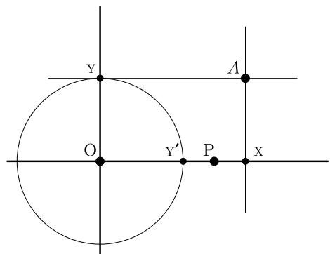

因此，确定哪些图形可以通过直尺和圆规构造，相当于确定哪些数可以作为可构造点的坐标来实现。

定义 3.1. 一个实数 $r$ 是可构造的，如果点 $( r , 0 )$ 可以用直尺和圆规构造出来（假设 $O = ( 0 , 0 )$ 和 $P = ( 1 , 0 )$ ，如上所述）。我将 $\mathcal { C } _ { \mathbb { R } } \subseteq \mathbb { R }$ 表示可构造的实数集合。L

此外，我们可以将真实平面与 $\mathbb{C}$ 识别，将 $O$ 放在 $0$，将 $P$ 放在 $1$，我们说 $z = x + iy$ 是可构造的，如果点 $(x, y)$ 是通过直尺和圆规可构造的。我将 $\mathcal{C}_{\mathbb{C}} \subseteq \mathbb{C}$ 记为可构造的复数集。总结前面的讨论，我们已经证明了：

引理 3.2. 一个点 $( x , y )$ 可以用直尺和圆规构造，当且仅当 $x + i y \in \mathcal { C } _ { \mathbb { C } }$ ，当且仅当 $x , y \in \mathcal { C } _ { \mathbb { R } }$ 。

下一个明显的问题是这些可构造数集携带什么样的结构，这促使我们来看一些更多的基本尺规作图。

引理 3.3. 可构造数集 $\mathcal { C } _ { \mathbb { R } } ~ \subseteq ~ \mathbb { R }$ 是 $\mathbb { R }$ 的一个子域。  
同样地，$\mathcal { C } _ { \mathbb { C } }$ 是 $\mathbb { C }$ 的一个子域，事实上 $\mathcal { C } _ { \mathbb { C } } = \mathcal { C } _ { \mathbb { R } } ( i )$ 。

证明。集合$\mathcal { C } _ { \mathbb { R } } \subseteq \mathbb { R }$非空，因此为了证明它是域，我们只需要证明它对减法和除以非零的构造数封闭即可（参见命题II.6.2）。

读者将检查 $\mathcal { C } _ { \mathbb { R } }$ 在减法下是封闭的（练习 3.2）。为了看到 $\mathcal { C } _ { \mathbb { R } }$ 在除法下是封闭的，设 $a , b \in \mathcal { C } _ { \mathbb { R } }$ ，且 $b \neq 0$ 。由于 $A = ( 0 , a )$ 和 $B = ( b , 0 )$ 根据假设是可构造的，我们可以构造 $C$ 作为通过 $P = ( 1 , 0 )$ 且平行于通过 $A$ 和 $B$ 的直线的 $y$ -截距，如下面的图15所示：


由于三角形 $A O B$ 和 $C O P$ 相似，我们看到 $C = ( 0 , a / b )$ ；因此 $a / b$ 是可构造的。

$\mathcal { C } _ { \mathbb { C } }$ 是 $\mathbb { C }$ 的一个子域是一个直接的结果，即 $\mathcal { C } _ { \mathbb { R } }$ 是一个域，这个证明留给读者去享受（练习 3.7）。$\mathcal { C } _ { \mathbb { C } } = \mathcal { C } _ { \mathbb { R } } ( i )$ 是 $x + i y \in \mathcal { C } _ { \mathbb { C } }$ 当且仅当 $x$ 和 $y$ 在 $\mathcal { C } _ { \mathbb { R } }$ 中这一事实的重新表述。

我们可以将 $\mathcal { C } _ { \mathbb { R } }$ 和 $\mathcal { C } _ { \mathbb { C } }$ 视为 $\mathbb { Q}$ 的扩张，在尺规作图可构造性和域论之间架起桥梁：如果我们能够理解域扩张，我们就能理解几何图形的可构造性

$$
\mathbb { Q } \subseteq \mathcal { C } _ { \mathbb { R } } \subseteq \mathcal { C } _ { \mathbb { C } } .
$$

很高兴，我们可以理解这些扩张！

### 3.2. 可构造数与二次扩张
我们的目标是证明 $\mathcal { C } _ { \mathbb { R } }$ 的如下惊人地明确的描述（立即暗示 $\mathcal { C } _ { \mathbb { C } }$ 的描述）。

定理 3.4. 设 $\gamma \in \mathbb{R}$。那么 $\gamma \in \mathcal{C}_{\mathbb{R}}$ 当且仅当存在实数 $\delta_{1}, \ldots, \delta_{k}$ 使得 $\forall j = 1, \ldots, k$

$$
[ \mathbb { Q } ( \delta _ { 1 } , \dots , \delta _ { j } ) : \mathbb { Q } ( \delta _ { 1 } , \dots , \delta _ { j - 1 } ) ] = 2
$$

并且 $\gamma \in \mathbb { Q } ( \delta _ { 1 } , \ldots , \delta _ { k } )$ 。

换句话说，$\gamma \in \mathbb{R}$ 是可构造的当且仅当它可以被放置在一个关于 $\mathbb{Q}$ 的（实）二次扩域序列的顶端域中。由于 $\mathcal{C}_{\mathbb{C}} = \mathcal{C}_{\mathbb{R}}(i)$，对于可构造的复数，同样的陈述也成立，包括将 $i$ 列入 $\delta_j$ 的列表中（或者简单地允许 $\delta_j$ 是复数；参见练习 3.9）。

这个定理的证明是尽可能明确的。从给定的直尺和圆规构造的点 $( x , y )$ 可以得到如陈述中所示的明确序列 $\delta _ { 1 } , \ldots , \delta _ { k }$，使得 $x$ 和 $y$ 属于扩张 $\mathbb { Q } ( \delta _ { 1 } , \ldots , \delta _ { k } )$；反之，从任何这样的扩张中的元素 $\gamma$ 可以通过直尺和圆规得到点 $( \gamma , 0 )$ 的明确构造。

证明。让我们首先从“几何到代数”的方向进行论证。通过直尺和圆规构造得到的点、线和圆的配置可以通过点的坐标和线和圆的方程来描述。假设在给定构造的某一阶段，所有点的所有坐标以及线和圆的方程中的所有系数都属于一个域 $F ^ { \prime }$；我将称该配置是在 $F$ 上定义的。

那么我断言，对于在下一阶段构造的每个对象，都存在一个次数至多为2的$\delta \in \mathbb{R}$，使得新构形在$F(\delta)$上定义。该定理的“反之亦然”部分通过关于构造步骤数的归纳法得出，因为在开始时构形（即点对$O = (0, 0)$，$P = (1, 0)$）在$\mathbb{Q}$上定义。

验证我的断言相当于验证定义尺规作图的基本操作。读者将检查（练习3.5）两条在$F$上定义的直线的交点具有$F$中的坐标，并且由$F$中坐标的点确定的直线和圆都在$F$上定义。因此，$\delta = 1$ 在所有这些情况下都适用。

对于直线 $\ell$ 与圆 $C$ 的交点，假设 $\ell$ 不平行于 $y$ 轴（否则论证完全类似），并且它确实与 $C$ 相交；让

$$
y = m x + r
$$

是 $\ell$ 的方程，并让

$$
x ^ { 2 } + y ^ { 2 } + a x + b y + c = 0
$$

$C$ 的方程。我们假设 $a , b , c , m , r \in F$。那么，$\ell$ 和 $C$ 的交点的 $x$ 坐标是方程的解

$$
x ^ { 2 } + ( m x + r ) ^ { 2 } + a x + b ( m x + r ) + c = 0 .
$$

“二次公式”表明这些坐标属于域 $F ( \sqrt { D } )$，其中 $\boldsymbol { D }$ 是这个多项式的判别式：明确地，

$$
D = ( 2 m r + b m + a ) ^ { 2 } - 4 ( m ^ { 2 } + 1 ) ( r ^ { 2 } + b r + c ) ,
$$

但这是无关紧要的。重要的是 $D \in F$；因此 $\delta = \sqrt{D}$ 满足我们的要求。

对于在 $F ^ { \prime }$ 上定义的两个（不同的）圆的交集，不需要任何新东西：如果

$$
\left\{ { \begin{array} { l } { x ^ { 2 } + y ^ { 2 } + a _ { 1 } x + b _ { 1 } y + c _ { 1 } = 0 , } \\ { x ^ { 2 } + y ^ { 2 } + a _ { 2 } x + b _ { 2 } y + c _ { 2 } = 0 } \end{array} } \right.
$$

有两个圆，减去这两个方程表明它们的交点与圆和直线的交点重合：

$$
\left\{ { \begin{array} { l } { x ^ { 2 } + y ^ { 2 } + a _ { 1 } x + b _ { 1 } y + c _ { 1 } = 0 , } \\ { ( a _ { 1 } - a _ { 2 } ) x + ( b _ { 1 } - b _ { 2 } ) y + ( c _ { 1 } - c _ { 2 } ) = 0 , } \end{array} } \right.
$$

与上例中的结论相同。

这完成了定理的“仅当”部分的验证。

要证明所述扩张的每个元素都是可构造的，再次通过归纳法来论证：只需证明如果 (i) $\delta \in \mathbb R$，(ii) $F ^ { \prime }$ 的所有元素都是可构造的，以及 (iii) $r = \delta ^ { 2 } \in F$，那么 $\delta$ 是可构造的（注意，为了构造 $F$ 上度为 2 的元素，只需构造其最小多项式的判别式的平方根）。因此，我们只需证明我们可以通过直尺和圆规构造“平方根”。这是图示（如果 $r > 1$）：


如果 $A = ( r , 0 )$ 是可构造的，那么 $B = ( - r , 0 )$ 也是可构造的；$C$ 是线段 $B P$ 的中点（中点是可构造的，练习 3.1）；以 $C$ 为中心且包含 $P$ 的圆与正 $y$ -轴交于一点 $Q = ( 0 , \delta )$ ，初等几何表明 $\delta ^ { 2 } = r$ 。因此 $\delta$ 是可构造的，从而完成了定理的证明。$\square$

例如，可以构造一个$3 ^ { \circ }$的角：据称

$$
\cos 3 ^ { \circ } = { \frac { 1 } { 8 } } ( { \sqrt { 3 } } + 1 ) { \sqrt { 5 + { \sqrt { 5 } } } } + { \frac { 1 } { 1 6 } } ( { \sqrt { 6 } } - { \sqrt { 2 } } ) ( { \sqrt { 5 } } - 1 ) ,
$$

并且这个表达式表明

$$
\cos 3 ^ { \circ } \in \mathbb { Q } ( { \sqrt { 2 } } , { \sqrt { 3 } } , { \sqrt { 5 } } ) ( { \sqrt { 5 + { \sqrt { 5 } } } } ) ;
$$

那就是（根据定理3.4），$\cos 3 ^ { \circ }$ 是可构造的。当然，一旦 $A = \left( \cos \theta , 0 \right)$ 被构造出来，角度 $\theta$ 也就随之被构造出来了：


这里是一个关于定理 3.4 的“建设性”应用的另一个例子：

示例 3.5. 正五边形是可构造的。


确实，构造点 $A = ( \cos ( 2 \pi / 5 ) , 0 )$ 就足够了，而且$\gamma = \cos ( 2 \pi / 5 )$ 恰好满足

$$
4 \gamma ^ { 2 } + 2 \gamma - 1 = 0
$$

（事实上，$\gamma$ 是黄金比倒数的一半：$\begin{array} { r } { \gamma = \frac { \sqrt { 5 - 1 } } { 4 } } \end{array}$）。因此，$\gamma \in \mathbb { Q } ( { \sqrt { 5 } } )$，并且根据定理 3.4，它是可构造的。事实上，证明展示了如何构造 $\sqrt { 5 }$，因此读者现在应该没有困难来制作一个直尺和圆规构造正五边形（练习 3.6）。

一旦我们更深入地学习了域理论，我们将回到正多边形的构造（参见§7.2）。顺便问一下，人们是如何发现 $\gamma = \cos ( 2 \pi / 5 )$ 应该满足恒等式（ $^ *$ ）的呢？这在某种程度上涉及复数运算；参见习题3.11。

### 3.3. 著名的不可能性
定理3.4通过以下直接推论轻易解决了§3.1中提到的三个问题：

推论 3.6. 设 $\gamma \in \mathcal { C } _ { \mathbb { C } }$ 是一个可构造数。那么 $[ \mathbb { Q } ( \gamma ) : \mathbb { Q } ]$ 是 2 的幂。

证明。根据引理3.3和定理3.4，存在$\boldsymbol { \delta } _ { 1 } \ldots , \boldsymbol { \delta } _ { k } \in \mathbb { R }$使得

$$
\gamma \in \mathbb { Q } ( \delta _ { 1 } , \ldots , \delta _ { k } , i ) .
$$

并且每个 $\delta _ { j }$ 在 $\mathbb { Q } ( \delta _ { 1 } , \ldots , \delta _ { j - 1 } )$ 上的次数 $\leq 2$。反复应用命题 1.10 表明

$$
[ \mathbb { Q } ( \delta _ { 1 } , \dots , \delta _ { k } , i ) : \mathbb { Q } ]
$$

是2的幂，并且因为

$$
\mathbb { Q } \subseteq \mathbb { Q } ( \gamma ) \subseteq \mathbb { Q } ( \delta _ { 1 } , \dots , \delta _ { k } , i ) ,
$$

该陈述源自推论1.11。

特别是，可构造实数必须满足相同条件。

考虑三等分角的问题。我们知道可以构造一个$60^{\circ}$的角（这是等边三角形构造的一个子产物）。构造一个$20^{\circ}$的角等价于（练习3.10）在单位圆上构造复数$\gamma$，其幅角为$\pi/9$：

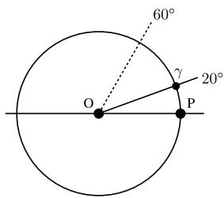

现在 $\gamma ^ { 9 } = - 1$；也就是说，$\gamma$ 满足多项式

$$
t ^ { 9 } + 1 = ( t ^ { 3 } + 1 ) ( t ^ { 6 } - t ^ { 3 } + 1 ) .
$$

它不满足 $t ^ { 3 } + 1$；因此它在 $\mathbb { Q }$ 上的最小多项式是的一个因子

$$
t ^ { 6 } - t ^ { 3 } + 1 .
$$

然而，这个多项式在 $\mathbb{Q}$ 上是不可约的（将 $t$ 代换为 $t - 1$，并应用艾森斯坦判别法），所以

$$
\left[ \mathbb { Q } ( \gamma ) : \mathbb { Q } \right] = 6 .
$$

根据推论3.6，$\gamma$是不可构造的。因此存在不可三等分的可构造角。

同样地，立方体不能加倍，因为那将意味着 $\sqrt [ 3 ] { 2 }$ 的可构造性，它在 $\mathbb { Q }$ 上的次数为3，这与推论3.6矛盾。

化圆为方相当于构造 $\sqrt\pi$ , 但若  $\sqrt\pi$  是代数数 , 则 $\pi$ 就会是代数数 , 但它不是（尽管，如我所述，这个事实的证明不是初等的），所以这也是不可能的。

作为另一个例子，构造一个正七边形将相当于构造 $^ { 1 }$ 的第七（复）根 $\zeta$。


根据定义，$\zeta$ 满足

$$
t ^ { 7 } - 1 = ( t - 1 ) ( t ^ { 6 } + t ^ { 5 } + \cdot \cdot \cdot + t + 1 ) ;
$$

当 $\zeta \neq 1$ 时，$\zeta$ 必须满足循环多项式 $t ^ { 6 } + \cdots + 1$。这是不可约的（示例 V.5.19）；因此我们再次发现 $\zeta$ 在 $\mathbb { Q }$ 上的次数为 6，并且推论 3.6 表明正七边形不能使用直尺和圆规来构造。

当然，“7”并不太特别：如果 $p$ 是一个正素数，那么度数为 $p - 1$ 的循环多项式是不可约的（再次参考示例 V.5.19）；因此

$$
[ \mathbb { Q } ( \zeta _ { p } ) : \mathbb { Q } ] = p - 1 .
$$

其中 $\zeta _ { p }$ 是复数 $p$ -次方根1，其幅角为 $2 \pi / p$。因此，推论3.6表明，如果 $p$ 是素数，那么正 $p$ -边形只能被构造，当且仅当 $p - 1$ 是2的幂。这比最初看起来更加严格，因为如果 $p = 2 ^ { k } + 1$

若它是素数，则必然 $k$ 本身是2的幂（习题3.15）。形式为 $2 ^ { 2 ^ { \ell } } + 1$ 的素数被称为费马素数：

$$
3 , 5 , 1 7 , 2 5 7 , 6 5 5 3 7
$$

（‘下一个’，$2 ^ { 3 2 } + 1 = 4 2 9 4 9 6 7 2 9 7 = 6 4 1 \cdot 6 7 0 0 4 1 7$，不是质数；事实上，没有人知道是否存在其他费马质数，然而有些人猜想有无限多个）。

这些考虑本身并不能告诉我们，如果 $p$ 是费马素数，那么正 $p$ 边形可以用直尺和圆规构造；但它们确实告诉我们，要考虑的下一种情况是 $p = 2 ^ { 4 } + 1 = 17$ ，而且恰好

$$
\cos { \frac { 2 \pi } { 1 7 } } = { \frac { { \sqrt { 1 } } 7 - 1 + { \sqrt { 2 } } { \sqrt { 3 4 + 6 { \sqrt { 1 7 } } + { \sqrt { 2 } } ( { \sqrt { 1 7 } } - 1 ) { \sqrt { 1 7 - { \sqrt { 1 7 } } } } } } - 8 { \sqrt { 2 } } { \sqrt { 1 7 + { \sqrt { 1 7 } } } } + { \sqrt { 2 } } { \sqrt { 1 7 - { \sqrt { 1 7 } } } } } { 1 6 } }
$$

如高斯19岁时所指出。因此（根据定理3.4），十七边形可以通过直尺和圆规来构造。正如我之前宣布的，情况将很快进一步澄清，使我们能够绕过复杂的三角学。

### 习题

3.1. $\triangleright$ 证明如果 $A$ ， $B$ 是可构造的，那么线段 $A B$ 的中点也是可构造的。证明如果两条直线 $\ell _ { 1 }$ ， $\ell _ { 2 }$ 是可构造的且不平行，那么由 $\ell _ { 1 }$ 和 $\ell _ { 2 }$ 形成的角的两条角平分线也是可构造的。[§3.2]

3.2. $\triangleright$ 证明如果 $a$ ， $b$ 是可构造数，那么 $a - b$ 也是可构造数。[§3.1]

3.3. 找出两个实数的积的直尺和圆规作图方法。

3.4. 展示如何用直尺和圆规平方一个三角形。

3.5. $\triangleright$ 设 $F ^ { \prime }$ 是 $\mathbb { R }$ 的一个子域。

• 设 $A = ( x _ { A } , y _ { A } )$ ，$B = ( x _ { B } , y _ { B } )$ 是 $\mathbb { R } ^ { 2 }$ 中的两点，且 $x _ { A } , y _ { A }$ ，$x _ { B } , y _ { B } \in F$ 。证明通过 $A$ ，$B$ 的直线在 $F ^ { \prime }$ 上定义（即它具有系数在 $F$ 中的方程）。  
证明以 $A$ 为中心且包含 $B$ 的圆在 $F ^ { \prime }$ 上定义。  
• $\mathrm { L e t } \ell _ { 1 } , \ell _ { 2 }$ 是 $\mathbb { R } ^ { 2 }$ 中的两条不同且不平行的直线，定义在 $F$ 上，且 $( x , y ) =$ $\ell _ { 1 } \cap \ell _ { 2 }$ 。证明 $x , y \in F$ 。

[§3.2]

3.6. $\triangleright$ 设计一种用直尺和圆规构造正五边形的方法。[§3.2]

3.7. $\triangleright$ 将（实）平面与 $\mathbb { C }$ 确定对应，并将 $O$ ， $P$ 放置在 $0 , 1 \in \mathbb { C }$ 。设 $\mathcal { C } _ { \mathbb { C } }$ 是所有可构造点的集合，视为 $\mathbb { C }$ 的一个子集。证明 $\mathcal { C } _ { \mathbb { C } }$ 是 $\mathbb { C }$ 的一个子域。[§3.1]

3.8. 对于 $\delta \in \mathbb{C}$，$\delta \neq 0$，设 $\theta_{\delta}$ 为 $\delta$ 的辐角（即通过 $0$ 和 $\delta$ 的线与实轴形成的角）。证明 $\delta \in \mathcal{C}_{\mathbb{C}}$ 当且仅当 $|\delta|$，$\cos \theta_{\delta}$，$\sin \theta_{\delta}$ 都是可构造的实数。

3.9. $\triangleright$ 设 $\gamma _ { 1 } , \dotsc , \gamma _ { k } \in \mathcal { C } _ { \mathbb { C } }$ 为可构造的复数，设 $K$ 为域 $\mathbb { Q } ( \gamma _ { 1 } , \dots , \gamma _ { k } ) \subseteq \mathcal { C } _ { \mathbb { C } }$ 。设 $\delta$ 为一个复数，使得 $[ K ( \delta ) : K ] = 2$ 。证明 $\delta \in \mathcal { C } _ { \mathbb { C } }$ 。

推断在 $\mathcal { C } _ { \mathbb { C } }$ 上不存在二次不可约多项式，并且 $\mathcal { C } _ { \mathbb { C } }$ 是 $\mathbb { C }$ 中具有此性质的最小子域。[§3.2]

3.10. $\triangleright$ 证明：在任何可构造的配置中，如果两条直线形成角度 $\theta$，那么通过 $O$ 形成相对于 $OP$ 顺时针方向角度 $\theta$ 的直线是可构造的。

推断角度 $\theta$ 在平面上是可构造的当且仅当 $\cos \theta$ 是可构造的。[§3.3]

3.11. $\triangleright$ 验证 $\gamma = \cos ( 2 \pi / 5 )$ 满足 §3.2 中给出的关系 $( ^ { * } )$。（如果 $\sigma = \sin ( 2 \pi / 5 )$，注意 $z = \gamma + i \sigma$ 满足 $z ^ { 5 } - 1$。）[§3.2]

3.12. 证明 $1 ^ { \circ }$ 和 $2 ^ { \circ }$ 的角不可构造。(提示：根据我们目前所知，你只需要回忆存在两个角和的三角公式；这些公式的确切形式并不重要。) 对于哪些整数 $n$，角 $n ^ { \circ }$ 是可构造的？

3.13. $\triangleright$ 证明在下列图中 $\begin{array} { r } { \alpha = \frac { \theta } { 3 } } \end{array}$：


这表明如果我们允许使用“尺子”，即带有刻度的直尺（在这里，如果尺子上可以标记一个固定的距离1，这个构造就可行），那么角可以被三等分。显然，这个构造是阿基米德所知道的。[§3.1]

3.14. 证明正九边形不可作图。

3.15. $\triangleright$ 证明如果 $2 ^ { k } + 1$ 是素数，那么 $k$ 是2的幂。[§3.3]

## 4. 域扩张，II

是时候继续我们关于不同域扩张的调查了。这里的关键词是分裂域、正规、可分。

### 4.1. 分割域和正规扩域
在 §2 中，我们构造了任意给定域 $k$ 的代数闭包 $\overline { { k } }$：$k \lfloor x \rfloor$ 中的每个多项式在 ${ \overline { { k } } } [ x ]$ 中分解为线性项（即“分割”），并且 $\overline { { k } }$ 是满足此性质的 $k$ 的“最小”扩域。

这里有一个类似但更 modest 的要求：给定一个多项式子集 ${ \mathcal { F } } \subseteq k [ x ]$，构造一个扩张 $k \subseteq F$，使得 $\mathcal { F }$ 中的每个多项式都作为 $F$ 上的线性项的积而分解，并要求 $F$ 具有此性质时尽可能小。然后我们将 $F$ 称为 $\mathcal { F }$ 的分裂域。在实践中，我们只对 $\mathcal { F }$ 是多项式 $f _ { 1 } ( x ) , \dots , f _ { r } ( x )$ 的有限集合的情况感兴趣；那么要求每个 $f _ { i } ( x )$ 在 $F$ 上分解等价于要求积 $f _ { 1 } ( x ) \cdot \cdot \cdot f _ { r } ( x )$ 在 $F ^ { \prime }$ 上分解。

也就是说，为了我们的目的，假设 $\mathcal { F }$ 由单个多项式 $f ( x ) \in k \vert x \vert$ 组成并不具有限制性。

定义4.1。设$k$是一个域，$f(x) \in k[x]$是一个次数为$d$的多项式。$f(x)$在$k$上的分裂域是一个$k$的扩张域$F$，使得

$$
f ( x ) = c \prod _ { i = 1 } ^ { d } ( x - \alpha _ { i } )
$$

在 $F \lfloor x \rfloor$ 中分裂，并且进一步 $F = k ( \alpha _ { 1 } , \ldots , \alpha _ { d } )$ 是通过 $f ( x )$ 在 $F$ 中的根在 $k$ 上生成的。

请注意，$a$ 的分裂域是存在的：给定 $f ( x ) \in k \vert x \vert$ ，由 $f ( x )$ 在 $\overline { { k } }$ 中的根在 $k$ 上生成的子域 $F \subseteq { \overline { { k } } }$ 满足定义 4.1 中的要求。但我已经写出了分裂域，这是由以下基本观察的唯一性部分所证明的，该观察也评估了“这个扩张有多大”。

引理 4.2. 设 $k$ 是一个域，且 $f(x) \in k[x]$。那么 $f(x)$ 在 $k$ 上的分裂域 $F^{\prime}$ 在同构意义下是唯一的，并且 $\lfloor F : k \rfloor \leq (\deg f)!$。

事实上，如果 $\iota : k ^ { \prime } \to k$ 是任何域同构，并且 $g ( x ) \in k ^ { \prime } \vert x \vert$ 是满足 $f ( x ) = \iota ( g ( x ) )$ 的元素，那么 $\iota$ 可以扩张为 $g ( x )$ 在 $k ^ { \prime }$ 上的任意分裂域到 $f ( x )$ 在 $k$ 上的任意分裂域之间的同构。

证明。我们首先明确地构造一个分裂域，并得到陈述中提到的度数界限。然后我们证明第二部分，这表明在同构意义下是唯一的。

分裂域的构造和给定的次数界限是我们在第V.5.7命题中找到的基本简单扩张的一个简单应用。通过归纳法，假设分裂域已经被构造，并且对于所有域和所有次数为$( \deg f - 1 )$的多项式，界限已被证明。设$q ( t )$是$f ( t )$在$k$上的任意一个不可约因子；那么

$$
k \subseteq F ^ { \prime } : = \frac { k [ t ] } { ( q ( t ) ) }
$$

是 $\deg q \leq \deg f$ 的扩张，其中 $q(x)$（以及 $f(x)$）有一个根（$t$ 的陪集 $\alpha$），因此有一个线性因子 $x - \alpha$。多项式 $h(x) : =$

$f(x) / (x - \alpha) \in F' [x]$ 的次数是 $(\deg f - 1)$；因此 $h(x)$ 存在分裂域 $F'$ ，和

$$
[ F : F ^ { \prime } ] \leq ( \deg f - 1 ) ! .
$$

$f(x)$ 在 $F^{\prime}$ 上的因子是 $(x - \alpha)$ 以及 $h(x)$ 的因子，后者是线性的；因此 $F$ 是 $f(x)$ 的分裂域。

$$
[ F : k ] = [ F : F ^ { \prime } ] [ F ^ { \prime } : k ] \leq ( \deg f ) ( \deg f - 1 ) ! = ( \deg f ) !
$$

如上所述。

为了证明同构 $\iota : k ^ { \prime } \to k$ 可以扩张为分裂域的同构，如所述，设 $G$ 是 $g ( x )$ 的一个分裂域，并考虑复合映射 $k ^ { \prime } \to k \subseteq \overline { { k } }$ 。由于扩张 $k ^ { \prime } \subseteq G$ 是代数的，根据引理 2.8，存在一个 $k ^ { \prime }$ 上的扩张映射 $\iota : G  \overline { { k } }$ 。由于 $G$ 是由 $g ( x )$ 在 $G$ 中的根在 $k ^ { \prime }$ 上生成的，我们有

$$
\iota ( G ) = k ( \alpha _ { 1 } , \ldots , \alpha _ { d } ) \subseteq \overline { { k } } ,
$$

$\alpha _ { i }$ 的值是 $f ( x ) = \iota ( g ( x ) )$ 在 $\overline { { k } }$ 中的根。因此 $L : = \iota ( G )$ 与所选择的同构 $\iota$ 和分裂域 $G$ 无关。将这一观察应用于给定的 $\iota$ 和恒等式 $k  k$ 证明了该命题（因为 $G$ 和 $F$ 都与 $L$ 同构）。$\square$

示例 4.3. 根据定义，$\mathbb { Q } ( i )$ 是 $x ^ { 2 } + 1$ 在 $\mathbb { Q }$ 上的分裂域，而 $\mathbb { C }$ 是该多项式在 $\mathbb { R }$ 上的分裂域。

示例 4.4. $x ^ { 8 } - 1$ 在 $\mathbb { Q }$ 上的分裂域 $F ^ { \prime }$ 是由 $\zeta := e ^ { 2 \pi i / 8 }$ 生成的：确实，$x ^ { 8 } - 1$ 的根是所有 1 的 8 次方根，并且它们都是 $\zeta$ 的幂：


事实上，$\zeta$ 是多项式 $x ^ { 4 } + 1$ 的一个根，该多项式在 $\mathbb { Q }$ 上不可约；因此 $F = \mathbb { Q } ( \zeta )$ 已经是 $x ^ { 4 } + 1$ 的分裂域。$F ^ { \prime }$ 在 $\mathbb { Q }$ 上的次数是

$$
\left[ \mathbb { Q } ( \zeta ) : \mathbb { Q } \right] = 4 ,
$$

远小于引理4.2中得到的界限8!，4!。

为了更好地理解这个分裂域（偶数），请注意 $i = \zeta ^ { 2 }$ 在 $F$ 中，${ \sqrt { 2 } } = \zeta + \zeta ^ { 7 }$ 也在 $F$ 中；因此 $F$ 包含 $\mathbb { Q } ( i , { \sqrt { 2 } } )$ 。反之，$\begin{array} { r } { \zeta = \frac { \sqrt { 2 } } { 2 } ( 1 + i ) \in \mathbb { Q } ( i , \sqrt { 2 } ) } \end{array}$ 。因此，$x ^ { 4 } + 1$（即 $x ^ { 8 } - 1$ 的分裂域）是 $\mathbb { Q } ( i , { \sqrt { 2 } } )$ 。分析 $\mathbb { Q } \subseteq \mathbb { Q } ( i , { \sqrt { 2 } } )$（如我们在例1.19中对扩张所做的那样）表明其关于 $\mathbb { Q }$ 的自同构群是 $\mathbb { Z } / 2 \mathbb { Z } \times \mathbb { Z } / 2 \mathbb { Z }$ 。

示例 4.5. 主题变体：$x ^ { 4 } - 1$。如果考虑 $x ^ { 4 } - 1$ 而不是 $x ^ { 4 } + 1$，情况就会改变：这个多项式在 $\mathbb { Q }$ 上可分解。

$$
x ^ { 4 } - 1 = ( x - 1 ) ( x + 1 ) ( x ^ { 2 } + 1 ) ,
$$

因此，分裂域与 $x^2 + 1$ 相同，即只是 $\mathbb{Q}(i)$。

示例 4.6. 主题变体：$x ^ { 4 } + 2$。过于乐观的读者现在可能希望，$x ^ { 4 } + 1$ 与 $x ^ { 4 } - 1$ 在 $\mathbb { Q }$ 上的分裂域之间的差异仅仅是因为第一个多项式在 $\mathbb { Q }$ 上不可约，而第二个多项式不是。这个例子将任何此类猜测扼杀在摇篮里。与示例 4.4 中的符号相同，$x ^ { 4 } + 2$ 的根是

$$
{ \sqrt [ 4 ] { 2 } } \zeta , { \sqrt [ 4 ] { 2 } } \zeta ^ { 3 } , { \sqrt [ 4 ] { 2 } } \zeta ^ { 5 } , { \sqrt [ 4 ] { 2 } } \zeta ^ { 7 } .
$$

因此，对于 $K = \mathbb{Q}(\sqrt[4]{2}\zeta, \sqrt[4]{2}\zeta^3, \sqrt[4]{2}\zeta^5, \sqrt[4]{2}\zeta^7)$，它是 $x^4 + 2$ 的分裂域

$$
K \subseteq \mathbb { Q } ( \zeta , { \sqrt [ { 4 } ] { 2 } } ) = \mathbb { Q } ( i , { \sqrt { 2 } } , { \sqrt [ { 4 } ] { 2 } } ) = \mathbb { Q } ( i , { \sqrt [ { 4 } ] { 2 } } ) .
$$

另一方面，${ \sqrt { 2 } } = ( { \sqrt [ 4 ] { 2 } } \zeta ) ^ { 3 } / ( { \sqrt [ 4 ] { 2 } } \zeta ^ { 3 } ) \in K$ ；因此 $i = ( \sqrt [ 4 ] { 2 } \zeta ) ^ { 2 } / \sqrt { 2 } \in K$ ；因此 $\begin{array} { r } { \zeta = \frac { \sqrt { 2 } } { 2 } ( 1 + i ) \in K } \end{array}$ ；因此 $\sqrt [ 4 ] { 2 } = ( \sqrt [ 4 ] { 2 } \zeta ) / \zeta \in K$ 。因此，$\mathbb { Q } ( i , \sqrt [ 4 ] { 2 } ) \subseteq K$ ，结论是 $x ^ { 4 } + 2$ 的分裂域等于 $K = \mathbb { Q } ( i , \sqrt [ 4 ] { 2 } )$ 。一个简单的次数计算（练习 4.3）表明 $\lfloor K : \mathbb { Q } \rfloor = 8$ ，并且特别是 $x ^ { 4 } + 2$ 的分裂域当然不与 $x ^ { 4 } + 1$ 的分裂域同构。

这样的例子总是让我觉得场论必须相当神秘：对问题参数的无辜变化可能会导致相应的场扩张发生剧烈变化。从好的方面来说，这表明场论确实可以是一种非常精确的工具（例如在多项式的研究中）。

分裂域将在故事的后半部分发挥重要作用。它们甚至比最初看起来更特别：原来它们不仅分裂给定的多项式，而且还会自动分裂任何敢于用根触碰它们的不可约多项式。这使得分裂域成为正规扩张：

定义 4.7. 一个域扩张 $k \subseteq F$ 是正规扩张，如果对于每一个不可约多项式 $f ( x ) \in k \vert x \vert$ ，$f ( x )$ 在 $F ^ { \prime }$ 中有一个根当且仅当 $f ( x )$ 在 $F ^ { \prime }$ 上分解为线性因子的积。

**定理 4.8.** 域扩张 $k \subseteq F$ 是有限且正规当且仅当 $F ^ { \prime }$ 是某个多项式 $f ( x ) \in k \vert x \vert$ 的分裂域。

证明。假设 $k \subseteq F$ 是有限且正规。那么 $F$ 是有限生成的：$F =$ $k ( \alpha _ { 1 } , \ldots , \alpha _ { r } )$，其中 $\alpha _ { i }$ 在 $k$ 上代数。设 $p _ { i } ( x )$ 是 $\alpha _ { i }$ 在 $k$ 上的最小多项式。由于 $F$ 在 $k$ 上正规，每个 $p _ { i } ( x )$ 在 $F$ 上完全分解，因此 $f ( x ) = p _ { 1 } ( x ) \cdot \cdot \cdot p _ { r } ( x )$ 也完全分解。由此可知 $F$ 是 $f ( x )$ 的分裂域。

相反地，假设 $F ^ { \prime }$ 是多项式 $f ( x ) \in k [ x ]$ 的一个分裂域，并且设 $p ( x ) \in k [ x ]$ 是一个不可约多项式，使得 $F ^ { \prime }$ 包含 $p ( x )$ 的一个根 $\alpha$。将 $F ^ { \prime }$ 视为代数闭域 $\overline { { k } }$ 的一个子域，设 $\beta \in \overline { { k } }$ 是 $p ( x )$ 的另一个根；我们将证明 $\beta \in F$。这将证明 $F$ 包含 $p ( x )$ 的所有根，这意味着 $k \subseteq F$ 是正规域，并且根据引理 4.2，$k \subseteq F$ 是有限域。

根据命题1.5，存在一个同构映射 $\iota : k ( \alpha )  \to k ( \beta )$，它在$k$上保持恒等且将$\alpha$映射到$\beta$。我们还考虑子域$F ( { \boldsymbol { \beta } } ) \subseteq { \overline { { k } } }$，将其视为$k ( \beta )$的扩域。将所有内容放在一个图中：


（注：如果我们通过恒等映射将右边的两个$\overline { { k } }$连接起来，相应的图不交换：$\iota$将顶行中的$\alpha \in \overline { { k } }$发送到底行中的$\beta \in \overline { { k } }$。）现在观察到$F ^ { \prime }$可以看作是$f ( x )$在$k ( \alpha )$上的分裂域：确实，它包含$f ( x )$的所有根，并且由这些根在$k$上（因此也在$k ( \alpha )$上）生成。同样地，$F ( \beta )$是$f ( x )$在$k ( \beta )$上的分裂域。根据引理4.2，$\iota$扩展为一个同构$\iota ^ { \prime } : F  F ( \beta )$。由于$\iota$在$k$上限制为恒等映射，$\iota ^ { \prime }$是$k$-向量空间的同构；特别是，$\dim _ { k } F = \dim _ { k } F ( \beta )$（请记住分裂域是有限扩张）。

现在考虑 $k$ -线性映射 $i : F \to F ( \beta )$，它简单地由 $\overline { { k } }$ 内的包含给出：

$$
k \subseteq F \subseteq F ( \beta ) \subseteq { \overline { { k } } } .
$$

由于 $F$ 和 $F ( \beta )$ 是相同有限维的 $k$ -向量空间，$i$ 也必须是同构。换句话说，

$$
[ F ( \beta ) : F ] = 1 ;
$$

也就是说，$\beta \in F$ 如有必要。

备注4.9。这个论证有点微妙。使用证明中的符号，图


交换律成立，而图

$$
\begin{array} { l c r } { { k ( \alpha ) { \stackrel { \longleftrightarrow } { \longleftrightarrow } } \longrightarrow F } } \\ { { \downarrow } } \\ { { k ( \beta ) { \stackrel { \longleftrightarrow } { \longleftrightarrow } } \longrightarrow F ( \beta ) } } \end{array}
$$

如果 $\beta \neq \alpha$ ，则不是交换的。实际上，$\iota$ 将 $\alpha$ 映射到 $\beta$ ，而 $i$ 将 $\alpha$ 映射到 $\alpha$ 。论证的关键点在于观察到：如果两个有限维向量空间 $V$ ，$W$ 之间存在一个同构，那么每个从 $V$ 到 $W$ 的单射线性映射必须是同构。有限维性是得出这个结论的必要条件；参见习题 VI.6.5。

示例 4.10. 如果一个不可约多项式 $p ( x ) \in \mathbb { Q } [ x ]$ 的一个复根可以记为 $i$ 和 $\sqrt [ 4 ] { 2 }$ 的有理系数多项式，那么 $p ( x )$ 的所有根都可以同样用 $i$ 和 $\sqrt [ 4 ] { 2 }$ 表示。实际上，我们已经检查过（示例 4.6），$\mathbb { Q } ( i , \sqrt [ 4 ] { 2 } )$ 是 $\mathbb { Q }$ 上的分裂域；因此它是 $\mathbb { Q }$ 的正规扩张。

### 4.2. 可分多项式
我们的直觉可能会让我们认为，如果一个多项式分解为线性因子的积，并且我们没有“故意”重复其中一个因子（例如 $( x - 1 ) ^ { 2 } ( x - 2 ) )$），那么这些因子将是不同的。例如，不可约多项式在代数闭包中必然分解为不同的因子的积，对吧？错误。

示例 4.11. 设 $p$ 为素数，考虑 $\mathbb{F}_p(t)$ 上的有理函数域。那么多项式

$$
x ^ { p } - t \in \mathbb { F } _ { p } ( t ) [ x ]
$$

是不可约的：根据艾森斯坦判别法，它在 $\mathbb{F}_p[t][x]$ 中是不可约的（因为 $\Omega(t)$ 在 $\mathbb{F}_p[t]$ 中是素元），因此在 $\mathbb{F}_p(t)[x]$ 中也是不可约的，根据命题 V.4.16。设 $u$ 是这个多项式在 $\mathbb{F}_p(t)$ 的扩域 $L$ 中的一个根（例如 $L$ 可以是 $\mathbb{F}_p(t)$ 的代数闭包，或者更保守地说是这个多项式的分裂域）。那么（习题 4.8）

$$
x ^ { p } - t = ( x - u ) ^ { p }
$$

在$L[x]$中；也就是说，$u$作为$f(x)$的根具有重数$p$。

换句话说，$u \in L$ 在 $\mathbb{F}_p(t)$ 上的最小多项式在 $u$ 处有 $p$ 重根，对此无能为力：$(x - u)$ 的任何小于 $p$ 次的幂都没有系数在 $\mathbb{F}_p(t)$ 中（次幂更小会给出 $x^p - t$ 的非平凡因子，而 $x^p - t$ 是不可约的）。

我一直觉得这个例子很难形象化，因为这是在特征$0$下形成的直觉，而且正如我们将看到的，在特征$0$下不可能发生这种病理现象。

定义4.12。设$k$为一个域。多项式$f(x) \in k[x]$是可分的，如果它在分裂域中没有重因式；$f(x)$是不可分的，如果它在分裂域中有重因式。

因此，在示例 4.11 中的多项式 $x ^ { p } - t$ 是不可分离的。我猜想这个术语反映了我们无法“分离”它的根：它们像质子中的夸克一样聚集在一起，而我们无法将它们分开。

当然，定义4.12不依赖于所选择的分裂域，因为这些在同构意义下是唯一的（引理4.2）。事实上，为了检测可分性，我们可以使用任何多项式作为线性因子的积的域（通过习题4.1）。关于可分性的第一个，有点令人惊讶的观察是，我们实际上可以在不离开$f(x)$的系数域的情况下检测它。这个事实使用了一个来自微积分的概念：对于一个多项式

$$
f ( x ) = a _ { 0 } + a _ { 1 } x + a _ { 2 } x ^ { 2 } + \cdot \cdot \cdot + a _ { n } x ^ { n } ,
$$

我们用 $f ^ { \prime } ( x )$ 表示“导数”

$$
f ^ { \prime } ( x ) = a _ { 1 } + 2 a _ { 2 } x + \cdot \cdot \cdot + n a _ { n } x ^ { n - 1 } .
$$

当然这是一个纯粹的形式操作；任意域上没有极限过程在起作用。然而，所有预期的导数性质都成立，读者应该检查：例如，$( f g ) ^ { \prime } = f ^ { \prime } g + f g ^ { \prime }$ 如同往常。

引理 4.13. 设 $k$ 是一个域，且 $f ( x ) \in k \vert x \vert$。那么 $f ( x )$ 是可分当且仅当 $f ( x )$ 和 $f ^ { \prime } ( x )$ 互素。

根据定义，$f ( x )$ 和 $f ^ { \prime } ( x )$ 互质当且仅当 $f ( x )$ 和 $f ^ { \prime } ( x )$ 的最大公约数是 $1$。注意，如果 $k \subseteq F$，那么无论在 $k \lfloor x \rfloor$ 中还是在 $F [ x ]$ 中考虑，$f ( x )$ 和 $f ^ { \prime } ( x )$ 的最大公约数都是相同的：例如，因为它可以通过应用欧几里得算法（$\mathfrak { z }$ V.2.4）来计算，并且无论在 $k \lfloor x \rfloor$ 中还是在 $F \lfloor x \rfloor$ 中执行，这个过程都是完全相同的。

证明。首先假设 $f(x)$ 不可分。那么 $f(x)$ 在一个分裂域 $F^{\prime}$ 中有一个重根；也就是说，

$$
f ( x ) = ( x - \alpha ) ^ { m } g ( x )
$$

对于某些 $\alpha \in F$，$g ( x ) \in F [ x ]$，且 $m \geq 2$。因此

$$
f ^ { \prime } ( x ) = m ( x - \alpha ) ^ { m - 1 } g ( x ) + ( x - \alpha ) ^ { m } g ^ { \prime } ( x ) ,
$$

因此 $( x - \alpha )$ 是 $F[x]$ 中 $f(x)$ 和 $f'(x)$ 的一个公因式。所以 $\operatorname*{gcd}(f(x), f'(x)) \neq 1$ 在 $F[x]$ 中；因此 $\operatorname*{gcd}(f(x), f'(x)) \neq 1$ 在 $k[x]$ 中；即 $f(x)$，$f'(x)$ 不是互质的。

相反地，假设 $\operatorname* { g c d } ( f ( x ) , f ^ { \prime } ( x ) ) \neq 1$ ，所以 $f ( x )$ 和 $f ^ { \prime } ( x )$ 在 $k$ 的代数闭包 $\overline { { k } }$ 中有一个共同的不可约因子 $( x - \alpha )$ 。写 $f ( x ) = ( x - \alpha ) h ( x )$ ；我们有

$$
f ^ { \prime } ( x ) = h ( x ) + ( x - \alpha ) h ^ { \prime } ( x ) ,
$$

因此，$x - \alpha$ 整除 $h(x)$，因为它整除 $f^{\prime}(x)$。但那么

$$
\left( x - \alpha \right) ^ { 2 } \mid f ( x ) ;
$$

因此 $f ( x )$ 是不可分的。

例如，例4.11中的多项式$x ^ { p } - t$在不使用分裂域的情况下可能被视为不可分离的：$x ^ { p } - t$的导数在特征$p$下等于$p x ^ { p - 1 } = 0$，并且$\operatorname* { g c d } ( x ^ { p } - t , 0 ) = x ^ { p } - t \neq 1$。这个例子捕捉了不可分离性中的一个关键特征：

引理 4.14. 设 $k$ 是一个域，且 $f(x) \in k[x]$ 是一个不可约的既约多项式。那么 $f'(x) = 0$。

证明。由于 $f ( x )$ 不可约，根据引理 4.13，$f ( x )$ 和 $f ^ { \prime } ( x )$ 有一个共同的不可约因子 $q ( x )$；但由于 $f ( x )$ 本身不可约，$q ( x )$ 必须是 $f ( x )$ 的一个伴随元，并且当 $f ^ { \prime } ( x ) \neq 0$ 时，它（$q ( x )$）的次数大于 $f ^ { \prime } ( x )$ 的次数。由于 $q ( x ) \mid f ^ { \prime } ( x )$，唯一的选择是 $f ^ { \prime } ( x ) = 0$ 。

这已经告诉我们，在特征 0 下，不可约多项式必然是可分的：在特征 $0$ 下，非常数多项式的导数显然不可能为零。事实上，引理 4.14 给我们描绘了不可分、不可约多项式必须是什么样的。如果

$$
f ( x ) = \sum _ { i = 0 } ^ { n } a _ { i } x ^ { i }
$$

如果它既不可约又不可分，那么该域的特征必须是正素数 $p$，并且根据引理 4.14，我们必须有

$$
f ^ { \prime } ( x ) = \sum _ { i = 0 } ^ { n } i a _ { i } x ^ { i - 1 } = 0 ;
$$

也就是说，$i a _ { i } = 0$ 对所有 $i$ 都成立。现在 $i a _ { i } = 0$ 如果 $i$ 是 $p$ 的倍数则是自动成立的，并且它意味着对于所有不是 $p$ 的倍数的索引 $i$，$a _ { i } = 0$。因此，$f ( x )$ 中唯一非零系数必须是那些对应于是 $p$ 的倍数的索引的系数：

$$
f ( x ) = a _ { 0 } + a _ { p } x ^ { p } + a _ { 2 p } x ^ { 2 p } + \ldots ;
$$

因此，$f(x)$ 实际上必须是 $x^p$ 的多项式。（读者将通过完成练习 4.13 及后续内容来进一步完善这一认识。）

这引导我们到一个精确的结果，将可分离性与我们尚未遇到的一种场联系起来。

定义4.15. 设$k$是一个特征为$p>0$的域。Frobenius同态是定义在$k$上的映射$k \rightarrow k$，其将$x$映射为$x^p$。

Frobenius同态可能看起来不像环同态，但它确实是（习题4.8）。它必须是单射的，因为从域到非平凡环的同态总是单射的；但它不一定是满射的。

定义4.16. 域 $k$ 是完美的，如果 char $k = 0$，或者如果 char $k > 0$ 且Frobenius同态是满射。

命题 4.17. 设 $k$ 是一个域。那么 $k$ 是完美域当且仅当 $k \lfloor x \rfloor$ 中所有不可约多项式都是可分的。

证明。我将证明在完美域上的不可约多项式是可分离的，其他蕴含关系留给读者（练习4.12）。

我们已经注意到不可约多项式在特征为零的域上是可分的。在正特征 $p$ 下，我们观察到一个不可约多项式必须是以下形式

$$
f ( x ) = \sum _ { i = 0 } ^ { m } a _ { i } \cdot ( x ^ { p } ) ^ { i } .
$$

由于弗罗贝尼乌斯是满射的，存在 $b _ { i }$ 使得 $b _ { i } ^ { p } = a _ { i }$ 。因此

$$
f ( \boldsymbol { x } ) = \sum _ { i = 0 } ^ { m } b _ { i } ^ { p } ( \boldsymbol { x } ^ { p } ) ^ { i } = \sum _ { i = 0 } ^ { m } ( b _ { i } x ^ { i } ) ^ { p } = \left( \sum _ { i = 0 } ^ { m } b _ { i } x ^ { i } \right) ^ { p } = g ( \boldsymbol { x } ) ^ { p } ,
$$

其中 $g ( x ) = \textstyle \sum b _ { i } x ^ { \ i }$ ，并且考虑到Frobenius映射是一个同态。但这与$f ( x )$的不变性相矛盾，因此不存在这样的多项式。

推论 4.18. 有限域是完美的。因此，在有限域上，不可约多项式是分离的。

证明。Frobenius映射是单射（因为它是一个域的同态），所以根据鸽巢原理，它在有限域上是满射。因此有限域是完美的，而命题的第二个部分由命题4.17得出。$\square$

读者现在明白我为什么在例4.11中选择了有点不寻常的域$\mathbb{F}_p(t)$：我们需要一个特征为正的域，但在$\mathbb{F}_p$上找不到不可约 inseparable 多项式的例子，根据推论4.18；为了构造一个例子，我们需要扩大域使其变为无限，并加入一个元素（即$t$），它没有$p$-次根，即它不在Frobenius的像中。

### 4.3. 可分扩张和嵌入在代数闭包中
上一节考察的术语扩张到域扩张的语言。如果 $k \subseteq F$ 是一个扩张，且 $\alpha \in F$ 在 $k$ 上代数，我们说 $\alpha$ 在 $k$ 上是可分的，如果 $\alpha$ 在 $k$ 上的最小多项式是可分的；否则，$\alpha$ 是不可分的。

定义4.19. 代数域扩张$k \subseteq F$是分离的，如果$F$中的每一个$\alpha$在$k$上都是分离的。

使用这个术语，命题4.17可以以以下更令人印象深刻的形式重新表述：

命题 4.20. 域 $k$ 是完备的当且仅当 $k$ 的每个代数扩张都是可分扩张。

特别是，$\mathbb{Q}$（或任何特征为零的域）以及每个有限域的代数扩张必然是可分域。

可分离性条件非常方便，我们从此将基本上采用它：我们将认真考虑的所有扩张都是可分离的。可分离性扩张的一个方便特性是可分离性条件的以下替代描述。

我们已经看到（引理 2.8），每个代数扩张 $k \subseteq F$ 都可以嵌入到一个代数闭包 $k \subseteq \overline { { k } }$ 中，并且我指出这通常可以用多种不同的方式来完成。如果有限，则将扩张 $k$ 上的恒等映射的不同同态 $F \to { \overline { { k } } }$ 的数量记为

$$
[ F : k ] _ { s } .
$$

定义4.21. 这是$F$在$k$上的可分次数。

很明显，这个数与所选择代数闭包 $k \subseteq \overline { { k } }$ 无关。它与可分性有什么关系？

引理 4.22. 设 $k \subseteq k ( \alpha )$ 是一个简单代数扩张。那么 $| k ( \alpha ) : k | _ { s }$ 等于 $\alpha$ 的最小多项式在 $\overline { { k } }$ 中的不同根的数量。特别是，$| k ( \alpha ) : k | _ { s } \leq | k ( \alpha ) : k |$ ，当且仅当 $\alpha$ 在 $k$ 上可分时，有等式成立。

证明。证明本质上（并非巧合）是对推论1.7证明的重新整理。对于每个扩张$\mathrm{id}_k$的$\iota : k(\alpha) \overline{k}$，关联其像$\iota(\alpha)$，这必须是$\alpha$的最小多项式的根。这种对应关系是单射的，因为$\iota(\alpha)$决定了$\iota$（因为$\iota$扩张了$k$上的恒等映射）。为了证明它是满射，设$\beta \in \overline{k}$是任意其他根，并考虑扩张$k(\beta) \subseteq \overline{k}$；根据命题1.5，存在一个同构$k(\alpha) \cong k(\beta)$将$\alpha$映射到$\beta$，并与嵌入$k(\beta) \subseteq \overline{k}$复合定义了所需的$\iota$。$\boxed{\begin{array}{rl}\end{array}}$

因此，“可分离度”确实检测到可分离性，对于简单的扩张。此外，它在连续的扩张上是乘法的：

引理 4.23. 设 $k \subseteq E \subseteq F$ 是代数扩张。那么 $\lfloor F : k \rfloor _ { s }$ 是有限当且仅当 $[ F : E ] _ { s }$ 和 $| E : k | _ { s }$ 都有限，并且在这种情况下

$$
[ F : k ] _ { s } = [ F : E ] _ { s } [ E : k ] _ { s } .
$$

证明。$E$ 到 $\overline { { k } }$ 的不同嵌入可以扩张为 $F ^ { \prime }$ 到 $\overline { { k } }$ 的不同嵌入，根据引理 2.8；并且 $F ^ { \prime }$ 到 ${ \overline { { E } } } = { \overline { { k } } }$ 的嵌入，如果它们扩张了 $E$ 上的恒等映射，那么它们当然也扩张了 $k$ 上的恒等映射。因此，如果 $| F : E | _ { s }$ 或 $\lfloor E : k \rfloor _ { s }$ 中的任何一个无限，那么 $| \boldsymbol { F } : \boldsymbol { k } | _ { s }$ 也无限。

对于逆蕴涵，证明所提出的度公式就足够了。但每一个扩张 $k$ 上的恒等映射的嵌入 $F \subseteq { \overline { { k } } }$ 都可以通过两步获得：首先将恒等映射扩张到一个嵌入 $E \subseteq { \overline { { k } } }$，这可以在 $[ E : k ] _ { s }$ 种方式中完成；然后扩张所选择的嵌入 $E \subseteq { \overline { { k } } } = { \overline { { E } } }$ 到一个嵌入 $F \subseteq { \overline { { E } } } = { \overline { { k } } }$，这可以在 $| F : E | _ { s }$ 种方式中完成。正如所断言的，有恰好 $\vert F : E \rfloor _ { s } \lfloor E : k \rfloor _ { s }$ 种方式来做这件事。

引理 4.22 和 4.23 使我们能够完全从在代数闭包中计算嵌入的角度来重新表述有限扩张的可分性：

命题 4.24. 设 $k \subseteq F$ 是一个有限扩张。那么 $[ F : k ] _ { s } \leq [ F : k ]$ ，并且以下等价：

(i) $F = k ( \alpha _ { 1 } , \ldots , \alpha _ { r } )$ ，其中每个 $\alpha _ { i }$ 在 $k$ 上可分；  
(ii) $k \subseteq F$ 是可分的；  
(iii) $[ F : k ] _ { s } = [ F : k ]$ 。

证明。由于$F$在$k$上是有限的，因此它是有限生成的。令$F = k ( \alpha _ { 1 } , \ldots , \alpha _ { r } )$，然后使用引理4.23、引理4.22和命题1.10，

$$
\begin{array} { l } { [ F : k ] _ { s } = [ k ( \alpha _ { 1 } , \ldots , \alpha _ { r - 1 } ) ( \alpha _ { r } ) : k ( \alpha _ { 1 } , \ldots , \alpha _ { r - 1 } ) ] _ { s } \cdot \cdot \cdot [ k ( \alpha _ { 1 } ) : k ] _ { s } } \\ { \quad \quad \quad \leq [ k ( \alpha _ { 1 } , \ldots , \alpha _ { r - 1 } ) ( \alpha _ { r } ) : k ( \alpha _ { 1 } , \ldots , \alpha _ { r - 1 } ) ] \cdot \cdot \cdot [ k ( \alpha _ { 1 } ) : k ] } \\ { \quad \quad = [ F : k ] . } \end{array}
$$

这证明了所提出的不等式。

$( \mathrm { i } ) \Longrightarrow$ (iii): 如果每个 $\alpha _ { i }$ 在 $k$ 上是可分的，那么它在 $k ( \alpha _ { 1 } , \dots , \alpha _ { i - 1 } )$ 上也是可分的（练习 4.15），因此根据引理 4.22，不等式是一个等式。

$( \mathrm { i i i } ) \Longrightarrow$ (ii): 假设 $\lfloor F : k \rfloor _ { s } = \lfloor F : k \rfloor$ ，并且令 $\alpha \in F$ 。我们有 $k \subseteq k ( \alpha ) \subseteq F$ ；因此根据引理 4.23

$$
[ F : k ( \alpha ) ] _ { s } [ k ( \alpha ) : k ] _ { s } = [ F : k ] _ { s } = [ F : k ] = [ F : k ( \alpha ) ] [ k ( \alpha ) : k ] .
$$

由于可分离度数均小于或等于其普通对应物，因此该等式意味着

$$
[ k ( \alpha ) : k ] _ { s } = [ k ( \alpha ) : k ] .
$$

证明 $\alpha$ 是可分的，根据引理 4.22。因此，根据定义 4.19，扩张 $k \subseteq F$ 是可分的。

$( \mathrm { i i } ) \Longrightarrow ( \mathrm { i } )$ 直接来自定义 4.19，因为有限扩张是有限生成的。$\square$

例如，如果 $\alpha$ 在 $k$ 上可分，那么 $k(\alpha)$ 中的每一个 $\beta$ 都是可分的。仅从定义来看，这似乎相当神秘：为什么 $\alpha$ 的最小多项式在 $\overline{k}$ 中有不同根的事实，应该意味着 $\beta$ 的最小多项式也是如此呢？这是由于命题 4.24 的原因。

备注4.25. 虽然我们仅证明了$\lfloor F : k \rfloor _ { s } \leq \lfloor F : k \rfloor$，但实际上可以证明$| \boldsymbol { F } : \boldsymbol { k } | _ { s }$整除$\lfloor F : k \rfloor$：事实上，$| \boldsymbol { F } : \boldsymbol { k } | _ { s }$是某个中间域$F _ { \mathrm { s e p } } ^ { \prime }$在$k$上的次数。勤奋的读者将在练习4.18中证明这一点。

### 习题

4.1. $\triangleright$ 设 $k$ 是一个域，$f ( x ) \in k \lfloor x \rfloor$ ，并且设 $F ^ { \prime }$ 是 $f ( x )$ 在 $k$ 上的分裂域。设 $k \subseteq K$ 是一个扩张域，使得 $f ( x )$ 在 $K$ 上分解为线性因子的积。证明存在一个同态 $F  K$ 扩张 $k$ 上的恒等映射。[§4.2]

4.2. 描述 $x ^ { 6 } + x ^ { 3 } + 1$ 在 $\mathbb { Q }$ 上的分裂域。对 $x ^ { 4 } + 4$ 做同样的操作。

4.3. $\triangleright$ 求多项式 $x ^ { 4 } + 2$ 在 $\mathbb { Q }$ 上的分裂域的自同构群的阶（参见例 4.6）。[§4.1]

4.4. 证明域 $\mathbb{Q}(\sqrt[4]{2})$ 不是任何多项式在 $\mathbb{Q}$ 上的分裂域

4.5. $\triangleright$ 设 $F$ 是多项式 $f ( x ) \in k \vert x \vert$ 的分裂域，且 $g ( x ) \in k \vert x \vert$ 是 $f ( x )$ 的一个因子。证明 $F$ 包含 $g ( x )$ 的分裂域的唯一副本。[§5.1]

4.6. 设 $k \subseteq F _ { 1 }$ ，$k \subseteq F _ { 2 }$ 是两个有限扩张，作为嵌入在 $k$ 的代数闭包 $\overline { { k } }$ 中。假设 $F _ { 1 }$ 和 $F _ { 2 }$ 是 $k \lfloor x \rfloor$ 中多项式的分裂域。证明交 $F _ { 1 } \cap F _ { 2 }$ 和复合 $F _ { 1 } F _ { 2 }$（包含 $F _ { 1 }$ 和 $F _ { 2 }$ 的 $\overline { { k } }$ 的最小子域）都是 $k$ 上的分裂域。（定理 4.8 可能会很有帮助。）

4.7. $\triangleright$ 设 $k \subseteq F = k ( \alpha )$ 是一个简单代数扩张。证明 $F$ 在 $k$ 上正规当且仅当对于每一个代数扩张 $F \subseteq K$ 和每一个 $\sigma \in \operatorname { A u t } _ { k } ( K )$ ，$\sigma ( F ) = F$ 。[§6.1]

4.8. $\triangleright$ 设 $p$ 是一个素数，并且 $k$ 是特征为 $p>0$ 的一个域。对于 $a , b \in k$ ，证明 $^{ 1 6} ( a + b ) ^ { p } = a ^ { p } + b ^ { p }$ 。[§4.2, §5.1, §5.2]

4.9. 根据第4.2节中给出的“导数”概念，证明对于所有多项式$f$，$g$，有$( f g ) ^ { \prime } = f ^ { \prime } g + f g ^ { \prime }$。

4.10. 设 $k \subseteq F$ 是特征为 $p > 0$ 的有限扩张。假设 $p$ 不能整除 $\lfloor F : k \rfloor$。证明 $k \subseteq F$ 是分离的。

4.11. $\triangleright$ 设 $p$ 是一个素数。证明 Frobenius 同态在 $\mathbb { F } _ { p }$ 上是恒等映射。(提示：费马定理。) [§5.1]

4.12. $\triangleright$ 设 $k$ 是一个域，并且假设 $k$ 不是完备域。证明 $k \lfloor x \rfloor$ 中存在不可约的分离次数多项式。(如果 $\operatorname { c h a r } k = p$ 且 $u \in k$ ，$\overline { { k } }$ 中 $x ^ { p } - u$ 有多少个根？) [§4.2]

4.13. $\triangleright$ 设 $k$ 是一个特征为 $p$ 的域，且 $f(x)$ 是一个不可约多项式。证明存在一个整数 $d$ 和一个可分不可约多项式 $f_{\mathrm{sep}}(x)$ 使得

$$
f ( x ) = f _ { \mathrm { s e p } } ( x ^ { p ^ { d } } ) .
$$

$p ^ { d }$ 称为 $f ( x )$ 的不可分次数。如果 $f ( x )$ 是代数元素 $\alpha$ 的最小多项式，则 $\alpha$ 的不可分次数定义为 $f ( x )$ 的不可分次数。证明 $\alpha$ 不可分当且仅当其不可分次数 $\geq p$ 。

需要记住的图像如下：$\alpha$ 的最小多项式 $f(x)$ 的根分布到 $\deg f _ { \mathrm { s e p } }$ 个“簇”中，每个簇收集的相重根的个数等于 $\alpha$ 的不可分次数。如果只有一个簇，即 $f(x)$ 的所有根都相重，我们就说 $\alpha$ 是“纯不可分的”（参见习题 4.14）。[§4.2, 4.14, 4.18]

4.14. $\neg$ 设 $k \subseteq F$ 是一个代数扩张，在正特征 $p$ 下。如果 $\boldsymbol{\alpha}^{p^d} \in \boldsymbol{k}$ 对某个 $d \geq 0$ 成立，则元素 $\alpha \in F$ 在 $k$ 上是纯不可分元。如果 $F$ 中的每个 $\alpha$ 在 $k$ 上都是纯不可分元，则该扩张定义为纯不可分扩张。

证明 $\alpha$ 是纯不可分当且仅当 $[ k ( \alpha ) : k ] _ { s } = 1$ ，当且仅当它的次数等于它的不可分次数（习题 4.13）。[4.13, 4.17]

4.15. $\triangleright$ 设 $k \subseteq F$ 是一个代数扩张，并且 $\alpha \in F$ 在 $k$ 上是分离的。对于每一个中间域 $k \subseteq E \subseteq F$，证明 $\alpha$ 在 $E$ 上是分离的。[§4.3]

4.16. $\neg$ 设 $k \subseteq E \subseteq F$ 是代数域扩张，并且假设 $k \subseteq E$ 是可分扩张。证明如果 $\alpha \in F$ 在 $E$ 上是可分的，那么 $k \subseteq E(\alpha)$ 是一个可分扩张。（简化为有限扩张的情况。）

推断出 $F ^ { \prime }$ 中在 $k$ 上可分元的元素构成一个中间域 $F _ { \mathrm { s e p } }$ ，使得对于任意 $\alpha \in F$ ，$\alpha \not \in F _ { \mathrm { s e p } }$ 在 $F _ { \mathrm { s e p } } ^ { \prime }$ 上是不可分的。

对于 $F = { \overline { { k } } }$ ，$\overline { { k } } _ { \mathrm { s e p } }$ 被称为 $k$ 的可分闭包。[4.17, 4.18]

4.17. $\neg$ 设 $k \subseteq F$ 是一个正特征下的代数扩张，使用练习 4.14 和 4.16 中的符号，证明扩张 $F _ { \mathrm { s e p } } \subseteq F$ 是纯不可分扩张。证明扩张 $k \subseteq F$ 是纯不可分的当且仅当 $F _ { \mathrm { s e p } } = k$。[4.18]

4.18. $\triangleright$ 设 $k \subseteq F$ 是一个有限扩张，在正特征下。定义不可分次数 $| F : k | _ { i }$ 为商 $\lfloor F : k \rfloor / \lfloor F : k \rfloor _ { s }$ 。

• 证明 $| k ( \alpha ) : k | _ { i }$ 等于 $\alpha$ 的不可分次数，如练习 4.13 中定义的。  
证明不可分次数是可乘的：如果 $k \subseteq E \subseteq F$ 是有限扩张，那么 $| F : k | _ { i } = | F : E | _ { i } | E : k | _ { i }$。  
• 证明一个有限扩张是纯不可分的当且仅当其不可分次数等于其次数。  
• 使用练习 4.16 中的符号，证明 $| F : k | _ { s } = | F _ { \mathrm { s e p } } : k |$ 和 $[ F : k ] _ { i } =$ $\lfloor F : F _ { \mathrm { s e p } } \rfloor$。（使用练习 4.17。）

特别是，$| \boldsymbol { F } : \boldsymbol { k } | _ { s }$ 整除 $[ F : k ]$；不可分次数 $[ F : k ] _ { i }$ 是一个整数。[§4.3]

4.19. $\neg$ 设 $k \subseteq F$ 是一个有限可分扩张，并且 $\iota _ { 1 } , \ldots , \iota _ { d }$ 是 $F$ 在 $\overline { { k } }$ 中的不同嵌入，它们都扩张恒等映射。对于 $\alpha \in F$ ，证明规范 $N _ { k \subseteq F } ( \alpha )$ $\mathcal { k }$（参见习题 1.12）等于 $\prod _ { i = 1 } ^ { d } \iota _ { i } ( \alpha )$ ，并且它的迹 $\mathrm { t r } _ { k \subseteq F } ( \alpha )$（习题 1.13）等于 $\sum _ { i = 1 } ^ { d } \iota _ { i } ( \alpha )$ 。（提示：习题 1.14 和 1.15。）[4.21, 4.22, 6.15]

4.20. $\neg$ 设 $k \subseteq F$ 是一个有限可分扩张，并且 $\alpha \in F$。证明对于所有 $\sigma \in \operatorname { A u t } _ { k } ( F )$，$N _ { k \subseteq F } ( \alpha / \sigma ( \alpha ) ) = 1$ 并且 $\mathrm { t r } _ { k \subseteq F } ( \alpha - \sigma ( \alpha ) ) = 0$。[6.16, 6.19]

4.21. $\neg$ 设 $k \subseteq E \subseteq F$ 是有限可分扩张，且 $\alpha \in F$。证明

$$
N _ { k \subseteq F } ( \alpha ) = N _ { k \subseteq E } ( N _ { E \subseteq F } ( \alpha ) ) \quad { \mathrm { a n d } } \quad \operatorname { t r } _ { k \subseteq F } ( \alpha ) = \operatorname { t r } _ { k \subseteq E } ( \operatorname { t r } _ { E \subseteq F } ( \alpha ) ) .
$$

（提示：使用练习4.19：如果 $d = \left\lfloor E : k \right\rfloor$ 且 $e = \lfloor F : E \rfloor$ ，则 $F ^ { \prime }$ 到 $\overline { { k } }$ 的 $d e$ 嵌入的提升 $id \kappa$ 必须分成 $d$ 组，每组 $e$ 个，根据它们对 $E$ 的限制。）

这种规范和迹的“传递性”将练习1.15的结果推广到可分扩张。可分性限制实际上是不必要的；参见练习4.22。[4.22]

4.22. 将练习 4.19—4.21 推广到所有有限扩张 $k \subseteq F$ 。（对于范数，提高到幂 $| F : k | _ { i }$；对于迹，乘以 $| F : k | _ { i }$。）

## 5. 域扩张，III

§4 中的材料为我们提供了解决几个关键例子所需的主要工具。在本节中，我们研究有限域和循环域，并回到有限扩张何时实际上是单纯的问题（参见示例 1.19）。

### 5.1. 有限域
设 $F ^ { \prime }$ 是一个有限域，$p$ 是它的特征。我们知道（§1.1）$F ^ { \prime }$ 可以看作是一个扩域

$$
\mathbb { F } _ { p } \subseteq F
$$

在 $\mathbb { F } _ { p } = \mathbb { Z } / p \mathbb { Z }$ 中；设 $d = \left\lfloor F : \mathbb { F } _ { p } \right\rfloor$。由于 $F ^ { \prime }$ 作为 $\mathbb { F } _ { p }$ 上的向量空间的维数为 $d$，因此它作为向量空间与 $\mathbb { F } _ { p } ^ { d }$ 同构，并且特别地 $| \boldsymbol F | = p ^ { d }$ 是 $p$ 的幂。

我们提出的一般问题是是否存在基数等于每个素数幂的域，我们的目标是分类所有给定基数的域。我们将得出的结论是尽可能简洁的：对于每个素数幂 $q$，存在且仅存在一个同构意义下的具有 $q$ 个元素的域 $F ^ { \prime }$。

同样回想（备注III.1.16），根据韦德伯恩的一个定理，每个有限除环实际上是一个有限域。因此，在本节中放宽交换性的假设不会导致不同的分类。

定理 5.1. 设 $q = p ^ { d }$ 是素数整数 $p$ 的幂。那么多项式 $x ^ { q } - x$ 在 $\mathbb { F } _ { p }$ 上是可分的，并且多项式 $x ^ { q } - x$ 在 $\mathbb { F } _ { p }$ 上的分裂域是一个恰好有 $q$ 个元素的域。反之，设 $F ^ { \prime }$ 是一个恰好有 $q$ 个元素的域；那么 $F ^ { \prime }$ 是 $x ^ { q } - x$ 在 $\mathbb { F } _ { p }$ 上的分裂域。

证明。设$F ^ { \prime }$是$x ^ { q } - x$在$\mathbb { F } _ { p }$上的分裂域。设$E$是$f ( x ) = x ^ { q } - x$在$F$中的根的集合。由于$f ^ { \prime } ( x ) = q x ^ { q - 1 } - 1 = - 1$（因为$p$的特征中$q = 0$），我们有$( f ( x ) , f ^ { \prime } ( x ) ) = 1$；因此（引理4.13）$f ( x )$是可分的，并且$E$恰好包含$q$个元素。我断言$E$是一个域，因此$E = F$。实际上，$F ^ { \prime }$是由$f ( x )$的根生成的；因此$F$中包含$E$的最小子域就是$F ^ { \prime }$本身。

要证明 $E$ 是一个域，令 $a , b \in E$。那么 $a ^ { q } = a$ 和 $b ^ { q } = b$；因此

$$
( a - b ) ^ { q } = a ^ { q } + ( - 1 ) ^ { q } b ^ { q } = a - b
$$

（使用练习4.8；注意当$p$为奇数时，$( - 1 ) ^ { q } = - 1$，当$p = 2$时，$( - 1 ) ^ { q } = + 1 = - 1$）。如果$b \neq 0$，

$$
( a b ^ { - 1 } ) ^ { q } = a ^ { q } ( b ^ { q } ) ^ { - 1 } = a b ^ { - 1 } .
$$

因此 $E$ 在减法和除以非零元素下是封闭的，证明 $E$ 是一个域，并结束了第一个命题的证明。

为了证明第二个命题，设 $F ^ { \prime }$ 是一个恰好有 $q$ 个元素的域。$F ^ { \prime }$ 的非零元素在乘法下构成一个包含 $q - 1$ 个元素的群；因此，$F$ 中每个非零元素 $a$ 的（乘法）阶都整除 $q - 1$（示例 II.8.15）。因此，

$$
a \neq 0 \implies a ^ { q - 1 } = 1 \implies a ^ { q } - a = 0 ;
$$

当然 $0 ^ { q } - 0 = 0$ 。换句话说，多项式 $x ^ { q } - x$ 在 $F ^ { \prime }$ 中有 $q$ 个根（即 $F ^ { \prime }$ 的所有元素）；因此，$F ^ { \prime }$ 是 $x ^ { q } - x$ 的分裂域，正如所陈述的。$\square$

推论 5.2. 对于每一个素数幂$q$，存在且仅存在一个有限域，其阶为$q$，在同构意义下。

证明。这直接来自定理5.1和分裂域的唯一性（引理4.2）。$\square$

由于对于任何给定的素数幂$q$，恰好存在一个$q$阶域的同构类，我们可以为$q$阶域设计一种记法；采用$^{18} \mathbb{F}_q$是合理的。这被称为$q$阶伽罗瓦域。

示例 5.3. 设 $p$ 是一个素数。那么我断言，多项式 $x ^ { 4 } + 1$ 在 $\mathbb { F } _ { p }$ 上是可约的 $^ { 1 9 }$（因此也在每个有限域上）。

在 $\mathbb{F}_2|x|$ 中，由于 $x^4 + 1 = (x + 1)^4$，因此该命题对 $p = 2$ 成立。于是我们可以假设 $p$ 是一个奇素数。然后我断言 $x^4 + 1$ 整除 $x^{p^2} - x$。确实，每个奇数的平方模 8 同余于 1（习题 II.2.11）；因此 $8 \mid (p^2 - 1)$；因此 $x^8 - 1$ 整除 $x^{p^2 - 1} - 1$（习题 V.2.13）；因此

$$
( x ^ { 4 } + 1 ) \mid ( x ^ { 8 } - 1 ) \mid ( x ^ { p ^ { 2 } - 1 } - 1 ) \mid ( x ^ { p ^ { 2 } } - x ) .
$$

因此，$x ^ { 4 } + 1$ 在 $x ^ { p ^ { 2 } } - x$ 的分裂域中完全分解，即，在 $\mathbb { F } _ { p ^ { 2 } }$ 中。如果 $\alpha$ 是 $x ^ { 4 } + 1$ 在 $\mathbb { F } _ { p ^ { 2 } }$ 中的一个根，我们有扩张

$$
\mathbb { F } _ { p } \subseteq \mathbb { F } _ { p } ( \alpha ) \subseteq \mathbb { F } _ { p ^ { 2 } } ;
$$

因此（推论1.11）$\lfloor \mathbb { F } _ { p } ( \alpha ) : \mathbb { F } _ { p } \rfloor$ 整除 $\mathbb { F } _ { p ^ { 2 } } : \mathbb { F } _ { p } \big ] = 2$。也就是说，$\alpha$ 在 $\mathbb { F } _ { p }$ 上的次数为1或2。但那么它的最小多项式是 $( x ^ { 4 } + 1 )$ 的1次或2次因式，表明后者是可约的。

定理 5.1 有许多有趣的推论，我们在本小节的其余部分抽样几个。

推论 5.4. 设 $p$ 为素数，且 $d \leq e$ 为正整数。那么当且仅当 $d \mid e$ 时，存在扩张 $\mathbb { F } _ { p ^ { d } } \subseteq \mathbb { F } _ { p ^ { e } }$。此外，如果 $d \mid e$，那么存在唯一这样的扩张，即 $\mathbb { F } _ { p ^ { e } }$ 包含 $\mathbb { F } _ { p ^ { d } }$ 的唯一副本。

所有扩张 $\mathbb { F } _ { p ^ { d } } \subseteq \mathbb { F } _ { p ^ { e } }$ 都是简单的。

证明。如果存在所述的扩张，那么 $\mathbb { F } _ { p } \subseteq \mathbb { F } _ { p ^ { d } } \subseteq \mathbb { F } _ { p ^ { e } }$；因此 $\left\lfloor \mathbb { F } _ { p ^ { d } } : \mathbb { F } _ { p } \right\rfloor$ 能整除 $[ \mathbb { F } _ { p ^ { e } } : \mathbb { F } _ { p } ]$，根据推论1.11。这精确地表明 $d \mid e$。

相反地，假设 $d \mid e$ 。

$$
p ^ { e } - 1 = ( p ^ { d } - 1 ) ( ( p ^ { d } ) ^ { \frac { e } { d } - 1 } + \cdot \cdot \cdot + 1 ) ,
$$

我们看到 $p ^ { d } - 1$ 整除 $p ^ { e } - 1$ ，因此 $x ^ { p ^ { d } - 1 } - 1$ 整除 ${ \boldsymbol { x } } ^ { p ^ { \in } - 1 } - 1$（练习 V.2.13）。因此

$$
( x ^ { p ^ { d } } - x ) \mid ( x ^ { p ^ { e } } - x ) .
$$

根据定理5.1，$\mathbb { F } _ { p ^ { e } }$ 是第二个多项式的分裂域。因此，它包含第一个多项式的分裂域的唯一副本（习题4.5），即 $\mathbb { F } _ { p ^ { d } }$ 。

对于最后一个陈述，回想一下，有限域的非零元素乘法群必然是循环群（定理IV.6.10）。如果 $\alpha \in \mathbb { F } _ { p ^ { e } }$ 是这个群的生成元，那么 $\alpha$ 将在任何子域上生成 $\mathbb { F } _ { p ^ { e } }$；如果 $d \mid e$ ，这意味着 $\mathbb { F } _ { p ^ { e } } = \mathbb { F } _ { p ^ { d } } ( \alpha )$ ，所以 $\mathbb { F } _ { p ^ { d } } \subseteq \mathbb { F } _ { p ^ { e } }$ 是简单的。$\square$

这些结果可以翻译成关于有限域上多项式环结构的相当精确的信息。例如，

推论 5.5. 设 $F ^ { \prime }$ 是一个有限域。那么对于所有整数 $n \geq 1$，在 $F [ x ]$ 中存在 $\boldsymbol { n }$ 次不可约多项式。

证明。我们知道 $F = \mathbb { F } _ { p ^ { d } }$ 对于某个素数 $p$ 和某个 $d \geq 1$ 。根据推论 5.4，存在一个扩张 $\mathbb { F } _ { p ^ { d } } \subseteq \mathbb { F } _ { p ^ { d n } }$ ，由元素 $\alpha$ 生成。然后 $[ \mathbb { F } _ { p ^ { d n } } : \mathbb { F } _ { p ^ { d } } ] = n$ ，因此 $\alpha$ 在 $F = \mathbb { F } _ { p ^ { d } }$ 上的最小多项式是 $F \lfloor x \rfloor$ 中次数为 $n$ 的不可约多项式。$\square$

实际上，我们对有限扩张域的分析告诉我们关于显式分解，从而得到一个归纳算法来找到所有不可约多项式在 $\mathbb { F } _ { q } \lfloor x \rfloor$ 中：

推论 5.6. 设 $F = \mathbb{F}_q$ 是一个有限域，且 $_n$ 是一个正整数。那么 $x^{q^n} - x$ 在 $F[x]$ 中的分解包含所有不可约的单变量多项式，当 $d$ 取遍 $\boldsymbol{n}$ 的正除数时。特别地，所有这些多项式在 $\mathbb{F}_{q^n}$ 中完全分解。

证明。根据定理5.1，$\mathbb{F}_{q^n}$是$x^{q^n}-x$在$\mathbb{F}_p$上的分裂域，因此也是在$\mathbb{F}_q=F$上的分裂域。

如果 $f ( x )$ 是一个首一不可约多项式，次数为 $d$ ，那么 $F [ x ] / ( f ( x ) ) = F ( \alpha )$ 是 $F ^ { \prime }$ 的一个 $d$ 次扩域，即 $\mathbb { F } _ { q ^ { d } }$ 的同构副本。根据推论 5.4，如果 $d \ | \ n$ ，那么 $\mathbb { F } _ { q ^ { d } }$ 在 $\mathbb { F } _ { q ^ { n } }$ 中存在一个嵌入。但那么 $\alpha$ 必须是 $x ^ { q ^ { n } } - x$ 的一个根，并且因此 $x ^ { q ^ { n } } - x$ 是 $f ( x )$ 的一个倍式，因为这是 $\alpha$ 的最小多项式。这证明了每一个次数为 $d \ | \ n$ 的不可约多项式都是 $\boldsymbol { x } ^ { q ^ { \boldsymbol { \tau } \iota } } - \boldsymbol { x }$ 的一个因子。

相反地，如果$f(x)$是$x^{q^n} - x$的一个不可约因子，那么$\mathbb{F}_{q^n}$包含$f(x)$的一个根$\alpha$；我们有扩张$F = \mathbb{F}_q \subseteq \mathbb{F}_q(\alpha) \subseteq \mathbb{F}_{q^n}$，并且$\mathbb{F}_q(\alpha) \cong \mathbb{F}_{q^d}$对于$d = \deg \alpha$。由此可得$d \mid n$，再次根据推论5.4。$\boxed{\begin{array}{rl}\end{array}}$

我想要传达的图像如下：$x ^ { q ^ { n } } - x$ 的 $q ^ { n }$ 个根聚集成互不相交的子集，每个子集收集 $F \lfloor x \rfloor$ 中每个和 $d \mid n$ 的不可约多项式的根。

示例 5.7. 让我们考虑 $q = 2$ 的情况：$\mathbb { F } _ { 2 } = \mathbb { Z } / 2 \mathbb { Z }$ 。

• $n = 1$ : 多项式 $x ^ { 2 } - x$ 分解为 ${ x }$ 和 $( x - 1 )$ 的积（我们同样可以写成 $( x + 1 )$，因为我们是在 $\mathbb { F } _ { 2 }$ 上工作的）。这些都是 $\mathbb { F } _ { 2 }$ 上的一元不可约多项式。

• $n = 2$ : 多项式 $x ^ { 4 } - x$ 必须分解为所有不可约多项式的积，这些多项式的次数为 $1$ 和 $2$；事实上

$$
x ^ { 4 } - x = x ( x - 1 ) ( x ^ { 2 } + x + 1 ) ,
$$

因此结论是，在 $\mathbb{F}_2$ 上存在且仅存在一个二次不可约多项式，即 $x^2 + x + 1$。

• $n = 3$ : $x ^ { 8 } - x$ 除以 $x ( x - 1 )$ 的商是一个六次多项式，因此它必须是 $\mathbb { F } _ { 2 }$ 上两个三次不可约多项式的积。找到它们需要一点时间：

$$
x ^ { 3 } + x ^ { 2 } + 1 , \quad x ^ { 3 } + x + 1 .
$$

它还表明，$\mathbb{F}_8$ 可以作为 $\mathbb{F}_2|x|$ 模一个不可约多项式的商以两种方式实现：

$$
{ \frac { \mathbb { F } _ { 2 } [ x ] } { ( x ^ { 3 } + x ^ { 2 } + 1 ) } } \cong { \frac { \mathbb { F } _ { 2 } [ x ] } { ( x ^ { 3 } + x + 1 ) } } .
$$

我们知道这两个域必须是同构的，因为定理5.1；找到它们之间的一个显式同构是有益的（练习5.3）。

• $n = 4$ 和 5：这些情况留给读者去享受（练习 5.4）。$n = 6$：$x ^ { 6 4 } - x$ 的分解必须包括 $x$，$x - 1$，一个二次不可约多项式，以及上面找到的两个三次不可约多项式，这留下了 9 个六次多项式的空间，这些多项式必须是并且只能是 $\mathbb { F } _ { 2 }$ 上的所有不可约六次多项式。因此，$\mathbb { F } _ { 6 4 }$ 的 64 个元素如下聚集：


两个虚线矩形界定了包含在 $\mathbb { F } _ { 6 4 }$ 中的 $\mathbb { F } _ { 4 }$ 和 $\mathbb { F } _ { 8 }$ 的（唯一）副本；  
它们在 $\mathbb { F } _ { 2 }$ 的（唯一）副本中相交。

再次，$\mathbb { F } _ { 6 4 }$ 可以通过对 $\mathbb { F } _ { 2 } | x |$ 进行商化，商化由任何一个6次不可约多项式生成的理想；这给出了这个域的9种“不同”的实现。

上面为 $\mathbb { F } _ { 6 4 }$ 绘制的图片几乎毫无意义，但它可能有助于我们关注有关有限域的最后一个信息元素。请注意，$\mathbb { F } _ { 6 4 }$ 的任何自同构的作用都必须是打乱图中每个代表的部分中的元素，而不会混合不同部分中的元素，也不会互换部分。实际上，扩张的每个自同构都将不可约多项式的根映射到同一多项式的根。

由于有限域的扩张是单纯扩张，我们之前的工作使我们能够更加精确。将注意力限制在扩张 $\mathbb { F } _ { p } \subseteq \mathbb { F } _ { p ^ { d } }$ ，对于素数 $p$ ，我们知道这些可以通过一个具有 $d$ 次最小多项式的元素来实现单纯扩张。这个多项式必然是可分的（$\mathbb { F } _ { p }$ 是完美域），因此推论 1.7 立即给出了自同构群的大小：

$$
| \operatorname { A u t } _ { \mathbb { F } _ { p } } ( \mathbb { F } _ { p ^ { d } } ) | = d .
$$

但这群人是什么？

命题 5.8. $\operatorname { A u t } _ { \mathbb { F } _ { p } } \left( \mathbb { F } _ { p ^ { d } } \right)$ 是循环群，由弗罗贝尼乌斯同构生成。

证明。设 $\varphi$ 是 Frobenius 同态 $\mathbb { F } _ { p ^ { d } } \ \to \ \mathbb { F } _ { p ^ { d } }$ : $\varphi ( x ) ~ = ~ x ^ { p}$。Frobenius 同态在有限域上是同构（推论 4.18），并且在 $\mathbb { F } _ { p }$ 上限制为恒等（习题 4.11），因此 $\varphi \in \operatorname { A u t } _ { \mathbb { F } _ { p } } ( \mathbb { F } _ { p ^ { d } } )$。由于我们事先知道这个群的规模，我们只需证明 $\varphi$ 的阶是 $d$。

令 $\begin{array} { r l r } { e } & { { } = } & { | \varphi | } \end{array}$ 。那么 $\varphi ^ { \epsilon } ~ = ~ \mathrm { id}$；因此 $\begin{array} { r l } { x ^ { p ^ { \in } } = } & { { } x } \end{array}$ 对所有 $x ~ \in ~ \mathbb { F } _ { p ^ { d } }$ 成立。换句话说，(非零)多项式 ${ x ^ { p } } ^ { \epsilon } - x$ 在 $\mathbb { F } _ { p ^ { d } }$ 中有 $p ^ { d }$ 个根；这意味着 $p ^ { d } \leq p ^ { e }$（引理 V.5.1）。等价地，$d \leq e$，得到

$$
| \operatorname { A u t } _ { \mathbb { F } _ { p } } ( \mathbb { F } _ { p ^ { d } } ) | \leq | \varphi | .
$$

但那么这两个数必须相等，因为元素阶总是整除群阶（例 II.8.15）．$\square$

关于有限域有两个最后的评论是合适的：

—当${ n }$足够大时，巨大的（但有限的）域$\mathbb { F } _ { p ^ { n ! } }$可以作为代数闭包$\overline { { \mathbb { F } _ { p } } }$的近似：实际上，这个域包含$\mathbb { F } _ { p } \lfloor x \rfloor$中所有次数$\leq n$的多项式的根，根据推论5.6。

这个观察可以转化为 $\mathbb{F}_p$ 的代数闭包的显式构造：根据推论 5.4，存在扩域

$$
\mathbb { F } _ { p } \subseteq \mathbb { F } _ { p ^ { 2 } } \subseteq \mathbb { F } _ { p ^ { 6 } } \subseteq \mathbb { F } _ { p ^ { 4 ! } } \subseteq \cdot \cdot \cdot
$$

并且这个域链的并集 $^ { 2 0 }$ 给出 $\overline { { \mathbb { F } _ { p } } }$ 的一个副本。

—有限域构成一个范畴，根据推论5.4，这应该强烈提醒读者在练习I.5.6中遇到的“玩具”范畴。然而，有一个重要的区别：在那个范畴中，每个对象恰好有一个自同构，而我们刚刚检查过有限域可能有多个自同构。挑战：读者在一个不同（但相关）的背景下遇到过非常相似的情况。在哪里？

### 5.2. 单位根多项式和域
在最后几节中，我们经常遇到 $\mathbb{C}$ 中的 $1$ 的根；它们生成的扩张非常重要。

设 $n$ 是一个正整数。我将 $\zeta _ { n }$ 记为复数 $e ^ { 2 \pi i / n }$；因此，多项式 $x ^ { n } - 1$ 在 $\mathbb { C }$ 中的 $n$ 个根是 $\zeta _ { n }$ 的 $n$ 个不同的幂；它们形成 $\mathbb { C }$ 乘法群的阶为 $n$ 的循环子群，我将它记为 μn。

在图形上，$1$ 的根被放置在一个以 $0$ 为中心的正 $n$ 边形的顶点上，其中一个顶点在 $1$ 处。


一个原始的 $\boldsymbol { n }$ 次根是 $\mu _ { n }$ 的生成元。因此，$\zeta _ { n }$ 是原始的；根据我们对循环群的研究，我们知道（推论 II.2.5）$\zeta _ { n } ^ { m }$ 是 $1$ 的原始 $n$ 次根当且仅当 $m$ 与 $\boldsymbol { n }$ 互素。特别地，有 $\phi ( n )$ 个 $1$ 的原始根，其中 $\phi$ 是欧拉的函数（参见练习 II.6.14）。因此，

$$
\Phi _ { n } ( x ) : = \prod _ { \zeta { \mathrm { ~ p r i m i t i v e } } \ n \mathrm { - t h ~ r o o t ~ o f ~ } 1 } ( x - \zeta ) = \prod _ { 1 \leq m \leq n , ( m , n ) = 1 } ( x - \zeta _ { n } ^ { m } )
$$

是一个次数为 $\phi(n)$ 的多项式。

定义 5.9. 多项式 $\Phi _ { n } ( x )$ 被称为第 $n$ 个循环多项式。

显然，$\Phi _ { n } ( x )$ 是一个首一多项式，次数为 $\phi ( n )$ 。也许不那么明显的是，$\Phi _ { n } ( x )$ 具有有理（实际上是整数）系数，并且在 $\mathbb { Q }$ 上不可约。我们将很快证明这些事实。

示例 5.10. 如果 $n = p$ 是素数，那么 $\mu _ { p } \cong C _ { p }$ 的每个非恒等元都是生成元：$p$ 次方根 $^ { 1 }$ 除 1 以外的每个都是原根。因此

$$
\Phi _ { p } ( x ) = { \frac { x ^ { p } - 1 } { x - 1 } } = x ^ { p - 1 } + \cdot \cdot \cdot + 1
$$

是否遇到了示例V.5.19中的特殊情况，我们在其中证明了$\Phi _ { p } ( x )$确实不可约。

如果 $n$ 不是素数？

引理 5.11。对于所有正整数 $n$ ，

$$
x ^ { n } - 1 = \prod _ { 1 \leq d | n } \Phi _ { d } ( x ) .
$$

证明。如果 $n = d e$ ，那么 $1$ 的每一个 $d$ 次根 $\zeta$ 也是 $1$ 的 $n$ 次根，因为 $\zeta ^ { n } =$ $\zeta ^ { d e } = ( \zeta ^ { d } ) ^ { e } = 1$ 。特别是，$1$ 的每一个原始 $d$ 次根 $\zeta$ 也是 $1$ 的 $n$ 次根。

另一方面，每一个 $\zeta \in \mu _ { n }$ 都生成 $\mu _ { n }$ 的一个子群 $H$ ，且 $H = \mu _ { d }$ ，其中 $d$ 等于 $\zeta$ 的阶，是 $\boldsymbol { n }$ 的一个除数（命题 II.6.11）。因此，每一个 $\zeta \in \mu _ { n }$ 对于某个 $d \mid n$ 是 $1$ 的一个原始 $d$ -次根。

因此，${ n }$ 次单位根的集合等于所有正除数 $n$ 上原始 $d$ 次单位根的集合的并集。这个陈述立即得出：

$$
x ^ { n } - 1 = \prod _ { \zeta \in \mu _ { n } } ( x - \zeta ) = \prod _ { 1 \leq d | n } \left( \prod _ { \zeta { \mathrm { ~ p r i m i t i v e ~ } } d \cdot { \mathrm { t h ~ r o o t ~ o f ~ } } 1 } ( x - \zeta ) \right) = \prod _ { 1 \leq d | n } \Phi _ { d } ( x ) ,
$$

如所声称。

这个论点带我们回到简单的群论考虑。读者可以通过比较所陈述等式两边的次数来检查引理 5.11 直接蕴含了练习 II.6.14 的结果。

引理 5.11 提供了循环多项式的归纳计算；$\Phi _ { n } ( x ) \in \mathbb { Z } [ x ]$ 的事实由此得出。具体来说，

推论 5.12. 单位根多项式 $\Phi _ { n } ( x )$ 具有整数系数。

证明。对 $\boldsymbol{n}$ 进行归纳。注意到 $\Phi _ { 1 } ( x ) = x - 1$ ，并假设我们已经证明了对于 $m < n$ ，所有 $\Phi _ { m } ( x )$ 都有整数系数。特别是，$f ( x ) :=$ $\textstyle \prod _ { 1 \leq d \mid n , d < n } \Phi _ { d } ( x )$ 是一个首一多项式，具有整数系数。由于 $f ( x )$ 是首一的，我们可以在 $\mathbb { Z } [ x ]$ 中将它除以 $x ^ { n } - 1$ 并得到余数：$\exists q ( x ) , r ( x ) \in \mathbb { Z } [ x ]$ 使得

$$
x ^ { n } - 1 = f ( x ) q ( x ) + r ( x ) ,
$$

当 $r(x) = 0$ 或 $\deg r(x) < \deg f(x)$ 。另一方面，根据引理 5.11，

$$
x ^ { n } - 1 = f ( x ) \Phi _ { n } ( x )
$$

在 $\mathbb { C } [ x ]$ 中。因此

$$
f ( x ) ( \Phi _ { n } ( x ) - q ( x ) ) = r ( x )
$$

在 $\mathbb{C}[x]$ 中。但这迫使 $r(x) = 0$（否则我们将有 $\deg r(x) \geq \deg f(x)$）。因此 $\Phi_n(x) = q(x) \in \mathbb{Z}|x|$。

示例 5.13. 读者可以花一些时间明确地计算一些非质数 $n$ 的循环多项式 $\Phi _ { n } ( x )$ ，通过归纳法并利用我们明确知道质数 $p$ 的 $\Phi _ { p } ( x )$ 这一事实。

例如，$x ^ { 4 } - 1 = \Phi _ { 1 } ( x ) \Phi _ { 2 } ( x ) \Phi _ { 4 } ( x )$；因此

$$
\Phi _ { 4 } ( x ) = { \frac { x ^ { 4 } - 1 } { x ^ { 2 } - 1 } } = x ^ { 2 } + 1 .
$$

由于 $x ^ { 6 } - 1 = \Phi _ { 1 } ( x ) \Phi _ { 2 } ( x ) \Phi _ { 3 } ( x ) \Phi _ { 6 } ( x )$

$$
\Phi _ { 6 } ( x ) = \frac { x ^ { 6 } - 1 } { ( x ^ { 2 } - 1 ) ( x ^ { 2 } + x + 1 ) } = x ^ { 2 } - x + 1 .
$$

由于 $x ^ { 1 2 } - 1 = \Phi _ { 1 } ( x ) \Phi _ { 2 } ( x ) \Phi _ { 3 } ( x ) \Phi _ { 4 } ( x ) \Phi _ { 6 } ( x ) \Phi _ { 1 2 } ( x ) $，

$$
\Phi _ { 1 2 } ( x ) = \frac { x ^ { 1 2 } - 1 } { ( x ^ { 6 } - 1 ) ( x ^ { 2 } + 1 ) } = x ^ { 4 } - x ^ { 2 } + 1 ,
$$

等等，随意发挥。

乐观的读者现在可能开始猜测 $\Phi _ { n } ( x )$ 的系数总是 $0$ 或 $\pm 1$（如果我不知道的话，我也会这样想）。显然，第一个反例是在 $n = 1 0 5$ 时找到的（练习 5.9），并且已知对于 $n \gg 0$，系数可以任意大。

$\Phi _ { n } ( x )$ 的不可约性有点棘手，特别是因为可分离性悄悄地进入了标准论证（这也是为什么我不得不等到现在才介绍它）。

命题 5.14. 对于所有正的${ n }$，$\Phi _ { n } ( x ) \in \mathbb { Z } | x ]$在$\mathbb { Q }$上不可约。

（由于 $\Phi _ { n } ( x )$ 是首一的，在 $\mathbb { Q } [ x ]$ 中的不可约性等价于在 $\mathbb { Z } [ x ]$ 中的不可约性；参见推论 V.4.17。）

证明。通过反证法，假设 $\Phi _ { n } ( x )$ 是可约的。那么它的根 $\zeta _ { n } ^ { m }$ 与 $( m , n ) = 1$ ，被分到各个因子中；我们可以选择一个根 $\zeta _ { n } ^ { m }$ 属于一个不可约的单变量因子 $f ( x )$ ，使得另一个根 $\zeta _ { n } ^ { m p }$ （对于某个不整除 ${ n }$ 的素数 $p$ ）不是 $f ( x )$ 的根。写

$$
\Phi _ { n } ( x ) = f ( x ) g ( x ) ;
$$

由于 $\Phi _ { n } ( x ) \in \mathbb { Z } [ x ]$ 且 $\Phi _ { n } ( x )$ ，$f ( x )$ 是首一多项式，则 $f ( x )$ 和 $g ( x )$ 具有整数系数（参见练习 V.4.23）。根据我们的选择，$f ( x )$ 是 $\zeta _ { n } ^ { m }$ 在 $\mathbb { Q }$ 上的最小多项式，且 $g ( \zeta _ { n } ^ { m p } ) = 0$ 。

因此，$\zeta _ { n } ^ { m }$ 是 $g ( x ^ { p } )$ 的一个根，从而 $f ( x ) \mid g ( x ^ { p } )$ 。因此我们可以写

$$
g ( x ^ { p } ) = f ( x ) h ( x )
$$

对于 $h ( x ) \in \mathbb { Z } [ x ]$ 。对最后一个方程模 $p$ 进行读取，我们得到（再次使用练习 4.8，并用下划线表示陪集）

$$
\underline { { { g } } } ( x ) ^ { p } = \underline { { { f } } } ( x ) \underline { { { h } } } ( x ) \quad \mathrm { { i n } ~ } \mathbb { F } _ { p } [ x ] ;
$$

特别是，$\underline { { f } } ( x )$ 和 $\underline { { \boldsymbol { g } } } ( \boldsymbol { x } )$ 在 $\mathbb { F } _ { p } \lfloor x \rfloor$ 中必须有一个非平凡的共同因子 $\underline { { \ell } } ( x )$。但然后

$$
\underline { { \ell } } ( x ) ^ { 2 } \mid \underline { { f } } ( x ) \underline { { g } } ( x ) :
$$

模 $p$ 的 $\Phi _ { n } ( x )$ 的缩减必须有一个倍数因子。

这意味着 $x ^ { n } - 1 \in \mathbb { F } _ { p } [ x ]$ 有重根；即，它是不分离的。然而，它的导数 $n x ^ { n - 1 } \in \mathbb { F } _ { p } [ x ]$ 非零（因为根据假设 $p$ 不整除 $n$），并且引理 4.13 表明 $x ^ { \pi } - 1$ 在 $\mathbb { F } _ { p } \lfloor x \rfloor$ 中是可分离的。

这个矛盾表明我们假设 $\Phi _ { n } ( x )$ 是可约的必须是荒谬的，从而证明了该命题。$\square$

定义 5.15. 多项式 $x ^ { \pi } - 1$ 在 $\mathbb { Q }$ 上的分裂域 $\mathbb { Q } ( \zeta _ { n } )$ 是第 $n$ 个单位根域。

根据命题 5.14，$\mathbb{Q}(\zeta_n)$ 是 $\mathbb{Q}$ 的 $\phi(n)$ 次扩域；$\Phi_n(x)$ 是 $\zeta_n$ 的最小多项式。

通常，我们现在专注于这个扩张的自同构群，并且和前面的例子一样，情况非常整洁。

命题 5.16. $\operatorname { A u t } _ { \mathbb { Q } } ( \mathbb { Q } ( \zeta _ { n } ) )$ 与 $\mathbb { Z } / n \mathbb { Z }$ 中的单位群同构。

证明。我们知道 $\operatorname { A u t } _ { \mathbb { Q } } ( \mathbb { Q } ( \zeta _ { n } ) )$ 的基数是 $\phi ( n )$（推论1.7；由于 $\Phi _ { n } ( x )$ 是可分的，所以根是互不相同的），所以我们只需要展示一个单态射即可。

$$
j : ( \mathbb { Z } / n \mathbb { Z } ) ^ { * } \to \operatorname { A u t } _ { \mathbb { Q } } ( \mathbb { Q } ( \zeta _ { n } ) ) .
$$

对于 $[ m ] _ { n } \in ( \mathbb { Z } / n \mathbb { Z } ) ^ { * }$ ，即对于与 $n$ 互质的整数 $m$ ，令 $j ( [ m ] _ { n } )$ 是唯一的自同构 $\mathbb { Q } ( \zeta _ { n } ) \to \mathbb { Q } ( \zeta _ { n } )$ ，将 $\zeta _ { n }$ 映射到 $\zeta _ { n } ^ { m }$ （参见命题 1.5）；

这显然与代表 $m$ 无关。然后 $j$ 显然是单射的，和

$$
\begin{array} { r } { m _ { 1 } ] _ { n } ) \circ j ( [ m _ { 2 } ] _ { n } ) ( \zeta _ { n } ) = j ( [ m _ { 1 } ] _ { n } ) ( \zeta _ { n } ^ { m _ { 2 } } ) = \zeta _ { n } ^ { r } } \end{array}
$$

同意 $j$ 的操作 $([m_1]_n[m_2]_n)$，表明 $j$ 是一个同态，并结束证明。$\boxed{\begin{array}{rl}\end{array}}$

示例 5.17. 读者应该再次考虑示例 4.4：根据我们刚刚证明的内容，$x ^ { 8 } - 1$ 的分裂域的自同构群与 $\mathbb { Z } / 8 \mathbb { Z }$ 中的单位群同构；这个群立刻被看到与 $( \mathbb { Z } / 2 \mathbb { Z } ) \times ( \mathbb { Z } / 2 \mathbb { Z } )$ 同构，证实了示例 4.4 中所提出的断言。

正多边形 $n$ -边形的尺规可作性当然等价于复数 $\zeta _ { n }$ 的尺规可作性。既然我们现在知道 $\lfloor \mathbb { Q } ( \zeta _ { n } ) : \mathbb { Q } \rfloor = \phi ( n )$ ，推论 3.6 告诉我们，正 $\boldsymbol { n }$ -边形是尺规可作的仅当 $\phi ( n )$ 是 2 的幂。这个条件可以再进一步追踪（习题 5.19）。无论如何，在我们吸收一点伽罗瓦理论之后，我们将再次回到这个主题。

### 5.3. 可分性和简单扩张
我们遇到的所有域扩张的例子到目前为止都是简单扩张，尽管有时一开始可能并不完全明显（参见示例1.19）。有很好的理由：我们看到的例子大多是可分扩张，我们现在可以证明一个有限可分扩张必然是简单的。

这里有一个关于简单性的好标准（它不涉及任何可分离性条件）：

命题 5.18. 代数扩张 $k \subseteq F$ 是单纯的当且仅当中间域 $k \subseteq E \subseteq F$ 的不同个数是有限的。

证明。假设 $F = k ( \alpha )$ 是单代数扩张，并设 $q _ { k } ( x )$ 是 $\alpha$ 在 $k$ 上的极小多项式。将 $F ^ { \prime }$ 嵌入 $k$ 的代数闭包 $\overline { { k } }$ 中。如果 $E$ 是中间域，那么 $F = E ( \alpha )$ 也是一个单代数扩张；用 $q _ { E } ( x )$ 表示 $\alpha$ 在 $E$ 上的极小多项式。由于 $q _ { k } ( x ) \in E | x |$ 对所有 $E$ 成立，且 $q _ { k } ( \alpha ) = 0$ ，我们知道每个 $q _ { E } ( x )$ 都是 $q _ { k } ( x )$ 的因子。

我断言 $E$ 实际上由 $q _ { E } ( x )$ 确定。由于 $q _ { k } ( x )$ 在 $\overline { { k } }$ 中有有限多个因子，这证明了只有有限个中间域，即该陈述的“反之亦然”部分。

为了验证我的断言，我将证明 $E$ 是由 $q _ { E } ( x )$ 的系数（在 $k$ 上）生成的。为此，令 $E ^ { \prime }$ 是由 $k$ 和 $q _ { E } ( x )$ 的系数在 $E$ 中生成的子域。那么 $q _ { E } ( x ) \in E ^ { \prime } | x |$ ，并且由于 $q _ { E } ( x )$ 在 $E$ 上是不可约的，它也必须在 $E ^ { \prime }$ 上是不可约的。注意 $E ^ { \prime } ( \alpha ) = F = E ( \alpha )$ 。我们有 $E ^ { \prime } \subseteq E \subseteq F$ ；因此

$$
\deg ( q _ { E } ( x ) ) = [ F : E ^ { \prime } ] = [ F : E ] [ E : E ^ { \prime } ] = \deg ( q _ { E } ( x ) ) [ E : E ^ { \prime } ] ,
$$

从 $[ E : E ^ { \prime } ] = 1$ 开始；也就是说，$E = E ^ { \prime }$ 如所需要。这完成了该陈述的“仅当”部分的证明。

为了证明“如果”部分，假设只有有限个中间域 $k \subseteq E \subseteq F$。扩张 $k \subseteq F$ 必须是有限生成的（否则我们可以构造一个无限子扩张序列 $k \subseteq k (\alpha _ { 1 } ) \subseteq k (\alpha _ { 1 } , \alpha _ { 2 } ) \subseteq \cdots \subseteq F$，并且会有无限个中间域），因此是有限的，因为它是有理的。如果 $k$ 是有限域，那么 $F$ 也是有限的，并且根据推论 5.4，扩张是自动简单的；因此我们可以假设 $k$ 是无限的，并且我们必须证明每个有限生成的代数扩张 $F = k (\alpha _ { 1 } , \ldots , \alpha _ { r } )$ 是简单的。

归纳推理，我们可以不失一般性地假设 $F = k ( \alpha , \beta )$ 对于每一个 $c \in k$，我们有中间域

$$
k \subseteq k ( c \alpha + \beta ) \subseteq k ( \alpha , \beta ) .
$$

但中间域只有有限个，而$k$是无限的，所以对于$k$中的一些$c \neq c ^ { \prime }$，我们必须有

$$
k ( c ^ { \prime } \alpha + \beta ) = k ( c \alpha + \beta ) .
$$

因此

$$
\alpha = \frac { ( c ^ { \prime } \alpha + \beta ) - ( c \alpha + \beta ) } { c ^ { \prime } - c } \in k ( c \alpha + \beta ) \quad \mathrm { a n d } \quad \beta = ( c \alpha + \beta ) - c \alpha \in k ( c \alpha + \beta )
$$

因此 $k ( \alpha , \beta ) \subseteq k ( c \alpha + \beta )$ 。另一个包含关系是平凡的，所以 $k ( \alpha , \beta ) =$ $k ( c \alpha + \beta )$ 是简单的。$\square$

这里是与可分离性的关系：

命题 5.19. 任何有限可分扩张都是单扩张。

证明。按照命题5.18的证明进行归纳推理，我们可以假设 $F = k ( \alpha , \beta )$ ，其中 $\alpha$ 和 $\beta$ 在 $k$ 上可分（特别是代数），并且我们可以假设 $k$ 是一个无限域。

考虑嵌入集 $I$，$\iota : F \hookrightarrow \overline { { k } }$ 是 $F ^ { \prime }$ 在 $k$ 的代数闭包中的嵌入，扩张 $k$ 的恒等映射。如果 $\textit { \iota } \neq \textit { \iota } ^ { \prime }$ 在 $I$ 中，且 $x$ 是一个不定元，那么多项式

$$
\iota ( \alpha ) x + \iota ( \beta ) , \quad \iota ^ { \prime } ( \alpha ) x + \iota ^ { \prime } ( \beta )
$$

不同：否则 $\iota ^ { \prime } ( \alpha ) = \iota ( \alpha )$ 和 $\iota ^ { \prime } ( \beta ) = \iota ( \beta )$ ，所以 $\iota$ ， $\iota ^ { \prime }$ 将以相同的方式作用于整个 $k ( \alpha , \beta )$ ，迫使 $\iota = \iota ^ { \prime }$ 。

因此，多项式

$$
f ( x ) = \prod _ { \iota \neq \iota ^ { \prime } } \left( ( \iota ( \alpha ) x + \iota ( \beta ) ) - ( \iota ^ { \prime } ( \alpha ) x + \iota ^ { \prime } ( \beta ) ) \right) \in \overline { { k } } [ x ]
$$

不是恒等于0。由于$k$是无穷的，因此存在$c \in k$使得$f(c) \neq 0$；也就是说，不同的$\iota \in I$映射

$$
\gamma = c \alpha + \beta
$$

用于区分元素

$$
\iota ( \gamma ) = \iota ( \alpha ) c + \iota ( \beta )
$$

（每个 $\iota$ 扩张 $\mathrm { i d } _ { k }$ ，因此 $\iota ( c ) = c$ ）。由于 $I$ 的基数是 $| F : k | _ { s }$（定义 4.21），并且每个 $\iota ( \gamma )$ 是 $\gamma$ 在 $k$ 上的最小多项式的根，所以我们有

$$
[ F : k ] _ { s } \leq [ k ( \gamma ) : k ] \leq [ F : k ] .
$$

根据假设，扩张是可分的，所以根据命题4.24，$[ F : k ] _ { s } = [ F : k ]$，这意味着$\lfloor k ( \gamma ) : k \rfloor = \lfloor F : k \rfloor$，并最终

$$
F = k ( \gamma ) ,
$$

完成证明。

命题5.19很好地说明了可分性是一个技术上理想的条件。为了进一步强调这一点，请注意我们现在有能力将引理1.7中发现的方便不等式扩张到所有有限可分扩张：

推论 5.20. 设 $k \subseteq F$ 是一个有限、可分扩张。那么

$$
| \operatorname { A u t } _ { k } ( F ) | \leq [ F : k ] ,
$$

当且仅当 $k \subseteq F$ 是一个正规扩域时，才有等式成立。

证明。由于 $k \subseteq F$ 是有限且可分的，命题 5.19 表明它是简单的：$F = k ( \alpha )$ 对于某个 $\alpha \in F$ 。不等式立即从推论 1.7 推出，当且仅当 $\alpha$ 的最小多项式 $f ( x )$ 在 $F ^ { \prime }$ 中分解为不同的线性因子时，等式成立。在这种情况下 $F$ 是 $f ( x )$ 的分裂域，所以它关于 $k$ 是正常的，根据定理 4.8。反之，如果 $F$ 关于 $k$ 是正常的，那么 $f ( x )$ 在 $F ^ { \prime }$ 中完全分解，并且有不同的根，因为 $\alpha$ 关于 $k$ 是可分的；因此 $| \operatorname { A u t } _ { k } ( F ) | = [ F : k ]$ ，再次根据推论 1.7。$\square$

示例 5.21. 根据命题 5.19，如果我们想要构造一个非单纯有限扩张，我们必须使用不可分元；为了举一个例子，我们对示例 4.11 稍微改动一下。考虑在 $\mathbb{F}_p$ 上的两个变量的有理函数域 $F = \mathbb{F}_p(u, v)$ 和子域 $k = \mathbb{F}_p(s, t)$，其中 $s = u^p$ 和 $t = v^p$。那么 $k \subseteq F$ 是一个代数扩张；$u$ 在 $k$ 上的最小多项式是 $x^p - s$；$v$ 在 $k(u)$ 上的最小多项式是 $y^p - t$；因此

$$
[ F : k ] = p ^ { 2 } .
$$

当 $c$ 在 $k$ 中变化时，我们得到中间域

$$
k \subseteq k ( c u + v ) \subseteq F .
$$

如果任意两个选择 $c$ ， $c ^ { \prime }$ 导致相同的中间域，那么我们会通过类似于命题 5.18 证明中的论证来推断出 $k ( u , v ) = k ( c u + v )$。特别是，我们会得到

$$
[ k ( c u + v ) : k ] = p ^ { 2 } .
$$

但情况并非如此，因为 $( c u + v ) ^ { p } = c ^ { p } s + t \in k ( s , t ) = k$；因此，$c u + v$ 在 $k$ 上的最小多项式的次数至多为 $p$。由于 $k = \mathbb { F } _ { p } ( s , t )$ 是无限的，存在无限多个中间域，并且根据命题 5.18，$F ^ { \prime }$ 不是 $k$ 的简单扩张。

### 习题

5.1. 设 $p > 0$ 为素数。证明有限域的加法群与 $p ^ { d }$ 个元素的域同构于 $( \mathbb { Z } / p \mathbb { Z } ) ^ { d }$。

5.2. 证明有限域 $F ^ { \prime }$ 中的每个元素都是 $F ^ { \prime }$ 中的两个平方和。(提示：记住 $F ^ { \prime }$ 的乘法群是循环群。)

5.3. $\triangleright$ 找到一个显式的同构

$$
\frac { \mathbb { F } _ { 2 } [ x ] } { ( x ^ { 3 } + x ^ { 2 } + 1 ) } \xrightarrow { \sim } \frac { \mathbb { F } _ { 2 } [ x ] } { ( x ^ { 3 } + x + 1 ) } .
$$
 [§5.1]

5.4. $\triangleright$ 求解所有 $\mathbb { F } _ { 2 }$ 上的四次不可约多项式，并计算五次不可约多项式的数量。[§5.1]

5.5. 求 $\mathbb{F}_9$ 上次数为 12 的不可约多项式的个数。

5.6. 明确写出循环群 $C _ { 4 }$ 在 $\mathbb { F } _ { 1 6 }$ 上的作用，用这个域作为 $\mathbb { F } _ { 2 } | x |$ 的商来表示。

5.7. 设 $p$ 是一个素数整数。将 Frobenius 自同构 $\varphi : \mathbb { F } _ { p ^ { d } } \to \mathbb { F } _ { p ^ { d } }$ 视为 $\mathbb { F } _ { p }$ -向量空间 $\mathbb { F } _ { p ^ { d } }$ 上的线性变换。求 $\varphi$ 的有理标准形。(改编命题 5.8 的证明来证明 $\varphi$ 的最小多项式是 $x ^ { d } - 1$。)

5.8. 对于素数 $p$ ，求 $\Phi _ { p } ( x )$ 在 $\mathbb { F } _ { p }$ 上的分解。

5.9. $\triangleright$ 求出所有分圆多项式 $\Phi _ { n } ( x )$ 对于 $1 \leq n \leq 1 5$ 。计算 $\Phi _ { 1 0 5 } ( x )$ [§5.2]

5.10. 求所有 $m \geq 0$ 的 cyclotomic 多项式 $\Phi _ { 2 ^ { m } } ( x )$ 。

5.11. 证明如果 $n > 1$ 是奇数，那么 $\Phi _ { 2 n } ( x ) = \Phi _ { n } ( - x )$ 。(提示：将原始的14次单位根并排排列在原始的7次单位根旁边；然后回到练习II.2.15以证明你观察到的事实。)

5.12. $\neg$ 设 $a , n$ 为正整数，且 $a > 1$。证明如果 $\Phi _ { n } ( a )$ 整除 $a - 1$，则 $n = 1$。（记住 $\Phi _ { n } ( a )$ 是复数 $a - \zeta$ 的积，其中 $\zeta$ 是 1 的一个原始 $n$ 次根。这告诉你关于 $\Phi _ { n } ( a )$ 大小的什么信息？）[5.14]

5.13. $\neg$ 设 $a , d , n$ 是正整数，且 $d < n$ 和 $a > 1$。假设 $\boldsymbol a ^ { d } - 1$ 整除 $a ^ { \pi } - 1$。证明 $\Phi _ { n } ( a )$ 整除商 $( a ^ { n } - 1 ) / ( a ^ { d } - 1 )$。（提示：练习 V.2.13。）[5.14]

5.14. $\triangleright$ 设 $R$ 是一个有限除环。

• 证明 $R$ 的中心（练习 III.2.9）与 $\mathbb{F}_q$ 同构，其中 $q$ 是一个素数的幂。证明 $|R| = q^n$ 对某个 $n$ 成立。

• 对于每一个 $r \in R$ ，证明 $r$ 在乘法群 $( R ^ { * } , \cdot )$ 中的中心化子阶数为 $q ^ { d } - 1$ ，其中 $d \leq n$ 。  
• 证明存在整数 $d _ { 1 } , \ldots , d _ { r } < n$ 使得

$$
q ^ { n } - 1 = q - 1 + \sum _ { i = 1 } ^ { r } \frac { q ^ { n } - 1 } { q ^ { d _ { i } } - 1 } .
$$

(Hint: 类方程。)

• 推断出 $\Phi _ { n } ( q )$ 整除 $q - 1$ ，因此 $n = 1$ 。（使用练习 5.12 和 5.13。） • 推断出 $R$ 等于它的中心，表明 $R$ 是交换的。

因此，每个有限除环都是一个域：这是韦德伯恩的小定理。这里给出的论证归功于恩斯特·韦特。[§III.1.2]

5.15. $\triangleright$ 设 $u , p , n$ 是整数，其中 $p , n$ 为正数且 $p$ 为素数，$p \nmid n$ 。

• 证明 $x ^ { \pi } - 1$ 在模 $p$ 下没有重根。  
• 证明如果 $p$ 整除 $\Phi _ { n } ( a )$ ，那么 $a ^ { \pi } \equiv 1$ 模 $p$ 。（特别是，$p \nmid a$ ，所以 $[ a ] _ { p } \in ( \mathbb { Z } / p \mathbb { Z } ) ^ { * }$ 。）  
• 证明如果 $p$ 整除 $\Phi _ { n } ( a )$ ，那么 $\textstyle a ^ { d } \not \equiv 1$ 模 $p$ 对于每一个 $d < n$ 。  
• 推出 $p \mid \Phi _ { n } ( a )$ 当且仅当 $[ a ] _ { p }$ 在 $( \mathbb { Z } / p \mathbb { Z } ) ^ { * }$ 中的阶是 $n$ 。  
• 计算 $\Phi _ { 1 5 } ( 9 )$ ，并证明它能被 31 整除。然后回顾练习 II.4.12 的第一部分。
 [§II.4.3, 5.16, 5.17]

5.16. 如果 $q$ 是一个素数，它整除 $a ^ { \pi } - 1$ 但不整除 $\boldsymbol a ^ { d } - 1$ 对任何 $d < n$ ，那么 $q$ 被称为 $a ^ { \pi } - 1$ 的一个原始素数因子。根据练习 5.15，如果 $q \nmid n$ 且 $q \mid \Phi _ { n } ( a )$ ，那么 $q$ 是 $a ^ { \pi } - 1$ 的一个原始素数因子。Birkhoff-Vandiver 定理断言 $a ^ { \pi } - 1$ 对于一个非常短的例外列表之外的所有情况都有原始素数因子：$n = 1$ ，$a = 2$ ；$n = 2$ ，$a + 1$ 是 2 的幂；以及 $n = 6$ ，$a = 2$ 。

假设这个陈述，我们可以给出Wedderburn定理的另一个证明（由Nicolas Lichiardopol于2003年发表）。设$R$是一个有限除环。

• 证明存在素数 $p$ 使得 $| R | = p ^ { n }$ 对某个整数 $n$ 成立。  
• 如果 $n = 1$，那么 $R \cong \mathbb { F } _ { p }$。如果 $n = 2$ 或如果 $p = 2$ 且 $n = 6$，那么 $R$ 是交换的：读者已在习题 III.2.11 和 IV.2.17 中证明了这一点。  
• 因此，根据 Birkhoff-Vandiver，我们可以假设 $p ^ { n } - 1$ 有一个原素数 $p ^ { \prime }$。  
• 证明在 $R$ 的乘法群 $( R ^ { * } , \cdot )$ 中存在一个阶为 $p ^ { \prime }$ 的元素 $a$。  
• 证明 $R$ 是唯一包含 $a$ 的 $R$ 的子除环。  
证明 $a$ 在 $R$ 中的中心化器（习题 III.2.10）是 $R$ 本身；由此推出 $a$ 在 $R$ 的中心（习题 III.2.9）。  
• 证明 $R$ 的中心是 $R$：这表明 $R$ 是交换的。

因此，$R$ 是一个有限域。

请注意，Birkhoff-Vandiver 定理给出了另一种快速方法来得出 Witt 的证明：$q ^ { \pi } - 1$ 的一个原始素数因子会根据（$\ast$）除尽 $q - 1$，这表明 $n = 1$ 。

5.17. $\neg$ 设 $a , p , n$ 是整数，其中 $p , n$ 为正整数且 $p$ 为素数，$p \nmid n$。假设 $p$ 整除 $\Phi _ { n } ( a )$。证明 $p \equiv 1 { \bmod { n } }$。（使用练习 5.15。）[5.18]

5.18. $\triangleright$ 设 $n > 0$ 为任意整数。证明存在无穷多个素数整数 $\equiv 1 \pmod{n}$。（使用练习 5.17 以及练习 V.2.25。）

这个练习的结果是狄利克雷素数定理在算术级数中的一个特例；参见§7.6。[§7.6]

5.19. $\triangleright$ 证明正$n$-边形只能用直尺和圆规构造，当且仅当$n = 2 ^ { m } p _ { 1 } \ldots p _ { r }$，其中$m \geq 0$且因子$p _ { i }$是不同的费马素数。（提示：使用练习V.6.8。）[§5.2, §7.2]

5.20. 由练习1.10知，对于任意域$k$，所有次数$\leq n$的$k$域扩张都是矩阵环$\mathcal{M}_n(k)$的$k$-子代数。证明：如果$k$是有限域或特征为$0$，则所有包含在$\mathcal{M}_n(k)$中的$k$扩张的次数都$\leq n$。

5.21. 证明如果 $k \subseteq F$ 是一个可分多项式的分裂域，那么它是某个不可约可分多项式的分裂域。

5.22. 设 $k$ 是一个无限域。如果 $F = k ( \alpha _ { 1 } , \ldots , \alpha _ { r } )$ ，且每个 $\alpha _ { i }$ 在 $k$ 上分离，证明存在 $c _ { 1 } , \ldots , c _ { r } \in k$ 使得 $F = k ( c _ { 1 } \alpha _ { 1 } + \cdot \cdot \cdot + c _ { r } \alpha _ { r } )$ 。

5.23. $\triangleright$ 设 $k$ 是一个域，并且 $n > 0$ 是一个整数。假设 $k \lfloor x \rfloor$ 中没有 $n$ 次不可约多项式。证明 $k$ 没有次数为 $n$ 的可分扩张。[§7.1]

## 6. 一点伽罗瓦理论

伽罗瓦理论是域论和群论之间优美而精妙的相互作用，其最初动机源于确定多项式根之间的“对称性”的问题。伽罗瓦对多项式根之间必然成立的具体关系感兴趣，其中最简单的例子是：如果 $\alpha$ 和 $\beta$ 是 $x^2 + px + q$ 的两个根，那么 $\alpha + \beta = -p$ 且 $\alpha \beta = q$。交换根 $\alpha$ 和 $\beta$ 对量 $\alpha + \beta$ 和 $\alpha \beta$ 没有影响。更一般地，对于一个高次多项式，可能存在多个在根的某些排列下保持不变的量。这些量和相应的排列群可以被视为由多项式确定的不变量，从而产生了一个研究多项式的复杂工具。

### 6.1.伽罗瓦对应与伽罗瓦扩张
在域论的语言中，多项式$f(x)$的根的子集决定了$f(x)$的分裂域的中介域，而根的排列置换群给出了这些中介域的自同构。考虑到这一点，分裂域变得突出并不令人惊讶；下面定理6.9中关于可以用自同构群来表征这类域的事实，将是整个讨论的关键。

在涉足这些水域之前，我们应该明确化一个扩域的 automorphisms 群与中间域之间的关系。

定义6.1. 设$k \subseteq F$是一个域扩张，并且$G \subseteq \operatorname { A u t } _ { k } ( F )$是一个扩张的自同构群。$G$的不变域是中间域

$$
F ^ { G } : = \{ \alpha \in F | \forall g \in G , g \alpha = \alpha \} .
$$

$F ^ { G }$ 确实是 $F ^ { \prime }$ 的一个子域，包含 $k$ 是显而易见的。固定域的概念使我们能够建立一种对应关系

$$
\left\{ { \mathrm { i n t e r m e d i a t e ~ f i e l d s ~ } } E \colon k \subseteq E \subseteq F \right\} \{ { \mathrm { ~ s u b g r o u p s ~ o f ~ A u t } } _ { k } ( F ) \} ,
$$

将中间域 $E$ 发送到 $\operatorname { A u t } _ { E } ( F )$，这是 $\operatorname { A u t } _ { k } ( F )$ 的一个子群，以及子群 $G \subseteq \operatorname { A u t } _ { k } ( F )$ 发送到固定域 $F ^ { G }$。

定义 6.2. 这被称为伽罗瓦对应。

引理 6.3. 伽罗瓦对应是包含反转的。此外，对于 $\operatorname { A u t } _ { k } ( F )$ 的所有子群 $G$ 和所有中间域 $k \subseteq E \subseteq F$：

$E \subseteq F ^ { \mathrm { A u t } _ { E } ( F ) }$；  
• $G \subseteq \operatorname { A u t } _ { F ^ { G } } ( F )$。

进一步地，用 $E _ { 1 } E _ { 2}$ 表示包含两个中间域 $E _ { 1}$ ， $E _ { 2}$ 的 $F ^ { \prime }$ 的最小子域，并用 $\langle G _ { 1 } , G _ { 2 } \rangle$ 表示包含两个子群 $G _ { 1}$ ， $G _ { 2}$ 的 $\operatorname { A u t } _ { k } ( F )$ 的最小子群。然后

$$
\begin{array} { r l } & { \operatorname { A u t } _ { E _ { 1 } E _ { 2 } } ( F ) = \operatorname { A u t } _ { E _ { 1 } } ( F ) \cap \operatorname { A u t } _ { E _ { 2 } } ( F ) ; } \\ & { F ^ { \langle G _ { 1 } , G _ { 2 } \rangle } = F ^ { G _ { 1 } } \cap F ^ { G _ { 2 } } . } \end{array}
$$

证明。练习6.1。

当然，读者应该开始思考是否存在保证引理 6.3 中出现的包含关系是相等的情形，使得伽罗瓦对应成为双射。这正是我们即将探讨的内容。第一个观察是，这种情况并不总是成立：

示例 6.4. 考虑扩张 $\mathbb { Q } \subseteq \mathbb { Q } ( { \sqrt [ { 3 } ] { 2 } } )$ 。由于

$$
\lbrack \mathbb { Q } ( { \sqrt [ { 3 } ] { 2 } } ) : \mathbb { Q } ] = 3
$$

若素数，则唯一中间域为$\mathbb{Q}$和$\mathbb{Q}(\sqrt[3]{2})$（根据推论1.11）。关于$\mathrm{Aut}_{\mathbb{Q}}(\mathbb{Q}(\sqrt[3]{2}))$，由于${\sqrt[3/2]{2}} \in \mathbb{R}$，我们有一个扩张$\mathbb{Q}(\sqrt[3]{2}) \subseteq \mathbb{R}$；由于$\sqrt[3]{2}$是$\mathbb{R}$中2的唯一立方根，我们看到$\sqrt[3]{2}$的最小多项式$t^3 - 2$在$\mathbb{Q}(\sqrt[3]{2})$中只有一个根。根据推论1.7，$\mathrm{Aut}_{\mathbb{Q}}(\mathbb{Q}(\sqrt[3]{2}))$只由一个元素组成：它是平凡的。

因此，在这个例子中，伽罗瓦对应作用于一个具有两个元素的集合和一个单元素集合之间：

$$
\{ \mathbb { Q } , \mathbb { Q } ( \sqrt [ 3 ] { 2 } ) \} \Longrightarrow \{ \mathrm { A u t } _ { \mathbb { Q } } ( \mathbb { Q } ( \sqrt [ 3 ] { 2 } ) ) \} = \{ e \} \ .
$$

特别是，将每个中间域与相应的自同构群相关联的函数在一般情况下不是单射的。

这个例子表明引理6.3中的包含关系$E \subseteq F ^ { \operatorname { A u t } _ { E } ( F ) }$可能是真包含：$\mathbb { Q }$ 真包含于 $\mathbb { Q } ( \sqrt [ 3 ] { 2 } )$，后者是$\mathrm { A u t _ { \mathbb { Q } } } ( \mathbb { Q } ( \sqrt [ 3 ] { 2 } ) )$（唯一的）子群的固定域。幸运的是，对于另一个包含关系的情况更加受限：

命题 6.5. 设 $k \subseteq F$ 是一个有限扩张，设 $G$ 是 $\mathrm { A u t } _ { k } ( F )$ 的一个子群。那么 $| G | = [ F : F ^ { G } ]$ ，和

$$
G = \operatorname { A u t } _ { F ^ { G } } ( F ) .
$$

特别是，伽罗瓦对应（从中间域到自同构群）对于一个有限扩张是满射。

证明这一事实使我们仔细考察类型 $F ^ { G } \subseteq F$ 的有限扩张。令人惊讶的是，这些扩张几乎满足我们遇到的所有性质：

引理 6.6. 设 $k \subseteq F$ 是一个有限扩张，并且 $G$ 是 $\operatorname { A u t } _ { k } ( F )$ 的一个子群。那么 $F ^ { G } \subseteq F$ 是一个有限、简单、正规、可分扩张。

注释 6.7. 这个引理的关键在于以下观察，值得强调。

若 $\alpha \in F$ 且 $g \in G$，则注意到 $g \alpha$ 必须是 $\alpha$ 在 $k$ 上的极小多项式的根；根只有有限个，因此 $\alpha$ 的 $G$-轨道包含有限个元素 $\alpha = \alpha _ { 1 } , \ldots , \alpha _ { n }$。群 $G$ 通过排列其元素来作用于轨道；因此，$G$ 的每个元素都使多项式

$$
q _ { \alpha } ( t ) = ( t - \alpha _ { 1 } ) \cdot \cdot \cdot ( t - \alpha _ { n } )
$$

已修复。换句话说，这个多项式的系数必须在固定域 $F ^ { G }$ 中。此外，$q _ { \alpha } ( t )$ 是可分的，因为它有不同的根。最后，请注意 $\deg q _ { \alpha } ( t ) \leq | G |$ 。

考虑到这一点，我们准备好证明这个引理。

引理 6.6 的证明。扩张 $F ^ { G } \subseteq F$ 是有限的，因为 $k \subseteq F$ 是有限的。

设 $\alpha \in F$；根据引理陈述后的注释，$\alpha$ 是一个系数在 $F ^ { G }$ 中的可分多项式 $q _ { \alpha } ( t )$ 的根。由此可知 $\alpha$ 在 $F ^ { G }$ 上是可分的；根据定义 4.12，该扩张是可分的。

由于 $F ^ { G } \subseteq F$ 是有限的且可分，根据命题 5.19，它是简单的；设 $\alpha$ 是一个生成元。多项式 $q _ { \alpha } ( t )$ 在 $F ^ { \prime }$ 中分解，且 $F ^ { \prime }$ 由 $q _ { \alpha } ( t )$ 的根在 $F ^ { G }$ 上生成（实际上，$\alpha _ { 1 } = \alpha$ 足以在 $F ^ { G }$ 上生成 $F ^ { \prime }$）；因此，根据定义 4.1，$F ^ { \prime }$ 是 $q _ { \alpha } ( t )$ 在 $F ^ { G }$ 上的分解域。因此 $F ^ { G } \subseteq F$ 是正规域，根据定理 4.8，我们完成了证明。

命题 6.5 是引理 6.6 的推论：

命题 6.5 的证明。根据引理 6.3，$G$ 是 $\operatorname { A u t } _ { F ^ { G } } ( F )$ 的一个子群，特别是

$$
| G | \leq | \operatorname { A u t } _ { F ^ { G } } ( F ) | .
$$

为了验证 $G = \mathrm { A u t } _ { F ^ { G } }$ ，只需证明反不等式。根据引理 6.6，$F = F ^ { G } ( \alpha )$ 对于某个 $\alpha \in F$ 成立；因此 $| \operatorname { A u t } _ { F ^ { G } } ( F ) |$ 等于 $F ^ { \prime }$ 中 $\alpha$ 在 $F ^ { G }$ 上的最小多项式的不同根的数量（根据推论 1.7）。使用备注 6.7 中的符号，$\alpha$ 是 $q _ { \alpha } ( x ) \in F ^ { G } [ x ]$ 的一个根；因此 $\alpha$ 的最小多项式是 $q _ { \alpha } ( x )$ 的一个因子。由于按照构造，$q _ { \alpha } ( x )$ 的根的数量是 $\leq | G |$ ，我们得到

$$
| \operatorname { A u t } _ { F ^ { G } } ( F ) | \leq | G | ,
$$

按需。

为验证 $[ F : F ^ { G } ] = | G |$ ，只需注意到 $[ F : F ^ { G } ] = | \operatorname { A u t } _ { F ^ { G } } ( F ) |$ ，根据推论 5.20，因为 $F ^ { G } \subseteq F$ 是正规且可分的，由引理 6.6 可知。$\square$

备注 6.8. 命题 6.5 中扩张是有限的假设是必要的：伽罗瓦对应在无限情况下不一定是满射。不过，并非一切都完了：可以为自同构群赋予一个合适的拓扑，并将伽罗瓦对应限制在自同构群的闭子群上，从而恢复诸如命题 6.5 的结果。读者可以进一步探索——我们在这里无法采用这种更一般的观点。

定理 6.9. 设 $k \subseteq F$ 是一个有限域扩张。那么以下等价：

(1) $F ^ { \prime }$ 是一个可分多项式 $f ( t ) \in k \vert t \vert$ 在 $k$ 上的分裂域；   
(2) $k \subseteq F$ 是正规且可分的；   
(3) $| \operatorname { A u t } _ { k } ( F ) | = [ F : k ]$；   
(4) $k = F ^ { \mathrm { A u t } _ { k } ( F ) }$ 是 $\operatorname { A u t } _ { k } ( F )$ 的固定域；   
(5) 对于 $k \subseteq F$ 的伽罗瓦对应是一个双射；   
(6) $k \subseteq F$ 是可分的，并且如果 $F ^ { \prime } \subseteq K$ 是一个代数扩张，且 $\sigma \in \operatorname { A u t } _ { k } ( K )$ ，那么 $\sigma ( F ) = F$ 。

证明。大部分所需的蕴涵已经在过程中被证明。

$( 1 ) \Longleftrightarrow ( 2 )$ 根据定理 4.8；$( 2 ) \Longrightarrow ( 3 )$ 根据推论 5.20。$( 3 ) \Longleftrightarrow ( 4 )$ 由命题 6.5 推出，应用于扩张 $F ^ { \mathrm { A u t } _ { k } ( F ) } \subseteq F$ ：根据命题 6.5，我们有

$$
[ F : F ^ { \mathrm { A u t } _ { k } ( F ) } ] = | \mathrm { A u t } _ { k } ( F ) | ;
$$

由于 $k \subseteq F ^ { \operatorname { A u t } _ { k } ( F ) } \subseteq F$ ，因此当且仅当 $| \operatorname { A u t } _ { k } ( F ) | =$ $\lfloor F : k \rfloor$ 时，$k = F ^ { \mathrm { A u t } _ { k } ( F ) }$ 。$( 4 ) \Longrightarrow ( 2 )$ 由引理 6.6 得。

$( 2 ) \Longleftrightarrow ( 6 )$ 根据 Exercise 4.7 成立，因为有限可分扩域是单代数扩域（Proposition 5.19）。

要证明 $( 5 ) \implies ( 4 )$ ，令 $E \ = \ F ^ { \operatorname { A u t } _ { k } ( F ) }$ ；根据命题 6.5，$\mathrm { A u t } _ { E } ( F ) =$ $\operatorname { A u t } _ { k } ( F )$ 。假设伽罗瓦对应是双射的，则 $k = E = F ^ { \operatorname { A u t } _ { k } ( F ) }$ ，从而得到 (4)。

最后，我们证明 $(1) \implies (5)$。由于 $k \subseteq F$ 是有限扩张，我们已经知道从中间域到 $\operatorname{Aut}_{k}(F)$ 的子群的伽罗瓦对应有一个右逆（命题 6.5），因此只需证明它有一个左逆。因此，只需验证每个中间域 $E$ 等于相应子群 $\operatorname{Aut}_{E}(F)$ 的固定域。然后设 $E$ 是一个中间域。由 (1)，$F$ 是 $k \vert t \vert \subseteq E \vert t \vert$ 中一个可分多项式 $f(t)$ 的分裂域；因此，对于扩张 $E \subseteq F$，条件 (1) 成立。由于我们已经证明 $(1) \Longleftrightarrow (4)$，这意味着 $E = F^{\mathrm{Aut}_{E}(F)}$，我们完成了证明。$\boxed{\begin{array}{rl}\end{array}}$

定义 6.10. 有限扩张 $k \subseteq F$ 是伽罗瓦扩张，如果它满足定理 6.9 中列出的任何一个条件。

警告：我们将不研究无限扩域的伽罗瓦条件（参见注释6.8）。因此，在接下来的内容中，伽罗瓦扩域将隐含是有限的。

条件（6）在技术上很有用，有助于可视化伽罗瓦条件。如果一个有限可分扩张 $k \subseteq F$ 不是伽罗瓦扩张，那么 $F ^ { \prime }$ 可以以多种可能的方式嵌入到某个更大的扩张 $k \subseteq K$ 中（例如，嵌入到代数闭包 $k \subseteq \overline { { k } }$ 中）。


如果 $k \subseteq F$ 是伽罗瓦的，所有这些像必须一致：


当然，可能仍然有许多方法 $^ { 2 1 }$ 将 $F ^ { \prime }$ 嵌入 $K$ 中，但它们都具有相同的像 $F ^ { \prime }$ 。

示例1.4末尾的神秘评论现在应该清晰了。域$k$的伽罗瓦扩张是$\overline { { k } }$的良定义子域，由$\overline { { k } }$在$k$上的自同构保持。与此情况对比非伽罗瓦扩张$\mathbb { Q } \subseteq \mathbb { Q } ( { \sqrt [ { 3 } ] { 2 } } )$，它在$\overline { { \mathbb { Q } } }$中有三个不同的嵌入。例如，谈论$\mathbb { Q } ( { \sqrt { 2 } } )$和$\mathbb { Q } ( \sqrt [ 3 ] { 2 } )$的“复合”作为子域（例如）$\mathbb { C }$没有意义：根据$\mathbb { Q } ( \sqrt [ 3 ] { 2 } )$的选择的嵌入，这可能或可能不是$\mathbb { R }$的子域。$\mathrm { B u t ^ { 2 2 } }$谈论两个伽罗瓦扩张$k \subseteq F _ { 1 }$，$k \subseteq F _ { 2 }$的复合是有意义的，因为$F _ { 1 }$和$F _ { 2 }$都良定义地作为$\overline { { k } }$的子域，所以它们的复合$F _ { 1 } F _ { 2 }$与嵌入$F _ { 1 } \subseteq { \overline { { k } } }$，$F _ { 2 } \subseteq { \overline { { k } } }$的选择无关。

定义 6.11. 如果 $k \subseteq F$ 是一个伽罗瓦扩张，那么相应的自同构群 $\operatorname { A u t } _ { k } ( F )$ 被称为该扩张的伽罗瓦群。

再次强调，扩张 $\mathbb { Q } \subseteq \mathbb { Q } ( { \sqrt [ { 3 } ] { 2 } } )$ 不是一个伽罗瓦扩张：正如我们在示例 6.4 中所观察到的，$\mathrm { A u t _ { \mathbb { Q } } } ( \mathbb { Q } ( \sqrt [ 3 ] { 2 } ) )$ 是平凡的（因此，例如，定理 6.9 的条件 (3) 不成立）。

另一方面，我们已经遇到了几个伽罗瓦扩张的例子：我们在§4.1中看到的分裂域的例子都是伽罗瓦扩张。§5.1中的“伽罗瓦域”是它们素域的伽罗瓦扩张（出乎意料的是），根据定理5.1。循环域（§5.2）是$\mathbb { Q }$的伽罗瓦扩张。

一个伽罗瓦扩张 $k \subseteq F$ 是循环的、阿贝尔的等等，如果相应的自同构群 $\operatorname { A u t } _ { k } ( F )$ 是循环的、阿贝尔的等等。例如，$\mathbb { Q } \subseteq \mathbb { Q } ( \zeta _ { 8 } )$ 是一个阿贝尔的但不是循环的伽罗瓦扩张（参见命题 5.16 和例子 5.17）。

### 6.2. 伽罗瓦理论的基本定理I. 

伽罗瓦理论的基本定理相当于对伽罗瓦扩张的伽罗瓦对应给出了更完整的描述。

在这个阶段，我们知道的是：

• 如果 $k \subseteq F$ 是一个（有限的）伽罗瓦扩张，那么存在一个反转包含的双射

$\left\{ { \mathrm { 中间域 } E \colon k \subseteq E \subseteq F \right\} \{ { \mathrm { Aut } } _ { k } ( F ) \} \ :$

通过这个双射，中间域 $E$ 对应于 $\operatorname { A u t } _ { k } ( F )$ 的子群 $\operatorname { A u t } _ { E } ( F )$，而子群 $G \subseteq \operatorname { A u t } _ { k } ( F )$ 对应于固定域 $F ^ { G }$ 。

• 对于每个中间域 $E$ ，

$$
[ F : E ] = | \operatorname { A u t } _ { E } ( F ) | .
$$

扩张 $E \subseteq F$ 然后也是一个伽罗瓦扩张（练习 6.3），和

$$
[ E : k ] = [ { \mathrm { A u t } } _ { k } ( F ) : { \mathrm { A u t } } _ { E } ( F ) ] :
$$

这由拉格朗日定理（推论 II.8.14）及其域论对应（命题 1.10）得出。

• 扩张 $k \subseteq E$ 不一定是伽罗瓦扩张。(再次，$\mathbb { Q } ( { \sqrt [ 3 ] { 2 } } )$ 提供了一个反例，因为它可以看作是 $t ^ { 3 } - 2$ 在 $\mathbb { Q }$ 上的分裂域中的中间域。)

Galois 对应是一个双射的事实可以升级如下：

定理 6.12. 设 $k \subseteq F$ 是一个伽罗瓦扩张。伽罗瓦对应是 $k \subseteq F$ 的中间子域格与 $\operatorname { A u t } _ { k } ( F )$ 的子群格之间的一个包含反转的同构。

那就是（使用引理 6.3 中的符号），如果 $E _ { 1 }$ ，$E _ { 2 }$ 是中间域，$G _ { 1 }$ ，$G _ { 2 }$ 是 $\operatorname { A u t } _ { k } ( F )$ 的相应子群，那么 $E _ { 1 } \cap E _ { 2 }$ 对应于 $\langle G _ { 1 } , G _ { 2 } \rangle$，而 $E _ { 1 } E _ { 2 }$ 对应于 $G _ { 1 } \cap G _ { 2 }$。

证明。这直接来自定理6.9和引理6.3，后者给出了

$$
\operatorname { A u t } _ { E _ { 1 } E _ { 2 } } ( F ) = G _ { 1 } \cap G _ { 2 } , \quad F ^ { \langle G _ { 1 } , G _ { 2 } \rangle } = E _ { 1 } \cap E _ { 2 }
$$

按需。

在这个语境中，通常使用“垂直”的方式来描绘域扩张，并使用平行的符号来表示子群：

$$
\begin{array} { c c c c c c c c c c c c c c } { F } & { } & { } & { } & { } & { } & { \{ e \} } & { } & { } & { } \\ { \big | } & { } & { } & { } & { } & { \big | } & { } & { } & { } & { } & { } \\ { E } & { } & { } & { } & { } & { } & { \mathrm { A u t } _ { E } ( F ) } & { } & { } & { } & { } \\ { \big | } & { } & { } & { } & { } & { } & { } & { \big | } & { } & { } & { } & { } \\ { k } & { } & { } & { } & { } & { } & { } & { \mathrm { A u t } _ { k } ( F ) } & { } & { } & { } \end{array}
$$

定理 6.12 的内容是伽罗瓦扩张 $k \subseteq F$ 的中间域格与相应伽罗瓦群的子群格是相同的。

示例 6.13。对于有限域，这个格的巧合基本上是在推论 5.4 和命题 5.8 中“手工”证明的。例如，扩张 $\mathbb { F } _ { 2 } \subseteq \mathbb { F } _ { 6 4 }$ 是伽罗瓦的，具有循环伽罗瓦群 $C _ { 6 }$ ，由弗罗贝尼乌斯自同构 $\varphi$ 生成。格是


定理 6.12 常用于“群到域”的方向：寻找有限群的子群格本质上是一个组合问题，通过伽罗瓦对应，它确定了相应伽罗瓦扩张的中置域格。

示例 6.14. 在示例 1.19 中研究的扩张 $\mathbb { Q } ( { \sqrt { 2 } } , { \sqrt { 3 } } ) = \mathbb { Q } ( { \sqrt { 2 } } + { \sqrt { 3 } } )$ 是多项式 $t ^ { 4 } - 1 0 t ^ { 2 } + 1$ 的分裂域，因此它是伽罗瓦的。我们发现它的伽罗瓦群是 $\mathbb { Z } / 2 \mathbb { Z } \times \mathbb { Z } / 2 \mathbb { Z }$；这个群的格对我们来说没有秘密：

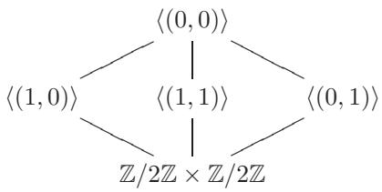

因此，中间域的格也同样清晰：


（中间域由回忆相应子群的生成元来确定，如示例1.19所示：翻转 ${ \sqrt { 3 } } \mapsto - { \sqrt { 3 } }$ 保持了 $\mathbb { Q } ( { \sqrt { 2 } } )$ 不变，等等。）伽罗瓦理论告诉我们没有其他中间域。

### 6.3. 伽罗瓦理论的基本定理，II
另一种流行的符号表示法是，如果扩张是伽罗瓦的，则用相应的伽罗瓦群来标记扩张：

$$
\operatorname { A u t } _ { k } ( F ) { \binom { F } { E } } \int _ { k } ^ { } \operatorname { A u t } _ { E } ( F )
$$

示例6.4表明，扩张$k \subseteq E$不一定是伽罗瓦扩张：$\mathbb{Q}(\sqrt[3]{2})$是$\mathbb{Q}$扩张到多项式$t^3 - 2$的分裂域（根据定理6.9的第(1)部分，这是伽罗瓦的）的一个中间域，但正如我们所看到的，它不是伽罗瓦的。分裂域在$\mathbb{Q}$上的次数为6，并且是$\mathbb{Q}(\sqrt[3]{2})$的一个二次扩张。这实际上是典型情况：每个有限可分扩张都可以扩大到伽罗瓦扩张（习题6.4）。

在任何情况下，基域 $k$ 在伽罗瓦扩张 $k \subseteq F$ 的中间域 $E$ 中的扩域是否为伽罗瓦的问题，是伽罗瓦理论的核心。讨论的结果将非常简洁，这可能是伽罗瓦基本定理中最引人注目的部分：

定理 6.15. 设 $k \subseteq F$ 是一个伽罗瓦扩张，并且 $E$ 是一个中间域。那么 $k \subseteq E$ 是伽罗瓦的当且仅当 $\operatorname { A u t } _ { E } ( F )$ 在 ${ \mathrm { ~ A u t } } _ { k } ( F )$ 中是正规的；在这种情况下，存在一个同构

$$
\operatorname { A u t } _ { k } ( E ) \cong { \frac { \operatorname { A u t } _ { k } ( F ) } { \operatorname { A u t } _ { E } ( F ) } } .
$$

$\mathbb { Q } \subseteq \mathbb { Q } ( { \sqrt [ { 3 } ] { 2 } } )$ 的问题在于 $t ^ { 3 } - 2$ 的分裂域的自同构群是 $S _ { 3 }$（正如我们很快就能验证的那样：参见示例 7.19）。对应于 $\mathbb { Q } ( \sqrt [ 3 ] { 2 } )$ 的子群指数为 3；因此（正如我们所知，因为我们很熟悉 $S _ { 3 }$ ）它不是正规子群。

$k \subseteq E$ 的伽罗瓦群最终被证明同构于商群 $\mathrm { A u t } _ { k } ( F ) / \mathrm { A u t } _ { E } ( F )$ 在伽罗瓦情形下不应过于令人惊讶，因为我们已经知道在任何情况下 $\lfloor E : k \rfloor$ 等于 $\operatorname { A u t } _ { E } ( F )$ 在 $\mathrm { A u t } _ { k } ( F )$ 中的指数，并且如果子群是正规子群，则指数等于商群的阶。一般而言，$\lfloor E : k \rfloor$ 等于 $\operatorname { A u t } _ { E } ( F )$ 在 $\operatorname { A u t } _ { k } ( F )$ 中的陪集个数，即使 $k \subseteq E$ 最终不是伽罗瓦扩张，也值得为这些陪集寻找具体的解释。

我们已经知道$\operatorname { A u t } _ { E } ( F )$的左陪集的数量等于$\operatorname { A u t } _ { E } ( F )$在$\operatorname { A u t } _ { k } ( F )$中的指数，因此等于$\lfloor E : k \rfloor$，因此等于$[ E : k ] _ { s }$（因为$k \subseteq E$是可分的，作为可分扩张的子扩张），因此必定存在一个双射，将左陪集的集合$g \operatorname { A u t } _ { E } ( F )$（$g$在$\operatorname { A u t } _ { k } ( F )$中取值）与不同的嵌入集合$\iota : E  \overline { { k } }$（在$k$的代数闭包中）建立双射，并扩张$id _ { k }$。毫不奇怪，存在这样的原因——即这两个集合之间存在一个“有意义的”双射。

这是一个回顾我们在 §II.9 中涵盖的群作用材料的绝佳时刻，特别是 §II.9.3。请记住，我们能够对群 $G$ 在集合 $S$ 上的所有传递的作用进行分类（命题 II.9.9）：这些 $G$-集都与 $G$ 在其自然作用下的子群 $H$ 的左陪集集合同构；并且 $H$ 可以取作 $S$ 中任何元素的稳定子。

我们将定义 $\operatorname { A u t } _ { k } ( F )$ 在扩张恒等映射的 $E$ 在 $\overline { { k } }$ 中的嵌入集合 $I$ 上的自然作用，并证明，作为 $\operatorname { A u t } _ { k } ( F )$ -集合，$I$ 与 $\operatorname { A u t } _ { E } ( F )$ 在 $\operatorname { A u t } _ { k } ( F )$ 中的左陪集集合同构。这将是我们所谓的“有意义的双射”，完成这一点后，定理 6.15 将看起来非常合理。

固定 $F \subseteq \overline{k}$ 的嵌入 $F$ 在 $k$ 的代数闭包中的嵌入，并设 $I$ 是扩张 $k$ 上恒等映射的嵌入 $\iota : E \hookrightarrow \overline{k}$ 的集合。将 $k \subseteq E$ 视为抽象扩张是一个好主意，而不是将 $E$ 与 $F'$ 中的特定中间域等同起来；我们能够将 $E$ 视为扩张 $k \subseteq F$ 的中间域的事实仅仅意味着对于某个 $\iota \in I$，有 $\iota(E) \subseteq F$。

对于所有 $\iota \in I$ ，$\iota ( E ) \subseteq F$ 。

确实，$k \subseteq E$ 是简单的（有限且可分$\Longrightarrow$简单，命题5.19）。如果 $E = k ( \alpha )$ ，那么 $\iota$ 由 $\iota ( \alpha )$ 确定，后者必然是 $\alpha$ 在 $k$ 上的最小多项式的根。但 $k \subseteq F$ 是正规扩张，并且包含这个多项式的一个根 $\iota ( \alpha )$；因此 $F ^ { \prime }$ 包含所有这些根（定义4.7）。也就是说，对于所有 $\iota \in { I }$，$\iota ( \alpha ) \in F$，这意味着对于所有 $\iota \in I$，$\iota ( k ( \alpha ) ) \subseteq F$。

• 设 $\iota \in { I }$ ，且 $g \in \operatorname { A u t } _ { k } ( F )$ ；则 $g \circ \iota \in I$ 。因此，$\operatorname { A u t } _ { k } ( F )$ 对 $I$ 进行作用。

这里 $g \circ \iota$ 的解释方式如下：$\iota ( E ) \subseteq F$ ，如我们所见；因此 $g$ 限制为一个同态 $\iota ( E ) \to F$ ，而 $g \circ \iota$ 是这个同态与 $\iota$ 的复合。

• $\operatorname { A u t } _ { k } ( F )$ 对 $I$ 的作用是传递的。

这源于“分裂域的唯一性”，引理4.2。确实，设$\iota _ { 1 } , \iota _ { 2 } \in$ $I$。$\iota _ { 1 } ( E )$ ，$\iota _ { 2 } ( E )$ 都包含 $k$ ，且 $F$ 是 $k$ 上的分裂域（定理6.9的第(1)部分）；因此 $F$ 是 $\iota _ { 1 } ( E )$ 和 $\iota _ { 2 } ( E )$ 上的分裂域（对于同一个多项式）。根据引理4.2，存在一个自同构 $g : F ^ { \prime } \to F ^ { \prime }$ 扩张这个同构

$$
\iota _ { 2 } \circ \iota _ { 1 } ^ { - 1 } : \iota _ { 1 } ( E ) \to \iota _ { 2 } ( E ) .
$$

那么 $g \in \operatorname { A u t } _ { k } ( F )$（因为 $\iota _ { 2 } \circ \iota _ { 1 } ^ { - 1 }$ 在 $k$ 上限制为恒等映射），并且 $g$ 限制为 $\iota _ { 2 } \circ \iota _ { 1 } ^ { - 1 }$ 意味着精确地 $g \circ \iota _ { 1 } = \iota _ { 2}$。

现在选择一个 $\iota \in \ I$ ，并使用它将 $E$ 与中间域 $k \subseteq F$ 识别。然后 $\operatorname { A u t } _ { E } ( F ) = \operatorname { A u t } _ { \iota ( E ) } ( F )$ 是 $\operatorname { A u t } _ { k } ( F )$ 的子群，该子群由那些在 $E = \iota ( E )$ 上限制为恒等元的元素 $g$ 组成，即 $\iota$ 的稳定子。此时，II.9.9命题就是得出预期结果所需的一切：

• 作为 $\operatorname { A u t } _ { k } ( F )$ -集，$I$ 与 $\operatorname { A u t } _ { E } ( F )$ 在 $\operatorname { A u t } _ { k } ( F )$ 中的左陪集的集合同构。

我认为这一观察是伽罗瓦理论基本定理的一个不可或缺的部分。传统的陈述（定理6.15）是这个事实的一个本质上立即的推论。

定理 6.15 的证明。如前所述，$\operatorname { A u t } _ { k } ( F )$ -稳定器 $\iota \in I$ 等于 $\mathrm { A u t } _ { \iota ( E ) } ( F )$ 。根据命题 II.9.12，不同 $\iota$ 的稳定器是彼此的共轭；如果 $\operatorname { A u t } _ { E } ( F )$ 是正规，则对于所有 $\iota \in I$

$$
\mathrm { A u t } _ { \iota ( E ) } ( F ) = \mathrm { A u t } _ { E } ( F ) .
$$

这意味着对于所有 $\iota \in { I }$ ，都有 $\iota ( E ) = E$ ，因为伽罗瓦对应对于伽罗瓦扩张 $k \subseteq F$ 是双射的。由此可知，$k \subseteq E$ 满足定理 6.9 的条件 (6)；因此它是伽罗瓦的。

相反地，假设 $k \subseteq E$ 是伽罗瓦的；根据同样的条件（6），对于所有 $\iota \in I$，$\iota ( E ) = E$。限制到 $E = \iota ( E )$ 定义了一个同态

$$
\rho : \mathrm { A u t } _ { k } ( F ) \longrightarrow \mathrm { A u t } _ { k } ( E ) .
$$

这个同态是满射（因为 $\operatorname { A u t } _ { k } ( F )$ 对 $I$ 的作用是传递的），其核由那些在 $E$ 上限制为恒同的 $g \in \operatorname { A u t } _ { k } ( F )$ 组成，即精确地是 $\operatorname { A u t } _ { E } ( F )$ 。这表明 $\operatorname { A u t } _ { E } ( F )$ 是正规子群，并且根据群的“第一同态定理”推论 II.8.2，确立了所述的同构。$\square$

备注 6.16. 在伽罗瓦理论和拓扑学中的覆盖空间理论之间存在平行关系。在这种类比中，伽罗瓦扩张对应于正规覆盖；扩张的伽罗瓦群对应于商变换群；而定理 6.15 对应于正规覆盖的商变换群的一个正规子群的商是一个正规覆盖的事实。

更一般的（连通的）覆盖对应于更一般的代数扩张。一个空间是单连通的当且仅当它不包含非平凡的连通覆盖，因此这个概念在域论中对应于一个域 $K$ 不包含非平凡的代数扩张的条件，即 $K$ 是代数封闭的。

将一个空间的基本群视为其基本覆盖的 deck 变换群，这表明我们应该将代数闭包 $^ { 2 3 }$ $k \subseteq \overline { { k } }$ 的伽罗瓦群视为域 $k$ 的“基本群”。

在代数几何中，这种类比被贯彻到其自然结果。代数簇 $X$ 到 $Y$ 的覆盖映射确定了一个域扩张 $K(Y) \subseteq K(X)$，其中 $K(X)$，$K(Y)$ 是所谓的“有理函数域”（在仿射情况下，这些只是相应坐标环的分数域；参见习题 2.16）。然后可以使用伽罗瓦理论将这些概念（如基本群）转移到代数几何环境中，而无需借助拓扑概念（例如“从 $S^1$ 出发的连续映射”），这在例如正特征情况下是有问题的。

### 6.4. 进一步的注释和例子
假设 $k \subseteq F$ 和 $k \subseteq K$ 是两个有限扩张，包含在一个更大的 $k$ 扩张中（例如，我们可以在 $k$ 的代数闭包中选择特定的嵌入 $F \subseteq \overline{k}$ ，$K \subseteq \overline{k}$）。那么我们可以考虑 $F$ 和 $K$ 在更大的扩张中的复合 $KF$（参见引理 6.3）。在这种情况下，自然要问伽罗瓦条件如何表现。

命题 6.17. 假设 $k \subseteq F$ 是一个伽罗瓦扩张，且 $k \subseteq K$ 是任何有限扩张。那么 $K \subseteq KF$ 是一个伽罗瓦扩张，且 $\operatorname{Aut}_{K}(KF) \cong \operatorname{Aut}_{F \cap K}(F)$。

直观地，

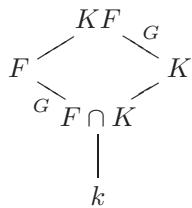

证明。由于 $k \subseteq F$ 是伽罗瓦扩张，它是某个可分多项式 $f(x) \in k \lvert x \rvert \subseteq K \lvert x \rvert$ 的分裂域。$f(x)$ 的根在 $k$ 上生成 $F^{\prime}$，因此在 $K$ 上生成 $KF$；换句话说，$KF^{\prime}$ 是 $f(x)$ 在 $K$ 上的分裂域，所以 $K \subseteq KF$ 是伽罗瓦扩张。

如果 $\sigma : K F ^ { \prime } \to K F ^ { \prime }$ 是一个自同构，它在 $K$ 上扩张了恒等映射（因此在 $k$ 上也扩张了恒等映射），那么 $o$ 限制为一个同态 $F \to \sigma ( F )$，它在 $k$ 上扩张了恒等映射。由于 $k \subseteq F$ 是伽罗瓦的，$\sigma ( F ) = F$（定理 6.9 的（6））。因此，“限制”定义了一个自然群同态

$$
\rho : \mathrm { A u t } _ { K } ( K F ) \longrightarrow \mathrm { A u t } _ { k } ( F ) .
$$

我断言 $\rho$ 是单射的。事实上，根据定义，每个 $\sigma \in \operatorname { A u t } _ { K } ( K F )$ 在 $K$ 上是恒等映射；如果 $o$ 限制在 $F ^ { \prime }$ 上是恒等映射，那么 $\sigma$ 在复合 $K F$ 上也是恒等映射；即，$\sigma = \mathrm { i d }$ 在 $\operatorname { A u t } _ { K } ( K F )$ 中。

因此，$\operatorname { A u t } _ { K } ( K F )$ 可以与 $\operatorname { A u t } _ { k } ( F )$ 的一个子群 $G$ 等同起来。由于 $\operatorname { A u t } _ { K } ( K F )$ 中的每一个 $\sigma$ 都固定 $K$，所以限制 $\rho ( \sigma )$ 固定 $F \cap K$；也就是说，$F ^ { G } \supseteq F \cap K$。

相反地，假设 $\alpha \in F ^ { G }$；那么 $K ( \alpha )$ 在 $\operatorname { A u t } _ { K } ( K F )$ 的固定域中，由于 $K \subseteq K F$ 是伽罗瓦的（定理 6.9 的条件 (4)），所以固定域是 $K$ 本身。也就是说，$\alpha \in K$，因此 $F ^ { G } = F \cap K$。根据命题 6.5，$G = \mathrm { A u t } _ { F \cap K } ( F )$，从而完成证明。$\square$

我将留给读者验证的乐趣是，如果$k \subseteq F$和$k \subseteq K$都是伽罗瓦的，那么$KF$也是$k$上的伽罗瓦的，$F \cap K$也是如此（练习6.13）。

示例 6.18. 我们已经研究了 cyclotomic fields $\mathbb { Q } ( \zeta _ { n } )$ 作为 $\mathbb { Q }$ 的扩张；$\mathbb { Q } ( \zeta _ { n } )$ 是 $x ^ { \pi } - 1$ 的分裂域，因此这些扩张是伽罗瓦的；我们已经证明（命题 5.16）$\operatorname { A u t } _ { \mathbb { Q } } ( \mathbb { Q } ( \zeta _ { n } ) )$ 与 $\mathbb { Z } / n \mathbb { Z }$ 中的单位群同构。

现在设 $k$ 是任意特征为零的域。$x ^ { \pi } - 1$ 在 $k$ 上的分裂域是 $k$ 和 $\mathbb { Q } ( \zeta )$ 的复合 $k ( \zeta )$。根据命题 6.17，扩张 $k \subseteq k ( \zeta )$ 是伽罗瓦的，并且 $\operatorname { A u t } _ { k } ( k ( \zeta ) )$ 与 $\mathbb { Z } / n \mathbb { Z }$ 的单位群的一个子群同构。特别是，它是阿贝尔的。

前面的例子给出了一个重要的阿贝尔伽罗瓦扩张类。值得注意的是，如果我们对基底域 $k$ 施加一些限制，我们可以分类所有的循环伽罗瓦扩张。

命题 6.19. 设 $k \subseteq F$ 是一个度数为 ${ m }$ 的扩张。假设 $k$ 包含一个 $m$ 次单位根且 $\operatorname { c h a r } k$ 不整除 $? ^ { 2 4 }$ $m$。那么 $k \subseteq F$ 是伽罗瓦且循环当且仅当 $F = k ( \delta )$ ，其中 $\delta ^ { m } \in k$ 。

也就是说，在给定的关于 $k$ 的假设下，$k$ 的循环伽罗瓦扩张正好是那些形式为 $k \subseteq k ( \sqrt [ m ] { c } )$ 的扩张，其中 $c \in k$。这是库默尔理论的一部分，是研究阿贝尔扩张的基本工具。命题 6.19 将是我们应用伽罗瓦理论到多项式方程可解性中的关键成分。

证明。设 $\zeta \in k$ 是 $1$ 的一个原始 $m$ 次根。

首先假设 $\begin{array} { r } { F = k ( \delta ) } \end{array}$ ，且 $\delta ^ { m } = c \in k$ 。然后多项式 $x ^ { m } - c$ 的所有 $m$ 个根，

$$
\delta , \zeta \delta , \zeta ^ { 2 } \delta , \cdots , \zeta ^ { m - 1 } \delta ,
$$

它们在$F$中，并且$F ^ { \prime }$由它们生成；因此$F$是可分多项式$x ^ { m } - c$（由于$\operatorname { c h a r } k$不整除$m$）在$k$上的分裂域；因此（定理6.9，第(1)部分）$k \subseteq F$是Galois域。 注意到因为 $F=k(\delta)$ 有 degree $m$ over $k$ , 且 $\delta$ 是一个 $x^m- c$ 的根, 我们有 多项式 $x^m -c$ 不可约.

要证明 $\operatorname { A u t } _ { k } ( F )$ 是循环群，注意到每一个 $\varphi \in \operatorname { A u t } _ { k } ( F )$ 都由 $\varphi ( \delta )$ 确定，而 $\varphi ( \delta )$ 必然是 $x ^ { m } - c$ 的一个根；因此 $\varphi ( \delta ) \ = \ \zeta ^ { 2 } \delta$ 对于某个 $i$ 成立，这个 $i$ 在模 $m$ 下确定。这定义了 $\operatorname { A u t } _ { k } ( F )$ 与 $\mathbb { Z } / m \mathbb { Z }$ 之间的一个同构，这一点可以立刻验证。

相反地，假设 $k \subseteq F$ 是伽罗瓦的，且 $\operatorname { A u t } _ { k } ( F )$ 是循环的，由 $\varphi$ 生成。自同构 $\varphi ^ { \imath }$ ，$ i = 0 , \ldots , m { - 1 }$ ，是两两不同的；因此它们在 $F ^ { \prime }$ 上是线性无关的（习题 6.14）。因此，存在一个 $\alpha \in F$ 使得25

$$
\delta : = \alpha + \zeta ^ { - 1 } \varphi ( \alpha ) + \cdot \cdot \cdot + \zeta ^ { - ( m - 2 ) } \varphi ^ { m - 2 } ( \alpha ) + \zeta ^ { - ( m - 1 ) } \varphi ^ { m - 1 } ( \alpha ) \neq 0 .
$$

注意到

$$
\varphi ( \delta ) = \varphi ( \alpha ) + \zeta ^ { - 1 } \varphi ^ { 2 } ( \alpha ) + \cdot \cdot \cdot + \zeta ^ { - ( m - 2 ) } \varphi ^ { m - 1 } ( \alpha ) + \zeta ^ { - ( m - 1 ) } \alpha = \zeta \delta
$$

（由于 $\zeta \in k$ ，因此 $\varphi ( \zeta ) = \zeta$ ）。这意味着 $\delta$ 没有被 $\operatorname { A u t } _ { k } ( F )$ 的任何非恒等元固定；也就是说，$\operatorname { A u t } _ { k ( \delta ) } ( F ) = \{ e \}$ ；也就是说，$k ( \delta ) = F$ 。此外，

$$
\varphi ( \delta ^ { m } ) = ( \varphi ( \delta ) ) ^ { m } = \zeta ^ { m } \delta ^ { m } = \delta ^ { m } ;
$$

也就是说，$\delta ^ { m }$ 被 $\varphi$ 固定，因此被整个 $\operatorname { A u t } _ { k } ( F )$ 固定。由于 $k \subseteq F$ 是伽罗瓦的，这意味着 $\delta ^ { m } \in k$（定理 6.9，第 (4) 部分）。也就是说，$\delta$ 满足所述条件。$\square$

### 习题

6.1. $\triangleright$ 证明引理 6.3。 [§6.1]

6.2. 证明特征$\neq 2$的二次扩域是Galois扩域。

6.3. $\triangleright$ 设 $k \subseteq F$ 是一个伽罗瓦扩张，并且设 $E$ 是一个中间域。证明 $E \subseteq F$ 是一个伽罗瓦扩张。[§6.2]

6.4. $\triangleright$ 设 $k \subseteq E$ 是一个有限可分扩张。证明 $E$ 可以与 $k$ 的一个Galois扩张 $k \subseteq F$ 的中间域等同。

实际上，证明存在一个最小的这样的扩张 $k \subseteq F$ ，在意义上，如果 $k \subseteq E \subseteq K$ ，且 $k \subseteq K$ 是Galois的，那么存在一个 $F ^ { \prime }$ 在 $K$ 中的嵌入，它在 $E$ 上是恒等映射。（扩张 $k \subseteq F$ 是扩张 $k \subseteq E$ 的Galois闭包。它显然在同构意义下是唯一确定的。[§6.3, 6.5]

6.5. 我们已经证明（命题 5.19），所有有限可分扩张 $k \subseteq E$ 都是简单的。设 $k \subseteq F$ 是 $k \subseteq E$ 的伽罗瓦闭包（习题 6.4）。对于 $\alpha \in E$ ，证明 $E = k ( \alpha )$ 当且仅当 $\alpha$ 被所有 $\sigma \in \operatorname { A u t } _ { k } ( F ) \setminus \operatorname { A u t } _ { E } ( F )$ 所移动。

6.6. • 证明 $\mathbb{Q} \subseteq \mathbb{Q}(\sqrt{2 + \sqrt{2}})$ 是伽罗瓦扩张，其伽罗瓦群是循环群。(参见练习1.25。) 证明 $\mathbb{Q} \subseteq \mathbb{Q}(\sqrt{3 + \sqrt{5}})$ 是伽罗瓦扩张，并且其伽罗瓦群同构于 $(\mathbb{Z}/2\mathbb{Z}) \times (\mathbb{Z}/2\mathbb{Z})$。 • 证明 $\mathbb{Q} \subseteq \mathbb{Q}(\sqrt{1 + \sqrt{2}})$ 不是伽罗瓦扩张，并计算其伽罗瓦闭包 $\mathbb{Q} \subseteq F$。证明 $\operatorname{Aut}_{\mathbb{Q}}(F) \cong D_8$。(使用练习IV.2.16。)

6.7. 设 $p > 0$ 为素数，且 $d \mathbf { \Psi } \mid e$ 为正整数，使得存在扩张 $\mathbb { F } _ { p ^ { d } } \subseteq \mathbb { F } _ { p ^ { e } }$ 。证明 $\operatorname { A u t } _ { \mathbb { F } _ { p ^ { d } } } \mathbb { F } _ { p ^ { e } }$ 是循环群，并描述这个群的生成元。（这推广了命题 5.8；使用伽罗瓦理论。）

6.8. 设 $k \subseteq F$ 是一个度数为 ${ n }$ 的伽罗瓦扩张，并且设 $E$ 是一个中间域。假设 $\lfloor E : k \rfloor$ 是 $n$ 的最小素数因子。证明 $k \subseteq E$ 是伽罗瓦扩张。

6.9. 设 $k \subseteq F$ 是一个度数为 75 的伽罗瓦扩张。证明存在一个中间域 $E$ ，使得 $k \subsetneq E \subsetneq F$ ，并且扩张 $k \subseteq E$ 是伽罗瓦的。

6.10. 设 $k \subseteq F$ 是一个伽罗瓦扩张，$E$ 是一个中间域。证明 $\operatorname { A u t } _ { E } ( F )$ 在 $\mathrm { A u t } _ { k } ( F )$ 中的正规化子是 $\sigma \in \operatorname { A u t } _ { k } ( F )$ 的集合，使得 $\sigma ( E ) \subseteq E$。

用这个来给出一个 $E$ 是 $k$ 的伽罗瓦扩张当且仅当 $\operatorname { A u t } _ { E } ( F )$ 在 $\mathrm { A u t } _ { k } ( F )$ 中是正规的一个替代证明。

6.11. 设 $k \subseteq E$ 和 $E \subseteq F$ 是伽罗瓦扩张。

• 找一个例子说明 $k \subseteq F$ 不一定是伽罗瓦扩张。 • 证明如果每个 $\sigma \in \operatorname { A u t } _ { k } ( E )$ 都是 $\operatorname { A u t } _ { k } ( F )$ 中一个元素的限制，那么 $k \subseteq F$ 是伽罗瓦扩张。

6.12. 找到两个代数扩张 $k \subseteq F$ ， $k \subseteq K$ 和嵌入 $F \subseteq \overline { { k } }$ ， $\sigma _ { 1 } : K \subseteq \overline { { k } }$ ， $\sigma _ { 2 } : K \subseteq \overline { { k } }$ 扩张 $k \subseteq \overline { { k } }$ ，使得复合 $F \sigma _ { 1 } ( K )$ ， $F \sigma _ { 2 } ( K )$ 不是同构的。

证明如果 $F ^ { \prime }$ 和 $K$ 都在 $k$ 上是伽罗瓦的，那么不存在这样的例子。

6.13. $\triangleright$ 设 $k \subseteq F$ 和 $k \subseteq K$ 是伽罗瓦扩张，并且假设 $F$ 和 $K$ 是一个更大域的子域。证明 $k \subseteq F K$ 和 $k \subseteq F \cap K$ 都是伽罗瓦扩张。[§6.4, §7.4]

6.14. $\triangleright$ 设 $k \subseteq F$ 是一个域扩张，并且 $\varphi _ { 1 } , \ldots , \varphi _ { m } \in \operatorname { A u t } _ { k } ( F )$ 是两两不同的自同构。证明 $\varphi _ { 1 } , \ldots , \varphi _ { m }$ 在 $F$ 上线性无关。(回收/改编习题 VI.6.15 的提示。) [§6.4, 6.16, §IX.7.6]

6.15. 设 $k \subseteq F$ 是一个伽罗瓦扩张，并且 $\alpha \in F$。证明

$$
N _ { k \subseteq F } ( \alpha ) = \prod _ { \sigma \in \operatorname { A u t } _ { k } ( F ) } \sigma ( \alpha ) , \quad \operatorname { t r } _ { k \subseteq F } ( \alpha ) = \sum _ { \sigma \in \operatorname { A u t } _ { k } ( F ) } \sigma ( \alpha ) .
$$

(练习4.19.)

6.16. 设 $k \subseteq F$ 是一个度数为 $d$ 的循环伽罗瓦扩张，并且 $\Vdash$ $\varphi$ 是 $\operatorname { A u t } _ { k } ( F )$ 的生成元。设 $\alpha \in F$ 是一个元素，使得 $N _ { k \subseteq F } ( \alpha ) = 1$ 。

• 证明 automorphisms $\mathrm{id}_F$，$\varphi$，...，$\varphi^{d-1}$ 在 $F^{\prime}$ 上是线性无关的。（习题 6.14。）
• 证明存在 $\gamma \in F$ 使得 $\beta := \gamma + \alpha \varphi(\gamma) + \alpha \varphi(\alpha) \varphi^2(\gamma) + \cdot \cdot \cdot + \alpha \varphi(\alpha) \cdot \cdot \cdot \varphi^{d-2}(\alpha) \varphi^{d-1}(\gamma) \neq 0$。
• 证明 $\alpha \varphi(\alpha) \varphi^2(\alpha) \cdot \cdot \cdot \varphi^{d-1}(\alpha) \varphi^d(\gamma) = \gamma$，并推导出 $\alpha = \beta / \varphi(\beta)$。

结合练习4.20的结果，结论是：对于一个上述的循环伽罗瓦扩张中的元素 $\alpha$，其范数为1当且仅当存在一个 $\beta$ 使得 $\alpha = \beta / \varphi ( \beta )$ 。

这是希尔伯特第90个定理（希尔伯特《数论报告》中的第90个定理，该报告是德国数学学会委托编写的，概述了19世纪末数论的状况）。[6.17, §IX.7.6, IX.7.18]

6.17. 练习6.16应该提醒读者命题6.19的证明，并且有充分的理由。假设$k \subseteq F$是一个循环伽罗瓦扩张，其度为$m$，并且$k$包含1的一个原始$m$-次根$\zeta$。使用希尔伯特定理90证明$\boldsymbol { F } = \boldsymbol { k } ( \boldsymbol { \delta } )$对于某个$\delta$，使得$\delta ^ { m } \in k$，从而恢复命题6.19的陈述的一个方向。（提示：$N _ { k \subseteq F } ( \zeta ^ { - 1 } ) $是什么？）

希尔伯特第90定理在此所需的情形归功于库默。

6.18. 使用希尔伯特定理90找出方程$a ^ { 2 } +$ $b ^ { 2 } d = 1$的所有有理根$a , b$，其中$d$是一个正整数且不是平方数。（提示：$a ^ { 2 } + b ^ { 2 } d$等于$N _ { \mathbb { Q } \subseteq \mathbb { Q } ( { \sqrt { - d } } ) } ( a + b { \sqrt { - d } } )$；参见练习1.12。）

6.19. $\neg \operatorname { L e t } k \subseteq F$ 是一个循环伽罗瓦扩张，其度为 $d$，并且 $\varphi$ 是 $\operatorname { A u t } _ { k } ( F )$ 的生成元。设 $\alpha \in F$ 是一个元素，使得 $\mathrm { t r } _ { k \subseteq F } ( \alpha ) = 0$。证明希尔伯特定理90的“加法版本”：

• 证明存在 $\gamma \in F$ 使得 $\mathrm { t r } _ { k \subseteq F } ( \gamma ) \neq 0$ 。 • 看表达式 $\alpha \varphi ( \gamma ) + ( \alpha + \varphi ( \alpha ) ) \varphi ^ { 2 } ( \gamma ) + \cdots + ( \alpha + \varphi ( \alpha ) + \cdots + \varphi ^ { d - 2 } ( \alpha ) ) \varphi ^ { d - 1 } ( \gamma )$ 。 • 证明存在 $\beta \in F$ 使得 $\alpha = \beta - \varphi ( \beta )$ 。

与练习 4.20 一起，这说明一个循环伽罗瓦扩张中的元素 $\alpha$ 的迹为 0 当且仅当存在一个 $\beta$ 使得 $\alpha = \beta - \varphi ( \beta )$。应用见练习 7.15。 [7.15]

## 7. 伽罗瓦理论应用简述

伽罗瓦理论是一种普遍的工具，具有广泛的应用。我在这本书中没有能力也没有空间对此理论 进行充分的调查，但即使本节中回顾的几个例子也应该足以传达其相当大的能量。

### 7.1. 代数基本定理
定理6.15和一点儿群论 基本上就是 给出代数基本定理的证明 所需要的(我有点 作弊了，中值定理也要用到，那么实数的完备性的证明也要用到)，正如§V.5.3中所承诺的那样。

定理 7.1. $\mathbb { C }$ 是代数闭的。

证明。设$f(x) \in \mathbb{C} \lfloor x \rfloor$是一个非常数多项式；我们需要证明$f(x)$在$\mathbb{C}$中有根。注意到如果$f(x)$在$\mathbb{C}$中没有根，那么$f(x) \overline{f(x)} \in \mathbb{R} |x|$也没有根；也就是说，我们可以假设$f(x)$有实系数。设$F^{\prime}$是$f(x)$在$\mathbb{R}$上的分裂域；将$F$嵌入$\mathbb{R}$的代数闭包中（我们“还不知道”$\mathbb{C}$是代数封闭的！），并考虑这个扩张

$$
\mathbb { R } \subseteq F ( i ) .
$$

这个扩张是Galois：它是$f(x)(x^2+1)$的平方无部分$^{27}$的分裂域。设$G = \mathrm{Aut}_{\mathbb{R}}(F(i))$。

根据 Sylow I（定理 IV.2.5），$G$ 有一个 2-Sylow 子群 $H$。索引 $\lfloor G : H \rfloor$ 是奇数，因此它对应于一个有限、可分扩张 $\mathbb{R} \subseteq E$，且 $[E : \mathbb{R}]$ 是奇数。然而，任何实数域上的奇数次多项式都有一个实根（练习 V.5.17，它只使用初等微积分），因此 $\mathbb{R} \subseteq E$ 是平凡的（练习 5.23）。

因此 $[ G : H ] = 1$ ，证明 $G$ 是一个2群。由于 $\mathbb { C } = \mathbb { R } ( i ) \subseteq F ( i )$ ，(Galois) 扩张的伽罗瓦群

$$
\mathbb { C } \subseteq F ( i )
$$

是$G$的子群；因此它是一个2群：$|\operatorname{Autc}(F(i))| = 2^n$对于某个$n \geq 0$。

现在回想（命题 IV.2.6） rằng每个阶为 $p ^ { \pi }$ 的群，其中 $p$ 是素数，包含阶为 $p ^ { m }$ 的子群，对于所有 $0 \leq m \leq n$。特别是，如果 $n \geq 1$，那么 $\mathrm { A u t } _ { \mathbb { C } } ( F ( i ) )$ 包含一个阶为 $2 ^ { n - 1 }$ 的子群，这通过伽罗瓦对应对应于 $\mathbb { C }$ 的二次扩张。然而，$\mathbb { C }$ 没有二次扩张，因为没有 $\mathbb { C } [ x ]$ 中的不可约二次多项式（再次练习 5.23）。

这个矛盾表明 $n = 0$；也就是说，$\mathrm { A u t _ { \mathbb { C } } } ( F ( i ) )$ 必然是平凡的。这证明了 $F ( i ) = \mathbb { C }$，特别是 $\mathbb { C }$ 包含了 $f ( x )$ 的根。$\square$

这个论证可以进一步简化，绕过 Sylow 定理的使用，但代价是长度略有增加。但为什么在第四章中付出了证明它的努力之后，我们还应该尝试绕过 Sylow 定理呢？

### 7.2. 正则 $n$ -边形的可构造性
我们最后一次回到正则 $n$ -边形的可构造性问题。更简单的考虑已经给出了 $n$ 必须满足的约束条件，以便正则 ${ n }$ -边形是可构造的：如果 $n = p$ 是素数，我们发现 $p - 1$ 必须是2的幂（§3.3）；这后来被推广到任何 $n$，即 $\phi ( n )$ 是2的幂，在 §5.2 中（§5.19 中给出了一个更明确的条件）。但这些都是“否定”的结果：我们还没有证明如果 $\phi ( n )$ 是2的幂，那么正则 $n$ -边形是可构造的。这就是伽罗瓦理论发挥作用的地方。

命题 7.2. 设 $k \subseteq F$ 是一个伽罗瓦扩张，并且假设 $\lfloor F : k \rfloor = p ^ { r }$ 对某个素数 $p$ 和 $r \geq 0$ 成立。那么存在中间域

$$
k = E _ { 0 } \subseteq E _ { 1 } \subseteq E _ { 2 } \subseteq \cdots \subseteq E _ { r } = F
$$

使得 $\lfloor E _ { i } : E _ { i - 1 } \rfloor = p$ 对于 $i = 1 , \ldots , r$ 。

证明。由于伽罗瓦对应对于伽罗瓦扩张是双射的（定理6.9，第（5）部分），这个命题立即可以从这样一个事实中得出：一个阶为 $p ^ { \prime }$ 的群，其中 $p$ 是素数，有一个完整的 $p$ -子群序列；例如，参见定理IV.2.8陈述之后的讨论。

定理 7.3. 正 $n$ -边形可以通过直尺和圆规构造，当且仅当 $\phi ( n )$ 是 2 的幂。

证明。如前所述，我们已经建立了 $\Longrightarrow$ 方向。

对于相反的情况，假设 $\phi ( n ) = 2 ^ { r }$ 对于某个 $r$ 。扩张 $\mathbb { Q } \subseteq \mathbb { Q } ( \zeta _ { n } )$ 是伽罗瓦的（它是 $\Phi _ { n } ( x )$ 的分裂域），其阶为 $| \mathbb { Q } ( \zeta _ { n } ) : \mathbb { Q } | = \phi ( n ) = 2 ^ { r }$（命题 5.14）。命题 7.2 表明定理 3.4 中给出的条件得到满足，因此 $\zeta _ { n }$ 是可构造的，如所需。$\square$

例如，$\phi ( 1 7 ) = 1 6 = 2 ^ { 4 }$；$\mathbb { Q } ( \zeta _ { 1 7 } )$ 在 $\mathbb { Q }$ 上的伽罗瓦群同构于 $( \mathbb { Z } / 1 7 \mathbb { Z } ) ^ { * }$（根据命题 5.16），因此（根据定理 IV.6.10）它是循环群，阶为 16。$( \mathbb { Z } / 1 7 \mathbb { Z } ) ^ { * }$ 的生成元是 [6] $^ { 1 7}$；由此可知 $\mathrm { A u t _ { \mathbb { Q } } } ( \mathbb { Q } ( \zeta _ { 1 7 } ) )$ 由由 $\zeta _ { 1 7 } \mapsto \zeta _ { 1 7 } ^ { 6 }$ 定义的自动同构 $\sigma$ 生成。子群序列

$$
{ \mathrm { A u t } } _ { \mathbb { Q } } ( \mathbb { Q } ( \zeta _ { 1 7 } ) ) = \langle \sigma \rangle \supseteq \langle \sigma ^ { 2 } \rangle \supseteq \langle \sigma ^ { 4 } \rangle \supseteq \langle \sigma ^ { 8 } \rangle \supseteq \{ e \}
$$

通过伽罗瓦对应关系对应于一个序列

$$
\mathbb { Q } \subseteq \mathbb { Q } ( \delta _ { 1 } ) \subseteq \mathbb { Q } ( \delta _ { 2 } ) \subseteq \mathbb { Q } ( \delta _ { 3 } ) \subseteq \mathbb { Q } ( \zeta _ { 1 7 } ) .
$$

应用我们现在所知的内容来确定第一扩张的生成元 $\delta _ { 1 }$ 是有益的，即 $\sigma ^ { 2 }$ 的固定域。令 $\zeta = \zeta _ { 1 7 }$。作为 $\mathbb { Q }$ -向量空间，$\mathbb { Q } ( \zeta )$ 由 $\zeta , \zeta ^ { 2 } , \ldots , \zeta ^ { 1 6 }$ 生成。为了找到 $\sigma ^ { 2 }$ 的固定域，写出 $\mathbb { Q } ( \zeta )$ 的一个一般元素：

$$
\begin{array} { r l } & { a _ { 1 } \zeta + a _ { 2 } \zeta ^ { 2 } + a _ { 3 } \zeta ^ { 3 } + a _ { 4 } \zeta ^ { 4 } + a _ { 5 } \zeta ^ { 5 } + a _ { 6 } \zeta ^ { 6 } + a _ { 7 } \zeta ^ { 7 } + a _ { 8 } \zeta ^ { 8 } + a _ { 9 } \zeta ^ { 9 } } \\ & { \qquad + a _ { 1 0 } \zeta ^ { 1 0 } + a _ { 1 1 } \zeta ^ { 1 1 } + a _ { 1 2 } \zeta ^ { 1 2 } + a _ { 1 3 } \zeta ^ { 1 3 } + a _ { 1 4 } \zeta ^ { 1 4 } + a _ { 1 5 } \zeta ^ { 1 5 } + a _ { 1 6 } \zeta ^ { 1 6 } } \end{array}
$$

并应用 $\sigma ^ { 2 }$ : $\zeta \mapsto ( \zeta ^ { 6 } ) ^ { 6 } = \zeta ^ { 3 6 } = \zeta ^ { 2 }$ :

$$
\begin{array} { r l } & { a _ { 1 } \zeta ^ { 2 } + a _ { 2 } \zeta ^ { 4 } + a _ { 3 } \zeta ^ { 6 } + a _ { 4 } \zeta ^ { 8 } + a _ { 5 } \zeta ^ { 1 0 } + a _ { 6 } \zeta ^ { 1 2 } + a _ { 7 } \zeta ^ { 1 4 } + a _ { 8 } \zeta ^ { 1 6 } + a _ { 9 } \zeta } \\ & { \qquad + a _ { 1 0 } \zeta ^ { 3 } + a _ { 1 1 } \zeta ^ { 5 } + a _ { 1 2 } \zeta ^ { 7 } + a _ { 1 3 } \zeta ^ { 9 } + a _ { 1 4 } \zeta ^ { 1 1 } + a _ { 1 5 } \zeta ^ { 1 3 } + a _ { 1 6 } \zeta ^ { 1 5 } . } \end{array}
$$

该元素是固定的当且仅当

$$
\begin{array} { c } { { a _ { 1 } = a _ { 2 } = a _ { 4 } = a _ { 8 } = a _ { 1 6 } = a _ { 1 5 } = a _ { 1 3 } = a _ { 9 } , } } \\ { { { } } } \\ { { a _ { 3 } = a _ { 6 } = a _ { 1 2 } = a _ { 7 } = a _ { 1 4 } = a _ { 1 1 } = a _ { 5 } = a _ { 1 0 } , } } \end{array}
$$

因此，$\sigma ^ { 2 }$ 的固定域是由...生成的

$$
\delta _ { 1 } = \zeta + \zeta ^ { 2 } + \zeta ^ { 4 } + \zeta ^ { 8 } + \zeta ^ { 1 6 } + \zeta ^ { 1 5 } + \zeta ^ { 1 3 } + \zeta ^ { 9 }
$$

并且 $\zeta ^ { 3 } + \zeta ^ { 6 } + \zeta ^ { 1 2 } + \zeta ^ { 7 } + \zeta ^ { 1 4 } + \zeta ^ { 1 1 } + \zeta ^ { 5 } + \zeta ^ { 1 0 } = - 1 - \delta _ { 1 }$ （记住 $\zeta$ 是 $\Phi _ { 1 7 } ( x ) = x ^ { 1 6 } + \cdot \cdot \cdot + x + 1$ 的一个根）。从图形上看，


黑色圆点标记的根之和是 $\delta _ { 1 }$；白色根加起来是 $- 1 - \delta _ { 1 }$。理论告诉我们 $\delta _ { 1 }$ 在 $\mathbb { Q }$ 上的次数是 2，所以 $\delta _ { 1 } ^ { 2 }$ 必须是 1 和 $\delta _ { 1 }$ 的一个有理组合。确实，纸笔和一点耐心（以及关系 $\zeta ^ { 1 7 } = 1$）给出了

$$
\begin{array} { r l } & { \delta _ { 1 } ^ { 2 } = ( \zeta + \zeta ^ { 2 } + \zeta ^ { 4 } + \zeta ^ { 8 } + \zeta ^ { 1 6 } + \zeta ^ { 1 5 } + \zeta ^ { 1 3 } + \zeta ^ { 9 } ) ^ { 2 } } \\ & { \quad = 3 ( \zeta + \zeta ^ { 2 } + \zeta ^ { 4 } + \zeta ^ { 8 } + \zeta ^ { 1 6 } + \zeta ^ { 1 5 } + \zeta ^ { 1 3 } + \zeta ^ { 9 } ) } \\ & { \qquad + 4 ( \zeta ^ { 3 } + \zeta ^ { 6 } + \zeta ^ { 1 2 } + \zeta ^ { 7 } + \zeta ^ { 1 4 } + \zeta ^ { 1 1 } + \zeta ^ { 5 } + \zeta ^ { 1 0 } ) + 8 } \\ & { \quad = 3 \delta _ { 1 } + 4 ( - 1 - \delta _ { 1 } ) + 8 } \\ & { \quad = - \delta _ { 1 } + 4 . } \end{array}
$$

因此，我们发现 $\delta _ { 1 } ^ { 2 } + \delta _ { 1 } - 4 = 0$ 。求解 $\delta _ { 1}$（注意 $\delta _ { 1 } > 0$，因为 $0$ 右侧的黑点比左侧的多），

$$
\delta _ { 1 } = { \frac { - 1 + { \sqrt { 1 7 } } } { 2 } } .
$$

所以我们很容易构造 $\delta _ { 1 }$ 。将同样的步骤应用于其他扩张可以用来产生 $\delta _ { 2 }$ ， $\delta _ { 3 }$ ，并最终得到 $\zeta _ { 1 7 }$ ，其实部是 §3.3 结尾处给出的复杂表达式。

### 7.3. 对称函数的基本定理
设$t_1, \ldots, t_n$为不定元。多项式

$$
P _ { n } ( x ) : = ( x - t _ { 1 } ) \cdots ( x - t _ { n } ) \in \mathbb { Z } [ t _ { 1 } , \dots , t _ { n } ] [ x ]
$$

在下述意义上是普遍的：每个系数在（比如说）一个整环中 的 $n$ 次 首一(monic) 多项式都可以通过适当地指定 $t _ { 1 } , \ldots , t _ { n }$ 从 $P _ { n } ( x )$ 中得到，可能在一个更大的环中（练习 7.2）。展开的系数

$$
P _ { n } ( x ) = x ^ { n } - s _ { 1 } ( t _ { 1 } , \dots , t _ { n } ) x ^ { n - 1 } + \cdot \cdot \cdot + ( - 1 ) ^ { n } s _ { n } ( t _ { 1 } , \dots , t _ { n } )
$$

是 $t _ { 1 } , \ldots , t _ { n }$ 的初等对称函数（至符号）。例如，对于 $n = 3$ ，

$$
\begin{array} { r c l } { { } } & { { } } & { { s _ { 1 } ( t _ { 1 } , t _ { 2 } , t _ { 3 } ) = t _ { 1 } + t _ { 2 } + t _ { 3 } , } } \\ { { } } & { { } } & { { s _ { 2 } ( t _ { 1 } , t _ { 2 } , t _ { 3 } ) = t _ { 1 } t _ { 2 } + t _ { 1 } t _ { 3 } + t _ { 2 } t _ { 3 } , } } \\ { { } } & { { } } & { { s _ { 3 } ( t _ { 1 } , t _ { 2 } , t _ { 3 } ) = t _ { 1 } t _ { 2 } t _ { 3 } . } } \end{array}
$$

函数$s _ { i } ( t _ { 1 } , \ldots , t _ { n } )$是对称的，因为它们在$t _ { 1 } , \ldots , t _ { n }$的排列下保持不变（因为$P _ { n } ( x )$是不变的）；它们是初等的，归功于以下重要结果，该结果由于伽罗瓦理论而有一个特别简单的证明。

定理 7.4（对称函数的基本定理）。设 $K$ 是一个域，且 $\varphi \in K ( t _ { 1 } , \ldots , t _ { n } )$ 。那么 $\varphi$ 是对称的当且仅当它是 $s _ { 1 } , \ldots , s _ { n }$ 的一个有理函数（系数在 $K$ 中）。

在这里，我们将 $s _ { i }$ 视为 $K [ t _ { 1 } , \ldots , t _ { n } ]$ 的元素，由于 $\mathbb { Z }$ 在环中是初始的，我们可以明确地这样做。

证明。设 $F = K ( t _ { 1 } , \ldots , t _ { n } )$ ，设 $k = K ( s _ { 1 } , \ldots , s _ { n } )$ 是由 $K$ 上的初等对称函数生成的子域。

那么 $F$ 是 $k$ 上的可分多项式 $P _ { n } ( x )$ 的分裂域。特别是 $k \subseteq F$ 是伽罗瓦扩张，和

$$
| \operatorname { A u t } _ { k } ( F ) | = [ F : k ] \leq n !
$$

根据引理4.2，对称群 $S _ { n }$ 通过排列 $t _ { 1} , \ldots , t _ { n }$ 对 $F ^ { \prime }$ 进行作用（忠实地），并且这个作用在 $k = K ( s _ { 1} , \ldots , s _ { n } ) $ 上是恒等作用，因为每个 $s _ { i }$ 都是对称的。因此 $S _ { n }$ 可以与 $\operatorname { A u t } _ { k } ( F )$ 的一个子群相对应；但是 $| S _ { n } | = n !$ ，所以得出 $\operatorname { A u t } _ { k } ( F ) = S _ { n } $。

由于 $k \subseteq F$ 是伽罗瓦的，我们得到 $k = F ^ { S _ { n } }$。这精确地表明，如果 $\varphi \in$ $K ( t _ { 1 } , \ldots , t _ { n } )$，那么 $\varphi$ 在 $S _ { n}$ 对 $t _ { 1} , \ldots , t _ { n }$ 的作用下是不变的当且仅当 $\varphi \in k = K ( s _ { 1} , \ldots , s _ { n } )$，这就是陈述。$\square$

加强定理7.4的结果并不困难，可以证明每个对称多项式实际上是基本对称函数的多项式。

请注意，证明中给出的论据相当于以下结果，应记录以供个人注意：

引理 7.5. 设 $K$ 是一个域，$t _ { 1 } , \ldots , t _ { n }$ 是未定元，且 $s _ { 1 } , \ldots , s _ { n }$ 是 $t _ { 1 } , \ldots , t _ { n }$ 上的初等对称函数。那么扩张

$$
K ( s _ { 1 } , \ldots , s _ { n } ) \subseteq K ( t _ { 1 } , \ldots , t _ { n } )
$$

是伽罗瓦，伽罗瓦群是 $S _ { n }$ 。

此结果和凯莱定理（定理II.9.5）立即得出以下结论：

推论 7.6. 设 $G$ 是一个有限群。那么存在一个伽罗瓦扩张 $k \subseteq F$ 使得 $\operatorname { A u t } _ { k } ( F ) \cong G$ 。

证明。习题7.4。

尚不清楚在推论7.6中是否可以选择$k$为$\mathbb{Q}$。上述证明将$k$视为一个相当大的域，而且完全不清楚如何从这个域“下降”到$\mathbb{Q}$。这是逆伽罗瓦问题，一个当前的研究课题。读者可以通过注意到即使对于所有$n$将$S_n$视为$\mathbb{Q}$上的伽罗瓦群也不是那么容易的，来体会这个问题的难度，尽管确实对于每一个$n$在$\mathbb{Z}[x]$中存在无限多个次数为$n$的多项式，其分裂域在$\mathbb{Q}$上的伽罗瓦群为$S_n$（对于$n=p$素数的情形，参见例7.20和习题7.11）。如果你想要一个难忘的例子随身携带，舒尔(Schur)（1931年）证明了“截断指数”的分裂域

$$
1 + x + { \frac { x ^ { 2 } } { 2 ! } } + { \frac { x ^ { 3 } } { 3 ! } } + \cdot \cdot \cdot + { \frac { x ^ { n } } { n ! } }
$$

当 $4 \nmid n$ 时，其在 $\mathbb{Q}$ 上的伽罗瓦群是 $S_n$（而当 $4 | n$ 时，其伽罗瓦群是 $A_n$）。

已知（Shafarevich，1954），每个有限可解群都是$\mathbb{Q}$上的伽罗瓦扩张的伽罗瓦群。

逆伽罗瓦问题可以重新表述为询问每个有限群是否是 $\overline{\mathbb{Q}}$ 在 $\mathbb{Q}$ 上的伽罗瓦群的商。我已经提到过，这个对象（可以解释为 $\mathbb{Q}^*$ 的“基本群”；参见注释 6.16）非常神秘且极其有趣28。

回到引理 7.5，交错群 $A _ { n }$ 在 $S _ { n }$ 中的指数为 2，因此通过伽罗瓦对应，它对应于 $K ( s _ { 1 } , \ldots , s _ { n } )$ 的一个二次扩张。很容易确定这个扩张的生成元：它必须是 $t _ { 1 } , \ldots , t _ { n }$ 的一个函数，该函数在所有偶排列的作用下保持不变，但在奇排列的作用下不保持不变。我们正是使用这样的函数来定义偶/奇排列的，在 § IV.4.3 中：

$$
\Delta = \prod _ { 1 \leq i < j \leq n } ( t _ { i } - t _ { j } ) .
$$

要证明 $\Delta$ 在 $K ( s _ { 1 } , \ldots , s _ { n } )$ 上的次数为 2，只需注意到判别式

$$
D = \Delta ^ { 2 } = \prod _ { 1 \leq i < j \leq n } ( t _ { i } - t _ { j } ) ^ { 2 }
$$

它在所有排列的作用下是不变的，因此根据定理7.4，它属于$K ( s _ { 1 } , \ldots , s _ { n } )$。这证明了

推论 7.7。使用上述符号，扩张

$$
K ( s _ { 1 } , \ldots , s _ { n } ) ( { \sqrt { D } } ) \subseteq K ( t _ { 1 } , \ldots , t _ { n } )
$$

是伽罗瓦，伽罗瓦群是 $A _ { n }$ 。

### 7.4. 通过根式求解多项式方程
这是伽罗瓦理论最著名的初等应用之一，也非常接近伽罗瓦本人最初的动机。

二次多项式方程

$$
x ^ { 2 } + b x + c = 0
$$

都以二次公式（在$^ { 2 9 }$特征$\neq 2$）而闻名解决：

$$
x = { \frac { - b \pm { \sqrt { b ^ { 2 } - 4   c } } } { 2 } } .
$$

类似但更复杂的公式存在用于三次和四次方程（塔尔塔利亚/卡尔达诺/费拉里，大约在1540年；这引发了一场优先权争议，最终演变成基本的个人攻击）。五次及以上次数的方程在数百年间一直抵抗着数学家的最佳努力。与二次、三次和四次方程发生的情况一致，最雄心勃勃的目标是产生一个用于求解“一般”多项式方程的公式

$$
x ^ { n } + a _ { n - 1 } x ^ { n - 2 } + \cdot \cdot \cdot + a _ { 0 } = 0
$$

在系数 $u _ { i }$ 和开方等基本运算方面。这将是一个方程的“根式解”。

嗯，这样的公式根本不存在：

定理 7.8. 次数大于或等于 5 的一般多项式方程不能通过根式求解。

我对问题所提出的基域故意含糊其辞；像二次公式这样的“公式”应该在它有意义的任何域上都成立；例如，在二次公式的情况下，域不应具有特征2。避免任何此类麻烦的一种简单方法是工作在特征零上：这的主要技术优势是确保多项式 $x ^ { m } - 1$ 的自动可分性，其根定义了“根式”；参见命题6.19。因此，在以下内容中，我们将假设基域具有特征 $0$ 。

“一般多项式”是指在 §7.3 中引入的“通用”多项式 $P _ { n } ( x )$，在选定的基础域 $K$ 上：一般多项式

$$
x ^ { n } - s _ { 1 } x ^ { n - 1 } + \cdot \cdot \cdot + ( - 1 ) ^ { n } s _ { n } \in k [ x ] ,
$$

以 $k = K ( s _ { 1 } , \ldots , s _ { n } )$ 和 $s _ { i }$ 为（不定）根 $t _ { 1 } , \ldots , t _ { n }$ 中的初等对称函数。实际上，处理任意不可约多项式 $f ( x ) \in k \vert x \vert$ 的更一般情况并不更困难，这里 $k$ 是任何特征为零的域；这就是我们将要做的。

一个根式公式将 $f(x)$ 的一个根 $t _ { i }$ 记为从 $k$ 得到的扩张中的一个元素，具体方式如下：

$$
k \subseteq k ( \delta _ { 1 } ) \subseteq k ( \delta _ { 1 } , \delta _ { 2 } ) \subseteq \cdots \subseteq k ( \delta _ { 1 } , \dots , \delta _ { r } )
$$

对于所有 $i = 1 , \dots , r$，我们都有 $\delta _ { i } ^ { m _ { i } } \in k ( \delta _ { 1 } , \dots , \delta _ { i - 1 } )$ 对于某个指数 $m _ { i }$

定义 7.9. 这种扩张称为根扩张。

关于根式扩域的一些事实直接从定义中得出：例如，如果 $k \subseteq F$ 和 $k \subseteq K$ 是两个根式扩域，且 $F ^ { \prime }$ ，$K$ 是一个更大域的子域，那么 $k \subseteq F K$ 是根式的（习题 7.5）。此外，根式扩域是由循环扩域复合而成的，前提是适当的单位根在 $k$ 中，根据命题 6.19。

引理 7.10. 每一个可分根式扩张都包含在一个伽罗瓦根式扩张中。

证明。设 $k \subseteq F$ 是一个可分代数扩张。特别地，$k \subseteq F$ 是有限且可分的，因此 $F = k ( \alpha )$ 对某个 $\alpha \in F$（命题 5.19）。设 $p ( x )$ 是 $\alpha$ 在 $k$ 上的最小多项式。$p ( x )$ 在 $k$ 上的分裂域 $L$ 可以作为 $\sigma ( F )$ 的复合得到，其中 $\sigma$ 遍历 $F ^ { \prime }$ 在 $\overline { { k } }$ 中的嵌入，扩张 $k$ 的恒等映射：确实，这个复合是由 $k$ 生成的，生成元是所有 $\sigma ( \alpha )$，它们遍历 $p ( x )$ 的所有根。作为根扩张的复合，$L$ 在 $k$ 上是根扩张。作为可分多项式的分裂域，$L$ 在 $k$ 上是伽罗瓦扩张（定理 6.9，第 (1) 部分），我们完成了证明。$\square$

伽罗瓦理论将使我们能够将多项式 $f ( x )$ 的根式可解性与 $f ( x )$ 的分裂域的精确陈述联系起来。以下是这种联系的首次形式化：

引理 7.11. 设 $k$ 是特征为 $\boldsymbol { \mathit { 0 } }$ 的域，且 $f ( x ) \in k \vert x \vert$ 是一个不可约多项式。那么当且仅当 $f ( x )$ 的分裂域包含在一个伽罗瓦根式扩张中时，存在一个用根式求解 $f ( x )$ 的公式。

证明。如果$f(x)$的分裂域包含在一个根式扩张（伽罗瓦扩张或非伽罗瓦扩张）中，那么根可以记为根据需要组合成的域运算和根式。

对于逆命题，假设 $f ( x )$ 可以通过根式求解。一个根 $t _ { 1 }$ 的公式可以通过应用 (例如) $\operatorname { A u t } _ { k } ( { \overline { { k } } } )$ 的元素 $o _ { i }$ 将 $t _ { 1 }$ 变换为 $t _ { i}$ 转换为任何其他根 $t _ { i }$ 的公式（由于 $f ( x )$ 不可约，因此存在这样的自同构）。因此，如果一个根的公式存在，那么所有根的公式都存在。所有相应的根式扩张的复合给出一个可能更大的根式扩张 $k$，包含 $f ( x )$ 的所有根。因此，$f ( x )$ 的分裂域包含在 $k$ 的根式扩张中。根据引理 7.10，这个扩张可以假设是伽罗瓦的，如所需。

简而言之，如果我们理解根号伽罗瓦扩张，我们就能理解多项式方程的根号可解性。正如伽罗瓦理论背后的普遍哲学所要求的，我们应该力求通过它们的伽罗瓦群来刻画这些扩张。事实证明，正确的条件（忽略技术细节）是伽罗瓦群应该是可解的。

定义 7.12. 一个伽罗瓦扩张 $k \subseteq F$ 是可解的，如果 $\operatorname { A u t } _ { k } ( F )$ 是一个可解群。

读者可能需要现在重新回顾 §IV.3.3，以提醒群论中的可解性问题。（我们正在接近对“可解”术语的解释！）正如根式扩域分解为循环扩域的序列，可解群具有循环的合成因子（命题 IV.3.11）。我会说 $^ { 3 0 }$，一个根式，resp. 可解，扩域 $k \subseteq F$ “有足够的 $1$ 的根”如果 $k$ 包含一个原始的 $M$ -次根的 $1$，其中 $M$ 是相应循环因子的阶的公倍数。

引理 7.13. 设 $k \subseteq F$ 是一个伽罗瓦扩张，且 char $k = 0$。如果它有足够的 1 的根，$k \subseteq F$ 是根式的当且仅当它是可解的。

证明。根据伽罗瓦理论的基本定理，这不过是命题6.19的一个直接推广。

确实，假设 $k \subseteq F$ 是根式：

$$
k \subseteq k ( \delta _ { 1 } ) \subseteq \cdot \cdot \cdot \subseteq k ( \delta _ { 1 } , \dots , \delta _ { r } ) = F
$$

以 $\delta _ { i } ^ { m _ { i } } \in k ( \delta _ { 1 } , \dots , \delta _ { i - 1 } )$ 。根据假设，$k$ 对所有 $i$ 都包含 $m _ { i}$ 次单位根。考虑 $G = \mathrm { A u t } _ { k } ( F   )$ 对应的一系列子群：

$$
G = G _ { 0 } \supseteq G _ { 1 } \supseteq \cdots \supseteq G _ { r } = \{ e \} ,
$$

有 $G _ { i } = \mathrm { A u t } _ { k ( \delta _ { 1 } , \dots , \delta _ { i } ) } ( F )$ 。注意 $F$ 对每个中间域都是伽罗瓦的。每个扩张

$$
k ( \delta _ { 1 } , \dots , \delta _ { i - 1 } ) \subseteq k ( \delta _ { 1 } , \dots , \delta _ { i } )
$$

满足命题 6.19 的假设，因此它是伽罗瓦和循环的。根据基本定理（定理 6.15），每个 $G _ { i }$ 在前一个 $G _ { i - 1 }$ 中是正规子群，商群是循环的，因此 $G$ 是可解的（命题 IV.3.11 (ii)）。

使用命题6.19中的逆蕴涵，以相反的论证证明具有足够数量1的根的可解扩张是根式扩张。$\square$

我们如何解释所需根1的可能缺失？令人惊讶的是，这以相当微小的方式影响了陈述。

命题 7.14. 设 $k$ 是特征为 0 的域，且 $k \subseteq F$ 是一个伽罗瓦扩张。那么 $k \subseteq F$ 是可解的当且仅当它包含在一个伽罗瓦根式扩张中。

命题7.14中的特征0是一个超调；如同命题6.19，只需要要求$\operatorname { c h a r } k$不整除相关次数即可。

**证明。** 假设 $\text{Aut}_k(F)$ 是可解的。令 $M$ 是其循环商群的阶的一个公倍数，并令 $\zeta$ 是 $k$ 的代数闭包 $\bar{k}$ 中的一个本原 $M$ 次单位根。$x^M - 1$ 在 $k$ 上的分裂域 $k(\zeta)$ 是 $k$ 上的伽罗瓦扩张（因为 $k$ 的特征为 0，所以 $x^M - 1$ 是可分的）。根据命题 6.17，扩张 $k(\zeta) \subseteq F(\zeta)$ 也是伽罗瓦的，其伽罗瓦群同构于 $\text{Aut}_{k(\zeta) \cap F}(F)$。由于 $k(\zeta) \cap F$ 是 $k$ 上的伽罗瓦扩张（练习 6.13），这个子群是正规的，从而（根据命题 IV.3.4，推论 IV.3.13）可知 $\text{Aut}_{k(\zeta)}(F(\zeta))$ 是可解的，并且其循环商群是 $\text{Aut}_k(F)$ 的循环商群之一。特别地，$k(\zeta) \subseteq F(\zeta)$ 有足够多的单位根，因此根据引理 7.13，它是一个根式扩张。那么 $k \subseteq F(\zeta)$ 也是根式扩张，因为 $k \subseteq k(\zeta)$ 本身是平凡的根式扩张。这证明了 $k \subseteq F$ 包含在一个根式扩张中，因此根据引理 7.10，它包含在一个伽罗瓦根式扩张中。

反之，假设 $k \subseteq F$ 是伽罗瓦扩张且包含在一个根式扩张 $k \subseteq L$ 中。令 $M$ 为该扩张中循环因子的阶的一个公倍数，并令 $\zeta$ 为一个本原 $M$ 次单位根。复合域 $L(\zeta)$ 在 $k(\zeta)$ 上是伽罗瓦的和根式的（命题 6.17 和练习 7.5）；此外，它有足够多的单位根。

根据引理7.13，$k ( \zeta ) \subseteq L ( \zeta )$ 是可解的。由此可得 $k \subseteq L ( \zeta )$ 是可解的。实际上，这个扩张是Galois的（练习6.13）；应用基本定理到

$$
k \subseteq k ( \zeta ) \subseteq L ( \zeta )
$$

要证明 $\operatorname { A u t } _ { k } ( k ( \zeta ) )$ 与 $\mathrm { A u t } _ { k } ( L ( \zeta ) )$ 关于其正规子群 $\mathrm { A u t } _ { k ( \zeta ) } ( L ( \zeta ) )$ 的商群同构。根据上述内容，$\mathrm { A u t } _ { k ( \zeta ) } ( L ( \zeta ) )$（如上所述）和 $\operatorname { A u t } _ { k } ( k ( \zeta ) )$（一个阿贝尔群；参见示例 6.18）都是可解群，因此根据推论 IV.3.13，$\mathrm { A u t } _ { k } ( L ( \zeta ) )$ 如所预期的是可解群。

由于 $F ^ { \prime }$ 是一个中间域且在 $k$ 上伽罗瓦，根据基本定理 $\mathrm { A u t } _ { k } ( F )$ 是 $\mathrm { A u t } _ { k } ( L ( \zeta ) )$ 的同态像。这表明 $\operatorname { A u t } _ { k } ( F )$ 是一个可解群的同态像；因此它本身也是可解的（再次应用推论 IV.3.13），我们完成了证明。

我们可能已经迷失了我们的方向；但我们准备好重新连接多项式方程的解决方案的研究。

定义 7.15. 可分多项式 $f ( x ) \in k \lfloor x \rfloor$ 的伽罗瓦群 ${ \mathrm { G a l } } _ { k } ( f ( x ) )$ 是 $f ( x )$ 在 $k$ 上的分裂域的伽罗瓦群。L

推论 7.16. 设 $k$ 是特征为 0 的域，且 $f(x) \in k[x]$ 是一个不可约多项式。那么 $f(x)$ 可以通过根式解出当且仅当它的伽罗瓦群是可解的。

证明。这是引理7.11和命题7.14的直接推论。

推论 7.16 被称为伽罗瓦判别法。鲁菲尼（1799年）和阿贝尔（1824年）之前已经证明，对于五次及以上次数的方程不存在根式解的一般公式（即定理 7.8）；但正是伽罗瓦确定了推论 7.16 中给出的精确条件。当然，定理 7.8 直接从伽罗瓦判别法得出：

定理 7.8 的证明。根据引理 7.5，一般 $n$ 次多项式的伽罗瓦群是 $S _ { n }$。群 $S _ { n }$ 在 $n \geq 5$ 时不可解（推论 IV.4.21）；因此，该命题由推论 7.16 得出。

事实上，我们现在可以做得更多：我们知道 $S _ { 3 }$ 和 $S _ { 4 }$ 是可解的（参见习题 IV.3.16）；从具有循环商的复合系列原则上我们可以明确地分解出三次和四次一般多项式的分裂域作为根式扩张，并因此恢复它们的解的 Tartaglia/Cardano/Ferrari 公式。

### 7.5. 多项式的伽罗瓦群
尽管伽罗瓦判别法很令人印象深刻，但它本身并不能产生一个（比如说）5次且在 $\mathbb{Q}$ 上不可用根式解的多项式。寻找这样的多项式需要额外的工作；我们将在本小节结束时能够做到这一点。

计算多项式的伽罗瓦群实际上是代数学家们的一项流行运动，擅长于此需要比读者在这里能获得的信息多得多的信息。我将仅列出一些简单的观察结果。

首先，回想一下，$\operatorname { A u t } _ { k } ( F )$ 的一个元素必须将多项式 $f ( x ) \in k \vert x \vert$ 的根映射到同一多项式的根，并且如果 $f ( x )$ 不可约且 $F$ 是它的分裂域，那么 $F$ 有自同构将 $f ( x )$ 的任意根映射到任意其他根（命题 1.5，引理 4.2）。这个观察可以重新表述如下：

引理 7.17. 设 $f(x) \in k \vert x \vert$ 是一个可分不可约多项式，次数为 $\boldsymbol{n}$。那么 ${ \mathrm { G a l } } _ { k } ( f ( x ) )$ 在 $f(x)$ 在 $\overline { { k } }$ 中的根集上作用是传递的。特别是，${ \mathrm { G a l } } _ { k } ( f ( x ) )$ 可以与对称群 $S _ { n }$ 的一个传递子群等同起来。

当然，如果 $S _ { n }$ 的一个子群在 $\{ \mathbf { 1 } , \dots , \mathbf { n } \}$ 上的相应作用是可迁的，那么这个子群是可迁的；勤奋的读者在练习 IV.4.12 中遇到过这个术语。

当 $f ( x )$ 可约时，读者将很容易得到一个类似于引理 7.17 的陈述。当然，在这种情况下，作用不是传递的，并且如果 $f ( x )$ 的因子具有度数 $\pi _ { 1 } , \ldots , \pi _ { r }$ ，那么 ${ \mathrm { G a l } } _ { k } ( f ( x ) )$ 包含在 $S _ { n }$ 的一个同构于 $S _ { n _ { 1 } } \times \cdots \times S _ { n _ { r } }$ 的子群中。

引理 7.17（或其“可约”变体）已经提供了一些信息。例如，我们看到一个可分不可约三次方程的伽罗瓦群只能是 $A _ { 3 }$ 或 $S _ { 3 }$ ，因为这些是 $S _ { 3 }$ 的唯一传递子群。类似地，四次不可约多项式的可能性范围相当有限：$S _ { 4 }$ ，$A _ { 4}$ ，以及二面体群 $D _ { 8 }$ ，$\mathbb { Z } / 2 \mathbb { Z } \times \mathbb { Z } / 2 \mathbb { Z }$ ，和 $\mathbb { Z } / 4 \mathbb { Z }$ 的同构副本（练习 7.8）。计算多项式伽罗瓦群的一种方法包括定义不变量以施加进一步的限制，从而产生决定给定多项式属于这些可能性中的哪一种的算法。

我们已经遇到了其中最重要的不变量：如果一个可分多项式 $f ( x ) \in k \lfloor x \rfloor$ 在其分裂域中的根是 $\alpha _ { 1 } , \ldots , \alpha _ { n }$ ，那么 $f ( x )$ 的判别式是元素 $D = \Delta ^ { 2 }$ ，其中

$$
\Delta = \prod _ { 1 \leq i < j \leq n } ( \alpha _ { i } - \alpha _ { j } ) .
$$

每个根的排列都固定 $\boldsymbol{D}$，所以 $D$ 必须被整个伽罗瓦群固定；因此，$\textit{D} \in \textit{k}$。奇排列移动 $\Delta$（如果 $\mathrm{char} k \neq 2$），而偶排列固定它；因此 $\Delta$ 被 Galois 群 $G$ 固定（换句话说，$\Delta \in k$）当且仅当 $G \subseteq A_n$。这证明了

引理 7.18. 设 $k$ 是特征 $\neq 2$ 的域，且 $f(x) \in k[x]$ 是一个可分多项式，其判别式为 $\boldsymbol{D}$。那么 $f(x)$ 的伽罗瓦群包含在交错群 $A_n$ 中当且仅当 $\boldsymbol{D}$ 是 $k$ 中的平方。

示例 7.19. 引理 7.18 和一个判别计算就是计算一个不可约三次多项式的伽罗瓦群所需的所有内容

$$
f ( x ) = x ^ { 3 } + a x ^ { 2 } + b x + c .
$$

尝试记住判别式是徒劳的

$$
D = a ^ { 2 } b ^ { 2 } - 4 a ^ { 3 } c - 4 b ^ { 3 } + 1 8 a b c - 2 7 c ^ { 2 } ;
$$

但是人们可能会记得将 $x$ 向 $a / 3$ 平移（在特征 $\neq 3$ 的情况下），其效果是消去 $x ^ { 2 }$ 的系数：

$$
f ( x - { \frac { a } { 3 } } ) = x ^ { 3 } + p x + q
$$

对于合适的 $p$ 和 $q$ 。这不会改变 $D$（将所有根 $\alpha _ { i }$ 相同地移动不会影响差值 $\alpha _ { i } - \alpha _ { j }$），然而

$$
D = - 4 p ^ { 3 } - 2 7 q ^ { 2 }
$$

稍微更令人难忘一些。

根据引理 7.18 和前面的考虑，如果 $D$ 是一个平方数，则伽罗瓦群是 $A _ { 3 }$，否则是 $S _ { 3 }$。例如，$x ^ { 3 } - 2$ 在 $\mathbb { Q }$ 上的伽罗瓦群是 $S _ { 3 }$，因为 $D = - 1 0 8$ 在 $\mathbb { Q }$ 中不是一个平方数；$x ^ { 3 } - 3 x + 1$ 的判别式是 $8 1 = 9 ^ { 2 }$，因此它的伽罗瓦群是 $A _ { 3 } \cong \mathbb { Z } / 3 \mathbb { Z }$ 。

读者将很容易找到关于四次多项式不同可能性的讨论以及更高次数多项式的详细信息。我将只强调以下简单的观察。

示例 7.20. 设 $f ( x ) \in \mathbb { Q } [ x ]$ 是一个不可约多项式，次数为 $p$ ，其中 $p$ 是素数。假设 $f ( x )$ 有 $p - 2$ 个实根和 2 个非实复根。那么 $f ( x )$ 的伽罗瓦群是 $S _ { p }$ 。

确实，复共轭诱导了分裂域的自同构，并通过交换两个非实根来作用，因此伽罗瓦群 $G$ 作为 $S _ { p }$ 的一个子群包含一个对换。另一方面，分裂域的次数（因此 $| G |$ ）能被 $p$ 整除，因为它包含一个阶为 $p$ 的简单扩张，通过添加任何一个根到 $\mathbb { Q }$ 得到。由于 $p$ 是素数，$G$ 根据 Cauchy 定理（定理 IV.2.1）包含一个阶为 $p$ 的元素；$S _ { p }$ 中阶为 $p$ 的元素只有 $p$ -轮换，所以 $G$ 包含一个 $p$ -轮换。由此可得 $G = S _ { p }$ ，通过（一个简单的变体）习题 IV.4.7。

例如，$f(x) = x^5 - 5x - 1$ 在 $\mathbb{Q}$ 上的伽罗瓦群是 $S_5$，给出了一个五次方程不能通过根式求解的具体例子（习题 7.10）。

读者将使用此技术来生成 $\mathbb{Z}[x]$ 中每个素数次数 $p$ 的多项式，其伽罗瓦群为 $S_p$（练习 7.11）。

### 7.6. 作为 $\mathbb{Q}$ 上的伽罗瓦群，阿贝尔群
在 §7.3 中提到了逆伽罗瓦问题，我应该指出，读者现在处于证明每个有限阿贝尔群都可以作为某个 $\mathbb{Q}$ 上的扩域的伽罗瓦群的位置。

事实上，读者可以证明一个更精确的结果：每个有限阿贝尔群都可以实现为某个中间域的群，该中间域是 $\mathbb{Q}$ 在单位根域 $\mathbb{Q}(\zeta_n)$ 中的扩域。这使用了一个数论事实：

对于每一个整数 $N$ ，存在无限多个素数 $p$ 使得 $p \equiv 1$ mod $N$ 。

这是一个狄利克雷定理（1837年）的特例，该定理指出，如果 $a$ ， $b$ 是正整数且 $\operatorname* { g c d } ( a , b ) = 1$ ，那么存在无限多个形如 $a + n b$ 的素数，其中 $n > 0$ 。这里需要的特例 $a = 1 , b = N$ 似乎已经被欧拉所知，并且可以通过初等方法证明（事实上，有一个使用循环多项式的证明：参见练习5.18）。假设这个事实，论证如下：

—根据分类定理（定理IV.6.6），每个有限阿贝尔群$G$都同构于循环群的积

$$
( \mathbb { Z } / n _ { 1 } \mathbb { Z } ) \times \cdot \cdot \cdot \times ( \mathbb { Z } / n _ { r } \mathbb { Z } ) .
$$

—根据狄利克雷定理，我们可以选择不同的素数 $p _ { i }$ 使得 $p _ { i } \equiv 1$ mod $n _ { i }$ 。

—令 $n = p _ { 1 } \cdots p _ { r }$ ；根据中国剩余定理（定理 V.6.1）

$$
( \mathbb { Z } / n \mathbb { Z } ) ^ { * } \cong ( \mathbb { Z } / p _ { 1 } \mathbb { Z } ) ^ { * } \times \cdot \cdot \cdot \times ( \mathbb { Z } / p _ { r } \mathbb { Z } ) ^ { * } ,
$$

并且右侧的 $i$ -th 因子是周期为 $p _ { i } - 1$ 的，是 $n _ { i }$ 的倍数。

—因此，$( \mathbb { Z } / n \mathbb { Z } ) ^ { * }$ 有一个子群$H$，使得$G \cong ( \mathbb { Z } / n \mathbb { Z } ) ^ { * } / H$ 。—由于$( \mathbb { Z } / n \mathbb { Z } ) ^ { * } \cong \operatorname { A u t } _ { \mathbb { Q } } ( \mathbb { Q } ( \zeta _ { n } ) )$（命题5.16），并且单位根域对$\mathbb { Q }$是伽罗瓦的，$H$对应一个中间域$F$，$\mathbb { Q } \subseteq F \subseteq \mathbb { Q } ( \zeta _ { n } )$。由于$\operatorname { A u t } _ { \mathbb { Q } } ( \mathbb { Q } ( \zeta _ { n } ) )$是阿贝尔群，$H$自动是正规子群；因此，$\mathbb { Q } \subseteq F$是伽罗瓦的，并且$\operatorname { A u t } _ { \mathbb { Q } } ( F ) \cong G$，如所需。

因此，“逆伽罗瓦问题”对于阿贝尔群有一个简单的解。

一个更强的结果是真的：可以证明每一个有限阿贝尔扩张$\mathbb { Q }$都包含在某个循环域中。这是克朗内克-韦伯定理，追溯到十九世纪下半叶。这个结果的自然背景是类域理论，并且超出了本书的范围。读者能够验证（习题7.19）每一个二次扩张$\mathbb { Q }$都包含在某个循环域中。

### 习题

7.1. 明确找到一个二次中间域的生成元，该域是 $\mathbb{Q} \subseteq \mathbb{Q}(\zeta_{10})$ 的扩张。

7.2. $\triangleright$ 设 $R$ 是一个整环，且 $f(x) \in R[x]$ 是一个次数为 $n$ 的首一多项式。展示如何通过特殊化在 §7.3 中定义的“通用”多项式 $P_n(x)$ 来得到 $f(x)$。[§7.3]

7.3. 证明初等对称函数 $s _ { 1 } , \ldots , s _ { n }$（参见 §7.3）在代数上是独立的。（提示：使用练习 1.28。）

7.4. $\triangleright$ 证明每个有限群都与某个伽罗瓦扩张的自同构群同构。[§7.3]

7.5. $\triangleright$ 设 $k \subseteq F$ 是一个根式扩域，并且设 $k \subseteq K$ 是任意扩域；假设 $F ^ { \prime }$ 和 $K$ 都包含在一个更大的域中。证明 $K \subseteq F K$ 是根式的。[§7.4]

7.6. 设 $f ( x ) \in \mathbb { Q } \vert x \vert$ 是一个不可约的三次多项式，设 $\rho$ 是 $f ( x )$ 的一个实根。证明 $f ( x )$ 在 $\mathbb { Q }$ 上的分裂域是 $\mathbb { Q } ( \rho , { \sqrt { D } } )$ ，其中 $D$ 是 $f ( x )$ 的判别式。

7.7. 设 $f ( x ) \in \mathbb { Q } [ x ]$ 是一个不可约的三次多项式，且恰好有一个实根。证明 $f ( x )$ 的判别式不是 $\mathbb { Q }$ 中的平方数。

7.8. $\triangleright$ (参见习题IV.4.12。) 求出 $S _ { 4 }$ 的子群格（通过数学方法或图书馆查询），并验证 $S _ { 4 }$ 的可迁子群是（同构于）$S _ { 4 }$ ，$A _ { 4 }$ ，$D _ { 8 }$ ，$\mathbb { Z } / 2 \mathbb { Z } \times \mathbb { Z } / 2 \mathbb { Z }$ ，和 $\mathbb { Z } / 4 \mathbb { Z }$ 。[§7.5]

7.9. 计算多项式 $x ^ { 4 } - 2$ 的伽罗瓦群。

7.10. $\triangleright$ 证明多项式 $x ^ { 5 } - 5 x - 1$ 恰好有 3 个实根（这是一个微积分练习！）并且在 $\mathbb { Q }$ 上不可约。证明它的伽罗瓦群是 $S _ { 5 }$ 。[§7.5]

7.11. $\triangleright$ 设 $n > 0$ 为一个整数。注意

$$
f _ { n } ( x ) : = ( x ^ { 2 } + 2 ) \cdot x \cdot ( x - 2 ) \cdot \cdot \cdot ( x - 2 ( n - 4 ) ) \cdot ( x - 2 ( n - 3 ) )
$$

有 $n - 2$ 个有理根和 2 个非实复根。证明对于无穷多个整数 $q$ ，多项式

$$
q f _ { n } ( x ) + 2 \in \mathbb { Z } [ x ]
$$

有 $( n - 2 )$ 个实根，2 个非实复根，并且在 $\mathbb { Q }$ 上不可约。得出结论：对于每个素数 $p$，在 $\mathbb { Z } [ x ]$ 中存在无限多个次数为 $p$ 的多项式，其伽罗瓦群是 $S _ { p }$ 。[§7.3, §7.5]

7.12. $\neg$ 设 $f ( x ) \in k \lfloor x \rfloor$ 是域 $k$ 上的一个可分不可约多项式，其次数为素数 $p$ ，并且设 $\alpha _ { 1 } , \ldots , \alpha _ { p }$ 是 $f ( x )$ 在其分裂域 $F ^ { \prime }$ 中的根。证明 $f ( x )$ 的伽罗瓦群包含一个阶为 $p$ 的元素 $o$ ，“循环”通过这些根。[7.13]

7.13. $\neg$ 设 $f ( x ) \in k [ x ]$ 是域 $k$ 上首一不可约多项式，其次数为素数 $p$。设 $\alpha$ 是 $f ( x )$ 在 $\overline { { k } }$ 中的一个根，并且假设 $f ( x )$ 的另一个根可以记为 $\alpha$ 的多项式，其系数在 $k$ 中。证明你可以将所有根记为 $\alpha$ 的多项式，并且 $f ( x )$ 的伽罗瓦群是 $\mathbb { Z } / p \mathbb { Z }$。（使用习题 7.12。）[7.14]

7.14. $\neg$ 设 $k$ 是特征为 $p > 0$ 的域，且 $f ( x ) = x ^ { p } - x - a \in k [ x ]$ 。假设 $f ( x )$ 在 $k$ 中无根。证明 $f ( x )$ 是不可约的，且其伽罗瓦群是 $\mathbb { Z } / p \mathbb { Z }$ 。（注意：如果 $\alpha$ 是 $f ( x )$ 的根，则 $\alpha + 1$ 也是其根；使用习题 1.8 和 7.13。）

$f(x)$ 的分裂域是 $\mathbb{F}_p$ 的 Artin-Schreier 扩张。[7.16]

7.15. $\neg$ 设 $k \subseteq F$ 是一个 $p$ 次循环伽罗瓦扩张，其中 $\operatorname { c h a r } k = p > 0$。证明它是一个阿廷-施莱尔扩张。(提示：$\mathrm { t r } _ { k \subseteq F } ( 1 )$ 是什么？使用希尔伯特定理90的加性版本，练习6.19。) [6.19]

7.16. $\triangleright$ 域 $k$ 上 Artin-Schreier 映射是函数

$$
x \mapsto x ^ { p } - x .
$$

将此函数记为 $AS$，并用 ${ \sqrt [ { AS } ] { \cdot } }$ 表示其逆元（该逆元仅在添加 $\mathbb { F } _ { p }$ 的一个元素时定义：参见习题 7.14）。

用${ } ^ { A , S / . }$表示特征2下二次方程$x ^ { 2 } + b x + c = 0$的解，其中$b \neq 0$。（对于$b \neq 0$，根必须位于$k$的Artin-Schreier扩域中，因为此时多项式是可分的。当$b = 0$时，它是不可分的；在这种情况下解方程相当于通过$c$的唯一平方根扩张$k$。）[§7.4]

7.17. $\neg$ 设 $f(x) \in k[x]$ 是域 $k$ 上次数为 $n$ 的可分不可约多项式，设 $F^{\prime}$ 是它的分裂域。假设 $\operatorname{Aut}_{k}(F) \cong S_{n}$，设 $\alpha$ 是 $f(x)$ 在 $F^{\prime}$ 中的一个根。

• 证明 $\mathrm { A u t } _ { k ( \alpha ) } ( F ) \cong S _ { n - 1 }$ 。
• 证明 $k ( \alpha )$ 没有真包含 $k$ 的真子域。（提示：习题 IV.4.8。）
 [7.18]

7.18. 设 $f(x) \in k[x]$ 是域 $k$ 上一个次数为 $n$ 的可分不可约多项式，其伽罗瓦群为 $S_n$。设 $\alpha$ 是 $f(x)$ 在 $\overline{k}$ 中的一个根，且 $g(x) \in k[x]$ 是任意一个次数小于 $n$ 的非零多项式。证明 $\alpha$ 可以记为 $g(\alpha)$ 的一个多项式，其系数在 $k$ 中。（使用习题 7.17。）

7.19. $\triangleright$ 设 $d$ 是一个正整数。

• 证明多项式 $f(\boldsymbol{x}) = \prod_{i=1}^{d} (\boldsymbol{x} - \alpha_{i})$ 的判别式等于 $\pm \prod_{i=1}^{d} f'(\alpha_{i})$。
• 证明 $x^{d} - 1$ 的判别式是 $\pm d^{d}$，并注意这是一个 $\mathbb{Q}(\zeta_{d})$ 中的平方。
• 证明 $\mathbb{Q}(\zeta_{8d})$ 包含 $d$ 和 $-d$ 的平方根。
• 推出每个 $\mathbb{Q}$ 的二次扩域都可以嵌入到一个适当的 cyclotomic 域 $\mathbb{Q}(\zeta_{n})$ 中。

（这是克罗内克-韦伯定理的一个非常特殊的例子。）[§7.6]

# 线性代数，重述

我们回到线性代数，任务是研究比第六章回顾的稍微复杂一些的构造。我的主要目标是讨论多线性代数、张量积和Hom的一些方面，特别关注对偶模。在这个过程中，我们将遇到几个其他有趣的概念，包括对射影模和注入模以及Tor和Ext的初步了解。

如在第六章中，我将尝试处理更一般的 $R$ - 模情形，仅在它提供显著的简化或符合长期习惯时才专门化为向量空间。在此通用层面上涵盖材料给了我一个极好的借口来补充本书第一章中描述的初步概念。

## 1. 预备知识，重述

### 1.1. 函子

在这本书中，我给出了一个非常早的关于范畴的概念介绍，这是由代数基础中几乎无处不在的普遍问题所驱动的。希望范畴所提供的统一观点能够帮助读者在整理我们遇到的基本结构所携带的信息的任务中。

然而，到目前为止，我们从未真正需要“从一个范畴到另一个范畴”过渡，因此我没有感到有必要通过更形式地讨论如何完成这一点来完善范畴的初步介绍。细心的读者很可能在字里行间至少以不有趣的方式看到了这种情况的发生：例如，如果我们剥去环的乘法结构，我们会得到一个阿贝尔群；如果一个域 $F$ 是一个域 $k$ 的扩张，那么我们可以将 $F$ 视为一个 $k$-向量空间：因此，从环到阿贝尔群或从 $k$ 的扩张范畴 $\mathsf { F l d } _ { k }$ 到 $k$-Vect 显然存在过渡方式。更有趣的例子包括环的单位群、复形的同调、伽罗瓦域扩张的自同构群（并且请注意，后者“反转箭头”；见下文），等等。实际上，我们已经隐式地遇到了许多这种“范畴之间的函数”的实例。

函子的概念将这些操作形式化。两个范畴 C 和 $\mathsf { D }$ 之间的一个函子将“将 $\mathsf { C }$ 的对象映射到 $\mathsf { D }$ 的对象”，并且由于范畴包含态射的信息，函子也必须处理这些信息。

定义1.1. 设$\mathsf { C }$，$\mathsf { D }$是两个范畴。一个协变函子

$$
\mathcal { F } : \mathsf { C } \to \mathsf { D }
$$

是每个 $A \in \mathrm { O b j } ( { \mathsf C } )$ 的对象 $\mathcal { F } ( A ) \in \mathrm { O b j } ( \mathsf { D } )$ 的赋值，以及一个函数

$$
\operatorname { H o m } _ { \mathsf { C } } ( A , B ) \to \operatorname { H o m } _ { \mathsf { D } } ( { \mathcal { F } } ( A ) , { \mathcal { F } } ( B ) )
$$

对于 $\mathsf{C}$ 中的每一对对象 $A, B$；这个函数也记作1 $\mathcal{F}$，并且必须保持身份和组合。也就是说，

$$
\mathcal { F } ( 1 _ { A } ) = 1 _ { \mathcal { F } ( A ) }
$$

$\forall A \in \operatorname { O b j } ( { \mathsf { C } } )$ ，和

$$
\mathcal F ( \beta \circ \alpha ) = \mathcal F ( \beta ) \circ \mathcal F ( \alpha )
$$

$\forall A , B , C \in { \mathrm { O b j } } ( { \mathrm { C } } )$ , $\forall \alpha \in \operatorname { Hom_{\mathsf{C}} } ( A , B ) , \forall \beta \in \operatorname { Hom_{\mathsf{C}} } ( B , C ) .$

一个逆变函子 ${ \cal C } \  \ { \cal D }$ 是一个从对偶范畴 ${ \mathsf { C } } ^ { o p } \to { \mathsf { D } }$ 的协变函子。L

相反的范畴 $\mathsf C ^ { o p }$ 是通过 $\mathsf { C }$ 中“反转箭头”得到的；参见练习 I.3.1。反变函子 $\mathcal { G } : \mathsf { C } \to \mathsf { D }$（即，${ \mathsf { C } } ^ { o p } \to { \mathsf { D } }$ 的协变函子）保持复合的事实意味着，对于所有 $A , B , C \in \mathrm { O b j } ( { \mathsf C } )$，对于所有 $\alpha \in \operatorname { H o m } _ { \mathsf { C } } ( A , B )$，对于所有 $\beta \in \operatorname { H o m } _ { \mathsf { C } } ( B , C )$：

$$
\begin{array} { r } { \mathcal { G } ( \beta \circ \alpha ) = \mathcal { G } ( \alpha ) \circ \mathcal { G } ( \beta ) \quad . } \end{array}
$$

视觉上，


被发送到

$$
{ \mathcal { G } } ( A ) \underbrace { { \mathcal { G } } ( \alpha ) } _ { \mathcal { G } ( \beta \circ \alpha ) } { \mathcal { G } } ( B ) \underbrace { { \mathcal { G } } ( \beta ) } _ { } { \mathcal { G } } { \mathcal { G } } ( C )
$$

由一个逆变函子 $\mathcal { G }$ 给出。注意复合顺序的变化。一个协变函子“保持”箭头，在意义上，$\mathsf { C }$ 中的每个图，比如说


被一个协变函子 $\mathcal { F } : \mathsf { C } \to \mathsf { D }$ 映射到一个具有相同方向箭头的图：

$$
\mathcal { F } ( A ) \xrightarrow [ \mathcal { F ( \alpha _ { 3 } ) } ] { \mathcal { F } ( \alpha _ { 1 } ) } \mathcal { F } ( B ) \xrightarrow [ \mathcal { F ( \alpha ) } ] { \mathcal { F } ( \beta ) } \mathcal { F } ( D )
$$

一个逆变函子 $\mathcal { G } : \mathsf { C } \to \mathsf { D }$ “反转”了箭头：


在两种情况下，交换图被发送到交换图。

在许多情况下，逆变函子被称为预层。因此，一个范畴 $\mathsf { C }$ 上的集合预层就是一个逆变函子 $\mathrm { C }  \mathsf { S e t }$ 。

如果 ${ \mathrm { H o m } } _ { \mathsf { C } } ( A , B )$ 具有更多结构，我们可能需要函子来保持这种结构。例如，我们已经看到，对于 $C = R$ -Mod，即环 $R$ 上的左模范畴，${ \mathrm { H o m } } _ { R - { \mathsf { M o d } } } ( A , B )$ 本身是一个阿贝尔群（§III.5.2的结尾）；一个函子 $\mathcal { F } : R$ -Mod $ S$ -Mod 如果保持这种结构，即如果相应的函数

$$
{ \mathrm { H o m } } _ { R \cdot { \mathrm { M o d } } } ( A , B ) \to { \mathrm { H o m } } _ { S \cdot { \mathrm { M o d } } } ( { \mathcal { F } } ( A ) , { \mathcal { F } } ( B ) )
$$

是一个阿贝尔群的同态（对于所有 $R$ -模 $A$ ，$B$）。

### 1.2. 函子的例子

在实践中，将一个范畴的对象分配给另一个范畴的对象通常伴随着一个（心理上）“自然”的态射分配，这显然是协变的或逆变的。如果这个分配保持复合，我们就说它是“函子”的。

在 §1.1 开头提到的所有简单操作（例如将环视为加法下的阿贝尔群）都是协变函子：例如，环的同态是阿贝尔群的同态这一事实意味着，将每个环与其底部的阿贝尔群标记起来定义了一个协变函子 $Ri \mathsf { n g } \to \mathsf { A b }$。由于这些函子是通过“忘记”给定对象的部分结构而得到的，因此它们被生动地称为忘记函子。

我已经简要地提到了几个稍微更有想象力的例子；这里再次提供。

示例 1.2. 如果 $R$ 是一个环，我们用 $R ^ { * }$ 表示 $R$ 中的单位元群；每个环同态 $R \rightarrow S$ 都会诱导出一个群同态 $R ^ { * } \rightarrow S ^ { * }$ ，这个赋值与复合运算兼容；因此这个操作定义了一个协变函子 $\mathsf { Ring } \rightarrow \mathsf { Grp }$ 。

示例 1.3. 从伽罗瓦域扩张到群的操作 $\mathrm { A u t } _ { k } ( \_ )$ 是反变函子。实际上，如果 $k \subseteq E \subseteq F$ 被视为两个伽罗瓦扩张的 morphism（$k \subseteq E$ 到 $k \subseteq F$），我们就有一个相应的群同态

$$
\operatorname { A u t } _ { k } ( F ) \to \operatorname { A u t } _ { k } ( E )
$$

由约束定义：$\varphi \mapsto \varphi | _ { E }$；后者由于伽罗瓦条件将 $E$ 映射到 $E$。两个约束的复合是一个约束，因此该赋值确实是函子性的。

示例 1.4. 在 §III.4.3 中，我定义了交换环 $R$ 的谱 Spec $R$ 为 $R$ 的素理想集合。如果 $R$，$S$ 是交换环，并且 $\varphi : R  S$ 是一个环同态，那么素理想 $\mathfrak { p }$ 的逆像 $\varphi ^ { - 1 } ( { \mathfrak { p } } )$ 也是一个素理想；因此，$\varphi$ 诱导了一个集合函数

$$
\varphi ^ { * } : { \mathrm { S p e c } } ( S ) \to { \mathrm { S p e c } } ( R ) \quad .
$$

这个作业显然是函子性的，因此我们可以将 Spec 视为从交换环范畴到 Set 的逆变函子。读者将为 ${ \mathrm { S p e c } } ( R )$ 赋予一个拓扑（练习 1.7），使这个例子（甚至）更加有趣。L

示例 1.5. 如果 $S$ 是一个集合，回顾（示例 I.3.4）可以构造一个范畴 $\hat { \mathsf { S } }$，其对象是 $S$ 的子集，而态射对应于子集的包含关系。$S$ 上的集合预层是一个反变函子 $\hat { \mathsf { S } } \to \mathsf { S e t }$。典型的例子包括一个函子，它将 $U \subseteq S$ 关联到从 $U$ 到一个固定集合的函数集合；包含关系 $U \subseteq V$ 被映射到限制 $\rho \mapsto \rho | _ { U }$。更有趣（而且非常有用）的例子可以通过考虑更丰富的结构得到。例如，如果 $T$ 是一个拓扑空间，可以定义一个范畴，其对象是 $T$ 中的开集，而态射是包含关系；这导致了拓扑空间上预层的概念。诸如“（在 $T$ 的开集上的连续复值函数）”之类的标准概念最自然地被视为 $T$ 上阿贝尔群预层的对象。这样的具体例子通常满足附加假设，这使得它们成为层，但这是另一本书的主题。从某种意义上说，研究一个几何分支（例如，复微分几何）相当于研究配备了合适层（例如，复可微函数层）的空间。

在任何范畴上都可以获得一类重要的函子，这将是接下来几节中的例子来源。设 $\mathsf { C }$ 是一个范畴，$X$ 是 $\mathsf { C }$ 的一个对象。那么赋值

$$
A \mapsto \operatorname { Hom_{\mathsf{C}} } ( X , A ) \quad , \quad A \mapsto \operatorname { Hom_{\mathsf{C}} } ( A , X )
$$

分别定义协变和逆变函子 $\mathrm{C} \ \mathsf{Set}$。这些分别记为 ${ \mathrm{Hom} }_{\mathsf{C}}(X, _{-})$，$\mathrm{Hom}_{\mathsf{C}}(\_, X)$。例如，如果

$$
A { \xrightarrow { \alpha } } B { \xrightarrow { \beta } } C
$$

是一个在 $\mathsf{C}$ 中的图，盯着看


每个 $\alpha : A \rightarrow B$ 都确定一个函数

$$
\mathrm { H o m } _ { \mathsf { C } } ( B , X ) \to \mathrm { H o m } _ { \mathsf { C } } ( A , X )
$$

由映射 $\xi _ { B }$ 到 $\xi _ { A } : = \xi _ { B } \circ \alpha$ 定义，即，要求左边的三角形是可交换的。复合的结合性，

$$
\xi _ { C } \circ ( \beta \circ \alpha ) = ( \xi _ { C } \circ \beta ) \circ \alpha \quad ,
$$

精确地表达了这种赋值的逆变函子性。函子 $\mathrm { H o m } _ { \mathsf { C } } ( \_ , X )$ 通常简写为 $h _ { X }$，如果 $\mathsf { C }$ 是已知的。

勇敢的读者可能会思考这样一个事实：这种技术将范畴 $\mathsf { C }$ 中的每个对象 $X$ 关联到一个集合的预层 $h _ { X }$ 上 $\mathsf { C }$ 。这引出了自然且重要的问题，例如如何判断给定的集合预层 $\mathcal { F }$ 是否实际上等于 $h _ { X }$ 对于 $\mathsf { C }$ 的某个对象 $X$（这使得 $\mathcal { F }$ “可表示”）或是否可以从相应的预层 $h _ { X }$ 重建对象 $X$。例如，如果 Top 是拓扑空间的范畴，并且 $p$ 表示 Top 的终对象（即单点拓扑空间），那么 $h _ { X } ( p )$ 不过是 $X$，被视为一个集合。因此，在这样的“几何”背景下（例如，在代数几何中）$h _ { X } ( A )$ 被称为 $X ^ { \prime }$ 的“$A$-点集”；$h _ { X }$ 是 $X$ 的点函子。

### 1.3. 两个范畴何时被认为是“等价”的？

本质上，到目前为止所遇到的“同构”概念都归结为“保持结构的双射”，读者可能会期望用来识别两个范畴的自然概念应该来自同一个模型：一个函子精确地将一个范畴的对象与另一个范畴的对象对应起来，并保持态射的结构。

当然可以引入这样的概念，但它会非常有限制。回想一下，对于普遍问题，即我们遇到的大多数构造，其解仅在同构意义下定义（命题I.5.4）。要求在一个上下文中的解与另一个上下文中的解完全匹配将会是有问题的。一个对象在范畴中的结构由其同构类2充分承载，而“范畴等价”的自然概念应该旨在匹配同构类，而不是单个对象。映射是更本质的信息；一个函子的质量首先在于它如何作用于映射。

定义1.6。设$\mathsf { C }$，$\mathsf { D }$是两个范畴。一个协变函子$\mathcal { F } : \mathsf { C } \to \mathsf { D }$是忠实的，如果对于$\mathsf { C }$的所有对象$A$，$B$，诱导的函数

$$
\operatorname { H o m } _ { \mathsf { C } } ( A , B ) \to \operatorname { H o m } _ { \mathsf { D } } ( { \mathcal { F } } ( A ) , { \mathcal { F } } ( B ) )
$$

是单射的；如果这个函数是满射的，它是满的，对于所有对象 $A$ ， $B$ 。

‘完全忠实’的函子 $\mathcal { F } : \mathsf { C } \to \mathsf { D }$ 在态射上是双射的，因此它们很容易保持同构类：$A \cong B$ 在 $\mathsf { C }$ 中当且仅当 ${ \mathcal { F } } ( A ) \cong$ $\mathcal { F } ( B )$ 在 $\mathsf { D }$ 中（练习1.2）。就实际而言，一个完全忠实的函子 $\mathcal { F } : \mathsf { C } \to \mathsf { D }$ 将 $\mathsf { C }$ 识别为 $\mathsf { D }$ 的一个完全 $\cdot ^ { 3 }$ 子范畴，即使‘在对象上’ $\mathcal { F }$ 可能既不是到那个子范畴的单射也不是满射。这个思想由以下定义所捕捉：

定义1.7. 一个协变函子$\mathcal { F } : \mathsf { C } \to \mathsf { D }$是范畴等价，如果它是完全忠实的并且“本质上满射”；也就是说，$\mathcal { F }$在Homsets上诱导了双射，并且对于$\mathsf { D }$的每一个对象$Y$，存在$\mathsf { C }$的一个对象$X$，使得${ \mathcal { F } } ( X ) \cong Y$在$\mathsf { D }$中。

两个范畴 $\mathsf { C }$ ，$\mathsf { D }$ 是等价的，如果存在一个满足定义 1.7 中要求的函子 $\mathcal { F } : \mathsf { C } \to \mathsf { D }$。这并不是一个显而易见的等价关系（为什么是对称的？），但结果确实如此。事实上，一个范畴的等价 $\mathcal { F }$ 在某种意义上有一个“逆”，即一个函子 $\mathcal { G } : \mathsf { D } \to \mathsf { C }$，使得存在从 $\mathcal { F } \circ \mathcal { G }$ 和 $\mathcal { G } \circ \mathcal { F }$ 到恒等函子的“自然同构”（参见 §1.5）。由于我们不会过多使用这些概念，我将让感兴趣的读者去研究这个问题并找到证明。

示例 1.8。（参见练习 I.3.6。）通过将对象取为非负整数，并将 ${ \mathrm { H o m } } ( m , n )$ 定义为域 $k$ 上的 $n \times m$ 矩阵集合，构造一个范畴，其中复合定义为矩阵的积（并注意对没有行或列的矩阵进行适当的处理）。得到的范畴与有限维 $k$-向量空间的范畴等价。实际上，我们可以通过将 $n$ 映射到带有标准基的向量空间 $k ^ { n }$，并将每个矩阵映射到相应的线性映射，从前者得到后者的一个函子。这个函子显然是完全忠实的，并且因为它本质上满射，因为向量空间由它们的维数来分类。这个例子使 § VI.2.1 结尾处的启发式考虑（更）精确化。

示例 1.9. 回忆（定义 VII.2.19）一个域 $K$ 上的仿射代数簇的坐标环是一个降的、交换的、有限型的 $K$-代数。我们可以通过规定对象是某个仿射 $K$-空间中的代数子集来定义 $K$-仿射代数簇的范畴 $K$-Aff，并定义4 ${ \mathrm { H o m } } _ { K - { \mathsf { A f f } } } ( S , T )$ 为 Hom $\boldsymbol { K }$ - ${ \mathsf { A l g } } ( K \lfloor T \rfloor , K \lfloor S \rfloor )$。

因此，$K$ -Aff 是这样定义的，使得映射仿射代数簇 $S$ 到其坐标环 $K \lvert S \rvert$ 的函子 $K$ -A $\mathsf { f f } ^ { o p } \to K$ -Alg 是 $K$ -Aff 的对偶范畴与 reduced, commutative, finitetype $K$ -代数子范畴之间的一个等价。

### 1.4. 极限与余极限
本书中遇到的各个泛性质都是范畴极限概念的特殊情况，值得明确提及。设 $\mathcal { F } : |  \mathsf { C }$ 是一个协变函子，其中将 I 视为一个“指标”的范畴。$\mathcal { F }$ 的极限（如果存在）是 $\mathsf { C }$ 的一个对象 $L$，它配备了对于所有对象 $I$ 的形态 $\lambda _ { I } : L \to { \mathcal { F } } ( I )$，满足以下性质。

• 如果 $\alpha : I \rightarrow J$ 是 $I$ 中的一个态射，那么 $\lambda _{J} = \mathcal{F}(\alpha) \circ \lambda _{I}$ :

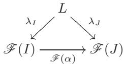

• $L$ 对于这个性质是最终的：也就是说，如果 $M$ 是另一个对象，配备了 morphisms $\mu _ { I }$ ，也满足先前的要求，那么存在一个唯一的 morphism $M  L$ 使得所有相关的图表都可交换5。

极限 $L$（如果存在）在同构意义下是唯一的，定义了由泛性质所给出的每一个概念都是如此。它记为 $\operatorname* { l i m } \mathcal { F }$。这个“指向左侧”的箭头提醒我们 $L$ 在通过 $\mathcal { F }$ 以 $I$ 索引的 $\bar { \mathsf C }$ 的所有对象“之前”（但它在同构意义下是可能这样做“最后一个”对象）。这个概念也称为逆极限或投影极限。

示例 1.10（积）。设 I 是一个“离散范畴”，它包含两个对象 1、2，并且只有恒等态射6，设 $\cot \mathcal { A }$ 是一个从 I 到任意范畴 $\mathsf { C }$ 的函子；设 $A _ { 1 } = \mathcal { A } ( \mathbf { 1 } )$ ，$A _ { 2 } = \mathcal { A } ( \mathbf { 2 } )$ 是 $\mathsf { C }$ 的两个由 I“索引”的对象。那么 $\varprojlim \mathcal { A }$ 就是 $\mathsf { C }$ 中 $A _ { 1 }$ 和 $A _ { 2 }$ 的积，如 I.5.4 中定义：当且仅当 $\mathsf { C }$ 中存在 $A _ { 1 }$ 和 $A _ { 2 }$ 的积时，极限存在。

我们可以类似地定义一个范畴中任意（可能是无限的）对象族的积，作为对应离散索引范畴上的极限，当然，前提是这个极限存在。

如果索引范畴 I 带有更多结构，极限概念会稍微有趣一些。

示例 1.11（均衡器和内核）。假设 I 再次是一个具有两个对象 1、2 的范畴，但假设态射看起来像这样：

$$
G ^ { 2 } \xrightarrow [ \beta ] { \alpha } 1 \supset
$$

也就是说，在离散范畴中添加两个“平行”的态射 $\alpha$ ， $\beta$ ，它们从一个对象到另一个对象。一个函子 $\mathcal { H } : \mathsf { I } \to \mathsf { C }$ 等价于在 $\mathsf { C }$ 中选择两个对象 $A _ { 1 }$ ， $A _ { 2 }$ 以及它们之间的两个平行态射。这种函子的极限称为等化子。举一个具体的例子，假设 $C = R$ -Mod 是某个环 $R$ 的 $R$ -模范畴；设 $\varphi : A _ { 2 }  A _ { 1 }$ 是一个同态，并选择上述的 $\mathcal { H }$ ，其中 $\mathcal { H } ( \alpha ) = \varphi$ 和 $\mathcal { H } ( \beta ) = \mathrm { t h e }$ 零态射。那么 $\varprojlim \mathcal { H }$ 不过是 $\varphi$ 的核，读者将自行验证（习题 1.14）。

示例 1.12（链上的极限）。在另一种典型情况下，我可能由一个全序集组成，例如：

$$
\dotsb { \longrightarrow } 4 \longrightarrow \mathbf { 3 } \longrightarrow \mathbf { 2 } \longrightarrow \mathbf { 1 }
$$

（也就是说，对象是 $\mathbf { i }$ ，对于所有正整数 $i$ ，并且当 $i \geq j$ 时存在唯一的同态 $\mathbf { i }  \mathbf { j }$ ；$^ { 1 }$ 我只画出同态 $\mathbf { j } + \mathbf { 1 }  \mathbf { j }$）。选择 $\mathcal { F } : |  \mathbb { C }$ 等价于选择所有正整数 $i$ 的 $\mathsf { C }$ 对象 $A _ { i }$ 和所有 $i \geq j$ 的同态 $\varphi _ { j i } : A _ { i }  A _ { j }$ ，要求 $\varphi _ { i i } = 1 _ { A _ { i } }$ ，并且 $\varphi _ { k j } \circ \varphi _ { j i } = \varphi _ { k i }$ 对于所有 $i \geq j \geq k$ 。也就是说，选择 $\mathcal { F }$ 就相当于选择一个图

$$
\cdots { \xrightarrow { \varphi _ { 4 5 } } } A _ { 4 } { \xrightarrow { \varphi _ { 3 4 } } } A _ { 3 } { \xrightarrow { \varphi _ { 2 3 } } } A _ { 2 } { \xrightarrow { \varphi _ { 1 2 } } } A _ { 1 }
$$

在 $\mathsf { C }$ 中。一个逆极限 $\varprojlim \mathcal { F }$（当同态 $\varphi _ { j i }$ 从上下文中明显时，也可以记为 limAi）然后是一个带有同态 $\varphi _ { i } : A  A _ { i }$ 的对象 $A$，使得整个图


交换和诸如此类，任何其他满足此要求的对象都唯一地通过 $A$ 。

许多标准情况下都存在这样的限制。例如，设 ${ \mathsf { C } } = R$ -Mod 为固定环 $R$ 上的左模范畴，并且设 $A _ { i }$ 如上所述。$\varphi _ { j i }$

命题 1.13. 极限 $\lim_{i} A_i$ 在 $\varprojlim_{i} A_i$ $R$ -Mod 中存在。

证明。积 $\prod _ { i } A _ { i }$ 由任意序列 $( a _ { i } ) _ { i > 0 }$ 组成，其中 $a _ { i } \in A _ { i }$。如果对于所有 $i > 0$ 都有 $a _ { i } = \varphi _ { i , i + 1 } ( a _ { i + 1 } )$，则称序列 $( a _ { i } ) _ { i > 0 }$ 是一致的。一致序列构成 $\prod _ { i } A _ { i }$ 的一个 $R$ -子模 $A$；典范投影限制为 $R$ -模同态 $\varphi _ { i } : A \to A _ { i }$。读者将验证 $A$ 是一个极限 $\varprojlim _ { i } { A _ { i } }$（习题 1.15）。$\square$

这个例子可以很容易地推广到由更一般的偏序集索引的族。

限制的“双重概念”是函子 $\mathcal { F } : |  \mathsf { C }$ 的 colimit。Colimit 是 $\mathsf { C }$ 的一个对象 $C$，配备了对于所有对象 $I$ 的 morphisms $\gamma _ { I } : { \mathcal { F } } ( I )  C$，使得 $\gamma _ { I } = \gamma _ { J } \circ { \mathcal { F } } ( \alpha )$ 对于所有 $\alpha : I  J$ 成立，并且 $C$ 对于这个要求是初始的。

我们再次遇到了这种结构的几个实例：例如，一个范畴中两个对象 $A _ { 1 }$ ， $A _ { 2 }$ 的直积（如果存在）是离散范畴（具有两个对象）上的上极限，就像它们的积是相应的极限一样。陪核是上极限，就像核是极限（参见示例 1.11）。

$\mathcal { F }$ 的 colimit（毫不奇怪地）记为 $\varinjlim \mathcal { F }$ ，并称为 $\mathcal { F }$ 的直接极限或注入极限。

对于一个典型的情况，再次考虑一个全序集 I 的例子：

$$
1 \longrightarrow 2 \longrightarrow 3 \longrightarrow 4 \longrightarrow \cdots .
$$

一个函子 $\mathcal { F } : |  \mathsf { C }$ 由对象和态射的选择组成

$$
A _ { 1 } \xrightarrow { \psi _ { 1 2 } } A _ { 2 } \xrightarrow { \psi _ { 2 3 } } A _ { 3 } \xrightarrow { \psi _ { 3 4 } } A _ { 4 } \xrightarrow { \psi _ { 4 5 } } \cdot \cdot \cdot
$$

并且直接的极限 limAi 将是一个对象 $\varinjlim _ { i } { A _ { i } }$ $A$ ，带有形态 $\psi _ { i } : A _ { i }  A$ ，使得图表


交换和诸如此类，使得 $A$ 相对于这一要求是初始的。

示例 1.14. 如果 $\mathrm { C } = \mathsf { S e t }$ 并且所有的 $\psi _ { i j }$ 都是单射的，我们谈论的是一个“嵌套集合序列”：

$$
A _ { 1 } \subseteq A _ { 2 } \subseteq A _ { 3 } \subseteq A _ { 4 } \subseteq \cdots \quad ;
$$

这个序列的直接极限是“无限并集” $\textstyle \bigcup _ { i } A _ { i }$

我毫无羞耻地依赖读者的直觉，并已经使用了这个概念，例如当我构造一个域的代数闭包（在 § VII.2.1）或每当我在提到具有“无限多个变量”的多项式环（例如，在示例 III.6.5）时。更正式地说，$\textstyle \bigcup _ { i } A _ { i }$ 由对 $( i , a _ { i } )$ 的等价类组成，其中 $a _ { i } \in A _ { i }$ 并且 $( i , a _ { i } )$ 与 $( j , a _ { j } )$ 等价，当 $i \leq j$ 且 $a _ { j } = \psi _ { i j } ( a _ { i } )$ 时。

在$R$-模的背景下，可以考虑直接和$D = \bigoplus _ { i } A _ { i }$以及由形如$a _ { i } - \psi _ { i j } ( a _ { i } )$的元素生成的子模$K \subseteq D$（其中每个$A _ { i }$都与它在$D$中的像相对应）。然后商模$D / K$满足所需的泛性质，读者将自行验证。事实上，对于更一般的偏序集进行这些构造并不更困难（习题1.16）。在定向集的情况下，它们稍微更明确，行为也更好：偏序集$I$，使得对于所有$i , j \in \mathbb { I }$，都存在$k \in { \mathsf { I } }$，使得$i \leq k$，$j \le k$。

一些标准构造依赖于直接极限：例如，函数的奇点（或者更一般地，“预层茎”）是通过直接极限定义的。

### 1.5. 比较函子

在将函子引入作为“范畴之间的态射”的自然概念之后，下一步自然的是考虑“函子之间的态射”以及其他比较两个给定函子的方式。本书不需要对这些概念进行详细描述，但我想要简要地提一下几个概念和重要评注，再次是因为它们提供了一个统一的观点。

定义1.15. 设$\mathsf { C }$，$\mathsf { D }$是两个范畴，$\mathcal { F }$，$\mathcal { G }$是（例如，协变的）从${ \cal C }$到${ \cal D }$的函子。一个自然变换7 $\mathcal { F } \sim \mathcal { G }$是对于$\mathsf { C }$中的每一个对象$X$，在$\mathsf { D }$中给出一个态射$\nu _ { X } :$ ${ \mathcal { F } } ( X ) \to { \mathcal { G } } ( X )$的元组，使得对于$\mathsf { C }$中的任意态射$\alpha : X  Y$，图

$$
\begin{array} { l } { \displaystyle \mathcal { F } ( X ) \xrightarrow { \mathcal { F } ( \alpha ) } \mathcal { F } ( Y ) } \\ { \displaystyle \nu _ { X } \bigg \downarrow } \\ { \displaystyle \mathcal { G } ( X ) \xrightarrow { \mathcal { G } ( \alpha ) } \mathcal { G } ( Y ) } \end{array}
$$

交换。一个自然同构是一个自然变换 $\nu$，使得对于每一个 $X$，$\nu _ { X }$ 是一个同构。

自然变换在许多情境中都会出现，例如在拓扑学中比较不同的同调或上同调概念时。读者很可能遇到过从 $\boldsymbol { \mathscr { n } } _ { 1 }$ 到 $H _ { 1 }$ 的Hurewicz同态；它是一个自然变换。事实上，任何诸如“存在一个自然（或规范）同态...”的陈述很可能隐藏着两个函子之间的自然变换。这个“自然”一词的技术含义通常与其心理使用相匹配。

一个特别基础且重要的例子是伴随函子的概念，我将以一种相当非正式的方式提及它，将使其形式化的任务留给不屈不挠的读者，通过合适地使用自然变换来完成。设$\mathsf { C }$，$\mathsf { D }$是范畴，设$\mathcal { F } : \mathsf { C } \to \mathsf { D }$，$\mathcal { G } : \mathsf { D } \to \mathsf { C }$是函子。我们说$\mathcal { F }$和$\mathcal { G }$是伴随的（我们说$\mathcal { G }$是$\mathcal { F }$的右伴随，$\mathcal { F }$是$\mathcal { G }$的左伴随），如果存在自然同构

$$
\operatorname { H o m } _ { \mathsf { C } } ( X , { \mathcal { G } } ( Y ) ) { \xrightarrow { \sim } } \operatorname { H o m } _ { \mathsf { D } } ( { \mathcal { F } } ( X ) , Y )
$$

对于所有 $\mathsf { C }$ 的对象 $X$ 和 $\mathsf { D }$ 的对象 $Y$ 。（更精确地说，应该有一个自然的同构关系 ${ \mathsf { C } } ^ { o p } \times { \mathsf { D } } \to { \mathsf { S e t } }$：$\operatorname { Hom_{\mathsf{C}} } ( \_ { \mathcal G } ( \_ ) ) \stackrel { \sim } { \sim } \operatorname { H o m } _ { \mathsf { D } } ( { \mathcal F } ( \_ ) , \_ )$。）

再一次，我们沿途遇到的一些结构可以用这些术语来重新表述，在本章中我们将遇到更多这种情况。

示例 1.16. 在给定集合上的自由群的构造（§II.5）被设计成这样，即给出一个从集合 $A$ 到群 $G$ 的集合函数，与给出一个从 $F(A)$ 到 $G$ 的群同态是“相同”的（$9$ II.5.2）。这真正意味着的是，对于所有集合 $A$ 和所有群 $G$，存在自然同构

$$
\mathrm { H o m } _ { \mathsf { S e t } } ( A , S ( G ) ) \cong \mathrm { H o m } _ { \mathsf { G r p } } ( F ( A ) , G ) \quad ,
$$

$S ( G )$ 会“忘记”群 $G$ 的结构。也就是说，自由群构造的函子 $F : { \mathsf { S e t } } \to { \mathsf { G r p } }$ 是忘记函子 $S : { \mathsf { G r p } } \to { \mathsf { S e t } }$ 的左伴随函子。

当然，这也适用于我们遇到的“自由”对象的其他构造：自由函子通常是忘记函子的左伴随。

因此，有趣的函子可能会是看起来无害的函子的伴随。这具有技术优势：有趣函子的性质可以翻译成无害函子的性质，从而更容易地证明这些性质。

事实上，一个函子具有伴随函子这一事实将赋予该函子方便的特性。我们说 $\mathcal { F }$ 是一个左伴随函子，如果它有一个右伴随函子，并且说 $\mathcal { G }$ 是一个右伴随函子，如果它有一个左伴随函子。有些（比如）右伴随函子的性质可能在甚至不知道其伴随的左伴随函子是什么的情况下建立起来。这里是这个现象的原型例子。

引理 1.17。右伴随函子与极限交换。

也就是说，如果 $\mathcal { G } : \mathsf { D } \to \mathsf { C}$ 有一个左伴随 $\mathcal { F } : \mathsf { C } \to \mathsf { D}$，并且 $\mathcal { A } : |  \mathsf { D }$ 是另一个函子，那么存在一个典范同构

$$
\mathcal { G } ( \varprojlim \mathcal { A } ) \stackrel { \sim } { \to } \varprojlim ( \mathcal { G } \circ \mathcal { A } )
$$

（当然，如果极限存在的话）。正如每个好的微积分学生都应该很容易理解的那样，这表明右伴随函子是连续的。（不用说，左伴随函子最终会与上极限交换，并且会恰当地被称为上连续的。）

我们将不会详细证明引理 1.17，但我将尽力让读者相信，这些陈述并不像看起来那么难，它们只是各种概念的泛性质定义的适当应用。相比之下，在不诉诸抽象废话的情况下，证明一个特定的给定函子保持积（例如），有时可能看起来需要一些“真正”的工作。

假设 $\mathcal { G } : \mathsf { D } \to \mathsf { C }$ 是 $\mathcal { F } : \mathsf { C } \to \mathsf { D }$ 的右伴随，且 $\mathcal { A } : |  \mathsf { D }$ 是一个给定的函子。如我们所见，$\mathcal { A }$ 的极限在适配于交换图中是最终的

$$
\prod _ { \mathcal { A } ( I ) \xrightarrow { \operatorname* { l i m } _ { \mathcal { A } ( \alpha ) } \mathcal { A } ( J ) } } ^ { \operatorname* { l i m } _ { \mathcal { A } } }
$$

（希望符号明显）。应用 $\mathcal { G }$，我们得到（在 $\mathsf { C }$ 中的）交换图


因此，根据定义$\mathcal{G} \circ \mathcal{A}$的极限的泛性质：


现在，同态（在 $\mathsf { C }$ 中）

$$
\varprojlim ( \mathcal { G } \circ \mathcal { A } )  \mathcal { G } \circ \mathcal { A } ( I )
$$

通过附加识别来确定

$$
\mathrm { H o m } _ { \mathsf { C } } ( X , { \mathcal G } ( Y ) ) \xrightarrow { \sim } \mathrm { H o m } _ { \mathsf { D } } ( { \mathcal F } ( X ) , Y ) \quad ,
$$

同态（在 D 中）

$$
\mathscr { F } ( \varprojlim ( \mathscr { G } \circ \mathcal { A } ) )  \mathcal { A } ( I ) \quad .
$$

根据定义 $\varprojlim \mathcal { A }$ 的泛性质，我们得到


再次应用加法，新的同态

$$
\mathcal { F } ( \varprojlim ( \mathcal { G } \circ \mathcal { A } ) )  \varprojlim \mathcal { A }
$$

确定一个同态

$$
\varprojlim ( \mathcal { G } \circ \mathcal { A } )  \mathcal { G } ( \varprojlim \mathcal { A } ) \quad .
$$

总结起来，我们已经得到了自然态射

$$
\mathcal { G } ( \varprojlim \mathcal { A } )  \varprojlim ( \mathcal { G } \circ \mathcal { A } ) \quad , \quad \varprojlim ( \mathcal { G } \circ \mathcal { A } )  \mathcal { G } ( \varprojlim \mathcal { A } ) \quad .
$$

这些组合很容易被验证为恒等（由于在构造中调用的各种普遍性属性的惟一性部分），从而完成了引理 1.17 的验证。

这个提纲中缺少的是对每个所需图都满足交换性的明确验证，这是应用所陈述的泛性质所必需的。读者可能会同意，尽管这些验证可能有点复杂，但它们应该是常规的。

引理 1.17 暗示，例如，右伴随函子保持积，并且当核有定义时，它们必须“保持核”。

示例 1.18（正合函子）。一个函子是正合的，如果它保持正合性，也就是说，它将正合序列映射到正合序列。到目前为止，我们只研究了环上的模的正合性（§III.7.1），所以设 $R$，$S$ 为环，并设 $\mathcal{F}$：$R – \mathsf{Mod}_S$ -Mod 为一个加性函子；$\mathcal{F}$ 是正合的当且仅当每当

$$
0 \longrightarrow A \xrightarrow { \varphi } B \xrightarrow { \psi } C \xrightarrow { \psi } 0
$$

是 $R$ -模的正合序列，则

$$
0 \longrightarrow { \mathcal { F } } ( A ) { \xrightarrow { { \mathcal { F } } ( \varphi ) } } { \mathcal { F } } ( B ) { \xrightarrow { { \mathcal { F } } ( \psi ) } } { \mathcal { F } } ( C ) \longrightarrow 0
$$

是$S$-模的一个正合序列。容易推出每个正合复形的像是正合的（习题1.23）。

一个常见且非常有趣的情况发生在当函子不是正合的，但它保持序列的“一些”正合性（我们将在本章后面遇到这样的例子，例如在§2.3中）。我们说一个加性函子 $\mathcal { F }$ 是左正合的，如果每当

$$
0 \longrightarrow A \xrightarrow { \varphi } B \xrightarrow { \psi } C
$$

如果完全一致，那么也是

$$
0 \longrightarrow \mathcal { F } ( A ) \xrightarrow { \mathcal { F } ( \varphi ) } \mathcal { F } ( B ) \xrightarrow { \mathcal { F } ( \psi ) } \mathcal { F } ( C ) \quad .
$$

事实证明，一个左正合函子会产生一系列“新”的、相关的（“导出”）函子；这一极其重要的现象在同调代数中加以研究，我们将在第九章中回到这个问题。

命题 1.19. 右伴随加性函子 $R$ -Mod $\to S$ -Mod 是左正合的。

如读者将验证（练习1.27），这源于右伴随函子保持核的事实。（注意，序列的正合性相当于$\varphi : A \hookrightarrow B$将$A$与$\ker \psi$等同。）

当然，相应的 $c o$ -公式成立：由于左伴随函子保持余极限，而余核是余极限，因此左伴随加性函子 $\mathcal { G } : R \mathrm { - } \mathsf { M o d } \to S$ -Mod 必然是 _右正合_ 的，在意义上，如果

$$
A { \xrightarrow { \varphi } } B { \xrightarrow { \psi } } C { \xrightarrow { } } 0
$$

正合，则

$$
{ \mathscr { G } } ( A ) { \xrightarrow { { \mathscr { G } } ( \varphi ) } } { \mathscr { G } } ( B ) { \xrightarrow { { \mathscr { G } } ( \psi ) } }  \mathscr { G } (C) { \xrightarrow { } } 0
$$

也正合。

### 习题

1.1. 设 $\mathcal { F } : \mathsf { C } \to \mathsf { D }$ 是一个协变函子，并且假设 $\mathsf { C }$ 和 $\mathsf { D }$ 都有积。证明对于 $\mathsf { C }$ 的所有对象 $A$，$B$，存在唯一的形态 ${ \mathcal { F } } ( A \times B ) \to { \mathcal { F } } ( A ) \times { \mathcal { F } } ( B )$，使得涉及自然投影的相关图式是可交换的。

如果 $\mathsf { D }$ 有伴随（记为 ），且 $\mathcal { G } : \mathsf { C } \to \mathsf { D }$ 是反变的，证明存在唯一的同态 ${ \mathcal { G } } ( A ) \operatorname { I I } { \mathcal { G } } ( B ) \to { \mathcal { G } } ( A \times B )$（同样，使得适当的图可行）。

1.2. $\triangleright$ 设 $\mathcal { F } : \mathsf { C } \to \mathsf { D }$ 是一个完全忠实的函子。如果 $A$ ，$B$ 是 $\mathsf { C }$ 中的对象，证明 $A \cong B$ 在 $\mathsf { C }$ 中当且仅当 ${ \mathcal { F } } ( A ) \cong { \mathcal { F } } ( B )$ 在 $\mathsf { D }$ 中。[§1.3]

1.3. 回忆（§II.1） rằng một nhóm $G$ có thể được coi là một nhóm trừu tượng $\mathsf { G }$ với một đối tượng duy nhất. Chứng minh rằng định nghĩa hành động của $G$ trên một đối tượng của một phạm trù $\mathsf { C }$ là tương đương với định nghĩa một functor $\mathsf { G } \to \mathsf { C }$ .

1.4. $\neg$ 设 $R$ 是一个交换环，且 $S \subseteq R$ 是根据练习 V.4.7 的意义下的一个乘法子集。证明“局部化是一个函子”：对于每一个 $R$-模 $M$，关联其局部化 $S^{-1}M$（练习 V.4.8），对于每一个 $R$-模同态 $\varphi : M \to N$，关联其自然诱导的同态 $S^{-1}M \to S^{-1}N$，定义了一个从 $R$-模范畴到 $S^{-1}R$-模范畴的协变函子。[1.25]

1.5. 对于一个域$F ^ { \prime }$，用$F ^ { * }$表示$F$的非零元素组成的乘法群。映射$\mathsf { F l d } \to \mathsf { G r p }$将$F$映射到$F ^ { * }$，以及一个域同态$\varphi : k  F$（即一个域扩张$^ 8$）到限制$\varphi | _ { k ^ { * } } : k ^ { * } \to F ^ { * }$显然是一个协变函子。另一方面，我们可以考虑固定域$k$的有限扩张范畴$\mathsf { F l d } _ { k } ^ { f }$。证明对象上的映射$F \mapsto F ^ { * }$，以及对于每一个$F _ { 1 } \subseteq F _ { 2 }$，规定规范$N _ { F _ { 1 } \subseteq F _ { 2 } } : F _ { 2 } ^ { * } \to F _ { 1 } ^ { * }$（参见习题VII.1.12），给出了一个从$\mathsf { F l d } _ { k } ^ { f }$到$\mathsf { G r p }$的逆变函子。

证明一个关于迹的类似命题（参见练习 VII.1.13）。

1.6.  在拓扑空间 $T$ 上形式化阿贝尔群预层的概念。如果 $\mathcal { F }$ 是 $T$ 上的预层，则 ${ \mathcal { F } } ( U )$ 的元素称为 $\mathcal { F }$ 在 $U$ 上的截面。由包含 $V \subseteq U$ 诱导的 homomorphism $\rho _ { U V } : { \mathcal { F } } ( U ) \to { \mathcal { F } } ( V )$ 称为限制映射。

证明一个例子可以通过让 ${ \mathcal { C } } ( U )$ 是 $U$ 上的连续复值函数的加法阿贝尔群，并且用函数的普通限制来定义截面的限制得到。

对于这个预层，证明可以唯一地粘贴在重叠开集上相容的截面。也就是说，如果 $U$ 和 $V$ 是开集，$s _ { U } \in { \mathcal { C } } ( U )$ ，$s _ { V } \in \mathcal { C } ( V )$ 在 $U \cap V$ 上限制后相容，证明存在唯一的 $s \in \mathcal { C } ( U \cup V )$ 使得 $s$ 在 $U$ 上限制为 $s _ { U }$ ，在 $V$ 上限制为 $s v$ 。

这本质上就是使 $\mathcal { C }$ 成为 sheaf 的条件。[IX.1.15]

1.7. $\triangleright$ 在 Spec $R$ 上定义一个拓扑，通过断言闭集为 $V ( I )$，其中 $I \subseteq R$ 是一个理想，$V ( I )$ 表示包含 $I$ 的素理想集合。

• 验证这确实定义了 $\mathrm{Spec} R$ 上的拓扑。(这是 $\mathrm{Spec} R$ 上的Zariski拓扑。)
• 将此拓扑与 §VII.2.3 中定义的 Zariski 拓扑联系起来。
• 证明 Spec 是从交换环范畴到拓扑空间范畴的逆变 functor（其中态射是连续函数）。
[§1.2]

1.8. 设 $K$ 是一个代数闭域，并考虑在例1.9中定义的 $K$ -Aff范畴。

• 用 $h _ { S }$ 表示 functor $\mathrm { H o m } _ { K - \mathsf { A f f } } ( \mathsf { \Pi } _ { - } , S )$（如 §1.2 所述），并设 $p \ = \ \mathbb { A } _ { K } ^ { 0 }$ 为一个点。证明 $S$ 与 $h _ { S } ( p )$ 之间存在自然的双射。（使用练习 VII.2.14。） • 证明每个 $\varphi \in \mathrm { H o m } _ { K \cdot \mathsf { A f f } } ( S , T )$ 都确定一个从 $S$ 到 $T$ 的集合函数。 • 如果 $S \subseteq \mathbb { A } _ { K } ^ { m }$ ，$T \subseteq \mathbb { A } _ { K } ^ { n }$ ，证明由 morphism $\varphi \in { \mathrm { H o m } } _ { K - { \mathsf { A f f } } } ( S , T )$ 确定的函数 $S \to T$ 是一个“多项式函数” $\mathbb { A } _ { K } ^ { m } \to \mathbb { A } _ { K } ^ { n }$ 的限制。（这个练习的一部分是理解这意味着什么！）

1.9. $\neg$ 设 $\mathsf { C }$ ， $\mathsf { D }$ 为范畴，且假设 $\mathsf { C }$ 为小范畴。定义一个函子范畴 $\mathsf { D } ^ { \mathsf { C } }$ ，其对象是协变函子 $C  \ D$ ，其态射是自然变换9。

证明赋值 $X \mapsto h _ { X } := \operatorname { H o m } _ { \mathbb { C } } ( \lrcorner , X )$（参见§1.2）定义了一个协变函子 $\mathsf { C } \to \mathsf { S e t } ^ { \mathsf { C } ^ { \upsilon \upsilon } }$。（以自然的方式定义对态射的作用。)[1.11, IX.1.11]

**1.10.** $\neg$ 令 $\mathsf{C}$ 是一个范畴， $X$ 是 $\mathsf{C}$ 的一个对象，并考虑反变函子 $h_X := \operatorname{Hom}_{\mathsf{C}}(\_, X)$ (参阅 §1.2)。对于每个反变函子 $\mathscr{F} : \mathsf{C} \to \mathsf{Set}$，证明在自然变换集 $h_X \leadsto \mathscr{F}$ 与 $\mathscr{F}(X)$ 之间存在一个双射，定义如下。一个自然变换 $\nu: h_X \leadsto \mathscr{F}$ 的数据包含：对于 $\mathsf{C}$ 的每一个对象 $A$，都有一个从 $h_X(A) = \operatorname{Hom}_{\mathsf{C}}(A, X)$ 到 $\mathscr{F}(A)$ 的态射 $\nu_A$。将 $\nu$ 映射到 $\mathrm{id}_X \in h_X(X)$ 在 $\mathscr{F}(X)$ 中的像 $\nu_X(\mathrm{id}_X)$。（提示：构造所述映射的一个逆。对于每个 $f \in \mathscr{F}(X)$ 和每个 $\varphi \in \operatorname{Hom}_{\mathsf{C}}(A, X)$，你如何构造 $\mathscr{F}(A)$ 的一个元素？）

这个结果被称为*米田引理* (Yoneda lemma)。[1.11, IX.2.17]

1.11. (参见练习1.9。) 设 $\mathsf { C }$ 是一个小范畴。一个逆变函子 $\mathrm { C }  \mathsf { S e t }$ 是可表示的，如果它自然同构于一个函子 $h _ { X }$（参见§1.2）。在这种情况下，$X$ “表示”这个函子。证明 $\mathsf { C }$ 与 ${ \mathsf { S e t } } ^ { \mathsf { C } ^ { o p } }$ 中可表示函子的子范畴等价。（提示：Yoneda；参见练习1.10。）

因此，每个（小）范畴都等价于一个函子范畴的子范畴。

1.12. 设 $\mathsf { C }$ , $\mathsf { D }$ 是两个范畴，且 $\mathcal { F } : \mathsf { C } \to \mathsf { D }$ , $\mathcal { G } : \mathsf { D } \to \mathsf { C }$ 是两个函子。证明 $\mathcal { F }$ 是 $\mathcal { G }$ 的左伴随函子当且仅当，对于 $\mathsf { D }$ 中的每一个对象 $Y$ ，对象 $\mathcal { G } ( Y )$ 代表函子 $h _ { Y } \circ \mathcal { F }$ （在 $Y$ 中“自然地”）。

1.13. 设 Z 是一个“Zen”范畴，其中不包含任何对象和态射。人们可以思考一个从 Z 到任意范畴 C 的函子 $\mathcal { Z }$：无需指定任何数据。当这样的对象存在时，$\varprojlim \mathcal { L }$ 是什么？

1.14. $\triangleright$ 验证例1.11中描述的构造确实恢复了$R$-模同态的核，正如所声称的那样。[§1.4]

1.15. $\triangleright$ 验证在命题1.13的证明中给出的构造确实是一个逆极限，如所声称。[§1.4]

1.16. $\triangleright$ 补充1.4中关于Set和$R$-Mod中colimits构造的草图，对于任何索引偏序集。在Set中，注意到如果偏序集I是定向的，那么colimit的构造会更简单；也就是说，如果$\forall i , j \in \mathbb { I }$，存在一个$k \in { \mathsf { I } }$，使得$i \leq k$，$j \le k$。[§1.4]

1.17. $\neg$ 设 $R$ 是一个交换环，且 $I \subseteq R$ 是一个理想。注意到如果 $n \geq m$，则 $I ^ { n } \subseteq I ^ { m }$，因此我们对于 $n \geq m$ 有自然同态 $\varphi _ { m n } : R / I ^ { n } \to R / I ^ { m }$。

• 证明逆极限 ${ \widehat { R } } _ { I } : = \varprojlim _ { n } R / I ^ { n }$ 作为交换环存在。这被称为 $I$ -adic 完备化 $R$ 。  
根据逆极限的泛性质，存在唯一的同态 $R  \hat { R } _ { I }$ 。证明这个同态的核是 $\textstyle { \bigcap _ { n } I ^ { n } }$ 。  
• 设 $I \ = \ ( x )$ 在 $R \vert x \vert$ 中。证明完备化 $\widehat { R } [ \widehat { \boldsymbol { x } } ] _ { I }$ 与在 §III.1.3 中定义的幂级数环 $R \lfloor \lfloor x \rfloor \rfloor$ 同构。 [1.18, 1.19]

1.18. 设 $R$ 是一个交换的诺特环，且 $I \subseteq R$ 是一个理想。那么 $I \cdot \textstyle { ( \big ) } _ { n } I ^ { n } = ( \big ) _ { n } I ^ { n }$；读者将在习题4.20中证明这一点。

假设，并证明 $\textstyle { \bigcap _ { n } I ^ { n } }$ 等于 $r \in R$ 的集合，使得 $( 1 - a ) r = 0$ 对某些 $a \in { \mathfrak { I } }$ 成立。（提示：一个包含关系是基本的。对于另一个，使用 Nakayama 引理的形式，如练习 VI.3.7。这个结果归功于 Krull。）

例如，如果 $I$ 是适当的，那么当 $R$ 是一个整环或局部环时，$\bigcap _ { n } I ^ { n } = ( 0 )$。在这些情况下，自然映射 $R  \hat { R } _ { I }$ 到 $I$ -adic 完备是单射的（参见习题 1.17）。

1.19. ¬ 练习1.17中提出构造的一个重要例子是$p$-adic整数环$\mathbb{Z}_p$：这是对于正素数$p$的极限$\lim_{Z/prZ}$。$\mathbb{Z}_p$的分式域记作$\mathbb{Q}_p$；$\mathbb{Q}_p$中的元素称为$p$-adic数。

• 证明给出一个 $p$ -adic 整数 $A$ 等价于给出一个整数序列 $A _ { r }$ ， $r \geq 1$ ，使得 $0 \leq A _ { r } < p ^ { r }$ ，并且 $A _ { s } \equiv A _ { r } { \bmod { p ^ { s } } }$ 如果 $s \leq r$ 。 • 等价地，证明每个 $p$ -adic 整数有一个唯一的无限展开 $A = a _ { 0 } + a _ { 1 } \cdot p + a _ { 2 } \cdot p ^ { 2 } + a _ { 3 } \cdot p ^ { 3 } + \cdot \cdot \cdot$ ，其中 $0 \leq a _ { i } \leq p - 1$ 。

$p$ 进制整数的算术可以用这些展开式来精确地完成，就像普通算术用普通十进制展开式来完成一样。

• 如前一点所述的记号，证明 $A \in \mathbb { Z } _ { p }$ 是可逆的当且仅当 $a _ { 0 } \neq 0$ 。   
• 证明 $\mathbb { Z } _ { p }$ 是一个局部域，其极大理想由（$p$ 在 $\mathbb { Z } _ { p }$ 中的像）生成。   
• 证明 $\mathbb { Z } _ { p }$ 是一个DVR（参见练习V.2.19）。（在 $\mathbb { Q } _ { p }$ 上有一个明显的 valuation。）
 [§II.2.3]

1.20. $\neg$ 如果 $m$ ， $n$ 是正整数且 $m \mid n$ ，那么 $( n ) \subseteq ( m )$ ，并且存在一个满射环同态 $\mathbb { Z } / n \mathbb { Z } \twoheadrightarrow \mathbb { Z } / m \mathbb { Z }$ 。极限环 $\varprojlim _ { ( n ) } \mathbb { Z } / n \mathbb { Z }$ 存在，并记作 $\hat { \mathbb { Z } }$ 。证明 $\widehat { \mathbb { Z } } \cong \operatorname { E n d } _ { \mathsf { A b } } ( \mathbb { Q } / \mathbb { Z } )$ 。（每一个 $f \in \operatorname { E n d } _ { \mathsf { A b } } ( \mathbb { Q } / \mathbb { Z } )$ 都由 $\textstyle f ( { \frac { 1 } { n } } )$ 确定；注意由于 $n { \frac { 1 } { n } } = 1 \equiv 0 { \bmod { \mathbb { Z } } }$ ， $\begin{array} { r } { f ( \frac { 1 } { n } ) = \frac { g ( n ) } { n } } \end{array}$ 对某个整数 $g ( n )$ 成立，可以选取 $g ( n )$ 使得 $0 \leq g ( n ) < n$ 。证明如果 $m \mid n$ ，则 $g ( m ) \equiv g ( n )$ mod ${ m}$ ，并思考如何描述 $\hat { \mathbb { Z } }$ 的元素。[1.21]

1.21. 设 $\widehat { \mathbb { Z } }$ 如练习 1.20 中所述。

• 如果 $R$ 是一个带有到所有素数 $p$ 和所有 $r$ 的 $\mathbb{Z} / p ^ { r } \mathbb{Z}$ 的同态的交换环，并且与所有从 $\mathbb{Z} / p ^ { r } \mathbb{Z}$ 到 $\mathbb{Z} / p ^ { s } \mathbb{Z}$ 的投影 $s \leq r$ 兼容，证明存在到所有 $n$ 的 $\mathbb{Z} / n \mathbb{Z}$ 的环同态 $R \to \mathbb{Z} / n \mathbb{Z}$，并且与所有从 $\mathbb{Z} / n \mathbb{Z}$ 到 $\mathbb{Z} / m \mathbb{Z}$ 的投影 $m \mid n$ 兼容。  
• 推导出 $\widehat{\mathbb{Z}}$ 满足 $\mathbb{Z}_p$ 的积的泛性质，当 $p$ 取遍所有正素数时。

因此，$\begin{array} { r } { \prod _ { p } \mathbb { Z } _ { p } \cong \widehat { \mathbb { Z } } \cong \operatorname { E n d } _ { \mathsf { A b } } ( \mathbb { Q } / \mathbb { Z } ) , } \end{array}$ 。

1.22. 设 $\mathsf { C }$ 是一个范畴，考虑‘积范畴’ $\mathsf { C } \times \mathsf { C }$（理解这种概念！）。存在一个‘对角’函子，将 $\mathsf { C }$ 的每个对象 $X$ 对应到 $\mathsf C \times \mathsf C$ 的对象对 $( X , X )$。另一方面，可能存在一个‘积函子’ ${ \mathsf { C } } \times { \mathsf { C } } \to { \mathsf { C } }$ ，将 $( X , Y )$ 对应到积 $X \times Y$ ；例如，这在 Grp 中就是这样。说服自己积函子是‘对角’函子的右伴随。如果存在一个‘和函子’，验证它是‘对角’函子的左伴随。

1.23. $\triangleright$ 设 $R$ ， $S$ 是环。证明一个加性协变函子 $\mathcal { F } : R$ -Mod $S$ -Mod 是正合的当且仅当当 $A { \xrightarrow { \varphi } } B { \xrightarrow { \psi } } C$ 在 $R$ -Mod 中是正合的时候，$\mathcal { F } ( A ) \xrightarrow { \mathcal { F } ( \varphi ) } \mathcal { F } ( B ) \xrightarrow { \mathcal { F } ( \psi ) } \mathcal { F } ( C )$ 在 $S$ -Mod 中是正合的。由此推出一个正合的函子将正合的复形映射到正合的复形。 [§1.5, IX.3.7]

1.24. 设 $R$，$S$ 是环。一个加性协变函子 $\mathcal { F } : R$ -Mod $\to S$ -Mod 是忠实正合的，如果 $\mathcal { F } ( A ) \xrightarrow { \mathcal { F } ( \varphi ) } \mathcal { F } ( B ) \xrightarrow { \mathcal { F } ( \psi ) } \mathcal { F } ( C )$ 在 $S$ -Mod 中是正合的当且仅当 $A { \xrightarrow { \varphi } } B { \xrightarrow { \psi } } C$ 在 $R$ -Mod 中是正合的。证明一个正合函子 $\mathcal { F } : R \ – \mathsf { M o d } \to S$ -Mod是忠实地正合的，当且仅当对于每个非零$R$ -模$M$，$\mathcal { F } ( M ) \neq 0$，当且仅当对于$R$ -Mod中的每个非零同态$\varphi$，$\mathcal { F } ( \boldsymbol { \varphi } ) \neq 0$。

1.25. ¬ 证明局部化（练习1.4）是一个正合函子。

事实上，证明局部化“保持同调”：如果

$$
M _ { \bullet } : \ \cdots { \longrightarrow } \ M _ { i + 1 } { \xrightarrow { \ d _ { i + 1 } } } \ M _ { i } { \xrightarrow { \ d _ { i } } } \ M _ { i - 1 } { \xrightarrow { } } \ \cdots
$$

如果$R$是一个复数模，$S$是$R$的一个乘法子集，那么$i$-次同调$S^{-1}H_i(M_\bullet)$是局部化复数$S^{-1}M_\bullet$的$i$-次同调$H_i(S^{-1}M_\bullet)$

$$
S ^ { - 1 } M _ { \bullet } : \cdots { \longrightarrow } S ^ { - 1 } M _ { i + 1 } { \stackrel { S ^ { - 1 } d _ { i + 1 } } { \longrightarrow } } S ^ { - 1 } M _ { i } \ { \stackrel { S ^ { - 1 } d _ { i } } { \longrightarrow } } S ^ { - 1 } M _ { i - 1 } { \longrightarrow } \cdots \qquad 
$$

[2.12, 2.21, 2.22]

1.26. 证明局部化在以下意义上是忠实地正合的：设 $R$ 是一个交换环，并且让

$$
0 \longrightarrow A \longrightarrow B \longrightarrow C \longrightarrow 0
$$

是一个$R$-模序列。那么（$^*$）是正合的当且仅当诱导的$R_{\mathfrak{p}}$-模序列

$$
0 \longrightarrow A _ { \mathfrak { p } } \longrightarrow B _ { \mathfrak { p } } \longrightarrow C _ { \mathfrak { p } } \longrightarrow 0
$$

对于 $R$ 的每个素理想 $\mathfrak { p }$ ，它都是正合的，当且仅当它对于每个极大理想 $\mathfrak { p }$ 也是正合的。（参见练习 V.4.12。）

1.27. $\triangleright$ 设 $R$ ， $S$ 是环。证明右伴随函子 $R – { \mathsf { M o d } }  \to S$ -Mod 是左正合的，并且左伴随函子是右正合的。[§1.5]

**1.28.** $\neg$ 令 $\mathsf{C}$ 是一个范畴，并考虑恒等函子 $\mathscr{J} : \mathsf{C} \to \mathsf{C}$。证明自然变换 $\mathscr{J} \rightsquigarrow \mathscr{J}$ 的集合 $\mathrm{End}(\mathscr{J})$ 在复合运算下是一个交换幺半群。这被称为 $\mathsf{C}$ 的*中心*。如果 $R$ 是一个环，证明 $R$-Mod 的中心以一种自然的方式构成一个环，并且它同构于 $R$ 的中心。
[3.15]

## 2. 张量积和Tor函子

在本书的其余部分，我们将工作在交换环 $R$ 上的模类 $R$ -Mod 中。我们将看到的所有内容本质上都可以在不费力的情况下升级到非交换情况，但在那种情况下会丢失一些结构。例如，如果 $R$ 不是交换的，那么在左-$\mathbf { \nabla } \cdot R$ -模类 $R$ -Mod 中，同态集 ${ \mathrm { H o m } } _ { R - { \mathsf { M o d } } } ( M , N )$ 只是阿贝尔群（参见 §III.5.2 的末尾）。张量积 $M \otimes _ { R } N$ 只能定义，如果 $M$ 是右-$R$ -模并且 $N$ 是左-$R$ -模（从某种意义上说，这两种模结构会相互抵消，剩下的是阿贝尔群）。相比之下，在交换情况下，我们可以简单地定义 $M \otimes _ { R } N$ 为一个 $R$ -模。一般来说，如果模具有兼容的左右模结构，理论将像交换情况一样进行，但在诸如张量的交换性等问题上，我们无法期望 $R$ 的交换性没有任何影响。总而言之，交换情况稍微简洁一些，而且（我相信）就传达理论的基本直觉和一般特征而言，它已经足够了。

因此，$R$ 将表示一个固定的交换环，除非另有说明。

### 2.1. 双线性映射和张量的定义
如果 $M$ 和 $N$ 是 $R$ -模，我们在遥远的过去（III.6.1）观察到 $M \oplus N$ 既是 $M$ 和 $N$ 的积也是它们的直和：这是一个极限与余极限相重合的情况。作为集合，$M \oplus N$ 就是 $M \times N$；$M \oplus N$ 上的 $R$ -模结构是通过分量加法和标量乘法定义的。一个 $R$ -模同态

$$
M \oplus N \to P
$$

由 $R$ -模同态 $M \to P$ 和 $N \to P$ 决定（这正是使 $M \oplus N$ 成为积的原因）。

但还有另一种方法将 $M \times N$ 映射到一个 $R$ -模 $P$ ，与 $R$ -模结构兼容。

定义 2.1. 设 $M$，$N$，$P$ 是 $R$-模。一个函数 $\varphi : { \cal M } \times { \cal N }  { \cal P }$ 是 $R$-双线性的，如果

• $\forall m \in M$ ，函数 $n \mapsto \varphi ( m , n )$ 是一个 $R$ -模同态 $N  P$ ，• $\forall n \in N$ ，函数 $m \mapsto \varphi ( m , n )$ 是一个 $R$ -模同态 $M  P 。.$

因此，如果$\varphi : M \times N \to P$是$R$ -双线性的，那么$\forall m \in M$ ，$\forall n _ { 1 } , n _ { 2 } \in N$ ，$\forall r _ { 1 } , r _ { 2 } \in R$ ，

$$
\varphi ( m , r _ { 1 } n _ { 1 } + r _ { 2 } n _ { 2 } ) = r _ { 1 } \varphi ( m , n _ { 1 } ) + r _ { 2 } \varphi ( m , n _ { 2 } )
$$

同样地，对于 $\varphi ( \underline { { \mathbf { \Pi } } } _ { - } , n )$ 。

请注意，即使我们将 $M \times N$ 视为 $R$ -模 $M \oplus N$ ，如上所述，$\varphi$ 本身也不是线性的。另一方面，应该有一种方法来处理 $R$ -双线性映射“好像”它们是 $R$ -线性的，因为在 $R$ -模的上下文中，这种映射很多。例如，$R$ 上的乘法本身就是一个 $R$ -双线性映射

$$
R \times R \to R .
$$

我们的经验表明，泛性质提示了处理这个问题的自然方法。我们需要一个新的 $R$ -模 $M \otimes _ { R } N$ ，以及一个 $R$ -双线性映射

$$
\otimes : M \times N \to M \otimes _ { R } N ,
$$

使得每个 $R$ -双线性映射 $M \times N  P$ 唯一地分解通过这个新模 $M \otimes _ { R } N$ ，

$$
\begin{array} { l } { { M \times N { \xrightarrow { \varphi } } P } } \\ { { \otimes } { \down et { } { \prod } } } \\ { { M \otimes } { R N } } \end{array}
$$

以这种方式，使得映射 $\overline { { \varphi } }$ 是一个普通的 $R$ -模同态。

因此，如果我们想将 $R$-双线性映射从 $M \times N$ 视为 $R$-线性映射，那么 $M \otimes _ { R } N$ 将是 $R$ -Mod 中 $M \times N$ 的“最佳逼近”。模 $M \otimes _ { R } N$ 被称为 $M$ 和 $N$ 在 $R$ 上的张量积。下标 $R$ 非常重要：如果 $M$ 和 $N$ 是定义在两个环 $R$ ， $S$ 上的模，那么 $S$ -双线性与 $R$ -双线性并不相同，因此 $M \otimes _ { R } N$ 和 $M \otimes _ { S } N$ 可能是完全不同的对象。在上下文中，如果基底环是明确的，省略下标并不罕见，但我不建议这种做法。

上述处方将张量积记为普遍问题的解；因此我们立刻知道，如果它存在（再次引用命题I.5.4），它在同构意义下将是唯一的，并且我们可以通过系统地使用泛性质来研究它。

示例 2.2. 对于所有 $R$ -模 $N$ ， $R \otimes _ { R } N \cong N$ 。

确实，每个 $R$ -双线性 $R \times N \to P$ 都通过 $N$（如立即验证的那样）：


其中 $\otimes ( r , n ) = r n$ 。根据泛对象的唯一性，必然有 $N \cong R \otimes _ { R } N$ 。

对于另一个例子，很容易看出必须存在一个规范同构

$$
{ \cal M } \otimes _ { R } { \cal N } \stackrel { \sim } { \to } { \cal N } \otimes _ { R } { \cal M } .
$$

确实，每个 $R$ -双线性 $\varphi : M \times N \to P$ 都可以被分解为10

$$
{ \cal M } \times { \cal N } \mathop { \longrightarrow } \mathop { } { \cal N } \times { \cal M } \xrightarrow { \psi } { \cal P } ,
$$

其中 $\psi ( n , m ) ~ = ~ \varphi ( m , n )$ ； $\psi$ 也是 $R$ -双线性的，因此它唯一地分解为 $N \otimes _ { R } M$ 。因此，$\varphi$ 唯一地分解为 $N \otimes _ { R } M$ ，这就足以得出存在一个规范同构 $N \otimes _ { R } M \cong M \otimes _ { R } N$ 。

然而，除非我们首先确定 $M \otimes _ { R } N$ 的存在，否则这些考虑有点无关紧要。这需要一些工作。

引理 2.3. 在 $R$ -Mod 中存在张量积。

证明。给定$R$-模$M$和$N$，我们手动构造一个满足普遍要求的模。令$F ^ { R } ( M \times N ) = R ^ { \oplus ( M \times N ) }$是$M \times N$上的自由$R$-模（$S$ III.6.3）。这个模配备了一个集合映射

$$
j : M \times N  F ^ { R } ( M \times N ) ,
$$

关于所有从 $M \times N$ 到任意 $R$ -模 $P$ 的集合映射是普遍的；主要任务是将这变成一个 $R$ -双线性映射。例如，我们必须识别 $F ^ { R } ( M \times N )$ 中形式为 $j ( m , n _ { 1 } + n _ { 2 } )$ 的元素与元素 $j ( m , n _ { 1 } ) + j ( m , n _ { 2 } )$ 等。因此，设 $K$ 是由所有元素生成的 $R$ -子模 $F ^ { R } ( M \times N )$。

$$
j ( m , r _ { 1 } n _ { 1 } + r _ { 2 } n _ { 2 } ) - r _ { 1 } j ( m , n _ { 1 } ) - r _ { 2 } j ( m , n _ { 2 } )
$$

并且

$$
j \big ( r _ { 1 } m _ { 1 } + r _ { 2 } m _ { 2 } , n \big ) - r _ { 1 } j \big ( m _ { 1 } , n \big ) - r _ { 2 } j \big ( m _ { 2 } , n \big )
$$

当 $m$，$m _ { 1 }$，$m _ { 2}$ 在 $M$ 中取值，$n$，$n _ { 1 }$，$n _ { 2}$ 在 $N$ 中取值，以及 $r _ { 1 }$，$r _ { 2}$ 在 $R$ 中取值。设

$$
M \otimes _ { R } N : = \frac { F ^ { R } ( M \times N ) } { K } ,
$$

赋予映射 $\otimes : M \times N \to M \otimes _ { R } N$，该映射通过将 $j$ 与自然投影复合得到：

$$
\otimes : M \times N { \xrightarrow { j } } F ^ { R } ( M \times N ) { \xrightarrow { } } M \otimes _ { R } N = F ^ { R } ( M \times N ) / K
$$

元素 $\otimes ( m , n )$（即 $j ( m , n )$ 模 $K$ 的类）记为 $m \otimes n$

显然，$( m , n ) \to m \otimes n$ 定义了一个 $R$ -双线性映射。我们需要验证 $M \otimes _ { R } N$ 满足泛性质，这也是显而易见的。如果 $\varphi : M \times N \to P$ 是任意一个 $R$ -双线性映射，根据后者的泛性质，我们有一个唯一的诱导 $R$ -线性映射 $\ddot { \varphi }$ 从自由 $R$ -模：

$$
\begin{array} { c } { { M \times N \xrightarrow { \varphi } \mathrm { P } } } \\ { { j \brace j \Biggl \downarrow \atop \mathrm { f } { R } { \uparrow } } } \\ { { F ^ { R } ( M \times N ) } } \end{array} { } ^ { P }
$$

我断言 $\tilde { \varphi }$ 在 $K$ 上限制为 $0$。实际上，为了验证这一点，只需验证 $\ddot { \varphi }$ 将 $K$ 的每个生成元发送到零，而这源于 $\varphi$ 是 $R$ -双线性的。例如，

$$
\begin{array} { r l } & { \tilde { \varphi } ( j ( m , r _ { 1 } n _ { 1 } + r _ { 2 } n _ { 2 } ) - r _ { 1 } j ( m , n _ { 1 } ) - r _ { 2 } j ( m , n _ { 2 } ) ) } \\ & { \qquad = \tilde { \varphi } ( j ( m , r _ { 1 } n _ { 1 } + r _ { 2 } n _ { 2 } ) ) - r _ { 1 } \tilde { \varphi } ( j ( m , n _ { 1 } ) ) - r _ { 2 } \tilde { \varphi } ( j ( m , n _ { 2 } ) ) } \\ & { \qquad = \varphi ( m , r _ { 1 } n _ { 1 } + r _ { 2 } n _ { 2 } ) - r _ { 1 } \varphi ( m , n _ { 1 } ) - r _ { 2 } \varphi ( m , n _ { 2 } ) } \\ & { \qquad = 0 . } \end{array}
$$

由商的泛性质（！）可知，$\ddot { \varphi }$ 唯一地通过 $K$ 的商：


并且我们完成了。

通常情况下，用于证明 $M \otimes _ { R } N$ 存在的显式构造几乎从不被使用。然而，保留它仍然是有益的。

请注意，$M \otimes _ { R } N$ 的元素来自 $M \times N$ 上的自由 $R$-模的元素，因此 $M \otimes _ { R } N$ 的任意元素是一个有限线性组合

$$
\sum _ { i } r _ { i } ( m _ { i } \otimes n _ { i } )
$$

对于 $r _ { i } \in R$ ， $m _ { i } \in M$ ，和 $n _ { i } \in N$ 。 $\otimes : M \times N \to M \otimes _ { R } N$ 的 $R$ -双线性意味着规则：

$$
\begin{array} { c } { { m \otimes ( n _ { 1 } + n _ { 2 } ) = m \otimes n _ { 1 } + m \otimes n _ { 2 } , } } \\ { { ( m _ { 1 } + m _ { 2 } ) \otimes n = m _ { 1 } \otimes n + m _ { 2 } \otimes n , } } \\ { { m \otimes ( r n ) = ( r m ) \otimes n = r ( m \otimes n ) , } } \end{array}
$$

对于所有 $m$，$m _ { 1}$，$m _ { 2} \in M$，$n _ { 1}$，$n _ { 2}$，$n \in N$，以及 $r \in R$。特别是，请注意 $( ^ { * } )$ 中的系数 $r _ { i}$ 不是必要的，因为它们可以被吸收到相应的项 $m _ { i} \otimes n _ { i}$ 中：

$$
\sum _ { i } r _ { i } ( m _ { i } \otimes n _ { i } ) = \sum _ { i } ( r _ { i } m _ { i } ) \otimes n _ { i } .
$$

形式为 $m \otimes n$（即，表达式中只需要一个加项）的元素称为纯张量。亲爱的读者，请记住纯张量是特殊的：通常，张量积的每个元素都不是纯张量。参见练习2.1，了解在某种情况下每个张量恰好是纯张量的情况，并欣赏这种情况是多么特殊。

纯张量仍然非常有用，作为张量积的一组生成元。例如，如果两个同态 $\alpha , \beta : M \otimes _ { R } N \to P$ 在纯张量上相等，那么 $\alpha = \beta$ 。通常，涉及张量积的计算被简化为对纯张量的简单验证。

### 2.2. 与Hom的附加和显式计算
张量积是Hom的左伴随。一旦我们解析这个粗略陈述的含义，它将几乎是微不足道的；但是，正如我们在§1.5中发现的那样，仅仅$\otimes _ { R }$是任何函子的左伴随这一事实就足以得出关于它的有趣结论。

首先，我们注意到每一个 $R$ -模 $N$ 通过 $\otimes _ { R }$ 定义了一个新的协变函子 $R – { \mathsf { M o d } }  R$ -Mod，它在对象上的定义为

$$
M \mapsto M \otimes _ { R } N .
$$

要了解这在同态上的作用，请让

$$
\alpha : M _ { 1 }  M _ { 2 }
$$

是一个 $R$ -模同态。与 $N$ 交叉并与 $\otimes$ 组合定义了一个 $R$ -双线性映射

$$
M _ { 1 } \times N \to M _ { 2 } \times N \to M _ { 2 } \otimes N ,
$$

因此，诱导了一个 $R$ -线性映射

$$
\alpha \otimes N : M _ { 1 } \otimes N \to M _ { 2 } \otimes N .
$$

在纯张量上，这个映射简单地给出 $m \otimes n \mapsto \alpha ( m ) \otimes n$ ，并且函子性立即成立：如果 $\beta : M _ { 0 }  M _ { 1 }$ 是一个第二个同态，那么 $( \alpha \otimes N ) \circ$ $( \beta \otimes N )$ 和 $( \alpha \circ \beta ) \otimes N$ 都将纯张量 $m \otimes n$ 映射到 $\alpha ( \beta ( m ) ) \otimes n$ ，因此它们必须在所有张量上保持一致。

本小节开头给出的 adjunction 断言将这个函子与协变函子 $P \mapsto { \mathrm { H o m } } _ { R \cdot { \mathsf { M o d } } } ( N , P )$ 进行比较；参见 §1.2。让我们更精确地看看它是如何运作的。

我们已经定义了 $M \otimes _ { R } N$，使得给一个 $R$ -线性映射 $M \otimes _ { R } N \to P$ 到一个 $R$ -模 $P$ 是“等同于”给一个 $R$ -双线性映射 $M \times N \to P$。现在回想一下 $R$ -双线性映射的定义：$\varphi : M \times N \to P$ 是 $R$ -双线性的，如果对于所有 $m \in M$ 和 $n \in N$，$\varphi ( m , \underline { { \ O } } )$ 和 $\varphi ( \underline { { \mathbf { \Pi } } } _ { - } , n )$ 都是 $R$ -线性映射。这个规定的第一部分说明 $\varphi$ 确定了一个函数

$$
M \to \operatorname { H o m } _ { R } ( N , P ) ;
$$

第二部分说这是一个 $R$ -模同态。因此，一个 $R$ -双线性映射是“等同于"一个元素。

$$
{ \mathrm { H o m } } _ { R } ( M , { \mathrm { H o m } } _ { R } ( N , P ) ) .
$$

这些简单的考虑足以使以下看似复杂的陈述相当自然：

引理 2.4. 对于所有 $R$ -模 $M$ ，$N$ ，$P$ ，存在一个 $R$ -模同构

$$
\mathrm { H o m } _ { R } ( M , \mathrm { H o m } _ { R } ( N , P ) ) \cong \mathrm { H o m } _ { R } ( M \otimes _ { R } N , P ) .
$$

证明。如前所述，对于每个 $\alpha \in { \mathrm { H o m } } _ { R } ( M , { \mathrm { H o m } } _ { R } ( N , P ) )$，它确定了一个 $R$-双线性映射 $\varphi : M \times N \to P$，

$$
( m , n ) \mapsto \alpha ( m ) ( n ) .
$$

根据泛性质，$\varphi$ 唯一地通过一个 $R$-线性映射 $\overline{\varphi} : M \otimes_R N \to P$。因此，$\alpha$ 确定了一个定义良好的元素 $\overline{\varphi} \in \mathrm{Hom}_R(M \otimes_R N, P)$。读者将验证（练习 2.11），这个映射 $\alpha \mapsto \overline{\varphi}$ 是 $R$-线性的，并构造其逆映射。

推论 2.5. 对于每一个 $R$ -模 $N$ ，函子 $\_ \otimes R ^ { N }$ 是函子 ${ \mathrm { H o m } } _ { R } ( N , \ l _ { - } )$ 的左伴随。

证明。该命题是说引理2.4中找到的同构在1.5中暗示但未完全解释的意义下是自然的；有兴趣的读者应该没有问题检查这种自然性。$\square$

根据引理1.17（或者说其共变形式），我们可以得出对于每个$R$-模$N$，函子$_ \otimes _ { R } N$保持上极限，并且${ M \otimes _ { R _ { - } } }$也保持上极限，这是由§2.1中验证的基本的积的交换性所保证的。特别是，这一点是另一个巴甫洛夫反应的好材料，

$M \otimes _ { R } \underline { { { \ : \ : - } } } \ : \mathrm { a n d \ : \ : \mathcal { Q } } _ { R } \ : N \ : \ : \mathrm { a r e \ r i g h t \mathrm { - } e x a c t \ : f u n c t o r s }$

（参见示例1.18）。

这些观察有几个后果，这使得使用张量积进行“计算”更加合理。这里有一个例子：

推论2.6。对于所有的$R$-模$M _ { 1 }$，$M _ { 2 }$，$N$，

$$
( M _ { 1 } \oplus M _ { 2 } ) \otimes _ { R } N \cong ( M _ { 1 } \otimes _ { R } N ) \oplus ( M _ { 2 } \otimes _ { R } N ) .
$$

(此外，由于交换律，M ⊗R ${ \mathrm { } } _ { \mathrm { { } } }$；( N _ { 1 } \oplus N _ { 2 } ) \cong ( M \otimes _ { R } N _ { 1 } ) \oplus ( M \otimes _ { R } N _ { 2 } ) 也同样成立。)实际上，直和是上极限。事实上，$\otimes$ 必须与任意（可能是无限的）直和交换：

$$
( \bigoplus _ { \alpha \in A } M _ { \alpha } ) \otimes _ { R } N \cong \bigoplus _ { \alpha \in A } ( M _ { \alpha } \otimes _ { R } N ) .
$$

这个计算了所有自由 $R$ -模的张量：

推论 2.7. 对于任意两个集合 $A$，$B$：

$$
R ^ { \oplus A } \otimes _ { R } R ^ { \oplus B } \cong R ^ { \oplus A \times B } .
$$

确实，“分配”直和将左侧与直和 $( R ^ { \oplus A } ) ^ { \oplus B }$ 相等，它与右侧同构（练习 III.6.5）。对于有限生成的自由模，这简单地说明 $R ^ { \oplus m } \otimes R ^ { \oplus n } \cong R ^ { \oplus m n }$ 。

请注意，如果 $e _ { 1 } , \ldots , e _ { m }$ 生成 $M$ 且 $f _ { 1 } , \ldots , f _ { n }$ 生成 $N$ ，那么纯张量 $e _ { i } \otimes f _ { j }$ 必须生成 $M \otimes _ { R } N$ 。在自由情况下，如果 $e _ { i }$ 和 $f _ { j }$ 分别是 $R ^ { \oplus m }$ 和 $R ^ { \oplus n }$ 的基，那么 $m n$ 个元素 $e _ { i } \otimes f _ { j }$ 必须是 $R ^ { \oplus m } \otimes R ^ { \oplus n }$ 的基。实际上它们生成它；因此它们必须是线性无关的，因为该模的秩为 $m n$ 。特别是，如果 $R$ 是一个域 $k$ ，那么这些模就是 $k$ -向量空间（命题 VI.1.7）。在更一般的环上，张量积更有趣。

推论 2.8. 对于所有 $R$ -模 $N$ 和 $R$ 的所有理想 $I$ ，

$$
{ \frac { R } { I } } \otimes _ { R } N \cong { \frac { N } { I N } } .
$$

确实，$\_ \otimes _ { R } N$ 是右正合的；因此，短 正合序列

$$
0 \longrightarrow I \longrightarrow R \longrightarrow \frac { R } { I } \longrightarrow 0
$$

诱导一个正合序列

$$
I \otimes _ { R } N { \longrightarrow } R \otimes _ { R } N { \longrightarrow } \frac { R } { I } \otimes _ { R } N { \longrightarrow } 0 .
$$

$I \otimes _ { R } N$ 在 $R \otimes _ { R } N \cong N$ 中的像是纯张量 $a \otimes n$ 的像生成的，其中 $a \in \mathcal Ḋ I Ḍ$ ，$n \in N$；这是 $I N$ 。因此，第二个序列确定了 $N / ( I N )$ 与 $( R / I ) \otimes _ { R } N$ 的同构，如所需。

推论2.9。对于R的所有理想I，J，

$$
{ \frac { R } { I } } \otimes _ { R } { \frac { R } { J } } \cong { \frac { R } { I + J } } .
$$

这直接来自推论 2.8 和“第三同构定理”，命题 III.5.17。事实上，$I R / J = ( I + J ) / J$。

示例 2.10. $\mathbb { Z } / m \mathbb { Z } \otimes _ { \mathbb { Z } } \mathbb { Z } / n \mathbb { Z } \cong \mathbb { Z } / \operatorname* { g c d } ( m , n ) \mathbb { Z } .$ .

确实，在 $\mathbb{Z}$ 中，$( m ) + ( n ) = ( \operatorname*{g c d} ( m , n ) )$。例如，

$$
\frac { \mathbb { Z } } { 2 \mathbb { Z } } \otimes _ { \mathbb { Z } } \frac { \mathbb { Z } } { 3 \mathbb { Z } } \cong 0 ,
$$

一个在资格考试中的热门选择（参见练习2.2）。

推论2.8是一个关于$\otimes$的基本应用模板示例：张量积可用于将涉及$R$（例如通过理想$I$取商）的构造转移到涉及$R$-模（例如通过相应子模取商）的构造。这种操作有多个实例；读者将在练习2.5中查看局部化。

### 2.3. 张量的正合性属性；平坦性
重要的是要记住张量积不是一个正合的函子：左正合性可能会完全失败。这已经可以在讨论引理2.8后面的序列中观察到：对于一个环R的理想I和一个R-模N，映射

$$
I \otimes _ { R } N \to N
$$

由 $I \subseteq R$ 引入并通过 $N$ 张量化后可能不是单射的。

示例 2.11. 乘以 2 得到一个包含关系

$$
\mathbb { Z } { \hookrightarrow } \longrightarrow \mathbb { Z }
$$

识别第一个 $\mathbb{Z}$ 与第二个 $\mathbb{Z}$ 中的理想 (2) 的第一个副本。在 $\mathbb{Z}$ 上张量 $\mathbb{Z}/2\mathbb{Z}$（并记住 $R \otimes_R N \cong N$），我们得到同态

$$
\frac { \mathbb { Z } } { 2 \mathbb { Z } } \xrightarrow { \cdot 2 } \frac { \mathbb { Z } } { 2 \mathbb { Z } } ,
$$

它将 [0] 和 [1] 都发送到零。这是零同态，并且它不是单射。

另一方面，如果 $N \cong R ^ { \oplus A }$ 是自由的，那么 $\_ \otimes _ { R } N$ 是正合的。实际上，每一个包含

$$
M _ { 1 } \subseteq M _ { 2 }
$$

映射到 ${ \cal M } _ { 1 } \otimes _ { R } R ^ { \oplus A } \to { \cal M } _ { 2 } \otimes _ { R } R ^ { \oplus A }$ ，这是通过引理 2.6 识别的包含

$$
M _ { 1 } ^ { \oplus A } \subseteq M _ { 2 } ^ { \oplus A } .
$$

示例 2.12. 由于向量空间是自由的（命题 VI.1.7），在 $k$-Vect 中张量积是正合的：如果

$$
0 \longrightarrow V _ { 1 } \longrightarrow V _ { 2 } \longrightarrow V _ { 3 } \longrightarrow 0
$$

是一个 $k$ -向量空间的正合序列，并且 $W$ 是一个 $k$ -向量空间，那么诱导序列

$$
0 \longrightarrow V _ { 1 } \otimes _ { k } W \longrightarrow V _ { 2 } \otimes _ { k } W \longrightarrow V _ { 3 } \otimes _ { k } W \longrightarrow 0
$$

在两边都正合。

读者现在应该会想知道，研究一个 $R$ -模 $N$ 上的条件是否有用，这个条件保证了函子 $_ \otimes _ { R } N$ 同时是左正合的和右正合的。

定义 2.13. 一个 $R$ -模 $N$ 是平坦的，如果函子 $\_ \otimes _ { R } N$ 是正合的。

在练习中，读者将探索这个概念的一些简单性质以及在特定情况下的有用等价形式。

我们已经检查过 $\mathbb{Z}/2\mathbb{Z}$ 不是一个平坦的 $\mathbb{Z}$-模，而自由模是平坦的。平坦模非常重要：在代数几何中，“平坦性”是表达一个族中的对象“连续变化”并保持某些关键不变量的条件。

例子 2.14. 考虑平面 $\mathbb{A}^2$（在固定域 $k$ 上）中的仿射代数集 $\mathcal{V}(xy)$ 以及“到第一坐标的投影” $\mathcal{V}(xy) \mathbb{A}^1$，$(x, y) \mapsto x$：


在坐标环方面（参见$S$ VII.2.3），这个映射对应于$k$-代数的同态：

$$
k [ x ]  { \frac { k [ x , y ] } { ( x y ) } }
$$

由映射 $x$ 到陪集 $x + ( x y )$ 定义（对于已经解出练习 VII.2.12 的读者来说，这一点将完全清晰！）。这个同态在 $k [ x , y ] / ( x y )$ 上定义了一个 $k [ x ]$ - 模结构，我们可以思考后者是否在定义 2.13 的意义上是平坦的。从几何角度来看，显然在点 $x = 0$ 上正在发生某种“不平坦”的事情，因此我们考虑理想 $( x )$ 在 $k \lfloor x \rfloor$ 中的包含：

$$
k [ x ] { \stackrel { \cdot x } { \longrightarrow } } k [ x ]
$$

通过 $k \lfloor x , y \rfloor / ( x y )$ 张量化，我们得到

$$
\frac { k [ x , y ] } { ( x y ) } \xrightarrow { \cdot x } \frac { k [ x , y ] } { ( x y ) }
$$

它不是单射的，因为它将非零陪集 $y + ( x y )$ 发送到零。因此 $k [ x , y ] / ( x y )$ 作为 $k \lfloor x \rfloor$ -模不是平坦的。

这个术语“flat”正是受到了这类“几何”例子的启发。

### 2.4. Tor函子

算子$_ \otimes _ { R } N$的“正合性失败”程度由另一个算子$R – { \mathsf { M o d } } \to R – { \mathsf { N } }$ od，称为$\mathrm { T o r } _ { 1 } ^ { R } ( \_ , N )$来衡量：如果$N$是平坦的（例如，如果它是自由的），那么对于所有模$M$，都有$\mathrm { T o r } _ { 1 } ^ { R } ( M , N ) = 0$。事实上（令人惊讶的是），如果

$$
0 { \xrightarrow { } } A { \xrightarrow { } } B { \xrightarrow { } } C { \xrightarrow { } } 0
$$

是一个$R$ -模的正合序列，通过用任何$N$进行张量积，可以得到一个新的正合序列：

$$
\mathrm { T o r } _ { 1 } ^ { R } ( C , N ) \longrightarrow A \otimes _ { R } N \longrightarrow B \otimes _ { R } N \longrightarrow C \otimes _ { R } N \longrightarrow 0 ,
$$

所以，如果 ${ \mathrm { T o r } } _ { 1 } ^ { R } ( C , N ) = 0$ ，那么左侧的模消失；因此，在这种情况下，以 $C$ 结尾的每个短 正合序列在通过 $N$ 张量化后仍然 exact。事实上（令人惊讶的是），对于所有 $N$，人们可以继续这个序列，用更多的 Tor-模，得到一个更长的 正合复形：

$$
\operatorname { T o r } _ { 1 } ^ { R } ( A , N ) \longrightarrow \operatorname { T o r } _ { 1 } ^ { R } ( B , N ) \longrightarrow \operatorname { T o r } _ { 1 } ^ { R } ( C , N ) \longrightarrow A \otimes _ { R } N \longrightarrow B \otimes _ { R } N \longrightarrow C \otimes _ { R } N \longrightarrow 0 .
$$

这不是故事的结局：通过调用新的算子 $\mathrm { T o r } _ { 2 } ^ { R } ( \_ , N )$ ，$\mathrm { T o r } _ { 3 } ^ { R } ( \_ , N )$  等等，这个复形可以继续进行。这些都是张量的导出算子。为了“计算”这些算子，可以应用以下步骤：给定一个 $R$ -模 $M$ ，找到一个自由解析（ § VI.4.2）

$$
 R ^ { \oplus S _ { 2 } } \longrightarrow R ^ { \oplus S _ { 1 } } \longrightarrow R ^ { \oplus S _ { 0 } } \longrightarrow M
$$

扔掉 $M$，并用 $N$ 张量自由部分，得到一个复数 $M _ { \bullet } \otimes _ { R } N$：

$$
\longrightarrow N ^ { \oplus S _ { 2 } } \longrightarrow N ^ { \oplus S _ { 1 } } \longrightarrow N ^ { \oplus S _ { 0 } } \longrightarrow ( 
$$

（再次回忆张量与滤合运算交换，因此与直和运算交换，因此 $R ^ { \oplus m } \otimes _ { R } N \cong N ^ { \oplus m }$）；然后取这个复形的同调（参见§III.7.3）。令人惊讶的是，这将不依赖于（在同构意义下）所选择的自由分解，因此我们可以定义

$$
\operatorname { T o r } _ { i } ^ { R } ( M , N ) : = H _ { i } ( M _ { \bullet } \otimes_R N ) .
$$

例如，根据这个定义 $\operatorname { T o r } _ { 0 } ^ { R } ( M , N ) \cong M \otimes _ { R } N$（习题 2.14），并且当 $N$ 是平坦的时，对于所有 $i > 0$ 和所有 $M$，有 $\mathrm { T o r } _ { i } ^ { R } ( M , N ) = 0$（因为此时通过 $N$ 的张量化是一个正合的函子，所以张量化 $M$ 的解析返回一个正合序列，因此没有同调）。事实上，这证明了 Tor 函子的一个显著性质：如果对于所有 $M$，有 $\mathrm { T o r } _ { 1 } ^ { R } ( M , N ) = 0$，那么对于所有模 $M$ 和所有 $i > 0$，有 $\mathrm { T o r } _ { i } ^ { R } ( M , N ) = 0$。确实，此时 $N$ 是平坦的。

此时您可能会觉得有些不平衡：为什么关注 $ \_ \otimes _ { R } N $ 而不是 $ M \otimes _ { R _ { } - } $ 呢？由于 $ M \otimes _ { R } N $ 在交换情况下与 $ N \otimes _ { R } M $ 建立了自然的同构（参见示例 2.2），我们可以期望这对每个 $ \mathrm { T o r } _ { i } ^ { R } $ 都适用：$ \mathrm { T o r } _ { i } ^ { R } ( M , N ) $ 应该对所有的 $ i $ 都与 $ \mathrm { T o r } _ { i } ^ { R } ( N , M ) $ 建立自然的同构。等价地，我们应该能够将 $ \mathrm { T o r } _ { i } ^ { R } ( M , N ) $ 计算为 $ M \otimes _ { R } N _ { \bullet } $ 的同调，其中 $ N _ { \bullet } $ 是 $ N $ 的一个自由解析。这确实就是情况。

在适当的时候（§§IX.7和8），我们将证明这一点以及我在本小节中陈述的所有其他奇妙的事实。目前，我要求读者相信Tor函子可以按照我所说的方式定义，这里回顾的事实足以进行简单的计算（例如，参见练习2.15和2.17）和应用。

事实上，我们知道关于PID上的有限生成模的足够信息，以便对证明此类一般性事实所涉及的内容有一个初步的了解。回想我们已经能够证明：每个PID $R$ 上的有限生成模 $M$ 都有一个长度为1的自由解析：

$$
\longrightarrow R ^ { \oplus m _ { 1 } } \longrightarrow R ^ { \oplus m _ { 0 } } \longrightarrow M \longrightarrow 0 \ .
$$

此属性描述了PIDs（命题VI.5.4）。如果

$$
0 { \xrightarrow { } } A { \xrightarrow { } } B { \xrightarrow { } } C { \xrightarrow { } } 0
$$

如果是一个$R$-模的正合序列，那么不难看出可以产生“兼容”的解析，在以下图表的意义上，即行也将是正合的，列也将是：


(将在§IX.7中详细证明。) 将两个“自由”行与$N$张量积；它们仍然正合（张量积与直和可交换）：

$$
\begin{array} { c c c } { { 0 \longrightarrow N ^ { \oplus a _ { 1 } } \longrightarrow N ^ { \oplus b _ { 1 } } \longrightarrow N ^ { \oplus b _ { 1 } } \longrightarrow N ^ { \oplus c _ { 1 } } \longrightarrow 0 } } & { { } } \\ { { \underbrace { \Bigg | \alpha \otimes N } _ { \Bigg \downarrow } \Bigg . } } & { { \Bigg \downarrow \beta \otimes N } } & { { \Bigg \downarrow \gamma \otimes N } } \\ { { 0 \longrightarrow N ^ { \oplus a _ { 0 } } \longrightarrow N ^ { \oplus b _ { 0 } } \longrightarrow N ^ { \oplus c _ { 0 } } \longrightarrow 0 } } & { { } } \end{array}
$$

现在这些列（前面和后面都跟着$0$）正好是复形 $A _ { \bullet } \otimes _ { R } N$ ， $B _ { \bullet } \otimes _ { R } N$ ， ${ C } _ { \bullet } \otimes _ { R } { N }$ ，它们的同调“计算”出Tor模。应用蛇形引理（引理III.7.8；参见注III.7.10）得到正合序列

$$
\begin{array} { r l } { 0 \longrightarrow H _ { 1 } ( A _ { \bullet } \otimes _ { R } N ) \longrightarrow H _ { 1 } ( B _ { \bullet } \otimes _ { R } N ) \longrightarrow H _ { 1 } ( C _ { \bullet } \otimes _ { R } N ) } \\ { \longleftrightarrow \qquad } & { \qquad \longrightarrow H _ { 0 } ( A _ { \bullet } \otimes _ { R } N ) \longrightarrow \qquad } \\ { \longleftrightarrow H _ { 0 } ( A _ { \bullet } \otimes _ { R } N ) \longrightarrow H _ { 0 } ( B _ { \bullet } \otimes _ { R } N ) \longrightarrow H _ { 0 } ( C _ { \bullet } \otimes _ { R } N ) \longrightarrow 0 , } \end{array}
$$

这正是上面召唤的Tor模序列。

$$
\begin{array} { r l } { 0 \longrightarrow \mathrm { T o r } _ { 1 } ^ { R } ( A , N ) \longrightarrow \mathrm { T o r } _ { 1 } ^ { R } ( B , N ) \longrightarrow \mathrm { T o r } _ { 1 } ^ { R } ( C , N ) } \\ { \longleftrightarrow \quad } & { \delta \xrightarrow [ ] { 0 } \delta \xrightarrow [ ] { \delta \mathrm { T o r } _ { R } ^ { R } ( A , N ) \longrightarrow \mathrm { T o r } _ { R } ^ { R } ( C , N ) } \longrightarrow 0 } \end{array}
$$

在左边加一个 $0$ 以便（由于当 $R$ 是主环时 $\mathrm { T o r } _ { 2 } ^ { R }$ 消失；参见练习 2.17）。

请注意，当 $k$ 是一个域时，$\mathrm { T o r } _ { i } ^ { k }$ 在 $i ~ > ~ 0$ 时消失，因为向量空间是平坦的，并且当 $R$ 是一个主理想整环时，$\mathrm { T o r } _ { i } ^ { R }$ 在 $i > 1$ 时消失（习题 2.17）。考虑到上述计算 Tor 的过程以及 § VI.5.2 结尾处的考虑，这些事实并不令人意外：对于环 $R$ 上的模的自由解析的长度的界限将意味着非零 Tor 的界限。对于特别好的环（例如与代数几何中“光滑”点对应的环），这个界限与Krull维数一致；但这类精确的结果超出了本书的范围。

### 习题

$R$ 表示一个固定的交换环。

2.1. $\triangleright$ 设 $M$ ， $N$ 是 $R$ -模，并且假设 $N$ 是循环的。证明 $M \otimes _ { R } N$ 的每个元素都可以写成纯张量。[§2.1]

2.2. $\triangleright$ 手工证明（即，不借助张量的右正合性）证明如果 $m , n$ 是互质的整数，那么 $\mathbb { Z } / n \mathbb { Z } \otimes _ { \mathbb { Z } } \mathbb { Z } / m \mathbb { Z } \cong 0$。[§2.2]

2.3. 证明 $R [ x _ { 1 } , \dots , x _ { n } ] \otimes _ { R } R [ y _ { 1 } , \dots , y _ { m } ] \cong R [ x _ { 1 } , \dots , x _ { n } , y _ { 1 } , \dots , y _ { m } ] .$

2.4. $\neg$ 设 $S$ ， $T$ 是交换 $R$ -代数。验证以下：

• 张量积 $S \otimes _ { R } T$ 有一个乘法运算，它在纯张量上定义为 $\left( s _ { 1 } \otimes t _ { 1 } \right) \cdot \left( s _ { 2 } \otimes t _ { 2 } \right) : = s _ { 1 } s _ { 2 } \otimes t _ { 1 } t _ { 2 }$ 并将其变成一个交换 $R$ -代数。 • 关于这个结构，存在 $R$ -代数同态 $i _ { S } : S $ $S \otimes T$ ，resp. $i _ { T } : T \to S \otimes T$ ，定义为 $i _ { S } ( s ) : = s \otimes 1$ ，$i _ { T } ( t ) : = 1 \otimes t$ 。带有这两个结构同态的 $R$ -代数 $S \otimes _ { R } T$ 是 $S$ 和 $T$ 在交换 $R$ -代数范畴中的直和：如果 $U$ 是一个交换 $R$ -代数，并且 $f _ { S } : S  U$ ，$f _ { T } : T \to U$ 是 $R$ -代数同态，那么存在唯一的 $R$ -代数同态 $f _ { S } \otimes f _ { T }$ 使以下

 commute 图：


特别是，如果 $S$ 和 $T$ 是简单的交换环，那么 $S \otimes _ { \mathbb { Z } } T$ 是 $S$ 和 $T$ 在交换环范畴中的直和。这解决了 §III.2.4 结尾时留下的问题。[2.10]

2.5. $\triangleright$ (参见练习 V.4.7 和 V.4.8。) 设 $S$ 是 $R$ 的一个乘法子集，$M$ 是一个 $R$-模。证明 $S ^ { - 1 } M \cong M \otimes _ { R } S ^ { - 1 } R$ 作为 $R$-模。(使用张量的泛性质。)

通过这个同构，$M \otimes _ { R } S ^ { - 1 } R$ 继承了一个 $S ^ { - 1 } R$ -模结构。[§2.2, 2.8, 2.12, 3.4]

2.6. $\neg$ (参见练习 V.4.7 和 V.4.8。) 设 $S$ 是 $R$ 的一个乘法子集，$M$ 是一个 $R$-模。

• 设 $N$ 是一个 $S ^ { - 1 } R$ -模。证明 $( S ^ { - 1 } M ) \otimes _ { S ^ { - 1 } R } N \cong M \otimes _ { R } N$。  
• 设 $A$ 是一个 $R$ -模。证明 $( S ^ { - 1 } A ) \otimes _ { R } M \cong S ^ { - 1 } ( A \otimes _ { R } M )$。

(两者都可以“手工”完成，通过分析引理2.3中的结构。例如，存在一个同态 $M \otimes _ { R } N \to ( S ^ { - 1 } M ) \otimes _ { S ^ { - 1 } R } N$，它是满射的，因为，使用明显的符号，$\begin{array} { r } { \frac { m } { s } \otimes n = m \otimes \frac { n } { s } } \end{array}$ 在 $( S ^ { - 1 } M ) \otimes _ { S ^ { - 1 } R } N$ 中；验证它是单射相当于对定义两个张量的关系的简单操作。)

两个同构将很容易是张量积结合性的结果；参见练习3.4。[2.21, 3.4]

2.7. 在张量中更改基本环可能会有所不同：

• 证明 $\mathbb { Q } \otimes _ { \mathbb { Z } } \mathbb { Q } \cong \mathbb { Q } \otimes _ { \mathbb { Q } } \mathbb { Q }$ 。
• 证明 $\mathbb { C } \otimes _ { \mathbb { R } } \mathbb { C } \not \cong \mathbb { C } \otimes _ { \mathbb { C } } \mathbb { C }$ 。

2.8. 设 $R$ 是一个整环，其分式域为 $K$，设 $M$ 是一个 $R$ -模。张量积 $V := M \otimes _ { R } K$ 是一个 $K$ -向量空间（习题 2.5）。证明 $\mathrm { d i m } _ { K } V$ 等于 $M$ 作为 $R$ -模的秩，在定义 VI.5.5 的意义上。

2.9. 设 $G$ 是一个秩为 $r$ 的有限生成阿贝尔群。证明 $G \otimes _ { \mathbb { Z } } \mathbb { Q } \cong \mathbb { Q } ^ { r }$。  
证明对于无穷多个素数 $p$，$G \otimes _ { \mathbb { Z } } ( \mathbb { Z } / p \mathbb { Z } ) \cong ( \mathbb { Z } / p \mathbb { Z } ) ^ { r }$。

2.10. 设 $k \subseteq k ( \alpha ) = F$ 是一个有限单代数扩张。注意 $F ^ { \prime } \otimes _ { k } F ^ { \prime }$ 有一个自然的环结构；参见练习 2.4。

• 证明 $\alpha$ 在 $k$ 上可分当且仅当 $F \otimes _ { k } F$ 作为环是约化的。 • 证明 $k \subseteq F$ 是伽罗瓦扩张当且仅当 $F \otimes _ { k } F$ 作为环同构于 $F ^ { \left[ { F : k } \right] }$。

(使用推论2.8来“计算”张量。来自$S$ V.6.1的中国剩余定理可能会很有帮助。)

2.11. $\triangleright$ 完成引理 2.4 的证明。[§2.2]

2.12. 设 $S$ 是 $R$ 的一个乘法子集（参见练习 V.4.7）。证明 $S ^ { - 1 } R$ 在 $R$ 上是平坦的。（提示：练习 2.5 和 1.25。）

2.13. 证明平坦模的直接和是平坦的。

2.14. $\triangleright$ 证明，根据 §2.4 中给出的定义，$\mathrm { Tor } _ { 0 } ^ { R } ( M , N )$ 与 $M \otimes _ { R } N$ 同构。[§2.4]

2.15. $\triangleright$ 证明对于 $r \in R$ 是非零因子且 $N$ 是 $R$ -模，模 $\mathrm { T o r } _ { 1 } ^ { R } ( R / ( r ) , N )$ 与 $r$ - 挠 of $N$ 同构，即元素 $n \in N$ 的子模，使得 $r n = 0$（参见 § VI.4.1）。（这就是为什么 Tor 被称为 Tor 的原因。）[§2.4, 6.21]

2.16. 设 $I$ ， $J$ 是 $R$ 的理想。证明 $\operatorname { T o r } _ { 1 } ^ { R } ( R / I , R / J ) \cong ( I \cap J ) / I J$ 。（例如，当 $I + J = R$ 时，这个 $\mathrm { T o r } _ { 1 } ^ { R }$ 消失，由引理 V.6.3 可知。）证明 $\mathrm { T o r } _ { i } ^ { R } ( R / I , R / J )$ 与 $\mathrm { T o r } _ { i - 1 } ^ { R } ( I , R / J )$ 对于 $i > 1$ 是同构的。

2.17. $\triangleright$ 设 $M$ ， $N$ 是环 $R$ 上的模。证明当 $i \geq 2$ 时，$\mathrm { T o r } _ { i } ^ { R } ( M , N ) = 0$（为简化起见，假设 $M$ ， $N$ 是有限生成的）。[§2.4]

2.18. 设 $R$ 是一个整环。证明一个循环 $R$-模是平坦当且仅当它是自由的。

2.19. ¬ 以下标准非常有用。

证明一个$R$-模$M$是平坦的当且仅当每个$R$-模的单态射$A \hookrightarrow B$诱导出$R$-模的单态射$A \otimes _ { R } M \hookrightarrow B \otimes _ { R } M$。  
证明只需验证这个条件对所有有限生成模$B$成立。（提示：首先参考引理2.3中张量的构造。一个元素$\textstyle \sum _ { i } a _ { i } \otimes m _ { i } \in A \otimes _ { R } M$在$B \otimes _ { R } M$中为零，如果相应的元素$\textstyle \sum _ { i } ( a _ { i } , m _ { i } )$等于定义$B \otimes _ { R } M$在自由$R$-模${ F ^ { R } } ( B \times M )$中的关系的组合。这将是一个只涉及有限个$B$中元素的恒等式；因此……）  
• 证明只需验证当$B = R$且$A = I$是$R$的理想时这个条件。（提示：现在可以假设$B$是有限生成的。找到子模$B _ { j }$使得$A = B _ { 0 } \subseteq B _ { 1 } \subseteq \cdots \subseteq B _ { r } = B$，且每个$B _ { j } / B _ { j - 1}$是循环的。简化为验证当$B / A$是循环的时，$A \otimes _ { R } M$在$B \otimes _ { R } M$中是注入的，因此$\cong R / I$对于某个理想$I$。通过$\mathrm { T o r } _ { 1 } ^ { R }$论证或——但这需要更多的毅力——通过巧妙地使用蛇形引理来得出结论。）  
• 推导出$R$-模$M$是平坦的当且仅当对于$R$的每个理想$I$，自然同态$I \otimes _ { R } M \to I M$是一个同构。

如果你相信托尔，现在你也可以证明一个 $R$ -模 $M$ 是平坦的当且仅当对于 $R$ 的所有理想 $I$，$\mathrm { T o r } _ { 1 } ^ { R } ( R / I , M ) = 0$。[2.20]

2.20. 设 $R$ 是一个主理想整环。证明 $R$-模 $M$ 是平坦当且仅当它是无挠 的。(如果 $M$ 是有限生成的，$S$ VI.5.3 的分类定理使得这一点特别容易。否则，使用练习 2.19。)

从几何上看，这大致意味着一个代数集在非奇异曲线上不“平坦”，当且仅当该集的某个分量收缩为一个点。这种现象在示例2.14的图中显示出来。

2.21. $\neg$ (参见练习V.4.11.) 证明平坦性是一个局部性质：一个$R$-模$M$是平坦的当且仅当对于所有素理想$\mathfrak{p}$，$M_{\mathfrak{p}}$是一个平坦的$R_{\mathfrak{p}}$-模，当且仅当对于所有极大理想$\mathrm{m}$，$M_{\mathfrak{m}}$是一个平坦的$R_{\mathfrak{m}}$-模。(提示：使用练习1.25和2.6。$\Longrightarrow$方向将是直接的。对于逆命题，设$A \subseteq B$是$R$-模，设$K$是诱导同态$A \otimes_{R} M \to B \otimes_{R} M$的核。证明局部化同态$A_{\mathfrak{m}} \otimes_{R_{\mathfrak{m}}} M_{\mathfrak{m}} \to B_{\mathfrak{m}} \otimes_{R_{\mathfrak{m}}} M_{\mathfrak{m}}$的核与$K_{\mathfrak{m}}$同构，并使用练习V.4.12。) [2.22] 2.22. $\lnot$ 设$M , N$是$R$-模，设$S$是$R$的一个乘法子集。使用§2.4中给出的Tor的定义来证明$S^{-1} \operatorname{Tor}_{i}^{R} (M , N) \cong \operatorname{Tor}_{i}^{S^{-1}R} (S^{-1}M , S^{-1}N)$。(使用练习1.25。) 使用这个事实来给出一个更简洁的证明，证明平坦性是一个局部性质(练习2.21)。 [2.25]

2.23. $\triangleright$ 让

$$
0 \longrightarrow M \longrightarrow N \longrightarrow P \longrightarrow 0
$$

是 $R$ -模的正合序列，并假设 $P$ 是平坦的。

证明 $M$ 是平坦的当且仅当 $N$ 是平坦的。   
• 证明对于所有 $R$-模 $Q$，诱导序列 $0 \longrightarrow M \otimes _ { R } Q \longrightarrow N \otimes _ { R } Q \longrightarrow P \otimes _ { R } Q \longrightarrow 0$ 是正合的。

[2.24, §5.4]

2.24. $\neg$ 设 $R$ 是一个交换的诺特局部环，具有（单）极大理想 $\mathfrak { m }$，并且设 $M$ 是一个有限生成的平坦 $R$ -模。

• 选择 $m _ { 1 } , \ldots , m _ { r } \in M$，它们的模 $\mathfrak { m } M$ 的陪集作为 $M / { \mathfrak { m } } M$ 在域 $R / { \mathfrak { m } }$ 上的向量空间的基。由 Nakayama 引理，$M = \langle m _ { 1 } , \ldots , m _ { r } \rangle$（习题 VI.3.10）。   
• 得到一个正合序列 $0 \longrightarrow N \longrightarrow R ^ { \oplus r } \longrightarrow M \longrightarrow 0$，其中 $N$ 是有限生成的。   
• 证明这个序列诱导出正合序列 $0 \longrightarrow N / \mathfrak { m } N \longrightarrow ( R / \mathfrak { m } ) ^ { \oplus r } \longrightarrow M / \mathfrak { m } M \longrightarrow 0$（使用习题 2.23）。   
• 推出 $N = 0$（Nakayama）。   
• 得出 $M$ 是自由的。

因此，在（诺特 $^ { 1 1 }$）局部环上的有限生成模是平坦的当且仅当它是自由的。与习题VI.5.5比较。[2.25, 6.8, 6.12]

2.25. 设 $R$ 是一个交换的诺特环，并且 $M$ 是一个 $R$ -模。证明

$M$ $\mathrm { \ddot { \ l s \ d a t } } \iff \mathrm { T o r } _ { 1 } ^ { R } ( M , R / { \mathfrak { m } } ) = 0$ 对于$R$的每个极大理想$\mathfrak { m }$。

（使用练习2.21，并改进你在练习2.24中使用的论证；记住，根据练习2.22，Tor局部化。诺特假设实际上是不必要的，但没有它，证明会更困难。）

## 3. 基底变换

我多次倡导一种观点，即环 $R$ 的深层性质编码在 $R$ -Mod 类中；一个极端的观点是简单地用 $R$ -Mod 替换 $R$ 作为主要研究对象。然后问题就出现了，从这个角度来看如何处理环同态，或者更一般地说，两个（交换）环 $R$ ， $S$ 上的模类 $R$ -Mod， $S$ -Mod 如何相互关联。读者应该期望这种情况通过两个类之间的函子发生，并且在这种情况下，范畴层面的情况将比环层面要丰富得多。

### 3.1. 平衡映射
在我们可以概述基本定义之前，我们必须提升我们对张量积的理解。事实证明，$M \otimes _ { R } N$ 满足比2.1中研究的更具包容性的泛性质。设 $M$ ， $N$ 是 §2.1 中提到的交换环 $R$ 上的模，并设 $G$ 是一个阿贝尔群，即一个 $\mathbb { Z }$ -模。

定义 3.1. 一个 $\mathbb{Z}$-双线性映射 $\varphi : M \times N \to G$ 是 $R$-平衡的，如果 $\forall m \in M$，$\forall n \in N$，$\forall r \in R$，

$$
\varphi ( r m , n ) = \varphi ( m , r n ) .
$$

如果 $G$ 是 $R$ -模，并且 $\varphi : M \times N \to G$ 是 $R$ -双线性，那么它是 $R$ -平衡的12。但在一般情况下，“$R$ -平衡”的概念似乎相当普遍，因为 $G$ 甚至不需要是 $R$ -模。这可能使读者怀疑，解决平衡映射的普遍问题的方法可能是一种不同于“普通”张量的不同装置，但在这个情况下，我们很幸运，普通张量也能为平衡映射完成普遍工作。

要理解这一点，回想一下我们是如何将 $M \otimes _ { R } N$ 构造为一个商的。

$$
{ \cal M } \otimes _ { R } { \cal N } = \frac { R ^ { \oplus ( M \times N ) } } { K } ,
$$

其中 $K$ 是由必要的生成关系来隐含映射的

$$
M \times N  R ^ { \oplus ( M \times N ) }  \frac { R ^ { \oplus ( M \times N ) } } K
$$

$R$ 是双线性的。我们观察到 $M \otimes _ { R } N$ 的每个元素都可以写成纯张量的线性组合：

$$
\sum _ { i } m _ { i } \otimes n _ { i } ;
$$

因此，群同态

$$
\mathbb { Z } ^ { \oplus ( M \times N ) } \twoheadrightarrow M \otimes _ { R } N
$$

在生成器上定义为 $( m , n ) \mapsto m \otimes n$ 是满射；其核 $K _ { B }$ 由组合构成

$$
\sum _ { i } ( m _ { i } , n _ { i } ) \in \mathbb { Z } ^ { \oplus ( M \times N ) } \quad { \mathrm { s u c h ~ t h a t } } \quad \sum _ { i } ( m _ { i } , n _ { i } ) \in K ,
$$

在右侧的和被视为 $R ^ { \oplus ( M \times N ) }$ 中的和。读者将验证（练习3.1）$K _ { B }$ 是由形式为的元素生成的

$$
\begin{array} { c } { { ( m , n _ { 1 } + n _ { 2 } ) - ( m , n _ { 1 } ) - ( m , n _ { 2 } ) , } } \\ { { ( m _ { 1 } + m _ { 2 } , n ) - ( m _ { 1 } , n ) - ( m _ { 2 } , n ) , } } \\ { { ( r m , n ) - ( m , r n ) } } \end{array}
$$

（其中 $m$，$m _ { 1 }$，$m _ { 2 } \in M$，$n$，$n _ { 1 }$，$n _ { 2 } \in N$，$r ~ \in ~ R$）。因此，我们有一个诱导的阿贝尔群同构

$$
\frac { \mathbb { Z } ^ { \oplus ( M \times N ) } } { K _ { B } } \cong \frac { R ^ { \oplus ( M \times N ) } } { K } ,
$$

这相当于对 $M \otimes _ { R } N$ 的另一种描述。这个观察的关键在于，( $^ *$ ) 左边的群显然是解决 $\mathbb { Z }$ -双线性、$R$ -平衡映射的普遍问题的解。因此，我们已经证明了

引理 3.2. 设 $R$ 是一个交换环；设 $M$，$N$ 是 $R$-模，设 $G$ 是一个阿贝尔群。那么每一个 $\mathbb{Z}$-双线性、$R$-平衡映射 $\varphi : M \times N \to G$ 都可以通过 $M \otimes _ { R } N$ 分解；也就是说，存在一个唯一的群同态 $\overline { { \varphi } } : M \otimes _ { R } N \to G$ 使得图


交换。

在 §2.1 中探讨的泛性质被表述为：如果 $G$ 是一个 $R$ -模，并且 $\varphi$ 是 $R$ -双线性映射，那么诱导的群同态 $M \otimes _ { R } N \to G$ 实际上是一个 $R$ -线性映射。

注3.3. 平衡映射 $\varphi : M \times N \to G$ 可能在 $M$ 是右 $R$-模且 $N$ 是左 $R$-模时定义，即使 $R$ 交换性不成立：要求 $\varphi ( m r , n ) = \varphi ( m , r n )$ 对所有 $m \in M$ ，$n \in N$ ，$r \in R$ 成立。由 $( ^ { * } )$ 左边定义的阿贝尔群仍然有意义，并被作为张量积 $M \otimes _ { R } N$ 的定义；但请注意，这通常不带有 $R$-模结构。如果，例如，$M$ 是双侧 $R$-模，则可恢复此结构。

### 3.2. 双模态；再次讨论伴随关系
张量的增强的泛性质将允许我们升级引理2.4中给出的伴随关系公式。这需要引入另一个概念。

定义 3.4. 设 $R$ ， $S$ 是两个交换$^ { 1 3 }$环。一个 $( R , S )$ -双模是赋有一个相容的 $R$ -模和 $S$ -模结构的阿贝尔群 $N$ ，在 $\forall n \in N$ ， $\forall r \in R$ ， $\forall s \in S$ 的意义上。

$$
r ( s n ) = s ( r n ) .
$$

例如，由于 $R$ 是交换的，每个 $R$ -模 $N$ 都是一个 $( R , R )$ -双模：$\forall r _ { 1 } , r _ { 2 } \in R$ 和 $\forall n \in N$ ，

$$
r _ { 1 } ( r _ { 2 } n ) = ( r _ { 1 } r _ { 2 } ) n = ( r _ { 2 } r _ { 1 } ) n = r _ { 2 } ( r _ { 1 } n ) .
$$

如果 $M$ 是一个 $R$ -模，$N$ 是一个 $( R , S )$ -双模，那么张量积 $M \otimes _ { R } N$ 获得一个 $S$ -模结构：定义 $s \in S$ 对纯张量 $m \otimes n$ 的作用为

$$
s ( m \otimes n ) : = m \otimes ( s n ) ,
$$

并且通过线性扩张到所有张量。实际上，这为 $M \otimes _ { R } N$ 提供了一个 $( R , S )$ -双模结构。

类似地，如果 $N$ 是一个 $( R , S )$ -双模，$P$ 是一个 $S$ -模，那么阿贝尔群 ${ \mathrm { H o m } } _ { S } ( N , P )$ 是一个 $( R , S )$ -双模：$R$ -模结构由设置 $( r \alpha ) ( n ) = \alpha ( r n )$ 定义，对于所有 $r \in R$，$n \in N$，和 $\alpha \in { \mathrm { H o m } } _ { S } ( N , P )$。

这种混乱是理解所承诺的附加升级的必要条件。与大多数此类结果一样，一旦理解了陈述的内容，证明并不困难。

引理 3.5. 假设 $M$ 是一个 $R$-模，$N$ 是一个 $(R, S)$-双模，$P$ 是一个 $S$-模。那么存在一个阿贝尔群的规范同构

$H_{R}^{o}m_{R}(M, H_{S}^{o}m_{S}(N, P)) \cong H_{S}^{o}m_{S}(M \otimes_{R} N, P).$

证明。每个元素 $\alpha \in \mathrm { Hom } _ { R } ( M , \mathrm { Hom } _ { S } ( N , P ) )$ 都确定一个映射

$$
\varphi : M \times N  P ,
$$

通过 $\varphi ( m , \underline { { \mathbf { \Pi } } } ) : = \alpha ( m )$ ；$\varphi$ 显然是 $\mathbb { Z }$ -双线性的。此外，对于所有 $r \in R$ ，$m \in M$ ，$n \in N$ ：

$$
\varphi ( r m , n ) = \alpha ( r m ) ( n ) \stackrel { 1 } { = } r \alpha ( m ) ( n ) \stackrel { 2 } { = } \alpha ( m ) ( r n ) = \varphi ( m , r n ) ,
$$

在 $\stackrel { 1 } { = }$ 处成立是由于 $\alpha$ 的 $R$ -线性，$\stackrel { 2 } { = }$ 处成立是由于 ${ \mathrm { H o m } } _ { S } ( N , P )$ 上的 $R$ -模结构的定义。因此 $\varphi$ 是 $R$ -平衡的。根据引理 3.2，这样的映射决定（并且被决定）一个阿贝尔群的同态

$$
\overline { { { \varphi } } } : M \otimes _ { R } N \to P ,
$$

使得 $\varphi ( m , n ) = { \overline { { \varphi } } } ( m \otimes n )$ 。我断言 $\overline { { \varphi } }$ 是 $S$ -线性的。确实，对于所有 $s \in S$ 和所有纯张量 $m \otimes n$ ，

$$
\begin{array} { r l } & { \overline { { \varphi } } ( s ( m \otimes n ) ) = \overline { { \varphi } } ( m \otimes ( s n ) ) = \varphi ( m , s n ) = \alpha ( m ) ( s n ) = s \alpha ( m ) ( n ) = s \varphi ( m , n ) } \\ & { \qquad = s \overline { { \varphi } } ( m \otimes n ) , } \end{array}
$$

我在这里使用了 $\alpha ( m )$ 的 $S$ 线性。因此，

$$
\overline { { \varphi } } \in \operatorname { H o m } _ { S } ( M \otimes _ { R } N , P ) .
$$

通过逆向追踪论证，${ \mathrm { Hom } } _ { S } ( M \otimes _ { R } N , P )$ 的每个元素都确定一个 ${ \mathrm { Hom } } _ { R } ( M , { \mathrm { Hom } } _ { S } ( N , P ) )$ 的元素，并且这两个对应关系显然是彼此的逆关系。$\square$

如果 $R = S$，我们得到引理 2.4 的 adjunction 公式；注意在这种情况下同构显然是 $R$ -线性的。

### 3.3. 标量的限制和扩张
回到本节开头提到的主题，考虑我们有环（交换）$f : R  S$ 的同态的情况。自然地，我们寻找 $R$ -Mod 和 $S$ -Mod 模类的 functor。有一个相当简单的从 $S$ -Mod 到 $R$ -Mod 的 functor（‘限制标量’），而张量积允许我们定义一个从 $R$ -Mod 到 $S$ -Mod 的 functor（‘扩张标量’）。可以定义一个第三重要的 functor $R – { \mathsf { M o d } }  S$ -Mod，也‘扩张标量’，但我不知道一个好的名字。

标量限制。设 $f : R  S$ 是一个环同态，设 $N$ 是一个 $S$ -模。回忆（§III.5.1）这意味着我们选择了一个环 $S$ 在阿贝尔群 $N$ 上的作用，即一个环同态

$$
\sigma : S \to { \mathrm { E n d } } _ { \mathsf { A b } } ( N ) .
$$

与 $f$ 结合

$$
\sigma \circ f : R \to S \to \operatorname { E n d } _ { \mathsf { A b } } ( N )
$$

定义了 $R$ 在阿贝尔群 $N$ 上的作用，从而在 $N$ 上定义了 $R$ -模结构。

(更明确地说)，如果 $r \in R$ 且 $n \in N$，定义 $T$ 在 $\boldsymbol { n }$ 上的作用，通过设置

$$
r n : = f ( r ) n .
$$

由于 $S$ 是交换的，这实际上在 $N$ 上定义了一个 $( R , S )$ -双模结构。此外，$S$ -线性同态特别地是 $R$ -线性的；这个赋值是 (协变地) 函数的 $S$ -Mod $ R$ -Mod。

如果$f$是单射的，因此$R$可以看作是$S$的一个子环，那么我们只是将$N$看作是在一个“限制”的标量范围内的模，这就是术语的由来。例如，这就是我们将一个复向量空间看作是实向量空间的最简单方式。

我将用 $f _ { * }$ 表示由 $f$ 通过标量限制诱导的 $S { \mathrm { - } } { \mathsf { M o d } } \to R$ -Mod 函子。请注意，$f _ { * }$ 显然是正合的，因为模同态的核和像与基环无关。根据示例 1.18 的考虑，这暗示 $f _ { * }$ 可能既有左伴随函子也有右伴随函子，而这将恰好是情况（命题 3.6）。

从 $R$ -Mod 扩张到 $S$ -Mod，通过将 $R$ -模 $M$ 关联到张量积 $f ^ { * } ( M ) : = M \otimes _ { R } S$ 来定义，它（正如我们在 §3.2 中所见）自然地带有 $S$ -模结构。这种关联显然是协变的函子。如果

$$
R ^ { \oplus B } \to R ^ { \oplus A } \to M \to 0
$$

是一个 $M$（参见 § VI.4.2）的表示，通过与 $S$ 张量积，根据张量的右正合性，得到 $f ^ { * } ( M )$ 的表示：

$$
S ^ { \oplus B } \to S ^ { \oplus A } \to M \otimes _ { R } S \to 0 .
$$

直观上，这表明 $f ^ { * } ( M )$ 是一个模，它具有与 $M$ 相同的生成元和关系，但系数在 $S$ 中。

第三个函子，记作 $f ^ { ! }$ ，也作用从 $R$ -Mod 到 $S$ -Mod ，并且是另一种自然的方法来组合我们现有的材料：如果 $M$ 是一个 $R$ -模，我在 §3.2 中指出 $^ { 1 4}$

$$
f ^ { ! } ( M ) : = \operatorname { H o m } _ { R } ( S , M )
$$

可能给定一个自然 $S$ -模结构（通过设置 $s \alpha ( s ^ { \prime } ) : = \alpha ( s s ^ { \prime } ) ,$ 。这显然又是一个协变函子性的规定。

命题 3.6. 设 $f : R \to S$ 是一个交换环的同态。那么，如上所述，$f_*$ 是 $f^*$ 的右伴随，是 $f^{!}$ 的左伴随。特别是，$f_*$ 是正合的，$f^*$ 是右正合的，$f^{!}$ 是左正合的。

证明。设$M$，resp. $N$，分别为$R$-模，resp. $S$-模。注意到，显然地，${ \mathrm { H o m } } _ { S } ( S , N )$与$N$（作为$S$-模）和$f _ { * } ( N )$（作为$R$-模）在范畴上同构。因此15

$$
\begin{array} { r l } { \mathrm { H o m } _ { R } ( M , f _ { * } ( N ) ) \cong \mathrm { H o m } _ { R } ( M , \mathrm { H o m } _ { S } ( S , N ) ) } \\ { } & { } \\ { \cong \mathrm { H o m } _ { S } ( M \otimes _ { R } S , N ) = \mathrm { H o m } _ { S } ( f ^ { * } ( M ) , N ) } \end{array}
$$

我在这里使用了引理 3.5。这些双射是标准的16，证明了 $f ^ { * }$ 是 $f _ { * }$ 的左伴随。

同样地，存在一个规范同构 $N \cong N \otimes _ { S } S$（例子2.2）；因此 $N \otimes _ { S } S \cong f _ { * } ( N )$ 作为 $R$ -模，并且对于每一个 $R$ -模 $M$

$$
\begin{array} { r l } & { \mathrm { H o m } _ { R } ( f _ { * } ( N ) , M ) \cong \mathrm { H o m } _ { R } ( N \otimes _ { S } S , M ) } \\ & { \qquad \cong \mathrm { H o m } _ { S } ( N , \mathrm { H o m } _ { R } ( S , M ) ) = \mathrm { H o m } _ { S } ( N , f ^ { ! } ( M ) ) } \end{array}
$$

再次根据引理 3.5。这表明 $f ^ { ! }$ 是 $f _ { * }$ 的右伴随，从而完成证明。$\square$

备注 3.7（警告）。我选择的符号 $f _ { * }$ 等等，在某种程度上是非标准的，读者不应过于字面地理解。它受到在概形上的层论中的类似事物的启发，但上面回顾的一些性质在该更广泛的背景下需要关键的调整：例如 $f _ { * }$ 作为概形上的层运算不是正合的。

### 习题

在以下练习中，$R$，$S$ 表示交换环。

3.1. $\triangleright$ 验证纯张量 $\Sigma _ { i } ( m _ { i } \otimes n _ { i } )$ 在张量积 $M \otimes _ { R } N$ 中为零当且仅当 $\begin{array} { r } { \sum _ { i } ( m _ { i } , n _ { i } ) \in \mathbb { Z } ^ { \oplus ( M \times N ) } } \end{array}$ 是形式元素组合

$$
\begin{array} { c } { { ( m , n _ { 1 } + n _ { 2 } ) - ( m , n _ { 1 } ) - ( m , n _ { 2 } ) , } } \\ { { ( m _ { 1 } + m _ { 2 } , n ) - ( m _ { 1 } , n ) - ( m _ { 2 } , n ) , } } \\ { { ( r m , n ) - ( m , r n ) , } } \end{array}
$$

对于 $m$，$m _ { 1 }$，$m _ { 2} \in M$，$n$，$n _ { 1 }$，$n _ { 2} \in N$，$r \in R$。[§3.1]

3.2. 如果 $f : R  S$ 是一个环同态，且 $M$ ， $N$ 是 $S$ -模（因此通过标量限制是 $R$ -模），证明存在一个 $R$ -模的规范同态 $M \otimes _ { R } N \to M \otimes _ { S } N$。

3.3. $\triangleright$ 设 $R$，$S$ 是交换环，$M$ 是 $R$ -模，$N$ 是 $( R , S )$ -双模，$P$ 是 $S$ -模。证明存在 $R$ -模的同构

$$
M \otimes _ { R } ( N \otimes _ { S } P ) \cong ( M \otimes _ { R } N ) \otimes _ { S } P .
$$

从这种意义上说，$\otimes$ 是“结合的”。[3.4, §4.1]

3.4. $\triangleright$ 利用张量积的结合律（习题3.3）重新证明习题2.6中给出的公式。（使用习题2.5。）[2.6]

3.5. 设 $f : R \rightarrow S$ 是一个环同态。证明 $f^{!}$ 与极限交换，$f^{*}$ 与余极限交换，$f_{*}$ 与两者都交换。特别是，推论这三个 functor 都保持有限直和。

3.6. 设 $f : R \rightarrow S$ 是一个环同态，设 $\varphi : N_1 \rightarrow N_2$ 是 $S$-模的同态。证明 $\varphi$ 是同构当且仅当 $f_*(\varphi)$ 是同构。（具有这种性质的算子被称为保守的。）事实上，证明 $f_*$ 是忠实正合的：一个 $S$-模的序列

$$
0 \longrightarrow L \longrightarrow M \longrightarrow N \longrightarrow 0
$$

当且仅当$R$-模序列

$$
0 \longrightarrow f _ { * } ( L ) \longrightarrow f _ { * } ( M ) \longrightarrow f _ { * } ( N ) \longrightarrow 0
$$

完全正确。特别是，一个$R$-模序列是正合的当且仅当它作为一个阿贝尔群的序列是正合的。（这完全是平凡的，但仍然有用。）

3.7. 设 $i : k \subseteq F$ 是一个有限域扩张，设 $W$ 是一个 $F ^ { \prime }$ -向量空间，其维数为 $n$。计算 $i _ { * } ( W )$ 作为 $k$ -向量空间的维数（其中 $i _ { * }$ 是标量限制；参见 §3.3）。

3.8. 设 $i : k \subseteq F$ 是一个有限域扩张，设 $V$ 是一个维数为 $n$ 的 $k$-向量空间。计算 $i ^ { * } ( V )$ 和 $i ^ { ! } ( V )$ 作为 $F ^ { \prime }$-向量空间的维数。

3.9. 设 $f : R \to S$ 是一个环同态，且 $M$ 是一个 $R$-模。证明扩张 $f^*(M)$ 满足以下泛性质：如果 $N$ 是一个 $S$-模，且 $\varphi : \mathcal{M} \to N$ 是一个 $R$-线性映射，那么存在一个唯一的 $S$-线性映射 $\tilde{\varphi} : f^*(M) \to N$ 使得图


交换，其中 $\iota : M \to f ^ { * } ( M ) = M \otimes _ { R } S$ 是由 $m \mapsto m \otimes 1$ 定义的。（因此，$f ^ { * } ( M )$ 是 $R$ -模 $M$ 在 $S$ -模范畴中的“最佳近似”。）

3.10. 证明以下投影公式：如果 $f : R  S$ 是一个环同态，$M$ 是一个 $R$ -模，$N$ 是一个 $S$ -模，那么 $f _ { * } ( f ^ { * } ( M ) \otimes _ { S } N ) \cong M \otimes _ { R } f _ { * } ( N )$ 作为 $R$ -模。

3.11. 设 $f : R \rightarrow S$ 是一个环同态，且 $M$ 是一个平坦的 $R$-模。  
证明 $f^*(M)$ 是一个平坦的 $S$-模。

3.12. 在“几何”语境下（例如在注释3.7中暗示的那种情况），实际上会使用与交换环范畴相反的范畴；参见示例1.9。一个环同态 $f : R  S$ 对应于在相反范畴中的同态 $f ^ { \circ } : S ^ { \circ }  R ^ { \circ }$，我们可以简单地定义 $f ^ { \circ } { } _ { * }$ 等为 $f _ { * }$ 等

对于相反范畴中的 morphisms $f ^ { \circ } : S ^ { \circ }  R ^ { \circ }$ 和 $g ^ { \circ } : T ^ { \circ }  S ^ { \circ }$，证明

$$
\begin{array} { l } { { \bullet ( f ^ { \circ } \circ g ^ { \circ } ) _ { \ast } \cong f ^ { \circ } _ { \ast } \circ g ^ { \circ } _ { \ast } , } } \\ { { \bullet ( f ^ { \circ } \circ g ^ { \circ } ) ^ { \ast } \cong g ^ { \circ \ast } \circ f ^ { \circ \ast } , } } \\ { { \bullet ( f ^ { \circ } \circ g ^ { \circ } ) ^ { ! } \cong g ^ { \circ ! } \circ f ^ { \circ ! } , } } \end{array}
$$

其中 $\cong$ 表示“自然同构”。（这些是符号建议的公式：下标中的 $^*$ 总是暗示符号的基本“协变”属性，而上标中的修饰词通常暗示反变。在代数几何的上下文中，转换到相反的范畴是自然的。）

3.13. 设 $p > 0$ 为素数，且 $\pi : \mathbb { Z } \to \mathbb { Z } / p \mathbb { Z }$ 为自然投影。对于所有有限生成的阿贝尔群 $A$，计算 $\pi ^ { * } ( A )$ 和 $\pi ^ { ! } ( A )$，作为 $\mathbb { Z } / p \mathbb { Z }$ 上的向量空间。计算 $\iota ^ { * } ( A )$ 和 $\iota ^ { ! } ( A )$，其中 $\iota : \mathbb { Z } \hookrightarrow \mathbb { Q }$ 为自然包含。

3.14. 设 $f : R \rightarrow S$ 是一个满射环同态；因此，$S \cong R / I$ 对于 $R$ 的某个理想 $I$ 。

• 证明，对于所有 $R$ -模 $M$ ，$f ^ { ! } ( M ) \cong \{ m \in M | \forall a \in I , a m = 0 \}$ ，而 $f ^ { * } ( M ) \cong M / I M$ 。(练习 III.7.7 可能会有帮助。)
• 证明，对于所有 $S$ -模 $N$ ，$f ^ { ! } f _ { * } ( N ) \cong N$ 和 $f ^ { * } f _ { * } ( N ) \cong N$ 。
• 证明 $f _ { * }$ 是完全忠实的（定义 1.6）。
• 推导出如果存在一个 $R$ 到 $S$ 的满态射，那么 $S$ -Mod 等价于 $R$ -Mod 的一个全子范畴。

3.15. 设 $f : R \rightarrow S$ 是 (交换) 环的同态，并且假设函子 $f_* : S\text{-Mod} \rightarrow R\text{-Mod}$ 是两个加性范畴之间的等价。

证明存在环同态 $\overline { { g } } : S \to \mathrm { E n d } _ { \mathsf { A b } } ( R )$，使得复合映射 $R \to S \to \operatorname { E n d } _ { \mathsf { A b } } ( R )$ 是将 $R$ 实现为它自身作为模的同态（即命题 III.2.7 中研究的同态）。• 利用 $S$ 是交换的和 $f _ { * }$ 是完全忠实的这一事实，推导出 ${ \overline { { g } } } ( S )$ 与 $R$ 同构。由此推导出 $f$ 有左逆元 $g : S \to R$ 。• 因此，$f _ { * } \circ g _ { * }$ 自然同构于恒等映射；然后就有，$f _ { * } \circ$ $g _ { * } ( S ) \cong S$ 作为 $S$-模。证明这蕴含 $g$ 是单射。（若 $a \in \ker g$ ，证明 $a$ 在 $g _ { * } \circ f _ { * } ( S )$ 的零化子中。）
由此得出 $f$ 是同构映射。

两个环是Morita等价当且仅当它们的左模范畴是等价的。这个练习的结果是这样一个事实的特殊情况：两个交换环是Morita等价当且仅当它们是同构的。事实上，这个更一般的陈述可能比这个练习中处理的特殊情况更容易（！）证明。回想（练习1.28）如果$R$是任何环，那么$R$-Mod的中心与$R$的中心同构。从这个事实不难推导出，如果$R$-Mod和$S$-Mod是等价的，那么$R$和$S$的中心是同构的。所以如果两个交换环$R$和$S$是Morita等价的，那么它们必须是同构的。交换性在这个陈述中至关重要：例如，可以证明任何环$R$对于所有$n > 0$都与矩阵环$\mathcal { M } _ { n , n } ( R )$ Morita等价。

## 4. 多线性代数

### 4.1. 多线性、对称、交替映射
多线性映射可以类似于双线性映射来定义：如果 $M _ { 1 } , \ldots , M _ { \ell } , P$ 是 $R$ -模，一个函数

$$
\varphi : M _ { 1 } \times \cdot \cdot \cdot \times M _ { \ell } \to P
$$

如果 $R$ 在每个因子上都是 $R$ -线性的，也就是说，如果通过任意固定除第 $i$ 个分量之外的所有分量所得到的函数在第 $i$ 个因子上是 $R$ -线性的，对于 $i = 1 , \dots , r$，那么 $R$ 是 $R$ -多线性的。

再次自然地提出一个问题，$R$ -多线性映射是否可以转化为 $R$ -线性映射：是否存在一个 $R$ -模 $M _ { 1 } \otimes _ { R } \cdot \cdot \cdot \otimes _ { R } M _ { \ell }$ 通过它

每个 $R$ -多线性映射都必须分解。幸运的是，这个模已经为我们准备好了：

命题 4.1. 每个 $R$ -多线性映射 $M _ { 1 } \times \cdot \cdot \cdot \times M _ { \ell } \to P$ 唯一地分解通过

$$
\big ( \big ( \cdots \cdot \big ( M _ { 1 } \otimes _ { R } M _ { 2 } \big ) \otimes _ { R } \cdots \big ) \otimes _ { R } M _ { \ell - 1 } \big ) \otimes _ { R } M _ { \ell } .
$$

确实，归纳地论证：如果 $\varphi : M _ { 1 } \times \cdot \cdot \cdot \times M _ { \ell } \to P$ 是多线性的，那么对于每一个 $m _ { \ell } \in M _ { \ell }$ ，这个函数

$$
( m _ { 1 } , \dots , m _ { \ell - 1 } ) \mapsto \varphi ( m _ { 1 } , \dots , m _ { \ell - 1 } , m _ { \ell } )
$$

是 $R$ -多线性的，因此它通过 $( \cdot \cdot \cdot ( M _ { 1 } \otimes _ { R } M _ { 2 } ) \otimes _ { R } \cdot \cdot \cdot ) \otimes _ { R } M _ { \ell - 1 }$ 因子分解；因此，$\varphi$ 诱导了一个唯一的双线性映射

$$
( ( \cdots \cdot \cdot ( M _ { 1 } \otimes _ { R } M _ { 2 } ) \otimes _ { R } \cdots ) \otimes _ { R } M _ { \ell - 1 } ) \times M _ { \ell }  P ,
$$

并且这诱导了一个唯一的线性映射

$$
\left( \left( \cdots \cdot \cdot ( M _ { 1 } \otimes _ { R } M _ { 2 } ) \otimes _ { R } \cdots \right) \otimes _ { R } M _ { \ell - 1 } \right) \otimes _ { R } M _ { \ell } \to P
$$

由 $\otimes _ { R }$ 的泛性质。

当然，在这个论点中，选择以最后一个因素为枢轴是任意的：任何其他关联因素的方式都会产生对同一普遍问题的解决方案。对于 $\ell = 3$ ，特别是可以推出存在规范同构。

$$
( M _ { 1 } \otimes _ { R } M _ { 2 } ) \otimes _ { R } M _ { 3 } \cong M _ { 1 } \otimes _ { R } ( M _ { 2 } \otimes _ { R } M _ { 3 } )
$$

对于所有 $R$ -模 $M _ { 1 }$ ，$M _ { 2 }$ ，$M _ { 3 }$ 。在这种意义上，张量积在 $R$ -Mod 中是结合的18，我们确实有权利使用符号 $M _ { 1 } \otimes _ { R } \cdot \cdot \cdot \otimes _ { R } M _ { \ell }$ 。这个模的元素是有限线性组合

$$
\sum _ { i } m _ { 1 , i } \otimes \cdot \cdot \cdot \otimes m _ { \ell , i }
$$

纯张量的结构映射

$$
M _ { 1 } \times \cdots \times M _ { \ell } \to M _ { 1 } \otimes _ { R } \cdots \otimes _ { R } M _ { \ell }
$$

充当 $( m _ { 1 } , \dots , m _ { \ell } ) \mapsto m _ { 1 } \otimes \dots \otimes m _ { \ell }$ 。根据这个映射的多线性，例如，我们有

$$
( r m _ { 1 } ) \otimes \cdots \cdot \cdot \otimes m _ { \ell } = m _ { 1 } \otimes \cdot \cdot \cdot \otimes ( r m _ { \ell } ) = r ( m _ { 1 } \otimes \cdot \cdot \cdot \otimes m _ { \ell } ) .
$$

在惯例中，零个因子的张量积被认为是基本环 $R$。

当所有因子都相同时，张量积主题的其他重要变化会出现。我将使用简写符号。

$$
\mathbb { T } _ { R } ^ { \ell } ( M ) : = M ^ { \otimes \ell } = \underbrace { M \otimes _ { R } \cdot \cdot \cdot \otimes _ { R } M } _ { \ell { \mathrm { ~ t i m e s } } }
$$

对于模 $M$ 的 $\ell$ -重张量积；这被称为 $M$ 的（ $\ell$ -次）张量幂。对于每一个 $R$ -模 $P$，每一个 $R$ -多线性映射 $M ^ { \ell } \to P$ 都可以分解

唯一地通过 $\mathbb { T } _ { R } ^ { \ell } ( M )$ ：


我们设 $\mathbb { T } _ { R } ^ { 1 } ( M ) = M$；根据我们的约定，$\mathbb { T } _ { R } ^ { 0 } ( M ) = R$。

现在我们可以对 $\varphi$ 施加进一步的限制，并再次研究相应的普遍问题。流行的可能性是

• $\varphi$ 可能需要是对称的；也就是说，对于所有 $\sigma \in S _ { \ell }$ 和所有 $m _ { 1 } , \ldots , m _ { \ell }$ ，要求

$$
\varphi ( m _ { \sigma ( 1 ) } , \dots , m _ { \sigma ( \ell ) } ) = \varphi ( m _ { 1 } , \dots , m _ { \ell } ) ;
$$

• 或者 $\varphi$ 可能需要是交替的；也就是说，

$$
\varphi ( m _ { 1 } , \ldots , m _ { \ell } ) = 0 \quad { \mathrm { w h e n e v e r ~ } } m _ { i } = m _ { j } { \mathrm { ~ f o r ~ s o m e ~ } } i \neq j .
$$

读者可能期望第二个处方读作对于所有 $\sigma \in S _ { \ell }$ 和所有 $m _ { 1 } , \ldots , m _ { \ell }$ ，要求

$$
\varphi ( m _ { \sigma ( 1 ) } , \ldots , m _ { \sigma ( \ell ) } ) = ( - 1 ) ^ { \sigma } \varphi ( m _ { 1 } , \ldots , m _ { \ell } ) .
$$

此版本的问题在于，如果基底环的特征为2，那么对称映射和交错映射之间将没有区别。但请注意以下几点：

引理 4.2. 设 $\varphi : M ^ { \ell } \to P$ 是一个 $R$ -多线性函数。

如果 $\varphi$ 是交替的，那么对于所有 $\sigma \in S _ { \ell }$ ，以及所有 $m _ { 1 } , \ldots , m _ { \ell }$ ，

$$
\varphi ( m _ { \sigma ( 1 ) } , \ldots , m _ { \sigma ( \ell ) } ) = ( - 1 ) ^ { \sigma } \varphi ( m _ { 1 } , \ldots , m _ { \ell } ) .
$$

如果2是$R$中的单位元，那么逆命题也成立。

证明。对于第一个陈述，只需证明交换任意两个因子会改变交错函数的符号（因为置换生成对称群）。由于其他因子对这个操作没有影响，这个问题就简化为 $\ell = 2$ 的情况。因此，我们只需证明如果对于所有 $m \in M$ ，有 $\varphi ( m , m ) = 0$ ，那么

$$
\varphi ( m _ { 2 } , m _ { 1 } ) = - \varphi ( m _ { 1 } , m _ { 2 } )
$$

对于所有 $m _ { 1 } , m _ { 2 } \in M$ 。为此，使用双线性展开 $0 = \varphi ( m _ { 1 } + m _ { 2 } , m _ { 1 } + m _ { 2 } )$ ，并再次使用交错条件。

对于第二个陈述，我们同样可以简化到 $\ell = 2$ 的情况。对于 $m _ { 1 } =$ $m _ { 2 } = m$ ， $\varphi ( m _ { 2} , m _ { 1 } ) = - \varphi ( m _ { 1} , m _ { 2 } )$ 说明 $\varphi ( m , m ) = - \varphi ( m , m )$ ；因此

$$
2 \varphi ( m , m ) = 0 .
$$

如果 $2$ 是 $R$ 中的一个单位，这意味着 $\varphi ( m , m ) = 0$ ，如所需。

因此，交替映射确实满足（或许）更自然的规范，而这实际上在大多数情况下刻画了交替映射。

### 4.2. 对称和外积
对称，分别地，交替条件当然伴随着伴随的泛对象：模$ \mathbb { S } _ { R } ^ { \ell } ( M )$，$ \mathbb { \Lambda } _ { R } ^ { \ell } ( M )$（分别是对称和外积19）。这些模的构造遵循读者现在应该已经非常熟悉的模式。例如，设$W \subseteq \mathbb { T } _ { R } ^ { \ell } ( M )$是由所有纯张量$m _ { 1 } \otimes \cdots \otimes m _ { \ell }$生成的子模，其中$m _ { i } = m _ { j }$对于某些$i \neq j$成立；那么

$$
\mathbb { \Lambda } _ { R } ^ { \ell } ( M ) : = \frac { \mathbb { T } _ { R } ^ { \ell } ( M ) } { W }
$$

满足交替映射的预期泛性质，即每个多线性、交替映射 $\varphi : M ^ { \ell } \to P$ 诱导出唯一的 $R$ -线性映射 $\overline { { \varphi } }$ :


这里，映射 $\wedge$ 当然是复合映射

$$
M \times \cdots \times M \to M \otimes \cdots \times \otimes M \to \frac { M \otimes \cdots \otimes M } { W } = \mathbb { \Lambda } _ { R } ^ { \ell } ( M ) ,
$$

并且 $W$ 是使多线性映射 $\wedge$ 交替的最小子模。纯张量的像用 $\wedge$ 而不是 $\otimes$ 表示：

$$
m _ { 1 } \otimes \cdot \cdot \cdot \otimes m _ { \ell } \mapsto m _ { 1 } \wedge \cdot \cdot \cdot \wedge m _ { \ell } .
$$

读者将验证（练习4.1）$\mathbb { \Lambda } _ { R } ^ { \ell } ( M )$ 确实可以按照我刚才所声称的方式构造，并且读者将为对称幂 $\mathbb { S } _ { R } ^ { \ell } ( M )$ 构造一个类似的结构。

模 $\mathbb { \Lambda } _ { R } ^ { \ell } ( M )$ 是由纯“交错”张量生成的。根据引理 4.2，

$$
m _ { 2 } \wedge m _ { 1 } \wedge m _ { 3 } = - m _ { 1 } \wedge m _ { 2 } \wedge m _ { 3 }
$$

（例如），当然，如果两个 $m _ { i }$ 相同，则 $m _ { 1 } \wedge \cdot \cdot \cdot \wedge m _ { \ell } = 0$。因此，如果 $e _ { 1 } , \ldots , e _ { r }$ 生成 $M$ ，那么 $\mathbb { \Lambda } _ { R } ^ { \ell } ( M )$ 是由所有生成的

$$
e _ { i _ { 1 } } \wedge \cdot \cdot \cdot \wedge e _ { i _ { \ell } }
$$

当 $1 \leq i _ { 1 } < \cdots < i _ { \ell } \leq r$ 。特别是，如果 $M$ 是有限生成的，那么 $\mathbb { \Lambda } _ { R } ^ { \ell } ( M ) =$ $0$ 对于 $\ell \gg 0$ 。如果 $M$ 是自由的，我们可以非常精确：

引理 4.3. 设 $R$ 是一个交换环，且 $M$ 是一个秩为 $r$ 的自由 $R$-模。  
那么 $\mathbb { \Lambda } _ { R } ^ { \ell } ( M )$ 是一个秩为 $\textstyle { \binom { r } { \ell } }$ 的自由 $R$-模。

证明。存在$\textstyle { \binom { r } { \ell } }$个满足$1 \leq i _ { 1 } < \cdot \cdot \cdot < i _ { \ell } \leq r$的指标序列$i _ { 1 } , \dots , i _ { \ell }$，因此我们只需要证明生成元$e _ { i _ { 1 } } \wedge \cdots \wedge e _ { i _ { \ell } }$是线性无关的。

对于固定的 $I = ( i _ { 1 } , \dots , i _ { \ell } )$ 满足 $1 \leq i _ { 1 } < \cdots < i _ { \ell } \leq r$ ，考虑映射

$$
\varphi _ { I } : M ^ { \ell } \to R
$$

通过设置获得

$$
\varphi _ { I } ( e _ { j _ { 1 } } , \dots , e _ { j _ { \ell } } ) = \left\{ { \begin{array} { c l } { ( - 1 ) ^ { \sigma } } & { { \mathrm { i f ~ } } \exists { \mathrm { ~ a ~ p e r m u t a t i o n ~ } } \sigma { \mathrm { ~ s u c h ~ t h a t ~ } } \sigma ( j _ { k } ) = i _ { k } , { \mathrm { ~ a l l ~ } } i _ { k } \in \mathcal { O } ( \sigma _ { i _ { k } } ) } \\ { 0 } & { { \mathrm { o t h e r w i s e } } } \end{array} } \right.
$$

并且通过多线性来扩张。注意，如果$\sigma$存在，它是唯一的，因此$\varphi _ { I }$的指定值是良定义的。另外注意，由于$M$是自由的，$M$的每个元素都唯一地记为$e _ { i }$的组合；因此$\varphi _ { I }$对所有$M ^ { \ell }$的元素都是良定义的。此外，显然$\varphi _ { I }$是交替的（练习4.5）。因此，它通过一个$R$ -线性映射唯一地分解

$$
\overline { { { \varphi _ { I } } } } : \mathbb { \Lambda } _ { R } ^ { \ell } ( M ) \to R ,
$$

具有这样的性质

$$
\overline { { \varphi _ { I } } } ( e _ { j _ { 1 } } \wedge \cdot \cdot \cdot \wedge e _ { j _ { \ell } } ) = \left\{ \begin{array} { l l } { { ( - 1 ) ^ { \sigma } } } & { { \mathrm { i f ~ } \exists \mathrm { ~ a ~ p e r m u t a t i o n ~ } \sigma \mathrm { ~ s u c h ~ t h a t ~ } \sigma ( j _ { k } ) = i _ { k } , \mathrm { ~ a l l ~ } k , } } \\ { { 0 } } & { { \mathrm { o t h e r w i s e . } } } \end{array} \right.
$$

现在假设

$$
\sum _ { 1 \leq j _ { 1 } < \dots < j _ { \ell } \leq r } \lambda _ { j _ { 1 } \dots j _ { \ell } } e _ { j _ { 1 } } \wedge \dots \wedge e _ { j _ { \ell } } = 0 ;
$$

然后有 $I = ( i _ { 1 } , \dots , i _ { \ell } )$

$$
\lambda _ { i _ { 1 } \dots i _ { \ell } } = { \overline { { \varphi _ { I } } } } \left( \sum _ { 1 \leq j _ { 1 } < \dots < j _ { \ell } \leq r } \lambda _ { j _ { 1 } \dots j _ { \ell } } e _ { j _ { 1 } } \wedge \dots \wedge e _ { j _ { \ell } } = 0  \right) = { \overline { { \varphi _ { I } } } } ( 0 ) = 0 .
$$

这表明在生成元 $e _ { i _ { 1 } } \wedge \cdots \wedge e _ { i _ { \ell } }$ 之间不存在非平凡的线性依赖关系，正如所声称的那样。$\square$

请注意，特别是，它遵循如果 $M$ 是一个秩为 $r$ 的自由 $R$ -模，那么

$$
\textstyle \bigwedge _ { R } ^ { r } ( M ) \cong R ;
$$

一个同构是由映射诱导的

$$
\varphi _ { 1 \dots r } : M ^ { r } \to R
$$

通过设置获得

$$
\varphi _ { 1 \dots r } ( e _ { i _ { 1 } } , \dots , e _ { i _ { r } } ) = { \left\{ \begin{array} { l l } { \pm 1 } & { { \mathrm { i f ~ t h e ~ i n d i c e s ~ } } i _ { 1 } , \dots , i _ { r } { \mathrm { ~ a r e ~ d i s t i n c t } } } \\ { 0 } & { { \mathrm { o t h e r w i s e } } , } \end{array} \right. }
$$

符号由排列顺序决定。（这是引理4.3证明中考虑的映射$\varphi _ { I }$的一个特例。）

命题4.4. 设$A$是一个$r \times r$的矩阵，其元素在域$k$中，设$a _ { i } \in k ^ { r }$是$A$的第$i$列。那么，如上所述

$$
\operatorname* { d e t } ( A ) = \varphi _ { 1 \dots r } ( a _ { 1 } , \dots , a _ { r } ) .
$$

这是直接的，因为行列式的标准性质（在$S$ VI.3.2中获得）证明它是一个列的多线性、交替映射，并且单位矩阵的行列式是$^ { 1 }$。因此，自由模$F ^ { \prime }$的上外积（即，如果$F$的秩为$T$，则是$\mathbb { \Lambda } _ { R } ^ { r } ( F )$）被称为$F ^ { \prime }$的行列式，记为$\operatorname* { d e t } ( F )$。

更一般地，函数 $\varphi _ { I }$ 给出 $\mathbb { \Lambda } _ { k } ^ { \ell } ( R ^ { r } )$ 和 $R ^ { ( r ) }$ 之间的一个显式同构。

示例 4.5. 对于 $V ~ = ~ k ^ { 4 }$ ，$\mathbb { \Lambda } _ { k } ^ { 2 } ( V )$ 的维度是 ${ \binom { 4 } { 2 } } \ = \ 6$ 。在“纯楔” $a _ { 1 } \wedge a _ { 2 }$ 上，同构 $\mathbb { \Lambda } _ { k } ^ { 2 } ( V ) \to k ^ { 6 }$ 如下工作。将向量 $a _ { 1}$ ， $a _ { 2}$ 视为 $4 \times 2$ 矩阵 $A$ 的两列；然后发送 $a _ { 1 } \wedge a _ { 2 }$ 到 $A$ 的六个 $2 \times 2$ 余子式的集合：

$$
A = \left( \begin{array} { l l } { a _ { 1 } ^ { 1 } } & { a _ { 2 } ^ { 1 } } \\ { a _ { 1 } ^ { 2 } } & { a _ { 2 } ^ { 2 } } \\ { a _ { 1 } ^ { 3 } } & { a _ { 2 } ^ { 3 } } \\ { a _ { 1 } ^ { 4 } } & { a _ { 2 } ^ { 4 } } \end{array} \right) \mapsto \left( \begin{array} { l } { a _ { 1 } ^ { 1 } a _ { 2 } ^ { 2 } - a _ { 1 } ^ { 2 } a _ { 2 } ^ { 1 } } \\ { a _ { 1 } ^ { 3 } a _ { 2 } ^ { 3 } - a _ { 1 } ^ { 3 } a _ { 2 } ^ { 1 } } \\ { a _ { 1 } ^ { 1 } a _ { 2 } ^ { 4 } - a _ { 1 } ^ { 4 } a _ { 2 } ^ { 1 } } \\ { a _ { 1 } ^ { 2 } a _ { 2 } ^ { 3 } - a _ { 1 } ^ { 3 } a _ { 2 } ^ { 2 } } \\ { a _ { 1 } ^ { 2 } a _ { 2 } ^ { 4 } - a _ { 1 } ^ { 4 } a _ { 2 } ^ { 2 } } \\ { a _ { 1 } ^ { 3 } a _ { 2 } ^ { 4 } - a _ { 1 } ^ { 4 } a _ { 2 } ^ { 3 } } \end{array} \right) .
$$

这个定义通过线性扩张到整个 $\mathbb { \Lambda } _ { k } ^ { 2 } ( V )$ 。

与交错情况类似，如果 $e _ { 1 } , \ldots , e _ { r }$ 生成 $M$ ，那么 _对称_ 幂 $\mathbb { S } _ { R } ^ { \ell } ( M )$ 是由所有如下张量（像 $^{20}$ 的）生成的

$$
e _ { i_1 } \otimes \cdots \otimes e _ { i_\ell }
$$

当 $1 \leq i _ { 1 } \leq \cdot \cdot \cdot \leq i _ { \ell } \leq r$ 时。在这种情况下，所有 $\mathbb { S } _ { R } ^ { \ell } ( M )$ 通常都不为零。

### 4.3. 很小的绕道： graded 代数
我们已经得到了模 $M$ 的张量、对称、外积，对于每一个非负整数 $\ell$。碰巧，在每一种情况下，同时考虑“所有的 $\ell$”都是有用的。通过这样做，我们得到的结构是非常重要概念的特殊情况，这个概念值得我们用更多的篇幅来讨论，但我们没有足够的空间。

一个 graded ring 是一个（不一定交换的）环 $S$，它带有一种分解

$$
S = \bigoplus _ { i \geq 0 } S _ { i }
$$

将阿贝尔群 $( S , + )$ 分解为阿贝尔群的直和 $S _ { i }$ ，对于非负整数 $^ { 2 1 }$ $\textit { i }$ ，使得

$$
S _ { i } \cdot S _ { j } \subseteq S _ { i + j } .
$$

此处方按如下方式解析：通过自然映射将 $S _ { i }$ 与其在 $S$ 中的像识别；$S _ { i }$ 的非零元素称为同调的，次数为 $i$；条件规定两个次数为 $i$，$j$ 的同调元素的积是同调的，次数为 $i + j$（前提是它不为 $0$）。

示例 4.6. 任何环 $R$ 上的多项式环 $R [ x _ { 1 } , \ldots , x _ { n } ]$ 带有一个自然的分级，由多项式的（普通）次数给出。我们可以写成

$$
R [ x _ { 1 } , \dots , x _ { n } ] = R \oplus \langle x _ { 1 } , \dots , x _ { n } \rangle \oplus \langle x _ { 1 } ^ { 2 } , x _ { 1 } x _ { 2 } , \dots , x _ { n } ^ { 2 } \rangle \oplus \cdots .
$$

读者应该不会在提供graded modules和algebras的概念时遇到困难。例如，一个graded ring $S = \oplus _ { i } S _ { i }$ 是一个graded algebra over a graded ring $R = \oplus _ { i } R _ { i }$，如果它带有$R$的作用（使其成为一个“常规”的$R$-algebra），并且进一步满足$R _ { i } \cdot S _ { j } \subseteq S _ { i + j }$。特别地，如果$R = R _ { 0 }$（因此$R$被视为一个通过“集中”在度数$0$来作为graded ring的交换环），我们只是要求$S$的每个graded piece都是一个$R$-module。

举一个具体的例子，交换环 $R [ x _ { 1 } , \ldots , x _ { n } ]$ 是一个graded $R$ - 代数，它作为 $R$ 上的代数是由次数为1的部分生成的。这是一个许多有趣情况的重要模板。

我无法抵挡提及另一个代数例子：

示例 4.7. 设 $R$ 是一个交换环，且 $I \subseteq R$ 是一个理想。那么 $R$ -模的直接和

$$
\bigoplus _ { \ell \geq 0 } I ^ { \ell } = R \oplus I \oplus I ^ { 2 } \oplus I ^ { 3 } \oplus \cdot \cdot \cdot
$$

具有天然环结构，因为 $I ^ { i } \cdot I ^ { j } \subseteq I ^ { i + j }$。由此得到的graded $R$ -代数称为 $I$ 的Rees代数，${ \mathrm { R e e s } } _ { R } ( I )$，在代数几何中具有基本重要性（因为它转化为吹起的概念，一种特别重要的正规映射类）。勇敢的读者将尝试探索多项式环 $k [ x , y ]$ 上关于一个域 $k$ 的理想 $\boldsymbol { I } = ( x , y )$ 的Rees代数（习题4.21），这是这种构造的最简单有趣的实例（嗯，第二简单的：最简单的例子可能是习题III.5.17）。

由环上的 grading 所携带的附加信息非常丰富， graded 环和代数的理论极其丰富。例如，投影代数几何可以通过使用与我们在 VII.2.3 中为仿射情况所勾勒的相同思路的 graded 环来发展。正如我在 § VII.2.3 的结尾提到的，这提供了一个“全球化”程序，它带来了重要的技术优势。

对于本节（非常谦虚）的目的，以下的一般性评论就是我们需要的全部内容。

在环同态下，带权环构成一个范畴，但如果我们要求同态保持权重，它们将构成一个更有趣的范畴；也就是说，如果 $S = \oplus _ { i } S _ { i }$ 和 $T = \oplus _ { i } T _ { i }$ 是带权环，考虑环同态 $\varphi : S  T$ 使得 $\varphi ( S _ { i } ) \subseteq T _ { i }$。这样的同态被称为带权同态。当然，选定一个特殊的同态类也将选定一个特殊的理想类，即那些作为带权同态核出现的理想。

定义4.8. 一个graded ring $S = \oplus _ { i } S _ { i }$ 的理想 $I$ 是齐次的，如果 $I =$ $\oplus _ { i } ( I \cap S _ { i } )$ 。

引理 4.9. 设 $S = \oplus _ { i } S _ { i }$ 是一个graded环，并且 $I \subseteq S$ 是 $S$ 的一个理想。那么以下命题等价：

1. $I$ 是一个graded理想。
2. 对于任意 $s \in S$ 和 $i \in \mathbb{Z}$，如果 $s \in I$，则 $S_i \cap I = \{0\}$ 当 $i \neq 0$。


(i) $I$ 是齐次的；

(ii) 如果 $s \in S$ 且 $s = \textstyle \sum _ { i } s _ { i }$ 是 $s$ 在同质元素 $s _ { i } \in S _ { i }$ 上的分解，那么 $s \in I \iff s _ { i } \in I$ 对所有 $i$ 成立；   
(iii) $I$ 允许一个由同质元素组成的生成集；   
(iv) $I$ 是一个分级同态的核。

证明。$( \mathrm { i } ) \Longleftrightarrow$ (ii) 是齐次理想的定义；(ii) $\Longleftrightarrow$ (iii) 留给读者（习题4.10）。

$( \mathrm { i i } ) \Longrightarrow$ (iv): 假设 (ii) 成立，通过让 $S$ 中度数为 $i$ 的元素的同余类构成度数为 $i$ 的部分，在 $S / I$ 上定义一个分级。由 (ii) 可知这是良定义的，并且可以立即验证它诱导了 $S / I$ 上的分级环结构。理想 $I$ 是分级同态 $S \to S / I$ 的核，从而验证了 (iv)。

$( \mathrm { i v } ) \Longrightarrow$ (ii): 设 $\varphi : S  T$ 是一个带权同态，假设 $I = \ker \varphi$ 。设 $\begin{array} { r } { s = \sum _ { i } s _ { i } \in \ker \varphi } \end{array}$ ，其中 $s _ { i } ~ \in ~ S _ { i }$ 。则 $\begin{array} { r } { \sum _ { i } \varphi ( s _ { i } ) \ = \ 0 } \end{array}$ 在 $T$ 中，且 $\varphi ( s _ { i } )$ 对所有 $i$ 都是权为 $_ i$ 的齐次式。由此可得 $\varphi ( s _ { i } ) = 0$ 对所有 $i$ 成立，即每个 $s _ { i }$ 都在 $\ker \varphi = I$ 中，从而得到 (ii)。$\square$

注意，一个带权同态 $\varphi : S \rightarrow T$ 对每个 $i$ 都会诱导出一个阿贝尔群同态 $\varphi _{i} : S _{i} \rightarrow T _{i}$。然后理想 $\ker \varphi$ 是所有理想 $\ker \varphi _{i}$ 的直和。

示例 4.10. 理想 $I = ( y - x ^ { 2 } )$ 在环 $k \lfloor x , y \rfloor$ 中不是齐次的，如果它被通常的次数赋予分级：确实，$y - x ^ { 2 } \in I$ 而 $y \not \in I$ ，这与引理 4.9 的条件 (ii) 矛盾。理想 $( y , y - x ^ { 2 } )$ 是齐次的，因为它等于 $( y , x ^ { 2 } )$ 并且 $y$ ，$x ^ { 2 }$ 都是齐次的。

多项式环的常规分级不是唯一选项：我们可以决定对 $k \lfloor x , y \rfloor$ 进行分级，将常数放在0级，并将未定元 $x$ 分配1级，将 $y$ 分配2级。在这种分级下，理想 $( y - x ^ { 2 } )$ 是齐次的。

射影代数几何（几乎）遵循 §VII.2.3 中复习的仿射代数几何的蓝图，但仅使用 $k [ x _ { 1 } , \dots , x _ { n } ]$ 中的齐次理想（采用通常的次数）。

### 4.4. 张量代数
回到多线性代数的背景，再次考虑一个交换环 $R$ 上的模 $M$。我们将 $M$ 的张量代数定义为带梯度的 $R$-代数

$$
\mathbb { T } _ { R } ^ { * } ( M ) : = \bigoplus _ { \ell \geq 0 } \mathbb { T } _ { R } ^ { \ell } ( M ) :
$$

乘法在纯张量上定义。

$$
\begin{array} { r } { ( m _ { 1 } \otimes \cdots \cdot \cdot \otimes m _ { i } ) \cdot ( n _ { 1 } \otimes \cdots \cdot \otimes n _ { j } ) : = m _ { 1 } \otimes \cdots \cdot \cdot \otimes m _ { i } \otimes n _ { 1 } \otimes \cdots \cdot \cdot \otimes n _ { j } } \end{array}
$$

并且通过线性扩张。类似地，我们可以定义$M$的对称代数和外代数：

$$
\mathbb { S } _ { R } ^ { * } ( { \cal M } ) : = \bigoplus _ { \ell \geq 0 } \mathbb { S } _ { R } ^ { \ell } ( { \cal M } ) , \quad \mathbb { \Lambda } _ { R } ^ { * } ( { \cal M } ) : = \bigoplus _ { \ell \geq 0 } \mathbb { \Lambda } _ { R } ^ { \ell } ( { \cal M } ) .
$$

备注 4.11. 张量代数不是交换的；对称代数是交换的；而外代数在某种意义上是“斜交换的”，即如果 $\alpha \in \mathbb { \Lambda } _ { R } ^ { \ 2 } ( M )$ 和 $\beta \in \mathbb { \Lambda } _ { R } ^ { \mathcal { I } } ( M )$ ，那么

$$
\alpha \wedge \beta = ( - 1 ) ^ { i j } \beta \wedge \alpha
$$

(练习4.16)，我在这里使用$\wedge$来表示$\mathbb { \Lambda } _ { R } ^ { * } ( M )$中的运算。读者应该能从微分形式的理论中认出这个公式；微分形式可能是外代数最重要的例子。L

对称幂和外幂的定义被构思出来，以便产生代数的满射分次同态

$$
\begin{array} { r } { \mathbb { T } _ { R } ^ { * } ( M ) \to \mathbb { S } _ { R } ^ { * } ( M ) , } \\ { \mathbb { T } _ { R } ^ { * } ( M ) \to \mathbb { \Lambda } _ { R } ^ { * } ( M ) . } \end{array}
$$

正如我们在引理4.9中所学到的，这些同态的核是张量代数的某些齐次理想；这些理想必须由齐次元素生成。

引理 4.12. 设 $I _ { \mathbb { S } } , I _ { \mathbb { A } } \subseteq \mathbb { T } _ { R } ^ { * } ( M )$ 分别是由形式为 $( m \otimes n - n \otimes m )$ 的所有元素（其中 $m , n \in M$）和形式为 $m \otimes m$ 的所有元素（其中 $m \in M$）生成的理想。那么

$$
\mathbb { S } _ { R } ^ { * } ( M ) \cong \frac { \mathbb { T } _ { R } ^ { * } ( M ) } { I _ { \mathbb { S } } } , \quad \mathbb { \Lambda } _ { R } ^ { * } ( M ) \cong \frac { \mathbb { T } _ { R } ^ { * } ( M ) } { I _ { \mathbb { \Lambda } } }
$$

作为 $R$ -代数进行分级。

证明。我们在§4.3中已经观察到，一个 graded 同态的核是每个度数下诱导同态的核的直接和；由§4.2中给出的从张量幂到对称幂和外积幂的典范投影的核的明确描述，引理的陈述就很容易地得出了。$\square$

备注4.13. 在某些情况下，也可以构造与 $\mathbb { S } _ { R } ^ { * } ( M )$ 和 $\mathbb { \Lambda } _ { R } ^ { * } ( M )$ 同构的 $\mathbb { T } _ { R } ^ { * } ( M )$ 的子代数。例如，在对称群作用下的不变张量可以用来在 $\mathbb { T } _ { R } ^ { * } ( M )$ 内给出 $\mathbb { S } _ { R } ^ { * } ( M )$ 的一个副本：$\begin{array} { r } { \frac 1 2 \big ( m _ { 1 } \otimes m _ { 2 } + m _ { 2 } \otimes m _ { 1 } \big ) } \end{array}$ 将是这种“对称张量”。然而，分母的引入对基底环 $R$ 提出了令人不快的限制，因此我更倾向于引理4.12中的“商”构造。

现在可以很直接地建立上述定义的代数满足的泛性质。注意，根据构造，$M$ 与 $\mathbb { T } _ { R } ^ { 1 } ( M )$ ，$\mathbb { S } _ { R } ^ { 1 } ( M )$ ，$\mathbb { \Lambda } _ { R } ^ { 1 } ( M )$ 之间存在规范同构，特别是存在规范映射

$$
\vdash \mathbb { T } _ { R } ^ { * } ( M ) , \quad M  \mathbb { S } _ { R } ^ { * } ( M ) , \quad M  \mathbb { \Lambda } _ { R } ^ { * } ( M )
$$

命题 4.14. 设 $R$ 是一个交换环，$M$ 是一个 $R$-模。那么对于每一个 $R$-代数 $T$ 和每一个 $R$-模同态 $\varphi : M \to T ^ { \prime }$，存在一个唯一的 $R$-代数同态 $\overline { { \varphi } } : \mathbb { T } _ { R } ^ { * } ( M ) \to T$，使得以下图式成立：


命题 4.15. 设 $R$ 是一个交换环，$M$ 是一个 $R$-模。那么对于每一个交换 $R$-代数 $S$ 和每一个 $R$-模同态 $\psi : M \to S$，存在一个唯一的 $R$-代数同态 ${ \overline { { \psi } } } : \mathbb { S } _ { R } ^ { * } ( M ) \to S$，使得以下图表交换：


命题 4.16. 设 $R$ 是一个交换环，$M$ 是一个 $R$-模。那么对于每一个 $R$-代数 $A$ 和每一个 $R$-模同态 $\lambda : M \to A$ 使得 $\lambda ( m ) ^ { 2 } = 0 \ \forall m \in M$ ，存在唯一的 $R$-代数同态 $\bar { \lambda }$ : $\mathbb { \Lambda } _ { R } ^ { * } ( M ) \to A$ 使得以下图式成立：


现在可以将细节安全地留给读者（例如，读者可以从张量幂的泛性质中建立第一个命题，然后从引理4.12中推导出第二和第三个命题）。

示例 4.17. 自由情况特别容易理解。例如，

$$
\mathbb { S } _ { R } ^ { * } ( R ^ { \oplus r } ) \cong R [ x _ { 1 } , . . . , x _ { r } ] .
$$

确实，多项式环在映射到交换环方面满足适当的泛性质（参见§III.2.2和§III.6.4）。同样地，$\mathbb { T } _ { R } ^ { * } ( R ^ { \oplus r } )$应该被视为一个“非交换”多项式环，其中的$r$个不定元彼此不交换（参见§III.6.3）。

当然，构造 $\mathbb { T } _ { R } ^ { * }$ ，$\mathbb { S } _ { R } ^ { * }$ ，$\textstyle \bigwedge _ { R } ^ { * }$ 都是函子的，它们对于正合序列的行为是有趣且重要的。例如，假设

$$
0 \longrightarrow L \longrightarrow M \longrightarrow N \longrightarrow 0
$$

是一个$R$-模的正合序列。那么$L$可以与$M \cong \mathbb{S}_R^1(M)$的一个子集识别；因此它定义了代数$\mathbb{S}_R^*(M)$的一个理想$L \cdot \mathbb{S}_R^*(M)$。不难证明这个序列22

$$
0 \longrightarrow L \cdot \mathbb { S } _ { R } ^ { * - 1 } ( M ) \longrightarrow \mathbb { S } _ { R } ^ { * } ( M ) \longrightarrow \mathbb { S } _ { R } ^ { * } ( N ) \longrightarrow 0
$$

完全正确。这在计算中经常很有用（参见练习4.21）。我将把任何进一步这样的探索留给更有动力的读者。

### 习题

在以下练习中，$R$ 表示一个交换环，$k$ 表示一个域。

4.1. $\triangleright$ 验证在 §4.2 中构造的模 $\mathbb { \Lambda } _ { R } ^ { \ell } ( M )$ 是否满足交错多线性映射的泛性质。构造一个满足对称多线性映射的泛性质的模 $\mathbb { S } _ { R } ^ { \ell } ( M )$。[§4.2]

4.2. 定义 $\mathbb { T } _ { R } ^ { \ell }$ ，$\mathbb { S } _ { R } ^ { \ell }$ ，$\textstyle \bigwedge _ { R } ^ { \ell }$ 在 $R$ -线性映射上的作用，将这些概念构造成协变函子。

4.3. 设 $I$ 是 $k [ x , y ]$ 中的理想 $( x , y )$；因此 $I$ 中的每个元素都可以写成（当然，不唯一地）形式 $f x + g y$，其中 $f , g \in k  [x , y ]$。定义一个函数 $\varphi : I \times I \to k$，通过规定

$$
\varphi ( f _ { 1 } x + g _ { 1 } y , f _ { 2 } x + g _ { 2 } y ) : = f _ { 1 } ( 0 , 0 ) g _ { 2 } ( 0 , 0 ) - f _ { 2 } ( 0 , 0 ) g _ { 1 } ( 0 , 0 ) .
$$

证明 $\varphi$ 是良定义的。   
• 证明 $\varphi$ 是 $k [x , y]$ -双线性和反对称的。   
• 证明 $\mathbb { \Lambda }^2 _ { k [ x , y ] } ( I ) \neq 0$ 。

请注意，$I$ 作为 $k [ x , y ]$  -模的秩为 $1$；如果它是自由的，它的二次外幂必须消失，根据 引理 4.3。

4.4. 设 $F _ { 1 }$ 和 $F _ { 2 }$ 是有限秩的自由 $R$ -模。

• 构造一个“有意义的”同构 $\operatorname* { d e t } ( F _ { 1 } ) \otimes \operatorname* { d e t } ( F _ { 2 } ) \cong \operatorname* { d e t } ( F _ { 1 } \oplus F _ { 2 } )$ 。 • 更一般地，证明

$$
\mathbb { \Lambda } _ { R } ^ { r } ( F _ { 1 } \oplus F _ { 2 } ) \cong \bigoplus _ { i + j = r } ( \mathbb { \Lambda } _ { R } ^ { i } F _ { 1 } ) \otimes _ { R } ( \mathbb { \Lambda } _ { R } ^ { j } F _ { 2 } ) .
$$

4.5. $\triangleright$ 验证引理 4.3 证明中定义的多线性映射 $\varphi _ { I }$ 是反对称的。[§4.2]

4.6. 设 $V$ 是一个向量空间，且 $v _ { 1 } , \dotsc , v _ { \ell } \in V$ 。证明 $v _ { 1 } , \ldots , v _ { \ell }$ 线性无关当且仅当 $v _ { 1 } \wedge \dots \wedge v _ { \ell } \neq 0$ 。

4.7. $\neg$ 设 $V$ 是一个 $k$-维向量空间，并且 $\{ v _ { 1 } , \ldots , v _ { \ell } \}$ ，$\{ w _ { 1 } , \ldots , w _ { \ell } \}$ 是 $V$ 中的两个线性无关的向量组。证明当且仅当 $v _ { 1 } \wedge \cdot \cdot \cdot \wedge v _ { \ell }$ 和 $w _ { 1 } \wedge \cdot \cdot \cdot \wedge w _ { \ell }$ 在 $\textstyle \mathbb { \Lambda } _ { k } ^ { \ell } ( V )$ 中是彼此的非零倍数时，$\{ v _ { 1 } , \ldots , v _ { \ell } \}$ 和 $\{ w _ { 1 } , \ldots , w _ { \ell } \}$ 张成 $V$ 的同一个子空间。（对于有趣的方向，如果 $\langle v _ { 1 } , \ldots , v _ { \ell } \rangle \neq \langle w _ { 1 } , \ldots , w _ { \ell } \rangle$ ，则必须存在一个属于第一个子空间但不属于第二个子空间的向量 $u$。你能对 $( v _ { 1 } \wedge \cdot \cdot \cdot \wedge v _ { \ell } ) \wedge u$ 和 $( w _ { 1 } \wedge \cdot \cdot \cdot \wedge w _ { \ell } ) \wedge u$ 在 $\mathbb { \Lambda } _ { k } ^ { * } ( V )$ 中说什么吗？)

推断存在一个从 $V$ 的 $\ell$ 维子空间的格拉斯曼流形到射影空间 $\mathbb{P}(\mathbb{\Lambda}_k^\ell V)$ 的单射函数（习题 VI.2.13）：格拉斯曼流形被识别为外积 $\mathbb{\Lambda}_k^\ell(V)$ 的射影化中的“纯楔”的集合。这被称为格拉斯曼流形的普吕克嵌入。[4.8]

4.8. 练习4.7中描述的Plücker嵌入将$k^4$的2维子空间的Grassmannian ${ \mathrm { G r } } _ { k } ( 2 , 4 )$ 实现为 $\Lambda _ { k } ^ { 2 } ( k ^ { 4 } ) \cong k ^ { 6 }$ 的射影化子集 ${ \mathbb { P } _ { k } ^ { 5 } }$ 中的子集：$\mathrm { G r } _ { k } ( 2 , 4 ) \subseteq \mathbb { P } _ { k } ^ { 5 }$ 。选择射影坐标（练习VII.2.20）$x _ { 1 2 } : x _ { 1 3 } : x _ { 1 4 } : x _ { 2 3 } : x _ { 2 4 } : x _ { 3 4 } \rbrace$ ）在 $\mathbb { P } ( \mathbb { \Lambda } _ { k } ^ { 2 } k ^ { 4 } )$ 中，按照相应的子式列出的方式，如示例4.5所示。证明 ${ \mathrm { G r } } _ { k } ( 2 , 4 )$ 是零点的轨迹

$$
\mathcal { V } ( x _ { 1 2 } x _ { 3 4 } - x _ { 1 3 } x _ { 2 4 } + x _ { 1 4 } x _ { 2 3 } )
$$

(如练习VII.2.21中的符号所示)。 (记住你知道如何写出${ \mathrm { G r } } _ { k } ( 2 , 4 )$的每一个点：回顾练习VI.2.14。)

因此，$\mathrm { G r } _ { k } ( 2 , 4 )$ 可以被视为一个投影代数簇。事实上，所有 Grassmann 簇都可以通过相应的 Pl¨ucker 嵌入以（练习 4.11 的意义）类似的方式被实现为投影代数簇。

证明 ${ \mathrm { G r } } _ { k } ( 2 , 4 )$ 可以被六个 $\mathbb { A } _ { k } ^ { 4 }$ 的副本所覆盖。（回顾练习 VII.2.20，$\mathbb { P } _ { k } ^ { 5 }$ 可以被六个 $\mathbb { A } _ { k } ^ { 5 }$ 的副本所覆盖；证明每个与 ${ \mathrm { G r } } _ { k } ( 2 , 4 )$ 的交集可以用自然的方式与 $\mathbb { A } _ { k } ^ { 4 }$ 识别。）

4.9. 假设 2 是 $R$ 中的一个单位，并且让 $F$ 是一个有限秩的自由 $R$ -模。

• 定义一个函数 $\lambda : \mathbb { \Lambda } _ { R } ^ { 2 } ( F ) \to \mathbb { T } _ { R } ^ { 2 } ( F )$ 在基 $e _ { i } \wedge e _ { j}$ ，$i < j$ 上，通过设置 $\lambda ( e _ { i } \wedge e _ { j } ) = \textstyle { \frac { 1 } { 2 } } ( e _ { i } \otimes e _ { j } - e _ { j } \otimes e _ { i } )$ 并通过线性扩张。证明 $\lambda$ 是 $R$ -模的注入同态，并且 $\lambda ( f _ { 1 } \wedge f _ { 2 } ) = \textstyle { \frac { 1 } { 2 } } ( f _ { 1 } \otimes f _ { 2 } - f _ { 2 } \otimes f _ { 1 } )$ 对所有 $f _ { 1 } , f _ { 2 } \in F$ 成立。   
• 定义一个函数 $\sigma : \mathbb { S } _ { R } ^ { 2 } ( F ) \to \mathbb { T } _ { R } ^ { 2 } ( F )$ 在基 $e _ { i } \otimes e _ { j}$ ，$i \le j$ 上，通过设置 $\sigma ( e _ { i } \otimes e _ { j } ) = { \textstyle { \frac { 1 } { 2 } } } ( e _ { i } \otimes e _ { j } + e _ { j } \otimes e _ { i } )$ 并通过线性扩张。证明 $\sigma$ 是 $R$ -模的注入同态，并且 $\begin{array} { r } { \sigma ( f _ { 1 } \otimes f _ { 2 } ) = \frac { 1 } { 2 } ( f _ { 1 } \otimes f _ { 2 } + f _ { 2 } \otimes f _ { 1 } ) } \end{array}$ 对所有 $f _ { 1 } , f _ { 2 } \in F$ 成立。   
• 证明 $\lambda$ 将 $\mathbb { \Lambda } _ { R } ^ { 2 } ( F )$ 与映射 $\mathbb { T } _ { R } ^ { 2 } ( F ) \to \mathbb { S } _ { R } ^ { 2 } ( F )$ 的核等同起来，并且 $\sigma$ 将 $\mathbb { S } _ { R } ^ { 2 } ( F )$ 与映射 $\mathbb { T } _ { R } ^ { 2 } ( F ) \to \mathbb { \Lambda } _ { R } ^ { 2 } ( F )$ 的核等同起来。

特别是，存在一个“有意义的”同构 $F \otimes _ { R } F \cong \mathbb { \Lambda } _ { R } ^ { 2 } ( F ) \oplus \mathbb { S } _ { R } ^ { 2 } ( F )$。

4.10. $\triangleright$ 证明引理4.9中（ii）$\Longleftrightarrow$（iii）的等价性。[§4.3]

4.11. $\neg$ 设 $I \subseteq k \lfloor x _ { 0 } , \ldots , x _ { n } \rfloor$ 是一个齐次理想。证明条件 $F ( c _ { 0 } , \ldots , c _ { n } ) = 0$ 对于所有 $F \in I ^ { \prime }$ 在点 $( c _ { 0 } : . . . : c _ { n } ) \in \mathbb { P } _ { k } ^ { n }$ 是良定义的：它不依赖于为点 $\left( c _ { 0 } : \ldots : c _ { n } \right)$ 所选择的代表 $\left( c _ { 0 } , \ldots , c _ { n } \right)$。(参见习题 VII.2.21，但请注意 $I$ 中的所有 $F ^ { \prime }$ 并不都是齐次的。)

因此，每个齐次理想 $I \subseteq k \lfloor x _ { 0 } , \ldots , x _ { n } \rfloor$ 都确定了一个“射影代数簇”

$$
\mathcal { V } ( I ) : = \{ ( c _ { 0 } : \ldots : c _ { n } ) \in \mathbb { P } _ { K } ^ { n } | ( \forall F \in I ) , F ( c _ { 0 } , \ldots , c _ { n } ) = 0 \} .
$$

请注意 $\mathcal { V } ( ( x _ { 0 } , \ldots , x _ { n } ) ) = \emptyset$ 。理想 (x0, . . . , xn) = "k[x0, . . . , xn]i 被轻率地称为无关理想。[4.8, 4.12]

4.12. (参见习题4.11。) 证明“弱齐次 Nullstellensatz”：如果$k$是代数闭的，且$I \subseteq k \vert x _ { 0 } , \ldots , x _ { n } \vert$是一个齐次理想，那么$\mathcal { V } ( I ) = \emptyset$当且仅当$\sqrt { I }$是$k \lfloor x _ { 0 } , \ldots , x _ { n } \rfloor$或无关理想$( x _ { 0 } , \ldots , x _ { n } )$。(将这个定理翻译成一个关于$\mathbb { A } _ { k } ^ { n + 1 }$的问题。)

4.13. 设 $k$ 是一个特征为零的域。一个具有多项式系数的一元微分算子是线性组合

$$
a _ { 0 } ( x ) + a _ { 1 } ( x ) \partial _ { x } + \cdot \cdot \cdot + a _ { r } ( x ) \partial _ { x } ^ { r }
$$

在 $a _ { i } ( x ) \in k [ x ]$ 中。这里 $x$ 通过乘以 $x$ 对多项式 $f ( x ) \in k [ x ]$ 进行作用，而 $\partial _ { x }$ 通过取形式导数（如在 § VII.4.2 中）。在明显的运算下，微分算子形成一个环，称为（第一）维尔代数。注意维尔代数是非交换的：例如，

$$
( x \partial _ { x } ) f ( x ) = x f ^ { \prime } ( x ) ,
$$

当...时

$$
( \partial _ { x } x ) f ( x ) = \partial _ { x } ( x f ( x ) ) = f ( x ) + x f ^ { \prime } ( x ) .
$$

因此，$( \partial _ { x } x - x \partial _ { x } ) f ( x ) = f ( x )$ ，或者换句话说

$$
\partial _ { x } x - x \partial _ { x } = 1
$$

在Weyl代数中。证明Weyl代数与商 $\mathbb { T } _ { k } ^ { * } ( \langle x , y \rangle ) / ( y x - x y - 1 )$ 同构。（使用 $( ^ { * * } )$ 将Weyl代数中的任何元素写成( $^ *$ )的形式。证明这种表示是唯一的，并推导出 $( ^ { * * } )$ 生成 $x$ 和 $\partial _ { x }$ 之间的所有关系。然后使用第一个同构定理。）

关系$( ^ { * * } )$表达了（在因子范围内）量子力学中位置和动量算子不交换的基本事实。为了研究这种现象，引入了维尔代数。微分算子环上的模被称为$D$ -模。

4.14. 设 $F$ 是一个秩为 $r$ 的自由 $R$ -模。证明 $\mathbb { S } _ { R } ^ { \ell } ( F )$ 是自由的，并计算其秩。

4.15. 设 $F _ { 1 }$ ， $F _ { 2 } ^ { \prime }$ 是有限秩的自由 $R$ -模。证明 ${ \mathbb S } _ { R } ^ { * } ( F _ { 1 } \oplus F _ { 2 } ) \cong$ $\mathbb { S } _ { R } ^ { * } ( F _ { 1 } ) \otimes _ { R } \mathbb { S } _ { R } ^ { * } ( F _ { 2 } )$ 。

4.16. $\triangleright$ 验证外代数在注释4.11中所述的斜交换性。[§4.4]

4.17. 设 $V$ 是一个维数为 $T$ 的 $k$ -向量空间。证明，作为向量空间，外代数 $\mathbb { \Lambda } _ { k } ^ { * } ( V )$ 的维数是 $2 ^ { r }$ 。

4.18. $\neg$ 证明理想 $I$ 的 Rees 代数 ${ \mathrm { R e e s } } _ { R } ( I )$ 在 $R$ 是 诺特 时是 诺特 的。[4.19]

4.19. $\neg$ 设 $R$ 是一个诺特环，$I$ 是 $R$ 的一个理想，考虑 Rees 代数 $\operatorname { R e e s } _ { R } ( I ) = \bigoplus _ { \ell \geq 0 } I ^ { \ell }$。由练习 4.18 可知，${ \mathrm { R e e s } } _ { R } ( I )$ 是诺特的。

• 当 $\ell \geq 0$ 时，设 $J _ { \ell } \subseteq I ^ { \ell }$ 是 $R$ 的理想，并将 $J := \oplus _ { \ell \ge 0 } J _ { \ell }$ 视为 ${ \mathrm { R e e s } } _ { R } ( I )$ 的一个 $R$ 子模。证明 $J$ 是 ${ \mathrm { R e e s } } _ { R } ( I )$ 的理想当且仅当对于所有 $\ell , n \geq 0$，有 $I ^ { n } J _ { \ell } \subseteq J _ { \ell + n }$。  
• 假设 $J := \oplus _ { \ell \ge 0 } J _ { \ell }$ 是 ${ \mathrm { R e e s } } _ { R } ( I )$ 的理想。证明 $J$ 具有一个有限集的同调生成元。  
• 选择 $J$ 的一个有限集同调生成元，设 $s$ 是这个集合中元素的最高次数。证明 $J _ { s + 1 } \subseteq I ^ { s + 1 } J _ { 0 } + I ^ { s } J _ { 1 } + \cdot \cdot \cdot + I J _ { s }$（作为 $R$ 的理想）。

• 证明 $J _ { s + \ell } = I ^ { \ell } J _ { s }$ 对所有 $\ell \geq 0$ 成立。

这是一个“Artin-Rees”引理的特殊情况。[4.20]

4.20. $\neg$ 设 $R$ 是一个诺特环，$I$ 是 $R$ 的一个理想。证明 $I \cdot \bigcup_{n \geq 0} I^n = \bigcup_{n \geq 0} I^n$。（提示：练习4.19。）[1.18]

4.21. $\triangleright$ 设 $k$ 是一个域，考虑环 $R = k[x, y]$ 中的理想 $\boldsymbol{I} = (x, y)$。证明 Rees 代数 $\oplus_{j \ge 0} I^j$ 与 $I$ 的一个多项式商环同构——即与由理想生成的对称代数同构。由此推得，在这种情况下，Rees 代数 $\mathbb{S}_k^*(x, y)$。

（对于最后一点，使用4.4末尾提到的正合列。为了明确地表示$I$作为$k \lfloor x , y \rfloor$-模，回顾练习VI.4.15可能会有所帮助。）[§4.3, §4.4]

4.22. $\neg$ 设 $\underline { { \boldsymbol { a } } }$ 表示 $R$ 的元素列表 $a _ { 1 } , \ldots , a _ { n}$ ，并设 $F \cong R ^ { n }$ 。将 $\mathbb { \Lambda } _ { R } ^ { r } ( F )$ 重命名为 $K _ { r } ( \underline { { a } } )$ 。定义 $R$ -模同态 $d _ { r } : K _ { r } ( \underline { { a } } ) \to K _ { r - 1 } ( \underline { { a } } )$ 在基上的定义为

$$
d _ { r } ( e _ { i _ { 1 } } \wedge \dots \wedge e _ { i _ { r } } ) = \sum _ { j = 1 } ^ { r } ( - 1 ) ^ { j - 1 } a _ { i _ { j } } e _ { i _ { 1 } } \wedge \dots \wedge e _ { \hat { i } _ { j } } \wedge \dots \wedge e _ { i _ { r } } ,
$$

在哪里帽子表示带帽元素被省略。

• 证明 $d _ { r - 1 } \circ d _ { r } = 0$ 。

因此，$a _ { 1 } , \ldots , a _ { n }$ 是 $R$ 的一个元素集合，它确定了一个 $R$ -模复形

$$
0 \longrightarrow K _ { n } ( \underline { { { a } } } ) \xrightarrow { d _ { n } } \cdots \xrightarrow { d _ { 2 } } K _ { 1 } ( \underline { { { a } } } ) \xrightarrow { d _ { 1 } } K _ { 0 } ( \underline { { { a } } } ) = R \longrightarrow R / I \longrightarrow 0 ,
$$

其中 $I = ( a _ { 1 } , \ldots , a _ { n } )$ 。这被称为 $\underline { a }$ 的Koszul复形。

• 检查在练习 VI.4.13 和 VI.4.14 中构造的复形是否为 Koszul 复形。

如练习VI.4.13和VI.4.14中对$n = 2 , 3$的证明所示，如果$( a _ { 1 } , \ldots , a _ { n } )$是$R$中的正则序列，则Koszul复形是正合的，在这种情况下为$R / I$提供了一个自由解析。尝试在一般情况下证明这一点。[VI.4.14]

## 5. Hom和双线性

我们对张量的快速概述偶尔使我们与Hom函子紧密接近，我将通过关注这些函子来结束本章。与张量一样，我们将专注于伴随性和正合性性质，因为具体的计算严重依赖于这些性质。我们将在下一节（也是最后一节）更仔细地处理这些性质；在本节中，我们将专注于Hom的一个重要特例，即对偶函子。

在整章中，$R$ 表示一个固定的交换环。

### 5.1. 再次附加
仔细的读者会同意，我们几乎所知关于张量积都源于它是一个左伴随函子的事实。这个事实在引理2.4中详细说明，其反面同样提供了关于同态函子的协变特征的大量信息：

$$
L \mapsto { \mathrm { H o m } } _ { R \cdot { \mathrm { M o d } } } ( N , L ) .
$$

明确地说，以下是对推论2.5的精确重述：

推论 5.1. 对于每一个 $R$ -模 $N$ ，函子 ${ \mathrm { H o m } } _ { R } ( N , \underline { { \mathbf { \phi } } } _ { - } )$ 是函子 $\_ \otimes _ { R } N$ 的右伴随。

什么是 Hom 的“逆变”风格？

$$
M \mapsto h _ { N } ( M ) : = \operatorname { H o m } _ { R \to \mathsf { M o d } } ( M , N )
$$

（这个函子在第1.2节中一般性地讨论了？）

命题 5.2. 对于每一个 $R$ -模 $N$ ，函子 $\mathrm { H o m } _ { R } ( \_ , N )$ 是与自己右伴随的。

这个陈述应该仔细解析，因为 $\mathrm { H o m } _ { R } ( \_ , N )$ 是一个逆变函数。命题 5.2 的陈述可能会误导我们，让我们认为 $\mathrm { H o m } _ { R } ( \_ , N )$ 也必须是其自身的左伴随，但这并非如此（实际上这会使它成为一个右正合函数，我们很快就会看到 $\mathrm { H o m } _ { R } ( \_ , N )$ 通常不是右正合的）。

要点在于，根据逆变函子的定义，$h _ { N } = \operatorname { H o m } _ { R } ( \underline { { \mathbf { \sigma } } } , N )$ 应该被视为一个从对偶范畴的协变函子：

$$
h _ { N } : R \mathrm { - } { \mathsf { M o d } } ^ { o p } \to R \mathrm { - } { \mathsf { M o d } } ;
$$

它也可以被视为一个到相反范畴的协变函子。

$$
h _ { N } ^ { o p } : R \mathbf { - } \mathsf { M o d } \to R \mathbf { - } \mathsf { M o d } ^ { o p } ,
$$

通过事后简单地反转箭头，而不是事先。命题 5.2 的更精确的表述是

$$
h _ { N } \space \mathrm { i s \ r i g h t { \mathrm { - } } a d j o i n t \ t o \ } h _ { N } ^ { o p } .
$$

证明。设 $L$，$M$，$N$ 表示 $R$-模。回想（参见引理 2.4 之前的讨论）$R$-双线性映射

$$
\varphi : L \times M \to N
$$

可能被识别为 $R$ -线性映射

$$
L \to { \mathrm { H o m } } _ { R } ( M , N ) .
$$

同样地，它们可以是与 $R$ -线性映射等同的。

$$
{ \cal M }  \mathrm { H o m } _ { R } ( L , N ) :
$$

对于固定的 $m \in M$ ，函数 $\varphi ( \underline { { \mathbf { \Pi } } } _ { \mathbf { - } } , m )$ 是一个 $R$ -线性映射 $L  N$ 。追踪这两个识别给出一个规范的双射

$$
\mathrm { H o m } _ { R } ( L , \mathrm { H o m } _ { R } ( M , N ) ) \cong \mathrm { H o m } _ { R } ( M , \mathrm { H o m } _ { R } ( L , N ) ) .
$$

我遵循的惯例是 $\operatorname { H o m } _ { R }$ 表示 ${ \mathrm { H o m } } _ { R - { \mathsf { M o d } } }$。只要我们反转箭头，我们同样可以将其视为 ${ \mathrm { H o m } } _ { R - { \mathsf { M o d } } ^ { o p } }$，因此，在 $( ^ { * } )$ 中的规范双射可以重写为

$$
\operatorname { H o m } _ { R \cdot \operatorname { M o d } } ( L , \operatorname { H o m } _ { R \cdot \operatorname { M o d } } ( M , N ) ) \cong \operatorname { H o m } _ { R \cdot \operatorname { M o d } ^ { o p } } ( \operatorname { H o m } _ { R \cdot \operatorname { M o d } ^ { o p } } ( N , L ) , M )
$$

或者，使用证明之前引入的符号，作为

$$
\operatorname { H o m } _ { R \mathrm { - } \mathrm { M o d } } ( L , h _ { N } ( M ) ) \cong \operatorname { H o m } _ { R \mathrm { - } \mathrm { M o d } ^ { o p } } ( h _ { N } ^ { o p } ( L ) , M ) .
$$

这表明 $h _ { N }$ 是 $h _ { N } ^ { o p }$ 的右伴随（自然性要求也是显而易见的，像往常一样，留给读者）。$\square$

由于 ${ \mathrm { H o m } } _ { R } ( N , \ l _ { - } )$（根据推论 5.1）和 $\mathrm { H o m } _ { R } ( \underline { { \mathbf { \Pi } } } , N )$（根据命题 5.2）都是右伴随函子，引理 1.17 告诉我们它们与极限交换。这个事实也必须仔细解析，因为 $\mathrm { H o m } _ { R } ( \_ , N )$ 的逆变性质：例如，积是 $R$ -Mod 中的极限，但直和是 $R$ -Mod 中的余极限，因此是 $R$ -Mod ${ O p }$ 中的极限。因此，

推论 5.3。对于每一个 $R$ -模 $N$ 和每一个 $R$ -模族 $\{ M _ { i } \} _ { i \in I }$，

$$
\begin{array} { l } { { \mathrm { H o m } _ { R } ( N , \displaystyle \prod _ { i \in I } M _ { i } ) \cong \displaystyle \prod _ { i \in I } \mathrm { H o m } _ { R } ( N , M _ { i } ) , } } \\ { { \mathrm { H o m } _ { R } ( \bigoplus _ { i } M _ { i } , N ) \cong \displaystyle \prod _ { i \in I } \mathrm { H o m } _ { R } ( M _ { i } , N ) . } } \end{array}
$$

此外，正如在断言1.19中所指出的，Hom的协变和逆变变体都是右伴随，这对它们的正合性有直接的影响，为列表增添了又一个巴甫洛夫式的陈述：

$$
\mathrm { H o m } _ { R } ( M , \lnot ) ~ \mathrm { a n d ~ } \mathrm { H o m } _ { R } ( \lnot N ) ~ \mathrm { a r e ~ l e f t \mathrm { - } e x a c t ~ f u n c t o r s }
$$

由于 $\mathrm { Hom } _ { R } ( . , N )$ 的逆变性质，后者的左正合性意味着如果

$$
A { \xrightarrow { } } B { \xrightarrow { } } C { \xrightarrow { } } 0
$$

如果是一个$R$-模的正合序列，那么诱导序列

$$
0 { \xrightarrow { } } \mathrm { H o m } _ { R } ( C , N ) { \xrightarrow { } } \mathrm { H o m } _ { R } ( B , N ) { \xrightarrow { } } \mathrm { H o m } _ { R } ( A , N )
$$

它也是正合的。勤奋的读者已经在遥远的过去“手工”验证了这一点（练习III.7.7），而没有求助于附加。两个Hom函子的左正合性的直接证明是简单明了且富有启发性的。

### 5.2. 双模
我们将进一步探讨 §6 中 Hom 的正合性（以及不正合性）。但在那之前，我想考察一下 Hom 函子逆变方面的一个重要特例。

定义 5.4. 设 $M$ 是一个 $R$-模。$M$ 的对偶 $M ^ { \vee }$ 是 $R$-模 ${ \mathrm { H o m } } _ { R } ( M , R )$。

一种双模的用途是将Hom计算转换为$\otimes$计算，至少在特殊情况下是这样。

命题 5.5. 设 $M$ 是任意 $R$-模，设 $F^{\prime}$ 是一个有限秩的自由 $R$-模。那么

$$
\operatorname { H o m } _ { R } ( M , F ) \cong M ^ { \vee } \otimes _ { R } F .
$$

证明。根据假设 ${ \cal F } \cong { \cal R } ^ { \oplus n } \cong { \cal R } ^ { n }$；因此

$\mathrm { H o m } _ { R } ( M , F ) \cong \mathrm { H o m } _ { R } ( M , R ^ { n } ) \cong \mathrm { H o m } _ { R } ( M , R ) ^ { n } \cong \mathrm { H o m } _ { R } ( M , R ) \otimes _ { R } R ^ { n } \cong M ^ { \vee } \otimes _ { R } F ，$根据推论5.3。

事实上，请注意对于所有的$R$-模$M$，$N$，存在一个自然的“评估”映射

$$
\epsilon : M ^ { \vee } \otimes _ { R } N  { \mathrm { H o m } } _ { R } ( M , N )
$$

由纯张量定义，将 $f \otimes n$（其中 $f \in { \mathrm { H o m } } _ { R } ( M , R )$ 且 $n \in N$）映射到 $R$-模同态 $M  N$，该同态由

$$
m \mapsto f ( m ) n .
$$

读者将检查（练习5.5）当$N$是有限秩自由时，$\epsilon$是一个同构；这给出了命题5.5的一个更精确的版本。

### 5.3. 自由模的对偶
根据定义，“对偶”函子 $M \mapsto M ^ { \vee }$ 是Hom反变风格的一个特例；因此它本身是反变的，并与极限交换。这里是一个直接的结果：

引理 5.6. 对于任意的 $R$-模态列 $\{ M _ { i } \}$，有 $\begin{array} { r } { ( \bigoplus _ { i } M _ { i } ) ^ { \vee } \cong \prod _ { i } M _ { i } ^ { \vee } } \end{array}$。

专门针对$M _ { i } = R$对所有$i$的情况，确定了自由模的对偶：

推论 5.7. 自由模的对偶与$R$的若干个副本的积同构。

$$
( R ^ { \oplus S } ) ^ { \vee } \cong R ^ { S } .
$$

特别是，$( R ^ { n } ) ^ { \vee } \cong R ^ { n }$：如果$F$是一个有限秩的自由$R$-模，那么$F ^ { \vee } \cong F$。

证明。这由引理5.6和$R ^ { \vee } = { \mathrm { H o m } } _ { R } ( R , R )$同构于$R$的事实得出。$\square$

请注意在引理 5.7 的陈述中，左侧的 $\bigoplus$ 魔术般地消失到右侧：直和通过反变 Hom 变成了直积（引理 5.3）。然而，有限多个模的直接积恰好同构于它们的直和（正如我们早已知道的那样：命题 III.6.1），因此是陈述的第二部分。

备注 5.8. 如果 $S$ 是无限的，$R ^ { S }$ 比 $R ^ { \oplus S }$ “大得多”：第一个模包含所有函数 $S  R$，而第二个模只保留那些对于除了有限多个 $s \in S$ 以外的所有 $s$ 都为零的函数。

备注 5.9. 注意集合 $S$ 并不由自由模 $F = R ^ { \oplus s }$ 的同构类确定。我们在推论 VI.1.11 中（如果 $R$ 是一个整环）证明了 $S$ 的基数由 $F ^ { \prime }$ 的同构类确定，但当然 $S$ 本身，比如说作为 $F$ 的一个子集，并不是。事实上，回想（§ VI.1.2）选择一个特定的同构 ${ \cal F } \cong { \cal R } ^ { \oplus s }$ 等价于选择 $F ^ { \prime }$ 的一个基。现在，推论 5.7 中出现的同构需要 $S$ 的知识；事实上，我们马上会验证（示例 5.11）这个同构，即使在有限情况下，也确实依赖于基的选择。它不是标准的！读者应该努力记住这个口号：一个有限秩的自由模——例如，一个有限维向量空间——与其对偶同构，但不是标准地同构。

此评论可以通过以下概念进行澄清。

定义 5.10. 考虑 $R^n$ 的标准基 $( \mathbf { e } _ { 1 } , \ldots , \mathbf { e } _ { n } )$。$( R ^ { n } ) ^ { \vee } \cong R ^ { n }$ 的对偶基由 $( \check { \mathbf { e } } _ { 1 } , \dots , \check { \mathbf { e } } _ { n } )$ 组成，其中 $\check { \mathbf { e } } _ { i } \in ( R ^ { n } ) ^ { \vee } \ : = \ : \mathrm { H o m } _ { R } ( R ^ { n } , R )$ 是由

$$
\check { \mathbf { e } } _ { i } ( \mathbf { e } _ { j } ) = \left\{ \begin{array} { l l } { 1 } & { \mathrm { i f ~ } j = i , } \\ { 0 } & { \mathrm { o t h e r w i s e } . } \end{array} \right.
$$

引理5.7中的同构$( R ^ { n } ) ^ { \vee } \cong R ^ { n }$正是通过匹配$\mathbf { e } _ { i }$和$\dot { \mathbf { e } } _ { i }$得到的：对于完成练习5.7的读者来说，这一点将非常清楚。特别是，向量$\dot { \mathbf { e } } _ { i }$确实构成了$( R ^ { n } ) ^ { \vee }$的一个基。

示例 5.11. 为了看到这些同构确实取决于基的选择，考虑 $R ^ { 2 }$ 的标准基 $( \mathbf { e } _ { 1 } , \mathbf { e } _ { 2 } )$ 和相应的对偶基 $( \check { \mathbf { e } } _ { 1 } , \check { \mathbf { e } } _ { 2 } )$ of $( R ^ { 2 } ) ^ { \vee }$ ，然后选择一个不同的基 $( \mathbf { e } _ { 1 } ^ { \prime } , \mathbf { e } _ { 2 } ^ { \prime } )$ for $R ^ { 2 }$ ，其中 ${ \bf e } _ { 1 } ^ { \prime } = { \bf e } _ { 1 }$ 和 ${ \bf e } _ { 2 } ^ { \prime } = { \bf e } _ { 1 } + { \bf e } _ { 2 }$ ，并让 $( \check { \mathbf { e } } _ { 1 } ^ { \prime } , \check { \mathbf { e } } _ { 2 } ^ { \prime } )$ 是相应的对偶基。根据定义

$$
\begin{array} { r } { \check { \mathbf { e } } _ { 1 } ^ { \prime } ( \mathbf { e } _ { 2 } ^ { \prime } ) = 0 , } \end{array}
$$

当...时

$$
\begin{array} { r } { \check { \mathbf { e } } _ { 1 } ( \mathbf { e } _ { 2 } ^ { \prime } ) = \check { \mathbf { e } } _ { 1 } ( \mathbf { e } _ { 1 } + \mathbf { e } _ { 2 } ) = 1 + 0 = 1 . } \end{array}
$$

因此，即使有 ${ \bf e } _ { 1 } ^ { \prime } = { \bf e } _ { 1 }$，还是有 $\check { \mathbf { e } } _ { 1 } ^ { \prime } \neq \check { \mathbf { e } } _ { 1 }$：由这两个基确定的两个同构 $R ^ { 2 } \cong ( R ^ { 2 } ) ^ { \vee }$ 是不同的。

对偶性 导致非典范同构这一事实有点不愉快，但很快就会发生一些神奇的事情（5.5）：通过应用对偶算子两次，我们将恢复一个典范——也就是说，与任何选择无关——同构（在有限秩自由模上）。对偶算子引入的任何扭曲都会通过对偶再次应用而解除。

### 5.4. 对偶性与正合性。

在看到这一点之前，让我们思考一下对偶性是逆变Hom的一个特例这一事实的另一个直接后果。

引理 5.12. 对偶函子是左正合的：每一个正合序列

$$
L \longrightarrow M \longrightarrow N \longrightarrow 0
$$

$R$ -模诱导一个正合序列

$$
0 \longrightarrow N ^ { \vee } \longrightarrow M ^ { \vee } \longrightarrow L ^ { \vee } .
$$

证明。这是由Hom的左正合性直接得出的。

对偶函子一般不是正合的：例如，在阿贝尔群（即 $\mathbb { Z }$ -模）的正合序列中取对偶

$$
0 \xrightarrow { } \mathbb { Z } \xrightarrow { \cdot 2 } \mathbb { Z } \xrightarrow { } \mathbb { Z } / 2 \mathbb { Z } \xrightarrow { } 0
$$

给出序列

$$
0 \xrightarrow [ ] { } 0 \xrightarrow [ ] { } \mathbb { Z } ^ { \vee } \xrightarrow [ ] { \gamma } \mathbb { Z } ^ { \vee } \xrightarrow [ ] { } 0
$$

由于 $\mathbb{Z}/2\mathbb{Z}$ 的对偶为零（练习 5.6）。在这个序列中的映射 $\gamma$ 是乘以 2 的对偶。如果 $f : \mathbb{Z} \to \mathbb{Z}$ 是 $\mathbb{Z}^{\vee}$ 的一个元素，那么 $\gamma(f)$ 是通过复合得到的：


在线性性质下，$\gamma ( f ) ( n ) = f ( 2 n ) = 2 f ( n )$ 对于所有 $n \in \mathbb { Z }$ 都是偶数。特别是，作为 $\mathbb { Z } ^ { \vee }$ 的一个元素，同态 $\mathbb { Z } \to \mathbb { Z }$ 不在 $\gamma$ 的像中。因此 $\gamma$ 不是满射，序列（$^ *$）不是正合的。

在某些情况下，对偶性是正合的；消化完§6后我们会更好地理解这一点，但目前的观察就足够了。

命题 5.13. 设

$$
0 \longrightarrow M \xrightarrow { \mu } N \xrightarrow { \nu } P \longrightarrow 0
$$

是一个$R$-模的正合序列，其中$P$是自由的。然后诱导的序列

$$
0 \longrightarrow P ^ { \vee } \xrightarrow { \nu ^ { \vee } } N ^ { \vee } \xrightarrow { \mu ^ { \vee } } M ^ { \vee } \longrightarrow 0
$$

完全正确。

这对于勤奋的读者来说也不是新鲜事，因为它是一个特定的情况，即练习III.7.8，而且，它也是练习2.23的推论。但这里有一个直接的论证：

证明。引理5.12处理了除映射$N ^ { \vee }  M ^ { \vee }$从$M  N$诱导出的满射性之外的所有问题：


问题是，是否每个 $R$ -线性映射 $f : M \to R$ 都可以扩张为一个 $R$ -线性映射 $g : N \to R$，使得 $f = g \circ \mu$，即 $f = \mu ^ { \vee } ( g )$。

由于 $P$ 是自由的，$P \cong F ^ { R } ( S ) \cong R ^ { \oplus S }$ 对于某个集合 $S$ 。在 $N$ 中任意选择标准基向量 $\mathbf { e } _ { s } \in R ^ { \oplus s }$ 的原像，得到一个集合函数 $S  N$ ，通过自由模的泛性质扩张为一个 $R$ -线性映射 $\rho : P \to N$：

$$
0 \longrightarrow M \longrightarrow ^ { \mu } \longrightarrow ^ { \nu } { \cal N } \underset { \rho } { \overset { \nu } { \longleftarrow } } \longrightarrow ^ { \nu } \longrightarrow 0 \ .
$$

根据构造，$\nu \circ \rho = \mathrm { id } _ { P }$。现在令 $n \in \mathbb{N}$。那么 $\nu ( \rho ( \nu ( n ) ) ) = \nu ( n )$，得到 $\nu ( n - \rho ( \nu ( n ) ) ) = 0$。根据给定序列的正合性，$\exists m \in M$ 使得

$$
n - \rho ( \nu ( n ) ) = \mu ( m ) .
$$

元素 $m$ 是唯一的，因为 $\mu$ 是单射的。设

$$
g ( n ) : = f ( m )
$$

给出必要的扩张。实际上，${ g }$ 立即被检查为 $R$ -线性的，并且根据定义，$g ( \mu ( m ) ) = f ( m )$。$\square$

尤其

推论 5.14. 对偶函子在线性空间上是正合的。

### 5.5. 对偶和矩阵；对偶性
即使没有完全正合性的好处，引理 5.12 和推论 5.7 原则上也将任意有限生成的模的对偶计算简化为矩阵演算。如果

$$
R ^ { n } { \xrightarrow { \alpha } } R ^ { m } { \xrightarrow { } } M { \xrightarrow { } } 0
$$

是一个$R$-模$M$的表示，那么对偶$M^{\vee}$与$\alpha$的对偶的核被识别：

$$
0 \longrightarrow M ^ { \vee } \longrightarrow R ^ { m } \longrightarrow R ^ { n } .
$$

我在这里应用同构 $( R ^ { m } ) ^ { \vee } \cong R ^ { m }$ ，$( R ^ { n } ) ^ { \vee } \cong R ^ { n }$ 来自引理 5.7。映射 $\alpha ^ { \vee }$ 是通过对映射 $\alpha$ 应用函子 $\mathrm { H o m } _ { R } ( \underline { { \mathbf { \Pi } } } , R )$ 得到的。一旦选择了基，$\alpha$ 就由一个 $m \times n$ 矩阵确定；同样，$\alpha ^ { \vee }$ 对应于一个 $n \times m$ 矩阵。这两个矩阵之间的关系是什么？当然，这个问题只有一个合理的答案，而且这个答案是正确的：

引理 5.15. 设 A 是线性映射 $\alpha : R ^ { n }  R ^ { m }$ 关于标准基的矩阵表示。那么对偶映射 $\alpha ^ { \vee } : ( R ^ { m } ) ^ { \vee }  ( R ^ { n } ) ^ { \vee }$ 关于相应的对偶基的表示是 A 的转置。

这个事实的（简单）验证留给读者（练习5.10）。结果就是，矩阵A的余核的对偶是A转置的核。

对偶的左正合性意味着对哪些模可以作为其他模的对偶出现的限制：

命题 5.16. 设 $R$ 是一个整环，$M$ 是 $R$-模。那么 $M ^ { \vee }$ 是无挠 的。

证明。存在一个满射 $R ^ { \oplus S } \twoheadrightarrow M$，因此，存在一个正合序列

$$
R ^ { \oplus T } \to R ^ { \oplus S } \to M \to 0 .
$$

对偶化后，$M ^ { \vee }$ 被实现为诱导映射 $R ^ { S } \to  R ^ { T }$ 的核；因此 $M ^ { \vee }$ 可以与一个 $R ^ { S }$ 的子模识别。后者没有非零的扭转，所以 $M ^ { \vee }$ 也没有。

勤奋的读者已经在第六节的第四个练习中证明了这一点，而且可能比我们刚刚所用的方法更直接，但没关系。无论如何，请记住 对偶化会消除 (整环上的)挠。通过完成 练习5.11 来实践这一点。

即使并非每个模都是另一个模的对偶，我们可能会想知道任意给定的模 $M$ 是否与适当选择的对偶存在某种关系，而事实确实如此：存在一个到“双重对偶”的规范映射。

$$
\omega : \quad M \to M ^ { \vee \vee } .
$$

为了定义这一点，考虑 $R$ -双线性映射

$$
M ^ { \vee } \times M  R
$$

将 $( f , m )$ 发送到 $f ( m )$ 。对于每个 $m \in M$ ，我们得到一个 $R$ -线性映射 $M ^ { \vee }  R$ ， $f \mapsto f ( m )$ ，换句话说，一个 $M ^ { \vee \vee }$ 的元素 $\omega ( m )$ 。可以立即验证 $\omega$ 是 $R$ -线性的。

根据命题 5.16，$M ^ { \vee \vee }$ 是(整环上)无挠 的。事实上，双重对偶构造 是一种标准的“清理”模的方法，去除其 挠。

映射 $\omega$ 即使在扭转不是问题时也很有趣。正如我们在推论 5.7 中所见，如果 $F$ 是一个有限秩的自由 $R$ -模，那么 $F$ 的基的选择确定了一个同构 $F \cong F ^ { \vee }$；但这确实取决于基，所以它不是一个规范同构。做两次，

$$
F \cong F ^ { \vee } \cong F ^ { \vee \vee } ,
$$

似乎在先验上注定会使情况变得更糟——当然，如果我们组合两个非规范映射，那么我们不能期望得到一个规范映射，对吧？但是，在这种情况下我们确实做到了，因为这种组合不过是映射 $\omega$（练习5.13），而 $\omega$ 对基的选择或其他此类歧义一无所知。因此，我们的口号可以补充如下：有限秩自由模与非规范同构于它们的对偶模，并且规范同构于它们的二重对偶模。

从矩阵的角度来看（并且考虑到对自由模来说对偶性是完全的），这可能并不令人意外。毕竟，对一个矩阵取两次转置就是得到原来的矩阵；因此，即使理解与矩阵转置相对应的同态可能取决于基的选择，但转置两次的话，这种选择肯定是无足轻重的。

顺便说一句，一个模 $M$ 是自反的，如果相应的映射 $\omega$ 是同构。因此，自反模必然是无挠 的，而有限秩自由模是自反的。

### 5.6. 向量空间上的对偶性
在所有这些考虑中，域 $k$ 上的向量空间的情形仅在向量空间是自由的时候是特殊的。收集前面提到的观察结果（包括练习5.1）对这个特殊情形，我们有以下结论：

—对偶性是$k$-Vect上的一个逆变正合函子。

—如果 $V$ 和 $W$ 是向量空间，那么 $( V \oplus W ) ^ { \vee } \cong V ^ { \vee } \oplus W ^ { \vee }$ 。

—如果$V , W$是向量空间，并且$\dim V < \infty$或$\dim W < \infty$，那么${ \mathrm { H o m } } _ { k } ( V , W )$同构于$V ^ { \vee } \otimes _ { k } W$。

—如果 $\dim _ { k } V < \infty$ ，$V$ 上的基的选择确定了一个同构 $V \cong V ^ { \vee }$

—有限维向量空间是自反的：如果 $\dim _ { k } V \ < \ \infty$ ，那么规范映射 $\omega : V \to V ^ { \vee \vee }$ 是同构。

### 习题

通常情况下，$R$ 是一个固定的交换环，除非另有说明。

5.1. $\triangleright$ 证明如果 $F ^ { \prime }$ 是一个有限秩的自由 $R$ -模，并且 $N$ 是任意一个 $R$ -模，那么 ${ \mathrm { H o m } } _ { R } ( F , N ) \cong F ^ { \vee } \otimes _ { R } N$ 。[§5.6]

5.2. $\neg$ 设 $\alpha : A \to B$ 是 $R$-模的同态。证明：如果对于所有 $R$-模 $N$，诱导映射 $\alpha^* : \operatorname{Hom}_R(B, N) \to \operatorname{Hom}_R(A, N)$ 是单射，则 $\alpha$ 是满态射；如果对于所有 $N$，$\alpha^*$ 是满射，则 $\alpha$ 是单态射。

证明第一个命题的逆命题成立，而第二个命题的逆命题不成立。然而，证明如果$\alpha$存在左逆元，那么对于所有$N$，$\alpha ^ { * }$是满射。[5.3, 6.3]

5.3. 证明一个序列

$$
0 \longrightarrow A \xrightarrow { \alpha } \beta \xrightarrow { \beta } C \xrightarrow { \beta } 0
$$

$R$ -模的正合性，如果诱导序列

$$
0 { \xrightarrow { } } \operatorname { H o m } _ { R } ( C , N ) { \xrightarrow { \beta ^ { * } } } \operatorname { H o m } _ { R } ( B , N ) { \xrightarrow { \alpha ^ { * } } } \operatorname { H o m } _ { R } ( A , N ) { \xrightarrow { } } 0
$$

对于所有 $R$ -模 $N$ 都成立。(你已经在练习 5.2 中完成了大部分工作。为了证明 $\ker \beta \subseteq \operatorname { i m } \alpha$ ，选择 $N = B / \operatorname { i m } ( \alpha )$ 。) 请记住，逆命题不成立，因为一般来说 $\mathrm { H o m } _ { R } ( \_ , N )$ 不是正合的。关于 $\alpha$ 的什么额外假设可以保证 ($^ *$) 对于所有 $N$ 的正合性？

5.4. $\neg$ 设 $I$ 是 $R$ 的一个理想。由于 $I ^ { 2 } \subseteq I$，存在一个自然限制映射 $\operatorname { H o m } _ { R } ( I , R / I ) \to \operatorname { H o m } _ { R } ( I ^ { 2 } , R / I )$。证明这个映射的像是 $0$。证明 $\mathrm { H o m } _ { R } ( I / I ^ { 2 } , R / I ) \cong \mathrm { H o m } _ { R } ( I , R / I )$。（这个模在代数几何中很重要，因为它在良好情况下携带了“正常丛”的信息。）[6.20]

5.5. $\triangleright$ 证明当 $F ^ { \prime }$ 是有限秩自由时，评价映射 $M ^ { \vee } \otimes _ { R } F  { \mathrm { H o m } } _ { R } ( M , F )$ 是同构，从而为命题 5.5 提供另一种证明。[§5.2]

5.6. $\triangleright$ 证明 $( \mathbb { Z } / 2 \mathbb { Z } ) ^ { \vee } = \operatorname { H o m } _ { \mathbb { Z } } ( \mathbb { Z } / 2 \mathbb { Z } , \mathbb { Z } ) = 0$。[§5.4]

5.7. $\triangleright$ 直接证明 $( R ^ { \oplus S } ) ^ { \vee } \cong R ^ { S }$ ：一个 $R$ -线性映射 $R ^ { \oplus S } \to R$ 如何确定一个函数 $S \to R$ ，这个对应关系的逆是什么？[§5.3]

5.8. 证明 $R$-线性映射 $M \to M^{\vee}$ 的数据等同于 $R$-双线性映射 $M \times M \to R$ 的数据，并解释为什么这种等价可以以两种方式建立。如果 $F = R^n$ 是一个有限秩的自由 $R$-模，确定与引理 5.7 中给出的同构 $F \cong F^{\vee}$ 相应的双线性映射 $F' \times F' \to R$。

5.9. 一个 $R$ -双线性映射 $\varphi : M \times M \to R$ 如果诱导的映射 $M \to M ^ { \vee }$ 是单射的，则是非退化的，如果它们是同构的，则是非奇异的。如果 $M$ 是有限维向量空间，这两个概念是相同的。证明 $\mathbb { R } ^ { n }$ 中的“标准内积”（定义在练习 VI.6.18 中）是非退化的。

如果 $M$ 的秩为 $n$，设 $( \mathbf { e } _ { 1 } , \ldots , \mathbf { e } _ { n } )$ 是 $M$ 的一个基，设 $A = \left( a _ { i j } \right)$ 是一个矩阵，其元素 $a _ { i j } = \varphi ( \mathbf { e } _ { i } , \mathbf { e } _ { j } )$。证明 $\varphi$ 非退化当且仅当 $\operatorname* { d e t } ( A )$ 非零，且 $\varphi$ 非奇异当且仅当 $\operatorname* { d e t } ( A )$ 是一个单位。(参见命题 VI.6.5。)

5.10. 证明引理 5.15.

5.11. $\triangleright$ 设 $M$ 是一个 PID 上的有限生成模，秩为 $r$。‘计算’它的对偶 $M ^ { \vee }$。[§5.5]

5.12. $\triangleright$ 设 $M$ ， $N$ 是 $R$ -模。证明存在一个自然的双射

$$
\mathrm { H o m } _ { R } ( N , M ^ { \vee } ) \cong \mathrm { H o m } _ { R } ( M , N ^ { \vee } ) .
$$

选择 $N = M ^ { \vee }$ ，左边有一个特殊的元素，即单位元 $M ^ { \vee }  M ^ { \vee }$ 。证明右边的对应元素是 §5.5 中定义的映射 $\omega : M \to M ^ { \vee }$ 。 [§5.5]

5.13. $\triangleright$ 设 $F \cong R ^ { n }$ 是一个有限秩的自由 $R$ -模。验证从推论 5.7 中得到的（非规范）同构 ${ \cal F } \cong { \cal F } ^ { \vee } \cong { \cal F } ^ { \vee } \vee$ 的复合是 §5.5 中定义的（规范）同构 $\omega$。 [§5.5]

5.14. 设 $F$ 是一个自由 $R$ -模（任意秩）。证明规范映射 $F \to F ^ { \lor \lor }$ 是单射。你所知道的最简单的 $M$ 的例子是什么，使得 $M \to M ^ { \lor \lor }$ 不是单射？

5.15. $\neg$ 设 $V$ 是一个向量空间，且 $W \subseteq V$ 是一个子空间。$W$ 的对偶空间是25

$$
W ^ { \perp } : = \{ \check { v } \in V ^ { \vee } | ( \forall w \in W ) , \check { v } ( w ) = 0 \} .
$$

证明 $W ^ { \perp }$ 是 $V ^ { \vee }$ 的子空间。如果 $\dim V = n$ 且 $\dim W \ : = \ : r$ ，证明 $\dim W ^ { \perp } = n - r$ 。

假设 $V$ 是有限维的，证明在标准同构 $V ^ { \vee \vee } \cong V$ 下，$W ^ { \perp \perp }$ 同构地映射到 $W$ 。[5.16, 5.17]

5.16. 让

$$
0 \longrightarrow F _ { 1 } \longrightarrow F _ { 2 } \longrightarrow F _ { 3 } \longrightarrow 0
$$

是自由 $R$ -模的一个正合序列。将 $F _ { 1 }$ 视为 $F _ { 2 }$ 的一个子模，并推广在练习 5.15 中为向量空间引入的记号，证明 $F _ { 1 } ^ { \bot } \cong F _ { 3 } ^ { \vee }$ 。

5.17. $\neg$ 设 $V$ 是一个 $n$ 维向量空间。证明在 $T$ 维子空间的格拉斯曼流形 $\mathrm { G r } ( r , V )$（参见习题 VI.2.13）和 $V$ 的对偶空间的 $( n - r )$ 维子空间的格拉斯曼流形 $\mathrm { G r } ( n - r , V ^ { \vee } )$ 之间存在一个自然的双射。（使用习题 5.15。）

特别是，Grassmann流形 $\mathrm { G r } _ { k } ( n - 1 , n )$ 与射影空间 $\mathbb { P } V = \operatorname { G r } _ { k } ( 1 , n )$ 具有相同的结构。事实上，我们可以将维数为 ${ n }$ 的向量空间 $V$ 相关的射影空间定义为 $V$ 中“维数 1 的子空间”（即维数 $n - 1$ 的子空间）。有原因使得这种方式可能更优越26，但既定的惯例就是既定的惯例。[VI.2.13]

5.18. 设 $F ^ { \prime }$ 是一个有限秩的自由 $R$ -模。对于任意 $r \geq 1$ ，定义一个多线性映射

$$
\delta : \underbrace { F \times \cdot \cdot \cdot \times F } _ { r } \times \underbrace { F ^ { \vee } \times \cdot \cdot \cdot \times F ^ { \vee } } _ { r } \to R
$$

通过

$$
\delta ( v _ { 1 } , \ldots , v _ { r } , \check { w } _ { 1 } , \ldots , \check { w } _ { r } ) = \operatorname* { d e t } ( \check { w } _ { i } ( v _ { j } ) ) _ { i = 1 , \cdots , r } .
$$

• 证明 $\delta$ 在前 $r$ 个和最后 $r$ 个条目中是 multilinearity 和 alternating 的。   
• 推导出 $\delta$ 诱导了一个双线性映射 $\ddot { \delta } : \mathbb { \Lambda } ^ { r } ( F ) \times \mathbb { \Lambda } ^ { r } ( F ^ { \vee } )  R$ 。   
• 证明 $\tilde { \delta }$ 诱导了一个同构 $( \mathbb { \Lambda } ^ { r } ( F ) ) ^ { \vee } \cong \mathbb { \Lambda } ^ { r } ( F ^ { \vee } )$ 。

5.19. 设 $R$ 是一个环，不一定交换，设 $M$ 是一个左 $R$-模。证明 $M ^ { \vee }$ 带有一个自然的右 $R$-模结构。证明 $R ^ { \vee }$ 作为环与对偶环 $R ^ { \circ }$ 同构。(参见习题 III.5.1。)

## 6. 射影模和入射模以及 Ext 函子

我们在§5.1中已经看到Hom函子是左正合的，并且在一般情况下不是正合的。深入研究这个问题将引导我们沿着一条与张量积情况类似的路径前进。在那个情况下，我们挑选了一类特殊的（“平坦”）模，对于这些模，$\otimes$是正合的，我们发现张量积的不正合性可以通过一系列新的（“Tor”）函子精确地衡量。对于协变和逆变的Hom变体，完全相同的情况也发生，我将通过总结这个故事来结束本章。

本简要概述足以应对读者可能遇到的标准应用。我还希望它能成为下一章的动机：我将在此处不加证明地介绍一些奇妙的事实（关于Ext函子，类似于§2.4中未加证明的关于Tor的事实），这些事实可以通过特殊方法详细证明，而不需要太多努力；但它们在更广泛的同调代数体系中找到了最自然的设置，并且实际上是同调代数发展的基础。在第九章中耐心跟随我们的读者将看到此处所有宣传事实的完整证明，以及更多内容。

如同本章的其余部分一样，$R$ 将是一个交换环。和别处一样，交换性的假设基本上是不必要的；它有一个方便的推论，即下面定义的对象（例如对于两个 $R$-模 $M$ 和 $N$ 的 $\mathrm { E x t } _ { R } ^ { \imath } ( M , N )$）自然地被赋予了 $R$-模结构。如果 $R$ 不一定是交换的，它们只是阿贝尔群。

### 6.1. 射影和入射

定义 6.1. 设 $R$ 是一个（交换）环。

• 一个 $R$ -模 $P$ 是投射的，如果函子 ${ \mathrm { H o m } } _ { R } ( P , \underline { { \mathbf { \phi } } } )$ 是正合的。   
一个 $R$ -模 $Q$ 是注入的，如果函子 ${ \mathrm { H o m } } _ { R } ( \underline { { \mathbf { \sigma } } } , Q )$ 是正合的。

由于Hom在任何情况下都是左正合的，这些定义允许以下直接的翻译：

引理 6.2. 一个 $R$-模 $P$ 是投射的，当且仅当对于所有 $R$-模的满态射 $\mu : M \to N$，每个 $R$-线性映射 $p : P \to N$ 都提升到一个 $R$-线性映射 $\hat{p} : P \to M$。

$$
\begin{array} { r } { P } \\ { \stackrel { \exists \hat { p } . . . \cdots ^ { P ^ { * } } } { = } \stackrel { P } { \underbrace { p } } } \\ { M \xrightarrow { \lfloor \varepsilon ^ { * ^ { * ^ { * ^ { * ^ { * ^ { * ^ { * ^ { * ^ { * ^ { * } } } } } } } } }  \hat { N } } \hat { \bigcup } ^ { P } } } 0  \end{array}
$$

一个 $R$ -模 $Q$ 是单射当且仅当对于所有 $R$ -模的单态射 $\lambda : L \to M$ ，每个 $R$ -线性映射 $q : L \to Q$ 都可以扩张为一个 $R$ -线性映射 $\hat{q} : M \to Q$。

$$
\begin{array} { c } { { Q } } \\ { { q \displaystyle { \uparrow } ^ { \uparrow \ddots \underbrace { \exists \hat { q } } } } } \\ { { 0 \longrightarrow L \displaystyle { \xrightarrow [ ] { } } M } } \end{array}
$$

证明。这很简单。由于 ${ \mathrm { H o m } } _ { R } ( \underline { { \mathbf { \sigma } } } , Q )$ 对所有 $Q$ 都是左正合的，$Q$ 是单射当且仅当每当一个序列

$$
0 { \xrightarrow { } } L { \xrightarrow { } } M
$$

如果完全一致，那么诱导序列也完全一致

$$
{ \mathrm { H o m } } _ { R } ( M , Q ) \longrightarrow { \mathrm { H o m } } _ { R } ( L , Q ) \longrightarrow 0 .
$$

这精确地翻译成给定的条件。射影模的理想情况完全类似。$\square$

示例 6.3. 当 $R$ 作为自身上的模时，它是投射的（因为 ${ \mathrm { H o m } } _ { R } ( R , M )$ 对于所有模 $M$ 都与 $M$ 在范畴上同构），但通常不是注入的（因为对偶函子 $\mathrm { H o m } _ { R } ( \underline { { \mathbf { \Pi } } } , R )$ 通常不是正合的；参见 §5.1）。

一个关于引理 6.2 的变体将投影/注入条件重新表述为序列的分裂（参见 §III.7.1 的结尾）。例如，假设 $P$ 是投影的；那么我断言每个正合序列

$$
0 \longrightarrow L \longrightarrow \longrightarrow M \longrightarrow P \longrightarrow 0
$$

分裂，在某种意义上，存在$M$的一个子模$P ^ { \prime }$，使得$\mu$在$P ^ { \prime }$上限制为一个同构$P ^ { \prime }  P$，并且$M \cong \lambda ( L ) \oplus P ^ { \prime }$。实际上，由于$P$是投射的，因此恒等映射$P \ { \stackrel { - } { \to } } \ P$可以提升为一个同态$\rho : { \cal P }  { \cal M }$，读者可以验证$P ^ { \prime } = \rho ( P )$符合要求。粗略地说，在这种情况下，我们可以简单地用$L \oplus P$替换$M$。

同样地，如果

$$
0 \longrightarrow Q \longrightarrow M \longrightarrow N \longrightarrow 0
$$

如果它是正合的并且 $Q$ 是单射的，那么序列必然分裂。例如，$\mathbb { Z }$ 不是一个单射的 $\mathbb { Z }$ -模，因为正合序列

$$
0 \longrightarrow \mathbb { Z } \xrightarrow{\space\space\space \cdot 2 \space\space} \mathbb { Z } \longrightarrow   \frac { \mathbb { Z } } { ( 2 ) } \longrightarrow 0
$$

明显不会分裂。

可以证明这些性质实际上刻画了投影模和注入模。根据III.7.1中引入的术语，一个模$P$是投影模当且仅当每个从$M$到$P$的满态射是可分裂的满态射，一个模$Q$是注入模当且仅当每个从$Q$到$M$的单一同态是可分裂的单一同态。剩下的细节留给勤奋的读者（练习6.1）。

### 6.2. 投影模
引理6.2不一定有助于获得对投影或注入模的感受。我对投影模相当满意，因为有以下特征：

命题 6.4. 一个 $R$-模 $P$ 是投射的，当且仅当它是某个自由模的直和分量，即，当且仅当存在一个自由 $R$-模 $F^{\prime}$，一个 $R$-模 $K$，以及一个同构 $K \oplus P \cong F$。

证明。任何生成集 $S$ 都确定了自由模 $F = R ^ { \oplus S }$ 到 $P$ 的一个满射，从而得到一个正合序列

$$
0 \longrightarrow K \longrightarrow F \longrightarrow P \longrightarrow 0 \ .
$$

如上所述，如果 $P$ 是投射的，则该序列必然分裂；因此在这种情况下，$F \cong$ $K \oplus P$，如所需。

对于反命题，假设 $K \oplus P \cong F$ 对于某个自由 $R$ -模 $F ^ { \prime }$ 。显然，$F$ 满足引理 6.2 的提升性质：


（如果 $F = F ^ { R } ( S )$ ，定义 ${ \hat { f } } ( s )$ 为 $f ( s )$ 的任意一个逆像，对于所有 $s \in S$ ，并通过自由模的泛性质扩张到 $F ^ { \prime }$）。很容易得出提升性质对 $P$ 成立，通过巧妙地使用自然映射 $P \hookrightarrow K \oplus P \twoheadrightarrow P$ 。细节留给读者。$\square$

例如，自由模是投射模。命题 6.4 简化了投射模的简单性质的验证：

推论 6.5. 设 $P _ { 1 }$ ， $P _ { 2 }$ 是射影 $R$ -模。那么 $P _ { 1 } \oplus P _ { 2 }$ 和 $P _ { 1 } \otimes _ { R } P _ { 2 }$ 都是射影的。射影模是平坦的。

证明。这些结论可以直接从命题6.4、$\otimes$ 对 $\bigoplus$ 的分配律以及自由模是平坦的这一事实得出。$\square$

分类思维读者应该寻找这些事实的替代证明。例如，如果 $P _ { 1 }$ 和 $P _ { 2 }$ 都是投射的，则函子 ${ \mathrm { H o m } } _ { R } ( P _ { 1 } , { \mathrm { H o m } } _ { R } ( P _ { 2 } , \underline { { \mathbf { \phi } } } ) )$ 是正合的；通过伴随关系，这是函子 ${ \mathrm { H o m } } _ { R } ( P _ { 1 } \otimes _ { R } P _ { 2 } , _ { - } )$；由于这是正合的，$P _ { 1 } \otimes _ { R } P _ { 2 }$ 是投射的。

通过附加来证明射影模是平坦的事实很简单（练习6.7），利用了$R$-Mod有足够多的单射的事实（这一点并不平凡），这一点将在下面讨论。事实上，例如在诺特环上的有限生成平坦模是射影的；勤奋的读者已经完成了证明这个事实所需的所有工作，并将它总结在练习6.12中。

自由模是投射模这一事实意味着 $R$ -Mod 有足够的投射模：这意味着每个 $R$ -模 $M$ 都有一个投射解析，即一个正合序列

$$
\cdot \cdot \cdot \longrightarrow P _ { 3 } \longrightarrow P _ { 2 } \longrightarrow P _ { 1 } \longrightarrow P _ { 0 } \longrightarrow M \ .
$$

确实，$M$ 的自由解析在特殊情况下是一个投射解析。由于一般来说投射模比自由模“更多”，因此原则上构建投射解析可能“更简单”。同调代数的魔力表明，投射解析可以代替自由解析用于（例如）计算 Tor-模。一旦我们通过第九章的一些同调代数工具，特别是 §IX.8，就会变得清晰。

### 6.3. 单射模
我可能无意中向读者传达了这样一个信息：每一个范畴概念都可以通过“简单地反转箭头”直接得到一个镜像概念。这似乎适用于单射模与投射模：一种定义确实可以通过在关键图中的箭头简单地反转而从另一种定义中得出。

然而，这种朴素的认识只能到此为止。在这里，一种看似不可避免的自然不对称性显现出来，使得单射模看起来比投射模更加神秘。例如，在命题6.4的风格下，没有“简单”的单射模描述（然而，参见注释6.13），并且虽然任意模显然被一个投射（例如，自由）模所同态，但单射模的“镜像”陈述当然不是平凡的。

问题是，想象一个单射模有点困难：虽然$R$本身是投影$R$-模的一个平凡例子，但在这个阶段，读者可能会发现很难说出任何环上的一个非零单射模。好吧，假设在任何不是域的环上：如果$R$是一个域，那么$R$本身是单射的。（为什么？）但如果$R$不是一个域……？假设$r$是$R$中的一个非零因子，考虑$R$中理想$(r) \cong R$的包含：

$$
0 \longrightarrow R \longrightarrow R \ ;
$$

通过乘以 $r$ 将身份扩张到 $R$ 上

$$
\begin{array} { r l } { 0 \longrightarrow R \xrightarrow [ ] { \cdot r } R } & { { } } \\ { } & { { } = \underset { R } { \overset { \cdot \cdot } { \underbrace { \downarrow } } } { \overset { \cdot \cdot } { \longrightarrow } } { \overset { \cdot \cdot } { \underbrace { \downarrow } } } { \overset { \cdot \cdot } { \longrightarrow } } { \overset { \cdot } { \longrightarrow } } } \\ { } & { { } \quad R ^ { ( \cdot ) } } \end{array}
$$

需要存在 $s \in R$ 使得 $r s = 1$ 。除非 $r$ 是 $R$ 中的单位元，否则无法做到。

这告诉我们，一般来说 $R$ 不是一个 $R$ -模的入射映射，并指出了“问题”：为了使 $Q$ 成为入射的，我们必须特别能够将任何从 $R$ 的理想 $I$ 到 $Q$ 的映射 $I \to Q$ 扩张为一个从 $R$ 到 $Q$ 的映射。Zorn引理的一个很好的应用表明，这个性质刻画了入射模：

定理 6.6. 一个 $R$-模 $Q$ 是注入的当且仅当每个 $R$-线性映射 $f : I \to Q$，其中 $I$ 是 $R$ 的一个理想，可以扩张为一个 $R$-线性映射 ${\hat{f}} : R \to Q$。

此标准归功于赖因霍尔德·贝尔，他首次引入并研究了单射模（约1940年）。

证明。该陈述的“仅当”部分直接来自单射的定义。为验证“当”部分，假设 $Q$ 满足所陈述的扩张条件，设 $L \subseteq M$ 是 $R$-模的任意包含，设 $q : L \to Q$ 是一个给定的 $R$-线性映射：

$$
\begin{array} { r l } { 0 \longrightarrow L \longrightarrow } & { { } \longrightarrow M } \\ {  { \{ \begin{array} { l l } { \qquad \hfill , \hfill . . . ^ { \cdots ^ { \cdot } } \overline { { \exists ^ { 2 } \widehat { q } } } } \\ { \qquad \hfill < \widehat { Q } ^ { \star } } \end{array}  } }  \end{array}
$$

我们想要构造 $q$ 的一个扩张 $\hat { q } : M \to Q$。

考虑集合 $E$ 中的对 $( \widetilde L , \tilde { q } )$ ，其中 $\widetilde { L }$ 遍历包含 $L$ 的 $M$ 的子模，且 $\tilde { q } : \widetilde { L }  Q$ 扩张 $q$ : $\tilde { q } | _ { L } ~ = ~ q$ 。那么 $E$ 非空，因为 $( L , q ) \in E$ ，并且我们可以通过规定 $( \widetilde { L } ^ { \prime } , \tilde { q } ^ { \prime } ) \preceq$ $( \ddot { L } ^ { \prime \prime } , \tilde { q } ^ { \prime \prime } )$ 如果 $\tilde { L } ^ { \prime } \subseteq \tilde { L } ^ { \prime \prime }$ 且 $\tilde { q } ^ { \prime \prime }$ 扩张 $\tilde { q } ^ { \prime }$ 来在 $E$ 上定义一个偏序。显然，每个链都有一个上界（取相应 $\check { L }$ 的并集），因此根据佐恩引理，存在一个极大扩张 $( \widetilde L , \tilde { q } )$ ，如果我们能证明 $\widetilde { L } = M$ ，就完成了证明。

通过反证法，假设存在 $m \in M$，$m \not \in \tilde{L}$，并考虑 $R$ 的一个真理想 $I = \{ r \in R \mid r m \in \widetilde{L} \}$。我们可以通过定义一个 $R$-线性映射 $f : I \to Q$ 来实现

$$
f ( r ) : = \tilde { q } ( r m ) ;
$$

根据假设，这个映射扩张为一个 $R$-线性映射 ${ \hat { f } } : R \to Q$。然后我们可以使用这个映射将 $q$ 扩张到 $\check { L }$ 之外：令 $\overline { { L } } = \widetilde { L } + \langle m \rangle \supseteq \widetilde { L }$ ，并定义 $\overline { { q } } : \overline { { L } }  Q$ 为

$$
\overline { { { q } } } ( \ell + r m ) : = \tilde { q } ( \ell ) + \hat { f } ( r )
$$

对于 $\ell \in \widetilde { L }$ ，$r ~ \in ~ R$ 。这可以立即验证为良定义，并且显然扩张了 $\ddot { q }$ 。但然后 $( { \overline { { L } } } , { \overline { { q } } } ) \in E$ 并且 $( \widetilde { L } , \widetilde { q } ) \prec ( \overline { { L } } , \overline { { q } } )$ ，这与 $( \widetilde L , \tilde { q } )$ 的极大性矛盾，从而完成证明。

定理 6.6 完全阐明了在主理想整环（PID）的情况下，单射模的概念。一个 $R$-模 $\boldsymbol{D}$ 是可除的，如果对于每个非零因子 $r \in R$，都有 $rD = D$，也就是说，如果我们能够用 $R$ 的每个非零因子来“除尽” $\boldsymbol{D}$ 的每个元素。

推论 6.7. 设 $R$ 是一个主理想整环。那么，$R$ -模 $Q$ 是注入的当且仅当它是可除的。

证明。练习6.14。

示例 6.8. 作为阿贝尔群（即，$\mathbb{Z}$-模），$\mathbb{Q}$ 和 $\mathbb{Q} / \mathbb{Z}$ 是注入的。更一般地，如果 $D$ 是任何可除阿贝尔群，且 $K \subseteq D$，那么 $D / K$ 是注入的。（实际上，它是显然可除的！）

从友好的 PID 如 $\mathbb { Z }$ 到任意环的转换可能仍然具有挑战性，但这就是我们先前工作的成果所在。回想在 3.3 中，我们对每个环同态 $f : S  R$ 定义了一个函子27 $f ^ { ! } : S { \mathrm { - } } { \mathsf { M o d } } \to R -$ -Mod，通过设置 $f ^ { ! } ( M ) = \operatorname { H o m } _ { S } ( R , M )$。这个函子保持单射：

引理 6.9. 设 $f : S \rightarrow R$ 是一个交换环的同态，并且 $Q$ 是一个 $S$ -模的注入。那么 $f^{!}(Q)$ 是一个 $R$ -模的注入。

备注 6.10. 类似地，$f ^ { * }$ 保持射影（练习 6.6）。

证明。根据对偶性（引理3.5），

$$
\mathrm { H o m } _ { R } ( \lnot f ^ { ! } ( Q ) ) \cong \mathrm { H o m } _ { S } ( f _ { * } ( \lnot ) , Q )
$$

作为函子 $R – \mathsf { M o d } \to \mathsf { A b }$ 。由于 $f _ { * }$ 是正合的（命题 3.6），并且 ${ \mathrm { H o m } } _ { S } ( \_ { Q } )$ 根据假设是正合的，因此 ${ \mathrm { H o m } } _ { R } ( \ l _ { - } , f ^ { ! } ( Q ) )$ 必须是正合的。这正是该陈述。

由于每个环 $R$ 都存在一个（唯一的）映射 $\iota : \mathbb { Z } \to R$ ，因此对于每个 $R$ ，我们都有 $R$ -Mod 中良好的单射对象来源：

推论 6.11. 设 $R$ 是一个交换环。如果 $D$ 是任意一个可除阿贝尔群，那么 $\iota ^ { ! } ( D ) = \mathrm { H o m } _ { \mathbb { Z } } ( R , D )$ 在 $R$ -Mod 中是单射的。

这个结果是我对注入模概念所能达到的“直观”感受。例如，在这个阶段，即使我也能明白为什么“ $R$ -Mod 有足够的注入模”：

推论 6.12. 设 $M$ 是一个 $R$-模。那么 $M$ 可以与一个注入 $R$-模的子模识别。

证明。我断言，证明 $\mathbb{Z}$-Mod 有足够的单射就足够了。实际上，这将表明存在一个可除的阿贝尔群 $D$，使得 $M \subseteq D$（$M$ 特别是一个阿贝尔群）；由于 $R$-线性映射特别地是 $\mathbb{Z}$-线性，

$$
M \cong \operatorname { H o m } _ { R } ( R , M ) \hookrightarrow \operatorname { H o m } _ { \mathbb { Z } } ( R , M ) \subseteq \operatorname { H o m } _ { \mathbb { Z } } ( R , D ) ,
$$

并且最右侧的模根据推论 6.11 是单射的。

因此，我们简化为 $R = \mathbb{Z}$ 和 $M = A$ 是一个阿贝尔群的情况。存在一个从 $\mathbb{Z}^{\oplus A}$ 到 $A$ 的满态射，因此有一个识别

$$
A \cong { \frac { \mathbb { Z } ^ { \oplus A } } { K } }
$$

对于某些 $K \subseteq \mathbb { Z } ^ { \oplus A }$。将 $\mathbb { Z } ^ { \oplus A }$ 嵌入 $\mathbb { Q } ^ { \oplus A }$，我们得到一个单射同态

$$
A \hookrightarrow { \frac { \mathbb { Q } ^ { \oplus A } } { K } } ,
$$

并且我们完成了，因为 $\mathbb { Q } ^ { \oplus A } / K$ 是可除的（示例 6.8）。

作为直接后果，每个 $R$ -模都有一个注入解析：一个正合序列

$$
\longrightarrow Q _ { 0 } \longrightarrow Q _ { 1 } \longrightarrow Q _ { 2 } \longrightarrow Q _ { 2 } \longrightarrow Q _ { 3 } \longrightarrow \nonumber
$$

在每一个 $Q _ { i }$ 都是单射的情况下。实际上，这是通过对 $M$ 应用推论 6.12 来构造 $Q _ { 0 }$，然后再次对 $M  Q _ { 0 }$ 的余核应用它来构造 $Q _ { 1}$，依此类推而得到的。

$R$ -Mod具有足够多的单射的事实可以推广到层，这是层同调定义中的一个重要组成部分，是现代代数几何中一个极其重要的工具。

注6.13. 推论6.12可以进一步精确化，证明每个模实际上都可以实现为${ \mathrm { H o m } } _ { \mathbb { Z } } ( R , \mathbb { Q } / \mathbb { Z } ) ^ { S }$的子模（根据推论6.11和练习6.15，这是注入的）。也就是说，$\iota ^ { ! } ( \mathbb { Q } / \mathbb { Z } ) = \operatorname { H o m } _ { \mathbb { Z } } ( R , \mathbb { Q } / \mathbb { Z } )$的积在注入中扮演了自由模$=$$R = \iota ^ { * } ( \mathbb { Z } )$的积在投射中扮演的角色。 （毫不奇怪，它们被称为共自由的。）因此，每个注入$R$-模是${ \mathrm { H o m } } _ { \mathbb { Z } } ( R , \mathbb { Q } / \mathbb { Z } ) ^ { S }$的直和项，对于某个$S$。

### 6.4. Ext函子
现在要采取的下一步是构建工具来“量化”$\operatorname { H o m } _ { R }$ 的“非正合性”，在同样的意义上，函子$\mathrm { T o r } _ { i } ^ { R }$ 量化了$\otimes _ { R }$ 的“非正合性”。相应的函子称为$\mathrm { E x t } _ { R } ^ { \ i }$。由于与Hom相关联有两个函子（协变的${ \mathrm { H o m } } _ { R } ( M , \underline { { \mathbf { \phi } } } )$和逆变的${ \mathrm { H o m } } _ { R } ( \ l _ { - } , N ) )$，人们自然会期望有两个相应的函子序列。令人惊讶的是，相同的“双函子”$\mathrm { E x t } _ { R } ^ { \ i } ( \ r _ { - } , \ O _ { - } )$ 对两者都适用！对于所有的$R$-模$M$和$N$，我们有以下：

• 对于所有 $i \geq 0$

$$
\mathrm { E x t } _ { R } ^ { i } ( M , \underline { { { \cdot } } } ) , \quad \mathrm { E x t } _ { R } ^ { i } ( \underline { { { \cdot } } } , N )
$$

是一个协变，分别地，逆变，函子 $R – { \mathsf { M o d } }  R$ -Mod。

• 当 $i = 0$ ，

$$
\mathrm { E x t } _ { R } ^ { 0 } ( M , N ) = \mathrm { H o m } _ { R } ( M , N ) .
$$

• 对于每个正合序列

$$
0 { \xrightarrow { } } A { \xrightarrow { } } B { \xrightarrow { } } C { \xrightarrow { } } 0
$$

在 $R$ -模中，存在长正合序列

$$
{ \begin{array} { r l } & { \longrightarrow \mathrm { H o m } _ { R } ( M , A ) \longrightarrow \mathrm { H o m } _ { R } ( M , B ) \longrightarrow \mathrm { H o m } _ { R } ( M , C ) } \\ & { \Bigl ( \underbrace { \qquad } _ { \mathrm { E x t } _ { R } ^ { 1 } ( M , A ) \longrightarrow \mathrm { E x t } _ { R } ^ { 1 } ( M , B ) \longrightarrow \mathrm { E x t } _ { R } ^ { 1 } ( M , C ) } \Bigr ) } \\ & { \Bigl ( \underbrace { \qquad } _ { \mathrm { E x t } _ { R } ^ { 2 } ( M , A ) \longrightarrow \mathrm { E x t } _ { R } ^ { 2 } ( M , B ) \longrightarrow \mathrm { E x t } _ { R } ^ { 2 } ( M , C ) \longrightarrow \cdots } \Bigr ) } \end{array} }
$$

并且

$$
\begin{array} { r l } & { \longrightarrow \mathrm { H o m } _ { R } ( C , N ) \longrightarrow \mathrm { H o m } _ { R } ( B , N ) \longrightarrow \mathrm { H o m } _ { R } ( A , N ) \longrightarrow } \\ & { \Bigl ( \underbrace { \delta _ { \mathrm { E x t } _ { R } ^ { 1 } } ^ { \prime } ( C , N ) \longrightarrow \mathrm { E x t } _ { R } ^ { 1 } ( B , N ) \longrightarrow \mathrm { E x t } _ { R } ^ { 1 } ( A , N ) } _ { \delta _ { 1 } ^ { \prime } } \Bigr ) } \\ &  \bigcap _ { \mathrm { ~ \delta E x t } _ { R } ^ { 2 } ( C , N ) \longrightarrow \mathrm { E x t } _ { R } ^ { 2 } ( B , N ) \longrightarrow \mathrm { E x t } _ { R } ^ { 2 } ( A , N ) \longrightarrow \cdots } \end{array}
$$

对于合适的自然连接态射 $\delta _ { i }$ ，${ \delta } _ { i } ^ { \prime }$ 。

这将在第九章中得到证明。无论如何，仅仅知道这些奇妙的东西存在就足以让我们能够稍微玩玩它们。例如，

—if $\mathrm { E x t } _ { R } ^ { 1 } ( P , \ j ) = 0$ ，则 $P$ 是投影的；   
—if $\operatorname { E x t } _ { R } ^ { 1 } ( \ l _ { - } , Q ) = 0$ ，则 $Q$ 是单射的。

确实，相应的 ${ \mathrm { H o m } } _ { R } ( P , \underline { { \mathbf { \phi } } } )$ ，resp. ${ \mathrm { H o m } } _ { R } ( \underline { { \mathbf { \sigma } } } , Q )$ 的正合性直接来自上面显示的正合序列。

事实上，稍微推动一下边界，我们会了解到更多。回想一下从函子 $\_ \otimes R ^ { \_ N }$ 中定义的 $\mathrm { T o r } _ { i } ^ { R } ( \_ , N )$ 的过程：为了计算这些函子在一个模 $M$ 上的值，

求$M$的自由分解：$\cdot \cdot \cdot { \longrightarrow } R ^ { \oplus S _ { 2 } } { \longrightarrow } R ^ { \oplus S _ { 1 } } { \longrightarrow } R ^ { \oplus S _ { 0 } } { \longrightarrow } M { \longrightarrow } 0 ;$   
• 将自由部分应用算子$_ - \otimes _ { R } N$，得到一个复形$M _ { \bullet } \otimes _ { R } N$：$\cdots { \longrightarrow } N ^ { \oplus S _ { 2 } } { \longrightarrow } N ^ { \oplus S _ { 1 } } { \longrightarrow } N ^ { \oplus S _ { 0 } } { \longrightarrow } 0 \qquad ;$

• 通过对这个复形取同调来定义 Tor：

$$
\operatorname { T o r } _ { i } ^ { R } ( M , N ) : = H _ { i } ( M _ { \bullet } \otimes N ) .
$$

我也指出，投射解可以代替自由解28。这种策略是用于“推导”的一般程序的一个例子。

函子。你能想象同样的策略如何应用于计算Ext-模吗？在思考一些之后再继续阅读！

欢迎回来。在 $\mathrm { E x t } _ { R } ^ { * } ( M , N )$ 的情况下，似乎有两种自然且可能不同的方式来进行：

可以从 $M$ 的投影解析开始：

$$
\cdot \cdot \cdot \longrightarrow P _ { 2 } \longrightarrow P _ { 1 } \longrightarrow P _ { 0 } \longrightarrow M \longrightarrow 0 ;
$$

将 contravariant $\mathrm { H o m } _ { R } ( \_ , N )$ 应用于射影部分，得到一个新的复形 ${ \mathrm { H o m } } _ { R } ( M _ { \bullet } , N )$ ，即，

$$
0 { \xrightarrow { } } \mathrm { H o m } _ { R } ( P _ { 0 } , N ) { \xrightarrow { } } \mathrm { H o m } _ { R } ( P _ { 1 } , N ) { \xrightarrow { } } \mathrm { H o m } _ { R } ( P _ { 2 } , N ) { \xrightarrow { } } \cdots ,
$$

并取上同调$^{29}$，提出定义

$$
\mathrm { E x t } _ { R } ^ { i } ( M , N ) : = H ^ { i } ( \mathrm { H o m } _ { R } ( M _ { \bullet } , N ) ) .
$$

或者可以从$N$的一个单射解析开始：

$$
0 \longrightarrow N \longrightarrow Q _ { 0 } \longrightarrow Q _ { 1 } \longrightarrow Q _ { 2 } \longrightarrow \cdots ;
$$

将协变${ \mathrm { H o m } } _ { R } ( M , \underline { { \mathbf { \phi } } } )$应用于单射部分，得到一个新的复形${ \mathrm { H o m } } _ { R } ( M , N _ { \bullet } )$，即，

0 - HomR(M, Q0) - HomR(M, Q1) - HomR(M, Q2) - · · · ，然后再次取上同调，得到

$$
\operatorname { E x t } _ { R } ^ { i } ( M , N ) : = H ^ { i } ( \operatorname { H o m } _ { R } ( M , N _ { \bullet } ) ) .
$$

这些定义与所有选择无关，并且彼此一致！

再次，读者将不得不等待第九章才能看到证明这是事实，并且由此产生的模确实满足本小节开头提出的条件。与Tor的情况一样，不耐烦的读者可以通过研究PIDs上的有限生成模的案例，并充分利用蛇形引理，来很好地了解所需的论点。

愿意暂时相信我所说的这些美好结果的读者已经能够进行许多计算，并更好地理解单射/投射模（甚至）。例如，

命题 6.14. 一个 $R$ -模 $P$ 是投射当且仅当 $\mathrm { E x t } _ { R } ^ { 1 } ( P , \ j ) = 0$ ，当且仅当 $\mathrm { E x t } _ { R } ^ { \imath } ( P , \ l _ { - } ) = 0$ 对所有 $i > 0$ 。

一个 $R$-模 $Q$ 是注入的，当且仅当 $\operatorname { E x t } _ { R } ^ { 1 } ( ⨏ , Q ) \ = \ 0$ ，当且仅当 $\operatorname { E x t } _ { R } ^ { \ i } { \big ( } \ l _ { - } , Q { \big ) } = 0$ 对所有 $i > 0$ 。

证明。第二个断言：我们已经知道，如果 $\operatorname { E x t } _ { R } ^ { 1 } ( \ l _ { - } , Q ) = 0$ ，则 $Q$ 是单射的，并且当 $\operatorname { E x t } _ { R } ^ { 2 } ( \mathbf { \Sigma } _ { - } , Q ) = 0$ 对所有 $i > 0$ 成立时，这是显然的。所以我们只需要证明如果 $Q$ 是单射的，则 $\operatorname { E x t } _ { R } ^ { i } ( \underline { { \mathbf { \sigma } } } , Q ) = 0$ 对所有 $i > 0$ 成立。这直接来自上面给出的第二个定义：如果 $Q$ 是单射的，则

$$
0 \longrightarrow Q \longrightarrow Q \longrightarrow 0 \longrightarrow 0 \longrightarrow 0 \longrightarrow \cdots
$$

是一个 $Q$ 的单射解析；因此，对于一个 $R$ -模 $M$ ， $\mathrm { E x t } _ { R } ^ { \ i } ( M , Q )$ 是复形的同调

$$
0 \xrightarrow { } \mathrm { H o m } _ { R } ( M , Q ) \longrightarrow 0 \xrightarrow { } 0 \xrightarrow { } \cdots
$$

给出 $\operatorname { E x t } _ { R } ^ { \cup } ( M , Q ) = \operatorname { H o m } _ { R } ( M , Q )$ 和 $\mathrm { E x t } _ { R } ^ { \ i } ( M , Q ) = 0$ 对于 $i > 0$ 和所有 $M$

第一个断言使用上面给出的第一个定义来证明 $\mathrm { E x t }$，证明方式类似。$\square$

6.5. $\mathbf { Ext } _ { \mathbb { Z } } ^ { * } ( G , \mathbb { Z } )$ . 我将尝试说服读者，计算 Ext 模并不太难，通过讨论任意有限生成的阿贝尔群 $G$ 的 $\operatorname { Ext } _ { \mathbb { Z } } ^ { * } ( G , \mathbb { Z } )$ 的计算。

—由于Hom与有限直和可换（推论5.3），Ext也是如此；这是上述定义的一个简单推论。

—根据有限生成阿贝尔群的分类定理，我们简化为计算 $\mathrm { E x t } _ { \mathbb { Z } } ^ { i } ( \mathbb { Z } , \mathbb { Z } )$ 和 $\mathrm { E x t } _ { \mathbb { Z } } ^ { \ i } ( \mathbb { Z } / m \mathbb { Z } , \mathbb { Z } )$ ，对于所有 $m > 0$ 和 $i \geq 0$ 。

第一个模是 ${ \mathrm { H o m } } _ { \mathbb { Z } } ( \mathbb { Z } , \mathbb { Z } ) \cong \mathbb { Z }$ 对于 $i = 0$ ，而对于 $i > 0$ 它是 $0$ ：确实，这可以从命题 6.14 推出，因为 $\mathbb { Z }$ 是投射的。

—第二个模：使用投射解析

$$
0 \xrightarrow [ ] { } \mathbb { Z } \xrightarrow { \cdot m } \mathbb { Z } \xrightarrow [ ] { } \mathbb { Z } / m \mathbb { Z } \xrightarrow [ ] { } 0 \mathrm { ~ ; ~ }
$$

这给出了 $\mathrm { E x t } _ { \mathbb { Z } } ^ { i } ( \mathbb { Z } / m \mathbb { Z } , \mathbb { Z } )$ 是该复形的同调

$$
0 \xrightarrow [ ] { } \mathrm { H o m } _ { \mathbb { Z } } ( \mathbb { Z } , \mathbb { Z } ) \xrightarrow { \cdot \cdot m } \mathrm { H o m } _ { \mathbb { Z } } ( \mathbb { Z } , \mathbb { Z } ) \xrightarrow [ ] { } 0 \xrightarrow [ ] { } 0 \xrightarrow [ ] { } \cdots ,
$$

也就是说

$$
0 \xrightarrow [ \hphantom  \frac { \cdot \cdot m } { \cdot \cdot m } ] { } \mathbb { Z } \xrightarrow [ \cdot \cdot \longrightarrow ] { \cdot \cdot m } \mathbb { Z } \xrightarrow [ \hphantom { \frac { \cdot m } { \cdot m } ] { } \mathbb { Z } } \mathbb { Z } \xrightarrow [ \hphantom { \frac { \cdot m } { \cdot m } ] { } \quad \mathrm { ~ \cdot ~ } \cdot \mathrm { ~ } , } 0 \xrightarrow [ \hphantom { \frac { \cdot m } { \cdot m } ] { } \quad \mathrm { ~ \cdot ~ \cdot ~ } , }
$$

确认 $\mathrm { E x t _ { \mathbb { Z } } ^ { 0 } } ( \mathbb { Z } / m \mathbb { Z } , \mathbb { Z } ) = \mathrm { H o m } _ { \mathbb { Z } } ( \mathbb { Z } / m \mathbb { Z } , \mathbb { Z } ) = 0$ （$\mathbb { Z }$ 没有秩元）并计算 $\mathrm { E x t } _ { \mathbb { Z } } ^ { 1 } ( \mathbb { Z } / m \mathbb { Z } , \mathbb { Z } ) \cong \mathbb { Z } / m \mathbb { Z }$ ，且 $\mathrm { E x t } ^ { 2}$ 和更高阶的消失。

—结论是 $\operatorname { E x t } _ { \mathbb { Z } } ^ { 0 } ( G , \mathbb { Z } )$ 挑选出 $G$ 的自由部分，而 $\operatorname { E x t } _ { \mathbb { Z } } ^ { 1 } ( G , \mathbb { Z } )$ 与扭转部分同构，并且对于 $i \geq 2$，$\mathrm { E x t } _ { \mathbb { Z } } ^ { i } ( G , \mathbb { Z } ) = 0$（正如所预期的那样；参见习题 6.18）。

特别是，如果 $G$ 是一个有限阿贝尔群，那么

$$
G \cong \operatorname { E x t } _ { \mathbb { Z } } ^ { 1 } ( G , \mathbb { Z } ) ;
$$

事实上，这个同构不是标准的。

另一个Ext计算给出了这个群的另一种解释。正合序列

$$
0 \longrightarrow \mathbb { Z } \longrightarrow \mathbb { Q } \longrightarrow \mathbb { Q } / \mathbb { Z } \longrightarrow 0
$$

是一个 $\mathbb{Z}$ 的单射解析；因此，$\operatorname{Ext}_{\mathbb{Z}}^{*}(G, \mathbb{Z})$ 是同调

$$
0 \longrightarrow \mathrm { H o m } _ { \mathbb { Z } } ( G , \mathbb { Q } ) \longrightarrow \mathrm { H o m } _ { \mathbb { Z } } ( G , \mathbb { Q } / \mathbb { Z } ) \longrightarrow 0 \longrightarrow \cdots .
$$

如果 $G$ 是有限群（例如，如果 $G$ 是有限群），则 $\operatorname { E x t } _ { \mathbb { Z } } ^ { 1 } ( G , \mathbb { Z } )$ 与 ${ \mathrm { H o m } } _ { \mathbb { Z } } ( G , \mathbb { Q } / \mathbb { Z } )$ 同构。

这个群是$G$的庞特里亚金对偶，记作$\widehat{G}$。因此，我们已经验证了如果$G$是一个有限阿贝尔群，那么$G$与它的庞特里亚金对偶$\hat{G} = \operatorname{Hom}_{\mathbb{Z}}(G, \mathbb{Q}/\mathbb{Z})$同构（非规范地）。当然，这个事实直接检查并不难，但从$\mathrm{Ext}$的角度来看是显而易见的。

最后，符号 $\mathrm { E x t }$ 是因为可以在 $\mathrm { E x t } _ { R } ^ { 1 } ( M , N )$ 和 $M$ 通过 $N$ 的扩张的等价类之间构造一个双射，即，正合序列

$$
0 \longrightarrow N \longrightarrow E \longrightarrow M \longrightarrow 0
$$

对适合的同构关系取模（参见 IV.5.2）。例如，直和 $E = M \oplus N$ 对应于这个 Ext 群的 0 元素。勤奋的读者将在习题中构造这个双射。

### 习题

通常情况下，$R$ 表示一个固定的交换环。

6.1. $\triangleright$ 证明一个 $R$ -模 $P$ 是投射当且仅当每个满射 $M \twoheadrightarrow P$ 都分裂，并且 $Q$ 是入射当且仅当每个单射 $Q \twoheadrightarrow M$ 都分裂。[§6.1]

6.2. 证明当 $P$ 是投射模时，命题 5.13 的结果更一般地成立。

6.3. $\neg$ 证明一个 $R$ -线性映射 $A \rightarrow B$ 是单射当且仅当对于所有单射模 $Q$ ，诱导映射 $\operatorname{Hom}_R(B, Q) \rightarrow \operatorname{Hom}_R(A, Q)$ 是满射。(提示：$R$-Mod 有足够的单射。) 这加强了练习 5.2 的结果。[6.7]

6.4. $\neg$ 设 $\{ P _ { i } \} _ { i \in I }$ 是一族 $R$ -模。证明 $\oplus _ { i } P _ { i }$ 是投射模当且仅当每个 $P _ { i }$ 是投射模。[IX.5.4]

6.5. 证明有限生成的投射模的对模是投射的。证明有限生成的投射模是自反的（即与其对模同构）。

6.6. $\neg$ 证明如果 $f : S \rightarrow R$ 是一个环同态，且 $P$ 是一个 $S$ -投射模，那么 $f ^ { * } ( P )$ 是一个 $R$ -投射模。[§6.3]

6.7. $\triangleright$ 使用 adjunction 证明射影模是平坦的。(提示：$R$ -Mod 有足够的单射，以及练习 6.3。) [§6.2, 6.8]

6.8. 证明练习2.24和6.7一起蕴含了练习VI.5.5的结果。

6.9. 证明向量空间是平坦的、单射的和投影的。（尝试直接证明，不使用Baer准则。）

6.10. 证明一个PID上的有限生成模是自由的当且仅当它是投射的当且仅当它是平坦的。（“手工”证明，不引用练习6.12。）

6.11. $\neg$ 证明一个局部环上的有限生成模是投射模当且仅当它是自由模。（你已经在练习VI.5.5中做过这个证明。）

除了 PID 和局部环之外，还有其他一些环类，在这些环上投影模和自由模是相同的。拓扑考虑使 Serre 认识到，一个域上的多项式环上的投影模必然是自由的，但是证明这一点花费了二十年时间。[6.12]

6.12. $\neg$ 一个 $R$ -模 $M$ 是“局部自由”的，如果对于 $R$ 的每个素理想 $\mathfrak { p }$，$M _ { \mathfrak { p } }$ 作为 $R _ { \mathfrak { p } }$ -模是自由的。

证明：一个诺特环上的有限生成模是局部自由的当且仅当它是投射的当且仅当它是平坦的。（使用习题2.24和6.11的结果。）

证明：设$R$是一个诺特环，$M$是一个$R$上的有限生成模。

**(⇒)** 假设$M$是局部自由的，则存在一个整数$n$，使得$M$的同调群$H_i(M, \mathcal{I}^i)$在$i > n$时为零，其中$\mathcal{I}$是$R$的理想链。由习题2.24，$M$是投射的。由习题6.11，$M$是平坦的。

**(⇐)** 假设$M$是平坦的，则对于任意的$R$-模$N$和理想$I$，有$N \otimes_R M \cong (N \otimes_R R/I) \otimes_R M \cong N \otimes_R M/I$。由习题6.11，$M$是局部自由的。

假设$M$是投射的，则对于任意的$R$-模$N$，$M \to N$有一个右逆，从而$M$是平坦的。由习题2.24，$M$是局部自由的。

因此，一个诺特环上的有限生成模是局部自由的当且仅当它是投射的当且仅当它是平坦的。

有限生成假设是必要的（参见练习6.13）。[6.10]

6.13. ¬ 证明 $\mathbb{Q}$ 作为 $\mathbb{Z}$-模是平坦的，但不是投射的。[6.12]

6.14. $\triangleright$ 证明一个PID上的模是注入模当且仅当它是可除模。(使用Baer准则。) [§6.3]

6.15. $\triangleright$ 证明 $Q _ { 1 } \oplus Q _ { 2 }$ 是单射当且仅当 $Q _ { 1 }$ ， $Q _ { 2 }$ 都是单射。更一般地，证明如果 $\{ Q _ { i } \} _ { i \in I }$ 是一族 $R$ -模，那么 $\textstyle \prod _ { i } Q _ { i }$ 是单射当且仅当每个 $Q _ { i }$ 是单射。[§6.3, IX.5.4]

6.16. 证明 $\mathbb{Z} \oplus \mathbb{Q}$ 作为 $\mathbb{Z}$-模是平坦的，但既不是投射模也不是注入模。

6.17. 证明 $\mathrm { Hom } _ { R } ( M , N ) \cong \mathrm { Ext } _ { R } ^ { \cup } ( M , N )$ ，使用所提供的 $\mathrm { Ext } _ { R } ^ { \imath } ( M , N )$ 的定义之一。

6.18. $\triangleright$ 证明如果 $R$ 是一个主理想整环，那么对于所有 $i \geq 2$ 和所有 $R$-模 $M$，$N$，都有 $\mathrm { E x t } _ { R } ^ { \ i } ( M , N ) = 0$。[§6.5]

6.19. 设 $r$ 是环 $R$ 中的一个非零因子，设 $M$ 是一个 $R$-模。计算所有 $\mathrm { E x t } ^ { i } ( R / ( r ) , M )$ 。

6.20. 设 $I$ 是 $R$ 的一个理想。证明 $\mathrm { E x t } _ { R } ^ { 1 } ( R / I , R / I ) \cong \mathrm { H o m } _ { R } ( I / I ^ { 2 } , R / I )$。(参见练习 5.4。这表明这个 $\mathrm { E x t }$ 模本质上计算嵌入的正常丛。)

6.21. ¬ 在练习2.15中，我们已经看到了为什么Tor被称为Tor。为什么Ext被称为Ext？

设 $M$，$N$，$E$ 是 $R$ -模。$M$ 对 $N$ 的一个扩张是一个正合序列

$$
0 \longrightarrow N \longrightarrow E \longrightarrow M \longrightarrow 0 .
$$

两个扩张是“同构”的，如果存在一个交换图


将它们连接起来。（注意，根据蛇形引理，中间的箭头必须是同构：参见习题III.7.10。）与标准序列 $0 \to N \to N \oplus M \to M \to 0$ 同构的扩张是“平凡的”。

每一个如上的扩张 $\mathcal { E } ^ { \mathcal { O } }$ 确定一个元素 $\epsilon = \epsilon ( \mathcal { E } ) \in \mathrm { E x t } ^ { 1 } ( M , N )$ ，如下所示。序列（ $\ast$ ）诱导一个 $\mathrm { E x t }$ 的长正合序列，即，

$$
\cdots { \xrightarrow { } } \operatorname { H o m } _ { R } ( E , N ) { \xrightarrow { } } \operatorname { H o m } _ { R } ( N , N ) { \xrightarrow { } } \operatorname { E x t } _ { R } ^ { 1 } ( M , N ) { \xrightarrow { } } \cdots ,
$$

并且我们让 $\epsilon ( \mathcal { E } )$ 是 $\mathrm { E x t } _ { R } ^ { 1 } ( M , N )$ 中特定元素 $\mathrm { i d } _ { N } \in$ ${ \mathrm { H o m } } _ { R } ( N , N )$ 的像。

证明如果 $\mathcal { E } ^ { \mathcal { O } }$ 和 ${ \mathcal { E } } ^ { \mathcal { \prime } }$ 是同构的扩张，那么 $\epsilon ( \mathcal { E } ) = \epsilon ( \mathcal { E } ^ { \prime } )$ 。证明如果 $\mathcal { E } ^ { \mathcal { O } }$ 是平凡的扩张，那么 $\epsilon ( \mathcal { E } ) = 0$ 。[6.22]

6.22. 练习6.21告诉我们，扩展决定了$\operatorname { E x t } _ { R } ^ { 1 }$的元素。通过构造映射$\epsilon$的逆映射，我们得到一个更精确的陈述：对于任意元素$\kappa \in \mathrm { E x t } _ { R } ^ { 1 } ( M , N )$，我们将构造一个扩展$e ( \kappa )$，使得$\epsilon ( e ( \boldsymbol { \kappa } ) ) = \kappa$，并且使得$e \big ( \boldsymbol { \epsilon } ( \boldsymbol { \mathcal { E } } ) \big )$同构于$\mathcal { E } ^ { \mathcal { O } }$。

• 设 $F$ 是任何以 $M$ 为像的自由模，并设 $i : K \hookrightarrow F$ 是 $\pi : { \cal F } ^ { \prime }  { \cal M }$ 的核。由于 $F ^ { \prime }$ 是自由的（因此是投射的），Ext 的长正合序列的一部分，即 $\therefore { \overrightarrow { \longrightarrow } } \mathrm { H o m } _ { R } ( K , N ) { \overrightarrow { \longrightarrow } } \mathrm { E x t } _ { R } ^ { 1 } ( M , N ) { \overrightarrow { \longrightarrow } } \mathrm { E x t } _ { R } ^ { 1 } ( F , N ) = 0 { \longrightarrow } \cdots$，告诉我们存在一个同态 $k : K  N$ 映射到元素 $\kappa \in \mathrm { E x t } _ { R } ^ { 1 } ( M , N )$ 。   
我们现在有一个单射 $( i , k ) : K \to F \oplus N$。设 $E$ 是商 $( F \oplus N ) / K$。证明泛射 $( \pi , 0 ) : { \cal F } \oplus { \cal N } \to { \cal M }$ 通过这个商，定义一个泛射 $E \twoheadrightarrow M$ 。   
证明自然单射 $N \cong 0 \oplus N \hookrightarrow F \oplus N$ 定义一个单射 $N \hookrightarrow E$，将 $N$ 与 $E \to M$ 的核识别。   
我们设 $e ( \kappa )$ 是扩展

$$
0 \longrightarrow N \longrightarrow E \longrightarrow M \longrightarrow 0
$$

我们已获得的。证明程序中的不同选择会导致同构扩展。• 证明 $e \big ( \boldsymbol { \epsilon } ( \boldsymbol { \mathcal { E } } ) \big )$ 与 $\mathcal { E } ^ { \circ }$ 同构，并且 $\epsilon ( e ( \boldsymbol { \kappa } ) ) = \kappa$ 。

结果是，$\mathrm { E x t } _ { R } ^ { 1 } ( M , N )$ 与 $M$ 通过 $N$ 的扩层的同构类之间存在自然的双射。因此得名。“更高”的 $\mathrm { E x t } _ { R } ^ { i }$ $i > 1$ ) 也可以类似处理：例如，$\mathrm { E x t } _ { R } ^ { 2 } ( M , N )$ 可以通过分析由正合序列组成的两步扩层来研究

$$
0 \longrightarrow N \longrightarrow E _ { 1 } \longrightarrow E _ { 2 } \longrightarrow M \longrightarrow 0 ,
$$

当两个这样的扩张是“同构”的，如果存在一个图


这种方法归功于米田信夫。

# 同调代数

在 § VIII.2 和 § VIII.6 中对 Tor 和 Ext 函子的有限介绍应该有助于读者在偶尔遇到这些函子的过程中。然而，回到去，必要时点所有 i 和划所有 t，以证明这些函子的存在和行为所负责的奇妙事实是非常值得的。

这是本章所涵盖内容的一个动机。Tor 和 Ext 是导出函子的例子，这是一种机制，可以让我们访问其他几个重要的构造，例如群或层上同调。探索其中任何一种应用都会让我们离题太远，但理解同调代数的基础知识，包括对导出函子的深入研究，本身就是一个非常值得追求的目标。这里涵盖的内容应该足以让读者在时机成熟、机会出现时能够迅速吸收任何应用。第八章中关于 Tor 和 Ext 所提出的所有奇妙之谜，都将作为本章所呈现结果的非常特殊的例子被重新获得。

在这个游戏中，自然的背景是阿贝尔范畴：这些范畴具有良好的核和余核概念，由于长期接触环上的模范畴 $R$ -Mod，读者已经习惯了这些性质。事实上，同调代数的初等（以及不太初等）的表述通常采取这样一种立场，即人们不妨直接在 $R$ -Mod 上工作；据说，这样做而不是试图在阿贝尔范畴这种更自然的背景下工作，并不会失去任何实质性的东西。

我不完全确定。这个教学工具具有强大的理论支持，由Freyd-Mitchell嵌入定理提供：每个小阿贝尔范畴都与某个（不一定交换的）环上的左模范畴的一个全子范畴等价。然而，我相信接触纯粹的“箭头理论”论证本质上是有益的，读者应该有机会体验这种推理方式。无论如何，我不喜欢仅仅要求读者相信“以下大部分内容在更一般的情况下也适用”，而没有提供一些证据来支持这一事实。

因此，在进入同调代数之前，我们将花一点时间来研究阿贝尔范畴；这将在本章的前两节中完成，对于急躁的读者来说，他们可能可以跳过这些内容而不会受到太大伤害。虽然我们不会证明弗雷德-米切尔嵌入定理，但我将为我们能够通过处理“元素”（例如，检查一个图是否是可换的，或者给定的序列是否是正合的）来进行图追提供坚实的基础。证明这一点将让我们在处理箭头理论论证方面得到很好的练习；一旦我们完成了它，我们确实可以使用传统的“元素理论”论证来发展同调代数，并且可以相对安心地进行。

至于同调代数本身，我的总体指导原则将是寻找“同调（上同调）的本质”：在一个复形（参见$S$ III.7）中，哪些信息真正负责其同调。这将促进本章大多数构造，包括导出函子。贯穿本章的指导灯塔是导出范畴的概念：我不会在完全普遍的意义下构造导出范畴，但读者应该仍然对它们有一个基本理解。这种妥协的一个原因是，我觉得深入研究三角范畴会使我们走得太远；它们仅在章节的末尾被顺便提及。平衡Tor和Ext将促进双复形的引入，而这些反过来又将在最后一节中促进对谱序列的简要处理。

## 1. (不必要的)分类初步说明

### 1.1. 其他合理范畴的不理想特征
环 $R$ 上的模范畴是阿贝尔范畴的模板示例：一个可以谈论“核”和“陪核”、“复合”、“正合性”等的范畴，并且在其中诸如“蛇形引理”等便利结果成立。我们首先尝试稍微具体化这些想法。

为了引出关键定义，我将首先列出我们遇到的一些范畴的几个烦人特征。

• 一个范畴可能没有始对象或终对象；即使它们存在，也可能不是同一个对象（如在集合中）。   
• 积、直积可能不存在（如果在Fld中$\mathbb { F } _ { 2 }$和$\mathbb { F } _ { 3 }$的积存在，它的特征会是什么？）。   
• 在一个范畴中谈论核和余核可能没有意义；即使有意义，它们也可能不存在（在环上的有限生成模范畴中，核不一定存在；参见示例III.6.5）。   
• 即使有核和余核，单态射不一定是核（非正规子群不是核：记住§II.7.6），满态射不一定是余核（在Ring中$\mathbb { Z } \to \mathbb { Q }$的注入是满态射；参见§III.2.3）。   
• 一个映射可以是单态射和满态射，但不一定是同构（再次是Ring，同一个例子）。

同调代数将广泛涉及核、陪核、短 正合序列等：$\mathrm { \ S I I I . 7 }$ 中涵盖的内容将作为我们的起点。这些内容是为环 $R$ 上的（左）模范畴 $R$ -Mod 开发的，对于该范畴，上述所有烦人之处都不会发生：在 $R$ -Mod 中，每个满射都是陪核，一个映射是同构当且仅当它是单射和满射，存在零对象（即既是始对象也是终对象），等等。

“加性”和“阿贝尔”范畴提取了保证不会发生上述病理现象的几个关键属性。在这样的范畴中工作感觉相当像在 $R$ -Mod 中工作，因为所有预期的核和余核的性质都成立。Freyd-Mitchell 嵌入定理（参见 §2.4）将提供一个支持这一心理事实的数学理由。

### 1.2. 加法范畴。

定义1.1. 一个范畴A是加性的，如果它有一个零对象，$\mathsf{A}$既有有限积也有有限直和，并且每个态射集合$\mathrm{Hom}_{\mathsf{A}}(A,B)$都装备了一个阿贝尔群结构，使得复合映射是双线性的。两个加性范畴之间的一个函子是加性的，如果它保持Hom集上的阿贝尔群结构。

列表中§1.1提到的所有范畴都不是可加的。即使是Grp（它有核、余核、积等）也不是可加范畴：Grp中的Hom集不具有自然的阿贝尔群结构。当然Ab是可加的，所有$R$ -Mod范畴也是如此。

如果一个范畴 A 是加性的，那么谈论“零态射”（我将用 $0$ 表示）以及添加或减去态射是有意义的；两个态射 $\alpha$，$\beta$ 相等当且仅当 $\alpha - \beta = 0$。人们也可以在 A 中谈论核和陪核，通过将范畴定义作为适当的极限和余极限来采纳（示例 VIII.1.11）。以下是那些定义的再次陈述，为了易懂性进行了扩展：

定义1.2. 设$\varphi : A \to B$是加性范畴$A$中的一个态射。如果态射$\iota : K \to A$满足$\varphi \circ \iota = 0$，并且对于所有满足$\varphi \circ \zeta = 0$的态射$\zeta : Z \to A$，都存在唯一的$\tilde{\zeta} : Z \to K$使得图


交换。一个形态 $\pi : B \to C$ 是 $\varphi$ 的余核，如果 $\pi \circ \varphi = 0$ 并且对于所有满足 $\beta \circ \varphi = 0$ 的形态 $\beta : B \to Z$，存在唯一的 ${ \tilde { \beta } } : C \to Z$ 使其构成图


交换

这里是用简短形式表达的相同内容：

如果 $\varphi \circ \zeta = 0$，那么 $\zeta$ 唯一地分解通过 $\ker \varphi$。如果 $\beta \circ \varphi = 0$，那么 $\beta$ 唯一地分解通过 ${ \mathrm { c o k e r } } \varphi$

我们必须习惯这样的事实：同态可能有“多个”核（或陪核），它们通过作为普遍问题的答案而彼此唯一确定（命题I.5.4）；通常可以无伤大雅地滥用语言，谈论同态的核和陪核。此外，我们必须习惯这样的事实：同态$A \to B$的核$\iota : K \to A$是一个同态。在一个像Ab这样的范畴中，我们习惯于将核视为$A$的一个子对象，但这实际上只是包含映射的数据：核实际上是那个映射。在任意范畴中，不能谈论“子对象”或“包含”；最接近这些概念的是单态射。类似地，“满射”也不是一个选项；满态射是适当的替代。回想（§I.2.6）$\varphi : A \to B$是一个单态射，如果对于所有平行同态$\zeta_1, \zeta_2 : Z \to A$，

$$
\begin{array} { r } { Z \xrightarrow { \zeta _ { 1 } } A \xrightarrow { \varphi } B , } \end{array}
$$

$\varphi \circ \zeta _ { 1 } = \varphi \circ \zeta _ { 2 } \implies \zeta _ { 1 } = \zeta _ { 2 }$ 。如果对于所有平行的 $\beta _ { 1 } , \beta _ { 2 } : B  Z$ ，它是满射。

$$
A \xrightarrow { \varphi } B \xrightarrow { \beta _ { 1 } } Z ,
$$

$\beta _ { 1 } \circ \varphi = \beta _ { 2 } \circ \varphi \implies \beta _ { 1 } = \beta _ { 2 }$ 。在加性范畴中工作的一个好处是这些定义稍微简化了一点：

引理 1.3. 在一个加性范畴中，一个态射 $\varphi : A \to B$ 是单态射当且仅当对于所有 $\zeta : Z \to A$ ，

$$
\varphi \circ \zeta = 0 \implies \zeta = 0 .
$$

它是一个满射当且仅当对于所有 $\beta : B \rightarrow Z$ ，

$$
\beta \circ \varphi = 0 \implies \beta = 0 .
$$

证明。这仅仅是因为两个具有相同源和目标的同态如果且仅如果它们在相应的Hom集（根据假设这是一个阿贝尔群）中的差为0时相等。$\square$

内核一定是单态射吗？是的：

引理 1.4. 在任何加性范畴中，核是单态射，陪核是满态射。

我们将遇到几个这样的“对偶”命题，我将给出其中一半的证明，另一半留给读者；通常，这两个证明非常相似。有充分理由可以解释这一点：加性范畴的对偶（参见练习I.3.1）仍然是加性的，一个范畴中的核、单射等对应于另一个范畴中的余核、满射等。因此，为所有加性范畴证明其中一个命题，同时也确立了其对应对偶命题的真实性。

然而，通过执行产生独立证明双命题所需的步骤，是很好的练习，我邀请读者在本文节的末尾完成相应的练习。这些论证通常相对容易理解和在脑海中想象，但写下来却相当困难。这似乎是许多箭头理论论证的一个特点，可能反映了早期接触集合论所获得的根深蒂固的偏见。

证明。设 $\varphi : A \to B$ 是加性范畴 $A$ 中的一个态射，设 ${ \mathrm { c o k e r } } \varphi : B \to C$ 是它的余核。设 $\gamma : C \to Z$ 是一个态射，使得 $\gamma \circ \operatorname { c o k e r } \varphi = 0$。复合 $( \gamma \circ \mathrm { c o k e r } \varphi ) \circ \varphi$ 是 $0$；根据余核的定义，$\gamma \circ { \mathrm { c o k e r } } \varphi$ 唯一地分解通过 $C$：


由于 $\gamma \circ \mathrm { c o k e r } \varphi = 0 = 0 \circ \mathrm { c o k e r } \varphi$ ，唯一性迫使 $\gamma = 0$ 。这证明了 ${ \mathrm { c o k e r } } \varphi$ 是一个满射，根据引理 1.3。

证明核是单态射的类似于留给读者（练习1.9）。

在任何加性范畴中，某些极限是必然存在的：有限积和直和是存在的。另一方面，核和余核（它们也是极限）不一定存在于加性范畴中。例如，环上的有限生成模范畴是加性的，但它在一般情况下没有核（本质上是因为有限生成模的子模不一定是有限生成的）。但是，一旦一个映射 $\varphi$ 在加性范畴中有核或余核，那么可以通过观察 $\ker \varphi$ 和 ${ \mathrm { c o k e r } } \varphi$ 来“常规地”检测该映射的基本性质。对于单态射和满态射来说就是这种情况：

引理 1.5. 设 $\varphi : A \to B$ 是一个加性范畴中的态射。那么 $\varphi$ 是单态射当且仅当 $0 \to A$ 是它的核，并且 $\varphi$ 是满态射当且仅当 $B \to 0$ 是它的陪核。

将此陈述与命题III.6.2进行比较！

证明。这次我们来做核函数。

首先假设 $\varphi : A \to B$ 是一个单态射。如果 $\zeta : Z \to A$ 是任意一个使得复合 $Z \to A \to B$ 为 $0$ 的同态，那么根据引理 1.3，$\zeta$ 为 $0$，并且特别地 $\zeta$ 通过 $0 \to A$ （唯一地）分解。这证明了 $0 \to A$ 是 $\varphi$ 的一个核，正如所陈述的。

相反地，假设 $0  A$ 是 $\varphi : A \to B$ 的一个核，并且 $\zeta : Z  A$ 是一个使得 $\varphi \circ \zeta = 0$ 的同态。由此可知 $\zeta$ 通过 $0  A$ 分解，因为

后者是 $\varphi$ 的内核：


这意味着 $\zeta = 0$，证明 $\varphi$ 是一个单射。

关于同态和陪核的陈述留给读者（练习1.9）。$\square$

鉴于引理1.5，我们应该能够使用图表

$$
0  A  B , \quad A  B  0
$$

为了表示 $A \to B$ 是单态射，resp.，满态射：想想“正合”。然而，核和陪核不一定存在，这使得在一个“仅仅是”加法范畴中谈论正合性变得有问题。这种情况很快就会得到纠正。

顺便说一句，通常用适当装饰的箭头来表示单射和满射；流行的选择分别是 $\longmapsto$ 和 $\twoheadrightarrow$ 。

### 1.3. 交换范畴
此时，道德观念是，如果一个加性范畴中的态射有核和陪核，那么它们将按预期行为。但是核和陪核不一定存在，这阻碍了我们走得更远。此外，虽然（如我们所见）在加性范畴中核是单射，陪核是满射，但没有保证单射必须是核，满射必须是陪核。最终，我们只是明确要求这些附加特性。

定义1.6. 一个加性范畴A是阿贝尔的，如果A中存在核和陪核；每个单态射是某个同态的核；并且每个满态射是某个同态的陪核。

如前所述，对于每一个环 $R$，$R$ -Mod 是一个阿贝尔范畴。阿贝尔范畴的原型是 Ab：这就是为什么这些范畴被称为阿贝尔的原因。

由于核必然是单态射（根据引理1.4），我们看到在一个阿贝尔范畴中，我们可以采用一个与有用的“核 $\Longleftrightarrow$ 子模”完全类似的口号，类似于§III.5.3的版本：在阿贝尔范畴中，口号将是“核 $\Longleftrightarrow$ 单态射”（同样适用于陪核与满态射）。

备注 1.7. 正如将单态射 $A \longmapsto \longmapsto B$ 视为将 $A$ 定义为 $B$ 的“子对象”是方便的，偶尔将满态射视为“商”也是方便的：如果 $\varphi : A { \longmapsto } B$ 是一个单态射，我们可以使用 $B / A$ 来表示（${ \mathrm { c o k e r } } \varphi$ 的）目标。在本节中，我们将不会真正使用这种记法，但它将在后面派上用场。

核和余核的存在本身就紧密地联系了这两个概念在一个阿贝尔范畴中：

引理 1.8. 在一个阿贝尔范畴 A 中，每个核是其陪核的核；  
每个陪核是其核的陪核。

证明。我将证明后半部分，并将前半部分留给读者（练习1.9）。

设 $\varphi : A \to B$ 是某个 morphism $Z \to A$ 的 cokernel；由于 $\mathsf{A}$ 是 abelian 的，$\varphi$ 有一个 kernel $\iota : K \to A$。复合 $Z \to A \to B$ 是 $0$，所以 $Z \to A$ 通过 kernel 的定义 factor through $\iota$：


现在设 $A  C$ 是一个使得复合 $K  A  C$ 是零同态的态射；那么复合 $Z  A  C$ 也是零同态。因此 $A  C$ 通过一个唯一的态射 $B  C$ 进行分解。


由于 $\varphi$ 是 $Z  A$ 的余核。但这表明 $\varphi : A \to B$ 满足其核 $K  A$ 定义的余核的性质，如所陈述。

综合引理1.8和引理1.5，我们可以通过在范畴A上列出以下要求来重新表述定义1.6：

• A是加性的；   
在A中存在核和陪核；   
如果$\varphi : A \to B$是一个其核为0的态射，那么$\varphi$是其陪核的核；   
• 如果$\psi : B \to C$是一个其陪核为0的态射，那么$\psi$是其核的陪核。

这是一个关于阿贝尔范畴定义的流行等价重述。最后两个要求应该让人联想到正合序列

$$
0 \longrightarrow A \xrightarrow { \varphi } B \xrightarrow { \psi } C \xrightarrow { \psi } 0
$$

从 $R$ -模的语境中已经熟悉。读者可以思考这种序列在阿贝尔范畴中如何可以‘正合’：第三个要求将 $A$（或者更准确地说，$A \to B$）与 $\psi$ 的核对应起来，第四个要求将 $C$ 与 $\varphi$ 的陪核对应起来。

现在假设 $A \to B$ 被夹在零之间：

$$
0 \longrightarrow A \longmapsto \emptyset \longrightarrow 0
$$

按照完全相同的顺序。我们许多巴甫洛夫反应中的一种会让我们想要推断$A \to B$是一个同构，因为这是$R$ -Mod中的情况，这确实在任何阿贝尔范畴中都成立：

引理 1.9. 设 $\varphi : A \rightarrow B$ 是阿贝尔范畴 $A$ 中的一个态射，并且假设 $\varphi$ 既是单射又是满射。那么 $\varphi$ 是同构。

备注 1.10. 这个事实在一般的加性范畴中并不成立。事实上，读者将在练习 3.4 中遇到一个具有核和陪核的加性范畴的例子（尽管它不是阿贝尔的），并且具有既是单态射又是满态射但不是同构的态射。

证明。根据引理1.5，由于$\varphi$是一个单态射，$\varphi$的核是$0  A$。类似地，$B  0$是$\varphi$的余核。此外，$\varphi$是$0  A$的余核和$B  0$的核，根据引理1.8。

现在考虑恒等式 $B  B$ :

$$
\begin{array} { r } { \underbrace { \vphantom { \int _ { \mathrm { i d } } ^ { \mathrm { i d } } } } _ { \mathrm { 0 } \xrightarrow { } A \ \ddots \ \mathrm { ~ \nsimiterspace ~ \underbrace ~ } } \varphi _ { \begin{array} { c } { B } \end{array} } \underbrace { \begin{array} { r } { B } \\ { \mathrm { i d } } \end{array} } _ { \begin{array} { c } { \mathrm { 0 } } \\ { \mathrm { i d } } \end{array} } } \\ { \mathrm { 0 } \xrightarrow { } A \ \ddots \ \begin{array} { r } { \varphi _ { \begin{array} { c } { \mathrm { ~  ~ } } \ H } \end{array} } \underbrace { \begin{array} { r } { B } \\ { \mathrm { 0 } } \end{array} } } \end{array} \end{array}
$$

由于 $B  B  0$ 是（平凡地）零态射，且 $\varphi$ 是 $B  0$ 的核，我们得到一个唯一的态射 $\psi : B  A$ 使图表可交换：

$$
\begin{array} { r } { 0 \xrightarrow { \exists : \psi } \Biggl \downarrow _ { \mathrm { i d } } ^ { B } } \\ { 0 \xrightarrow { \longrightarrow A } \overbrace { \hookrightarrow \varphi } ^ { \exists : \psi } \twoheadrightarrow B \xrightarrow { \qquad } 0 } \end{array}
$$

由于 $\varphi \psi = \operatorname { id } _ { B }$ ，这表明 $\varphi$ 有一个右逆元。类似地，考虑恒等式 $A  A$ ，如下：

$$
\begin{array} { r l } { A } & { { } } \\ { \operatorname { i d } \Bigg \uparrow } \\ { 0 \xrightarrow { \qquad \quad \forall \quad \varphi _ { \quad \forall B } \quad \quad } } & { { } 0 } \end{array}
$$

$0  A  A$ 的复合是零同态，$\varphi$ 是 $0  A$ 的余核，因此我们有一个唯一的同态 $\eta : B  A$ 使得这个图可交换：


这表示 $\eta \varphi = \operatorname { id } _ { A }$ ，因此 $\varphi$ 也有一个左逆元。

因此，$\varphi$ 既有左逆元 $\eta$，也有右逆元 $\psi$。由此可知，$\eta = \psi$ 是 $\varphi$ 的一个双逆元，并且 $\varphi$ 是一个同构映射，正如所承诺的那样（参见命题 I.4.2）。

读者应注意此论证的箭头理论性质。在范畴 $R$ -Mod 中，我们可以给出以下（可能）更简单的论证：根据命题 III.6.2，单射是单射，满射是满射；因此 $\varphi$ 是双射，而双射同态是同构，根据练习 III.5.12。这种集合论论证在任意的阿贝尔范畴中不是一种选择（至少在我们开发了 2 的材料之前），因为阿贝尔范畴的对象不是作为“集合”给出的。适当地使用适当的泛性质可以实现相同的目标，并可以论证它传达了“更深刻”的意义，即为什么已证明的命题是真的。

### 1.4. 积、直积和直和
我将用 $^ 2$ 表示阿贝尔范畴 A 中两个对象 $A$ ，$B$ 的积，记为 $A \times B$，我将它们的直积记为 $A \amalg B$。它们都存在，因为 A 是加性的。

这些对象的存在，以及核和余核的存在，让我们能够接触到其他有趣的结构。

示例 1.11。例如，纤维积（或“拉回”）在任何阿贝尔范畴中都存在，就像在 $R$ -Mod 中一样（参见习题 III.6.10）。考虑一个图

$$
\begin{array} { c } { { B } } \\ { { \nonumber } } \\ { { A \xrightarrow [ \varphi ] { } \ \downarrow ^ { \psi } } } \end{array} \begin{array} { c } { { \overline { { { \psi } } } } } \\ { { \nonumber } } \end{array}
$$

在一个阿贝尔范畴中。$A$ 和 $B$ 在 $C$ 上的纤维积是一个对象 $A \times _ { C } B$，带有到 $A$ 和 $B$ 的态射，完成这个交换图

$$
\begin{array} { r } { A \times _ { C } B \xrightarrow { \varphi ^ { \prime } } B } \\  \psi ^ { \prime } \Bigg \downarrow \overline { { \begin{array} { r l } & { \square } \\ & { A \xrightarrow { } } \end{array} } } & { \Bigg \downarrow \psi } \end{array}
$$

并以此属性结束（这就是图中中间的小方块所表示的）。在这种情况下，纤维积可以像在$R$-Mod的特定情况下一样被构造，作为两个态射之差的核

$$
A \times B { \stackrel { \underbrace { \psi \circ \rho _ { B } } } { \underbrace { \varphi \circ \rho _ { A } } } } \zeta
$$

其中 $\rho _ { A }$ ， $\rho _ { B }$ 是使得 $A \times B$ 成为积的态射。读者将证明这些“纤维方块”保持核，在意义上 $\ker \varphi \ = \ \psi ^ { \prime } \circ \ker \varphi ^ { \prime }$（练习1.16）。

类似地，纤维积（又名投射积）可以作为积的余核来构造，并保持余核。

实际上，在 $R$ -Mod 中，这种构造简化了，因为有限积和直积是相同的，在意义上，两个模的直接和满足积和直积的两种普遍要求：命题 III.6.1。但是，两个模 $M _ { 1 }$ ， $M _ { 2 }$ 的直接和是通过给笛卡尔积 $M _ { 1 } \times M _ { 2 }$ 赋予模结构来定义的。同样，这种策略不能在一般的阿贝尔范畴中应用，因此我们必须想出一个替代方案。这给我们提供了另一个关于集合论和箭头论论证之间对比的例子。

$A \amalg B$ 的直积被赋予同态

$$
\begin{array} { r } { A \xrightarrow { i _ { A } } A \amalg B , \quad B \xrightarrow { i _ { B } } A \amalg B , } \end{array}
$$

哪些很容易被检查为单态射（做这个！）。在一个任意范畴中，自然同态 $A \amalg B  A$ 和 $A \amalg B  B$ 是不存在的（例子：Set）。在一个阿贝尔范畴（实际上，即使在加性范畴中）中，我们确实有这样的同态：通过恒等同态将 $A$ 映射到 $A$，通过零同态将 $B$ 映射到 $A$，得到唯一的同态 $\pi _ { A } : A \amalg B  A$，使得以下图表可交换：


你可以类似地定义一个同态 $\pi _ { B } : A \amalg B  B$。根据（积的泛性质），存在一个唯一的同态从 $A \amalg B$ 到 $A \times B$，使得以下图表可交换：


现在我断言这个同态$( \pi _ { A } , \pi _ { B } ) : A \amalg B \rightarrow A \times B$既是单态射又是满态射。根据引理1.9，这（以及简单的归纳）将证明

命题 1.12. 在一个阿贝尔范畴中，有限积与直和相等。

事实上，这个事实在加性范畴中已经成立，而这个更一般性断言的论证（甚至）比下面（练习1.22）的更直接。在这里，我将直接证明形态$( \pi _ { A } , \pi _ { B } )$是一个单射，将类似的论证留给读者，以证明同一个形态是一个满射。在这个过程中，我们为这些对象重新获得了基于我们对$R$-Mod的经验所期望的所有性质。

$\pi _ { B } : A \amalg B  B$ 是 $i _ { A } : A \to A$ $B$ 的余核

确实，假设 $A  A$  $B  C$ 是零同态；看看

$$
A \xrightarrow { i _ { A } } A \amalg B \xrightarrow { \gamma } C
$$

并请注意，$^{\prime\prime} B$ 是由要求 $\pi_B \circ i_A = 0$ 和 $\pi_B \circ i_B = \mathrm{id}_B$ 确定的。我们必须证明 $\gamma$ 唯一地通过 $^{\hat{D}} 7 1^{\hat{D}} B^{\hat{D}}$。请注意，如果它至少有一个分解，那么这个分解是唯一的：确实，如果 $\gamma = \delta \circ \pi_B$，那么

$$
\delta = \delta \circ ( \pi _ { B } \circ i _ { B } ) = ( \delta \circ \pi _ { B } ) \circ i _ { B } = \gamma \circ i _ { B } .
$$

所以唯一可以工作的同态是 $\gamma \circ i _ { B }$ 。因此，考虑 $\left( \gamma \circ i _ { B } \right) \circ \pi _ { B }$

根据直和的泛性质，可以推出$( \gamma \circ i _ { B } ) \circ \pi _ { B } = \gamma$，这证明了$\gamma$确实唯一地分解通过$^ Ḋ 7 1 8 Ḍ$。这确认了$\pi _ { B } : A \amalg B  B$是$i _ { A }$的伴随核。

$i _ { A } : A \to A \amalg B$ 是 $\pi _ { B } : A \amalg B \to B$ 的核。

确实，$i _ { A }$ 是一个单态射，因为 $A { \xrightarrow { { \overset { i _ { A } } { \longrightarrow } } } } A \operatorname { I I } B { \xrightarrow { { \overset { \pi _ { A } } { \longrightarrow } } A } } A$ 是恒等映射；因此它是一个核（交换范畴的定义！）；因此它是其陪核的核（引理1.8）。

同样地，$\pi _ { A } : A \amalg B  A$ 是 $i _ { B } : B \to A \amalg B$ 的余核，而 $i _ { B } : B \to A \amalg B$ 是 $\pi _ { A } : A \amalg B  A$ 的核。

• 上面构造的形态$( \pi _ { A } , \pi _ { B } ) : A$  $B$  $A \times B$是一个单射：

考虑 $( \pi _ { A } , \pi _ { B } )$ 的核 $\iota$。与到 $B$ 的投影复合得到零同态：


因此，$\iota$ 通过 $^ Ḋ 7 1 Ḍ B Ḍ$ 的核，即通过 $i _ { A }$ ，并且通过 $i _ { B }$ ，同理。所以我们有以下的交换图：


$K { \longrightarrow } A { \longrightarrow } A \amalg B { \longrightarrow } B$ 的复合为零（因为 $\pi _ { B } \circ i _ { A } = 0$）；因此 $K { \longrightarrow } B { \xrightarrow { { \mathrm { i d } } } } B$ 的复合也是零。也就是说，$K  B$ 实际上是零同态；更不用说，$\iota = 0$：$A \amalg B  A \times B$ 的核是 $0$，所以这个同态确实是一个单态射（根据引理 1.5）。

同样的技术（或对相反范畴的应用）证明 • 上面构造的形态$( \pi _ { A } , \pi _ { B } ) : A \mathrm { I I } B \to A \times B$是一个满射。

我很乐意将其留给读者（练习1.17）。

这将是命题1.12的证明的结论，根据引理1.9。

鉴于命题1.12，对于任何阿贝尔范畴A，我们可以采用约定将$A \amalg B$和$A \times B$视为相同，称这个对象（定义到同构）为A和B的直接和，记作$A \oplus B$。这个对象配备了自然态射

$$
B \longmapsto A \oplus B , \quad A \oplus B \longrightarrow A , \quad A \oplus B -
$$

满足我们已习惯的所有属性。

### 1.5. 图像；同态的典范分解
箭头理论视角应用的另一个例子是任何阿贝尔范畴中同态的“典范分解”的存在，其方式与在Set (§I.2.8)、Grp (§II.8.1)、Ring (§III.3.3)、$R$ -Mod (§III.5.4)中研究的分解完全类似。在这些之前的例子中，我们可以简单地论证分解就是最初在Set中获得的分解，根据情况可能用适应于所考察范畴的附加结构进行丰富。在阿贝尔范畴的上下文中，这不是一个选项，但分解依然成立：每个同态都可以写成一个商同态，接着是一个同构，接着是一个单态射。下面是精确的陈述：

定理 1.13. 在阿贝尔范畴 A 中的每个态射 $\varphi : A \rightarrow B$ 都可以被分解为


$A$ $C$ 是 $\varphi$ 的核的余核，$K$ $B$ 是 $\varphi$ 的余核的核。诱导的态射 $\tilde{\varphi} : C \to K$ 被唯一确定，并且是一个同构。

这个定理将源于有用的相关考虑。将陈述与其集合论对应物进行比较表明

$$
\quad \ker ( \mathrm { c o k e r } \varphi ) : \quad K \longmapsto B
$$

应扮演“$\varphi$ 的像”的角色。再次注意，“像”的集合论定义在我们的探索的一般上下文中不是一种选择：与群、环等不同，一般阿贝尔范畴的对象不是“仅仅是”带有额外结构的集合3。但看看你对函数 $\varphi$ 的像的内心图像；我的看起来是这样的：


我们可以在 $B$ 中嵌入许多通过 $\varphi$ 映射到 $A$ 的“子对象”：


并且 $\operatorname { i m } \varphi$ 是“最小”的子对象；也就是说，它具有通过 $B$ 的子对象这一性质，并且是初始的。一旦我们适应将“子对象”视为“单射”的思维，这种直觉就精确地由 $\ker ( \mathrm { c o k e r } \varphi )$ 所捕捉。

引理 1.14. 设 $\varphi : A \rightarrow B$ 是一个阿贝尔范畴中的态射，设 $\iota : K \rightarrow B$ 是 $\varphi$ 的余核的核。那么

• ι 是单态射；$\varphi$ 通过 $\iota$ 分解；并且 • ι 具有这些性质且是初始的。

根据引理1.4，$\iota$是一个单态射。显然，$\varphi$通过$\iota$分解：复合映射$A \to B \to \operatorname { c o k e r } \varphi$是零同态，因此根据核的泛性质，自然地诱导出$A  K$。引理1.14陈述中更有趣的部分断言，如果$\lambda : L { \longmapsto } B$是通过$\varphi$分解的任意单态射，那么$\iota$必须唯一地通过$\lambda$分解：


证明。考虑 coker $\lambda$ :

$$
A { \underset { \substack { \longrightarrow K \longmapsto \longrightarrow B { \mathrm { \hookrightarrow } } \operatorname { c o k e r } 3 } } { \longrightarrow } }
$$

由于 $\varphi$ 通过 $\lambda$ ，复合 $A \to B \to \operatorname { C o k } _ { \lambda }$ 是 $0$ ；根据 ${ \mathrm { c o k e r } } \varphi$ 的泛性质，我们得到一个诱导映射：

$$
A { \underset { \varphi } { \longleftrightarrow } } { \underset { \varphi } { \longleftrightarrow } } \bigwedge _ { \mathrm { c o k e r } } ^ { L } B { \underset { \mathrm { c o k e r } } { \mathrm { c o k e r } } } { \underset { \mathrm { c o k } _ { \lambda } } { \varphi } } 
$$

由于 $K  \mathrm { C o k } _ { \varphi }$ 是零同态，这意味着

$$
K { \xrightarrow { } } B { \xrightarrow { \mathrm { c o k e r } \lambda } } \mathrm { C o k } _ { \lambda }
$$

是零同态。由于 $\lambda : L \to B$ 是其陪核的核（引理 1.8），因此存在一个唯一的同态 $K \to L$ 使图表交换，如所述。$\boxed{\begin{array}{rl}\end{array}}$

定义 1.15. 设 $\varphi : A \to B$ 是一个阿贝尔范畴中的态射。$\varphi$ 的像，记作 $\operatorname{im} \varphi$，是 $\ker (\mathrm{coker} \varphi)$。$\varphi$ 的余像，记作 $\operatorname{coim} \varphi$，是 $\mathrm{coker} (\ker \varphi)$。

引理 1.14 促使了第一个定义：通过 $\varphi$ 分解的每一个单射必须唯一地通过 $\operatorname { i m } \varphi$ 分解。(当然在这个语境中，$\operatorname { i m } \varphi$ 的来源仅到（唯一）同构定义。)至于第二个定义，读者将制定 $\operatorname { c o i m } \varphi$ 满足的泛性质（练习 1.19）。根据在注释 1.7 中提到的约定，并允许一定程度的语言滥用，$\varphi : A \to B$ 的（目标）陪像是“商” $A / \ker \varphi$ 。

我的心理图像，以及当然也是你的，表明如果 $K  B$ 是 $\varphi$ 的像，那么诱导的态射 $\overline { { \varphi } } : A  K$ ，


应该是满射。这确实如此：

引理 1.16. 设 $\varphi : A \to B$ 是一个阿贝尔范畴中的态射，并且 $\operatorname{im} \varphi : K \to B$，$\operatorname{coim} \varphi : A \to C$ 分别是其像和余像。那么，诱导态射 $A \to K$ 和 $C \to B$ 分别是满态射和单态射。

证明。和往常一样，我将证明命题的一半，另一半留给读者（练习1.20）。

为了验证 $\overline{\varphi} : A \to K$ 是一个满态射，考虑它的像 $K' \to K$：

$$
K ^ { \prime } \longmapsto { \mathrm { i m } } { \overline { { \varphi } } } { \mathrm { = k e r ~ c o k e r } } { \overline { { \varphi } } } \quad \quad \operatorname { c o k e r } { \overline { { \varphi } } } _ { \ast } \operatorname { C o k } .
$$

回想每个满态射是其核的余核（引理1.8）；特别是，$\operatorname { c o k e r } { \overline { { \varphi } } } = \operatorname { c o k e r } ( \operatorname { i m } { \overline { { \varphi } } } )$。现在，$K ^ { \prime } \to K$ 是一个单态射，通过它可以分解出 $\overline { { \varphi } }$：


因此，$K ^ { \prime }  B$ 是一个单态射，$\varphi$ 通过它因子化并且“先于” $\operatorname { i m } \varphi : K  B$ 。由于 $\varphi$ 的像是这些同态中的初始像（如引理 1.14 所证明），必然 $\mathrm { i m } \overline { { \varphi } }$ 是一个同构。由此可得 $0 = \operatorname { c o k e r i m } \overline { { \varphi } } =$ ${ \mathrm { c o k e r } } \overline { { \varphi } }$ ，根据引理 1.5，证明 $\overline { { \varphi } }$ 是一个满态射。$\square$

总而言之，在阿贝尔范畴中，给定一个态射 $\varphi$，我们有以下同态图，其中包含商同态和单态射：


希望我们没有失去我们追求的“典范分解”：

$$
\varphi : \quad A \longrightarrow C \xrightarrow [ \tilde { \varphi } ] { \sim } K \longmapsto B .
$$

我们现在看到，这相当于在阿贝尔范畴中，每个态射的陪像和像之间存在一个诱导同构的陈述。

定理1.13的证明。存在一个唯一的同态映射$\psi : K \to C$，使得上述图可交换，这是由$\operatorname { i m } \varphi$的泛性质（引理1.14）以及$\operatorname { c o i m } \varphi$的泛性质所保证的。由于$\underline { { \varphi } } \circ \psi = \mathrm { i m } \varphi$是一个单态射，因此$\psi$也是一个单态射。由于$\psi \circ \overline { { \varphi } } = \mathrm { c o i m } \varphi$是一个满态射，因此$\psi$也是一个满态射。由此可知$\psi$是一个同构（引理1.9），并且令${ \tilde { \varphi } } : C \to K$是$\psi$的逆映射，即可完成证明。

笼统地说，我们可以说在一个阿贝尔范畴中，“像和余像是自然同构的”。这并不精确，因为像和余像本身也是态射；同构存在于余像的目标和像的源之间。当然，对于像 $R$ -Mod 这样的友好范畴，这种区别并不重要。

### 习题

1.1. 证明如果 $\psi \circ \varphi$ 是一个满射，那么 $\psi$ 是一个满射。证明如果 $\psi \circ \varphi$ 是一个单射，那么 $\varphi$ 是一个单射。

1.2. 设 $\varphi : A \rightarrow B$ 是一个加性范畴中的态射。证明 $- \varphi$ 是一个单射，分别地，满射，当且仅当 $\varphi$ 是。

1.3. ¬ 一个预加性范畴是一个范畴，其中每个同态集都被赋予一个阿贝尔群结构，使得复合映射是双线性的。证明一个环与一个具有单个对象的预加性范畴“相同”。

加性范畴是具有零对象和有限积与直和的预加性范畴。请注意，在预加性范畴之间的“加性函子”的概念是有意义的。[1.12]

1.4. 设 A 是一个加性范畴（半加性范畴即可），并且 $A$ 是 A 的一个对象。证明 $\operatorname { E n d } _ { \mathsf { A } } ( A )$ 有一个自然的环结构。

1.5. 设 $A$，$B$ 是加性范畴 $\mathsf{A}$ 中的对象，且 $0$ 是零对象。由于 $0$ 既是终对象也是始对象，$\mathrm{Hom}_{\mathsf{A}}(A, 0)$ 和 $\mathrm{Hom}_{\mathsf{A}}(0, B)$ 都是单元素集合，因此复合映射的像

$$
A  0  B
$$

是一个单一的元素 $e$ 的 $\mathrm { H o m } _ { \mathsf { A } } ( A , B )$。证明这是一个阿贝尔群的单位元 $\mathrm { H o m } _ { \mathsf { A } } ( A , B )$。（提示：证明 $e + e = e$。）在文本中，这个元素记为 $0$，“零同态”。

证明对于$\mathsf{A}$中的每一个同态$\varphi$，都有$\varphi_{\circ} 0 = 0 \circ \varphi = 0$。

1.6. $\triangleright$ 证明在一个加性范畴 $\mathsf{A}$ 中的对象 $A$ 是零对象当且仅当其恒等态射 id $A$ 等于零态射 $A \to A$ 。[§4.2]

1.7. 以示例 VIII.1.11 中核的定义精神，给出陪核的范畴定义，并验证 $R$ -Mod 中的普通陪核概念满足这一范畴要求。验证你的定义与定义 1.2 中给出的定义一致。

1.8. 设 $\varphi : A \rightarrow B$ 是加性范畴 $A$ 中的一个态射。证明 $\iota : K \rightarrow A$ 是 $\varphi$ 的核当且仅当对于所有对象 $Z$，诱导的序列

$$
0 \xrightarrow { } \mathrm { H o m } _ { \mathsf { A } } ( Z , K ) \xrightarrow { } \mathrm { H o m } _ { \mathsf { A } } ( Z , A ) \xrightarrow { } \mathrm { H o m } _ { \mathsf { A } } ( Z , B )
$$

正合。为余核构建一个类似的结果。

1.9. $\triangleright$ 这个练习完成了文中给出的结果的证明。论证应该构建得与引用的引理中给出的伴随语句的证明相呼应。

设 A 是一个加性范畴。

• 设 $\iota : K \to A$ 是 $A$ 中的一个核；证明 $\iota$ 是单射。(参见引理 1.4。)

• 设 $\varphi : A \to B$ 是 $\mathsf{A}$ 中的一个态射。如果 $\varphi$ 有一个余核，证明 $\varphi$ 是满态射当且仅当 $B \to 0$ 是它的余核。（参见引理 1.5。）如果 $\mathsf{A}$ 是阿贝尔的，证明 $\mathsf{A}$ 中的每一个核都是它的余核的核。（参见引理 1.8。）
[§1.3]

1.10. $\triangleright$ 证明交换范畴的相反范畴 $\mathsf { A } ^ { o p p }$（参见练习 I.3.1）是一个交换范畴。[§5.3]

1.11. $\neg$ 设 A 是一个阿贝尔范畴，设 $\mathsf { C }$ 是任何一个小范畴。证明函子范畴 $\mathsf { A } ^ { \mathrm { C } }$（参见练习 VIII.1.9）是一个阿贝尔范畴。

对于 $\mathsf { C }$ 的每个对象 $X$ ，证明赋值 ${ \mathcal { F } } \mapsto { \mathcal { F } } ( X )$ （在 $\mathsf { A } ^ { \mathsf { C } }$ 的态射上具有明显的作用，即自然变换）确定了一个正合的 functor $\mathcal { X } : \mathsf { A } ^ { \mathsf { C } }  \mathsf { A }$ 。[1.12, 1.14, 1.15, 2.15, 5.7]

1.12. 对于环 $R$ ，令 $R$ 表示由 $R$ 确定的单对象的预加性范畴（习题 1.3）。证明左 $R$ -模的范畴 $R$ -Mod 等价于在函子范畴 $\mathsf{Ab}^{\mathsf{R}}$ 中由加性函子构成的满子范畴（参见习题 1.11）。右 $R$ -模的范畴呢？

1.13. 设 $R$ 是一个交换环，$R$ -Mod $f$ 表示有限生成的 $R$ -模的范畴。证明 $R { - } { \mathsf { M } } { \circ } { \mathsf { d } } ^ { f }$ 不一定是阿贝尔范畴；当 $R$ 是诺特环时，证明它是阿贝尔范畴。

1.14. 设 $T$ 是一个拓扑空间。回想一下，一个以范畴 $\mathsf{A}$ 为值的 $T$ 上的预覆盖是一个从与 $T$ 相关的某个范畴到 $\mathsf{A}$ 的逆变 functor（例子 VIII.1.5）。定义 $T$ 上的 $\mathsf{A}$ 值预覆盖的范畴。证明 $T$ 上的以阿贝尔范畴为值的预覆盖形成一个阿贝尔范畴。（提示：习题 1.11。）

1.15. 考虑圆 $S ^ { 1 }$ 上的连续复值函数的预层 $\mathcal { C }$（参见习题 VIII.1.6）以及不沿圆任何地方为零的连续复值函数的预层 $\mathcal { C } ^ { * }$；前者是阿贝尔群的层（在 $^ +$ 下），后者也是（在 · 下）。使用指数映射来定义一个同态 $\exp : \mathcal { C } \to \mathcal { C } ^ { * }$。

证明exp不是$S^1$上的 présheaves 的满态射：展示它的余核在$S^1$的每个真开集上取值为0，但在$S^1$上不为0。

1.16. $\triangleright$ 考虑拉回图


在一个阿贝尔范畴中；证明从 $\ker \varphi ^ { \prime }$ 的源到 $\ker \varphi$ 的源的诱导映射是一个同构。

证明关于推出的一个类似结果。[§1.4, §2.2, §6.2]

1.17. $\triangleright$ 证明在阿贝尔范畴中，对于对象 $A$，$B$ 定义的形态 $A \amalg B \twoheadrightarrow A \times B$ 是一个满射。 [§1.4]

1.18. 在一个阿贝尔范畴中，构造两个单态射的“交”的概念，它们的共同目标是 $A \longmapsto Z \ , \ B \longmapsto Z$。证明自然单态射 $A \longmapsto A \oplus B \ , \ B \longmapsto A \oplus B { \mathrm { ~ i s ~ 0 ~ } }$ 的交是 0 。

1.19. $\triangleright$ 描述在阿贝尔范畴中一个态射的陪域所满足的泛性质。[§1.5]

1.20. $\triangleright$ 设 $A \to B$ 是一个阿贝尔范畴中的态射，其上像是 $A \to C$，并且 $C \to B$ 是诱导的态射。证明 $C \to B$ 是单射。(参见引理 1.16；你不应该使用定理 1.13，因为它的证明中使用了引理 1.16。) [§1.5]

1.21. $\neg$ 设 $\varphi : A \rightarrow B$ 是一个阿贝尔范畴中的态射，假设 $\varphi$ 分解为一个投射 $- \pi$ 后跟一个单射 $i$ :


证明必然有 $\pi = \operatorname { c o i m } \varphi$ 和 $i = \operatorname { i m } \varphi$。[§7.4]

1.22. $\triangleright$ 证明在任何加性范畴中，有限积和直积是相同的。(提示：为了证明 $A \amalg B$ 满足 $A \times B$ 的泛性质，设 $\alpha : C \to A$ 和 $\beta : C \to B$ 是两个态射，通过 $i _ { A } \circ \alpha + i _ { B } \circ \beta$ 定义 $C \to A \amalg B$。) [§1.4]

## 2. 在阿贝尔范畴中工作

### 2.1. 交换范畴中的正合性
既然我们在任何交换范畴中都有了图像的明确概念，我们就可以形式化“正合序列”的意义。考虑一个交换范畴中的对象和态射序列：

$$
\cdots { \xrightarrow { } } A { \xrightarrow { \varphi } } B { \xrightarrow { \psi } } C { \xrightarrow { } } \cdots .
$$

序列在 $B$ 处正合当且仅当 (1) $\psi \circ \varphi = 0$ 且 (2) coker ϕ ◦ ker ψ = 0.

第一个条件使序列成为“复形”；它告诉我们 $\varphi$ 通过 $\ker \psi$ 。由于 $\ker \psi$ 是单射，像的泛性质（引理 1.14）产生了一个通过 $\ker \psi$ 的 $\operatorname { i m } \varphi$ 的唯一分解。类似地，第二个条件告诉我们 $\ker \psi$ 通过 $\ker ( \operatorname { c o k e r } \varphi ) = \operatorname { i m } \varphi$ 。这意味着 $\operatorname { i m } \varphi$ 和 $\ker \psi$ 相同。因此，定义正合性的条件可以总结为

• $\operatorname { i m } \varphi = \ker \psi$

当然这精确地恢复了用于定义$R$-模序列正合性的条件，在§III.7.1中。所有预期的正合性基本含义在阿贝尔范畴的上下文中都成立，就像在$R$-Mod中一样，正如1.2–1.3中已经设想的那样。按照上述符号，如果序列在$B$处是正合的，那么

$\psi$ 是单态射当且仅当 $\varphi$ 是零同态，并且 $\varphi$ 是满态射当且仅当 $\psi$ 是零同态；

序列

$$
0 \longrightarrow A \xrightarrow { \varphi } B \xrightarrow { \psi } C \xrightarrow { \psi } 0
$$

当且仅当 $\varphi$ 是 $\psi$ 的核且 $\psi$ 是 $\varphi$ 的余核时，这是正合的。

$$
0 \longrightarrow A \xrightarrow { \varphi } B \xrightarrow { } 0
$$

当且仅当 $\varphi$ 是一个同构时，这是正合的。

示例 2.1。存在一个自然的正合序列

$$
0 \longrightarrow A \longrightarrow A \oplus B \longrightarrow B \longrightarrow 0
$$

其中 $A \oplus B$ 是 §1.4 中定义的直接和。

示例 2.2。为了一个稍微有趣一点的例子，考虑一个图表


并且相关的序列

$$
D \xrightarrow { ( \psi ^ { \prime } , \varphi ^ { \prime } ) } A \oplus B \xrightarrow { ( \varphi , - \psi ) } C
$$

通过让 $A \oplus B$ 同时扮演积和余积的角色来获得。然后

• 该图是交换的当且仅当这个序列是复形；   
• 通过在左侧添加一个 $0$ 得到的序列 $0 \longrightarrow D \longrightarrow A \oplus B \longrightarrow C \ ,$ 是正合的当且仅当 $D$ 可以与纤维积 $A \times _ { C } B$ 识别（参见示例 1.11）；   
• 同样地，序列

$$
D \longrightarrow A \oplus B \longrightarrow C \longrightarrow 0
$$

当且仅当 $C$ 可以与纤维积 $A \amalg _ { D } B$ 识别时，它是正合的。

确实，第一个断言是平凡的；第二和第三个断言相当于在示例 1.11 中提到的纤维积和直积的显式构造 （在同构的意义下，考虑了余积中的符号因素）。

### 2.2. 再谈蛇形引理
读者现在可以在任何阿贝尔范畴中理解III.7中关于$R$-模序列的所有陈述；这包括将复形的同调定义为正合性的失效度量。这些事实将在3中回顾。然而，请注意，虽然我们现在可以在任何阿贝尔范畴中陈述蛇形引理（引理III.7.8），但§III.7中给出的（证明的）草图不能直接从那个背景中移过来并应用于这个背景，因为III.7中给出的“蛇形”同态$\delta$的定义使用了“元素”。在没有更成熟的替代方案的情况下，我们应该为$\delta$的定义提供一个箭头理论上的替代方案。

这可能不是完全立即的。

作为练习，请注意以下几点：

引理 2.3. 设


是一个纤维化图在一个阿贝尔范畴中，并且假设 $\varphi$ 是一个满射。那么 $\varphi ^ { \prime }$ 也是一个满射。

通过追踪元素，几秒钟内就能意识到这在 $R$ -Mod 中是真的。一个基于箭头的理论证明要微妙得多。

证明。首先，观察到如果 $\varphi : A \to C$ 是一个满态射，那么在例2.2中考虑的映射 $A \oplus B \to C$ 也是一个满态射。由于满态射在一个阿贝尔范畴中是余核，并且余核是其核的余核（引理1.8），我们看到 $A \oplus B \to C$ 是自然同态的余核。

$$
A \times _ { C } B \to A \oplus B .
$$

要证明 $\varphi ^ { \prime }$ 是一个满态射，根据引理 1.3，只需证明如果 $\zeta : B \to Z$ 是一个使得 $\zeta \circ \varphi ^ { \prime } = 0$ 的同态，那么 $\zeta = 0$ 。

对于这一点，请考虑这个同态

$$
A \oplus B \xrightarrow { ( 0 , \zeta ) } Z
$$

通过使用 $A \oplus B$ 是 $A$ 和 $B$ 的一个直和的事实获得的。组合

$$
A \times _ { C } B \to A \oplus B \to Z
$$

同意 $\zeta \circ \varphi ^ { \prime }$ ，因此它是零同态。根据陪核的泛性质，我们有分解


对于唯一的同态$\zeta ^ { \prime }$。由于交换律，我们看到复合$\zeta ^ { \prime } \circ \varphi : A  C  Z$是零同态。由于$\varphi$是满态射，因此$\zeta ^ { \prime } = 0$。这意味着$( 0 , \zeta ) : A \oplus B \to Z$是零同态，我们完成了：$\zeta = 0$，正如所承诺的。


这里有一个更快的证明（对于那些已经完成作业的人来说）：如果 $\varphi$ 是一个满射，那么 $A \oplus B \to C$ 是一个满射，因此这个图既是拉回也是推出（例子 2.2）。根据练习 1.16，$\mathrm { c o k e r } \varphi ^ { \prime } = \mathrm { c o k e r } \varphi = 0$；因此 $\varphi ^ { \prime }$ 是一个满射。读者现在应该没有困难去证明与引理 2.3 对偶的命题，对于纤维积（练习 2.2）。

回顾蛇形引理，从一个连接两个在阿贝尔范畴中的正合序列的交换图开始：

$$
\begin{array} { l l } { { 0 \longrightarrow L _ { 1 } \xrightarrow { \alpha _ { 1 } } \ M _ { 1 } \xrightarrow { \beta _ { 1 } } N _ { 1 } \longrightarrow 0 } } \\ { { \qquad \downarrow \atop { 0 \longrightarrow L _ { 0 } \xrightarrow { \alpha _ { 0 } } \ M _ { 0 } \xrightarrow { \mu } \ M _ { 0 } } \ M _ { 1 } \xrightarrow { \nu _ { 1 } } \ N _ { 0 } \xrightarrow { \qquad \alpha _ { 1 } } 0 } } \end{array}
$$

主要任务是构造一个连接态射5 $\delta : \ker \nu  \operatorname { c o k e r } \lambda$；一旦完成，我们应该证明引理III.7.8中显示的序列的正合性。我将把这个后续步骤留给更有进取心的读者（他可能想等到我们通过§2.3）。

有进取心的读者实际上应该尝试构建$\delta$，将其作为一项练习，用箭头理论证明来替代那些被充分理解的元素理论论证。当你自己尝试后，可以随时在这里停止阅读并继续。

“问题”在于核和陪核的泛性质似乎保证了到 $\ker \nu$ 的同态和从陪核 $\lambda$ 的同态的存在。关键在于：我们究竟如何得到一个从 $\ker \nu$ 到陪核 $\lambda$ 的同态呢？（最后的机会自己尝试！）

答案是将其视为一个余核，将 $\mathrm { c o k e r } \lambda$ 视为一个核。这可以通过构造合适的拉回，resp.，推出，图来实现：

$$
\begin{array} { r l r } { { \cal M } _ { 1 } \times _ { N _ { 1 } } ( \ker \nu ) \xrightarrow { \beta _ { 1 } ^ { \prime } } \ker \nu } & { { } \quad } & { \quad L _ { 0 } \xrightarrow { \alpha _ { 0 } } \qquad \quad \xrightarrow { \alpha _ { 0 } } \qquad } & { { } } \\ { \quad } & { { } \quad } & { \quad \displaystyle \downarrow \qquad \quad , \qquad \quad \displaystyle \downarrow \qquad \middle \downarrow \qquad \quad \downarrow \qquad \cdot \qquad \middle \downarrow \qquad \cdot \qquad \middle \downarrow \qquad \cdot \qquad } \\ { { \cal M } _ { 1 } \xrightarrow { \beta _ { 1 } \qquad } \ N _ { 1 } \quad } & { { } \quad } & { \mathrm { c o k e r } \lambda \xrightarrow { \alpha _ { 0 } ^ { \prime } } ( \mathrm { c o k e r } \lambda ) \mathrm { U } _ { L _ { 0 } } M _ { 0 } } \end{array} .
$$

根据引理2.3，$\beta _ { 1 } ^ { \prime }$ 是一个满态射，因为 $\beta _ { 1 }$ 是一个满态射，并且 $\ker \beta _ { 1 }$ ，$\ker \beta _ { 1 } ^ { \prime }$ 有相同的源，根据练习1.16。对于第二个图（练习2.2和1.16）也有类似的（对偶）陈述。将所有内容放入一个交换图中，


具有确切的行（不是列！）我们得到一个同态

$$
\epsilon : M _ { 1 } \times _ { N _ { 1 } } ( \mathrm { k e r } \nu ) \longrightarrow ( \mathrm { c o k e r } \lambda ) \mathrm { I I } _ { L _ { 0 } } M _ { 0 } .
$$

注意到

$$
\epsilon \circ \sigma = 0 , \quad \tau \circ \epsilon = 0
$$

由于图的交换律：确实，复合

$$
L _ { 1 } \to \mathrm { c o k e r } \lambda , \quad \ker \nu \to N _ { 0 }
$$

两者都为零。由于 $\ker \nu$ 在第一行中起余核的作用，$\epsilon \circ \sigma = 0$ 意味着 $\epsilon$ 必须通过 $\ker \nu$ ，给出一个同态

$$
\epsilon ^ { \prime } : \ker \nu \longrightarrow \left( \mathrm { c o k e r } \lambda \right) \Pi _ { L _ { 0 } } \ M _ { 0 } \ .
$$

由于 $\mathrm { c o k e r } \lambda$ 在最后一行充当核的角色，并且 $\tau \circ \epsilon ^ { \prime } : \ker \nu \to N _ { 0 }$ 是零同态（因为 $\tau \circ \epsilon ^ { \prime } \circ \beta _ { 1 } ^ { \prime } = \tau \circ \epsilon = 0$ 并且 $\beta _ { 1 } ^ { \prime }$ 是满态射），$\epsilon ^ { \prime }$ 必须通过 $\mathrm { c o k e r } \lambda$ ，最终得到

$$
\delta : \ker \nu  \operatorname { c o k e r } \lambda .
$$

将元素写出来，读者可以验证这个同态 $\delta$ 与 §III.7.3 中定义的连接同态 $\delta$ 一致。连同由更简单的考虑所诱导的映射，我们得到一个同态序列

$$
0 \longrightarrow \ker \lambda \longrightarrow \ker \mu \longrightarrow \ker \nu \stackrel { \delta } { \longrightarrow } \ker \lambda \longrightarrow \mathrm { c o k e r } \lambda \longrightarrow \mathrm { c o k e r } \mu \longrightarrow \mathrm { c o k e r } \nu \longrightarrow 0 . 0 6 \mathrm { c o l l } \mu longrightarrow \nu \mathrm { c o l l } \lambda longrightarrow \nu \mathrm { c o s t } \mu .
$$

在我们的阿贝尔范畴中。我现在建议读者通过适当的箭头理论论证来证明这个序列的正合性。这将为我们最终开始发展同调代数时遇到的大量此类事实提供极好的练习。

然而，如果我们已经在§III.7.3中完成了这项工作，通过追踪元素，是否真的有必要回去用箭头重新做，以检查阿贝尔范畴中序列的正合性？

### 2.3. 在一个小阿贝尔范畴中处理“元素”
我个人感觉，箭头理论论证通常比它们的元素理论对应物更有见地，即使它们通常更“困难”。至少，它们更优雅：例如，在上述连接同态 $\delta$ 的构造中，没有必要验证结果是否“良定义”，而在集合论构造 S III.7.3 中则需要这样的论证。这类问题通常在开始时一次性解决，当关键泛性质建立时，就不必再纠结它们了。

然而，确实存在一种情况，即元素论论证通常更容易构思。引理2.3似乎是一个很好的例子：从元素的角度来看，这个引理的陈述是完全明显的，而从图示的角度来看则不那么明显。练习2.12给出了另一个例子：为那里陈述的无辜结果提供一个纯粹的箭头理论证明并不那么容易，而从这个更平凡的视角来看，这个结果本质上是立即成立的。读者可能会想知道，证明这些事实是否“足够”——例如，通过更简单的元素论考虑来检查一个图的交换性或一个序列的正合性。

这确实如此。我将提出一个足以满足，例如，通过追踪元素而非箭头来完成蛇形引理证明的目的的构造。我发现这个构造具有启发性且相当优美，因此我将花时间详细地介绍它。然而，请注意，Freyd-Mitchell嵌入定理（在§2.4中讨论）将摧毁这个构造的实际效用，因为它为我们提供了一个更强有力的结果。因此，我将要求读者费力阅读一些材料，并理解此后我将引用的结果（定理2.9）将使这些材料立即过时。我的解释是，虽然证明定理2.9超出了本书的范围，但我即将描述的构造完全在我们能力范围内，并且是点函子的哲学基础的良好宣传；这在例如代数几何中很重要，并且需要一些练习才能习惯。最终，读者可能会通过欣赏我们能够完全证明的一个较弱的结果，而不是依赖一个需要信奉的更强有力的结果，从而更好地理解情况。然而，匆忙的读者可以自由跳过这些材料，直接跳到§2.4。

目标是为阿贝尔范畴6中的对象定义一个适当的“元素”概念。读者应该回顾§ VIII.1.2结尾的简要讨论：'点映射' $h _ { A } = \operatorname { H o m } _ { \mathsf { A } } ( \_ , A )$ 将每个对象$Z$与态射集合$Z  A$相关联；在多个范畴中，将此映射应用于$\mathsf { A }$中的终对象会“恢复”$A$作为集合。在具有零对象的范畴中使用终对象来实现这一目的效果不佳（为什么？），但点映射背后的思想表明我们应该考虑态射

$$
z : Z \to A
$$

对于阿贝尔范畴 $\mathsf{A}$ 中的固定对象 $A$ ，作为（ $Z$ -风格的？！）“元素” $z$ 的 $A$ 中的元素。如果 $\varphi : A \to B$ 是 $\mathsf{A}$ 中的一个态射，那么谈论“元素” $\varphi(z)$ 是有意义的。

关于 $B$：只需组合态射，即，

$$
\stackrel { Z } { \underset { A } { z } } \sum _ { { \mathrm { ~ \tiny ~ \left. ~ \right.} }  \big et { } { ' } { \mathrm { ~ \tiny ~ \left. ~ \right.} }  } \varphi ( z ) = \varphi \circ z
$$

现在如果能够简单地通过使用这些新定义的“元素”，就像它们是对象A中的元素一样，来检查图A的交换性或序列的正合性，那就好了。但这并不完全可行：例如，在这些“元素”层面上对满射的简单陈述并不等同于A中的满态射概念。实际上，如果$\varphi : A \to B$是一个满态射，那么并不一定是“对于B的所有元素$z$，都存在一个A的元素$z ^ { \prime }$，使得$z = \varphi ( z ^ { \prime } ) { } ^ { , }$：这相当于说每个同态$z : Z  B$都可以提升到同态$z ^ { \prime } : Z  A$。

$$
\begin{array} { c c } { { { } } } & { { { \cal A } } } \\ { { \Xi z ^ { \prime 2 } z . . . . \sum _ { \ell } ^ { . . . } } } \\ { { { } } } & { { { \cal Z } \stackrel { . . . } { z } } ^ { . . . } \stackrel { . . . } {  } { \cal B } }  \end{array} \qquad ,
$$

并且这通常是不正确的（例如，在Ab中不能沿着投影$\mathbb{Z} \to \mathbb{Z} / 2 \mathbb{Z}$提升同态$\mathbb{Z} / 2 \mathbb{Z} \to \mathbb{Z} / 2 \mathbb{Z}$）。问题确实在于Hom不是右正合的，因此它不保持满态射。

也许令人惊讶的是，有一种方法可以解决这个问题。

作为初步说明，回想在遥远的过去（示例I.3.8）我们考虑了“带基点的集合”的范畴${ \mathsf { S e t } } ^ { * }$，其对象由带有选择一个特殊点的集合组成（在这里我将特殊点记为0）。我们遇到的所有代数结构都是带基点的集合，并且往往有多种方式：例如，去掉交换群的所有结构，只保留其支撑集合和单位元的选择，就留下了一个带基点的集合（换句话说，这定义了一个明显的忘记映射函子$\mathsf { A b } \to \mathsf { S e t } ^ { * }$）。范畴${ \mathsf { S e t } } ^ { * }$有一个零对象0（单元素集合$\{ 0 \}$）；因此我们可以谈论${ \mathsf { S e t } } ^ { * }$中的“零同态”。此外，范畴${ \mathsf { S e t } } ^ { * }$具有足够结构来理解“带基点的集合的正合序列”的概念：我们可以规定

$$
\cdots { \xrightarrow { } } S { \xrightarrow { \ f \ } } T { \xrightarrow { \ g \ } } U { \xrightarrow { \ } } \cdots 
$$

如果 $T$ 处的（集合论！）$f$ 的像是 $g$ 的“核”（即 $g^{-1}(0)$），那么 $T$ 处的‘正合’是什么？这个概念应该持保留态度：虽然 $S \xrightarrow{T} T \xrightarrow{0} 0$ 在 $T$ 处是正合的当且仅当 $S \xrightarrow{T} T$ 是满射，但 $0 \xrightarrow{T} T' \xrightarrow{U} U$ 在 ${\mathsf{Set}^*}$ 中在 $T$ 处是正合的当且仅当 $T \xrightarrow{U} U$ 是单射（$0 \xrightarrow{T} T \xrightarrow{U} U$ 的正合性唯一要求是 $T$ 中唯一映射到 $U$ 中特定元素的是 $T$ 中的特定元素；这比单射弱）。毕竟，${\mathsf{Set}^*}$ 不是加法范畴。

现在我们将为（小）阿贝尔范畴 A 中的每个对象 $A$ 关联一个带点的集合 $\hat { A }$。这实际上将给出一个从 $\mathsf { A }$ 到 $\mathsf { S e t } ^ { * }$ 的函子，具有惊人的性质：一个态射在 A 中是单射，resp. 满射，当且仅当对应的带点集合函数是单射，resp. 满射；A 中的（箭头理论）核和像将精确地对应于 ${ \mathsf { S e t } } ^ { * }$ 中的（集合论）核和像；A 中的对象序列是正合的当且仅当对应的带点集合序列是正合的；并且将有可能通过在 ${ \mathsf { S e t } } ^ { * }$ 中工作来验证 A 中的图是否可换。

结果将是，在某种意义上，我们可以在任何小的阿贝尔范畴中通过“追踪元素”来追踪一个图。例如，使用“元素”就足以完成蛇形引理的证明，因为借助2.2中定义的连接态射得到的序列在A中的正合性可以通过追踪“元素”来验证，因为这在${ \mathsf { S e t } } ^ { * }$中验证了正合性。在$R$ -Mod中的证明可以逐字转移到给出任何小的$\cdot ^ { 7 }$阿贝尔范畴中的证明。这表明，我过去几节中试图捍卫的箭头理论观点，虽然优美，但并非真正严格必要；我将在2.4中回到这一点。

这个构造可以看作是 § VIII.1 中所发展的抽象语言的应用；但我保证，由此产生的概念将很容易思考，而与这种语言无关。这个想法很简单，就是取点函子直到一个识别“元素” $Z \to A$ 与所有“元素” $W \twoheadrightarrow Z  A$ 的关系。

以下这些抽象无稽之谈将会有一个简单直白的解释。我将（通常默默地）假设 A 是小的，以避免任何可能的集合论微妙之处。考虑一个伴随范畴 A $\twoheadleftarrow$ 是方便的，它具有与 $\mathsf { A }$ 相同的对象，但在其中

$$
\operatorname { H o m } _ { \mathsf { A } _ { \mathsf { e } - } } ( Z , W ) = \{ { \mathrm { e p i m o r p h i s m s ~ } } W { \bmod { \mathsf { A } } } \operatorname { s i m } { \mathsf { A } } \} .
$$

这是合法的，因为在 A 中的两个上同态的复合是一个上同态；但请注意，A $\twoheadleftarrow$ 不再是加法的（两个上同态的和不一定是一个上同态，所以我们失去了 Hom 上的代数结构）。另外请注意箭头的反转；这是为了让即将定义的函子是协变的。

我将使用 A $\twoheadleftarrow$ 作为“索引”范畴来定义一个极限。对于 $\mathsf { A }$ 的一个固定对象 $A$，我定义了一个协变函子

$$
\mathcal { H } _ { A } : \mathsf { A } _ {  } \to \mathsf { S e t } ^ { * }
$$

通过将点函子 $h _ { A }$ 限制到 A $\twoheadleftarrow$ 并保留零同态的信息。也就是说，我设定

$$
\mathcal { H } _ { A } ( Z ) = \mathrm { H o m } _ { \mathsf { A } } ( Z , A )
$$

对于 $\mathsf { A } _ { \# - }$ 的所有对象 $Z$（即 $\mathsf { A }$ 的对象），将 $\mathrm { H o m } _ { \mathsf { A } } ( Z , A )$ 视为一个带点的集合，通过区分零态射来定义 ${ \mathcal { H } } _ { A }$ 在态射上的运算：对于 $\mathsf { A }$ 中的态射 $Z \to W$（即一个满态射 $\alpha : W \twoheadrightarrow Z$），


定义

$$
{ \mathcal { H } } _ { A } ( Z ) \to { \mathcal { H } } _ { A } ( W )
$$

通过发送 $z$ 到 $w = z \circ \alpha$。当然零同态映射到零同态，所以这确实是一个 ${ \mathsf { S e t } } ^ { * }$ 中的同态。

定义2.4. 设$A$是一个小阿贝尔范畴$A$中的对象。点集$\hat{A}$是$A^{\text{op}}$的“元素”的极限，它是${\mathcal{H}}_A$的极限。

$$
\hat { A } : = \varinjlim \mathcal { H } _ { A } .
$$

这是一个简单的解释。在尖点集的上下文中，可以通过在特殊点处连接尖点集，然后取一个合适的商来构造上极限。对于当前的情况，这可以转化为以下内容：$A$ 的一个“元素”包括在 $A$ 中选择一个同态 $z : Z \to A$，规定如果存在 $\mathsf { A }$ 中的上同态 $w _ { 1 } : W \twoheadrightarrow Z _ { 1 }$ 和 $w _ { 2 } : W \twoheadrightarrow Z _ { 2 }$ 使得图同构，那么同态 $z _ { 1 } : Z _ { 1 } \to A$ 和 $z _ { 2 } : Z _ { 2 } \to A$ 确定同一个“元素”。这是一个等价关系，读者应该仔细检查（练习 2.5）。


现在我想将赋值 $A \mapsto { \hat { A } }$ 转化为一个协变函子 $\mathsf { A } \to \mathsf { S e t } ^ { * }$ ，并且只有一种合理的方法可以做到这一点：对于 $\varphi : A \to B$ 和 $z : Z \to A$ ，通过复合态射来定义 $\hat { \varphi } ( z )$ ，即，

$$
\begin{array} { l } { A \xrightarrow { \varphi } B } \\ { \stackrel { \wedge } { z } \setminus \bigwedge _ { \hat { \varphi } ( z ) : = \varphi \circ z } } \end{array}
$$

此处方与等价关系（显然）兼容，因此它定义了一个集合函数 $\hat { \varphi } : \hat { A }  \hat { B }$。零态射的像是零，因此 $\hat { \varphi }$ 是 ${ \mathsf { S e t } } ^ { * }$ 中的一个态射，如所需。此分配的协变性质是显而易见的。我们已经得到了承诺的函子 $\mathsf { A } \to \mathsf { S e t } ^ { * }$。

现在我们将验证我所宣传的所有奇迹。在下文中，符号 $\sim$ 将表示上面定义的等价关系8；因此，两个同态 $z _ { 1 } : Z _ { 1 }  A$ ， $z _ { 2 } : Z _ { 2 }  A$ 确定相同的“元素” of $\hat { A }$ 当且仅当 $z _ { 1 } \sim z _ { 2 }$ 。

一个有用的初步观察是，唯一代表特殊“元素”的态射是零态射，并且我们可以在 ${ \mathsf { S e t } } ^ { * }$ 中检测态射是否为 $0$：

引理 2.5. $z \sim 0 \iff z = 0$。此外，在 $\mathsf{A}$ 中的同态 $\varphi : A \to B$ 是 0 当且仅当 $\hat{\varphi}(z) = 0$ 对所有 $z \in \hat{A}$ 成立。

证明。根据上述定义，$z : Z  A$ 等价于 $0$ 当且仅当存在一个满射 $W  Z$ 使得下列图表 交换：


由于 $W \ \to \ Z$ 是一个满射，这个图当且仅当 $z ~ = ~ 0$ 时是可交换的（引理 1.3），正如所声称的。

对于第二个陈述，考虑这种情况


如果 $\varphi = 0$，那么 $\hat { \varphi } ( z ) = \varphi \circ z$ 也为 0。反之，如果对于所有 $z$，$\hat { \varphi } ( z ) = 0$，那么取 $z : Z = A  A$ 为恒等映射，我们得到 $\varphi \sim 0$，并且根据第一部分，$\varphi = 0$。

这特别地告诉我们，我们可以通过在 ${ \mathsf { S e t } } ^ { * }$ 中工作来验证 $\mathsf { A }$ 中的图的可交换性：因为我们可以通过验证它们的差 $\varphi - \psi$ 等于 $0$ 来检查两个同态 $\varphi , \psi \in$ $\mathrm { H o m } _ { \mathsf { A } } ( A , B )$ 是否相等，我们可以在 pointed sets 的层面上（因此，通过追踪元素！）通过引理 2.5 来做到这一点。

关于单射和满射

引理 2.6. 设 $\varphi : A \to B$ 是 A 中的一个态射。那么

• $\varphi$ 是单射当且仅当 $\hat { \varphi }$ 是入射；   
• $\varphi$ 是满射当且仅当 $\hat { \varphi }$ 是满射。

证明。一如既往，我将提出一个分工：读者将证明第一个陈述（练习2.6），我将证明第二个。

假设 $\varphi$ 是一个满射，且 $\mathrm { t } \ z : Z \to B$ 表示 $\hat { B }$ 的一个任意“元素”。考虑纤维积：

$$
\begin{array} { r } { A \xrightarrow { \quad \varphi \quad } \twoheadrightarrow B } \\ { z ^ { \prime } \Bigg \uparrow \Bigg \uparrow \Bigg \downarrow } \\ { A \times _ { B } Z \xrightarrow { \quad \varphi ^ { \prime } \quad } \Bigg \downarrow Z } \end{array}
$$

根据引理2.3，$\varphi ^ { \prime }$ 是一个满射。因此，$\varphi \circ z ^ { \prime } \sim z$ ，即，$\hat { \varphi } ( z ^ { \prime } ) = z$ 这表明 $\hat { \varphi }$ 是满射。

相反地，假设$\hat { \varphi } : \hat { A }  \hat { B }$是满射的。特别是，存在一个$\hat { A }$的“元素”映射到$\mathrm { i d } _ { B }$。这个“元素”由一个形态$z : Z \to A$表示，条件$\hat { \varphi } ( z ) = \operatorname { i d } _ { B }$意味着存在满射$w _ { 1 }$，$w _ { 2}$，如共轭图所示：

$$
\begin{array} { r l } & { \underset { \ v { z } } { A } \xrightarrow { \ v { A } } \xrightarrow { \varphi } \underset { \ v { y } } { B } } \\ & { \underset { \ v { z } } { \gamma } \Bigg [ \underset { \vphantom { \big | }  [ \begin{array} { l } { | \begin{array} { l } { | \begin{array} { l } { | \tau } \end{array} | } \\ { | \tau } \end{array} | } \\ { | \begin{array} { l } { | \begin{array} { l } { | \begin{array} { l } { | \begin{array} { l } { | \tau } \end{array} | } \end{array} | } } \\ { | \tau } \end{array} | } ) } \Bigg ] | \mathrm { i d } _ { B } } \\  \underset { \ v { z } \ll \{ \begin{array} { l } { | \begin{array} { l } { | \begin{array} { l } { | \begin{array} { l } { | \begin{array} { l } { | \begin{array} { l } } { | \end{array} } { | \begin{array} { l } { | \begin{array} {array} { l } \end{array} | } { | \begin{array} {array} { l } \end{array} | } { | \begin{array} {array} { l } \end{array} | } \end{array} | } \end{array} | } } \\ { | \tau } \end{array} | } } \end{array} } \mathrm {array} \end{array} \end{array} \end{array} \end{array} \end{array}
$$

由于 $\varphi \circ z \circ w _ { 1 } = w _ { 2 }$ 是一个满射，因此 $\varphi$ 是一个满射，如所需。

接下来，让我们验证在阿贝尔范畴 A 中，“核”和“像”的概念与 ${ \mathsf { S e t } } ^ { * }$ 中简单的对应概念完全一致。

引理 2.7. 如上所述，设 $\varphi : A \to B$ 是小阿贝尔范畴 $A$ 中的一个态射，设 $\hat{\varphi} : \hat{A} \to \hat{B}$ 是相应的带点集函数。设 $\ker \varphi : K \to A$ ，分别地，$\operatorname{im} \varphi : I \to B$ 是 $\varphi$ 的核和像。那么

• $\widehat { \ker \varphi }$ 将 $\hat { K }$ 与 $\hat { \varphi } ^ { - 1 } ( 0 )$ 确定为 $\hat { A }$ 的一个子集；   
• $\mathrm { i m } \bar { \varphi }$ 将 $\hat { I }$ 与 $\hat { \varphi }$ 在 $\hat { B }$ 中的像确定。

证明。这些陈述与核和像所满足的泛性质非常接近。

读者将验证关于内核的陈述（练习2.7）。对于图像，回想我们有$\varphi$的分解，

$$
\varphi : A \longrightarrow I \longmapsto { \sin \varphi } _ { \mathrm { } } .
$$

并且 $\operatorname { i m } \varphi : I  B$ 是 ${ \mathrm { c o k e r } } \varphi$ 的核（这是“像”的定义（参见§1.5）；$A  I$ 是一个满态射是定理1.13内容的一部分）。

为了简化记号，令 $j = \operatorname { i m } \varphi$ 。那么（根据引理2.6）$\hat { j }$ 是一个从 $\hat { I }$ 到 $\hat { B}$ 的单射函数，将一个代表 $z : Z \to I$ 映射到 $j \circ z : Z  B$ ；我们需要验证 $\hat { \beta } ( \hat { I } ) = \mathrm { i m } \hat { \varphi }$ 。为了验证 $\hat { j } ( z )$ 在 $\hat { \varphi }$ 的像中，考虑纤维积


底图根据引理2.3是一个满射，因为纤维平方中的上射是一个满射。这表明 $\varphi \circ z ^ { \prime } \sim \hat { j } ( z )$；也就是说，$\hat { j } ( z ) = \hat { \varphi } ( z ^ { \prime } )$ 在 $\hat { \varphi }$ 的像中，正如所声称的。这验证了 $\hat { j }$ 的像包含在 $\hat { \varphi }$ 的像中：

$$
\hat { I } \to \mathrm { i m a g e ~ o f ~ } \hat { \varphi } \subseteq \hat { B } .
$$

要证明图像中每个“元素”都是通过这种方式得到的，设 $z : Z \to B$ 在 $\hat{\varphi}$ 的图像中。也就是说，存在一个 $z' : Z' \to A$ 和满射 $w_1$，$w_2$ 使得以下图表可交换：

$$
\begin{array} { l } { A \xrightarrow { \quad \varphi \quad } \xrightarrow { \quad B \xrightarrow { \mathrm { c o k e r } \varphi } \mathrm { C o k } } } \\ { z ^ { \prime } \Bigg | _ { \quad \infty \quad } } \\ { Z ^ { \prime } \underset { \quad  \quad } {  } w _ { 1 } \quad \underline { { W \quad { \quad } } } \stackrel { w _ { 2 } } {  } \large \Psi } \end{array}
$$

请注意 coker $\varphi \circ z \circ w _ { 2 } = ( \mathrm { c o k e r } \varphi \circ \varphi ) \circ z ^ { \prime } \circ w _ { 1 } = 0$ ；由于 $w _ { 2 }$ 是一个满射，因此得出 $\mathrm { c o k e r } \varphi \circ z = 0$ 。根据核的泛性质，这意味着 $z$ 唯一地分解通过 $\mathrm { k e r } \mathrm { c o k e r } \varphi = \mathrm { i m } \varphi = j$ ：

$$
\begin{array} { r } { A \longrightarrow I \underset { \underset { \exists : } { \bigoplus } } { \overset { j } { \longmapsto } } \underset { \underset { Z } { \uparrow } } { B } } \end{array}
$$

这给出了一个$\hat { I }$的“元素”，映射到$z$，如所需。

最后，让我们检查这个函子是正合的：

命题 2.8. 设 A 是一个小的阿贝尔范畴。那么一个序列

$$
A { \xrightarrow { \varphi } } B { \xrightarrow { \psi } } C
$$

在 A 中是正合的，当且仅当相应的序列

$$
\hat { A } \xrightarrow { \hat { \varphi } } \hat { B } \xrightarrow { \hat { \psi } } \hat { C }
$$

在Set∗中是正合的。

证明。这现在直接从引理2.7得出：在$\mathsf { A }$中的正合性意味着$\operatorname { i m } \varphi = \ker \psi$，在${ \mathsf { S e t } } ^ { * }$中的正合性意味着$\hat { \varphi }$的像等于$\hat { \psi } ^ { - 1 } ( 0 )$。根据引理2.7，这些条件是等价的。

### 2.4. 缺少了什么？
尽管它很漂亮，但上一节中提出的结构有几个缺点：

• “指向集”的结构比，比如说，交换群的结构要松散；由于Ab本身是一个交换范畴，如果可能的话，它更自然地应该落在Ab而不是${ \mathsf { S e t } } ^ { * }$中10。  
虽然我们可以通过在${ \mathsf { S e t } } ^ { * }$中进行一些计算来检查一个图在$\mathsf { A }$中是可交换的（参见引理2.5后的注释），但我还没有断言函子$A  { \hat { A } }$是忠实的，也就是说，它对所有$A$，$B$都诱导出从$\operatorname { H o m } _ { \mathsf { A } } ( A , B )$到$\operatorname { H o m } _ { { \mathsf { S e t } } ^ { * } } ( { \hat { A } } , { \hat { B } } )$的注入函数。事实上，这个函子不是忠实的（习题2.10）。

• 函数对象 $\mathsf { A } \to \mathsf { S e t } ^ { * }$ 不是满射的；也就是说，它在同态集上不是满射的。换句话说，将有许多指向集合的函数不是由 A 中的态射诱导的。因此，我们不能使用“元素”来构造 A 中的态射：为了构造连接态射，在 §2.2 中执行箭头理论工作仍然是必要的（即使然后可以使用“元素”来验证这个态射的性质）。

这里又发生了一个奇迹：实际上可以从任何给定的（小的）阿贝尔范畴到模范畴构造完全忠实、正合的函子。下面是精确的陈述，本书中将不给出证明：

定理 2.9（Freyd-Mitchell 定理）。设 A 是一个小的阿贝尔范畴。那么存在一个完全忠实且正合的函子 $\mathsf { A } \to R$ -Mod，其中 R 是一个合适的环。

注意：在此陈述中 $R$ 不一定是交换的；$R$ -Mod 表示左 $R$ -模的范畴。

关于完整的 $\boldsymbol { \mathscr { E } }$ 忠实术语的提醒，请参见定义 VIII.1.6。简而言之，一个函子 $\mathcal { F } : \mathsf { A } \to \mathsf { C }$ 如果它对所有 $\mathsf { A }$ 中的对象 $A$、$B$ 都诱导出双射 $\mathrm { H o m } _ { \mathsf { A } } ( A , B )$ ${ \mathrm { H o m } } _ { \mathsf { C } } ( { \mathcal { F } } ( A ) , { \mathcal { F } } ( B ) )$，则称其为完全忠实。在实践中，这样的函子将 $A$ 与 $\mathsf { C }$ 的一个子范畴识别。函子 $\mathsf { A } \to R$ -Mod 的正合性（参见示例 VIII.1.18）确保了在两个环境中核和余核是一致的，等等（注意，函子自动忠实正合；参见习题 2.16）：我们在 $\mathrm { \ddot { 9 } 2 . 3 }$ 中为我们穷人的函子 $\mathsf { A } \to \mathsf { S e t } ^ { * }$ 辛苦检查的一切，对于由 Freyd-Mitchell 定理提供的更高级的函子同样适用。

这个函子是完全忠实的：这意味着实际上可以通过处理元素来在任意的（小的）阿贝尔范畴中构造态射。确实，这相当于在环境范畴 $R$ -Mod 中构造适当的态射，完全性保证了这些态射“已经”存在于 A 中。

所以，归根结底，我们真的可以忘记所有的箭头理论工作。元素理论上的考虑就足够了，即使是为了构建像 §2.2 中讨论的“连接态射”这样的态射。单射态射确实可以与“子对象”相融合，并且在一个阿贝尔范畴中的“商”确实就是通常意义上的商。

这令人印象深刻：它表明在环上的左模范畴中做同调代数本质上与在任何（小）阿贝尔范畴中做同调代数一样普遍，至少对于那些不需要范畴具有特殊对象的构造而言（这些考虑将在第5节及以后发挥作用）。在本章的其余部分，我将采用常见的折衷方案，在阿贝尔范畴的背景下讨论同调代数的基本概念，并在这样做使事情大大简化时回归到元素论考虑。Freyd-Mitchell定理允许我们这样做，而且通常§2.3的更简单的考虑也会这样做。

### 习题

2.1. 在阿贝尔范畴中，证明 $A { \xrightarrow { \varphi } } B { \xrightarrow { \psi } } C$ 在 $B$ 处是正合的，当且仅当 $\psi$ 和 ${ \mathrm { c o k e r } } \varphi$（两者都是以 $B$ 为源 morphisms）有相同的 kernel，当且仅当 $\ker \psi$（两者都是以 $B$ 为目标 morphisms）和 $\varphi$ 有相同的 cokernel。

2.2. $\triangleright$ 考虑一个推送图


在一个阿贝尔范畴中。证明如果 $\alpha$ 是一个单射，那么 $\alpha ^ { \prime }$ 也是一个单射。(参见引理 2.3。) [§2.2]

2.3. ¬ 在每个阿贝尔范畴中证明“四定理”（参见练习III.7.12和III.7.13）。事实上，只需证明定理的两个形式中的一个，另一个将自动成立。[III.7.13]

2.4. $\neg$ 在任何阿贝尔范畴中证明“短五引理”（参见练习III.7.10）：考虑一个交换图


在任何阿贝尔范畴中，假设 $\lambda$ 和 $\nu$ 是同构；通过明确的箭头理论追踪图来证明 $\mu$ 是一个同构。[2.11]

2.5. $\triangleright$ 证明在 $\mathrm { 3 2 . 3 }$ 中用于定义阿贝尔范畴中对象“元素”概念的关系确实是一个等价关系。[§2.3]

2.6. $\triangleright$ 证明在一个小阿贝尔范畴中，一个态射 $\varphi : A \to B$ 是单射当且仅当它在“元素”上是单射。（参见引理 2.6。）[§2.3]

2.7. $\triangleright$ 设 $\varphi : A \rightarrow B$ 是一个在小的阿贝尔范畴中的态射，并且设 $\ker \varphi : K \rightarrow A$ 是 $\varphi$ 的一个核。证明 $K$ 的“元素”的集合可以与 $\hat{\varphi}^{-1}(0)$ 识别，其中 $\hat{\varphi} : \hat{A} \rightarrow \hat{B}$ 是在相应的元素集合上的诱导函数。（参见引理 2.7。）[§2.3]

2.8. $\neg$ 设 A 是一个阿贝尔范畴，并且 A 是 A 的一个对象。证明 $\operatorname{id}_A: A \to A$ 和 $-\mathrm{id}_A: A \to A$ 在 §2.3 的意义上确定 A 的同一个“元素”。 [2.10]

2.9. 证明在 $\mathrm { \ddot { 3 } 2 . 3 }$ 中引入的等价关系 $\sim$ 并不保持同态集上的加法，即 $\varphi \sim \psi \nRightarrow ( \varphi + \eta ) \sim ( \psi + \eta )$。

2.10. $\triangleright$ 设 A 表示一个阿贝尔范畴。证明在 $\mathrm { \ S 2 . 3 }$ 中定义的从 $\mathsf { A }$ 到 $\mathsf { S e t } ^ { * }$ 的函子 $A \mapsto { \hat { A } }$ 在一般情况下不是忠实的。（使用练习 2.8。）[§2.3, §2.4]

2.11. 通过证明五引理来升级练习2.4的结果：如果是一个具有正合行的交换图（在一个（小）阿贝尔范畴中），并且像所指示的那样具有单射、满射和同构，那么 $\mu$ 是一个同构。使用“元素”和§2.3中发展的材料。

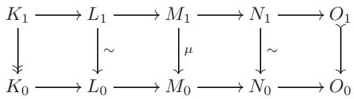

2.12. $\triangleright$ 设 $\lambda : M \to L$ ，$\nu : M \to N$ 是一个阿贝尔范畴中的态射：

$$
L \longleftarrow \lambda \longrightarrow M \longrightarrow N \ .
$$

证明 ${ 1 1 }$

$$
{ \frac { \operatorname { i m } \lambda } { \lambda ( \ker \nu ) } } \cong { \frac { \operatorname { i m } \nu } { \nu ( \ker \lambda ) } } .
$$

（提示：根据本节的考虑，可以通过使用元素来证明这一点；事实上，根据Freyd-Mitchell定理，只需在$R$-Mod中证明它即可。[§2.3, §9.3]）

2.13. 通过改进§2.3中的构造，可以证明每个小阿贝尔范畴都可以嵌入到Ab中。然而，这并不总是可能的。

确实，证明有限维 $\mathbb{R}$-向量空间的阿贝尔范畴不与Ab的任何全子范畴等价。（提示：如果它是这样，那么一维向量空间 $\mathbb{R}$ 将对应于一个阿贝尔群 $A$，使得 $\operatorname{End}_{\mathsf{Ab}}(A) \cong \operatorname{End}_{\mathbb{R}-\mathsf{Vec}}(\mathbb{R})$。但看看练习VI.1.13。）

2.14. $\neg$ 设 A 是一个阿贝尔范畴，并且 $\mathsf { A } ^ { \prime }$ 是 A 的一个全子范畴。证明 $\mathsf { A } ^ { \prime }$ 是阿贝尔的，并且包含函子 $\mathsf { A } ^ { \prime } \subseteq \mathsf { A }$ 是正合的（特别是它保持核和余核）当且仅当

• $\mathsf { A } ^ { \prime }$ 包含 A 的零对象，• $\mathsf { A } ^ { \prime }$ 在 $\bigoplus$ 下封闭，并且 $\mathsf { A } ^ { \prime }$ 在核和陪核下封闭。
[2.15, 2.17, 3.3]

2.15. $\neg$ 设 A 是一个小的阿贝尔范畴。构造一个范畴 $\mathsf { F }$，其对象为从 $\mathsf { A }$ 到 $\mathsf { A b }$ 的加性反变函子，自然变换作为其态射，并证明它是阿贝尔的。（使用习题 1.11 和 2.14。）[2.17]

2.16. $\triangleright$ 设 A, $\textsf { B }$ 是阿贝尔范畴，并且 $\mathcal { F } : \mathsf { A } \to \mathsf { B }$ 是一个忠实且正合的函子。证明它是忠实且正合的：一个序列 $X  Y  Z$ 在 A 中是正合的当且仅当相应的序列 ${ \mathcal { F } } ( X ) \to { \mathcal { F } } ( Y ) \to { \mathcal { F } } ( Z )$ 在 $\textsf { B }$ 中是正合的。[§2.4]

2.17. 将Yoneda引理（练习VIII.1.10）推广，证明每个小阿贝尔范畴A都等价于练习2.15中的范畴$\mathsf { F }$的一个全子范畴，通过一个将$\mathsf { A }$中的每个对象$X$映射到函子$h _ { X } = \operatorname { H o m } _ { \mathsf { A } } ( \_ , X )$的方式。

证明这个Yoneda嵌入是左正合的，并且在正合性的意义上“反映正合性”，即如果$X \to Y \to Z$在$\mathsf{A}$中是正合的，那么相应的序列$h_X \to h_Y \to h_Z$在$h_Y$处是正合的（也就是说，对于$\mathsf{A}$中的所有$A$，$h_X(A) \to h_Y(A) \to h_Z(A)$在$h_Y(A)$处是正合的）。

这是Freyd-Mitchell定理证明的开始。由于每个$h_X$是左正合的，Yoneda嵌入落在$\mathsf{F}$的子范畴$\mathsf{L}$中，该子范畴由左正合的加性反变函子组成。结果表明$\mathsf{L}$本身是阿贝尔的（尽管它在$\mathsf{F}$中的嵌入不是正合的；因此，习题2.14没有帮助），A在$\mathsf{L}$中的Yoneda嵌入是正合的。最后，证明$\mathsf{L}$等价于环上的模范畴（一个“忠实地投射”对象的内射环），从而得到Freyd-Mitchell定理。

## 3. 复形和同调，再次

经过所有这些初步考虑，现在是认真思考同调代数的时候了。我们将在一个固定的阿贝尔范畴 A 中工作；根据我们在 §2 中的所见，如果我们假设 A 是小范畴，我们就可以假装 A 的对象是某个环上的普通模。因此，我们将借助通常的集合论考虑来处理对象和态射(在这样做时，我将把“微小性”假设置于地毯之下。这种不精确在任何仅涉及 A 的可数多个对象的问题中都不应有害，例如构造一个图或检查一个图的交换性。我们将不处理比这更难的事情。)。直到我们接触到更难的内容，读者将几乎不会失去什么，或者根本不会失去什么，如果将 A 视为某个环 (事实上，读者甚至可以假设 R 是一个交换环；在这一章的考虑中，交换性并不起任何实质性作用。) $R$ -Mod。

我将从III.7.1中我们做了什么开始。再一次，正如我们现在所知，实际上所有事情都可以在更一般的阿贝尔范畴的设置中完成。

### 3.1. 基本定义的提醒；一般策略
一个在$\mathsf{A}$中的链复形$(M_{\bullet}, d_{\bullet})$是一个对象和态射的序列，

$$
\cdot \cdot \cdot { \xrightarrow { d _ { i + 2 } } } M _ { i + 1 } { \xrightarrow { d _ { i + 1 } } } M _ { i } { \xrightarrow { d _ { i } } } M _ { i - 1 } { \xrightarrow { d _ { i - 1 } } } \cdot \cdot \cdot
$$

使得 $( \forall i )$ ， $d _ { i } \circ d _ { i + 1 } = 0$ 。我们同样可以使用升序索引（然后传统上用上标表示），

$$
\cdots \xrightarrow { d ^ { i - 2 } } M ^ { i - 1 } \xrightarrow { d ^ { i - 1 } } M ^ { i } \xrightarrow { d ^ { i } } M ^ { i + 1 } \cdots ,
$$

并施加 $d ^ { i } \circ d ^ { i - 1 } = 0$ ，除了术语之外，数学没有变化。这是一个共链复形 $( M ^ { \bullet } , d ^ { \bullet } )$（或简写为 $M ^ { \bullet }$），由此产生同调等。复形中的映射 $d ^ { i }$ 是其微分。通常将所有可见的微分称为“ $d ^ { \prime }$”，如果需要避免混淆，则可能用复形的名称来装饰它们。因此，$d _ { M } ^ { \bullet }$ • 将隐含地表示复形 $M ^ { \bullet }$ 的微分。

是否以“同调”或“上同调”的方式工作本质上是一个美学问题，直到它被特定应用的具体背景所规定。在III.7中我选择了同调；在这一章我将选择上同调：因此，指标将是递增的上指标。设置 $M _ { i } = M ^ { - i }$ 调和了这两种约定。因此，一个链复形 $( M _ { \bullet } , d _ { \bullet } )$ 可以（并且通常）被视为上链复形 $( M ^ { - \bullet } , d ^ { - \bullet } )$ 。

条件 $d ^ { i } \circ d ^ { i - 1 } = 0$ 等价于 $\operatorname { i m } d ^ { i - 1 } \subseteq \ker d ^ { i }$。复形在 $M ^ { i }$ 处是正合的，如果 $\mathrm { i m } d ^ { i - 1 } = \ker d ^ { i }$；它是“正合的”，如果它在任何地方都是正合的。复形 $( M ^ { \bullet } , d ^ { \bullet } )$ 的第 $i$ 个同调测量它在 $M ^ { \imath }$ 处的“正合性偏差”：

$$
H ^ { i } ( M ^ { \bullet } ) : = \frac { \ker d ^ { i } } { \operatorname { i m } d ^ { i - 1 } } .
$$

若需要，通过设置 $H _ { i } ( M _ { \bullet } ) = H ^ { - i } ( M ^ { - \bullet } )$ 可得从上同调到下同调的映射。

备注 3.1. 在阿贝尔范畴中，同调的定义应按如下方式理解（参见备注 1.7）。设 $I \mathrm{im} M^{\imath}$ 是 $\mathrm{im} d^{\imath - 1}$，设 $K \mathrm{im} M^{\imath}$ 是 $\ker d^{\imath}$；由于 $M^{\bullet}$ 是一个复形，$\mathrm{im} d^{i - 1}$ 通过 $\ker d^{\imath}$，给出一个单态射 $I \mathrm{ker}$；然后 $H^{\imath} (M^{\bullet})$ 是这个同态的余核。我将使用“商”符号作为这个运算的良好缩写。L

以下定义将在本章稍后进行一些改进：

定义 3.2. (初步) 对象 $A$ 的一个解析是一个其上同调集中在 0 度且与 $A$ 同构的复形。

更精确地说，$A$ 的一个解应该包括复形与 $A$ 的同态；常见的语言滥用会忽略这一点。事实上，同态中的同态应该是由复形层面的一个同态诱导的，从给定的复形到本节后面称为 $\iota ( A )$ 的复形。准同态的概念（定义 4.3）将为我们提供讨论解的精确框架。

通常认为解 $M ^ { \bullet }$ 在上方或下方是“有界”的，也就是说，$M ^ { i } = 0$ 对于 $i > 0$ 或 $i < 0$ 。例如，一个复数

$$
\cdot \cdot \cdot { \xrightarrow { d ^ { - 3 } } } M ^ { - 2 } { \xrightarrow { d ^ { - 2 } } } M ^ { - 1 } { \xrightarrow { d ^ { - 1 } } } M ^ { 0 } { \xrightarrow { d ^ { 0 } } } 0 { \xrightarrow { } } 0 { \xrightarrow { } } 0 { \xrightarrow { } } 0 \qquad \quad \cdot \cdot
$$

如果 $\operatorname { c o k e r } d ^ { - 1 } \cong A$，则它是 $A$ 的一个解，否则该复合结构是正合的。在后面，我们将注意力限制在有界（上界或下界）的解上。从某种意义上说，这并不是一个非常严格的限制：任何解都可以截断（以改变0次项为代价）以产生一个有界解（练习3.1）。请注意，一个有上界解的数据与一个正合复合结构的数据是等价的

$$
\cdot \cdot \cdot \longrightarrow M _ { 2 } \longrightarrow M _ { 1 } \longrightarrow M _ { 0 } \longrightarrow M \longrightarrow M \longrightarrow 0 \ ;
$$

这是我们之前在 § VI.4.2 中对分解所持有的观点。

复数 $\iota ( A )$ ，

$$
\cdots { \xrightarrow { } } 0 { \xrightarrow { } } 0 { \xrightarrow { d ^ { -1 } } } A { \xrightarrow { d ^ { 0 } } } 0 { \xrightarrow { } } 0 { \xrightarrow { } } \cdots ,
$$

它是 $A$ 的一个解，但并不是一个非常有趣的解。解变得有用，如果对象 $M ^ { \imath }$ 在某种意义上是“特殊”的（通常，不应期望 $A$ 是特殊的）：例如，在环上的模的上下文中，我们可以要求对象 $M ^ { i }$ 是自由的、平坦的、投射的等等。然后我们将说这个解本身是自由的、平坦的、投射的等等。

在许多情况下，以下策略会产生有趣的不变量：


 $\mathrm { E x t }$ 和 Tor 都是这种通用攻击计划的例子：从两个 $R$ - 模 $M$ ， $N$ 开始；找到（例如）$M$ 的自由解析，并与 $N$ 张量，得到一个链复形；然后这个复形的同调计算模 $\mathrm { T o r } _ { i } ^ { R } ( M , N )$（参见 §VIII.2.4）。代数拓扑是许多其他例子的来源，事实上，历史上是推动同调代数发展的主要动机。在 20 世纪 50 年代，人们清楚地认识到这个工具在其他领域将非常有用；例如，通过亚历山大·格罗滕迪克 $^ { 1 4 }$ 和其他人的工作，它对代数几何产生了巨大影响。

现在仔细考虑这一策略。在每一个有用的应用中，实际上有许多方法可以将一个复形 与一个数学对象相关联：在上文回忆的Tor例子中，对于一个给定的模，有无穷多种不同的自由解析；事实上，我在§VIII.6.4中已经声称，使用射影模或甚至平坦模的解析将给出相同的Tor模。一般来说，在为给定的数学对象选择适当的复形时，存在巨大的自由度，而我们的主要目标之一将是证明（对于一大类有趣的例子），该复形的（上）同调将不会依赖于这一选择。

然而，好奇的读者不应止步于此。正是因为这种巨大的模糊性，从复形的数学实体到其上同调的信息差距很大。能否比“取上同调”做得更好？自然的方法是精确地确定模糊性所在，并通过这种模糊性“模除”（mod out）一个复形。无论从中得到什么，它都必须足以确定上同调；但是，通过“完全向下”到上同调，可能会丢失大量由“复形 模 模糊性”（complexes modulo ambiguity）携带的有趣信息。

这就是我们正在做的事情：证明相关复形的同调确实与选择无关，同时留意以发现关键信息真正存储在哪里。

### 3.2. 复合的分类
为了开始这个探索，我们将A中的同调复形组装成一个新分类${ \mathsf { C } } ( { \mathsf { A } } )$：

• $\mathrm { O b j } ( \mathsf C ( \mathsf A ) ) = \{ \mathrm { c o c h a i n ~ c o m p l e x e s ~ i n ~ } \mathsf A \} ;$   
• 对于 $M ^ { \bullet } = ( M ^ { \bullet } , d _ { M } ^ { \bullet } . )$ ， $N ^ { \bullet } = ( N ^ { \bullet } , d _ { N ^ { \bullet } } ^ { \bullet } )$ 链环 complexes，$\mathrm { H o m } _ { \mathsf { C } ( \mathsf { A } ) } ( M ^ { \bullet } , N ^ { \bullet } )$ 由交换 $^ { 1 5 }$ 图组成

$$
\begin{array} { r l } & { \cdots { \longrightarrow } M ^ { i - 1 } \xrightarrow { d _ { M ^ { \bullet } } ^ { i - 1 } } M ^ { i } \xrightarrow { d _ { M ^ { \bullet } } ^ { i } } M ^ { i + 1 } \longrightarrow \cdots \cdots } \\ & { \qquad \quad \alpha ^ { i - 1 } \Biggl \downarrow \qquad \alpha ^ { i } \Biggl \downarrow \qquad \alpha ^ { i + 1 } \Biggl \downarrow \qquad \quad \qquad \atop { \cdots \cdots } \cdots \cdots } \\ & { \cdots \xrightarrow { \qquad \quad \ N ^ { i - 1 } } \frac { d _ { N ^ { \bullet } } ^ { i - 1 } } { \cdots \cdots } N ^ { i } \xrightarrow { d _ { N ^ { \bullet } } ^ { i } } N ^ { i + 1 } \longrightarrow \cdots \cdots } \end{array}
$$

在A中，我将用$\alpha ^ { \bullet }$表示由集合$\alpha ^ { i }$确定的态射。为了证明${ \mathsf { C } } ( \mathsf { A } )$确实是一个范畴，所有需要检查的内容都应该是显而易见的。以下也是本质上显而易见的，但稍微有趣一些：

引理 3.3. C(A) 是一个阿贝尔范畴。

我将把这个事实的仔细验证留给读者（练习3.3）。总的来说，两个给定复形之间的同态形成一个阿贝尔群，本质上是因为如果$\alpha ^ { i }$和$\beta ^ { i } : M ^ { i } \to N ^ { i }$都是使得适当图 交换 的同态集合，那么它们的和的集合$\alpha ^ { \imath } + \beta ^ { \imath }$也是。有限积和直积在${ \mathsf { C } } ( { \mathsf { A } } )$中存在，这是因为在A中它们存在的一个简单推论。至于核和陪核，($^ *$)中每个方块的交换性和A中核和陪核的泛性质保证了存在使得更大的图成立的同态

$$
\begin{array} { r l } & { \quad K ^ { i } \xrightarrow { \quad \exists _ { M \setminus p } ^ { i + 1 } } K ^ { i + 1 } } \\ & { \quad { \mathrm { ~ k e r e a ' } } \Biggl \{ \begin{array} { l } { { \Biggl \downarrow } { \mathrm { k e r } \alpha ^ { i + 1 } } } \\ { { \Biggl \downarrow } { \mathrm { e r } \alpha ^ { i + 1 } } } \\ { { \Biggl \downarrow } { \Biggl \downarrow } { M ^ { i + 1 } } } \end{array} } \\ & { \quad \quad \alpha ^ { i } \Biggr \downarrow \xrightarrow [ ] { d _ { M \setminus p } ^ { i + 1 } } N ^ { i + 1 } \Biggr \} \Biggl \downarrow \alpha ^ { i + 1 } } \\ & { \quad \quad \times \mathrm { l e r } \alpha ^ { i } \Biggr \downarrow \Biggl \downarrow } \\ & { \quad \times \mathrm { o k e r } \alpha ^ { i } \Biggl \downarrow } \\ & { \quad \quad \quad \quad \quad \quad \quad \quad \quad \quad \quad \quad \quad \quad \quad \quad \quad \quad \quad \quad \quad \quad \quad \quad \quad \times ^ { i + 1 } } \end{array}
$$

交换。由此产生的序列 $K ^ { \bullet }$ ，${ \cal C } ^ { \bullet }$ 立即被检查为复形，并且集合 $\ker \alpha ^ { 2 } : K ^ { \imath }  M ^ { \imath }$ ，$\mathrm { c o k e r } \alpha ^ { i } : N ^ { i }  C ^ { i }$ 给出复形 $\ker \alpha ^ { \bullet }$ ，$\operatorname { c o k e r } \alpha ^ { \bullet }$ 的态射，满足 C(A) 中核和陪核的泛性质。读者将使用 A 中这种情况的事实来检查 ${ \mathsf { C } } ( \mathsf { A } )$ 中的每个单射都是核，每个满射都是陪核。

因此，我们有一种从旧范畴中构造新阿贝尔类的方法。新范畴 $\mathsf C ( A )$ 是研究 A 中对象解的研究的自然起点，并且它配备了每个阿贝尔范畴中可用的相同的一般工具包：我们可以谈论复形的正合序列，我们有复形态射的典范分解等等。复形序列

$$
\cdot \cdot \cdot \longrightarrow L ^ { \bullet } \longrightarrow M ^ { \bullet } \longrightarrow N ^ { \bullet } \longrightarrow \cdot \cdot \cdot
$$

在 ${ \mathsf { C } } ( { \mathsf { A } } )$ 中正合当且仅当所有序列

$$
\cdot \cdot \cdot \longrightarrow L ^ { i } \longrightarrow M ^ { i } \longrightarrow N ^ { i } \longrightarrow \cdot \cdot \cdot
$$

A. 复形同时是正合的。复合的复形在后面将很重要（§8.2）。

在 ${ \mathsf { C } } ( \mathsf { A } )$ 的定义中的流行变体要求复形必须是上界或下界：

• ${ \mathsf { C } } ^ { + } ( { \mathsf { A } } )$ 表示由下界有界的复形 $L ^ { \bullet }$ 确定的 ${ \mathsf { C } } ( { \mathsf { A } } )$ 的完整子范畴，即对于这些复形 $L ^ { \imath } = 0$ 对于 $i \ll 0$ 。 • ${ \mathsf { C } } ^ { - } ( { \mathsf { A } } )$ 同样表示有上界的复形的完整子范畴。

这些也是阿贝尔范畴，因此还有进一步的变化，例如 ${ \mathsf { C } } ^ { \geq 0 } ( { \mathsf { A } } )$（对于 $L ^ { i } = 0$ 的 $i ~ < ~ 0$ 的复形 $L ^ { \bullet }$），${ \mathsf { C } } ^ { \leq 0 } ( { \mathsf { A } } )$，等等。当处理解时，这些有界变体变得不可避免。

也需要考虑对象属于 A 的子范畴的复形范畴。我们将特别关注由 A 中的射影对象（见 §5.3）和单射对象组成的全子范畴 $\mathsf { P }$ 和 I；因此，${ \mathsf { C } } ^ { \leq 0 } ( { \mathsf { P } } )$ ，${ \mathsf { C } } ^ { \geq 0 } ( \mathbb { I } )$ 和同一主题的其他变体都是合理的17。在接下来的普遍性讨论中，我将仅处理 C(A)，以控制符号。读者应该没有困难地确定哪些可以立即扩展到 ${ \mathsf { C } } ( \mathsf { A } )$ 的不同变体，哪些不能。

在这个新设置中有几个函子和其他操作可用；其中许多似乎几乎太简单了以至于不值得提及。例如，对于所有整数$r$，我们有一个完全忠实、正合的函子

$$
\iota _ { r } : \mathsf { A } \longrightarrow \mathsf { C } ( \mathsf { A } )
$$

将 $\mathsf{A}$ 中的对象 $A$ 发送到复数


将 $A$ 放在 $r$ 次度，将 $0$ 放在所有其他次度上。通常通过 $\iota = \iota _ { 0 }$ 将 $\mathsf { A }$ 与其在 ${ \mathsf { C } } ( \mathsf { A } )$ 中的“像”识别。我们还有“移位”函子

$$
\begin{array} { r } { \mathsf { C } ( \mathsf { A } ) \longrightarrow \mathsf { C } ( \mathsf { A } ) , } \\ { M ^ { \bullet } \longmapsto M [ r ] ^ { \bullet } } \end{array}
$$

定义为设置 $^ { 1 8 }$ $M [ r ] ^ { \imath } = M ^ { \imath + r }$ ， $d _ { M [ r ] ^ { \bullet } } ^ { i } = ( - 1 ) ^ { r } d _ { M ^ { \bullet } } ^ { \imath + r }$ 。 复形可以通过将所有次数 $\geq r$（或 $\leq r$）的项替换为 $0$ 来“截断”。

这些操作最终被证明比它们最初看起来更为重要。相反，以下例子的重要性是显而易见的。我断言同调是一个函子：

引理 3.4。对于每个整数 $i$ ，分配

$$
H ^ { i } : M ^ { \bullet } { \longmapsto } H ^ { i } ( M ^ { \bullet } )
$$

定义了一个加性协变函子 $\mathsf C ( \mathsf A ) \to \mathsf A$。

证明。当然，该陈述意味着每个 $H ^ { i }$ 以自然（和函子）的方式诱导阿贝尔群的同态。

$$
\operatorname { H o m } _ { \mathsf { C } ( \mathsf { A } ) } ( M ^ { \bullet } , N ^ { \bullet } ) \to \operatorname { H o m } _ {  \mathsf A } ( H ^ { i } ( M ^ { \bullet } ) , H ^ { i } ( N ^ { \bullet } ) )
$$

对于所有复形 $M ^ { \bullet }$ ， $N ^ { \bullet }$ 。这源于复形态射定义中的交换性要求。查看相关部分的图：

$$
\begin{array} { c } { { M ^ { i - 1 } \xrightarrow { d ^ { i - 1 } } M ^ { i } \xrightarrow { d ^ { i } } M ^ { i } } } \\ { { \alpha ^ { i - 1 } \Biggl \downarrow } } \\ { { N ^ { i - 1 } \xrightarrow { d ^ { \prime } ^ { i - 1 } } \ N ^ { i } \xrightarrow { d ^ { \prime } ^ { i } } N ^ { i + 1 } } } \end{array}
$$

$d ^ { \prime } { } ^ { i } \circ \alpha ^ { i } = \alpha ^ { i + 1 } \circ d ^ { i }$ 的组合在 $\ker d ^ { i }$ 上为 $0$，这是由于右侧的平方的交换性，因此 $\alpha ^ { 2 }$ 在 $\ker d ^ { \imath }$ 上的限制通过 $\ker d ^ { \prime } { } ^ { \ i }$ 。与投影组合得到一个形态

$$
\ker d ^ { i } \to H ^ { i } ( N ^ { \bullet } ) .
$$

这个同态在限制到 $\mathrm { i m } d ^ { i - 1 }$ 时为 $0$，这是由于左边的方块的交换性。因此 $\alpha ^ { i }$ 诱导了一个同态

$$
H ^ { i } ( M ^ { \bullet } )  H ^ { i } ( N ^ { \bullet } )
$$

在 $\mathsf { A }$ 中，按需进行。很明显，这个赋值是协变的。

我们也可以将上同调视为一个从 ${ \mathsf { C } } (  \mathsf A )$ 到 ${ \mathsf { C } } (  \mathsf A )$ 的函子，通过将每个上同调对象 $H ^ { i } ( M ^ { \bullet } )$ 放在度数 $i$ 中，通过零态射连接，得到一个复形 $H ^ { \bullet } ( M ^ { \bullet } )$。请注意，这个复形的上同调等于 $M ^ { \bullet }$ 的上同调，即，

$$
H ^ { \bullet } ( H ^ { \bullet } ( M ^ { \bullet } ) ) = H ^ { \bullet } ( M ^ { \bullet } ) .
$$

从这个意义上来说，取上同调就像进行一个“投影”。

### 3.3. 长正合同调序列
我们在§III.7.1的任何水平上都没有深入探讨的一个事实是著名的蛇形引理，引理III.7.8，它又回到了$S 2 . 2$中让我们感兴趣。用同调的语言和$S 3 . 2$中引入的语言，蛇形引理具有以下形式。考虑一个交换图


使用正合行，并将列视为复数

$$
{ \cal L } ^ { \bullet } : \quad \cdots \longrightarrow 0 \longrightarrow { \cal L } ^ { 0 } \longrightarrow { \cal L } ^ { 1 } \longrightarrow 0 \longrightarrow \cdots ,
$$

$M ^ { \bullet }$ ，$N ^ { \bullet }$ 。交换图不过是（非常特殊）复形的一个短 正合序列的 datum：

$$
0 \longrightarrow L ^ { \bullet } \longrightarrow M ^ { \bullet } \longrightarrow N ^ { \bullet } \longrightarrow 0 \ .
$$

蛇形引理告诉我们，那么在 A 中存在一个正合序列：

$$
\begin{array} { l } { { 0 \longrightarrow H ^ { 0 } ( L ^ { \bullet } ) \longrightarrow H ^ { 0 } ( M ^ { \bullet } ) \longrightarrow H ^ { 0 } ( N ^ { \bullet } ) } } \\ { { \longrightarrow \qquad \biggr . } } \\ { { \longrightarrow H ^ { 1 } ( L ^ { \bullet } ) \longrightarrow H ^ { 1 } ( M ^ { \bullet } ) \longrightarrow H ^ { 1 } ( N ^ { \bullet } ) \longrightarrow 0 . } } \end{array}
$$

这里，$H ^ { 0 }$ ，resp. ，$H ^ { 1 }$ ，仅表示相应映射的核，resp. ，余核：这些小复形中并没有发生其他事情。'(元素论)'的“连接”同态 $\delta$ 的定义在 §III.7.3 中进行了详细讨论，可以总结如下（从同调的角度来看）：

从 $n \in H ^ { \cup } ( N ^ { \bullet } ) = \ker \nu ^ { 0 } \subseteq N ^ { \cup }$ 开始。   
• 选择 $n$ 在 $M ^ { 0 }$ 中的任意一个原像 $m$。   
将 $m$ 映射到 $\mu ^ { 0 } ( m ) \in M ^ { 1 }$。   
立刻可以看出 $\mu ^ { 0 } ( m )$ 在 $N ^ { 1 }$ 中映射到 $0$；因此它确定了一个唯一的元素 $\ell \in L ^ { 1 }$。   
• 设 $\delta ( n ) = \mathrm { t h e }$ 范畴 $\ell$ 在 $H ^ { 1 } ( L ^ { \bullet } ) = \operatorname { c o k e r } ( \lambda ^ { 0 } )$ 中的元素。

视觉上，


我们在 §III.7.3 中检查过，对于 $M ^ { 0 }$ 中的 ${ n }$ 选择不同的前像，虽然它可能会改变元素 $\ell$，但不会改变它在 $\mathrm { c o k e r } ( \lambda _ { 0 } )$ 中的像。因此 $\delta$ 是良定义的。正如我们在 §2.2 中所见，提供这个构造的箭头理论版本相对直接；但我们已经看到（定理 2.9），我们不需要这样做，所以我在接下来的内容中将坚持使用元素。

现在我们将升级这个结构，看起来是一个非常自然的发展。事实上，我们即将做的事情可以被吸收到蛇形引理本身（参见练习3.10）；但我一直觉得“展开”的追索很有说服力，所以这里它来了。取任何在${ \mathsf { C } } ( { \mathsf { A } } )$中的短 正合序列，

$$
0 \longrightarrow L ^ { \bullet } \longrightarrow M ^ { \bullet } \longrightarrow N ^ { \bullet } \longrightarrow 0 \ ,
$$

连接三个完整的同调链复形 $L ^ { \bullet }$ ， $M ^ { \bullet }$ ， $N ^ { \bullet }$ ；也就是说，考虑一个大型的交换图


在A中，其中行是正合的，列是复形。为蛇形引理构造的连接同态仍然给出一个有趣的同态

$$
\delta : \ker \nu ^ { i }  \mathrm { c o k e r } \lambda ^ { i } \cong \frac { L ^ { i + 1 } } { \mathrm { i m } \lambda ^ { i } } ,
$$

通过“爬梯子”的方式，与蛇形引理完全相同地获得：


图像 $\delta ( n )$ 真正位于哪里？它由 $L ^ { i + 1 }$ 中的一个元素 $\ell$ 表示，由 $\mu ^ { \ 2 } ( m ) \in \mathrm { i m } \mu ^ { \ 2 }$ 中的一个元素确定。$\mu ^ { 2 } ( m )$ 在 $M ^ { \imath + 2 }$ 中的像必须是 $0$ ，

因为中央列是一个复形：


因此，$\ell \in \ker \lambda ^ { \iota + 1 }$，所以我们可以在上同调中放置 $\delta ( n )$，

$$
\delta ( n ) \in { \frac { \ker \lambda ^ { i + 1 } } { \operatorname { i m } \lambda ^ { i } } } = H ^ { i + 1 } ( L ^ { \bullet } ) ,
$$

并且将 $\delta$ 视为一个态射

$$
\delta : \ker \nu ^ { i }  H ^ { i + 1 } ( L ^ { \bullet } ) .
$$

接下来，$\nu ^ { i }$ 的核包含 $\nu ^ { i - 1 }$ 的像，这同样是因为列是复形。$\delta$ 到 $\operatorname* { i m } \nu ^ { i - 1 } \cdot$ 的限制是什么？我断言它是 $0$。确实，如果 $n$ 来自 $N ^ { i - 1 }$，那么在 $M ^ { i }$ 中 $\nu ^ { i - 1 } ( n )$ 的原像可以通过在 $M ^ { \imath - 1 }$ 中取 $n$ 的原像并将其映射到 $M ^ { \tau }$ 来获得；但由于中心列是一个复形，这个原像映射到 $M ^ { i + 1 }$ 中的 $0$。因此，在这种情况下 $\delta$ 把 $\nu ^ { i - 1 }$ 映射到 0 ：


因此，$\delta$ factors through the quotient by $\mathrm { i m } \nu ^ { i - 1 }$ 。由于 $\ker \nu ^ { i } / \operatorname { i m } \nu ^ { i - 1 }$ 不过是同调 $H ^ { \imath } ( N ^ { \bullet } )$ ，我们已经得到一个同态

$$
\delta ^ { i } : H ^ { i } ( N ^ { \bullet } )  H ^ { i + 1 } ( L ^ { \bullet } ) .
$$

另一方面，每个 $H ^ { i }$ 是一个函子（引理 3.4）；因此存在自然同态

$$
H ^ { i } ( L ^ { \bullet } ) \longrightarrow H ^ { i } ( M ^ { \bullet } ) \longrightarrow H ^ { i } ( N ^ { \bullet } )
$$

对于每个 $i$。请注意，在左侧和右侧填充0并不能通常给出A中的短 正合序列（练习3.8）。换句话说，即使，正如我们将看到的，同调序列在 $H ^ { i } ( M ^ { \bullet } )$ 处是 正合的，第 $i$ 个同调不是 正合函数。理解函数 $H ^ { \tau }$ 的 exactness 和 exactness 失败，从某种意义上说，正是这次讨论的全部内容。

连同连接态射，我们在A中得到一个“长序列”的对象和态射，

$$
\cdots { \longrightarrow } H ^ { i - 1 } ( N ^ { \bullet } ) { \xrightarrow { \delta ^ { i - 1 } } } H ^ { i } ( L ^ { \bullet } ) { \longrightarrow } H ^ { i } ( M ^ { \bullet } ) { \longrightarrow } H ^ { i } ( N ^ { \bullet } ) { \xrightarrow { \delta ^ { i } } } H ^ { i + 1 } ( L ^ { \bullet } ) \longrightarrow \cdots ,
$$

推广在蛇形引理中得到的 $H ^ { 0 }$ 和 $H ^ { 1 }$ 序列。细心的读者应该一直都能预见到下一个结果：

定理 3.5（长正合同调序列）。由一个短 正合序列 of complexes 所确定的序列是一个 正合序列。

蛇形引理是这个陈述的一个特例（或者反过来，取决于你的喜好；参见练习3.10）。

证明。该证明是一个图追，每个人都应该在一生中亲自执行一次。因此，它基本上留给读者作为练习（练习3.9）。但我将强调$H ^ { i }$在多大程度上是“直接”正合的：本定理中的部分断言是，如果

$$
0 \longrightarrow L ^ { \bullet } \xrightarrow { \alpha ^ { \bullet } } M ^ { \bullet } \xrightarrow { \beta ^ { \bullet } } N ^ { \bullet } \xrightarrow { } 0
$$

如果完全一致，那么由 $H ^ { \tau }$ 的函子性诱导的序列

$$
0 \longrightarrow H ^ { i } ( L ^ { \bullet } ) \longrightarrow H ^ { i } ( M ^ { \bullet } ) \longrightarrow H ^ { i } ( N ^ { \bullet } ) \longrightarrow 0
$$

它在 $H ^ { i } ( M ^ { \bullet } )$ 上是正合的。这个序列在一般情况下在 $H ^ { i } ( L ^ { \bullet } )$ 和 $H ^ { i } ( N ^ { \bullet } )$ 上不是正合的；长正合同调序列的含义是，正合性的失败是通过连接同态精确地被其他同调对象度量的。

让我们在$H ^ { i } ( M )$上检查正合性。这个序列是复形的，因为$H ^ { i }$是一个函子；因此我们只需要验证$\ker \beta \subseteq \operatorname { i m } \alpha$。如果$\overline { { m } }$是$H ^ { i } ( M ^ { \bullet } )$中的一个类，使得$\beta ( { \overline { { m } } } ) = 0$在$H ^ { \imath } ( N )$中，$\overline { { m } }$由$\ker \mu ^ { \iota }$中的一个元素$m$表示，使得$\beta ^ { \imath } ( m ) \in \mathrm { i m } \nu ^ { \imath - 1 }$：$\beta ^ { i } ( m ) = \nu ^ { i - 1 } ( n )$对于某个$n \in N ^ { i - 1 }$。存在一个$m ^ { \prime } \in M ^ { i - 1 }$，使得$\beta ^ { i - 1 } ( m ^ { \prime } ) = n$，并且$m - \mu ^ { i - 1 } ( m ^ { \prime } )$在$H ^ { i } ( M )$中表示与$m$相同的类$\overline { { m } }$。根据图示的交换性，

$$
\beta ^ { i } ( m - \mu ^ { i - 1 } ( m ^ { \prime } ) ) = \beta ^ { i } ( m ) - \nu ^ { i - 1 } ( n ) = 0 .
$$

因此存在 $\ell \in L ^ { \tau }$ 使得 $\alpha ^ { i } ( \ell ) = m - \mu ^ { i - 1 } ( m ^ { \prime } )$；然后 $\ell$ 表示一个类 $\overline { { \ell } } \in H ^ { i } ( L ^ { \bullet } )$ 使得 $\alpha ( { \overline { { \ell } } } ) = { \overline { { m } } }$，从而完成验证。

验证其他地方的准确性同样令人不感兴趣，留给读者19。$\square$

### 3.4. 三角形
有一种美观的方式来说明我们刚刚证明的内容，这最终提供了一个有用的视角。考虑一个短 正合序列，

$$
0 \longrightarrow L ^ { \bullet } \longrightarrow M ^ { \bullet } \longrightarrow N ^ { \bullet } \longrightarrow 0 \ ;
$$

在§3.3中得到的长的正合序列中的意外元素是，在取上同调并允许位移后，我们可以以有趣的方式将 $N ^ { \bullet }$ 连接到 $L ^ { \bullet }$。好吧，如果我们愿意接受不那么有趣的结果，我们可以立即通过在 $L ^ { \bullet }$ 内将 $N ^ { \bullet }$ 映射到0来将 $N ^ { \bullet }$ 连接到 $L ^ { \bullet }$。

$$
N ^ { \bullet } \longrightarrow L ^ { \bullet } \ .
$$

原始短 正合序列的正合性，然后等效于三个更短序列中心的正合性：

$$
\begin{array} { l c r } { { N ^ { \bullet } \xrightarrow { 0 } \displaystyle { L ^ { \bullet } } \longrightarrow \large L ^ { \bullet } \xrightarrow { } M ^ { \bullet } , } } \\ { { L ^ { \bullet } \xrightarrow { } M ^ { \bullet } \qquad \longrightarrow N ^ { \bullet } , } } \\ { { M ^ { \bullet } \xrightarrow { } N ^ { \bullet } \qquad \hfill ^ { 0 } \xrightarrow { 0 } \large L ^ { \bullet } . } } \end{array}
$$

一种很好的图示方法是将序列折叠成一个三角形$^ { 2 0 }$，即，


我们理解其三个顶点完全正合：这是一个在${ \mathsf { C } } ( \mathsf { A } )$中的正合三角形。用$+ 1$标记的箭头在这种情况下仅仅是零同态；$+ 1$记录了我们将要将其视为从$N ^ { \bullet }$到$L \vert 1 \vert \cdot$的$L ^ { \bullet }$的移位（毕竟，$0$在所有度数中都是$0$）。因此，这个三角形是表示令人印象深刻的交换3D图的简称


或者（理解复形中的态射）这个单一的序列

$$
\cdots { \xrightarrow { } } N ^ { i - 1 } { \xrightarrow { \quad 0 \quad } } L ^ { i } { \xrightarrow { \quad } } M ^ { i } { \xrightarrow { \quad \quad } } N ^ { i } { \xrightarrow { \quad 0 \quad } } L ^ { i + 1 } { \xrightarrow { \quad \quad } } \cdots ,
$$

其正合度与原始复序列的正合度完全相同。在 §3.3 中，我们从这得到了另一个长正合序列。

$$
\cdots { \longrightarrow } H ^ { i - 1 } ( N ^ { \bullet } ) { \xrightarrow { \delta ^ { i - 1 } } } H ^ { i } ( L ^ { \bullet } ) { \longrightarrow } H ^ { i } ( M ^ { \bullet } ) { \longrightarrow } H ^ { i } ( N ^ { \bullet } ) { \xrightarrow { \delta ^ { i } } } H ^ { i + 1 } ( L ^ { \bullet } ) \longrightarrow \cdots ,
$$

我们将它再次折叠成一个完美的三角形：


这次标记为 $+ 1$ 的同态是有趣的连接同态（而同调复形中的同态为零；参见 §3.2 的末尾）。

因此，“长正合同调序列”将我们从一个正合三角形带到另一个正合三角形。第一个三角形来自复形的短正合序列（“连接同态”是 $0$ ），而第二个不是（连接同态通常是 nonzero）。

显然正在发生一些有趣的事情。从${ \mathsf { C } } ( { \mathsf { A } } )$中的复形短 正合序列得到的三角形似乎具有“特殊”性质，并通过同调产生其他 正合三角形。

实际上，情况可能会让读者感到有些不舒服。虽然同调三角形的两边是通过在同调函子作用于原始三角形的相应边来获得的，但第三边是通过一个不同的过程获得的，涉及连接同态。读者可能会觉得应该有一个机制，可以通过简单地应用同调函子，从一个通过正合序列定义的三角形到其同调对应物。

这确实如此。在范畴 ${ \mathsf { K } } ( { \mathsf { A } } )$ 中有一个重要的“杰出”三角形的观念，它与 ${ \mathsf { C } } ( \mathsf { A } )$ 密切相关，我们将在后面遇到 $^ { 2 1 }$ (§5)。与上面给出的“特殊”三角形一样，杰出三角形会导致同调中的长正合序列，并且以一种更直接的方式。杰出三角形满足一些公理，这些公理定义了 ${ \mathsf { K } } ( { \mathsf { A } } )$ 作为带三角范畴。在本书的范围内，深入探讨这些概念远远超出了范围，但在本章的末尾，我将尝试澄清这些最后的晦涩的评论（§9.2）。

### 习题

3.1. $\triangleright$ 设 $( M ^ { \bullet } , d ^ { \bullet } )$ 是阿贝尔范畴中对象 $A$ 的一个解析。验证存在正合链 complexes

$$
\begin{array} { l } { { \cdots \xrightarrow { d ^ { - 3 } } M ^ { - 2 } \xrightarrow { d ^ { - 2 } } M ^ { - 1 } \xrightarrow { } \mathrm { ~ \displaystyle ~ \longrightarrow ~ k e r ~ } d ^ { 0 } \xrightarrow { } { } A \xrightarrow { } 0 \xrightarrow { } 0 \xrightarrow { } \cdots \mathrm { ~ \displaystyle ~ \downarrow ~ } } } \\ { { \cdots \xrightarrow { } 0 \xrightarrow { } A \xrightarrow { } \mathrm { ~ \displaystyle ~ \longrightarrow ~ c o k e r ~ } d ^ { - 1 } \xrightarrow { } M ^ { 1 } \xrightarrow { d ^ { 1 } } M ^ { 2 } \xrightarrow { d ^ { 2 } } \cdots } } \end{array}
$$

并且在这些复形中将 $A$ 替换为 $0$ 产生了 $A$ 的新分解。[§3.1, §6.1]

3.2. $\neg$ 设 I 是一个范畴，其对象为整数，且 ${ \mathrm { H o m } } _ { \mathsf { I } } ( m , n )$ 当 $m \leq n$ 时为单元素集合，否则为空集（参见示例 I.3.2）。证明范畴 C(A) 是阿贝尔范畴 $\mathsf { A } ^ { \mathsf { I } }$ 的一个满子范畴。[3.3]

3.3. $\triangleright$ 验证在交换范畴中，§3.2中定义的共链复形的范畴C(A)本身也是一个交换范畴。（你可以手动完成，或者应用练习3.2和2.14。）[§3.2]

3.4. $\neg$ 设 A 是一个阿贝尔范畴。定义一个范畴 ${ \mathsf { S e q } } ( \mathsf { A } )$，其对象是 $\mathsf { A }$ 中的短 正合序列，其中同态是交换图


因此，${ \mathsf { S e q } } ( \mathsf { A } )$ 可以被视为 ${ \mathsf { C } } ( { \mathsf { A } } )$ 的一个完全子范畴。

• 证明 ${ \mathsf { S e q } } ( \mathsf { A } )$ 是一个加性范畴。
• 证明 ${ \mathsf { S e q } } ( \mathsf { A } )$ 有核和余核。（注意：这些与 ${ \mathsf { C } } ( \mathsf { A } )$ 中的不同。记住蛇形引理。）
• 证明对于 $\mathsf { A }$ 的每一个对象 $X$ ，

$$
\begin{array} { l l } { 0 } & { \longrightarrow 0 \longrightarrow X \xrightarrow { \mathrm { i d } _ { X } } X \longrightarrow 0 } \\ { \downarrow } & { \downarrow \mathrm { i d } _ { X } } \\ { 0 \longrightarrow X \xrightarrow { \mathrm { i d } _ { X } } X \xrightarrow { \mathrm { i d } _ { X } } 0 \longrightarrow 0 \xrightarrow { \mathrm { i d } } 0 } \end{array}
$$

在 ${ \mathsf { S e q } } ( \mathsf { A } )$ 中既是单态射又是满态射，尽管当 $X \neq 0$ 时在 ${ \mathsf { C } } ( \mathsf { A } )$ 中既不是单态射也不是满态射。

• 证明如果 $\mathsf { A }$ 有非零对象，则 ${ \mathsf { S e q } } ( \mathsf { A } )$ 不是阿贝尔群。
 [§1.3, 3.11]

3.5. $\triangleright$ 设 $( L ^ { \bullet } , d _ { L ^ { \bullet } } ^ { \bullet } )$ 是一个上链复形；通过任意改变 $d _ { L } ^ { i } \bullet$ 的符号来定义新的微分 $d _ { \ L ^ { \bullet } } ^ { \prime \bullet }$，即 ${ d ^ { \prime } } _ { L } ^ { i } \bullet = \pm d _ { L } ^ { i }$。证明 $( L ^ { \bullet } , { d ^ { \prime } } _ { L ^ { \bullet } } ^ { \bullet } )$ 是一个与 $( L ^ { \bullet } , d _ { L ^ { \bullet } } ^ { \bullet } )$ 同构的上链复形。[§3.2]

3.6. 提供一个基于箭头理论的引理 3.4 的证明（参见注释 3.1）。

3.7. 设 A, $\textsf { B }$ 是阿贝尔范畴。一个加性函子 $\mathcal { F } : \mathsf { A } \to \mathsf { B }$ 是正合的，如果它将 $\mathsf { A }$ 中的短 正合序列映射到 $\textsf { B }$ 中的短 正合序列。证明正合函子与上同调相容：如果 $\mathcal { F }$ 是正合的，且 $L ^ { \bullet }$ 是 $\mathsf { A }$ 中的一个上链复形，那么 $H ^ { \bullet } ( { \mathcal { F } } ( L ^ { \bullet } ) ) \cong { \mathcal { F } } ( H ^ { \bullet } ( L ^ { \bullet } ) )$ ，其中 $\mathcal { F } ( L ^ { \bullet } )$ 表示通过将 $\mathcal { F }$ 应用于 $L ^ { \bullet }$ 中的所有对象和态射在 $\textsf { B }$ 中得到的上链复形。

特别是，通过一个正合的函子得到的正合复形的图像仍然是一个正合复形（参见习题VIII.1.23）。

3.8. $\triangleright$ 对于任意 $i$，给出一个复形上的短 正合序列的例子

$$
0 \longrightarrow L ^ { \bullet } \longrightarrow M ^ { \bullet } \longrightarrow N ^ { \bullet } \longrightarrow 0
$$

使得序列

$$
0 \longrightarrow H ^ { i } ( L ^ { \bullet } ) \longrightarrow H ^ { i } ( M ^ { \bullet } ) \longrightarrow H ^ { i } ( N ^ { \bullet } ) \longrightarrow 0
$$

在 $H ^ { i } ( L ^ { \bullet } )$ 或 $H ^ { i } ( N ^ { \bullet } )$ 上都不正合。[§7.2]

3.9. $\triangleright$ 提供长正合同调序列的详细内容（定理3.5）。[§3.3, 3.10]

3.10. $\triangleright$ 这里有一种将练习 3.9 简化为蛇形引理的方法。

每个复形 $( L ^ { \bullet } , \lambda ^ { \bullet } )$ 确定一个复形 ker•，其中在度数 $i$ 的对象是 $^ { 2 2 }$ $\ker \lambda ^ { i + 1 }$，通过零态射连接，以及一个复形 coker•，其中在度数 $i$ 的对象是 $\mathrm { c o k e r } \lambda ^ { i - 1 }$，也通过零态射连接。

证明在复形的阿贝尔范畴中，$\lambda ^ { \bullet }$ 诱导了一个形态 ${ \overline { { \lambda } } } ^ { \bullet } : \operatorname { c o k e r } ^ { \bullet } \to \ker ^ { \bullet }$，使得 $\ker \overline { { \lambda } } ^ { \bullet } \cong H ^ { \bullet } ( L ^ { \bullet } )$ 和 $\mathrm { c o k e r } \overline { { \lambda } } ^ { \bullet } \cong H ( L ^ { \bullet } ) [ 1 ] ^ { \bullet }$。

现在作为蛇形引理的结果，推导出整个长正合同调序列。（你将使用在备注III.7.11中给出的蛇形引理版本。）[§3.3, 3.13]

3.11. $\neg$ 证明长正合同调序列是函子的，即它定义了一个从短正合序列范畴 ${ \mathsf { S e q } } ( { \mathsf { C } } ( { \mathsf { A } } ) )$（参见练习 3.4）到复形范畴的协变函子。[7.13]

3.12. 重新做练习三.7.17。

3.13. 练习3.10中的观点可以推广如下。

设 A 是一个阿贝尔范畴。定义一个新的范畴 dA，其对象是形如 $(A, d)$ 的对，其中 $A$ 是 $\mathsf{A}$ 的一个对象，$d: A \to A$ 是一个满足 $d^2 = 0$ 的态射（称为“微分”）。在 dA 中的态射 $(A, d_A) \to (B, d_B)$ 是一个态射 $\varphi: A \to B$，它与微分相容：$d_B \varphi = \varphi d_A$。

• 证明 $dA$ 是一个阿贝尔范畴。
• 对于任意 $(A, d) \in \mathrm{dA}$，证明 $d$ 诱导一个同态 ${\overline{d}} : \operatorname{coker} d \to \ker d$。
• 定义 $H(A, d)$ 为 $\ker \overline{d}$。证明 $\operatorname{coker} \overline{d} \cong H(A, d)$。
证明 $H$ 定义了一个加法函子 $\mathsf{dA} \to \mathsf{A}$，并且这个函子一般不是正合的。

• 然而，证明每个短 正合序列

$$
0 \longrightarrow ( A , d _ { A } ) \longrightarrow ( B , d _ { B } ) \longrightarrow ( C , d _ { C } ) \longrightarrow 0 \nonumber
$$

在dA中诱导一个正合三角形（在§3.4的意义下）


3.14. $\triangleright$ 证明：如果一个由短 正合序列的复形（如 §3.4 所述）产生的“特殊”三角形的某个顶点是 正合的，那么另外两个顶点的同调具有同构，可能存在一个位移。[§4.1]

3.15. $\neg$ 定义任意阿贝尔范畴 A 的“格罗滕迪克群”和“泛欧拉特征” $\chi$，按照 § VI.3.4 中给出的构造方式。

将 $\chi$ 扩展到 $\mathsf { A }$ 中所有有界上链复形 $M ^ { \bullet }$ 上，通过设置 $\chi ( M ^ { \bullet } ) : =$ $\textstyle \sum _ { i } ( - 1 ) ^ { \iota } \chi ( M ^ { \iota } )$ 。证明 $\chi ( M ^ { \bullet } ) = \chi ( H ^ { \bullet } ( M ^ { \bullet } ) )$ 。对于有界复形的短 正合序列 $0 \to L ^ { \bullet } \to M ^ { \bullet } \to N ^ { \bullet } \to 0$，证明 $\chi ( { \cal M } ^ { \bullet } ) = \chi ( { \cal L } ^ { \bullet } ) +$ $\chi ( N ^ { \bullet } )$ 。[4.3, 9.1]

## 4. 锥和同伦

如果 $\alpha ^ { \bullet } : L ^ { \bullet }  M ^ { \bullet }$ 是一个上链复形的同态，那么自然地试图描述在同调中诱导的同态：

$$
H ^ { \bullet } ( \alpha ^ { \bullet } ) : H ^ { \bullet } ( L ^ { \bullet } )  H ^ { \bullet } ( M ^ { \bullet } ) .
$$

然而，我已经指出$H ^ { \bullet }$不是一个正合的 functor，这似乎给旨在描述（例如）$H ^ { \bullet } ( \alpha ^ { \bullet } )$的核或余核的简单策略带来了障碍。长正合同调序列可以用来弥补这种正合性的缺失；我们将在§4.1中看到这一点。我们还将开始探索一个非常重要的条件（“同调”）保证两个给定的复形态射在同调中诱导相同的态射。同调将如此重要，以至于它们将导致我们后来改变复形之间的态射概念，并构造一个新的“同态复形范畴”（参见§5）。

### 4.1. 映射锥
设 $\alpha ^ { \bullet } : L ^ { \bullet } \  \ M ^ { \bullet }$ 是一个上链复形的同态。$\alpha ^ { \bullet }$ 的映射锥 $M C ( \alpha ) ^ { \bullet }$ 将允许我们在 §3.3 中构造的长正合上同调序列中，作为连接同态恢复 $H ^ { \bullet } ( \alpha ^ { \bullet } )$。事实上，映射锥将给我们一个“特殊”三角形的第三个顶点（参见 §3.4 的末尾）：


在这个地方，度增加的态射是零态射（如在§3.4中遇到的“特殊”三角形）；但是取上同调


我们将获得同态

$$
H ^ { i + 1 } ( L ^ { \bullet } ) = H ^ { i } ( L [ 1 ] ^ { \bullet } ) \longrightarrow H ^ { i + 1 } ( M ^ { \bullet } )
$$

那么，我断言，这无非是由给定的 态射 $\alpha ^ { \bullet }$ 在同调中诱导的 态射。因此，在同调中诱导的 态射 不能被扩展到短 正合序列s（那显然是要求太高），但它们可以被扩展

应用于适当的复形正合序列而产生的三角形。

顺便说，上面显示的三角形（†）（但度数递增的态射被替换为$- \alpha ^ { \bullet }$）将是§3.4中提到的“著名三角形”的原型（参见§9.2）。

映射锥的构造。$M C ( \alpha ) ^ { \bullet }$ 的对象简单地是 $L ^ { \bullet }$ 和 $M ^ { \bullet }$ 的对象的直和：

$$
M C ( \alpha ) ^ { i } : = L [ 1 ] ^ { i } \oplus M ^ { i } = L ^ { i + 1 } \oplus M ^ { i } ;
$$

但是同态 $d _ { M C ( \alpha ) ^ { \bullet } } ^ { i } : M C ( \alpha ) ^ { i }  M C ( \alpha ) ^ { i + 1 }$ 并不是“明显的”，而是

$$
d _ { M C ( \alpha ) ^ { \bullet } } ^ { i } ( \ell , m ) : = ( - d _ { L ^ { \bullet } } ^ { i + 1 } ( \ell ) , \alpha ^ { i + 1 } ( \ell ) + d _ { M ^ { \bullet } } ^ { i } ( m ) ) .
$$

第一个分量中的符号继承自 $L ^ { \bullet }$ 的偏移；因此，第一个分量仅仅是 $L \vert 1 \vert \cdot$ 的微分。第二个分量混合了 $\alpha ^ { \bullet }$ $\alpha \lfloor 1 \rfloor \cdot$ ) 和 t，使得初始分量是 $M ^ { \bullet }$ 。读者应验证 cochain complex（练习 4.1）；$d _ { M C ( \alpha ) ^ { \bullet } } ^ { i + 1 } \circ d _ { M C ( \alpha ) ^ { \bullet } } ^ { i } = 0$ $M C ( \alpha ) ^ { \bullet }$ complex’ 由双复形 确定，将在后面探索（§8.2）。

在图示上，$M C ( \alpha ) ^ { \bullet }$ 看起来是这样的：

$$
\begin{array} { r } { \cdots \xrightarrow { } L ^ { i + 1 } \xrightarrow { - d _ { L ^ { \bullet } } ^ { i + 1 } } L ^ { i + 2 } \xrightarrow { } \cdots } \\ { \cdots \xrightarrow { } M ^ { i } \xrightarrow { \qquad \otimes ^ { i + 1 } \qquad \oplus \qquad \iff \cdots } M ^ { i + 1 } \xrightarrow { \qquad } \cdots } \end{array}
$$

存在明显的复形同态 $M ^ { \bullet }  M C ( \alpha ) ^ { \bullet }$ 和 $M C ( \alpha ) ^ { \bullet }  L \vert 1 \vert ^ { \bullet }$ ，由自然同态 $M ^ { i } \longrightarrow L ^ { i + 1 } \oplus M ^ { i } \longrightarrow L ^ { i + 1 }$ 诱导。由于序列

$$
0 \longrightarrow M ^ { i } \longrightarrow L [ 1 ] ^ { i } \oplus M ^ { i } \longrightarrow L [ 1 ] ^ { i } \longrightarrow 0
$$

所有都是正合的，复形的序列

$$
0 \longrightarrow M ^ { \bullet } \longrightarrow M C ( \alpha ) ^ { \bullet } \longrightarrow L [ 1 ] ^ { \bullet } \longrightarrow 0
$$

完全正确。

命题 4.1. 存在一个正合三角形，其中连接态射 $\delta$ 是由 $\alpha ^ { \bullet }$ 在上同调中诱导的态射。


证明。三角形的存在是定理3.5的直接推论；我们只需检查连接态射确实与态射相容。

由 $\alpha ^ { \bullet }$ 引起。追踪图表


在 $H ^ { i - 1 } ( L [ 1 ] ^ { \bullet } ) = H ^ { i } ( L ^ { \bullet } )$ 中的类，由 $\ell \in L ^ { \tau }$ 表示（满足 $d _ { L } ^ { 2 } \mathbf { \sigma } _ { \mathbf { 0 } } ( \ell ) = 0$），我们发现


验证该断言。

推论 4.2. 设 $\alpha ^ { \bullet } : L ^ { \bullet }  M ^ { \bullet }$ 是共链复形的同态。那么诱导的同态 $H ^ { \bullet } ( L ^ { \bullet } )  H ^ { \bullet } ( M ^ { \bullet } )$ 是同构当且仅当映射锥 $M C ( \alpha ) ^ { \bullet }$ 是正合复形。

（参见练习3.14。）

我应该提到映射锥出现在拓扑学中：连续映射 $f : X \to Y$ 的映射锥是通过考虑 $X \times \lfloor 0 , 1 \rfloor$ ，将 $X \times 0$ 识别为一个点，并通过 $f$ 将 $X \times 1$ 缝合到 $Y$ 而得到的。分析这个空间的链会导致上述的（同调版本的）“代数”映射锥。

### 4.2. 准同构和导出范畴
我们主要策略的一个组成部分包括理解当共链复形“有充分的理由”具有相同的上同调时的情况。推论4.2为我们提供了这样的理由。在该陈述中特别指出的态射有一个名称：

定义4.3. 一个共链复形的同态$\alpha ^ { \bullet }$是一个准同构，如果它在同调中诱导出一个同构。

根据推论4.2，这个条件等价于映射锥$\alpha ^ { \bullet }$的正合性。

示例 4.4. 在阿贝尔范畴 A 中，对象 A 的一个解 $M ^ { \bullet }$ 的数据，如定义 3.2 所述，并且对于 $i > 0$ 有 $M ^ { i } = 0$，与准同构的数据相同

$$
M ^ { \bullet } { \xrightarrow { \operatorname { q - i s o . } } } \iota ( A )
$$

在 $\iota$ 中，$A$ 被置于 $0$ 度，而 $0$ 被置于所有其他度数中。这是一个相同图表的更大版本：


在只有非平凡的垂直映射是 $d _ { M } ^ { - 1 } \cdot$ 的地方

因此，准同构可以被视为更简单直观的解析的推广。此外，请注意，如示例4.4中所述的解析的映射锥（读者应该检查）是通过将复形“向左移动一步”并补充$A$来获得的，从而得到正合的复形：

$$
\cdots \xrightarrow [ ] { } M ^ { - 1 } \xrightarrow [ ] { - d _ { M ^ { \bullet } } ^ { - 1 } } M ^ { 0 } \xrightarrow [ ] { \mathrm { c o k e r } d _ { M ^ { \bullet } } ^ { - 1 } } A \xrightarrow [ ] { } 0 \xrightarrow [ ] { - 0 } \cdots .
$$

这只是我们对分解的另一种观点（如§VI.4.2所述）。

注释 4.5. 具有固定目标（或源）的准同构以自然的方式形成一个范畴，我将留给读者来正合化。特别是，在 ${ \mathsf { C } } ^ { \leq 0 } ( { \mathsf { A } } )$（或 ${ \mathsf { C } } ^ { \geq 0 } ( { \mathsf { A } } )$）中，给定对象 A 的解析（如示例 4.4 所示），形成一个范畴。

如果拟同构实际上是同构，也就是说，如果它们是可逆的，那该多好啊。一般来说，它们不是。以下例子将多次出现，以打消任何此类希望。

示例 4.6. 在 C(Ab) 中，其中 $\pi$ 是自然投影的复合映射是一个准同构，但它没有逆映射，因为没有非平凡的同态映射 $\mathbb { Z } / 2 \mathbb { Z } { \overset { ? } { \to } } \mathbb { Z }$ 。


事实上，这个例子表明“准同构”甚至不是一个等价关系（它不是对称的）。这太糟糕了——如果它是的话，那么“复形的等价类”将是最自然的候选者，用于承载复形最大量的上同调信息。

我不会定义一个“拟同构关系”：在这本书中，拟同构仅仅是共链复合态射的一种特定性质，而不是一种关系。在任何情况下，请记住，即使在集合的上下文中，通过等价关系取商也不是“主要”的研究对象：商仅仅是研究在“等价”元素上具有相同行为的其他集合的函数的自然普遍问题的解决方案。这就是主要目标。

同样地，在当前情况下，主要目标并不是一起识别所有通过准同构连接的复形，而是能够在这些复形之间来回传递信息。完成这一点的自然方法是在准同构确实有逆的环境中进行研究。更精确地说，它包括研究加性函子

$$
\mathcal { F } : \mathsf { C } ( \mathsf { A } ) \longrightarrow \mathsf { D }
$$

使得对于每个准同构 $\rho ^ { \bullet }$ ，$\mathcal { F } ( \rho ^ { \bullet } )$ 是一个同构。（同调是一个这样的 functor。）

这听起来像是另一个普遍问题，而自然的攻击方式是按照这种方式来解决它，也就是说，定义（如果可能的话）一个范畴 $\mathsf { D } ( \mathsf { A } )$，它带有加性函子 $\mathsf C ( \mathsf A ) \to \mathsf D ( \mathsf A )$，使得 ${ \mathsf { C } } ( \mathsf { A } )$ 中的准同构映射到 $\mathsf { D } ( \mathsf { A } )$ 中的同构，并且通过它，上述每个 $\mathcal { F }$ 必须唯一分解：


说实话，我们应该对这样的陈述持保留态度：我们应当提出这个普遍问题的自然环境应该是一个“类中的类”，而我们在这本书中并没有定义这样的东西。如上所述的D(A)类至少在可以执行某种“局部化”过程23时是存在的：它是A的导出范畴。$\mathsf { D } ^ { - } ( \mathsf { A } )$，$\mathsf { D } ^ { + } ( \mathsf { A } )$，以及更多，是适当有界复形对应普遍问题的解。

这些导出范畴回答了我们策略背后的主要问题，即在一个复形中“什么”决定了其上同调：答案在于将复形置于适当的导出范畴中。$\mathsf { D } ( \mathsf { A } )$ 的构造大致包括取与 ${ \mathsf { C } } ( \mathsf { A } )$ 相同的对象，并形式地反转准同构。这一构造的细节较为复杂，最好留给更高级的教材。但在幸运的情况下（当阿贝尔范畴具有“足够的单射”或“足够的项目”时；参见定义 5.7），我们将在本书中捕捉其精髓。

导出的范畴有着不幸的声誉，被认为是一个过于抽象的概念，并且存在基本的问题，即它是否真的是对同调进行抽象研究的最佳方法。这部分是因为阿贝尔范畴的导出范畴不是一个阿贝尔范畴，并且像核、陪核、短 正合序列这样的基本概念在 $\mathsf { D } ( \mathsf { A } )$ 中不可用。这给理论增加了相当大的一层复杂性。

另一方面，越过这些困难，人们发现仍然有足够的结构可以进行大量的同调代数：D(A)中的对象具有上同调，并且存在“特殊三角形”（参见§3.4），它们抽象出短 正合序列并给出长 正合上同调序列。导出范畴是一个三角范畴，就像我们即将定义的更易于管理的同伦范畴 ${ \mathsf { K } } ( { \mathsf { A } } )$。它的应用超出了代数甚至数学的范围：理解弦理论中“D-branes”的一种方法基于导出范畴。

要了解 $\mathsf { D } ( \mathsf { A } )$ 必须是多么反直觉，请注意零同态 $0 : M ^ { \bullet }  M ^ { \bullet }$ 很可能是一个拟同构：事实上，当 $M ^ { \bullet }$ 是正合时，情况正是如此。好吧，在任何上述的范畴 $\mathsf { D }$ 中（特别是 在导范畴 $\mathsf { D } ( \mathsf { A } )$ 中），这个零同态仍然是零同态，但当它是拟同构时，它配备了逆元。因此，在导范畴中，涉及非零对象的复形的零同态很可能是可以逆的！这表明在 ${ \mathsf { C } } ( \mathsf { A } )$ 中非零的复形在导范畴中可能变成零对象。

引理 4.7. 设 $\mathsf { D }$ 是一个加性范畴，并且 $\mathcal { F } : \mathsf { C } ( \mathsf { A } ) \to \mathsf { D }$ 是一个加性函子，使得对于每一个准同构 $\rho ^ { \bullet }$，$\mathcal { F } ( \rho ^ { \bullet } )$ 是一个同构。

• 设 $M ^ { \bullet }$ 是 ${ \mathsf { C } } ( { \mathsf { A } } )$ 中的一个正合复形。那么，通过对 $M ^ { \bullet }$ 的对象和态射应用 $\mathcal { F}$ 所得到的复形 $\mathcal { F } ( M ^ { \bullet } )$ 是 $\mathsf { D }$ 中的一个零对象。• 设 $\alpha ^ { \bullet } : L ^ { \bullet } \to N ^ { \bullet }$ 是 ${ \mathsf { C } } ( { \mathsf { A } } )$ 中的一个态射，它通过一个正合复形分解。

$$
\stackrel { L ^ { bullet } } { \underbrace { \longrightarrow } } \psi ^ { \bullet } \quad ,
$$

若 $M ^ { \bullet }$ 是正合的。那么 $\mathcal { F } ( \alpha ^ { \bullet } )$ 是零同态。

证明。第二个断言可以从第一个断言中得出，因为将 $\mathcal { F }$ 应用于给定的图我们得到


我们看到 $\mathcal { F } ( \alpha ^ { \bullet } )$ 通过 $\mathsf { D }$ 的零对象。

为了验证第一个断言，注意到由于 $M ^ { \bullet }$ 是正合的，零同态：$M ^ { \bullet } $ $M ^ { \bullet }$ 是一个拟同构；因此它被 $\mathcal { F }$ 映射为一个可逆同态。

$$
\mathcal { F } ( M ^ { \bullet } ) \xrightarrow { \mathcal { F } ( 0 ) } \mathcal { F } ( M ^ { \bullet } ) \xrightarrow { \mathcal { F } ( 0 ) ^ { - 1 } } \mathcal { F } ( M ^ { \bullet } )
$$

由于 $\mathcal { F }$ 是加性的，$\mathcal { F } ( 0 ) = 0$ 。由此可得 id $\mathcal { F } ( M ^ { \bullet } ) = 0$ ，因此 $\mathcal { F } ( M ^ { \bullet } )$ 是 $\mathsf { D }$ 的零对象，根据练习 1.6 。$\square$

在接下来的几节中，我将探讨导出范畴的概念，力求在特别有利的条件下对其有具体的理解。我们将假定这些范畴是存在的。这些对象的详细定义，或对三角范畴的处理，超出了本书的范围。

### 4.3. 同伦
前述考虑使我们的策略更加明确：我们追求的是确定上同调层‘在准同构意义下’的构造。然而，准同构似乎难以直接处理。因此，我们寻找更易于管理的概念，它们可能作为有效的替代方案发挥作用。

与映射锥类似，这一思路的起源也源于拓扑学：在拓扑学中，“同胚”通常是一个过于苛刻的要求，而“同伦等价”则是一个更灵活但仍足够的概念。例如，同伦等价的拓扑空间具有相同的同调。从这个概念中提炼出代数，会在复形级别上得到一个类似物。

要了解这是如何完成的，回想一下，如果 $f$ 和 ${ g }$ 是两个拓扑空间 $X$ 和 $Y$ 之间的同伦连续函数，那么 $f$ 和 $g$ 在空间的同调上诱导相同的映射。要提醒自己这是如何工作的，看看这张图：


这应该表示在 $X$ 中的链 $a$ 上 $f$ 和 $g$ 之间的同伦作用：$h(a)$ 是通过将 $a \times \lfloor 0 , 1 \rfloor$ 映射到 $Y$ 而得到的，当限制到 $a \times \{ 0 \}$ 时得到 $f(a)$，当限制到 $a \times \{ 1 \}$ 时得到 $g(a)$。注意 $h(a)$ 是比 $a$ 的维度高1维的链，并且这个链的边界 $\partial h(a)$ 由 $f(a)$、$g(a)$ 以及 $h$ 在 $a$ 的边界 $\partial a$ 上的限制组成：以“逆时针”方式取边界，

$$
 \partial h ( a ) = g(a ) - \delta _ { + } - f ( a ) + \delta _ { - } = g ( a ) - f ( a ) - h ( \partial a )
$$

（或者从图片上看是这样！正如这里所展示的，这当然最多只是一个可能性论证；它可以被严格化，但这属于别人的事情）。也就是说

$$
g ( a ) - f ( a ) = \partial h ( a ) + h ( \partial a ) .
$$

由于在同调中边界消失，$f ( a )$ 和 $g ( a )$ 在同调中将是一致的。

这里是将这个愉快的几何情况翻译成代数：

定义4.8. 两个链复形同态之间的一个同伦 $h$

$$
\alpha ^ { \bullet } , \beta ^ { \bullet } : L ^ { \bullet } \longrightarrow M ^ { \bullet }
$$

是一个态射的集合

$$
h ^ { i } : L ^ { i } \longrightarrow M ^ { i - 1 }
$$

使得 $\forall i$

$$
\beta ^ { i } - \alpha ^ { i } = d _ { M ^ { \bullet } } ^ { i - 1 } \circ h ^ { i } + h ^ { i + 1 } \circ d _ { L ^ { \bullet } } ^ { i } .
$$

我们说 $\alpha ^ { \bullet }$ 与 $\beta ^ { \bullet }$ 同伦，记作 $\alpha ^ { \bullet } \sim \beta ^ { \bullet }$，如果 $\alpha ^ { \bullet }$ 与 $\beta ^ { \bullet }$ 之间存在同伦映射。

我们这里处理的是上同调链复形；这解释了这样一个事实：虽然在上拓扑情况下（在那里我们感兴趣的是链而不是上同调）同调会提升维度，但在定义4.8中它会降低次数。

除了其拓扑动机之外，同伦并不容易可视化。以下图表不假定为可交换的：


同态 $h ^ { \ i }$ 通常不定义 $L ^ { \bullet }  M \vert - 1 \vert ^ { \bullet }$ 的复合同态：这个图中的菱形不需要交换。

定义4.9. 一个映射 $\alpha ^ { \bullet } : L ^ { \bullet }  M ^ { \bullet }$ 是一个同伦等价，如果存在一个映射 $\beta ^ { \bullet } : M ^ { \bullet }  L ^ { \bullet }$ 使得 $\alpha ^ { \bullet } \circ \beta ^ { \bullet } \sim 1 _ { M } \bullet$ • 并且 $\beta ^ { \bullet } \circ \alpha ^ { \bullet } \sim 1 _ { L ^ { \bullet } }$ 。复合 $L ^ { \bullet }$ ， $M ^ { \bullet }$ 被称为同伦等价，如果存在一个同伦等价 $L ^ { \bullet }  M ^ { \bullet }$ 。

读者应检查 $\sim$ 是一个等价关系，并且“复形的同伦等价”也是（练习4.4）。此外，这些关系显然与态射的简单运算兼容（练习4.5和4.6）。

命题 4.10. 如果 $\alpha ^ { \bullet } , \beta ^ { \bullet } : L ^ { \bullet }  M ^ { \bullet }$ 是复形的同伦态射，那么 $\alpha ^ { \bullet }$ ， $\beta ^ { \bullet }$ 在上同调上诱导相同的态射：$H ^ { \bullet } ( L ^ { \bullet } )  H ^ { \bullet } ( M ^ { \bullet } )$ .

证明。设 $\overline { { \ell } } \in H ^ { i } ( L ^ { \bullet } )$。那么 $\overline { { \ell } }$ 由 $\ker ( d _ { L } ^ { \ 2 } \bullet )$ 中的一个元素 $\ell$ 表示，并且在 $\alpha ^ { \bullet }$、$\beta ^ { \bullet }$ 诱导的 morphisms 下，其在 $H ^ { \imath } ( M ^ { \bullet } )$ 中的像由表示。

$$
\alpha ^ { i } ( \ell ) , \quad \beta ^ { i } ( \ell ) .
$$

由于 $\alpha ^ { \bullet }$ ， $\beta ^ { \bullet }$ 是同伦的，根据定义4.8，存在形态 $h ^ { \ i }$ 使得

$$
\beta ^ { i } ( \ell ) - \alpha ^ { i } ( \ell ) = d _ { M } ^ { i - 1 } ( h ^ { i } ( \ell ) ) + h ^ { i + 1 } ( d _ { L } ^ { i } \bullet ( \ell ) ) .
$$

由于 $\ell \in \ker d _ { L } ^ { \iota }$，最后一项消失。这表明

$$
\beta ^ { i } ( \ell ) - \alpha ^ { i } ( \ell ) \in \mathrm { i m } d _ { M^\bullet } ^ { i -1 } ,
$$

证明了 $\beta ^ { i } ( \ell ) - \alpha ^ { i } ( \ell )$ 在 $H ^ { i } ( M ^ { \bullet } )$ 中消失，如所需。

例如，如果 $\alpha ^ { \bullet }$ 与恒等映射同伦，那么根据推论 4.2，$\alpha ^ { \bullet }$ 的锥必须是正合的。直接验证这一事实是一个很好的练习（练习 4.8）。

推论 4.11. 同伦等价复形具有同构的上同调。

证明。确实，同态 $\alpha ^ { \bullet } : L ^ { \bullet }  M ^ { \bullet }$ ，$\beta ^ { \bullet } : M ^ { \bullet } \to L ^ { \bullet }$ 使得 $\beta ^ { \bullet } \circ \alpha ^ { \bullet }$ 和 $\alpha ^ { \bullet } \circ \beta ^ { \bullet }$ 都同伦于恒等映射，在上同调中诱导出逆同态，由命题4.10。$\square$

备注 4.12. 换句话说，复形的同伦等价是拟同构。这还没有解决拟同构不可逆的“问题”，因为例 4.6 表明，即使在同伦意义下，拟同构也可能不可逆。换句话说，“同伦等价”是一个比“拟同构”更严格的概念。研究射影/投射模复形（如 §5.3 中我们将要做的）的一个原因，恰恰是对于（有界）射影或投射模复形，拟同构和同伦等价是等价的概念。由于同伦等价是复形上的一个现成的等价关系，这将绕过将“拟同构”作为等价关系来理解所需的技术细节。

推论4.11是使§3.1中提出的方法在有趣例子类中起作用的主要技术原因。正如我们适时将看到的，在这些例子中，相关链复形的同调最终将独立于选择，因为这些选择将产生同伦复形。

另一个重要的观察是同伦等价被任何加性函子保持。假设 A, $\textsf { B }$ 是阿贝尔范畴，

$$
\mathcal { F } : \mathsf { A } \longrightarrow \mathsf { B }
$$

是一个加性函子（定义1.1）。然后$\mathcal { F }$诱导出一个保持梯度的加性函子

$$
\mathsf { C } ( \mathcal { F } ) : \mathsf { C } ( \mathsf { A } ) \longrightarrow \mathsf { C } ( \mathsf { B } ) .
$$

引理 4.13. 以 $\mathcal { F }$ 如上，如果 $\alpha ^ { \bullet } \sim \beta ^ { \bullet }$ 在 ${ \mathsf { C } } ( { \mathsf { A } } )$ 中，那么 $\mathsf { C } ( \mathcal { F } ) ( \alpha ^ { \bullet } ) \sim \mathsf { C } ( \mathcal { F } ) ( \beta ^ { \bullet } )$ 在 ${ \mathsf { C } } ( { \mathsf { B } } )$ 中，并且如果 $L ^ { \bullet }$ 和 $M ^ { \bullet }$ 是 ${ \mathsf { C } } ( { \mathsf { A } } )$ 中的同伦等价复形，那么 ${ \mathsf { C } } ( { \mathcal { F } } ) ( L ^ { \bullet } )$ 和 $\mathsf C ( \mathcal F ) ( M ^ { \bullet } )$ 是 ${ \mathsf { C } } ( { \mathsf { B } } )$ 中的同伦等价复形。

证明。第二个断言可由第一个断言推出。第一个断言是 $\mathcal { F }$ 可加性的直接推论。事实上，如果 $h$ 是 $\alpha ^ { \bullet } , \beta ^ { \bullet } : L ^ { \bullet }  M ^ { \bullet }$ 之间的一个同伦，那么

$$
\beta ^ { i } - \alpha ^ { i } = d _ { M ^ { \bullet } } ^ { i - 1 } \circ h ^ { i } + h ^ { i + 1 } \circ d _ { L ^ { \bullet } } ^ { i } .
$$

由于 $\mathcal { F }$ 保持了 Hom-集上的加法结构，这意味着

$$
\begin{array} { r } { \mathcal { F } ( \beta ^ { i } ) - \mathcal { F } ( \alpha ^ { i } ) = \mathcal { F } ( d _ { M ^ { \bullet } } ^ { i - 1 } ) \circ \mathcal { F } ( h ^ { i } ) + \mathcal { F } ( h ^ { i + 1 } ) \circ \mathcal { F } ( d _ { L ^ { \bullet } } ^ { i } ) , } \end{array}
$$

表明集合 morphisms $\mathcal { F } ( h ^ { i } )$ 给出了 $\mathcal { F } ( \alpha ^ { \bullet } )$ 和 $\mathcal { F } ( \beta ^ { \bullet } )$ 之间的一个同伦。

注意，类似的说法对于拟同构不成立（练习4.15）：加性函子不保持拟同构（而正合函子则保持）。

引理 4.13 暗示，在应用一个加性函子后，推论 4.11 的结论成立：

定理 4.14. 设 $\mathcal { F } : \mathsf { A } \to \mathsf { B }$ 是两个阿贝尔范畴之间的加性函子。如果 $L ^ { \bullet }$ ，$M ^ { \bullet }$ 是范畴 C(A) 中同伦等价的复形，那么同调复形

$$
H ^ { \bullet } ( \mathsf C ( { \mathcal F } ) ( L ^ { \bullet } ) ) , \quad H ^ { \bullet } ( \mathsf C ( \mathsf { { C } } ) ( M ^ { \bullet } ) )
$$

它们是同构的。

这个命题的证明在所有准备工作之后基本上是直接的，因此留给读者（练习4.16）。

我将这个陈述赋予定理的地位，因为它是我所追求策略的根源。定理4.14的内容是：任何将数学对象与一个同伦等价确定的链复形相关联的机制，都会产生一系列有趣的不变量：将你最喜欢的加性函子应用于任何这样的链复形，取上同调，并且定理4.14保证了结果将独立于所选择的特定链复形。这是（部分）原因在于§ VIII.2.4和§ VIII.6.4中关于Tor和Ext函子定义的各种独立性断言，正如我们将在本章后面（特别是7.6和7.7的例子）看到的那样。

### 习题

4.1. $\triangleright$ 验证一个复形态射的锥是一个复形。[§4.1]

4.2. 设 ${ \cal L } ^ { \bullet } = \cdots  0  { \cal L }  0  \cdot \cdot \cdot$ 和 $M ^ { \bullet } = \cdot \cdot \cdot  0  M  0  \cdot \cdot \cdot$ 是两个集中在度数为0的复形。给出一个同态 $\alpha ^ { \bullet } : L ^ { \bullet }  M ^ { \bullet }$ 等价于给出一个同态 $\alpha : L  M$。描述这种情况下的映射锥及其上同调。

4.3. 设 $\alpha ^ { \bullet } : L ^ { \bullet }  M ^ { \bullet }$ 是一个有界复形的态射。注意到 $\alpha$ 的映射锥 $M C ( \alpha ) ^ { \bullet }$ 也是有界的；因此，三个复形 $L ^ { \bullet }$ ， $M ^ { \bullet }$ ， $M C ( \alpha ) ^ { \bullet }$ 都有定义良好的泛欧拉特征（参见习题 3.15）。证明 $\chi ( M C ( \alpha ) ^ { \bullet } ) = \chi ( M ^ { \bullet } ) - \chi ( L ^ { \bullet } )$ 。

4.4. $\triangleright$  证明复形映射之间的同伦关系和复形之间的同伦等价关系是等价关系。[§4.3, §6]

4.5. $\triangleright$  设 $\alpha _ { k } ^ { \bullet } , \beta _ { k } ^ { \bullet } \ : \ L _ { k } ^ { \bullet } \ \to \ M _ { k } ^ { \bullet }$ ，$k = 0 , 1$ 为同调复形的态射。假设 $\alpha^\bullet _ { 0 } \sim \beta^\bullet _ { 0 }$  ，$\alpha^\bullet _ { 1 } \sim \beta^\bullet _ { 1 }$ 。证明 $\alpha^\bullet _ { 0 } \oplus \alpha^\bullet _ { 1 } \sim \beta^\bullet _ { 0 } \oplus \beta^\bullet _ { 1 }$作为态射 ${  L } _ { 0 } ^ { \bullet } \oplus {  L } _ { 1 } ^ { \bullet } \to M _ { 0 } ^ { \bullet } \oplus M _ { 1 } ^ { \bullet }$ [§4.3]

4.6. $\triangleright$ 设 $\alpha ^ { \bullet } , \alpha _ { 0 } ^ { \bullet } , \alpha _ { 1 } ^ { \bullet } : L ^ { \bullet }  M ^ { \bullet }$ 和 $\beta ^ { \bullet } , \beta _ { 0 } ^ { \bullet } , \beta _ { 1 } ^ { \bullet } : M ^ { \bullet }  N ^ { \bullet }$ 是同调复形上的态射。

(i) 假设 $\alpha ^ { \bullet } \sim 0$ 或 $\beta ^ { \bullet } \sim 0$ 。证明 $\beta ^ { \bullet } \circ \alpha ^ { \bullet } \sim 0$ 。 (ii) 假设 $\alpha _ { 0 } ^ { \bullet } \sim \alpha _ { 1 } ^ { \bullet }$ 和 $\beta _ { 0 } ^ { \bullet } \sim \beta _ { 1 } ^ { \bullet }$ 。证明 $\beta _ { 0 } ^ { \bullet } \circ \alpha _ { 0 } ^ { \bullet } \sim \beta _ { 1 } ^ { \bullet } \circ \alpha _ { 1 } ^ { \bullet }$ 。(提示：使用 (i)，同时思考理想。)

[§4.3, §5.2, §5.4, §5.5]

4.7. 证明同伦于给定映射的复形 $L ^ { \bullet }  M ^ { \bullet }$ 的同伦等价类由模复形 $L \vert 1 \vert \cdot  M ^ { \bullet }$ 的映射集合 $h ^ { \ i } : L ^ { \ i }  M ^ { \ i - 1 }$ 参数化。

4.8. $\triangleright$ 设 $\alpha ^ { \bullet }$ 是一个复形的同伦等价于恒等映射的态射。直接证明（不引用推论4.2）$\alpha ^ { \bullet }$ 的映射锥是正合的。[§4.3]

4.9. $\neg$ 设 $\alpha ^ { \bullet } : L ^ { \bullet } \to M ^ { \bullet }$ 是一个上链复形的同态。映射圆柱 $M C y l ( \alpha ) ^ { \bullet }$ 是一个上链复形，其对象在 $i$ 度为 $L ^ { i } \oplus L ^ { i + 1 } \oplus M ^ { i }$ ，微分 $d _ { M C y l ( \alpha ) } ^ { \bullet }$ 定义为。

$$
d _ { M C y l ( \alpha ) \bullet } ^ { i } ( \ell , \ell ^ { \prime } , m ) = ( d _ { L \bullet } ^ { i } ( \ell ) + \ell ^ { \prime } , - d _ { L \bullet } ^ { i + 1 } ( \ell ^ { \prime } ) , \alpha ^ { i + 1 } ( \ell ^ { \prime } ) + d _ { M \bullet } ^ { i } ( m ) ) .
$$

验证复形。[4 $d _ { M C y l ( \alpha ) } ^ { \iota + 1 } . . . ~ \partial d _ { M C y l ( \alpha ) } ^ { i } . . = 0$ 并因此得出 $M C y l ( \alpha ) ^ { \bullet }$ 确实是一个共链

从拓扑学的角度来看，连续映射 $f : X \to Y$ 的映射圆柱是通过考虑 $X \times \lfloor 0 , 1 \rfloor$ 并通过 $f$ 将 $X \times 1$ 粘贴到 $Y$ 而得到的；研究这个对象的 (co)链会导致练习 4.9 中的代数映射圆柱。

正如我们在拓扑学中学到的，两个连续映射 $X  Y$ 是同伦的，如果它们可以看作是从圆柱 $X \times \lfloor 0 , 1 \rfloor$ 到 $Y$ 的连续映射在 $X \times 0$ 和 $X \times 1$ 上的限制。请注意，这个圆柱是恒等映射的映射圆柱。 $X$

证明两个同伦层映射 $\alpha ^ { \bullet } , \beta ^ { \bullet } : L ^ { \bullet }  M ^ { \bullet }$ 在定义 4.8 的意义上同伦当且仅当它们可以延展为一个同伦层同态 $( - \alpha ^ { \bullet } , h ^ { \bullet } , \beta ^ { \bullet } ) :$ $M C y l ( \mathrm { i d } _ { L } \bullet )  M ^ { \bullet }$。

4.11. $\neg$ 在拓扑学中，映射锥可以通过将 $X \times 0$ 收缩到映射筒中的一个点来获得（参见习题 4.9 和 §4.1 中给出的映射锥的描述）。

在代数版本中，这种收缩相当于对 $M C y l ( \alpha ) ^ { \bullet }$ 的第一个分量取模。对于共链映射 $\alpha ^ { \bullet } : L ^ { \bullet }  M ^ { \bullet }$ ，证明存在一个共链复形的正合序列

$$
0 \longrightarrow L ^ { \bullet } \longrightarrow \cal M C y l ( \alpha ) ^ { \bullet } \longrightarrow \cal M C ( \alpha ) ^ { \bullet } \longrightarrow 0 \ .
$$

4.12. $\neg$ 如练习4.9中的符号（特别是，对于一个上链同态$\alpha ^ { \bullet } : L ^ { \bullet }  M ^ { \bullet }$），证明存在一个上链复形的正合序列

$$
0 \longrightarrow M ^ { \bullet } \longrightarrow { \cal M } C y l ( \alpha ) ^ { \bullet } \longrightarrow { \cal M } C ( \mathrm { i d } _ { L } \bullet ) ^ { \bullet } \longrightarrow 0 \ .
$$

推断存在一个拟同构 $M ^ { \bullet }  M C y l ( \alpha ) ^ { \bullet }$ 。 [4.13, 4.14]

4.13. $\neg$ 仍然使用练习4.9中的符号，定义映射 $\rho ^ { \bullet } : M ^ { \bullet } \to M C y l ( \alpha ) ^ { \bullet }$ 和 $\sigma ^ { \bullet } : M C y l ( \alpha ) ^ { \bullet }  M ^ { \bullet }$ 为

$$
\rho ^ { i } ( m ) = ( 0 , 0 , m ) ,
$$

$$
\sigma ^ { i } ( \ell , \ell ^ { \prime } , m ) = m - \alpha ^ { i } ( \ell ) .
$$

证明 $\rho ^ { \bullet }$ 和 $\sigma ^ { \bullet }$ 都是上链同态。注意到 $\sigma ^ { \bullet } \rho ^ { \bullet } = \mathrm { i d } _ { M } \bullet$ ，并证明 $\rho ^ { \bullet } \sigma ^ { \bullet }$ 与 $\mathrm { i d } _ { M C y l ( \alpha ) }$ 同伦。（提示：$( \ell , \ell ^ { \prime } , m ) \mapsto ( 0 , \ell , 0 )$。）

证明 $M ^ { \bullet }$ 和 $M C y l ( \alpha ) ^ { \bullet }$ 是同伦等价。这加强了习题 4.12 的结论。[4.14]

4.14. 结合练习4.11、4.12和4.13，得出结论：在同伦等价的意义下，一个上链映射$\alpha ^ { \bullet } : L ^ { \bullet }  M ^ { \bullet }$可以被单态射$L ^ { \bullet }  M C y l ( \alpha ) ^ { \bullet }$替代，该单态射在同调中诱导出相同的映射$H ^ { \bullet } ( \alpha ^ { \bullet } )$（在$H ^ { \bullet } ( M ^ { \bullet } ) \cong H ^ { \bullet } ( M C y l ( \alpha ) ^ { \bullet } )$的识别意义下），其陪集是映射锥$M C ( \alpha ) ^ { \bullet }$。

4.15. $\triangleright$ 证明一般来说，加性函子不保持拟同构。（提示：例子4.6。）证明正合函子保持拟同构。（提示：使用映射锥。）[§4.3, §6]

4.16. $\triangleright$ 证明定理4.14。[§4.3]

## 5. 同伦范畴。投射和注入的复形

我在§4中试图传达的一个信息是，准同构（根据定义！）是保持上同调的链复形态射，因此可以认为它们“捕捉了复形的上同调”，而同伦等价这一更强的概念从应用的角度来看实际上更自然。这是定理4.14的意义所在：同伦等价的复形具有相同上同调，其理由比通过准同构联系起来的复形要好得多。如果我们的一般目标是理解使所有准同构可逆的含义（即理解导出范畴D(A)），我们可以从使同伦等价可逆开始。这产生了一个新的范畴，即复形的“同伦范畴”，我们将在本节中探讨。

我们还考察了有界投射对象和注入对象复合的特权地位关于同调：对于这些复合，准同构必然是同调等价。验证这一点需要相当技术性的考虑，但在§6中为了对导出范畴获得一些理解，这是必要的。

### 5.1. 同伦映射在导出范畴中被识别
要证明这个“同伦范畴”是从 C(A) 到 D(A) 的必经之路，回到 §4.2 结尾处我们更高层次的想法。再次考虑任意加性映射

$$
\mathcal { F } : \mathsf { C } ( \mathsf { A } ) \longrightarrow \mathsf { D }
$$

将拟同构转化为同构。最简单的此类函子是上同调；普遍的一个是从${ \mathsf { C } } ( \mathsf { A } )$到神秘的导出范畴D(A)的函子。我们在命题4.10中验证了同伦映射在上同调中诱导相同的同态。这难道不是上述任何函子$\mathcal { F }$的情况吗？是的！

引理 5.1. 设 $\mathcal { F } : \mathsf { C } ( \mathsf { A } ) \longrightarrow \mathsf { D}$ 是一个加性函子，使得对于 ${ \mathsf { C } } ( \mathsf { A } )$ 中的所有准同构 $\rho ^ { \bullet }$，$\mathcal { F } ( \rho ^ { \bullet } )$ 在 $\mathsf { D}$ 中是一个同构。

设 $\alpha ^ { \bullet } , \beta ^ { \bullet } : L ^ { \bullet }  M ^ { \bullet }$ 是 ${ \mathsf { C } } ( \mathsf { A } )$ 中的同伦态射。那么 $\mathcal { F } ( \alpha ^ { \bullet } ) = \mathcal { F } ( \beta ^ { \bullet } )$ 在 D 中。

证明。等价地（因为$\mathcal { F }$是加性的），我们验证如果$\alpha ^ { \bullet } \sim 0$，那么$\mathcal { F } ( \alpha ^ { \bullet } ) = 0$。  
根据引理4.7，只需证明$\alpha ^ { \bullet }$通过一个正合复合。

这个正合的复形是身份 i $\mathrm { d } _ { L ^ { \bullet } } : L ^ { \bullet } $ $L ^ { \bullet }$ 的映射锥 $M C ( \mathrm { i d } _ { L } \bullet ) ^ { \bullet }$ 。回想（§4.1）

$$
M C ( \operatorname { i d } _ { L } \bullet ) ^ { i } = L ^ { i + 1 } \oplus L ^ { i } ,
$$

微分定义如下：

$$
\begin{array} { r } { d _ { M C ( \mathrm { i d } _ { L } \bullet ) } ^ { i } ( a , b ) = ( - d _ { L } ^ { i + 1 } ( a ) , a + d _ { L } ^ { i } \bullet ( b ) ) . } \end{array}
$$

由于同态显然是拟同构，$M C ( \mathrm { i d } _ { L ^ { \bullet } } )$ 是一个正合复合（推论4.2）。这个同态

$$
L ^ { i }  M C ( \mathrm { i d } _ { L } \bullet ) ^ { i } , \quad b \mapsto ( 0 , b )
$$

始终与微分交换，因此它定义了一个复合形态 $L ^ { \bullet } $ $M C ( \mathrm { i d } _ { L } \bullet ) ^ { \bullet }$ 。相比之下，一个形态

$$
M C ( \mathrm { i d } _ { L } \bullet ) ^ { \bullet }  M ^ { \bullet }
$$

不总是可用的。然而，根据我们的假设，存在一个同伦 $\alpha ^ { \bullet } \sim 0$ ，即形态

$$
h ^ { i } : L ^ { i } \to M ^ { i - 1 }
$$

使得 $\alpha ^ { i } = d _ { M } ^ { \imath - 1 } \circ h ^ { i } + h ^ { i + 1 } \circ d _ { L } ^ { i } $。定义映射

$$
\pi ^ { i } : M C ( \mathrm { i d } _ { L } \bullet ) ^ { i }  M ^ { i } \quad \mathrm { b y } \quad ( a , b ) \mapsto h ^ { i + 1 } ( a ) + \alpha ^ { i } ( b ) .
$$

很明显，成分

$$
L ^ { i } \to M C ( \operatorname { i d } _ { L } \bullet ) ^ { i } \to M ^ { i }
$$

是 $\alpha ^ { i }$ 。我们现在只需要检查集合 $\pi ^ { i }$ 定义了一个复合映射：这将表明 $\alpha ^ { \bullet }$ 通过正合复合 $M C ( \mathrm { i d } _ { L } \bullet ) ^ { \bullet }$ 因子分解，从而证明 $\mathcal { F } ( \alpha ^ { \bullet } ) = 0$（根据引理 4.7），从而完成这个引理的证明。也就是说，我们需要验证

$$
d _ { M ^ { \bullet } } ^ { i - 1 } \circ \pi ^ { i - 1 } = \pi ^ { i } \circ d _ { M C ( \mathrm { i d } _ { L } \bullet ) } ^ { i - 1 } .
$$

对于所有 $i$。$( ^ { * } )$ 的左侧如下：

$$
( a , b ) \mapsto h ^ { i } ( a ) + \alpha ^ { i - 1 } ( b ) \mapsto d _ { M ^ { \bullet } } ^ { i - 1 } ( h ^ { i } ( a ) + \alpha ^ { i - 1 } ( b ) ) .
$$

右侧充当

$$
( a , b ) \mapsto ( - d _ { L ^ { \bullet } } ^ { i } ( a ) , a + d _ { L ^ { \bullet } } ^ { i - 1 } ( b ) ) \mapsto - h ^ { i + 1 } ( d _ { L ^ { \bullet } } ^ { i } ( a ) ) + \alpha ^ { i } ( a + d _ { L ^ { \bullet } } ^ { i - 1 } ( b ) ) .
$$

因此所需的等式是

$$
d _ { M ^ { \bullet } } ^ { i - 1 } ( h ^ { i } ( a ) ) + d _ { M ^ { \bullet } } ^ { i - 1 } ( \alpha ^ { i - 1 } ( b ) ) = - h ^ { i + 1 } ( d _ { L ^ { \bullet } } ^ { i } ( a ) ) + \alpha ^ { i } ( a ) + \alpha ^ { i } ( d _ { L ^ { \bullet } } ^ { i - 1 } ( b ) )
$$

或者，换句话说，

$$
( d _ { M ^ { \bullet } } ^ { i - 1 } \circ h ^ { i } + h ^ { i + 1 } \circ d _ { L ^ { \bullet } } ^ { i } - \alpha ^ { i } ) ( a ) = ( \alpha ^ { i } \circ d _ { L ^ { \bullet } } ^ { i - 1 } - d _ { M ^ { \bullet } } ^ { i - 1 } \circ \alpha ^ { i - 1 } ) ( b )
$$

$\forall a \in L ^ { \iota + 1 }$ , $\forall b \in L ^ { \tau }$ . 但两边都是 0：右边是因为 $\alpha ^ { \bullet }$ 是复形的同态，左边是因为 $h$ 是同伦 $\alpha ^ { \bullet } \sim 0$ 。$\square$

引理 5.1 告诉我们，每个将拟同构映射为同构的函子都必须通过从 C(A) 得到的通过识别同伦态射得到的范畴进行分解。现在是定义这个范畴的时候了。

### 5.2. 复形同伦范畴的定义

定义 5.2. 设 $\mathsf { A }$ 是一个阿贝尔范畴。同调范畴 K(A) 是一个范畴，其对象是 $\mathsf { A }$ 中的链复形（即 ${ \mathsf { C } } ( \mathsf { A } )$ 的相同对象），其态射是

$$
\mathrm { H o m } _ { \mathsf { K } ( \mathsf { A } ) } ( L ^ { \bullet } , M ^ { \bullet } ) : = \mathrm { H o m } _ { \mathsf { C } ( \mathsf { A } ) } ( L ^ { \bullet } , M ^ { \bullet } ) / \sim
$$

其中 $\sim$ 表示同伦关系。

是的，但这是一种分类吗？回想一下同伦关系 $\sim$ 尊重复合（练习4.6）；换句话说，复合的操作

$\mathrm { H o m } _ { \mathsf { C } ( \mathsf { A } ) } ( L ^ { \bullet } , M ^ { \bullet } ) \times \mathrm { H o m } _ { \mathsf { C } ( \mathsf { A } ) } ( M ^ { \bullet } , N ^ { \bullet } ) \longrightarrow \mathrm { H o m } _ { \mathsf { C } ( \mathsf { A } ) } ( L ^ { \bullet } , N ^ { \bullet } )$ 下降到一个运算

$$
\mathrm { H o m } _ { \mathsf { K } ( \mathsf { A } ) } ( L ^ { \bullet } , M ^ { \bullet } ) \times \mathrm { H o m } _ { \mathsf { K } ( \mathsf { A } ) } ( M ^ { \bullet } , N ^ { \bullet } ) \longrightarrow \mathrm { H o m } _ { \mathsf { K } ( \mathsf { A } ) } ( L ^ { \bullet } , N ^ { \bullet } ) .
$$

检查范畴公理是常规的，留给耐心的读者。

有界变分 $\mathsf { K } ^ { - } ( \mathsf { A } )$ ，$\mathsf { K } ^ { + } ( \mathsf { A } )$ ，等等，同样可以从 ${ \mathsf { C } } ^ { - } ( { \mathsf { A } } )$ ，${ \mathsf { C } } ^ { + } ( { \mathsf { A } } )$ ，等等得到。接下来的讨论将适用于所有这些版本。进一步的变分 ${ \mathsf { K } } ^ { - } ( { \mathsf { P } } )$ ，相应地 $\mathsf { K } ^ { + } ( \mathsf { I } )$ ，在这些变分中，将要求复形由来自 A 的投影，相应地，注入的对象组成（参见 §5.3），也将起至关重要的作用。

关于同伦范畴背后的总体结构

引理 5.3. 设 A 是一个阿贝尔范畴。那么复形的同伦范畴 K(A) 是一个加性范畴。

证明。练习5.1。

然而，请注意，一般来说，同伦范畴不是阿贝尔的。实际上，同伦映射通常不具有相同的核或陪核，因此定义这些概念变得有问题。正如我在§3.4中已经提到的，K(A)是一个三角范畴；“特指的三角形”是来自态射锥的三角形，如§4.1所述。（我将在§9.2简要描述这种情况。）

引入同伦范畴的主要动机是同伦等价在 ${ \mathsf { K } } ( { \mathsf { A } } )$ 中成为同构。更精确地说，根据定义存在一个函子

$$
{ \mathsf { C } } ( { \mathsf { A } } ) \longrightarrow { \mathsf { K } } ( { \mathsf { A } } ) ,
$$

将每个对象映射到“它自身”，将每个态射映射到它的同伦类。${ \mathsf { C } } ( \mathsf { A } )$ 中的同伦等价在 ${ \mathsf { K } } ( { \mathsf { A } } )$ 中变成同构，因为关系 $\alpha ^ { \bullet } \circ \beta ^ { \bullet } \sim$ id 在 ${ \mathsf { C } } ( \mathsf { A } )$ 中变成 $\alpha ^ { \bullet } \circ \beta ^ { \bullet } = \mathrm { i d }$ 在 ${ \mathsf { K } } ( { \mathsf { A } } )$ 中。同伦范畴是从 ${ \mathsf { C } } ( \mathsf { A } )$ 通过使所有同伦等价在表面上可逆得到的。

然后我们可以将引理 5.1 重新解释为以下“分解”结果：

命题 5.4. 设 $\mathcal { F } : \mathsf { C } ( \mathsf { A } ) \longrightarrow \mathsf { D}$ 是一个加性函子，且对于 $\mathsf { C } ( \mathsf { A } )$ 中的所有准同构 $\rho ^ { \bullet }$，$\mathcal { F } ( \boldsymbol { \rho } ^ { \bullet } )$ 在 $\mathsf { D }$ 中是同构。那么 $\mathcal { F }$ 唯一地通过 K(A)：


证明。练习5.2。

特别是，必须存在一个唯一的函子从 ${ \mathsf { K } } ( { \mathsf { A } } )$ 到更精细的导出范畴 D(A)。当然，对于这些对象的所有有界版本，情况也是类似的：从适当有界复形到相应导出范畴的自然函子唯一地通过相应的同调范畴分解：


命题5.4的一个特例是${ \mathsf { C } } ( \mathsf { A } )$（分别地，${ \mathsf { C } } ^ { - } \left( { \mathsf { A } } \right)$ ，${ \mathsf { C } } ^ { + } ( { \mathsf { A } } )$）上的上同调函子下降到${ \mathsf { K } } ( { \mathsf { A } } )$（分别地，$\mathsf { K } ^ { - } ( \mathsf { A } )$ ，$\mathsf { K } ^ { + } ( \mathsf { A } )$）上的一个函子。这个事实也直接从命题4.10得出：同伦映射在上同调中诱导相同的同态。

### 5.3. 投影对象和注入对象的复形
我们现在应该问“有多远”${ \mathsf { K } } ( { \mathsf { A } } )$可能与D(A)相差。我们在${ \mathsf { K } } ( { \mathsf { A } } )$中反转了所有同伦等价，但并非所有准同构都是同伦等价：记住例子4.6。如果我们想把${ \mathsf { K } } ( { \mathsf { A } } )$看作是D(A)的第一次近似，我们应该关注那些准同构和同伦等价之间基本上没有区别的复形。

事实证明存在这样的复形：由投影对象或注入对象组成的那些。

回顾（定义 VIII.6.1）一个 $R$ -模 $M$ 是“投射”的，如果函子 ${ \mathrm { H o m } } _ { R } ( M , \underline { { \mathbf { \phi } } } )$ 是正合的，并且它是“注入”的，如果 ${ \mathrm { H o m } } _ { R } ( \underline { { \mathbf { \Pi } } } , M )$ 是正合的。我们可以在任何阿贝尔范畴中采用这些定义：

定义 5.5. 设 A 是一个阿贝尔范畴。如果函子 ${ \mathrm { H o m } } _ { \mathsf { A } } ( P , \underline { { \ l } } )$ 是正合的，对象 $P$ 是投射的。如果函子 $\mathrm { H o m } _ { \mathsf { A } } ( \mathsf { \Gamma } _ { - } , Q )$ 是正合的，对象 $Q$ 是注入的。

关于引理 VIII.6.2 或在 $S$ VIII.6.1 结尾处关于序列分裂的评论等一般性说明适用于任何阿贝尔范畴，并且一个很好的练习是收集所有此类信息并验证它们确实在这个新背景下成立。

同样请注意，在如此普遍的层面上，处理单射对象的那个部分理论与处理投射对象的那个部分理论是忠实的镜像。当然这不是巧合：交换范畴的对偶范畴仍然是交换的（练习1.10），一个范畴中的投射对象在另一个范畴中变成单射对象。因此，实际上只需要为任意交换范畴中的投射对象证明命题：相应地，对于单射对象的命题将自动成立。

这种双重情况不应被过分夸大：在一个固定的阿贝尔范畴中，投射对象和注入对象可能会表现出非常不同的特征。例如，在 § VIII.6.2 和 § VIII.6.3 中得出的特征化使用了 $R$ -Mod 范畴的特定性质，因此不应期望它们在任意的阿贝尔范畴中有简单的对应物。

我将用 P，resp.，I 表示由投影，resp.，注入对象确定的 A 的完全子范畴。当然，在任何有趣的情况下，这些都不是阿贝尔范畴。请注意，一个阿贝尔范畴可能根本没有非平凡的投影或注入对象。

示例 5.6. 有限阿贝尔群的范畴是阿贝尔的（出乎意料，出乎意料），但不包含任何非平凡的投射或注入对象（练习 5.5）。

定义 5.7. 一个阿贝尔范畴 A 如果对于 A 中的每一个对象 $A$，都存在一个在 $\mathsf { A }$ 中的投射对象 $P$ 和一个满射 $P \longrightarrow A$，则称 A 有足够的投射。该范畴如果对于 A 中的每一个对象 $A$，都存在一个在 A 中的注入对象 $Q$ 和一个单射 $A \longmapsto Q$，则称 A 有足够的注入。

这些定义对读者来说并不新鲜，因为我们已经在 § VIII.6 中遇到过它们：特别是，我们已经观察到，对于每一个交换环 $R$，$R$ -Mod 有足够的投射（这并不困难：自由模及其直和项是投射的，命题 VIII.6.4）和足够的注入（这是具有挑战性的；我们在推论 VIII.6.12 中验证了它）。

示例 5.6 表明我们不应期望阿贝尔范畴 A 具有任一性质。一个重要的例子是，在拓扑空间上的阿贝尔群层范畴中，可以证明有足够的单射；这是将层同调定义为“导出算子”的关键步骤。一般来说，层范畴不具有足够的投射。另一方面，有限生成阿贝尔群范畴具有足够的投射，但没有足够的（事实上，没有非平凡的）单射。事情就是这样。

### 5.4. 同伦等价与K(A)中的拟同构
正如我之前提到的，我们将关注由A的投影或注入对象复合而成的${ \mathsf { K } } ( { \mathsf { A } } )$的某些子范畴。

定义 5.8. 我将 ${ \mathsf { K } } ^ { - } ( { \mathsf { P } } )$ 记为 ${ \mathsf { K } } ( { \mathsf { A } } )$ 的一个完全子范畴，它由 A 的投影对象的上方有界复形组成，我将 $\mathsf { K } ^ { + } ( \mathsf { I } )$ 记为 ${ \mathsf { K } } ( { \mathsf { A } } )$ 的一个完全子范畴，它由 A 的注入对象的下方有界复形组成。

本节其余部分的主要结果是如下：

定理 5.9. 设 A 是一个阿贝尔范畴，并且 $\alpha ^ { \bullet } : \ : P _ { 0 } ^ { \bullet } \ :  \ : P _ { 1 } ^ { \bullet }$ ，resp. $\alpha ^ { \bullet } :$ $Q _ { 0 } ^ { \bullet }  Q _ { 1 } ^ { \bullet }$ ，是 A 中上界有界投射复形 resp. 下界有界Injective复形的准同构。那么 $\alpha ^ { \bullet }$ 是一个同伦等价。

推论 5.10. 在 ${ \mathsf { K } } ^ { - } ( { \mathsf { P } } )$ 和 $\mathsf { K } ^ { + } ( \mathsf { I } )$ 中，(同伦类中的)准同构是同构。

也就是说，所有有界复形之间的拟同构在${ \mathsf { K } } ^ { - } ( { \mathsf { P } } )$，$\mathsf { K } ^ { + } ( \mathsf { I } )$中已经是“反转”的。因此，这些范畴与相应的导范畴非常接近。事实上，我们将看到，如果$\mathsf { A }$有足够多的投射对象，那么$\mathsf { K } ^ { - } \left( \mathsf { P } \right)$“足以”描述$\mathsf { D } ^ { - } ( \mathsf { A } )$（在将更精确地说明的意义上）；类似地，${ \sf K } ^ { + } ( { \sf I } )$在有足够多的注入对象时充当$\mathsf { D } ^ { + } ( \mathsf { A } )$的具体实现。

定理 5.9 的证明将需要一些预备知识，这些预备知识进一步阐明了投影对象和注入对象复合在同伦中的作用。

用复形的方式来说，一个在${\mathsf{C}}({\mathsf{A}})$中的复形${N}^{\bullet}$是正合的，就是断言恒等映射id $N$ •和零映射0在同调中诱导出相同的同态，就像它们如果是同伦等价的一样。然而，很容易构造出正合复形的例子，其中恒等映射不是同伦等价于0。正如读者将验证的（练习5.11），这与复形是否分裂有关；一般来说，如果id $N$ •同伦等价于0，则称复形${N}^{\bullet}$是“分裂正合”的。考虑到投影对象或注入对象“导致”序列分裂，对于由投影对象或注入对象组成的有界正合复形，恒等映射确实同伦等价于0，这并不令人意外。

为了验证这一点，我们研究确保同态是同伦于 $0$ 的特殊条件。

引理 5.11. 设 $P ^ { \bullet }$ 是阿贝尔范畴 A 中一个投射对象复形，且 $P ^ { \imath } = 0$ 对 $i > 0$ 成立，设 $L ^ { \bullet }$ 是 C(A) 中的一个复形，且 $H ^ { \prime } ( L ^ { \bullet } ) = 0$ 对 $i < 0$ 成立。

设 $\alpha ^ { \bullet } : { \cal P } ^ { \bullet }  { \cal L } ^ { \bullet }$ 是一个诱导同调零映射的 morphism。那么 $\alpha ^ { \bullet }$ 同伦于 0。

读者将提供这个陈述的“注入”版本，处理从在正度数中是正合的复形到具有 $Q ^ { i } = 0$ 对于 $i < 0$ 的注入复形 $Q ^ { \bullet }$ 的形态。

证明。我们必须构造同态 $h ^ { i } : P ^ { i } \to L ^ { i - 1 }$ :

$$
\cdots { \xrightarrow { } } P ^ { - 2 } \left| \begin{array} { l } { { \xrightarrow { d _ { P ^ { * } } ^ { - 2 } } \cdots } } \\ { { \Biggl | } } \\ { { \Biggl \{ \underbrace { \vphantom { \int _ { 0 } ^ { - 2 } \left( \int _ { \alpha ^ { * } } ^ { h ^ { - 2 } } \cdots \int _ { L ^ { * } } \right]} \int _ { \alpha ^ { - 1 } } ^ { h ^ { - 1 } } \cdots } \left[ \begin{array} { l } { { \Biggl | h ^ { 0 } } } \\ { { \Biggl | h ^ { - 1 } } } \\ { { \Biggl \{ d _ { L ^ { * } } ^ { - 1 } \cdots } } \end{array} \right\} } \\ { { \longrightarrow } L ^ { 1 } \cdots } } \end{array}  \underbrace { - 1 } \underbrace { d _ { P ^ { * } } ^ { - 1 } } _ { L ^ { - 1 } } \cdots  \right| ^ { 0 } \cdots \left| \begin{array} { l } { { \xrightarrow [ { h ^ { 1 } } ] { 0 } \cdots } 0 } \\ { { \Biggl | h ^ { 2 } = 0 } } \\ { { \Biggl \{ \vphantom { \int _ { 0 } ^ { - 2 } \left( \int _ { \alpha ^ { * } } ^ { h ^ { - 1 } } \cdots \right)}  } \cdots }  \\ { { \cdots \left\{ \vphantom { \int _ { 0 } ^ { - 2 } \left( \int _ { \alpha ^ { * } } ^ { h ^ { - 1 } } \cdots \right) } \cdots \right\} } L ^ { - 1 } \xrightarrow [ { \cdots } ] { } L ^ { - 1 } \cdots } \right. \cdots L ^ { 1 } . \end{array}
$$

使得

$$
\alpha ^ { i } = d _ { L ^ { \bullet } } ^ { i - 1 } \circ h ^ { i } + h ^ { i + 1 } \circ d _ { P ^ { \bullet } } ^ { i } .
$$

当然 $h ^ { i } = 0$ 必然对于 $i > 0$ 。对于 $i = 0$ ，使用 $\alpha ^ { \bullet }$ 在上同调上诱导的 morphism 是 $0$ 这个事实；这表明 $\alpha ^ { 0 }$ 通过 $d _ { L ^ { \bullet } } ^ { - 1 }$ 的像因子化：

$$
\begin{array} { c } { { P ^ { 0 } } } \\ { { { } } } \\ { { L ^ { - 1 } \xrightarrow { d _ { L ^ { \bullet } } ^ { - 1 } } \operatorname * { i n } d _ { L ^ { \bullet } } ^ { - 1 } { \longrightarrow } 0 } } \end{array}
$$

由于 $P ^ { 0 }$ 是射影的，存在一个同态 $h ^ { 0 } : P ^ { 0 } \to L ^ { - 1 }$ 使得 $\alpha ^ { 0 } =$ $d _ { L ^ { \bullet } } ^ { - 1 } \circ h ^ { 0 }$ ，如所需。

为了定义 $h ^ { i - 1 }$ 对于 $i \ \leq \ 0$ ，使用归纳法进行推导，并假设 $h ^ { i }$ 和 $h ^ { i + 1 }$ 已经满足 ($^ *$) 条件被构造。注意，根据 ($^ *$) （以及 $P ^ { \bullet }$ 是一个复形的事实）

$$
d _ { L ^ { \bullet } } ^ { i - 1 } \circ h ^ { i } \circ d _ { P ^ { \bullet } } ^ { i - 1 } = ( \alpha ^ { i } - h ^ { i + 1 } \circ d _ { P ^ { \bullet } } ^ { i } ) \circ d _ { P ^ { \bullet } } ^ { i - 1 } = \alpha ^ { i } \circ d _ { P ^ { \bullet } } ^ { i - 1 } - h ^ { i + 1 } \circ 0 = \alpha ^ { i } \circ d _ { P ^ { \bullet } } ^ { i - 1 } :
$$

$$
\begin{array} { r l } & { \xrightarrow [ \cdots , \cdots , \cdots ] - P ^ { i - 1 } \xrightarrow [ \hphantom { \displaystyle \frac { h ^ { i } } { \tilde { P } ^ { i } } ] { \tilde { P } ^ { i } } } P ^ { i } \xrightarrow [ \hphantom { \displaystyle \frac { h ^ { i + 1 } } { \tilde { P } ^ { i } } ] { \tilde { P } ^ { i } } } P ^ { i + 1 } . . . . . . . . . . . . . . . . . . . . . . . . . . . } \\ & { \xrightarrow [ \hphantom { \displaystyle \frac { h ^ { i } } { \tilde { P } ^ { i } } ] { \tilde { P } ^ { i } } } [ \underbrace { h ^ { i } } _ { \Delta ^ { i } } ] \xrightarrow [ \hphantom { \displaystyle \frac { h ^ { i + 1 } } { \tilde { P } ^ { i } } ] { \tilde { P } ^ { i + 1 } } } [ \underbrace { h ^ { i } } _ { \tilde { \tau } ^ { \prime } } \xrightarrow [ \hphantom { \displaystyle \frac { h ^ { i + 1 } } { \tilde { P } ^ { i } } ] { \tilde { P } ^ { i } } } ] } \\ &  \xrightarrow [ \hphantom { \displaystyle \Bigg \frac { h ^ { i } } { \tilde { P } ^ { i } } ] { \tilde { P } ^ { i - 1 } } } [ \underbrace { \tilde { \tilde { P } } _ { \Delta ^ { i } } ^ { i - 1 } } _ { \Delta ^ { i } \bullet } \underbrace { \small [ \tilde { \tilde { P } } ^ { i } ] { \tilde { P } ^ { i } } } _  [ \begin{array} { c } { \small { \Bigg . . . . . . . . . . . . . . . . . . . . . . . . . . . . . . . . . . . . . . . . . . . . . . . . . . . . . . . . . . . . . . . . . . . . . . . . . . . . . . . . . . . . . . . . . . . . . . . . . . . . . . . . . . . } } \end{array} \end{array}
$$

因此

$$
d _ { L ^ { \bullet } } ^ { i - 1 } \circ ( \alpha ^ { i - 1 } - h ^ { i } \circ d _ { P ^ { \bullet } } ^ { i - 1 } ) = d _ { L ^ { \bullet } } ^ { i - 1 } \circ \alpha ^ { i - 1 } - \alpha ^ { i } \circ d _ { P ^ { \bullet } } ^ { i - 1 } = 0 ,
$$

由于 α• 是同调复形的一个同态。这告诉我们 αi−1 − hi ◦ di−1P • 通过 $\ker d _ { L ^ { \bullet } } ^ { i - 1 }$ 。由于 $L ^ { \bullet }$ 在 $L ^ { i - 1 }$ 处对于 $i \leq 0$ 是正合的，$\ker d _ { L ^ { \bullet } } ^ { i - 1 } = \operatorname { i m } d _ { L ^ { \bullet } } ^ { i - 2 }$ 1 = im di−2L• 。因此，我们再次有一个分解

$$
\begin{array} { c } { { P ^ { i - 1 } } } \\ { { \nonumber } } \\ { { L ^ { i - 2 } \xrightarrow { d _ { L ^ { \bullet } } ^ { i - 2 } } \mathrm { i m } d _ { L ^ { \bullet } } ^ { i - 1 } \mathrm { - } h ^ { i } \circ d _ { P ^ { \bullet } } ^ { i - 1 } } } \\ { { L ^ { i - 2 } \xrightarrow { d _ { L ^ { \bullet } } ^ { i - 2 } } \mathrm { i m } d _ { L ^ { \bullet } } ^ { i - 2 } \xrightarrow { d } 0 } } \end{array}
$$

现在 $P ^ { i - 1 }$ 是射影的；因此存在 $h ^ { i - 1 } : P ^ { i - 1 } \to L ^ { i - 2 }$ 使得

$$
\alpha ^ { i - 1 } - h ^ { i } \circ d _ { P ^ { \bullet } } ^ { i - 1 } = d _ { L ^ { \bullet } } ^ { i - 2 } \circ h ^ { i - 1 } ,
$$

这正是我们需要用于归纳步骤的。

推论 5.12. 设 $P ^ { \bullet }$ 是阿贝尔范畴 A 的投影上界链复形，设 $L ^ { \bullet }$ 是 ${ \mathsf { C } } ( \mathsf { A } )$ 中的正合链复形。

那么每个复合 $P ^ { \bullet }  { \cal L } ^ { \bullet }$ 的同态都同伦于 0。

这直接来自（一个无害的平移的）引理 5.11，因为到正合复形的每一个同态都不得不在上同调中诱导零同态。

引理5.12的“单射”版本是，从正合复形 $L ^ { \bullet }$ 到有下界复形 $Q ^ { \bullet }$ 的单射映射必然同伦等价于0。

请注意，在这些考虑中，复形 $P ^ { \bullet }$ ， $Q ^ { \bullet }$ 必须存在于“有界”版本 ${ \mathsf { C } } ^ { - } ( { \mathsf { P } } )$ ， ${ \mathsf { C } } ^ { + } ( ! )$ 中：所有对象应该在足够高或足够低的度中消失。这为引理 5.11 的同调归纳构造的“开始”提供了基础。这是该理论的一个本质上无法逃避的特征。

推论 5.13. 设 $P ^ { \bullet }$（或 $Q ^ { \bullet }$）是上界有限的投射（或下界有限的注入）的正合复形。那么 $P ^ { \bullet }$（或 $Q ^ { \bullet }$）同伦等价于零复形。

证明。练习5.12。

推论 5.13 是原则的第一个体现，该原则在定理 5.9 中得到更全面的描述：我们刚刚验证了，对于适当有界的投射或注入的复形，'准同构于 $0$ ' 与 '同伦等价于 $0$ ' 是相同的。

引理 5.11 的另一个推论是如下注释，表明准同构在从投影复形到映射的角度上是“非零因子”，直到同调。这在下一节中将很有用，例如，为了证明某些提升在同调上是唯一定义的。

引理 5.14. 设 A 是一个阿贝尔范畴，并且 $\rho ^ { \bullet } : L ^ { \bullet } \to M ^ { \bullet }$ 是 ${ \mathsf { C } } ( \mathsf { A } )$ 中的一个准同构。设 $P ^ { \bullet }$ 是一个上界有限的投射复形，并且 $\alpha ^ { \bullet } : P ^ { \bullet } \to L ^ { \bullet }$ 是一个链复形的同态，使得复合

$$
\begin{array} { r } { P ^ { \bullet } \xrightarrow { \alpha ^ { \bullet } } L ^ { \bullet } \xrightarrow { \rho ^ { \bullet } } M ^ { \bullet } } \end{array}
$$

与零同伦。那么 $\alpha ^ { \bullet } \sim 0$ 。

证明。设 $h ^ { i } : P ^ { i } \to M ^ { i - 1 }$ 定义了 $\rho ^ { \bullet } \circ \alpha ^ { \bullet }$ 和 $0$ 之间的一个同伦，使得 $- \rho ^ { i } \circ \alpha ^ { i } = d _ { M } ^ { \iota - 1 } \circ h ^ { i } + h ^ { i + 1 } \circ d _ { P } ^ { i } \bullet$。考虑 $\rho ^ { \bullet }$ 的映射锥 $M C ( \rho ) ^ { \bullet }$（§4.1），并定义同态

$$
\beta ^ { i } = ( \alpha ^ { i } , h ^ { i } ) : P ^ { i }  L ^ { i } \oplus M ^ { i - 1 } = M C ( \rho ) ^ { i - 1 } :
$$

$$
\begin{array} { r l } & { \cdots \xrightarrow [ ] { } P ^ { i - 1 } \xrightarrow [ ] { d _ { P ^ { * } } ^ { i - 1 } } { \cdots } P ^ { i } \xrightarrow [ ] { d _ { P ^ { * } } ^ { i } } \cdots \xrightarrow [ ] { d _ { P ^ { * } } ^ { i } } P ^ { i + 1 } \xrightarrow [ ] { } P ^ { i + 1 } } \\ & { \cdots \xrightarrow [ ] { \beta ^ { i - 1 } } \mathbb { d } ^ { i - 2 } \xrightarrow [ ] { - d _ { M C ( P ) ^ { * } } ^ { i - 2 } } L ^ { i } \oplus M ^ { i - 1 } \xrightarrow [ ] { - d _ { M C ( P ) ^ { * } } ^ { i - 1 } } L ^ { i + 1 } \oplus M ^ { i } \xrightarrow [ ] { } \cdots } \end{array}
$$

我断言这些给出了共链复形的同态 $P ^ { \bullet }  M C ( \rho ) \lfloor - 1 \rfloor ^ { \bullet }$ 。确实24，

$$
\begin{array} { r l } & { \quad \beta ^ { i + 1 } \circ d _ { P } ^ { i } \bullet = ( \alpha ^ { i + 1 } \circ d _ { P } ^ { i } \bullet , h ^ { i + 1 } \circ d _ { P } ^ { i } \bullet ) \quad \mathrm { a n d } } \\ & { - d _ { M C ( \rho ) } ^ { i - 1 } \circ \beta ^ { i } = ( d _ { L } ^ { i } \bullet \circ \alpha ^ { i } , - \rho ^ { i } \circ \alpha ^ { i } - d _ { M } ^ { i - 1 } \circ h ^ { i } ) ; } \end{array}
$$

根据 $h ^ { \ i }$ 的定义，并且由于 $\alpha ^ { \bullet }$ 是复形的一个同态，这些是相等的。

现在，$\rho ^ { \bullet }$ 是一个拟同构，根据假设。因此 $M C ( \rho ) ^ { \bullet }$ 是一个正合链复形（推论4.2）。应用推论5.12，可以得出 $\beta ^ { \bullet }$ 同伦于零。但是 $\alpha ^ { \bullet }$ 是一个复合

$$
P ^ { \bullet } \xrightarrow { \beta ^ { \bullet } } M C ( \rho ) [ - 1 ] ^ { \bullet } = L ^ { \bullet } \oplus M [ - 1 ] ^ { \bullet } \xrightarrow { } L ^ { \bullet } \ ,
$$

所以（练习4.6，第（i）部分），$\beta ^ { \bullet } \sim 0$ 的事实意味着 $\alpha ^ { \bullet } \sim 0$ ，从而完成证明。$\square$

示例 5.15. 要看到 $\alpha ^ { \bullet }$ 即使在鼻子上的情况下也可能不为零，请再次查看示例 4.6：


这里 $\rho ^ { \bullet }$ 是一个拟同构，并且 $\rho ^ { \bullet } \circ \alpha ^ { \bullet } = 0$。根据引理 5.14，(非零) 同态 $\alpha ^ { \bullet }$ 同伦于 0。(实际上，一个同伦立刻可见。是什么?)

5.5. 定理 5.9 的证明。定理 5.9 将从一个更一般的观察中得出：到一个投射复形的拟同构，resp. 从一个注入复形 $2 5$ ，有一个右，resp. 左，同伦逆。

命题 5.16. 设 A 是一个阿贝尔范畴，并且 $L ^ { \bullet }$ 是 ${ \mathsf { C } } ( \mathsf { A } )$ 中的一个复形。设 $P ^ { \bullet }$ 在 ${ \mathsf { C } } ^ { - } \left( { \mathsf { P } } \right)$ 中是一个上界有界的投射复形，并且 $\alpha ^ { \bullet } : L ^ { \bullet }  P ^ { \bullet }$ 是一个准同构。那么存在一个复形的同态 $\beta ^ { \bullet } : P ^ { \bullet } \to L ^ { \bullet }$ 使得 $\alpha ^ { \bullet } \circ \beta ^ { \bullet }$ 与 $i d _ { P }$ 同伦。

（对于单射版本，如果 $Q ^ { \bullet }$ 是一个有下界的单射复形，并且 $\alpha ^ { \bullet } : Q ^ { \bullet }  L ^ { \bullet }$ 是一个拟同构，那么存在一个同态 $\beta ^ { \bullet } : L ^ { \bullet }  Q ^ { \bullet }$ 使得 $\beta ^ { \bullet } \circ \alpha ^ { \bullet } \sim \mathrm { i d } _ { Q ^ { \bullet } }$ 。）

证明。由于 $\alpha ^ { \bullet } : L ^ { \bullet }  P ^ { \bullet }$ 是一个拟同构，$\alpha$ 的映射锥 $M C ( \alpha ) ^ { \bullet }$ 是一个正合链复形（推论4.2）。设 $\rho ^ { \bullet }$ 是复形的态射。

$$
\rho ^ { \bullet } = ( 0 , \mathrm { i d } _ { P } \bullet ) : P ^ { \bullet }  L [ 1 ] ^ { \bullet } \oplus P ^ { \bullet } = M C ( \alpha ) ^ { \bullet } .
$$

由于 $M C ( \alpha ) ^ { \bullet }$ 是正合的，根据推论 5.12，$\rho ^ { \bullet }$ 与零同伦。因此，存在形态

$$
\hat { h } ^ { i } \quad : \quad P ^ { i }  M C ( \alpha ) ^ { i - 1 } = L ^ { i } \oplus P ^ { i - 1 }
$$

使得

$$
\rho ^ { i } = d _ { M C ( \alpha ) ^ { \bullet } } ^ { i - 1 } \circ \hat { h } ^ { i } + \hat { h } ^ { i + 1 } \circ d _ { P ^ { \bullet } } ^ { i } :
$$


现在我们来解开这说明了什么。写出 $\hat { h } ^ { i }$ 的分量：

$$
\hat { h } ^ { i } = ( \beta ^ { i } , h ^ { i } )
$$

以 $\beta ^ { i } : P ^ { i } \to L ^ { i }$ 和 $h ^ { i } : P ^ { i } \to P ^ { i - 1 }$ 。我断言

(i) 集合 $\{ \beta ^ { i } \}$ 是一个共链复形的同态：$\beta ^ { i + 1 } \circ d _ { P } ^ { i } \bullet = d _ { L } ^ { i } \bullet \circ \beta ^ { i }$ 对所有 $i$ 成立，   
(ii) 同态 $h ^ { i }$ 给出同伦 $\alpha ^ { \bullet } \circ \beta ^ { \bullet } \sim \mathrm { i d } _ { P }$。

确实，$( ^ { * } )$ 的左侧是

$$
\rho ^ { i } = ( 0 , \mathrm { i d } _ { P ^ { i } } ) ;
$$

右侧是

$$
\begin{array} { r l } & { d _ { M C ( \alpha ) ^ { \bullet } } ^ { i - 1 } \circ ( \beta ^ { i } , h ^ { i } ) + ( \beta ^ { i + 1 } , h ^ { i + 1 } ) \circ d _ { P ^ { \bullet } } ^ { i } } \\ & { \qquad = ( - d _ { L ^ { \bullet } } ^ { i } \circ \beta ^ { i } , \alpha ^ { i } \circ \beta ^ { i } + d _ { P ^ { \bullet } } ^ { i - 1 } \circ h ^ { i } ) + ( \beta ^ { i + 1 } \circ d _ { P ^ { \bullet } } ^ { i } , h ^ { i + 1 } \circ d _ { P ^ { \bullet } } ^ { i } ) . } \end{array}
$$

因此，$( ^ { * } )$ 等于

$$
\left\{ \begin{array} { l l } { \beta ^ { i + 1 } \circ d _ { P } ^ { i } \bullet - d _ { L ^ { \bullet } } ^ { i } \circ \beta ^ { i } = 0 , } \\ { \qquad \mathrm { i d } _ { P ^ { i } } - \alpha ^ { i } \circ \beta ^ { i } = d _ { P ^ { \bullet } } ^ { i - 1 } \circ h ^ { i } + h ^ { i + 1 } \circ d _ { P ^ { \bullet } } ^ { i } , } \end{array} \right.
$$

也就是说，正是（i）和（ii）。

复合映射 $\beta ^ { \bullet } : P ^ { \bullet } \to L ^ { \bullet }$ 是 $\alpha ^ { \bullet }$ 所需的同伦右逆元。$\square$

将$L ^ { \bullet }$视为一个适当有界的投射或注入的复形最终确立了定理5.9：

定理 5.9 的证明。我们将给出射影空间的论证。

根据命题5.16，由于 $P _ { 1 } ^ { \bullet }$ 在 ${ \mathsf { C } } ^ { - } \left( { \mathsf { P } } \right)$ 中，并且 $\alpha ^ { \bullet } : \ : P _ { 0 } ^ { \bullet } \ :  \ : P _ { 1 } ^ { \bullet }$ 是一个准同构，存在一个复形映射 $\beta ^ { \bullet } : P _ { 1 } ^ { \bullet } \to P _ { 0 } ^ { \bullet }$，使得

$$
\alpha ^ { \bullet } \circ \beta ^ { \bullet } \sim \mathrm { i d } _ { P _ { 1 } ^ { \bullet } } .
$$

这意味着 $H ^ { \bullet } ( \alpha ^ { \bullet } ) \circ H ^ { \bullet } ( \beta ^ { \bullet } ) = \mathrm { i d }$（命题4.10）。由于 $H ^ { \bullet } ( \alpha ^ { \bullet } )$ 是可逆的，因此 $H ^ { \bullet } ( \beta ^ { \bullet } )$ 也是可逆的：因此，$\beta ^ { \bullet }$ 是一个拟同构。现在 $P _ { 0 } ^ { \bullet }$ 也属于 ${ \mathsf { C } } ^ { - } \left( { \mathsf { P } } \right)$；因此根据命题5.16，存在一个复形映射 $\alpha ^ { \bullet \prime } : { \cal P } _ { 0 } ^ { \bullet }  { \cal P } _ { 1 } ^ { \bullet }$ 使得 $\beta ^ { \bullet } \circ \alpha ^ { \bullet \prime } \sim \mathrm { i d } _ { P _ { 0 } ^ { \bullet } }$。由于

$$
\alpha ^ { \bullet \prime } \sim ( \alpha ^ { \bullet } \circ \beta ^ { \bullet } ) \circ \alpha ^ { \bullet \prime } = \alpha ^ { \bullet } \circ ( \beta ^ { \bullet } \circ \alpha ^ { \bullet \prime } ) \sim \alpha ^ { \bullet } ;
$$

(练习4.6)，因此 $\beta ^ { \bullet } \circ \alpha ^ { \bullet } \sim \mathrm { i d } _ { P _ { 0 } ^ { \bullet } }$ 。因此 $\alpha ^ { \bullet }$ 是一个同伦等价，正如所陈述的。

### 习题

5.1. $\triangleright$ 证明阿贝尔范畴 A 的同伦范畴 K(A), $\mathsf { K } ^ { - } ( \mathsf { A } )$ , $\mathsf { K } ^ { + } ( \mathsf { A } )$ 是加性的。[§5.2]

5.2. $\triangleright$ 证明命题 5.4。 [§5.2]

5.3. 在任何范畴中，给出“投射”对象和“嵌入”对象的合理定义，并证明根据你的定义，在集合范畴（Set）中每个集合都是投射的也是嵌入的。

5.4. $\triangleright$ 将练习 VIII.6.4 和 VIII.6.15 升级为任意阿贝尔范畴的对象。[5.9, 6.3, §7.4]

5.5. $\triangleright$ 设 $F ^ { \prime }$ 是一个非平凡的有限阿贝尔群。证明存在有限阿贝尔群的正合序列

$$
0  A _ { 1 }  A _ { 2 }  F  0 , \quad 0  F  B _ { 1 }  B _ { 2 }  0
$$

哪些不分开。

推断有限阿贝尔群的范畴没有非平凡的投射或注入对象。[§5.3]

5.6. $\triangleright$ 设 A, $\textsf { B }$ 是阿贝尔范畴，且 $\mathcal { F } : \mathsf { A } \to \mathsf { B }$ , $\mathcal { G } : \mathsf { B } \to \mathsf { A }$ 是加性函子。假设 $\mathcal { F }$ 是 $\mathcal { G }$ 的左伴随函子，并且 $\mathcal { G }$ 保留上同态。证明如果 $P$ 是 A 中的投射对象，那么 $\mathcal { F } ( P )$ 是 $\textsf { B }$ 中的投射对象。对注入对象给出类似的结果。[5.8, §7.1]

5.7. $\neg$ 设 A 是一个阿贝尔范畴，并且 $\mathsf { C }$ 是一个小范畴。假设 A 包含所有由任意集合索引的积26；例如，$R$ -Mod 对每个环 $R$ 都满足此条件。对于 A 的一个对象 $A$ 和一个集合 $S$ ，用 $A ^ { S }$ 表示由 $S$ 索引的 $A$ 的积。注意任意集合映射 $S  T$ 决定了 A 中的一个 morphism $A ^ { T }  A ^ { S }$。

对于 $\mathsf { C }$ 的任何对象 $X$ ，我们将定义一个函子 $\widehat { \mathcal { X } } : \mathsf { A }  \mathsf { A } ^ { \mathsf { C } }$ ；在练习 1.11 中定义了一个更简单直接的函子 $\mathcal { X } : \mathsf { A } ^ { \mathsf { C } }  \mathsf { A }$ 。

对于 $\mathsf { A }$ 的每一个对象 $A$ ，${ \widehat { \mathcal { X } } } ( A )$ 必须是 $\mathsf { A } ^ { \mathsf { C } }$ 的一个对象，即一个从 $\mathsf C$ 到 $\mathsf A$ 的函子。这个函子在 $\mathsf { C }$ 的对象 $Y$ 处的值被规定为

$$
{ \widehat { \mathcal { X } } } ( A ) Y : = A ^ { \operatorname { Hom_{\mathsf{C}} } ( Y , X ) } .
$$

$\mathsf{C}$ 中的每个同态 $Y  Z$ 都确定一个函数 $\operatorname{Hom}_{\mathsf{C}}(Z , X) \to \operatorname{Hom}_{\mathsf{C}}(Y , X)$ ，并且这定义了一个同态 ${\widehat{\mathcal{X}}}(A) Y \to {\widehat{\mathcal{X}}}(A) Z$ 。

• 证明这个规定将 ${ \widehat { \mathcal { X } } } ( A )$ 定义为从 $\mathsf C$ 到 $\mathsf A$ 的函子。
• 证明 $\mathcal { \bar { X } }$ 是一个从 $\mathsf { A }$ 到 $\mathsf { A } ^ { \mathsf { C } }$ 的函子，具有明显的对态的作用。
• 证明 $\mathcal { \bar { X } }$ 是 $\mathcal { X }$ 的右伴随。

(Hint: 您需要识别 $\mathrm { H o m } _ { \mathsf { A } ^ { \mathsf { C } } } ( { \mathcal { F } } , { \widehat { \mathcal { X } } } ( A ) )$ 与 ${ \mathrm { H o m } } _ { \mathsf { A } } ( { \mathcal { F } } ( X ) , A )$ 。给定一个自然变换 $\alpha : { \mathcal { F } }  { \widehat { \mathcal { X } } } ( A )$ ，在 $X$ 处求值并提取恒等分量，以获得一个形态 ${ \mathcal { F } } ( X ) \to A$ 。然后证明这些信息足以确定整个自然变换。) [5.8, 5.9]

5.8. $\neg$ 如练习5.7所述，设$\mathsf { C }$是一个小范畴，设$\mathsf { A }$是一个包含所有以集合索引的积的阿贝尔范畴。证明算子$\widehat { \mathcal { X } }$对所有$\mathsf { C }$的对象$X$都保持单射：如果$Q$是$\mathsf { A }$中的一个单射对象，那么${ \widehat { \mathcal { X } } } ( Q )$在$\mathsf { A } ^ { \mathrm { C } }$中是单射的。（提示：练习5.6。）[5.9]

5.9. $\neg$ 设 C 是一个小的范畴，并且 $\mathsf { A }$ 是一个包含所有以集合索引的积的阿贝尔范畴。假设 $\mathsf { A }$ 有足够的单射。设 $\mathcal { F } : \mathsf { C } \to \mathsf { A }$ 是一个函子。对于 $\mathsf { C }$ 的每一个对象 $X$，设 $Q _ { X }$ 是 $\mathsf { A }$ 的一个单射对象，并且存在一个单态射 ${ \mathcal { F } } ( X ) { \longmapsto } Q _ { X }$。

• 使用练习 5.7 中的符号，令 $\begin{array} { r } { \mathcal { Q } : = \prod _ { X \in \mathrm { O b j } ( \mathsf { C } ) } \widehat { \mathcal { X } } ( Q _ { X } ) } \end{array}$（证明这个积在 $\mathsf { A } ^ { \subset }$ 中存在）。   
• 证明 $\mathcal { L }$ 在 $\mathsf { A } ^ { \mathrm { C } }$ 中是单射的。（练习 5.4 和 5.8。）   
• 定义一个同态 $\mathcal { F }  \mathcal { L }$ ，并证明它是单态射。（使用对偶性。）

因此，我们可以得出结论，如果 $\mathsf { A }$ 是一个具有足够多单射的阿贝尔范畴，并且 $\mathsf { A }$ 对由集合索引的积是封闭的，那么 $\mathsf { A } ^ { \mathrm { C } }$ 有足够多单射。

证明如果 $\mathsf { A }$ 是一个具有足够投射对象的阿贝尔范畴，并且 $\mathsf { A }$ 对于由集合索引的直和是封闭的，那么 $\mathsf { A } ^ { \mathsf { C } }$ 具有足够投射对象。(提示：$( \mathsf { A } ^ { \mathsf { C } } ) ^ { o p } \cong ( \mathsf { A } ^ { o p } ) ^ { ( \mathsf { C } ^ { o p } ) }$ 。) [5.10]

5.10. 证明在拓扑空间上的阿贝尔群预覆盖范畴有足够的单射对象和足够的投影对象27。（使用练习5.9。）

5.11. $\triangleright$ 设 $N ^ { \bullet }$ 是复数

$$
\cdot \cdot \cdot { \longrightarrow } 0 \longrightarrow K \longrightarrow M \longrightarrow N \longrightarrow 0 \longrightarrow \cdots .
$$

证明 $N ^ { \bullet }$ 是正合的并且在某种意义上分裂（类似于在 $S$ III.7.2 中对模给出的定义），当且仅当 $\mathrm { i d } _ { N }$ • 同伦于 0（参见命题 III.7.5）。由此推出每个加性函子将分裂正合序列映射到分裂正合序列。

更一般地，设 $N ^ { \bullet }$ 是任意一个复形。证明 id $N$ • 与 $0$ 同伦（即 $N ^ { \bullet }$ 是 §5.4 中定义的“分裂正合”）当且仅当 $N ^ { \bullet }$ 同构于形式为

$$
\cdots \xrightarrow { d ^ { - 3 } } M ^ { - 2 } \oplus M ^ { - 1 } \xrightarrow { d ^ { - 2 } } M ^ { - 1 } \oplus M ^ { 0 } \xrightarrow { d ^ { - 1 } } M ^ { 0 } \oplus M ^ { 1 } \xrightarrow { d ^ { 0 } } M ^ { 1 } \oplus M ^ { 2 } \xrightarrow { d ^ { 1 } } \cdots
$$

在 $M ^ { \imath }$ 因子上，$d ^ { \imath }$ 为 $0$，在 $M ^ { \iota + 1 }$ 因子上为 $( \mathrm { i d } _ { M ^ { i + 1 } } , 0 )$。[§5.4, 6.3, §7.4]

5.12. $\triangleright$ 证明每个上界有界的投射复合是同伦等价于零。证明每个下界有界的注入复合是同伦等价于零。[§5.4]

5.13. 设 $\mathsf { A }$ 是一个阿贝尔范畴，并且 $\alpha ^ { \bullet } : L ^ { \bullet }  M ^ { \bullet }$ 是 ${ \mathsf { C } } ( { \mathsf { A } } )$ 中的一个准同构。假设 $\beta ^ { \bullet }$ 是 $\alpha ^ { \bullet }$ 的一个同伦单侧逆元。证明 $\beta ^ { \bullet }$ 也是一个准同构。

5.14. $\neg$ 设 $P _ { 0 } ^ { \bullet }$ ， $P _ { 1 } ^ { \bullet }$ 是阿贝尔范畴 $A$ 中投影对象的有界上复形。(如果有助于理解，你可以假设 $\mathsf { A }$ 有足够的投影。) 设 $L ^ { \bullet }$ 是 ${ \mathsf { C } } ( { \mathsf { A } } )$ 中的一个(不一定有界)复形。

假设存在准同构


证明 $P _ { 0 } ^ { \bullet }$ 和 $P _ { 1 } ^ { \bullet }$ 是同伦等价。

• 假设存在准同构

$$
\begin{array} { c c c } { { P _ { 0 } ^ { \bullet } } } & { { \mathrm { ~ } } } & { { P _ { 1 } ^ { \bullet } } } \\ { { \mathrm { ~ } } } & { { \mathrm { ~ } } } & { { \mathrm { ~ } } } \\ { { \mathrm { q ^ { - i s o . } } } } & { { \mathrm { ~ } } } & { { \mathrm { ~ z ^ { < ~ q - i s o . } ~ } } } \end{array}
$$

证明 $P _ { 0 } ^ { \bullet }$ 和 $P _ { 1 } ^ { \bullet }$ 是同伦等价的。（这可能会有挑战。如果是这样，请等到你学完 §6，特别是定理 6.6。）

## 6. 射影和入射解析和导出范畴

定理 5.9 是一个好消息。它告诉我们，如果我们愿意并且有能力改变我们的观点，并采用投射或注入的有界复形作为我们的自然环境，那么我们将能够很好地掌握准同构的微妙概念：因为在那个环境中，准同构变成了同伦等价，而同伦等价比任意的准同构表现得更好。例如，复的同伦等价显然是一个等价关系（练习 4.4），而准同构则不是（参见例 4.6 后面的讨论）。此外，同伦等价被每个加性函子保留（定理 4.14），而一般的准同构则不是（练习 4.15）。

因此，问题在于如何切换到同伦环境，并将投射或注入的复形作为我们的主要研究对象，同时保持$\mathsf { A }$的对象或甚至C(A)中的复形所携带的基本信息完整无损。

如果 A 具有足够多的射出映射或足够多的单射映射，那么这是可以做到的；在这种情况下，我们将能够给出导出范畴的充分描述（§6.3）。

### 6.1. 恢复 A. 
再次回忆，在 C(A) 中，可以通过将 A 中的每个对象 $A$ 与具有 0 度 $A$ 和其他地方为 0 的复形 $\iota ( A )$ 相关联，来获得一个“副本”的阿贝尔范畴 $\mathsf { A }$。与算子 $\mathsf C ( \mathsf A ) \to \mathsf K ( \mathsf A )$ 组合，将 A 实现为 ${ \mathsf { K } } ( { \mathsf { A } } )$ 的一个全子范畴（练习 6.1）。我们将寻找同调范畴中“更有趣”的 $\mathsf { A }$ 的副本。

让我们从回忆（并精炼）对象 $A$ 的射影/单射解析的定义开始。

定义 6.1. 设 $A$ 是阿贝尔范畴 $A$ 的一个对象。

$A$ 的投影解析是一个准同构 $P ^ { \bullet } \to \iota ( A )$ ，其中 $P ^ { \bullet }$ 是 ${ \mathsf { C } } ^ { \leq 0 } ( { \mathsf { P } } )$ 中的一个复形。

一个 $A$ 的单射解析是一个准同构 $\iota ( A ) \to Q ^ { \bullet }$ ，其中 $Q ^ { \bullet }$ 是 ${ \mathsf { C } } ^ { \geq 0 } ( \mathsf { I } )$ 中的一个复形。 L

由于语言的普遍滥用，我将经常将 $P ^ { \bullet }$ 或 $Q ^ { \bullet }$ 称为解析，而准同构则被理解为。

备注 6.2. 术语可能令人困惑，因为它暗示着这些分解本身可能是作为阿贝尔范畴 ${ \mathsf { C } } ( \mathsf { A } )$ 的对象或其有界变差的投影/嵌入。情况并非如此（练习 6.3）。

投射或注入解析不一定存在：正如我所指出的（示例5.6），一个阿贝尔范畴可能没有非平凡的投射或注入对象。然而很清楚，如果范畴有足够的投射/注入，那么这样的解析存在：如果$\mathsf { A }$有足够的投射，那么对于$\mathsf { A }$的任意对象$A$，存在一个投射$P ^ { 0 }$和一个满射$\pi : P ^ { 0 } \to A$；然后存在一个投射$P ^ { - 1 }$和一个满射$d ^ { - 1 } : P ^ { - 1 } \to \ker \pi$；然后存在一个投射$P ^ { - 2 }$和一个满射$d ^ { - 2 } : P ^ { - 2 } \to \ker d ^ { - 1 }$；等等。令$d _ { P } ^ { \imath }$ •是复合$P ^ { i } { \longrightarrow } \mathrm { k e r } d ^ { i + 1 } { \longmapsto } P ^ { i + 1 }$，给出

$$
\cdots { \xrightarrow { } } P ^ { - 2 } { \xrightarrow { d _ { P ^ { \bullet } } ^ { - 2 } } } P ^ { - 1 } { \xrightarrow { d _ { P ^ { \bullet } } ^ { - 1 } } } P ^ { 0 } { \xrightarrow { } } 0 { \xrightarrow { } } \cdots ,
$$

一个 $A$ 的投影解析。同样明显地，如果 $\mathsf { A }$ 有足够的单射，那么每个对象 $A$ 都有一个单射解析。

现在考虑以 $\iota ( A )$ 为目标点的准同构的同调类（参见备注 4.5）：这是一个 $A$ 的“同调解类”。我断言，如果存在，投影解是此类中的始对象。（类似地，在以 $\iota ( A )$ 为源点的准同构的同调类中，注入解是终对象。）

众所周知，这意味着投影解应该唯一地（在${ \mathsf { K } } ( { \mathsf { A } } )$）映射到$A$的每个解。以下的关键引理证明了这一点，并更多：

引理 6.3. 设 $A$ 是阿贝尔范畴 $A$ 中的一个对象。设 $M ^ { \bullet }$ 是 $A$ 的一个解析，设 $P ^ { \bullet }$ 是 ${ \mathsf { C } } ^ { \leq 0 } ( { \mathsf { P } } )$ 中的任意一个复合。设

$$
\varphi : H ^ { 0 } ( P ^ { \bullet } )  H ^ { 0 } ( M ^ { \bullet } ) = A
$$

成为一个任意的同态。然后

• 存在复形同态 $\alpha ^ { \bullet } : { \cal P } ^ { \bullet }  { \cal M } ^ { \bullet }$ 在 $H ^ { 0 }$ 层诱导 $\varphi$；   
• 满足前述要求的同态必然是同伦等价的。

当然，对于${\mathsf{C}}^{\geq 0}(\mathbb{I})$中的复形$Q^{\bullet}$，也有一个类似的陈述，给出同调复形$M^{\bullet} \xrightarrow{Q^{\bullet}}$的同态，它们在$H^{0}$中诱导出给定的同态。

证明。我们必须为所有 $i$ 定义 $\alpha ^ { i } : P ^ { i } \to M ^ { i }$。由于 $\alpha ^ { i } = 0$ 必然对 $i > 0$ 成立，我们可以将 $M ^ { \bullet }$ 替换为其截断版本（参见习题 3.1），然后按照如下方式扩张 $P ^ { \bullet }$ 和这个复形：

$$
\begin{array} { r l } & { \cdots { \longrightarrow } P _ { \stackrel {  \{ \begin{array} { l } { \frac { d } { \sum } \frac { d _ { P ^ { * } } ^ { - 2 } } { \sum } \} } } ^ { - 2 } \frac { d _ { P ^ { * } } ^ { - 2 } } { \{ \begin{array} { l l l } { \frac { d _ { P ^ { * } } ^ { - 1 } } { \sum } } & { \stackrel {  \{ \begin{array} { l l l } { - 1 } & { \pi ^ { 0 } } \end{array}  } } { \sum } P ^ { 0 } \frac { \pi } { \{ \begin{array} { l l l } { \pi ^ { * } } & { \pi ^ { 0 } } \end{array}  } \kern - delimiterspace } \frac { 0 } { \sum } ( P ^ { * } ) } \overrightarrow {  \begin{array} { l l l } { \pi ^ { 0 } } & { \longrightarrow } 0 \\ { \frac { \{ } } { \sum } \alpha ^ { - 2 } \begin{array} { l l } { \frac { d _ { P ^ { * } } ^ { - 1 } } { \sum } \end{array}  } } & { \stackrel {  \{ \begin{array} { l l l } { \frac { d _ { P ^ { * } } ^ { - 1 } } { \sum } \alpha ^ { - 2 } \pi ^ { 2 } } \end{array}  } } \\ { \cdots \longrightarrow M ^ { - 2 } \frac { d _ { M ^ { * } } ^ { - 2 } } { \sum } M ^ { - 1 } \frac { d _ { M ^ { * } } ^ { - 1 } } { \longrightarrow } \ker d _ { M ^ { * } } ^ { 0 } \bullet \overrightarrow { \longrightarrow } H ^ { 0 } ( M ^ { * } ) = A \longrightarrow 0 } \end{array}  } \end{array} \end{array} \end{array}
$$

请注意，底部的复形是正合的。同态 $\varphi$ 已给出，任务是定义带点的提升 $\alpha ^ { \ i }$ ，$i ~ \leq ~ 0$ ，以便得到一个复形的同态。

现在，$P ^ { 0 }$ 是射影的，并且通过 $\varphi \circ \pi$ 映射到 $A$；这保证了 $\varphi$ 的提升 $\alpha ^ { 0 }$ 的存在。(到原始复形的0次项 $M ^ { 0 }$ 的映射 $P ^ { 0 } \to M ^ { 0 }$ 是通过 $\ker d _ { M } ^ { 0 } \bullet \longmapsto M ^ { 0 }$ 获得的。) 接下来，注意到

$$
\mu \circ \alpha ^ { 0 } \circ d _ { P } ^ { - 1 } = \varphi \circ \pi \circ d _ { P } ^ { - 1 } = 0 ;
$$

因此，$\alpha ^ { 0 } \circ d _ { P } ^ { - 1 } $ 通过 $\ker \mu$ 。由于低层复形是正合的，$\ker \mu =$ $\operatorname* { i m } d _ { M ^ { \bullet } } ^ { - 1 }$ 。因此，我们有图表

$$
\begin{array} { c } { { P ^ { - 1 } } } \\ { { \nonumber } } \\ { { M ^ { - 1 } \xrightarrow { d _ { M ^ { \bullet } } ^ { - 1 } } \mathrm { i m } d _ { M ^ { \bullet } } ^ { - 1 } \xrightarrow { } 0 } } \end{array}
$$

并且存在一个提升 $\alpha ^ { - 1}$，因为 $P ^ { - 1}$ 是射影的。

其他 $\alpha ^ { - \ i }$ ，$i > 1$ 的构建是归纳地以完全相同的方式进行，每一步都使用底层的复形是正合的这个事实。

这证明了 $\alpha ^ { \bullet } : { \cal P } ^ { \bullet }  { \cal M } ^ { \bullet }$ 的存在。它的同伦唯一性直接由引理 5.11 推出。$\square$

总结来说，如果A包含足够的投影对象，那么A中的每个对象$A$都存在一个投影解析，并且这个解析在所有以$\iota(A)$为目标的解析中是初始的。如果$\mathsf{A}$有足够的注入对象，那么A中的每个对象$A$都存在一个注入解析，并且这个解析在所有以$\iota(A)$为源的解析中是最终的。

回想一下，一个范畴的始对象、分别地、终对象总是同构意义下唯一的（命题 I.5.4）。在这里，这意味着以下内容：

命题 6.4. 交换范畴中对象 A 的任意两个投影（分别，注入）解析是同伦等价的。

（这也是引理 6.3 的直接推论。）

从这些考虑中，我得出的道德是，如果一个阿贝尔范畴 A 有足够的（比如说）投射对象，那么我们可以为 $\mathsf { A }$ 的每个对象 $A$ 关联一个 ${ \mathsf { K } } ^ { \leq 0 } ( { \mathsf { P } } )$ 的对象，这个对象在同伦意义下是确定的。事实上，这可以 functorially 完成，即 A 中的同态可以提升到相应投射解析的同态：

命题 6.5. 设 $A _ { 0 }$ ， $A _ { 1 }$ 是阿贝尔范畴 A 中的对象，且 $P _ { i } ^ { \bullet }$ 是 $A _ { i }$ 的投射解析，$i = 0 , 1$ 。那么 $\mathsf { A }$ 中的每一个同态 $\varphi : A _ { 0 }  A _ { 1 }$ 都是由同态 $\alpha ^ { \bullet } : { \cal P } _ { 0 } ^ { \bullet }  { \cal P } _ { 1 } ^ { \bullet }$ 诱导的，并且在同伦意义下是唯一确定的。

当然，对于单射解析也有类似的说法。

证明。根据假设，$\varphi$ 是一个同态 $H ^ { 0 } ( P _ { 0 } ^ { \bullet } )  H ^ { 0 } ( P _ { 1 } ^ { \bullet } )$。复合 $P _ { 0 } ^ { \bullet }$ 由投影组成，$P _ { 1 } ^ { \bullet }$ 是 $A _ { 1 }$ 的一个解析；因此存在提升 $\alpha ^ { \bullet }$，并且在同伦意义下是唯一的，这是 Lemma 6.3 的直接推论。$\square$

命题 6.5 提供的赋值显然是协变的。关键在于，$\mathsf{A}$ 中由（例如）投射解析的对象组成的部分与 ${\mathsf{K}}^{-}({\mathsf{P}})$ 的一个全子范畴等价。亲爱的读者，请形式化这一断言，因为它是一个关键点（练习 6.2）。如果 $\mathsf{A}$ 有足够的投射，这将给出在 ${\mathsf{K}}^{-}({\mathsf{P}})$ 中所承诺的“副本” $\mathsf{A}$。

当然，关于由允许具有单射解析的对象组成的 A 的子范畴和 $\mathsf { K } ^ { + } ( \mathsf { I } )$ 的情况是完全类似的。

### 6.2. 从对象到复形
假设一个阿贝尔范畴A有足够多的投射对象。此时我们希望（练习6.2）同意（即，同伦范畴$\mathsf { K } ^ { - } ( \mathsf { P } )$包含一个完全子范畴，它与A等价：即A的对象的（同伦）投射解范畴。虽然一开始A的每个对象对应于多个投射解，但它们都是同伦等价的（根据命题6.4），因此在${ \mathsf { K } } ^ { - } ( { \mathsf { P } } )$中同构；A中的态射精确地对应于投射解之间的态射的同伦类（根据命题6.5），因此对应于${ \mathsf { K } } ^ { - } ( { \mathsf { P } } )$中的态射。

在实践中，这意味着我们可以使用${ \mathsf { K } } ^ { - } ( { \mathsf { P } } )$的这一子范畴作为原始阿贝尔范畴A的替代品。我们非常接近实现识别同调等价复形上同调算子‘本质’的目标：由于同调等价的复形具有相同的同调（根据定理4.14），并且加性函子保持同调等价，$\mathsf { K } ^ { - } ( \mathsf { P } )$的对象是同调不变量的理想载体：虽然将加性函子应用于$\mathsf { A }$的对象通常会破坏同调信息，但将‘相同的函子’应用于${ \mathsf { K } } ^ { - } ( { \mathsf { P } } )$中的相应对象会保留这些信息。

在下一节中，我们将遵循这一线索；在第VIII章中遇到的函子 $\mathrm { [ o r } _ { i }$ 和 $\mathrm { E x t } ^ { i }$ 将会以这种方式出现，并将作为我们的派生函子的范例。

当然，如果 $\mathsf { A }$ 有足够的单射，也会发生完全相同的情况，在这种情况下，A 的适当替代品可以在 ${ \sf K } ^ { + } ( { \sf I } )$ 中找到。当没有投影或单射时，我将在 §9.1 中简单谈谈一般情况。

读者现在可能会想知道，$\mathsf { K } ^ { - } ( \mathsf { P } )$ 和 $\mathsf { K } ^ { + } ( \mathsf { I } )$ 是否实际上可以用来提取任何（有界）复形上的同调信息，而不仅仅是对给定对象A的解析。正如§4.2中所述，解析（在 ${ \mathsf { C } } ^ { - } \left( { \mathsf { A } } \right)$ 或 ${ \mathsf { C } } ^ { + } ( { \mathsf { A } } )$ 中）只是准同构的特殊情况；自然的问题是，每个（适当有界）复形是否在 ${ \mathsf { K } } ^ { - } ( { \mathsf { P } } )$ 或 $\mathsf { K } ^ { + } ( \mathsf { I } )$ 中都有一个“准同构副本”，在同调范畴中唯一地由同构定义（也就是说，在同调等价中 ${ \mathsf { C } } ( \mathsf { A } )$）。

这确实如此。

定理 6.6. 假设阿贝尔范畴 A 具有足够多的投射对象，并且 $L ^ { \bullet }$ 是 ${ \mathsf { C } } ^ { - } \left( { \mathsf { A } } \right)$ 中的一个复形。那么存在一个上界有界的投射复形 $P ^ { \bullet }$ 和一个准同构 $P ^ { \bullet }  L ^ { \bullet }$ ，并且 $P ^ { \bullet }$ 在同伦等价的意义下是唯一确定的。此外，${ \mathsf { C } } ^ { - } \left( { \mathsf { A } } \right)$ 中每个复形映射 $\alpha ^ { \bullet }$ 都可以提升到 $\mathsf { K } ^ { - } ( \mathsf { P } )$ 中相应投射解的映射，并且这个提升也是唯一确定的（在同伦的意义下）。

在本文的最后部分所获得的提升存在于同伦范畴中：${ \mathsf { C } } ^ { - } ( { \mathsf { P } } )$中的任何代表将是一个“同伦提升”的$\alpha ^ { \bullet }$，在意义上，相关的图将只保证在同伦意义下是可交换的。

我将陈述中提到的复形 $P ^ { \bullet }$ 称为 $L ^ { \bullet }$ 的“投射解析”；这是一种轻微的语言滥用，因为它忘记了特定的准同构 $P ^ { \bullet }  L ^ { \bullet }$。

一如既往，对于单射，定理 6.6 存在一个镜像命题，我将留给读者来精确表述。对于单射情况，构造一个独立的证明是一个特别好的练习。

证明。这个结果的证明无疑是相当技术性的，因为它涉及了我们开发的大多数工具。

$P ^ { \bullet }$ 的构造。我们可以假设 $L ^ { \bullet }$ 在 ${ \mathsf { C } } ^ { \leq 0 } ( { \mathsf { A } } )$ 中。

$$
\cdots \xrightarrow [ ] { } L ^ { - 2 } \xrightarrow [ ] { d _ { L ^ { \bullet } } ^ { - 2 } } L ^ { - 1 } \xrightarrow [ ] { d _ { L ^ { \bullet } } ^ { - 1 } } L ^ { 0 } \xrightarrow [ ] { } 0 \xrightarrow [ ] { } \cdots ,
$$

并且我们在寻求一个复形的 $P ^ { \bullet }$ 在 ${ \mathsf { C } } ^ { \leq 0 } ( { \mathsf { P } } )$ 和一个准同构 $\lambda ^ { \bullet } : P ^ { \bullet } \to L ^ { \bullet }$ :

$$
\begin{array} { r l } & { \cdots { \longrightarrow } P ^ { - 2 } \xrightarrow { d _ { P ^ { \bullet } } ^ { - 2 } } P ^ { - 1 } \xrightarrow { d _ { P ^ { \bullet } } ^ { - 1 } } P ^ { 0 } \longrightarrow 0 \xrightarrow { } 0 \xrightarrow { } \cdots } \\ & { \qquad \underbrace { \biggr \downarrow } _ { \lambda ^ { - 2 } } \underbrace { \biggr \downarrow } _ { \displaystyle L ^ { - 1 } } \underbrace { \lambda ^ { - 1 } } _ { \displaystyle L ^ { - 1 } } \underbrace { \biggr \downarrow ^ { 0 } } _ { \displaystyle L ^ { 0 } } \qquad \downarrow ^ { \lambda ^ { 1 } } } \\ & { \cdots \xrightarrow { } L ^ { - 2 } \xrightarrow { d _ { L ^ { \bullet } } ^ { - 2 } } L ^ { - 1 } \xrightarrow { d _ { L ^ { \bullet } } ^ { - 1 } } L ^ { 0 } \longrightarrow L ^ { 0 } \longrightarrow 0 \xrightarrow { } \cdots } \end{array}
$$

这项建设将给我们更多：我们将得到一个射影 $P ^ { \bullet }$ 和一个满态射 $\lambda ^ { \bullet } : P ^ { \bullet } \to L ^ { \bullet }$ ，并且还满足每个诱导的形态 $\hat { \lambda } ^ { i } : \ker d _ { P ^ { \bullet } } ^ { i } \to \ker d _ { L } ^ { i }$ 也是一个满态射。

对于 $i > 0$ ，必然有 $\lambda ^ { i } = 0$ 。通过归纳法，我们可以假设我们已经构造了一个合适的 $\lambda ^ { \iota + 1 }$ 并使用它来构造 $\lambda ^ { \ i }$ 。这里是对应的图示

总结归纳这一数学归纳法步骤：


这里，$\underline { d } _ { L } ^ { i } .$ 限制了 $d _ { L } ^ { \imath } \cdot$ 的目标。这个方块是一个拉回（参见示例 1.11 和 2.2）。右边的同态 $\hat { \lambda } ^ { i + 1 }$ 通过归纳法是满态射，并且根据引理 2.3，左边的同态也是满态射。因为 A 有足够的投射对象，所以存在一个到纤维积的满态射的项目对象 $P ^ { \imath }$；然后 $\lambda ^ { i } : P ^ { i } \to L ^ { i }$ 的复合也是满态射，正如所声称的。由于这个方块是拉回，$- \pi$ 的核同构地映射到 $\underline { { d } } _ { L } ^ { \imath }$ 的核（练习 1.16）；容易得出新的诱导映射 $\hat { \lambda } ^ { i } : \ker d _ { P } ^ { i } . . . \to \ker d _ { L } ^ { i } .$ 是满态射，从而完成了归纳步骤和复形 $P ^ { \bullet }$ 以及同态 $\lambda ^ { \bullet }$ 的构造。

要证明由 $\lambda ^ { \bullet }$ 在同调中诱导的态射是同构，再次查看拉回图并注意到 $H ^ { \imath + 1 } ( P ^ { \bullet } )$ ，resp. ，$H ^ { \imath + 1 } ( L ^ { \bullet } )$ ，可以看作是 $\pi$ ，resp. ，$\underline { { d } } _ { L } ^ { \imath } \bullet$ 的余核。由于 $\hat { \lambda } ^ { i + 1 }$ 是满射，因此该态射也是满射

$$
( \underline { { { d } } } _ { L } ^ { i } \bullet , - \hat { \lambda } ^ { i + 1 } ) \quad : \quad L ^ { i } \oplus \ker d _ { P ^ { \bullet } } ^ { i + 1 } \longrightarrow \ker d _ { L ^ { \bullet } } ^ { i + 1 } .
$$

由于图是拉回，这意味着（如例2.2所示）它也是推出，并且（再次练习1.16）它得出诱导同态coker $\pi  \mathrm { c o k e r } \underline { { d } } _ { L } ^ { 2 } $ 是同构。如所注，这不过是

$$
H ^ { i + 1 } ( \lambda ^ { \bullet } ) \quad : \quad H ^ { i + 1 } ( { \cal P } ^ { \bullet } ) \longrightarrow H ^ { i + 1 } ( L ^ { \bullet } ) ,
$$

所以我们完成了。

同伦等价。只需比较${\mathsf {C}} ^ { \leq 0 } ( { \mathsf {P} } )$中任意一个映射到$L ^ { \bullet }$的$\overline { { P } } ^ { \bullet }$与第一部分证明中构造的复形$P ^ { \bullet }$。在上述使用的同一个图中工作，


我断言，同态$\bar{\lambda}^\bullet$：$\overline{P}^\bullet L^\bullet$提升为同态$\ddot{\lambda}^\bullet$：$\overline{P}^\bullet P^\bullet$。确实，这两个复形在$\gg 0$的次数上都是$0$；因此，对于$\textit{i} \gg 0$，${\overline{P}}^\imath P^i$必然是零同态。再一次归纳地论证，我们假设在所有$i>0$的次数上提升已经构造完成，我们在次数$i$上构造它。

$\overline { { { P } } } ^ { \imath }  \overline { { { P } } } ^ { \imath + 1 }  P ^ { i + 1 }  P ^ { i + 2 }$ 与 $\overline { { P } } ^ { \imath }  \overline { { P } } ^ { \imath + 1 }  \overline { { P } } ^ { \imath + 2 }  P ^ { i + 2 }$ 一致，因此它是零同态。因此这个同态通过 $\ker d _ { P ^ { \bullet } } ^ { i + 1 }$ ：这给出了图中的虚线同态。根据纤维积的泛性质，我们得到虚线同态。由于 $P ^ { \imath }$ 到 $L ^ { i } \times _ { \mathrm { k e r } d _ { L } ^ { i + 1 } } \ker d _ { P ^ { \bullet } } ^ { \imath + 1 }$ 是满态射，所需的提升 ${ \tilde { \lambda } } ^ { i } : { \overline { { P } } } ^ { \ i }  P ^ { i }$ 存在，因为 ${ \overline { { P } } } ^ { \imath }$ 是投射的。构造上，“外部”图是交换的；因此 $\tilde { \lambda } ^ { i }$ 给出共链复形的同态 $\ddot { \lambda } ^ { \bullet }$ 。注意到目前为止，我们还没有用到 $\bar { \lambda } ^ { \bullet }$ 是拟同构的假设。

我们现在在${ \mathsf { C } } ^ { - } \left( { \mathsf { A } } \right)$中有以下交换图：


$\lambda ^ { \bullet }$ 和 $\bar { \lambda } ^ { \bullet }$ 都是准同构；因此 $\bar { \lambda } ^ { \bullet }$ 也是。定理 5.9 推出 $\ddot { \lambda } ^ { \bullet }$ 是一个同伦等价，如所需。

提升同态。设 $\alpha ^ { \bullet } : \overline { { L } } ^ { \bullet }  L ^ { \bullet }$ 是 ${ \mathsf { C } } ^ { - } \left( { \mathsf { A } } \right)$ 中的任意同态。我们刚刚给出的论证表明，如果 $\overline { { P } } ^ { \bullet }$ 在 ${ \mathsf { C } } ^ { - } \left( { \mathsf { P } } \right)$ 中且 $L ^ { \bullet }$ 在 ${ \mathsf { C } } ^ { - } \left( { \mathsf { A } } \right)$ 中，那么每个同态 $\overline { { P } } ^ { \bullet }  L ^ { \bullet }$ 都可以提升到同态 $\overline { { P } } ^ { \bullet }  P ^ { \bullet }$，其中 $P ^ { \bullet }$ 是在证明的第一部分中构造的复形。事实上，我们现在已经证明了对任何同态等价于 $L ^ { \bullet }$ 的复形 $P ^ { \bullet }$，都存在一个同伦提升 $^ { 2 8 }$，因为每个这样的复形都与之前构造的那个同伦等价。

将此观察应用于任何复形 $\overline { { P } } ^ { \bullet }$ 映射近乎同构地到 $\overline { { L } } ^ { \bullet }$，按需提升 $\alpha ^ { \bullet }$。

最后，假设 $\alpha _ { 0 } ^ { \bullet }$ ， $\alpha _ { 1 } ^ { \bullet }$ 同伦提升 $\alpha ^ { \bullet }$：

$$
\begin{array} { c } { { \overline { { { \cal P } } } ^ { \bullet } \frac { \alpha _ { 1 } ^ { \bullet } } { \alpha _ { 0 } ^ { \bullet } } { \cal P } ^ { \bullet } } } \\ { { \mathrm { q \mathrm { - i } s o \underline { { { \cdot } } } } } } \\ { { \overline { { { \cal L } } } ^ { \bullet } { \quad \alpha ^ { \bullet } \quad }  { \cal L } ^ { \bullet } } } \end{array}
$$

这意味着 $\lambda ^ { \bullet } \circ ( \alpha _ { 1 } ^ { \bullet } - \alpha _ { 0 } ^ { \bullet } )$ 与 0 同伦。

$$
\overline { { { P } } } ^ { \bullet } \xrightarrow { \alpha _ { 1 } ^ { \bullet } - \alpha _ { 0 } ^ { \bullet } } P ^ { \bullet } \xrightarrow { \mathrm { \tiny ~ q - i s o . } } L ^ { \bullet }
$$

因此，根据引理5.14，$\alpha _ { 1 } ^ { \bullet } - \alpha _ { 0 } ^ { \bullet } \sim 0$，这完成了证明。

### 6.3. 穷人的导出范畴
我们现在有机会完成一个相对较大的思想循环。我断言，如果阿贝尔范畴 $\mathsf { A }$ 有足够的投射对象，相应地，有足够的注入对象，那么 $\mathsf { K } ^ { - } \left( \mathsf { P } \right)$ ，相应地，$\mathsf { K } ^ { + } ( \mathsf { I } )$ ，是 §4.2 中提出的普遍问题的“在同构意义下的”解。精确的陈述如下。

根据命题5.4，函子 $\mathsf C ( \mathsf A ) \to \mathsf D ( \mathsf A )$ 通过同伦范畴因子分解；当然这对这些范畴的有界版本也成立。因此，我们有函子 $\mathsf { K } ^ { - } ( \mathsf { A } ) \to \mathsf { D } ^ { - } ( \mathsf { A } )$ 和 $\mathsf { K } ^ { + } ( \mathsf { A } ) \to \mathsf { D } ^ { + } ( \mathsf { A } )$ 。通过限制，我们得到函子

$$
{ \mathsf { K } } ^ { - } ( { \mathsf { P } } ) \to { \mathsf { D } } ^ { - } ( { \mathsf { A } } ) , \quad { \mathsf { K } } ^ { + } ( { \mathsf { I } } ) \to { \mathsf { D } } ^ { + } ( { \mathsf { A } } ) .
$$

定理 6.7. 设 A 是一个具有足够投射对象的阿贝尔范畴。那么，从 $\mathsf { K } ^ { - } ( \mathsf { P } )$ 到 $\mathsf { D } ^ { - } ( \mathsf { A } )$ 的函子是一个范畴等价。

如果 A 有足够的单射，那么函子 $\mathsf { K } ^ { + } ( 1 ) \to \mathsf { D } ^ { + } ( \mathsf { A } )$ 是一个范畴等价。

定理 6.7 在任何更完整的同调代数处理中都有详细的证明。由于我们没有实际构造 $\mathsf { D } ^ { - } ( \mathsf { A } )$ ，我们无法在这里真正证明这个陈述；但我们现在知道足够来理解为什么定理 6.7 应该是真的，在 ${ \mathsf { K } } ^ { - } ( { \mathsf { P } } )$ ，${ \sf K } ^ { + } ( { \sf I } )$ 满足预期的泛性质的意义上。我将处理故事中的投射方面，因为注入方面忠实地反映了它。

假设 $\mathsf { A }$ 有足够的投射对象。定义一个函子 $\mathcal { P } : \mathsf { C } ^ { - } ( \mathsf { A } ) \to$ ${ \mathsf { K } } ^ { - } ( { \mathsf { P } } )$，它将每个上界有界的复形 $L ^ { \bullet }$ 与 $L ^ { \bullet }$ 的投射解 $\mathcal { P } ( L ^ { \bullet } )$（根据定理 6.6，这样的解存在）相关联，并将 ${ \mathsf { C } } ^ { - } ( { \mathsf { A } } )$ 中的每个同态 $\alpha ^ { \bullet } : L ^ { \bullet }  M ^ { \bullet }$ 与 ${ \mathsf { K } } ^ { - } ( { \mathsf { P } } )$ 中的同态 $\mathcal { P } ( \alpha ^ { \bullet } )$ 相关联，该同态提升 $\alpha ^ { \bullet }$。

同态类 $\mathcal { P } ( \alpha ^ { \bullet } )$ 是 $\alpha ^ { \bullet }$ 的同伦提升的同伦类；我们已经证明任何两个这样的提升都是同伦等价的。这也表明 $\mathcal { S }$ 确实是一个函子：例如，如果 $\alpha ^ { \bullet } : L ^ { \bullet }  M ^ { \bullet }$ 和 $\beta ^ { \bullet } : M ^ { \bullet } \to N ^ { \bullet }$ 是 ${ \mathsf { C } } ^ { - } \left( { \mathsf { A } } \right)$ 中的同态，那么 $\mathcal { P } ( \beta ^ { \bullet } ) _ { \circ } \mathcal { P } ( \alpha ^ { \bullet } )$ 和 $\mathcal { P } ( \beta ^ { \bullet } \circ \alpha ^ { \bullet } )$ 都是 $\beta ^ { \bullet } \circ \alpha ^ { \bullet }$ 的同伦提升的同伦类；因此 $\begin{array} { r } { \mathcal { P } ( \beta ^ { \bullet } ) \circ \mathcal { P } ( \alpha ^ { \bullet } ) = \mathcal { P } ( \beta ^ { \bullet } \circ \alpha ^ { \bullet } ) } \end{array}$ 由唯一性得出，如所需。

请注意，在 $\mathcal { S }$ 的选择中存在很大的任意性：我并没有规定选择某个投影解而不是另一个的特定方法。但是，所有这样的解在同伦上是等价的，如定理 6.6 所证明；因此不同的选择只会将解移动到 ${ \mathsf { K } } ^ { - } ( { \mathsf { P } } )$ 中的同构类中。

备注 6.8. 有一种有效的方法来澄清（并消除）这种任意性。假设 $\mathcal { S }$ ，${ \mathcal P } ^ { \prime }$ 是两个关于解析函子 ${ \mathsf { C } } ^ { - } ( { \mathsf { A } } ) \to { \mathsf { K } } ^ { - } ( { \mathsf { P } } )$ 的选择。因此，我们为 ${ \mathsf { C } } ^ { - } ( { \mathsf { A } } )$ 中的每个对象 $L ^ { \bullet }$ 选择了两条投影解析 $\mathcal { P } ( L ^ { \bullet } )$ ，$\mathcal { P } ^ { \prime } ( L ^ { \bullet } )$ 。根据定理 6.6，$\mathcal { P } ( L ^ { \bullet } )$ 和 $\mathcal { P } ^ { \prime } ( L ^ { \bullet } )$ 之间存在一个同伦等价，即 ${ \mathsf { K } } ^ { - } ( { \mathsf { P } } )$ 中的一个同构 $\rho _ { L ^ { \bullet } } : \mathcal { P } ( L ^ { \bullet } ) \to \mathcal { P } ^ { \prime } ( L ^ { \bullet } )$；这个同构是唯一的（因为它提升了 $L ^ { \bullet }$ 上的恒等映射，并且提升是唯一的，直到同伦）。此外，对于每个共链复合映射 $\alpha ^ { \bullet } : L _ { 0 } ^ { \bullet } \to L _ { 1 } ^ { \bullet }$ ，

图表

$$
\begin{array} { r } { \mathcal { P } ( L _ { 0 } ^ { \bullet } ) \xrightarrow { \mathcal { P } ( \alpha ^ { \bullet } ) } \mathcal { P } ( L _ { 1 } ^ { \bullet } ) } \\ { \rho _ { L _ { 0 } ^ { \bullet } } \Bigg | _ { \displaystyle \mathcal { U } } } \\ { \mathcal { P } ^ { \prime } ( L _ { 0 } ^ { \bullet } ) \xrightarrow { \mathcal { P } ^ { \prime } ( \alpha ^ { \bullet } ) } \mathcal { P } ^ { \prime } ( L _ { 1 } ^ { \bullet } ) } \end{array}
$$

交换：这又是由于提升在同伦下的唯一性，因为 $\rho _ { L _ { 1 } ^ { \bullet } } \circ \mathcal { P } ( \alpha ^ { \bullet } )$ 和 $\mathcal { P } ^ { \prime } ( \alpha ^ { \bullet } ) \circ \rho _ { L _ { 0 } ^ { \bullet } }$ 都对应于 $\alpha ^ { \bullet }$ 到 $\mathcal { P } ( L _ { 0 } ^ { \bullet } )  \mathcal { P } ^ { \prime } ( L _ { 1 } ^ { \bullet } )$ 的提升。

这表明在任意两个投影解析的算子选择 $\mathcal { S }$ ，${ \mathcal { P } } ^ { \prime }$ 之间存在唯一的自然同构 $^ { 2 9 }$。在范畴论背景下，这基本上等同于唯一性。因此，在 $\mathcal { S }$ 的选择中的任意性比最初看起来要小得多。L

选择上述任意一个函子 $\mathcal { S }$。我断言 $\mathcal { P } : \mathsf { C } ^ { - } ( \mathsf { A } ) \to \mathsf { K } ^ { - } ( \mathsf { P } )$ 本质上是定义导出范畴 $\mathsf { D } ^ { - } ( \mathsf { A } )$ 的普遍问题的解。下面是一个更精确的陈述：

定理 6.9. 如上所述，我们有以下内容。

• 如果 $\rho ^ { \bullet }$ 是 ${ \mathsf { C } } ^ { - } ( { \mathsf { A } } )$ 中的一个准同构，那么 $\mathcal { P } ( \boldsymbol { \rho } ^ { \bullet } )$ 是 $\mathsf { K } ^ { - } ( \mathsf { P } )$ 中的一个同构。 • 设 $\mathcal { F } : \mathsf { C } ^ { - } ( \mathsf { A } ) \longrightarrow \mathsf { D}$ 是一个加性函子，使得对于每一个准同构 $\rho ^ { \bullet }$，$\mathcal { F } ( \boldsymbol { \rho } ^ { \bullet } )$ 是一个同构。那么存在一个函子 $\mathcal { F }$ : $\mathsf { K } ^ { - } ( \mathsf { P } ) \to \mathsf { D}$，使得图


同构自然地成立。（也就是说，存在一个自然变换 $\nu : \widetilde { \mathcal { F } } \circ \mathcal { P } \sim \mathcal { F }$ 使得

$$
\nu _ { L ^ { \bullet } } : \widetilde { \mathcal { F } } \circ \mathcal { P } ( L ^ { \bullet } ) \ \xrightarrow { \sim } \mathcal { F } ( L ^ { \bullet } )
$$

对于每个复数 $L ^ { \bullet }$ 在 ${ \mathsf { C } } ^ { - } \left( { \mathsf { A } } \right)$ 中都是一个同构。) 函数对象 $\mathcal { F }$ 在自然同构的意义下是唯一的。

图在鼻子上的不交换性不应该太令人困扰。这对应于定理6.7中所述的事实，即在${ \mathsf { K } } ^ { - } ( { \mathsf { P } } )$和$\mathsf { D } ^ { - } ( \mathsf { A } )$之间存在“只有”一个范畴等价，而不是一个严格的“同构”。正如我在$ S $ VIII.1.3中已经指出的那样，在范畴背景下，这是可以预料的。

证明。对于第一点，设 $\rho ^ { \bullet } : L ^ { \bullet } \to M ^ { \bullet }$ 是 ${ \mathsf { C } } ^ { - } \left( { \mathsf { A } } \right)$ 中的任意一个同态。根据定理6.6，$\rho ^ { \bullet }$ 可以提升为一个解析式的同态：我们有一个图

$$
\begin{array} { r l } & { \mathcal { P } ( L ^ { \bullet } ) \xrightarrow { \rho ^ { \prime } \bullet } \mathcal { P } ( M ^ { \bullet } ) } \\ & { \quad \quad \mu _ { L ^ { \bullet } } \Bigg \downarrow } \\ & { \quad \quad \quad L ^ { \bullet } \xrightarrow [ ] { } \rho ^ { \bullet } } \end{array}
$$

可以同伦复合；这里 $\mu _ { L ^ { \bullet } }$ ，$\mu _ { M } \mathbf { \cdot }$ • 是拟同构，并且 $\mathcal { P } ( \boldsymbol { \rho } ^ { \bullet } )$ 是 $\rho ^ { \prime } { } ^ { \bullet }$ 的同伦类。如果 $\rho ^ { \bullet }$ 是拟同构，那么 $\rho ^ { \prime } { } ^ { \bullet }$ 也是（因为该图可以同伦复合；因此在对偶层后它也复合）；由此可知，根据推论 5.10，在这种情况下 $\mathcal { P } ( \boldsymbol { \rho } ^ { \bullet } )$ 是一个同构。

为了证明分解性质，定义 $\widetilde { \mathcal { F } } : \mathsf { K } ^ { - } ( \mathsf { P } )  \mathsf { D}$ 为

$$
\widetilde { \mathcal { F } } ( P ^ { \bullet } ) : = \mathcal { F } ( P ^ { \bullet } )
$$

对于任何上界有界的复射 $P ^ { \bullet }$，定义 ${ \mathsf { K } } ^ { - } ( { \mathsf { P } } )$ 中一个态射的 $\mathcal { F }$ 为 $\mathcal { F } ( \alpha ^ { \bullet } )$，对于该态射的任意代表 $\alpha ^ { \bullet }$。

$\mathcal { F }$ 对同态的作用是良定义的，这正是引理 5.1 的内容：同伦同态在 $\mathsf { D }$ 中具有相同的像。显然，$\mathcal { F }$ 是一个函子，我们需要检查图在等价类下的交换性和 $\mathcal { F }$ 在自然等价类下的唯一性。

那么令 $L ^ { \bullet }$ 是 ${ \mathsf { C } } ^ { - } ( { \mathsf { A } } )$ 中的一个复形。根据构造，存在一个准同构 $\mu _ { L } \bullet : \mathcal { P } ( L ^ { \bullet } )  L ^ { \bullet }$。由于 $\mathcal { F}$ 将准同构映射到同构，因此诱导的 morphism

$$
\nu _ { L ^ { \bullet } } : \widetilde { \mathcal { F } } ( \mathcal { P } ( L ^ { \bullet } ) ) = \mathcal { F } ( \mathcal { P } ( L ^ { \bullet } ) ) \longrightarrow \mathcal { F } ( L ^ { \bullet } )
$$

是一个同构。我们只需验证同构 $\nu _ { L }$ • 定义一个自然变换：也就是说，对于 ${ \mathsf { C } } ^ { - } ( { \mathsf { A } } )$ 中的所有形态 $\alpha ^ { \bullet } : L ^ { \bullet }  M ^ { \bullet }$，图

$$
\begin{array} { r l } { \widetilde { \mathcal { F } } ( \mathcal { P } ( L ^ { \bullet } ) ) \xrightarrow { \widetilde { \mathcal { F } } ( \mathcal { P } ( \alpha ^ { \bullet } ) ) } \widetilde { \mathcal { F } } ( \mathcal { P } ( M ^ { \bullet } ) ) } & { } \\ { \nu _ { L ^ { \bullet } } \Bigg \downarrow } & { } \\ { \mathcal { F } ( L ^ { \bullet } ) \xrightarrow { \mathcal { F } ( \alpha ^ { \bullet } ) } } & { \lesssim \mathcal { F } ( M ^ { \bullet } ) } \end{array}
$$

交换。这个图（在 $\mathsf { D }$ 中）是通过将 $\mathcal { F }$ 应用于（在范畴 ${ \mathsf { C } } ( \mathsf { A } )$ 中的）图而得到的

$$
\begin{array} { r l } & { \mathcal { P } ( L ^ { \bullet } ) \xrightarrow { \alpha ^ { \prime \bullet } } \mathcal { P } ( M ^ { \bullet } ) } \\ & { \quad \quad } \\ & { \quad \quad \quad \underline { { \mu _ { L } \bullet } } \underbrace { \biggr | } _ { L ^ { \bullet } } } \\ & { \quad \quad \quad \quad \quad \alpha ^ { \bullet } } \end{array}
$$

其中 $\alpha ^ { \prime } ^ { \bullet }$ 是 $\alpha ^ { \bullet }$ 的同伦提升。这个图在同伦意义下是可交换的，因此前一个图直接可交换，再次根据引理 5.1。

要证明 $\mathcal { F }$ 在同构意义下是唯一的，设 $\overline { { \mathcal { F } } } : \mathsf { K } ^ { - } ( \mathsf { P } )  \mathsf { D }$ 是另一个具有相同性质的另一个函子。因此存在一个自然同构 $\overline { { \nu } } :$ $\overline { { \mathcal { F } } } \circ \mathcal { P } \sim \mathcal { F }$ 。对于 ${ \mathsf { K } } ^ { - } ( { \mathsf { P } } )$ 中的复形 $P ^ { \bullet }$ ，考虑复合 $\rho _ { P } \bullet$ :

$$
\begin{array} { r } { \overline { { \mathcal { F } } } ( P ^ { \bullet } ) \xrightarrow [ ] { \sim } \overline { { \mathcal { F } ( \mu _ { P ^ { \bullet } } ) ^ { - 1 } } } \overline { { \mathcal { F } } } ( \mathcal { P } ( P ^ { \bullet } ) ) \xrightarrow [ ] { \sim } \begin{array} { r } { \overline { { \mathcal { F } } } ( P ^ { \bullet } ) = \widetilde { \mathcal { F } } ( P ^ { \bullet } ) = \widetilde { \mathcal { F } } ( P ^ { \bullet } ) } \\ { \overline { { \nu } } _ { P ^ { \bullet } } } \end{array} } \end{array}
$$

(请注意，由于 $\mu _ { P } \bullet : \mathcal { P } ( P ^ { \bullet } )  P ^ { \bullet }$ 是一个准同构，$\mathcal { F } ( \mu _ { P } \bullet )$ 在 $\mathsf { D }$ 中是可逆的)。读者将验证（练习 6.12），这定义了 $\rho : \overline { { \mathcal { F } } }  \tilde { \mathcal { F } }$ 作为自然同构，从而完成证明。

如果 $\mathsf { A }$ 有足够的单射，我们可以通过为每个下界有界复形选择一个单射解析来定义一个函子 $\mathcal { Q } : \mathsf { C } ^ { + } ( \mathsf { A } ) \to \mathsf { K } ^ { + } ( \mathsf { I } )$。这个函子的情况与之前所审查的 $\mathcal { S }$ 函子的情况完全相同，只要适当地颠倒箭头即可。

概述。如果一个阿贝尔范畴 $\mathsf { A }$ 有足够的投射对象（分别地，足够的注入对象），那么同调范畴 $\mathsf { K } ^ { - } ( \mathsf { P } )$（分别地，$\mathsf { K } ^ { + } ( ! )$）充当替代导出范畴 $\mathsf { D } ^ { - } ( \mathsf { A } )$（分别地，$\mathsf { D } ^ { + } ( \mathsf { A } )$）。如我之前所论证的，在这些范畴中看待一个复形是提取复形中最大“上同调”信息的最自然方式。范畴 A 本身（或一个与 A 等价的范畴）作为这些范畴的一个全子范畴存在。

要重申关键点，停止在取上同调之前有一个明显的优势。通过定理 6.6，用复形 $P ^ { \bullet }$ 解析复形 $L ^ { \bullet }$（例如，用投影），给我们一个实体，它确实捕捉了 $L ^ { \bullet }$ 的同调信息，但仍然可以用处理复形的整个工具范围进行操作。例如，我们可以对 $P ^ { \bullet }$ 应用任何加性函子，仍然得到一个同调只依赖于原始复形 $L ^ { \bullet }$ 的复形（根据定理 4.14）。$L ^ { \bullet }$ 的同调只是从 $L ^ { \bullet }$ 中提取的可能同调不变量之一；在导出范畴中看待 $L ^ { \bullet }$ 给我们直接访问所有这些不变量。

我们将在下一节中利用这些考虑因素。

### 习题

6.1. $\triangleright$ 证明${ \mathsf { K } } ( { \mathsf { A } } )$中由集中在0次度的复形对象组成的满子范畴是范畴A的一个副本。[§6.1]

6.2. $\triangleright$ 假设 A 具有足够的投影，证明由${ \mathsf { K } } ^ { - } ( { \mathsf { P } } )$ 中凝聚在0度上的同调的复形组成的满子范畴 $\hat { \mathsf A }$ 与 A 相当。(证明 $H ^ { 0 }$ 在这个子范畴上是完全忠实的。) [§6.1, §6.2, 6.13, §7.1]

6.3. $\triangleright$ 设 A 是一个阿贝尔范畴，并且 $P ^ { \bullet }$ 是一个作为 C(A) 的对象的投射复形。

• 证明每个 $P ^ { \imath }$ 在 A 中是投影的。

• 证明存在复形映射 $P ^ { \bullet }  M C ( \mathrm { i d } _ { P } \bullet ) [ - 1 ]$ ，使得对于每个 $i$ ，相应的映射 $P ^ { i }  P ^ { i } \oplus P ^ { i - 1 }$ 是形式 $( \operatorname { i d } , h ^ { i } )$ 。 • 证明集合 $h ^ { i }$ 给出 $id _ { F}$ 与 $0$ 之间的一个同伦。得出 $P ^ { \bullet }$ 是投影的一个分裂正合复形。

（例如，复形的 $\cdot \cdot \cdot \to 0 \to \mathbb { Z } { \overset { \cdot 2 } { \to } } \mathbb { Z } \to 0 \to \cdot \cdot \cdot$ 在 $C(Ab)$ 中不是投射的。）

• 相反地，证明如果 $P ^ { \bullet }$ 是一个投射层的分裂正合复合，那么 $P ^ { \bullet }$ 在 ${ \mathsf { C } } ( { \mathsf { A } } )$ 中是投射的。（提示：使用练习 5.11 和 5.4 将其简化为情况 $\cdots \to 0 \to P \ { \overset { \sim } { \to } } \ P \to 0 \to \cdots$ 。）   
• 如果 $P ^ { \bullet }$ 是一个上界有界的投射复合，证明 $P ^ { \bullet }$ 作为 ${ \mathsf { C } } ( { \mathsf { A } } )$ 的一个对象是投射的当且仅当它是正合的。
 [§6.1]

6.4. $\triangleright$ 设 $\mathsf { A }$ 是一个具有足够投射对象的阿贝尔范畴，并且设 $\mathscr { P } : \mathsf { C } ^ { - } ( \mathsf { A } ) \to$ ${ \mathsf { K } } ^ { - } ( { \mathsf { P } } )$ 是一个为每个上界有界的复形选择一个投射解析的函子，如 6.3 中所述。证明 $\mathscr { P }$ 诱导了一个函子 $\mathsf { K } ^ { - } ( \mathsf { A } ) \to \mathsf { K } ^ { - } ( \mathsf { P } )$ ，我也将它记作 $\mathscr { P }$ 。(使用引理 5.14。) 接下来，设 $\mathscr { J }$ 是嵌入 $\mathsf { K } ^ { - } ( \mathsf { P } ) \to \mathsf { K } ^ { - } ( \mathsf { A } )$ 。
证明 $\mathscr { P } \circ \mathscr { J }$ 自然地 _同构_ 于恒等函子，并且存在一个自然 _变换_（一般不是同构）$\mathscr { J } \circ \mathscr { P } \leadsto \mathrm { i d } _ { \mathsf { K } ^ { - } ( \mathsf { A } ) }$ 使得  $\mathscr P \circ (\mathscr { J } \circ \mathscr { P }) \leadsto \mathscr P$  是一个同构。[§7.1, §7.2]

6.5. (参见练习5.14。) 设A是一个有足够投射的对象的阿贝尔范畴，并且假设存在一个准同构链


在${ \mathsf { C } } ^ { - } ( { \mathsf { A } } )$中，$P ^ { \bullet }$和$\overline { { P } } ^ { \bullet }$在${ \mathsf { C } } ^ { - } ( { \mathsf { P } } )$中。证明$P ^ { \bullet }$和$\overline { { P } } ^ { \bullet }$同伦等价。

构建并证明一个陈述，其中形态指向（而不是来自）$L _ { 1 } ^ { \bullet }$ ，$\boldsymbol { L } _ { 3 } ^ { \bullet }$ ，...，$L _ { n } ^ { \bullet }$ 。

6.6. 设 $\mathsf { A }$ 是一个阿贝尔范畴，并且为了简单起见，假设 $\mathsf { A }$ 有足够的投射。设 $\mu ^ { \bullet } : M ^ { \bullet } \to N ^ { \bullet }$ 是 ${ \mathsf { C } } ^ { - } \left( { \mathsf { A } } \right)$ 中的一个态射。证明 $\mu ^ { \bullet }$ 在 $\mathsf { D } ^ { - } ( \mathsf { A } )$ 中诱导零态射当且仅当存在一个准同构 $\lambda ^ { \bullet }$ : $L ^ { \bullet }  M ^ { \bullet }$ 在 ${ \mathsf { C } } ^ { - } \left( { \mathsf { A } } \right)$ 中，使得 $\mu ^ { \bullet } \circ \lambda ^ { \bullet }$ 同伦于零。

6.7. 对于任何整数 $m > 1$，考虑短 正合序列

$$
0 \xrightarrow [ ] { } \mathbb { Z } \xrightarrow { \cdot m } \mathbb { Z } \xrightarrow [ ] { } \mathbb { Z } / m \mathbb { Z } \xrightarrow [ ] { } 0
$$

作为 C(Ab) 的一个复形。证明这个复形的恒等态射不是同伦于零，但它诱导出在导出范畴 $D^{-}(\mathsf{Ab})$ 中的零态射。

6.8. 对于任何整数 $m > 1$，考虑短 正合序列

$$
0 \xrightarrow [ ] { } \mathbb { Z } \xrightarrow { \cdot m } \mathbb { Z } \xrightarrow [ ] { } \mathbb { Z } / m \mathbb { Z } \xrightarrow [ ] { } 0
$$

作为 C(Ab) 中的一个复形，明确地找到一个由定理 6.6 证明开头所给出的论证产生的这个复形的投影解析。

6.9. $\neg$ 证明由上链映射在 $\mathsf { D } ^ { - } ( \mathsf { A b } )$ 中诱导的 morphism 是零同态，而由 诱导的 morphism 不是零同态。注意这两个 morphism 在上同调中诱导 $0$。因此，在导出范畴中的非零 morphism 可能在上同调中诱导零同态。（这是另一个表明导出范畴比“仅仅”上同调包含更多信息的情况。）[6.10, 6.11]


6.10. $\triangleright$ 考虑练习 6.9 中给出的第二个同态，以及底层的复形投影解：


证明虚线箭头所指示的“真实”提升不存在，但存在同伦等价（如定理6.6所述）。[§6.2]

6.11. 设 $R$ 是一个整环，$r$ 是 $R$ 中的一个非零非单位元素。在 $\mathsf { D } ^ { - } ( R \mathsf { - } \mathsf { M o d } )$ 中构造一个非零映射，使得在复形之间


按指示匹配degree。（如果你已经完成了练习6.9，这将特别容易）。

6.12. $\triangleright$ 完成证明定理6.9中的函子$\mathcal { F }$在自然同构意义下是唯一的。[§6.3]

6.13. $\triangleright$ (参见习题6.2。) 设 $\mathsf { A }$ 是一个具有足够投射对象的阿贝尔范畴，设 $\hat { \mathsf A }$ 是 ${ \mathsf { K } } ^ { - } ( { \mathsf { P } } )$ 的一个子范畴，其对象在0次上集中同调。对 $\mathsf { A }$ 的每个对象 $A$ 选择（任意地）一个投射分解，并像命题6.5中那样提升同态，我们得到一个从 $\mathsf { A }$ 到 $\hat { \mathsf { A } }$ 的函子；使用§6.3中的记号，这是 $\mathcal { P } \circ \iota$ 。显然，$H ^ { 0 } \circ \mathcal { P } \circ \iota$ 是 $\mathsf { A }$ 上的恒等函子。证明存在一个从 $\hat { \mathsf A }$ 上的恒等函子到 $\mathcal { P } \circ \iota \circ H ^ { \mathrm { 0 } }$ 的自然同构。[§7.1]

## 7. 导出函子

我现在采用这样的普遍假设，即A是一个具有足够投射对象的阿贝尔范畴，因此—as explained in §6.3—the同调范畴$\mathsf { K } ^ { - } ( \mathsf { P } )$是A中上界有界复形的导范畴的一个具体实现（在范畴等价的意义下）。当然，在存在足够入射对象的情况下，对于下界有界复形，所有这些内容也都会成立，只需做适当的变化。这些假设并不是为了发展这些材料而必需的，但它们大大简化了这些材料。

### 7.1. 观点转变
在推导出范畴后，推导出函子似乎并不牵强附会。

我们已经看到（练习6.2和6.13），如果$\mathsf { A }$有足够的投射对象，那么${ \mathsf { K } } ^ { - } ( { \mathsf { P } } )$的子范畴$\hat { \mathsf A }$，其对象是同调集中在0级的复形，与A等价：$H ^ { 0 }$是一个完全忠实、满的函子$\hat { \mathsf { A } } \to \mathsf { A }$。按照§6.3的记号，函子$\mathcal { P } \circ \iota$，它将$\mathsf { A }$的每个对象与一个投射解系相关联，为$H ^ { 0 }$提供了一个“弱”逆。如§6.3所指出的，有许多不同的可能的$\mathcal { S}$；每一个都将确定${ \mathsf { K } } ^ { - } ( { \mathsf { P } } )$中$\mathsf { A }$的一个副本${ \mathcal { P } } \circ \iota ( \mathsf { A } )$。

可以论证，任何（等同于）$\mathsf { A }$ 的（范畴等价物）的实现都比 A 本身‘更好’。确实，我反复强调，一个复形所携带的所有同调信息，在理想情况下是通过在导出范畴中观察该复形来捕捉的，而对于由 $\mathsf { A }$ 的一个对象 $M$ 最简单方式确定的复形 $\iota ( M )$ ，这仅仅意味着用 $M$ 的任意一个投射解形来替换 $\iota ( M )$ ，将其视为 ${ \mathsf { K } } ^ { - } ( { \mathsf { P } } )$ 的一个对象。

然而，这提出了一个问题：如果 $\mathcal { F } : \mathsf { A } \to \mathsf { B }$ 是一个函子，并且我们认真考虑用 $\mathsf { D } ^ { - } ( \mathsf { A } )$ 中的对应对象（或对象）来替换 A，那么应该有一种方法来“重新解释” $\mathcal { F }$ 在这个新背景下：以某种自然的方式诱导一个“导出函子” $\mathsf { D } ^ { - } ( \mathsf { A } ) \to \mathsf { D } ^ { - } ( \mathsf { B } )$。人们希望这个函子至少携带与 $\mathcal { F }$ 一样多的信息，并满足更好的性质。

现在我声称确实存在一种明显的办法来诱导一个在导出范畴的实现之间的函子，用${ \mathsf { K } } ^ { - } ( { \mathsf { P } } )$来表示。这个函子回答的问题稍微不那么清楚——也就是说，它满足什么样的泛性质。我邀请读者在我做之前理清这一切。

说 $\mathcal { F } : \mathsf { A } \to \mathsf { B }$ 是两个阿贝尔范畴之间的加性函子。很明显，$\mathcal { F }$ 扩展为一个函子

$$
{ \mathsf { C } } ( { \mathcal { F } } ) \quad : \quad { \mathsf { C } } ( { \mathsf { A } } ) \to { \mathsf { C } } ( { \mathsf { B } } )
$$

（我们在§4中简要遇到了这个函子）：复形 $L ^ { \bullet }$ 被发送到复形 ${ \mathsf { C } } ( { \mathcal { F } } ) ( L ^ { \bullet } )$，其对象是 $\mathcal { F } ( L ^ { \iota } )$，其微分是 $\mathcal { F } ( d _ { L ^ { \bullet } } ^ { \ i } )$。注意 $\mathcal { F }$ 的函子性和加性意味着

$$
\mathcal { F } ( d _ { L ^ { \bullet } } ^ { i + 1 } ) \circ \mathcal { F } ( d _ { L ^ { \bullet } } ^ { i } ) = \mathcal { F } ( d _ { L ^ { \bullet } } ^ { i + 1 } \circ d _ { L ^ { \bullet } } ^ { i } ) = \mathcal { F } ( 0 ) = 0 ,
$$

因此，${\mathsf{C}}({\mathcal{F}})(L^{\bullet})$ 确实是一个复形。同样明显的是，如果 $\alpha^{\bullet}$ 是 ${\mathsf{C}}({\mathsf{A}})$ 中的共链复形的同态，那么集合 $\mathcal{F}(\alpha^i)$ 定义了 ${\mathsf{C}}({\mathsf{B}})$ 中的一个同态，并且这种赋值是函子的。现在，我们已经检查过（引理 4.13），${\mathsf{C}}(\mathsf{A})$ 中的同伦同态被映射到 ${\mathsf{C}}({\mathsf{B}})$ 中的同伦同态；因此，$\mathcal{F}$ 诱导了一个函子 $\mathsf{K}(\mathcal{F}) : \mathsf{K}(\mathsf{A}) \to \mathsf{K}(\mathsf{B})$。这个图


交换。此外，此操作显然保持有界性条件。

如果现在的情况是加性函子将投射对象映射到投射对象，那么我们可以将 $\mathsf { K } ( \mathcal { F } )$ 限制为 $\mathsf { K } ^ { - } ( \mathsf { P } ( \mathsf { A } ) )$ 并进入 $\mathsf { K } ^ { - } ( \mathsf { P } ( \mathsf { B } ) )$（其中 P(A) 和 $\mathsf { P } ( \mathsf { B } )$ 分别表示 A 和 B 中的投射对象类）；根据我们在 6.3 中的讨论，这将给我们一个 $\mathcal { F}$ 的“导出函子”的自然候选。

然而，加性函子通常不保持投射性或注入性。他们应该保持吗？例如，“张量”不保持投射 $3 0$（习题 7.1）。假设 $\textsf { B }$ 有足够的投射，解决这个问题的自然方法是在 §6.3 中构造的相应函子 $\mathcal { S } _ { \sf B }$ 上应用，将其与每个复形关联一个投射解。根据引理 5.14，$\mathcal { S } _ { \sf B }$ 将同伦态射映射到同伦态射；因此 $\mathcal { S } _ { \sf B }$ 也可以降到一个在同伦范畴上定义的函子（参见习题 6.4）。

定义 7.1. $ \mathcal{F} $ 的左导出函子是复合

$$
\mathsf { K } ^ { - } ( \mathsf { P } ( \mathsf { A } ) ) \xrightarrow { \mathcal { I } _ { \mathsf { A } } } \mathsf { K } ^ { - } ( \mathsf { A } ) \xrightarrow { \mathsf { K } ( \mathcal { F } ) } \mathsf { K } ^ { - } ( \mathsf { B } ) \xrightarrow { \mathcal { P } _ { \mathsf { B } } } \mathsf { K } ^ { - } ( \mathsf { P } ( \mathsf { B } ) )
$$

其中 ${ \mathcal { I } } _ { \mathsf { A } }$ 是 $\mathsf { K } ^ { - } ( \mathsf { P } ( \mathsf { A } ) )$ 作为 $\mathsf { K } ^ { - } ( \mathsf { A } )$ 的一个完全子范畴的“包含”。

似乎用 $\mathsf { D } ^ { - } \mathopen { } \mathclose \bgroup \left( \mathcal { F } \aftergroup \egroup \right)$ 来表示这个函子是合理的；但是‘ $\mathsf { L } \mathcal { F }$ ’的记法已经非常成熟，所以我将采用它。

当然，如果 $\mathsf { A }$ ， $\textsf { B }$ 有足够的单射，可以进行平行讨论，并导致一个“右导出函子” $\mathsf { D } ^ { + } ( \mathcal { F } )$ ，请原谅， $\mathsf { R } \mathcal { F }$ 。

### 7.2. 派生函子的泛性质
我所给出的派生函子的定义依赖于所选择的解析函子 $\mathcal { S } _ { \sf B }$ ，因此 $\mathsf { L } \mathcal { F } :$ $\mathsf { K } ^ { - } ( \mathsf { P } ( \mathsf { A } ) ) \to \mathsf { K } ^ { - } ( \mathsf { P } ( \mathsf { B } ) )$ 真正只是在一个自然同构的意义下被定义。无论如何，派生函子应该被视为 $\mathcal { F}$ 在 $\mathsf { A}$ 和 $\textsf { B}$ 的导出范畴层面的自然对应物：在范畴等价的意义下，$\mathsf { L } \mathcal { F}$ 行为如同 $\mathsf { D } ^ { - } ( \mathsf { A } ) \to \mathsf { D } ^ { - } ( \mathsf { B } )$ 。

然而，这个定义具体回答了什么问题仍然不太清楚。例如，导出的函子不符合上面显示的类似交换图：

$$
\begin{array} { c } { { \hat { \mathsf { A } } . . . . . . . . . . . . . . . . . . . . . . . . . . . . . . . . . . . } } \\ { { \displaystyle \int _ { } ^ { } } } \\ { { \mathsf { K } ^ { - } ( { \mathsf { P } } ( { \mathsf { A } } ) ) \xrightarrow { \quad \lfloor \mathcal { F } \quad \quad  } } { \mathsf { K } ^ { - } } ( { \mathsf { P } } ( { \mathsf { A } } ) ) }  \end{array} \overset { \overset { } { \overbrace { \mathsf { B } } } } { \underbrace { \int } { } }
$$

这里 $\hat { \mathsf A }$ 和 $\hat { \sf B }$ 是 §7.1 开始讨论的相应导出范畴中 A、$\textsf { B }$ 的替代品，即对象的同调集中在0度的子范畴。要点在于，没有理由认为将 $\mathsf { L } \mathcal { F }$ 应用于同调集中在0度的复形应该得到具有相同性质的复形，除非 $\mathcal { F }$ 从一开始就非常特殊。

这可能被视为一种麻烦。相反，它是导出范畴和函子的主要价值之一。在导出范畴的层面上重新构建加性函子 $\mathscr { F } : \mathsf { A } \to \mathsf { B }$，即使从（导出范畴中A的等价副本）开始，也能获得有趣的新不变量。

正合性在这些考虑中起着重要作用：

示例 7.2. 假设 $\mathcal { F }$ 是（加法和）正合的。那么我断言，$\mathsf { L } \mathcal { F }$ 将 $\hat { \mathsf A }$ 映射到 $\hat { \sf B }$。

确实，设 $P ^ { \bullet }$ 是 $\hat { \mathsf A }$ 中的一个复形：$H ^ { i } ( P ^ { \bullet } ) = 0$ 对于 $i \neq 0$ 。像 $\mathsf { L } \mathcal { F } ( P ^ { \bullet } )$ 是通过选择 $\mathcal { F } ( P ^ { \bullet } )$ 的一个投射解析 $P _ { \mathcal { F } ( P ^ { \bullet } ) } ^ { \bullet }$ 得到的。由于准同构保持上同调，并且正合函子与上同调交换（习题 3.7），

$$
H ^ { i } ( \lfloor { \mathcal { F } } ( P ^ { \bullet } ) ) = H ^ { i } ( P _ { { \mathcal { F } } ( P ^ { \bullet } ) } ^ { \bullet } ) \cong H ^ { i } ( { \mathcal { F } } ( P ^ { \bullet } ) ) \cong { \mathcal { F } } ( H ^ { i } ( P ^ { \bullet } ) ) = 0
$$

对于 $i \neq 0$。因此 $\mathsf { L } \mathcal { F } ( P ^ { \bullet } )$ 是 $\hat { \sf B }$ 的一个对象。

我们也看到在这种情况下 $H ^ { 0 } ( \lfloor \mathcal { F } ( P ^ { \bullet } ) ) \cong \mathcal { F } ( H ^ { 0 } ( P ^ { \bullet } ) )$：这表明，如果 $\mathcal { F }$ 是正合的，那么 $\mathsf { L } \mathcal { F}$ 在 $\hat { \mathsf { A } } \to \hat { \mathsf { B } }$ 上的限制与 $\mathcal { F }$ 在 $\mathsf { A}$ ， resp.，$\textsf { B}$ ，和 $\hat { \mathsf A}$ ， resp.，$\hat { \sf B}$ 之间的范畴等价下是一致的。L

示例 7.2 的道德寓意是，推导正合的函子相对简单，我们无法期望通过推导正合函子来学习任何新的东西。我们将主要关注推导那些表面上不精确但保留了一定程度正合性的函子。

另一个可能看起来有希望的图表是

$$
\begin{array} { r } { { \mathsf { K } } ^ { - } ( { \mathsf { A } } ) \xrightarrow { { \mathsf { K } } ( \mathcal { F } ) } { \mathsf { K } } ^ { - } ( { \mathsf { B } } ) } \\ { \mathcal { P } _ { \mathsf { A } } \Bigg \downarrow \qquad { \begin{array} { l } { \mathrm { ? ? } } \\ { \mathrm { ? ? } } \end{array} } } \\ { { \mathsf { K } } ^ { - } ( { \mathsf { P } } ( { \mathsf { A } } ) ) \xrightarrow [ { \mathsf { L } } ] { } { \mathsf { K } } ^ { - } ( { \mathsf { P } } ( { \mathsf { B } } ) ) } \end{array}
$$

这也不能期望其交换。注意，由于这里出现的许多函子仅在同构的意义下定义，我们所能期望的最好情况是这张图在同构的意义下交换：也就是说，理论上可能存在一个自然同构

$$
\mathsf { L } \mathcal { F } \circ \mathcal { P } _ { \mathsf { A } } \stackrel { \sim } { \sim } \mathcal { P } _ { \mathsf { B } } \circ \mathsf { K } ( \mathcal { F } ) .
$$

嗯，一般来说没有（练习7.3）。那么$\mathsf { L } \mathcal { F }$有什么用呢？

命题 7.3. 左导出函子 $\mathsf { L } \mathscr { F }$ 满足以下泛性质：

• 存在一个自然变换

$$
\eta: \mathsf { L } \mathscr { F } \circ \mathscr { P } _ { \mathsf { A } } \leadsto \mathscr { P } _ { \mathsf { B } } \circ \mathsf { K } ( \mathscr { F } )
$$

使得对于每一个函子 $\mathscr { G } : \mathsf { K } ^ { - } ( \mathsf { P } ( \mathsf { A } ) )  \mathsf { K } ^ { - } ( \mathsf { P } ( \mathsf { B } ) )$ 和每一个自然变换 $\gamma : \mathscr { G } \circ \mathscr { P } _ { \mathsf { A } } \sim \mathscr { P } _ { \mathsf { B } } \circ \mathsf { K } ( \mathscr { F } )$ ，存在一个 _唯一_（自然同构意义下）_的自然变换_ $\mathscr { G } \leadsto \mathsf { L } \mathscr { F }$  诱导出一个 $\gamma$ 的分解 如下：$\mathscr { G } \circ \mathscr { P } _ { \mathsf { A } } \leadsto \mathsf { L } \mathscr { F } \circ \mathscr { P } _ { \mathsf { A } } \stackrel{\eta}{\rightsquigarrow}  \mathscr { P } _ { \mathsf { B } } \circ \mathsf { K } ( \mathscr { F } )$ 。

因此，请原谅我们糟糕的图表，因为它正在尽力使其可交换，而除了 $\mathsf { L } \mathcal { F }$ 之外选择任何其他底部一侧都会使其更不可交换。

**证明.** 如果我们做了作业（特别是练习 6.4），那么我们已经定义了一个特定的自然变换 $\mathscr{J}_{\mathsf{A}} \circ \mathscr{P}_{\mathsf{A}} \leadsto \mathsf{id}_{\mathsf{K}^{-}(\mathsf{A})}$；在左边与 $\mathscr{P}_{\mathsf{B}} \circ \mathsf{K}(\mathscr{F})$ 复合，定义了一个所述的变换 $\eta$，因为根据定义 $\mathsf{L}\mathscr{F} = \mathscr{P}_{\mathsf{B}} \circ \mathsf{K}(\mathscr{F}) \circ \mathscr{J}_{\mathsf{A}}$。具体来说，对每个 $L^\bullet$，$\eta_{L^\bullet} : \mathsf{L}\mathscr{F} \circ \mathscr{P}_{\mathsf{A}}(L^\bullet) = \mathscr{P}_{\mathsf{B}} \circ \mathsf{K}(\mathscr{F})(\mathscr{P}_{\mathsf{A}}(L^\bullet)) \rightarrow \mathscr{P}_{\mathsf{B}} \circ \mathsf{K}(\mathscr{F})(L^\bullet)$ 是由与所选的射影分解相关联的态射 $\mathscr{P}_{\mathsf{A}}(L^\bullet) \rightarrow L^\bullet$ 所导出的态射。

每个自然变换 $\mathscr{G} \leadsto \mathsf{L}\mathscr{F}$ 都将如陈述中那样导出一个自然变换 $\gamma$。我们需要验证，每个 $\gamma : \mathscr{G} \circ \mathscr{P}_{\mathsf{A}} \leadsto \mathscr{P}_{\mathsf{B}} \circ \mathsf{K}(\mathscr{F})$ 都是以这种方式由一个且仅一个（在自然同构意义下）的自然变换 $\mathscr{G} \leadsto \mathsf{L}\mathscr{F}$ 导出的。唯一性是显然的，因为我们可以从 $\gamma$ 重构变换 $\mathscr{G} \leadsto \mathsf{L}\mathscr{F}$，通过在右边与 $\mathsf{id}_{\mathscr{J}_{\mathsf{A}}}$ 进行水平复合（并再次使用练习 6.4，得到一个同构 $\mathsf{id}_{\mathsf{K}^{-}(\mathsf{P}(\mathsf{A}))} \cong \mathscr{P}_{\mathsf{A}} \circ \mathscr{J}_{\mathsf{A}}$）：
$$
\mathscr{G} \cong \mathscr{G} \circ \mathscr{P}_{\mathsf{A}} \circ \mathscr{J}_{\mathsf{A}} \stackrel{\gamma \cdot \mathsf{id}_{\mathscr{J}_{\mathsf{A}}}}{\leadsto} \mathscr{P}_{\mathsf{B}} \circ \mathsf{K}(\mathscr{F}) \circ \mathscr{J}_{\mathsf{A}} = \mathsf{L}\mathscr{F}.
$$

具体来说，对所有在 $\mathsf{K}^{-}(\mathsf{P}(\mathsf{A}))$ 中的 $P^\bullet$，分解态射 $\mu_{P^\bullet} : \mathscr{P}_{\mathsf{A}}(P^\bullet) \rightarrow P^\bullet$ 是 $\mathsf{K}^{-}(\mathsf{P}(\mathsf{A}))$ 中的一个同构；那么（为了记法方便，将 $\mathscr{J}_{\mathsf{A}}(P^\bullet)$ 写作 $P^\bullet$）
$$
\mathscr{G}(P^\bullet) \xrightarrow{\mathscr{G}(\mu_{P^\bullet}^{-1})} \mathscr{G} \circ \mathscr{P}_{\mathsf{A}}(P^\bullet) \xrightarrow{\gamma_{P^\bullet}} \mathscr{P}_{\mathsf{B}} \circ \mathsf{K}(\mathscr{F})(P^\bullet) = \mathsf{L}\mathscr{F}(P^\bullet).
$$
验证这个自然变换导出 $\gamma$ 是直接的。 $\square$

读者应该构想出右导出函子所满足的泛性质。在这种情况下，毫不奇怪，所有自然变换都“向回走”。

备注 7.4. 事实是存在一个自然变换 ${ \mathscr { J } } \circ { \mathscr { P } } \leadsto$ id（练习 6.4），用于命题 7.3 的证明，有另一个有趣的推论。设 A、B、$\mathsf { C }$ 是阿贝尔范畴，并且 $\mathscr { F } : \mathsf { A } \to \mathsf { B }$ ，$\mathscr { G } : \mathsf { B } \to \mathsf { C }$ 是加性函子。假设 B 和 C 有足够的投射，因此导出函子 $\mathsf { L } \mathcal { F }$ 和 $\mathsf { L } \mathcal { G }$ 被定义，以及导出函子 $\mathsf { L } ( \mathcal G \circ \mathcal F )$ 。那么存在一个自然变换

$$
\mathsf { L } \mathcal { G } \circ \mathsf { L } \mathcal { F } \sim \mathsf { L } ( \mathcal { G } \circ \mathcal { F } ) .
$$

确实，在上述相同的符号风格中，$\mathsf { L } \mathcal { G } \circ \mathsf { L } \mathcal { F }$ 展开为

$$
\begin{array} { r } { \mathcal { P } _ { \mathsf { C } } \circ \mathsf { K } ( \mathcal { G } ) \circ \mathcal { I } _ { \mathsf { B } } \circ \mathcal { P } _ { \mathsf { B } } \circ \mathsf { K } ( \mathcal { F } ) \circ \mathcal { I } _ { \mathsf { A } } , } \end{array}
$$

并且将 ${ \mathcal { I } } _ { \mathsf { B } } \circ { \mathcal { S } } _ { \mathsf { B } }$ 收缩到 id $\cdot \mathsf { K} ^ { - } \left( \mathsf { B } \right)$ 将其变为

$$
\mathcal { P } _ { \mathsf { C } } \circ \mathsf { K } ( \mathcal { G } ) \circ \mathsf { K } ( \mathcal { F } ) \circ \mathcal { I } _ { \mathsf { A } } = \mathsf { L } ( \mathcal { G } \circ \mathcal { F } ) .
$$

如果满足附加条件（例如，如果$\mathcal { F }$保持射影），那么这个自然变换是一个自然同构，因此在这种情况下$\mathsf { L }$“通过复合分配”（练习7.4）。

在章节的结尾，读者将从不同的角度再次审视 $\mathsf { L } \mathcal { G } \circ \mathsf { L } \mathcal { F}$ 和 $\mathsf { L } ( \mathcal G \circ \mathcal F )$ 之间的关系，使用谱序列（练习 8.8 和 9.10）。

### 7.3. 取上同调
命题7.3的内容再次符合我们的主要策略：在从A到 $\mathsf { D } ^ { - }(A)$的转换中，左导出函子$\mathsf L \mathscr { F }$是那个尽可能保留“关于上界有界复形的上同调信息”的函子，在意义上，它是人们能够最接近于将$\mathscr { F } : \mathsf { A } \to \mathsf { B }$扩展为一个从$\mathsf { D } ^ { - } ( \mathsf { A } )$到$\mathsf { D } ^ { - } ( \mathsf { B } )$的函子的那个。

应用上同调可以提取这些信息；实际上，在左侧求导时，如果使用同调而不是上同调，索引效果会更好。$\mathcal { F }$ 的第 $i$ 个左侧导出函子是函子 $\mathsf { L } _ { i } \mathcal { F } := H ^ { - i } \circ \mathsf { L } \mathcal { F }$。注意

$$
\mathsf { L } _ { i } \mathscr { F } ( P ^ { \bullet } ) = H ^ { - i } ( \mathcal { P } _ { \mathsf { B } } ( \mathsf { C } ( \mathcal { F } ) ( P ^ { \bullet } ) ) ) \cong H ^ { - i } ( \mathsf { C } ( \mathcal { F } ) ( P ^ { \bullet } ) ) ,
$$

由于 $\mathcal { P } _ { \mathsf { B } } ( \mathsf { C } ( \mathcal { F } ) ( P ^ { \bullet } ) )$ 与 $\mathsf C ( \mathcal F ) ( P ^ { \bullet } )$ 准同构。因此，如果我们只对上同调感兴趣，则无需找到 $\mathsf C ( \mathcal F ) ( P ^ { \bullet } )$ 的投射解析。 （特别是，即使 $\textsf { B }$ 没有足够的投射，我们也可以定义 $\mathsf { L } _ { i } \mathcal { F }$。）

此时我们可以脚踏实地，将每个 $\mathsf { L } _ { i } \mathcal { F}$ 定义为一个从 $\mathsf { A }$ 到 B 的函子：我们知道这是一个范围有些有限（因为 $\mathsf { L } _ { i } \mathcal { F}$ 可以在更微妙得多的 $\mathsf { D } ^ { - } ( \mathsf { A } )$ 上被正确定义），但它将是我们真正考虑的任何深度级别的唯一应用的来源，从历史上看，这也是导出函子最初产生的方式。

定义 7.5. 设 A, $\textsf { B }$ 是阿贝尔范畴，并且假设 $\mathsf { A }$ 有足够的投射。设 $\mathcal { F } : \mathsf { A } \to \mathsf { B }$ 是一个加性函子。$\mathcal { F }$ 的第 $i$ 个左导出函子 $\mathsf { L } _ { i } \mathcal { F }$ 是由函子 $\mathsf { A } \to \mathsf { B }$ 给出的

$$
\mathsf { L } _ { i } \mathcal { F } = H ^ { - i } \circ \mathsf { L } \mathcal { F } \circ \mathcal { P } _ { \mathsf { A } } \circ \iota _ { \mathsf { A } } .
$$

对于一个在 $\mathsf { A }$ 中的对象 $M$ ，在 ${ \mathsf { C } } ( { \mathsf { B } } )$ 中的复形，其 $\mathsf { L } _ { i } \mathcal { F } ( M )$ 在 $- i$ 次度，并且具有消失的微分，记作 $\mathsf { L } _ { \bullet } \mathcal { F } ( M )$ 。

让我们明确这一点。给定 $\mathsf{A}$ 的一个对象 $M$，$\mathsf{L}_i\mathcal{F}(M)$ 是通过找到 $M$ 的任意一个投射解析 $P_M^\bullet$，将算子 $\mathsf{C}(\mathcal{F})$ 应用于 $P_M^\bullet$ 以在 ${\mathsf{C}}({\mathsf{B}})$ 中得到一个复形，并取这个复形的 $(-i)$-次上同调31。在同构的意义下，结果不依赖于投射解析的选择：这一点从引导我们至此的概念路径中很明显，并且直接蕴含于

• 命题 6.4，表明任意两个投影解析都是同伦等价的，与   
• 定理 4.14，表明同伦等价复形的加性映射下的像是同构的 Cohomology。

当然，我们可以类似地定义加性算子 $\mathcal { F } : \mathsf { A } \to \mathsf { B }$ 和复形 $\mathsf { R } ^ { \bullet } \mathcal { F } ( M )$ 的第 $i$ 个右导出算子 $\mathsf { R } ^ { i } \mathcal { F }$ ，前提是 $\mathsf { A}$ 有足够的单射：具体来说，$\mathsf { R } ^ { i } \mathcal { F } ( M )$ 是 $M$ 的单射解析像的层，即，

$$
\mathsf { R } ^ { i } \mathscr { F } = H ^ { i } \circ \mathsf { R } \mathscr { F } \circ \mathscr { L } _ { \mathsf { A } } \circ \iota _ { \mathsf { A } } .
$$

到目前为止，我一直隐含地认为 $\mathcal { F }$ 是一个协变函子。反变函子 $\mathsf { A } \to \mathsf { B }$ 应该被视为协变函子 $\mathsf { A } ^ { o p } \to \mathsf { B }$（定义 VIII.1.1）；因此，单射和投影的角色应该互换。因此，如果 A 有足够的投影，加性反变函子 $\mathsf { A } \to \mathsf { B }$ 的右导出函子将被定义：$\mathsf { A } ^ { o p p }$ 然后将有足够的单射，如所需。

细心的读者已经知道两类导出函子的例子，它们都定义自一个（交换的）环上的模范畴 $R$ -Mod 到自身。回想一下 $R$ -Mod 既有足够的投影也有足够的注入（如 $\mathrm { \ S V I I I . 6 . 2 }$ 和 $\mathrm { \ S V I I I . 6 . 3 }$ 所示）；因此每一个协变/反变函子 $R { \cdot } M { \circ } { \mathsf { d } } $ $R$ -Mod 都可以在左侧和右侧进行导出。

示例 7.6. 每个 $R$ -模 $N$ 都确定一个函子 $_ - \otimes _ { R } N$ : $M \mapsto M \otimes _ { R } N$（参见 $\mathrm { \ S V I I I . 2 . 2 ) }$ 。$\_ \otimes _ { R } N$ 的左导出函子记作 $\underline { { \underline { { \mathbf { \Pi } } } } } \overset { \mathsf { L } } { \otimes } _ { R } N$，它作用于 $\mathsf { D } ^ { - } ( R \mathsf { -M o d } ) \to \mathsf { D } ^ { - } ( R \mathsf { -M o d } )$ 。$\_ \otimes R ^ { \_ N }$ 的第 $\textit { i }$ 个左导出函子，作为 $R$ -Mod 上的函子，是 $\mathrm { T o r } _ { i } ^ { R } ( \_ \otimes _ { R } N )$：确实，$\mathrm { \ S V I I I . 2 . 4 }$ 中给出的 $\mathrm { T o r } _ { i } ^ { R } ( M , N )$ 的构造与上述第 $i$ 个左导出函子的‘具体’解释完全一致。读者可以注意到，在 $\mathrm { \ddot { 3 } V I I I . 2 . 4 }$ 中我们使用了 $M$ 的自由解析；自由模是投射的，所以这仅仅是一种选择投射解析的方便方法。我们在 $\mathrm { \ S V I I I . 6 . 2 }$ 的末尾提到可以使用 $M$ 的任何投射解析来计算 $\mathrm { T o r } _ { i } ^ { R } ( M , N )$，并将其归因于同调代数的‘魔力’。现在，这块魔力已经被详细解释。

然而，我也提到可以用平坦解代替射影解，而这部分魔法仍需解释。同样适用于 § VIII.2.4 中提到的 $\operatorname { T o r } _ { i } ( M , N )$ 实际上可以通过使用 $N$ 的射影解而不是 $M$ 来计算的事实。这两个谜团将在 §8 中解开。

示例 7.7. 类似地，$\operatorname { H o m } _ { R }$ 承认一个右导出函子 ${ \mathsf { R H o m } } _ { R }$ ，并且它作为 ${ \mathrm { H o m } } _ { R } ( M , \underline { { \mathbf { \phi } } } )$ 的右导出函子的表现是 Ext 模：$\mathrm { E x t } _ { R } ^ { \imath } ( M , N )$ 是（同构于）${ \mathrm { H o m } } _ { R } ( M , N ^ { \bullet } )$ 的第 $i$ 个上同调，其中 $N ^ { \bullet }$ 是 $N$ 的一个注入解析。正如在 § VIII.6.4 中提到的，它也是 ${ \mathrm { H o m } } _ { R } ( M ^ { \bullet } , N )$ 的第 $i$ 个上同调，其中 $M ^ { \bullet }$ 是 $M$ 的一个投射解析。这个投射解析应该真正被视为在相反的范畴 $R$ -Mod ${ O p }$ 中的一个注入解析，因为函子 $\mathrm { H o m } _ { R } ( \_ , N )$ 是反变的。

此时我们理解了这些操作的结果与所选择的单射/投影解析无关。然而，我们尚未准备好验证这两种策略会导致相同的Ext函子；这一点将在8中阐明。

同样请注意，我们可以在任何具有足够多的单射和/或投影的阿贝尔范畴中定义Ext函子为到Ab的函子：任何阿贝尔范畴都有到Ab的左正合的同态函子$^ { 3 2 }$。

### 7.4. 派生函子的长正合序列
在第VIII章中提到的$\mathrm { T o r } _ { i }$和$\mathrm { E x t } ^ { i }$函子最显著的性质可能是它们“修复”了$\otimes$，Hom在0度上缺乏正合性的问题，即它们与这些函子在0度上保持一致，并且它们可以嵌入到长正合序列中。我在$ S$ VIII.2.4和$ S$ VIII.6.4中陈述了这些正合序列的存在性，但没有证明（除了在基底环$R$是主理想整环的情况下的说明）；现在我们准备好在派生函子的普遍背景下完全理解这些序列为何存在。

我将继续假设$\mathsf{A}$有足够的投射。我们将证明每个短 正合序列

$$
0 \longrightarrow L \longrightarrow M \longrightarrow N \longrightarrow 0
$$

在 $\mathsf { A }$ 中诱导出‘导出算子的长正合序列’；在第八章中遇到的 Tor 和 Ext 的序列将是特例。读者当然期望这一般事实以某种方式从长正合同调序列（定理 3.5）中得出；这位读者不会失望。

从更成熟的角度来看，发生的事情是导出函子符合导出范畴中“特指三角形”的顶点：正如我在§4.2中顺便提到的那样，这些三角形在同调范畴和导出范畴中扮演着正合序列的角色，而这些范畴并不恰好是阿贝尔的。特指三角形会产生长正合序列，这与在§3.3中探讨的阿贝尔情况中复形的正合序列产生的方式非常相似。

由于我们没有可用的三角化范畴的设备，我们必须退回到复的普通范畴，目的是使用定理3.5。因此，关键点如下：假设$\mathsf { A }$有足够的投射，那么

$$
0 \longrightarrow L \longrightarrow M \longrightarrow N \longrightarrow 0
$$

在 A 中是一个正合序列，我们能否安排 L、M、N 的投影解序列在 ${ \mathsf { C } } ( { \mathsf { A } } )$ 中形成一个正合序列？

是的。这通常被称为“马蹄形引理”，是根据其证明中出现的主体图形状命名的。

引理 7.8. 设

$$
0 \longrightarrow L \longrightarrow M \longrightarrow N \longrightarrow 0
$$

在一个具有足够投射对象的阿贝尔范畴 A 中是一个正合序列。假设 $P _ { L } ^ { \bullet }$ ， $P _ { N } ^ { \bullet }$ 分别是 L ， N 的投射解析。那么存在一个正合序列

$$
0 \longrightarrow P _ { L } ^ { \bullet } \longrightarrow P _ { M } ^ { \bullet } \longrightarrow P _ { N } ^ { \bullet } \longrightarrow 0
$$

其中 $P _ { M } ^ { \bullet }$ 是 $M$ 的一个投射解析，在同调中诱导 ($^ *$)。

通过“在同调中诱导（$^*$）”我指的是由（$^{**}$）诱导的（不是太）长的同调序列简化为$H^0$部分，因为一个解析的所有其他同调对象都消失了；将解析的零阶同调与相应的对象识别，这部分不过是原来的短 正合序列（$^*$）。

证明。假设给出了图中的实部，我们的任务是填入投影对象和态射，使得所有行都是正合的，并且中间列是 $M$ 的一个解析。我断言我们可以让 $P _ { M } ^ { i } : = P _ { L } ^ { i } \oplus P _ { N } ^ { i }$；这是投影的（练习 5.4），标准态射使得每个序列


$$
0 \longrightarrow P _ { L } ^ { i } \longrightarrow P _ { L } ^ { i } \oplus P _ { N } ^ { i } \longrightarrow P _ { N } ^ { i } \longrightarrow 0
$$

正合，所以我们只需要产生给出正合复形的同态

$$
\dotsb { \longrightarrow } P _ { L } ^ { - 2 } \oplus P _ { N } ^ { - 2 } { \longrightarrow } P _ { L } ^ { - 1 } \oplus P _ { N } ^ { - 1 } { \longrightarrow } P _ { L } ^ { 0 } \oplus P _ { N } ^ { 0 } { \longrightarrow } M { \longrightarrow } 0
$$

适合上图所示的交换图。

一如既往，构造遵循归纳模式。由于 $P _ { N } ^ { 0 }$ 是投影的，且 $M  N$ 是满射，因此同态 $P _ { N } ^ { 0 } \to N$ 可以提升为同态

$\beta : P _ { N } ^ { 0 } \to M$ 。另一方面，$P _ { L } ^ { 0 }$ 通过 $\alpha : P _ { L } ^ { \cup } \to L \to M$ 映射到 $M$ 。因此，存在一个态射

$$
\pi _ { M } : = \alpha \oplus \beta \quad : \quad P _ { L } ^ { 0 } \oplus P _ { N } ^ { 0 } \longrightarrow M ,
$$

并且图

$$
\begin{array} { l c c } { { 0 \longrightarrow L \longrightarrow \longrightarrow \stackrel { \cal M } { } \longrightarrow \stackrel { \displaystyle \cal M } { } \longrightarrow \stackrel { } { \displaystyle \uparrow } \longrightarrow 0 } } & { { \longrightarrow \stackrel { } { \displaystyle \cal R } \longrightarrow } 0 } \\ { { } } & { { \stackrel { } { \displaystyle } } } & { { \longrightarrow \stackrel { } { \displaystyle \cal P } _ { L } ^ { 0 } \longrightarrow \stackrel { } { \displaystyle \longrightarrow } { \cal P } _ { L } ^ { 0 } \oplus { \cal P } _ { N } ^ { 0 } \longrightarrow { } { \cal P } _ { N } ^ { 0 } \longrightarrow 0 } } \end{array}
$$

通过构造进行交换（注意，复合 $P _ { L } ^ { \cup } \oplus P _ { N } ^ { \cup } \to M \to N$ 在 $P _ { L } ^ { 0 }$ 因子上为 $0$，这是由顶部行的正合性决定的）。同态 $\pi _ { M }$ 是一个满态射，这是通过立即应用蛇形引理得出的。

蛇形引理以及$\pi _ { L }$是满射的事实也意味着垂直映射的核形成一个正合序列，并且由于原始图中的列是正合的，我们有从-1 $P _ { L } ^ { - 1 }$和P −1到相应核的满射：

$$
\begin{array} { l c r } { { 0 \longrightarrow \mathrm { k e r } \pi _ { L } \longrightarrow \mathrm { k e r } \pi _ { M } \longrightarrow \mathrm { k e r } \pi _ { M } \longrightarrow \mathrm { k e r } \pi _ { N } \longrightarrow 0 } } \\ { { \pi _ { L } ^ { - 1 } \Bigg \uparrow } } \\ { { P _ { L } ^ { - 1 } } } \end{array}
$$

我们令 $P _ { M } ^ { - 1 } = P _ { L } ^ { - 1 } \oplus P _ { N } ^ { - 1 }$ 并通过上述使用的相同机制定义 $\pi _ { M } ^ { - 1 } : { \cal P } _ { L } ^ { - 1 } \oplus { \cal P } _ { N } ^ { - 1 } \to \ker \pi _ { M } \to { \cal P } _ { L } ^ { 0 } \oplus { \cal P } _ { N } ^ { 0 }$

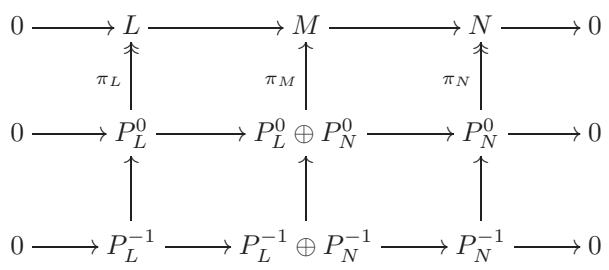

根据蛇形引理，$P _ { L } ^ { - 1 } \oplus P _ { N } ^ { - 1 } \to \ker \pi _ { M }$ 是一个满态射，这表明在 $P _ { L } ^ { 0 } \oplus P _ { N } ^ { 0 }$ 处中心列是正合的。通过归纳继续构造 $P _ { M } ^ { \bullet }$ 如所要求。$\square$

引理 7.8 告诉我们，我们可以将对象之间的正合序列提升为投影解析之间的正合序列。从本质上讲，我们希望说将 $\mathcal { S }$ 映射到 $\mathsf { A }$ 的每个对象上的投影解析的算子是“正合的”；但由于 $\mathsf { K } ( { \mathsf { A } } )$ 不是阿贝尔的，这根本不是一个选项。引理 7.8 在接近这种陈述方面尽可能地接近。事实上，从证明中给出的 $P _ { M } ^ { \bullet }$ 的构造中，很容易证明（练习 7.5）$P _ { M } ^ { \bullet }$ 是一个同态 $\rho ^ { \bullet } : { \cal P } _ { N } [ - 1 ] ^ { \bullet }  { \cal P } _ { L } ^ { \bullet }$ 的映射锥，所以

我们得到一个“杰出三角形”


在 §4.1 中提到的意义上，这些是赋予同伦范畴“三角化范畴”结构的三角形。因此，函子 $\mathcal { S }$ 允许我们从 §3.4 意义上的“特殊”正合三角形开始，在 ${ \mathsf { K } } ( { \mathsf { P } } )$ 中构造一个 distinguished 三角形。马蹄形引理表明这个函子保留了上下文允许的尽可能多的正合性。


我们也应该注意到，一旦短 正合序列被提升，事实上我们可以提升每一个复形；这将后面需要用到。下面是精确的陈述：

### 推论 7.9.

让

$$
M ^ { \bullet } : \quad \quad \quad \cdots \longrightarrow M ^ { - 3 } \longrightarrow M ^ { - 2 } \longrightarrow M ^ { - 1 } \longrightarrow M ^ { 0 } \longrightarrow 0
$$

在一个具有足够投射对象的阿贝尔范畴 $A$ 中，存在一个复层的复：

$$
P _ { M ^ { \bullet } } ^ { \bullet } : \qquad \quad \cdots \longrightarrow P _ { M ^ { - 3 } } ^ { \bullet } \longrightarrow P _ { M ^ { - 2 } } ^ { \bullet } \longrightarrow P _ { M ^ { - 1 } } ^ { \bullet } \longrightarrow P _ { M ^ { 0 } } ^ { \bullet } \longrightarrow P _ { M ^ { 0 } } ^ { \bullet } \longrightarrow 0
$$

使得每个 $P _ { M ^ { i } } ^ { \bullet }$ 是 $M ^ { i }$ 的投影解析，并在同调中诱导 $M ^ { \bullet }$。  
如果 $M ^ { \bullet }$ 是正合的，那么 $P _ { M } ^ { \bullet }$ • 可以选择为正合的。

证明。将 $M ^ { \bullet }$ 分解为短 正合序列。

$$
0 \longrightarrow K ^ { i } \longrightarrow M ^ { i } \longrightarrow I ^ { i + 1 } \longrightarrow 0
$$

与正合序列一起

$$
0 \longrightarrow I ^ { i } \longrightarrow K ^ { i } \longrightarrow H ^ { i } \longrightarrow 0
$$

其中 $K ^ { i }$ 是 $M ^ { i }  M ^ { i + 1 }$ 的核，$I ^ { \imath + 1 }$ 是其像，而 $H ^ { i }$ 是 $M ^ { i }$ 上的同调。对所有 $i$ 选择 $I ^ { i }$ 和 $H ^ { i }$ 的任意投射分辨率 $P _ { I ^ { i } }$ ，$P _ { H ^ { i } }$。然后，根据马蹄铁引理（引理 7.8），得到 $K ^ { i }$ 的投射分辨率和短 正合序列

$$
0 \longrightarrow P _ { I ^ { i } } ^ { \bullet } \longrightarrow P _ { K ^ { i } } ^ { \bullet } \longrightarrow P _ { H ^ { i } } ^ { \bullet } \longrightarrow 0 \ ,
$$

用明显的符号表示，然后再次使用U形引理和前面的序列给出$M ^ { i }$的射影解序列$P _ { M ^ { i } }$和短 正合序列

$$
0 \longrightarrow P _ { K ^ { i } } ^ { \bullet } \longrightarrow P _ { M ^ { i } } ^ { \bullet } \longrightarrow P _ { I ^ { i + 1 } } ^ { \bullet } \longrightarrow 0 \ .
$$

现在$P _ { M ^ { i } } ^ { \bullet }$可以通过使用通过组合获得的微分组装成一个序列

$$
P _ { M ^ { i } } ^ { \bullet }  P _ { I ^ { i + 1 } } ^ { \bullet }  P _ { K ^ { i + 1 } } ^ { \bullet }  P _ { M ^ { i + 1 } } ^ { \bullet } .
$$

很明显，可以得到一个复形，并且 $P _ { K ^ { i } } ^ { \bullet }$ ，resp.，$P _ { I ^ { i + 1 } } ^ { \bullet }$ ，分别是 $P _ { M ^ { i } } ^ { \bullet }  P _ { M ^ { i + 1 } } ^ { \bullet }$ 的核，resp.，像（练习1.21）。接下来的陈述如下。（如果 $M ^ { \bullet }$ 是正合的，那么 $I ^ { \imath } \ = \ K ^ { \imath }$ ，并且构造给出 $P _ { I ^ { i } } ^ { \bullet } = P _ { K ^ { i } } ^ { \bullet }$ ，因此 $P _ { M } ^ { \bullet }$ • 是正合的。）$\square$

备注 7.10. 推论 7.9 的证明表明，解算 $P _ { M } ^ { \bullet } \bullet$ ，即，

$$
\cdots \xrightarrow { d ^ { - 4 } } P _ { M ^ { - 3 } } ^ { \bullet } \xrightarrow { d ^ { - 3 } } P _ { M ^ { - 2 } } ^ { \bullet } \xrightarrow { d ^ { - 2 } } P _ { M ^ { - 1 } } ^ { \bullet } \xrightarrow { d ^ { - 1 } } P _ { M ^ { 0 } } ^ { \bullet } \xrightarrow { } 0 \ ,
$$

实际上可以选择，使得 $\mathrm { i m } d ^ { i }$ ， $\ker d ^ { i }$ ，以及同调 $\ker d ^ { i } / \operatorname { i m } d ^ { i - 1 }$ 都是 $M ^ { \bullet }$ 中相应对象的投影解析。这在某些应用中很有用。具有这种性质的解析被称为 Cartan-Eilenberg（或“完全投影”）解析。

回到当前问题，我们距离所承诺的导出函子长正合序列仅一步之遥。最后一个要素是以下：

引理 7.11。设 A 是一个阿贝尔范畴，并且让

$$
0 \longrightarrow L ^ { \bullet } \longrightarrow M ^ { \bullet } \longrightarrow P ^ { \bullet } \longrightarrow 0
$$

在 A 中是一个正合复形序列，其中 $P ^ { i }$ 对所有 $\textit { i }$ 都是投影的。设 $\mathcal { F } :$ $\mathsf { A } \to \mathsf { B }$ 是任意一个阿贝尔范畴的加性函子。那么，通过将 $\mathcal { F }$ 应用于 $( ^ { * }$ ) 得到的序列

$$
0 \longrightarrow { \mathcal { F } } ( L ^ { \bullet } ) \longrightarrow { \mathcal { F } } ( M ^ { \bullet } ) \longrightarrow { \mathcal { F } } ( P ^ { \bullet } ) \longrightarrow 0 \ ,
$$

完全正确。

请注意，我们并不是要求$\mathcal { F }$在任何意义上都是正合的。

证明。由于 $P ^ { i }$ 是投影的，序列

$$
0 \longrightarrow L ^ { i } \longrightarrow M ^ { i } \longrightarrow P ^ { i } \longrightarrow 0
$$

分割（参见§ VIII.6.1的末尾）。因此

$$
0 \longrightarrow \mathcal { F } ( L ^ { i } ) \longrightarrow \mathcal { F } ( M ^ { i } ) \longrightarrow \mathcal { F } ( P ^ { i } ) \longrightarrow 0
$$

对于所有 $i$ 是（拆分和）正合的（练习 5.11）。复形序列的正合性由每个度的正合性决定，因此这证明了该命题。

现在，左导出函子的长正合序列是长正合同调序列的直接推论。

定理 7.12. 设 $\mathcal { F } : \mathsf { A } \to \mathsf { B }$ 是阿贝尔范畴中的一个加性函子，并且假设 A 有足够的投射。每一个正合序列

$$
0 \longrightarrow L \longrightarrow M \longrightarrow N \longrightarrow 0
$$

在 A 中诱导一个长正合序列

$$
\begin{array} { r l } { \cdots { \xrightarrow { } } \mathsf { L } _ { 2 } \mathscr { F } ( L ) { \xrightarrow { } } \mathsf { L } _ { 2 } \mathscr { F } ( M ) { \xrightarrow { } } \mathsf { L } _ { 2 } \mathscr { F } ( N ) } \\ { \zeta _ { \mathsf { L } _ { 1 } \mathscr { F } ( L ) \xrightarrow { } \mathsf { L } _ { 1 } \mathscr { F } ( M ) \xrightarrow { } \mathsf { L } _ { 1 } \mathscr { F } ( N ) } } \\ { \zeta _ { \mathsf { L } _ { 0 } \mathscr { F } ( L ) \xrightarrow { } \mathsf { L } _ { 0 } \mathscr { F } ( M ) \xrightarrow { } \mathsf { L } _ { 0 } \mathscr { F } ( N ) } } \end{array}
$$

在B中。此外，这项任务具有协变函子性质。

最后一句话的意思是，短 正合序列的 morphism 将会诱导出相应长 正合序列的 morphism，并且与复合运算兼容。我将把证明这个命题所需的图 chase 留给读者（练习 7.7）。

证明。根据引理7.8，给定的正合序列是由一个投影解析序列诱导的。

$$
0 \longrightarrow P _ { L } ^ { \bullet } \longrightarrow P _ { M } ^ { \bullet } \longrightarrow P _ { N } ^ { \bullet } \longrightarrow 0 \ .
$$

根据引理7.11，相应的序列

$$
0 \longrightarrow \mathcal { F } ( P _ { L } ^ { \bullet } ) \longrightarrow \mathcal { F } ( P _ { M } ^ { \bullet } ) \longrightarrow \mathcal { F } ( P _ { N } ^ { \bullet } ) \longrightarrow 0
$$

在${ \mathsf { C } } ( { \mathsf { B } } )$中是正合的。因为这些复形的同调对象恰好是$\mathcal { F }$的左导出函子，由这个序列（根据定理3.5）确定的长的同调序列给出了如所述的长序列。$\square$

再次以§3.4的风格，定理7.12告诉我们这个三角形


诱导一个三角形$^ { 3 3 }$


这个三角形的顶点是 ${ \mathsf { C } } ^ { \leq 0 } ( { \mathsf { B } } )$ 中的复数。

对于右导出函子，也发生完全相同的情况：如果 $\mathsf { A }$ 有足够的单射，那么上述的正合序列会诱导一个三角形


现在顶点是 ${ \mathsf { C } } ^ { \geq 0 } ( { \mathsf { B } } )$ 中的复数。

### 7.5. 关于 $\mathcal { F }$ 、$\mathsf { L } _ { i } \mathcal { F }$ 、$\mathsf { R } ^ { \imath } \mathcal { F }$ 的关系
读者可能已经注意到，通过向左推导得到了 Tor，而通过向右推导得到了 Ext。这种不对称性要求这种选择的原因在于 $\otimes$ 是右正合的，而 Hom 是左正合的：任何加性函子可以向左或向右推导（在有足够多的投射对象（分别地，有足够多的注入对象）的情况下），并且推导出的函子将适合在长正合序列中，如定理 7.12 所证明的那样；但是只有满足一定正合度测度的函子才能直接从它们的推导版本中恢复。

为了更精确地陈述这一事实，我们回到加性映射 $\mathcal { F } : \mathsf { A } \to \mathsf { B }$ 的左导出算子的普遍考虑，其中 $\mathsf { A }$ 和 $\textsf { B }$ 是阿贝尔范畴，并且 $\mathsf { A }$ 具有足够多的投射，我们现在假设 $\mathcal { F }$ 是右正合的。

命题 7.13. 设 $\mathcal { F } : \mathsf { A } \to \mathsf { B }$ 是一个右正合的加性函子。那么 $\mathsf { L } _ { i } \mathcal { F } =$ $0$ 对于 $i < 0$ ，并且 $\mathsf { L } _ { 0 } \mathcal { F }$ 自然同构于 $\mathcal { F }$ 。

证明。对象 $M$ 的射影解析 $P ^ { \bullet }$ 属于 ${ \mathsf C } ^ { \le 0 } ( { \mathsf A } )$ ：因此 $\mathsf C ( \mathcal F ) ( P ^ { \bullet } )$ 在正度数为 $0$，因此它的同调也是 $0$。由于 $H _ { i } = H ^ { - i }$（参见 3.1），第一个断言成立。

至于第二个，由于序列

$$
P ^ { - 1 } \longrightarrow P ^ { 0 } \longrightarrow M \longrightarrow 0
$$

是构造上正合的，并且由于 $\mathcal { F }$ 是右正合的，序列

$$
\mathcal { F } ( P ^ { - 1 } ) \longrightarrow \mathcal { F } ( P ^ { 0 } ) \longrightarrow \mathcal { F } ( M ) \longrightarrow 0
$$

完全正确。这诱导了一个同构 $\nu _ { L } : \mathsf { L } _ { 0 } { \mathcal { F } } ( M ) = H ^ { 0 } ( \mathsf { C } ( { \mathcal { F } } ) ( P ^ { \bullet } ) ) \ { \overset { \sim } { \to } } \ { \mathcal { F } } ( M )$ 。如果 $\varphi : M _ { 0 } \to M _ { 1 }$ 是 $\mathsf { A }$ 中的一个态射，根据命题 6.5，存在一个投射解态射 $\alpha ^ { \bullet } : \mathcal { P } _ { 0 } ^ { \bullet }  \mathcal { P } _ { 1 } ^ { \bullet }$ 诱导 $\varphi$ ：有一个交换图

$$
\begin{array} { l l l } { { \dots { \longleftrightarrow } } } & { { \longrightarrow P _ { 0 } ^ { - 1 } \longrightarrow { \cal P } _ { 0 } ^ { 0 } \longrightarrow { \cal M } _ { 0 } \longrightarrow 0 } } \\ { { } } & { { \nonumber } } \\ { { \qquad \dots { \longleftrightarrow } } } & { { \nonumber } } \\ { { \dots { \longleftrightarrow } } } & { { \longrightarrow P _ { 1 } ^ { - 1 } \longrightarrow { \cal P } _ { 0 } ^ { 0 } { \longrightarrow } { \cal M } _ { 1 } { \longrightarrow } 0 } } \end{array}
$$

并且 $H ^ { 0 } ( \alpha ^ { \bullet } )$ 与 $\varphi$ 一致。应用 $\mathcal { F }$ 并截断，我们得到一个交换图

$$
\begin{array} { r l r } { \mathcal { F } ( P _ { 0 } ^ { - 1 } ) \longrightarrow \mathcal { F } ( P _ { 0 } ^ { 0 } ) \longrightarrow \mathcal { F } ( M _ { 0 } ) \longrightarrow 0 } & { { } } & { } \\ { \mathcal { F } ( \alpha ^ { - 1 } ) \Bigg \downarrow \qquad } & { { } \mathcal { F } ( \alpha ^ { 0 } ) \Bigg \downarrow \qquad } & { { } \Bigg \downarrow \mathcal { F } ( \varphi ) } \\ { \mathcal { F } ( P _ { 1 } ^ { - 1 } ) \longrightarrow \mathcal { F } ( P _ { 1 } ^ { 0 } ) \longrightarrow \mathcal { F } ( M _ { 1 } ) \longrightarrow 0 } & { { } } & { } \end{array}
$$

由于 $\mathcal { F }$ 是右确的，因此具有正合行。由此可见，图

$$
\begin{array} { r l r } & { \mathsf { L _ { 0 } } \mathcal { F } ( M _ { 0 } ) \xrightarrow { \mathsf { L _ { 0 } } \mathcal { F } ( \varphi ) } } & { \mathsf { L _ { 0 } } \mathcal { F } ( M _ { 1 } ) } \\ & { \nu _ { M _ { 0 } } \bigg \downarrow \imath } & { \imath \underbrace { \nu _ { M _ { 1 } } } _ { \mathcal { F } ( M _ { 0 } ) } } & { \imath \underbrace { \nu _ { M _ { 1 } } } _ { \mathcal { F } ( M _ { 1 } ) } } \\ & { \mathcal { F } ( M _ { 0 } ) \xrightarrow { \mathcal { F } ( \varphi ) } } & { \mathcal { F } ( M _ { 1 } ) } \end{array}
$$

交换，证明 $\nu : \mathsf { L } _ { 0 } \mathcal { F } \to \mathcal { F }$ 是一个自然同构。

回顾定理7.12，我们看到如果$\mathcal { F }$是右正合的，那么$\mathcal { F }$的左导出函子的长正合序列的尾部由$\mathcal { F }$自身的应用组成。因此，这种情况如下：从一个短正合序列开始

$$
0 \longrightarrow L \longrightarrow M \longrightarrow N \longrightarrow 0
$$

在 $\mathsf { A }$ 中，我们应用 $\mathcal { F }$ 得到一个正合序列

$$
\mathcal { F } ( L ) \longrightarrow \mathcal { F } ( M ) \longrightarrow \mathcal { F } ( N ) \longrightarrow 0
$$

在我们丢失了“左边的$0$”的情况下，长正合序列挽救了局面，将新序列继续到一个正合的复形中：

$$
\begin{array} { r } { \begin{array} { r c l } { \cdots } & { \longrightarrow \mathsf { L } _ { 2 } \mathcal { F } ( L ) \longrightarrow \mathsf { L } _ { 2 } \mathcal { F } ( M ) \longrightarrow \mathsf { L } _ { 2 } \mathcal { F } ( N ) } \\ & { \longleftrightarrow \underbrace { \mathsf { \Lambda } _ { 1 2 } } _ { \begin{array} { c } { \ddots \mathsf { L } _ { 1 } \mathcal { F } ( L ) \longrightarrow \mathsf { L } _ { 1 } \mathcal { F } ( M ) \longrightarrow \mathsf { L } _ { 1 } \mathcal { F } ( N ) } \\ { \diamond } \\ { \diamond } \end{array} } } & { \delta _ { 1 } \xrightarrow [ ] { } \mathcal { F } ( M ) \longrightarrow \mathsf { L } _ { 2 } \mathcal { F } ( N ) } \end{array} } \\ & { \longleftrightarrow \mathcal { F } ( L ) \longrightarrow \mathcal { F } ( M ) \longrightarrow \mathcal { F } ( N ) \longrightarrow 0 } \end{array}
$$

也就是说，$\mathsf { L } _ { 1 } \mathcal { F }$ 衡量了 $\mathcal { F }$ 未能左确切的程度，而更高的 $\mathsf { L } _ { i } \mathcal {F }$ 则提供了对此失败的进一步衡量。

同样地，如果 $\mathcal { F }$ 是左正合的，$\mathsf { R } ^ { 0 } \mathcal { F }$ 自然同构于 $\mathcal { F }$。在这种情况下，将 $\mathcal { F }$ 应用于原始序列得到正合序列

$$
0 \longrightarrow \mathcal { F } ( L ) \longrightarrow \mathcal { F } ( M ) \longrightarrow \mathcal { F } ( N )
$$

我们在右侧丢失了$0$；$\mathcal { F }$的右侧导出函子的作用是将这个序列扩展为一个正合的复形

$$
\begin{array} { r l } { 0 \xrightarrow [ \ddots ] { } \mathcal { F } ( L ) \xrightarrow [ \ddots ] { } \mathcal { F } ( M ) \xrightarrow [ \ddots ] { } \mathcal { F } ( N ) } \\ { \Bigg ( } & { \Bigg . } \\ & { \Bigg . \Bigg . \Bigg . \Bigg . \Bigg . \Bigg . \Bigg . } \\ & { \Bigg ( \Bigg . \Bigg . \Bigg . \Bigg . \Bigg . \Bigg . \Bigg . \Bigg . \Bigg . \Bigg . \Bigg . \Bigg . \Bigg . \Bigg . \Bigg . \Bigg . } \\ & { \Bigg . \Bigg . \Bigg . \Bigg . \Bigg . \Bigg \Bigg . \Bigg . \Bigg \Bigg . \Bigg . \Bigg \Bigg . \Bigg . \Bigg \Bigg . \Bigg \Bigg . \Bigg . \Bigg \Bigg . \Bigg \Bigg . \Bigg . } \\ & { \Bigg . \Bigg . \Bigg . \Bigg \Bigg . \Bigg . \Bigg \Bigg . \Bigg \Bigg . \Bigg \Bigg . \Bigg \Bigg . \Bigg \Bigg . \Bigg \Bigg . \Bigg \Bigg . \Bigg \Bigg . \Bigg \Bigg . \Bigg \Bigg . \Bigg \Bigg . \Bigg \Bigg . \Bigg \Bigg . \Bigg \Bigg . \Bigg \Bigg . } \\ & { \Bigg . \Bigg \Bigg . \Bigg \Bigg . \Bigg \Bigg . \Bigg \Bigg . \Bigg \Bigg . \Bigg \Bigg . \Bigg \Bigg . \Bigg \Bigg . \Bigg \Bigg \beta _ { 2 } \mathcal { F } ( M ) \Bigg . \Bigg . \Bigg \Bigg . \Bigg \Bigg . \Bigg \Bigg . \Bigg \Bigg . } \end{array}
$$

如果 $\mathcal { F }$ 不满足某些正合性性质，则不应期望 $\mathcal { F }$ 与其任何导出函子之间存在识别。如果 $\mathcal { F }$ 在直观上是正合的，那么 $\mathsf { L } _ { 0 } \mathcal { F }$ 和 $\mathsf { R } ^ { 0 } \mathcal { F }$ 都与 $\mathcal { F }$ 一致（直到自然同构）；但这并不是什么大不了的兴奋，因为在这种情况下，所有其他的 $\mathsf { L } _ { i } \mathcal { F }$ ，$\mathsf { R } ^ { \imath } \mathcal { F }$ 都消失（练习 7.8）。正如在示例 7.2 中已经指出的那样，通过导出正合函子不应期望学到任何新东西。

### 7.6. 示例：群上同调
在本章的开头，我指出同调代数的开发策略具有广泛的应用，并提到了群同调和层同调作为例子。这里简单介绍一下群上同调（层上同调会使我们离题太远）。

我们如何从群 $G$ 中提取“上同调不变量”？考虑范畴 $G$ -Mod，它是由带有左 $G$ -作用的阿贝尔群组成的，等价地，是左 $\mathbb { Z } [ G ]$ -模的范畴，其中 $\mathbb { Z } [ G ]$ 是在第 III.1.4 节中简要提及的群环。$G$ -Mod 的对象可以称为 $G$ -模。

对于 $G$ -模 $M$ ，$M ^ { G }$ 表示在 $G$ 的作用下保持不变的元素构成的集合：这些元素合理地被称为该作用的不变量。注意 $M ^ { G }$ 是一个阿贝尔群，它带有 $G$ 的平凡作用；显然，下述设置 $M \to M ^ { G }$ 定义了一个协变函子 $\begin{array} { r } { \cdot ^G : G \mathrm { - } { \mathsf { M o d } } \to { \mathsf { A b } } } \end{array}$ 。$G$ -Mod 和 Ab 都是阿贝尔范畴，需要一点时间才能意识到 $\cdot ^G$ 是一个左正合函子：读者应该直接验证这一点，或者做练习 7.16，然后记住断言 VIII.1.19。事实上，读者应该思考为什么这个函子不是右正合的：如果 $G$ 对商 $M / L$ 的陪集 $\lfloor m \rfloor$ 作用平凡，那么没有先验的理由认为 $G$ 应该对代表元 $m$ 作用平凡。

在深入研究同调代数之前，我们本来可以轻易地得出这个结论。同调代数告诉我们如何处理这种情况，并通过适当的导出函子“量化”正合的失败。

$G$ 的第 $i$ 个右导出函子记作 $H ^ { \imath } ( G , \underline { { \ O } } _ { - } )$ 。因此，$H ^ { 0 } ( G , M ) =$ $M ^ { G }$ ，并且对于 $G$ -模的每一个短 正合序列

$$
0 \longrightarrow L \longrightarrow M \longrightarrow N \longrightarrow 0
$$

我们从定理 7.12 中得到一个阿贝尔群的长期正合序列：

$$
0 \longrightarrow L ^ { G } \longrightarrow M ^ { G } \longrightarrow N ^ { G } \longrightarrow M ^ { 1 } ( G , L ) \longrightarrow M ^ { 1 } ( G , M ) \longrightarrow \cdots .
$$

注意$M ^ { G } = \operatorname { H o m } _ { \mathbb { Z } [ G ] } ( \mathbb { Z } , M )$，其中$\mathbb { Z }$被赋予平凡的模结构。因此，$H ^ { i } ( G , M ) = \mathrm { E x t } _ { \mathbb { Z } [ G ] } ^ { i } ( \mathbb { Z } , M )$；正如我们所知（并且将在第8节最终验证），这可以通过$M$的注入解或$\mathbb { Z }$的投影解来计算。

示例 7.14. 令 $G = \mathbb{Z}$。那么 $\mathbb{Z}[G]$ 是 Laurent 多项式环 $\mathbb{Z}[x, x^{-1}]$。由于 $\mathbb{Z}[x, x^{-1}]/(1 - x) \cong \mathbb{Z}$，并且具有平凡的运算（验证这一点！），复

$$
\cdots { \xrightarrow { } } 0 { \xrightarrow { } } \mathbb { Z } [ x , x ^ { - 1 } ] { \xrightarrow { \cdot ( 1 - x ) } } \mathbb { Z } [ x , x ^ { - 1 } ] { \xrightarrow { } } 0 { \xrightarrow { } } \cdots \mathbb { Z } [ x , x ^ { - 1 } ] .
$$

是一个自由、因此是投影的 $\mathbb { Z }$ 的解析，配备了平凡的 $\mathbb { Z }$ -作用。应用（逆变的） $\mathrm { H o m } _ { \mathbb { Z } [ x , x ^ { - 1 } ] } ( \_ , M )$ ，我们看到 $H ^ { \bullet } ( \mathbb { Z } , M )$ 是通过同调计算的

$$
\cdots { \xrightarrow { } } 0 { \xrightarrow { } } M { \xrightarrow { \cdot ( 1 - x ) } } M { \xrightarrow { } } 0 { \xrightarrow { } } \cdots .
$$

“在 $M$ 上乘以 $x$ 实际上就是 $G = \mathbb{Z}$ 的生成元的作用。我们得出结论，$H ^ { 0 } ( \mathbb{Z} , M ) = \ker ( M \stackrel { \cdot ( 1 - x ) } { \longrightarrow } M ) = M ^ { \mathbb{Z} }$（正如我们所知的那样），”

$$
H ^ { 1 } ( \mathbb { Z } , M ) = \frac { M } { ( 1 - x ) M } ,
$$

并且对于所有 $i < 0$ 和 $i \geq 2$ ，$H ^ { i } ( \mathbb { Z } , M ) = 0$ 。

示例 7.15（有限循环群）。设 $G = C _ { m }$ 是一个阶为 $m$ 的循环群；那么 $\mathbb { Z } [ G ] \cong \mathbb { Z } \lfloor x \rfloor / ( x ^ { m } - 1 )$ 。再次不难在 $\mathbb { Z } [ C _ { m } ]$ -模的范畴中构造出 $\mathbb { Z }$（平凡作用）的一个投影解析：令 $N = 1 + x + \cdot \cdot \cdot + x ^ { m - 1 } = ( 1 - x ^ { m } ) / ( 1 - x )$ ，读者将验证这个复形

$$
\cdots { \xrightarrow { \cdot \cdot \cdot \cdot \cdot \cdot \cdot \cdot \cdot \mathbb { N } _ { - } } } \mathbb { Z } [ C _ { m } ] { \xrightarrow { \cdot ( 1 - x ) } } \mathbb { Z } [ C _ { m } ] { \xrightarrow { \cdot \cdot \cdot } } \mathbb { Z } [ C _ { m } ] { \xrightarrow { \cdot ( 1 - x ) } } \mathbb { Z } [ C _ { m } ] { \xrightarrow { \cdot ( 1 - x ) } } \mathbb { Z } [ C _ { m } ] \longrightarrow 0 { \xrightarrow { \cdot \cdot \cdot \cdot } } .
$$

同调群同构于$\mathbb{Z}$，集中在0度（即在上一个非零项上）。应用$\mathrm{Hom}_{\mathbb{Z}[C_m]}(\_ , M)$，我们得到复形

$$
\cdots { \xrightarrow { } } 0 { \xrightarrow { } } M { \xrightarrow { \cdot ( 1 - x ) } } M \cdots M { \xrightarrow { \cdot ( 1 - x ) } } M \cdots M \cdots M \cdots
$$

并推导出 $H ^ { \imath } ( M , C _ { m } ) = 0$ 对于 $i < 0$ ，$H ^ { 0 } ( C _ { m} , M ) = M ^ { C _ { m} }$ ，以及对于所有 $i > 0$

$$
H ^ { 2 i + 1 } ( C _ { m } , M ) \cong \frac { \mathrm { k e r } ( M \stackrel { { \cdot } N } {  } M ) } { ( 1 - x ) M } ,
$$

$$
H ^ { 2 i } ( C _ { m } , M ) \cong \frac { M ^ { C _ { m } } } { N \cdot M } .
$$

存在一个标准自由解 $\mathbb { Z }$ 在群环 $\mathbb { Z } [ G ]$ 上，这导致了群同调的一个具体描述。对于一个阶为 $m$ 的有限群 $G$ ，这个解的开始如下。考虑这个复形

$$
\ \cdots { \longrightarrow } \mathbb { Z } [ G ] ^ { m ^ { 2 } } \ { \xrightarrow { d ^ { - 2 } } } \ \mathbb { Z } [ G ] ^ { m } \ { \xrightarrow { d ^ { - 1 } } } \ \mathbb { Z } [ G ] \ { \xrightarrow { d ^ { 0 } } } \ \mathbb { Z } \longrightarrow \ \mathbb { Z } \ { \longrightarrow } \ 0 \ { \longrightarrow } \ \cdots . \ .
$$

这里，$\mathbb{Z}[G]^{m^k}$ 在 $\mathbb{Z}[G]$ 上的一个基由 $G$ 的元素的 $k$-元组 $[g_1, \ldots, g_k]$ 组成。$(\dag)$ 中的同态由设置定义。

$$
\begin{array} { r } { d ^ { - 1 } ( [ g ] ) = 1 \cdot g - 1 \cdot e _ { G } \in \mathbb { Z } [ G ] , } \\ { d ^ { - 2 } ( [ g _ { 1 } , g _ { 2 } ] ) = g _ { 1 } [ g _ { 2 } ] - [ g _ { 1 } g _ { 2 } ] + [ g _ { 1 } ] , } \end{array}
$$

基于此并扩张 $\mathbb { Z } [ G ]$ -线性，且 $d ^ { 0 }$ 将 $G$ 中的每个 $g$ 映射到 $1$，因此 $\begin{array} { r } { d ^ { \mathrm { { U } } } ( \sum _ { g \in G } a _ { g } g ) = \sum a _ { g } } \end{array}$ 。(不用说，$d ^ { - k }$ 可以为所有 $k$ 定义。)读者将验证 $( \dag )$ 是正合的（练习 7.17），至少对于以下讨论的相关部分而言。因此，

$$
\therefore \cdot \cdot \longrightarrow \mathbb { Z } [ G ] ^ { m ^ { 2 } } \xrightarrow { d ^ { - 2 } } \mathbb { Z } [ G ] ^ { m } \xrightarrow { d ^ { - 1 } } \mathbb { Z } [ G ] \xrightarrow { } 0 \xrightarrow { } \cdots .
$$

是（$\mathbb { Z } [ G ]$ 的一个自由（的）分解析的）$\mathbb { Z }$（赋予平凡的 $G$ -作用），并且群同调可以计算为对这种解析应用 $\mathrm { H o m } _ { \mathbb { Z } [ G ] } ( \_ , M )$ 得到的复形的同调：

$$
0 \to \mathrm { H o m } _ { \mathbb { Z } [ G ] } ( \mathbb { Z } [ G ] , M ) \to \mathrm { H o m } _ { \mathbb { Z } [ G ] } ( \mathbb { Z } [ G ] ^ { m } , M ) \to \mathrm { H o m } _ { \mathbb { Z } [ G ] } ( \mathbb { Z } [ G ] ^ { m ^ { 2 } } , M ) \to \cdots \ .
$$

这里，${ \mathrm { H o m } } _ { \mathbb { Z } [ G ] } ( \mathbb { Z } [ G ] ^ { m ^ { k } } , M ) \cong M ^ { m ^ { k } }$ 可以与到 $G ^ { k } \to M$ 的函数的阿贝尔群识别，因为每一个 $\mathbb { Z } [ G ]$ -线性映射 $\mathbb { Z } [ G ] ^ { m ^ { k } } \to M$ 是由它在基上的作用确定的。将这个阿贝尔群记为 $C ^ { k } ( G , M )$：这是 $G$ 值为 $M$ 的 $k$ -链层的群。

我们现在可以总结我们找到的内容如下：

命题 7.16. 设 $G$ 是一个有限群，$M$ 是一个 $G$-模。那么，群上同调 $H ^ { \ i } ( G , M )$ 是上链复形的同调

$$
0 \longrightarrow C ^ { 0 } ( G , M ) { \xrightarrow { d _ { G } ^ { 0 } } } C ^ { 1 } ( G , M ) { \xrightarrow { d _ { G } ^ { 1 } } } C ^ { 2 } ( G , M ) { \xrightarrow { d _ { G } ^ { 2 } } } \cdots . . .
$$

由（†）引起的

追踪定义，我们看到对于 $a \in C ^ { 0 } ( G , M ) = M$ 和 $\alpha : G \to M$ 在 $C ^ { 1 } ( G , M )$ 中，

$$
\begin{array} { c } { { d _ { G } ^ { 0 } ( a ) ( g ) = g a - a , } } \\ { { { } } } \\ { { d _ { G } ^ { 1 } ( \alpha ) ( g _ { 1 } , g _ { 2 } ) = g _ { 1 } \alpha ( g _ { 2 } ) - \alpha ( g _ { 1 } g _ { 2 } ) + \alpha ( g _ { 1 } ) . } } \end{array}
$$

示例 7.17. 设 $G$ 是有限伽罗瓦扩张 $k \subseteq F$ 的伽罗瓦群。那么 $G$ 对 $F$ 的乘法群 $F ^ { * }$ 进行作用，并且我们可以将 $F ^ { * }$ 视为一个 $G$ -模。

命题 7.18. $H ^ { 1 } ( G , F ^ { * } ) = 0$ .

确实，按照上述符号，我们有 $H ^ { 1 } ( G , F ^ { * } ) \cong \ker d _ { G } ^ { 1 } / \operatorname { i m } d _ { G } ^ { 0}$ ，并且我们可以明确地计算这个商。设 $\alpha \in C ^ { 1 } ( G , F ^ { * } )$ ；用 $\alpha _ { g}$ 表示 $g$ 在 $F ^ { * }$ 中的像，由 $\alpha$ 确定。条件 $\alpha \in \ker d _ { G } ^ { 1 }$ 转化为

$$
\alpha _ { g h } = \boldsymbol { \alpha } _ { g } \cdot \boldsymbol { g } ( \boldsymbol { \alpha } _ { h } )
$$

对于所有 $g , h$ 在 $G$ 中。(我现在正在以乘法方式在 $F ^ { * }$ 中书写运算，并将 $G$ 的元素视为 $F ^ { \prime }$ 的自同构。)

元素 $h \in G$ 作为 $F ^ { \prime }$ 的自同构是两两不同的，因此根据练习 VII.6.14，它们必须是线性无关的。因此，存在一个 $\gamma \in F$ 使得

$$
\beta : = \sum _ { h \in G } \alpha _ { h } \cdot h ( \gamma ) \neq 0 .
$$

因此 $\beta \in F ^ { * }$ ，并且对于所有 $g \in G$

$$
g ( \beta ) = \sum _ { h \in G } g ( \alpha _ { h } ) \cdot ( g h ) ( \gamma ) \overset { ! } { = } \sum _ { h \in G } \alpha _ { g } ^ { - 1 } \alpha _ { g h } \cdot ( g h ) ( \gamma ) = \alpha _ { g } ^ { - 1 } \beta
$$

在等式标记 $\circeq$ 处成立，这是由循环条件给出的。也就是说，我们已经发现存在一个 $\beta \in F ^ { * }$ 使得

$$
\alpha _ { g } = \frac { \beta } { g ( \beta ) }
$$

对于所有 $g \in G$。但这恰恰说明 $\alpha$ 在 $d _ { G } ^ { 0 }$ 的像中，从而证明了 $\ker d _ { G } ^ { 1 } / \operatorname { i m } d _ { G } ^ { 0 } = 0$ ，正如所声称的。

命题 7.18 很重要：它以希尔伯特定理 $g \jmath$ 的名义出现，因为在 $G$ 是有限循环扩域的伽罗瓦群的情况下，它精确地恢复了以这个名称的古典结果。读者有机会在练习 VII.6.16 中证明这个特殊情况，现在将有机会验证确实命题 7.18 意味着希尔伯特的结果（练习 7.18）。

上同调群是代数数论、代数拓扑和其他领域中的一个有用工具，其伴随的“上同调”$H _ { \bullet } ( G , M )$ 也是一个类似定义的，通过左导出函子 · $G$ 将每个 $G$ -模 $M$ 关联起来的模

$$
M _ { G } : = \frac { M } { \langle g m - m \rangle _ { g \in G } }
$$

(正如$M ^ { G }$的元素被称为不变量，$M _ { G }$的元素被称为作用的协变元)。例如，在示例7.14中，我们验证了$H ^ { 1 } ( \mathbb { Z } , M ) =$ $M _ { \mathbb { Z } } = H _ { 0 } ( \mathbb { Z } , M )$。读者现在应该没有困难计算简单的例子，例如同调$H _ { \bullet } ( \mathbb { Z } , M )$（习题7.19）。

### 习题

7.1. $\triangleright$ 设 $\mathcal { T } : \mathsf { A b } \to \mathsf { A b }$ 是通过与 $\mathbb { Z } / 2 \mathbb { Z }$ 张量积定义的加性函子：$\mathcal { T } ( A ) : = A \otimes _ { \mathbb { Z } } \mathbb { Z } / 2 \mathbb { Z }$ 。证明对于任何阿贝尔群 $P$，没有非平凡的投影阿贝尔群可以写成 $\mathcal { T } ( P )$ 的形式。[§7.1]

7.2. 设 A, $\textsf { B }$ 是阿贝尔范畴，设 $\mathcal { F } : \mathsf { A } \to \mathsf { B }$ 是一个加性函子，设 $\mathsf { C } ( { \mathcal F } ) : \mathsf { C } ( \mathsf { A } ) \to \mathsf { C } ( \mathsf { B } )$ 是相应的复函子。如果 $\alpha ^ { \bullet } : L ^ { \bullet }  M ^ { \bullet }$ 是 ${ \mathsf { C } } ( { \mathsf { A } } )$ 中的一个态射，证明 $C ( \mathcal { F } )$ 将 $\alpha ^ { \bullet }$ 的映射锥映射到 $\mathsf C ( \mathcal F ) ( \alpha ^ { \bullet } )$ 的映射锥。

7.3. $\triangleright$ 如命题7.3中的记号所示，证明自然变换 $\mathsf { L } \mathcal { F } \circ \mathcal { P } _ { \mathsf { A } } \\sim \mathcal { P } _ { \mathsf { B } } \circ \mathsf { K } ( \mathcal { F } )$ 不一定是同构。（提示：将例4.6中的拟同构视为 $\mathbb { Z }$ -Mod 中的投射解析，并取 $\mathcal { F } : \mathbb { Z } \mathrm { - M o d } \to ( \mathbb { Z } / 2 \mathbb { Z } )$ -Mod 为 $_ - \otimes \mathbb { z } \left( \mathbb { Z } / 2 \mathbb { Z } \right)$。）[§7.2]

7.4. $\triangleright$ (参见备注7.4。) 设A, $\textsf { B }$ , $\mathsf { C }$ 是阿贝尔范畴，并且$\mathcal { F } : \mathsf { A } \to \mathsf { B }$ , $\mathcal { G } : \mathsf { B } \to \mathsf { C }$ 是加性函子。假设A和$\textsf { B }$ 有足够多的投射对象，因此导出函子$\mathsf { L } \mathcal { F }$ 和$\mathsf { L } \mathcal { G }$ 有定义，以及导出函子$\mathsf { L } ( \mathcal G \circ \mathcal F )$ 。此外，假设$\mathcal { F }$ 将投射对象映射到投射对象。证明$\mathsf { L } \mathcal { G } \circ \mathsf { L } \mathcal { F }$ 和$\mathsf { L } ( \mathcal G \circ \mathcal F )$ 在自然意义下同构。[§7.2]

7.5. $\triangleright$ 如引理 7.8 中的记号所示，证明存在一个同态映射 $\rho ^ { \bullet } :$ − → L M （提示：查看引理的证明；使用微分，使得同伦等价于映射锥 $P _ { L } ^ { i } \oplus P _ { N } ^ { i } \to P _ { L } ^ { \imath + 1 } \oplus P _ { N } ^ { \imath + 1 }$ $M C ( \rho ) ^ { \bullet }$ . 来定义同态映射 $P _ { N } ^ { i }  P _ { L } ^ { \imath + 1 }$ 。） [§7.5]

7.6. $\neg$ 设 $\textsf { B }$ 、$\mathsf { C }$ 是阿贝尔范畴，并且假设 $\textsf { B }$ 有足够的投射对象，因此可以构造卡当-爱伦伯格解析，如推论7.9所述（另见注7.10）。设 $\mathcal { G } : \mathsf { B } \to \mathsf { C }$ 是一个加性函子，并且设 $M ^ { \bullet } : \cdots M ^ { - 2 } $ $M ^ { - 1 } \to M ^ { 0 } \to 0$ 是 $\textsf { B }$ 中的一个复形。设 $P _ { M ^ { \bullet } } ^ { \bullet } \cdot \cdot \cdot  P _ { M ^ { - 2 } } ^ { \bullet }  P _ { M ^ { - 1 } } ^ { \bullet }  P _ { M ^ { 0 } } ^ { \bullet }  0$ 是 $M ^ { \bullet }$ 的一个卡当-爱伦伯格解析。证明 $\mathcal { G }$ 将这个复形的同调同构地映射到复形 $\cdot \cdot \cdot  \mathcal { G } ( P _ { M ^ { - 2 } } ^ { \bullet } )$ $\mathcal { G } ( P _ { M ^ { - 1 } } ^ { \bullet } )  \mathcal { G } ( P _ { M ^ { 0 } } ^ { \bullet } )  0$ 的同调。（提示：如推论7.9的证明中的符号所示，对于所有的 $i$ 和 $j$，我们有正合序列 $0  P _ { K ^ { i } } ^ { j }  P _ { M ^ { i } } ^ { j }  P _ { I ^ { i + 1 } } ^ { j }  0$ 和 $0 \to P _ { I ^ { i } } ^ { j } \to P _ { K ^ { i } } ^ { j } \to P _ { H ^ { i } } ^ { j } \to 0$ 。注意这些必然是可分裂的。）

从同调论的角度来看，$\mathcal { G } ( H ^ { q } ( P _ { M } ^ { \bullet } \bullet ) ) \cong H ^ { q } ( \mathcal { G } ( P _ { M } ^ { \bullet } \bullet ) )$ ，其中同调是对$M$-度的计算。同时请注意，根据构造，$H ^ { q } ( P _ { M } ^ { \bullet } . )$是$H ^ { q } ( M ^ { \bullet } )$的一个投射解析；参见注释7.10。这将作为通过谱序列比较两个算子复合的导出算子的一个组成部分；参见习题8.8和9.10。[9.10]

7.7. $\triangleright$ 通过证明短 正合序列的 morphisms 引导出相应导出函子的长 正合序列的 morphisms，来完成定理 7.12 的证明。[§7.4]

7.8. $\triangleright$ 设 A, $\textsf { B }$ 是阿贝尔范畴，且 $\mathcal { F } : \mathsf { A } \to \mathsf { B }$ 是一个正合函子。假设 A 具有足够的投射对象和足够的注入对象，因此 $\mathsf { L } _ { i } \mathcal { F }$ 和 $\mathsf { R } ^ { \imath } \mathcal { F }$ 都有定义。证明当 $i \neq 0$ 时，$\mathsf { L } _ { i } \mathcal { F }$ 和 $\mathsf { R } ^ { \imath } \mathcal { F }$ 都是零函子。[§7.5]

7.9. $\triangleright$ 设 A, $\textsf { B }$ 是阿贝尔范畴，并且 $\mathcal { F } : \mathsf { A } \to \mathsf { B }$ 是一个加性函子。假设 A 有足够多的投射对象，使得 $\mathsf { L } _ { i } \mathcal { F }$ 有定义。证明如果 $P$ 是投射对象，那么 $\mathsf { L } _ { 0 } \mathscr { F } ( P ) \cong \mathscr { F } ( P )$ 并且 $\mathsf { L } _ { i } \mathcal { F } ( P ) = 0$ 对于 $i \neq 0$ 。[§8.1]

7.10. 设 A, $\textsf { B }$ 是阿贝尔范畴，且 $\mathcal { F } : \mathsf { A } \to \mathsf { B }$ 是一个加性函子。假设 $\mathsf { A }$ 有足够多的投射对象，使得 $\mathsf { L } _ { i } \mathcal { F }$ 有定义。证明 $\mathsf { L } _ { 0 } \mathcal { F }$ 是一个右正合函子，并且与 $\mathcal { F }$ 确定相同的高阶导出函子 $\boldsymbol { L } _ { i}$ ，$i > 0$ 。

7.11. $\neg$ 设 $\mathsf { A } , \mathsf { B }$ 是阿贝尔范畴，并且 $\mathcal { F } : \mathsf { A } \to \mathsf { B }$ 是一个加性函子；假设 $\mathsf { A }$ 有足够多的投射。设

$$
0 { \xrightarrow { } } K { \xrightarrow { } } P { \xrightarrow { } } A { \xrightarrow { } } 0
$$

是 $\mathsf { A }$ 中的一个短 正合序列，其中 $P$ 是投影的。证明 $\mathsf { L } _ { i } \mathcal { F } ( A ) \cong \mathsf { L } _ { i - 1 } \mathcal { F } ( K )$ ，对所有 $i > 1$ 。[7.12]

7.12. $\triangleright$  将练习 7.11 推广如下：使用相同的符号，假设

$$
0 \xrightarrow [ ] { } K \xrightarrow [ ] { } B ^ { - k } \xrightarrow [ ] { } \cdots \xrightarrow [ ] { } B ^ { - 1 } \longrightarrow A \xrightarrow [ ] { } 0
$$

是 A 中的一个正合序列，使得 $\mathsf { L } _ { i } \mathcal { F } ( B ^ { - j } ) = 0$ 对于 $i > 0$ ，$1 \le j \le k$ 。证明 $\mathsf { L } _ { i } \mathcal { F } ( A ) \cong \mathsf { L } _ { i - k } \mathcal { F } ( K )$ ，对于所有 $i > k$ 。[§8.1, 8.11]

7.13. $\lnot \ \mathrm { L e t } \ \mathsf { A }$ , $\textsf { B }$ 是阿贝尔范畴。一个函子集合 $\mathcal { T } ^ { i } : \mathsf { A } \to \mathsf { B }$ ，$i \geq 0$ ，被称为一个（‘同调的’）$\delta$ -函子，如果

• 每个短 正合序列

$$
0 \longrightarrow L \longrightarrow M \longrightarrow N \longrightarrow 0
$$

在 $\mathsf { A }$ 中确定“连接态射”

$$
\delta ^ { i } : { \mathcal { T } } ^ { i } ( N ) \to { \mathcal { T } } ^ { i + 1 } ( L )
$$

使得诱导序列

$$
\begin{array} { r l } { 0 \xrightarrow { \quad  \mathcal { T } ^ { 0 } ( L ) \longrightarrow \mathcal { T } ^ { 0 } ( M ) \longrightarrow \mathcal { T } ^ { 0 } ( M ) } } & { \quad \longrightarrow \mathcal { T } ^ { 0 } ( N ) } \\ & { \quad \quad \overset { \quad \zeta \in \mathcal { T } ^ { 1 } ( L ) \longrightarrow } { \quad \mathcal { T } ^ { 1 } ( L ) \longrightarrow \cdots \qquad } \cdots \xrightarrow { \delta ^ { 0 } } \cdots } \\ & { \quad \quad \overset { \quad } { \quad \zeta ^ { i } } \xrightarrow { \quad \delta ^ { i } \widetilde { \mathcal { T } ^ { i } ( N ) } \longrightarrow \quad } \cdots } \end{array}
$$

完全正确；

• 对每个短 正合序列 $( \dag )$ 分配一个复形 (‡) 是函子性的（在练习 3.11 中指定的意义上）。

证明对于每一个加性函子 $\mathcal { F } : \mathsf { A } \to \mathsf { B }$ ，导出的函子 $\mathsf { R } ^ { \imath } \mathcal { F}$ ，$i \geq 0$ ，构成一个同调的 $\delta$ -函子。证明同调本身是从 ${ \mathsf { C } } ^ { \geq 0 } ( { \mathsf { A } } )$ 到 A 的一个 $\delta$ -函子。

定义一个“同调” $\delta$ -函子 $\{ \mathcal { T } _ { i } \}$ 的概念，并证明左导出函子给出一个例子。[7.14, 8.14]

7.14. $\neg$ ‘Morphisms’ $\{ { \mathcal { T } } ^ { \iota } \} \to \{ { \mathcal { S } } ^ { \iota } \}$ of $\delta$ -functors (Exercise 7.13) 是各个 functor $\mathcal { T } ^ { \imath } \sim \mathcal { S } ^ { \imath }$ 的自然变换，它们诱导出相应的长正合序列 $( \ddagger )$ 的 morphisms，对于每一个短正合序列 $( \dag )$（换句话说，它们保持连接 morphisms $\delta$）。

一个 $\delta$ -函子 $\{ \mathscr { T } ^ { \imath } \}$ 是 universial 的，如果对于每一个 $\delta$ -函子 $\{ \mathscr { S } ^ { \imath } \}$ ，每一个自然变换 $\mathcal { T } ^ { 0 } \sim \mathcal { S } ^ { 0 }$ 都可以唯一地扩展为一个 $\delta$ -函子 $\{ { \mathcal { T } } ^ { \iota } \} \to \{ { \mathcal { S } } ^ { \iota } \}$ 的态射。

universial的 $\delta$ -函子  $\{ \mathscr { T } ^ { \imath } \}$  with fixed $\mathscr { T } ^ { 0 }$ 当然在同构意义下是唯一的。

证明的起始步骤如下：假设$\{\mathcal{T}^i\}$和$\{\mathcal{S}^i\}$是$\delta$-函子，且$\mathcal{T}^1$是可消去的；展示如何将自然变换$\mathcal{T}^0 \sim \mathcal{S}^0$扩展为自然变换$\mathcal{T}^1 \sim \mathcal{S}^1$，并与连接形态保持一致。（提示：如果$\mathcal{T}^1$通过单射$i : A \to B$被消去，令$C = \mathrm{coker} \ i$，并考虑正合序列$0 \to A \to B \to C \to 0$。[7.15]

7.15. $\neg$ 假设习题7.14中所述的结果。证明右导出函子是普遍的层上同调$\delta$-函子。（等价地，左导出函子是普遍的层上同伦$\delta$-函子。）对于一个阿贝尔范畴A，证明层上同调，作为从${ \mathsf { C } } ^ { \geq 0 } ( { \mathsf { A } } )$到$\mathsf { A }$的函子的集合，是一个普遍的$\delta$-函子。（提示：为了消除$\mathsf { R } ^ { \imath } \mathcal { F}$对于$i > 0$，使用单射。为了消除$H ^ { i }$对于$i > 0$，观察命题4.1陈述之前提到的复形序列。）

结果是，为了验证给定的函子集合与某个（比如说）左正合函子的导出函子一致，只需要验证它们形成一个同调$\delta$-函子，并且满足可消去条件。这被用于例如获得层同调的具体实现。[8.14]

7.16. $\triangleright$ 证明在 $\mathrm { 8 7 . 6 }$ 中定义的函子 · $G$ 是函子 $\mathsf { A b } \to G$ -Mod 的右伴随，该函子将一个阿贝尔群 $A$ 关联到同一个群，并赋予平凡的 $G$ -作用。对函子 $G$ 给出类似解释。[§7.6]

7.17. $\triangleright$ 考虑在 §7.6 中定义的复数 $( \dag )$。在图中定义映射 $h ^ { - 1 }$ ，$h ^ { 0 }$ ，$h$


$$
h ( a ) : = a \cdot e _ { G } , \quad h ^ { 0 } ( g ) : = [ g ] , \quad h ^ { - 1 } ( [ g ] ) : = [ e _ { G } , g ]
$$

（并通过 $\mathbb{Z}[G]$ -线性扩张）。使用这些映射来验证复形（†）在 $\mathbb{Z}$ ，$\mathbb{Z}[G]$ ，$\mathbb{Z}[G]^m$ 处是正合的。[§7.6]

7.18. $\triangleright$ 从命题7.18的消失性推导希尔伯特定理90（如练习VII.6.16所述）。（提示：使用例7.15的结果）。[§7.6]

7.19. $\triangleright$ 计算任意带有 $\mathbb{Z}$-作用的阿贝尔群 $M$ 的群同调 $H _ { \bullet } ( \mathbb { Z } , M )$。[§7.6]

## 8. 双复形

关于 Tor 和 Ext 仍有一些未解之谜：例如，平坦解可以代替射影解来计算 Tor，以及解析“任一参数”会导致相同的函子。例如，$\mathrm { E x t } _ { R } ^ { \imath } ( M , N )$ 可以通过使用 $M$ 的射影解或 $N$ 的注入解来计算。

这两个谜团当然都是该理论一般特征的表现，我们将在本节中对此进行考察。第一个可以通过一个愉快的归纳论证来消除，这似乎值得呈现（§8.1）。但通过再进一步考虑双复形，一切都会得到实质性的阐明，正如我们在剩余的小节中所做的那样。

### 8.1. 通过非循环对象解析
设 $\mathsf { A }$ 是一个具有足够投射对象的阿贝尔范畴，设 $\mathcal { F } : \mathsf { A } \to \mathsf { B }$ 是一个到另一个阿贝尔范畴的加法函子。此时我们知道如何构造 $\mathcal { F }$ 的左导出函子 $\mathsf { L } _ { i } \mathcal { F } : \mathsf { A } \to \mathsf { B }$ ：简而言之，$\mathsf { L } _ { i } \mathcal { F } ( M )$ 是通过对 $M$ 的投射解析应用 $\mathcal { F}$ 并取所得复合的（上）同调来计算的。

特别是，如果 $P$ 是投影的（参见练习 7.9），那么 $\mathsf { L } _ { i } \mathcal { F } ( P ) = 0$ 对于 $i \geq 1$ 成立：如果 $P$ 是投影的，那么 $\iota ( P )$ :

$$
\longrightarrow 0 \longrightarrow 0 \longrightarrow P \longrightarrow 0 \longrightarrow \cdots
$$

是一个$P$的投射解析，因此$\mathsf { L } _ { \bullet } \mathcal { F } ( P )$是同调

$$
\cdot \cdot \cdot \longrightarrow 0 \longrightarrow 0 \longrightarrow \mathcal { F } ( P ) \longrightarrow 0 \longrightarrow \cdot \cdot \cdot ;
$$

也就是说，

$$
\mathsf { L } _ { i } \mathcal { F } ( P ) = \left\{ \begin{array} { c c } { \mathcal { F } ( P ) , } & { i = 0 , } \\ { 0 , } & { i \neq 0 . } \end{array} \right.
$$

这表明投影对象在左导出函子方面是 $\mathcal { F }$ -无环的：

定义 8.1. 设 $\mathcal { F }$ 是一个加性函子。$\mathsf { A }$ 的一个对象 $M$ 是 $\mathcal { F }$ -无环的（相对于左导出函子），如果对于 $i \neq 0$，有 $\mathsf { L } _ { i } \mathcal { F } ( M ) = 0$。L

一个对象 $M$ 如果对于右导出函子是 $\mathcal { F }$ -无环的，当且仅当 $\mathsf { R } ^ { i } \mathcal { F } ( M ) = 0$ 对于 $i \neq 0$ 。在实践中，这个概念只有对于右正合或左正合的函子才真正有用；前者是在左侧导出的，而后者是在右侧导出的（参见§7.5），因此在这种情况下我们只需要谈论“ $\mathcal { F }$ -无环”的对象。

尽管射影对于每一个右正合函子都是无环的，但给定的函子 $\mathcal { F }$ 可能存在其他 $\mathcal { F }$ -无环对象。

示例 8.2. 设 $R$ 是一个交换环。回顾（定义 VIII.2.13）一个 $R$ -模 $M$ 是平坦的，如果 $_ - \otimes _ { R } M$ 是正合的，或者等价地（由于 $\otimes$ 的对称性），如果 $M \otimes _ { R _ { - } }$ 是正合的。平坦模在张量积的意义下是循环的：如果 $N$ 是平坦的，那么 $\mathrm { T o r } _ { i } ( M , N ) = 0$ 对于 $i \neq 0$ 和所有 $M$ ；参见 § VIII.2.4 以提醒自己原因，或者——更好——重新证明它。此外，由于（正如我们将在本节最终证明的）Tor 函数可以通过解析任一参数来计算，我们还知道，‘对称地’，如果 $M$ 是平坦的，那么 $\mathrm { T o r } _ { i } ( M , N ) = 0$ 对于所有 $i \neq 0$ 和所有模 $N$ 。因此，一个平坦模对于由 $R$ $N$ 定义的每个函数 $\mathcal { F}$ 和所有模 $N$ 都是 $\mathcal { F}$ -循环的。

这里是最关键的一句。在 § VIII.6.4 中我曾声称，平坦解可以用来代替自由或射影解，以计算 Tor。我们将验证 $\mathcal { F }$ -无环解足以计算 $\mathsf { L } _ { i } \mathcal { F }$ 。

**定理 8.3.** 设 $\mathcal { F } : \mathsf { A } \to \mathsf { B }$ 是一个阿贝尔范畴的右正合函子，并且假设 A 有足够的投射。设

$$
A ^ { \bullet } : \quad \dots \longrightarrow A ^ { - 2 } \xrightarrow { d _ { A } ^ { - 2 } } A ^ { - 1 } \xrightarrow { d _ { A } ^ { - 1 } } A ^ { 0 } \longrightarrow 0 \xrightarrow { } \cdots .
$$

是对象 $M$ 的一个解，使得每个对象 $\mathsf { A } ^ { i }$ 是 $\mathcal { F }$ -无环的。然后对于所有 $i$

$$
\mathsf { L } _ { i } \mathcal { F } ( M ) \cong H ^ { - i } ( \mathsf { C } ( \mathcal { F } ) ( A ^ { \bullet } ) ) .
$$

如果对象 $A ^ { i }$ 是投射的，那么这个陈述就是 $\mathsf { L } _ { i } \mathcal { F }$ 的定义。该定理指出，$\mathcal { F }$ -无环对象可以在计算 $\mathsf { L } _ { i } \mathcal { F }$ 时代替投射对象使用。

证明。前两种情况可以通过显式计算得出。首先，序列

$$
A ^ { - 1 } \longrightarrow A ^ { 0 } \longrightarrow M \longrightarrow 0
$$

根据假设是正合的，并且 $\mathcal { F }$ 是右正合的；因此

$$
\mathcal { F } ( A ^ { - 1 } ) \longrightarrow \mathcal { F } ( A ^ { 0 } ) \longrightarrow \mathcal { F } ( M ) \longrightarrow 0
$$

完全正确，因此

$$
H ^ { 0 } ( \mathsf C ( \mathcal F ) ( A ^ { \bullet } ) ) \cong \mathcal F ( M ) \cong \mathsf { L } _ { 0 } \mathcal F ( M ) .
$$

接下来，令 $K$ 是 $A ^ { 0 }  M$ 的核；因此我们有短 正合序列

$$
0 \longrightarrow K \longrightarrow A ^ { 0 } \longrightarrow M \longrightarrow 0 \ .
$$

应用定理 7.12（以及命题 7.13），我们得到一个长正合序列，以...结束

$$
\mathsf { L } _ { 1 } \mathscr { F } ( A ^ { 0 } ) \longrightarrow \mathsf { L } _ { 1 } \mathscr { F } ( M ) \longrightarrow \mathscr { F } ( K ) \longrightarrow \mathscr { F } ( A ^ { 0 } ) \longrightarrow \mathscr { F } ( M ) \longrightarrow 0 .
$$

最左边的项是 $0$，因为 $A ^ { 0 }$ 是 $\mathcal { F }$ -无环的。因此

$$
\mathsf { L } _ { 1 } \mathscr { F } ( M ) \cong \ker ( \mathscr { F } ( K )  \mathscr { F } ( A ^ { 0 } ) ) \cong H ^ { - 1 } ( \mathsf { C } ( \mathscr { F } ) ( A ^ { \bullet } ) ) :
$$

对于第二个 $\cong$ ，应用（直接的）练习 8.1 的结果到正合的复数

$$
\cdots { \xrightarrow { } } A ^ { - 1 } { \xrightarrow { } } A ^ { 0 } { \xrightarrow { } } M { \xrightarrow { } } 0 { \xrightarrow { } } \cdots .
$$

最后，对 $i$ 进行归纳。我们已经验证了该定理对所有对象 $M$ 和 $i = 0 , 1$ 都成立；给定 $i > 1$，假设该命题对所有 $\mathsf { A }$ 的对象和所有小于 $i$ 的索引都已知。截断/移位 $A ^ { \bullet }$ ，

$$
\cdot \cdot \longrightarrow A ^ { - 3 } \longrightarrow A ^ { - 2 } \longrightarrow A ^ { - 1 } \longrightarrow
$$

(以便将 $A ^ { - 1 }$ 放在度 $0$ 中)，给出了 $K$ 的 $\mathcal { F }$ -无环解析；根据归纳假设，$\mathsf { L } _ { i - 1 } \mathcal { F } ( K )$ 可以通过将 $C ( \mathcal { F } )$ 应用于这个复形并取上同调来计算：

$$
\mathsf { L } _ { i - 1 } \mathscr { F } ( K ) \cong H ^ { - i } ( \mathsf { C } ( \mathscr { F } ) ( A ^ { \bullet } ) ) .
$$

另一方面，应用定理7.12到($^*$)上得到的长的正合序列中的其他项给出

$$
\cdots { \xrightarrow { } } \operatorname { L } _ { i } { \mathcal { F } } ( A ^ { 0 } ) { \xrightarrow { } } \operatorname { L } _ { i } { \mathcal { F } } ( M ) { \xrightarrow { } } \operatorname { L } _ { i - 1 } { \mathcal { F } } ( K ) { \xrightarrow { } } \operatorname { L } _ { i - 1 } { \mathcal { F } } ( A ^ { 0 } ) { \xrightarrow { } } \cdots ;
$$

由于 $A ^ { 0 }$ 是 $\mathcal { F }$ -无环的且 $i > 1$ ，这表明

$$
\mathsf { L } _ { i } \mathcal { F } ( M ) \cong \mathsf { L } _ { i - 1 } \mathcal { F } ( K )
$$

（另参见练习7.12）并完成了证明。

示例 8.4. 设 $R$ 是一个交换环，并且让

$$
F _ { \bullet } : \quad \cdots \longrightarrow F _ { 2 } \longrightarrow F _ { 1 } \longrightarrow F _ { 0 } \longrightarrow 0
$$

是 $R$ -模 $M$ 的一个平坦 $R$ -模的分解。那么对于每一个 $R$ -模 $N$

$$
\operatorname { T o r } _ { i } ^ { R } ( M , N ) \cong H _ { i } ( F _ { \bullet } \otimes _ { R } N ) .
$$

确实，平坦模关于 $\_ \otimes N$ 是无环的（示例 8.2），因此这是定理 8.3 的一个推论。L

定理 8.3 提出了一个有趣的可能性：由于 $\mathcal { F }$ -无环对象足以计算 $\mathcal { F }$ 的导出函子（至少当 $\mathcal { F }$ 是右正合时），读者可以想象，在 A 没有足够投射的情况下，$\mathcal { F} $ 的左导出函子可能仍然可以定义，因为 A 具有足够的 $\mathcal { F }$ -无环对象（在某种意义上）。这确实是一种情况。读者将在该主题的更高级的讨论中遇到这样的例子。（参见练习 8.14 以了解典型情况。）

关于定理 8.3 所讨论的问题，存在另一种观点。设 $A ^ { \bullet }$ 是对象 $M$ 的一个 $\mathcal { F }$ -无环解析，设 $P _ { M } ^ { \bullet }$ 是一个投射解析。我将应用 $C ( \mathcal { F } )$ 并将所得的复形作为数组的边放置：


定理 8.3 的结果是，对这个图的顶行取上同调与对这个图的右端列取上同调得到相同的结果。难道没有一种方法可以通过巧妙地填充这个图的虚线部分来“插值”这两种上同调吗？

双重复形可以用来达到这个效果，正如我们很快将看到的。

### 8.2. 复形复合. 
我早在 $\mathrm { \ 3 3 . 2 }$ 就警告读者我们将考察复形的复合，即 ${ \mathsf { C } } ( { \mathsf { C } } ( { \mathsf { A } } ) )$ 的对象，对于一个阿贝尔范畴 A. 我们遇到过特例：导致长正合同调序列 (3.3) 的复形的正合序列，以及映射锥的构造 (§4.1). 后者可以以直接的方式推广，正如我们现在将要看到的.

遵循本章早先建立的惯例，我将专注于“有上界”的情况；读者应该没有困难地重现我们将要做的有下界版本，并且应该意识到材料在很大程度上可以在没有有界性条件的情况下发展。

一个 ${ \mathsf { C } } ^ { \leq 0 } ( { \mathsf { C } } ^ { \leq 0 } ( { \mathsf { A } } ) )$ 的对象是一个复

$$
\quad \cdots { \xrightarrow { } } M ^ { - 3 , \bullet } { \xrightarrow { d _ { h } ^ { - 3 , \bullet } } } M ^ { - 2 , \bullet } { \xrightarrow { d _ { h } ^ { - 2 , \bullet } } } M ^ { - 1 , \bullet } { \xrightarrow { d _ { h } ^ { - 1 , \bullet } } } M ^ { 0 , \bullet } { \xrightarrow { } } 0 { \xrightarrow { } } \cdots
$$

在度数为 $i$ 的对象 $M ^ { \iota , \bullet }$ 中，它本身是 ${ \mathsf { C } } ^ { \leq 0 } ( { \mathsf { A } } )$ 中的一个复合。下标 $h$ 虽然不太富有想象力，但代表的是“水平”；我们有 $d _ { h } ^ { \imath , \bullet } \circ d _ { h } ^ { \imath - 1 , \bullet } = 0$ 。一个将激发下一个构造的例子是仅有两个对象不为零的特例：

$$
\cdots { \xrightarrow { } } 0 { \xrightarrow { } } 0 { \xrightarrow { } } \quad \quad \quad \quad \quad \quad \quad \quad \quad \quad \quad \quad \quad \quad \quad \quad \quad \quad \quad \quad \quad \quad \quad \quad \quad \quad \quad \quad \quad \quad \quad \quad \quad \quad \quad \quad \quad \quad \quad \quad \quad \quad \quad \quad \quad \quad \quad \quad \quad \quad \quad \quad \quad \quad \quad \quad \quad \quad \quad \quad \quad \quad \quad \quad \quad \quad \quad \quad \quad \quad \quad \quad \quad \quad \quad \quad \quad \quad \quad \quad \quad \quad \quad \quad \quad \quad \quad \quad \quad \quad \quad \quad \quad \quad \quad \quad \quad \quad \quad \quad \quad \quad \quad \quad \quad \quad \quad \quad \quad \quad \quad \quad \quad \quad \quad \quad \quad \quad \quad \quad \quad \quad \quad \quad \quad \quad \quad \quad \quad \quad \quad \quad \quad \quad \quad \quad \quad \quad \quad \quad \quad \quad \quad \quad \quad \quad \quad \quad \quad \quad \quad \quad \quad \quad \quad \quad \quad \quad \quad \quad \quad \quad \quad \quad \quad \quad \quad \quad \quad \quad \quad \quad \quad \quad \quad \quad \quad \quad \quad \quad \quad \quad \quad \quad \quad \quad \quad \quad \quad \quad \quad \quad \quad \quad \quad \quad \quad \quad \quad \quad \quad \quad \quad \quad \quad \quad \quad \quad \quad \quad \quad \quad \quad \quad \quad \quad \quad \quad \quad \quad \quad \quad \quad \quad \quad \quad \quad \quad \quad \quad \quad \quad \quad \quad \quad \quad \quad \quad \quad \quad \quad \quad \quad \quad \quad \quad \quad \quad \quad \quad \quad \quad \quad \quad \quad \quad \quad \quad \quad \quad \quad \quad \quad \quad \quad \quad \quad \quad \quad \quad \quad \quad \quad \quad \quad \quad \quad \quad \quad \quad \quad \quad \quad \quad \quad \quad \quad \quad \quad \quad \quad \quad \quad \quad \quad \quad \quad \quad \quad \quad \quad \quad \quad \quad \quad \quad \quad \quad \quad \quad \quad \quad \quad \quad \quad \quad \quad \quad \quad \quad \quad \quad \quad \quad \quad \quad \quad \quad \quad \quad \quad \quad \quad \quad \quad \quad \quad \quad \quad \quad \quad \quad \quad \quad \quad \quad \quad \quad \quad \quad \quad \quad \quad \quad \quad \quad \quad \quad \quad \quad \quad \quad \quad \quad \quad \quad \quad \quad \quad \quad \quad \quad \quad \quad \quad \quad \quad \quad \quad \quad \quad \quad \quad \quad \quad \quad \quad \quad \quad \quad \quad \quad \quad \quad \quad \quad \quad \quad \quad \quad \quad \quad \quad \quad \quad \quad \quad \quad \quad \quad \quad \quad \quad \quad \quad \quad \quad \ u \quad \ u \ u \ u \ u \ u \ u \ u \ u \ u \ u \ u \ u \ u \ u \ u \ u \ u \ u \ u \ u \ u \ u \ u \ u \ u \ u \ u \ u \ u \ u \ u \ u \ u \ u \ u \ u \ u \ u \ u \ u \ u \ u \ u \ u \ u \ u \ u \ u \ u \ u \ u \ u \ u \ u \ u \ u \ u \ u \ u \ u \ u \ u \ u \ u \ u \ u \ u \ u \ u \ u \ u \ u \ u \ u \ u \ u \ u \ u \ u 
$$

（并且我们正在考虑这样一个特殊情况，其中 $L ^ { \bullet }$ ， $M ^ { \bullet }$ 有上界）。我将（任意地）将 $M ^ { \bullet }$ 放在0度，将 $L ^ { \bullet }$ 放在-1度。我们可以将 ($^ *$) 所携带的信息看作是一个交换图：


在 §4.1 中构造的映射锥 $M C ( \alpha ) ^ { \bullet }$ 是通过

• 将复形 $- i$ 向 $i$ 平移，   
• 对所得图的行和态射进行直和，将其简化为一个单一的垂直复形：


请注意，由于变换，左侧的图变得反交换。额外的符号是必要的，以便 $M C ( \alpha ) ^ { \bullet }$ 是一个复形。

现在我们将同样的步骤应用于更一般的情况

$$
\cdots { \xrightarrow { } } M ^ { - 3 , \bullet } { \xrightarrow { d _ { h } ^ { - 3 , \bullet } } } M ^ { - 2 , \bullet } { \xrightarrow { d _ { h } ^ { - 2 , \bullet } } } M ^ { - 1 , \bullet } { \xrightarrow { d _ { h } ^ { - 1 , \bullet } } } M ^ { 0 , \bullet } { \xrightarrow { } } 0 { \xrightarrow { } } \cdots .
$$

这与交换图相对应

$$
\begin{array} { r l } & { \longrightarrow M ^ { - 3 , 0 } \xrightarrow { d _ { h } } M ^ { - 2 , 0 } \xrightarrow { d _ { h } } M ^ { - 1 , 0 } \xrightarrow { d _ { h } } M ^ { - 1 , 0 } \xrightarrow { d _ { h } } M ^ { 0 , 0 } } \\ & { \longrightarrow M ^ { - 3 , 0 } \xrightarrow { d _ { h } } M ^ { - 2 , - 1 } \xrightarrow { d _ { h } } M ^ { - 1 , - 1 } \xrightarrow { d _ { h } } M ^ { 0 , - 1 } M ^ { 0 , - 1 } } \\ & { \qquad \bigg [ \overset { d _ { v } } { \underset { \mathrm { \tiny \vrule d _ { v } } } { \longrightarrow } } M ^ { - 3 , 0 } \xrightarrow { d _ { h } } M ^ { - 2 , 0 } \xrightarrow { d _ { h } } M ^ { - 1 , - 2 } \xrightarrow { d _ { h } } M ^ { 0 , - 2 } } \\ & { \longrightarrow M ^ { - 3 , - 2 } \xrightarrow { d _ { h } } M ^ { - 2 , - 2 } \xrightarrow { d _ { h } } M ^ { - 1 , - 2 } \xrightarrow { d _ { h } } M ^ { 0 , - 1 } M ^ { 0 , - 2 } \bigg ] ^ { \overset { d _ { h } } { \longrightarrow } } M ^ { 0 , - 2 } } \\ & { \qquad \bigg [ \qquad \bigg ] \qquad \bigg [ \begin{array} { l } \end{array} \biggr ] } \end{array}
$$

被上方的0和右侧的0包围（为避免使图表杂乱而省略；不同分量的上标被牺牲以同样的原因）；下标 $v$ 表示“垂直”。如上所述，我们将 ${ \cal M } ^ { - \imath , \bullet }$ 平移 $i$ ，这将改变奇数位移列中分量的符号；我将让 $\delta _ { v }$ 表示在偶数度列上的 $d _ { v }$ 和在奇数度列上的 $- d _ { v }$ 。所得图表是反对易的：


对每一行中的对象和态射取直接和，就像映射锥的情况一样，确定了一个新的复形，称为给定复形复合的全复形 $T C ( M ) ^ { \bullet }$。

双复形结构捕捉了这种构造：

定义 8.5. 在阿贝尔范畴 $\mathsf{A}$ 上的一个双（共链）复形是一个对象数组 $M^{i,j}$，其中 $i,j \in \mathbb{Z}$，并带有态射。

$$
d _ { h } ^ { i , j } : M ^ { i , j }  M ^ { i + 1 , j } , \delta _ { v } ^ { i , j } : M ^ { i , j }  M ^ { i , j + 1 }
$$

使得

$$
\left\{ \begin{array} { l l } { d _ { h } ^ { i , j } \circ d _ { h } ^ { i - 1 , j } = 0 , } \\ { \delta _ { v } ^ { i , j } \circ \delta _ { v } ^ { i , j - 1 } = 0 , } \\ { \delta _ { v } ^ { i + 1 , j } \circ d _ { h } ^ { i , j } + d _ { h } ^ { i , j + 1 } \circ \delta _ { v } ^ { i , j } = 0 . } \end{array} \right.
$$

也就是说，列 $M ^ { \iota , \bullet }$ 和行 $M ^ { \bullet , \jmath }$ 都形成 complexes，整个图式反交换。省略位置说明，定义双重 complexes 的条件总结在更易于解析的处方中

$$
\left\{ \begin{array} { l l } { { d _ { h } \circ d _ { h } = 0 , } } \\ { { \delta _ { v } \circ \delta _ { v } = 0 , } } \\ { { \delta _ { v } \circ d _ { h } + d _ { h } \circ \delta _ { v } = 0 . } } \end{array} \right.
$$

双复形，无论是否带有适当的有界性条件（例如，要求 $M ^ { i , j } = 0$ 对于 $i ~ > ~ 0$ ， $j > 0$ ，如上所述的情况），以明显的方式形成一个范畴。同样明显的是，这个范畴等同于相应有界的复形范畴： ${ \mathsf { C } } ^ { \leq 0 } ( { \mathsf { C } } ^ { \leq 0 } ( { \mathsf { A } } ) )$ 的每个对象通过设置 $\delta _ { v } ^ { \iota , \jmath } = ( - 1 ) ^ { \iota } d _ { v } ^ { \iota , \jmath }$ 确定一个双复形，如上所述。改变奇数行的符号而不是列的符号会导致一个同构的双复形，习题 8.4；事实上，根据情况，其他选择可能更方便。

从这一观点来看，全复形 $T C ( M ) ^ { \bullet }$（也称为双重复形 $M ^ { \bullet , \bullet }$ 的单纯形）是通过直接和对象的 morphisms 获得的

对角线上的双复形：

$$
\begin{array} { r l } & { \quad \cdots \underbrace { M ^ { - 2 0 } } _ { \mathrm { V } _ { \mathrm { s } } } \underbrace { d _ { h } \gamma } _ { \mathrm { b } } - \underbrace { d _ { h } \gamma } _ { \mathrm { b } } \underbrace { d _ { h } \gamma } _ { \mathrm { b } } - \underbrace { d _ { h } \gamma } _ { \mathrm { b } } \underbrace { d _ { h } \sigma _ { \mathrm { B } } } _ { \mathrm { B } } , \qquad \cdots \qquad } \\ & { \quad \cdots \underbrace { M ^ { - 2 0 } \Sigma _ { \mathrm { s } } } _ { \mathrm { V } _ { \mathrm { s } } } \underbrace { 1 } _ { \left\{ \delta _ { v } \mathrm { N } _ { \mathrm { S } } \right\} } \underbrace { d _ { h } \gamma } _ { \mathrm { b } \mathrm { V } _ { \mathrm { s } } , \quad \cdots \quad } \underbrace { d _ { h } \gamma } _ { \mathrm { b } \mathrm { b } } , \qquad \cdots \qquad \underbrace { M ^ { - 1 0 } \mathbb { B } } _ { \mathrm { V } _ { \mathrm { a } } } , } \\ & { \quad \cdots \underbrace { M ^ { - 2 0 } \Sigma _ { \mathrm { s } } } _ { \mathrm { V y } } \underbrace { 1 } _ { \left\{ \delta _ { v } \mathrm { N } _ { \mathrm { S } } \right\} } \underbrace { d _ { h } \gamma } _ { \mathrm { b } \mathrm { V } _ { \mathrm { s } } , \quad \cdots \quad } \underbrace { d _ { h } \gamma } _ { \mathrm { b } \mathrm { b } } , \qquad \cdots \qquad \underbrace { M ^ { - 1 0 } \mathbb { B } } _ { \mathrm { V } _ { \mathrm { a } } \mathrm { V } _ { \mathrm { s } } } , } \\ & { \quad \cdots \underbrace { M ^ { - 2 0 } \Sigma _ { \mathrm { s } } } _ { \mathrm { V y } } \underbrace { d _ { h } \gamma } _ { \mathrm { b } \mathrm { V } _ { \mathrm { s } } , \quad \cdots \quad } \underbrace { d _ { h } \gamma } _ { \mathrm { b } \mathrm { V } _ { \mathrm { s } } , \quad \cdots \quad } \underbrace { d _ { h } \gamma } _ { \mathrm { b } \mathrm { V } _ { \mathrm { s } } } - \underbrace { M ^ { - 2 0 } \mathbb { B } } _ { \mathrm { V } _ { \mathrm { a } } \mathrm { V } _ { \mathrm { s } } } , \qquad \mathrm { f i } _ { \mathrm { a } } ^ { - \infty } \oplus M ^ { 0 , - 1 - 1 } \oplus M ^ { 0 , - 2 } } \\ &  \quad \cdots \underbrace { M ^ { - 3 0 } \gamma } _  \mathrm { V } _ { \mathrm { s } } \mathrm { V } _ { \mathrm { s } } \mathrm { V } _ { \mathrm { s } } \mathrm { V } _ { \mathrm { s } } \quad \underbrace { \int _ { h } \omega } _ { \mathrm { V } _ { \mathrm { s } } \mathrm { V } _ { \mathrm { s } } \mathrm { V } _ { \mathrm { s } } \quad \cdots \quad } \underbrace  M ^  - \end{array}
$$

定义 8.6. 双复形 $M ^ { \bullet , \bullet }$ 的全复形 $T C ( M ) ^ { \bullet }$ 是通过设置 $T C ( M ) ^ { k } := \bigoplus _ { i + j = k } M ^ { i , j }$ 定义的，其中微分（以速记形式表示）$d _ { \mathrm { t o t } } = d _ { h } + \delta _ { v }$。

命题 8.7. $( T C ( M ) ^ { \bullet } , d _ { t o t } ^ { \bullet } )$ 确实是一个复形。

证明。问题在于两个连续微分之积是否为零，正如所预期的那样。坚持我们的简写，

$$
d _ { \mathrm { t o t } } \circ d _ { \mathrm { t o t } } = ( d _ { h } + \delta _ { v } ) \circ ( d _ { h } + \delta _ { v } ) = d _ { h } \circ d _ { h } + d _ { h } \circ \delta _ { v } + \delta _ { v } \circ d _ { h } + \delta _ { v } \circ \delta _ { v } = 0 .
$$

读者将形式化这个计算（练习8.3）。

从定义中可以看出，当 $M ^ { \bullet , \bullet }$ 在 $- 1$ 和 $0$ 次集中时，$T C ( M ) ^ { \bullet }$ 与映射锥一致。

整个复形即使在没有任何有界性假设的情况下也是定义好的，但那么就必须选择是使用直接和还是直接积作为复形的对象。由于在我们将要看到的应用中只需要有界复形，我将很高兴地忽略这些复形，并将讨论限制在有界情况下。

**示例 8.8.** 像 Hom $\mathbf { \nabla } \cdot \mathbf { A }$ 或 $\otimes$ 这样的操作决定双复形。对于“第一象限”的示例，设 $L ^ { \bullet }$ ，resp. $M ^ { \bullet }$ ，是 ${ \mathsf { C } } ^ { \leq 0 } ( { \mathsf { A } } )$ 中的复形，resp. ${ \mathsf { C } } ^ { \geq 0 } ( { \mathsf { A } } )$ 中的复形：

$$
\begin{array} { c c c c c c c c c c c c c c c c c c c c c c c c } { { } } & { { } } & { { } } & { { } } & { { } } & { { } } & { { } } & { { } } & { { } } & { { } } & { { } } & { { } } & { { } } & { { } } & { { } } & { { } } & { { } } & { { } } & { { } } & { { } } & { { } } & { { } } & { { } } & { { } } & { { } } & { { } } & { { } } & { { } } & { { } } & { { } } & { { } } & { { } } & { { } } & { { } } & { { } } & { { } } & { { } } & { { } } & { { } } & { { } } & { { } } & { { } } & { { } } & { { } } & { { } } & { { } } & { { } } & { { } } & { { } } & { { } } & { { } } & { { } } & { { } } & { { } } & { { } } & { { } } & { { } } & { { } } & { { } } & { { } } & { { } } & { { } } & { { } } & { { } } & { { } } & { { } } & { { } } & { { } } & { { } } & { { } } & { { } } & { { } } & { { } } & { { } } & { { } } & { { } } & { { } } & { { } } & { { } } & { { } } & { { } } & { { } } & { { } } & { { } } & { { } } & { { } } & { { } } & { { } } & { { } } & { { } } & { { } } & { { } } & { { } } & { { } } & { { } } & { { } } & { { } } & { { } } & { { } } & { { } } & { { } } & { { } } & { { } } & { { } } & { { } } & { { } } & { { } } & { { } } & { { } } & { { } } & { { } } & { { } } & { { } } & { { } } & { { } } & { { } } & { { } } & { { } } & { { } } & { { } } & { { } } & { { } } & { { } } & { { } } & { { } } & { { } } & { { } } & { { } } & { { } } & { { } } & { { } } & { { } } & { { } } & { { } } & { { } } & { { } } & { { } } & { { } } & { { } } & { { } } & { { } } & { { } } & { { } } & { { } } & { { } } & { { } } & { { } } & { { } } & { { } } &  { } { }  \end{array}
$$

我们可以考虑复数在 ${ \mathsf { C } } ^ { \geq 0 } ( { \mathsf { C } } ^ { \geq 0 } )$ 中：

$$
\therefore { \overrightarrow { \longrightarrow } } 0 \longrightarrow \mathrm { H o m } _ { \mathrm { A } } ( L ^ { \bullet } , M ^ { 0 } ) \longrightarrow \mathrm { H o m } _ { \mathrm { A } } ( L ^ { \bullet } , M ^ { 1 } ) \longrightarrow \mathrm { H o m } _ { \mathrm { A } } ( L ^ { \bullet } , M ^ { 2 } ) \longrightarrow \cdots ,
$$

也就是说，以“网格”形式（省略左侧和下方的零）：


我们还可以考虑复合复形

$$
\therefore \longrightarrow 0 \longrightarrow \mathrm { H o m } _ { \mathrm { A } } ( L ^ { 0 } , M ^ { \bullet } ) \longrightarrow \mathrm { H o m } _ { \mathrm { A } } ( L ^ { - 1 } , M ^ { \bullet } ) \longrightarrow \mathrm { H o m } _ { \mathrm { A } } ( L ^ { - 2 } , M ^ { \bullet } ) \longrightarrow \cdots .
$$

这将导致通过关于主对角线翻转前一个网格得到的网格。那么，这两个相应的完全复形显然是同构的（练习8.4），并且通过轻微的语言滥用，它们都可以记为$T C ( \mathrm { H o m } _ { \mathsf { A } } ( L , M ) ) ^ { \bullet }$。这个完全复形的$i$次部分，即，

$$
\mathrm { H o m } _ { \mathsf { A } } ( L ^ { - i } , M ^ { 0 } ) \oplus \mathrm { H o m } _ { \mathsf { A } } ( L ^ { - i + 1 } , M ^ { 1 } ) \oplus \cdots \oplus \mathrm { H o m } _ { \mathsf { A } } ( L ^ { 0 } , M ^ { i } ) ,
$$

将 $L ^ { \bullet }$ 的对象到 $M \vert i \vert ^ { \bullet }$ 的对象上的度保持映射参数化。这些不是 $L ^ { \bullet }$ 到 $M \vert i \vert ^ { \bullet }$ 的链映射，因为相应的图不满足任何交换性假设。读者将验证（练习 8.5），在适当的位置：


• $d _ { \mathrm { t o t } } ^ { \imath }$ 的核由上链复形 $L ^ { \bullet }  M \vert i \vert ^ { \bullet }$ 的态射组成；   
• $d _ { \mathrm { t o t } } ^ { i - 1 }$ 的像是同伦等价于 $0$ 的态射；并且因此   
• $T C ( \mathrm { H o m } _ { \mathsf { A } } ( L , M ) ) ^ { \bullet }$ 的上同调参数化同伦范畴中的态射。

例如，$T C ( \mathrm { H o m } _ { \mathsf { A } } ( L , M ) ) ^ { \flat } \ = \ \mathrm { H o m } _ { \mathsf { A } } ( L ^ { \flat } , M ^ { \flat } )$ ，且 $d _ { \mathrm { t o t } } ^ { \mathrm { 0 } } ( \alpha ) = 0$ 表示在 $\mathrm { H o m } _ { \mathsf { A } } ( L ^ { - 1 } , M ^ { 0 } )$ 中的图像 $\alpha \circ d _ { L } ^ { - 1 }$ 和在 $\mathrm { H o m } _ { \mathsf { A } } ( L ^ { 0 } , M ^ { \perp } )$ 中的图像 $d _ { M } ^ { 0 } \bullet \circ \alpha$ 都消失：

$$
\begin{array} { c } { { \longrightarrow L ^ { - 1 } \xrightarrow { d _ { L ^ { \bullet } } ^ { - 1 } } L ^ { 0 } \xrightarrow { \longrightarrow } 0 \longrightarrow 0 \longrightarrow } } \\ { { \longrightarrow 0 \xrightarrow { \sim } \times \lfloor \begin{array} { c } { { \sim } } \\ { { 0 \sim \sim } } \\ { {  0 \sim } } \end{array} \} } } \end{array}
$$

这正是$\alpha$定义共链复形$L ^ { \bullet }  M ^ { \bullet }$的必要条件。因此，在这种情况下$H ^ { 0 } ( T C ( \operatorname { H o m } _ { \mathsf { A } } ( L , M ) ) ^ { \bullet } )$简单地是$\mathrm { H o m } _ { \mathsf { C } ( \mathsf { A } ) } ( L ^ { \bullet } , M ^ { \bullet } ) = \mathrm { H o m } _ { \mathsf { K } ( \mathsf { A } ) } ( L ^ { \bullet } , M ^ { \bullet } )$（在这种情况下没有非平凡的同伦）。

确定全复形的第 $i$ 个同调，使用同态集 $\mathrm { H o m } _ { \mathsf { K ( A ) } } ( L ^ { \bullet } , M [ i ] ^ { \bullet } )$ 需要小心处理符号34。L

### 8.3. 全复形的正合性
一个双重复形的全复形的同调可以通过一个极其聪明的工具——谱序列来计算，我们将在§9.3中（简要地）遇到它。然而，在标准情况下，人们可以立即得出全复形是正合的结论，这是我将要介绍的应用的基础。这个陈述简洁且易于记忆：

定理 8.9. 设 A 是一个阿贝尔范畴，并且让

$$
\therefore \overrightarrow { } \longrightarrow M ^ { - 3 , \bullet } \longrightarrow M ^ { - 2 , \bullet } \longrightarrow M ^ { - 1 , \bullet } \longrightarrow M ^ { 0 , \bullet } \longrightarrow 0 \longrightarrow \cdots . \nonumber
$$

在 ${ \mathsf { C } } ^ { \leq 0 } ( { \mathsf { C } } ^ { \leq 0 } ( { \mathsf { A } } ) )$ 中成为一个复形。设 $x ^ { \dprime }$ 为相应的总复复形那么

• 如果 $^ *$ 是正合的，那么 $\ b { 1 } ^ { \prime \bullet }$ 是正合的；   
• 如果每个复形 $M ^ { \iota , \bullet }$ 是正合的，那么 $\ b { 1 } ^ { \prime \prime }$ 是正合的。

证明将给出关于整个复形上同调的各个次数消失的更正合的陈述（习题8.6）。

相应地，定理8.9对于${ \mathsf { C } } ^ { \geq 0 } ( { \mathsf { C } } ^ { \geq 0 } ( { \mathsf { A } } ) )$中的复形成立，只需对证明进行微小的调整；在应用中，我将对此视而不见。事实上，有界性假设可以放宽：如果只有一个$\mathsf { C }$是有界的，那么给定的两个正合性陈述中仍然有一个成立。关键在于，证明依赖于一个归纳论证，一旦有了起点，它就会进行下去。读者可以探索所有这些推论。

在双重复形方面，定理8.9指出，如果一个（适当有界）双重复形的行或列是正合的，那么它的全复形是正合的。

证明。只需证明第二个命题：第一个命题可以通过翻转与 ($^*$) 对应的双复形得到（参见习题8.4）。

为了证明第二个陈述，我们假设交错（反交换）图中的列


与（$^ *$）相关的是正合的，并且我们有一个元素

$$
m = ( m ^ { 0 } , m ^ { - 1 } , \cdot \cdot \cdot , m ^ { - i } ) \in M ^ { - i , 0 } \oplus M ^ { - i + 1 , - 1 } \oplus \cdot \cdot \cdot \oplus M ^ { 0 , - i }
$$

使得 $d _ { \mathrm { t o t } } ^ { - i } ( m ) = 0$ ；我们预期要产生一个元素

$$
n = ( n ^ { 0 } , n ^ { - 1 } , \cdot \cdot \cdot , n ^ { - i - 1 } ) \in M ^ { - i - 1 , 0 } \oplus M ^ { - i , - 1 } \oplus M ^ { - i + 1 , - 2 } \oplus \cdot \cdot \cdot \oplus M ^ { 0 , - i - 1 }
$$

使得 $d _ { \mathrm { t o t } } ^ { - \imath - 1 } ( n ) = m$

完成这一点的那个小归纳在概念上非常简单，但在符号表示上具有挑战性。我相信在一个简单的情况下观察它的运行（我将选择 $i = 2$ ）就足以传达所有需要传达的内容。因此，假设 $m = ( m ^ { 0 } , m ^ { - 1 } , m ^ { - 2 } )$ 在 $d _ { \mathrm { t o t } }$ 的核中；也就是说，

$$
\left\{ \begin{array} { r } { d _ { h } ( m ^ { 0 } ) + \delta _ { v } ( m ^ { - 1 } ) = 0 , } \\ { d _ { h } ( m ^ { - 1 } ) + \delta _ { v } ( m ^ { - 2 } ) = 0 . } \end{array} \right.
$$

我选择 $n ^ { 0 } = 0$ 。由于 $M ^ { - 2 , \bullet }$ 是恰当的，存在 $n ^ { - 1 } \in \mathrm { ~ } M ^ { - 2 , - 1 }$ 使得 $\delta _ { v } ( n ^ { - 1 } ) = m ^ { 0 }$ 。由于图交换，

$$
\delta _ { v } \circ d _ { h } ( n ^ { - 1 } ) = - d _ { h } \circ \delta _ { v } ( n ^ { - 1 } ) = - d _ { h } ( m ^ { 0 } ) = \delta _ { v } ( m ^ { - 1 } ) .
$$

因此，$m ^ { - 1 } - d _ { h } ( n ^ { - 1 } ) \in \ker \delta _ { v }$ ，并且由于 $M ^ { - 1 , \bullet }$ 是正合的，存在 $n ^ { - 2 } \in$ $M ^ { - 1 , - 2 }$ 使得 $\delta _ { v } ( n ^ { - 2 } ) = m ^ { - 1 } - d _ { h } ( n ^ { - 1 } )$ 。也就是说，

$$
d _ { h } ( n ^ { - 1 } ) + \delta _ { v } ( n ^ { - 2 } ) = m ^ { - 1 } .
$$

下一步完全是类似的：

$$
\delta _ { v } \circ d _ { h } ( n ^ { - 2 } ) = - d _ { h } \circ \delta _ { v } ( n ^ { - 2 } ) = - d _ { h } ( m ^ { - 1 } - d _ { h } ( n ^ { - 1 } ) ) = - d _ { h } ( m ^ { - 1 } ) = \delta _ { v } ( m ^ { - 2 } )
$$

（利用 $d _ { h } \circ d _ { h } = 0$ 这一事实）；因此 $m ^ { - 2 } - d _ { h } ( n ^ { - 2 } ) \in \ker \delta _ { v }$ ，并且由于 $M ^ { 0 , \bullet }$ 是正合的，存在 $n ^ { - 3 } \in M ^ { 0 , - 2 }$ 使得 $\delta _ { v } ( n ^ { - 3 } ) = m ^ { - 2 } - d _ { h } ( n ^ { - 2 } )$ 。也就是说，

$$
d _ { h } ( n ^ { - 2 } ) + \delta _ { v } ( n ^ { - 3 } ) = m ^ { - 2 } .
$$

在这些选择中，$d _ { \mathrm { t o t } } ( n )$ 等于

$l _ { h } ( n ^ { 0 } ) + \delta _ { v } ( n ^ { - 1 } ) + d _ { h } ( n ^ { - 1 } ) + \delta _ { v } ( n ^ { - 2 } ) + d _ { h } ( n ^ { - 2 } ) + \delta _ { v } ( n ^ { - 3 } ) = 0 + m ^ { 0 } + m ^ { - 1 } + m ^ { - 2 } = m$ 如有必要。

对于任意的 $i$，只需要对 $i = 2$ 执行的基本步骤进行额外的重复即可。

示例 8.10. 下面是定理 8.9 便利性的一个例子。设 $P ^ { \bullet }$ 是 ${ \mathsf { C } } ^ { \leq 0 } ( { \mathsf { A } } )$ 中的一个复形，其中每个 $P ^ { \imath }$ 都是投射的，设 $L ^ { \bullet }$ 是 ${ \mathsf { C } } ^ { \geq 0 } ( { \mathsf { A } } )$ 中的一个正合复形。由于 $P ^ { \imath }$ 是投射的，${ \mathrm { H o m } } _ { \mathsf { A } } ( P ^ { \imath } , L ^ { \bullet } )$ 仍然是正合的。因此，这个复形

$$
\therefore \longrightarrow 0 \longrightarrow \mathrm { H o m } _ { \mathrm { A } } ( P ^ { 0 } , L ^ { \bullet } ) \longrightarrow \mathrm { H o m } _ { \mathrm { A } } ( P ^ { - 1 } , L ^ { \bullet } ) \longrightarrow \mathrm { H o m } _ { \mathrm { A } } ( P ^ { - 2 } , L ^ { \bullet } ) \longrightarrow \cdots .
$$

满足定理 8.9 中第二部分的假设（在对称有界版本中）。根据定理 8.9，相应的全复形是正合的；如例 8.8 所示（参见习题 8.5），这意味着对于所有 $i$，$\mathrm { H o m } _ { \mathsf { K ( A ) } } ( P ^ { \bullet } , L [ i ] ^ { \bullet } ) = 0$。换句话说，从有界上复形到有界下正合复形的每个上链映射同伦于 $0$。这恢复了推论 5.12，在经过简单的调整后，注意 $L ^ { \bullet }$ 的有界性假设。

### 8.4. 全复形和解析。
示例8.10很好地说明了定理8.9等结果的力量：§5中使用的螺丝刀和螺栓式论证被绕过，而诸如推论5.12之类的陈述被置于一个澄清的背景下35。同样的策略将允许我们重新审视§8.1中考察的问题，让一个双重复形得出定理8.3的结论。然后我们将最终能够回到关于Tor和Ext的最后一个谜团，涉及为什么我们可以“通过解析任一论点”来计算这些函子。这将结束一个始于第VIII章的大型思想循环。

这些应用依赖于关于双重复形及其简单形的一个更多评论。复形的符号表示构成了一个实质性的障碍，以欣赏以下内容；读者应该在我的保证中找到安慰，即符号表示是这里唯一的障碍——构造实际上是直接的。

我们在§6.2中研究了构造投影复形（例如）与给定复形$N ^ { \bullet }$准同构的问题：定理6.6完成了这一点。我将相应的准同构称为$N ^ { \bullet }$的（投影）解。现在我们在${ \mathsf { C } } ^ { \leq 0 } ( { \mathsf { C } } ^ { \leq 0 } ( { \mathsf { A } } ) )$中工作，这看起来像是一种更糟糕的语言滥用：将（上界有界）复形$N ^ { \bullet }$视为阿贝尔范畴$\mathsf { A } ^ { \prime } = \mathsf C ^ { \leq 0 } ( \mathsf A )$的对象，一个（上界有界）$N ^ { \bullet }$的解应当是${ \mathsf { C } } ^ { \leq 0 } ( { \mathsf { A } } ^ { \prime } )$中的复形$M ^ { \bullet , \bullet }$，并带有准同构

  
35But I strongly believe in the pedagogic usefulness of first going through the nuts and bolts!

在${ \mathsf { C } } ^ { \leq 0 } ( { \mathsf { A } } ^ { \prime } )$中。换句话说，$N ^ { \bullet }$的一个解应该是一个复数$M ^ { \bullet , \bullet }$，其上同调（在${ \mathsf { C } } ^ { \leq 0 } ( { \mathsf { A } } ^ { \prime } )$中计算）集中在0度，并与$N ^ { \bullet }$相符合。

我们将验证这两个关于复形“解析”的概念是兼容的（这样就不会发生语言滥用）：再次取一个解析 $M ^ { \bullet , \bullet }$ 的全复形（在“新”术语的意义下）仍然给出 $N ^ { \bullet }$ 的解析（在“旧”术语的意义下）。

在更明确地陈述这一点之前，考虑更一般地任何从 $M ^ { \bullet , \bullet }$ 到一个集中在度数 $0$ 的复形（of complexes）的共链同态 $i n ^ { 3 6 }$ ${ \mathsf { C } } ^ { \leq 0 } ( { \mathsf { C } } ^ { \leq 0 } ( { \mathsf { A } } ) )$：


这意味着 $\alpha ^ { \bullet } \circ d _ { h } = 0$ ，因此我们可以将这个图折叠成一个 single complex of complexes：

$$
M _ { N } ^ { \bullet , \bullet } : \qquad \cdots \longrightarrow M ^ { - 2 , \bullet } \xrightarrow { - d _ { h } } M ^ { - 1 , \bullet } \xrightarrow { - d _ { h } } M ^ { 0 , \bullet } \xrightarrow { \alpha ^ { \bullet } } N ^ { \bullet } \longrightarrow 0 \longrightarrow \cdots .
$$

也就是说，$M _ { N } ^ { \bullet , \bullet }$ 与通过将 $M ^ { \bullet , \bullet }$ 向左移动一步并插入 $N ^ { \bullet }$ 到度数 0 中所获得的复形一致。目前，我对 $M ^ { \bullet , \bullet }$ 的上同调不做任何假设。

我们想要比较在这种情况下可以定义的各种全复形。我们可以将 $M ^ { \bullet , \bullet }$ 的全复形映射到 $N ^ { \bullet }$ ，


获得共链复形的同态37

$$
T C ( \alpha ) ^ { \bullet } : ~ T C ( M ^ { \bullet , \bullet } ) \longrightarrow N ^ { \bullet } ~ .
$$

（这个映射当然只是整体复形构造的明显函子性的一个实例。）

或者，我们可以移动这个图中的$M$部分，并将最后一个显示视为$M _ { N } ^ { \bullet , \bullet }$的全体复形的构造：


这涉及到由于偏移而在 $M$ -部分的垂直微分中的符号变化。

命题 8.11. 复形 $M _ { N } ^ { \bullet , \bullet }$ 是 $T C ( \alpha ) ^ { \bullet }$ 的映射锥：

$$
T C ( M _ { N } ) ^ { \bullet } = M C ( T C ( \alpha ) ) ^ { \bullet } .
$$

验证这一主张仅仅是追求数据定义，因此可以安全地留给读者（练习8.7）。以下推论比较了“解决”的不同概念，正如之前承诺的那样。

定理 8.12. 设 A 是一个阿贝尔范畴，用 $\mathsf { A } ^ { \prime }$ 表示范畴 ${ \mathsf { C } } ^ { \leq 0 } ( { \mathsf { A } } )$。设 $N ^ { \bullet }$ 是 $\mathsf { A } ^ { \prime }$ 的一个对象，并让

$$
\therefore \overrightarrow { } \longrightarrow M ^ { - 3 , \bullet } \longrightarrow M ^ { - 2 , \bullet } \longrightarrow M ^ { - 1 , \bullet } \longrightarrow M ^ { 0 , \bullet } \longrightarrow 0 \longrightarrow \cdots . \nonumber
$$

是 ${ \mathsf C } ^ { \le 0 } ( { \mathsf A } ^ { \prime } )$ 中的一个复形，全复形为 $\ b { 1 } ^ { \prime \prime }$ 。

• 假设 $( ^ { * }$ ) 是 $N ^ { \bullet }$ 在 $C ^ { \leq 0} ( \mathsf { A } ^ { \prime } )$ 中的一个解，那么 $x ^ { \dprime }$ 在 ${ \mathsf { C } } ^ { \leq 0 } ( { \mathsf { A } } )$ 中与 $N ^ { \bullet }$ 准同构（也就是说，它是 §6.2 及其后续部分所使用的意义上 $N ^ { \bullet }$ 的一个解）。• 假设每个 $M ^ { \iota , \bullet }$ 的上同调集中在0度。那么 $x ^ { \dprime }$ 与由 ( $^ *$ ) 诱导的同调对象复合同构：$\cdots \longrightarrow H ^ { 0 } ( M ^ { - 3 , \bullet } ) \longrightarrow H ^ { 0 } ( M ^ { - 2 , \bullet } ) \longrightarrow H ^ { 0 } ( M ^ { - 1 , \bullet } ) \longrightarrow H ^ { 0 } ( M ^ { 0 , \bullet } ) \longrightarrow 0 \longrightarrow \cdots$

定理 8.12 的陈述扩展了定理 8.9 的陈述；其证明几乎是后者直接的结果。正如我在 §8.3 的开头所提到的，这些陈述通过谱序列的机制得到了极大的推广，谱序列提供了一个计算双重复形的全复形上同调的通用框架。一旦我们在 §9.3 中学习了关于谱序列的一些知识，我们就会重新得到定理 8.12，但手动证明这个陈述并不难（而且是一个很好的练习），就像我接下来要做的。

证明。第二个陈述可以通过翻转关于主对角线的主双复数来从第一个陈述中得出。

第一条陈述源自定理 8.9 和断言 8.11。实际上，设 $M _ { N } ^ { \bullet , \bullet }$ 是一个正合复形

$$
\cdots { \xrightarrow { } } M ^ { - 2 , \bullet } { \xrightarrow { } } M ^ { - 1 , \bullet } { \xrightarrow { } } M ^ { 0 , \bullet } { \xrightarrow { } } M ^ { 0 , \bullet } { \xrightarrow { } } N ^ { \bullet } { \xrightarrow { } } 0 { \xrightarrow { } } \cdots \cdots \cdots
$$

根据定理 8.9，$T C ( M _ { N } ) ^ { \bullet }$ 是正合的；根据引理 8.11，这是诱导映射 $T ^ { \bullet }  N ^ { \bullet }$ 的映射锥，并且根据（推论 4.2）可知这个映射是准同构，如所需。$\square$

要欣赏定理 8.12 的实用性，再次在我们（困难）的工作 §6 的背景下，请注意它为我们提供了在解决对象（参见引理 6.3）和解决复形（如在定理 6.6 中）之间的一座方便的桥梁。实际上，根据推论 7.9（它依赖于马蹄形引理，因此依赖于解决 A 的单个对象），在一个具有足够投射对象的上极限范畴中，每个有上界的复形 $N ^ { \bullet }$ 都可以看作是在 $H ^ { 0 }$ 中从某个复形诱导出来的

$$
\cdot \cdot \cdot { \longrightarrow } P ^ { - 3 , \bullet } { \longrightarrow } P ^ { - 2 , \bullet } { \longrightarrow } P ^ { - 1 , \bullet } { \longrightarrow } P ^ { 0 , \bullet } { \longrightarrow } 0 
$$

其中 $P ^ { \imath , \bullet }$ 是 $N ^ { \imath }$ 的一个投射解析。根据定理 8.12 的第二个陈述，$P ^ { \bullet , \bullet }$ 的全复形是一个 $N ^ { \bullet }$ 的投射解析。这复制了定理 6.6 的主要内容，绕过了 6 中给出的证明中最糟糕的细节。

如7.10注释所述，解一个给定复形（并满足7.10注释中解释的附加条件）的投影（或，在${ \mathsf { C } } ^ { \geq 0 }$中，是注入）双复形被称为Cartan-Eilenberg解。它们系统性的使用可以简化我在§6中介绍的内容，但代价是早期就需要处理双复形。

### 8.5. 再次讨论非循环解析和平衡Tor与Ext
最后我们回到关于Tor和Ext的最后几个谜团。作为一个热身（也是双复形强大功能的另一个例证），回到我们在§8.1研究过的问题：我们在该小节结束时，将应用加性算子$\mathcal { F }$到一个对象$M$的$\mathcal { F }$-非循环解析$A ^ { \bullet }$以及到同一对象的投射解析排列成数组的两侧。推论7.9告诉我们如何填充数组的其余部分：从

$$
\cdots { \xrightarrow { } } A ^ { - 2 } { \xrightarrow { } } A ^ { - 1 } { \xrightarrow { } } A ^ { 0 } { \xrightarrow { } } A ^ { 0 } { \xrightarrow { } } M { \xrightarrow { } } 0 { \xrightarrow { } } \cdots ,
$$

根据假设是正合的；使用推论7.9，将$( ^ { * } )$视为由$H ^ { 0 }$诱导的复形

$$
\cdots { \xrightarrow { } } P ^ { - 2 , \bullet } { \xrightarrow { } } P ^ { - 1 , \bullet } { \xrightarrow { } } P ^ { 0 , \bullet } { \xrightarrow { } } P ^ { 0 , \bullet } { \xrightarrow { } } P _ { M } ^ { \bullet } { \xrightarrow { } } 0 { \xrightarrow { } } \cdots
$$

其中 $P ^ { \imath , \bullet }$ 是 $A ^ { \imath }$ 的投射解析，$P _ { M } ^ { \bullet }$ 是 $M$ 的投射解析。由于 $( ^ { * * } )$ 是正合的，与 $( ^ { * * } )$ 对应的双重复形的行是投射对象 $P _ { M } ^ { \imath }$ 的投射解析。现在应用 $\mathcal { F }$：

$$
\begin{array} { r l } & { \cdots \cdots \cdots \cdots \cdots \cdots \cdots \cdots \cdots \cdots \cdots \cdots \cdots \cdots \cdots \cdots \cdots \cdots \cdots \ \cdots } \\ & { \quad \cdots \cdots - \cdots \cdots \cdots - \cdots \cdots \cdots - \cdots - \cdots - \cdots \ \cdots \quad } \\ & { \quad \cdots \cdots \mathcal { F } ( P ^ { - 2 , 0 } ) \longrightarrow \mathcal { F } ( P ^ { - 1 , 0 } ) \longrightarrow \mathcal { F } ( P ^ { 0 , 0 } ) \overset { \cdots \not \ P } { \underset { \mathrm { I } } { \longrightarrow } } ( P _ { M } ^ { 0 } ) } \\ & { \qquad \quad \vdots \qquad \vdots } \\ & { \longrightarrow \mathcal { F } ( P ^ { - 2 , - 1 } ) \longrightarrow \mathcal { F } ( P ^ { - 1 , - 1 } ) \longrightarrow \mathcal { F } ( P ^ { 0 , - 1 } ) \overset { \cdots } { \underset { \mathrm { I } } { \longrightarrow } } \mathcal { F } ( P _ { M } ^ { - 1 } ) } \\ & { \qquad \quad \vdots \qquad \quad } \\ & { \longrightarrow \mathcal { F } ( P ^ { - 2 , - 2 } ) \longrightarrow \mathcal { F } ( P ^ { - 2 , - 1 } ) \longrightarrow \mathcal { F } ( P ^ { - 2 , 0 } ) \overset { \cdots } { \underset { \mathrm { I } } { \longrightarrow } } \mathcal { F } ( P _ { M } ^ { - 2 } ) } \\ & { \qquad \quad \vdots \qquad \quad \vdots } \\ & { \qquad \quad \quad } \end{array}
$$

由于每个 $P _ { M } ^ { i }$ 是投影的，并且每个 $A ^ { i }$ 是 $\mathcal { F }$ -无环的，虚线内的这个图的每一行和每一列都是正合的。因此我们可以将定理 8.12 应用到这个复形上

$$
f ( P ^ { \bullet , \bullet } ) : \qquad \cdots { \longrightarrow } { \mathcal { F } } ( P ^ { - 2 , \bullet } ) { \longrightarrow } { \mathcal { F } } ( P ^ { - 1 , \bullet } ) { \longrightarrow } { \mathcal { F } } ( P ^ { 0 , \bullet } ) { \longrightarrow } 0 { \longrightarrow } \cdots . . .
$$

并且发现全复形 $T C ( { \mathcal { F } } ( P ) ) ^ { \bullet }$ 与复形 $\mathsf C ( \mathcal F ) ( A ^ { \bullet } )$ 和 ${ \mathsf { C } } ( { \mathcal { F } } ) ( P _ { M } ^ { \bullet } )$ 都准同构。因此

$$
H ^ { i } ( \mathsf C ( \mathcal F ) ( A ^ { \bullet } ) ) \cong H ^ { i } ( \mathsf C ( \mathcal F ) ( P _ { M } ^ { \bullet } ) ) \cong \mathsf { L } _ { i } \mathcal F ( M ) .
$$

这是定理8.3的结论。

这个例子说明了双复形在其他应用中的通用策略：通过展示存在一个正合的双复形介于两者之间，来证明两个复形的同调是同构的。这种策略最终证明了Tor和Ext函子可以通过解析它们其中一个参数来计算。

定理 8.13. 设 $M , N$ 是交换环 $R$ 上的模，且 $P _ { M } ^ { \bullet }$ 和 $P _ { N } ^ { \bullet }$ 分别是 $M$ 和 $N$ 的投射解析。那么

$$
H ^ { i } ( P _ { M } ^ { \bullet } \otimes _ { R } N ) \cong H ^ { i } ( M \otimes _ { R } P _ { N } ^ { \bullet } ) \quad ( \cong \mathrm { T o r } _ { i } ^ { R } ( M , N ) ) .
$$

第一项是我们对 Tor 的官方定义，如 § VIII.2.4 中最初给出的（在那里我们使用了自由解析）；另见示例 7.6。定理 8.13 履行了我们的旧承诺（也在 § VIII.2.4 中提出），证明 Tor 函数可以通过解析第二个因子而不是第一个因子来计算。

证明。应用定理8.12到复数

$$
\quad \cdots { \longrightarrow } P _ { M } ^ { - 2 } \otimes _ { R } P _ { N } ^ { \bullet } { \longrightarrow } P _ { M } ^ { - 1 } \otimes _ { R } P _ { N } ^ { \bullet } { \longrightarrow } P _ { M } ^ {  0 } \otimes _ { R } P _ { N } ^ { \bullet } { \longrightarrow } 0 { \longrightarrow } \cdots .
$$

由于每个 $P _ { N } ^ { j }$ 都是射影的，这个复形的同调集中在度 $0$，等于 $M \otimes _ { R } { \cal P } _ { N } ^ { \bullet }$ 。因此

$$
T C ( P _ { M } ^ { \bullet } \otimes _ { R } P _ { N } ^ { \bullet } ) ^ { \bullet } \quad \mathrm { i s ~ q u a s i - i s o m o r p h i c ~ t o } \quad M \otimes _ { R } P _ { N } ^ { \bullet } ,
$$

根据定理8.12的第一条陈述。另一方面，由于每个 $P _ { M } ^ { i }$ 都是投影的，复形 $P _ { M } ^ { \imath } \otimes _ { R } P _ { N } ^ { \bullet }$ 是 $P _ { M } ^ { i } \otimes N$ 的解析；也就是说，每个 $P _ { M } ^ { \ i } \otimes _ { R } P _ { N } ^ { \bullet }$ 的同调集中在0度，并且等于 $P _ { M } ^ { \imath } \otimes _ { R } N$。因此，复形（ $^ *$ ）在 $H ^ { 0 }$ 中诱导出复形 $P _ { M } ^ { \bullet } \otimes _ { R } N$。

$$
T C ( P _ { M } ^ { \bullet } \otimes _ { R } P _ { N } ^ { \bullet } ) ^ { \bullet } \quad \mathrm { i s ~ q u a s i - i s o m o r p h i c ~ t o } \quad P _ { M } ^ { \bullet } \otimes N ,
$$

根据定理 8.12 的第二条陈述。结果成立。

定理 8.14. 设 $M , N$ 是交换环 $R$ 上的模，并且 $P _ { M } ^ { \bullet }$ ，resp. $Q _ { N } ^ { \bullet }$ 是 $M$ 的一个投射解析，resp. $N$ 的一个注入解析。那么

$$
H ^ { i } ( \operatorname { H o m } _ { R } ( P _ { M } ^ { \bullet } , N ) ) \cong H ^ { i } ( \operatorname { H o m } _ { R } ( M , Q _ { N } ^ { \bullet } ) ) \quad ( \cong \operatorname { E x t } _ { R } ^ { i } ( M , N ) ) .
$$

定理 8.14 的证明留给读者（练习 8.9）：示例 8.8 和上面广泛讨论的策略将希望使这项任务变得非常简单。

此陈述完成了第八章中关于Tor和Ext的所有断言的验证，因为我们在同调代数一般理论方面的发展程度使得那些看似神奇的主张现在基本上显而易见。希望对于读者可能遇到的同调代数简单应用的其他情况也是如此。

无论如何，这似乎是一个合适的结束这个最后一章的主要部分。在§9我们将简要地看一下真正超出这些笔记范围的材料。

### 习题

8.1. $\triangleright$ 设 A, $\textsf { B }$ 是阿贝尔范畴，设 $A ^ { \bullet }$ 是 ${ \mathsf { C } } ( \mathsf { A } )$ 中的一个正合复形，设 $\mathcal { F }$ 是一个从 $\mathsf { A }$ 到 $\mathsf { B }$ 的右正合函子。设 $K ^ { \tau }$ 是 $d _ { A } ^ { i }$ 的核。证明

$$
H ^ { i } ( \mathsf C ( \mathcal F ) ( A ^ { \bullet } ) ) \cong \ker ( \mathcal F ( K ^ { i + 1 } ) \to \mathcal F ( A ^ { i + 1 } ) ) .
$$

8.2. 设 $M$ 是一个具有足够投射对象的阿贝尔范畴 $A$ 中的对象，并且设 $\mathcal { F } : \mathsf { A } \to \mathsf { B }$ 是一个加性函子。设 $A ^ { \bullet }$ 是 $M$ 的一个 $\mathcal { F }$ -无环解析，并且设 $J ^ { \imath } := \mathrm { i m } d _ { A } ^ { \imath }$ 。证明

$$
\mathsf { L } _ { i } \mathcal { F } ( M ) \cong \mathsf { L } _ { 1 } \mathcal { F } ( J ^ { - i + 1 } )
$$

对于所有 $i > 1$

8.3. $\triangleright$ 仔细验证 $d _ { \mathrm { t o t } } \circ d _ { \mathrm { t o t } } = 0$（参见命题 8.7）。[§8.2]

8.4. $\triangleright$ 我们从一个交换对象数组 $M ^ { i , j }$ 和微分 $d _ { h } ^ { \bullet , \bullet }$ ，$d _ { v } ^ { \bullet , \bullet }$ 通过“改变每列的符号”得到了一个双重复形。证明改变每行的符号会导致一个同构的双重复形。（特别是，全复形的同调基本上不受翻转原始数组的影响。）[§8.2, §8.3]

8.5. $\triangleright$ 采用例8.8中的记号，证明$\mathrm { H o m } _ { \mathsf { A } } ( L ^ { \bullet } , M ^ { \bullet } )$的全复形的$i$-次上同调与$\mathrm { H o m } _ { \mathsf { K ( A ) } } ( L ^ { \bullet } , M ^ { \bullet } | i )$同构。（警告：这些同构需要仔细调整符号。）[§8.2, §8.3]

8.6. $\triangleright$ 设 $M ^ { \bullet , \bullet }$ 是一个阿贝尔范畴 $\mathsf { A }$ 上的双复形，使得（例如）$M ^ { i , j } = 0$ 对于 $i , j > 0$ 。证明如果 $M ^ { \bullet , \bullet }$ 的行（或列）在所有 $M ^ { i , j }$ 中对于 $i + j = k$ 都是正合的，那么 $H ^ { k } ( T C ( M ) ^ { \bullet } ) = 0$。[§8.3]

8.7. $\triangleright$ 证明命题8.11。[§8.4]

8.8. ¬ 设 A, $\textsf { B }$ , $\mathsf { C }$ 是阿贝尔范畴，并且 $\mathcal { F } : \mathsf { A } \to \mathsf { B }$ , $\mathcal { G } : \mathsf { B } \to \mathsf { C }$ 是加性函子。假设 A 和 $\textsf { B }$ 有足够的投射对象，$\mathcal { F }$ 将 A 的投射对象映射到 $\mathcal { G }$ -非循环对象，并且 $\mathcal { G }$ 是右正合的。

设 $A$ 是 $A$ 的一个对象，设 $M ^ { \bullet }$ : $\cdot \cdot \cdot  M ^ { - 2 }  M ^ { - 1 }  M ^ { 0 }  0$ 是 $A$ 的一个投射解析。设 $P _ { \mathcal { F M } } ^ { \bullet }$ • 是复形 $\mathcal { F M } ^ { \bullet }$ 的一个Cartan-Eilenberg解析（如引理7.9中构造的）。考虑这个复形

$$
\cdot \cdot \cdot \longrightarrow { \mathcal G } ( P _ { \mathcal F M ^ { - 2 } } ^ { \bullet } ) \longrightarrow { \mathcal G } ( P _ { \mathcal F M ^ { - 1 } } ^ { \bullet } ) \longrightarrow { \mathcal G } ( P _ { \mathcal F M ^ { 0 } } ^ { \bullet } ) \longrightarrow 0
$$

通过将 $\mathcal { G }$ 应用于 $P _ { \mathcal { F } M } ^ { \bullet } \bullet$ 获得。最后，令 $\ b { 1 } ^ { \prime \bullet }$ 是对应于 (†) 的全复形。

证明 $H ^ { n } ( T ^ { \bullet } ) \cong \mathsf { L } ^ { \prime \prime } ( { \mathcal { G } } \circ { \mathcal { F } } ) ( A )$ .

(Hint: 证明 $( \dag )$ 的每个项的 cohomology 都集中在 $0$ 度，并应用定理 8.12。) [§7.2, 7.6, 9.10]

8.9. $\triangleright$ 证明定理 8.14：设 $M , N$ 是交换环 $R$ 上的模，并且 $P _ { M } ^ { \bullet }$ ，resp. ，$Q _ { N } ^ { \bullet }$ ，分别是 $M$ 的一个投射解析，resp. ，$N$ 的一个注入解析；证明

$$
H ^ { i } ( \mathrm { H o m } _ { R } ( P _ { M } ^ { \bullet } , N ) ) \cong H ^ { i } ( \mathrm { H o m } _ { R } ( M , Q _ { N } ^ { \bullet } ) ) ,
$$

完成在 $S$ VIII.6.4. [§8.5] 中给出的 Ext 函数定义的证明。

8.10. 如果一个阿贝尔范畴 $\mathsf { A }$ 具有足够的投射对象和注入对象，我们可以将 $\mathrm { E x t } _ { \mathsf { A } } ^ { i }$ 定义为 $\mathrm { H o m } _ { \mathsf { A } }$ 的导出函子，通过解析任意一个分量（就像我们在 $R$ -Mod 中所做的那样）。

证明一个对象 $P$ 是 $\mathsf { A }$ 的投射当且仅当对于所有 $\mathsf { A }$ 的对象 $B$，$\mathrm { E x t } _ { \mathsf { A } } ^ { 1 } ( P , B ) = 0$，当且仅当对于所有 $\mathsf { A }$ 的对象 $B$ 和所有 $i \geq 1$，$\mathrm { E x t } _ { \mathsf { A } } ^ { \imath } ( P , B ) = 0$。

证明对象 $Q$ 是 $\mathsf { A }$ 的单射当且仅当对于 $\mathsf { A }$ 的所有对象 $A$，$\mathrm { E x t } _ { \mathsf { A } } ^ { 1 } ( A , Q ) = 0$，当且仅当对于 $\mathsf { A }$ 的所有对象 $A$ 和所有 $i \geq 1$，$\mathrm { E x t } _ { \mathsf { A } } ^ { i } ( A , Q ) = 0$。

8.11. $\neg$ 设 A 是一个具有足够多单射对象和投射对象的阿贝尔范畴。对象 $A$ 的投射维数是满足存在投射解析的最小数 $d = \mathrm { p d } ( A )$

$$
\cdots { \xrightarrow { } } P ^ { - d } { \xrightarrow { } } P ^ { - d + 1 } { \xrightarrow { } } \cdots { \xrightarrow { } } P ^ { 0 } { \xrightarrow { } } 0 { \xrightarrow { } } \cdots \cdots { \xrightarrow { } } 0 
$$

如果 $A$ 存在，则为 $A$ ，否则为 $\infty$。证明以下等价：

(i) $\operatorname { p d } ( A ) \leq d .$

(ii) 如果 $0 \to K \to P ^ { - d + 1 } \to \cdots \to P ^ { 0 } \to 0$ 是 $A$ 的一个解析，并且所有的 $P ^ { \imath }$ 都是射影的，那么 $K$ 也是射影的。   
(iii) $\operatorname { E x t } ^ { n } ( A , B ) = 0$ 对于所有的对象 $B$ 和所有的 $n > d$ 。   
(iv) $\operatorname { E x t } ^ { d + 1 } ( A , B ) = 0$ 对于所有的对象 $B$。

(Hint: $\mathrm { ( i i ) } \implies \mathrm { ( i ) } \implies \mathrm { ( i i i ) } \implies \mathrm { ( i v ) } \implies \mathrm { ( i v ) } \implies$ (ii). 对于最后一个蕴含关系，使用“维度转换”：调整练习 7.12。) [8.12, 8.13]

8.12. $\neg$ 设 A 是一个具有足够多单射和投射的阿贝尔范畴。对象 $B$ 在 $\mathsf { A }$ 中的单射维数 $d = \operatorname { i d } ( B )$ 是使得存在一个单射解析的最小数

$$
\cdots { \longrightarrow } 0 { \longrightarrow } Q ^ { 0 } { \longrightarrow } \cdots \longrightarrow Q ^ { d - 1 } { \longrightarrow } Q ^ { d } \longrightarrow 0 { \longrightarrow } \cdots
$$

对于 $B$ ，如果这个数存在，或者是 $\infty$ 如果 $B$ 没有有限的单射解析。证明以下等价：

(i) $\operatorname { id } ( B ) \leq d$ .   
(ii) 如果 $0 \to Q ^ { 0 } \to \cdots \to Q ^ { d - 1 } \to C \to 0$ 是 $B$ 的一个解析，并且所有的 $Q ^ { \imath }$ 都是单射的，那么 $C$ 也是单射的。   
(iii) $\operatorname { Ext } ^ { n } ( A , B ) = 0$ 对于所有的对象 $A$ 和所有的 $n > d$ .   
(iv) $\operatorname { Ext } ^ { d + 1 } ( A , B ) = 0$ 对于所有的对象 $A$ .

(参见练习8.11。) [8.13]

8.13. (参见练习8.11和8.12。) 设A是一个具有足够多单射和投影的阿贝尔范畴。证明$\operatorname { p d } ( A )$，$A \in { \mathrm { O b j } } ( \mathsf { A } )$ 的上确界等于$\operatorname { i d } ( B )$，$B \in \mathrm { O b j } ( \mathsf { A } )$ 的上确界，并给出这个数的$\mathrm { E x t }$解释。

这被称为 $\mathsf{A}$ 的全局维数。如果 $R$ 是一个环，$R$ 的全局维数是 $R$ -Mod 的全局维数。这个不变量在交换代数中具有基本的重要性。这个数与 $R$ 的Krull维数之间的关系微妙而重要。

8.14. $\triangleright$ 设 A、B、$\mathsf { C }$ 是范畴。一个双函子 $\mathcal { F } : \mathsf { A } \times \mathsf { B } \to \mathsf { C }$ 是为 $\mathsf { A }$ 的每一个对象 A 和 $\textsf { B }$ 的每一个对象 B 指定一个 $\mathsf { C }$ 的对象 $\mathcal { F } ( A , B )$ ，使得对于 A 中的所有对象 A 和 $\textsf { B }$ 中的所有对象 B ，$\mathcal { F } ^ { A } := \mathcal { F } ( A , \lrcorner )$ 是一个（比如说，协变的）函子，并且 $\mathcal { F } _ { B } := \mathcal { F } ( \_ B )$ 是一个（比如说，逆变的）函子；此外，对于 A 中的所有态射 $A _ { 1 }  A _ { 2 }$ 和 $\textsf { B }$ 中的所有态射 $B _ { 1 } \to B _ { 2 }$ ，诱导的图

$$
\begin{array} { r l r } & { } & { \mathcal { F } ( A _ { 1 } , B _ { 1 } ) \longrightarrow \mathcal { F } ( A _ { 1 } , B _ { 2 } ) } \\ & { } & { \underset { \mathcal { F } ( A _ { 2 } , B _ { 1 } ) \longrightarrow \mathcal { F } ( A _ { 2 } , B _ { 2 } ) } { \uparrow } } \\ & { } & { \mathcal { F } ( A _ { 2 } , B _ { 1 } ) \longrightarrow \mathcal { F } ( A _ { 2 } , B _ { 2 } ) } \end{array}
$$

需要交换。（此图中的箭头应根据 $\mathcal { F }$ 在其参数中的协方差进行指向。）

例如，$\mathrm { H o m } _ { \mathsf { A } } ( \_ { - } , \_ { - } )$ 在这个意义上是从 $\mathsf { A } \times \mathsf { A }$ 到 Ab 的双函子。对于交换环 $R$，$\_ \otimes _ { R _ { } } \_$ 是一个双函子 $R – { \mathsf { M o d } } \times R$ -Mod $ R$ -Mod，在两个参数上都是协变的。

现在假设 A、$\textsf { B }$ 、$\mathsf { C }$ 是阿贝尔范畴，并且 $\mathcal { F } : \mathsf { A } \times \mathsf { B } \to \mathsf { C }$ 是一个双函子，使得 $\mathcal { F } ^ { A }$ 是加法和协变的，$\mathcal { F } _ { B }$ 是加法和逆变的，并且两者都是左正合的。此外，假设 $\textsf { B }$ 有足够的单射。

说一个对象 $E$ 是 $A$ 的 $\mathcal { F }$ -正合的，如果函子 $\mathcal { F } ^ { E }$ 是正合的。一个对象 $A$ 的“ $\mathcal { F }$ -正合解”是 ${ \mathsf { C } } ^ { \leq 0 } ( { \mathsf { A } } )$ 中的一个解，它由 $\mathcal { F }$ -正合对象组成。如果每个对象 $A$ 都有一个 $\mathcal { F }$ -正合源的同态 $E  A$，则称范畴 $\mathsf { A }$ 有“足够的 $\mathcal { F }$ -正合对象”。假设这是这种情况，因此 $\mathsf { A }$ 的每个对象都有一个 $\mathcal { F }$ -正合解。

请注意，我们并不假设 $\mathsf { A }$ 有足够的投射：因此，原则上，我们不应该能够定义 $\mathcal { F } _ { B }$ 的右导出算子。我们将寻找一个合适的替代方案，利用 $\mathcal { F } _ { B }$ 是一个双函子的一个组成部分这一事实。

由于 $\textsf { B }$ 具有足够的单射，函子 ${ \mathcal { F } } ^ { A }$ 对每个对象 $A$ 都可以右导出。定义 $\mathsf { T } ^ { i } \mathcal F _ { B } ( A )$ 为 $\mathsf { R } ^ { i } \mathcal { F } ^ { A } ( B )$；注意 $\mathsf { T } ^ { \cup } \mathcal { F } _ { B } ( A ) = \mathcal { F } ^ { A } ( B ) =$ ${ \mathcal { F } } ( A , B ) = { \mathcal { F } } _ { B } ( A )$ 。

• 证明在 $\mathsf{A}$ 中每一个正合序列 $0 \rightarrow A_1 \rightarrow A_2 \rightarrow A_3 \rightarrow 0$ 都诱导一个长正合序列

$$
\begin{array} { r l } { 0 \xrightarrow { } \mathcal { F } _ { B } ( A _ { 3 } ) \xrightarrow { } \mathcal { F } _ { B } ( A _ { 2 } ) \xrightarrow { } \mathcal { F } _ { B } ( A _ { 1 } ) } & { } \\ & { \Bigg \langle \underset { \substack { \mathcal { T } ^ { 1 } \mathcal { F } _ { B } ( A _ { 3 } ) \xrightarrow { 1 } \cdots \cdots \qquad \cdots \qquad } } { \zeta ^ { i } \mathcal { F } _ { B } ( A _ { 3 } ) \xrightarrow [ ] { } \mathcal { F } _ { B } ( A _ { 3 } ) } \Bigg \rangle } \\ &  \Bigg \langle \underset { \substack { \mathcal { T } ^ { i + 1 } \mathcal { F } _ { B } ( A _ { 3 } ) \xrightarrow [ ] { } \cdots \qquad \cdots \qquad } } { \zeta ^ { i } \cdots \overset { \quad } { \varepsilon ^ { i } } } \end{array}
$$

证明 $\mathsf { T } ^ { \imath } \mathcal { F } _ { B }$ 在 Exercise 7.13 的意义上形成一个 $\delta$-函子。证明如果 $E$ 是 $\mathsf { A }$ 的一个 $\mathcal { F }$-正合对象，那么对于 $i > 0$，$\mathsf T ^ { \imath } \mathcal F _ { B } ( E ) = 0$，并由此推断 $\mathsf { T } ^ { \imath } \mathcal { F } _ { B }$ 形成一个普遍的 $\delta$-函子。设 $E ^ { \bullet } : \cdot \cdot \cdot  E ^ { - 2 }  E ^ { - 1 }  E ^ { 0 }  A  0$ 是 $A$ 的一个 $\mathcal { F }$-正合解析。那么 $\mathsf T ^ { \imath } \mathcal F _ { B } \cong H ^ { i } ( \mathcal F _ { B } ( E ^ { \bullet } ) )$。（提示：模仿定理 8.3 的证明。）

结果是，两个函子${ \mathcal { F } } ^ { A }$和$\mathcal { F } _ { B }$的相互作用使我们能够使用$T$ -正合对象代替投影来定义${ \mathsf { T } } ^ { \imath } { \mathcal { F } } _ { B }$，仿佛它是右导出函子。这给出了一个普遍的$\delta$ -函子，当A有足够的投影时，它与标准的右导出函子一致（根据练习7.15和普遍$\delta$ -函子的唯一性）。[§8.1]

## 9. 更多主题

这一节涉及在本章背景下自然出现的问题，这些问题需要更广泛的处理。这希望能激发读者进一步学习的兴趣，并鼓励在超出此处涵盖的基础之外进一步研究同调代数。在9.3中，我将稍微详细地介绍与双重复形相关的谱序列，因为这一点可以相对较快地完成（但深入研究谱序列的任何其他应用只会让我们离题太远）。对于本节的其他主题（导出范畴和三角化范畴），我实际上不会做更多宣传。

### 9.1. 派生范畴
派生范畴在§4.2中首次出现，并一直作为指导概念推动学科的天然发展，但我们尚未在一般意义上构建它们。我们最接近派生范畴的具体描述是在§6.3的“穷人的版本”中，实际上应该标记为“富人的版本”，因为它依赖于幸运地存在足够多的投射/入射。此外，在那里考虑的版本 $\mathsf { D } ^ { - } \left( \mathsf { A } \right)$ ，$\mathsf { D } ^ { + } ( \mathsf { A } )$ 必然是有界的，因为它们依赖于A中对象和复形的有界 resolutions。

派生范畴可以不满足这些限制。对于一个阿贝尔范畴 A，$\mathsf { D } ( \mathsf { A } )$ 的对象与 ${ \mathsf { C } } ( \mathsf { A } )$ 中的对象相同，即余链复形；如果需要，可以在这里包含有界性条件。至于态射，请记住派生范畴的整个目的是“反转拟同构”；实现这一点最直接的方法本质上与允许我们“反转整环中所有非零元素”的过程相同，这导致了分式域的构造（参见 §V.4.2）。这个过程，在一个更通用的版本中处理反转环的“乘法子集”，被称为局部化（习题 V.4.7）。范畴也可以被局部化。例如，同调范畴 ${ \mathsf { K } } ( { \mathsf { A } } )$ 可以被视为 ${ \mathsf { C } } ( \mathsf { A } )$ 关于同调等价类的局部化：这些在同调等价类中变成同构。对 ${ \mathsf { K } } ( { \mathsf { A } } )$ 关于拟同构的同调类进行局部化得到 $\mathsf { D } ( \mathsf { A } )$ 。

在必然过于简化的术语中，假设你想使一个范畴 $\mathsf { C }$ 的一个态射类可逆。在新范畴中，任何“屋顶”图


在$\alpha$所在的类中将决定一个同态$\beta \circ \alpha ^ { - 1 } : A \to B$；也就是说，虚线箭头必须作为同态存在于新的范畴中。这些是“分式”在分式域中的类似物；$\mathsf { C }$的局部化可以通过取与$\mathsf { C }$相同的对象，并将新范畴中的同态设置为“屋顶”的组合，直到一个合适的等价关系来定义。例如，所有在所选类中包含$\alpha$的屋顶应该彼此识别，并与局部化范畴中的id $A$识别；屋顶


将在局部化中作为 $\alpha$ 的逆。

如读者所想，认真研究结构需要处理一些非平凡的技术问题。当要反转的形态范畴是“局部化”（例如，两个此类形态的组合也应该是该范畴中的形态）；例如，这个条件允许我们将两个屋顶的组合记为一个屋顶。要提及一个集合论上的困难，应该确保在局部化中，形态 $A \to B$ 仍然形成一个集合，即使连接 $A$ 和 $B$ 的屋顶在先验中可能形成一个真类。

考虑到所有这些注意事项，可以在${ \mathsf { K } }$（${ \mathsf { A } }$）上关于拟同构进行本地化过程，并且确实产生一个满足§4.2中描述的导出范畴的泛性质范畴D(A)。如果$\mathsf { A }$有（例如）足够的投射对象，那么有界版本$\mathsf { D } ^ { - } ( \mathsf { A } )$等价于投射复形的同调范畴$\mathsf { K } ^ { - } \left( \mathsf { P } \right)$，正如我在§6.3中努力证明的那样。后者应该被视为在有利条件下“计算”前者的方便方法。

总结来说，阿贝尔范畴A的导出范畴$\mathsf{D}(\mathsf{A})$中的一个形态$L^{\bullet} M^{\bullet}$可以记为一个屋顶图


在（同伦类）共链复形的态射上，模一个合适的等价关系。注意，这个构造是应用于 ${ \mathsf { K } } ( { \mathsf { A } } )$ ，而不是更简单的 ${ \mathsf { C } } ( { \mathsf { A } } )$ ：首先，可以从 ${ \mathsf { K } } ( { \mathsf { A } } )$ 开始，因为函子 $\mathsf C ( \mathsf A ) \to \mathsf D ( \mathsf A )$ 将不得不通过同伦范畴（命题 5.4）。无论如何，不幸的是，拟同构在 ${ \mathsf { C } } ( { \mathsf { A } } )$ 中不构成一个局部化类，而它们的同伦类在 ${ \mathsf { K } } ( { \mathsf { A } } )$ 中是局部化的。所以就是这样。

一旦我们相信这个规定确实定义了一个范畴——例如，认为两个屋顶的组合可以记为一个屋顶，并且这种组合是结合的——那么就本质上清楚了$\mathsf { D } ( \mathsf { A } )$满足§4.2中规定的泛性质。然而，引入导出范畴的真实好处更深层次，例如在其作为三角范畴的结构中。下面将简要讨论这个概念。

读者应检查两个屋顶的组合确实是一个屋顶（练习9.2）；熟悉区分三角形后，这可能更容易。另外，请注意练习9.2中的图在C(A)中不交换，但在K(A)中交换。这表明从C(A)到$\mathsf { D } ( \mathsf { A } )$直接转换可能会有问题。

### 9.2. 被三角化的范畴
本书不将导出范畴作为重点处理的一个原因是，这样做将要求我们精确地定义三角化范畴的概念。事实上，这也适用于复形的同调范畴。我在§5.2中指出，这些范畴不应被期望是（而且实际上也不是）阿贝尔的，但它们保留了足够多的结构，使得例如长正合上同调序列有意义。导出函子最终与长正合序列相关联这一事实（§7.4）正是这一点的证明。

一个三角剖分（加法）范畴的基本要素是一个“翻译”函子，在${ \mathsf { K } } ( { \mathsf { A } } )$或$\mathsf { D } ( \mathsf { A } )$的情况下，它表现为位移函子$L ^ { \bullet } \mapsto L \lfloor 1 \rfloor ^ { \bullet }$；以及一个图类


标记为“ $+ 1$ ”的态射充当 $C  A \vert 1 \vert$；这些图被称为特殊三角形。一个常见的替代符号是

$$
A \longrightarrow B \longrightarrow C \longrightarrow \ .
$$

杰出的三角形必须满足几个公理。其中，必须对每个 $A$ 都成立；每个同态 $\alpha : A \to B$ 必须是杰出三角形的边；与杰出三角形同构的三角形（在明显的意义上）必须是杰出的；并且杰出的三角形可以进行“旋转”：


当且仅当它与众不同


它很突出。还有更多，包括一个臭名昭著的八面体公理（因此得名，因为一种流行的方式来陈述它使用了一个八面体图）。读者将不会在文献中找到这些信息的困难。

范畴 ${ \mathsf { K } }$（${ \mathsf { A } }$）是三角化的：翻译函子是一个复形的基本位移，而区分的三角形是同构于


也就是说，具有指定边 $\alpha ^ { \bullet } : L ^ { \bullet } \to M ^ { \bullet }$ 的三角形的“第三顶点”是 $\alpha ^ { \bullet }$ 的映射锥，未标记的边是 §4.1 中研究的自然共链态射 $M ^ { \bullet }  M C ( \alpha ) ^ { \bullet }$ ，$M C ( \alpha ) \bullet  L \vert 1 \vert \bullet$。

在${ \mathsf { C } }$（${ \mathsf { A } }$）中做出相同的选择将会是有问题的，因为虽然会按需区分，但由于$L ^ { \bullet }$是零同态$0  L ^ { \bullet }$的映射锥，这个三角形的旋转，即，


似乎不是这样，因为恒等映射的映射锥不是0。但是恒等映射的映射锥同伦等价于0（习题9.3），所以旋转的三角形确实在${ \mathsf { K } } ( { \mathsf { A } } )$中被区分，正如公理所应的那样。更一般地，很容易看出（习题9.4），如果$\alpha ^ { \bullet } : L ^ { \bullet }  M ^ { \bullet }$是一个上链映射，所以我们有一个被区分的三角形，


那么 $\beta ^ { \bullet }$ 的映射锥实际上与 $L \vert 1 \vert \cdot$ 同伦等价；旋转按要求被区分，读者应该自行验证。


将上同调函子应用于 K(A) 中的一个特征三角形会得到一个正合三角形：确实，正如我们刚刚看到的，我们可以假设这个三角形是 $( ^ { * } )$

(在同构意义下在${ \mathsf { K } } ( { \mathsf { A } } )$中)，取上同调得到在命题4.1中得到的正合三角形。一般来说，三角范畴上的上同调函子是一个到阿贝尔范畴的加性函子，将 distinguished triangles 映射到正合三角形，从而诱导出长正合序列。因此，上同调是${ \mathsf { K } } ( { \mathsf { A } } )$上的上同调函子；这不会让读者感到惊讶。函子$\mathrm { H o m } ( A , _ { - } )$和$\mathrm { H o m } ( \underline { { \mathbf { \Pi } } } , A )$（到Ab）是每个三角范畴上的上同调函子，对于每个对象$A$。


导出的范畴 $\mathsf { D } ( \mathsf { A } )$ 及其有界版本都是三角范畴，其特征三角形如上所述——即，在 $\mathsf { D } ( \mathsf { A } )$ 中同构于由映射锥确定的基三角形。自然函子 ${ \mathsf { K } } ( { \mathsf { A } } ) \to { \mathsf { D } } ( { \mathsf { A } } )$ 是一个三角范畴的函子，因为它保持翻译函子，并将特征三角形映射到特征三角形。

同构在导出范畴中是一个比同伦范畴更宽松的概念，因此在 $\mathsf { D } ( \mathsf { A } )$ 中的“更多”的显著三角形比在 ${ \mathsf { K } } ( { \mathsf { A } } )$ 中。例如，如果

$$
0 \longrightarrow L ^ { \bullet } \xrightarrow { \alpha ^ { \bullet } } M ^ { \bullet } \xrightarrow { \beta ^ { \bullet } } N ^ { \bullet } \xrightarrow { } 0
$$

是一个短 正合序列，如上所述，一般来说没有特殊的三角形


在${ \mathsf { K } } ( { \mathsf { A } } )$（对于任何选择$\gamma ^ { \bullet }$）中：确实，$N ^ { \bullet }$ 不必 $^ { 3 8 }$ 同伦等价于 $M C ( \alpha ) ^ { \bullet }$。但是，这样的三角形在$\mathsf { D } ( \mathsf { A } )$中确实存在！

事实上，我们现在已经具备了理解§3.4结尾处神秘评论（更好的）的能力。所谓的“特殊三角形”


如 §3.4 中所述，从短 正合序列中产生

$$
0 \longrightarrow L ^ { \bullet } \xrightarrow { \alpha ^ { \bullet } } M ^ { \bullet } \xrightarrow { \beta ^ { \bullet } } N ^ { \bullet } \xrightarrow { } 0
$$

在${ \mathsf { K } } ( { \mathsf { A } } )$中不被区分，并且一般来说，零态射的替代品不会解决这个问题。另一方面，读者现在可以验证（练习9.5），存在一个准同构$M C ( \alpha ) ^ { \bullet }  N ^ { \bullet }$：这可以通过显式地计算另一个映射锥并应用推论4.2来证明。因此，在导出范畴中，标准的区分三角形


与三角形同构


因此，它在 $\mathsf { D } ( \mathsf { A } )$ 中被区分（参见练习 9.6）。直接将上同调函子应用于这个三角形给出正合的三角形


将长正合同调序列记为 §3.4 中的形式，而无需单独考虑 $+ 1$ 同态。回顾起来，我在 §3.4 中坚持用于折叠“特殊”三角形的零同态实际上是一个副产物：将三角形放在导出范畴中表明对于这个同态有更明智的选择。这种选择在 ${ \mathsf { C } } ( { \mathsf { A } } )$ 中不可用，甚至在 ${ \mathsf { K } } ( { \mathsf { A } } )$ 中也不存在，但在 $\mathsf { D } ( \mathsf { A } )$ 中是可用的，并且直接导致同调中的长正合序列。

如果 $\mathcal { F } : \mathsf { A } \to \mathsf { B }$ 是阿贝尔范畴之间的一个函子，则诱导出的函子 $\mathsf { K } ( \mathcal { F } ) : \mathsf { K } ( \mathsf { A } ) \to \mathsf { K } ( \mathsf { B } )$ 是三角范畴的函子，并且有界变化 $\mathsf { K } ^ { \pm } ( \mathcal { F } ) : \mathsf { K } ^ { \pm } ( \mathsf { A } ) \to \mathsf { K } ^ { \pm } ( \mathsf { B } )$ 也是。在 87.2 中遇到的导出函子 $\mathsf { L } \mathcal { F }$ ，$\mathsf { R } \mathscr { F } : \mathsf { D } ^ { \pm } ( \mathsf { A } ) \to$ $\mathsf { D } ^ { \pm } ( \mathsf { B } )$ 也是三角范畴的函子。这一事实是导出函子具有良好性质的原因，例如在 7.4 中研究的长正合序列。

### 9.3. 谱序列
我在8.3中提到，“谱序列”可用于计算双复形的同调。不幸的是，在谱序列这个主题中似乎没有容易的入口，它受到固有的符号复杂性的困扰。我将仅限于对概念进行非常有限的描述，并提供一些将其与§8.4联系起来的信息。我的动机是，在文献中，诸如定理8.12等结果的引用经常被诸如“通过一个直接的谱序列论证...”之类的句子所取代，我应该尝试向读者解释这意味着什么。

考虑到我们刚才在讨论三角形，以下构造可能有助于理解谱序列的概念。


是一个正合的三角形 $^ { 3 9 }$ 在阿贝尔范畴中；我对 $\gamma$ 的“度”不做任何假设（实际上，我并没有假设我们已经定义了一个翻译函子）。设 $d : E \to E$ 是复合 $\beta _ { \circ } \gamma$ ；由于 $\gamma _ { \textrm { \scriptsize 0 } } \beta = 0$ ，我们有

$$
d \circ d = \beta \circ ( \gamma \circ \beta ) \circ \gamma = 0 .
$$

因此我们可以取$E$关于$d$的同调并定义

$$
E ^ { \prime } : = { \frac { \ker d } { \operatorname { i m } d } } .
$$

此外，我们可以让 $A ^ { \prime } : = \operatorname { i m } \alpha$ 并让 • $\alpha ^ { \prime } : A ^ { \prime } \to A ^ { \prime }$ 是 $\alpha$ 到 $A ^ { \prime }$ 的限制； • $\beta ^ { \prime } : A ^ { \prime } \to E ^ { \prime }$ 由 $\beta ^ { \prime } ( \alpha ( a ) ) : = [ \beta ( a ) ]$ 定义； • $\gamma ^ { \prime } : E ^ { \prime } \to A ^ { \prime }$ 由 $\gamma ^ { \prime } ( \left. e \right. ) : = \gamma ( e )$ 定义，

其中 $\lfloor e \rfloor$ 表示 $e \in \ker d$ 在 $E ^ { \prime }$ 中的类。(由于 $\beta \circ \gamma ( e ) = d ( e ) = 0$ ，$\gamma ( e ) \in \ker \beta =$ $\operatorname { i m } \alpha = A ^ { \prime }$ 。) 所需的所有验证（例如在第三条规定中对 $\lfloor e \rfloor$ 的代表元 $e$ 的独立性）都很容易，从所给三角形的正合性得出。

命题 9.1. 新的三角形


再次正合。

读者将不难证明这个命题（练习9.7）。

上述正合三角形的元数据称为正合对偶，这让我感到困惑，因为一个三角形有三个顶点（但这里确实只涉及两个对象）；在引理9.1中获得的新的正合三角形（对偶）是导出对偶，这让我更加困惑，因为这里看不到任何导出范畴或函子。正合对偶在拓扑学中产生（它们归功于W. Massey），而术语反映了它们的起源。

当然我们可以随心所欲地转动曲柄并得到一串导出的偶对：令 $A _ { 1 } = A$ ， $E _ { 1 } = E$ ，等等，并归纳定义 $A _ { i + 1 } : = A _ { i } ^ { \prime }$ ， $E _ { i + 1 } : = E _ { i } ^ { \prime }$ ，等等。例如，$\beta _ { i + 1 }$ 是通过将同态 $\alpha$ “倒带” $i$ 次然后应用原始同态 $\beta$ 得到的：我们可以这样做，因为 $A _ { i + 1 }$ 是 $\alpha ^ { i }$ 的像。

因此，一个正合的三角形产生一系列三角形，特别是对象序列 $E _ { i }$ 的序列，每个对象都配备一个微分 $d _ { i }$ ，使得 $E _ { i + 1 } = \ker d _ { i } / \operatorname { i m } d _ { i }$ 。

定义 9.2. 一个谱序列 $\{ ( E _ { i } , d _ { i } ) \} _ { i = 1 , 2 , \ldots }$ 是一个阿贝尔范畴中的对象 $E _ { i }$ 和态射 $d _ { i } : E _ { i } \to E _ { i }$ 的序列，满足 $d _ { i } \circ d _ { i } = 0$ 和 $E _ { i + 1 } \cong \ker d _ { i } / \operatorname { i m } d _ { i }$ 。

因此，正合对是产生谱序列的一种方式。在某种意义上，我们可以“无限次地”转动曲柄；事实上，这可以用于任何谱序列。要看到这一点，请

$$
Z _ { 1 } = E _ { 1 } , \quad B _ { 1 } = 0 ,
$$

以便 $E _ { 1 } \cong Z _ { 1 } / B _ { 1}$ ；归纳地，假设我们已经定义了 $Z _ { i } \subseteq Z _ { 1 } , B _ { i } \subseteq Z _ { i }$ 使得 $E _ { i } \cong Z _ { i } / B _ { i}$ ，并令 $\overline { { Z } } _ { i + 1 } = \ker d _ { i}$ ，${ \overline { { B } } } _ { i + 1 } = \operatorname { i m } d _ { i}$ ；定义 $Z _ { i + 1 }$ ，$B _ { i + 1 }$ 为 $Z _ { i }$ 的相应子对象。然后

$$
E _ { i + 1 } \cong \frac { \overline { { Z } } _ { i + 1 } } { \overline { { B } } _ { i + 1 } } \cong \frac { Z _ { i + 1 } } { B _ { i + 1 } } ,
$$

认识到 $E _ { i + 1 }$ 是 $E _ { 1 } ^ { \prime }$ 的一个子商 $^ { 4 0 }$ ，和

$$
B _ { 1 } \subseteq \cdots \subseteq B _ { i } \subseteq B _ { i + 1 } \subseteq \cdots \subseteq Z _ { i + 1 } \subseteq Z _ { i } \subseteq \cdots \subseteq Z _ { 1 } .
$$

定义 $^ { 4 1 }$

$$
B _ { \infty } : = \bigcup _ { i } B _ { i } , \quad Z _ { \infty } : = \bigcap _ { i } Z _ { i } , \quad E _ { \infty } : = \frac { Z _ { \infty } } { B _ { \infty } } .
$$

这个“终极”子商 $E _ { \infty }$ 是谱序列的极限；通常说谱序列 $E _ { r } ^ { ' }$ 紧贴 $E _ { \infty }$ 。根据定义，如果 $d _ { r } = d _ { r + 1 } =$ $\cdots = 0$ ，那么 $Z _ { \infty } = Z _ { r }$ 和 $B _ { \infty } = B _ { r }$ ，因此 $E _ { \infty } \cong E _ { r }$ ；在这种情况下，我们说序列在 $E _ { r }$ 处坍缩。

读者将验证（练习9.8）如果谱序列来自一个正合对，如上所述，那么

$$
Z _ { \infty } = \gamma ^ { - 1 } ( \bigcap _ { r } \operatorname { i m } \alpha ^ { r } ) , \quad B _ { \infty } = \beta ( \bigcup _ { r } \ker \alpha ^ { r } ) ,
$$

因此在这种情况下，极限 $E _ { \infty }$ 有一个具体的实现。

通常，一个谱序列与其极限一样有趣，特别是如果某些幸运的情况使其很快崩溃；$E _ { \infty } = E _ { 2 }$ 的情况并不少见。如果一切顺利，这可以转化为给定“输入”$E _ { 1 }$ 与有趣的“输出”$E _ { \infty }$ 之间的有用关系。

我的双重复形在哪里？我承诺过谱序列可以用来“计算”双重复形的全复形的同调。现在我们将看到双重复形如何产生一个正合对偶，进而产生一个谱序列。这是一个从滤过产生正合序列的有用机制的一个特例。

一个 $M$ 的“降序过滤”由一系列子对象组成：

$$
M \supseteq \cdots \supseteq M _ { m } \supseteq M _ { m + 1 } \supseteq \cdots .
$$

例如，§IV.3.1中考虑的群$G$的子群序列是$G$的滤化。如果$M$是交换范畴的一个对象，上述滤化确定了一个关联的分级对象

$$
\operatorname { g r } ( M ) : = \bigoplus _ { m } \operatorname { g r } ( M ) _ { m } , \quad \operatorname { g r } ( M ) _ { m } : = { \frac { M _ { m } } { M _ { m + 1 } } } ;
$$

我将假设这是一个同一范畴的对象，为了简化，尽管这不一定正确（交换类不一定对无限直和封闭）；由于任何特定计算中只涉及有限个对象，因此这不起作用。

从双复数 $M ^ { \bullet , \bullet }$ 开始；我将假设 $M ^ { i , j } = 0$ 对于 $i < 0$ ，$j < 0$

$$
{ \begin{array} { l } { { \left\{ \begin{array} { l l } { { \begin{array} { l l l l } { { } } & { { \vdots } } & { { } } & { { \vdots } } \\ { { } } & { { } } & { { } } \\ { { \Biggl \{ \delta _ { v } } } & { { } } & { { } } & { { \Biggl \} } 6 _ { v } } \end{array}  } } } \\ { \right.{ \Biggl \downarrow } } \\ { { M ^ { 0 , 2 } } } \\ { { \begin{array} { l l l l } { { M ^ { 0 , 2 } \frac { d h _ { h } } { \omega } } } & { { M ^ { 1 , 2 } \frac { d h _ { h } } { \omega } } } & { { M ^ { 2 , 2 } \frac { d h _ { h } } { \omega } } } \end{array} } { \begin{array} { l } { { M ^ { 3 , 2 } \frac { d h _ { h } } { \omega } } } \\ { { } } & { { } } \\ { { \Biggl \{ \delta _ { v } } } } \end{array} } { \begin{array} { l l l } { { } } & { { } } & { { \cdots } } \\ { { } } & { { } } \\ { { M ^ { 0 , 1 } \frac { d h _ { h } } { \omega } } } & { { M ^ { 1 , 1 } \frac { d h _ { h } } { \omega } } } \end{array} } { \begin{array} { l } { { \frac { d h _ { h } } { \omega } } } & { { } } \\ { { } } & { { } } \\ { { \Biggl \{ \delta _ { v } } } } \end{array} } { \begin{array} { l l l } { { } } & { { \cdots } } \\ { { } } & { { } } \\ { { \Biggl \{ \delta _ { v } } } } \end{array} } { \begin{array} { l l l } { { } } & { { } } & { { \cdots } } \\ { { } } & { { } } \\ { { M ^ { 0 , 0 } \frac { d h _ { h } } { \omega } } } & { { M ^ { 1 , 0 } \frac { d h _ { h } } { \omega } } } \end{array} } { \begin{array} { l } { { \left[ \begin{array} { l l l l } { { } } & { { } } & { { } } & { { \cdots } } \\ { { } } & { { } } & { { } } \\ { { \delta _ { v } } } & { { } } & { { } } \\ { { M ^ { 0 , 0 } \frac { d h _ { h } } { \omega } } } & { { M ^ { 0 } \frac { d h _ { h } } { \omega } } } \end{array} \right] } } \end{array} } \end{array} \end{array}
$$

一如既往，给定图示部分的左侧和下方零对象是隐含的；我们假设（如定义8.5所述）图示反对易，因此全复形 $T C ( M ) ^ { \bullet }$ 的微分仅仅是 $d _ { h } + \delta _ { v }$ 。如果 $M ^ { i , j } = 0$ 对于 $i > 0$ ， $j > 0$ ，类似的结果也可以得到，实际上在更宽松的假设下也是如此；这样的考虑留给读者。

令 $T ^ { \bullet } = T C ( M ) ^ { \bullet }$ 表示全复形：因此，$T ^ { k } = \oplus _ { i + j = k } M ^ { i , j }$。该复形具有（至少）两种滤过方式：水平滤过和垂直滤过。我将关注垂直滤过，并且同样理解水平滤过的平行讨论也是成立的。垂直滤过 $T _ { m } ^ { \ast }$ 是通过在图中垂直线 $i = m$ 左侧截断项来定义的

$$
\begin{array}{c} \begin{array}{c} \begin{array}{c} \begin{array}{c} \begin{array}{c} \begin{array}{c} \begin{array}{c} \begin{array}{c} \begin{array}{c} \begin{array} { r l } & { \{ \begin{array} { l l } & { \vdots } \\ & { \vdots } \\ & { \{ \begin{array} { l l } & { \vdots } \end{array} \} } \\ & { \{ \begin{array} { l l } & { \vdots } \end{array} \} } \\ & {  { l l } & { \vdots } \end{array} } \\ & { \{ \begin{array} { l l } & { \ddots } \end{array} \} } \\ & {  { l l } & { \vdots } \end{array} } \\ & { \{ \begin{array} { l l } & { \ddots } \end{array} \} } \\ & { M ^ { 0 , 2 } \end{array} \ldots \ldots \ldots \ldots \ldots \ldots \ldots \ M ^ { 2 , 2 } \ldots \ldots \ldots \ldots \ M ^ { 3 , 2 } \ldots \ldots } \\ & { \{ \begin{array} { l l } & { \vdots } \end{array} \} } \\ & {  { l l } & { \ddots } \end{array} } \\ & {  { l l } & { \{ \begin{array} { l l } & { \ddots } \end{array} \} } \\ & {  { l l } & { \ddots } \end{array} \ldots \ldots \ldots \ldots \ldots \ldots \ldots \ M ^ { 2 , 1 } \ldots \ldots \ldots \ldots } \\ & {  \begin{array} { l l } & { \vdots } \end{array} \} } \\ & {  } \end{array} } \\ & {  { l l } & { \ddots } \end{array}  \ldots \ldots \ldots \ldots } \end{array} } \end{array} \}  \end{array}  \end{array}
$$

也就是说，我们设定

$$
T _ { m } ^ { k } : = \bigoplus _ { i + j = k \atop i \geq m } M ^ { i , j } ,
$$

仍然具有微分 $d _ { h } { + } \delta _ { v }$ 。我将相应的 graded 对象记为 $\mathrm { g r } _ { v } ^ { \bullet } ( T )$ ，以记录这一事实，它源于垂直过滤。（$\bullet$ 提醒我们，这仍然是一个复形。）明确地说，'过滤度' 的项 $\mathrm { g r } _ { v } ^ { k } ( T ) _ { m } = T _ { m } ^ { k } / T _ { m + 1 } ^ { k } = \bigoplus _ { i \geq m } M ^ { i , k - i } / \bigoplus _ { i \geq m + 1 } M ^ { i , k - i } \cong M ^ { m , k - m }$ 。$m$ 在 vhe differen- $\mathrm { g r } _ { v } ^ { k } ( T )$ 中是微分 $d _ { h } + \delta _ { v }$ 在这个 graded 片上诱导的微分 $\delta _ { v}$，因为 $d _ { h }$ 对过滤的下一部分是零模。因此，原始数组上的模可以标记如下：

$$
\begin{array} { r l } & { \quad \quad \quad \quad \quad \quad \quad \quad \quad \quad \quad \quad \quad \quad \quad \quad \quad \quad \quad \quad \quad \quad \quad \quad \quad \quad \quad \quad \quad \quad \quad \quad \quad \quad \quad \quad \quad \quad \quad } \\ & { \quad \quad \quad \quad \quad \quad \quad \quad \quad \quad \quad \quad \quad \quad \quad \quad \quad \quad \quad \quad \quad \quad \quad \quad \quad \quad \quad \quad \quad \quad \quad \quad \quad \quad \quad \quad \quad \quad \quad } \\ & { \quad \quad \quad \quad \quad \quad \quad \quad \quad \quad \quad \quad \quad \quad \quad \quad \quad \quad \quad \quad \quad \quad \quad \quad \quad \quad \quad \quad \quad \quad \quad \quad \quad \quad \quad \quad \quad \quad \quad } \\ & { \quad \quad \quad \quad \quad \quad \quad \quad \quad \quad \quad \quad \quad \quad \quad \quad \quad \quad \quad \quad \quad \quad \quad \quad \quad \quad \quad \quad \quad \quad \quad \quad \quad \quad \quad \quad \quad \quad \quad \quad } \\ & { \quad \quad \quad \quad \quad \quad \quad \quad \quad \quad \quad \quad \quad \quad \quad \quad \quad \quad \quad \quad \quad \quad \quad \quad \quad \quad \quad \quad \quad \quad \quad \quad \quad \quad \quad \quad \quad \quad \quad } \\ & { \quad \quad \quad \quad \quad \quad \quad \quad \quad \quad \quad \quad \quad \quad \quad \quad \quad \quad \quad \quad \quad \quad \quad \quad \quad \quad \quad \quad \quad \quad \quad \quad \quad \quad \quad \quad \quad \quad } \\ & { \quad \quad \quad \quad \quad \quad \quad \quad \quad \quad \quad \quad \quad \quad \quad \quad \quad \quad \quad \quad \quad \quad \quad \quad \quad \quad \quad \quad \quad \quad \quad \quad \quad \quad \quad \quad \quad } \\ & { \quad \quad \quad \quad \quad \quad \quad \quad \quad \quad \quad \quad \quad \quad \quad \quad \quad \quad \quad \quad \quad \quad \quad \quad \quad \quad \quad \quad \quad \quad \quad \quad \quad \quad \quad \quad } \\ & { \quad \quad \quad \quad \quad \quad \quad \quad \quad \quad \quad \quad \quad \quad \quad \quad \quad \quad \quad \quad \quad \quad \quad \quad \quad \quad \quad \quad \quad \quad \quad \quad \quad \quad \quad \quad } \\ & { \quad \quad \quad \quad \quad \quad \quad \quad \quad \quad \quad \quad \quad \quad \quad \quad \quad \quad \quad \quad \quad \quad \quad \quad \quad \quad \quad \quad \quad \quad \quad \quad \quad \quad \quad \quad \quad } \\ & { \quad \quad \quad \quad \quad \quad \quad \quad \quad \quad \quad \quad \quad \quad \quad \quad \quad \quad \quad \quad \quad \quad \quad \quad \quad \quad \quad \quad \quad \quad \quad \quad \quad \quad \quad \quad } \\ & { \quad \quad \quad \quad \quad \quad \quad \quad \quad \quad \quad \quad \quad \quad \quad \quad \quad \quad \quad \quad \quad \quad \quad \quad \quad \quad \quad \quad \quad \quad \quad } \\ &  \quad \quad \quad \quad \quad \quad \quad \quad \quad \quad \quad \quad \quad \quad \quad \quad \quad \quad \quad \quad \quad \quad \quad \quad \quad \quad \quad  \end{array}
$$

用短横线连接在 $\mathrm { g r } _ { v } ^ { \bullet } ( T )$ 中具有相同次数的片段。

在 $\ b { 1 } ^ { \prime \prime }$ 上的滤过也决定了 $x ^ { \dprime }$ 上同调的滤过：我们可以取 $H ^ { \bullet } ( T ^ { \bullet } ) _ { m }$ 为 $H ^ { \bullet } ( T _ { m } ^ { \bullet } )$ 在 $H ^ { \bullet } ( T ^ { \bullet } )$ 中的像。因此，我们也有一个带权对象 $\mathrm { g r } _ { v } H ^ { \bullet } ( T ^ { \bullet } )$ 。$H ^ { \bullet } ( \mathrm { g r } _ { v } ^ { \bullet } ( T ) )$ 和 $\mathrm { g r } _ { v } H ^ { \bullet } ( T ^ { \bullet } )$ 之间的关系微妙：这个关系是谱序列将帮助我们理解的东西。

单态射 $T _ { m + 1 } ^ { \bullet } \subseteq T _ { m } ^ { \bullet }$ 定义了一个单态射 $\oplus _ { m } T _ { m } ^ { \bullet } \to \oplus _ { m } T _ { m } ^ { \bullet }$，其 $\mathrm { g r } _ { v } ^ { \bullet } ( T )$ 是余核：我们有一个正合序列

$$
0 \longrightarrow \bigoplus _ { m } T _ { m } ^ { \bullet } \longrightarrow \bigoplus _ { m } T _ { m } ^ { \bullet } \longrightarrow \mathrm { g r } _ { v } ^ { \bullet } ( T ) \longrightarrow 0 \ .
$$

如我们所知自§3.3起，这确定了一个正合的三角形（一对！）


请注意，$\alpha$ 使过滤度降低 1，而使同调度 $k$ 保持不变；$\beta$ 使两者都保持不变；而 $\gamma$ 使两者都增加 $^ { 1 }$ 。如果画出序列 $( \dag )$ 的一小部分，足以看到连接映射在给定的过滤度和同调度上的作用，这一点就特别明显。

  
Definition 9.3. The spectral sequence of the double complex ${ \cal M } ^ { \bullet , \bullet }$ (with respect to the vertical filtration) is the spectral sequence determined by this 正合couple. -

我将用$_ v E$表示这个谱序列，其中荒谬位置上的索引$v$记录了$_ v E$源于垂直筛选。水平筛选同样导致一个谱序列${ h } E$。

所有谱序列的项 $\phantom { } _ { v } E _ { r } ^ { \prime }$ 都是第一个 ${ } _ { v } E _ { 1 } =$ $H ^ { \bullet } ( \mathrm { g r } _ { v } ^ { \bullet } ( T ) )$ 的子商。

注9.4. 差分 $d _ { r } = \beta _ { r } \circ \gamma _ { r }$ 通过将上同调次数 $k$ 增加 $1$ 和滤过次数 $m$ 增加 $r$ 来作用：确实，$\gamma _ { r }$ 只是简单地由 $\gamma$ 诱导，因此它将 $k$ 和 $m$ 都增加 $1$（如上所述）；$\beta _ { r }$ 是通过在撤销 $( r - 1 )$ 次的 $\alpha$ 作用后应用 $\beta$ 得到的（如9.1断言之后所指出的），因此它不改变 $k$ 但将 $m$ 增加 $( r - 1 )$ 。

对序列的兴趣在于对其在以下陈述中极限的解释，该陈述也总结了情况。

定理 9.5. 设 $M ^ { \bullet , \bullet }$ 是一个阿贝尔范畴中的双复形。假设对于 $i < 0$ 和 $j < 0$ 有 $M ^ { i , j } = 0$，并且设 $x ^ { \dprime }$ 是 $M ^ { \bullet , \bullet }$ 的全复形。那么，按照上述记号，存在一个谱序列 $\{ ( \boldsymbol { \mathbf { \Phi } } _ { v } E _ { i } , d _ { i } ) \} _ { i }$ 使得

$$
\begin{array} { r } { { \bf \nabla } _ { v } E _ { 1 } \cong H ^ { \bullet } ( \operatorname { g r } _ { v } ^ { \bullet } ( T ) ) , \quad { \bf \nabla } _ { v } E _ { \infty } \cong \operatorname { g r } _ { v } H ^ { \bullet } ( T ^ { \bullet } ) . } \end{array}
$$

换句话说，“转动曲柄”将gr从同调内部移动到外部。极限$vE_{\infty}$并不能完全计算全复形的同调，正如我在§8.3中轻率宣布的那样，但它计算由全复形同调上的滤化确定的分级对象，这对许多应用已经足够好了。

证明。极限 $v E _ { \infty }$ 可以直接从正合对偶（习题 9.8）中计算出来，作为 ${ } _ { v } E _ { 1 }$ 的一个子商：它是商 $Z _ { \infty } / B _ { \infty }$ ，其中

$$
Z _ { \infty } = \gamma ^ { - 1 } ( \bigcap _ { r } \operatorname { i m } \alpha ^ { r } ) , \quad B _ { \infty } = \beta ( \bigcup _ { r } \ker \alpha ^ { r } ) .
$$

通过专注于同调的特定次数 $k$ 和分级 $m$，计算过程得到了简化。在 ${ } _ { v } E _ { 1 }$ 中相应的部分是 $H ^ { k } ( T _ { m } ^ { \bullet } / T _ { m + 1 } ^ { \bullet } )$ ，并且 $\alpha$ 作用为 $H ^ { k } ( T _ { m } ^ { \bullet } )  H ^ { k } ( T _ { m - 1 } ^ { \bullet } )$ 。注意

$$
\mathrm { i f } \ r \gg 0 , \mathrm { t h e n } \quad H ^ { k } ( T _ { m + r } ^ { \bullet } ) = 0 , \quad H ^ { k } ( T _ { m - r } ^ { \bullet } ) = H ^ { k } ( T ^ { \bullet } ) ,
$$

根据我们的有界性假设：确实，如果 $i > j$，则 $T _ { i } ^ { j } = 0$，并且对于 $i \leq 0$，有 $x _ { i } ^ { \bullet } = x ^ { \bullet }$ 。根据这些观察中的第一个，当 $r \gg 0$ 时，$\alpha ^ { \prime }$ 发送到 $H ^ { k } ( T _ { m } ^ { \bullet } )$ 的部分是 $0$，因此 $\lceil \rceil _ { r } \operatorname { i m } \alpha ^ { r } = 0$。

$$
Z _ { \infty } = \ker \gamma = \operatorname { i m } \beta .
$$

根据第二个观察，$\ker \alpha ^ { \prime }$ 对于每个 $k$ 稳定到 $\ker ( H ^ { k } ( T _ { m } ^ { \bullet } )  H ^ { k } ( T ^ { \bullet } ) )$。

$$
B _ { \infty } = \beta ( \bigoplus _ { m } \ker ( H ^ { \bullet } ( T _ { m } ^ { \bullet } ) \to H ^ { \bullet } ( T ^ { \bullet } ) ) ) .
$$

用 $\nu _ { m } : H ^ { \bullet } ( T _ { m } ^ { \bullet } )  H ^ { \bullet } ( T ^ { \bullet } )$ 表示由单射 $T _ { m } ^ { \bullet } \to T ^ { \bullet }$ 在上同调中诱导的态射，并且 $\nu = \oplus \nu _ { m }$ 是它们的直和。我们有态射

$$
H ^ { \bullet } ( \operatorname { g r } _ { v } ^ { \bullet } ( T ) ) \longleftrightarrow \bigoplus _ { m } H ^ { \bullet } ( T _ { m } ^ { \bullet } ) \xrightarrow { \nu } \bigoplus _ { m } H ^ { \bullet } ( T ^ { \bullet } ) ,
$$

并且我们已经获得了

$$
{ } _ { v } E _ { \infty } \cong \frac { \operatorname { i m } \beta } { \beta ( \operatorname { k e r } \nu ) } .
$$

通过无辜的练习2.12，

$$
{ \frac { \operatorname { i m } \beta } { \beta ( \ker \nu ) } } \cong { \frac { \operatorname { i m } \nu } { \nu ( \ker \beta ) } } ;
$$

由于原始对子的正合性

$$
\ker \beta = \operatorname { i m } \alpha = \bigoplus _ { m } \operatorname { i m } ( H ^ { \bullet } ( T _ { m + 1 } ^ { \bullet } ) \to H ^ { \bullet } ( T _ { m } ^ { \bullet } ) ) ,
$$

因此

$$
\nu ( \ker \beta ) = \bigoplus _ { m } \operatorname { i m } \nu _ { m + 1 } .
$$

因此

$$
\operatorname { \nabla } _ { v } E _ { \infty } \cong \bigoplus _ { m } { \frac { \operatorname { i m } \nu _ { m } } { \operatorname { i m } \nu _ { m + 1 } } } = \operatorname { g r } _ { v } ( H ^ { \bullet } ( T ^ { \bullet } ) )
$$

如上所述。

定理 9.5 是定理 8.9 和 8.12 的一个重要推广。为了看到它蕴含定理 8.12，再次注意

$$
\operatorname { g r } _ { v } ^ { k } ( T ) = \bigoplus _ { m } { \frac { T _ { m } ^ { k } } { T _ { m + 1 } ^ { k } } } \cong \bigoplus _ { m } M ^ { m , k - m } ,
$$

以其“垂直”微分 $\delta _ { v }$ 。谱序列的项 $\phantom { } _ { v } E _ { 1 } ^ { \prime }$ 是这个复形的同调，即原始双复形列的同调，适当平移。如果每个列 $M ^ { \iota , \bullet }$ 的同调集中在度数 $0$ ，那么 $\phantom { } _ { v } E _ { 1 } ^ { \prime }$ 仅仅是这个复形

$$
\cdots { \xrightarrow { } } 0 { \xrightarrow { } } H ^ { 0 } ( M ^ { 0 , \bullet } ) { \xrightarrow { } } H ^ { 0 } ( M ^ { 1 , \bullet } ) { \xrightarrow { } } H ^ { 0 } ( M ^ { 2 , \bullet } ) { \xrightarrow { } } \cdots ;
$$

因此 $\phantom { } _ { v } E _ { 2 }$ 是这个复形的同调，并且由于次数的考虑，谱序列的高阶微分是0。由此可知，序列在 $\phantom { } _ { v } E _ { 2 } ^ { \prime }$ 处崩溃，根据定理9.5，这说明 $\mathrm { g r } _ { v } ( H ^ { \bullet } ( T ^ { \bullet } ) )$ 与 ($^ *$) 的同调同构。在这种情况下，我们显然有 $\operatorname { g r } _ { v } ( H ^ { \bullet } ( T ^ { \bullet } ) ) \cong H ^ { \bullet } ( T ^ { \bullet } )$，因此结论再现了定理8.12中的相应陈述。这就是我在本小节开头提到的“通过直接的谱序列论证”所指的是什么。

这种推理以及双复形谱序列的其他应用，如果以更引人入胜的方式可视化不同的次数和位移，则更容易理解。查看原始双复形


作为序列中的一个‘ $E _ { 0 }$ ’项。水平微分被点出以强调事实，即 $\phantom { } _ { v } E _ { 1 } ^ { \prime }$ 是通过对列取上同调得到的；这给出了

$$
\begin{array} { c } { { \vdots } } \\ { { { \cal H } ^ { 2 } ( T _ { 0 } ^ { \bullet } / T _ { 1 } ^ { \bullet } ) \longrightarrow { \cal H } ^ { 3 } ( T _ { 1 } ^ { \bullet } / T _ { 2 } ^ { \bullet } ) \longrightarrow { \cal H } ^ { 4 } ( T _ { 2 } ^ { \bullet } / T _ { 3 } ^ { \bullet } ) \longrightarrow { \cal H } ^ { 5 } ( T _ { 3 } ^ { \bullet } / T _ { 4 } ^ { \bullet } ) \longrightarrow \cdots } } \\ { { \vdots \vdots \vdots \vdots \vdots \vdots } } \\ { { { \cal H } ^ { 1 } ( T _ { 0 } ^ { \bullet } / T _ { 1 } ^ { \bullet } ) \longrightarrow { \cal H } ^ { 2 } ( T _ { 1 } ^ { \bullet } / T _ { 2 } ^ { \bullet } ) \longrightarrow { \cal H } ^ { 3 } ( T _ { 2 } ^ { \bullet } / T _ { 3 } ^ { \bullet } ) \longrightarrow { \cal H } ^ { 4 } ( T _ { 3 } ^ { \bullet } / T _ { 4 } ^ { \bullet } ) \longrightarrow \cdots } } \\ { { \vdots \vdots \vdots \vdots \vdots } } \\ { { { \cal H } ^ { 0 } ( T _ { 0 } ^ { \bullet } / T _ { 1 } ^ { \bullet } ) \longrightarrow { \cal H } ^ { 1 } ( T _ { 1 } ^ { \bullet } / T _ { 2 } ^ { \bullet } ) \longrightarrow { \cal H } ^ { 2 } ( T _ { 2 } ^ { \bullet } / T _ { 3 } ^ { \bullet } ) \longrightarrow { \cal H } ^ { 3 } ( T _ { 3 } ^ { \bullet } / T _ { 4 } ^ { \bullet } ) \longrightarrow \cdots } } \end{array}
$$

例如，$H ^ { 3 } ( \mathrm { g r } _ { v } ^ { \bullet } ( T ) )$ 中度数为 2 的部分是第二列 $M ^ { 2 , \bullet }$ 在 $\mathrm { g r } _ { v } ^ { 3 } ( T ) _ { 2 } = M ^ { 2 , 1 }$ 处计算的同调，因此我将相应的对象 $H ^ { 3 } ( T _ { 2 } ^ { \bullet } / T _ { 3 } ^ { \bullet } )$ 放在位置 $( 2 , 1 )$。$\phantom { } _ { v } E _ { 1 } ^ { \prime }$ 的微分使同调度和滤过度都增加了 1，如所示。这样的图解有点难以解析。为了简化处理索引，通常根据同调计算的 $M ^ { i , j } = M ^ { m , k - m }$ 对象的索引将 $\phantom { } _ { v } E _ { 1 } ^ { \prime }$ 中的项分配度数 $( i , j )$；即，设

$$
v E _ { 1 } ^ { i , j } = H ^ { i + j } ( T _ { i } ^ { \bullet } / T _ { i + 1 } ^ { \bullet } ) .
$$

然后绘制相同的数组为

$$
\begin{array} { r l } & { \quad \quad \vdots } \\ & { \quad \quad \quad v E _ { 1 } ^ { 0 , 2 } \longrightarrow v E _ { 1 } ^ { 1 , 2 } \longrightarrow v E _ { 1 } ^ { 2 , 2 } \longrightarrow v E _ { 1 } ^ { 2 , 2 } \longrightarrow v E _ { 1 } ^ { 3 , 2 } \longrightarrow \cdots } \\ & { \quad \quad \vdots } \\ & { \quad \quad \quad v E _ { 1 } ^ { 0 , 1 } \longrightarrow v E _ { 1 } ^ { 1 , 1 } \longrightarrow v E _ { 1 } ^ { 2 , 1 } \longrightarrow v E _ { 1 } ^ { 3 , 1 } \longrightarrow \cdots } \\ & { \quad \quad \vdots } \\ & { \quad \quad \quad v E _ { 1 } ^ { 0 , 0 } \longrightarrow v E _ { 1 } ^ { 1 , 0 } \longrightarrow \cdots \succeq v E _ { 1 } ^ { 2 , 0 } \longrightarrow v E _ { 1 } ^ { 3 , 1 } \longrightarrow \cdots } \end{array}
$$

下一个项 ${ } _ { v } E _ { 2 }$ 是通过对 ${ } _ { v } E _ { 1 }$ 取上同调得到的。它的微分作用是使 $m$ 增加 2，$k$ 增加 $^ { 1 }$，即 $i$ 增加 2，$j$ 减少 1。我们可以将其绘制为


通常，${ } _ { v } E _ { r }$ 是 ${ } _ { v } E _ { r - 1 }$ 的同调，其微分使 $m$ 增加 $r$ 并使 $k$ 增加 $^ { 1}$（备注 9.4）；即，$( i , j ) \mapsto ( i + r , j - ( r - 1 ) )$ 。从图形上看，不同阶段的微分作用如下：


等等。这张“旋转”微分图可能是当人们想到谱序列时脑海中浮现的图像。上述的论证，从定理 9.5 推导出定理 8.12，从这个角度来看可能更清晰：如果列的层同调集中在 0 度，那么 ${ } _ { v } E _ { 1 }$ 将沿着数组的底部行集中。那么很明显，对于 $i \geq 2$ 的所有微分 $d _ { i }$ 都必须是零，因为它们的源或目标为零。因此序列在 $\phantom { } _ { v } E _ { 2 } ^ { \prime }$ 处崩溃，并通过定理 9.5 得到全复形的层同调。定理 8.12 中考虑的其他情况可以通过使用从水平滤化得到的序列 ${ } _ { h } E _ { i }$ 来分析。

当然，谱序列并不仅限于这些简单应用。Grothendieck谱序列“计算”两个函子的复合的导出函子42：例如，如果$\mathcal { F } : \mathsf { A } \to \mathsf { B }$和$\mathcal { G } : \mathsf { B } \to \mathsf { C }$是两个右正合函子，并且$\mathcal { F }$将投射映射到投射，那么存在一个谱序列，其$E _ { 2 }$项收集了复合$\mathsf { L } _ { p } \mathcal { G } \circ \mathsf { L } _ { q } \mathcal { F }$，并且与$\mathsf { L } _ { p + q } ( \mathcal { G } \circ \mathcal { F } )$相接。例如，如果$f : R  S$是一个交换环的同态（因此$S$可以看作是$R$-模），$A$是一个$R$-模，$B$是一个$S$-模（并且因此通过$f$是一个$R$-模），那么存在一个“换环谱序列”$\operatorname { T o r } _ { p } ^ { S } ( \operatorname { T o r } _ { q } ^ { R } ( A , S ) , B ) \Rightarrow \operatorname { T o r } _ { \bullet } ^ { R } ( A , B )$。在拓扑学中，Serre谱序列可用于根据基底和纤维的同调来计算纤维丛的同调。对我而言，试图公正地描述谱序列的应用范围是完全徒劳的：数学家集合$X$，其中存在一个重要的$X$-谱序列包括（但不限于）Adams、Atiyah、Barratt、Bloch、Bockstein、Bousfield、Cartan、Connes、Eilenberg、Federer、Fr¨olicher、Green、Grothendieck、Hirzebruch、Hochschild、Hodge、Hurewicz、van Kampen、Kan、Kunneth、Leray、Lichtenbaum、Lyndon、May、Miller、Milnor、Moore、Novikov、de Rham、Quillen、Rothenberg、Serre、Steenrod，...

许多重要的谱序列可以作为上面提到的Grothendieck谱序列的特例推导出来。读者将通过完成练习9.10来体验到如何构建这个谱序列。

### 习题

9.1. 设 A 是一个阿贝尔范畴。由于 ${ \mathsf { K } } ( { \mathsf { A } } )$ 和 $\mathsf { D } ( \mathsf { A } )$ 的对象是简单的上链复形，在这些范畴中的有界复形定义了一个“普遍欧拉特征” $\chi$（参见习题 3.15）。证明如果 A,B,C are bounded complexes and 


在 K(A) 或 $\mathsf { D } ( \mathsf { A } )$ 中是一个distinguished的三角形，那么 $\chi ( B ) = \chi ( A ) + \chi ( C )$ 。

9.2. $\triangleright$ 设 A 是一个阿贝尔范畴，并且假设两个复形 $L ^ { \bullet }$ ，$M ^ { \bullet }$ 通过一个“倒置的屋顶”（一个“沟槽”）连接


证明它们也由一个正则屋顶连接：存在一个复形 $N ^ { \bullet }$ 和形态 $N ^ { \bullet }  L ^ { \bullet }$ 和 $N ^ { \bullet }  M ^ { \bullet }$ 使得该图


在${ \mathsf { K } } ( { \mathsf { A } } )$中同构。推论在${ \mathsf { K } } ( { \mathsf { A } } )$中，两个屋顶的复合可以合并成一个屋顶。(提示：设$\alpha ^ { \bullet } : L ^ { \bullet } \to \underline { { { N } } } ^ { \bullet }$，$\beta : M ^ { \bullet }  \underline { { { N } } } ^ { \bullet }$为给定的同态，且$\beta$为准同构。考虑复合$\gamma ^ { \bullet } : L ^ { \bullet }$ $\underline { { { N } } } ^ { \bullet }  M C ( \beta ) ^ { \bullet }$，并设$N ^ { \bullet } : = M C ( \gamma ) \lfloor - 1 \rfloor ^ { \bullet }$。我们有$N ^ { i } = L ^ { i } \oplus M ^ { i } \oplus \underline { { { N } } } ^ { \imath - 1 }$，分别由$( \ell , m , n ) \mapsto \ell$和$( \ell , m , n ) \mapsto - m$给出到$L ^ { i }$和$M ^ { i}$的同态；这些定义了链复形的同态。由$( \ell , m , n ) \mapsto - n$定义的$N ^ { i }  \underline { { { N } } } ^ { i - 1 }$同态显示了该图在${ \mathsf { K } } ( { \mathsf { A } } )$中同构。为验证$N ^ { \bullet }  L ^ { \bullet }$为准同构，利用$M C ( \beta ) ^ { \bullet }$是正合的事实，并旋转一个三角形。[§9.1]

9.3. $\triangleright$ 设 $\alpha ^ { \bullet } : L ^ { \bullet }  M ^ { \bullet }$ 是共链复形的同构。证明 $M C ( \alpha ) ^ { \bullet }$ 与 0 同伦等价。[§9.2, 9.4]

9.4. $\triangleright$ 设 $\alpha ^ { \bullet } : L ^ { \bullet } \to M ^ { \bullet }$ 是一个上链映射，设 $\beta ^ { \bullet } : M ^ { \bullet } \to M C ( \alpha ) ^ { \bullet }$ 是自然映射。证明 $M C ( \beta ) ^ { \bullet }$ 与 $L \vert 1 \vert \cdot$ 同伦等价。（提示：先做习题 9.3。）[§9.2]

9.5. $\triangleright$ 让

$$
0 \longrightarrow L ^ { \bullet } \longrightarrow \longrightarrow M ^ { \bullet } \longrightarrow N ^ { \bullet } \longrightarrow 0
$$

是一个阿贝尔范畴上的短 正合序列的 cochain complexes。

• 证明存在一个上链映射 $\gamma ^ { \bullet } : M C ( \alpha ) ^ { \bullet }  N ^ { \bullet }$，使得 $\beta ^ { \bullet } : M ^ { \bullet } \to N ^ { \bullet }$ 可由此映射分解。
• 证明 $M C ( \gamma ) ^ { \bullet }$ 是一个正合复形。(提示：追踪元素。)
由此得出 $M C ( \alpha ) ^ { \bullet }$ 与 $N ^ { \bullet }$ 准同构。
[§9.2]

9.6. $\triangleright$ 让

$$
0 \longrightarrow L ^ { \bullet } \xrightarrow { \alpha ^ { \bullet } } M ^ { \bullet } \xrightarrow { \beta ^ { \bullet } } N ^ { \bullet } \xrightarrow { } 0
$$

是阿贝尔范畴 A 上的链复形的一个短 正合序列。证明在导范畴 D(A) 中存在一个 morphism $N ^ { \bullet }  L \vert 1 \vert ^ { \bullet }$，它诱导出同调中的连接 morphism $H ^ { \imath } ( N ^ { \bullet } )  H ^ { \imath + 1 } ( L ^ { \bullet } )$。[§9.2]

9.7. $\triangleright$ 证明命题9.1。[§9.3]

9.8. $\triangleright$ 设 $( E _ { r } , d _ { r } ) _ { r = 1 , 2 , . . . }$ 是由一个正合对偶产生的谱序列


证明极限 $E _ { \infty }$ 同构于 $\gamma ^ { - 1 } ( \bigcap _ { r } \operatorname { i m } \alpha ^ { r } ) / \beta ( \bigcup _ { r } \ker \alpha ^ { r } )$。（提示：实际上 $Z _ { r + 1 } = \gamma ^ { - 1 } ( \operatorname { i m } \alpha ^ { r } )$ 且 $B _ { r + 1 } = \beta ( \ker \alpha ^ { r } )$）。[§9.3]

9.9. 设 ${ } _ { v } E _ { r }$ 是由垂直滤化得到的四分之一象限双复形的谱序列，如 §9.3 所述。证明当 $r > j + 1$ 时，${ } _ { v } E _ { r } ^ { i , j } = { } _ { v } E _ { \infty } ^ { i ,j }$ for $r > \max(i, j+1)$。

9.10. $\triangleright$ 设 A, B, $\mathsf { C }$ 是阿贝尔范畴，并且 $\mathcal { F } : \mathsf { A } \to \mathsf { B }$ , $\mathcal { G } : \mathsf { B } \to \mathsf { C }$ 是加性函子。假设 A 和 $\textsf { B }$ 有足够多的投射对象，$\mathcal { F }$ 将 $\mathsf { A }$ 的投射对象映射到 $\textsf { B }$ 的 $\mathcal { G }$ -拟正则对象，并且 $\mathcal { G }$ 是右正合的。

设 $A$ 是 $A$ 的一个对象，设 $M ^ { \bullet }$ : $\cdot \cdot \cdot  M ^ { - 2 }  M ^ { - 1 }  M ^ { 0 }  0$ 是 $A$ 的一个投射解析。设 $P _ { \mathcal { F M } } ^ { \bullet }$ • 是复形 $\mathcal { F M } ^ { \bullet }$ 的一个Cartan-Eilenberg解析（如引理7.9中构造的）。考虑这个复形

$$
\cdot \cdot \cdot \longrightarrow { \mathcal G } ( P _ { \mathcal F M ^ { - 2 } } ^ { \bullet } ) \longrightarrow { \mathcal G } ( P _ { \mathcal F M ^ { - 1 } } ^ { \bullet } ) \longrightarrow { \mathcal G } ( P _ { \mathcal F M ^ { 0 } } ^ { \bullet } ) \longrightarrow 0
$$

通过将 $\mathcal { G }$ 应用于 $P _ { \mathcal { F } M } ^ { \bullet } \bullet$ 获得

这是练习 8.8 的具体设置。现在取与 (†) 相关的双复形，并构造对应水平滤化的谱序列。证明该序列的 $E _ { 2 }$ 项有项

$$
\boldsymbol { \mathbf { \mathit { \Sigma } } } _ { h } ^ { p , q } = \boldsymbol { \mathbf { \check { L } } } _ { p } \boldsymbol { \mathcal { G } } ( \boldsymbol { \mathbf { \check { L } } } _ { q } \boldsymbol { \mathcal { F } } ( \boldsymbol { \mathbf { \mathit { A } } } ) ) .
$$

(使用练习7.6来计算${ } _ { h } E _ { 1 } ^ { \prime }$项。)

这是在第9.3节末尾提到的格罗滕迪克谱序列。证明它与$\mathsf { L } _ { \bullet } ( \mathcal { G } \circ \mathcal { F } ) ( A )$相接。

（使用定理 9.5 的“水平”版本，并结合练习 8.8 中对全复形的同调计算。）[§7.2, 7.6, §9.3]

# 索引

$A ^ { n }$ ，38  
$\mathrm { A n n } _ { R } ( M )$ ，342  
$\mathrm { A s s } _ { R } ( M )$ ，347  
$\operatorname { A u t } _ { k } ( F )$ ，390  
$\operatorname { A u t } _ { \mathsf { C } } ( A )$ ，29  
$B ^ { A }$ ，9  
$\mathbb { C }$ ，2  
C(A)，594  
$\left( c _ { 0 } : \ldots : c _ { n } \right)$ ，416  
D(A)，609  
${ \sf D } ^ { \sf C }$ ，497  
$D _ { 2 n }$ ，52  
$\dim _ { k } V$ ，311  
$\operatorname { E n d } _ { \mathsf { C } } ( A )$ ，19  
$f ^ { * }$ ，519  
$f _ { * }$ ，518  
$F _ { \mathrm { s e p } }$ ，439  
$\mathbb { F } _ { q }$ ，442  
$G * H$ ，62  
$G / H$ ，93，102  
${ \mathrm { G L } } _ { n } ( \mathbb { R } )$ ，43  
${ \mathrm { G a l } } _ { k } ( f ( x ) )$ ，477  
$\mathbb { H }$ ，128  
$H \backslash G$ ，104  
${ \mathrm { Hom_{\mathsf{C}} } } ( A , B )$ ，19  
I，620  
$\operatorname { i d } ( B )$ ，679  
$\operatorname { I n n } ( G )$ ，86  
K(A)，618  
K+(I)，620  
$\mathsf { K } ^ { - } \left( \mathsf { P } \right)$ ，620  
$k ( \alpha )$ ，387  
$k ( \alpha _ { 1 } , \ldots , \alpha _ { n } )$ ，393  
$K$ -Aff，488  
${ \mathsf L } \mathcal { F }$ ，642  
$\mathbb { \Lambda } _ { R } ^ { * }$ ，529  
lim，491  
−→lim，489  
$M C ( \alpha ) ^ { \bullet }$ ，605，606  
$M C y l ( \alpha ) ^ { \bullet }$ ，615  
$\mu _ { n }$ ，445  
N，2  
$N _ { k \subseteq F } ( \alpha )$ ，398  
P，620  
$\mathcal { P } ( S )$ ，4  
$\mathbb { P } V$ ，326  
$\operatorname { p d } ( A )$ ，678  
$\mathbb { Q }$ ，2  
$\mathbb { Q } ( { \sqrt { d } } )$ ，154  
$Q _ { 8 }$ ，128  
$\mathbb { Q } _ { p }$ ，498  
R，2  
$\mathsf { R } \mathcal { F }$ ，642  
$R \langle A \rangle$ ，169  
$R _ { \mathfrak { p } }$ ，278  
${ \mathrm { R e e s } } _ { R } ( I )$ ，528  
rkR M，311  
$\operatorname { S L _ { 2 } } ( \mathbb { Z } )$ ，87  
$S ^ { - 1 } R$ ，277  
$\mathbb { S } _ { R } ^ { * }$ ，529  
Seq(A)，603  
$T C ( M ) ^ { \bullet }$ ，667，668  
$\mathbb { T } _ { R } ^ { * }$ ，523  
$\mathrm { T o r } _ { R } ( M )$ ，340  
$\operatorname { t r } ( A )$ ，362  
$\mathrm { t r } _ { k \subseteq F } ( \alpha )$ ，398  
$\mathbf { \Sigma } _ { v } E _ { 1 } ^ { i , j }$ ，693  
$\mathbb { Z }$ ，2  
$\zeta _ { n }$ ，445  
$\widehat { \mathbb { Z } }$ ，499  
$\mathbb { Z } _ { p }$ ，498

∃, 2   
∀, 3   
, 275   
 , 11   
 , 564   
 , 11, 564   
❀, see natural transformation   
$2 ^ { A }$ , see power set   
$\sqrt { I }$ , see radical of an ideal   
$\oplus$ , see direct sum   
$\otimes$ , see tensor product   
a.c.c., see ascending chain condition   
Abel, Niels Henrik (1802-1829), 47   
Abel-Ruffini theorem, 477   
abelian category, 156, 559, 564   
abelian group, 45, 62 finite, classification, 234 finitely generated, 82, 235, 327   
abstract nonsense, 18   
abuts (spectral sequence), 688   
action, 64 effective, 109 faithful, 109 free, 109 of a group, 108 of a ring, 156 orbit of, 110 transitive, 110   
acyclic object, 662   
additive category, 561 functor, 485, 561, 613   
adjoint functors, 492, 498, 642 preserve limits/colimits, 493   
adjoint matrix, 331, 369   
affine algebraic set, 408 space, 406   
algebra, 159 commutative, 159 division, 159 finite, 171, 405 finite type, 171, 405 finitely generated, 171 free commutative, 168 Rees, 164, 528   
algebraic closure, 285, 400 of finite fields, 445 element of an extension, 391 geometry, 406 number, 394   
algebraic set affine, 408 projective, 533   
algebraically closed $\mathbb { C }$ is, 152, 286, 468   
algebraically independent set, 399   
Alperin, Roger, 114   
alternating group, 220, 473 $A _ { n }$ is simple for $n \geq 5$ , 222 conjugacy in, 221 is generated by 3-cycles, 223   
alternating multilinear map, 524   
annihilator, 544 ideal of a module, 342   
Archimedes (287-212 BC), 428   
Argand, Jean-Robert (1768-1822), 286   
Artin, Emil (1898-1962), 401   
Artin-Rees lemma, 535   
Artin-Schreier extension, 481 map, 482   
Artinian ring, 250   
ascending chain condition, 244 for principal ideals, 248, 253, 275   
associate elements in a ring, 246   
associated graded object, 689 prime, 347   
associative law, 42   
automorphism, 29, 49, 67, 192 inner, 69, 86 of a field extension, 390   
axiom of choice, 6, 262, 265, 307, 403   
Baer, Reinhold (1902-1979) criterion, 549   
Baker, Alan, 301   
balanced bilinear map, 515   
Banach, Stefan (1892-1945), 262   
Banach-Tarski paradox, 262   
basis, 306 ordered, 308 standard, 316 transcendence, 400   
Betti, Enrico (1823-1892) numbers, 336   
bifunctor, 679   
bijective, 11   
bilinear map, 501 nondegenerate, 544 nonsingular, 544   
bimodule, 517   
binary operation, 42   
Birkhoff, George David (1844-1944), 453   
Birkhoff-Vandiver theorem, 453   
block matrix, 322   
Boole, George (1815-1864), 144   
Boolean ring, 144, 156, 300   
Burnside, William (1852-1927) theorem, 214

微积分，433  
消去，45，46，121，122  
在积分域中成立，122  
规范的  
分解  
在Grp中，97  
在Ring中，141  
在R-Mod中，162  
在Set中，15  
在阿贝尔范畴中，570  
形式  
约当，379  
有理，375  
卡当，亨利（1904-2008），651  
卡当-爱伦伯格分解，651，675  
范畴，18  
Ab，62，68  
Fld，385  
$G$ -Mod，655  
Grp，58  
$G$ -Set，111  
k-Vect，158  
R-Alg，159  
Ring，129  
R-Mod，158  
Set，20  
Set∗，24  
Seq(A)，603  
阿贝尔，156，559，564  
加法，561  
逗号，24  
余切片，24  
导出的，609，681  
离散的，21，489  
等价，487  
仿射代数簇的，488  
复形的，594  
函子的，497  
相反的，26，38  
预加法的，574  
切片，24  
小的，18，22  
子范畴，26  
满的，27，595  
三角形的，602，610，618，650，683  
带有合成的，37  
带有积的，36  
柯西，奥古斯丁·路易（1789-1857）  
定理，103，195  
凯莱，亚瑟（1821-1895）  
图，74，106  
定理，110，472  
凯莱-哈密顿定理，365，369，376  
中心  
范畴的，500，522  
群的，189  
环的，137，159

中心化群，137，190，191   
链，261   
基变换，319   
域的特征，386，435 环的特征，141   
模的特征理想，356   
特征多项式，362 是最小多项式的倍式，376   
中国剩余定理（CRT），235，291   
类方程，187，190   
有限阿贝尔群的分类，234 有限生成阿贝尔群的分类，82，327 有限生成PID上的模的分类，349   
上链复形，591 群的上链复形，657   
系数，124   
矩阵的余子式，331   
自由模，551   
上同调函子，685   
上同调，174，178，553，592 作为函子，596 长正合序列，600 群的上同调，655   
上像，572 同构于像，573   
群作用的伴随，658   
上核，104 分类定义，491，561 在Ab中，104 在Ring中，137 在R-Mod中，167 全称性质，104，166   
上极限，490，498   
矩阵的列空间，333   
逗号范畴，24   
交换的，45 环，121   
交换子，210 两个子集的交换子，226   
伴随矩阵，374   
环的完备化，498   
复形，174，335，591 上链复形，591 双复形，667 正合复形，175，592 在阿贝尔范畴中，577 复形的复形，665 分裂正合，621，627 总和，606   
复合域，393，438   
复合因子，207，313 系列分解，206，313   
锥映射，605，623，624 函子的锥映射，489   
同余，54   
共轭类，190 在$S _ { n }$ 中，216   
共轭，110，189   
连接同态，180，580   
保守函子，520   
常数，125   
可构造的几何图形，418 数，421 正多边形，469   
多项式的含量，269   
逆变函子，484   
代数簇的坐标环，413   
直和，36 纤维直和，39，173 在阿贝尔范畴中，567 阿贝尔群的直和，62 代数的直和，511 群的直和，62，100 模的直和，165 环的直和，133，512 全称性质，36   
子群的陪集，91   
子范畴，24   
协变函子，484   
克莱姆，加布里埃尔（1704-1752）法则，328，332，365   
循环，215 符号，215   
循环群，54，67，103 $\mathbb { Z } / p \mathbb { Z } ^ { * }$ 是一个，67，240 无限的，67，70 的子群，82 有限域的乘法群是一个，239，442   
循环模，174，341   
分圆域，448，480 多项式，67，289，426，446   
圆柱映射，615   
D-膜，610   
D-模，534   
d.c.c.，参见降链条件   
戴德金，理查德（1831-1916），256，298   
次数，125 在分级环中，527 不分离的，439，440 分离的，436   
delta函子，660，680   
多项式的导数，433   
导出范畴，609，681 穷人的，635 对，687 函子，642，645 组合，645，695 左，645 右，646 群的系列，211   
降链条件，250，314   
矩阵的行列式，328 模的行列式，526 内自同态的行列式，361   
可对角化线性变换，368，380 实对称矩阵是，381   
图，10 追踪图，180 交换图，10，19 在范畴中，20   
微分形式，530 复形的微分形式，592 算子，534   
二面体群，52，225 表示，57，106   
维数 全局，679 单射，679 韦尔，环的，153，250，354，679 向量空间的，311 投影，678   
直接极限，402，491 积，61，226 和，62，76，77，164 在阿贝尔范畴中，570   
定向集，491，498   
狄利克雷，彼得·古斯塔夫·勒让（1805-1859），xix 素数在算术级数中的定理，454，480   
离散 valuation 环，260，278   
判别式，473，478，482   
不相交并，4，16   
区分三角形，606，683   
可除模，550   
除代数，159 环，123，128   
双复形，667   
对偶基，539

双倍，542组，241扭转击杀，542模，537庞特里亚金，555向量空间，537 DVR，260，278，416

矩阵的阶梯形，325   
可消去函子，660   
有效作用，109   
特征子空间，367，379   
线性变换的特征值，365 重数，366，367，379   
特征向量，367   
艾伦堡，塞缪尔（1913-1998），651   
艾森斯坦，费迪南德·戈特霍尔德·马克斯（1823-1852）判别法，288   
元素，1 交换范畴的对象的元素，584   
初等因子，237，354 运算，320 对称函数，472   
内自同态，19，119，134，359 特征多项式，362 行列式，361 迹，362   
足够多的单射，550，620 射影，548，620   
满态射，29 在加法/阿贝尔范畴中，563 群的同态，104 模的同态，167 环的同态，132，398 集合的同态，14 分裂的，178，547   
等化子，490   
等价范畴，487   
同态函数，111   
本质上满射函子，488   
欧几里得，261   
欧几里得算法，256   
欧几里得域，255，323，341，347 $\Longrightarrow$ PID，256   
欧拉，莱昂哈德（1707-1783），298 $\phi$ -函数，58，70，87，107，301 复数的特征，335 生成，337，605，695 定理，107   
正合对，687 函子，495，588，603，613，643 忠实地，499 左-或右-，495，653 序列，175，228 在阿贝尔范畴中，576 Ext的同态，552 指定集合的同态，582 Tor的同态，509 短，176 分裂的，177，229，621，627 三角形，601，684   
$\otimes$ 的正合性性质，507 Hom的正合性性质，537 $\mathbb { T } _ { R } ^ { * }$ ，${ \mathbb S } _ { R } ^ { \ast }$ ，$\mathbb { \Lambda } _ { R } ^ { * }$ 的正合性性质，531 伴随函子的正合性性质，495 函子的正合性性质，495 对偶函子的正合性性质，539，541   
指数映射，64   
Ext，551，647 长正合序列，552 可以通过解析任一参数来计算，553，677 它为什么叫Ext，556   
扩张代数，391 阿廷-施莱尔，481 度，386 域，163，283 有限，386 有限生成，393 伽罗瓦，458 正规，431 群的扩张，228 模的扩张，184，555，556 标量的扩张，518 二次，422 包含在循环域中，482 根，475 可分，436 单的，387，449 可解的，475 分裂的，177，229，231   
外代数，529 幂，525   
因子环（UFD），248   
分解为不可约元，248 唯一，248   
忠实作用，109 忠实地正合，499 函子，488，587   
菲特，沃尔特（1930-2004），212   
菲特-汤普森定理，212，214   
费马，皮埃尔·德（1601-1665） 最后定理，280 小定理，103，107，439 素数，427，454 定理关于平方和，297，299   
费瑞尔，诺曼·麦克劳德（1829-1903） 图，216   
纤维，13 平方，567   
纤维积和直和，39，173 在阿贝尔范畴中，567，577   
域，122 代数闭包，285，400，401，445 代数闭的，152，285 特征，386，435 合成，393 循环，448，480 扩张，163，283，386 代数的，391 度，386 有限的，386 有限$\Longrightarrow$代数的，391 有限生成的，393 伽罗瓦，458 正规，431 二次的，422，482 根，475 可分的，436 单的，387，449 可解的，475 有限的，441 固定的，455 伽罗瓦的，442 中间的，392 分数域，270 商域，270 有理函数域，273 完美的，435 素数子域，279，386 分裂的，429   
滤过，689   
有限可分扩张是单的，450   
五引理，185，590 短，184，589   
固定域，455   
子空间的旗，383   
平坦性判别法，513，515 自由$\Longrightarrow$ ， 508 是一个局部性质，514 模，507，552，662 局部环上的模是自由的，514 射影$\Longrightarrow$ ， 548   
遗忘函子，485 到自由的右伴随，493   
四引理，184，589   
弗兰克尔，亚伯拉罕·海勒维（1891-1965），1   
自由阿贝尔群，75 作用，109 代数，167 函子，左伴随到遗忘，493 群，70 全称性质，71 局部的，556 模，167，305 基，306 同态，314 是平坦的，508 是射影的，548 积，62 模的解析，343   
新手梦，439   
弗里德，彼得，588   
弗里德-米切尔嵌入定理，156，559，588，591   
弗罗贝尼乌斯，费迪南德·乔治（1849-1917） 同态，435   
满函子，488，588 子范畴，27，595   
函数，9 复合，10 恒等，9 集合函数，19   
函子，61 $\delta$ -函子，660，680 加法的，485，561，613 伴随的，492，498，642 双函子，679 范畴，497 同调的，685 同调，596 一个函子的锥，489 保守的，520 连续的，493 逆变的，484 协变的，484 导出的，509，642，645 可消去的，660 范畴等价，488 本质上满射的，488 正合的，495，588，603，613，643 Ext，551 忠实的，488，587 遗忘的，485，493 满，488，588 完全忠实的，488 自然同构，492 变换，492，636 点的，487，581 可表示的，487，497 Tor，509   
代数基本定理，286，468 算术基本定理，255 对称函数上的定理，471   
伽罗瓦，埃瓦里斯特（1811-1832） 闭包，466 判别法，477 扩张，391，454，458，657 域，442 多项式的群，477 扩张的群，459 逆问题，473 理论，454   
高斯，卡尔·弗里德里希（1777-1855），286，301 引理，270，273   
高斯消元法，322，347，376 欧几里得域上，323   
高斯整数，293   
最大公约数，252   
一般线性群，321   
有理函数的芽，415   
全局维数，679   
黄金比例，425   
分级代数，528 同态，528 模，413，528 环，413，527   
格拉姆，约根·彼得森（1850-1916），371   
格拉姆-施密特过程，371   
图，9   
格拉斯曼，赫尔曼·古恩特（1809-1877），326   
格拉斯曼流形，326，545   
格雷森，丹，266   
最大公约数，252   
格罗滕迪克，亚历山大（1928-2014），413 群，337，605 谱序列，695，697   
群，29，42 $p$ -群，188，190 交换的，45，62 作用，64，108 共变，658 不变量，655 交替，220，473 自同构内，86，193 中心，189 类方程，190 同调，655 循环，54，67，82，103 由生成元和关系描述的，99 二面体，52，225 对偶，241 有限生成的，82 有限呈现的，99 自由的，70 自由阿贝尔的，75 一般线性的，321 由一个子集生成的，52，81 格罗滕迪克，337，605 同调，658 同态，59 无限循环的，67，70 模数的，63，95，114 幂零的，213，233 对象，115 阶为$p ^ { 2 }$ 的，191 阶为$p ^ { 2 } q$ 的，214 阶为$p ^ { 3 }$ 的，240 阶为pq的，201，232 阶为8的，204，240 排列的，50 环中单位元的，123 反的，113 正交的，370 描述，99 四元数的，88，128，234 商，由一个正规子群，93 商，由一个等价关系，90 环，127，655 单的，196，205 可解的，211，475 对称的，50，478 平凡的，42，61 单位的，370   
群胚，29，41   
哈密顿，威廉·罗恩（1805-1865），128   
哈塞，赫尔穆特（1898-1979），256   
主理想定理，259   
豪斯多夫，费利克斯（1868-1942） 最大原理，264   
素理想的高度，259   
埃尔米特矩阵，371 积，370   
希尔伯特，大卫（1862-1943） 基本定理，172，245，407 大酒店，183 非阿廷定理，153，171，285，400，404 ‘定理90’，467，658 数论报告，467   
霍奇斯，威尔弗雷德，265   
霍勒，奥托（1859-1937），206   
Hom函子，486 是左正合的，不是右正合的，537 是右伴随的，536   
分级环的齐次元素，527 理想，528   
同调代数，174，495，559   
同调和上同调，178，335，592 计算Ext，553

计算托尔，509群的同调，658同态作为$ \mathrm { E x t } ^ { 0 }$，552域扩张，386域，385群，59环，129复形态之间的同伦，611复形范畴，618，669复形等价，612U形引理，648胡雷维奇，维托尔德（1904-1956），492氢原子，366

IBN属性，310，313  
二十面体群，223  
理想，138 $\Longleftrightarrow$ 核，141 乘法零元，342 特征，356 有限生成，145 同调，528 交集，146 无关，533 最大，150 素，150 最小，250，267，348 主要，145 积，146，269 根，409 和，145  
单位元，42  
像同构于陪像，573 在阿贝尔范畴中一个态射的像，572  
未定元，124  
归纳，265 归纳原理，265 拓扑归纳，263  
单射，29 R-Mod有足够的单射，548，550 阿贝尔群，550 维度，679 足够单射，550，620 函数，11，12，14 模，546 阿贝尔范畴的对象，619 分解，629 模的分解，551  
内积，370  
不可分次数，439，440 扩展的元素，436 多项式，433

纯粹地，439 整环，122 不变基数性质，310 不变因子，237，354 群作用的不变量，655 逆，42 伽罗瓦问题，473 是唯一的，43 极限，489 不可约的，247 $\Longrightarrow$ 在UFD中的素元，253 代数集，415 因子，251 模，163 无关理想，533 同构，27 $\Longleftrightarrow$ 交换范畴中的单态射和满态射，566 集合的，11 准-，607 定理，97，101，142，162 雅可比，卡尔·古斯塔夫·雅可比（1804-1851）恒等式，312 雅各布森，内森（1910-1999），120 根，267 约当，卡米尔（1838-1922），206 块，378 标准型，379 约当-霍尔德定理，206 核，80，132 $\Longleftrightarrow$ 理想，在环中，141 $\Longleftrightarrow$ 单态射，在交换范畴中，564 $\Longleftrightarrow$ 正规子群，在群中，95 $\Longleftrightarrow$ 子模，在$R$ -Mod中，161 分类定义，490，561 泛性质，81，166 科苏尔，让-路易斯 复形，348，535 克罗内克，利奥波德（1823-1891），480 克罗内克-韦伯定理，480，482 克鲁尔，沃尔夫冈（1899-1971），498 维度，153，250，354 主要定理，259 定理，265 库默，恩斯特（1810-1893），468 理论，465 拉格朗日，约瑟夫·路易斯（1736-1813）四平方定理，299，303 插值，290 解析式，465 定理，103 拉梅，加布里埃尔（1795-1870），280 格

一个扩子群的中间域，84 个商，100   
Laurent，皮埃尔·阿尔封斯（1813-1854）多项式，127，656   
首项系数，147，245   
Artin-Rees 引理，535 五元，185，590 四元，184，589 高斯的，270 马蹄形，648 Nakayama 的，164，339，357，514 九元，185 舒尔(Schur) 的，163 蛇形，179，510，553，579，597 Yoneda 的，497，591 Zorn 的，262，265，307，311，403，549   
Lichiardopol，尼古拉斯，453   
Lie，索菲斯（1842-1899）代数，127，312 括号，312   
极限，489 直接，445，491 单射，491 逆，489 投影，489   
线性映射，158 映射，相似，361 多项式，284 变换，359   
线性相关/无关，306   
Liouville，约瑟夫（1809-1882）定理，152   
在 DVR 中的局部参数，260 环，278，339，357，514，556   
局部化，270，415，681 作为一种函子，496 是正合的，500 模的，277，496 环的，277   
局部因子，279 自由，556 $\Longleftrightarrow$ 平坦，556 $\Longleftrightarrow$ 投影，556   
同调中的长正合序列，600 同调的，179 导出函子的，647，651 Ext 的，552 Tor 的，509   
L¨uroth，雅各布（1844-1910）定理，400   
Mac Lane，萨瑟斯（1909-2005），120   
映射锥，605，623，624，665 在拓扑中，607 圆柱，615 在拓扑中，615   
Marcolli，马蒂尔德，419   
Massey，威廉，687   
矩阵，43，315 伴随矩阵，331 块，322 余子式，331 伴随矩阵，374 对应于同态的，316 对角化，368，380 阶梯形，325 初等矩阵，321 初等运算，320 相等，320 埃尔米特矩阵，371 通过行列式求逆，332 通过高斯消元求逆，338 Jordan 标准形，379 余子式，330 正规矩阵，383 基变换的矩阵，319 正交矩阵，370 有理标准形，375 环的，121，316 自伴矩阵，371 相似矩阵，360 对称矩阵，371 转置，329，377，541 三角矩阵，86 单位矩阵，370   
极大理想，150 每个真理想都包含在一个中，264   
McKay，詹姆斯，195   
Milne，詹姆斯·S.，473   
最小多项式整除特征多项式，376 线性变换的，365，397 域扩张的元素的，388   
矩阵的余子式，330   
Mitchell，巴里，588   
M¨obius，奥古斯特·费迪南德（1790-1868）变换，114   
模群，63，95，114   
模，157 $\mathbb { Z }$ -模 $\Longleftrightarrow$ 交换群，158 代数，159 对应于线性变换的，372 双模，517 共自由，551 可除的，550 对偶，537 有限的，171 有限维的，314 有限生成的，169，342 在 PID 上的，240，349，354 有限呈现的，342 平坦的，507 自由的，167，306 单射的，546 不可约的，163 局部化，277，496 诺特 的，170 在一个群上的，655 投影的，173，546 商的，161 反射的，542 简单的，163，174 子模，160 扭的，340，355 扭自由的，340   
首一多项式，147   
单幺半群，120，126，169   
单射，29 在加法/阿贝尔范畴中，563 群的，84 模的，167 环的，132 集合的，14 可分，178，547   
Morita，清一（1915-1995）等价环，522   
同态，18 平凡的，64   
多线性映射，522 交替的，524 对称的，524   
乘法表，48   
乘法闭集，277   
多项式根的重数，281 特征值的重数，代数的，366，379 特征值的重数，几何的，367，379   
多重集，2，10，27，207，251   
Nakayama，健二（1912-1964）引理，164，339，357，514   
自然同构，492 投影，15 变换，492，636   
幂零的，127，144，279，382，409 群，213，233   
幂零核，144，155，267，409 与关联素数，348   
九元引理，185   
Noether，艾米（1882-1935）正规化定理，416   
诺特 模，170 环，145，244，267   
非零因子，122   
非退化双线性映射，544   
非奇异双线性映射，544   
在 $\mathbb { H }$ 中的范数，136 在 $\mathbb { Q } ( { \sqrt { d } } )$ 中的范数，154，260 在 $\mathbb { Z } [ { \sqrt { - 2 } } ]$ 中的范数，301 在 $\mathbb { Z } [ { \sqrt { - 5 } } ]$ 中的范数，251 在 Z[i] 中的范数，295 域扩张的元素的范数，398，440，467 是传递的，440   
正规包，543，556 扩张，431 子群，88 核，95   
正规化，191   
零度，334   
Nullstellensatz，153，171，404 强的，410 弱的，409 齐次的，533   
对象最终，32 初始，31 终止，32，33 零对象，61，64，159，561   
八面体公理，683   
算子，359   
相反范畴，26，38，484，620   
轨道，110   
群的阶，47 幂级数的阶，250 元素的阶，46   
有序基，308 对，5   
正交补，370 群，370 向量，370   
正交规范向量集，370   
$\mathrm { P S L _ { 2 } ( Z ) }$ ，95，114   
$p$ -adic 整数，498 数，498   
部分分式，276   
划分，7

一个正整数，216，224，240 巴甫洛夫反应，97，176，505，537，566

完美域，435  
排列，50 伴随，217 周期表示，215 偶数，奇数，219 类型，216  
主理想整环，145，254 $\Longrightarrow$ 唯一分解整环，254 特征化，259，344，347，353，358 有限生成模的分类，240，354 在上的可除性 $\Longleftrightarrow$ 单射，550  
主元，325  
柏拉图立体，57  
普吕克，尤利乌斯（1801-1868）嵌入，532  
带点的集合，24  
多项式，124 常数，125 内容，269 循环，67，289，426，446 导数，433 函数，131，282 不可约的，433 在唯一分解整环上不可约，275 拉格朗日，127，656 单位，147 原始，268 根，281 可分，433 非常原始，268 具有非交换未定元的，169，531  
庞特里亚金，列夫·谢苗诺维奇（1908-1988）对偶，555  
偏序集，261  
幂级数，126，498 次序，250 欧几里得整环，259 整环，诺特，250 整环，不一定是唯一分解整环，273 集合，4，18，127  
预加性范畴，574  
群的表示，99 模的表示，342  
预层，485，575 在拓扑空间上的预层，486  
素元=不可约元，247 伴随，模的，347 整环中的元，247 理想，150 最小，250，267，348 在主理想整环中非零理想是极大理想，151 子域，279，386  
原始多项式，268 非常，268 素除数，453 1的根，446  
主理想整环，见PID  
归纳原理，262  
积，5，489 直接，61，226 纤维化，39，173 自由，62 在阿贝尔范畴中，567 群的，61 模的，165 环的，133 半直接，230 单位性质，35  
投影，172 公式，521  
投影$R$-模有足够的投影，548 与分裂序列，547 维度，678 足够的投影，548，620 平坦 $\Longrightarrow$ 在某些情况下，548 模，173，546 局部环上的模是自由的，358，556 阿贝尔范畴的对象，619 分解，629 模的分解，548 空间，326，413，416 代数集，417，533 坐标，416  
拉回，173 在阿贝尔范畴中，567  
纯张量，504  
纯粹不可约，439  
推出，173 在阿贝尔范畴中，567  
量词，2  
拟同构，592，607  
四元数，128，136，234，302 整数，302 范数，136  
四元数群，88，128，234  
商，4，7 群，90，93 在阿贝尔范畴中，564，588 模，161 环，140 单位性质，33  
拉宾诺维奇，J. L.（莱尼希，乔治·尤里，1886-1968）技巧，410  
理想的根，409  
线性映射的秩，334 矩阵的秩，334 模的秩，311，354  
有理标准形，375 函数，273，387 根判别法，282  
约化环，144，412，512  
里斯，大卫（1918-2013）代数，164，528  
正规序列的细化，209  
自反模，542，555  
正多边形，可构造性，418，424，426，449，469 序列，348，535  
关系，6 与群结构相容，90 等价，7 排序，261  
可表示的函子，497  
分解，509，592，607，629 卡当-爱伦伯格，651，675 完全投影，651 单射，551，629 复的分解，632，672 模的分解，343 投影，548，629  
标量扩展，518 预层截面，496  
环，119 艾特金，250 布尔，144，156，300 中心，137，159 特征，141 交换，121 离散 valuation，260，278 除法，123，128 具有分解的整环，248 欧几里得整环，255 因子，248 分级的，413，527 同态，129 理想，138 整环，122 克鲁尔维数，153，250，354，679 局部，278，339，357，514，556 局部化，270，277，415 诺特，145，244，267 拉格朗日多项式的，127 矩阵的，121 幂级数的，126，250，259，273，498 四元数的，128，136，302 PID，145 多项式的，124 商，140 约化，144，412，512 简单，144 子环，132 唯一分解整环，248 零，121  
rng，120，139  
屋顶图，681，682  
1的根，445 多项式的根，281 原始，446  
矩阵的行空间，333  
鲁菲尼，保罗（1765-1822），477  
SO $_3$ (R)，85 是SU(2)的商，106  
SU(2)，106 与四元数，136，234 是单连通的，86  
标量，308 扩展，518 限制，518  
方案，413  
施密特，埃尔哈德（1876-1959），371  
施莱尔，奥托（1901-1929）定理，209  
舒伯特，赫尔曼（1848-1911）细胞，326  
舒尔(Schur)，伊萨伊（1875-1941），473 分解，383 形式，383 引理，163  
截面，13 预层，496  
自伴矩阵，371  
半直接积，230  
半群，126  
可分闭包，439 次数，436 扩展的元，436 扩展，436 多项式，433  
子群序列，205，689 交换的，211 组合，206 循环的，211 派生的，211 相等的，207 正规的，205  
塞尔，让-皮埃尔问题，556  
集合，1 函数，19 索引的，10

multiset, 10个零件, 4个尖的, 24功率, 4, 18, 127沙法雷维奇, 伊戈尔, 473层, 486, 496, 575同调, 575位移函子, 596短 正合序列, 176的复形, 597相似内同态, 361矩阵, 360单群, 196, 205的60阶, 205, 222模, 163, 174一个双重复形, 667环, 144单元素, 2, 24切片范畴, 24史密斯, 亨利·约翰·斯蒂芬(1826-1883)正规形, 324蛇形引理, 179, 510, 553, 579, 597多项式方程的可解性, 474可解扩张, 475对于 $n \geq 5$ , $S _ { n }$ 不是, 224群, 211, 475 Spec $R$ , 151, 413, 486谱分解, 367, 380序列, 670, 686格罗滕迪克, 695, 697一个双重复形的, 691图, 694定理, 383谱极大, 155一个环的, 151, 413, 486一个算子的, 365分裂 epimorphism, 178, 547 正合复形, 621, 627 正合序列, 177单态射, 178, 547分裂域, 429序列, 177, 229, 547稳定子, 111, 187标准基, 316斯塔克, 哈罗德, 302斯滕罗德, 诺曼(1910-1971), 18直尺和圆规构造, 417子范畴, 26子群, 79

$p$ -Sylow, 196中心化子, 190, 191特征, 202交换子, 83, 96, 210, 226陪集的, 91循环的, 82由子集生成的, 81指数的, 102正规的, 88正规化子, 191自由群中的, 83循环群中的, 82稳定子, 111, 187传递的, $S _ { n }$ 的, 225   
子模, 160 $\Longleftrightarrow$ 核, 161由子集生成的, 169   
子对象分类器, 27   
子环, 132   
满射函数, 12   
Sylow, Peter Ludwig Mejdell (1832-1918)定理第一, 196第二, 198第三, 199   
对称代数, 529函数初等, 472基本定理, 471群, 50, 214, 478其中共轭, 217由对换生成的, 219矩阵, 371多线性映射, 524幂, 525   
对称性, 52   
线性方程组系统, 327   
Tarski, Alfred (1901-1983), 262   
张量代数, 529作为 Tor $_ 0$ , 509由自由模是正合的, 507与直和交换, 505是结合的, 523是 Hom 的左伴随, 505, 517是右正合的, 不是左正合的, 505, 507幂, 523积, 501纯的, 504   
定理 Abel-Ruffini, 477 Baer 判据, 549 Birkhoff-Vandiver, 453 Burnside 的, 214 Cauchy 的, 195

交换情况，107 凯莱的，110，472 对于环，135 凯莱-哈密顿，365，376 伽罗瓦扩张的特征化，457 中国剩余，291 有限交换群的分类，237，480 生成 PID 模的分类，354 全复形的层，674 正 ${ n }$ -边形的可构造性，469 导出算子由同调解析计算，663 狄利克雷的，454，480 欧拉的，107 全复形的正合性，670 Ext 可以通过解析任一参数计算，677 菲特-汤普森，212，214 费马最后，280 小，103，107，439 关于平方和，297 群的第一个同构，97 对于模，162 对于环，142 不动点，188 弗雷德-米切尔嵌入，156，559，588，591 代数基本定理，285，468 算术基本定理，255 伽罗瓦理论基本定理，460，461 关于对称函数，471 希尔伯特的‘90’，467，482，658 基，172，245，407 Nullstellensatz，153，171，405，409，410 约当-霍尔，206，313 克罗内克-韦伯，480，482 克鲁尔主理想定理，259 拉格朗日的，103 四平方，299，303 刘维尔，152 同调中的长正合序列，600 导出算子的，651 吕罗特的，400 奈特正规化，416 关于根式不可解的，474 关于尺规可构造性的，422 导出范畴的实现，635 施赖尔的，209

第二同构（群），101（模），162（环），142（谱），对于正规算子，383（Sylow第一），196（第二），198（第三），199（群第三同构），101（模），162（环），142（Tor可通过解析任一参数计算），676（小Wedderburn），124，137，204，441，453（良序），263（Wilson），70，225（Thompson, John Griggs），212（Tor），509，646（长正合序列），509（可通过解析任一参数计算），509，676（为什么叫Tor），513（扭转元），340（模），340，355（子模），340（全复条件正合性），670（双重复的），606，668（欧拉函数），87（矩阵迹），362（域扩张元迹），398，440，467（可迁性），440（内射迹），362（超越基），400（度），400（超越$\pi$是），394，418，426（扩张元），391（数），394（纯扩张），400（传递的作用），110（$S _ { n }$的子群），225，478（范数和迹的可迁性），329，377，541（矩阵转置），219（置换），602，606，650，683（三角形区分），601，684（正合三角形），86（三角矩阵）

三角剖分范畴，602，610，618，650，683   
唯一分解整环，248 $R [ x ]$ 是如果 $R$ 是，273 $\mathbb { Z } [ x ]$ 是一个，276 的特征，253 每个主理想整环是一个，254 不是一个局部性质，279 局部唯一分解环，279 高度为1的素数在一个中是主元，259   
唯一分解整环，参见UFD   
单位，123   
酉群，370   
普遍恒等式，332 属性，31，489   
上界，261   
赋值 Dedekind-Hasse，256 离散的，260 欧几里得的，255   
Vandiver，哈里（1882-1973），453   
品种，407，415   
向量，308，316 束，358 空间，158，308 基，306 维度，311 对偶，537   
Venn，约翰（1834-1923）图，4   
普遍的，284，388   
Weber，海因里希·马丁（1842-1913），480   
Wedderburn，约瑟夫（1882-1948）（小）定理，124，137，204，441，453   
楔幂，525   
Weil，安德烈（1906-1998）猜想，369   
良定义的，16   
良序，262 原则，83，262 定理，263   
Weyl，赫尔曼（1885-1955）代数，534   
Wilson，约翰（1741-1793）定理，70，225   
Witt，恩斯特（1911-1991），453   
字，72 问题，100   
woset = 良序集，262   
Yoneda，信夫（1930-1996）Ext，557 引理，497   
Young，阿尔弗雷德（1873-1940）图，216   
Zariski，奥斯卡（1899-1986）拓扑，408，497   
Zermelo，恩斯特（1871-1953），1   
Zermelo-Fr¨ankel，1，262   
零因子，122 和关联素数，348 非零的，122   
零同态，在一个阿贝尔范畴中，561，574   
零对象，61，64，159，561   
Zorn，马克斯（1906-1993）引理，262，265，307，311，403，549

